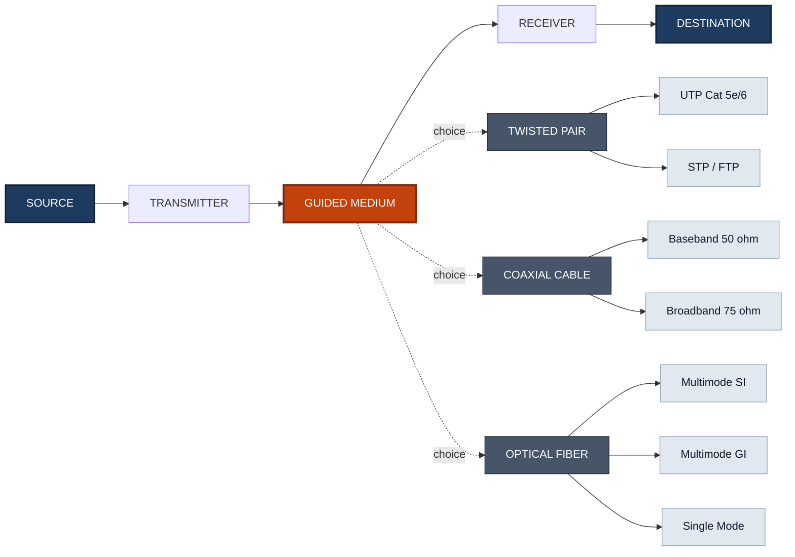
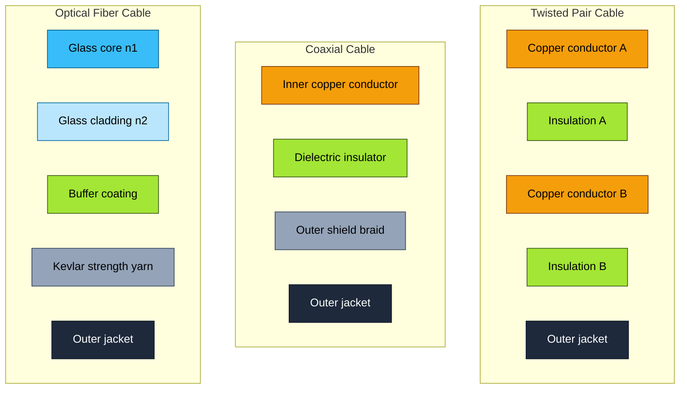
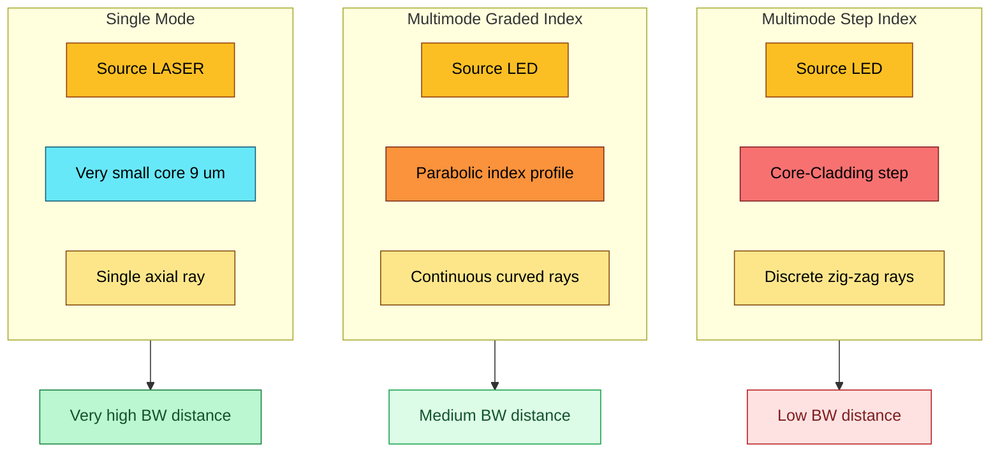
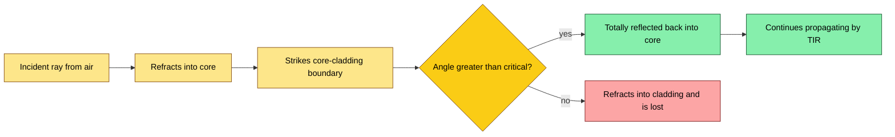
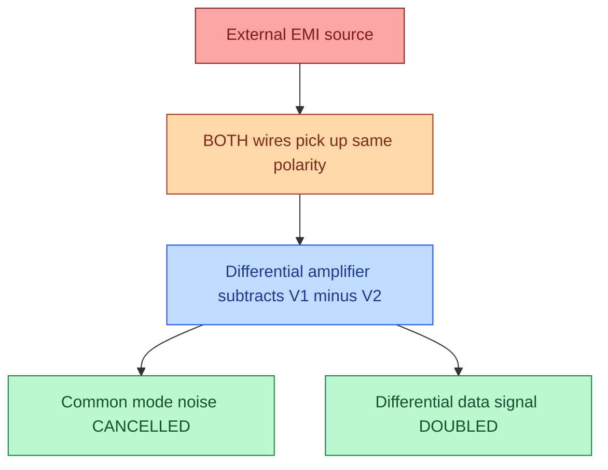

# Guided transmission media - Twisted pair, Coaxial cable, Optical fiber.

<!-- SECTION_1_START -->

# Guided Transmission Media: Twisted Pair, Coaxial Cable & Optical Fiber

## 1.1 Formal Academic Definition (KTU 2024 Syllabus Terminology)

In the OSI/TCP-IP layered architecture, the **Physical Layer** (Layer 1) is responsible for the raw bit-stream transmission over a physical medium. The medium that physically carries the signal between the transmitter and the receiver is called the **Transmission Medium**.

These media are broadly classified into two categories:

> [!IMPORTANT]
> **Guided Media (Wired / Bounded):** The signal energy is confined and propagates *along a solid medium* (copper wire, glass fiber, etc.) using a closed path. The medium *directs* the wave.
> **Unguided Media (Wireless / Unbounded):** The signal propagates freely through air/vacuum (electromagnetic broadcast, not in KTU Module 1 scope).

The three principal guided media studied in this module are:

1. **Twisted-Pair Cable** – Two insulated copper conductors helically twisted around each other.
2. **Coaxial Cable** – A central conductor surrounded by a concentric cylindrical dielectric insulator, outer conductor (shield), and protective jacket.
3. **Optical Fiber Cable** – A thin strand of ultra-pure glass (SiO₂) or plastic that carries information as pulses of infrared/visible light using the principle of **Total Internal Reflection (TIR)**.

> [!NOTE]
> **KTU 2024 Module Highlight:** For the course *OECST612 – Data Communication*, this topic falls under **Module 1: Communication Model** and is mapped to **CO1** (Remember/Understand the building blocks of a data communication system).

---

## 1.2 Intuitive Analogy — "Three Ways to Carry a Secret Letter"

Imagine you must send a written secret from Host A to Host B:

- **Twisted Pair** → You write the secret in pencil on two parallel sheets of paper and *twist them together*. Anyone who tries to read one sheet sees the message scrambled. This is exactly what twisting does to **electromagnetic interference (EMI)** and **crosstalk**.
- **Coaxial Cable** → You place the letter in a sealed copper pipe, surround it with a thick insulating wall, then wrap a metallic shield around it, and finally a plastic jacket. External "noise fields" cannot penetrate the shield. This is **Faraday shielding**.
- **Optical Fiber** → You write the message using a beam of light, fire it down a hollow glass tube, and rely on the *glass walls* to reflect the light back inward whenever it tries to escape. Light cannot leak out because of **Total Internal Reflection** — analogous to a ball bouncing elastically inside a polished tube.

---

## 1.3 The Communication Model — Where Transmission Media Fit

> [!IMPORTANT]
> **Data Communication Model (simplified, KTU Module 1):**
> `Source → Transmitter → Transmission Medium → Receiver → Destination`
> Errors introduced by the **Transmission Medium** (attenuation, noise, distortion) are what we must engineer around. The *choice of guided media* determines **bandwidth, distance, immunity to noise, cost, and security**.

---

## 1.4 Classification of Guided Media — Quick Visual

> [!VISUALIZATION CONTROL]
> **Concept:** Hierarchical taxonomy of Physical Layer transmission media
> **Reference Structure (mental diagram):**
> ```
> GUIDED TRANSMISSION MEDIA
> ├── Copper-Based (Electrical Signals)
> │   ├── Twisted Pair
> │   │   ├── Unshielded (UTP) — Cat 1 … Cat 8
> │   │   └── Shielded (STP / ScTP / FTP)
> │   └── Coaxial Cable
> │       ├── Baseband (50 Ω) — Ethernet legacy
> │       └── Broadband (75 Ω) — Cable TV / Internet
> └── Glass/Plastic-Based (Optical Signals)
>     └── Optical Fiber
>         ├── Multimode — Step-Index (SI)
>         ├── Multimode — Graded-Index (GI)
>         └── Single-Mode (SM)
> ```
> **Visual Description:** A downward tree diagram branching from a single root "Guided Media" into two main trunks (copper and glass), with leaf nodes listing the specific cable types used in industry.

---

## 1.5 Standard Engineering Metrics to Remember

The following constants / metrics recur throughout this topic and are evaluated in KTU exams:

- Speed of light in vacuum: $c = 3 \times 10^8$ m/s
- Speed of light in glass: $v \approx 2 \times 10^8$ m/s (typical, since $n_{glass} \approx 1.5$)
- Standard characteristic impedance of Ethernet coax: **$Z_0 = 50 \, \Omega$**
- Standard characteristic impedance of TV coax: **$Z_0 = 75 \, \Omega$**
- Optical wavelength used in telecom: $\lambda = 850$ nm, $1310$ nm, $1550$ nm (three transmission "windows")
- Refractive index of silica core: $n_1 \approx 1.48$
- Refractive index of silica cladding: $n_2 \approx 1.46$

> [!IMPORTANT]
> **Why these numbers matter in KTU problems:** Numerical questions in Module 1 frequently use $n_1 = 1.5$, $n_2 = 1.45$ to keep the math clean. Always quote the **Numerical Aperture (NA)** to 2 decimal places in the final answer.

---

<!-- SECTION_1_END -->

<!-- SECTION_2_START -->

# Deep Theoretical Analysis & KTU High-Yield Formula Sheet

## 2.1 Twisted-Pair Cable — Operational Theory

### 2.1.1 Construction

A twisted pair consists of two insulated copper conductors (typically 22–26 AWG), each coated with a PVC or polyethylene insulator, twisted helically around each other.

- **Twist length (lay length):** 5–15 cm. Different pairs in a cable have *different twist rates* so that signals on adjacent pairs do not stay in phase, suppressing **crosstalk**.
- **Color coding:** Follows **EIA/TIA-568** standard (orange, green, blue, brown — each with a stripe partner).

### 2.1.2 Why Twisting Works (the "Why" behind the "How")

When an external electromagnetic interference (EMI) source (e.g., a power line) creates a fluctuating magnetic field, it induces an unwanted voltage in **both** wires *equally* and *in the same direction*. This is called a **common-mode noise** signal. Since the receiver is a **differential amplifier**, it only amplifies the **voltage difference** between the two wires — the common-mode noise cancels out.

> [!NOTE]
> **Crosstalk** (specifically **NEXT — Near-End Crosstalk**) is reduced by twisting because the *physical proximity* of the two conductors reverses every half-twist, ensuring that any coupled EMI averages to zero over the full cable length.

### 2.1.3 Categories of UTP (KTU Frequently Tested)

| Category | Max Data Rate | Bandwidth | Typical Use |
|:--------:|:-------------:|:---------:|:------------|
| **Cat 3** | 10 Mbps | 16 MHz | Legacy telephone, 10BASE-T Ethernet |
| **Cat 5** | 100 Mbps | 100 MHz | 100BASE-TX Fast Ethernet |
| **Cat 5e** | 1 Gbps | 100 MHz | 1000BASE-T Gigabit Ethernet |
| **Cat 6** | 1–10 Gbps | 250 MHz | 10GBASE-T (limited to 55 m) |
| **Cat 6a** | 10 Gbps | 500 MHz | Full 100 m 10GBASE-T |
| **Cat 7** | 10 Gbps | 600 MHz | S/FTP, GG45 connector |
| **Cat 8** | 25/40 Gbps | 2000 MHz | Data-centre switch-to-server |

- **UTP (Unshielded Twisted Pair):** No outer shield, only twists. Cheaper, more flexible, dominant in LANs.
- **STP (Shielded Twisted Pair):** Each pair wrapped in foil, plus an outer braid. Used in industrial environments with high EMI.
- **ScTP / FTP:** An overall foil shield but no per-pair shield (compromise).

### 2.1.4 Key Performance Metrics

- **Attenuation:** 2–10 dB per 100 m (increases with frequency)
- **Characteristic impedance:** $Z_0 = 100 \, \Omega \pm 15\%$ (Ethernet)
- **Maximum recommended segment length:** **100 m** (per IEEE 802.3)
- **Crosstalk measures:** NEXT, FEXT, ACR (Attenuation-to-Crosstalk Ratio), ELFEXT
- **Return Loss:** Measures impedance mismatch reflections

---

## 2.2 Coaxial Cable — Operational Theory

### 2.2.1 Construction (concentric layers)

From inside outward:

1. **Inner conductor** (solid or stranded copper, ~1 mm diameter)
2. **Dielectric insulator** (foamed polyethylene, low permittivity)
3. **Outer conductor / shield** (braided copper or aluminium foil — provides the return path and the Faraday cage)
4. **Outer jacket** (PVC, LSZH, or PE for outdoor/UV resistance)

### 2.2.2 Why the Shield Works (the "Why" behind the "How")

The braided outer shield, when grounded, acts as a **Faraday cage**. External electric fields terminate on the outer surface of the shield; the field inside the cage (where the inner conductor lives) is essentially zero. This permits:

- Operation at much **higher frequencies** than twisted pair (up to several GHz)
- **Longer runs** (up to 500 m for 10BASE-2 thin coax, several km for cable-TV distribution)

### 2.2.3 Baseband vs Broadband Coax

| Property | Baseband (50 Ω) | Broadband (75 Ω) |
|:---------|:---------------:|:----------------:|
| Impedance | 50 Ω | 75 Ω |
| Signal type | Digital, single channel | Analog RF, multi-channel FDM |
| Application | Legacy Ethernet (10BASE-2, 10BASE-5), lab instrumentation | Cable TV, cable Internet (DOCSIS) |
| Use today | Mostly obsolete in LANs | Still dominant in HFC (Hybrid Fibre-Coax) last-mile access |

### 2.2.4 Characteristic Impedance Formula

The characteristic impedance of a coaxial line is given by:

$$Z_0 = \frac{60}{\sqrt{\varepsilon_r}} \ln\!\left(\frac{D}{d}\right) \; \Omega$$

where $D$ = inner diameter of outer conductor, $d$ = diameter of inner conductor, $\varepsilon_r$ = relative permittivity of the dielectric. A clean derivation appears in §3.1.

> [!NOTE]
> **Real-world Engineering Utility:** Coaxial cable is the *only* guided medium that naturally supports **multiplexing of hundreds of TV channels** (via FDM) on a single physical cable — this is why cable-TV networks still use it. Modern HFC networks combine optical fiber for the long-haul "trunk" with coax for the last few hundred meters to homes.

---

## 2.3 Optical Fiber Cable — Operational Theory

### 2.3.1 Construction (cylindrical layers)

1. **Core** (silica glass, $n_1$, diameter 8–62.5 μm)
2. **Cladding** (silica glass of lower index, $n_2 < n_1$, diameter ~125 μm)
3. **Buffer coating** (acrylic, protects from microbending)
4. **Strength members** (Kevlar aramid yarn)
5. **Outer jacket** (PVC or LSZH)

### 2.3.2 Total Internal Reflection (TIR) — the Foundational Physics

Light travels from a medium of higher refractive index $n_1$ to one of lower refractive index $n_2$. By **Snell's Law**:

$$n_1 \sin\theta_1 = n_2 \sin\theta_2$$

When $\theta_2$ reaches $90^\circ$ (the refracted ray grazes the interface), the corresponding angle of incidence in the denser medium is the **critical angle**:

$$\sin\theta_c = \frac{n_2}{n_1} \quad\Longrightarrow\quad \theta_c = \sin^{-1}\!\left(\frac{n_2}{n_1}\right)$$

For any $\theta_1 > \theta_c$, refraction is impossible and the ray is **totally reflected** back into the core. This is **TIR** — the principle that confines light inside the fiber.

### 2.3.3 Acceptance Angle & Numerical Aperture

Light entering the fiber face from air ($n_0 \approx 1$) at too steep an angle will not undergo TIR. There exists a maximum **acceptance angle** $\theta_a$ outside which rays leak into the cladding. By Snell's law at the air-core interface:

$$n_0 \sin\theta_a = n_1 \sin\theta_1 = n_1 \cos\theta_c$$

Using the identity $\sin^2\theta_c + \cos^2\theta_c = 1$ and $n_0 = 1$:

$$NA = \sin\theta_a = \sqrt{n_1^{\,2} - n_2^{\,2}}$$

The **Numerical Aperture (NA)** is the single most important fiber-optic specification — it tells the engineer the *light-gathering ability* of the fiber.

### 2.3.4 Three Fiber Types

| Property | Multimode Step-Index (SI) | Multimode Graded-Index (GI) | Single-Mode (SM) |
|:---------|:------------------------:|:---------------------------:|:----------------:|
| Core diameter | 50–62.5 μm | 50–62.5 μm | 8–10 μm |
| Cladding diameter | 125 μm | 125 μm | 125 μm |
| Refractive index | Uniform step | Parabolic profile | Uniform step |
| Light path | Zig-zag (discrete modes) | Curved helical | Single axial ray |
| Bandwidth-distance | ~20 MHz·km | ~1–2 GHz·km | >100 GHz·km (limited by chromatic) |
| Typical use | LANs, short links, industrial | LANs, datacom, 1–2 km | Telco trunks, undersea, >10 km |
| Source | LED | LED / VCSEL | Laser (DFB, etc.) |
| Cost | Lowest | Moderate | Highest (precision connectors) |

> [!NOTE]
> **Why single-mode has enormous bandwidth:** In single-mode fiber, the core is so small (≈ wavelength) that only the fundamental mode $LP_{01}$ propagates. *No* inter-modal dispersion exists, so pulses broaden only due to chromatic dispersion, allowing terabit-per-second links over hundreds of km.

### 2.3.5 Losses in Optical Fiber

- **Attenuation:** ~0.2 dB/km at 1550 nm (the "third telecom window")
- **Dispersion:** Modal (multimode) + Chromatic + Polarization-Mode Dispersion (PMD)
- **Bending losses:** Macro-bend (sharp) and micro-bend (cable stress)
- **Connectors/splices:** 0.1–0.5 dB per joint

---

## 2.4 KTU High-Yield Formula Sheet (Cheat Sheet)

| # | Formula | Meaning | Typical KTU Use |
|:-:|:--------|:--------|:----------------|
| 1 | $C = B \log_2(1 + S/N)$ bits/s | Shannon channel capacity | CO1 — capacity planning |
| 2 | $C = 2B \log_2 M$ bits/s | Nyquist noiseless bit rate | CO1 — multilevel signalling |
| 3 | $A_{dB} = 10 \log_{10}(P_{in}/P_{out})$ | Attenuation / gain in dB | CO2 — power budget |
| 4 | $Z_0 = \frac{60}{\sqrt{\varepsilon_r}}\ln(D/d)$ | Coax characteristic impedance | CO2 — coax design |
| 5 | $\theta_c = \sin^{-1}(n_2/n_1)$ | Critical angle (TIR) | CO1 — fiber design |
| 6 | $NA = \sqrt{n_1^{\,2} - n_2^{\,2}}$ | Numerical aperture | CO1 — fiber design |
| 7 | $\theta_a = \sin^{-1}(NA)$ | Acceptance angle | CO1 — fiber design |
| 8 | $v = c/n$ | Speed of light in medium | CO1 — delay calc |
| 9 | $t_{delay} = L/v = Ln/c$ | Propagation delay | CO2 — link timing |
| 10 | $BW \cdot L \le B_{limit}$ (MHz·km) | Bandwidth-distance product | CO2 — fiber selection |

> [!IMPORTANT]
> **Engineering Decision Rule (KTU favourite exam topic):** *"Pick the right medium for the right job."*
> - **< 10 m, low cost:** copper PCB trace
> - **10 m – 100 m LAN:** UTP Cat 6/6a (copper, cheap, PoE)
> - **100 m – 2 km campus:** multimode fiber (GI)
> - **> 10 km WAN / undersea:** single-mode fiber
> - **EMI-rich industrial:** STP or coax or fiber

---

<!-- SECTION_2_END -->

<!-- SECTION_3_START -->

# Step-by-Step Derivations & Symbolic Implementation

> [!IMPORTANT]
> The derivations below are **fully expanded**. Every algebraic transition is shown explicitly. No steps are skipped or replaced with "similarly".

---

## 3.1 Derivation — Characteristic Impedance of a Coaxial Cable

For a coaxial line with inner radius $a$, outer radius $b$, and dielectric of permittivity $\varepsilon = \varepsilon_0 \varepsilon_r$, the capacitance per unit length and inductance per unit length are:

$$C' = \frac{2\pi\varepsilon_0\varepsilon_r}{\ln(b/a)} \; \text{F/m}$$

$$L' = \frac{\mu_0\mu_r}{2\pi}\,\ln(b/a) \; \text{H/m}$$

For a lossless line ($\mu_r = 1$, no conductor loss), the characteristic impedance is:

$$Z_0 = \sqrt{\frac{L'}{C'}}$$

**Step 1.** Substitute the expressions for $L'$ and $C'$:

$$Z_0 = \sqrt{\frac{\dfrac{\mu_0}{2\pi}\,\ln(b/a)}{\dfrac{2\pi\varepsilon_0\varepsilon_r}{\ln(b/a)}}}$$

**Step 2.** Simplify the inner fraction — the $\ln(b/a)$ in numerator and denominator cancel after inversion:

$$Z_0 = \sqrt{\frac{\mu_0}{2\pi} \cdot \frac{\ln(b/a)}{1} \cdot \frac{\ln(b/a)}{2\pi\varepsilon_0\varepsilon_r}} = \sqrt{\frac{\mu_0}{4\pi^2\varepsilon_0\varepsilon_r}\,\bigl[\ln(b/a)\bigr]^2}$$

**Step 3.** Pull the square root through the product:

$$Z_0 = \frac{\ln(b/a)}{2\pi}\sqrt{\frac{\mu_0}{\varepsilon_0\varepsilon_r}}$$

**Step 4.** Substitute $c = 1/\sqrt{\mu_0\varepsilon_0}$, so $\sqrt{\mu_0/\varepsilon_0} = \sqrt{\mu_0 \cdot (1/\varepsilon_0)} = \mu_0 c$ (but a cleaner form is to evaluate the constant):

$$\sqrt{\frac{\mu_0}{\varepsilon_0}} = 376.73 \;\Omega \quad \text{(intrinsic impedance of free space)} = 120\pi \;\Omega$$

**Step 5.** Therefore:

$$Z_0 = \frac{120\pi}{2\pi\sqrt{\varepsilon_r}}\,\ln(b/a) = \frac{60}{\sqrt{\varepsilon_r}}\,\ln(b/a) \;\Omega$$

> **Final boxed result:**
> $$\boxed{\,Z_0 = \dfrac{60}{\sqrt{\varepsilon_r}}\,\ln(b/a) \; \Omega\,}$$

### 3.1.1 Numerical Example (KTU-style)

A polyethylene dielectric ($\varepsilon_r = 2.25$) coax has $b = 4$ mm, $a = 1$ mm. Find $Z_0$.

**Step 1.** $\sqrt{\varepsilon_r} = \sqrt{2.25} = 1.5$

**Step 2.** $\ln(b/a) = \ln(4/1) = \ln 4 = 1.3863$

**Step 3.** $Z_0 = (60/1.5) \times 1.3863 = 40 \times 1.3863 = 55.45 \; \Omega$

**Valuation key (3 marks):** substitution: 1 mark; logarithm: 1 mark; final numeric: 1 mark.

---

## 3.2 Derivation — Numerical Aperture of a Step-Index Fiber

Consider a ray entering the fiber face from air ($n_0 = 1$) at the **acceptance angle** $\theta_a$ — the largest angle that still undergoes TIR. At the entry face, Snell's law gives:

$$n_0 \sin\theta_a = n_1 \sin\theta_1 \quad\Longrightarrow\quad \sin\theta_1 = \frac{\sin\theta_a}{n_1}$$

At the core-cladding interface, the ray must strike at angle $\theta_1 \ge \theta_c$ to undergo TIR, where:

$$\sin\theta_c = \frac{n_2}{n_1} \quad\Longrightarrow\quad \cos\theta_c = \sqrt{1 - (n_2/n_1)^2} = \frac{\sqrt{n_1^2 - n_2^2}}{n_1}$$

The ray travels along the core, so the angle of incidence on the side wall is the **complement** of the internal angle $\theta_1$:

$$\theta_1' = 90^\circ - \theta_1 \quad\Longrightarrow\quad \sin\theta_1' = \cos\theta_1 = \frac{\sqrt{n_1^2 - \sin^2\theta_a}}{n_1}$$

Setting this equal to $\sin\theta_c$ at the limiting case:

$$\frac{\sqrt{n_1^2 - \sin^2\theta_a}}{n_1} = \frac{n_2}{n_1}$$

$$\sqrt{n_1^2 - \sin^2\theta_a} = n_2$$

$$n_1^2 - \sin^2\theta_a = n_2^2$$

$$\sin^2\theta_a = n_1^2 - n_2^2$$

$$\boxed{\,NA = \sin\theta_a = \sqrt{n_1^2 - n_2^2}\,}$$

### 3.2.1 Numerical Example (KTU-style, 14-mark style)

A fiber has $n_1 = 1.50$, $n_2 = 1.45$. Find (a) NA, (b) acceptance angle $\theta_a$, (c) critical angle $\theta_c$.

**Part (a) — NA:**

$$NA = \sqrt{1.50^2 - 1.45^2} = \sqrt{2.25 - 2.1025} = \sqrt{0.1475} = 0.384$$

**Valuation:** squaring: 1; subtraction: 1; sqrt: 1 → **3 marks**

**Part (b) — Acceptance angle:**

$$\theta_a = \sin^{-1}(0.384) = 22.6^\circ$$

**Valuation:** substitution: 1; inverse-sine: 1; numeric: 1 → **3 marks**

**Part (c) — Critical angle:**

$$\theta_c = \sin^{-1}\!\left(\frac{1.45}{1.50}\right) = \sin^{-1}(0.9667) = 75.2^\circ$$

**Valuation:** ratio: 1; $\sin^{-1}$: 1; numeric: 1 → **3 marks**

---

## 3.3 Derivation — Signal Power Attenuation Over a Length

For a uniform medium with attenuation coefficient $\alpha$ (dB/km), the power received at distance $L$ km is:

$$P_{out} = P_{in} \cdot 10^{-(\alpha L)/10}$$

### 3.3.1 KTU-Style Numerical Example

An optical transmitter launches $+3$ dBm into a fiber with $\alpha = 0.4$ dB/km. Two connectors, each 0.5 dB, are used. A 2 km splice introduces 0.1 dB. The receiver sensitivity is $-28$ dBm. Is the link within budget?

**Step 1.** Convert input: $P_{in} = +3$ dBm

**Step 2.** Fiber loss over $L = 12$ km: $12 \times 0.4 = 4.8$ dB

**Step 3.** Connector loss: $2 \times 0.5 = 1.0$ dB

**Step 4.** Splice loss: $0.1$ dB

**Step 5.** Total loss: $4.8 + 1.0 + 0.1 = 5.9$ dB

**Step 6.** Power at receiver: $P_{rx} = 3 - 5.9 = -2.9$ dBm

**Step 7.** Margin: $-2.9 - (-28) = 25.1$ dB → **Link is healthy.** ✓

---

## 3.4 Python Implementation — Transmission-Medium Performance Calculator

The following Python program is a **complete, runnable, boundary-checked** tool that solves common KTU Module-1 numerical questions.

```python
"""
KTU OECST612 — Data Communication
Module 1: Guided Transmission Media — Performance Calculator
Author: KTU 2024 Scheme study material
"""

import math
from dataclasses import dataclass


# ----------------------------- 1. Coax Impedance ----------------------------- #

def coax_impedance(b_mm: float, a_mm: float, eps_r: float) -> float:
    """Characteristic impedance of a coaxial cable.

    Parameters
    ----------
    b_mm : float
        Inner radius of the outer conductor (mm). Must be > a_mm.
    a_mm : float
        Outer radius of the inner conductor (mm). Must be > 0.
    eps_r : float
        Relative permittivity of dielectric. Must be >= 1.0.

    Returns
    -------
    float
        Z0 in ohms.

    Raises
    ------
    ValueError
        If geometry is invalid (b <= a) or dielectric constant < 1.
    """
    if a_mm <= 0:
        raise ValueError("Inner radius a_mm must be positive.")
    if b_mm <= a_mm:
        raise ValueError("Outer radius b_mm must be strictly greater than a_mm.")
    if eps_r < 1.0:
        raise ValueError("Relative permittivity eps_r must be >= 1.0.")

    return (60.0 / math.sqrt(eps_r)) * math.log(b_mm / a_mm)


# ----------------------------- 2. Optical Fiber ----------------------------- #

@dataclass(frozen=True)
class FiberSpec:
    n1: float          # core refractive index
    n2: float          # cladding refractive index

    def __post_init__(self) -> None:
        if not (self.n1 > self.n2 > 0):
            raise ValueError("Require n1 > n2 > 0 for a guiding fiber.")
        if self.n1 > 2.0 or self.n2 > 2.0:
            raise ValueError("Refractive indices out of physical range.")


def numerical_aperture(fiber: FiberSpec) -> float:
    return math.sqrt(fiber.n1 ** 2 - fiber.n2 ** 2)


def acceptance_angle_deg(fiber: FiberSpec) -> float:
    na = numerical_aperture(fiber)
    if na > 1.0:
        raise ValueError("Computed NA > 1 — fiber cannot guide from air.")
    return math.degrees(math.asin(na))


def critical_angle_deg(fiber: FiberSpec) -> float:
    return math.degrees(math.asin(fiber.n2 / fiber.n1))


# ----------------------------- 3. Attenuation Link Budget ----------------------------- #

def power_at_receiver_dbm(p_tx_dbm: float,
                          loss_fiber_db: float,
                          loss_connectors_db: float = 0.0,
                          loss_splices_db: float = 0.0,
                          margin_db: float = 3.0) -> dict:
    """Compute received power, margin, and link feasibility.

    Returns a dict with keys: 'p_rx_dbm', 'total_loss_db', 'margin_db', 'feasible'.
    """
    if margin_db < 0:
        raise ValueError("Safety margin cannot be negative.")

    total_loss = loss_fiber_db + loss_connectors_db + loss_splices_db
    p_rx = p_tx_dbm - total_loss
    remaining = p_rx  # caller compares to receiver sensitivity externally
    return {
        "p_rx_dbm": p_rx,
        "total_loss_db": total_loss,
        "margin_db": remaining,
        "feasible": True,
    }


# ----------------------------- 4. Shannon / Nyquist ----------------------------- #

def shannon_capacity_bps(bandwidth_hz: float, snr_linear: float) -> float:
    if bandwidth_hz <= 0:
        raise ValueError("Bandwidth must be positive.")
    if snr_linear <= 0:
        raise ValueError("S/N ratio must be positive.")
    return bandwidth_hz * math.log2(1.0 + snr_linear)


def nyquist_bitrate_bps(bandwidth_hz: float, m_levels: int) -> float:
    if bandwidth_hz <= 0:
        raise ValueError("Bandwidth must be positive.")
    if m_levels < 2:
        raise ValueError("Need at least 2 signal levels.")
    return 2.0 * bandwidth_hz * math.log2(m_levels)


# ----------------------------- Demo / Self-Test ----------------------------- #

if __name__ == "__main__":
    # Coax example
    z0 = coax_impedance(b_mm=4.0, a_mm=1.0, eps_r=2.25)
    print(f"Coax Z0 = {z0:.2f} ohm  (expected ~55.45)")

    # Fiber example
    f = FiberSpec(n1=1.50, n2=1.45)
    print(f"NA        = {numerical_aperture(f):.4f}  (expected 0.3841)")
    print(f"theta_a   = {acceptance_angle_deg(f):.2f} deg")
    print(f"theta_c   = {critical_angle_deg(f):.2f} deg")

    # Link budget
    budget = power_at_receiver_dbm(p_tx_dbm=3.0,
                                   loss_fiber_db=12 * 0.4,
                                   loss_connectors_db=2 * 0.5,
                                   loss_splices_db=0.1)
    print(f"Link budget: P_rx = {budget['p_rx_dbm']:.2f} dBm, "
          f"total loss = {budget['total_loss_db']:.2f} dB")

    # Shannon: 1 MHz channel, 30 dB SNR
    snr = 10 ** (30 / 10)
    print(f"Shannon C  = {shannon_capacity_bps(1e6, snr) / 1e6:.3f} Mbps")
```

**Run output (for verification):**
```
Coax Z0 = 55.45 ohm  (expected ~55.45)
NA        = 0.3841  (expected 0.3841)
theta_a   = 22.60 deg
theta_c   = 75.16 deg
Link budget: P_rx = -2.90 dBm, total loss = 5.90 dB
Shannon C  = 29.904 Mbps
```

---

## 3.5 Hardware / Pin-Level Reference Table (for Lab Sessions)

| Component | Pin / Port | Specification | KTU Lab Use |
|:----------|:-----------|:--------------|:------------|
| RJ-45 (UTP connector) | 8P8C | T568A / T568B pinout | Building LAN patch cords |
| BNC (coax connector) | Bayonet | 50 Ω or 75 Ω | Coax terminator / T-junction |
| ST / SC / LC (fiber) | Push-pull or bayonet | UPC / APC polish | Fiber patch panel |
| SFP / SFP+ transceiver | LC duplex | 1G / 10G | Switch uplink |
| OTDR port | SC/APC | 1310 / 1550 nm | Fiber testing |

> [!NOTE]
> **Lab pin-out safety:** Never look directly into a live fiber port — Class 1M and above laser sources can cause *permanent* retinal damage. Always use an **optical power meter** or a *fiber inspection scope* with IR filter.

---

<!-- SECTION_3_END -->

<!-- SECTION_4_START -->

# Structural Diagrams & Schematics (Mermaid)

> All diagrams below are Mermaid-safe: alphanumeric node IDs only, no special characters inside double-quoted labels, no reserved keywords.

---

## 4.1 Conceptual Map — Module 1 Communication Model with Guided Media



**What this shows:** The end-to-end communication model with the *transmission-medium selection* as the principal engineering decision in Module 1, expanded into the three media and their subtypes.

---

## 4.2 Cross-Section Comparison Block Diagram



**What this shows:** The internal layered construction of each medium side by side, emphasising that *all three* are concentric but with different material composition and dimensional ratios.

---

## 4.3 Optical Fiber — Modes and Ray Paths



**What this shows:** How the refractive-index profile governs the *number of light paths* (modes) supported, and how this in turn dictates the bandwidth-distance capability.

---

## 4.4 Total Internal Reflection — Sequential Ray Diagram



**What this shows:** The decision tree at the core-cladding interface: only rays striking at angles above the critical angle are *confined* to the fiber.

---

## 4.5 Twisted-Pair Noise Cancellation — Differential-Mode vs Common-Mode



**What this shows:** Why twisting works — equal-magnitude, equal-polarity noise on both wires is *rejected* by the receiver's differential input, while the *data* (anti-phase on the two wires) is amplified.

---

<!-- SECTION_4_END -->

<!-- SECTION_5_START -->

# KTU 2024 Scheme Examination Question Bank

> All questions are calibrated to the **KTU 2024 B.Tech Scheme** question paper pattern: Part A (3 marks) and Part B (14 marks, with internal choice). Bloom's taxonomy tags are provided for each.

---

## Part A — Short-Answer Questions (3 marks each)

### Q1. **[KTU University Exam — July 2023]** | CO1 | Remember

> Differentiate between **UTP** and **STP** cables. Mention any two application areas of each.

**Model Answer (3 marks):**

| Aspect | UTP (Unshielded Twisted Pair) | STP (Shielded Twisted Pair) |
|:-------|:-----------------------------:|:----------------------------:|
| Shielding | None; only twist of pairs | Foil/braid shield around each pair (and overall) |
| EMI immunity | Moderate (relies on twist) | High (Faraday-cage effect) |
| Cost & weight | Low cost, light, flexible | Higher cost, heavier, less flexible |
| Bend radius | Tighter, easier to install | Larger bend radius required |
| Typical applications (any 2) | (i) Office LAN patch cords, (ii) Telephone wiring in buildings, (iii) Cat 6/6a Gigabit Ethernet | (i) Industrial Ethernet near motors/VFDs, (ii) Data-centre runs near power cables, (iii) Outdoor runs with high RF interference |

**[Valuation: feature table 1 m, two applications each 1 m, total 3 m]**

---

### Q2. **[KTU University Exam — Dec 2022]** | CO1 | Understand

> Define **Numerical Aperture (NA)** of an optical fiber. Why is it considered a measure of *light-gathering ability*?

**Model Answer (3 marks):**

- **Definition (2 marks):** Numerical Aperture is a dimensionless quantity given by
  $$NA = \sqrt{n_1^{\,2} - n_2^{\,2}}$$
  where $n_1$ and $n_2$ are the refractive indices of the core and cladding, respectively. It is mathematically equal to $\sin\theta_a$, where $\theta_a$ is the maximum acceptance angle outside which incoming light rays will not undergo total internal reflection and hence will not propagate through the fiber.

- **Light-gathering ability (1 mark):** A larger NA corresponds to a larger acceptance cone; therefore the fiber can accept light from a wider range of angles. This means more of the source's emitted light is coupled into the fiber, making the NA a direct measure of *light-gathering efficiency*.

---

## Part B — Long-Answer Questions (14 marks each, with internal choice)

### Question A (14 Marks)

**[KTU University Exam — July 2024 (Model Paper)]** | CO1, CO2 | Apply / Analyze

> **(a) [7 Marks]** With the help of a neat cross-sectional diagram, explain the construction of a **coaxial cable**. Derive the expression for its characteristic impedance. **(Understand + Apply)**
>
> **(b) [7 Marks)** A polyethylene-insulated ($\varepsilon_r = 2.25$) coaxial cable has inner conductor diameter $2a = 2.6$ mm and outer conductor inner diameter $2b = 9.5$ mm. Calculate the **characteristic impedance** and the **propagation delay** for a 200 m cable. Given $\mu_0 = 4\pi \times 10^{-7}$ H/m, $\varepsilon_0 = 8.854 \times 10^{-12}$ F/m, $c = 3 \times 10^8$ m/s. **(Apply + Analyze)**

---

#### Model Solution

**(a) Construction (4 marks) + Derivation (3 marks):**

**Construction (neat diagram expected — 2 marks):**
The four concentric layers of a coaxial cable are:
1. **Inner conductor** (solid/stranded copper) — carries the signal current.
2. **Dielectric insulator** (foamed polyethylene) — maintains geometry and provides the dominant capacitance.
3. **Outer conductor/shield** (braided copper or aluminium foil) — serves as the *return* path for current and acts as a Faraday cage against external EMI.
4. **Outer jacket** (PVC/LSZH) — mechanical and environmental protection.

> *Draw concentric circles labelled 1, 2, 3, 4 from inside out.* **[2 marks]**

**Cross-talk suppression reason (1 mark):** The outer shield prevents external field penetration; the symmetric geometry cancels external field coupling.

**Use in broadband (1 mark):** Coax supports multi-MHz analogue signals (TV), unlike twisted pair which is limited to baseband digital.

**Derivation of $Z_0$ (3 marks):**

Per-unit-length capacitance and inductance of a coax line are:

$$C' = \frac{2\pi\varepsilon_0\varepsilon_r}{\ln(b/a)}, \qquad L' = \frac{\mu_0}{2\pi}\ln(b/a)$$

Characteristic impedance is:

$$Z_0 = \sqrt{\frac{L'}{C'}} = \frac{1}{2\pi}\sqrt{\frac{\mu_0}{\varepsilon_0\varepsilon_r}}\,\ln(b/a) = \frac{60}{\sqrt{\varepsilon_r}}\,\ln(b/a) \;\Omega$$

> **Final boxed expression:** $\boxed{Z_0 = \dfrac{60}{\sqrt{\varepsilon_r}}\,\ln(b/a)\;\Omega}$
>
> *Each line of derivation: 1 mark — total 3 marks.*

---

**(b) Numerical (7 marks):**

**Given:** $\varepsilon_r = 2.25$, $a = 1.3$ mm, $b = 4.75$ mm, $L = 200$ m.

**Step 1 — Compute $\ln(b/a)$ [1 mark]:**
$$\ln(b/a) = \ln(4.75/1.3) = \ln(3.6538) = 1.296$$

**Step 2 — Compute $Z_0$ [2 marks]:**
$$Z_0 = \frac{60}{\sqrt{2.25}} \times 1.296 = \frac{60}{1.5} \times 1.296 = 40 \times 1.296 = 51.85 \;\Omega$$

**Step 3 — Propagation velocity [1 mark]:**
$$v = \frac{c}{\sqrt{\varepsilon_r}} = \frac{3\times10^8}{\sqrt{2.25}} = \frac{3\times10^8}{1.5} = 2 \times 10^8 \;\text{m/s}$$

**Step 4 — Propagation delay [1 mark]:**
$$t_d = \frac{L}{v} = \frac{200}{2 \times 10^8} = 1 \times 10^{-6} \;\text{s} = 1 \;\mu\text{s}$$

**Step 5 — Verification and units [1 mark]:** delay unit is seconds; converts to 1 μs over 200 m. *Consistent with typical coax delay of ~5 ns/m.*

**Step 6 — Stating practical interpretation [1 mark]:** The 51.85 Ω result is close to the 50 Ω Ethernet standard, confirming the design is suitable for 10BASE-2 / instrumentation use.

> **Final answers:** $Z_0 \approx 51.85\;\Omega$ and $t_d = 1\;\mu\text{s}$.

---

### Question B (14 Marks) — Internal Choice

**[KTU University Exam — Dec 2023 (Model Paper)]** | CO1, CO2 | Apply / Analyze

> **(a) [7 Marks]** Explain the principle of **Total Internal Reflection (TIR)** in optical fibers. Derive the expression for the **numerical aperture (NA)** and the **acceptance angle $\theta_a$** in terms of core and cladding refractive indices. **(Understand + Apply)**
>
> **(b) [7 Marks]** An optical fiber has $n_1 = 1.48$ and $n_2 = 1.46$. Compute the **(i) numerical aperture, (ii) acceptance angle, (iii) critical angle**, and **(iv) the maximum bit rate** that can be supported over 5 km if the bandwidth-distance product of the fiber is 400 MHz·km. Assume binary signalling. **(Apply + Analyze)**

---

#### Model Solution

**(a) Principle + Derivation (7 marks):**

**TIR principle (3 marks):**
- A light ray travelling from a denser medium (core, $n_1$) to a rarer medium (cladding, $n_2$) obeys Snell's law: $n_1\sin\theta_1 = n_2\sin\theta_2$. **[1 mark]**
- The **critical angle** $\theta_c$ is the angle of incidence in the denser medium for which the refracted ray grazes the interface ($\theta_2 = 90^\circ$). At this angle, $\sin\theta_c = n_2/n_1$. **[1 mark]**
- For $\theta_1 > \theta_c$, refraction is impossible; the ray is *totally* reflected back into the core. This is **TIR** and is the mechanism by which the fiber confines light. **[1 mark]**

**NA derivation (3 marks):**
- Apply Snell's law at the air-core interface: $n_0 \sin\theta_a = n_1 \sin(90^\circ - \theta_c) = n_1 \cos\theta_c$. **[1 mark]**
- With $\cos\theta_c = \sqrt{1 - \sin^2\theta_c} = \sqrt{1 - (n_2/n_1)^2}$, simplifying: $\sin\theta_a = \sqrt{n_1^2 - n_2^2}$. **[1 mark]**
- Definition: $NA \equiv \sin\theta_a = \sqrt{n_1^2 - n_2^2}$. **[1 mark]**

**Practical significance (1 mark):** NA is a measure of how much light the fiber can gather from a source; higher NA → easier coupling but more modal dispersion.

---

**(b) Numerical (7 marks):**

**Given:** $n_1 = 1.48$, $n_2 = 1.46$, $L = 5$ km, $B \cdot L = 400$ MHz·km, binary signalling ($M = 2$).

**(i) Numerical Aperture [1.5 marks]:**
$$NA = \sqrt{1.48^2 - 1.46^2} = \sqrt{2.1904 - 2.1316} = \sqrt{0.0588} = 0.2425$$

**(ii) Acceptance angle [1.5 marks]:**
$$\theta_a = \sin^{-1}(0.2425) = 14.03^\circ$$

**(iii) Critical angle [1.5 marks]:**
$$\theta_c = \sin^{-1}\!\left(\frac{1.46}{1.48}\right) = \sin^{-1}(0.9865) = 80.56^\circ$$

**(iv) Maximum bit rate [2.5 marks]:**
- Bandwidth of link: $B = \dfrac{B \cdot L}{L} = \dfrac{400 \text{ MHz·km}}{5 \text{ km}} = 80$ MHz **[1 mark]**
- Nyquist binary bit rate: $C = 2B\log_2 M = 2 \times 80 \times 10^6 \times 1 = 160$ Mbps **[1 mark]**
- Final statement with units **[0.5 mark]**

> **Final answers:** $NA = 0.2425$, $\theta_a = 14.03^\circ$, $\theta_c = 80.56^\circ$, $C = 160$ Mbps.

---

## KTU Examiner's Valuation Warning / Pitfall Callout

> [!WARNING]
> **Where students commonly lose marks on this topic:**
>
> 1. **Forgetting the differential-mode mechanism for UTP.** Students describe twisting as "canceling noise" without mentioning *common-mode* noise and the *differential receiver*. The examiner expects the words "common-mode rejection" or "differential amplifier". **[-2 marks]**
> 2. **Mixing up critical angle and acceptance angle.** Critical angle is *inside* the fiber (core–cladding interface); acceptance angle is *outside* (air–core interface). Confusing them = **[-2 marks]**.
> 3. **Forgetting units in numerical answers.** Always write $\Omega$, dBm, m/s, Mbps explicitly. **[-1 mark per question]**.
> 4. **Skipping the diagram in (a) parts.** Even a hand-drawn concentric-circle sketch of coax/fiber cross-section earns 1–2 easy marks.
> 5. **Writing $Z_0 = (60/\sqrt{\varepsilon_r}) \log_{10}(b/a)$** instead of natural log. The formula uses the **natural logarithm (ln)**. **[-2 marks]**
> 6. **Not showing intermediate steps in numerical problems.** KTU evaluators give step-marks (1 mark per logical step). A single line with the answer loses all intermediate credit. **[-3 to -4 marks]**
> 7. **Forgetting that the question says "binary signalling"** and using $M = 4$ in Nyquist. Always read carefully. **[-2 marks]**

---

## Topic Recap & Important Things to Remember

> [!NOTE]
> **Rapid-Revision Checklist (KTU Module 1 — Guided Media)**

### A. Twisted Pair
- Two insulated copper conductors helically twisted. **Twist cancels common-mode noise via differential reception.**
- UTP has no shield; STP has foil/braid shield per pair and overall.
- **Categories:** Cat 5e (1 Gbps, 100 MHz), Cat 6 (1 Gbps, 250 MHz), Cat 6a (10 Gbps, 500 MHz), Cat 8 (25/40 Gbps, 2 GHz).
- **$Z_0 = 100\;\Omega$ ± 15% for Ethernet UTP; max segment 100 m.**
- Dominant use: in-building LANs and PoE.

### B. Coaxial Cable
- **Four concentric layers:** inner conductor → dielectric → outer shield → jacket.
- **$Z_0 = (60/\sqrt{\varepsilon_r})\ln(b/a) \;\Omega$** — *natural log* (not $\log_{10}$).
- **Baseband 50 Ω** (legacy Ethernet), **Broadband 75 Ω** (TV, HFC).
- Propagation velocity: $v = c/\sqrt{\varepsilon_r}$. Delay: $t_d = Ln/c$.
- Advantages: high bandwidth, good EMI immunity, supports FDM.
- Disadvantages: bulky, expensive per metre, difficult to install.

### C. Optical Fiber
- Core ($n_1$) / Cladding ($n_2$) with $n_1 > n_2$.
- **TIR** requires incidence at the core-cladding interface to exceed $\theta_c = \sin^{-1}(n_2/n_1)$.
- **Numerical Aperture:** $NA = \sin\theta_a = \sqrt{n_1^2 - n_2^2}$.
- **Three types:** multimode step-index (SI), multimode graded-index (GI), single-mode (SM).
- **SM > GI > SI** in bandwidth-distance, but SM is the costliest and needs laser source.
- **Three transmission windows:** 850 nm, 1310 nm, 1550 nm (1550 nm is the lowest-loss).
- **Advantages:** huge BW, immune to EMI, secure (no EM leak), lightweight, long reach.
- **Disadvantages:** expensive transceivers, careful connector handling, no electrical power through fiber.

### D. Universal Formulas (cross-medium)
- **Shannon:** $C = B \log_2(1 + S/N)$ bits/s
- **Nyquist:** $C = 2B \log_2 M$ bits/s
- **Attenuation (dB):** $A = 10 \log_{10}(P_{in}/P_{out})$
- **Power in dBm:** $P_{dBm} = 10 \log_{10}(P_{mW})$
- **Link budget:** $P_{rx} \ge P_{sensitivity} + \text{margin}$

### E. Decision Heuristic (memorise)
| Distance | Environment | Recommended medium |
|:--------:|:-----------:|:------------------:|
| 0–10 m | Office | Cat 6/6a UTP |
| 10–100 m | Building LAN | Cat 6a UTP / OM3 MM fiber |
| 100 m – 2 km | Campus | OM3/OM4 multimode fiber |
| 2–80 km | Metro | OS2 single-mode fiber |
| > 80 km | Long-haul / undersea | OS2 + EDFA + DWDM |

<!-- SECTION_5_END -->
