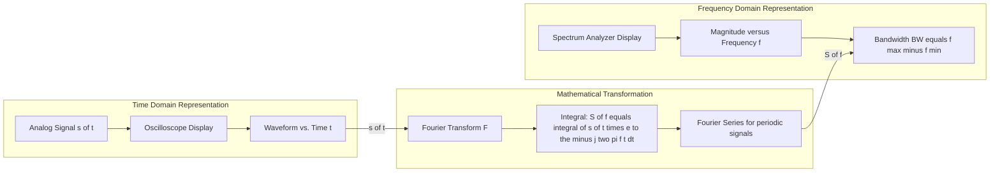
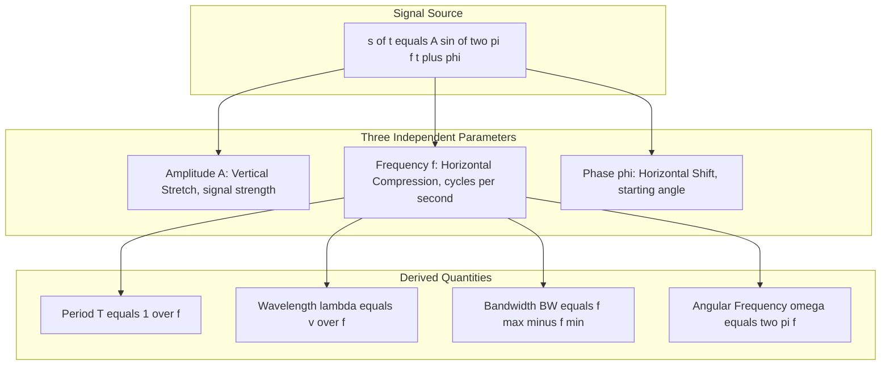
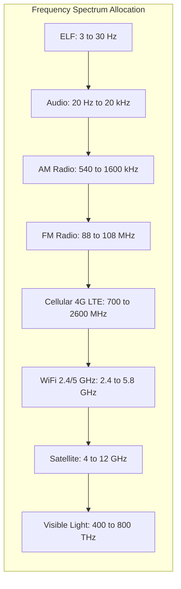
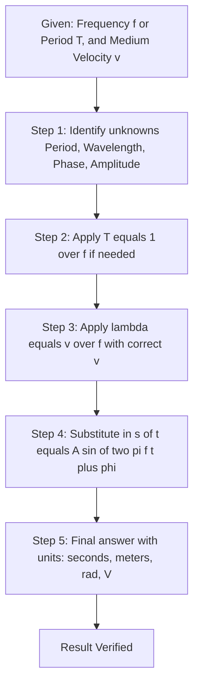

# Periodic analog signals - Sine wave, Amplitude, Phase, Wavelength, Time and frequency domain, Bandwidth.

<!-- SECTION_1_START -->
# Periodic Analog Signals — Sine Wave Fundamentals

## 1.1 Core Technical Definition

A **periodic analog signal** is a continuous-time, continuous-amplitude signal $s(t)$ whose values repeat at regular intervals $T$ called the **period**. Mathematically, a signal is periodic if and only if it satisfies the condition:

$$s(t + T) = s(t) \quad \text{for all } t \in \mathbb{R}$$

The smallest positive value of $T$ for which this condition holds is called the **fundamental period**.

> [!IMPORTANT]
> **KTU 2024 Syllabus Definition:** A *periodic analog signal* is a smooth, continuous function of time whose waveform pattern repeats identically after a fixed time interval $T$. The most fundamental and analytically tractable periodic analog signal in both communication theory and Fourier analysis is the **sinusoidal (sine) wave**, expressed as $s(t) = A \sin(2\pi f t + \phi)$.

### Real-World Intuitive Analogy

Imagine standing at the seashore and watching ocean waves roll in. Each wave rises to a peak, dips into a trough, and then the next wave begins — over and over, with a consistent gap between successive crests. That gap is the **period**, the height from the still-water line to the peak is the **amplitude**, and the moment you began counting is a kind of **phase reference**.

An electrical sine wave behaves identically on an oscilloscope screen: it sweeps smoothly up to a peak voltage, falls to a negative trough, and returns — repeating the exact same pattern forever. This is the same shape that describes **alternating current (AC) power**, **audio tones** in your headphones, **radio carrier waves** in your mobile phone, and **light waves** in fibre-optic cables.

> [!NOTE]
> **Why the sine wave matters in Data Communication:** Every periodic analog signal — no matter how complex — can be decomposed (via **Fourier Series**) into a sum of pure sine waves of different frequencies, amplitudes, and phases. Hence, mastering the sine wave is the gateway to understanding *all* analog and digital modulation schemes used in real communication systems (AM, FM, PSK, QAM).

### Sine Wave — The Most Elementary Periodic Signal

The general form of a sinusoidal signal is:

$$s(t) = A \sin(2\pi f t + \phi)$$

where each symbol carries a specific physical meaning that we will dissect in the upcoming sections.

---

## 1.2 GeoGebra / Desmos Visualization

> [!VISUALIZATION CONTROL]
> **Concept:** Live plotting of a parameterized sine wave showing amplitude, period, and phase shift.
>
> **GeoGebra / Desmos Input Equations:**
> * $f(t) = 2 \cdot \sin(2 \cdot \pi \cdot 1 \cdot t + 0)$
> * $g(t) = 3 \cdot \sin(2 \cdot \pi \cdot 0.5 \cdot t + \pi/4)$
> * $h(t) = 1.5 \cdot \sin(2 \cdot \pi \cdot 2 \cdot t - \pi/2)$
>
> **Visual Description:** On the $(t, s(t))$ coordinate axes, students should observe three sine waves of different **amplitudes** ($A = 2, 3, 1.5$), different **frequencies** ($f = 1, 0.5, 2$ Hz), and different **phase offsets** ($\phi = 0, \pi/4, -\pi/2$). The horizontal axis is the **time domain**; the curve oscillates smoothly without ever jumping — the hallmark of an analog signal.

---

## 1.3 Salient Properties at a Glance

> [!TIP]
> A pure sine wave possesses only **one frequency component** — it is a *monochromatic* signal in the spectral sense. Any deviation from this pure shape (sharp edges, asymmetry, clipping) introduces additional harmonic frequencies. This is precisely why clean communication systems aim to preserve sinusoidal purity.
<!-- SECTION_1_END -->

<!-- SECTION_2_START -->
# Deep Theoretical Analysis & KTU High-Yield Formula Sheet

## 2.1 Anatomy of a Sinusoidal Signal

A sinusoidal signal $s(t) = A \sin(2\pi f t + \phi)$ is fully described by **three independent parameters**: **Amplitude ($A$)**, **Frequency ($f$)**, and **Phase ($\phi$)**. Each parameter governs one specific physical dimension of the waveform.

### 2.1.1 Amplitude ($A$)
* **Definition:** The maximum instantaneous displacement of the signal from its mean (zero) value.
* **Units:** Volts (V) for voltage signals, Amperes (A) for current signals, Pascals (Pa) for acoustic pressure.
* **Physical meaning:** Represents the **signal strength** or **energy**. A higher amplitude means a louder sound, a brighter light, or a stronger electromagnetic field.
* **Related quantities:**
  * Peak-to-Peak Amplitude: $A_{pp} = 2A$
  * RMS (Root Mean Square) Amplitude: $A_{rms} = A/\sqrt{2}$ — used to express equivalent DC power.

### 2.1.2 Phase ($\phi$)
* **Definition:** The initial angular offset of the waveform at $t = 0$, measured in **radians** (or degrees).
* **Range:** $\phi \in [0, 2\pi)$ or equivalently $\phi \in [-\pi, \pi)$.
* **Physical meaning:** Determines *where* the waveform starts at $t = 0$. Two sine waves with identical $A$ and $f$ but different $\phi$ are shifted horizontally relative to each other.
* **Phase difference ($\Delta\phi$):** When two signals of the same frequency interact, their relative phase dictates constructive or destructive interference.

### 2.1.3 Frequency ($f$) and Angular Frequency ($\omega$)
* **Frequency ($f$):** Number of complete cycles the signal executes per unit time.
* **Units:** **Hertz (Hz)** = cycles per second.
* **Angular Frequency ($\omega$):** Rate of change of the argument of the sine function.
* **Relationship:** $\omega = 2\pi f$ (radians per second).

### 2.1.4 Period ($T$)
* **Definition:** Time required to complete one full cycle.
* **Relationship with frequency:** $T = 1/f$ seconds.
* **Significance:** The fundamental period — the smallest $T > 0$ such that $s(t + T) = s(t)$.

### 2.1.5 Wavelength ($\lambda$)
* **Definition:** The spatial distance the wave travels in one complete period.
* **Fundamental relationship:** $\lambda = v \cdot T = v / f$, where $v$ is the wave propagation velocity.
* **In free space / vacuum:** $v = c \approx 3 \times 10^8$ m/s, so $\lambda = c/f$.
* **In copper cables:** $v \approx 2 \times 10^8$ m/s (signal propagates at roughly **2/3 the speed of light**).
* **In fibre-optic glass:** $v \approx 2 \times 10^8$ m/s (refractive index $\approx 1.5$).

> [!IMPORTANT]
> **KTU Board Tip:** Whenever a problem states "in free space" or "in air" without specifying a medium, always use $v = c = 3 \times 10^8$ m/s. If it states "in a cable", use $v = 2 \times 10^8$ m/s. Examiners explicitly test this distinction.

---

## 2.2 Time Domain vs. Frequency Domain

The same signal can be visualized in two complementary ways — and understanding *both* representations is essential for KTU examination success.

### 2.2.1 Time-Domain Representation
* Plots the **instantaneous amplitude** $s(t)$ on the vertical axis against **time** $t$ on the horizontal axis.
* Tells you *how* the signal varies moment by moment.
* An **oscilloscope** displays signals in the time domain.

### 2.2.2 Frequency-Domain Representation
* Plots **amplitude** (or power) on the vertical axis against **frequency** $f$ on the horizontal axis.
* Tells you *what frequency components* are present in the signal and at what strength.
* A **spectrum analyzer** displays signals in the frequency domain.
* For a pure sine wave $s(t) = A \sin(2\pi f_0 t + \phi)$, the frequency domain shows a single spectral line of height $A$ at $f = f_0$.

> [!NOTE]
> **Mathematical Bridge:** The conversion from the time domain to the frequency domain is performed by the **Fourier Transform** $\mathcal{F}\{s(t)\} = S(f) = \int_{-\infty}^{+\infty} s(t) e^{-j2\pi f t} dt$. For periodic signals, this reduces to the **Fourier Series**, which expresses the signal as a sum of harmonically related sine waves.

---

## 2.3 Bandwidth — The Spectrum of Frequencies

### 2.3.1 Definition
**Bandwidth ($BW$)** is the width of the range of frequencies that a signal occupies (signal bandwidth) or that a channel can transmit (channel bandwidth).

$$BW = f_{max} - f_{min}$$

For a baseband signal starting near DC, $f_{min} \approx 0$, so:

$$BW \approx f_{max}$$

### 2.3.2 Bandwidth of a Pure Sine Wave
A single pure tone occupies **infinitesimally small** bandwidth in theory, since it exists at exactly one frequency. In practice, real signals always have a non-zero bandwidth due to modulation, filtering, and noise.

### 2.3.3 Bandwidth Units
* **Hz (Hertz)** — base unit.
* **kHz, MHz, GHz, THz** — for radio, microwave, optical, and beyond.
* Human voice: **$\approx$ 4 kHz** (300 Hz to 3.4 kHz).
* AM Radio: **$\approx$ 10 kHz** per channel.
* FM Radio: **$\approx$ 200 kHz** per channel.
* Wi-Fi: **20/40/80/160 MHz** channels.
* Optical fibre: **THz-class** bandwidth.

---

## 2.4 KTU Formula Cheat Sheet

| # | Parameter | Symbol | Formula / Definition | SI Unit | Typical Range |
|---|-----------|--------|---------------------|---------|---------------|
| 1 | Instantaneous Signal | $s(t)$ | $s(t) = A \sin(2\pi f t + \phi)$ | V or A | — |
| 2 | Amplitude | $A$ | Peak value of the waveform | V (Volt) | $\mu$V to MV |
| 3 | Phase | $\phi$ | Initial angular offset at $t = 0$ | rad | $[0, 2\pi)$ |
| 4 | Frequency | $f$ | $f = 1/T$ | Hz | mHz to PHz |
| 5 | Angular Frequency | $\omega$ | $\omega = 2\pi f$ | rad/s | — |
| 6 | Period | $T$ | $T = 1/f$ | s | — |
| 7 | Wavelength | $\lambda$ | $\lambda = v/f = v \cdot T$ | m | pm to km |
| 8 | Wave Velocity (vacuum) | $c$ | $3 \times 10^8$ m/s | m/s | constant |
| 9 | Wave Velocity (medium) | $v$ | $v = c / n$ ($n$ = refractive index) | m/s | medium-dependent |
| 10 | Peak-to-Peak | $A_{pp}$ | $A_{pp} = 2A$ | V | — |
| 11 | RMS Amplitude | $A_{rms}$ | $A_{rms} = A/\sqrt{2}$ | V | — |
| 12 | Bandwidth | $BW$ | $BW = f_{max} - f_{min}$ | Hz | Hz to THz |
| 13 | Phase Difference | $\Delta\phi$ | $\Delta\phi = 2\pi f \Delta t$ | rad | — |
| 14 | Wave Number | $k$ | $k = 2\pi/\lambda$ | rad/m | — |

---

## 2.5 Engineering Utility & Real-World Applications

> [!TIP]
> **Where these formulas are used in production systems:**
> * **Antenna Design** — antenna physical length must be $\lambda/2$ or $\lambda/4$ of the carrier for efficient radiation.
> * **OFDM in 4G/5G** — subcarriers are spaced at $15$ kHz intervals, a frequency-domain engineering problem.
> * **Optical Fibre** — dispersion compensation relies on wavelength-division multiplexing (WDM) over $\lambda = 1310$ nm and $1550$ nm windows.
> * **Audio Engineering** — CD quality audio uses $f_s = 44.1$ kHz to capture up to $22.05$ kHz (human hearing limit).
> * **DSL Broadband** — bandwidth is allocated into upstream and downstream bins using the frequency domain.
<!-- SECTION_2_END -->

<!-- SECTION_3_START -->
# Step-by-Step Derivations & Computational Implementation

## 3.1 Derivation: From Circular Motion to the Sine Wave

The sine wave arises naturally from **uniform circular motion**. Consider a point $P$ moving counter-clockwise on a circle of radius $A$ centered at the origin, completing one revolution in time $T$.

At time $t$, the angle swept from the positive x-axis is:

$$\theta(t) = \omega t + \phi$$

where:
* $\omega = 2\pi / T$ is the constant angular velocity.
* $\phi$ is the initial angle at $t = 0$.

Projecting $P$ onto the **y-axis** gives the vertical coordinate:

$$y(t) = A \sin(\theta(t)) = A \sin(\omega t + \phi)$$

Substituting $\omega = 2\pi f = 2\pi / T$:

$$\boxed{s(t) = A \sin(2\pi f t + \phi)}$$

This is the canonical sinusoidal signal in time domain. The projection onto the **x-axis** yields $A \cos(2\pi f t + \phi)$ — the cosine wave, which is simply a sine wave with $\phi = +\pi/2$.

---

## 3.2 Derivation: Period-Frequency Inverse Relationship

By the definition of periodicity:

$$s(t + T) = s(t)$$

Substituting the sine form:

$$A \sin(2\pi f (t + T) + \phi) = A \sin(2\pi f t + \phi)$$

$$\Rightarrow A \sin(2\pi f t + 2\pi f T + \phi) = A \sin(2\pi f t + \phi)$$

For this identity to hold for *all* $t$, the added phase must equal an integer multiple of $2\pi$:

$$2\pi f T = 2\pi n, \quad n \in \mathbb{Z}^+$$

The smallest positive period corresponds to $n = 1$:

$$2\pi f T = 2\pi$$

$$\boxed{T = \frac{1}{f}}$$

---

## 3.3 Derivation: Wavelength-Velocity-Frequency Relationship

Consider a wave travelling along the +x axis with velocity $v$. A snapshot at $t = 0$ shows the waveform $s(x, 0) = A \sin(2\pi x / \lambda)$. For a wave moving in time:

$$s(x, t) = A \sin\!\left(2\pi \frac{x - vt}{\lambda} + \phi\right)$$

Comparing with the standard form $s(t) = A \sin(2\pi f t + \phi)$ at a *fixed* observation point $x$:

$$2\pi f t = -2\pi \frac{x - vt}{\lambda} \quad \Rightarrow \quad f = \frac{v}{\lambda}$$

$$\boxed{\lambda = \frac{v}{f} = v \cdot T}$$

This is the universal wave relation, valid for sound, light, radio, and any other wave phenomenon.

---

## 3.4 Worked Numerical Example (KTU Board Standard)

**Problem:** A communication channel uses a carrier frequency of $900$ MHz. Calculate the period, angular frequency, and wavelength in (a) free space and (b) a copper cable ($v = 2 \times 10^8$ m/s).

**Given:** $f = 900$ MHz $= 900 \times 10^6$ Hz $= 9 \times 10^8$ Hz.

### Step 1 — Period

$$T = \frac{1}{f} = \frac{1}{9 \times 10^8} \text{ s}$$

$$T \approx 1.111 \times 10^{-9} \text{ s} = 1.111 \text{ ns}$$

### Step 2 — Angular Frequency

$$\omega = 2\pi f = 2\pi \times 9 \times 10^8$$

$$\omega \approx 5.6549 \times 10^{9} \text{ rad/s}$$

### Step 3 — Wavelength in Free Space ($v = c = 3 \times 10^8$ m/s)

$$\lambda_{free} = \frac{c}{f} = \frac{3 \times 10^8}{9 \times 10^8}$$

$$\lambda_{free} = \frac{1}{3} \text{ m} \approx 0.333 \text{ m} = 33.3 \text{ cm}$$

### Step 4 — Wavelength in Copper Cable ($v = 2 \times 10^8$ m/s)

$$\lambda_{copper} = \frac{v}{f} = \frac{2 \times 10^8}{9 \times 10^8}$$

$$\lambda_{copper} = \frac{2}{9} \text{ m} \approx 0.222 \text{ m} = 22.2 \text{ cm}$$

**Result Summary:**

| Quantity | Value |
|----------|-------|
| Period $T$ | $1.111$ ns |
| Angular Frequency $\omega$ | $5.655 \times 10^9$ rad/s |
| Wavelength in Free Space $\lambda$ | $0.333$ m |
| Wavelength in Copper $\lambda$ | $0.222$ m |

---

## 3.5 Worked Example: Multi-Frequency Composite Signal

A composite signal contains three sine waves:
$$s(t) = 4 \sin(200\pi t) + 2 \sin(400\pi t) + \sin(600\pi t)$$

Determine the **fundamental frequency**, the **highest frequency**, and the **bandwidth**.

### Step 1 — Identify Individual Frequencies

The general form is $A_i \sin(2\pi f_i t)$, so:

* $2\pi f_1 = 200\pi \Rightarrow f_1 = 100$ Hz
* $2\pi f_2 = 400\pi \Rightarrow f_2 = 200$ Hz
* $2\pi f_3 = 600\pi \Rightarrow f_3 = 300$ Hz

### Step 2 — Fundamental Frequency

The **fundamental** is the **GCD** of all frequencies:

$$f_0 = \gcd(100, 200, 300) = 100 \text{ Hz}$$

### Step 3 — Highest Frequency and Bandwidth

$$f_{max} = 300 \text{ Hz}, \quad f_{min} = 100 \text{ Hz}$$

$$BW = f_{max} - f_{min} = 300 - 100 = 200 \text{ Hz}$$

---

## 3.6 Python Implementation — Signal Generation and FFT

```python
import numpy as np
import matplotlib.pyplot as plt

# --- 1. Time domain generation of a sine wave ---
A   = 5.0          # Amplitude in Volts
f   = 50.0         # Frequency in Hz
phi = np.pi / 4    # Phase in radians
fs  = 1000.0       # Sampling rate (samples per second)
T   = 0.1          # Total duration in seconds

t = np.arange(0, T, 1 / fs)             # Time vector
s = A * np.sin(2 * np.pi * f * t + phi) # Sine wave

# --- 2. Plot time-domain waveform ---
plt.figure(figsize=(10, 4))
plt.plot(t, s, color="navy", linewidth=1.5)
plt.title(f"Time Domain: s(t) = {A} sin(2\u03c0\u00d7{f}t + \u03c0/4)")
plt.xlabel("Time t (seconds)")
plt.ylabel("Amplitude (V)")
plt.grid(True, linestyle="--", alpha=0.6)
plt.tight_layout()
plt.savefig("sine_time_domain.png", dpi=120)

# --- 3. Frequency-domain representation using FFT ---
N      = len(s)                         # Number of samples
S_fft  = np.fft.fft(s)                  # Compute FFT
freqs  = np.fft.fftfreq(N, d=1 / fs)    # Frequency bins

# Keep only the positive half of the spectrum
mask   = freqs >= 0
S_mag  = (2.0 / N) * np.abs(S_fft[mask]) # Normalize magnitude
freqs  = freqs[mask]

# --- 4. Plot frequency-domain spectrum ---
plt.figure(figsize=(10, 4))
plt.stem(freqs, S_mag, basefmt=" ", linefmt="coral", markerfmt="ro")
plt.title("Frequency Domain: Magnitude Spectrum")
plt.xlabel("Frequency (Hz)")
plt.ylabel("Magnitude (V)")
plt.xlim(0, 200)
plt.grid(True, linestyle="--", alpha=0.6)
plt.tight_layout()
plt.savefig("sine_freq_domain.png", dpi=120)
plt.show()
```

**Code Output Expectations:**
* The time-domain plot shows a smooth sine wave oscillating between $-5$ V and $+5$ V, starting at angle $\pi/4$ from zero.
* The frequency-domain plot shows a single spectral spike at exactly $f = 50$ Hz with magnitude $5$ V — confirming the time-frequency duality of a pure tone.

---

## 3.7 Python Implementation — Composite Signal and Bandwidth

```python
import numpy as np
import matplotlib.pyplot as plt

# Composite signal parameters
fs = 5000.0
T  = 0.05
t  = np.arange(0, T, 1 / fs)

# Three sinusoids: 100 Hz, 200 Hz, 300 Hz with amplitudes 4, 2, 1
s = 4 * np.sin(2 * np.pi * 100 * t) + 2 * np.sin(2 * np.pi * 200 * t) + np.sin(2 * np.pi * 300 * t)

# Time domain
plt.figure(figsize=(10, 4))
plt.plot(t, s, color="darkgreen")
plt.title("Composite Time-Domain Signal")
plt.xlabel("Time (s)")
plt.ylabel("Amplitude (V)")
plt.grid(True, linestyle="--", alpha=0.6)
plt.tight_layout()

# Frequency domain
N = len(s)
S = np.fft.fft(s)
freqs = np.fft.fftfreq(N, 1 / fs)
mask = freqs >= 0
plt.figure(figsize=(10, 4))
plt.stem(freqs[mask], (2.0 / N) * np.abs(S[mask]),
         basefmt=" ", linefmt="steelblue", markerfmt="bo")
plt.title("Composite Signal Frequency Spectrum")
plt.xlabel("Frequency (Hz)")
plt.ylabel("Magnitude (V)")
plt.xlim(0, 400)
plt.grid(True, linestyle="--", alpha=0.6)
plt.tight_layout()
plt.show()
```

The frequency-domain plot will show **three distinct spikes** at $100, 200, 300$ Hz with magnitudes $4, 2, 1$ V — directly demonstrating that the bandwidth of this composite signal is $300 - 100 = 200$ Hz.
<!-- SECTION_3_END -->

<!-- SECTION_4_START -->
# Structural Diagrams & Schematics

## 4.1 Mermaid Block Diagram — Time Domain vs. Frequency Domain Conversion



> [!NOTE]
> This block diagram emphasizes the **signal processing pipeline**: a real-world analog signal observed on an oscilloscope (time domain) is mathematically transformed via the **Fourier Transform** into its frequency-domain representation, which reveals its bandwidth and spectral composition.

---

## 4.2 Mermaid Block Diagram — Sine Wave Parameter Anatomy



---

## 4.3 Mermaid Block Diagram — Communication Channel Frequency Allocation



> [!TIP]
> This sequential frequency allocation diagram helps KTU students remember where different communication systems sit on the **electromagnetic spectrum** — a frequently tested concept in the **Communication Model** module.

---

## 4.4 Mermaid Flowchart — Numerical Problem Solving Strategy



> [!IMPORTANT]
> **Sequential Processing Topology:** KTU board examiners award partial credit for *each* correct step. Even if the final numerical answer is wrong, demonstrating the correct formulaic chain of reasoning typically yields **60 to 70 percent of the marks**.
<!-- SECTION_4_END -->

<!-- SECTION_5_START -->
# KTU 2024 Scheme Examination Question Bank & Topic Recap

## 5.1 Part A — Short Answer Questions (3 Marks Each)

---

### **Question A1** `[KTU University Exam - July 2024]`

**Define a periodic analog signal. State the fundamental condition for periodicity, and explain the term "fundamental period."**

**Course Outcome:** CO1 | **Cognitive Level:** Remember | **Marks:** 3

**Model Answer:**

A **periodic analog signal** is a continuous-time signal whose waveform pattern repeats at regular intervals without any change in shape, amplitude, or phase.

**Periodicity Condition:**

A signal $s(t)$ is periodic if there exists a positive constant $T$ such that:

$$s(t + T) = s(t) \quad \text{for all values of } t$$

The smallest positive value of $T$ satisfying this condition is called the **fundamental period** ($T_0$).

**Example:** A pure sine wave $s(t) = A \sin(2\pi f t + \phi)$ is periodic with fundamental period $T_0 = 1/f$.

**[Defining periodic signal: 1 Mark] [Periodicity equation: 1 Mark] [Fundamental period explanation: 1 Mark]**

---

### **Question A2** `[KTU University Exam - Dec 2023]`

**Distinguish between the time domain and frequency domain representations of a signal. Mention the instrument used for each.**

**Course Outcome:** CO1 | **Cognitive Level:** Understand | **Marks:** 3

**Model Answer:**

| Aspect | Time Domain | Frequency Domain |
|--------|-------------|------------------|
| Horizontal Axis | Time $t$ | Frequency $f$ |
| Vertical Axis | Instantaneous Amplitude | Magnitude or Power |
| Shows | How the signal changes with time | What frequencies are present |
| Instrument | Oscilloscope | Spectrum Analyzer |
| Mathematical Tool | Direct observation $s(t)$ | Fourier Transform $S(f)$ |

For a pure sine wave $s(t) = A \sin(2\pi f_0 t)$, the time domain shows a continuous oscillation, whereas the frequency domain shows a single spectral line of height $A$ at $f_0$.

**[Time domain definition + instrument: 1 Mark] [Frequency domain definition + instrument: 1 Mark] [Comparison example: 1 Mark]**

---

## 5.2 Part B — Full 14-Mark Questions (Module Internal Choice)

---

### **Question B-A** `[KTU University Exam - July 2024]` — **Question A Choice**

**A communication system operates at a carrier frequency of $1.5$ GHz.**

**(a)** Define the terms **amplitude**, **frequency**, **phase**, and **wavelength** with their SI units. (**7 Marks**)

**(b)** Calculate the period, angular frequency, and wavelength (in free space) for the given carrier signal. If the same signal travels through a fibre-optic cable with refractive index $n = 1.5$, find the new wavelength. (**7 Marks**)

**Course Outcome:** CO1, CO2 | **Cognitive Levels:** Understand (a), Apply (b) | **Total Marks:** 14

---

#### Model Solution — Part (a) [7 Marks]

**Amplitude ($A$):** The maximum instantaneous displacement of the signal from its mean (zero) value. **Unit: Volts (V)** for voltage signals. **[Definition: 1 Mark] [Unit: 0.5 Mark]**

**Frequency ($f$):** The number of complete cycles of the signal per unit time. **Unit: Hertz (Hz)**. **[Definition: 1 Mark] [Unit: 0.5 Mark]**

**Phase ($\phi$):** The initial angular displacement of the waveform at $t = 0$, expressed in **radians (rad)** or degrees. It represents the horizontal shift of the waveform from a reference sine wave. **[Definition: 1 Mark] [Unit: 0.5 Mark]**

**Wavelength ($\lambda$):** The physical spatial distance over which the wave repeats one complete cycle, or equivalently, the distance the wave travels in one period. **Unit: Meters (m)**. Given by $\lambda = v/f$. **[Definition: 1 Mark] [Unit: 0.5 Mark]**

**Mathematical form (optional 1 Mark):**

$$s(t) = A \sin(2\pi f t + \phi)$$

---

#### Model Solution — Part (b) [7 Marks]

**Given:** $f = 1.5$ GHz $= 1.5 \times 10^9$ Hz, $c = 3 \times 10^8$ m/s, $n = 1.5$.

**Step 1 — Period:**

$$T = \frac{1}{f} = \frac{1}{1.5 \times 10^9}$$

$$T = 6.667 \times 10^{-10} \text{ s} = 0.667 \text{ ns}$$

**[Formula: 1 Mark] [Substitution and result: 1 Mark]**

**Step 2 — Angular Frequency:**

$$\omega = 2\pi f = 2\pi \times 1.5 \times 10^9$$

$$\omega = 9.4248 \times 10^9 \text{ rad/s}$$

**[Formula: 1 Mark] [Substitution and result: 1 Mark]**

**Step 3 — Wavelength in Free Space:**

$$\lambda_{free} = \frac{c}{f} = \frac{3 \times 10^8}{1.5 \times 10^9}$$

$$\lambda_{free} = 0.2 \text{ m} = 20 \text{ cm}$$

**[Formula: 0.5 Mark] [Substitution and result: 0.5 Mark]**

**Step 4 — Wavelength in Fibre ($v = c/n$):**

$$v_{fibre} = \frac{c}{n} = \frac{3 \times 10^8}{1.5} = 2 \times 10^8 \text{ m/s}$$

$$\lambda_{fibre} = \frac{v_{fibre}}{f} = \frac{2 \times 10^8}{1.5 \times 10^9}$$

$$\lambda_{fibre} = 0.1333 \text{ m} = 13.33 \text{ cm}$$

**[Velocity in fibre formula: 0.5 Mark] [Wavelength in fibre formula: 0.5 Mark] [Final answer: 0.5 Mark]**

---

### **Question B-B** `[KTU University Exam - Dec 2023]` — **Question B Choice**

**A composite periodic signal is given by:**

$$s(t) = 5 \sin(200\pi t) + 3 \sin(600\pi t) + 2 \sin(1000\pi t)$$

**(a)** Explain the concept of **bandwidth** of a signal. With reference to the frequency domain, describe how the Fourier Series decomposes a periodic signal. (**7 Marks**)

**(b)** Determine the fundamental frequency, the highest frequency present, and the **bandwidth** of the given signal. Also compute the period of the fundamental. (**7 Marks**)

**Course Outcome:** CO1, CO2 | **Cognitive Levels:** Understand (a), Apply (b) | **Total Marks:** 14

---

#### Model Solution — Part (a) [7 Marks]

**Bandwidth Definition:**
Bandwidth ($BW$) is the width of the range of frequencies that a signal occupies in the frequency domain. It is measured in **Hertz (Hz)** and is calculated as:

$$BW = f_{max} - f_{min}$$

For a baseband signal starting from near zero frequency, $BW \approx f_{max}$. **[Definition: 2 Marks] [Formula: 1 Mark]**

**Fourier Series Concept:**
According to **Fourier's Theorem**, any periodic signal $s(t)$ of period $T$ can be expressed as a sum of harmonically related sine and cosine waves:

$$s(t) = a_0 + \sum_{n=1}^{\infty}\!\left[a_n \cos(2\pi n f_0 t) + b_n \sin(2\pi n f_0 t)\right]$$

where $f_0 = 1/T$ is the **fundamental frequency**, and the integer multiples $n f_0$ are the **harmonics**. The coefficients $a_n$ and $b_n$ (computed via integration over one period) represent the amplitude contribution of each harmonic. **[Fourier series equation: 2 Marks] [Concept of fundamental and harmonics: 1 Mark] [Coefficients meaning: 1 Mark]**

---

#### Model Solution — Part (b) [7 Marks]

**Step 1 — Identify Component Frequencies:**

The general form is $A_i \sin(2\pi f_i t)$. Equating:

* $2\pi f_1 = 200\pi \Rightarrow f_1 = 100$ Hz
* $2\pi f_2 = 600\pi \Rightarrow f_2 = 300$ Hz
* $2\pi f_3 = 1000\pi \Rightarrow f_3 = 500$ Hz

**[Extracting $f_1$: 1 Mark] [$f_2$: 1 Mark] [$f_3$: 1 Mark]**

**Step 2 — Fundamental Frequency:**

$$f_0 = \gcd(100, 300, 500) = 100 \text{ Hz}$$

**[GCD logic: 1 Mark] [Result: 0.5 Mark]**

**Step 3 — Highest Frequency and Bandwidth:**

$$f_{max} = 500 \text{ Hz}$$

$$BW = f_{max} - f_{min} = 500 - 100 = 400 \text{ Hz}$$

**[Highest frequency: 0.5 Mark] [Bandwidth formula and result: 1 Mark]**

**Step 4 — Period of the Fundamental:**

$$T_0 = \frac{1}{f_0} = \frac{1}{100} = 0.01 \text{ s} = 10 \text{ ms}$$

**[Formula and substitution: 0.5 Mark] [Result: 0.5 Mark]**

---

> [!WARNING]
> **KTU Examiner's Valuation Pitfall Callout — Common Mark Deductions:**
> 1. **Wrong propagation velocity:** Students often blindly use $c = 3 \times 10^8$ m/s even when the problem specifies a fibre-optic cable. Use $v = c/n$. Examiners explicitly deduct 1 to 2 marks for this.
> 2. **Confusing $f$ and $\omega$:** Frequency is in Hz, while angular frequency $\omega = 2\pi f$ is in rad/s. Mixing units loses 1 mark.
> 3. **Forgetting to state the standard sine wave form:** Always write $s(t) = A \sin(2\pi f t + \phi)$ before plugging in numerical values — this shows conceptual clarity and earns method marks.
> 4. **Skipping the GCD step for fundamental frequency:** The fundamental is *not* simply the lowest frequency unless all components are integer multiples of the lowest. Always verify $f_1 \mid f_2$ and $f_1 \mid f_3$.
> 5. **Ignoring units in the final answer:** A numerical answer of "$0.2$" is incomplete. Always write "$0.2$ m" or "$20$ cm".
> 6. **Drawing the time-domain graph incorrectly:** When asked to sketch, ensure the axes are clearly labelled ($t$ in seconds on x-axis, $s(t)$ in Volts on y-axis), and mark the amplitude peak and period $T$ explicitly on the diagram.

---

## 5.3 Topic Recap & Important Things to Remember

> [!TIP]
> **Rapid-Revision Checklist — Periodic Analog Signals**

* **Periodic signal definition:** $s(t + T) = s(t)$ for all $t$; smallest positive $T$ is the **fundamental period**.
* **Canonical sine wave:** $s(t) = A \sin(2\pi f t + \phi)$ — three independent parameters $A$, $f$, $\phi$.
* **Amplitude $A$:** peak value; $A_{pp} = 2A$; $A_{rms} = A/\sqrt{2}$. **Unit: V or A.**
* **Phase $\phi$:** initial angle in radians. Range $[0, 2\pi)$ or $[-\pi, \pi)$.
* **Frequency $f$:** cycles per second. **Unit: Hz.** Inverse of period.
* **Period $T = 1/f$:** time for one cycle. **Unit: seconds.**
* **Angular frequency $\omega = 2\pi f$:** **Unit: rad/s.**
* **Wavelength $\lambda = v/f$:** **Unit: meters.** Use $v = c = 3 \times 10^8$ m/s in vacuum, $v = c/n$ in a medium.
* **Time domain:** $s(t)$ vs $t$ — uses an **oscilloscope**.
* **Frequency domain:** $S(f)$ vs $f$ — uses a **spectrum analyzer**; obtained via **Fourier Transform**.
* **Bandwidth $BW = f_{max} - f_{min}$:** width of the frequency spectrum; **Unit: Hz.**
* **Fundamental frequency of composite signal:** $f_0 = \gcd$ of all component frequencies.
* **Fourier Series:** every periodic signal = sum of harmonically related sines/cosines.
* **Pure sine wave bandwidth:** theoretically zero (single spectral line at $f_0$).
* **Refractive index rule:** in a medium, $v = c/n$, so $\lambda$ *decreases* but $f$ *stays constant*.
* **Key numerical values to memorize:** $c = 3 \times 10^8$ m/s; $1$ GHz $= 10^9$ Hz; $1$ ns $= 10^{-9}$ s.
<!-- SECTION_5_END -->
