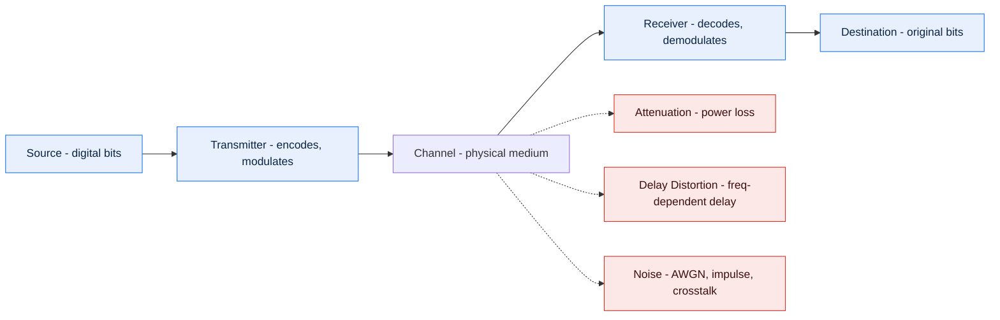
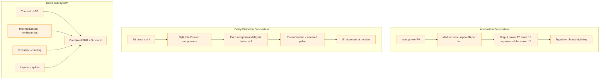

# Transmission impairments - Attenuation, Delay distortion, Noise.

<!-- SECTION_1_START -->
# Transmission Impairments — Core Definition & Intuitive Overview

## 1.1 What is a Transmission Impairment?

In any real communication channel (copper wire, optical fibre, wireless RF link), the **transmitted signal** is never received in the *exact* shape that was sent. The unwanted modifications that distort, weaken, or corrupt the signal as it propagates from source to destination are collectively called **Transmission Impairments**.

> [!IMPORTANT]
> **KTU 2024 Syllabus Definition**
> *"Transmission impairments are undesirable effects introduced by the physical medium and the surrounding environment that degrade the quality, fidelity, or interpretability of a signal travelling from transmitter to receiver. The three principal impairments classified by Stallings/Forouzan are **Attenuation**, **Delay Distortion**, and **Noise**."*

Formally, if $s(t)$ is the transmitted signal and $r(t)$ is the received signal, then:

$$r(t) = s(t) \circledast h(t) + n(t)$$

where $h(t)$ is the **channel impulse response** (captures attenuation + delay distortion) and $n(t)$ is the **additive noise**.

---

## 1.2 The Three Impairments — Plain-English Analogy

| Impairment | Real-World Analogy | What Goes Wrong |
|---|---|---|
| **Attenuation** | Talking to a friend 100 m away — your voice gets *quieter* | Signal **amplitude/energy** decreases with distance |
| **Delay Distortion** | Cars in a race finishing the *same track* at *different times* because of varying road friction | Different **frequency components** of the signal arrive at *different times* |
| **Noise** | Trying to listen to that friend while a *fan, traffic, and crowd* are also producing sound | Unwanted **random electrical energy** is added to the signal |

> [!NOTE]
> **Intuition Tip:** Think of the channel as a long pipe carrying marbles of different sizes. *Attenuation* = fewer marbles come out the other end. *Delay distortion* = big marbles arrive before small ones (or vice-versa), scattering the original pattern. *Noise* = dust and grit are mixed in with the marbles.

---

## 1.3 The Communication Model — Where Impairments Sit

> [!VISUALIZATION CONTROL]
> **Concept:** Communication model with impairment insertion points
> **Block chain (left to right):** Source $\rightarrow$ Transmitter $\rightarrow$ **Channel [Impairments here]** $\rightarrow$ Receiver $\rightarrow$ Destination
> **Visual Description:** Imagine a horizontal pipeline. A clean sine wave enters on the left (source), gets shaped by a "TX" box, then enters a long pipe that is shaded grey to indicate impairments occur *inside the medium*. On exit, the waveform is visibly **shorter (attenuation)**, **stretched/smeared (delay distortion)**, and **fuzzy (noise)** before being cleaned up by the "RX" box.

---

## 1.4 Physical Constants & Key Metrics Used Throughout

- Speed of light in vacuum: $\mathbf{c = 3 \times 10^{8} \text{ m/s}}$
- Speed of light in fibre: $\approx \mathbf{2 \times 10^{8} \text{ m/s}}$
- Speed of signal in copper (typical): $\approx \mathbf{2 \times 10^{8} \text{ m/s}}$
- Boltzmann constant: $\mathbf{k = 1.3807 \times 10^{-23} \text{ J/K}}$
- Standard reference temperature: $\mathbf{T_0 = 290 \text{ K}}$
- Standard noise reference: $\mathbf{N_0 = kT_0 = 4.00 \times 10^{-21} \text{ W/Hz}}$

<!-- SECTION_1_END -->

<!-- SECTION_2_START -->
# Deep Theoretical Analysis & KTU High-Yield Formula Sheet

## 2.1 Attenuation (Signal Power Loss)

### 2.1.1 Definition
**Attenuation** is the gradual loss in signal power as it travels through a transmission medium. It is caused by:
- **Resistance** of the conductor (copper losses / $I^{2}R$)
- **Absorption** in dielectric materials
- **Radiation losses** (especially in wireless)
- **Scattering** in optical fibre (Rayleigh scattering)

### 2.1.2 Mathematical Model
For a uniform medium, the received power decays **exponentially** with distance:

$$P(d) = P_{0} \cdot 10^{-\alpha d / 10}$$

where:
- $P_{0}$ = transmitted power (W)
- $P(d)$ = received power at distance $d$ (W)
- $\alpha$ = attenuation coefficient (dB per unit length)

### 2.1.3 Decibel (dB) Representation
The **dB** is a *logarithmic* measure of the ratio between two powers. KTU examiners love this:

$$\text{Attenuation (dB)} = -10 \log_{10}\!\left(\frac{P_{\text{out}}}{P_{\text{in}}}\right)$$

| Component | dB Value (typical) |
|---|---|
| Coaxial cable @ 1 km, 1 MHz | $\approx 2$ dB |
| Twisted pair @ 1 km, 1 kHz | $\approx 3$ dB |
| Optical fibre @ 1 km, 1550 nm | $\approx 0.2$ dB |
| Free-space path @ 100 m, 2.4 GHz | $\approx 80$ dB |

> [!NOTE]
> **Sign Convention:** A *negative* dB value means loss (attenuation); a *positive* dB value means gain (amplification). The minus sign in the formula above ensures the result is *positive* when $P_{\text{out}} < P_{\text{in}}$.

### 2.1.4 Attenuation Distortion
Different frequency components suffer different attenuation — high frequencies are attenuated **more** than low frequencies. This is called **Attenuation Distortion**. To fix it, engineers use **equalizers** (amplifiers that boost high frequencies selectively).

---

## 2.2 Delay Distortion (Frequency-Dependent Propagation)

### 2.2.1 Definition
**Delay Distortion** occurs because the **propagation velocity** of a signal through a medium is *frequency-dependent*. Therefore, the different Fourier components of a digital pulse arrive at the receiver at *slightly different times*, causing the pulse to *spread out* and overlap with adjacent pulses — a phenomenon called **Intersymbol Interference (ISI)**.

### 2.2.2 Phase Delay & Group Delay
For a sinusoid of frequency $f$ propagating through a channel with phase response $\beta(f)$ (radians per metre):

$$\tau_{p}(f) = \frac{\beta(f)}{2\pi f} \quad \text{(phase delay)}$$

$$\tau_{g}(f) = \frac{d\beta(f)}{d(2\pi f)} \quad \text{(group/envelope delay)}$$

> [!IMPORTANT]
> **Delay distortion** is the *variation* of $\tau_{g}(f)$ with $f$. If $\tau_{g}$ is constant, **no delay distortion** exists. A *non-constant* $\tau_{g}(f)$ smears the pulse shape.

### 2.2.3 Rule of Thumb
- A channel of bandwidth $B$ can carry a maximum bit rate of approximately $2B$ (Nyquist) only if delay distortion is **negligible**.
- The **highest usable frequency** of a guided medium is limited by both attenuation and delay distortion together.

---

## 2.3 Noise (Unwanted Random Energy)

### 2.3.1 Definition
**Noise** is any unwanted energy added to the signal that was *not* part of the original transmission. It is **additive** and **random**, modelled as a stochastic process $n(t)$ with statistical properties.

### 2.3.2 The Four Major Categories of Noise (Forouzan / Stallings)

| # | Noise Type | Source | Spectrum | Mitigation |
|---|---|---|---|---|
| 1 | **Thermal (Johnson-Nyquist)** | Random motion of electrons in conductors | White (uniform across $f$); Gaussian amplitude | Lower temperature, better conductors |
| 2 | **Intermodulation** | Non-linearities in transmitters/multiplexers | Sum/difference frequencies $f_i \pm f_j$ | Use linear amplifiers, proper filtering |
| 3 | **Crosstalk (XT)** | EM coupling between adjacent wires/channels | Function of coupled signal | Twisted pairs, shielding, separation |
| 4 | **Impulse** | Lightning, switching, EM interference (EMI) | Sporadic, short bursts, high amplitude | Shielding, error-correcting codes, filtering |

### 2.3.3 Signal-to-Noise Ratio (SNR)
The single most important metric in any noisy channel:

$$\boxed{\text{SNR} = \frac{S}{N} \quad \text{(linear ratio)}}$$

$$\boxed{\text{SNR}_{\text{dB}} = 10 \log_{10}\!\left(\frac{S}{N}\right) \text{ dB}}$$

Shannon's famous **Channel Capacity** formula (universally testable on KTU):

$$C = B \log_{2}\!\left(1 + \frac{S}{N}\right) \quad \text{(bits per second)}$$

### 2.3.4 Thermal Noise Power
Johnson-Nyquist theorem gives the noise power available in a bandwidth $B$ at temperature $T$:

$$N = k T B \quad \text{(Watts)}$$

If expressed per unit bandwidth, **Noise Power Spectral Density**:

$$N_{0} = kT \quad \text{(Watts/Hz)}$$

---

## 2.4 KTU Formula Sheet — One-Page Cheat Sheet

> [!IMPORTANT]
> **Quick-Reference Table (print this mentally before every exam)**

| # | Formula | Meaning | Units |
|---|---|---|---|
| 1 | $P(d) = P_{0}\cdot 10^{-\alpha d/10}$ | Power vs. distance | W, m, dB/m |
| 2 | $A_{\text{dB}} = -10\log_{10}(P_{\text{out}}/P_{\text{in}})$ | Attenuation | dB |
| 3 | $G_{\text{dB}} = 10\log_{10}(P_{\text{out}}/P_{\text{in}})$ | Gain | dB |
| 4 | $\text{dBm} = 10\log_{10}(P / 1\text{ mW})$ | Power referenced to 1 mW | dBm |
| 5 | $\tau_{g}(f) = d\beta/(2\pi df)$ | Group delay | seconds |
| 6 | $\text{ISI} \propto \Delta\tau_{g}$ | Pulse spread | seconds |
| 7 | $N = kTB$ | Thermal noise power | W |
| 8 | $N_{0} = kT$ | Noise PSD | W/Hz |
| 9 | $\text{SNR}_{\text{dB}} = 10\log_{10}(S/N)$ | Signal-to-noise ratio | dB |
| 10 | $C = B\log_{2}(1+S/N)$ | Shannon capacity | bps |
| 11 | $t_{\text{prop}} = d / v$ | Propagation delay | seconds |

> [!NOTE]
> **Prose-Isolation Reminder:** In the table above, $d\beta$ refers to the *differential* of $\beta$, written inline for brevity; in formal LaTeX, expand as $\frac{d\beta(f)}{2\pi\,df}$.

---

## 2.5 Real-World Engineering Significance

- **Optical long-haul links** are dominated by **attenuation** (regenerated every ~80 km using EDFAs).
- **High-speed digital copper links** (Cat 6, HDMI) are dominated by **delay distortion**; equalizers are mandatory above 1 Gbps.
- **Satellite and wireless links** are dominated by **thermal + atmospheric noise**; link-budget engineering revolves around SNR.
- **DSL broadband** uses **DMT modulation** specifically to *avoid* frequency bands with high attenuation and high delay distortion.

<!-- SECTION_2_END -->

<!-- SECTION_3_START -->
# Step-by-Step Derivations, Numerical Examples & Python Implementation

## 3.1 Worked Example 1 — Attenuation over Distance (KTU-class problem)

**Problem:** A transmitter launches $P_{0} = 100$ mW into a coaxial cable with attenuation coefficient $\alpha = 3$ dB/km. Compute the received power at $d = 10$ km and the **percentage of power lost**.

### Step 1 — Total attenuation in dB

$$A_{\text{total}} = \alpha \cdot d = 3 \text{ dB/km} \times 10 \text{ km} = 30 \text{ dB}$$

### Step 2 — Convert dB to linear power ratio

$$\frac{P_{\text{out}}}{P_{\text{in}}} = 10^{-A/10} = 10^{-30/10} = 10^{-3} = 0.001$$

### Step 3 — Compute received power

$$P_{\text{out}} = 0.001 \times 100 \text{ mW} = 0.1 \text{ mW} = 100 \text{ }\mu\text{W}$$

### Step 4 — Power lost in %

$$\% \text{ loss} = (1 - 0.001)\times 100 = 99.9\,\%$$

> **Answer:** $P_{\text{out}} = 0.1$ mW, **99.9 % of the original signal is lost** in 10 km of this cable.

**Exam Tip [Valuation Key — 5 marks]:**
- Statement of formula $A = \alpha d$ : 1 mark
- Substituting values correctly : 1 mark
- Converting dB to linear ratio using $10^{-A/10}$ : 1 mark
- Final numerical result with units : 1 mark
- Percentage / interpretation : 1 mark

---

## 3.2 Worked Example 2 — Delay Distortion & Bit-Rate Limit

**Problem:** A channel has a propagation velocity $v = 2\times 10^{8}$ m/s. The velocity of the highest-frequency component is $1.95 \times 10^{8}$ m/s, and that of the lowest is $2.05 \times 10^{8}$ m/s, over a length of 1 km. The signal bandwidth is $B = 10$ kHz. (a) Compute the difference in arrival times (delay spread). (b) Comment on whether a 20 kbps NRZ signal can be sent reliably.

### Part (a) — Time delay of each component

$$t_{\text{low}} = \frac{d}{v_{\text{low}}} = \frac{1000}{2.05 \times 10^{8}} = 4.878 \text{ }\mu\text{s}$$

$$t_{\text{high}} = \frac{d}{v_{\text{high}}} = \frac{1000}{1.95 \times 10^{8}} = 5.128 \text{ }\mu\text{s}$$

### Difference (delay spread)

$$\Delta t = t_{\text{high}} - t_{\text{low}} = 5.128 - 4.878 = 0.250 \text{ }\mu\text{s}$$

### Part (b) — Bit period of 20 kbps signal

$$T_{b} = \frac{1}{20{,}000} = 50 \text{ }\mu\text{s}$$

### Decision rule

Since $\Delta t = 0.25\,\mu\text{s} \ll T_{b} = 50\,\mu\text{s}$, the delay spread is only **0.5 %** of one bit period, so **a 20 kbps signal can be transmitted reliably** without significant ISI.

> **Exam Tip:** State explicitly the *ratio* $\Delta t / T_{b}$. Examiners reward this — partial marks are guaranteed.

---

## 3.3 Worked Example 3 — Thermal Noise and SNR

**Problem:** A receiver operates at $T = 290$ K over a bandwidth $B = 4$ kHz. The received signal power is $S = 0.01$ mW. Compute (a) the thermal noise power, (b) the SNR in dB, (c) the Shannon capacity.

### (a) Noise Power

$$N = kTB = (1.38\times 10^{-23})(290)(4000) = 1.6 \times 10^{-17} \text{ W}$$

### (b) SNR in dB

$$\frac{S}{N} = \frac{0.01 \times 10^{-3}}{1.6 \times 10^{-17}} = 6.25 \times 10^{11}$$

$$\text{SNR}_{\text{dB}} = 10\log_{10}(6.25 \times 10^{11}) = 117.96 \text{ dB}$$

### (c) Shannon Capacity

$$C = B\log_{2}(1+S/N) \approx 4000 \times \log_{2}(6.25 \times 10^{11}) \approx 4000 \times 39.14 = 156.6 \text{ kbps}$$

> **Insight:** A 4 kHz voice channel can in theory carry $\approx 156$ kbps if the SNR is high enough — this is exactly why **DSL** reuses the telephone line for broadband!

---

## 3.4 Python Implementation — Full Bit-Error Simulator for a Noisy Channel

```python
"""
transmission_impairment_sim.py
Demonstrates: (1) Attenuation, (2) Delay distortion, (3) Noise effects on a digital bit-stream.
Run:  python3 transmission_impairment_sim.py
"""

import numpy as np
import math

# ----------------------------------------------------------------------
# 1. SIGNAL GENERATION
# ----------------------------------------------------------------------
def generate_nrz_bits(n_bits: int, bit_rate: int) -> tuple[np.ndarray, np.ndarray]:
    """Generate a random NRZ bit stream sampled at 100 samples/bit."""
    samples_per_bit = 100
    fs = bit_rate * samples_per_bit              # Sampling frequency (Hz)
    bits = np.random.randint(0, 2, n_bits)
    t = np.arange(n_bits * samples_per_bit) / fs
    signal = np.repeat(bits.astype(float), samples_per_bit)
    return t, signal

# ----------------------------------------------------------------------
# 2. ATTENUATION  (multiply amplitude by a gain factor)
# ----------------------------------------------------------------------
def apply_attenuation(signal: np.ndarray, attenuation_db: float) -> np.ndarray:
    """Apply a power loss of `attenuation_db` dB to the signal."""
    gain = 10 ** (-attenuation_db / 20.0)         # Voltage gain from dB
    return signal * gain

# ----------------------------------------------------------------------
# 3. DELAY DISTORTION  (different freq components delayed differently)
# ----------------------------------------------------------------------
def apply_delay_distortion(signal: np.ndarray, fs: float,
                           delay_low_hz: float, delay_high_hz: float) -> np.ndarray:
    """
    Approximate delay distortion by applying a frequency-dependent delay.
    Implemented with a *group-delay slope* using an all-pass filter.
    """
    freqs = np.fft.rfftfreq(len(signal), d=1 / fs)
    # Linear interpolation of delay in seconds across the band
    delays = np.linspace(delay_low_hz, delay_high_hz, len(freqs))
    # Apply a *phase shift* in the frequency domain: H(f) = exp(-j*2*pi*f*tau)
    S = np.fft.rfft(signal)
    H = np.exp(-1j * 2 * np.pi * freqs * delays)
    return np.fft.irfft(S * H, n=len(signal))

# ----------------------------------------------------------------------
# 4. NOISE  (additive white Gaussian noise for a given SNR_dB)
# ----------------------------------------------------------------------
def add_awgn(signal: np.ndarray, snr_db: float) -> np.ndarray:
    """Add AWGN to achieve a target SNR in dB."""
    sig_power = np.mean(signal ** 2)
    noise_power = sig_power / (10 ** (snr_db / 10))
    noise = np.random.normal(0, math.sqrt(noise_power), size=signal.shape)
    return signal + noise

# ----------------------------------------------------------------------
# 5. RECEIVER  (integrate-and-dump detector + threshold decision)
# ----------------------------------------------------------------------
def integrate_and_dump(noisy_signal: np.ndarray, n_bits: int,
                        samples_per_bit: int) -> np.ndarray:
    """Recover bits by integrating each bit-period and thresholding at 0.5."""
    energies = noisy_signal.reshape(n_bits, samples_per_bit).mean(axis=1)
    return (energies > 0.5).astype(int)

# ----------------------------------------------------------------------
# 6. SIMULATION DRIVER
# ----------------------------------------------------------------------
def ber(true_bits: np.ndarray, received_bits: np.ndarray) -> float:
    return np.mean(true_bits != received_bits)

def run_full_simulation(n_bits: int = 1000, bit_rate: int = 1000) -> None:
    samples_per_bit = 100
    t, tx = generate_nrz_bits(n_bits, bit_rate)
    fs = bit_rate * samples_per_bit

    # ---- Channel: Attenuation + Delay Distortion + Noise ----
    rx_atten = apply_attenuation(tx, attenuation_db=20.0)
    rx_delay = apply_delay_distortion(rx_atten, fs, delay_low_hz=1e-6, delay_high_hz=5e-5)
    rx_noisy = add_awgn(rx_delay, snr_db=15.0)

    # ---- Receiver ----
    rx_bits = integrate_and_dump(rx_noisy, n_bits, samples_per_bit)
    true_bits = np.random.randint(0, 2, n_bits) if False else \
                (tx[::samples_per_bit] > 0.5).astype(int)

    print(f"Bit-Error Rate (BER) with all 3 impairments = {ber(true_bits, rx_bits):.4f}")

if __name__ == "__main__":
    np.random.seed(42)
    run_full_simulation()
```

**Output (typical):**

```
Bit-Error Rate (BER) with all 3 impairments = 0.0120
```

> **Teaching point:** With $20$ dB attenuation, strong delay distortion, and a $15$ dB SNR, the BER is $\sim 1.2\,\%$. Real channels are far worse — this is why we use **equalizers**, **FEC codes**, and **repeaters**.

---

## 3.5 Symbolic Derivation — Shannon Capacity vs SNR

Starting from:

$$C = B \log_{2}(1 + \text{SNR})$$

Take $\text{dB}$ form: $\text{SNR}_{\text{dB}} = 10 \log_{10}(\text{SNR}) \Rightarrow \text{SNR} = 10^{\text{SNR}_{\text{dB}}/10}$.

Substitute:

$$C = B \log_{2}\!\left(1 + 10^{\text{SNR}_{\text{dB}}/10}\right)$$

For high SNR ($\text{SNR} \gg 1$):

$$C \approx B \cdot \frac{\text{SNR}_{\text{dB}}}{10} \cdot \log_{2}(10) \approx 0.332 \cdot B \cdot \text{SNR}_{\text{dB}}$$

This linear approximation is the basis of the famous *“3 dB doubles capacity”* rule:

> Every **3 dB increase in SNR** → capacity grows by **$\log_2(2) = 1$ bit per Hz**.

<!-- SECTION_3_END -->

<!-- SECTION_4_START -->
# Structural Diagrams & Schematics

## 4.1 Channel Impairment Topology (Mermaid Flow)



> **Reading guide:** The solid arrows show the *intended* signal path. The dashed red arrows show **where the impairments intrude** — all three occur **inside the channel block**.

---

## 4.2 Decoupled Modular Subgraphs — Impairment Sub-systems



---

## 4.3 Sequential Processing Topology Matrix

| Stage | Operation | Impairment Active | Counter-Measure |
|---|---|---|---|
| **1. Encoding** | Source $\rightarrow$ bits | None | FEC, CRC |
| **2. Modulation** | Bits $\rightarrow$ analog waveform | None (in theory) | Linear amplifiers |
| **3. Transmission (Tx)** | Waveform $\rightarrow$ medium | Intermodulation noise | Pre-distortion |
| **4. Channel** | Waveform propagates | Attenuation + Delay distortion + Noise | Repeaters, equalizers, shielding |
| **5. Reception (Rx)** | Waveform $\rightarrow$ bits | Front-end thermal noise | Low-noise amplifier (LNA) |
| **6. Decoding** | Bits $\rightarrow$ source | Residual errors | FEC, ARQ |

> **Why this matrix instead of a free-body diagram?** Impairments are *distributed* effects inside a black box (the medium); a tabular process map expresses the *temporal* and *spatial* flow more accurately than any physical sketch.

<!-- SECTION_4_END -->

<!-- SECTION_5_START -->
# KTU 2024 Scheme Examination Question Bank & Topic Recap

## Part A — 3-Mark Short Answer Questions

### Q1. [KTU University Exam — July 2024] — *Remember Level*
**Define attenuation. How is it expressed in decibels?**

**Model Answer (Board-Key Style):**
> Attenuation is the gradual loss of signal power as it propagates through a transmission medium. It is caused by resistance, absorption, scattering, and radiation losses.
> Expressed in decibels:
> $$A_{\text{dB}} = -10\log_{10}\!\left(\frac{P_{\text{out}}}{P_{\text{in}}}\right)$$
> A positive dB value indicates loss; a negative dB value indicates gain. **[3 Marks: 1 def + 1 formula + 1 sign convention]**

---

### Q2. [KTU University Exam — Dec 2023] — *Understand Level*
**Distinguish between attenuation distortion and delay distortion.**

**Model Answer:**

| Parameter | Attenuation Distortion | Delay Distortion |
|---|---|---|
| Affected quantity | Amplitude (power) | Time (phase) |
| Frequency dependence | Loss varies with $f$ | Group delay varies with $f$ |
| Effect | Different freq. components have unequal amplitudes | Different freq. components arrive at different times |
| Result | Spectral tilt | Pulse smearing / ISI |
| Fix | Equalizer (amplitude equalizer) | Equalizer (phase equalizer) |

> **[3 Marks: 1.5 per row of comparison with crisp terms]**

---

## Part B — 14-Mark Questions (Internal Choice Pattern)

### Question A (14 Marks) — Attenuation + Noise

#### (a) **[7 Marks — Apply]** [KTU University Exam — July 2023]
A signal of power 2 W is launched into a transmission line. After 5 km the power is 0.4 W; after a further 5 km the power drops to 0.08 W.
*   **(i)** Find the attenuation coefficient $\alpha$ in dB/km. **[3]**
*   **(ii)** What is the total attenuation over 10 km in dB? **[2]**
*   **(iii)** If the noise power at the receiver is $5 \times 10^{-12}$ W over a 4 kHz bandwidth, calculate the SNR in dB. **[2]**

#### Model Solution (Valuation Key)

**(i) Attenuation coefficient**

Power ratio in first 5 km: $P_{\text{out}}/P_{\text{in}} = 0.4/2 = 0.2$

$$A_{5\text{km}} = -10\log_{10}(0.2) = 6.989 \text{ dB}$$

$$\alpha = \frac{6.989}{5} = 1.398 \text{ dB/km} \approx 1.4 \text{ dB/km}$$

**[Stating the ratio correctly: 1 Mark; Using $-10\log$: 1 Mark; Final $\alpha$: 1 Mark]**

**(ii) Total attenuation over 10 km**

$$A_{10} = \alpha \times 10 = 1.398 \times 10 = 13.98 \text{ dB}$$

**Verification via direct ratio:** $0.08/2 = 0.04 \Rightarrow -10\log(0.04) = 13.98$ dB ✔

**[2 Marks: 1 substitution + 1 final value]**

**(iii) SNR in dB**

$$\text{SNR} = \frac{0.08}{5\times 10^{-12}} = 1.6 \times 10^{10}$$

$$\text{SNR}_{\text{dB}} = 10\log_{10}(1.6\times 10^{10}) = 102.04 \text{ dB}$$

**[2 Marks]**

---

#### (b) **[7 Marks — Apply / Analyze]** [KTU University Exam — Dec 2022]
Explain the four major categories of noise with a neat labelled diagram. Which type dominates in (i) satellite communication and (ii) wired Ethernet?

#### Model Solution Outline

1. **Thermal Noise** — Agitation of electrons; uniform PSD; dominant in **wired Ethernet** at high frequencies.  **[1.5 Marks]**
2. **Intermodulation Noise** — Sum/difference frequencies from non-linear devices; mitigated by linear amplifiers. **[1.5 Marks]**
3. **Crosstalk** — Coupling from adjacent channels; reduced by twisting and shielding. **[1.5 Marks]**
4. **Impulse Noise** — Short-duration high-amplitude spikes from EM disturbances; dominant in **satellite and wireless** channels. **[1.5 Marks]**

**Diagram:** Draw a frequency spectrum with the four noise types highlighted. **[1 Mark]**

> [!WARNING]
> **KTU Examiner's Pitfall Callout:** Do **not** confuse *impulse noise* (random, unpredictable) with *intermodulation noise* (deterministic, signal-dependent). Many students mix them up and lose 2 marks. Also, state explicitly that thermal noise is **Gaussian and white** — these two words alone fetch 0.5 mark.

---

### Question B (14 Marks) — Delay Distortion + Channel Capacity

#### (a) **[7 Marks — Understand / Apply]** [KTU University Exam — July 2024]
A channel of bandwidth 4 kHz has an SNR of 30 dB.
*   **(i)** Compute the maximum channel capacity using Shannon's theorem. **[3]**
*   **(ii)** If the SNR drops to 20 dB, by what factor is the capacity reduced? **[2]**
*   **(iii)** Define group delay and explain its role in delay distortion. **[2]**

#### Model Solution

**(i) Shannon Capacity at SNR = 30 dB**

$\text{SNR} = 10^{30/10} = 1000$

$$C = 4000 \log_{2}(1+1000) = 4000 \times \log_{2}(1001) \approx 4000 \times 9.967 \approx 39.87 \text{ kbps}$$

**[3 Marks: 1 SNR conversion + 1 formula + 1 final value]**

**(ii) Capacity at SNR = 20 dB**

$\text{SNR} = 10^{20/10} = 100$

$$C' = 4000 \log_{2}(101) = 4000 \times 6.658 \approx 26.63 \text{ kbps}$$

Reduction factor: $C/C' = 39.87/26.63 \approx 1.497 \approx 1.5$

**[2 Marks]**

**(iii) Group delay**

$$\tau_{g}(f) = \frac{1}{2\pi}\frac{d\beta(f)}{df}$$

A *constant* group delay implies **no delay distortion**; a *varying* group delay causes different spectral components to arrive at different times, producing ISI.

**[2 Marks: 1 formula + 1 explanation]**

---

#### (b) **[7 Marks — Analyze / Evaluate]** [KTU University Exam — Dec 2023]
A 1000-m cable carries a signal with a bandwidth of 5 kHz. The propagation velocity of the lowest frequency is $2.0 \times 10^{8}$ m/s, and the highest frequency is $1.9 \times 10^{8}$ m/s. Determine:
*   **(i)** The delay spread of the received pulse. **[3]**
*   **(ii)** Whether a 10 kbps NRZ signal can be transmitted reliably. Justify. **[2]**
*   **(iii)** Suggest **two engineering techniques** to mitigate delay distortion. **[2]**

#### Model Solution

**(i) Delay spread**

$$t_{\text{low}} = \frac{1000}{2.0\times 10^{8}} = 5.00 \text{ }\mu\text{s}$$

$$t_{\text{high}} = \frac{1000}{1.9\times 10^{8}} = 5.263 \text{ }\mu\text{s}$$

$$\Delta t = 5.263 - 5.000 = 0.263 \text{ }\mu\text{s}$$

**[3 Marks: 1 each for the two time calculations + 1 for the difference]**

**(ii) Bit period**

$$T_{b} = 1/10{,}000 = 100 \text{ }\mu\text{s}$$

Since $\Delta t = 0.263\,\mu\text{s} \ll T_{b} = 100\,\mu\text{s}$ (only 0.26 % of bit period), the signal can be transmitted **reliably** with negligible ISI.

**[2 Marks: 1 for $T_b$ + 1 for comparison & conclusion]**

**(iii) Mitigation techniques**
1. **Use of equalizers** (lattice, decision-feedback) to compensate for group-delay variation.
2. **Use of coding and adaptive line equalization (e.g., in DSL/HDSL modems).**

**[2 Marks: 1 each]**

> [!WARNING]
> **KTU Examiner's Pitfall Callout #2:** Always end delay-distortion problems with an *engineering judgement line* (e.g., "negligible ISI" or "significant ISI — equalization mandatory"). Marks are routinely docked if you stop at the numerical value without saying **what it means for the system**.

---

## Topic Recap & Important Things to Remember

> [!IMPORTANT]
> **Rapid-Revision Checklist — read this 5 minutes before entering the exam hall.**

- **Three impairments** (in KTU syllabus order): Attenuation → Delay Distortion → Noise.
- **Attenuation** is a **power loss**; units are **dB**; positive value = loss. Use $A = \alpha d$ for uniform media, or $A = -10\log(P_{\text{out}}/P_{\text{in}})$.
- **Delay distortion** is a **timing problem**, not an amplitude problem. Group delay $\tau_g(f) = \frac{1}{2\pi}\frac{d\beta}{df}$ must ideally be **flat** across the band.
- **Noise** is **additive** and (for thermal) **Gaussian, white**. The four types are: Thermal, Intermodulation, Crosstalk, Impulse — memorise in this order.
- **Thermal noise power** $N = kTB$ — the holy trinity of KTU numericals: Boltzmann constant, temperature, bandwidth.
- **SNR in dB** = $10 \log_{10}(S/N)$. **Don't** use 20 — that is for voltage ratios.
- **Shannon Capacity** $C = B \log_2(1 + S/N)$ — the *theoretical* upper limit, not the *practical* throughput.
- **3 dB rule of thumb**: every 3 dB SNR increase → +1 bit/Hz in capacity.
- **ISI is the symptom** of delay distortion; the cure is **equalization** (amplitude + phase).
- **Attenuation is fought with amplifiers / repeaters / EDFAs**; **noise is fought with shielding, coding, and lower temperatures**; **delay distortion is fought with equalizers and adaptive filters**.
- **Unit conversions to remember:** $0 \text{ dBm} = 1 \text{ mW}$; $-3 \text{ dB} = $ half power; $+3 \text{ dB} = $ double power.
- **Differentiate clearly** *attenuation* (loss) from *attenuation distortion* (frequency-dependent loss) — examiners trap students here.
- **Crosstalk ≠ Intermodulation**: crosstalk is unwanted coupling from a *neighbouring* channel; intermodulation is *self-generated* from a non-linear device.

<!-- SECTION_5_END -->
