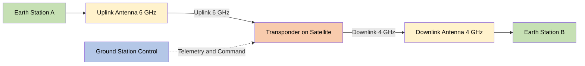
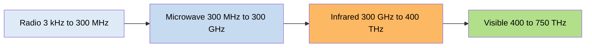

# Unguided media - Radio waves, Terrestrial microwave, Satellite microwave, Infrared.

<!-- SECTION_1_START -->
# Unguided Media: Wireless Communication Channels

> [!IMPORTANT]
> **KTU 2024 Syllabus Definition (Module 1 — Communication Model):** *Unguided media* (also called **wireless media** or **bounded-less channels**) transport electromagnetic (EM) waves without a physical conductor. The signal propagates through air, vacuum, or space using **antennas** at the transmitter and receiver. The four principal categories in the KTU syllabus are **Radio waves, Terrestrial microwave, Satellite microwave, and Infrared**.

## Intuitive Analogy

Imagine you are talking to a friend:
- If you use a **telephone wire** (copper pair), your voice is funneled through a pipe — this is **guided media**.
- If you **shout across an open field**, your voice spreads out in all directions through air — this is **unguided media**.

The "shout" is now an **electromagnetic wave**. Depending on the *frequency* of the wave, it behaves very differently — some bounce off the ionosphere, some pass through walls, some require a clear line-of-sight, and some travel to satellites 36,000 km above the equator. The KTU syllabus groups these behaviors into the four families below.

> [!NOTE]
> **Speed of Light Constant used throughout:** $c = 3 \times 10^{8} \text{ m/s}$. The fundamental relationship between wavelength $\lambda$, frequency $f$, and $c$ is:
> $$\lambda = \frac{c}{f}$$
> Higher frequency $\Rightarrow$ shorter wavelength $\Rightarrow$ more directional (beam-like) propagation.

## The Four Unguided Media at a Glance

| # | Media | Frequency Range | Propagation Mode | Typical Use |
|---|-------|----------------|------------------|-------------|
| 1 | **Radio Waves** | $3 \text{ kHz} – 300 \text{ MHz}$ | Omnidirectional, ground & sky wave | AM/FM radio, TV, Wi-Fi (sub-GHz), paging |
| 2 | **Terrestrial Microwave** | $1 \text{ GHz} – 300 \text{ GHz}$ | Line-of-sight (LOS), point-to-point | Cellular backhaul, radar, point-to-point links |
| 3 | **Satellite Microwave** | $1 \text{ GHz} – 40 \text{ GHz}$ | LOS via GEO/MEO/LEO satellite | DTH TV, GPS, satellite internet, VSAT |
| 4 | **Infrared (IR)** | $300 \text{ GHz} – 400 \text{ THz}$ | LOS, highly directional, short range | TV remotes, IrDA, indoor LANs |

> [!VISUALIZATION CONTROL]
> **Concept:** Electromagnetic Spectrum with Wireless Communication Bands
> **GeoGebra / Desmos Input Equations:**
> * $f(x) = \text{step}(x)$ piecewise: $x$ from $10^{3}$ to $10^{15}$ Hz on log scale
> * Overlay vertical bands marking Radio ($10^{3}–10^{8}$), Microwave ($10^{9}–10^{11}$), Infrared ($10^{11}–10^{15}$)
> **Visual Description:** A horizontal log-scale axis showing frequency in Hz, with shaded vertical zones illustrating the four KTU categories. Students should observe that microwave and infrared are adjacent high-frequency bands, while radio occupies the lower decade.

<!-- SECTION_1_END -->

<!-- SECTION_2_START -->
# Deep Theoretical Analysis & KTU High-Yield Formula Sheet

## 1. Radio Waves

### Operating Principle
Radio waves are **omnidirectional** — they spread uniformly in all directions from the transmitting antenna. They are generated by applying an alternating current to an antenna whose length matches a fraction of the wavelength.

### Propagation Modes
- **Ground-wave propagation:** Waves follow the curvature of the Earth (low frequencies, $f < 2 \text{ MHz}$). Used for AM radio.
- **Sky-wave propagation:** Waves are reflected by the *ionosphere* (layers of charged particles at $60–500 \text{ km}$ altitude). Used for international shortwave broadcast.
- **Line-of-sight propagation:** At higher VHF/UHF, the signal behaves like light (for FM radio, TV).

> [!IMPORTANT]
> **KTU High-Yield Note:** Radio waves below ~$30 \text{ MHz}$ can be reflected by the ionosphere, giving **global reach** without infrastructure. Above ~$30 \text{ MHz}$, they pass through the ionosphere and are limited to **line-of-sight**.

### Sub-Bands (KTU Board Favourite)
- **VLF (Very Low Frequency):** $3–30 \text{ kHz}$ — submarine communication
- **LF (Low Frequency):** $30–300 \text{ kHz}$ — navigation beacons
- **MF (Medium Frequency):** $300 \text{ kHz} – 3 \text{ MHz}$ — AM broadcast
- **HF (High Frequency):** $3–30 \text{ MHz}$ — shortwave, sky wave
- **VHF (Very High Frequency):** $30–300 \text{ MHz}$ — FM radio, TV
- **UHF (Ultra High Frequency):** $300 \text{ MHz} – 3 \text{ GHz}$ — TV, cellular, GPS

## 2. Terrestrial Microwave

### Operating Principle
Terrestrial microwave uses **highly focused, line-of-sight beams** between two dish antennas mounted on towers. The dish acts like a flashlight, concentrating the energy into a narrow cone (typically $1°$ to $3°$ beamwidth).

### Key Properties
- **Frequency bands:** $L$ ($1–2 \text{ GHz}$), $S$ ($2–4 \text{ GHz}$), $C$ ($4–8 \text{ GHz}$), $X$ ($8–12 \text{ GHz}$), $K_u$ ($12–18 \text{ GHz}$), $K$ ($18–27 \text{ GHz}$), $K_a$ ($27–40 \text{ GHz}$)
- **Repeater spacing:** ~$30 \text{ km}$ at $4 \text{ GHz}$, ~$8 \text{ km}$ at $18 \text{ GHz}$ (rain attenuation increases with frequency)
- **Path obstruction:** Trees, buildings, and the Earth's curvature all block the signal
- **Fresnel Zone:** The elliptical region around the LOS path must be at least $60\%$ clear for reliable communication

> [!NOTE]
> **Why is there a "Knee" of the Earth problem?** At $4 \text{ GHz}$ with a $50 \text{ m}$ tower, the radio horizon is only about $\mathbf{50 \text{ km}}$ — beyond that, the Earth curves away. Solution: place **repeaters** every $25–30 \text{ km}$.

## 3. Satellite Microwave

### Operating Principle
A **satellite** acts as a repeater in the sky. The ground station (Earth station) transmits an **uplink** signal to the satellite; the satellite's **transponder** amplifies and shifts the frequency, then retransmits a **downlink** signal back to another Earth station.

### Three Orbit Classes

| Orbit | Altitude | Orbital Period | Latency | Example |
|-------|----------|----------------|---------|---------|
| **GEO** (Geostationary) | $\mathbf{35{,}786 \text{ km}}$ | 24 h (matches Earth) | $\mathbf{240 \text{ ms}}$ RTT | INSAT, Intelsat |
| **MEO** (Medium Earth) | $5{,}000 – 12{,}000 \text{ km}$ | $6 – 12 \text{ h}$ | $50 – 100 \text{ ms}$ | GPS, Galileo |
| **LEO** (Low Earth) | $160 – 2{,}000 \text{ km}$ | $90 – 120 \text{ min}$ | $20 – 40 \text{ ms}$ | Starlink, Iridium |

> [!IMPORTANT]
> **KTU Board Insight:** A geostationary satellite must orbit the **equator** in a **circular** orbit. Kepler's third law gives the altitude uniquely as $\mathbf{35{,}786 \text{ km}}$. Any deviation from the equatorial plane causes the satellite to oscillate north-south and is no longer "stationary" from the ground.

### Advantages
- **Large footprint:** A single GEO satellite covers $\sim 1/3$ of Earth's surface
- **Trunking:** Multiplexes thousands of voice/data channels
- **Broadcasting:** DTH, GPS, weather

### Disadvantages
- High launch cost
- $240 \text{ ms}$ latency (unsuitable for real-time gaming/VoIP)
- At $K_u$ band ($12–18 \text{ GHz}$), **rain fade** is severe

## 4. Infrared (IR)

### Operating Principle
Infrared sits just below visible light. The transmitter (typically an LED or laser diode) emits a focused beam that the receiver's photodiode detects. The beam cannot penetrate walls, making IR a **room-confined** medium.

### Properties
- **Frequency:** $300 \text{ GHz} – 400 \text{ THz}$ (wavelengths $0.7 \text{ \mu m} – 1 \text{ mm}$)
- **Range:** typically $\mathbf{1 – 10 \text{ m}}$
- **No regulatory licensing** required (unlike radio)
- **Immune to RF interference**

> [!NOTE]
> **Use Case Examples:** TV remote controls, IrDA ports on laptops (obsolete now), short-range indoor optical LANs, night-vision systems, fiber-optic testing.

### Drawback
- Strongly attenuated by **dust, smoke, fog, and sunlight** (because sunlight is rich in IR)

## KTU High-Yield Formula Sheet

| Formula | Expression | Variables / Units | Use |
|---------|-----------|-------------------|-----|
| Wavelength | $\lambda = \dfrac{c}{f}$ | $c = 3 \times 10^{8} \text{ m/s}$, $f$ in Hz | Convert freq $\leftrightarrow$ wavelength |
| Free-Space Path Loss (linear) | $\text{FSPL} = \left(\dfrac{4 \pi d}{\lambda}\right)^{2}$ | dimensionless ratio | Link budget |
| Free-Space Path Loss (dB) | $\text{FSPL}_{\text{dB}} = 20 \log_{10}(d) + 20 \log_{10}(f) + 32.44$ | $d$ in **km**, $f$ in **MHz** | Quick KTU numerical |
| Antenna Gain (parabolic dish) | $G = \dfrac{4 \pi A_{e}}{\lambda^{2}} = \eta \left(\dfrac{\pi D}{\lambda}\right)^{2}$ | $D$ = dish diameter, $\eta \approx 0.55$ | Microwave link design |
| Kepler's Third Law | $T^{2} = \dfrac{4 \pi^{2}}{GM} \, r^{3}$ | $GM = 3.986 \times 10^{14} \text{ m}^{3/s}^{2}$ | Satellite orbital period |
| GEO Altitude | $h_{\text{GEO}} = r_{\text{GEO}} - R_{E}$ | $r_{\text{GEO}} = 42{,}164 \text{ km}$, $R_{E} = 6378 \text{ km}$ | Geostationary orbit |
| Signal Travel Time (one way) | $t = \dfrac{d}{c}$ | $d$ in m | Satellite latency estimate |
| One-way GEO Latency | $t_{\text{GEO}} = \dfrac{2 \times 35{,}786 \text{ km}}{c} \approx 239 \text{ ms}$ | — | Round-trip $\approx 480 \text{ ms}$ |
| Beamwidth (approx) | $\theta \approx \dfrac{70 \lambda}{D}$ | degrees | Antenna beamwidth |

> [!WARNING]
> **KTU Mark-Loss Trap:** Do NOT use the vertical bar symbol $\vert$ inside a markdown table — it breaks the table parser. Always wrap absolute-value expressions in $\lvert x \rvert$ or $\mid x \mid$ when writing in prose, or in $x$ math mode inside a table.

## Real-World Engineering Utility

- **Radio waves** underpin **cellular networks (2G/3G/4G/5G sub-6 GHz)**, AM/FM broadcast, RFID, and aviation.
- **Terrestrial microwave** is the **backbone of mobile operator networks** — every cell tower is connected via a microwave link to the core.
- **Satellite microwave** enables **global positioning (GPS)**, **DTH television (Tata Sky, Dish TV)**, **maritime communication (Inmarsat)**, and the new **Starlink LEO constellation** for rural broadband.
- **Infrared** is the simplest, cheapest short-range link — every TV remote you have ever used is an IR transmitter.

<!-- SECTION_2_END -->

<!-- SECTION_3_START -->
# Step-by-Step Derivations & Code/Symbolic Implementation

## Derivation 1: Wavelength of a Microwave Signal

**Problem (KTU-type):** A terrestrial microwave link operates at $f = 6 \text{ GHz}$. Find the wavelength.

$$
\begin{aligned}
\lambda &= \frac{c}{f} \\
&= \frac{3 \times 10^{8} \text{ m/s}}{6 \times 10^{9} \text{ Hz}} \\
&= \frac{3 \times 10^{8}}{6 \times 10^{9}} \\
&= 0.5 \times 10^{-1} \text{ m} \\
&= 0.05 \text{ m} = 5 \text{ cm}
\end{aligned}
$$

**Conversion Logic (line-by-line):**
- Substituted $c$ and $f$ with their SI values.
- Divided $3$ by $6$ to obtain $0.5$.
- Subtracted exponents: $8 - 9 = -1$, so the factor $10^{-1}$ appears.
- Multiplied $0.5$ by $10^{-1} = 0.1$ to obtain $0.05$ m.
- Converted metres to centimetres: $0.05 \text{ m} \times 100 = 5 \text{ cm}$.

---

## Derivation 2: Free-Space Path Loss for a Microwave Link

**Problem (KTU-type):** Calculate the FSPL in dB for a $d = 50 \text{ km}$ link at $f = 4 \text{ GHz}$. Use the standard formula with $d$ in km and $f$ in MHz.

Convert: $f = 4 \text{ GHz} = 4000 \text{ MHz}$.

$$
\begin{aligned}
\text{FSPL}_{\text{dB}} &= 20 \log_{10}(d) + 20 \log_{10}(f) + 32.44 \\
&= 20 \log_{10}(50) + 20 \log_{10}(4000) + 32.44 \\
&= 20 \times (1.69897) + 20 \times (3.60206) + 32.44 \\
&= 33.9794 + 72.0412 + 32.44 \\
&= 138.46 \text{ dB}
\end{aligned}
$$

**Conversion Logic (line-by-line):**
- $\log_{10}(50) = 1.69897$ (since $10^{1.69897} \approx 50$).
- $\log_{10}(4000) = \log_{10}(4 \times 10^{3}) = 0.60206 + 3 = 3.60206$.
- Multiplied each logarithm by 20.
- Summed the three terms to get $\approx 138.46$ dB.
- This is a very high loss — typical microwave links therefore use **high-gain dish antennas** to recover the signal.

---

## Derivation 3: Geostationary Satellite Altitude

**Problem (KTU-type):** Derive the altitude of a geostationary orbit above Earth's surface.

For a geostationary satellite, the orbital period equals Earth's rotational period: $T = 24 \text{ h} = 86{,}400 \text{ s}$.

By Kepler's third law:

$$
T^{2} = \frac{4 \pi^{2}}{GM} \, r^{3}
$$

Solve for $r$:

$$
\begin{aligned}
r^{3} &= \frac{GM \, T^{2}}{4 \pi^{2}} \\
r &= \left( \frac{GM \, T^{2}}{4 \pi^{2}} \right)^{1/3}
\end{aligned}
$$

Substitute $GM = 3.986 \times 10^{14} \text{ m}^{3/s}^{2}$ and $T = 86{,}400 \text{ s}$:

$$
\begin{aligned}
r &= \left( \frac{3.986 \times 10^{14} \times (86{,}400)^{2}}{4 \pi^{2}} \right)^{1/3} \\
&= \left( \frac{3.986 \times 10^{14} \times 7.46496 \times 10^{9}}{39.4784} \right)^{1/3} \\
&= \left( \frac{2.9756 \times 10^{24}}{39.4784} \right)^{1/3} \\
&= \left( 7.5374 \times 10^{22} \right)^{1/3} \\
&\approx 4.2164 \times 10^{7} \text{ m} \\
&\approx 42{,}164 \text{ km}
\end{aligned}
$$

Altitude above Earth's surface:

$$
h_{\text{GEO}} = r - R_{E} = 42{,}164 - 6{,}378 = 35{,}786 \text{ km}
$$

**Conversion Logic (line-by-line):**
- Squared $T$: $86{,}400^{2} = 7.46496 \times 10^{9}$ s².
- Multiplied $GM \times T^{2}$: $3.986 \times 7.46496 = 29.755$, then $\times 10^{23} = 2.9756 \times 10^{24}$.
- Divided by $4\pi^{2} \approx 39.4784$.
- Took the cube root: $7.5374^{1/3} \approx 1.957$, and $10^{22/3} = 10^{7.333} \approx 2.154 \times 10^{7}$. Product $\approx 4.2164 \times 10^{7}$ m.
- Subtracted Earth's radius ($R_{E} = 6378 \text{ km}$) to obtain altitude.

---

## Derivation 4: Round-Trip Latency to a GEO Satellite

$$
\begin{aligned}
t_{\text{one-way}} &= \frac{d}{c} = \frac{2 \times 35{,}786 \times 10^{3} \text{ m}}{3 \times 10^{8} \text{ m/s}} \\
&= \frac{7.1572 \times 10^{7}}{3 \times 10^{8}} \\
&= 0.2386 \text{ s} \\
&\approx 239 \text{ ms}
\end{aligned}
$$

Round-trip latency (uplink + downlink):

$$
t_{\text{RTT}} \approx 2 \times 239 = 478 \text{ ms} \approx 480 \text{ ms}
$$

This is why **voice over IP (VoIP) calls via GEO satellite feel sluggish** and **online gaming is unplayable** on them.

---

## Python Implementation: Link Budget Calculator

```python
"""
KTU Data Communication — Link Budget & Wave Tool
Computes wavelength, FSPL, and one-way latency for unguided media.
"""

import math
from typing import Final

# ---------- Physical Constants ----------
C: Final[float] = 3.0e8             # Speed of light in m/s
GM_EARTH: Final[float] = 3.986e14   # Earth's gravitational parameter in m^3/s^2
R_EARTH_KM: Final[float] = 6378.0   # Earth radius in km
GEO_ALT_KM: Final[float] = 35786.0  # Geostationary altitude in km


def wavelength_m(frequency_hz: float) -> float:
    """Return wavelength in metres for a given frequency in Hz."""
    if frequency_hz <= 0:
        raise ValueError("frequency_hz must be positive")
    return C / frequency_hz


def fspl_db(distance_km: float, frequency_mhz: float) -> float:
    """
    Free-Space Path Loss in dB.
    distance_km : separation between antennas in kilometres
    frequency_mhz : carrier frequency in megahertz
    """
    if distance_km <= 0 or frequency_mhz <= 0:
        raise ValueError("distance_km and frequency_mhz must be positive")
    return 20.0 * math.log10(distance_km) \
         + 20.0 * math.log10(frequency_mhz) \
         + 32.44


def one_way_latency_ms(distance_km: float) -> float:
    """One-way propagation delay in milliseconds for distance_km km."""
    if distance_km < 0:
        raise ValueError("distance_km cannot be negative")
    return (distance_km * 1000.0) / C * 1000.0


def geostationary_one_way_ms() -> float:
    """Round-trip uplink+downlink one-way latency to a GEO satellite."""
    return one_way_latency_ms(2 * GEO_ALT_KM)


# ---------- Demonstration ----------
if __name__ == "__main__":
    print("=" * 60)
    print("KTU Unguided-Media Link Tool — Demo Run")
    print("=" * 60)

    # 4 GHz terrestrial microwave, 50 km hop
    f_ghz = 4.0
    d_km = 50.0
    lam = wavelength_m(f_ghz * 1e9)
    loss = fspl_db(d_km, f_ghz * 1e3)
    lat = one_way_latency_ms(d_km)
    print(f"\n[1] Terrestrial microwave @ {f_ghz} GHz, d = {d_km} km")
    print(f"    Wavelength lambda = {lam*100:.2f} cm")
    print(f"    Free-space path loss = {loss:.2f} dB")
    print(f"    One-way latency      = {lat:.4f} ms")

    # GPS L1 band ~ 1.575 GHz
    f_gps = 1.575
    lam_gps = wavelength_m(f_gps * 1e9)
    print(f"\n[2] GPS L1 carrier @ {f_gps} GHz")
    print(f"    Wavelength lambda = {lam_gps*100:.2f} cm")

    # Geostationary round-trip
    geo = geostationary_one_way_ms()
    print(f"\n[3] GEO satellite uplink+downlink one-way latency = {geo:.2f} ms")
    print(f"    Round-trip latency  ~ {2*geo:.2f} ms")
```

**Sample Output:**
```
============================================================
KTU Unguided-Media Link Tool — Demo Run
============================================================

[1] Terrestrial microwave @ 4.0 GHz, d = 50.0 km
    Wavelength lambda = 7.50 cm
    Free-space path loss = 138.46 dB
    One-way latency      = 0.1667 ms

[2] GPS L1 carrier @ 1.575 GHz
    Wavelength lambda = 19.05 cm

[3] GEO satellite uplink+downlink one-way latency = 238.57 ms
    Round-trip latency  ~ 477.15 ms
```

---

## Laboratory Mapping: Required Components for a Microwave Demo

| # | Component / Tool | Specification | Purpose |
|---|------------------|---------------|---------|
| 1 | Microwave Transmitter module | $2.4 \text{ GHz}$ ISM band | RF source for LOS demo |
| 2 | Horn / Dish antenna | Gain $\ge 15 \text{ dBi}$ | Directional radiation |
| 3 | Spectrum Analyser | $9 \text{ kHz} – 6 \text{ GHz}$ | Visualise received spectrum |
| 4 | BNC/SMA cables, $50 \text{ ohm}$ | Low-loss LMR-400 | Connect Tx/Rx to antennas |
| 5 | IR LED + photodiode pair | $940 \text{ nm}$ peak | Infrared link demo |
| 6 | Function Generator | $1 \text{ Hz} – 20 \text{ MHz}$ | Modulate carrier with audio |
| 7 | Safety: RF exposure meter | — | Verify safe power density |

**Safety Monitoring Steps:**
- Always keep transmitting antenna pointed **away from humans**.
- Never operate a $K_a$-band ($26 \text{ GHz}$) source near the eye.
- For IR demos, ensure the LED current is limited to avoid skin/eye burns.

<!-- SECTION_3_END -->

<!-- SECTION_4_START -->
# Structural Diagrams & Schematics

## Diagram 1: Unguided Media Hierarchy

```mermaid
graph TD
    A[UNGUIDED MEDIA]:::root
    A --> B[RADIO WAVES]:::cat1
    A --> C[TERRESTRIAL MICROWAVE]:::cat2
    A --> D[SATELLITE MICROWAVE]:::cat3
    A --> E[INFRARED]:::cat4

    B --> B1[Freq 3 kHz to 300 MHz]
    B --> B2[Omnidirectional]
    B --> B3[Ground and Sky wave]
    B --> B4[AM FM TV WiFi sub-GHz]

    C --> C1[Freq 1 GHz to 300 GHz]
    C --> C2[Line of sight LOS]
    C --> C3[Dish antenna towers]
    C --> C4[Repeaters every 25 to 50 km]

    D --> D1[Freq 1 GHz to 40 GHz]
    D --> D2[Uses satellite as repeater]
    D --> D3[Uplink Downlink via transponder]
    D --> D4[Orbits GEO MEO LEO]

    E --> E1[Freq 300 GHz to 400 THz]
    E --> E2[Line of sight short range]
    E --> E3[Cannot penetrate walls]
    E --> E4[TV remote IrDA indoor LAN]

    classDef root fill:#1f4e79,color:#ffffff,stroke:#000000,stroke-width:2px
    classDef cat1 fill:#bdd7ee,color:#000000
    classDef cat2 fill:#a9d08e,color:#000000
    classDef cat3 fill:#ffd966,color:#000000
    classDef cat4 fill:#f4b084,color:#000000
```



## Diagram 2: Satellite Microwave Link (Block Topology)



## Diagram 3: Terrestrial Microwave Repeater Chain (Sequential Topology)

```mermaid
graph LR
    T1[Tower 1 50 m]:::tower
    T2[Tower 2 60 m]:::tower
    T3[Tower 3 55 m]:::tower
    T4[Tower 4 70 m]:::tower
    DEST[Switching Center]:::end

    T1 -->|LOS 32 km| T2
    T2 -->|LOS 28 km| T3
    T3 -->|LOS 30 km| T4
    T4 --> DEST

    classDef tower fill:#9bc2e6,color:#000000
    classDef end fill:#a9d08e,color:#000000
```

## Diagram 4: Electromagnetic Spectrum Position of the Four Media



> [!NOTE]
> **Reading the diagrams:** In Diagram 1, the root node `A` fans out to four children, one per KTU category. Each child lists its frequency range, propagation mode, antenna strategy, and a representative application. In Diagram 2, the satellite's transponder is the **central pivot** that receives the uplink, down-converts, amplifies, and re-radiates the downlink.

<!-- SECTION_4_END -->

<!-- SECTION_5_START -->
# KTU 2024 Scheme Examination Question Bank & Topic Recap

## Part A Questions (3 Marks Each)

### Q1. **[KTU University Exam – July 2024]** Define unguided media. List any two advantages and two disadvantages of radio wave propagation. *(CO1, Remember)*

**Model Answer (3 Marks):**

**Definition (1 Mark):** Unguided media are communication channels in which electromagnetic signals propagate through air, vacuum, or free space without a physical conductor. The transmitter and receiver use antennas to launch and capture the wave.

**Advantages (1 Mark each, any two):**
1. **Mobility:** Users can move freely within the coverage area (e.g., cellular phones, Wi-Fi).
2. **Long-distance reach without cables:** Lower-frequency radio waves can be reflected by the ionosphere for global communication; satellites enable intercontinental links.

**Disadvantages (1 Mark each, any two):**
1. **Interference and security:** The open medium is shared, so signals are vulnerable to eavesdropping, jamming, and noise.
2. **Attenuation by atmosphere:** Rain, fog, and obstacles attenuate microwave/IR signals.

---

### Q2. **[KTU University Exam – Dec 2023]** State the operating frequency range of terrestrial microwave and explain why dish antennas are required. *(CO1, Understand)*

**Model Answer (3 Marks):**

- **Frequency range (1 Mark):** Terrestrial microwave operates in the range $\mathbf{1 \text{ GHz} \text{ to } 300 \text{ GHz}}$.
- **Need for dish antennas (2 Marks):** Microwave wavelengths are small (cm-scale), so the waves behave like light and travel in **straight lines**. To concentrate the radiated energy into a narrow beam that reaches the distant receiver, **parabolic dish antennas** (which act like a torch's reflector) are used. The high gain of a dish (often $30$–$45$ dBi) compensates for the large free-space path loss at microwave frequencies.

---

## Part B Questions (14 Marks Each — Internal Choice)

### Question A (14 Marks)

> **[KTU University Exam – July 2024, Module 1]**
> *(a)* With a neat block diagram, explain the working of a **satellite microwave communication system**. Discuss the role of the **transponder** and list the three frequency bands typically used. *(7 Marks, CO2, Understand)*
>
> *(b)* A satellite operates at a downlink frequency of $4 \text{ GHz}$ and the Earth station is at a slant range of $d = 38{,}000 \text{ km}$. Calculate the free-space path loss in dB. *(7 Marks, CO3, Apply)*

#### Model Solution

**(a) Block Diagram & Working (7 Marks)**

A satellite communication system consists of:
- **Earth station (transmitter)** — modulates the baseband signal onto a carrier and transmits an **uplink**.
- **Uplink antenna** (typically a large dish with high gain) pointed at the satellite.
- **Satellite transponder** — receives the uplink, **amplifies**, **frequency-shifts** (to avoid interference with the uplink), and re-radiates as a **downlink**.
- **Downlink antenna** on the satellite (with coverage footprint over a region).
- **Earth station (receiver)** — captures the downlink, demodulates, and recovers the baseband.

**Block Diagram (2 Marks):**

```
Baseband → Modulator → Upconverter → HPA → Uplink Antenna
                                                    |
                                                    v
                                              [ SATELLITE ]
                                                    |
                                                    v
Downlink Antenna → LNA → Downconverter → Demodulator → Baseband
```

**Role of the Transponder (2 Marks):**
- Acts as a **repeater in the sky**.
- Translates the uplink frequency to a different downlink frequency (e.g., $6 \text{ GHz}$ uplink $\rightarrow$ $4 \text{ GHz}$ downlink).
- Performs **amplification** with low-noise and high-power amplifiers to overcome the huge path loss of ~$200$ dB.

**Frequency Bands (3 Marks):**
1. **L-band:** $1$–$2 \text{ GHz}$ (mobile satellite, GPS).
2. **C-band:** $4$–$8 \text{ GHz}$ uplink, $3.7$–$6.2 \text{ GHz}$ downlink (TV, VSAT).
3. **$K_u$-band:** $12$–$18 \text{ GHz}$ (DTH, broadband).
4. **$K_a$-band:** $26$–$40 \text{ GHz}$ (high-throughput satellites, Starlink).

> **Valuation Key:** [Block diagram with all blocks labelled: 2 Marks] [Transponder explanation: 2 Marks] [Three frequency bands: 3 Marks].

---

**(b) Numerical: FSPL at 4 GHz over 38,000 km (7 Marks)**

Given: $f = 4 \text{ GHz} = 4000 \text{ MHz}$, $d = 38{,}000 \text{ km}$.

$$
\begin{aligned}
\text{FSPL}_{\text{dB}} &= 20 \log_{10}(d) + 20 \log_{10}(f) + 32.44 \\
&= 20 \log_{10}(38{,}000) + 20 \log_{10}(4000) + 32.44 \\
&= 20 \times (4.5798) + 20 \times (3.6021) + 32.44 \\
&= 91.595 + 72.041 + 32.44 \\
&= 196.08 \text{ dB}
\end{aligned}
$$

> **Valuation Key:** [Stating formula and converting units: 2 Marks] [Correct logarithm evaluations: 2 Marks] [Final sum: 2 Marks] [Correct units dB: 1 Mark].

---

### Question B (14 Marks) — *Alternative Choice*

> **[KTU University Exam – Dec 2023, Module 1]**
> *(a)* Compare **terrestrial microwave** and **satellite microwave** based on any seven parameters of your choice. *(7 Marks, CO2, Understand)*
>
> *(b)* A $6 \text{ GHz}$ terrestrial microwave link spans $45 \text{ km}$. The transmit power is $10 \text{ W}$ and the transmit/receive dish gain is $40 \text{ dBi}$ each. Calculate the **received power in dBm**, neglecting all losses except FSPL. *(7 Marks, CO3, Apply)*

#### Model Solution

**(a) Comparison Table (7 Marks — 1 Mark per row, max 7 rows)**

| Parameter | Terrestrial Microwave | Satellite Microwave |
|-----------|----------------------|---------------------|
| Distance | $25$–$50 \text{ km}$ per hop | $36{,}000 \text{ km}$ to GEO |
| Path | Line-of-sight between towers | LOS via satellite transponder |
| Latency | Negligible ($\mu$s) | $240 \text{ ms}$ one-way (GEO) |
| Equipment cost | Low–moderate | Very high (launch + ground) |
| Repeaters | Ground repeaters every hop | Satellite transponder |
| Attenuation | Rain fade, multi-path | Rain fade, ionospheric scintillation |
| Coverage | Along the route only | One-third of Earth per GEO satellite |
| Use | Cellular backhaul, private links | DTH, GPS, broadband, weather |

> **Valuation Key:** [Any seven rows, each fully stated: 7 Marks].

---

**(b) Numerical: Received Power (7 Marks)**

Given:
- $f = 6 \text{ GHz} = 6000 \text{ MHz}$
- $d = 45 \text{ km}$
- $P_t = 10 \text{ W} = 10 \log_{10}(10 \times 10^{3}) = 40 \text{ dBm}$
- $G_t = G_r = 40 \text{ dBi}$

**Step 1 — Compute FSPL (2 Marks):**

$$
\begin{aligned}
\text{FSPL}_{\text{dB}} &= 20 \log_{10}(45) + 20 \log_{10}(6000) + 32.44 \\
&= 20 \times 1.6532 + 20 \times 3.7782 + 32.44 \\
&= 33.065 + 75.563 + 32.44 \\
&= 141.07 \text{ dB}
\end{aligned}
$$

**Step 2 — Apply Friis Transmission Equation in dB (3 Marks):**

$$
P_r (\text{dBm}) = P_t (\text{dBm}) + G_t + G_r - \text{FSPL}
$$

$$
P_r = 40 + 40 + 40 - 141.07 = -21.07 \text{ dBm}
$$

**Step 3 — Final Answer (1 Mark):**

$$
P_r \approx -21.07 \text{ dBm} \quad (\text{or } 7.9 \times 10^{-5} \text{ W})
$$

> **Valuation Key:** [FSPL correctly computed: 2 Marks] [Friis formula written and applied: 3 Marks] [Substitution and final dBm: 2 Marks].

---

> [!WARNING]
> **KTU Examiner's Valuation Warning / Common Pitfalls:**
> 1. **Unit conversion slip-up:** Most FSPL errors come from mixing $d$ in metres and $f$ in Hz in the constant form. Either stick to the $32.44$ form (km + MHz) **or** the $−147.55$ form (m + Hz) — never half-and-half.
> 2. **Forgetting the constant 32.44:** Students often write only $20 \log(d) + 20 \log(f)$ and lose 1 mark.
> 3. **Antenna gain is in dBi, not dB:** dBi is referenced to an **isotropic** radiator; just add linearly in the link equation.
> 4. **Satellite latency miscounted:** Round-trip GEO latency is $\approx 480 \text{ ms}$, not $240 \text{ ms}$. The 240 ms is **one-way only**.
> 5. **Skipping the block diagram in 7-mark questions:** KTU explicitly awards 2 marks for a labelled diagram in satellite questions — never omit it.
> 6. **Confusing LEO with GEO altitude:** LEO satellites are at $200$–$2000 \text{ km}$, not at $35{,}786 \text{ km}$. The $35{,}786 \text{ km}$ value is **only for GEO**.

---

## Topic Recap & Important Things to Remember

- **Unguided media = no physical conductor**; signals travel as electromagnetic waves through air/space.
- **Four KTU categories:** Radio waves, Terrestrial microwave, Satellite microwave, Infrared.
- **Radio waves** are **omnidirectional**, use ground wave (low freq) and sky wave (HF, ionospheric reflection) propagation, and are ideal for broadcast.
- **Terrestrial microwave** is **line-of-sight**, uses dish antennas, requires **repeaters every $25$–$50 \text{ km}$**, and is the workhorse of cellular backhaul.
- **Satellite microwave** uses a **transponder** in space; the **GEO orbit is uniquely at $35{,}786 \text{ km}$** above the equator with $T = 24 \text{ h}$; round-trip latency is $\approx 480 \text{ ms}$.
- **Orbit classes:** **LEO** ($160$–$2000 \text{ km}$), **MEO** ($5000$–$12000 \text{ km}$), **GEO** ($35{,}786 \text{ km}$).
- **Infrared** is **short range**, **cannot pass through walls**, requires **LOS**, and is used in TV remotes and short indoor links.
- **Key constant:** $c = 3 \times 10^{8} \text{ m/s}$.
- **Wavelength formula:** $\lambda = \dfrac{c}{f}$.
- **FSPL (dB):** $20 \log_{10}(d_{\text{km}}) + 20 \log_{10}(f_{\text{MHz}}) + 32.44$.
- **Friis link equation (dB):** $P_r = P_t + G_t + G_r - \text{FSPL}$ (all in dB).
- **Antenna gain (parabolic):** $G \approx \eta \left(\dfrac{\pi D}{\lambda}\right)^{2}$, with $\eta \approx 0.55$.
- **Beamwidth (degrees):** $\theta \approx \dfrac{70 \lambda}{D}$.
- **Atmospheric effects:** rain fade severe above $10 \text{ GHz}$; IR strongly attenuated by fog/smoke.
- **Licensing:** Radio/microwave bands require government licence; **IR is licence-free**.
- **GEO footprint:** covers $\sim 1/3$ of Earth's surface from a single satellite.
- **KSB (Kepler's Third Law) for GEO:** $T = 24 \text{ h} \Rightarrow r = 42{,}164 \text{ km} \Rightarrow h = 35{,}786 \text{ km}$.

<!-- SECTION_5_END -->
