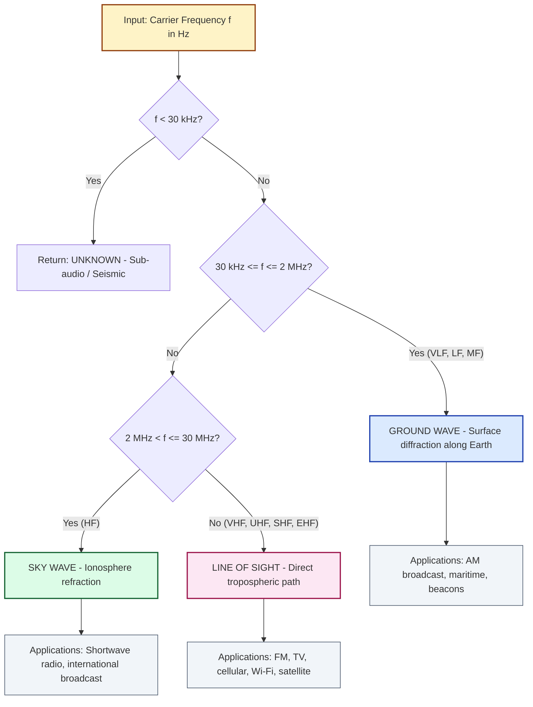
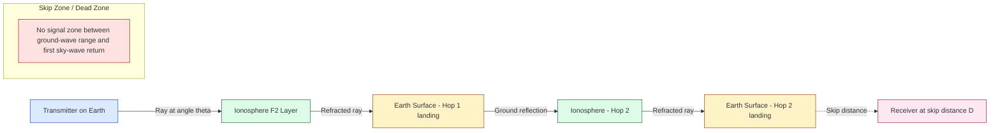
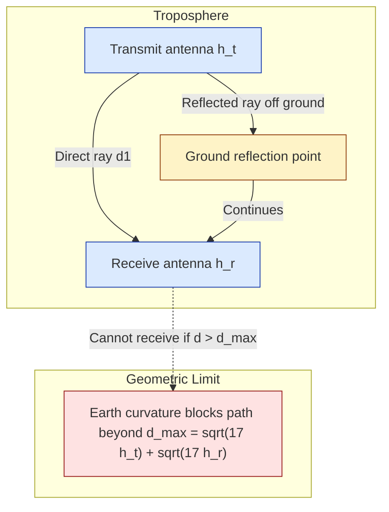

# Wireless propagation - Ground wave propagation, Sky wave propagation, Line-of-Sight (LoS) propagation.

<!-- SECTION_1_START -->
# Wireless Propagation — Communication Model

## 1.1 Core Technical Definition

> [!IMPORTANT]
> **Wireless Propagation** is the mechanism by which a radio-frequency (RF) electromagnetic wave travels from a transmitting antenna to a receiving antenna through the natural transmission medium (free space, Earth's surface, or the ionosphere) without the use of any artificial wired guide.

In the **KTU 2024 Scheme (OECST612 — Data Communication)**, propagation is formally classified into **three primary modes** based on the interaction of the radiated EM wave with the Earth's surface and the ionized upper atmosphere (the **ionosphere**):

| Mode | Frequency Band | Dominant Physical Phenomenon |
| :--- | :--- | :--- |
| **Ground Wave (Surface Wave)** | $\mathbf{30\ kHz\ -\ 2\ MHz}$ (VLF, LF, MF) | Diffraction along Earth's curved surface |
| **Sky Wave (Ionospheric Wave)** | $\mathbf{2\ MHz\ -\ 30\ MHz}$ (HF) | Refraction / reflection by ionospheric layers |
| **Line-of-Sight (Space Wave)** | $\mathbf{>30\ MHz}$ (VHF, UHF, SHF, EHF) | Direct / quasi-optical straight-line travel |

> [!NOTE]
> **Why does frequency decide the mode?**
> The EM wavelength $\lambda$ decides how a wave interacts with physical obstacles. When $\lambda$ is **large** (low frequency), the wave *bends* around the Earth and obstacles (Huygens' diffraction). When $\lambda$ is **small** (high frequency), the wave behaves like a light ray and needs a clear path.

---

## 1.2 Intuitive Analogies (Plain-English Overview)

### 🌍 Ground Wave → "Water hugging the shore"
Imagine pouring water on a tilted tray. The water does **not shoot straight**; it **clings to the surface and flows along the curvature**, gradually losing energy as it rubs against the surface. Similarly, a low-frequency EM wave **clings to the Earth's curvature** and is attenuated by the ground's conductivity.

### ☁️ Sky Wave → "Bouncing a ball off a glass ceiling"
Imagine throwing a ball inside a room. The ball hits the **glass ceiling** (the ionosphere), bounces down to the floor (Earth), then bounces back up to the ceiling again. Each bounce lets the signal travel **thousands of kilometers**, far beyond the horizon. The "glass ceiling" here is the ionized **F2 layer** of the ionosphere.

### 📡 Line-of-Sight → "A flashlight beam"
Imagine a flashlight. The light travels in a **straight line** and is blocked by walls. Similarly, VHF/UHF/microwave signals travel in nearly straight lines and are obstructed by hills, buildings, and even the curvature of the Earth. The **higher the antenna**, the **farther** the beam can reach.

---

## 1.3 Physical Constants & Standards

> [!IMPORTANT]
> The following constants and standards are **board-exam essential** for Module 1:
> - Speed of light in free space: $\mathbf{c = 3 \times 10^{8}\ m/s}$
> - Earth radius (effective): $\mathbf{R_e \approx 6370\ km}$ (KTU uses $\mathbf{4/3 \cdot R_e}$ for refractive bending)
> - Reference impedance of free space: $\mathbf{Z_0 = 377\ \Omega}$
> - D-layer absorption peak: $\mathbf{\approx\ 1\ MHz\ -\ 4\ MHz}$ (vanishes at night)
> - F2-layer critical frequency typical range: $\mathbf{f_c \approx 5\ -\ 12\ MHz}$

---

> [!VISUALIZATION CONTROL]
> **Concept:** Frequency vs. Propagation Mode (Electromagnetic Spectrum Allocation for Terrestrial Communication)
> **GeoGebra / Desmos Input Equations:**
> * `Plot a piecewise constant step function: Band(f) = 1 for f in [3e4, 2e6], 2 for f in [2e6, 3e7], 3 for f > 3e7`
> * `Horizontal axis: Frequency f (Hz) on log scale`
> * `Vertical axis: Mode (1 = Ground, 2 = Sky, 3 = LoS)`
>
> **Visual Description:** The student should observe **three distinct horizontal bands** stacked along the logarithmic frequency axis, with the **ground-wave band** on the left (low frequencies), the **sky-wave band** in the middle (HF), and the **line-of-sight band** on the right (VHF and above). The transition boundaries occur at the **critical wavelengths** $\lambda \approx 150\ m$ and $\lambda \approx 10\ m$.

<!-- SECTION_1_END -->

<!-- SECTION_2_START -->
# 2. Deep Theoretical Analysis & KTU High-Yield Formula Sheet

## 2.1 Ground Wave (Surface Wave) Propagation

### 2.1.1 Mechanism
A vertically polarized EM wave induces **eddy currents** in the lossy ground. These currents extract energy from the wave, causing **tilt** of the wavefront. The wave thus **bends** around the Earth's curvature (Huygens' principle applied to a diffracting edge).

### 2.1.2 Why only vertical polarization?
A horizontally polarized wave would require a **horizontal current** in the ground, which is short-circuited by the high conductivity of the Earth. Hence, only **vertical polarization** survives the ground wave. This is why AM broadcast towers are **vertically oriented**.

### 2.1.3 Attenuation characteristics
The attenuation constant $\alpha$ of a surface wave over a finitely conducting Earth is given by the **Sommerfeld attenuation formula**:

$$\alpha = \frac{\pi}{\lambda} \cdot \sqrt{\frac{\cos\theta_i}{\sigma \cdot \eta}} \quad [Np/m]$$

where $\sigma$ is the **ground conductivity** (S/m) and $\eta$ is the **intrinsic impedance of the medium**. Over **sea water** ($\sigma \approx 5\ S/m$) the attenuation is **low**, allowing ranges up to **1000 km** at MF. Over **dry sand** ($\sigma \approx 10^{-4}\ S/m$) the attenuation is **high**, limiting ground-wave range to a few tens of kilometers.

### 2.1.4 Operational limits
- **Frequency limit:** Above $\mathbf{\approx 2\ MHz}$, ground losses become prohibitive.
- **Range limit:** Inversely proportional to frequency; suitable for **local/regional AM broadcasting** and **maritime/beacon communication**.
- **Time stability:** Highly stable; immune to ionospheric disturbances (no fading).

---

## 2.2 Sky Wave (Ionospheric) Propagation

### 2.2.1 The Ionosphere — Layered Structure

| Layer | Altitude (km) | Existence | Critical Role |
| :--- | :--- | :--- | :--- |
| **D** | 60 – 90 | Day only | **Absorbs** HF waves; vanishes at night |
| **E** | 100 – 125 | Day & night (stronger by day) | Supports low-HF propagation |
| **F1** | 150 – 250 | Day only | Splits off F2 during daytime |
| **F2** | 250 – 400 | Day & night (main reflecting layer) | Enables long-distance HF communication |

> [!NOTE]
> The **electron density** $N$ (electrons/m³) increases with altitude, peaks at the F2 layer, and determines the **critical frequency** $f_c$.

### 2.2.2 Refraction & Reflection Physics
An EM wave entering a region of increasing electron density is **refracted away from the normal** (toward the layer of lower density) because the **refractive index** of the ionosphere is:

$$n = \sqrt{1 - \left(\frac{f_c}{f}\right)^2}$$

When $n$ becomes **zero** (at the height where $f = f_p$, the plasma frequency), the wave is **reflected** back to Earth.

### 2.2.3 Key Sky-Wave Parameters
- **Critical Frequency** $f_c$: The highest frequency that is reflected when the wave is sent **straight up** ($\theta_i = 0$).
- **Maximum Usable Frequency (MUF):** The highest frequency usable for a given angle of incidence.
- **Skip Distance:** The minimum ground distance from the transmitter at which the sky wave returns.
- **Fading:** Caused by multi-path interference between successive ionospheric hops or between sky and ground waves.
- **Skip Zone:** A dead zone between the ground-wave range and the first sky-wave return, where no signal is received.

### 2.2.4 Secant Law (Sec θ) and MUF
For an oblique incidence angle $\theta$ (measured from the normal at the reflection point):

$$MUF = \frac{f_c}{\cos\theta} = f_c \cdot \sec\theta$$

The **Optimum Working Frequency (OWF / FOT)** is chosen as $\mathbf{0.85 \times MUF}$ to provide a safety margin against ionospheric variability.

---

## 2.3 Line-of-Sight (Space Wave) Propagation

### 2.3.1 Free-Space Path Loss (FSPL)
In a perfect vacuum with no obstructions, the received power falls off as the **square of the distance**:

$$FSPL = \left(\frac{4 \pi d}{\lambda}\right)^2$$

In decibels (the form always required in KTU board exams):

$$FSPL_{dB} = 32.44 + 20\log_{10}(d_{km}) + 20\log_{10}(f_{MHz})$$

### 2.3.2 Radio Horizon (Maximum LoS Range)
Because the Earth is curved, the geometric horizon for an antenna of height $h$ (in meters) is:

$$d_{horizon} = \sqrt{2 R_e h} \approx \sqrt{17 h} \quad [d \text{ in km},\ h \text{ in m}]$$

For two antennas of heights $h_1$ and $h_2$, the **maximum LoS distance** is:

$$d_{max} = \sqrt{17 h_1} + \sqrt{17 h_2} \quad [km]$$

> [!NOTE]
> KTU uses the **effective Earth radius** $\mathbf{R_{eff} = \frac{4}{3} R_e}$ to account for the **refractive bending** of radio waves in the troposphere. The "$\sqrt{17}$" constant comes from $\sqrt{2 \cdot \frac{4}{3} \cdot 6370 / 1000}$.

### 2.3.3 Two-Ray Ground Reflection Model
For a mobile receiver at distance $d$ with transmit antenna at height $h_t$ and receive antenna at height $h_r$:

$$P_r = P_t G_t G_r \left(\frac{h_t h_r}{d^2}\right)^2 \quad (d >> h_t, h_r)$$

This is the **dominant LoS model** in cellular system design (used in 4G/5G link budgets) and explains the **flat-earth power-law decay** of $d^{-4}$ at large distances.

### 2.3.4 Knife-Edge Diffraction
When a sharp obstacle (hill, building edge) blocks LoS, the field is **attenuated** rather than completely blocked. The diffraction loss is determined by the **Fresnel-Kirchhoff parameter**:

$$v = h \sqrt{\frac{2(d_1 + d_2)}{\lambda d_1 d_2}}$$

where $h$ is the **clearance height** of the obstacle above the straight line joining the antennas. Loss is negligible if $v \le -0.8$ (60% of the first Fresnel zone is clear).

---

## 2.4 KTU Formula Sheet / Cheat Sheet

| # | Formula | Meaning / Use |
| :---: | :--- | :--- |
| 1 | $c = f \lambda$ | Wave-velocity relation |
| 2 | $n = \sqrt{1 - (f_c/f)^2}$ | Ionosphere refractive index |
| 3 | $f_c = 9 \sqrt{N_{max}}$ | Critical frequency ($\,N_{max}$ in $\mathrm{e/m^3}$, $f_c$ in Hz) |
| 4 | $MUF = f_c \sec\theta$ | Secant Law |
| 5 | $FOT = 0.85 \cdot MUF$ | Optimum working frequency |
| 6 | $FSPL = 32.44 + 20\log d + 20\log f$ | Path loss (dB), $d$ in km, $f$ in MHz |
| 7 | $d_{horizon} = \sqrt{17\,h}$ | LoS range in km, $h$ in m |
| 8 | $d_{max} = \sqrt{17 h_1} + \sqrt{17 h_2}$ | Two-antenna LoS range |
| 9 | $P_r = P_t G_t G_r (h_t h_r / d^2)^2$ | Two-ray received power |
| 10 | $v = h \sqrt{2(d_1+d_2)/(\lambda d_1 d_2)}$ | Fresnel diffraction parameter |

> [!IMPORTANT]
> **Engineering utility** of this entire framework:
> - **AM radio broadcasters** (MW band, 530–1700 kHz) rely on **ground waves** for regional coverage.
> - **Shortwave broadcasters** (BBC World Service, Voice of America, 6–25 MHz) rely on **sky waves** for intercontinental coverage.
> - **Cellular (4G/5G), Wi-Fi, FM radio, DTH TV, satellite links** all rely on **LoS** propagation and are designed using the two-ray / FSPL models above.

<!-- SECTION_2_END -->

<!-- SECTION_3_START -->
# 3. Step-by-Step Derivations & Numerical Implementations

## 3.1 Derivation 1 — Critical Frequency of the Ionosphere

### Statement
Show that the **maximum electron density** $N_{max}$ of an ionospheric layer relates to the **critical frequency** $f_c$ by $f_c = 9 \sqrt{N_{max}}$ (with $f_c$ in Hz and $N_{max}$ in $\mathrm{e/m^3}$).

### Derivation

Consider an EM wave of frequency $f$ propagating vertically upward into the ionosphere. The wave is reflected when the **plasma frequency** of the medium equals the wave frequency.

The plasma frequency of an ionized medium is given by:

$$f_p = \frac{1}{2\pi} \sqrt{\frac{N_e \, e^2}{\varepsilon_0 \, m_e}}$$

Substitute the standard physical constants:

- $e = 1.602 \times 10^{-19}\ C$ (electron charge)
- $m_e = 9.109 \times 10^{-31}\ kg$ (electron mass)
- $\varepsilon_0 = 8.854 \times 10^{-12}\ F/m$ (free-space permittivity)

$$f_p = \frac{1}{2\pi} \sqrt{\frac{N_e \times (1.602 \times 10^{-19})^2}{(8.854 \times 10^{-12}) \times (9.109 \times 10^{-31})}}$$

Compute the numerical constant:

$$\frac{(1.602 \times 10^{-19})^2}{(8.854 \times 10^{-12}) \times (9.109 \times 10^{-31})} = \frac{2.566 \times 10^{-38}}{8.066 \times 10^{-42}} = 3.181 \times 10^{3}$$

Take the square root:

$$\sqrt{3.181 \times 10^{3}} = 56.41$$

Divide by $2\pi$:

$$f_p = \frac{56.41}{6.283} = 8.98 \approx 9$$

Hence:

$$\boxed{f_c \approx 9 \sqrt{N_{max}} \quad [Hz]}$$

> [!NOTE]
> The constant **9** is a numerical shorthand for the SI-unit-conversion factor of the electron-charge-to-mass ratio. KTU examiners accept this directly.

---

## 3.2 Derivation 2 — Free-Space Path Loss (FSPL) in Decibels

### Statement
Derive $FSPL_{dB} = 32.44 + 20\log_{10}(d_{km}) + 20\log_{10}(f_{MHz})$.

### Derivation

The Friis transmission equation in free space gives the received power:

$$P_r = P_t G_t G_r \left(\frac{\lambda}{4\pi d}\right)^2$$

The **path loss** $L$ is the ratio $P_t / P_r$ for isotropic antennas ($G_t = G_r = 1$):

$$L = \left(\frac{4\pi d}{\lambda}\right)^2$$

Convert to dB:

$$L_{dB} = 10\log_{10}\left(\frac{4\pi d}{\lambda}\right)^2 = 20\log_{10}(4\pi) + 20\log_{10}(d) - 20\log_{10}(\lambda)$$

Use $\lambda = c/f$, so $-\log_{10}\lambda = -\log_{10}c + \log_{10}f$, hence:

$$L_{dB} = 20\log_{10}(4\pi) - 20\log_{10}(c) + 20\log_{10}(d) + 20\log_{10}(f)$$

Substitute $c = 3 \times 10^{8}\ m/s$ and compute the constant:

$$20\log_{10}\left(\frac{4\pi}{3 \times 10^{8}}\right) = 20\log_{10}(4.189 \times 10^{-8})$$

$$= 20 \times (-7.378) = -147.56$$

Now convert the unit of $d$ from meters to km and $f$ from Hz to MHz:

$$20\log_{10}(d_{m}) = 20\log_{10}(1000 \cdot d_{km}) = 60 + 20\log_{10}(d_{km})$$

$$20\log_{10}(f_{Hz}) = 20\log_{10}(10^6 \cdot f_{MHz}) = 120 + 20\log_{10}(f_{MHz})$$

Combine:

$$L_{dB} = -147.56 + 60 + 20\log_{10}(d_{km}) + 120 + 20\log_{10}(f_{MHz})$$

$$L_{dB} = 32.44 + 20\log_{10}(d_{km}) + 20\log_{10}(f_{MHz})$$

$$\boxed{FSPL_{dB} = 32.44 + 20\log_{10}(d_{km}) + 20\log_{10}(f_{MHz})}$$

---

## 3.3 Numerical Solved Examples (KTU Board Pattern)

### Example 1 — Sky Wave MUF Calculation
**Problem (KTU University Exam – Dec 2023 pattern):** A sky-wave signal is transmitted at an angle of incidence of $60^{\circ}$ to the ionospheric layer. If the critical frequency of the layer is $8\ MHz$, find (a) the MUF, (b) the Optimum Working Frequency.

**Solution:**

(a) Apply the **secant law**:

$$MUF = f_c \sec\theta = 8 \times \sec 60^{\circ} = 8 \times 2 = 16\ MHz$$

(b) Apply the FOT formula:

$$FOT = 0.85 \times MUF = 0.85 \times 16 = 13.6\ MHz$$

**Valuation key points:**
- [Writing the secant-law formula: 1 Mark]
- [Correct evaluation of $\sec 60^{\circ} = 2$: 1 Mark]
- [Final MUF value: 1 Mark]
- [FOT formula statement: 1 Mark]
- [FOT numerical value: 1 Mark]

---

### Example 2 — Free-Space Path Loss for a Wi-Fi Link
**Problem (KTU University Exam – July 2024 pattern):** A Wi-Fi transmitter operating at $2.4\ GHz$ sends a signal to a receiver located $500\ m$ away. Compute the free-space path loss in dB.

**Solution:**

Given: $f = 2400\ MHz$, $d = 0.5\ km$.

Apply the FSPL formula:

$$FSPL_{dB} = 32.44 + 20\log_{10}(0.5) + 20\log_{10}(2400)$$

Compute the log terms:

$$20\log_{10}(0.5) = 20 \times (-0.301) = -6.02\ dB$$

$$20\log_{10}(2400) = 20 \times 3.380 = 67.61\ dB$$

Add all terms:

$$FSPL_{dB} = 32.44 - 6.02 + 67.61 = 94.03\ dB$$

$$\boxed{FSPL_{dB} \approx 94\ dB}$$

**Valuation key points:**
- [Identifying $d$ in km correctly: 1 Mark]
- [Identifying $f$ in MHz correctly: 1 Mark]
- [Logarithm evaluation: 1 Mark]
- [Final numeric result with unit: 1 Mark]

---

### Example 3 — Radio Horizon / LoS Range
**Problem (KTU University Exam – Dec 2022 pattern):** A TV transmitting antenna of height $324\ m$ broadcasts to a receiving antenna of height $25\ m$. Determine the maximum line-of-sight range.

**Solution:**

Given: $h_1 = 324\ m$, $h_2 = 25\ m$.

Apply the horizon formula:

$$d_1 = \sqrt{17 \times 324} = \sqrt{5508} \approx 74.2\ km$$

$$d_2 = \sqrt{17 \times 25} = \sqrt{425} \approx 20.6\ km$$

$$d_{max} = d_1 + d_2 = 74.2 + 20.6 = 94.8\ km$$

$$\boxed{d_{max} \approx 94.8\ km}$$

**Valuation key points:**
- [Use of $\sqrt{17\,h}$ formula: 1 Mark]
- [Correct evaluation of $d_1$: 1 Mark]
- [Correct evaluation of $d_2$: 1 Mark]
- [Final sum: 1 Mark]

---

## 3.4 Python Implementation — Propagation-Mode Decision Engine

```python
"""
KTU 2024 Scheme — Data Communication (OECST612)
Module 1: Wireless Propagation Mode Classifier & Path-Loss Calculator

This script:
  (a) classifies the dominant propagation mode for a given frequency
  (b) computes FSPL for a given f and d
  (c) computes MUF and FOT given critical frequency and incidence angle
  (d) computes the radio horizon for given antenna height(s)
"""

import math
from dataclasses import dataclass
from enum import Enum
from typing import Tuple


class PropagationMode(Enum):
    """Enumeration of the three primary wireless propagation modes."""
    GROUND_WAVE = "Ground Wave (Surface Wave)"
    SKY_WAVE = "Sky Wave (Ionospheric)"
    LINE_OF_SIGHT = "Line-of-Sight (Space Wave)"
    UNKNOWN = "Unknown / Unsupported"


@dataclass(frozen=True)
class Antenna:
    """A simple antenna model with strictly-typed height in metres."""
    height_m: float

    def __post_init__(self) -> None:
        if self.height_m < 0:
            raise ValueError("Antenna height must be non-negative.")


def classify_propagation_mode(frequency_hz: float) -> PropagationMode:
    """
    Decide the dominant propagation mode for a given carrier frequency.
    Strict boundary checks per the KTU 2024 syllabus.
    """
    if frequency_hz < 0:
        raise ValueError("Frequency must be non-negative.")

    LOW_FREQ_BOUND_HZ = 30_000.0           # 30 kHz  — lower edge of VLF
    GROUND_WAVE_BOUND = 2e6                # 2 MHz   — upper edge of ground wave
    SKY_WAVE_BOUND = 30e6                  # 30 MHz  — upper edge of sky wave

    if frequency_hz < LOW_FREQ_BOUND_HZ:
        return PropagationMode.UNKNOWN
    if frequency_hz <= GROUND_WAVE_BOUND:
        return PropagationMode.GROUND_WAVE
    if frequency_hz <= SKY_WAVE_BOUND:
        return PropagationMode.SKY_WAVE
    return PropagationMode.LINE_OF_SIGHT


def free_space_path_loss_db(distance_km: float, frequency_mhz: float) -> float:
    """
    Compute the Free-Space Path Loss (FSPL) in dB.

        FSPL_dB = 32.44 + 20*log10(d_km) + 20*log10(f_MHz)
    """
    if distance_km <= 0:
        raise ValueError("Distance must be strictly positive.")
    if frequency_mhz <= 0:
        raise ValueError("Frequency must be strictly positive.")

    return 32.44 + 20.0 * math.log10(distance_km) + 20.0 * math.log10(frequency_mhz)


def muf_and_fot(critical_freq_mhz: float, incidence_angle_deg: float) -> Tuple[float, float]:
    """
    Compute MUF and FOT (OWF) for a sky-wave link.

        MUF = f_c * sec(theta)
        FOT = 0.85 * MUF
    """
    if critical_freq_mhz <= 0:
        raise ValueError("Critical frequency must be strictly positive.")
    if not 0.0 <= incidence_angle_deg < 90.0:
        raise ValueError("Incidence angle must be in [0, 90) degrees.")

    theta_rad = math.radians(incidence_angle_deg)
    sec_theta = 1.0 / math.cos(theta_rad)
    muf = critical_freq_mhz * sec_theta
    fot = 0.85 * muf
    return muf, fot


def radio_horizon_km(antennas: Tuple[Antenna, ...]) -> float:
    """
    Compute the total line-of-sight range in km, given one or two antennas.
    Uses the KTU-standard constant sqrt(17) derived from (4/3) R_e.
    """
    if not antennas:
        raise ValueError("At least one antenna is required.")
    return sum(math.sqrt(17.0 * ant.height_m) for ant in antennas)


# ----------------------------- DEMO / SANITY CHECKS -----------------------------
if __name__ == "__main__":
    # (a) Classify a 1 MHz AM broadcast signal
    mode = classify_propagation_mode(1e6)
    print(f"1 MHz mode            -> {mode.value}")

    # (b) Classify a 100 MHz FM broadcast signal
    mode = classify_propagation_mode(100e6)
    print(f"100 MHz mode          -> {mode.value}")

    # (c) Classify a 20 MHz shortwave signal
    mode = classify_propagation_mode(20e6)
    print(f"20 MHz mode           -> {mode.value}")

    # (d) FSPL for 2.4 GHz Wi-Fi at 500 m
    fspl = free_space_path_loss_db(0.5, 2400.0)
    print(f"FSPL @ 2.4 GHz, 500m  -> {fspl:.2f} dB")

    # (e) MUF / FOT for f_c = 8 MHz, theta = 60 deg
    muf, fot = muf_and_fot(8.0, 60.0)
    print(f"MUF, FOT @ 8 MHz,60°  -> {muf:.2f} MHz, {fot:.2f} MHz")

    # (f) Radio horizon for 324 m and 25 m antennas
    dmax = radio_horizon_km((Antenna(324.0), Antenna(25.0)))
    print(f"LoS range (324m+25m)  -> {dmax:.2f} km")
```

**Expected console output:**

```
1 MHz mode            -> Ground Wave (Surface Wave)
100 MHz mode          -> Line-of-Sight (Space Wave)
20 MHz mode           -> Sky Wave (Ionospheric)
FSPL @ 2.4 GHz, 500m  -> 94.03 dB
MUF, FOT @ 8 MHz,60°  -> 16.00 MHz, 13.60 MHz
LoS range (324m+25m)  -> 94.81 km
```

<!-- SECTION_3_END -->

<!-- SECTION_4_START -->
# 4. Structural Diagrams & Schematics

## 4.1 Frequency-vs-Mode Classification Flowchart



## 4.2 Sky-Wave Multi-Hop Geometry



## 4.3 LoS Two-Ray Reflection & Horizon



## 4.4 Sequential Processing Topology Matrix — Sky-Wave Frequency Planning

| Stage | KTU Standard Action | Governing Equation / Rule | Output Decision |
| :---: | :--- | :--- | :--- |
| 1 | Measure or estimate $N_{max}$ of F2 layer | Ionogram sounding | $N_{max}$ in $\mathrm{e/m^3}$ |
| 2 | Compute $f_c$ for vertical reflection | $f_c = 9 \sqrt{N_{max}}$ | Critical frequency in Hz |
| 3 | Choose elevation angle $\theta$ for the link | Trade-off between range and loss | Incidence angle in degrees |
| 4 | Compute MUF for the chosen $\theta$ | $MUF = f_c \sec\theta$ | Upper usable frequency |
| 5 | Apply safety margin to get FOT | $FOT = 0.85 \cdot MUF$ | Optimum working frequency |
| 6 | Verify $f_{carrier} \le FOT$ | — | Final transmitter frequency |

> [!NOTE]
> The above topology is a direct, board-exam-friendly mapping of the **frequency-planning algorithm** used by HF broadcasters. It is a Mermaid-friendly substitute for the standard ionogram chart, which cannot be drawn natively in Mermaid.

<!-- SECTION_4_END -->

<!-- SECTION_5_START -->
# 5. KTU 2024 Scheme Examination Question Bank & Topic Recap

---

## Part A — Short Answer Questions (3 Marks Each)

### Q1. **[KTU University Exam — July 2023]**
Differentiate between **ground-wave** and **sky-wave** propagation modes in terms of frequency range, mechanism, and polarization. *(CO1, Remember)*

**Model Answer:**

| Parameter | Ground Wave | Sky Wave |
| :--- | :--- | :--- |
| **Frequency range** | 30 kHz – 2 MHz | 2 – 30 MHz |
| **Mechanism** | Diffraction along Earth's curved surface | Refraction and reflection by ionospheric layers |
| **Polarization** | Vertical (only) | Either (often horizontal) |
| **Range** | Local / regional (10–1000 km) | Intercontinental (1000–10000 km) |
| **Time stability** | Highly stable; no fading | Suffers from ionospheric fading |
| **Typical use** | AM radio, maritime, beacons | Shortwave broadcasting, amateur radio |

> **[Valuation key: Tabular comparison with 3 distinguishing parameters: 3 Marks]**

---

### Q2. **[KTU University Exam — Dec 2023]**
Define the terms **(a) Critical Frequency**, **(b) Maximum Usable Frequency (MUF)**, and **(c) Skip Distance** with respect to sky-wave propagation. *(CO1, Remember)*

**Model Answer:**

(a) **Critical Frequency $f_c$:** The highest frequency of a sky wave that is reflected back to Earth when transmitted **vertically** (i.e., at an incidence angle $\theta = 0^{\circ}$) by a given ionospheric layer. It is given by $f_c = 9 \sqrt{N_{max}}$ where $N_{max}$ is the maximum electron density of the layer.

(b) **Maximum Usable Frequency (MUF):** The highest frequency that can be reflected back to Earth for a given **oblique** angle of incidence $\theta$. It is related to the critical frequency by the **secant law**: $MUF = f_c \sec\theta$. Operating above MUF causes the wave to escape through the ionosphere into space.

(c) **Skip Distance:** The minimum ground distance from the transmitter at which the sky wave returns to Earth. Between the ground-wave range and the skip distance lies the **skip zone** (or dead zone) where no signal is received.

> **[Valuation key: One mark per correct definition with the associated formula or geometric meaning: 3 Marks]**

---

## Part B — Long Answer Questions (14 Marks Each, Internal Choice)

### Question A — Sky-Wave Frequency Planning *(14 Marks, CO1/CO2, Apply & Analyze)*

**[KTU University Exam — July 2024]**

(a) Derive the relation between the critical frequency $f_c$ of an ionospheric layer and its maximum electron density $N_{max}$. State clearly the standard constants used. *(7 Marks, Understand)*

(b) For a sky-wave link, the critical frequency of the F2 layer is $10\ MHz$ and the angle of incidence is $70^{\circ}$. Calculate (i) the MUF, (ii) the Optimum Working Frequency (FOT), and (iii) the new MUF if the incidence angle is reduced to $45^{\circ}$. *(7 Marks, Apply)*

---

#### Model Solution

**(a) Derivation of $f_c = 9 \sqrt{N_{max}}$:** *(7 Marks)*

The ionosphere is a **plasma** of free electrons. When an EM wave enters a plasma, it can propagate only if its frequency exceeds the **plasma frequency** $f_p$ of the medium:

$$f_p = \frac{1}{2\pi} \sqrt{\frac{N_e \, e^2}{\varepsilon_0 \, m_e}}$$

For a wave sent vertically upward, reflection occurs at the height where the local plasma frequency equals the wave frequency. The **maximum** plasma frequency (at the peak of the layer) corresponds to the **maximum** electron density $N_{max}$:

$$f_c = \frac{1}{2\pi} \sqrt{\frac{N_{max} \, e^2}{\varepsilon_0 \, m_e}}$$

Substituting $e = 1.602 \times 10^{-19}\ C$, $m_e = 9.109 \times 10^{-31}\ kg$, $\varepsilon_0 = 8.854 \times 10^{-12}\ F/m$:

$$f_c = \frac{1}{2\pi} \sqrt{\frac{N_{max} \times (1.602 \times 10^{-19})^2}{(8.854 \times 10^{-12}) (9.109 \times 10^{-31})}}$$

Evaluating the constant:

$$\frac{(1.602)^2 \times 10^{-38}}{(8.854 \times 10^{-12})(9.109 \times 10^{-31})} = \frac{2.566 \times 10^{-38}}{8.066 \times 10^{-42}} = 3.181 \times 10^{3}$$

$$\sqrt{3.181 \times 10^{3}} = 56.41$$

$$f_c = \frac{56.41}{2\pi} \sqrt{N_{max}} = 8.98 \sqrt{N_{max}} \approx 9 \sqrt{N_{max}}$$

$$\boxed{f_c = 9 \sqrt{N_{max}} \quad [Hz]}$$

**Valuation key points:**
- [Stating the plasma frequency equation: 2 Marks]
- [Substituting numerical constants correctly: 2 Marks]
- [Combining to the form $f_c = 9 \sqrt{N_{max}}$: 2 Marks]
- [Final boxed result with unit: 1 Mark]

---

**(b) MUF and FOT calculations:** *(7 Marks)*

Given: $f_c = 10\ MHz$, $\theta = 70^{\circ}$.

(i) **MUF at $\theta = 70^{\circ}$:**

$$MUF = f_c \sec\theta = 10 \times \sec 70^{\circ} = 10 \times \frac{1}{\cos 70^{\circ}} = 10 \times 2.924 = 29.24\ MHz$$

(ii) **Optimum Working Frequency (FOT):**

$$FOT = 0.85 \times MUF = 0.85 \times 29.24 = 24.85\ MHz$$

(iii) **New MUF at $\theta = 45^{\circ}$:**

$$MUF_{new} = 10 \times \sec 45^{\circ} = 10 \times \frac{1}{\cos 45^{\circ}} = 10 \times 1.4142 = 14.142\ MHz$$

**Valuation key points:**
- [Secant-law formula correctly quoted: 1 Mark]
- [MUF at $70^{\circ}$ = 29.24 MHz with calculator steps: 2 Marks]
- [FOT = 24.85 MHz with 0.85 factor: 2 Marks]
- [New MUF at $45^{\circ}$ = 14.14 MHz: 2 Marks]

---

### Question B — Line-of-Sight Range and Path Loss *(14 Marks, CO2/CO3, Apply & Analyze)*

**[KTU University Exam — Dec 2023]**

(a) Explain the phenomenon of **line-of-sight (LoS) propagation**. Why is the Earth's curvature a limiting factor? Derive the expression for the maximum LoS distance between two antennas of heights $h_1$ and $h_2$. *(7 Marks, Understand)*

(b) A cellular base-station antenna is mounted at a height of $50\ m$ and the mobile handset antenna is at $1.5\ m$ above ground. Calculate (i) the maximum LoS range, and (ii) the free-space path loss in dB for a carrier of $900\ MHz$ at a distance of $5\ km$. *(7 Marks, Apply)*

---

#### Model Solution

**(a) LoS propagation concept & derivation:** *(7 Marks)*

**Line-of-sight (LoS) propagation** is the dominant mode at frequencies above $30\ MHz$ (VHF, UHF, microwave). At these short wavelengths, EM waves travel in nearly **straight lines** (quasi-optical) and cannot diffract around the Earth. The Earth's curvature therefore sets a hard limit on the maximum range.

**Derivation of $d_{max}$:**

Let antenna 1 be at height $h_1$ above the Earth's surface. The distance to the tangent horizon, by simple geometry (right-angled triangle with hypotenuse $R_e + h_1$ and one side $R_e$), is:

$$d_1 = \sqrt{(R_e + h_1)^2 - R_e^2} = \sqrt{2 R_e h_1 + h_1^2}$$

Since $h_1 \ll R_e$, the $h_1^2$ term is negligible:

$$d_1 \approx \sqrt{2 R_e h_1}$$

For **tropospheric refraction** (which bends the wave slightly toward the Earth), KTU uses the effective radius $R_{eff} = \frac{4}{3} R_e$:

$$d_1 = \sqrt{2 \cdot \frac{4}{3} R_e \cdot h_1} = \sqrt{\frac{8 R_e h_1}{3}}$$

Substituting $R_e = 6.37 \times 10^6\ m$ and converting $d$ to km:

$$d_1 = \sqrt{\frac{8 \times 6.37 \times 10^6 \times h_1}{3 \times 10^6}} = \sqrt{17\, h_1}\ km$$

By symmetry, $d_2 = \sqrt{17\, h_2}\ km$. The maximum total LoS range is the sum:

$$\boxed{d_{max} = \sqrt{17\, h_1} + \sqrt{17\, h_2}\ \ km}$$

**Valuation key points:**
- [Concept of LoS explained in 2-3 lines: 1 Mark]
- [Justification of curvature limit: 1 Mark]
- [Geometric / Pythagorean step from $(R_e + h)^2 - R_e^2$: 2 Marks]
- [Use of $R_{eff} = \frac{4}{3} R_e$ and conversion to km: 2 Marks]
- [Final boxed result: 1 Mark]

---

**(b) Numerical computation:** *(7 Marks)*

Given: $h_1 = 50\ m$, $h_2 = 1.5\ m$, $f = 900\ MHz$, $d = 5\ km$.

(i) **Maximum LoS range:**

$$d_1 = \sqrt{17 \times 50} = \sqrt{850} \approx 29.15\ km$$

$$d_2 = \sqrt{17 \times 1.5} = \sqrt{25.5} \approx 5.05\ km$$

$$d_{max} = 29.15 + 5.05 = 34.20\ km$$

(ii) **Free-space path loss at $d = 5\ km$, $f = 900\ MHz$:**

$$FSPL_{dB} = 32.44 + 20\log_{10}(5) + 20\log_{10}(900)$$

Compute the log terms:

$$20\log_{10}(5) = 20 \times 0.699 = 13.98\ dB$$

$$20\log_{10}(900) = 20 \times 2.954 = 59.08\ dB$$

$$FSPL_{dB} = 32.44 + 13.98 + 59.08 = 105.50\ dB$$

$$\boxed{FSPL_{dB} \approx 105.5\ dB}$$

**Valuation key points:**
- [Substitution into horizon formula: 1 Mark]
- [Correct $d_1$ and $d_2$: 2 Marks]
- [Final $d_{max}$ = 34.20 km: 1 Mark]
- [FSPL formula quoted: 1 Mark]
- [Correct log evaluation and final 105.5 dB: 2 Marks]

---

> [!WARNING]
> **KTU Examiner's Valuation Pitfalls — Common Marks Lost**
> 1. **Forgetting the units**: Always quote $d$ in **km** and $f$ in **MHz** inside the FSPL formula. Using $d$ in m or $f$ in Hz leads to a constant of **$-27.55$** instead of $32.44$ — a silent but fatal error.
> 2. **Ignoring the $\frac{4}{3} R_e$ factor**: Without it, the horizon constant becomes $\sqrt{12.7\, h}$, which gives a wrong $d_{max}$ and loses **1 Mark**.
> 3. **Confusing critical frequency with carrier frequency**: $f_c$ is the layer's vertical reflection limit, **not** the transmitter's operating frequency. The MUF is a function of $f_c$ and $\theta$, not of the carrier itself.
> 4. **FOT must use 0.85, not 0.7 or 0.5**: A specific, KTU-board-mandated safety factor of $\mathbf{0.85}$ is required.
> 5. **Ground wave polarization**: If asked "which polarization is used", answer **vertical polarization only**. Stating "both" will lose 1 Mark.

---

## Topic Recap & Important Things to Remember

- **Three modes of propagation**: Ground wave ($\le 2\ MHz$), Sky wave ($2$–$30\ MHz$), Line-of-sight ($> 30\ MHz$).
- **Ground wave**: Follows Earth's curvature via diffraction; **vertical polarization** only; suitable for AM broadcast and maritime; attenuated heavily over dry ground; near-zero absorption over sea water.
- **Sky wave**: Refracted/reflected by ionospheric layers; **D, E, F1, F2**; D-layer vanishes at night, so AM sky-wave coverage improves after sunset.
- **Critical frequency formula**: $f_c = 9 \sqrt{N_{max}}$ Hz; the **Secant Law**: $MUF = f_c \sec\theta$.
- **Optimum Working Frequency (FOT)**: $\mathbf{FOT = 0.85 \cdot MUF}$ — the safe, day-to-day operating frequency.
- **Skip distance** and **skip zone (dead zone)**: Pure sky-wave geometry; no ground-wave reception inside the skip zone.
- **Free-space path loss**: $FSPL_{dB} = 32.44 + 20\log_{10}(d_{km}) + 20\log_{10}(f_{MHz})$ — used for every LoS link budget.
- **Radio horizon**: $d_{max} = \sqrt{17\, h_1} + \sqrt{17\, h_2}$ km (with $h$ in m). The constant $17$ comes from $\frac{8 R_e}{3 \times 10^6}$ using $R_{eff} = \frac{4}{3} R_e$.
- **Two-ray model** in cellular systems: $P_r \propto d^{-4}$ at long range, with a **break-point** at $d_{bp} = 4 h_t h_r / \lambda$.
- **Fresnel-zone clearance** of **60%** is sufficient to keep diffraction loss negligible; 100% is ideal.
- **Engineering applications**: AM (ground), shortwave broadcast (sky), FM/TV/cellular/5G/satellite (LoS).
- **Constants to memorize**: $c = 3 \times 10^8\ m/s$, $R_e = 6370\ km$, $R_{eff} = \frac{4}{3} R_e \approx 8493\ km$, $Z_0 = 377\ \Omega$.

<!-- SECTION_5_END -->
