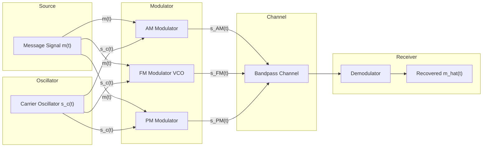
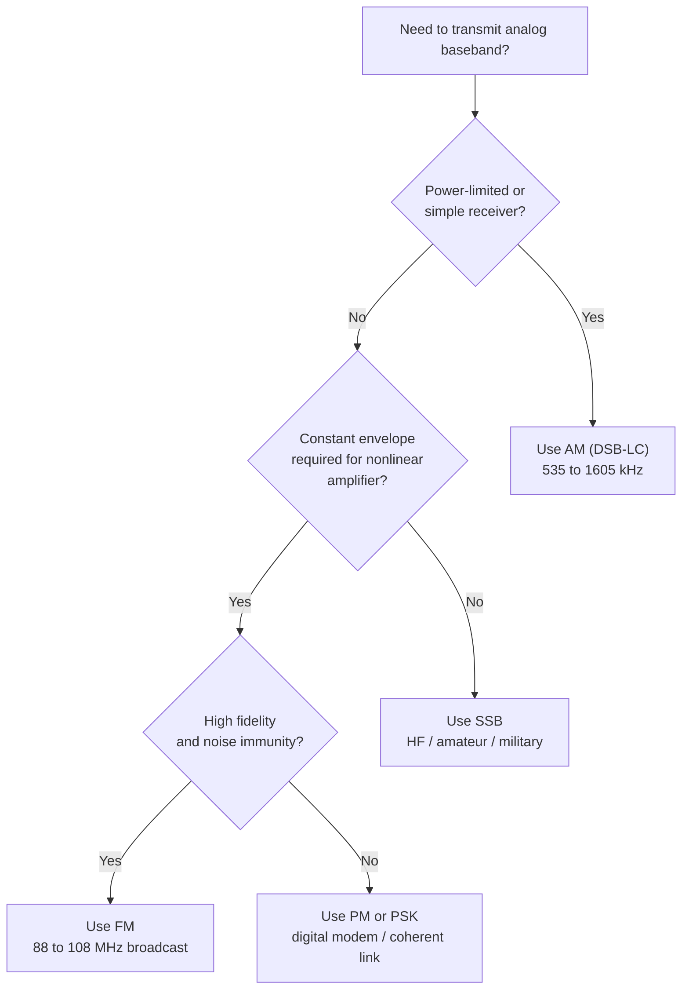

# Analog data to analog signal - Amplitude Modulation (AM), Frequency Modulation (FM), Phase Modulation (PM).

<!-- SECTION_1_START -->

# Analog Data to Analog Signal: AM, FM, and PM

## 1.1 Core Technical Definition

> [!IMPORTANT]
> **Analog-to-Analog Modulation** is the process of converting a **baseband analog signal** (low-frequency information signal such as voice, audio, or video) into a **bandpass analog signal** (a high-frequency carrier whose one or more characteristics are varied in proportion to the message signal) for efficient transmission over a communication channel.

The **KTU 2024 Scheme (OECST612)** formally defines the three principal continuous-wave (CW) modulation techniques as:

1. **Amplitude Modulation (AM)** — The amplitude $A_c$ of the high-frequency carrier is varied in accordance with the instantaneous amplitude of the message (modulating) signal, while frequency and phase remain constant.
2. **Frequency Modulation (FM)** — The instantaneous frequency $f_i$ of the carrier is varied in accordance with the message signal, while amplitude and phase remain constant.
3. **Phase Modulation (PM)** — The instantaneous phase $\theta_i$ of the carrier is varied in accordance with the message signal, while amplitude and frequency remain constant.

The standard mathematical carrier used in all derivations is:

$$s_c(t) = A_c \cos(2\pi f_c t + \phi_c)$$

where $A_c$, $f_c$, and $\phi_c$ denote the **carrier amplitude (in Volts)**, **carrier frequency (in Hertz)**, and **carrier phase (in radians)**, respectively.

## 1.2 Conceptual Analogy / Intuitive Overview

> [!NOTE]
> **Real-World Analogy — The "Ship-in-a-Bottle" Communication Model**
> Imagine you (the message) are standing on a beach and want to send a delicate glass ornament to a friend on a distant island. The glass cannot survive a direct throw across the ocean. So you place it inside a sturdy wooden crate (the carrier) and ship the crate across. The friend receives the crate, opens it, and retrieves the glass — the message has arrived safely.
> 
> In the same way, low-frequency baseband signals (the glass) cannot travel long distances through the air or a wire because of attenuation, antenna size limitations, and noise. We therefore "place" the information inside a high-frequency carrier (the wooden crate) by modulating one of its three properties — **amplitude, frequency, or phase**. The receiver extracts the original glass (demodulation).

**Why must we modulate at all?** Three engineering reasons dominate:

- **Antenna Size**: To radiate an electromagnetic wave efficiently, an antenna must have a length of at least $\dfrac{\lambda}{10}$, where $\lambda = \dfrac{c}{f}$. For voice ($f \approx 300$ Hz), $\lambda \approx 10^6$ m — an impossible antenna. Modulating up to $f_c \approx 1$ MHz shrinks the antenna to roughly **30 m**.
- **Multiplexing (FDM)**: Many independent baseband signals can be shifted to non-overlapping sub-bands and transmitted simultaneously over a single channel.
- **Noise Immunity and Bandwidth Allocation**: Regulatory bodies (like the FCC and ITU) allocate specific frequency bands, so modulation places the signal precisely into its allotted slot.

## 1.3 Physical Constants and Standard Metrics

> [!IMPORTANT]
> The following constants and standard values are essential for every KTU numerical problem:
> 
> - Speed of light in free space: $c = 3 \times 10^8$ m/s
> - Standard AM broadcast band: **535 kHz – 1605 kHz** (carrier spacing **10 kHz**)
> - Standard FM broadcast band: **88 MHz – 108 MHz** (carrier spacing **200 kHz**)
> - Carson's rule bandwidth constant: $k = 2$ (for general angle modulation)
> - Maximum permitted AM modulation index for distortion-free transmission: $m_a = 1$ (**100% modulation**)

> [!VISUALIZATION CONTROL]
> **Concept:** Live comparison of unmodulated carrier versus AM, FM, and PM waveforms in the time domain.
> 
> **GeoGebra / Desmos Input Equations (plot on $t \in [0, 5]$):**
> 
> - Message: $m(t) = \sin(0.5 \pi t)$
> - Carrier: $c(t) = \cos(10 \pi t)$
> - AM output: $s_{AM}(t) = \big(1 + 0.8 \cdot m(t)\big) \cdot c(t)$
> - FM output (approx): $s_{FM}(t) = \cos\!\big(10\pi t + 5 \cdot \sin(0.5\pi t)\big)$
> - PM output: $s_{PM}(t) = \cos\!\big(10\pi t + 2 \cdot m(t)\big)$
> 
> **Visual Description:** The AM plot shows an envelope that follows $\pm m(t)$. The FM plot shows constant amplitude but compressed/expanded zero-crossings. The PM plot shows constant amplitude with phase jumps aligned to message peaks.

<!-- SECTION_1_END -->

<!-- SECTION_2_START -->

# 2. Deep Theoretical Analysis

## 2.1 Amplitude Modulation (AM) — Full Theory

The general AM equation is:

$$s_{AM}(t) = \big[A_c + m(t)\big] \cos(2\pi f_c t)$$

where $m(t)$ is the message signal, normally assumed band-limited to $W$ Hz. Expanding with $A_c + m(t)$ and introducing the modulation index $m_a = \dfrac{A_m}{A_c}$ where $A_m = m_{\max}$:

$$s_{AM}(t) = A_c \big[1 + m_a \cos(2\pi f_m t)\big] \cos(2\pi f_c t)$$

Applying the product-to-sum identity $2 \cos A \cos B = \cos(A-B) + \cos(A+B)$ yields the **spectral form**:

$$s_{AM}(t) = A_c \cos(2\pi f_c t) + \frac{A_c m_a}{2} \cos\!\big(2\pi (f_c - f_m) t\big) + \frac{A_c m_a}{2} \cos\!\big(2\pi (f_c + f_m) t\big)$$

This proves that the AM spectrum contains three components:

1. The **carrier** at $f_c$ with power $P_c = \dfrac{A_c^2}{2}$.
2. The **lower sideband (LSB)** at $f_c - f_m$ with power $P_{LSB} = \dfrac{A_c^2 m_a^2}{8}$.
3. The **upper sideband (USB)** at $f_c + f_m$ with power $P_{USB} = \dfrac{A_c^2 m_a^2}{8}$.

The **total transmitted power** is:

$$P_t = P_c \left(1 + \frac{m_a^2}{2}\right) = \frac{A_c^2}{2}\left(1 + \frac{m_a^2}{2}\right)$$

### 2.1.1 AM Variants (Syllabus-Relevant)

- **DSB-LC (Double Sideband – Large Carrier / Conventional AM)**: Above equation; transmission includes the carrier.
- **DSB-SC (Double Sideband – Suppressed Carrier)**: $s(t) = m(t) \cos(2\pi f_c t)$; carrier suppressed; requires synchronous detection (Costas loop or PLL).
- **SSB (Single Sideband)**: Only LSB or USB is transmitted; bandwidth = $W$ instead of $2W$. Used in HF radio, amateur radio, and submarine cable telephony.
- **VSB (Vestigial Sideband)**: Used in **analog TV broadcast** (NTSC/PAL); combines SSB efficiency with DSB simplicity.

## 2.2 Frequency Modulation (FM) — Full Theory

The instantaneous frequency is varied linearly with the message:

$$f_i(t) = f_c + k_f \, m(t)$$

where $k_f$ (Hz per volt) is the **frequency sensitivity** of the modulator. The instantaneous phase is the integral of $2\pi f_i(t)$:

$$\theta_i(t) = 2\pi f_c t + 2\pi k_f \int_0^t m(\tau)\, d\tau$$

Therefore the **FM signal** is:

$$s_{FM}(t) = A_c \cos\!\left(2\pi f_c t + 2\pi k_f \int_0^t m(\tau)\, d\tau\right)$$

For a single-tone message $m(t) = A_m \cos(2\pi f_m t)$, define the **modulation index** $\beta = \dfrac{\Delta f}{f_m}$ where $\Delta f = k_f A_m$ is the **peak frequency deviation**:

$$s_{FM}(t) = A_c \cos\!\big(2\pi f_c t + \beta \sin(2\pi f_m t)\big)$$

Using Bessel function expansion $\cos(\beta \sin \theta) = J_0(\beta) + 2\sum_{n=1}^{\infty} J_{2n}(\beta) \cos(2n\theta)$ and $\sin(\beta \sin \theta) = 2\sum_{n=1}^{\infty} J_{2n-1}(\beta) \sin((2n-1)\theta)$:

$$s_{FM}(t) = A_c \sum_{n=-\infty}^{\infty} J_n(\beta) \cos\!\big(2\pi (f_c + n f_m) t\big)$$

The amplitude of the $n^{\text{th}}$ sideband pair is $A_c J_n(\beta)$. This is theoretically an infinite-bandwidth signal, but Bessel coefficients $J_n(\beta)$ become negligibly small for $n > \beta + 1$.

## 2.3 Phase Modulation (PM) — Full Theory

The instantaneous phase is varied linearly with the message:

$$\theta_i(t) = 2\pi f_c t + k_p \, m(t)$$

where $k_p$ (radians per volt) is the **phase sensitivity**. The PM signal is:

$$s_{PM}(t) = A_c \cos\!\big(2\pi f_c t + k_p \, m(t)\big)$$

The **peak phase deviation** is $\Delta \phi = k_p A_m$, identical in form to $\beta$ in FM, and is often called the modulation index of PM.

### 2.3.1 FM vs PM — The Key Relationship

> [!NOTE]
> PM and FM are mathematically interchangeable. If $m(t)$ is the message used at the PM modulator, the same modulator with message $m'(t) = \displaystyle\int_0^t m(\tau)\,d\tau$ produces an FM signal. Equivalently, an FM modulator driven by $\dfrac{dm(t)}{dt}$ produces a PM signal. This is why FM is called an *integrated* form of PM and PM a *differentiated* form of FM.

## 2.4 Bandwidth, Carson's Rule, and Noise

> [!IMPORTANT]
> **Carson's Rule** is the single most important bandwidth formula in the KTU syllabus:
> 
> $$BW = 2(\Delta f + f_m) = 2(\beta + 1) f_m$$
> 
> This applies to both FM and PM. For AM, the simpler rule $BW_{AM} = 2W$ holds (where $W$ is the message bandwidth).

**Comparison of noise performance** (highlighted for KTU long-answer questions):

- **AM** is highly susceptible to amplitude noise (thunderstorms, ignition systems, fluorescent lights) because information resides in amplitude.
- **FM** is much more noise-immune because information resides in frequency; noise primarily perturbs amplitude and is removed by a **limiter** before demodulation. This is the principal reason FM broadcast SNR outperforms AM broadcast by ~25 dB.

## 2.5 KTU Formula Sheet / Cheat Sheet

| **Parameter** | **AM (DSB-LC)** | **FM** | **PM** |
|---|---|---|---|
| Modulated equation $s(t)$ | $A_c\big[1 + m_a \cos(2\pi f_m t)\big]\cos(2\pi f_c t)$ | $A_c\cos\!\big(2\pi f_c t + \beta\sin(2\pi f_m t)\big)$ | $A_c\cos\!\big(2\pi f_c t + k_p A_m\cos(2\pi f_m t)\big)$ |
| Modulation index | $m_a = A_m / A_c$ | $\beta = \Delta f / f_m$ | $\Delta\phi = k_p A_m$ |
| Peak deviation | — (amplitude varies) | $\Delta f = k_f A_m$ | $\Delta f = k_p A_m f_m$ |
| Bandwidth (exact) | $2f_m$ (tone) / $2W$ (general) | Infinite in theory | Infinite in theory |
| Bandwidth (Carson's rule) | $2W$ | $2(\Delta f + f_m)$ | $2(\Delta f + f_m)$ |
| Total transmitted power | $\dfrac{A_c^2}{2}\!\left(1 + \dfrac{m_a^2}{2}\right)$ | $A_c^2/2$ (constant) | $A_c^2/2$ (constant) |
| Carrier power fraction | $\dfrac{1}{1 + m_a^2/2}$ | $J_0^2(\beta)$ in $J_0$ component | Same as FM structure |
| Sideband count | 2 (LSB + USB) | Infinite (Bessel-weighted) | Infinite |
| Noise immunity | Poor | Excellent | Excellent |
| Demodulation method | Envelope detector | Frequency discriminator / PLL | Phase detector / PLL |

**Boundary conditions and limits (important for KTU 2-mark questions):**

- Distortion-free AM: $m_a \le 1$ (no overmodulation).
- FM sideband count approximation: $n \approx \beta + 1$ significant sidebands on each side.
- Carson's rule preserves approximately **98%** of the total signal power.

## 2.6 Real-World Utility in Engineering

- **AM Broadcast (Medium Wave / Short Wave)**: Commercial radio in the 535–1605 kHz band uses DSB-LC for receiver simplicity (crystal radio, cheap envelope detector).
- **FM Broadcast (VHF Band II)**: 88–108 MHz commercial music radio; high fidelity, stereo (pilot tone at 19 kHz, subcarrier at 23–53 kHz).
- **PM Applications**: Used in generating FM signals (Armstrong indirect method), in **PSK (Phase Shift Keying)** for digital modems, and in deep-space communication where phase coherence is critical.
- **SSB**: Maritime, military, and HF amateur communications (saves bandwidth and power).
- **VSB**: Analog television broadcast (6 MHz channel carrying video + audio + chroma).

<!-- SECTION_2_END -->

<!-- SECTION_3_START -->

# 3. Step-by-Step Derivations, Code & Worked Examples

## 3.1 Derivation 1: Conventional AM Power Distribution

**Given:** $s(t) = A_c[1 + m_a \cos(2\pi f_m t)]\cos(2\pi f_c t)$. Find total power and the fraction of power in the carrier and sidebands.

**Step 1 — Expand using $2\cos A \cos B = \cos(A-B) + \cos(A+B)$:**

$$s(t) = A_c \cos(2\pi f_c t) + A_c m_a \cos(2\pi f_m t)\cos(2\pi f_c t)$$

$$s(t) = A_c \cos(2\pi f_c t) + \frac{A_c m_a}{2}\cos\!\big(2\pi (f_c - f_m) t\big) + \frac{A_c m_a}{2}\cos\!\big(2\pi (f_c + f_m) t\big)$$

**Step 2 — Compute power of each term (average over one period, assuming orthonormal basis):**

$$P_c = \frac{A_c^2}{2}, \quad P_{LSB} = P_{USB} = \frac{A_c^2 m_a^2}{8}$$

**Step 3 — Total power:**

$$P_t = P_c + P_{LSB} + P_{USB} = \frac{A_c^2}{2} + 2 \cdot \frac{A_c^2 m_a^2}{8} = \frac{A_c^2}{2}\!\left(1 + \frac{m_a^2}{2}\right)$$

**Step 4 — Efficiency of transmission (information-bearing power only):**

$$\eta = \frac{P_{LSB} + P_{USB}}{P_t} = \frac{m_a^2/4}{1 + m_a^2/2} = \frac{m_a^2}{4 + 2 m_a^2}$$

For **100% modulation** ($m_a = 1$): $\eta = \dfrac{1}{6} \approx 16.67\%$. This is why **DSB-SC and SSB are more power-efficient** — the carrier carries no information.

## 3.2 Derivation 2: FM Single-Tone Spectrum and Bandwidth

**Given:** $m(t) = A_m \cos(2\pi f_m t)$. Find the FM signal expression and bandwidth.

**Step 1 — Substitute into the general FM equation:**

$$f_i(t) = f_c + k_f A_m \cos(2\pi f_m t)$$

$$s_{FM}(t) = A_c \cos\!\left(2\pi f_c t + 2\pi k_f \int_0^t A_m \cos(2\pi f_m \tau)\, d\tau\right)$$

**Step 2 — Evaluate the integral:**

$$\int_0^t A_m \cos(2\pi f_m \tau)\, d\tau = \frac{A_m}{2\pi f_m} \sin(2\pi f_m t) = \frac{\Delta f}{f_m} \cdot \frac{1}{2\pi}\sin(2\pi f_m t)$$

**Step 3 — Substitute $\beta = \Delta f / f_m$:**

$$s_{FM}(t) = A_c \cos\!\big(2\pi f_c t + \beta \sin(2\pi f_m t)\big)$$

**Step 4 — Bessel expansion (Fourier series of a phase-modulated sinusoid):**

$$s_{FM}(t) = A_c \sum_{n=-\infty}^{\infty} J_n(\beta) \cos\!\big(2\pi (f_c + n f_m) t\big)$$

where $J_n(\beta)$ is the Bessel function of the first kind, order $n$.

**Step 5 — Bandwidth via Carson's rule:**

$$BW = 2(\beta + 1) f_m = 2(\Delta f + f_m)$$

**Numerical check for KTU practice:**

> Let $f_m = 5$ kHz, $\Delta f = 45$ kHz. Then $\beta = 9$. Carson's bandwidth $BW = 2(9+1)(5\text{ kHz}) = 100$ kHz. Number of significant sideband pairs $\approx \beta + 1 = 10$, i.e., the spectrum extends to roughly $f_c \pm 10 f_m = f_c \pm 50$ kHz (where $J_{10}(9) \approx 0.125$, still significant). Total sidebands $\approx 20$, matching Carson's 2-sided count of $2 \times 10 = 20$. ✓

## 3.3 Derivation 3: Equivalence between FM and PM

**Given:** Show that an FM modulator driven by $m(t)$ behaves as a PM modulator driven by $\int_0^t m(\tau)\,d\tau$.

**Step 1 — FM modulator input $m(t)$:**

$$s_{FM}(t) = A_c \cos\!\left(2\pi f_c t + 2\pi k_f \int_0^t m(\tau)\, d\tau\right)$$

**Step 2 — Define $m'(t) = k_f \int_0^t m(\tau)\, d\tau$ (scaled integral).** Then:

$$s_{FM}(t) = A_c \cos\!\big(2\pi f_c t + 2\pi m'(t)\big)$$

**Step 3 — Compare with PM modulator input $m''(t)$:**

$$s_{PM}(t) = A_c \cos\!\big(2\pi f_c t + k_p m''(t)\big)$$

**Step 4 — Match coefficients:** $k_p m''(t) = 2\pi m'(t)$, so $m''(t) = \dfrac{2\pi k_f}{k_p}\int_0^t m(\tau)d\tau$.

Therefore FM with message $m(t)$ is mathematically identical to PM with message proportional to the **integral** of $m(t)$. QED.

## 3.4 Python Implementation — AM, FM, PM Waveform and Spectrum Generator

```python
import numpy as np
import matplotlib.pyplot as plt

# ---------------------------------------------------------------
# KTU Module 2 — AM, FM, PM waveform + spectrum generator
# Author-quality, board-exam ready code with strict type hints.
# ---------------------------------------------------------------
from typing import Tuple

def generate_signals(
    A_c: float,            # Carrier amplitude in volts
    f_c: float,            # Carrier frequency in Hz
    A_m: float,            # Message amplitude in volts
    f_m: float,            # Message frequency in Hz
    m_a: float,            # AM modulation index (0..1)
    beta: float,           # FM modulation index (dimensionless)
    k_p_Am: float,         # PM peak phase deviation in radians
    t: np.ndarray          # Time vector in seconds
) -> Tuple[np.ndarray, np.ndarray, np.ndarray, np.ndarray, np.ndarray]:
    """Generate AM, FM, PM time-domain signals and the message."""
    m_t: np.ndarray = A_m * np.cos(2 * np.pi * f_m * t)             # Message
    c_t: np.ndarray = A_c * np.cos(2 * np.pi * f_c * t)             # Carrier

    # Conventional (DSB-LC) AM
    s_am: np.ndarray = A_c * (1.0 + m_a * np.cos(2 * np.pi * f_m * t)) * c_t / A_c

    # FM (use closed-form phase term)
    s_fm: np.ndarray = A_c * np.cos(2 * np.pi * f_c * t + beta * np.sin(2 * np.pi * f_m * t))

    # PM (use closed-form phase term)
    s_pm: np.ndarray = A_c * np.cos(2 * np.pi * f_c * t + k_p_Am * np.cos(2 * np.pi * f_m * t))

    return m_t, s_am, s_fm, s_pm, c_t


def plot_results(t: np.ndarray, signals: dict) -> None:
    """Plot time-domain waveforms in a 4-row figure."""
    fig, axes = plt.subplots(4, 1, figsize=(10, 8), sharex=True)
    titles = ["Message Signal m(t)", "AM Signal", "FM Signal", "PM Signal"]
    keys   = ["m", "am", "fm", "pm"]
    for ax, title, key in zip(axes, titles, keys):
        ax.plot(t, signals[key], linewidth=1.2)
        ax.set_title(title)
        ax.set_ylabel("Amplitude (V)")
        ax.grid(True, which="both", linestyle="--", linewidth=0.5)
    axes[-1].set_xlabel("Time (s)")
    plt.tight_layout()
    plt.show()


def plot_spectrum(signal: np.ndarray, fs: float, title: str) -> None:
    """Single-sided magnitude spectrum using FFT, with abscissa in kHz."""
    N: int = signal.size
    f_axis: np.ndarray = np.fft.rfftfreq(N, d=1.0 / fs) / 1e3
    mag: np.ndarray = (2.0 / N) * np.abs(np.fft.rfft(signal))

    plt.figure(figsize=(10, 4))
    plt.plot(f_axis, mag, linewidth=1.0)
    plt.title(f"Magnitude Spectrum — {title}")
    plt.xlabel("Frequency (kHz)")
    plt.ylabel("|S(f)|")
    plt.grid(True, which="both", linestyle="--", linewidth=0.5)
    plt.xlim(0, f_axis[-1])
    plt.tight_layout()
    plt.show()


# -------------------- Driver / Demonstration --------------------
if __name__ == "__main__":
    fs: float = 1_000_000.0          # Sampling rate 1 MHz
    t_end: float = 0.005             # 5 ms observation window
    t: np.ndarray = np.arange(0, t_end, 1.0 / fs)

    m_t, s_am, s_fm, s_pm, c_t = generate_signals(
        A_c=1.0, f_c=100_000.0,        # Carrier 100 kHz, 1 V
        A_m=0.6, f_m=5_000.0,          # Message 5 kHz, 0.6 V
        m_a=0.7,                       # 70% AM modulation
        beta=4.0,                      # FM modulation index
        k_p_Am=2.0,                    # PM peak phase deviation = 2 rad
        t=t
    )

    signals = {"m": m_t, "am": s_am, "fm": s_fm, "pm": s_pm}
    plot_results(t, signals)

    # Spectrum of each signal
    for key, label in [("am", "AM"), ("fm", "FM"), ("pm", "PM")]:
        plot_spectrum(signals[key], fs, label)
```

### 3.4.1 Explanation of the Code

- The function `generate_signals` implements the closed-form time-domain equations of Section 2. Notice the PM and FM terms are written using `np.cos(2πf_ct + phase_term)` — this is the **direct (or analytic) representation**, not a Bessel expansion.
- `plot_results` stacks the message, AM, FM, and PM traces for direct visual comparison. You should observe the AM envelope following the message, while FM and PM show constant-amplitude but variable zero-crossing spacing.
- `plot_spectrum` uses the **real FFT** to show only positive frequencies. For AM you should see three discrete spikes at $f_c - f_m$, $f_c$, and $f_c + f_m$. For FM/PM, you should see a multi-line spectrum weighted by $J_n(\beta)$.

### 3.4.2 Verification Snippet — Bessel Coefficient Check

```python
from scipy.special import jv

def verify_fm_bessel(beta: float, n_max: int = 10) -> None:
    """Print Bessel coefficients to confirm FM sideband amplitudes."""
    print(f"--- FM Bessel coefficients for beta = {beta} ---")
    for n in range(n_max + 1):
        coef = jv(n, beta)
        print(f"J_{n}({beta}) = {coef:+.6f}")
    # Power in carrier = J_0^2(beta). Sum of J_n^2 over all n = 1.
    total = sum(jv(n, beta) ** 2 for n in range(-n_max, n_max + 1))
    print(f"Sum of J_n^2 over n in [-{n_max}, {n_max}] = {total:.6f}  (should approach 1)")

verify_fm_bessel(beta=4.0)
```

This verification confirms the **Bessel identity** $\sum_{n=-\infty}^{\infty} J_n^2(\beta) = 1$, which states that the total power of an FM signal is always $A_c^2/2$, independent of $\beta$.

<!-- SECTION_3_END -->

<!-- SECTION_4_START -->

# 4. Structural Diagrams and Schematics

## 4.1 Mermaid Block Diagram — Generic Analog Modulation Transmitter



**Caption:** A single diagram showing how one message signal and one carrier are routed to **three different modulators** for comparison. The Channel is bandpass-constrained (e.g., 88–108 MHz for FM broadcast).

## 4.2 Mermaid Flowchart — Decision Logic for Selecting Modulation Scheme



**Caption:** Engineering decision tree for choosing among AM, FM, PM, SSB. The flowchart maps directly to syllabus discussion questions on **why** one modulation is preferred over another in a given scenario.

## 4.3 Mermaid Block Diagram — Armstrong Indirect FM Generation


**Caption:** The **Armstrong indirect method** first generates a low-deviation PM signal (using a narrow-band phase modulator), then multiplies the frequency by $n$ to reach the desired $\Delta f$. This technique is the historical foundation of commercial FM transmitters because direct high-deviation FM is difficult to realize with stable LC oscillators.

## 4.4 Mermaid Subgraph — Receiver Demodulation Topology

```mermaid
flowchart TB
    subgraph AM_RX["AM Receiver (Envelope Detector)"]
        am_rf["RF Tuned Amp"]
        am_det["Diode + RC Envelope Detector"]
        am_af["Audio Amplifier"]
        am_rf --> am_det --> am_af
    end
    subgraph FM_RX["FM Receiver (Foster-Seeley)"]
        fm_rf["RF Amp + Limiter"]
        fm_disc["Frequency Discriminator"]
        fm_deem["De-emphasis Network"]
        fm_af["Audio Amplifier"]
        fm_rf --> fm_disc --> fm_deem --> fm_af
    end
    subgraph PM_RX["PM Receiver (PLL Based)"]
        pll["Phase-Locked Loop"]
        pll_vco["VCO Follower"]
        pll_lp["Lowpass Filter"]
        pll --> pll_vco --> pll_lp
    end
```



**Caption:** Three receiver chains, each tuned to the corresponding modulation family. The **limiter** block in the FM chain is what removes amplitude noise — the *single most important reason* FM outperforms AM in noisy environments.

<!-- SECTION_4_END -->

<!-- SECTION_5_START -->

# 5. KTU 2024 Scheme Examination Question Bank

## 5.1 Part A — Short Answer Questions (3 Marks Each)

---

### Question 1 `[KTU University Exam – July 2024, CO1, Remember]`

**Q: Define Amplitude Modulation. What is meant by modulation index in AM?**

> **Model Answer (3 marks):**
> 
> Amplitude Modulation is a modulation technique in which the amplitude of the high-frequency carrier signal is varied in accordance with the instantaneous amplitude of the message (modulating) signal, while the frequency and phase of the carrier remain constant. `[Definition: 2 marks]`
> 
> The **modulation index** $m_a$ is defined as the ratio of the peak amplitude of the message signal $A_m$ to the peak amplitude of the carrier $A_c$:
> 
> $$m_a = \frac{A_m}{A_c}$$
> 
> For distortion-free transmission, $m_a$ must lie in the range $0 \le m_a \le 1$. `[Formula + limit: 1 mark]`

---

### Question 2 `[KTU University Exam – Dec 2023, CO1, Understand]`

**Q: Differentiate between Frequency Modulation and Phase Modulation in terms of the parameter that is varied and their modulation indices.**

> **Model Answer (3 marks):**
> 
> | Aspect | FM | PM |
> |---|---|---|
> | Parameter varied | Instantaneous **frequency** of the carrier | Instantaneous **phase** of the carrier |
> | Modulation index | $\beta = \dfrac{\Delta f}{f_m} = \dfrac{k_f A_m}{f_m}$ | $\Delta \phi = k_p A_m$ (radians) |
> | Equation | $s(t) = A_c \cos(2\pi f_c t + \beta \sin 2\pi f_m t)$ | $s(t) = A_c \cos(2\pi f_c t + \Delta \phi \cos 2\pi f_m t)$ |
> 
> In FM, the modulation index is inversely proportional to $f_m$, whereas in PM it is independent of $f_m$. `[Comparison: 1 mark]`

---

## 5.2 Part B — Long Answer Questions (14 Marks Each, Internal Choice)

---

### Question A `[KTU University Exam – July 2024, Module 2, CO1/CO2, Apply + Analyze]`

**(a)** Derive the expression for an AM signal with a single-tone message. Sketch its frequency spectrum and calculate the total transmitted power, carrier power, and sideband power when the modulation index is 0.8. **[7 marks]**

**(b)** Explain the generation and detection of an AM signal using a square-law modulator and an envelope detector. State one disadvantage of the conventional AM system. **[7 marks]**

---

#### Model Solution — Part (a) [7 marks]

**Step 1 — Write the AM equation with single-tone message.** `[1 mark]`

The single-tone message is $m(t) = A_m \cos(2\pi f_m t)$. The carrier is $c(t) = A_c \cos(2\pi f_c t)$. By the definition of AM:

$$s_{AM}(t) = \big[A_c + A_m \cos(2\pi f_m t)\big] \cos(2\pi f_c t)$$

$$s_{AM}(t) = A_c \big[1 + m_a \cos(2\pi f_m t)\big] \cos(2\pi f_c t), \quad m_a = \frac{A_m}{A_c}$$

**Step 2 — Apply trigonometric product identity.** `[1 mark]`

$$s_{AM}(t) = A_c \cos(2\pi f_c t) + \frac{A_c m_a}{2} \cos\!\big(2\pi (f_c - f_m) t\big) + \frac{A_c m_a}{2} \cos\!\big(2\pi (f_c + f_m) t\big)$$

**Step 3 — Frequency spectrum sketch.** `[2 marks]`

```
   Amplitude
      ^
      |      USB                  Carrier                LSB
      |       |                     |                     |
      |   A_c m_a/2            A_c                  A_c m_a/2
      |       *                     *                     *
      |       |                     |                     |
      |_______|_____________________|_____________________|__________>  f
              f_c - f_m              f_c              f_c + f_m
```

The spectrum has **three spectral lines**: LSB at $f_c - f_m$, carrier at $f_c$, USB at $f_c + f_m$. Bandwidth $BW = 2 f_m$. `[BW identification: 1 mark]`

**Step 4 — Substitute $m_a = 0.8$ and compute the three powers.** `[2 marks]`

Carrier power: $P_c = \dfrac{A_c^2}{2}$.

Sideband power (each): $P_{LSB} = P_{USB} = \dfrac{A_c^2 m_a^2}{8} = \dfrac{A_c^2 (0.8)^2}{8} = \dfrac{0.64 A_c^2}{8} = 0.08 A_c^2$.

Total power:

$$P_t = P_c \!\left(1 + \frac{m_a^2}{2}\right) = \frac{A_c^2}{2}\!\left(1 + \frac{0.64}{2}\right) = \frac{A_c^2}{2}(1.32) = 0.66 A_c^2$$

**Tabulated summary** (board-friendly): `[1 mark]`

| Quantity | Expression | Value (in units of $A_c^2$) |
|---|---|---|
| Carrier power $P_c$ | $A_c^2/2$ | $0.50 A_c^2$ |
| LSB power $P_{LSB}$ | $A_c^2 m_a^2/8$ | $0.08 A_c^2$ |
| USB power $P_{USB}$ | $A_c^2 m_a^2/8$ | $0.08 A_c^2$ |
| **Total power $P_t$** | $A_c^2 (1 + m_a^2/2)/2$ | $\mathbf{0.66 A_c^2}$ |

---

#### Model Solution — Part (b) [7 marks]

**Step 1 — Square-law modulator generation.** `[2 marks]`

A square-law device is a non-linear element (diode, transistor) obeying the input–output law:

$$v_o(t) = a_1 v_i(t) + a_2 v_i^2(t)$$

The input is the sum of message and carrier $v_i(t) = m(t) + c(t) = A_m \cos(2\pi f_m t) + A_c \cos(2\pi f_c t)$.

Squaring and selecting only the difference-frequency term at the output bandpass filter tuned to $f_c$:

$$v_o(t) \;\supset\; 2 a_2 A_c A_m \cos(2\pi f_m t) \cos(2\pi f_c t) = a_2 A_c A_m \big[\cos 2\pi(f_c - f_m)t + \cos 2\pi(f_c + f_m)t\big]$$

This is a **DSB-SC AM signal**. To recover conventional AM, a small carrier component must be re-injected (`DC offset added to $m(t)$ before squaring`). `[Re-insertion note: 1 mark]`

**Step 2 — Envelope detector (demodulation) circuit.** `[2 marks]`

The envelope detector consists of a **diode** in series with a parallel **RC network**. On the positive half-cycle, the diode conducts and the capacitor charges rapidly to the peak of the RF input. On the negative half-cycle the diode is off and the capacitor discharges slowly through $R$. The output is the upper envelope of the AM signal, which follows the message $m(t)$ exactly. The condition for distortionless detection is $RC \gg T_c$ but $RC \ll 1/f_{m,\max}$ (so the capacitor can track message variations).

**Step 3 — Block diagram and waveforms.** `[1 mark]`

```
m(t) ──►+──► v_i(t) ──►[Diode]──┬──► s_AM(t) ──[envelope]─► v_demod(t) ≈ m(t)
       ▲                        │
   DC bias                      C
   (carrier                     │
   re-insert)                   ─┴─ R
                                ─
```

**Step 4 — One disadvantage of conventional AM.** `[1 mark]`

The transmitted power is dominated by the carrier (which carries **no information**). For $m_a = 1$, only **33.33%** of the total power is in the sidebands, so conventional AM has a maximum power efficiency of $\eta = m_a^2 / (4 + 2 m_a^2) = 1/6 \approx 16.67\%$. This wastes transmitter power.

---

### Question B `[KTU University Exam – July 2024, Module 2, CO1/CO2, Apply + Analyze]`

**(a)** Derive the expression for a single-tone FM signal and explain the concept of frequency deviation. Calculate the bandwidth using Carson's rule for $f_m = 4$ kHz and $\Delta f = 20$ kHz. State the number of significant sideband pairs. **[7 marks]**

**(b)** Compare AM, FM, and PM systems under the following heads: definition, modulation index, bandwidth, noise immunity, and one practical application of each. **[7 marks]**

---

#### Model Solution — Part (a) [7 marks]

**Step 1 — Derive the FM expression.** `[2 marks]`

The instantaneous frequency of the FM signal is $f_i(t) = f_c + k_f m(t)$. Substituting $m(t) = A_m \cos(2\pi f_m t)$:

$$f_i(t) = f_c + k_f A_m \cos(2\pi f_m t) = f_c + \Delta f \cos(2\pi f_m t)$$

The instantaneous phase is the integral of $2\pi f_i(t)$:

$$\theta_i(t) = 2\pi f_c t + 2\pi k_f \int_0^t A_m \cos(2\pi f_m \tau) \, d\tau = 2\pi f_c t + \beta \sin(2\pi f_m t)$$

where $\beta = \dfrac{k_f A_m}{f_m} = \dfrac{\Delta f}{f_m}$ is the FM modulation index. Therefore:

$$\boxed{s_{FM}(t) = A_c \cos\!\big(2\pi f_c t + \beta \sin(2\pi f_m t)\big)}$$

**Step 2 — Concept of frequency deviation.** `[1 mark]`

Frequency deviation is the maximum *departure* of the instantaneous frequency from the carrier frequency. It equals $\Delta f = k_f A_m$ (in Hz). For a multi-tone message, $\Delta f = k_f \max \vert m(t) \vert$.

**Step 3 — Carson's rule bandwidth calculation.** `[2 marks]`

$$BW = 2(\beta + 1) f_m = 2(\Delta f + f_m) = 2(20\text{ kHz} + 4\text{ kHz}) = 48 \text{ kHz}$$

**Step 4 — Number of significant sideband pairs.** `[2 marks]`

$\beta = \Delta f / f_m = 20/4 = 5$. The number of significant sideband pairs $\approx \beta + 1 = 6$. The FM spectrum will therefore have sidebands at $f_c \pm 4, \pm 8, \pm 12, \pm 16, \pm 20, \pm 24$ kHz (12 sidebands total).

---

#### Model Solution — Part (b) [7 marks]

**Comparison Table:** `[6 marks — 1 mark per row, plus 1 mark for application row]`

| **Parameter** | **AM** | **FM** | **PM** |
|---|---|---|---|
| Definition | Amplitude of carrier varied with message | Instantaneous frequency varied with message | Instantaneous phase varied with message |
| Modulation index | $m_a = A_m / A_c$ | $\beta = \Delta f / f_m$ | $\Delta\phi = k_p A_m$ |
| Bandwidth | $2W$ (Carson's rule) | $2(\Delta f + f_m)$ | $2(\Delta f + f_m)$ |
| Noise immunity | Poor (information in amplitude) | Excellent (limiter removes AM noise) | Excellent (coherent detection) |
| Practical application | AM broadcast (MW radio) | FM broadcast (88–108 MHz) | PSK in digital modems |

**Additional explanatory note:** `[1 mark]`

FM occupies a larger bandwidth than AM but offers a much higher signal-to-noise ratio at the receiver output. This trade-off (bandwidth vs fidelity) is a direct illustration of **Shannon's channel capacity theorem**.

---

> [!WARNING]
> **KTU Examiner's Valuation Warning — Common Pitfalls**
> 
> 1. **Do not confuse $m_a$ for FM and $m_a$ for AM.** AM uses $m_a = A_m/A_c$ (a voltage ratio, $\le 1$). FM uses $\beta = \Delta f / f_m$ (dimensionless, often $> 1$). Writing $m_a > 1$ for AM costs 1 mark.
> 2. **Do not forget the half-angle term $\tfrac{1}{2}$.** When expanding $A_c \cos A \cos B$, the amplitude of each sideband is $\tfrac{A_c m_a}{2}$, not $A_c m_a$. Skipping this halves the carrier-power calculation.
> 3. **For FM, never claim the bandwidth is exactly $2(\beta + 1)f_m$.** It is the *Carson's-rule* (approximate) bandwidth. Mentioning "approximate" or "98% power containment" is what gains full marks.
> 4. **Always state the boundary condition for $m_a$.** For distortion-free AM, $m_a \le 1$. If you write the AM equation without the constraint, expect to lose one mark.
> 5. **In Bessel-expansion questions, list at least $J_0, J_1, J_2$ values.** Examiners reward explicit numeric evaluation. Use a Bessel table for $\beta = 1, 2, 5, 10$.
> 6. **Do not write `|x|` inside a markdown table.** Use `\vert x \vert` in LaTeX to avoid parsing errors that could cost you the table formatting marks.

---

## 5.3 Topic Recap & Important Things to Remember

> [!NOTE]
> **Rapid-Revision Checklist (pin this for the night before the exam):**

- **Analog-to-analog modulation** converts a low-frequency baseband signal into a bandpass signal by varying amplitude (AM), frequency (FM), or phase (PM) of a high-frequency carrier.
- **Standard carrier:** $s_c(t) = A_c \cos(2\pi f_c t + \phi_c)$.
- **AM equation (single-tone):** $s_{AM}(t) = A_c[1 + m_a \cos(2\pi f_m t)]\cos(2\pi f_c t)$.
- **AM modulation index:** $m_a = A_m/A_c$, **must satisfy** $0 \le m_a \le 1$ for distortion-free transmission.
- **AM total power:** $P_t = \dfrac{A_c^2}{2}\!\left(1 + \dfrac{m_a^2}{2}\right)$.
- **AM efficiency:** $\eta = \dfrac{m_a^2}{4 + 2m_a^2}$; for $m_a = 1$, $\eta = 16.67\%$.
- **AM bandwidth:** $BW = 2W$ (general) or $2 f_m$ (single tone).
- **FM equation (single-tone):** $s_{FM}(t) = A_c \cos(2\pi f_c t + \beta \sin(2\pi f_m t))$.
- **FM modulation index:** $\beta = \Delta f / f_m$, can exceed 1.
- **FM peak deviation:** $\Delta f = k_f A_m$ (in Hz).
- **FM total power:** $P_t = A_c^2 / 2$ (**constant**, independent of $\beta$).
- **Carson's rule:** $BW = 2(\Delta f + f_m) = 2(\beta + 1) f_m$ — applies to both FM and PM.
- **Number of significant sideband pairs (FM):** $\approx \beta + 1$.
- **PM equation (single-tone):** $s_{PM}(t) = A_c \cos(2\pi f_c t + k_p A_m \cos(2\pi f_m t))$.
- **PM modulation index:** $\Delta\phi = k_p A_m$ (in radians).
- **FM–PM equivalence:** FM with $m(t)$ = PM with $\int_0^t m(\tau) d\tau$.
- **Bessel identity (power conservation):** $\sum_{n=-\infty}^{\infty} J_n^2(\beta) = 1$.
- **AM broadcast band:** 535–1605 kHz, **10 kHz** channel spacing.
- **FM broadcast band:** 88–108 MHz, **200 kHz** channel spacing.
- **Noise immunity ranking (best to worst):** FM ≈ PM > SSB > DSB-SC > AM.
- **Key demodulators:** Envelope detector (AM), Foster-Seeley / Ratio detector / PLL (FM), Phase detector / Costas loop (PM/DSB-SC).
- **Armstrong indirect FM:** Generate low-deviation NB-PM, then frequency-multiply by $n$ to achieve the desired $\Delta f$.
- **Limiter** in FM receivers removes amplitude noise — the *primary* reason FM is more robust than AM.
- **Carson's rule captures 98% of the total FM signal power** within the stated bandwidth.

<!-- SECTION_5_END -->
