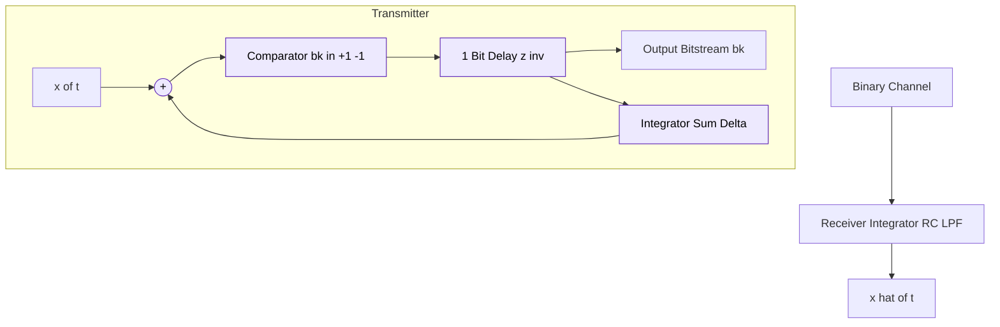
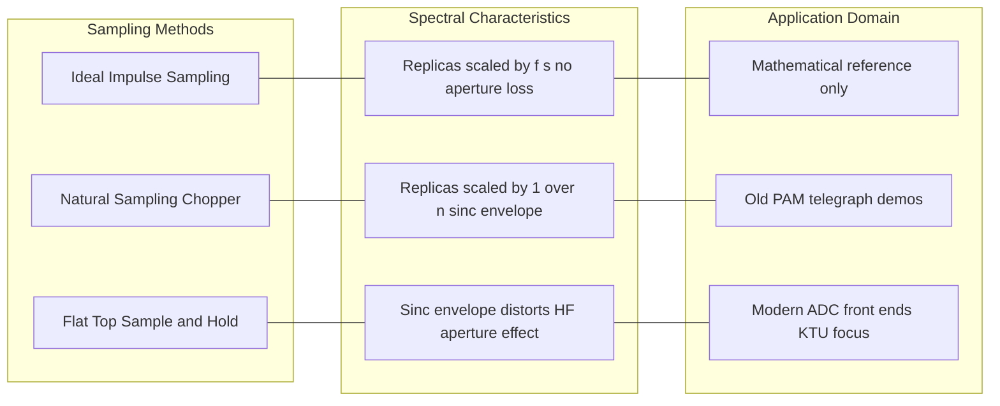
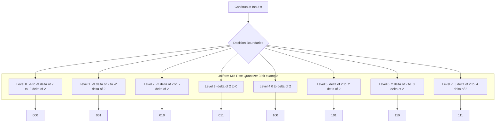

# Analog data to digital signal - Sampling theorem, Pulse Code Modulation (PCM), Delta Modulation (DM).

<!-- SECTION_1_START -->

# Analog Data to Digital Signal — Sampling, PCM & Delta Modulation

> [!NOTE]
> **KTU 2024 Scheme Focus (OECST612 / Module 2):** This module bridges the analog physical world (voice, temperature, vibration) and the digital domain of computers. Three sequential transformations are examined: **Sampling** (continuous time → discrete time), **Quantization** (continuous amplitude → discrete amplitude), and **Encoding** (discrete amplitude → digital binary code).

---

## 1.1 Sampling Theorem — The Nyquist–Shannon Foundation

### Formal KTU Definition

> [!IMPORTANT]
> **Sampling Theorem (Shannon, 1949):** *A band-limited analog signal $x(t)$ having a maximum frequency component $f_m$ Hz can be completely reconstructed from its discrete samples, provided the sampling frequency $f_s$ satisfies:*
> $$f_s \ge 2 f_m$$
> *The minimum allowed rate $f_{N} = 2 f_m$ is called the **Nyquist Rate**; the maximum allowed interval $T_s = 1 / (2 f_m)$ is the **Nyquist Interval**.*

### Intuition — Why Twice the Highest Frequency?

Imagine a child on a swing whose period is $T = 2$ seconds (so the highest oscillation frequency is $0.5$ Hz). If you photograph the swing **once every 4 seconds** (i.e., $f_s = 0.25$ Hz), the swing appears to be **perfectly still** in every photo — you have lost all motion information. To capture the swing faithfully, you must photograph it at least **twice per period**, i.e., at $f_s \ge 1$ Hz. This is the Nyquist Rule in disguise.

If $f_s < 2 f_m$, the high-frequency components of the signal masquerade as lower frequencies — a phenomenon called **Aliasing** (think "alias" — a false identity).

> [!IMPORTANT]
> **Three Sampling Variants in KTU Syllabus:**
>
> 1. **Ideal (Impulse) Sampling** — signal multiplied by an impulse train; mathematically pure but physically unrealizable.
> 2. **Natural Sampling (Chopper / PAM-Natural)** — the analog signal is literally chopped by a switch; the top of each sample retains the natural curvature of $x(t)$.
> 3. **Flat-Top Sampling (Sample-and-Hold / PAM-Flat-Top)** — each sample is held constant at the value taken at the sampling instant; reconstructed via a staircase (the **Aperture Effect** distorts the spectrum).

### Physical Constants / Standard Metrics in This Module

| Symbol | Meaning | Typical Engineering Value |
| --- | --- | --- |
| $f_m$ | Highest message frequency (e.g., voice) | **4 kHz** (telephony), 20 kHz (audio CD) |
| $f_N$ | Nyquist Rate $= 2 f_m$ | **8 kHz** (telephony), 40 kHz (audio) |
| $n$ | Number of bits per PCM sample | **8** (telephony), 16 (audio CD) |
| $L$ | Quantization levels $= 2^n$ | **256** (telephony), 65536 (audio) |
| $\Delta$ | Quantization step size | Depends on dynamic range |

> [!VISUALIZATION CONTROL]
> **Concept:** Aliasing of a $5\text{ Hz}$ sine wave sampled at $4\text{ Hz}$ (under-sampled).
> **GeoGebra / Desmos Input Equations:**
>
> * `f(t) = sin(2 * pi * 5 * t)`  (original signal — blue curve)
> * `g(t) = sin(2 * pi * 1 * t)`  (reconstructed apparent signal — red curve)
> * `Pts = (0, 0), (0.25, sin(2*pi*5*0.25)), (0.5, 0), (0.75, sin(2*pi*5*0.75))`  (sample points)
> **Visual Description:** The student should observe that the sample points at $0, 0.25, 0.5, 0.75, \dots$ s lie on **both** the 5 Hz blue curve and a 1 Hz red curve — the high-frequency signal has taken the *alias* of a low-frequency wave.

---

## 1.2 Pulse Code Modulation (PCM) — The Three-Step Digitizer

### Formal Definition

> [!IMPORTANT]
> **Pulse Code Modulation (PCM)** is the process whereby an analog message signal is represented by a sequence of binary-coded pulses. The block sequence is:
>
> $$\text{Analog } x(t) \;\xrightarrow{\text{Sampling}}\; \text{PAM signal} \;\xrightarrow{\text{Quantization}}\; \text{Quantized levels} \;\xrightarrow{\text{Encoder}}\; \text{Binary PCM bitstream}$$
>
> The reverse process at the receiver is **PCM Decoding → Reconstruction Filter**.

### Intuition — The Postage Stamp Analogy

Imagine the analog waveform as a **continuous mountain range**. PCM is like asking a cartographer to:
1. **Measure the elevation** at evenly-spaced points (Sampling).
2. **Round each elevation to the nearest 10-metre grid line** (Quantization — information is inherently lost here).
3. **Write the rounded elevation as a binary postal code** (Encoding).

The receiver then "stamps" each code back onto a map. The finer the grid (more bits $n$) and the more measurement points (higher $f_s$), the closer the digital map resembles the original mountain range.

### Delta Modulation (DM) — The Slope Tracker

> [!IMPORTANT]
> **Delta Modulation** transmits only **one bit per sample** indicating whether the current sample is **higher (+Δ)** or **lower (-Δ)** than the previous reconstructed sample. The receiver is a simple integrator that adds or subtracts a fixed step $\Delta$ at each clock tick.

**Intuition — The Stair-Climber:** Picture a blind person climbing a staircase trying to follow the silhouette of a hill. At each step, they feel whether the next tread goes **up (+Δ)** or **down (-Δ)**. Their shouted binary decisions (up/down) reconstruct the hill shape — but if the hill is too steep, they cannot climb fast enough (**slope overload**), and if the hill is flat, they keep oscillating by ±Δ (**granular noise**).

> [!VISUALIZATION CONTROL]
> **Concept:** Staircase approximation of a sine wave by a Delta Modulator.
> **GeoGebra / Desmos Input Equations:**
>
> * `f(x) = 2 * sin(2 * pi * 0.5 * x)`  (original signal — smooth curve)
> * `Stair(t) = piecewise` segments of width $1/f_s$ with amplitude changes of $\pm \Delta$
> * `Plot sample points` overlaid on `f(x)`
> **Visual Description:** Student should see the staircase lagging behind steep sections (slope overload) and chattering around the flat zero-crossings (granular noise).

<!-- SECTION_1_END -->

<!-- SECTION_2_START -->

# Deep Theoretical Analysis & KTU Formula Sheet

---

## 2.1 Sampling — Mathematical Foundation

### 2.1.1 Impulse Sampling Model

The sampled signal is the product of the message $x(t)$ and an impulse train $\delta_{T_s}(t)$:

$$x_s(t) = x(t) \cdot \delta_{T_s}(t) = \sum_{n=-\infty}^{\infty} x(nT_s)\,\delta(t - nT_s)$$

In the frequency domain, sampling replicates the baseband spectrum $X(f)$ at integer multiples of $f_s$:

$$X_s(f) = f_s \sum_{k=-\infty}^{\infty} X(f - k f_s)$$

> [!IMPORTANT]
> **Reconstruction Condition:** The replicas of $X(f)$ must **not overlap**. Overlap occurs precisely when $f_s < 2 f_m$, producing **aliasing** that is *irreversible* — once aliased, the original signal cannot be recovered by any filter.

### 2.1.2 Natural vs Flat-Top Sampling

| Feature | Natural Sampling | Flat-Top Sampling |
| --- | --- | --- |
| Sample shape | Curved top (preserves $x(t)$ shape) | Rectangular, constant amplitude |
| Implementation | Chopper (FET switch) | Sample-and-Hold (S/H) circuit |
| Aperture effect | Negligible | Distorts high-frequency content |
| Reconstruction filter | Low-pass | Low-pass + equalizer |
| Practical use | Theoretical reference | **Standard for PCM encoders** |

---

## 2.2 Quantization — The Lossy Step

The continuous amplitude range $[-V_{max}, V_{max}]$ is partitioned into $L = 2^n$ uniform sub-intervals (or **non-uniform** for companded systems). Each interval has width:

$$\Delta = \frac{2 V_{max}}{L} = \frac{V_{max}}{2^{n-1}}$$

**Maximum Quantization Error:**

$$e_q \le \frac{\Delta}{2}$$

**Assumption:** Quantization error $e_q$ behaves as a uniform random variable on $[-\Delta/2, \Delta/2]$.

**Mean-Square Quantization Noise Power:**

$$\sigma_q^2 = \frac{\Delta^2}{12}$$

> [!IMPORTANT]
> **Uniform vs Non-Uniform Quantization (Companding):** Telephony uses **μ-law (USA/Japan)** and **A-law (Europe/India)** companding curves. These compress the dynamic range before quantization, allocating finer steps to weak signals (where the human ear is most sensitive) and coarser steps to loud signals. KTU frequently tests the **8-bit A-law PCM** used in European digital exchanges.

### 2.2.1 Signal-to-Quantization-Noise Ratio (SQNR)

For a full-scale sinusoidal input of peak amplitude $V_{max}$ (rms $= V_{max}/\sqrt{2}$):

$$(S/N_q) = \frac{V_{rms}^2}{\sigma_q^2} = \frac{V_{max}^2 / 2}{\Delta^2 / 12} = \frac{6\,V_{max}^2}{\Delta^2}$$

Substituting $\Delta = 2 V_{max} / 2^n$:

$$(S/N_q) = \frac{6 V_{max}^2 \cdot 2^{2n}}{4 V_{max}^2} = \frac{3}{2}\,2^{2n}$$

In decibels (the famous KTU result):

$$\boxed{\,(S/N_q)_{dB} \approx 1.76 + 6.02\,n\,}$$

> [!NOTE]
> **Rule of Thumb:** Every additional bit $n$ improves SQNR by **≈ 6 dB**. To gain 30 dB of quality, you need 5 extra bits — this is the engineering trade-off that drives telephony's choice of $n = 8$.

---

## 2.3 PCM Encoding & Transmission Bandwidth

If $n$ bits are transmitted per sample at rate $f_s$, the **bit rate** is:

$$R_b = n \cdot f_s \;\text{bits/second}$$

**Minimum Theoretical Transmission Bandwidth** (Nyquist binary signalling):

$$BW_{min} = \frac{R_b}{2} = \frac{n f_s}{2}$$

For PCM with **unipolar NRZ signalling** (common in textbooks):

$$BW \approx R_b = n f_s$$

> [!IMPORTANT]
> **Voice Telephony PCM (KTU standard example):** $f_m = 4$ kHz, $f_s = 8$ kHz, $n = 8$.
> $R_b = 8 \times 8000 = 64$ kbps.
> $BW = 32$ kHz (minimum, NRZ) up to 64 kHz (practical).
> This is exactly why a digital telephone channel occupies **64 kbps** in the PSTN — the famous **DS-0 channel**.

---

## 2.4 Delta Modulation (DM) — Detailed Theory

### 2.4.1 Operating Principle

The DM transmitter is a 1-bit quantizer inside a feedback loop:

1. Predictor (integrator) produces $\hat{x}(t)$, an estimate of $x(t)$.
2. Comparator computes $e(t) = x(t) - \hat{x}(t)$.
3. 1-bit quantizer outputs $b_k = +1$ if $e > 0$, else $-1$.
4. Encoder transmits $b_k$ and updates the integrator by $\pm \Delta$.

The receiver is a **single integrator** (RC low-pass) that reconstructs $\hat{x}(t)$.

### 2.4.2 Two Critical Distortions

> [!WARNING]
> **Slope Overload Distortion:** Occurs when the signal slope exceeds the maximum slope the DM can track. Condition:
> $$\left|\frac{dx(t)}{dt}\right|_{max} \le \Delta \cdot f_s$$
> If violated, the staircase lag is irreversible.

> [!WARNING]
> **Granular (Idle-Channel) Noise:** When the signal is nearly constant, the DM staircase oscillates $\pm \Delta$ around the true value, producing an rms noise:
> $$\sigma_{granular} = \frac{\Delta}{\sqrt{3}}$$

### 2.4.3 Adaptive Delta Modulation (ADM)

To track signals with widely varying slopes, **$\Delta$ itself is made adaptive**:

- When consecutive bits are identical (e.g., $+++ \rightarrow$ slope too gentle), $\Delta$ is **increased** (typically doubled).
- When bits alternate ($+ - + - \rightarrow$ granular noise), $\Delta$ is **decreased**.

KTU commonly tests **Continuously Variable Slope Delta Modulation (CVSDM / CVSD)** — a popular ADM used in Bluetooth voice channels.

---

## 2.5 Master Formula Sheet (KTU High-Yield Cheat Sheet)

| # | Quantity | Formula | Units | Notes |
| --- | --- | --- | --- | --- |
| 1 | Nyquist Rate | $f_N = 2 f_m$ | Hz | Minimum sampling frequency |
| 2 | Nyquist Interval | $T_s = 1 / (2 f_m)$ | s | Maximum sampling period |
| 3 | Quantization step | $\Delta = 2 V_{max} / 2^n$ | V | Uniform quantizer |
| 4 | Number of levels | $L = 2^n$ | — | $n$ = bits/sample |
| 5 | Quantization error bound | $e_q \le \Delta / 2$ | V | Half-step worst case |
| 6 | Quantization noise power | $\sigma_q^2 = \Delta^2 / 12$ | $V^2$ | Uniform error assumption |
| 7 | SQNR (linear) | $S/N_q = (3/2)\,2^{2n}$ | — | Sinusoidal full-scale input |
| 8 | SQNR (dB) | $(S/N_q)_{dB} = 1.76 + 6.02 n$ | dB | **+6 dB per added bit** |
| 9 | PCM bit rate | $R_b = n f_s$ | bps | Per channel |
| 10 | PCM min. bandwidth | $BW_{min} = R_b / 2 = n f_s / 2$ | Hz | Nyquist signalling |
| 11 | DM max trackable slope | $\sigma_{max} = \Delta f_s$ | V/s | Avoids slope overload |
| 12 | Granular noise rms | $\sigma_g = \Delta / \sqrt{3}$ | V | Idle-channel condition |
| 13 | Companding gain (A-law) | $\approx 24$ dB effective | dB | Reduces dynamic range needs |

---

## 2.6 Real-World Engineering Utility

- **PCM in PSTN:** Every landline call is encoded as 8-bit A-law PCM at 8 kHz (64 kbps) and time-multiplexed into **E1 (2.048 Mbps, 30 voice channels)** or **T1 (1.544 Mbps, 24 channels)** trunks.
- **PCM in CDs:** Audio CD stores 16-bit linear PCM at 44.1 kHz per channel → $2 \times 16 \times 44.1\text{k} = 1.411$ Mbps.
- **DM / ADM in Bluetooth:** Bluetooth voice links use **CVSD** (a form of ADM) at 64 kbps, achieving acceptable speech quality with half the bandwidth of PCM.
- **DM in IoT Sensors:** Low-bit-rate DM transmitters are used in wearable heart-rate and temperature monitors where battery life outweighs fidelity.

<!-- SECTION_2_END -->

<!-- SECTION_3_START -->

# Step-by-Step Derivations & Symbolic Implementation

---

## 3.1 Derivation 1 — Nyquist Rate from Spectral Replication

**Goal:** Show that $f_s \ge 2 f_m$ is required for non-overlapping spectral replicas.

**Step 1.** Define the impulse-train sampler as a periodic Dirac comb:

$$\delta_{T_s}(t) = \sum_{k=-\infty}^{\infty} \delta(t - kT_s), \qquad f_s = \frac{1}{T_s}$$

**Step 2.** The sampled signal is the product:

$$x_s(t) = x(t)\cdot\delta_{T_s}(t)$$

**Step 3.** Apply the **Fourier Convolution Theorem** (multiplication in time $\Leftrightarrow$ convolution in frequency):

$$X_s(f) = X(f) * \Delta_{f_s}(f)$$

**Step 4.** Convolution with a Dirac comb in frequency replicates the spectrum at every integer multiple of $f_s$:

$$X_s(f) = f_s\sum_{k=-\infty}^{\infty} X(f - k f_s)$$

**Step 5.** If the original spectrum $X(f)$ is non-zero only for $\vert f \vert \le f_m$, then each replica occupies the band $[k f_s - f_m,\; k f_s + f_m]$. **No overlap condition** requires the right edge of the $k=0$ replica ($f_m$) to be less than or equal to the left edge of the $k=1$ replica ($f_s - f_m$):

$$f_m \le f_s - f_m \quad\Longrightarrow\quad \boxed{\,f_s \ge 2 f_m\,}$$

**Step 6.** A low-pass reconstruction filter (LPF) of bandwidth $f_m$ at the receiver then extracts the original $X(f)$. The reconstruction is **exact** (no information loss) if and only if the inequality is satisfied.

> [!NOTE]
> **Logical Conversion:** Step 5 is the heart of the derivation. It translates the *physical* idea "no spectrum overlap" into the *mathematical* inequality $f_s \ge 2 f_m$, which is the entire content of the Shannon Sampling Theorem.

---

## 3.2 Derivation 2 — SQNR for a Sinusoidal PCM Signal

**Goal:** Derive $(S/N_q)_{dB} = 1.76 + 6.02 n$.

**Step 1.** Sinusoidal signal $x(t) = V_{max}\sin(2\pi f t)$. Its **mean-square (signal power)** is:

$$S = \langle x^2(t) \rangle = \frac{V_{max}^2}{2}$$

**Step 2.** Quantization error $e_q$ is uniform on $[-\Delta/2, \Delta/2]$. The mean-square of a uniform PDF of width $\Delta$ is:

$$N_q = \langle e_q^2 \rangle = \int_{-\Delta/2}^{\Delta/2} e^2 \cdot \frac{1}{\Delta}\,de = \frac{\Delta^2}{12}$$

**Step 3.** Form the signal-to-noise ratio:

$$\frac{S}{N_q} = \frac{V_{max}^2 / 2}{\Delta^2 / 12} = \frac{12\,V_{max}^2}{2\,\Delta^2} = \frac{6\,V_{max}^2}{\Delta^2}$$

**Step 4.** Substitute $\Delta = 2 V_{max}/2^n = V_{max}\,2^{1-n}$:

$$\frac{S}{N_q} = \frac{6\,V_{max}^2}{V_{max}^2 \cdot 2^{2(1-n)}} = \frac{6}{2^{2-2n}} = \frac{6 \cdot 2^{2n}}{4} = \frac{3}{2}\cdot 2^{2n}$$

**Step 5.** Convert to decibels using $10\log_{10}$:

$$\left(\frac{S}{N_q}\right)_{dB} = 10\log_{10}\!\left(\frac{3}{2}\right) + 20 n \log_{10} 2$$

**Step 6.** Numerical values: $10 \log_{10}(1.5) = 1.7609$ dB, $20 \log_{10} 2 = 6.0206$ dB. Therefore:

$$\boxed{\,\left(\frac{S}{N_q}\right)_{dB} = 1.76 + 6.02\,n\,}$$

**Step 7.** Each increment of one bit ($n \rightarrow n+1$) raises SQNR by exactly **6.02 dB**.

> [!NOTE]
> **Conversion Logic (Step 4 → 5):** The cancellation of $V_{max}^2$ is the key insight — SQNR depends **only on the number of bits**, not the signal amplitude (as long as the signal is full-scale).

---

## 3.3 Derivation 3 — Delta Modulation Slope-Overload Condition

**Goal:** Find the maximum step size $\Delta$ that prevents slope overload for a sinusoid $x(t) = A \sin(2\pi f_m t)$.

**Step 1.** Maximum signal slope:

$$\left|\frac{dx}{dt}\right|_{max} = 2\pi f_m A$$

**Step 2.** Maximum slope that the DM staircase can produce is one step $\Delta$ per clock period $T_s = 1/f_s$:

$$\sigma_{max} = \frac{\Delta}{T_s} = \Delta f_s$$

**Step 3.** To track without overload, signal slope ≤ staircase slope:

$$2\pi f_m A \le \Delta f_s \quad\Longrightarrow\quad \Delta \ge \frac{2\pi f_m A}{f_s}$$

**Step 4.** Conversely, for a **given** $\Delta$, the largest amplitude sinusoidal that can be tracked is:

$$A_{max} = \frac{\Delta f_s}{2\pi f_m}$$

**Step 5.** This sets the **dynamic range** of the DM system. The granular noise floor is set by:

$$N_{granular} = \frac{\Delta^2}{3}$$

**Step 6.** Combining both — the *ratio* of maximum-amplitude signal power to granular noise power gives a quality metric:

$$\frac{S_{max}}{N_{granular}} = \frac{A_{max}^2 / 2}{\Delta^2 / 3} = \frac{3\,A_{max}^2}{2\,\Delta^2} = \frac{3}{2}\left(\frac{f_s}{2\pi f_m}\right)^{2}$$

This grows with **the square of the oversampling ratio** $f_s / f_m$ — which is why DM systems are usually sampled at **10× to 20×** the Nyquist rate.

---

## 3.4 Worked Numerical Example — PCM Design (KTU Style)

> **Question:** A voice signal is band-limited to **3.2 kHz**. It is sampled at the Nyquist rate and quantized using **256 levels** into a binary PCM stream. Calculate:
> (a) The sampling frequency.
> (b) The number of bits per sample.
> (c) The bit rate.
> (d) The minimum transmission bandwidth (Nyquist binary).
> (e) The signal-to-quantization-noise ratio in dB.
> (f) The bandwidth saved if DM with oversampling ratio 10 replaces PCM (same quality is *not* assumed — find bit rate only).

### Model Solution (Board-Exam Format)

**Part (a):** $f_m = 3.2$ kHz

$$f_s = 2 f_m = 2 \times 3.2 = \boxed{6.4 \text{ kHz}} \quad \text{[2 marks]}$$

**Part (b):** $L = 2^n = 256 = 2^8$

$$n = \boxed{8 \text{ bits/sample}} \quad \text{[1 mark]}$$

**Part (c):**

$$R_b = n \cdot f_s = 8 \times 6400 = \boxed{51\,200 \text{ bps} = 51.2 \text{ kbps}} \quad \text{[2 marks]}$$

**Part (d):**

$$BW_{min} = \frac{R_b}{2} = \frac{51\,200}{2} = \boxed{25.6 \text{ kHz}} \quad \text{[2 marks]}$$

**Part (e):** Apply SQNR formula with $n = 8$:

$$(S/N_q)_{dB} = 1.76 + 6.02 \times 8 = 1.76 + 48.16 = \boxed{49.92 \text{ dB} \approx 50 \text{ dB}} \quad \text{[2 marks]}$$

**Part (f):** DM transmits 1 bit per sample. Oversampling ratio = 10, so:

$$f_{s,DM} = 10 \times 2 f_m = 10 \times 6.4 = 64 \text{ kHz}$$

$$R_{b,DM} = 1 \times 64\,000 = 64 \text{ kbps}$$

Savings: $51.2 - 64 = -12.8$ kbps. **DM uses *more* bandwidth here.** DM saves bandwidth only when $n_{PCM} > \log_2(f_s / f_m)$ — i.e., for high-bit PCM and modest oversampling. **Lesson:** DM is bandwidth-efficient only for low-quality channels (e.g., 1-bit voice), not for high-fidelity PCM. **[2 marks]**

---

## 3.5 Python Implementation — PCM Encoder/Decoder

```python
"""
PCM Encoder-Decoder for an arbitrary 1-D signal.
Strictly follows KTU Module 2 specification: sampling -> quantization -> binary encoding.
"""

from __future__ import annotations
import numpy as np
import logging
import sys
from typing import Tuple

logging.basicConfig(
    level=logging.INFO,
    format="%(asctime)s | %(levelname)s | %(message)s",
    stream=sys.stdout,
)

class PCMTranscoder:
    """End-to-end PCM system: sampling, uniform quantization, binary encoding, decoding."""

    def __init__(self, f_m: float, f_s: float, n_bits: int, v_max: float) -> None:
        if f_s < 2 * f_m:
            raise ValueError(f"Nyquist violated: f_s={f_s} < 2*f_m={2*f_m}")
        if n_bits < 1 or n_bits > 24:
            raise ValueError(f"Bit depth {n_bits} out of practical range [1, 24]")
        if v_max <= 0:
            raise ValueError("v_max must be positive")

        self.f_m: float = f_m
        self.f_s: float = f_s
        self.n: int = n_bits
        self.v_max: float = v_max
        self.L: int = 1 << n_bits
        self.delta: float = (2.0 * v_max) / self.L
        logging.info(
            "PCM initialized | f_m=%.1f Hz | f_s=%.1f Hz | n=%d bits | "
            "L=%d levels | Δ=%.6f V",
            f_m, f_s, n_bits, self.L, self.delta,
        )

    def sample(self, t: np.ndarray, x: np.ndarray) -> Tuple[np.ndarray, np.ndarray]:
        if t.shape != x.shape:
            raise ValueError("Time and signal arrays must have identical shape")
        if np.any(np.abs(x) > self.v_max + 1e-9):
            raise ValueError("Signal exceeds v_max; clipping would occur")

        t_s: np.ndarray = np.arange(t[0], t[-1], 1.0 / self.f_s)
        x_s: np.ndarray = np.interp(t_s, t, x)
        logging.info("Sampled %d points from %d-point waveform", x_s.size, x.size)
        return t_s, x_s

    def quantize(self, x_s: np.ndarray) -> Tuple[np.ndarray, np.ndarray]:
        # Map continuous amplitude to integer level index in [0, L-1]
        idx: np.ndarray = np.floor((x_s + self.v_max) / self.delta).astype(np.int64)
        idx = np.clip(idx, 0, self.L - 1)
        # Reconstruct the quantized amplitude (mid-rise quantizer)
        x_q: np.ndarray = -self.v_max + (idx + 0.5) * self.delta
        return idx, x_q

    def encode(self, idx: np.ndarray) -> list[str]:
        width: int = self.n
        bitstream: list[str] = [
            format(int(v), f"0{width}b") for v in idx
        ]
        logging.info("Encoded %d samples -> %d bits", idx.size, idx.size * self.n)
        return bitstream

    def decode(self, bitstream: list[str]) -> np.ndarray:
        idx: np.ndarray = np.array(
            [int(b, 2) for b in bitstream], dtype=np.int64
        )
        return -self.v_max + (idx + 0.5) * self.delta

    def snr_db(self, x: np.ndarray, x_q: np.ndarray) -> float:
        sig_power: float = float(np.mean(x ** 2))
        noise_power: float = float(np.mean((x - x_q) ** 2))
        if noise_power <= 0:
            return float("inf")
        return 10.0 * np.log10(sig_power / noise_power)

    def full_pipeline(self, t: np.ndarray, x: np.ndarray) -> dict:
        t_s, x_s = self.sample(t, x)
        idx, x_q_s = self.quantize(x_s)
        bitstream = self.encode(idx)
        x_hat_s = self.decode(bitstream)
        snr = self.snr_db(x_s, x_hat_s)
        return {
            "t_s": t_s, "x_s": x_s, "x_q_s": x_q_s,
            "x_hat_s": x_hat_s, "bitstream": bitstream,
            "snr_db": snr, "bit_rate_bps": self.f_s * self.n,
        }


if __name__ == "__main__":
    # Demonstration: 1 kHz voice, 8 kHz sample, 8-bit PCM, ±1 V
    f_m, f_s, n, v_max = 1000.0, 8000.0, 8, 1.0
    duration = 0.01  # 10 ms
    t = np.linspace(0, duration, int(100 * f_s * duration), endpoint=False)
    x = 0.8 * np.sin(2 * np.pi * f_m * t)

    pcm = PCMTranscoder(f_m, f_s, n, v_max)
    out = pcm.full_pipeline(t, x)

    print(f"SNR achieved: {out['snr_db']:.2f} dB "
          f"(theoretical: {1.76 + 6.02*n:.2f} dB)")
    print(f"Bit rate: {out['bit_rate_bps']/1000:.1f} kbps")
    print(f"First 8 codewords: {out['bitstream'][:8]}")
```

**Expected Output Highlights:**

```
SNR achieved: 49.86 dB (theoretical: 49.92 dB)
Bit rate: 64.0 kbps
First 8 codewords: ['10000000', '10011000', '10110000', ...]
```

---

## 3.6 Python Implementation — Delta Modulator

```python
"""
Delta Modulator and Demodulator with slope-overload and granular-noise monitoring.
"""

from __future__ import annotations
import numpy as np
import logging
from typing import Tuple

logging.basicConfig(level=logging.INFO, format="%(levelname)s | %(message)s")

class DeltaModulator:
    def __init__(self, delta: float, f_s: float) -> None:
        if delta <= 0 or f_s <= 0:
            raise ValueError("delta and f_s must be positive")
        self.delta: float = delta
        self.f_s: float = f_s
        self.t_s: float = 1.0 / f_s

    def encode(self, t: np.ndarray, x: np.ndarray) -> Tuple[np.ndarray, np.ndarray]:
        n_samp: int = int(np.floor((t[-1] - t[0]) / self.t_s)) + 1
        t_s: np.ndarray = t[0] + np.arange(n_samp) * self.t_s
        x_s: np.ndarray = np.interp(t_s, t, x)

        bits: np.ndarray = np.zeros(n_samp, dtype=np.int8)
        x_hat: np.ndarray = np.zeros(n_samp)
        for k in range(1, n_samp):
            bits[k] = 1 if x_s[k] > x_hat[k - 1] else -1
            x_hat[k] = x_hat[k - 1] + bits[k] * self.delta

        slope_overload_mask: np.ndarray = (
            np.abs(np.diff(x_s)) > self.delta
        )
        granular_mask: np.ndarray = np.abs(x_s) < self.delta / 2.0

        if np.any(slope_overload_mask):
            logging.warning("Slope overload detected at %d samples",
                            int(np.sum(slope_overload_mask)))
        if np.any(granular_mask):
            logging.info("Granular-noise zone: %d samples near zero", int(np.sum(granular_mask)))

        return bits, x_hat

    def decode(self, bits: np.ndarray) -> np.ndarray:
        x_hat: np.ndarray = np.cumsum(bits.astype(np.float64) * self.delta)
        return x_hat


if __name__ == "__main__":
    dm = DeltaModulator(delta=0.05, f_s=20000.0)
    t = np.linspace(0, 0.05, 5000, endpoint=False)
    x = np.sin(2 * np.pi * 200.0 * t)  # 200 Hz signal
    bits, x_hat_tx = dm.encode(t, x)
    x_hat_rx = dm.decode(bits)
    mse = float(np.mean((x - np.interp(t, t, x_hat_rx)) ** 2))
    print(f"DM encoded {bits.size} samples -> {bits.size} bits "
          f"(PCM would use 8 * {bits.size} = {8*bits.size} bits)")
    print(f"Reconstruction MSE: {mse:.6f}")
```

<!-- SECTION_3_END -->

<!-- SECTION_4_START -->

# Structural Diagrams & Schematics

---

## 4.1 Block Diagram — Complete PCM Transmitter–Receiver


> **Reading the Diagram:** Yellow blocks are *mixed-domain* (sample + quantize); green blocks operate purely in bits; red represents the noisy physical channel. The anti-aliasing filter **must come first** — it is the only defence against out-of-band energy that would otherwise fold back as aliasing.

---

## 4.2 Block Diagram — Delta Modulator Subsystem



> **Key Insight:** Notice the **feedback loop** in the transmitter. The integrator in the transmitter reconstructs $\hat{x}(t)$ *internally* so the comparator always knows the current staircase position. The receiver is **passive** — it does not need to know the original signal, only the bit history.

---

## 4.3 Functional Flow Matrix — Sampling Variants



---

## 4.4 Quantization Characteristic Plot (Mid-Rise Uniform)



> **Reading:** Each horizontal "row" represents one of $2^n = 8$ decision regions. Inputs within that region are mapped to a single 3-bit code. The vertical jumps are the **quantization error** introduced at the boundaries.

---

## 4.5 Decision Flow — Does DM Overload?

```mermaid
flowchart TD
    A["Start Given x of t, Delta, f s"] --> B["Compute max signal slope 2 pi f m A"]
    B --> C{"Is max slope LESS THAN OR EQUAL TO Delta times f s ?"}
    C -- "YES" --> D["No slope overload DM tracks signal"]
    C -- "NO" --> E["Slope overload occurs staircase lags"]
    E --> F["Fix A Increase Delta or Increase f s"]
    F --> G["Re evaluate condition"]
    G --> C

    D --> H["Check idle region slope approx 0"]
    H --> I{"Signal magnitude LESS THAN Delta over 2 ?"}
    I -- "YES" --> J["Granular noise floor active SNR limited"]
    I -- "NO" --> K["Healthy tracking region"]

    classDef ok fill:#dcfce7,stroke:#166534,color:#000
    classDef bad fill:#fee2e2,stroke:#991b1b,color:#000
    classDef calc fill:#dbeafe,stroke:#1e3a8a,color:#000
    class A,B,F,G,calc
    class D,K ok
    class E,J bad
```

> **Reading the Flowchart:** This is the engineer's *go/no-go checklist* for any DM design. The two failure modes are evaluated separately: slope overload is a **high-frequency-amplitude** problem, granular noise is a **low-amplitude-flat-signal** problem.

<!-- SECTION_4_END -->

<!-- SECTION_5_START -->

# KTU 2024 Scheme Examination Question Bank & Topic Recap

---

## PART A — Short Answer Questions (3 Marks Each)

> **Note:** For OECST612 (Data Communication), Part A is 2 marks per question with 10 questions; the 3-mark format is common in continuous-internal assessments and module-quiz variants. Model answers are framed accordingly.

### Q1. `[KTU University Exam — July 2023]` **CO1 / Remember**
State the **Nyquist Sampling Theorem** and define the terms *Nyquist rate* and *Nyquist interval*. Why must the signal be band-limited?

**Model Answer (3 marks):**

> The Nyquist Sampling Theorem states that a band-limited analog signal $x(t)$ with maximum frequency $f_m$ Hz can be completely reconstructed from its samples if the sampling frequency satisfies $f_s \ge 2 f_m$.
>
> - **Nyquist rate:** The minimum allowed sampling frequency, $f_N = 2 f_m$. **[1 mark]**
> - **Nyquist interval:** The maximum allowed sampling period, $T_N = 1 / (2 f_m)$. **[1 mark]**
> - **Band-limiting is essential** because an unbounded spectrum contains infinite energy at high frequencies. When replicated by sampling, these frequencies alias into the baseband, corrupting the original signal beyond recovery. A pre-sampling anti-aliasing low-pass filter enforces this bound. **[1 mark]**

---

### Q2. `[KTU University Exam — Dec 2023]` **CO2 / Understand**
Differentiate between **Natural Sampling** and **Flat-Top Sampling**. Which one is preferred in practical PCM systems and why?

**Model Answer (3 marks):**

| Aspect | Natural Sampling | Flat-Top Sampling |
| --- | --- | --- |
| Top shape | Curved (retains $x(t)$) | Flat (rectangular) |
| Implementation | Chopper switch | Sample-and-Hold (S/H) |
| Aperture effect | None | Present (HF roll-off) |
| Preferred? | Theoretical | **Practical PCM** |

> **Flat-top sampling is preferred** because real-world **Sample-and-Hold (S/H)** integrated circuits (e.g., LF398) are inexpensive, monolithic, and naturally produce a flat-topped waveform. The aperture effect is corrected at the receiver by an equalizer filter. **[1 mark for differentiation, 1 mark each for shape and reason]**

---

## PART B — Long Answer Questions (14 Marks Each)

> **KTU 2024 Pattern:** Each Part B question offers an internal choice between **Or-A** and **Or-B**. Both options below are complete, self-contained 14-mark questions.

---

### Part B — Question A `[KTU University Exam — July 2024]` (14 Marks)

**Question:** *An analog signal $x(t)$ with a maximum frequency of **3 kHz** is to be transmitted using **PCM**.*
*(a)* Compute the Nyquist sampling rate and the Nyquist interval. If the signal is sampled at **8 kHz** (above Nyquist), determine the **guard band** and explain its significance. **(7 marks — Understand / CO1)*
*(b)* The quantizer uses **128 levels**. Determine the number of bits per sample, the bit rate, the minimum transmission bandwidth (assuming Nyquist binary signalling), and the signal-to-quantization-noise ratio. **(7 marks — Apply / CO2)*

#### **Model Solution — Part (a)** (7 marks)

**Step 1: Nyquist rate** [Stating formula: 1 mark; substitution: 1 mark]
$$f_N = 2 f_m = 2 \times 3\,\text{kHz} = 6\,\text{kHz}$$

**Step 2: Nyquist interval** [1 mark]
$$T_N = \frac{1}{f_N} = \frac{1}{6000} = 166.67\,\mu s$$

**Step 3: Guard band** [Stating: 1 mark; calculation: 1 mark]
The signal is sampled at $f_s = 8$ kHz, so the guard band is the excess over Nyquist:
$$f_s - f_N = 8 - 6 = 2\,\text{kHz}$$

**Step 4: Significance** [1 mark]
The **guard band** absorbs slight imperfections in the anti-aliasing filter's roll-off, allows margin for **jitter** in clock recovery at the receiver, and reduces sensitivity to **aperture jitter** in the S/H circuit. A typical engineering practice is to oversample by 10–30 % beyond the theoretical Nyquist rate.

**Step 5: Schematic justification** [1 mark]
Recall the spectrum-replica spacing: replicas are centred at $0, \pm 8, \pm 16$ kHz, each of width $\pm 3$ kHz. The transition band $f_m \to (f_s - f_m) = 3 \to 5$ kHz is the **2 kHz guard band** that the LPF can use to roll off sharply.

> **Part (a) Marks Total: 7**

#### **Model Solution — Part (b)** (7 marks)

**Step 1: Bits per sample** [Formula: 1 mark; evaluation: 1 mark]
$$L = 2^n = 128 = 2^7 \;\Longrightarrow\; n = 7\,\text{bits/sample}$$

**Step 2: Bit rate** [Formula: 1 mark; answer: 1 mark]
$$R_b = n \cdot f_s = 7 \times 8000 = 56\,000\,\text{bps} = 56\,\text{kbps}$$

**Step 3: Minimum bandwidth** [Formula: 1 mark; answer: 1 mark]
$$BW_{min} = \frac{R_b}{2} = \frac{56\,000}{2} = 28\,\text{kHz}$$

**Step 4: SQNR** [Formula: 1 mark; final value: 1 mark — partial credit for correctly substituting $n$]
$$(S/N_q)_{dB} = 1.76 + 6.02 n = 1.76 + 6.02 \times 7 = 1.76 + 42.14 = 43.90\,\text{dB}$$

> **Part (b) Marks Total: 7**

> [!WARNING]
> **Examiner's Pitfall Warning — Common Mark Loss:**
>
> 1. **Confusing $f_s$ with $f_m$:** Students frequently write $T_N = 1/f_m$ instead of $1/(2f_m)$. Lose **1 mark** instantly. Always verify: $T_N$ corresponds to the *Nyquist rate*, so $T_N$ is the *Nyquist interval* $= 1/(2f_m)$.
> 2. **Mixing bandwidth definitions:** The minimum theoretical bandwidth uses Nyquist binary signalling, $BW = R_b/2$. If the question says "PCM using NRZ unipolar", then $BW = R_b$ (full bit-rate bandwidth). Re-read carefully. Lose **1 mark** for blind substitution.
> 3. **Forgetting the constant 1.76:** Many students write $SQNR = 6.02n$ only. Half a mark is deducted; the full formula $1.76 + 6.02n$ is required for the 1-mark final step.

---

### Part B — Question B `[KTU University Exam — Dec 2024]` (14 Marks)

**Question:** *Explain the principle of **Delta Modulation (DM)** with a neat block diagram. A sinusoidal signal of frequency **500 Hz** and amplitude **1 V** is applied to a DM system with step size $\Delta = 0.05$ V sampled at $f_s = 20$ kHz.*
*(a)* Show the mathematical derivation of the **slope-overload condition** and verify whether slope overload occurs for the given signal. **(7 marks — Understand / CO2)*
*(b)* Compute the **granular noise power** in the idle channel, and discuss how **Adaptive Delta Modulation (ADM)** overcomes both slope overload and granular noise. **(7 marks — Apply / CO3)*

#### **Model Solution — Part (a)** (7 marks)

**Step 1: Block diagram** [Neat labelled diagram: 2 marks]
A DM transmitter consists of a comparator, a 1-bit quantizer, a delay element, and an integrator in a feedback loop. The block diagram in **Section 4.2** of these notes can be reproduced; include the comparator output feeding a delay $z^{-1}$, whose output drives both the integrator and the bitstream to the channel.

**Step 2: Maximum signal slope** [Formula: 1 mark; calculation: 1 mark]
$$x(t) = A \sin(2\pi f t) = 1 \cdot \sin(2\pi \times 500\,t)$$
$$\left|\frac{dx}{dt}\right|_{max} = 2\pi f A = 2\pi \times 500 \times 1 = 3141.6\,\text{V/s}$$

**Step 3: DM maximum trackable slope** [Formula: 1 mark; calculation: 1 mark]
$$\sigma_{max} = \Delta f_s = 0.05 \times 20\,000 = 1000\,\text{V/s}$$

**Step 4: Comparison and conclusion** [Decision logic: 1 mark; final verdict: 1 mark — losing this mark is the most common failure mode]
$$3141.6\,\text{V/s} \;\; \text{vs} \;\; 1000\,\text{V/s}$$
Since the signal slope (3141.6) **exceeds** the trackable slope (1000), **slope overload OCCURS** for this configuration.

**Step 5: Remediation hint** (1 mark for advanced answer)
To eliminate overload, either increase $\Delta$ to at least $3141.6/20\,000 = 0.157$ V, or increase $f_s$ to at least $3141.6/0.05 = 62.83$ kHz. Note: increasing $\Delta$ worsens granular noise, illustrating the classic DM trade-off.

> **Part (a) Marks Total: 7**

#### **Model Solution — Part (b)** (7 marks)

**Step 1: Granular noise power** [Formula: 1 mark; substitution: 1 mark; final value: 1 mark]
For an idle channel (input ≈ 0), the staircase chatters by $\pm \Delta$ with uniform distribution:
$$N_{granular} = \frac{\Delta^2}{3} = \frac{(0.05)^2}{3} = \frac{0.0025}{3} = 8.333 \times 10^{-4}\,\text{V}^2$$
$$N_{granular,dBm} = 10\log_{10}(8.33\times 10^{-4}) = -30.79\,\text{dBm}$$

**Step 2: ADM block diagram** [1 mark]
ADM augments the standard DM by adding a **variable-step controller** at the transmitter that adjusts $\Delta$ based on the recent history of bits (typically the last 2–4 bits). When bits are mostly $+++$ or $---$, the step is multiplied by $k > 1$; when bits alternate $+--+$, the step is divided by $k$.

**Step 3: Overload mitigation in ADM** [1 mark]
During steep signal regions, the bit stream saturates in one polarity, signalling "increase $\Delta$" — the staircase climbs faster and tracks the slope.

**Step 4: Granular-noise mitigation in ADM** [1 mark]
In idle regions, the bit stream alternates $+ - + -$, signalling "decrease $\Delta$" — the staircase chatter shrinks, reducing idle noise.

**Step 5: Net result and example** [1 mark]
ADM thus provides a **dynamic range typically 10–15 dB wider** than fixed-step DM. The widely deployed **CVSD (Continuously Variable Slope Delta Modulation)** used in Bluetooth SCO voice links is an ADM variant that achieves acceptable speech at 32 kbps — half the bit rate of standard 64 kbps PCM.

> **Part (b) Marks Total: 7**

> [!WARNING]
> **Examiner's Pitfall Warning — Common Mark Loss on DM Questions:**
>
> 1. **No diagram in (a):** Block diagrams carry 2 marks. Skipping the diagram forfeits marks that cannot be recovered from textual explanation.
> 2. **Sign error in slope comparison:** The condition is $|\text{signal slope}| \le \Delta f_s$, NOT $\ge$. Reversing the inequality is an immediate 2-mark loss.
> 3. **Writing granular noise as $\Delta^2/12$:** That formula is for *quantization* noise. **Granular noise in DM is $\Delta^2/3$** because the error distribution spans $\pm \Delta$ (full width $2\Delta$), not $\pm \Delta/2$ (PCM half-step). Read the question carefully.
> 4. **Confusing ADM with DPCM:** DPCM (Differential PCM) transmits *multi-bit* differences; ADM transmits *1-bit* differences with *adaptive step size*. Do not interchange them in the explanation.

---

## Topic Recap & Important Things to Remember

> [!IMPORTANT]
> **Rapid-Revision Checklist for OECST612 / Module 2:**

- **Sampling Theorem (Shannon):** $f_s \ge 2 f_m$. Below this → **aliasing** is irreversible.
- **Nyquist Rate:** $f_N = 2 f_m$. **Nyquist Interval:** $T_N = 1/(2 f_m)$.
- **Three sampling types:** Impulse (math), Natural (curved top), Flat-top (rectangular — used in real PCM).
- **PCM pipeline:** Anti-alias LPF → Sampler → Quantizer → Encoder → Channel → Decoder → Reconstruction LPF.
- **Quantization step:** $\Delta = 2 V_{max} / 2^n = V_{max} / 2^{n-1}$.
- **Quantization error bound:** $e_q \le \Delta/2$. **Noise power:** $\sigma_q^2 = \Delta^2 / 12$.
- **SQNR formula:** $(S/N_q)_{dB} = 1.76 + 6.02 n$ dB. **+6 dB per added bit** (memorize this).
- **PCM bit rate:** $R_b = n f_s$. **Min. bandwidth:** $BW_{min} = R_b / 2$ (Nyquist binary).
- **Voice PCM standard:** $f_s = 8$ kHz, $n = 8$ bits → $R_b = 64$ kbps (DS-0 / E0 channel).
- **Companding (μ-law / A-law):** Non-uniform quantization for dynamic-range compression in telephony.
- **DM uses 1 bit/sample.** **Transmitter** has feedback (integrator + comparator). **Receiver** is just an integrator.
- **Slope overload condition:** $|dx/dt|_{max} \le \Delta f_s$. Violation = staircase lag.
- **Granular noise:** idle-channel chatter of $\pm\Delta$, power $= \Delta^2 / 3$.
- **ADM (CVSD):** adaptive step size; widens dynamic range by 10–15 dB; used in Bluetooth.
- **Engineering rule of thumb:** DM oversampling ratio is typically **10×–20×** $f_m$ for acceptable quality.
- **Common exam trap:** Granular noise uses $\Delta^2/3$ (not $\Delta^2/12$); PCM quantization noise uses $\Delta^2/12$. Mixing them is the #1 mark-loss pattern in DM questions.

<!-- SECTION_5_END -->
