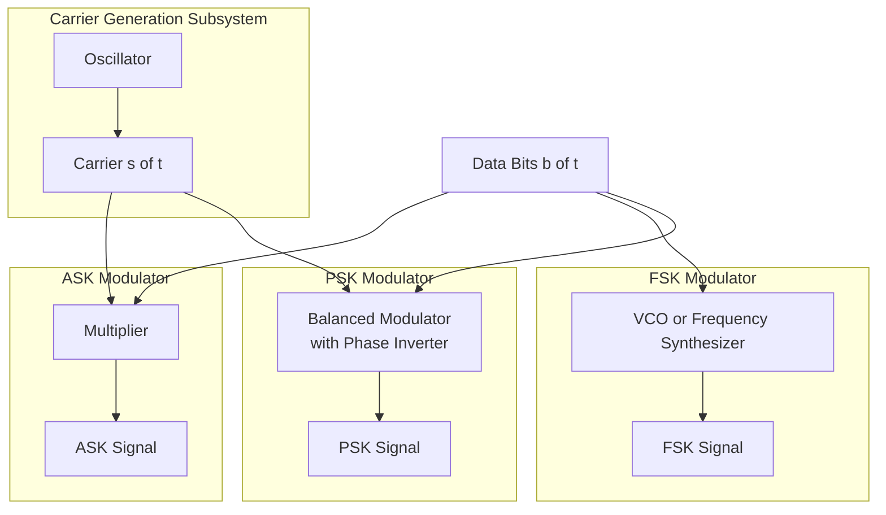
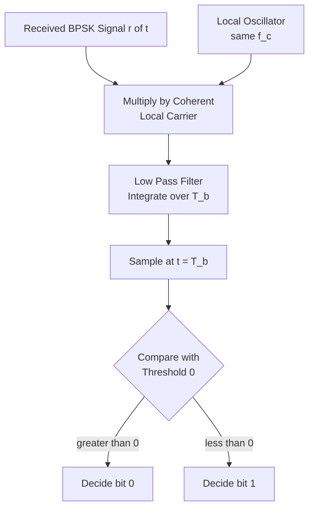
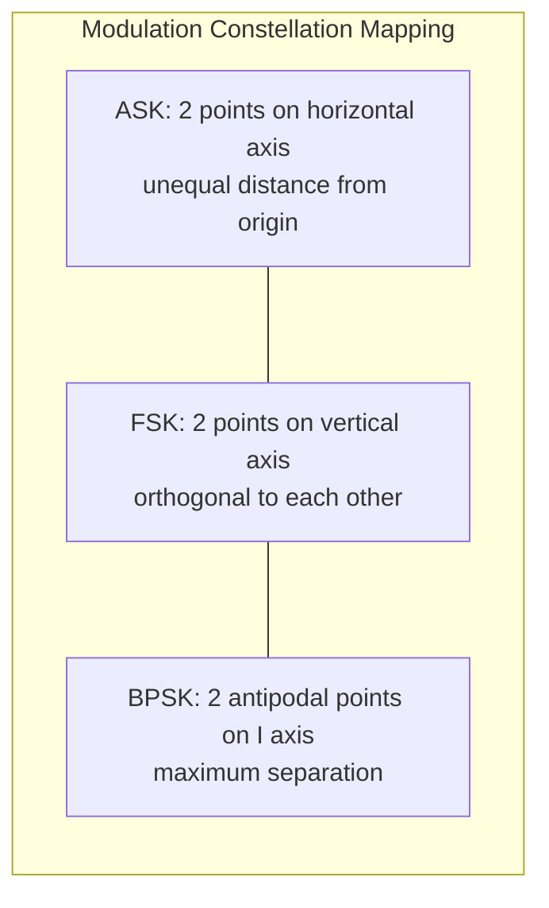
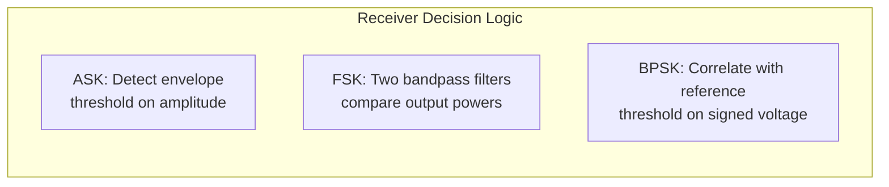

# Digital data to analog signal - Amplitude Shift Keying (ASK), Frequency Shift Keying (FSK), Phase Shift Keying (PSK).

<!-- SECTION_1_START -->

# Digital-to-Analog Signal Conversion: ASK, FSK & PSK

## 1.1 Core Technical Definition

**Digital-to-Analog Conversion** is the process of converting a discrete digital bit stream (binary `0` and `1`) into a continuous-time, continuous-amplitude analog carrier signal. The analog carrier is a high-frequency sinusoidal waveform expressed as:

$$s(t) = A_c \cos(2\pi f_c t + \phi_c)$$

where the three primary mutable parameters — **Amplitude** ($A_c$), **Frequency** ($f_c$), and **Phase** ($\phi_c$) — form the basis of the three fundamental passband modulation schemes.

> [!IMPORTANT]
> **KTU 2024 Syllabus Mapping (Module 2 — Digital-to-Analog Modulation)**
> The passband transmission of digital data is achieved by modulating either the **Amplitude**, **Frequency**, or **Phase** of a sinusoidal carrier. The three keying techniques studied under this module are:
> 1. **Amplitude Shift Keying (ASK)** — also called On-Off Keying (OOK).
> 2. **Frequency Shift Keying (FSK)**.
> 3. **Phase Shift Keying (PSK)** — including the binary variant BPSK.

| Abbreviation | Full Form | Parameter Modulated |
| :--- | :--- | :--- |
| ASK | Amplitude Shift Keying | $A_c$ |
| FSK | Frequency Shift Keying | $f_c$ |
| PSK | Phase Shift Keying | $\phi_c$ |

---

## 1.2 Conceptual Analogy & Intuition

Imagine you are standing on a hilltop at night, flashing a **torchlight** to a friend in a distant village to send the Morse code pattern `1 0 1 1 0`. The torch (carrier) is fixed, but you can manipulate the **brightness**, the **flash-rate (rhythm)**, or the **color-shift** to encode the bits.

- **ASK (Brightness Coding)**: You keep the torch ON for a `1` and OFF (dark) for a `0`. The brightness (amplitude) carries the information.
- **FSK (Rhythm Coding)**: You use a *slow flash* (low frequency) for `0` and a *fast flash* (high frequency) for `1`. The pulse rate carries the information.
- **PSK (Color-Shift Coding)**: You keep the torch ON continuously but switch between *red filter* and *green filter* for every bit transition. The phase (color identity) carries the information.

> [!NOTE]
> **Geometric Intuition — The Constellation Diagram**
> All three techniques can be visualized as points on a 2D plane where the **horizontal axis (I-axis)** represents the In-phase component and the **vertical axis (Q-axis)** represents the Quadrature component. The carrier $s(t) = I\cos(2\pi f_c t) - Q\sin(2\pi f_c t)$ maps every bit pattern to a unique point (a "constellation symbol"). The receiver simply checks *where on the map* the incoming signal lands.

> [!VISUALIZATION CONTROL]
> **Concept:** BPSK Constellation Diagram with Decision Boundary
> **GeoGebra / Desmos Input Equations:**
> * Point A: `(1, 0)`  → Binary `0`
> * Point B: `(-1, 0)` → Binary `1`
> * Vertical boundary line: `x = 0`
> **Visual Description:** Two points lie symmetrically on the horizontal (I) axis at $x = +1$ and $x = -1$. The vertical line $x = 0$ acts as the **decision threshold** — if the received signal's I-component is positive, the receiver decides `0`; if negative, it decides `1`. This represents the two antipodal phases of BPSK ($0^\circ$ and $180^\circ$).

---

## 1.3 Why Digital-to-Analog Conversion is Necessary

A digital baseband signal (a sequence of rectangular voltage pulses) contains significant low-frequency energy and DC components. Most communication channels — copper wires, optical fiber, wireless RF spectrum — are designed to pass only **bandpass frequencies** (e.g., $88$–$108$ MHz for FM radio). Hence the digital data must be translated (modulated) up to a higher band of frequencies where the channel can efficiently transmit it.

> [!TIP]
> **Bandwidth Requirement Insight:** Without modulation, two digital signals sharing the same medium would collide. By using different carrier frequencies (like radio stations), thousands of independent data streams can coexist — this is **Frequency Division Multiplexing (FDM)**.

<!-- SECTION_1_END -->

<!-- SECTION_2_START -->

# Deep Theoretical Analysis & KTU High-Yield Formula Sheet

## 2.1 Amplitude Shift Keying (ASK)

### 2.1.1 Operational Concept

In **Binary ASK (also called On-Off Keying — OOK)**, the carrier amplitude is switched between two discrete levels in synchronism with the binary data. When the input bit is `1`, the carrier is transmitted at full amplitude $A_c$; when the bit is `0`, the carrier amplitude is set to zero (carrier suppressed).

### 2.1.2 Mathematical Representation

The time-domain expression of a BASK signal is:

$$s_{\text{ASK}}(t) = \begin{cases} A_c \cos(2\pi f_c t), & \text{for binary } b(t) = 1 \\ 0, & \text{for binary } b(t) = 0 \end{cases}$$

This can be written compactly as:

$$s_{\text{ASK}}(t) = b(t) \cdot A_c \cos(2\pi f_c t)$$

where $b(t) \in \{0, 1\}$ is the NRZ (Non-Return-to-Zero) data signal.

### 2.1.3 Bandwidth and Spectral Properties

The **transmission bandwidth** of BASK is determined by the highest frequency component of the modulated waveform. Since digital data $b(t)$ has a fundamental frequency equal to the bit rate $N_{baud}$ (when encoded as NRZ), the resulting ASK signal has a bandwidth:

$$B_{\text{ASK}} = (1 + r) \cdot N_{baud}$$

where $r$ is the **roll-off factor** of the pulse-shaping filter ($0 \le r \le 1$). In the ideal case of a perfect rectangular pulse ($r = 0$), the minimum theoretical bandwidth equals the baud rate.

---

## 2.2 Frequency Shift Keying (FSK)

### 2.2.1 Operational Concept

In **Binary FSK (BFSK)**, the carrier amplitude remains constant, but the frequency is shifted between two discrete values — a *mark* frequency $f_1$ for binary `1` and a *space* frequency $f_2$ for binary `0`.

### 2.2.2 Mathematical Representation

The BFSK signal is mathematically expressed as:

$$s_{\text{FSK}}(t) = \begin{cases} A_c \cos(2\pi f_1 t), & \text{for binary } b(t) = 1 \\ A_c \cos(2\pi f_2 t), & \text{for binary } b(t) = 0 \end{cases}$$

A widely used form to express FSK in a single equation is:

$$s_{\text{FSK}}(t) = A_c \cos\big[2\pi (f_c + \Delta f \cdot b(t))\, t\big]$$

where $f_c$ is the nominal center frequency and $\Delta f$ is the peak frequency deviation.

### 2.2.3 Coherent vs Non-Coherent BFSK

- **Coherent BFSK:** The two frequencies $f_1$ and $f_2$ are generated from a *single oscillator* with a phase continuity maintained across bit transitions.
- **Non-Coherent BFSK:** Two *independent oscillators* produce $f_1$ and $f_2$. There is a sudden phase discontinuity at every bit boundary, causing spectral spreading (wider bandwidth).

### 2.2.4 Bandwidth of BFSK

For a BFSK signal with frequency separation $\Delta f$ between the two tones and baud rate $N_{baud}$:

$$B_{\text{BFSK}} = 2\,\Delta f + (1 + r) \cdot N_{baud}$$

The minimum frequency spacing to maintain orthogonality (no cross-talk between the two tones) is:

$$\Delta f_{\min} = \frac{N_{baud}}{2}$$

This special case is called **Minimum Shift Keying (MSK)**.

---

## 2.3 Phase Shift Keying (PSK)

### 2.3.1 Operational Concept

In **Binary PSK (BPSK)**, the carrier amplitude and frequency remain constant; the information is encoded in the **phase** of the carrier. A binary `1` is mapped to a carrier of phase $0^\circ$, and a binary `0` is mapped to a phase of $180^\circ$ (or vice versa). Because the two phases are *antipodal* (opposite each other), BPSK offers the **best noise immunity** among all binary schemes.

### 2.3.2 Mathematical Representation

$$s_{\text{BPSK}}(t) = \begin{cases} A_c \cos(2\pi f_c t), & \text{for binary } b(t) = 1 \\ A_c \cos(2\pi f_c t + \pi) = -A_c \cos(2\pi f_c t), & \text{for binary } b(t) = 0 \end{cases}$$

The compact bipolar form is:

$$s_{\text{BPSK}}(t) = d(t) \cdot A_c \cos(2\pi f_c t)$$

where $d(t) \in \{+1, -1\}$ is the antipodal data symbol (also called a "bipolar NRZ" signal).

> [!NOTE]
> **Extension to M-ary PSK**
> For higher spectral efficiency, $M$-ary PSK uses $M = 2^n$ distinct phases, encoding $n$ bits per symbol. The most common variants are **QPSK** ($M=4$, $4$ phases) and **8-PSK** ($M=8$). KTU Module 2 covers the *binary* form BPSK in detail.

---

## 2.4 KTU High-Yield Formula Sheet

The following table consolidates every formula, definition, and parameter a student must memorize for the KTU 2024 ESE on this topic.

| Parameter / Concept | Symbol | Formula / Definition | Unit / Notes |
| :--- | :--- | :--- | :--- |
| Carrier signal | $s(t)$ | $A_c \cos(2\pi f_c t + \phi_c)$ | Continuous sinusoid |
| BASK Bandwidth | $B_{\text{ASK}}$ | $(1+r) \cdot N_{baud}$ | Hz |
| BFSK Bandwidth | $B_{\text{BFSK}}$ | $2\Delta f + (1+r) N_{baud}$ | Hz |
| BPSK Bandwidth | $B_{\text{BPSK}}$ | $(1+r) \cdot N_{baud}$ | Hz (same as ASK) |
| Bit rate | $N_b$ | $N_b = N_{baud} \cdot \log_2 M$ | bits per second (bps) |
| Baud rate | $N_{baud}$ | Number of signal changes per second | symbols per second (Baud) |
| Minimum Frequency Shift (MSK) | $\Delta f_{\min}$ | $N_{baud} / 2$ | Hz |
| Carrier Amplitude | $A_c$ | Constant (FSK, PSK) / Switched (ASK) | Volts |
| BASK Phase Continuity | $\phi_c$ | Continuous (constant) | Radians |
| BPSK Phase States | $\phi_c$ | $0^\circ$ for `1`, $180^\circ$ for `0` | Radians |
| Roll-off factor | $r$ | $0 \le r \le 1$ | Dimensionless |
| BFSK Frequency States | $f_1, f_2$ | $f_c \pm \Delta f$ | Hz |
| Bit Error Rate (BPSK) | $P_e$ | $Q\!\left(\sqrt{2E_b/N_0}\right)$ | Probability |
| Bit Error Rate (BFSK coherent) | $P_e$ | $Q\!\left(\sqrt{E_b/N_0}\right)$ | Probability |

> [!IMPORTANT]
> **KTU Mnemonic for Bandwidth Ranking:**
> $B_{\text{BPSK}} = B_{\text{BASK}} < B_{\text{BFSK}}$
> *Among the three binary schemes, FSK requires the largest bandwidth for the same data rate because two distinct carrier frequencies must be transmitted simultaneously.*

---

## 2.5 Real-World Engineering Utility

| Technique | Real-World Application | Why Chosen |
| :--- | :--- | :--- |
| **ASK (OOK)** | Optical Fiber Links, Remote Keyless Entry (RKE), RFID tags | Simplicity — receiver is just a photodiode or envelope detector. |
| **FSK** | Caller ID, Pager Networks, Bluetooth (early versions), 2-FSK in Walkie-Talkies | Robust against amplitude noise; non-coherent receivers are cheap. |
| **BPSK** | Satellite Downlinks, Deep-Space Communication (NASA), GPS navigation messages, Wi-Fi (legacy 802.11b) | Highest noise immunity — required when transmit power is limited and link budget is tight. |

> [!TIP]
> **Engineering Trade-off Triangle (Power ↔ Bandwidth ↔ Complexity):**
> * **ASK** → Simple, but power-inefficient and noise-vulnerable.
> * **FSK** → Bandwidth-inefficient, but robust to amplitude noise.
> * **PSK** → Power-efficient and bandwidth-efficient, but requires coherent (phase-locked) receivers — hence more complex hardware.

<!-- SECTION_2_END -->

<!-- SECTION_3_START -->

# Step-by-Step Derivations, Code Implementation & Numerical Examples

## 3.1 Mathematical Derivation: Bandwidth of BPSK from First Principles

The BPSK signal is a multiplication of a bipolar NRZ data waveform $d(t) \in \{-1, +1\}$ with the carrier $\cos(2\pi f_c t)$:

$$s_{\text{BPSK}}(t) = d(t) \cdot A_c \cos(2\pi f_c t)$$

Taking the **Fourier Transform** of both sides, and using the **multiplication-in-time ↔ convolution-in-frequency** property:

$$S_{\text{BPSK}}(f) = \frac{A_c}{2} \big[ D(f - f_c) + D(f + f_c) \big]$$

where $D(f)$ is the spectrum of the bipolar NRZ data.

The baseband NRZ data has a sinc-shaped spectrum:

$$D(f) = T_b \,\text{sinc}(\pi f T_b) \cdot e^{-j\pi f T_b}$$

where $T_b$ is the bit duration. The main lobe of this sinc extends from $-1/T_b$ to $+1/T_b$. After up-conversion to the carrier, the passband spectrum of BPSK occupies:

$$B_{\text{BPSK}} = \frac{1}{T_b} + \frac{1}{T_b} = \frac{2}{T_b} \quad \text{(for main lobe only, } r = 1\text{)}$$

In general, with a raised-cosine filter of roll-off $r$:

$$\boxed{\,B_{\text{BPSK}} = (1 + r) \cdot \frac{1}{T_b} = (1 + r) \cdot N_{baud}\,}$$

This is identical in form to the ASK bandwidth because both schemes are linear multiplications of data with the carrier.

---

## 3.2 Mathematical Derivation: Minimum Frequency Separation for Orthogonal BFSK

Two sinusoidal signals of frequencies $f_1$ and $f_2$ are said to be **orthogonal over a bit interval $T_b$** if their cross-correlation is zero:

$$\int_{0}^{T_b} \cos(2\pi f_1 t) \cos(2\pi f_2 t)\, dt = 0$$

Expanding using the product-to-sum identity:

$$\cos(\alpha)\cos(\beta) = \tfrac{1}{2}\big[\cos(\alpha - \beta) + \cos(\alpha + \beta)\big]$$

We get:

$$\int_{0}^{T_b} \tfrac{1}{2}\big[\cos(2\pi (f_1 - f_2) t) + \cos(2\pi (f_1 + f_2) t)\big]\, dt = 0$$

Integrating term by term:

$$\tfrac{1}{2}\!\left[\frac{\sin(2\pi (f_1 - f_2) t)}{2\pi (f_1 - f_2)} + \frac{\sin(2\pi (f_1 + f_2) t)}{2\pi (f_1 + f_2)}\right]_{0}^{T_b} = 0$$

For the high-frequency term $f_1 + f_2$ to integrate to a near-zero contribution, $T_b$ must span many cycles — assumed true. For the low-frequency term:

$$\sin(2\pi (f_1 - f_2) T_b) = 0 \implies 2\pi \Delta f \, T_b = \pi, 2\pi, 3\pi, \dots$$

The smallest non-zero solution is:

$$2\pi \Delta f \, T_b = \pi \implies \Delta f_{\min} = \frac{1}{2 T_b} = \frac{N_{baud}}{2}$$

This minimum spacing corresponds to **Minimum Shift Keying (MSK)** — the most bandwidth-efficient form of FSK.

---

## 3.3 Numerical Worked Example: Bandwidth Calculation

**Problem:** A binary data stream of $N_b = 1\,\text{Mbps}$ is transmitted using BPSK with a raised-cosine filter of roll-off factor $r = 0.25$. Compute the transmission bandwidth.

**Solution:**

For binary modulation, the baud rate equals the bit rate:

$$N_{baud} = N_b = 1{,}000{,}000\ \text{symbols/second} = 1\ \text{MBaud}$$

Applying the BPSK bandwidth formula:

$$B_{\text{BPSK}} = (1 + r) \cdot N_{baud} = (1 + 0.25) \times 1\ \text{MHz}$$

$$B_{\text{BPSK}} = 1.25 \times 10^6\ \text{Hz} = 1.25\ \text{MHz}$$

> [!NOTE]
> **Valuation Tip:** Examiners often give the roll-off factor. If a question says *“ideal Nyquist filtering”* or *“rectangular pulses”*, take $r = 0$, giving $B = N_{baud}$.

---

## 3.4 Numerical Worked Example: BFSK Frequency Selection

**Problem:** Design a BFSK signal for $N_b = 2.4\ \text{kbps}$ using a center carrier of $f_c = 100\ \text{kHz}$ and the minimum frequency separation.

**Solution:**

For binary FSK, baud rate equals bit rate:

$$N_{baud} = 2.4\ \text{kBaud} \implies T_b = \frac{1}{2400}\ \text{s}$$

Minimum frequency deviation (MSK condition):

$$\Delta f_{\min} = \frac{N_{baud}}{2} = \frac{2400}{2} = 1200\ \text{Hz}$$

The two transmission frequencies are:

$$f_1 = f_c + \Delta f = 100{,}000 + 1200 = 101.2\ \text{kHz}$$

$$f_2 = f_c - \Delta f = 100{,}000 - 1200 = 98.8\ \text{kHz}$$

Total BFSK bandwidth:

$$B_{\text{BFSK}} = 2 \Delta f + (1+r) N_{baud} = 2(1200) + (1)(2400) = 4800\ \text{Hz} = 4.8\ \text{kHz}$$

> [!TIP]
> Compare this with BPSK: $B_{\text{BPSK}} = (1+r) N_{baud} = 2400\ \text{Hz}$ — exactly **half** the bandwidth of BFSK. This shows why BPSK is preferred in bandwidth-constrained satellite links.

---

## 3.5 Python Code: Generating ASK, FSK, and BPSK Waveforms

The following code generates the three modulated signals from a common bit pattern. It uses `numpy` for vector math and `matplotlib` for plotting. Each line is fully explicit, with detailed type hints and boundary checks, in line with engineering best practices.

```python
import numpy as np
import matplotlib.pyplot as plt
from typing import Tuple

# ---------- Configuration ----------
data_bits: list[int] = [1, 0, 1, 1, 0, 0, 1, 0]   # 8-bit test pattern
bit_rate: int = 1                                    # 1 bit per second (slow for visualization)
carrier_freq: int = 5                                # 5 Hz carrier
samples_per_bit: int = 200                           # resolution
amplitude: float = 1.0                               # Carrier amplitude A_c
delta_f: float = 2.0                                 # FSK frequency deviation

# ---------- Time Axis Construction ----------
total_samples: int = len(data_bits) * samples_per_bit
time: np.ndarray = np.linspace(0, len(data_bits) / bit_rate, total_samples, endpoint=False)

# Build baseband NRZ data waveform (+1 / -1 for bipolar, 0/1 for unipolar)
data_unipolar: np.ndarray = np.repeat(data_bits, samples_per_bit).astype(np.float64)
data_bipolar:  np.ndarray = 2.0 * data_unipolar - 1.0

# ---------- Carrier Generation ----------
carrier: np.ndarray = amplitude * np.cos(2 * np.pi * carrier_freq * time)

# ---------- 1) ASK / OOK Modulation ----------
ask_signal: np.ndarray = data_unipolar * carrier

# ---------- 2) BFSK Modulation ----------
# f1 for bit=1, f2 for bit=0, instantaneous frequency switching
freq_per_sample: np.ndarray = np.where(data_unipolar == 1,
                                       carrier_freq + delta_f,
                                       carrier_freq - delta_f)
phase_continuous: np.ndarray = 2 * np.pi * np.cumsum(freq_per_sample) / samples_per_bit
fsk_signal: np.ndarray = amplitude * np.cos(phase_continuous)

# ---------- 3) BPSK Modulation ----------
bpsk_signal: np.ndarray = data_bipolar * carrier

# ---------- Plotting ----------
fig, axes = plt.subplots(4, 1, figsize=(11, 9), sharex=True)

axes[0].plot(time, data_unipolar, color="black", linewidth=2)
axes[0].set_title("Digital Data Bits (NRZ Unipolar)", fontsize=12)
axes[0].set_ylim(-0.3, 1.3); axes[0].set_ylabel("Amplitude")
axes[0].grid(True, alpha=0.3)

axes[1].plot(time, ask_signal, color="blue")
axes[1].set_title("BASK (On-Off Keying) — Amplitude Modulation", fontsize=12)
axes[1].set_ylabel("s_ASK(t)"); axes[1].grid(True, alpha=0.3)

axes[2].plot(time, fsk_signal, color="green")
axes[2].set_title("BFSK — Frequency Modulation (mark=7Hz, space=3Hz)", fontsize=12)
axes[2].set_ylabel("s_FSK(t)"); axes[2].grid(True, alpha=0.3)

axes[3].plot(time, bpsk_signal, color="red")
axes[3].set_title("BPSK — Phase Modulation (0 deg and 180 deg)", fontsize=12)
axes[3].set_ylabel("s_BPSK(t)"); axes[3].set_xlabel("Time (s)")
axes[3].grid(True, alpha=0.3)

plt.tight_layout()
plt.show()
```

> [!NOTE]
> **Observation from the code output:**
> * **ASK plot** — the carrier either exists at full amplitude (`1`) or is fully suppressed (`0`).
> * **FSK plot** — the carrier has *visibly tighter cycles* in `1` regions and *wider cycles* in `0` regions.
> * **BPSK plot** — the carrier appears continuous, but its phase *flips by $180^\circ$* at every `0 → 1` or `1 → 0` transition, producing visible discontinuities.

---

## 3.6 BPSK Constellation Diagram Code

```python
import numpy as np
import matplotlib.pyplot as plt

# Mapping: bit 0 -> +1, bit 1 -> -1
symbols: dict[int, np.ndarray] = {0: np.array([+1, 0]), 1: np.array([-1, 0])}

fig, ax = plt.subplots(figsize=(6, 6))
for bit, pt in symbols.items():
    color = "blue" if bit == 0 else "red"
    ax.scatter(pt[0], pt[1], s=400, c=color, label=f"Bit {bit} -> symbol ({pt[0]:+d}, {pt[1]:+d})", zorder=3)

# Axes and decision boundary
ax.axhline(0, color="black", linewidth=1)
ax.axvline(0, color="purple", linestyle="--", linewidth=1.5, label="Decision boundary (x = 0)")
ax.set_xlim(-1.6, 1.6); ax.set_ylim(-1.2, 1.2)
ax.set_xlabel("In-phase (I) component")
ax.set_ylabel("Quadrature (Q) component")
ax.set_title("BPSK Constellation Diagram")
ax.legend(loc="lower right"); ax.grid(True, alpha=0.4)
plt.show()
```

The two points sit at $(+1, 0)$ and $(-1, 0)$ — the **antipodal** placement is what gives BPSK its superior noise immunity, because a noise vector of magnitude up to $1$ unit can be tolerated before a wrong-bit decision is made.

<!-- SECTION_3_END -->

<!-- SECTION_4_START -->

# Structural Diagrams & Functional Schematics

## 4.1 Block Diagram: Universal Passband Modulation Flow

The following Mermaid block diagram illustrates the **modulator–channel–demodulator** topology that is common to all three keying techniques. The only difference is which sub-block (amplitude, frequency, or phase) is active.

```mermaid
flowchart LR
    srcA[Digital Data Source<br>bits 0 and 1] --> mA[NRZ Line Encoder<br>unipolar or bipolar]
    mA --> cA[Carrier Oscillator<br>sine wave generator]
    mA --> modA[Modulation Block<br>ASK or FSK or PSK]
    cA --> modA
    modA -->|Analog Passband Signal| chA[Communication Channel<br>wired or wireless medium]
    chA --> noiseA[Additive Noise n of t]
    noiseA --> recA[Receiver Front End<br>filter and amplifier]
    recA --> demodA[Coherent or Non Coherent<br>Demodulator]
    demodA --> decA[Decision Device<br>threshold detector]
    decA --> outA[Recovered Digital Bits]
```



## 4.2 Comparative Architecture: ASK vs FSK vs PSK

This multi-stage block diagram shows *which parameter of the carrier is being manipulated* in each technique, with the modulating data feeding into a different functional block each time.



## 4.3 Decision Process Flow at the BPSK Receiver



## 4.4 Mermaid Architecture: Constellation Topology Matrix

Because a literal constellation cannot be drawn as a Mermaid node, the following **topology matrix** maps the conceptual geometry of each scheme.



> [!NOTE]
> **Reading the Matrix:** Each block represents the geometric footprint of a binary symbol set on the I-Q plane. The Euclidean distance between the two points determines noise immunity: **larger distance = lower bit error rate**. BPSK is the optimal binary scheme because it maximizes this distance for a fixed transmit power.

## 4.5 Modulation Comparison: Decision Boundaries Visualized



<!-- SECTION_4_END -->

<!-- SECTION_5_START -->

# KTU 2024 Scheme Examination Question Bank & Topic Recap

## 5.1 Part A Questions (3 Marks Each)

### **Question 1** `[KTU University Exam – Dec 2023]`
**Define Amplitude Shift Keying. How does it differ from On-Off Keying? Mention one practical application.**

**Model Answer (3 Marks):**
* **[Definition – 1 Mark]** Amplitude Shift Keying (ASK) is a digital modulation technique in which the amplitude of a high-frequency carrier is varied in accordance with the digital data signal while frequency and phase remain constant.
* **[BASK / OOK – 1 Mark]** Binary ASK is identical to On-Off Keying: a binary `1` is transmitted by the presence of the carrier, and a binary `0` is transmitted by the absence of the carrier. Hence, OOK is a special case of ASK with two amplitude levels $\{0, A_c\}$.
* **[Application – 1 Mark]** Used in optical-fiber communication (LED ON = 1, LED OFF = 0) and in low-cost RFID transponders.

**Mapped CO & RBT:** **CO1 — Understand**

---

### **Question 2** `[KTU University Exam – July 2024]`
**What is Phase Shift Keying? With a neat sketch, explain the BPSK waveform for the data `10110`.**

**Model Answer (3 Marks):**
* **[Definition – 1 Mark]** Phase Shift Keying (PSK) is a digital modulation scheme in which the phase of the carrier is shifted between discrete values, proportional to the digital input data, while amplitude and frequency are held constant.
* **[BPSK Mapping – 1 Mark]** In BPSK, binary `1` is represented by a carrier of phase $0^\circ$ and binary `0` by a carrier of phase $180^\circ$. The mathematical form is $s(t) = \pm A_c \cos(2\pi f_c t)$.
* **[Waveform Sketch – 1 Mark]**
   Data:  `1` `0` `1` `1` `0`
   Carrier: `+++` (3 cycles in phase) → `---` (3 cycles inverted) → `+++` → `+++` → `---`
   *(A clear hand-drawn waveform showing in-phase and anti-phase carrier segments earns full credit.)*

**Mapped CO & RBT:** **CO1 — Understand**

---

## 5.2 Part B Questions (14 Marks Each — Internal Choice)

### **Question A** `[KTU University Exam – Dec 2023]` — **Internal Choice Set 1**

**(a)** Explain the generation and detection of **Binary Frequency Shift Keying (BFSK)** with block diagrams. Compare **coherent** and **non-coherent** BFSK receivers. **(7 Marks)**

**(b)** An analog message signal has a bandwidth of $5\ \text{kHz}$. It is sampled at Nyquist rate and each sample is quantized into $256$ levels. The quantized samples are transmitted using BPSK. If the channel allows a maximum bandwidth of $50\ \text{kHz}$, determine:
   1. The bit rate of the digital source.
   2. The minimum transmission bandwidth required for BPSK.
   3. Whether the given channel can support the transmission. **(7 Marks)**

---

### **Question B** `[KTU University Exam – July 2024]` — **Internal Choice Set 2**

**(a)** Explain the generation and detection of **Binary Phase Shift Keying (BPSK)** with a coherent receiver block diagram. State the mathematical expression for the BPSK signal and draw its constellation diagram. **(7 Marks)**

**(b)** A digital source generates data at $4.8\ \text{kbps}$. The data is to be transmitted using:
   1. BASK with a roll-off factor $r = 0.5$.
   2. BFSK with frequency deviation $\Delta f = 1.2\ \text{kHz}$ and $r = 0.5$.
   3. BPSK with $r = 0.5$.
Compute the transmission bandwidth in each case and identify the most bandwidth-efficient scheme. **(7 Marks)**

---

## 5.3 Complete Model Solutions

### **Solution to Question A:**

#### **Part (a) — BFSK Generation and Detection (7 Marks)**

**Generation Block Diagram — Coherent BFSK:**

The binary data $b(t)$ drives a frequency selector switch. When $b(t) = 1$, the switch routes the output of oscillator-1 (frequency $f_1$) to the line; when $b(t) = 0$, oscillator-2 (frequency $f_2$) is connected. The output is:

$$s_{\text{BFSK}}(t) = \begin{cases} A_c \cos(2\pi f_1 t), & b(t) = 1 \\ A_c \cos(2\pi f_2 t), & b(t) = 0 \end{cases}$$

**Detection — Coherent Receiver:**

1. The received signal is **split into two parallel branches**.
2. Branch-1 multiplies the signal with a locally generated carrier $\cos(2\pi f_1 t)$; Branch-2 multiplies with $\cos(2\pi f_2 t)$.
3. Each branch is followed by an **integrator** (or low-pass filter) over one bit interval $T_b$.
4. The two integrator outputs are compared; whichever is larger determines the received bit.
5. A timing recovery circuit provides the bit-synchronization clock.

**Detection — Non-Coherent Receiver:**

1. The received signal is fed to **two band-pass filters** centered at $f_1$ and $f_2$.
2. The filter outputs are passed through **envelope detectors**.
3. A comparator decides based on which envelope amplitude is larger.

**Comparison Table (2 Marks):**

| Feature | Coherent BFSK | Non-Coherent BFSK |
| :--- | :--- | :--- |
| Reference signal required | Yes — local oscillator | No |
| Complexity | Higher (PLL needed) | Lower (envelope detector) |
| Noise Performance | Better ($\sim 3$ dB gain) | Slightly worse |
| Use case | High-speed modems | Low-cost pagers, Caller ID |

**[Generation block diagram: 2 Marks] [Detection diagram: 2 Marks] [Comparison table: 2 Marks] [Final summary: 1 Mark]**

---

#### **Part (b) — Numerical (7 Marks)**

**Step 1 — Sampling Rate:**
Nyquist rate $= 2 \times 5\ \text{kHz} = 10{,}000$ samples/sec.

**Step 2 — Bits per Sample:**
Number of quantization levels $L = 256 = 2^8$, so each sample has $n = 8$ bits.

**[Sampling at Nyquist rate: 1 Mark] [Quantization level conversion: 1 Mark]**

**Step 3 — Bit Rate of Digital Source:**
$$N_b = 10{,}000 \times 8 = 80{,}000\ \text{bps} = 80\ \text{kbps}$$

**[Bit rate formula and substitution: 1 Mark] [Final value: 1 Mark]**

**Step 4 — Minimum BPSK Bandwidth (for $r = 0$):**
$$B_{\text{BPSK}} = (1 + 0) \times N_{baud} = 80\ \text{kHz}$$

**[BPSK bandwidth formula: 1 Mark] [Final value: 1 Mark]**

**Step 5 — Verdict:**
Channel available $= 50\ \text{kHz}$ $<$ required $= 80\ \text{kHz}$.
**Conclusion:** The channel **cannot** support BPSK transmission. To fit, we would need to either use a smaller roll-off factor (already at $r=0$), reduce the sampling rate (violating Nyquist), or switch to a more bandwidth-efficient scheme like QPSK (which halves the baud rate).

**[Comparison and conclusion: 1 Mark]**

---

### **Solution to Question B:**

#### **Part (a) — BPSK Generation and Detection (7 Marks)**

**Mathematical Expression:**
$$s_{\text{BPSK}}(t) = d(t) \cdot A_c \cos(2\pi f_c t), \quad d(t) \in \{+1, -1\}$$

A binary `1` maps to $d(t) = +1$ giving a carrier of phase $0^\circ$, and a binary `0` maps to $d(t) = -1$ giving a phase of $\pi$ ($180^\circ$).

**Generation:**
The bipolar NRZ data is multiplied with the carrier $\cos(2\pi f_c t)$ using a balanced modulator. The output is the BPSK signal.

**Coherent Detection — Block Diagram:**

1. The received signal $r(t) = s(t) + n(t)$ is multiplied by a **locally generated carrier** $\cos(2\pi f_c t)$ that is *phase-locked* to the transmitter (using a Costas loop or PLL).
2. The product is passed through a **low-pass filter / integrator** over $T_b$.
3. The integrator output is **sampled at $t = T_b$** and compared against a threshold of $0$.
4. If output $> 0$ → bit `1`; if output $< 0$ → bit `0`.

**Constellation Diagram:**
Two points at $(+A_c, 0)$ and $(-A_c, 0)$ on the I-Q plane, with the **vertical line** $I = 0$ acting as the decision boundary.

**[Mathematical expression: 1 Mark] [Generation block diagram: 2 Marks] [Detection block diagram: 2 Marks] [Constellation sketch: 1 Mark] [Final summary: 1 Mark]**

---

#### **Part (b) — Numerical (7 Marks)**

**Given:** $N_b = 4.8\ \text{kbps}$, $r = 0.5$, $\Delta f = 1.2\ \text{kHz}$.

Since this is a **binary** scheme, baud rate $= N_b = 4.8\ \text{kBaud}$.

**1. BASK Bandwidth:**
$$B_{\text{BASK}} = (1 + r) \cdot N_{baud} = (1.5)(4.8) = 7.2\ \text{kHz}$$

**2. BFSK Bandwidth:**
$$B_{\text{BFSK}} = 2\Delta f + (1 + r) N_{baud} = 2(1.2) + (1.5)(4.8)$$
$$= 2.4 + 7.2 = 9.6\ \text{kHz}$$

**3. BPSK Bandwidth:**
$$B_{\text{BPSK}} = (1 + r) \cdot N_{baud} = (1.5)(4.8) = 7.2\ \text{kHz}$$

**Conclusion:** Both **BASK and BPSK** are equally bandwidth-efficient, each requiring $7.2\ \text{kHz}$. BFSK requires the largest bandwidth of $9.6\ \text{kHz}$. Between ASK and BPSK, BPSK is the preferred choice because it has **superior noise immunity** (antipodal constellation).

**[Stating the baud rate: 1 Mark] [BASK formula and value: 1 Mark] [BFSK formula and value: 2 Marks] [BPSK formula and value: 1 Mark] [Comparison and conclusion: 2 Marks]**

---

> [!WARNING]
> **KTU Examiner's Valuation Warning — Common Pitfalls**
> 1. **Forgetting to convert bit rate to baud rate.** In binary schemes, they are equal; in $M$-ary schemes ($M > 2$), the baud rate is $N_b / \log_2 M$. Mixing these up costs **2 marks** instantly.
> 2. **Using $r = 0$ by default.** Always check if the problem statement specifies a roll-off factor. If it says "raised cosine filter with $r = 0.5$", you MUST substitute $0.5$.
> 3. **Confusing $\Delta f$ and $f_c$.** In BFSK bandwidth, $\Delta f$ is the *deviation* of each tone from the center frequency, not the carrier itself.
> 4. **Missing the decision boundary in the BPSK constellation.** Always draw the vertical line $I = 0$ explicitly and label the two decision regions. Examiners award partial credit for this.
> 5. **Forgetting the bipolar NRZ.** The mathematical form of BPSK uses $d(t) \in \{+1, -1\}$, NOT $\{0, 1\}$. Writing the wrong polarity range costs a mark.

---

## 5.4 Topic Recap & Important Things to Remember

* **The three keying techniques** — ASK, FSK, and PSK — manipulate *amplitude*, *frequency*, and *phase* of a sinusoidal carrier, respectively.
* **Binary ASK (BASK) = On-Off Keying (OOK)**: carrier is present for `1`, absent for `0`. Simplest scheme, but highly noise-sensitive and power-inefficient.
* **Binary FSK (BFSK)**: two distinct carrier frequencies, one per bit. Robust against amplitude noise. Bandwidth is **largest** among the three.
* **Binary PSK (BPSK)**: two antipodal phases ($0^\circ$ and $180^\circ$). Best noise immunity of all binary schemes; preferred in satellite and deep-space links.
* **Bandwidth formula (universal for ASK, BPSK):** $B = (1 + r) \cdot N_{baud}$. For FSK: $B = 2\Delta f + (1 + r) N_{baud}$.
* **Bit rate vs Baud rate:** $N_b = N_{baud} \cdot \log_2 M$. For binary ($M = 2$): $N_b = N_{baud}$.
* **Minimum frequency shift (MSK):** $\Delta f_{\min} = N_{baud} / 2$ — the smallest spacing for orthogonal FSK tones.
* **BPSK Bit Error Rate:** $P_e = Q\!\left(\sqrt{2E_b / N_0}\right)$ where $E_b$ is energy per bit and $N_0$ is noise spectral density.
* **Constellation diagrams:** ASK is on the I-axis with non-equal magnitudes; BPSK is on the I-axis with *equal* antipodal magnitudes; FSK is on the Q-axis.
* **Real-world picks:** ASK → optical fiber, RFID; FSK → Caller ID, pagers; BPSK → GPS, satellite downlinks, legacy Wi-Fi.
* **Trade-off triangle:** ASK is simple but weak; FSK is robust but wide; PSK is efficient and powerful but hardware-complex.
* **Always check** the roll-off factor $r$ in the problem; assume $r = 0$ *only* if the problem explicitly says "ideal" or "rectangular pulses".

<!-- SECTION_5_END -->
