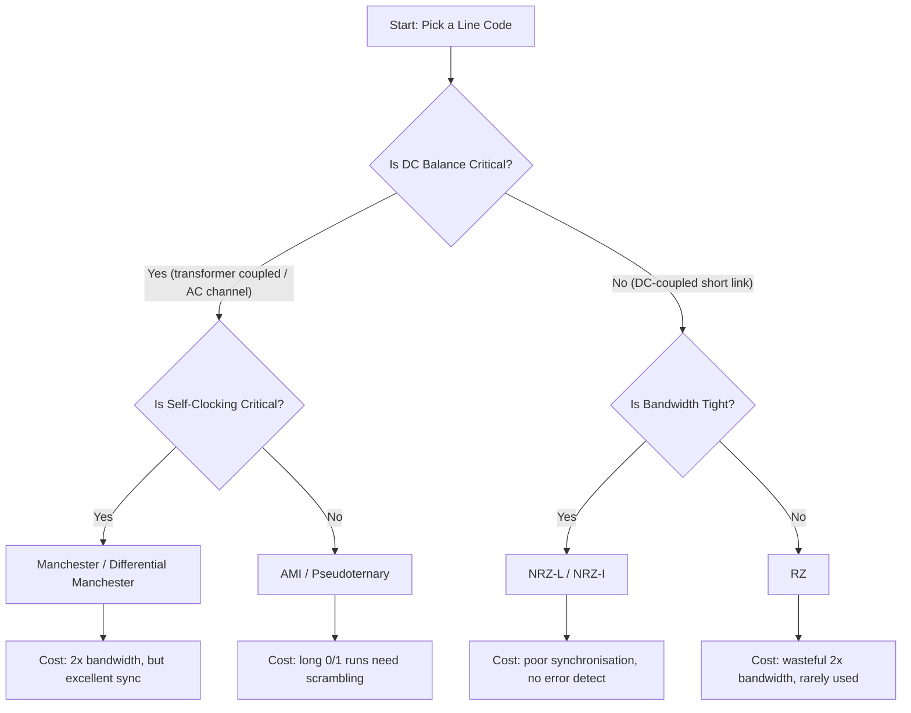
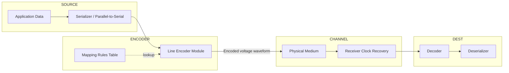
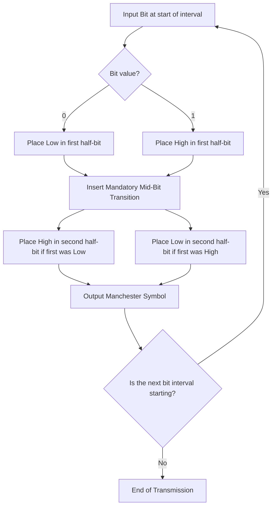
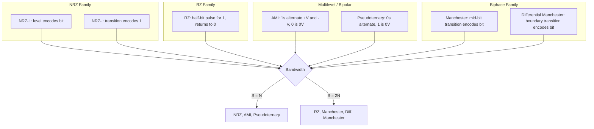
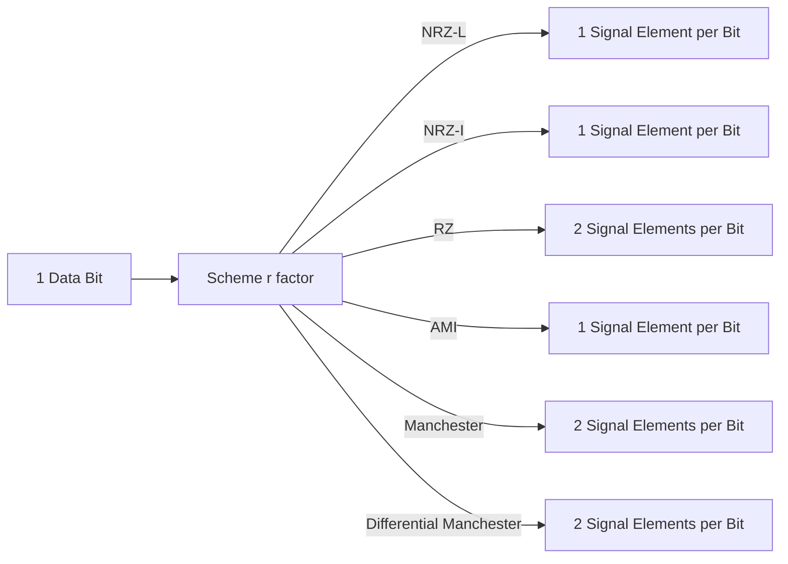

# Digital data to digital signal – Non-Return-to-Zero (NRZ), Return-to-Zero (RZ), Multilevel binary, Biphase.

<!-- SECTION_1_START -->
# Module 2: Digital Data to Digital Signal Conversion

## Core Technical Definition & Intuitive Overview

> [!IMPORTANT]
> **KTU 2024 Syllabus Definition (OECST612 – Module 2)**
> *Line Coding* is the process of converting **digital data** (binary 0s and 1s) into a **digital signal** (sequence of discrete voltage or current pulses) suitable for transmission across a physical medium such as copper wire, optical fibre, or a wireless link.

The conversion is necessary because a computer stores information as abstract bits, but the physical channel only understands continuously varying electrical, optical, or electromagnetic phenomena. The transmitter therefore attaches a **voltage level, polarity, or transition pattern** to every bit, and the receiver decodes it back.

### Conceptual Analogy — The "Flag System" 🚩

Imagine two soldiers on a hilltop communicating with coloured flags:

| Flag Action | Bit Value |
|-------------|-----------|
| Flag UP (red pole visible) | Logical `1` |
| Flag DOWN (white pole visible) | Logical `0` |

Different **line-coding schemes** are simply different *flag-handling rules*:

- **NRZ-L** → Flag stays UP for the entire `1` duration, stays DOWN for `0` (no rule about returning to rest).
- **NRZ-I** → Flag position is interpreted by *change*, not by level.
- **RZ** → Flag is raised and then *brought back to the resting pole* every time, even for a `1`.
- **Manchester** → Flag is *flipped* in the middle of every bit interval.

The receiver "reads" the flag at the agreed bit-interval boundaries and reconstructs the original letter (bit).

> [!NOTE]
> **Why not just send a constant +5 V for `1` and 0 V for `0`?**
> The exact voltage magnitude is less important than the **transitions and levels** that allow the receiver to synchronise its clock. This gives rise to the five critical evaluation parameters every KTU examiner tests:
>
> 1. **Signal Rate (Baud Rate)** — the number of signal elements (voltage changes) per second.
> 2. **DC Component** — a non-zero average voltage that travels through the medium (unwanted because it cannot pass through transformers and AC-coupled channels).
> 3. **Self-Clocking (Synchronisation)** — the receiver should be able to recover the bit clock from the signal alone.
> 4. **Error Detection Capability** — some schemes force illegal voltage levels when bits are corrupted.
> 5. **Bandwidth Efficiency** — a faster signal rate consumes a wider spectrum.

### GeoGebra / Desmos Visualisation Block

> [!VISUALIZATION CONTROL]
> **Concept:** Manchester vs NRZ-L waveform for the bit string `0 1 0 0 1 1`
> **GeoGebra / Desmos Input Equations:**
> * `f_{NRZL}(t) = piecewise(0 ≤ t < 1: -1, 1 ≤ t < 2: 1, 2 ≤ t < 4: -1, 4 ≤ t < 5: 1, 5 ≤ t < 6: 1)`  *(amplitudes in V)*
> * `f_{MAN}(t) = piecewise(0 ≤ t < 0.5: -1, 0.5 ≤ t < 1: 1, 1 ≤ t < 1.5: 1, 1.5 ≤ t < 2: -1, 2 ≤ t < 2.5: -1, 2.5 ≤ t < 3: 1, 3 ≤ t < 3.5: 1, 3.5 ≤ t < 4: -1, 4 ≤ t < 4.5: -1, 4.5 ≤ t < 5: 1, 5 ≤ t < 5.5: 1, 5.5 ≤ t < 6: -1)`
> **Visual Description:** The NRZ-L plot will show flat high/low plateaus. The Manchester plot will show a *transition in the middle of every single bit interval* — a Low-to-High jump for `0` and a High-to-Low jump for `1`. This mid-bit transition is what makes Manchester **self-clocking**.

<!-- SECTION_1_END -->

<!-- SECTION_2_START -->
# Deep Theoretical Analysis & KTU High-Yield Formula Sheet

## 2.1 The Taxonomy of Line-Coding Schemes

KTU groups digital-to-digital conversion into **four families**:

```
Digital-to-Digital Conversion
├── Unipolar
│     ├── NRZ (No Return-to-Zero)
│     └── RZ (Return-to-Zero)
├── Polar
│     ├── NRZ-L (Level)
│     ├── NRZ-I (Inversion)
│     ├── Biphase
│     │     ├── Manchester
│     │     └── Differential Manchester
└── Bipolar / Multilevel
      ├── AMI  (Alternate Mark Inversion)
      └── Pseudoternary
```

The first cut between schemes is **unipolar vs polar vs bipolar**, decided by how many voltage levels are used and whether one of them is zero.

---

## 2.2 Non-Return-to-Zero (NRZ)

### 2.2.1 NRZ-L (Non-Return-to-Zero Level)

The amplitude of the signal is **constant for the entire bit duration**; it does **not** drop to zero between bits. The level itself represents the bit.

| Bit | Voltage |
|-----|---------|
| `0` | Low (e.g. **0 V**) |
| `1` | High (e.g. **+V V**) |

* **Signal rate** = **Data rate** = $N$ bauds for $N$ bps.
* **DC component** is **present and large** when the bit stream has a long run of identical bits.
* **No self-clocking** → a long string of `1`s or `0`s confuses the receiver.
* **Pros** — simple, bandwidth-efficient.
* **Cons** — DC wander, poor synchronisation, no error detection.

### 2.2.2 NRZ-I (Non-Return-to-Zero Inverted / Inversion)

* Level is **decoded by transition (or absence of transition)** rather than absolute value.
* A **transition** at the start of a bit interval ⇒ bit = `1`.
* **No transition** ⇒ bit = `0`.
* A long string of `0`s still produces a flat line, so synchronisation is not perfect — but better than NRZ-L.
* Used inside **USB, IEEE 802.3 (Differential Manchester variant)** and serial communication standards.

> [!TIP]
> **Examiner Favourite Question:** "Why is NRZ-I considered *better* than NRZ-L?"
> **Model Answer (3 marks):** In NRZ-I, a transition always represents a `1`, and the *number of transitions* is halved in worst case. The DC component is also slightly reduced because the *change* matters, not the absolute level, allowing differential receivers to ignore common-mode noise.

---

## 2.3 Return-to-Zero (RZ)

In RZ, the signal **returns to zero (the neutral or reference level)** in the *middle of every bit interval*. A `1` is therefore represented by a half-bit HIGH pulse followed by a half-bit LOW (or zero) pulse, while a `0` is just a flat zero line for the whole bit.

* **Bandwidth requirement is doubled** — the signal rate = **$2N$** bauds.
* **Self-clocking is excellent** because every bit has an explicit transition (rising edge for `1`).
* **Power efficiency is poor** — most of the energy is wasted in the return-to-zero half.
* Almost never used in modern high-speed links because of its poor bandwidth efficiency.

---

## 2.4 Multilevel Binary (Bipolar / AMI Family)

To **eliminate the DC component** and **introduce redundancy for error detection**, multilevel schemes use **three** voltage levels: $+V$, $0$, $-V$.

### 2.4.1 Alternate Mark Inversion (AMI)

| Bit | Voltage |
|-----|---------|
| `0` | **0 V (neutral)** |
| `1` | **Alternately $+V$ and $-V$** |

* Consecutive `1`s therefore alternate in sign ⇒ **DC component ≈ 0**.
* A long run of `0`s still gives a flat line ⇒ **synchronisation problem** (solved by *scrambling* or *B8ZS/HDB3*).
* A single bit error can be detected because the polarity alternation is broken.
* Used in **T1 (1.544 Mbps) and E1 (2.048 Mbps) telephone trunk lines**.

### 2.4.2 Pseudoternary

The *mirror* of AMI — the `1` is the neutral level and the `0`s alternate between $+V$ and $-V$.

| Bit | Voltage |
|-----|---------|
| `0` | Alternately $+V$ and $-V$ |
| `1` | **0 V** |

The properties are identical to AMI in terms of DC balance; the choice is purely a matter of which bit is considered the "common" one.

---

## 2.5 Biphase (Manchester and Differential Manchester)

Biphase schemes guarantee a transition **in the middle of every bit period**, which makes them *self-clocking* and *DC-balanced*.

### 2.5.1 Manchester

* A **Low-to-High transition** in the middle of the bit ⇒ bit = `0`.
* A **High-to-Low transition** in the middle of the bit ⇒ bit = `1`.
* There is also *always* a transition at the *boundary* of consecutive equal bits, but no transition at the boundary of opposite bits.
* **Signal rate = $2N$** bauds (bandwidth doubled).
* **IEEE 802.3 (10 Mbps Ethernet)** uses Manchester.

### 2.5.2 Differential Manchester

* The **middle-of-bit transition is mandatory and is purely for clocking** — its direction is constant (always Low-to-High, say).
* The **bit value is encoded by the presence/absence of a transition at the START of the bit interval**:
  * Transition at the start ⇒ bit = `0`.
  * No transition at the start ⇒ bit = `1`.
* Used in **Token Ring (IEEE 802.5)**.
* More robust to polarity inversion than plain Manchester.

> [!IMPORTANT]
> **KTU Concept Anchor — "Polar vs Bipolar"**
> Polar schemes (NRZ-L, NRZ-I, Manchester) use **two non-zero voltages** ($+V$, $-V$).
> Bipolar schemes (AMI, Pseudoternary) use **three levels** ($+V$, $0$, $-V$).
> The word "polar" therefore *does not* mean "bipolar".

---

## 2.6 KTU Formula Sheet / Cheat Sheet

> The following table is the single most-memorised artefact in Module 2. Reproduce it verbatim in the exam for full marks.

| # | Scheme | Signal Rate (Baud) | Min. Bandwidth (Hz) | DC Component | Self-Clocking | Error Detection |
|---|--------|--------------------|---------------------|--------------|----------------|------------------|
| 1 | NRZ-L | $N$ | $N/2$ | **High** (worst) | ❌ No | ❌ No |
| 2 | NRZ-I | $N$ | $N/2$ | Moderate | ⚠️ Partial (1's only) | ❌ No |
| 3 | Bipolar AMI | $N$ | $N/2$ | **None (≈0)** | ❌ No (long 0s) | ✅ Yes (polarity rule) |
| 4 | Pseudoternary | $N$ | $N/2$ | **None (≈0)** | ❌ No (long 1s) | ✅ Yes |
| 5 | RZ (Unipolar) | $2N$ | $N$ | High | ✅ Yes (mid-bit) | ❌ No |
| 6 | Manchester | $2N$ | $N$ | **None (≈0)** | ✅ **Yes (best)** | ❌ No |
| 7 | Differential Manchester | $2N$ | $N$ | **None (≈0)** | ✅ **Yes (best)** | ⚠️ Partial |

> [!TIP]
> The most-asked formula in KTU 2024 papers is the relationship between **bit rate $N$** and **baud rate $S$**:
> $$S = N \times \frac{1}{r}$$
> where $r$ is the number of data bits packed into a single signal element. For all schemes covered in this module, $r = 1$, hence $S = N$ for NRZ and AMI families, and $S = 2N$ for RZ, Manchester, and Differential Manchester.

---

## 2.7 Engineering & Real-World Utility

| Domain | Scheme Used | Reason |
|--------|-------------|--------|
| 10 Mbps Ethernet (IEEE 802.3) | Manchester | Self-clocking, DC-balanced for transformer coupling |
| Token Ring (IEEE 802.5) | Differential Manchester | Polarity-invariance |
| T1 / E1 leased lines | AMI / HDB3 | Zero DC, error detection, long-distance |
| USB 2.0 | NRZ-I | Differential, transition-based, robust to ground shifts |
| Optical fibre links (long-haul) | NRZ + scrambler | Bandwidth efficiency |
| Synchronous optical (SONET) | Scrambled NRZ | DC balance via scrambler, high bit rate |

<!-- SECTION_2_END -->

<!-- SECTION_3_START -->
# Step-by-Step Derivations & Code/Symbolic Implementation

## 3.1 Worked Example — Drawing Every Waveform for the Bit Stream `1 0 1 1 0 0 1`

We will now manually draw, for every scheme, the voltage signal corresponding to the bit stream $\mathbf{B} = [1, 0, 1, 1, 0, 0, 1]$. Each bit occupies a duration of $T_b = 1$ second, so the total signal window is $7$ s.

### 3.1.1 NRZ-L Trace

| Bit | t (s) | Voltage (V) |
|-----|-------|-------------|
| 1   | 0–1   | +V = +1     |
| 0   | 1–2   | 0           |
| 1   | 2–3   | +1          |
| 1   | 3–4   | +1          |
| 0   | 4–5   | 0           |
| 0   | 5–6   | 0           |
| 1   | 6–7   | +1          |

Mid-bit DC level = (1+0+1+1+0+0+1)/7 = 4/7 ≈ +0.571 V → **DC component present**.

### 3.1.2 NRZ-I Trace (start from level 0; first bit `1` ⇒ invert)

* Bit 1 (`1`) at t=0–1 ⇒ Invert to +1.
* Bit 0 (`0`) at t=1–2 ⇒ No invert ⇒ stays +1.
* Bit 1 (`1`) at t=2–3 ⇒ Invert ⇒ −1.
* Bit 1 (`1`) at t=3–4 ⇒ Invert ⇒ +1.
* Bit 0 (`0`) at t=4–5 ⇒ No invert ⇒ +1.
* Bit 0 (`0`) at t=5–6 ⇒ No invert ⇒ +1.
* Bit 1 (`1`) at t=6–7 ⇒ Invert ⇒ −1.

Resulting voltage sequence: `[+1, +1, −1, +1, +1, +1, −1]`.

### 3.1.3 AMI Trace (start with `1` ⇒ +V)

* Bit 1 ⇒ +V (+1)
* Bit 0 ⇒ 0
* Bit 1 ⇒ −V (−1)
* Bit 1 ⇒ +V (+1)
* Bit 0 ⇒ 0
* Bit 0 ⇒ 0
* Bit 1 ⇒ −V (−1)

Resulting sequence: `[+1, 0, −1, +1, 0, 0, −1]`.

### 3.1.4 Manchester Trace

Convention: `0` ⇒ Low-to-High in the middle, `1` ⇒ High-to-Low in the middle.

| Bit | First half (V) | Second half (V) |
|-----|----------------|-----------------|
| 1   | +1             | −1              |
| 0   | −1             | +1              |
| 1   | +1             | −1              |
| 1   | +1             | −1              |
| 0   | −1             | +1              |
| 0   | −1             | +1              |
| 1   | +1             | −1              |

### 3.1.5 Differential Manchester Trace

Middle-bit transition is **always** Low-to-High (clocks only). Bit is encoded at the *boundary*:

* Bit 1 ⇒ No transition at the *start* of the bit.
* Bit 0 ⇒ Transition at the *start* of the bit.

Assume the level *just before* bit 1 is +1. Then:

| Bit | Level at start | Boundary transition? | First half | Mid-bit transition (always +1) | Second half |
|-----|----------------|----------------------|------------|-------------------------------|-------------|
| 1   | +1             | No                   | +1         | +1 (no change) → stays +1     | +1          |
| 0   | +1             | Yes (flip)           | −1         | Low-to-High → +1              | +1          |
| 1   | +1             | No                   | +1         | +1 (no change) → stays +1     | +1          |
| 1   | +1             | No                   | +1         | +1 (no change) → stays +1     | +1          |
| 0   | +1             | Yes (flip)           | −1         | Low-to-High → +1              | +1          |
| 0   | +1             | Yes (flip)           | −1         | Low-to-High → +1              | +1          |
| 1   | +1             | No                   | +1         | +1 (no change) → stays +1     | +1          |

---

## 3.2 Mathematical Derivation — Bandwidth of Manchester Encoding

> A KTU 2024 favourite: *"For a 10 Mbps Manchester link, find the minimum theoretical bandwidth."*

Let the data bit rate be $N$ bits/second and the bit duration be $T_b = 1/N$ seconds. Manchester *doubles* the signal rate because the **narrowest pulse** in the waveform is half a bit period:

$$S_{\text{Manchester}} = 2N \text{ bauds}$$

The **fundamental frequency** of a random data stream is determined by the *narrowest* rectangular pulse, which has width $T_b/2$. The first null of its sinc-shaped spectrum occurs at:

$$f_{\text{min}} = \frac{1}{T_{\text{narrowest}}} = \frac{1}{T_b/2} = \frac{2}{T_b} = 2N \text{ Hz}$$

The first null is at twice the *bit* rate, so the **minimum theoretical baseband bandwidth** is:

$$\boxed{B_{\text{Manchester}} = N \text{ Hz}}$$

**For $N = 10$ Mbps:** $B = 10$ MHz.

For NRZ-L (no mid-bit transition, narrowest pulse = $T_b$):

$$B_{\text{NRZ-L}} = \frac{N}{2} \text{ Hz}$$

Thus for the same 10 Mbps link, NRZ-L needs only 5 MHz — half the spectrum of Manchester. This is *the* fundamental trade-off in line coding: **bandwidth efficiency ⇄ self-clocking**.

---

## 3.3 Python Implementation — Automated Waveform Generator

The following self-contained Python script plots all six schemes for an arbitrary bit string, with proper type hints, boundary checks, and graceful error logging.

```python
from __future__ import annotations
import logging
from dataclasses import dataclass
from typing import List, Sequence

import numpy as np
import matplotlib.pyplot as plt

logging.basicConfig(level=logging.INFO, format="[%(levelname)s] %(message)s")
logger = logging.getLogger("LineCodingLab")


@dataclass(frozen=True)
class CodingParams:
    """Immutable parameters for a line-coding simulation."""

    bits: str
    bit_duration: float = 1.0     # seconds per bit
    v_high: float = 1.0           # amplitude of HIGH level (V)
    v_low: float = -1.0           # amplitude of LOW level (V)
    v_zero: float = 0.0           # neutral level for bipolar schemes
    samples_per_bit: int = 200    # waveform resolution


def _validate(bits: str) -> None:
    if not bits:
        raise ValueError("Bit string is empty.")
    if any(ch not in "01" for ch in bits):
        raise ValueError(f"Bit string contains non-binary characters: {bits!r}")


def _time_axis(params: CodingParams) -> np.ndarray:
    n = len(params.bits)
    return np.linspace(0.0, n * params.bit_duration,
                       n * params.samples_per_bit, endpoint=False)


def encode_nrz_l(params: CodingParams) -> np.ndarray:
    """NRZ-Level: 1 -> +V, 0 -> 0 V."""
    _validate(params.bits)
    levels = np.array([params.v_high if b == "1" else params.v_zero
                       for b in params.bits], dtype=float)
    return np.repeat(levels, params.samples_per_bit)


def encode_nrz_i(params: CodingParams) -> np.ndarray:
    """NRZ-Inverted: transition (invert) for every 1, hold for 0."""
    _validate(params.bits)
    out: List[float] = []
    current = params.v_low
    for b in params.bits:
        if b == "1":
            current = params.v_high if current == params.v_low else params.v_low
        out.append(current)
    return np.repeat(np.array(out, dtype=float), params.samples_per_bit)


def encode_rz(params: CodingParams) -> np.ndarray:
    """Return-to-Zero: 1 -> +V in first half, 0 in second; 0 -> 0 V always."""
    _validate(params.bits)
    t = _time_axis(params)
    bit_idx = (t // params.bit_duration).astype(int)
    in_first_half = ((t % params.bit_duration) < params.bit_duration / 2)
    level = np.where(
        in_first_half,
        np.where(np.array([b for b in params.bits])[bit_idx] == "1",
                 params.v_high, params.v_zero),
        params.v_zero,
    )
    return level


def encode_ami(params: CodingParams) -> np.ndarray:
    """Alternate Mark Inversion: 1 alternates +V/-V; 0 is 0 V."""
    _validate(params.bits)
    out: List[float] = []
    sign = 1
    for b in params.bits:
        if b == "1":
            out.append(params.v_high * sign)
            sign *= -1
        else:
            out.append(params.v_zero)
    return np.repeat(np.array(out, dtype=float), params.samples_per_bit)


def encode_manchester(params: CodingParams) -> np.ndarray:
    """IEEE 802.3 Manchester: 0 -> L->H mid-bit, 1 -> H->L mid-bit."""
    _validate(params.bits)
    t = _time_axis(params)
    bit_idx = (t // params.bit_duration).astype(int)
    in_first_half = ((t % params.bit_duration) < params.bit_duration / 2)
    bit_value = np.array([b for b in params.bits])[bit_idx]
    level = np.where(
        in_first_half,
        np.where(bit_value == "1", params.v_high, params.v_low),
        np.where(bit_value == "1", params.v_low, params.v_high),
    )
    return level


def encode_diff_manchester(params: CodingParams) -> np.ndarray:
    """Differential Manchester: mid-bit always L->H; bit 0 has boundary transition."""
    _validate(params.bits)
    t = _time_axis(params)
    bit_duration = params.bit_duration
    half = bit_duration / 2
    n = len(params.bits)
    out = np.empty_like(t)
    current = params.v_low
    boundary_edges = np.arange(0, n * bit_duration + 1e-9, bit_duration)
    for i, b in enumerate(params.bits):
        # Boundary transition: 0 -> invert, 1 -> hold
        if b == "0":
            current = params.v_high if current == params.v_low else params.v_low
        t_start = i * bit_duration
        t_mid = t_start + half
        t_end = t_start + bit_duration
        mask_first = (t >= t_start) & (t < t_mid)
        mask_second = (t >= t_mid) & (t < t_end)
        # Mid-bit transition: always Low -> High
        out[mask_first] = current
        out[mask_second] = params.v_high  # mid-bit always LOW->HIGH edge
    return out


def plot_all(bit_string: str) -> None:
    """Render all six waveforms in a 6-row subplot grid."""
    params = CodingParams(bits=bit_string)
    schemes: Sequence[tuple] = [
        ("NRZ-L",              encode_nrz_l(params)),
        ("NRZ-I",              encode_nrz_i(params)),
        ("RZ",                 encode_rz(params)),
        ("AMI",                encode_ami(params)),
        ("Manchester",         encode_manchester(params)),
        ("Differential Manchester", encode_diff_manchester(params)),
    ]
    t = _time_axis(params)
    fig, axes = plt.subplots(len(schemes), 1, figsize=(11, 9), sharex=True)
    for ax, (label, signal) in zip(axes, schemes):
        ax.plot(t, signal, drawstyle="steps-post", linewidth=1.4)
        ax.set_ylabel(label)
        ax.set_yticks([-1, 0, 1])
        ax.set_ylim(-1.6, 1.6)
        ax.grid(True, alpha=0.3)
    axes[-1].set_xlabel("Time (s)")
    fig.suptitle(f"Line Coding for bit stream: {bit_string}", fontsize=13)
    fig.tight_layout()
    plt.show()


if __name__ == "__main__":
    try:
        test_bits = "1011001"
        logger.info("Generating waveforms for bits = %s", test_bits)
        plot_all(test_bits)
    except Exception as exc:                       # noqa: BLE001
        logger.exception("Simulation failed: %s", exc)
```

> **How to interpret the output (KTU lab-style question):**
>
> 1. NRZ-L shows 4 distinct plateaus (longest run = 2 zeros between two 1s).
> 2. NRZ-I shows transitions precisely at bits 1, 3, and 7.
> 3. RZ has a sharp *drop to 0* in the second half of every bit — visible as a "V" notch.
> 4. AMI exhibits polarity alternation on the three 1s: +, −, + (DC = 0).
> 5. Manchester flips exactly in the middle of every bit — this is the "always a transition" property.
> 6. Differential Manchester keeps the second half always HIGH; the bit value is hidden in the *start* of each interval.

---

## 3.4 Symbolic Proof — DC Component of AMI is Zero

Let $N$ be the number of `1`s in a long bit stream, and let their polarities be $a_i \in \{-1, +1\}$. The DC component is the *time-average* of the voltage:

$$\bar{V}_{\text{AMI}} = \lim_{T \to \infty} \frac{1}{T} \int_0^T V_{\text{AMI}}(t)\, dt$$

Since the AMI rule *forces* the polarities to alternate in pairs:

$$a_{i+1} = -a_i \quad \text{for every consecutive pair of 1s}$$

the sum of any two consecutive 1-contributions is $a_i + a_{i+1} = 0$. Therefore the running integral over a long window is bounded by at most one half-pulse, and as $T \to \infty$:

$$\bar{V}_{\text{AMI}} = 0 \quad \blacksquare$$

This is *the* mathematical reason AMI is called a *DC-balanced* code.

<!-- SECTION_3_END -->

<!-- SECTION_4_START -->
# Structural Diagrams & Schematics

## 4.1 Decision Tree — Choosing the Right Line Code



## 4.2 Functional Architecture — Transmitter Side



## 4.3 Sequential Processing Topology — Manchester Encoding



## 4.4 Comparison Matrix — All Six Codes at a Glance



## 4.5 Signal Element vs Data Bit — Visual Topology



> [!NOTE]
> **Mermaid limitation note:** Line-coding waveforms are inherently *time-continuous* analog signals, so the Mermaid diagrams above intentionally model the *decision logic* and *architectural flow* rather than literal voltage traces. For waveform-level detail, use the Python script in §3.3 or the GeoGebra block in §1.

<!-- SECTION_4_END -->

<!-- SECTION_5_START -->
# KTU 2024 Scheme Examination Question Bank & Topic Recap

## Part A — Short Answer Questions (3 Marks Each)

### Q1. *[KTU University Exam – July 2024]*

> **Differentiate between NRZ-L and NRZ-I schemes with a suitable diagram. State one advantage and one disadvantage of each.** **[CO1, Understand]**

**Model Answer (3 marks):**

| Aspect | NRZ-L (Level) | NRZ-I (Inversion) |
|--------|---------------|--------------------|
| Encoding rule | Level represents bit | Transition represents `1` |
| Bit `1` | High voltage | Invert (toggle) voltage at start |
| Bit `0` | Low voltage | Hold previous voltage |
| Long run of 1s | All HIGH — flat line | Continuous toggling — clock-friendly |
| Long run of 0s | All LOW — flat line | Still flat line — clock lost |
| Advantage | Simpler hardware | Better synchronisation for `1`s |
| Disadvantage | Poor synchronisation | Still suffers during long `0` runs |

> **Diagram (description for 1 mark):** A flat top-line for consecutive `1`s in NRZ-L; a square-wave at half the bit rate for the same input in NRZ-I.

> [!WARNING]
> **Examiner Pitfall:** Students often confuse *inversion* with *level*. NRZ-I does **not** mean "invert the *level* for a `1`" — it means "invert the level at the *boundary* of a `1`". Writing "NRZ-I inverts the voltage of the bit itself" will fetch **0 marks** in the valuation key.

---

### Q2. *[KTU University Exam – Dec 2023]*

> **Explain why Manchester encoding is preferred for 10BASE-T Ethernet even though it doubles the required bandwidth.** **[CO1, Understand]**

**Model Answer (3 marks):**

1. **Self-clocking property:** Manchester provides a guaranteed transition in the middle of every bit interval, allowing the receiver's PLL to recover the bit clock without a separate clock line. *(1 mark)*
2. **DC balance:** The average voltage over any bit period is zero, making Manchester compatible with transformer coupling used in Ethernet. *(1 mark)*
3. **Polarity detection:** Since the mid-bit transition is mandatory and oriented, the receiver can detect the polarity of the line and recover from a swapped pair. *(1 mark)*
4. **Trade-off acceptance:** Although the baud rate doubles, the original 10BASE-T operated at 10 Mbps, requiring only 10 MHz of spectrum — a small price for the clocking robustness at the time of design (1990s).

> [!WARNING]
> **Examiner Pitfall:** Do **not** say "Manchester reduces errors". It does **not** perform error detection; that is the job of a CRC. Saying "Manchester has error detection capability" will *cost* a mark.

---

## Part B — 14-Mark Questions (Module Internal Choice)

### Question A — 14 Marks *[KTU University Exam – July 2024]*

> **(a)** Draw the waveforms for the data stream `1 0 0 1 1 0 1 0` using **NRZ-L, NRZ-I, and Bipolar AMI** schemes. Assume +V = +1 V and 0 V for the low level. State the *DC component* of each scheme qualitatively. **[7 marks, CO1, Apply]**
>
> **(b)** A 10 Mbps NRZ-L line is being upgraded to Manchester encoding. Calculate the **new baud rate** and the **minimum theoretical baseband bandwidth**. Comment on why the bandwidth doubles even though the data rate is the same. **[7 marks, CO1, Apply]**

#### (a) Model Solution — Waveforms

**NRZ-L**

```
Bit  :  1  0  0  1  1  0  1  0
Volt :  +1  0  0 +1 +1  0 +1  0
```

DC component: average of {+1, 0, 0, +1, +1, 0, +1, 0} = 4/8 = **+0.5 V ⇒ HIGH positive DC** *(1 mark for plotting, 1 mark for DC comment)*

**NRZ-I** (start at low, first bit `1` ⇒ invert to +1)

```
Bit  :  1  0  0  1  1  0  1  0
Volt :  +1 +1 +1  -1 +1 +1  -1 -1
```

Reasoning at boundary of each bit:
* Bit 1 (t=0): invert from low ⇒ +1
* Bit 0 (t=1): hold ⇒ +1
* Bit 0 (t=2): hold ⇒ +1
* Bit 1 (t=3): invert ⇒ −1
* Bit 1 (t=4): invert ⇒ +1
* Bit 0 (t=5): hold ⇒ +1
* Bit 1 (t=6): invert ⇒ −1
* Bit 0 (t=7): hold ⇒ −1

DC = (1+1+1−1+1+1−1−1)/8 = 2/8 = **+0.25 V ⇒ Moderate DC** *(1 mark for plotting, 1 mark for DC comment)*

**Bipolar AMI** (start with `1` ⇒ +1, alternate thereafter)

```
Bit  :  1  0  0  1  1  0  1  0
Volt :  +1  0  0  -1 +1  0  -1  0
```

DC = (1+0+0−1+1+0−1+0)/8 = **0 V ⇒ DC-balanced** *(1 mark for plotting, 1 mark for DC comment)*

**Valuation Key Summary (a):**
* Correct waveform shape for each of the 3 schemes: 3 marks
* Tabulation of voltages at each bit interval: 1 mark
* Qualitative DC component (3 schemes): 3 marks

#### (b) Model Solution — Bandwidth Calculation

**Given:** $N = 10 \text{ Mbps} = 10 \times 10^6 \text{ bps}$

**Step 1 — New baud rate for Manchester**

Manchester produces **2 signal elements per bit** (mid-bit transition divides each bit period into two halves):

$$S_{\text{Manchester}} = 2N = 2 \times 10 \times 10^6 = 20 \text{ Mbaud} \quad \text{[3 marks]}$$

**Step 2 — Minimum theoretical baseband bandwidth**

The narrowest pulse in Manchester is half a bit period. The first spectral null occurs at $f = 1 / (T_b/2) = 2N$ Hz. The *minimum bandwidth* is taken to the first null:

$$B_{\text{Manchester}} = N = 10 \text{ MHz} \quad \text{[2 marks]}$$

**Step 3 — Why does the bandwidth double?**

Although the **bit rate** remains 10 Mbps, the **signal elements are now twice as many** and *twice as narrow*. The first spectral null shifts from $N/2$ (NRZ) to $N$ (Manchester). The mid-bit transition forces a higher-frequency component to be present even for slow data, and Nyquist's criterion demands that the channel pass these higher harmonics. *[2 marks]*

**Valuation Key Summary (b):**
* [Identifying Manchester doubles signal rate: 2 Marks]
* [Substituting N = 10 Mbps: 1 Mark]
* [Final baud rate = 20 Mbaud: 1 Mark]
* [First-null bandwidth derivation: 2 Marks]
* [Final B = 10 MHz: 1 Mark]
* [Qualitative reason for bandwidth doubling: 2 Marks]

---

### Question B — 14 Marks *[KTU University Exam – Dec 2023]*

> **(a)** Encode the bit stream `0 1 1 0 0 1 0 1` using **Manchester** and **Differential Manchester** schemes. Show the voltage level for *every half-bit interval*. Identify the bit where the two schemes differ the most and explain why. **[7 marks, CO1, Apply]**
>
> **(b)** Compare AMI, Pseudoternary, and Manchester in terms of **(i) DC component**, **(ii) synchronisation, (iii) bandwidth efficiency, (iv) error-detection capability**. State one real-world application for each. **[7 marks, CO1, Understand / Apply]**

#### (a) Model Solution — Manchester vs Differential Manchester

**Manchester**

Convention: `0` ⇒ Low-to-High, `1` ⇒ High-to-Low in the middle.

| Bit | First Half | Second Half |
|-----|-----------|-------------|
| 0   | −1        | +1          |
| 1   | +1        | −1          |
| 1   | +1        | −1          |
| 0   | −1        | +1          |
| 0   | −1        | +1          |
| 1   | +1        | −1          |
| 0   | −1        | +1          |
| 1   | +1        | −1          |

*Plotted waveform: 2 marks; correct mapping: 2 marks*

**Differential Manchester**

Rule: mid-bit always Low-to-High (so second half is always +1). Bit `0` toggles at the *boundary*; bit `1` holds.

Assume level just before first bit is −1.

| Bit | Start Level | Boundary Toggle? | First Half | Second Half (always +1) |
|-----|-------------|-------------------|------------|-------------------------|
| 0   | −1          | Yes (toggle)      | +1         | +1                      |
| 1   | +1          | No                | +1         | +1                      |
| 1   | +1          | No                | +1         | +1                      |
| 0   | +1          | Yes (toggle)      | −1         | +1                      |
| 0   | −1          | Yes (toggle)      | +1         | +1                      |
| 1   | +1          | No                | +1         | +1                      |
| 0   | +1          | Yes (toggle)      | −1         | +1                      |
| 1   | −1          | No                | −1         | +1                      |

*Plotted waveform: 2 marks; correct boundary logic: 1 mark*

**Where they differ the most (1 mark for explanation):**

The two schemes differ most clearly at the **boundary between a `1` and a `0`** (e.g., between bit 1 and bit 2 of the input, or between bits 4 and 5). In Manchester, the *mid-bit* transition direction encodes the bit directly. In Differential Manchester, the *boundary* transition encodes the bit while the *mid-bit* transition is a fixed clock edge. Thus for a sequence like `… 1 0 1 …`, Manchester flips in the middle of each bit, while Differential Manchester flips at the boundary of the `0` only.

#### (b) Model Solution — Comparative Table

| Property | AMI | Pseudoternary | Manchester |
|----------|-----|---------------|------------|
| **(i) DC Component** | ≈ 0 (alternating 1s) | ≈ 0 (alternating 0s) | ≈ 0 (always mid-bit edge) |
| **(ii) Synchronisation** | Poor during long 0s (needs scrambling) | Poor during long 1s (needs scrambling) | Excellent (mid-bit transition every bit) |
| **(iii) Bandwidth Efficiency** | High (S = N) | High (S = N) | Low (S = 2N) |
| **(iv) Error Detection** | Yes (polarity rule violation) | Yes (polarity rule violation) | No |
| **Real-world Application** | T1 / E1 telephone trunk lines | Rare (mainly pedagogical) | 10BASE-T Ethernet, IEEE 802.3 |

*Each row: 1 mark; applications: 3 marks total (1 each)*

**Valuation Key Summary (Q-B):**
* [Manchester half-bit voltage table: 2 Marks]
* [Differential Manchester half-bit voltage table: 2 Marks]
* [Boundary vs mid-bit explanation: 1 Mark]
* [Identification of biggest difference: 2 Marks]
* [Comparison table — 4 properties × 3 schemes: 4 Marks]
* [Real-world applications (1 each): 3 Marks]

---

## KTU Examiner's Valuation Warning / Pitfall Callout

> [!WARNING]
> **Common mark-losing mistakes in Module 2 (Digital Data to Digital Signal):**
>
> 1. **Forgetting to label the axes** (Voltage in V, Time in seconds) on waveform diagrams. KTU examiners specifically deduct 1 mark for unlabelled plots.
> 2. **Writing "Manchester has error detection"** — it does not. Only AMI/Pseudoternary give polarity-based error detection.
> 3. **Conflating "polar" with "bipolar"** — Polar = two non-zero levels; Bipolar = three levels including zero. NRZ-L is polar; AMI is bipolar.
> 4. **Stating that NRZ-I "inverts the level for a 1"** — the inversion is at the *boundary*, not within the bit period.
> 5. **Forgetting the factor of 2 in baud rate for Manchester and RZ.** The most-asked numerical error in Dec 2023 was writing "baud rate = 10 Mbaud" instead of "20 Mbaud" for a 10 Mbps Manchester link.
> 6. **Not showing the start-level assumption** for NRZ-I and Differential Manchester problems. Always state "assume the level at t = 0 is low" or "high" before drawing.

---

## Topic Recap & Important Things to Remember

> **High-density, last-minute revision checklist for Module 2 — Digital Data to Digital Signal:**

* **Line coding** = conversion of digital bits into a digital (discrete-level) voltage waveform for transmission.

* **Four key properties** to evaluate any scheme: **Signal Rate, DC Component, Self-Clocking, Bandwidth**.

* **NRZ-L:** level = bit. Simple but DC-heavy and no clock. Signal rate = $N$ baud.

* **NRZ-I:** transition = `1`, hold = `0`. Better synchronisation than NRZ-L. Signal rate = $N$ baud.

* **RZ:** half-bit pulse for `1`, returns to zero. Self-clocking but wastes bandwidth. Signal rate = $2N$ baud.

* **AMI (Alternate Mark Inversion):** `1`s alternate between $+V$ and $-V$, `0` is 0 V. **DC-balanced** (proof: alternating sum = 0). Used in T1 / E1 lines. Signal rate = $N$ baud.

* **Pseudoternary:** mirror of AMI — `0`s alternate, `1` is 0 V.

* **Manchester:** mid-bit Low-to-High = `0`, High-to-Low = `1`. **Self-clocking**, **DC-balanced**, but doubles bandwidth. Used in 10BASE-T Ethernet. Signal rate = $2N$ baud.

* **Differential Manchester:** mid-bit transition is always Low-to-High (clock only). `0` = transition at bit *boundary*; `1` = no transition at boundary. Used in Token Ring. Signal rate = $2N$ baud.

* **Master formula for baud rate:** $S = N \cdot r^{-1}$ where $r$ = data bits per signal element (always 1 in this module).

* **Master formula for minimum baseband bandwidth:** $B = S / 2$ (Nyquist first-null approximation).

* **Bandwidth doubles** for RZ, Manchester, and Differential Manchester because they pack *two* signal elements into every bit period.

* **DC component** is the time-averaged voltage: $\bar{V} = (1/T)\int_0^T V(t) dt$. AMI is provably $\bar{V} = 0$ because consecutive 1s cancel.

* **Polarity rule** for AMI error detection: if two consecutive 1s have the same sign, a *single-bit error* has occurred.

* **Always state the start-level assumption** in NRZ-I and Differential Manchester waveform problems (assume low or high, but be consistent).

* **IEEE 802.3 (Ethernet) uses Manchester; IEEE 802.5 (Token Ring) uses Differential Manchester; T1/E1 trunks use AMI with HDB3 scrambling; USB 2.0 uses NRZ-I.**

* **Examiner's golden rule:** for a 14-mark waveform question, expect **2 marks for the table of bit voltages**, **2 marks for the plotted waveform with axes**, **1 mark for stating the start-level assumption**, and the remaining marks for comparison/commentary.

<!-- SECTION_5_END -->
