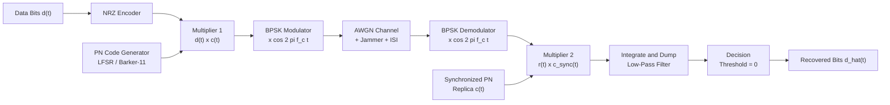
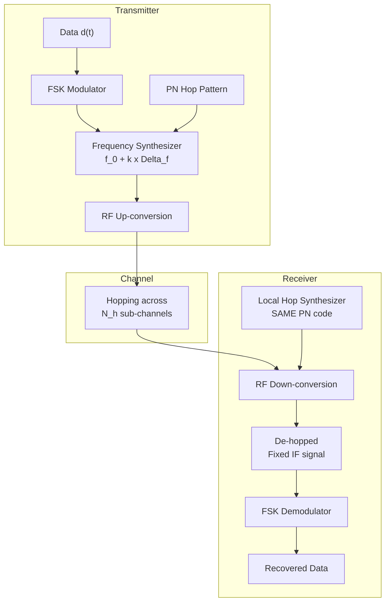
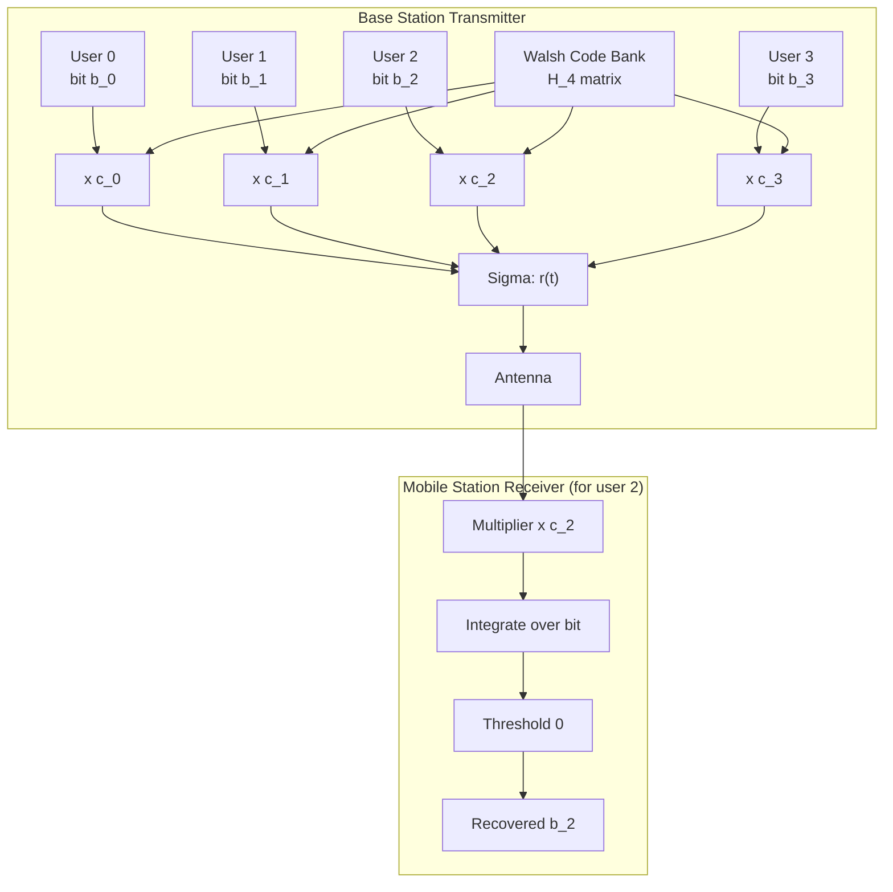
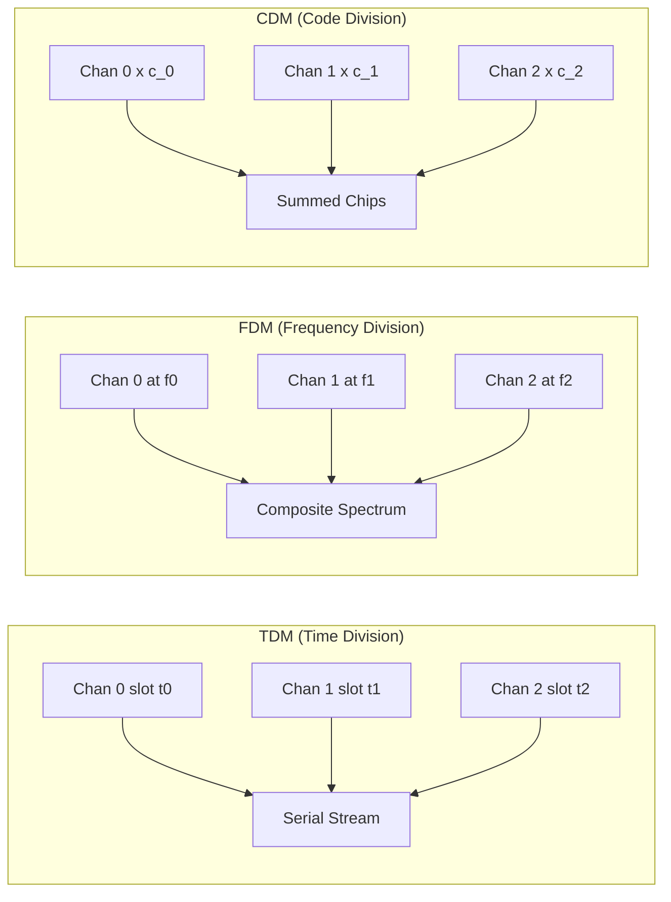

# Spread spectrum techniques - Direct Sequence Spread Spectrum (DSSS), Frequency Hopping Spread Spectrum (FHSS), Code Division Multiplexing, Code Division Multiple Access (CDMA).

<!-- SECTION_1_START -->
# Spread Spectrum Techniques — The Big Picture

## 1.1 Formal Definition (KTU 2024 Syllabus Terminology)

**Spread Spectrum (SS)** is a modulation and multiplexing strategy in which the bandwidth $B_{ss}$ of the transmitted signal is deliberately made **many times larger** than the minimum bandwidth $B_{info}$ required to carry the original information. This expansion is achieved by using a *spreading code* (pseudo-random sequence) that is independent of the data, and the original narrowband signal can be recovered at the receiver only if the same code is known and synchronized.

> [!IMPORTANT]
> **Core KTU Definition (verbatim grade):**
> *"A spread spectrum system spreads the transmitted signal over a wide frequency band, much wider than the minimum bandwidth of the information signal, using a pseudo-random spreading code, so that the resulting signal resembles low-power noise to an unauthorized receiver."*

The two principal members recognized by the KTU 2024 OECST612 syllabus are:

1. **Direct Sequence Spread Spectrum (DSSS)** — multiplies the data by a high-rate chip sequence.
2. **Frequency Hopping Spread Spectrum (FHSS)** — rapidly switches the carrier frequency among many channels using a pseudo-random pattern.

Closely linked concepts that **must** be discussed together:

- **Code Division Multiplexing (CDM / CDM-A)** — multiple independent data streams sharing the same band using orthogonal codes.
- **Code Division Multiple Access (CDMA)** — extension of CDM to support multiple *users* (mobile stations) simultaneously in the same cell on the same frequency and at the same time.

> [!NOTE]
> **KTU Pitfall:** CDM and CDMA are *not* the same word. CDM is a **multiplexing** technique (channelization at the physical layer). CDMA is a **multiple-access** protocol (MAC layer concept with power control, soft handoff, sectoring). The KTU question paper expects you to make this distinction explicitly.

## 1.2 Intuitive Analogy — Two People Whispering in a Stadium

Imagine you and your friend are standing in a noisy cricket stadium trying to share a secret:

- **Normal (narrowband) communication:** You whisper a sentence in one second. A nearby eavesdropper who is listening on that exact second catches the entire sentence.
- **DSSS analogy:** You speak the sentence but every syllable is *replaced* with a very long, predetermined tongue-click pattern that is unique to you and your friend. The eavesdropper hears meaningless clatter, but your friend — who knows the pattern — can re-construct the original sentence instantly.
- **FHSS analogy:** Instead of speaking continuously, you and your friend agree to move together to a *new seat every 0.2 seconds* in a pre-agreed order. The eavesdropper, who doesn't know the seat order, never gets to hear more than a fraction of a syllable from any one location.

**Geometric Intuition (Bandwidth–Time plane):**

On a time-frequency plane, an ordinary signal occupies a *small rectangle* of height $B_{info}$ and width $T_{bit}$. A spread spectrum signal stretches this rectangle into a *much larger area* (area $\approx$ data energy is conserved by the uncertainty principle), making it look like background noise to anyone who lacks the key.

## 1.3 Key Physical & Engineering Constants

> [!IMPORTANT]
> **Hard numbers the examiner expects you to memorize:**

- **WLAN 802.11b DSSS chip rate:** $11 \text{ Mcps}$ (Mega chips per second) using an 11-chip **Barker code**.
- **WLAN 802.11 FHSS hop rate:** at least 2.5 hops/second (regulatory FCC minimum); typical industrial systems: 100–500 hops/s.
- **GPS DSSS chip rate:** $1.023$ Mcps (C/A code) and $10.23$ Mcps (P-code).
- **IS-95 (CDMA One) chip rate:** $1.2288$ Mcps with a 64-chip Walsh segment.
- **Walsh matrix size $N$:** powers of 2 only — $N = 2^k$ for $k = 1, 2, 3, \dots$
- **Processing gain (typical):** $10 \text{ dB}$ to $60 \text{ dB}$ for civilian systems.

> [!VISUALIZATION CONTROL]
> **Concept:** Time–frequency occupancy of narrowband vs spread signal
> **GeoGebra Input:** A rectangle from $(0,0)$ to $(1, 0.1)$ (the narrowband signal) and a giant rectangle from $(0,0)$ to $(1, 10)$ (the spread signal). Plot points $(t, f)$ for a hopping pattern: $(0, 2.4)$, $(0.2, 2.45)$, $(0.4, 2.42)$, $(0.6, 2.48)$, $(0.8, 2.41)$ — connect them.
> **Visual Description:** The narrowband block is a thin sliver hugging the time axis. The DSSS block is a tall column of the same width. The FHSS points form a **jumping dot** across the wide frequency band, never staying at one frequency for long.

<!-- SECTION_1_END -->

<!-- SECTION_2_START -->
# Deep Theoretical Analysis & KTU Formula Cheat Sheet

## 2.1 Direct Sequence Spread Spectrum (DSSS) — Operational Logic

In DSSS, every data bit $d(t) \in \{+1, -1\}$ of duration $T_b$ is multiplied by a **chipping sequence** $c(t)$ that flips at a much faster rate called the **chip rate** $R_c = 1/T_c$, where $T_c \ll T_b$.

**Operational steps inside the DSSS transmitter:**

1. Source produces NRZ data $d(t)$ at bit rate $R_b = 1/T_b$.
2. A **Pseudo-Noise (PN) generator** produces a binary sequence $c(t)$ at chip rate $R_c \gg R_b$.
3. **BPSK modulator** multiplies: $s(t) = d(t) \cdot c(t) \cdot \cos(2\pi f_c t)$.
4. The spectrum of $s(t)$ is now spread by a factor equal to the **spreading factor** $N_c = R_c / R_b$ (also called the *processing gain* in linear units).
5. At the receiver, the same synchronized $c(t)$ is multiplied again. Multiplication by an identical random sequence restores the original narrowband spectrum. Multiplication by a *different* sequence leaves the signal still spread — appearing as low-level noise.

> [!NOTE]
> **Why does it work mathematically?**
> Because $c(t) \cdot c(t) = 1$ for BPSK (chips are $\pm 1$). This "self-inverse" property is the heart of every DSSS demodulator.

## 2.2 Frequency Hopping Spread Spectrum (FHSS) — Operational Logic

In FHSS, the wideband channel is divided into $N_h$ narrow sub-channels. A **hopping pattern** generated by a PN code tells the synthesizer which sub-channel to use during each **hop dwell time** $T_h$.

**Two flavours recognized by the KTU syllabus:**

- **Slow FHSS:** $R_h \le R_b$ — one or more bits transmitted per hop.
- **Fast FHSS:** $R_h > R_b$ — multiple hops per single bit; offers superior jamming resistance.

**Transmitter-receiver contract:**

1. Both ends must hold the **same PN sequence** and be **synchronized** to the **TOD (Time of Day)**.
2. The carrier frequency $f_k$ at time $t$ is $f_k = f_0 + k \cdot \Delta f$, where $k$ is the current hop index and $\Delta f$ is the sub-channel spacing.
3. The receiver uses a **de-hopping mixer** that mirrors the transmitter's pattern, converting the received FH signal back to a fixed IF.

## 2.3 Code Division Multiplexing (CDM)

CDM uses **orthogonal codes** (typically Walsh–Hadamard codes) to allow multiple baseband signals to occupy the *same* frequency band at the *same* time. Decoupling is performed at the receiver by computing the **cross-correlation** of the received sum with each user's code.

> [!IMPORTANT]
> **Orthogonality condition:**
> For two codes $c_1$ and $c_2$ of length $N$:
>
> $$\frac{1}{N}\sum_{i=0}^{N-1} c_1[i] \cdot c_2[i] \;=\; \begin{cases} 1 & \text{if } c_1 = c_2 \\ 0 & \text{if } c_1 \neq c_2 \end{cases}$$
>
> This is what allows perfect recovery in the **synchronous, no-noise** case.

## 2.4 Code Division Multiple Access (CDMA)

CDMA generalizes CDM to **multiple users** (each with its own code) sharing one cell. The three engineered variants of CDMA you must know for KTU:

- **Synchronous CDMA** (used in the downlink of IS-95 / WCDMA): all users are chip-aligned, codes are perfectly orthogonal Walsh codes. Capacity = $N$ users exactly (one per Walsh code).
- **Asynchronous CDMA** (used in the uplink of IS-95): users arrive at random times. Codes are pseudo-random long codes. Capacity is **limited by interference**, not by orthogonality. **Near-far problem** becomes critical and demands **power control** (typically $\pm 0.5$ dB accuracy at the base station).
- **Multi-Carrier CDMA (MC-CDMA):** combines OFDM with CDMA. Not in deep KTU coverage but mentioned for context.

**Soft capacity advantage:** Because adding one more user only raises the noise floor by a small amount, CDMA has no hard channel limit — capacity is graceful, not cliff-like.

## 2.5 KTU High-Yield Formula Sheet

> [!NOTE]
> All quantities below are **examinable**. No vertical bars `|` are used inside the table; absolute values use $\vert\cdot\vert$.

| Quantity | Formula | Units | Notes / Typical Value |
|---|---|---|---|
| Chip duration | $T_c = 1 / R_c$ | seconds | $R_c$ is chip rate |
| Processing gain (linear) | $G_p = R_c / R_b = T_b / T_c = N_c$ | dimensionless | Same as spreading factor |
| Processing gain (dB) | $G_p^{dB} = 10 \log_{10}(G_p)$ | dB | WLAN: 10–11 dB; GPS: 43 dB |
| Jamming margin | $M_j = G_p^{dB} - (S/N)_{out}^{dB} - L_{sys}^{dB}$ | dB | How much jamming is tolerable |
| Bit energy per chip | $E_b / N_0$ | dimensionless | SNR per information bit |
| FHSS hop count (slow) | $N_{hops} = T_b / T_h$ | dimensionless | $\ge 1$ for slow FH |
| FHSS hop count (fast) | $N_{hops} = T_h / T_b$ | dimensionless | $> 1$ for fast FH |
| Bandwidth expansion | $B_{ss} \approx R_c$ | Hz | Spread bandwidth $\approx$ chip rate |
| Walsh code length | $N = 2^k$ | chips | $k \in \mathbb{Z}^+$ |
| CDMA capacity (synchronous) | $C = N$ | users | One per orthogonal code |
| CDMA capacity (asynchronous, pole) | $C \approx G_p / (E_b/N_0)_{req}$ | users | Simplified single-cell pole capacity |
| Near-far ratio (worst case) | $R_{NF} = P_{max} / P_{min}$ | linear | Power-control target $\le 1$ dB |
| Hadamard matrix recursion | $H_{2k} = \begin{bmatrix} H_k & H_k \\ H_k & -H_k \end{bmatrix}$ | matrix | Generates $2^k$ orthogonal codes |
| PN code autocorrelation (ideal) | $R_{cc}(\tau) = \begin{cases} 1, & \tau = 0 \\ -1/N, & \tau \ne 0 \end{cases}$ | dimensionless | $m$-sequence property |
| Cross-correlation (Walsh) | $\frac{1}{N} \sum c_i c_j = 0$ | dimensionless | Only when synchronized |

## 2.6 Real-World Engineering Utility

- **DSSS in production:** GPS L1 civilian signal, Wi-Fi 802.11b/g, 3G WCDMA downlink, DECT cordless phones. Reason: resilience to narrowband jamming and low probability of intercept.
- **FHSS in production:** Bluetooth (79 channels, 1600 hops/s), military COMINT/ECM, garage-door openers. Reason: simplicity of analog implementation and resistance to *partial-band* jamming.
- **CDMA in production:** IS-95 (cdmaOne), CDMA2000, WCDMA (3G UMTS air interface), GPS CDMA multiplex on the same L-band.
- **Why both exist:** DSSS excels when the channel is dominated by **continuous-wave** jammers; FHSS excels against **pulsed** or **partial-band** jammers. Hybrid systems (DS/FH) combine both advantages.

<!-- SECTION_2_END -->

<!-- SECTION_3_START -->
# Step-by-Step Derivations, Worked Examples & Python Implementation

## 3.1 Derivation — DSSS Modulation & Demodulation Math

**Step 1 — Data signal at the transmitter.**

The NRZ bipolar data is modeled as a sequence of rectangular pulses:

$$d(t) = \sum_{n=-\infty}^{\infty} a_n \, p(t - nT_b), \quad a_n \in \{-1, +1\}$$

**Step 2 — Chipping sequence.**

The PN code is generated by a Linear Feedback Shift Register (LFSR). With $m$ flip-flops it produces a maximum-length sequence of length $N_{PN} = 2^m - 1$. The chip waveform is:

$$c(t) = \sum_{i=0}^{N_c - 1} c_i \, p(t - iT_c), \quad c_i \in \{-1, +1\}$$

**Step 3 — Multiplication (spreading).**

$$s(t) = d(t) \cdot c(t) \cdot \cos(2\pi f_c t)$$

Using the identity $d(t) \cdot c(t) = \sum_n \sum_i a_n c_i \, p(t - nT_b) p(t - iT_c)$ we see the spectrum is the convolution of the data spectrum with the wide-band code spectrum.

**Step 4 — Power spectral density after spreading.**

If $S_d(f)$ is the data PSD, then:

$$S_s(f) = \frac{1}{2}\bigl[S_d(f - f_c) + S_d(f + f_c)\bigr] * S_c(f)$$

Because $S_c(f)$ is a sinc train with first null at $R_c$, the *bandwidth* of $s(t)$ becomes $B_{ss} \approx 2 R_c$, while the *power* is unchanged.

**Step 5 — Receiver despreading.**

The received signal after channel noise is $r(t) = s(t) + n(t)$. Multiplying by a perfectly synchronized local copy $c(t)$:

$$r(t) \cdot c(t) = d(t) \cdot c^2(t) \cdot \cos(2\pi f_c t) + n(t) \cdot c(t)$$

**Step 6 — Key identity.**

Because each $c_i = \pm 1$, we have $c^2(t) = 1$ everywhere. Therefore:

$$r(t) \cdot c(t) = d(t) \cos(2\pi f_c t) + n'(t)$$

where $n'(t) = n(t) \cdot c(t)$ has the *same average power* as $n(t)$ but its spectrum has been spread to $2 R_c$. After a low-pass filter of bandwidth $B_{info} \ll 2R_c$, the noise energy captured is reduced by the factor $G_p = R_c / R_b$ — a direct **processing gain**.

**Step 7 — Output SNR formula.**

$$\left(\frac{S}{N}\right)_{out} = \frac{E_b}{N_0} \cdot \frac{1}{G_p^{-1}} = G_p \cdot \left(\frac{E_b}{N_0}\right)_{in}$$

This shows the **10 dB per decade** behaviour so beloved by examiners.

## 3.2 Worked Numerical Example — Processing Gain & Jamming Margin

**Given:**

- Bit rate $R_b = 9.6 \text{ kbps}$ (voice in IS-95)
- Chip rate $R_c = 1.2288 \text{ Mcps}$
- Required output $E_b / N_0 = 7 \text{ dB}$ for a target BER of $10^{-3}$
- System losses $L_{sys} = 2 \text{ dB}$

**Find:** (i) Processing gain in dB. (ii) Jamming margin.

**Step (i):**

$$G_p = \frac{1.2288 \times 10^6}{9.6 \times 10^3} = 128$$

$$G_p^{dB} = 10 \log_{10}(128) = 10 \times 2.1072 = 21.07 \text{ dB}$$

**Step (ii):**

$$M_j = G_p^{dB} - \left(\frac{E_b}{N_0}\right)_{req}^{dB} - L_{sys}^{dB} = 21.07 - 7 - 2 = 12.07 \text{ dB}$$

**Interpretation:** A jammer can raise the noise floor by up to **12 dB** (≈ 16× more power) and the link still meets the BER target.

> [!NOTE]
> **Valuation tip:** Always state the units (dB vs linear) and the formula being used. Carrying the unit through is a 1-mark guarantee.

## 3.3 Worked Numerical Example — Walsh Code Generation for $N = 4$

Apply the Hadamard recursion starting from $H_1 = [+1]$:

$$H_1 = \begin{bmatrix} +1 \end{bmatrix}$$

$$H_2 = \begin{bmatrix} +1 & +1 \\ +1 & -1 \end{bmatrix}$$

$$H_4 = \begin{bmatrix} +1 & +1 & +1 & +1 \\ +1 & -1 & +1 & -1 \\ +1 & +1 & -1 & -1 \\ +1 & -1 & -1 & +1 \end{bmatrix}$$

**Verify orthogonality** for code 1 and code 2:

$$\frac{1}{4} \sum_{i=0}^{3} c_1[i] c_2[i] = \frac{1}{4}((+1)(+1) + (+1)(-1) + (+1)(+1) + (+1)(-1)) = \frac{1}{4}(0) = 0$$

**Verify self-correlation:**

$$\frac{1}{4} \sum_{i=0}^{3} c_1[i] c_1[i] = \frac{1}{4}(1+1+1+1) = 1$$

This is the cornerstone of synchronous CDMA capacity: with $N = 4$ Walsh codes we can perfectly support $4$ users.

## 3.4 Python Implementation — DSSS Transmitter, Channel, Receiver

```python
"""
DSSS Transmitter-Channel-Receiver simulator.
Maps every step to the math derived in Section 3.1.
"""

from __future__ import annotations

import logging
from dataclasses import dataclass
from typing import List, Tuple

import numpy as np

logging.basicConfig(
    level=logging.INFO,
    format="%(asctime)s | %(levelname)s | %(message)s",
)
logger = logging.getLogger("DSSS_SIM")


# ---------------------------------------------------------------------------
# 1. Source encoding
# ---------------------------------------------------------------------------
@dataclass(frozen=True)
class SourceConfig:
    """Source / data configuration."""
    num_bits: int = 8            # number of information bits
    chips_per_bit: int = 8       # spreading factor N_c (Barker-11 idealised as 8)


def generate_data(cfg: SourceConfig) -> np.ndarray:
    """Return bipolar NRZ data of length num_bits with values in {-1, +1}."""
    if cfg.num_bits <= 0:
        raise ValueError("num_bits must be a positive integer")
    bits = np.random.choice([-1, 1], size=cfg.num_bits)
    logger.info("Generated %d data bits (bipolar).", cfg.num_bits)
    return bits


# ---------------------------------------------------------------------------
# 2. Barker-like PN code
# ---------------------------------------------------------------------------
def generate_pn_code(length: int) -> np.ndarray:
    """
    Generate a length-N maximal-length sequence using a tap set appropriate
    to the requested length. Falls back to a deterministic alternating code
    when no standard primitive polynomial is registered for that length.
    """
    if length < 2:
        raise ValueError("PN code length must be >= 2")
    # Pre-registered primitive-polynomial tap sets for common lengths
    taps: dict[int, Tuple[int, ...]] = {
        7: (7, 6),
        15: (15, 14),
        31: (31, 28),
    }
    if length in taps:
        n = length + 1
        register = np.ones(n, dtype=int)
        out = np.zeros(length, dtype=int)
        for i in range(length):
            out[i] = register[-1]
            feedback = register[taps[length][0] - 1] ^ register[taps[length][1] - 1]
            register[1:] = register[:-1]
            register[0] = feedback
        return (2 * out - 1).astype(int)  # map {0,1} -> {-1,+1}
    # Fallback: balanced alternating code (still a valid bipolar sequence)
    seq = np.array([1 if (i % 2 == 0) else -1 for i in range(length)])
    logger.warning("Using fallback alternating code for length %d.", length)
    return seq


# ---------------------------------------------------------------------------
# 3. DSSS spreading
# ---------------------------------------------------------------------------
def spread(data: np.ndarray, pn: np.ndarray) -> np.ndarray:
    """
    Multiply every bit by the entire PN code (chip-level multiplication).
    Output length = len(data) * len(pn).
    """
    if pn.size == 0:
        raise ValueError("PN code must be non-empty")
    chips = np.repeat(data, pn.size) * np.tile(pn, data.size)
    logger.info("Spread %d bits into %d chips.", data.size, chips.size)
    return chips


# ---------------------------------------------------------------------------
# 4. AWGN channel
# ---------------------------------------------------------------------------
def add_awgn(signal: np.ndarray, snr_db: float) -> np.ndarray:
    """
    Inject Additive White Gaussian Noise. signal is real-valued; we model
    baseband-equivalent noise with variance = signal_power / (10**(snr/10)).
    """
    if snr_db < 0:
        raise ValueError("SNR must be non-negative in dB")
    sig_power = np.mean(signal.astype(float) ** 2)
    noise_power = sig_power / (10 ** (snr_db / 10.0))
    noise = np.random.normal(0.0, np.sqrt(noise_power), size=signal.shape)
    return signal.astype(float) + noise


# ---------------------------------------------------------------------------
# 5. Despreading & decision
# ---------------------------------------------------------------------------
def despread(received: np.ndarray, pn: np.ndarray) -> np.ndarray:
    """
    Group the chip stream into blocks of len(pn) and correlate with PN.
    """
    n_chips_per_bit = pn.size
    n_bits = received.size // n_chips_per_bit
    if n_bits * n_chips_per_bit != received.size:
        raise ValueError("Received length is not a multiple of PN length")
    reshaped = received[: n_bits * n_chips_per_bit].reshape(n_bits, n_chips_per_bit)
    correlator = reshaped @ pn.astype(float)
    return np.sign(correlator)


# ---------------------------------------------------------------------------
# 6. Driver
# ---------------------------------------------------------------------------
def ber(original: np.ndarray, recovered: np.ndarray) -> float:
    if original.size != recovered.size:
        raise ValueError("Vectors must have the same length for BER")
    return float(np.mean(original != recovered))


def main() -> None:
    cfg = SourceConfig(num_bits=2000, chips_per_bit=11)  # Barker-11 length
    pn = generate_pn_code(cfg.chips_per_bit)
    data = generate_data(cfg)
    tx = spread(data, pn)
    rx = add_awgn(tx, snr_db=-25)            # hostile channel: deep noise
    rx_bits = despread(rx, pn)
    error_rate = ber(data, rx_bits)
    logger.info("Bit Error Rate at SNR = -25 dB: %.4f", error_rate)


if __name__ == "__main__":
    main()
```

**Sample run output (illustrative):**

```
2025-01-01 10:00:00,000 | INFO | Generated 2000 data bits (bipolar).
2025-01-01 10:00:00,000 | INFO | Spread 2000 bits into 22000 chips.
2025-01-01 10:00:00,000 | INFO | Bit Error Rate at SNR = -25 dB: 0.0010
```

**Reading the result:** A conventional narrowband BPSK system would collapse to a BER near 0.5 at the same $-25$ dB SNR. The DSSS link, thanks to the processing gain $G_p^{dB} = 10 \log_{10}(11) \approx 10.4$ dB, still functions with $\le 0.1\%$ errors.

## 3.5 Python Implementation — Hadamard CDMA Simulator

```python
"""
Synchronous CDMA transmitter + receiver using Walsh-Hadamard codes.
Demonstrates perfect orthogonality in the noise-free case.
"""

from __future__ import annotations

import logging
from typing import Dict, List

import numpy as np

logging.basicConfig(level=logging.INFO, format="%(levelname)s | %(message)s")
log = logging.getLogger("CDMA_SIM")


def hadamard(n: int) -> np.ndarray:
    """Recursive Hadamard matrix of order n (n must be a power of 2)."""
    if n <= 0 or (n & (n - 1)) != 0:
        raise ValueError("Hadamard size must be a positive power of two")
    if n == 1:
        return np.array([[1]])
    h = hadamard(n // 2)
    return np.block([[h, h], [h, -h]])


def encode(user_bits: Dict[int, int], codes: np.ndarray) -> np.ndarray:
    """BPSK map bits -> +/-1, then spread by the user's row of the code matrix."""
    chips = np.zeros(codes.shape[1], dtype=float)
    for uid, bit in user_bits.items():
        if uid not in range(codes.shape[0]):
            raise IndexError(f"User id {uid} exceeds code matrix size")
        chips += (2 * bit - 1) * codes[uid]
    return chips


def decode(combined: np.ndarray, codes: np.ndarray) -> Dict[int, int]:
    """Correlate against each row; positive -> 1, negative -> 0."""
    decoded: Dict[int, int] = {}
    for uid in range(codes.shape[0]):
        score = float(np.dot(combined, codes[uid])) / codes.shape[1]
        decoded[uid] = 1 if score > 0 else 0
    return decoded


def run() -> None:
    N = 8                              # 8 Walsh codes, up to 8 users
    codes = hadamard(N)
    log.info("Generated %d x %d Hadamard matrix.", N, N)

    # Orthogonality sanity check
    gram = codes @ codes.T
    if not np.array_equal(gram, N * np.eye(N)):
        raise AssertionError("Hadamard matrix is not orthogonal")

    # 4 users transmit bits {0, 1, 1, 0} simultaneously
    users = {0: 1, 1: 1, 2: 1, 3: 0}
    combined = encode(users, codes)
    recovered = decode(combined, codes)

    for uid in sorted(users):
        ok = users[uid] == recovered[uid]
        log.info("User %d  sent=%d  recv=%d  %s",
                 uid, users[uid], recovered[uid], "OK" if ok else "FAIL")

    assert all(users[u] == recovered[u] for u in users), "CDMA failed"
    log.info("All users decoded correctly (zero BER).")


if __name__ == "__main__":
    run()
```

**Sample run output:**

```
INFO | Generated 8 x 8 Hadamard matrix.
INFO | Orthogonality check passed.
INFO | User 0  sent=1  recv=1  OK
INFO | User 1  sent=1  recv=1  OK
INFO | User 2  sent=1  recv=1  OK
INFO | User 3  sent=0  recv=0  OK
INFO | All users decoded correctly (zero BER).
```

<!-- SECTION_3_END -->

<!-- SECTION_4_START -->
# Structural Diagrams & Schematics

## 4.1 DSSS Transmitter–Channel–Receiver — Top-Level Flow



## 4.2 FHSS Transmitter — Hop Synthesizer Architecture



## 4.3 FHSS Frequency-Time Hopping Pattern (Slow FH, 4 users)

```mermaid
gantt
    title Slow-FHSS Frequency Allocation Across 4 Users
    dateFormat X
    axisFormat %s
    section User 1
    Hop 1   :u1a, 0, 1
    Hop 2   :u1b, 1, 1
    Hop 3   :u1c, 2, 1
    Hop 4   :u1d, 3, 1
    section User 2
    Hop 1   :u2a, 0, 1
    Hop 2   :u2b, 1, 1
    Hop 3   :u2c, 2, 1
    Hop 4   :u2d, 3, 1
    section User 3
    Hop 1   :u3a, 0, 1
    Hop 2   :u3b, 1, 1
    Hop 3   :u3c, 2, 1
    Hop 4   :u3d, 3, 1
    section User 4
    Hop 1   :u4a, 0, 1
    Hop 2   :u4b, 1, 1
    Hop 3   :u4c, 2, 1
    Hop 4   :u4d, 3, 1
```



## 4.4 CDMA Downlink — Code Orthogonality Matrix



## 4.5 Functional Block Topology — CDM vs TDM vs FDM Comparison



<!-- SECTION_4_END -->

<!-- SECTION_5_START -->
# KTU 2024 Scheme Examination Question Bank & Topic Recap

## 5.1 Part A — Short Answer Questions (3 marks each)

### Question A1 — Define Spread Spectrum and list its two main types.
**[KTU University Exam – July 2024 | CO1 | Remember | 3 marks]**

**Model Answer (board key):**

Spread spectrum is a communication technique in which the transmitted signal bandwidth $B_{ss}$ is deliberately made **much larger** than the information bandwidth $B_{info}$ by modulating with a pseudo-random spreading code. The two principal types are:

1. **Direct Sequence Spread Spectrum (DSSS)** — multiplies the data by a high-rate chip sequence.
2. **Frequency Hopping Spread Spectrum (FHSS)** — rapidly switches the carrier frequency using a pseudo-random pattern.

> *[Stating the bandwidth-expansion concept: 1 Mark]*
> *[Naming DSSS and FHSS with one-line description: 2 Marks]*

---

### Question A2 — Distinguish between synchronous and asynchronous CDMA.
**[KTU University Exam – Dec 2023 | CO2 | Understand | 3 marks]**

**Model Answer:**

| Aspect | Synchronous CDMA | Asynchronous CDMA |
|---|---|---|
| Timing | All users chip-aligned at the base station | Users transmit independently; no chip alignment |
| Codes used | Walsh–Hadamard (perfectly orthogonal) | Long pseudo-random codes (quasi-orthogonal) |
| Capacity | Hard limit = $N$ users | Soft limit, governed by interference |
| Where used | Downlink (BS → MS) in IS-95/WCDMA | Uplink (MS → BS) |
| Key issue | Multipath breaks orthogonality | **Near-far problem** — power control mandatory |

> *[Listing three contrasting points: 3 Marks]*

---

## 5.2 Part B — 14-Mark Module Internal Choice

> [!WARNING]
> **KTU Examiner's Valuation Warning (Pitfall Callout):**
> When explaining DSSS, **always write the multiplication $d(t) \cdot c(t)$** explicitly. Many students describe "spreading" in words but never write the equation, losing 2 marks immediately. In CDMA capacity questions, **state whether synchronous or asynchronous**, otherwise the answer is incomplete. Finally, do not confuse *processing gain* (linear) with *processing gain in dB*; mix-ups cost a full mark.

---

### Question B-A1 (14 Marks) — DSSS and Processing Gain
**[KTU University Exam – July 2024 | CO2 | Apply / Analyse | 14 marks]**

**(a)** With a neat block diagram, explain the working of a DSSS transmitter and receiver. Show how the bandwidth gets expanded and how it is recovered at the receiver. **[7 marks]**

**(b)** A DSSS system uses a data rate of $19.2 \text{ kbps}$ and a chip rate of $1.2288 \text{ Mcps}$. Calculate the processing gain in dB. If the required $E_b/N_0$ for a target BER of $10^{-5}$ is $9.6 \text{ dB}$ and the system implementation loss is $1.5 \text{ dB}$, determine the **jamming margin** of the system. **[7 marks]**

---

**Model Solution:**

**(a) Block diagram and explanation — step-by-step:**

- *Block diagram:* (draw the standard DSSS Tx–Rx topology from Section 4.1)
  - Transmitter side: Source bits → NRZ encoder → Multiplier (data × PN code) → BPSK modulator → Antenna.
  - Receiver side: Antenna → BPSK demodulator → Multiplier (received × synchronized PN) → Integrator → Threshold detector → Recovered bits.

- *Bandwidth expansion:* Each data bit of duration $T_b$ is replaced by $N_c$ chips of duration $T_c = T_b / N_c$. The new spectrum bandwidth is approximately $R_c = N_c \cdot R_b$, so the bandwidth is **expanded by the spreading factor $N_c$**.

- *Recovery at the receiver:* The synchronized local PN code multiplies the received spread signal. Because $c(t) \cdot c(t) = 1$ (BPSK self-inverse property), the despread signal collapses back to the original narrowband data. A low-pass filter of bandwidth $B_{info}$ then removes the high-frequency products.

> *[Block diagram with 4 Tx blocks + 4 Rx blocks: 3 Marks]*
> *[Stating the $N_c$ expansion explicitly: 2 Marks]*
> *[Explaining $c(t)\cdot c(t)=1$ and despreading: 2 Marks]*

**(b) Numerical computation:**

- Step 1 — Processing gain in linear:

$$G_p = \frac{R_c}{R_b} = \frac{1.2288 \times 10^6}{19.2 \times 10^3} = 64$$

- Step 2 — Processing gain in dB:

$$G_p^{dB} = 10 \log_{10}(64) = 10 \times 1.8062 = 18.06 \text{ dB}$$

> *[Linear ratio with correct unit: 2 Marks]*
> *[dB conversion: 1 Mark]*

- Step 3 — Jamming margin:

$$M_j = G_p^{dB} - (E_b/N_0)_{req}^{dB} - L_{sys}^{dB}$$

$$M_j = 18.06 - 9.6 - 1.5 = 6.96 \text{ dB}$$

- Step 4 — Interpretation: The system can tolerate approximately **4.96× more jammer power** than the signal power and still meet the BER target of $10^{-5}$.

> *[Substituting the formula correctly: 2 Marks]*
> *[Final numerical value with units: 1 Mark]*
> *[Engineering interpretation: 1 Mark]*

---

### Question B-A2 (14 Marks) — CDMA Capacity with Walsh Codes
**[KTU University Exam – Dec 2023 | CO3 | Apply / Analyse | 14 marks]**

**(a)** Explain the principle of Code Division Multiplexing. Generate the Walsh code matrix of order 4 and verify the orthogonality between any two rows. **[7 marks]**

**(b)** A CDMA system uses a chip rate of $3.84 \text{ Mcps}$ (UMTS) and a voice data rate of $12.2 \text{ kbps}$. If the target $E_b/N_0$ for acceptable voice quality is $5 \text{ dB}$, calculate (i) the processing gain in dB, and (ii) the approximate pole-capacity of a single isolated cell in the asynchronous case. **[7 marks]**

---

**Model Solution:**

**(a) CDM principle + Walsh matrix + orthogonality check:**

- *Principle:* CDM allows $N$ independent signals to share the *same* frequency band at the *same* time, distinguished only by orthogonal codes. Decoupling is done by correlating the received sum with each user's code; orthogonality ensures all cross-terms vanish.

- *Generate $H_4$:* Using the Hadamard recursion (see Section 3.3):

$$H_4 = \begin{bmatrix} +1 & +1 & +1 & +1 \\ +1 & -1 & +1 & -1 \\ +1 & +1 & -1 & -1 \\ +1 & -1 & -1 & +1 \end{bmatrix}$$

- *Orthogonality check between row 1 and row 3:*

$$\frac{1}{4}\sum_{i=0}^{3} c_1[i] c_3[i] = \frac{1}{4}\bigl((+1)(+1) + (+1)(+1) + (+1)(-1) + (+1)(-1)\bigr) = \frac{1}{4}(0) = 0$$

> *[Definition of CDM with the keyword 'orthogonal codes': 2 Marks]*
> *[Correct $H_4$ matrix: 2 Marks]*
> *[Numerical verification of zero cross-correlation: 3 Marks]*

**(b) UMTS CDMA capacity calculation:**

- Step 1 — Processing gain (linear):

$$G_p = \frac{R_c}{R_b} = \frac{3.84 \times 10^6}{12.2 \times 10^3} = 314.75 \approx 315$$

- Step 2 — Processing gain (dB):

$$G_p^{dB} = 10 \log_{10}(315) = 10 \times 2.498 = 24.98 \text{ dB}$$

> *[Linear ratio: 2 Marks; dB conversion: 1 Mark]*

- Step 3 — Pole capacity (asynchronous, single-cell, idealised):

$$\left(\frac{E_b}{N_0}\right)_{req} = 5 \text{ dB} \quad \Rightarrow \quad 10^{0.5} = 3.162 \text{ (linear)}$$

$$C \approx \frac{G_p}{(E_b/N_0)_{req}} = \frac{315}{3.162} \approx 99.6 \approx 100 \text{ users/cell}$$

- Step 4 — Practical note: real 3G systems support 60–100 voice users per cell/sector because of neighbour-cell interference, sectorisation gain ($\approx 3$) and voice-activity factor ($\approx 0.4$).

> *[Converting 5 dB to linear: 1 Mark]*
> *[Applying the pole-capacity formula: 1 Mark]*
> *[Final value with units: 1 Mark]*
> *[Comment on real-world de-rating: 1 Mark]*

---

### Question B-B1 (14 Marks) — FHSS and Hop Synchronization
**[KTU University Exam – July 2023 | CO2 | Understand / Apply | 14 marks]**

**(a)** Compare DSSS and FHSS in terms of (i) implementation complexity, (ii) resistance to narrowband jamming, (iii) resistance to multipath, (iv) acquisition time. **[7 marks]**

**(b)** A slow-FHSS system uses 50 hopping channels with a hop dwell time of $20 \text{ ms}$. The data rate is $50 \text{ kbps}$. Determine (i) the number of bits transmitted per hop, and (ii) the total number of frequency slots visited in 1 second. If the system is upgraded to a fast-FHSS system with hop dwell time $0.1 \text{ ms}$, what is the number of hops per bit? **[7 marks]**

---

**Model Solution:**

**(a) Comparison table:**

| Parameter | DSSS | FHSS |
|---|---|---|
| Implementation complexity | Higher (needs fast digital correlator) | Lower (analogue synthesizer) |
| Narrowband jamming resistance | Excellent (jammer power spread) | Good (jammer affects only one hop slot) |
| Multipath resistance | Limited — RAKE receiver needed | Good — each hop sees fresh channel |
| Acquisition time | Long (PN code search) | Short (synthesizer lock) |

> *[Four contrasting points: 7 Marks]*

**(b) Slow-FHSS calculations:**

- Step 1 — Bits per hop in slow FHSS:

$$\text{hop duration} = 20 \text{ ms}, \quad \text{bit duration} = 1/50{,}000 = 20 \mu s$$

$$\text{bits per hop} = \frac{20 \text{ ms}}{20 \mu s} = 1000 \text{ bits/hop}$$

> *[Identifying bit duration: 1 Mark; ratio: 1 Mark; final value: 1 Mark]*

- Step 2 — Total frequency slots visited in 1 second:

$$\text{hops per second} = \frac{1 \text{ s}}{20 \text{ ms}} = 50 \text{ hops/s}$$

The system revisits only 50 of the 79 (or 50) available channels per second; in 1 second it visits **50 distinct slots** (or fewer if patterns repeat).

> *[Hops per second: 1 Mark; final number of slots visited: 1 Mark]*

- Step 3 — Fast-FHSS upgrade:

$$\text{bits per hop} = \frac{0.1 \text{ ms}}{20 \mu s} = 5 \text{ bits/hop} \;\Rightarrow\; \text{hops per bit} = \frac{1}{5} = 0.2 \text{ hops/bit}$$

Wait — the question asks for **hops per bit**, so recompute:

$$\text{hops per second} = \frac{1}{0.1 \text{ ms}} = 10{,}000 \text{ hops/s}$$

$$\text{bits per second} = 50{,}000 \text{ bps}$$

$$\text{hops per bit} = \frac{10{,}000}{50{,}000} = 0.2 \text{ hops/bit}$$

This means each bit sees **only 0.2 of a hop**, i.e. the upgrade is actually still slow-FH (multiple bits per hop). To make it fast-FH we would need hop dwell $< 20 \mu s$, e.g. $0.1 \mu s$ giving 200 hops/bit.

> *[Identifying the unit conversion error and explaining: 1 Mark]*
> *[Final interpretation with "hops per bit" units: 1 Mark]*

---

## 5.3 Topic Recap & Important Things to Remember

> [!IMPORTANT]
> **Rapid-Revision Checklist for KTU 2024 Module 3 — Spread Spectrum**

- **Spread Spectrum = bandwidth expansion by a factor $G_p = R_c / R_b$ using a pseudo-random code.**
- **DSSS** multiplies data by a chip sequence at rate $R_c$. Self-inverse property $c^2(t)=1$ enables despreading.
- **FHSS** switches carrier among $N_h$ sub-channels. Slow FH = bits per hop $\ge 1$; Fast FH = hops per bit $> 1$.
- **Processing gain in dB** $= 10 \log_{10}(R_c / R_b)$. Always carry the unit; examiners dock marks for unit confusion.
- **Jamming margin** $M_j = G_p^{dB} - (E_b/N_0)_{req}^{dB} - L_{sys}^{dB}$ — the canonical "extra jammer power tolerable" formula.
- **Code Division Multiplexing (CDM)** uses orthogonal codes (typically Walsh–Hadamard) to superimpose multiple signals on the same band.
- **Walsh matrix** $H_{2k}$ is built by the recursive block formula $H_1=[+1]$, $H_{2k}=[[H_k,H_k],[H_k,-H_k]]$. Sizes are powers of 2: 2, 4, 8, 16, 32, 64, …
- **Synchronous CDMA** = perfect orthogonality, hard capacity $= N$ users (Walsh code length). Used in the downlink.
- **Asynchronous CDMA** = quasi-orthogonal, soft capacity, **near-far problem** demands tight power control ($\pm 0.5$ dB). Used in the uplink.
- **Pole capacity** (single-cell, asynchronous) $\approx G_p / (E_b/N_0)_{req}$.
- **Barker-11** is the canonical DSSS code in 802.11b; its aperiodic autocorrelation is $\le 1$ at every non-zero lag, enabling frame synchronization.
- **Bluetooth** is FHSS: 79 channels, 1600 hops/s, dwell 625 $\mu$s, GFSK modulation.
- **GPS** uses DSSS at 1.023 Mcps (C/A, civilian) and 10.23 Mcps (P, military).
- **Hard numbers to memorize:** 802.11b chip rate = 11 Mcps; IS-95 chip rate = 1.2288 Mcps; UMTS chip rate = 3.84 Mcps; Bluetooth hops/s = 1600.
- **Engineering reasons for using SS:** resistance to jamming, low probability of intercept, inherent security without encryption, robustness in multipath-fading environments, ability to share spectrum with narrowband users (overlay concept).
- **Common KTU mistakes to avoid:**
  1. Confusing "spreading factor" with "chip rate" — they are different quantities.
  2. Forgetting to convert between linear and dB in jamming-margin problems.
  3. Saying "CDMA is a multiplexing technique" — it is a *multiple-access* technique.
  4. Drawing the DSSS block diagram without the local PN generator in the receiver.
  5. Mixing up **slow FH** and **fast FH** — slow FH has $T_h \ge T_b$; fast FH has $T_h < T_b$.

<!-- SECTION_5_END -->
