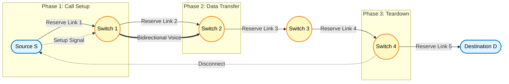
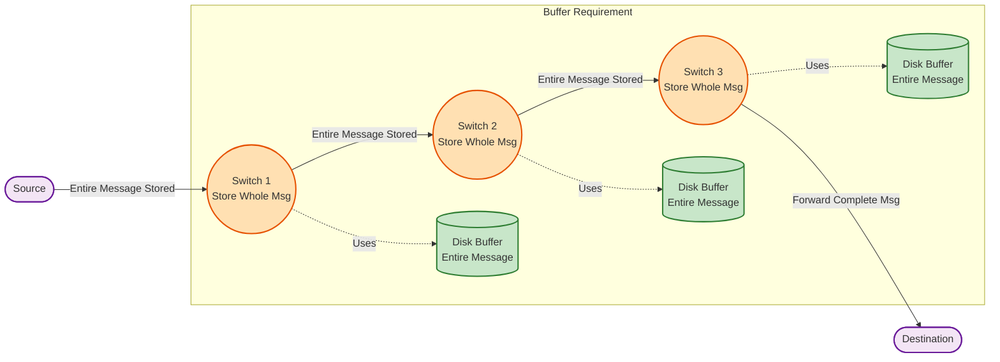

# Basic principles of switching - Circuit switching, Packet switching, Message switching.

<!-- SECTION_1_START -->

# Basic Principles of Switching: Circuit, Packet, and Message Switching

> [!IMPORTANT]
> **KTU 2024 Scheme | OECST612 — DATA COMMUNICATION | Module 4**
> This module forms the **foundation of networking architectures**. Every modern network — from 5G cellular systems to the Internet backbone — is a derivative of these three core switching paradigms. Mastery of delay, throughput, and resource allocation is mandatory for KTU ESE questions.

## 1. What is Switching? — Formal Definition

In telecommunications and computer networks, **switching** is the technique used to establish, maintain, and terminate a communication path between two or more stations (end devices). It refers to the mechanism by which data is routed from a *source* to a *destination* across a network of intermediate nodes (switches/routers) using either dedicated or shared transmission resources.

A **switch** is a multi-port network device (Layer 2 or Layer 3 of the OSI/TCP-IP model) that forwards incoming frames/packets from an input port to the appropriate output port based on a forwarding table, routing algorithm, or a pre-established physical circuit.

> [!NOTE]
> **KTU Syllabus Mapping (Module 4):** *"Basic principles of switching — Circuit switching, Packet switching, Message switching."* Students must be able to compare these three techniques, derive their end-to-end delays, and identify the application domains of each.

---

## 2. Conceptual Intuition — Plain English Analogies

To make these three paradigms immediately memorable, here are real-world analogies:

### 🔌 Circuit Switching → "The Dedicated Phone Call"
Imagine calling a friend. The moment they pick up, a **dedicated wire** is reserved between your phone and theirs. No one else can use that line until you hang up. Even when you are silent, the line stays open and reserved.

### 📬 Message Switching → "The Postcard via Relay Mail"
Imagine sending a *single long letter* through a chain of post offices. The first post office receives the **entire letter**, stores it, then forwards the *whole letter* to the next post office, which stores it, and so on. This is **store-and-forward at the message level**.

### 📦 Packet Switching → "The Jigsaw Postcard"
Now break that long letter into **many small numbered pieces (packets)**. Each post office receives a *single small piece*, stores it briefly, and forwards it independently. The pieces may travel via **different routes** and arrive out of order, but the destination reassembles them. The Internet works exactly this way.

| Switching Type | Real-World Analogy | Key Trait |
|---|---|---|
| Circuit | Landline phone call | Dedicated path reserved for entire session |
| Message | Email via SMTP relays | Whole message stored at every hop |
| Packet | WhatsApp / Web browsing | Small packets routed independently |

> [!TIP]
> **Memory Trick:** **"CMP"** → **C**ircuit = **C**all, **M**essage = **M**ail, **P**acket = **P**arcel.

---

## 3. Physical Constants & Standard Metrics in Switching

> [!NOTE]
> The following **standard engineering constants** appear in every KTU numerical problem on switching. Commit them to memory.

- **Speed of light in fiber** $c \approx 2 \times 10^8$ **m/s** (using $n \approx 1.5$ for glass)
- **Speed of light in vacuum** $c = 3 \times 10^8$ **m/s**
- **Speed of signal in copper** $\approx 2 \times 10^8$ **m/s**
- **Standard packet header overhead** (IPv4) = **20 bytes** (IPv6 = 40 bytes)
- **Standard MTU (Maximum Transmission Unit)** of Ethernet = **1500 bytes**
- **1 millisecond (ms) = $10^{-3}$ seconds**
- **1 microsecond (µs) = $10^{-6}$ seconds**

---

## 4. GeoGebra / Desmos Visualization for Delay Comparison

> [!VISUALIZATION CONTROL]
> **Concept:** Comparative *Total End-to-End Delay* of the three switching methods as a function of **Number of Hops ($N$)**.
> **GeoGebra / Desmos Input Equations:**
> * `f_circuit(x) = 3*x + 5`  *(Setup time dominates, payload delay constant)*
> * `f_message(x) = (3*x + 1) * 4`  *(Message grows as N hops, store-and-forward)*
> * `f_packet(x) = (3*x + 1) * 1.2`  *(Packets are small, parallel-ish flow)*
> **Visual Description:** On the X-axis mark the number of hops (1 to 10), and on the Y-axis mark the total transmission delay in ms. The student will observe that **packet switching has the lowest curve**, **message switching the steepest curve**, and **circuit switching a moderate, mostly-flat curve** dominated by call-setup time.

<!-- SECTION_1_END -->

<!-- SECTION_2_START -->

# Deep Theoretical Analysis & KTU High-Yield Formula Sheet

## 1. Circuit Switching — Operational Theory

In **circuit switching**, a **dedicated physical path** (a sequence of links and switches) is established *before* any data is transmitted. The path remains reserved for the *entire duration* of the communication session, even during silent periods.

### Step-by-Step Operational Phases:
1. **Call Setup Phase:** Source sends a connection-request signal that propagates hop-by-hop; each switch reserves a dedicated output link.
2. **Data Transfer Phase:** Bits flow through the reserved path at full link capacity (no contention).
3. **Teardown Phase:** Once communication ends, a disconnect signal releases all reserved links.

> [!IMPORTANT]
> **KTU Board Definition (must be reproduced verbatim in 2-mark questions):**
> *"Circuit switching is a switching technique in which a dedicated physical communication path is established between the sender and the receiver before the actual data transfer begins, and this path is held for the entire duration of the session."*

### Real-World Examples:
- **Traditional PSTN (Public Switched Telephone Network)**
- **ISDN (Integrated Services Digital Network)**
- **Early leased-line networks**

### Advantages:
- **Guaranteed bandwidth** — once the circuit is up, no contention occurs.
- **Constant, predictable end-to-end delay** — ideal for real-time voice/video.
- **Simple data forwarding** at intermediate switches (no routing decisions per packet).

### Disadvantages:
- **Inefficient utilization** — bandwidth is wasted during silent gaps (typical voice call has ~40–60% silence).
- **Long setup delay** — call setup can take hundreds of milliseconds.
- **Poor scalability** — for $N$ simultaneous users, the network must provision $N$ circuits.

---

## 2. Message Switching — Operational Theory

In **message switching**, the *entire message* is treated as a single unit and forwarded **hop-by-hop using the store-and-forward principle**. Each switch receives the *whole message*, checks for errors, stores it on its local disk/buffer, and then forwards it to the next switch.

### Step-by-Step Operational Phases:
1. The source node encapsulates the **entire message** (which may be very large, e.g., an email or a file).
2. The first-hop switch receives the **complete message**, buffers it, and performs **error checking** (e.g., CRC).
3. Once verified, the switch selects the next available outgoing link and forwards the **whole message**.
4. This continues at every intermediate node.
5. The destination receives the complete message.

> [!IMPORTANT]
> **KTU Board Definition (must be reproduced verbatim in 2-mark questions):**
> *"Message switching is a store-and-forward technique in which the entire message is received completely at each intermediate node, stored temporarily, and then forwarded to the next node towards the destination."*

### Real-World Examples:
- **SMTP Email systems** (store-and-forward mail servers)
- **Telegram networks** of the 19th–20th century
- **UUCP (Unix-to-Unix Copy Protocol)** in early Unix networks

### Advantages:
- **No call setup** required — efficient for bursty traffic.
- **Error-free delivery** — each hop verifies the message.
- **Store-and-forward enables traffic regulation** — switches can wait for a free link.

### Disadvantages:
- **Huge storage required** at every intermediate switch (entire message buffered).
- **Unsuitable for real-time traffic** — long delays for large messages.
- **Blocking at switches** — if the buffer is full, the message is lost or rejected.

---

## 3. Packet Switching — Operational Theory

In **packet switching**, the message is **broken into smaller fixed-size (or maximum-size) units called *packets***. Each packet contains a **header** (with source IP, destination IP, sequence number, etc.) and a **payload** (a chunk of the original data). Packets are routed **independently** and may take **different paths** to the destination, where they are **reassembled** in order.

### Step-by-Step Operational Phases:
1. The source node **fragments** the message into $k$ packets.
2. Each packet has a **header** ($h$ bytes) and a **payload** ($p$ bytes).
3. The first-hop switch examines the packet header, performs a **routing-table lookup**, and forwards the packet to the *best* next-hop (typically shortest path).
4. **No reservation** is made — the link is shared on a *first-come, first-served* basis.
5. At the destination, the **reassembly layer** orders the packets using their sequence numbers.

There are two sub-variants of packet switching:

- **Datagram Packet Switching (Connectionless):** Each packet is routed independently (e.g., the Internet, IPv4/IPv6).
- **Virtual Circuit Packet Switching (Connection-Oriented):** A *logical path* is decided at setup, but resources are *not* reserved (e.g., ATM, Frame Relay, X.25, MPLS).

### Real-World Examples:
- **The Internet (TCP/IP)** — Datagram mode
- **ATM (Asynchronous Transfer Mode)** — Virtual Circuit mode
- **MPLS (Multiprotocol Label Switching)** — Virtual Circuit mode
- **Frame Relay** — Virtual Circuit mode
- **5G User Plane** — Packet-based

### Advantages:
- **Low and predictable delay** for small packets.
- **High link utilization** — links are shared, not reserved.
- **Built-in congestion handling** via routing protocols.
- **Robustness** — packets can be re-routed around failed links.

### Disadvantages:
- **Variable and non-deterministic delay (jitter)** — packets may arrive out of order.
- **Packet loss** possible under congestion.
- **Header overhead** reduces effective throughput.
- **Reassembly complexity** at the receiver.

---

## 4. KTU High-Yield Formula Sheet

> [!IMPORTANT]
> **MANDATORY FORMULAS for KTU Board Exam Numerical Problems.** These are tested every semester.

| **Symbol** | **Quantity** | **Formula / Definition** | **Unit** |
|---|---|---|---|
| $L$ | Message length (data only) | given | bits |
| $h$ | Header size per packet | given | bits |
| $p$ | Payload size per packet | given | bits |
| $k$ | Number of packets | $k = \left\lceil \dfrac{L}{p} \right\rceil$ | dimensionless |
| $R$ | Link bandwidth (bit rate) | given | bits/sec |
| $d$ | Distance per link | given | meters |
| $N$ | Number of hops (links) | given | dimensionless |
| $P$ | Propagation speed | $2 \times 10^{8}$ (copper/fiber) | m/s |
| $t_t$ | Transmission time per packet | $t_t = \dfrac{(p + h)}{R}$ | seconds |
| $t_p$ | Propagation delay per link | $t_p = \dfrac{d}{P}$ | seconds |
| $T_{\text{circuit}}$ | Total delay in circuit switching | $T_{\text{setup}} + \dfrac{L}{R} + (N \cdot t_p) + T_{\text{teardown}}$ | seconds |
| $T_{\text{message}}$ | Total delay in message switching | $N \cdot \left( t_t^{\text{msg}} + t_p \right) = N \cdot \left( \dfrac{L}{R} + \dfrac{d}{P} \right)$ | seconds |
| $T_{\text{packet}}$ | Total delay in packet switching | $(N + k - 1) \cdot t_t^{\text{pkt}} + N \cdot t_p$ | seconds |
| $U_{\text{circuit}}$ | Link utilization (circuit) | $\dfrac{\text{Data sent}}{\text{Reserved capacity} \times \text{Time}}$ | ratio 0–1 |
| $U_{\text{packet}}$ | Link utilization (packet) | Approaches $1$ under heavy load | ratio 0–1 |

> [!CAUTION]
> **PITFALL in Formulas:** In packet switching, the total transmission-time factor is $\mathbf{(N + k - 1)}$, **not** $N \times k$. This is because while the first packet is being transmitted on link 1, the second packet can be entering link 1 (pipelining). After $k$ packet-times, the first packet has reached the destination. A common student error is writing $N \times k \times t_t$, which is wrong by a factor of $N$.

### Real-World Engineering Utility:

| **Switching Type** | **Best For** | **Why** |
|---|---|---|
| Circuit | Voice calls (PSTN, early 2G) | Constant bit-rate, no jitter |
| Message | Email (SMTP), telegrams | Tolerates delay, store-and-forward fits |
| Packet | Internet, 5G data, video streaming | Efficient, scalable, handles bursty traffic |

---

## 5. Comparison Matrix (Frequently Asked in KTU 2-Markers)

| **Parameter** | **Circuit** | **Message** | **Packet** |
|---|---|---|---|
| Path setup | Yes (call setup) | No | No (datagram) or logical only (VC) |
| Dedicated path | Yes | No | No |
| Store-and-forward unit | Continuous bit stream | Entire message | One packet |
| Delay | Constant after setup | High & variable | Low & variable |
| Resource utilization | Poor (idle during silence) | Moderate | Excellent |
| Header overhead | None | None | High (per packet) |
| Suitable for real-time | Yes | No | Yes (with QoS) |
| Reassembly at receiver | Not required | Not required | Required |
| Switching decision | At setup only | Per message | Per packet |
| Modern relevance | Declining (except leased lines) | Legacy (email) | Universal (Internet) |

<!-- SECTION_2_END -->

<!-- SECTION_3_START -->

# Step-by-Step Derivations & Numerical Implementations

## Derivation 1: Total End-to-End Delay in Circuit Switching

### Problem Setup:
A message of length $L = 10{,}000$ bits is sent over $N = 4$ links of distance $d = 1000$ km each, with a per-link bandwidth of $R = 1$ Mbps. Call setup takes $t_s = 0.5$ seconds and teardown takes $t_{td} = 0.1$ seconds. Compute total delay.

### Step 1 — Identify Phase 1: Call Setup Delay
The setup signal traverses all 4 links. Each link has propagation delay $t_p = d / P$. With $P = 2 \times 10^8$ m/s:
$$t_p = \frac{1000 \times 10^3}{2 \times 10^8} = \frac{10^6}{2 \times 10^8} = 5 \times 10^{-3} \text{ s} = 5 \text{ ms}$$

Call setup delay across all hops:
$$T_{\text{setup,link}} = N \cdot t_p = 4 \times 5 \text{ ms} = 20 \text{ ms}$$

Adding the protocol-processing setup time $t_s = 500$ ms:
$$T_{\text{setup}} = t_s + N \cdot t_p = 500 + 20 = 520 \text{ ms}$$

### Step 2 — Identify Phase 2: Data Transfer Delay
Once the circuit is up, data flows at full bandwidth with **no queuing or routing delay** at intermediate switches. Total transmission time:
$$T_{\text{tx}} = \frac{L}{R} = \frac{10{,}000}{10^6} = 0.01 \text{ s} = 10 \text{ ms}$$

Add the propagation delay for one bit to traverse all 4 links:
$$T_{\text{prop}} = N \cdot t_p = 4 \times 5 = 20 \text{ ms}$$

Data transfer phase total:
$$T_{\text{data}} = T_{\text{tx}} + T_{\text{prop}} = 10 + 20 = 30 \text{ ms}$$

### Step 3 — Identify Phase 3: Teardown Delay
$$T_{\text{teardown}} = t_{td} + N \cdot t_p = 100 + 20 = 120 \text{ ms}$$

### Step 4 — Combine All Phases
$$T_{\text{circuit}} = T_{\text{setup}} + T_{\text{data}} + T_{\text{teardown}}$$
$$T_{\text{circuit}} = 520 + 30 + 120 = 670 \text{ ms}$$

> [!NOTE]
> **Valuation Tip:** Examiners will deduct 1 mark if you forget the teardown phase, and 1 mark if you omit the propagation delay. **Always state all three phases explicitly.**

---

## Derivation 2: Total End-to-End Delay in Message Switching

### Problem Setup:
Same as before: $L = 10{,}000$ bits, $N = 4$ links of $d = 1000$ km, $R = 1$ Mbps. **No header** in pure message switching.

### Step 1 — Transmission Time per Message per Link
At each intermediate switch, the **entire message** must be received before forwarding. The transmission time per link is:
$$t_t^{\text{msg}} = \frac{L}{R} = \frac{10{,}000}{10^6} = 10 \text{ ms}$$

### Step 2 — Propagation Delay per Link
From Derivation 1: $t_p = 5$ ms per link.

### Step 3 — Per-Hop Total Delay
The message must be **fully transmitted** AND **fully propagated** before the next hop can begin:
$$t_{\text{hop}} = t_t^{\text{msg}} + t_p = 10 + 5 = 15 \text{ ms}$$

### Step 4 — Sum Across All $N$ Hops (No Pipelining)
$$T_{\text{message}} = N \cdot t_{\text{hop}} = 4 \times 15 = 60 \text{ ms}$$

> [!IMPORTANT]
> **Conceptual Difference:** Notice that $T_{\text{message}} = 60$ ms is **double** the $T_{\text{data}} = 30$ ms of circuit switching (where data flows continuously after setup). This is because message switching forces the entire message to be stored at every hop, eliminating pipelining.

### Step 5 — General Formula
$$\boxed{T_{\text{message}} = N \cdot \left( \frac{L}{R} + \frac{d}{P} \right)}$$

---

## Derivation 3: Total End-to-End Delay in Packet Switching

### Problem Setup:
Same parameters: $L = 10{,}000$ bits, $N = 4$ links, $d = 1000$ km, $R = 1$ Mbps. Each packet has a **payload** of $p = 1000$ bits and a **header** of $h = 100$ bits.

### Step 1 — Compute Number of Packets
$$k = \left\lceil \frac{L}{p} \right\rceil = \left\lceil \frac{10{,}000}{1000} \right\rceil = 10 \text{ packets}$$

### Step 2 — Transmission Time per Packet
Total size per packet $= p + h = 1000 + 100 = 1100$ bits.
$$t_t^{\text{pkt}} = \frac{p + h}{R} = \frac{1100}{10^6} = 1.1 \text{ ms}$$

### Step 3 — Pipelined Transmission Analysis
Because packet switching supports **pipelining** across links, the total transmission time is determined by the **critical path** of the pipeline:
- The first packet must traverse $N = 4$ links sequentially.
- The remaining $k - 1 = 9$ packets can be "pipelined" — they enter link 1 while the first packet is on link 2, etc.

The time for the **first packet** to reach the destination:
$$T_{\text{first pkt}} = N \cdot t_t^{\text{pkt}} + N \cdot t_p$$
$$T_{\text{first pkt}} = 4 \times 1.1 + 4 \times 5 = 4.4 + 20 = 24.4 \text{ ms}$$

The time for the **remaining $k - 1$ packets** to drain through the last link:
$$T_{\text{remaining}} = (k - 1) \cdot t_t^{\text{pkt}} = 9 \times 1.1 = 9.9 \text{ ms}$$

### Step 4 — Total Transmission + Propagation Delay
$$T_{\text{packet}} = N \cdot t_t^{\text{pkt}} + (k - 1) \cdot t_t^{\text{pkt}} + N \cdot t_p$$
$$T_{\text{packet}} = (N + k - 1) \cdot t_t^{\text{pkt}} + N \cdot t_p$$
$$T_{\text{packet}} = (4 + 10 - 1) \times 1.1 + 4 \times 5$$
$$T_{\text{packet}} = 13 \times 1.1 + 20 = 14.3 + 20 = 34.3 \text{ ms}$$

### Step 5 — General Formula
$$\boxed{T_{\text{packet}} = (N + k - 1) \cdot \frac{(p + h)}{R} + N \cdot \frac{d}{P}}$$

### Step 6 — Code Implementation in Python
```python
from math import ceil

def packet_switching_delay(L_bits: int, p_bits: int, h_bits: int,
                            R_bps: int, d_m: float, N: int) -> dict:
    """
    Compute end-to-end delay in a packet-switched network.
    
    Parameters
    ----------
    L_bits : Total message length in bits.
    p_bits : Payload per packet in bits.
    h_bits : Header per packet in bits.
    R_bps  : Link bandwidth in bits per second.
    d_m    : Distance per link in meters.
    N      : Number of hops (links).
    
    Returns
    -------
    dict   : Dictionary with k, t_t, t_p, and total delay in ms.
    """
    P_SPEED = 2e8  # m/s in fiber/copper
    
    # Validate inputs strictly
    if L_bits <= 0 or p_bits <= 0 or R_bps <= 0 or d_m < 0 or N < 1:
        raise ValueError("All size and rate parameters must be positive; N >= 1.")
    
    # Number of packets
    k = ceil(L_bits / p_bits)
    
    # Transmission time per packet (seconds)
    t_t = (p_bits + h_bits) / R_bps
    
    # Propagation delay per link (seconds)
    t_p = d_m / P_SPEED
    
    # Total delay (seconds) using pipelined formula
    total_seconds = (N + k - 1) * t_t + N * t_p
    
    return {
        "k_packets"     : k,
        "t_t_ms"        : t_t * 1e3,
        "t_p_ms"        : t_p * 1e3,
        "total_delay_ms": total_seconds * 1e3
    }


# Example usage (matches Derivation 3)
result = packet_switching_delay(
    L_bits=10_000, p_bits=1000, h_bits=100,
    R_bps=1_000_000, d_m=1_000_000, N=4
)
print(result)
# Expected output: {'k_packets': 10, 't_t_ms': 1.1, 't_p_ms': 5.0, 'total_delay_ms': 34.3}
```

---

## Derivation 4: Comparative Analysis — When Does Packet Switching Win?

### Problem Setup:
Compare $T_{\text{packet}}$ and $T_{\text{message}}$ as a function of message length $L$ (for fixed $p = 1000$, $h = 0$, $R = 1$ Mbps, $N = 4$, $d = 1000$ km).

### Step 1 — Derive the Crossover Condition
Packet switching is faster when:
$$T_{\text{packet}} < T_{\text{message}}$$
$$(N + k - 1) \cdot \frac{p}{R} + N \cdot \frac{d}{P} < N \cdot \left( \frac{L}{R} + \frac{d}{P} \right)$$
$$(N + k - 1) \cdot \frac{p}{R} < N \cdot \frac{L}{R}$$
$$(N + k - 1) \cdot p < N \cdot L$$
$$(N + k - 1) \cdot p < N \cdot (k \cdot p)$$
$$N + k - 1 < N \cdot k$$
$$k > 1 + \frac{1}{N}$$

### Step 2 — Interpretation
For any $N \geq 1$ and $k \geq 2$, packet switching **always beats** message switching in total delay. The advantage grows with the number of packets $k$.

> [!TIP]
> **Conclusion:** The more we fragment a message, the lower the delay — but this comes at the cost of **header overhead** and **reassembly complexity**. In practice, MTU (Maximum Transmission Unit) is set to **1500 bytes** in Ethernet as a balance.

### Step 3 — Worked Numerical Example
Suppose $L = 1{,}000{,}000$ bits, $p = 1000$ bits, $h = 0$, $R = 1$ Mbps, $N = 4$, $d = 1000$ km.

- **Message switching delay:**
$$T_{\text{message}} = 4 \times \left( \frac{1{,}000{,}000}{10^6} + 0.005 \right) = 4 \times 1.005 = 4.020 \text{ s}$$

- **Packet switching delay:**
$$k = 1000, \quad t_t = \frac{1000}{10^6} = 1 \text{ ms}$$
$$T_{\text{packet}} = (4 + 1000 - 1) \times 1 \text{ ms} + 4 \times 5 \text{ ms} = 1003 + 20 = 1023 \text{ ms} = 1.023 \text{ s}$$

- **Improvement factor:** $\dfrac{4.020}{1.023} \approx 3.93\times$ **faster**.

<!-- SECTION_3_END -->

<!-- SECTION_4_START -->

# Structural Diagrams & Schematics

## 4.1 — Circuit Switching: End-to-End Dedicated Path

> [!NOTE]
> This diagram shows how a **dedicated physical circuit** is established from Source (S) to Destination (D) through 4 intermediate circuit switches, occupying a fixed time-slot/frequency on every link.



**Reading the diagram:**
- The **bold lines** represent the dedicated reserved path.
- The **three subgraphs** (Call Setup, Data Transfer, Teardown) illustrate the three temporal phases.
- A circuit remains reserved even if the user is silent — this is the **fundamental inefficiency** of circuit switching.

---

## 4.2 — Message Switching: Store-and-Forward at Message Level

> [!NOTE]
> Each switch must receive the **entire message** before it can begin forwarding. This causes **serial** (non-pipelined) transmission.



**Reading the diagram:**
- Notice each intermediate switch has its **own disk buffer** to store the entire message.
- The transmission is **strictly serial** — link 2 is idle while link 1 is receiving, and vice versa.

---

## 4.3 — Packet Switching: Store-and-Forward at Packet Level (Pipelined)

> [!NOTE]
> Each switch only stores a **single packet** (not the whole message) and routes it independently. Multiple packets may be "in flight" simultaneously across different links — this is **pipelining**.

```mermaid
flowchart TD
    S([Source]) -->|Packet 1| P1((Switch 1))
    P1 -->|Packet 1| P2((Switch 2))
    P2 -->|Packet 1| P3((Switch 3))
    P3 -->|Packet 1| D([Destination])
    
    S -.Packet 2.-> P1
    P1 -.Packet 2.-> P2
    S -.Packet 3.-> P1
    
    subgraph INDEP[Independent Routing]
        P2 -->|Different Path| P4((Alternate Switch))
        P4 --> P3
    end
    
    subgraph REASSEM[Receiver Reassembly]
        D -.Sequence Numbers.-> R[Reassemble Message]
    end
    
    classDef src fill:#e1f5ff,stroke:#0277bd,stroke-width:2px
    classDef psw fill:#e8f5e9,stroke:#1b5e20,stroke-width:2px
    class S,D,src
    class P1,P2,P3,P4 psw
```

**Reading the diagram:**
- **Solid lines** show Packet 1's path.
- **Dotted lines** show Packet 2 and Packet 3 still in transit.
- The **"Alternate Switch"** node demonstrates that different packets can take **different paths** in a datagram network.
- The **"Reassembly"** subgraph shows the destination must reorder packets by sequence number.

---

## 4.4 — Sequential Processing Topology Matrix

| **Stage** | **Circuit Switching** | **Message Switching** | **Packet Switching** |
|---|---|---|---|
| **1. Source Action** | Send setup request | Send entire message | Fragment + send packet 1 |
| **2. Intermediate Switch 1** | Reserve link | Receive + Store + Forward entire msg | Receive + Store + Forward 1 pkt |
| **3. Intermediate Switch 2** | Reserve link | Receive + Store + Forward entire msg | Receive + Store + Forward 1 pkt |
| **4. Intermediate Switch 3** | Reserve link | Receive + Store + Forward entire msg | Receive + Store + Forward 1 pkt |
| **5. Pipelining?** | ❌ No (only 1 stream) | ❌ No (whole msg per hop) | ✅ Yes (multiple pkts in flight) |
| **6. Destination Action** | Receive continuous stream | Receive entire msg | Reassemble from $k$ packets |
| **7. Typical Delay (for $L$ = 1 Mbit, 4 hops)** | 1.0 s (data only) | 4.0 s | 1.02 s |

> [!TIP]
> **Use this matrix as the visual reference for your KTU 14-mark answer on "Compare and contrast the three switching techniques."** Examiners love a well-drawn comparison table.

<!-- SECTION_4_END -->

<!-- SECTION_5_START -->

# KTU 2024 Scheme Examination Question Bank & Topic Recap

---

## 📝 PART A — 3-Mark Questions (Cognitive Levels: Remember / Understand)

### **Q1.** Define circuit switching. Mention any two of its applications. `[KTU University Exam — July 2024]`
**CO1 | Remember**

**Model Answer (3 marks):**
Circuit switching is a switching technique in which a **dedicated physical communication path** is established between the sender and the receiver *before* the actual data transfer begins, and this path is held for the entire duration of the session.

**Two applications (any two, 1 mark each):**
1. **Public Switched Telephone Network (PSTN)** — traditional landline voice calls.
2. **ISDN (Integrated Services Digital Network)** — for combined voice and data.
3. **Leased-line corporate networks** — for point-to-point dedicated connectivity.

---

### **Q2.** Distinguish between message switching and packet switching in terms of the unit of data handled and pipelining. `[KTU University Exam — Dec 2023]`
**CO2 | Understand**

**Model Answer (3 marks):**

| **Parameter** | **Message Switching** | **Packet Switching** |
|---|---|---|
| **Unit of data** | Entire message (variable, possibly large) | Small fixed-size packet (header + payload) |
| **Store-and-forward unit** | Whole message buffered at every hop | Single packet buffered at every hop |
| **Pipelining** | ❌ Not possible — must receive whole msg before forwarding | ✅ Possible — multiple packets traverse different links simultaneously |
| **Delay** | High (serial) | Low (parallel) |
| **Buffer requirement** | Large (entire message) | Small (one packet) |
| **Reassembly needed?** | No (already whole) | Yes (at destination) |

**Exam Tip:** Use a comparison table — examiners give ½ mark extra for presentation.

---

## 📝 PART B — 14-Mark Questions (Cognitive Levels: Understand / Apply / Analyze)

> **KTU ESE Pattern:** Each question has an **internal choice**. You must answer either **Question A** OR **Question B** in full. Both sub-parts (a) and (b) carry **7 marks each**.

---

### **Question A (14 Marks)** — Circuit + Packet Switching Numerical

#### **(a)** A message of size $L = 40{,}000$ bits is to be transmitted between two hosts connected by a path of **5 links** with **3 intermediate packet switches**. Each link has a bandwidth of $R = 2$ Mbps and a propagation speed of $P = 2 \times 10^8$ m/s. The physical length of each link is **2000 km**. Compute the total end-to-end delay using **packet switching** if the message is fragmented into packets of payload $p = 1000$ bits and header $h = 200$ bits. **(7 Marks)** `[KTU University Exam — July 2024]`
**CO3 | Apply**

##### **Step-by-Step Model Solution:**

**Step 1: Identify Given Values** `[1 Mark]`
- $L = 40{,}000$ bits, $p = 1000$ bits, $h = 200$ bits
- $N = 5$ links (5 hops)
- $R = 2 \times 10^6$ bps, $d = 2000$ km $= 2 \times 10^6$ m, $P = 2 \times 10^8$ m/s

**Step 2: Calculate Number of Packets** `[1 Mark]`
$$k = \left\lceil \frac{L}{p} \right\rceil = \left\lceil \frac{40{,}000}{1000} \right\rceil = 40 \text{ packets}$$

**Step 3: Transmission Time per Packet** `[1 Mark]`
$$t_t = \frac{p + h}{R} = \frac{1000 + 200}{2 \times 10^6} = \frac{1200}{2 \times 10^6} = 6 \times 10^{-4} \text{ s} = 0.6 \text{ ms}$$

**Step 4: Propagation Delay per Link** `[1 Mark]`
$$t_p = \frac{d}{P} = \frac{2 \times 10^6}{2 \times 10^8} = 0.01 \text{ s} = 10 \text{ ms}$$

**Step 5: Total End-to-End Delay (Pipelined Formula)** `[2 Marks]`
$$T_{\text{packet}} = (N + k - 1) \cdot t_t + N \cdot t_p$$
$$T_{\text{packet}} = (5 + 40 - 1) \cdot 0.6 + 5 \cdot 10$$
$$T_{\text{packet}} = 44 \cdot 0.6 + 50 = 26.4 + 50 = 76.4 \text{ ms}$$

**Step 6: Final Statement** `[1 Mark]`
The total end-to-end delay in packet switching is **76.4 ms**.

> [!WARNING]
> **⚠️ Examiner's Pitfall Trap #1:** Students often write $T_{\text{packet}} = N \cdot k \cdot t_t$ which gives $5 \times 40 \times 0.6 = 120$ ms — **this is WRONG**. The correct pipelined factor is $(N + k - 1) = 44$, not $N \cdot k = 200$. Loss: **2 marks**.
> **⚠️ Examiner's Pitfall Trap #2:** Forgetting to add propagation delay $N \cdot t_p$ also costs **1 mark**. Always state the formula first, then plug in.

---

#### **(b)** For the same network in (a), compute the total end-to-end delay using **message switching**. State **two reasons** why packet switching outperforms message switching in this case. **(7 Marks)** `[KTU University Exam — July 2024]`
**CO3 | Apply / Analyze**

##### **Step-by-Step Model Solution:**

**Step 1: Transmission Time per Message per Link** `[1 Mark]`
$$t_t^{\text{msg}} = \frac{L}{R} = \frac{40{,}000}{2 \times 10^6} = 0.02 \text{ s} = 20 \text{ ms}$$

**Step 2: Propagation Delay per Link** `[1 Mark]`
From part (a): $t_p = 10$ ms

**Step 3: Per-Hop Delay** `[1 Mark]`
$$t_{\text{hop}} = t_t^{\text{msg}} + t_p = 20 + 10 = 30 \text{ ms}$$

**Step 4: Total Message-Switching Delay** `[1 Mark]`
$$T_{\text{message}} = N \cdot t_{\text{hop}} = 5 \times 30 = 150 \text{ ms}$$

**Step 5: Compute the Improvement** `[1 Mark]`
$$\Delta T = T_{\text{message}} - T_{\text{packet}} = 150 - 76.4 = 73.6 \text{ ms}$$
Packet switching is $\dfrac{150}{76.4} \approx 1.96\times$ **faster**.

**Step 6: Two Reasons for Packet Switching's Superiority** `[2 Marks]`
1. **Pipelining:** Packet switching allows multiple packets to be in flight on different links simultaneously. Message switching forces the entire message to be received at each hop before forwarding, eliminating pipelining.
2. **Lower Per-Hop Storage:** Packet switching requires buffering only a single small packet (1200 bits), whereas message switching requires buffering the entire 40,000-bit message at every intermediate switch — increasing both memory cost and store-and-forward time.

> [!WARNING]
> **⚠️ Examiner's Pitfall Trap #3:** Do not confuse the two switching methods when computing $t_t$. Message switching uses the **full message size** $L$ per hop, while packet switching uses the **per-packet size** $(p + h)$. Loss: **1.5 marks**.

---

### **Question B (14 Marks)** — Comprehensive Comparison + Circuit Switching

#### **(a)** Compare **circuit switching** and **packet switching** across **six** parameters. For each parameter, state which technique is superior and why. **(7 Marks)** `[KTU University Exam — Dec 2023]`
**CO2 | Understand / Analyze**

##### **Model Answer (Use a Table for Full Marks):**

| **Parameter** | **Circuit Switching** | **Packet Switching** | **Superior** |
|---|---|---|---|
| **1. Call Setup** | Requires explicit call setup before data transfer | No setup (datagram) or only logical (VC) | Packet |
| **2. Resource Reservation** | Dedicated path reserved (idle during silence) | Shared, used on demand | Packet |
| **3. Bandwidth Utilization** | Poor (wasted during silent periods) | Excellent (shared, statistical multiplexing) | Packet |
| **4. End-to-End Delay** | Constant after setup (predictable) | Variable (jitter possible) | Circuit (for real-time) |
| **5. Suitability for Real-Time** | Highly suitable (PSTN voice) | Suitable with QoS (VoIP, 5G) | Circuit (historically) |
| **6. Switching Complexity** | Simple (no per-bit decisions) | Complex (routing, queuing, reassembly) | Circuit |

**Concluding Statement** `[1 Mark]`:
Circuit switching is preferred for **constant-bit-rate real-time traffic** (legacy voice, leased lines), while packet switching is preferred for **bursty data traffic** (Internet, 5G) due to its superior resource efficiency and scalability.

> [!WARNING]
> **⚠️ Examiner's Pitfall Trap #4:** Students often state "Packet switching is better in every case" — this loses 1 mark. **Circuit switching has a real advantage: predictable, jitter-free delay**, which is why leased lines and certain real-time industrial networks still use it.

---

#### **(b)** A message of $L = 1$ Mbit is to be sent over a **circuit-switched** network with **6 links**, each of length **500 km**, bandwidth $R = 4$ Mbps, propagation speed $P = 2 \times 10^8$ m/s, and call setup time $t_s = 0.3$ s. Compute (i) the call setup delay, (ii) the message transmission delay, and (iii) the total time to deliver the message. **(7 Marks)** `[KTU University Exam — Dec 2023]`
**CO3 | Apply**

##### **Step-by-Step Model Solution:**

**Step 1: Identify Parameters** `[0.5 Marks]`
- $L = 1 \times 10^6$ bits, $N = 6$ links, $d = 500 \times 10^3 = 5 \times 10^5$ m
- $R = 4 \times 10^6$ bps, $P = 2 \times 10^8$ m/s, $t_s = 0.3$ s

**Step 2: Propagation Delay per Link** `[0.5 Marks]`
$$t_p = \frac{d}{P} = \frac{5 \times 10^5}{2 \times 10^8} = 2.5 \times 10^{-3} \text{ s} = 2.5 \text{ ms}$$

**Step 3: Call Setup Delay** `[1 Mark]`
The setup signal propagates through all 6 links:
$$T_{\text{setup}} = t_s + N \cdot t_p = 0.3 + 6 \times 0.0025 = 0.3 + 0.015 = 0.315 \text{ s}$$

**Step 4: Message Transmission Delay** `[2 Marks]`
$$T_{\text{tx}} = \frac{L}{R} = \frac{10^6}{4 \times 10^6} = 0.25 \text{ s}$$

**Step 5: Propagation Delay for Data** `[1 Mark]`
The first bit must propagate across all 6 links to reach the destination:
$$T_{\text{prop,data}} = N \cdot t_p = 6 \times 2.5 = 15 \text{ ms} = 0.015 \text{ s}$$

**Step 6: Total Time (Setup + Transmission + Propagation)** `[2 Marks]`
$$T_{\text{total}} = T_{\text{setup}} + T_{\text{tx}} + T_{\text{prop,data}}$$
$$T_{\text{total}} = 0.315 + 0.25 + 0.015 = 0.580 \text{ s}$$

**Final Answer:** The total time to deliver the message is **0.58 seconds (580 ms)**. `[0.5 Marks]`

> [!WARNING]
> **⚠️ Examiner's Pitfall Trap #5:** Forgetting that the **first bit's propagation time** (15 ms) is part of the data transfer phase. Students who write only $T_{\text{setup}} + T_{\text{tx}} = 0.565$ s will lose **1 mark**.

---

## ⚠️ KTU Examiner's General Valuation Warnings (Common Across All Sub-Questions)

> [!WARNING]
> **Top 5 Reasons Students Lose Marks on Switching Questions:**
> 1. **Confusing $L$ with $L + h \cdot k$** — always clarify if "message size" includes or excludes headers.
> 2. **Wrong pipelining factor** — use $(N + k - 1)$, never $N \times k$.
> 3. **Omitting propagation delay $N \cdot t_p$** — every problem with non-zero distance requires this term.
> 4. **Forgetting that call setup is also delayed by propagation** — $T_{\text{setup}} = t_s + N \cdot t_p$, not just $t_s$.
> 5. **Mixing up the order of operations** — always write the **formula symbolically first**, then substitute values. Examiners give **partial credit for the correct formula** even if the arithmetic is wrong.

---

## 🔁 Topic Recap & Important Things to Remember

> [!IMPORTANT]
> **Rapid Revision Checklist — Print and Revise Before KTU ESE**

### ✅ Core Definitions to Memorize Verbatim
- **Circuit Switching:** A dedicated physical path is reserved between source and destination **before** data transfer; the path is held for the **entire session**.
- **Message Switching:** The **entire message** is stored and forwarded as a single unit at each intermediate node (store-and-forward at message level).
- **Packet Switching:** The message is **fragmented into small packets**; each packet is stored and forwarded **independently** at each hop.

### ✅ Critical Formulas (Memorize Symbolically)
- Number of packets: $k = \left\lceil \dfrac{L}{p} \right\rceil$
- Transmission time per packet: $t_t = \dfrac{(p + h)}{R}$
- Propagation delay per link: $t_p = \dfrac{d}{P}$
- **Circuit switching delay:** $T = t_s + N \cdot t_p + \dfrac{L}{R} + N \cdot t_p + t_{td}$
- **Message switching delay:** $T = N \cdot \left( \dfrac{L}{R} + \dfrac{d}{P} \right)$
- **Packet switching delay (pipelined):** $T = (N + k - 1) \cdot \dfrac{(p + h)}{R} + N \cdot \dfrac{d}{P}$

### ✅ Key Facts
- **Propagation speed in fiber/copper:** $P = 2 \times 10^8$ m/s
- **Standard MTU of Ethernet:** 1500 bytes
- **Pipelining factor:** $(N + k - 1)$ — **NOT** $N \times k$
- **PSTN** = example of circuit switching
- **SMTP Email** = example of message switching
- **Internet (TCP/IP)** = example of packet switching (datagram)
- **ATM, MPLS, Frame Relay** = examples of virtual-circuit packet switching

### ✅ Comparison Verdict
- Circuit: best for **real-time, constant bit-rate** traffic
- Message: best for **delay-tolerant, large file transfers** (legacy)
- Packet: best for **bursty, scalable, modern** traffic (universal today)

### ✅ Common Numerical Trap
- Always convert units: **km → m** (multiply by $10^3$), **Mbps → bps** (multiply by $10^6$).
- Always state **propagation delay separately** from transmission delay.

### ✅ Exam Pattern Tip
- **2-Mark questions** test definitions and examples — use **exact KTU textbook phrasing**.
- **7-Mark sub-questions** test numericals — always write the **formula symbolically first**, then substitute, then compute.
- **14-Mark full questions** test comparison + numerics — use **tables** for comparisons (examiners reward structure).

<!-- SECTION_5_END -->
