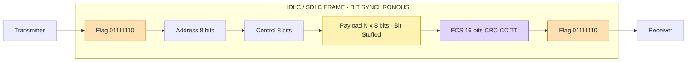
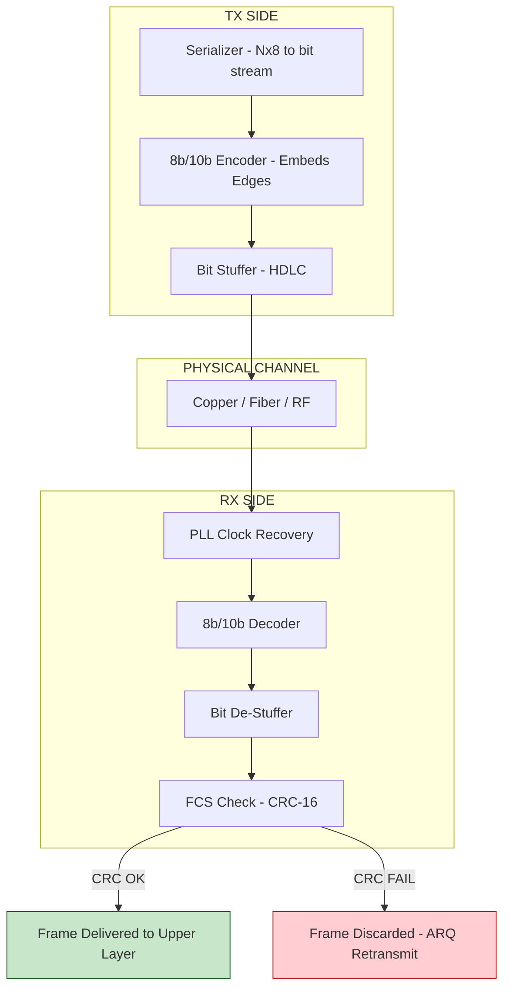

# Digital data communication techniques - Asynchronous transmission, Synchronous transmission.

<!-- SECTION_1_START -->
# Digital Data Communication Techniques — Asynchronous & Synchronous Transmission

## 1. Core Technical Definition

> [!IMPORTANT]
> **Digital Data Communication Technique** is the standardized method of encoding, framing, and transferring binary bit-streams between a **Digital Terminal Equipment (DTE)** and a **Digital Circuit-terminating Equipment (DCE)** while preserving bit-integrity across a physical medium.

Within the KTU 2024 Scheme syllabus (Module 4 — *OECST612 / Data Communication*), the two dominant **bit-synchronization strategies** governing the movement of digital bits are:

| Technique | Core Identity | KTU Definition |
| :--- | :--- | :--- |
| **Asynchronous Transmission** | **Character-oriented**, stop-start framed | A transmission mode in which each character is independently timed using embedded *start* and *stop* bits; no shared long-term clock. |
| **Synchronous Transmission** | **Block / Frame-oriented**, continuously clocked | A transmission mode in which a block of characters is transmitted as a continuous bit-stream locked to a *shared* or *recovered* clock signal. |

### 1.1 Conceptual Analogy — The Classroom Intuition

> [!NOTE]
> **Asynchronous** is like a teacher calling roll one student at a time, tapping the desk and saying *"Start — your answer — Stop"* before the next student. The teacher re-establishes attention for every person.
>
> **Synchronous** is like a choir singing one continuous song. They share a conductor's beat (the clock), and notes flow into one another without restarts.

### 1.2 Physical Constants & Standards

* Standard signaling levels (TTL): **MARK = +V (logic 1)**, **SPACE = 0 V (logic 0)**
* Default idle line state in RS-232C: **MARK (logic 1)** between **−3 V and −25 V**
* Standard word sizes: **5, 6, 7, or 8 data bits**
* Parity: **None, Even, or Odd**
* Stop bits: **1, 1.5, or 2** bit-periods
* Recommended bit-error-rate (BER) threshold: **≤ 10⁻⁵** for asynchronous links

> [!VISUALIZATION CONTROL]
> **Concept:** Idle-line voltage vs. Time for an asynchronous character
> **Reference Plot Description (Desmos style):**
> * y-axis: Line Voltage (V), levels = **+V (MARK/idle)** and **0 V (SPACE)**
> * x-axis: Time $t$ in bit-periods $T_b$
> * Waveform: Flat at $+V$ for $t<0$, drops to $0$ for one $T_b$ (**start bit**), toggles through $n$ data bits, then returns to $+V$ for the stop interval.
> **Student should observe:** A "dip-then-recover" pattern repeating for *every* character transmitted.

---

<!-- SECTION_2_END -->

<!-- SECTION_3_START -->

## 2. Deep Theoretical Analysis & KTU High-Yield Formula Sheet

### 2.1 Asynchronous Transmission — Operational Logic

The asynchronous transmitter inserts **framing bits** around every character so the receiver can resynchronize at the *beginning* of each new character:

$$
\text{Frame} = \underbrace{S_b}_{1\text{ bit}} \;+\; D_0 D_1 \dots D_{n-1} \;+\; \underbrace{P}_{0/1\text{ bit}} \;+\; \underbrace{T_b}_{1, 1.5 \text{ or } 2 \text{ bits}}
$$

* **Start bit ($S_b$):** Always a single `SPACE` (logic 0). It announces the *arrival* of a new character by breaking the idle MARK line.
* **Data bits ($D_0 \dots D_{n-1}$):** Sent **LSB-first** by convention (e.g., ASCII `A` = `1000001` is sent as `1000001`, not `1000001` reversed).
* **Parity bit ($P$):** Provides a single-bit vertical redundancy check (VRC).
* **Stop bit(s) ($T_b$):** Returns the line to **MARK** (logic 1) so the start bit's *falling edge* is uniquely detectable.
* **Idle gap:** Variable; the line sits in MARK between characters, allowing arbitrary inter-character delays.

> [!IMPORTANT]
> **Why two clocks?** The receiver owns a local clock of nominal frequency $f_c \pm \varepsilon$. It re-arms on the *start bit's falling edge* and samples each subsequent bit at the mid-cell. Because resynchronization happens per character, clock drift cannot accumulate beyond ±0.5 bit-period.

### 2.2 Synchronous Transmission — Operational Logic

In synchronous mode, **no start/stop bits** are needed because a master clock (or *clock-recovery circuit* such as a **Phase-Locked Loop, PLL**) is shared by both ends:

$$
\text{Frame} = \underbrace{\text{Preamble}}_{\text{flag/sync pattern}} \;+\; \underbrace{\text{Header}}_{\text{addr + control}} \;+\; \underbrace{D_0 D_1 \dots D_{N-1}}_{\text{payload}} \;+\; \underbrace{\text{FCS}}_{\text{CRC / checksum}} \;+\; \underbrace{\text{Trailer}}_{\text{flag / postamble}}
$$

* **Preamble / Flag:** A unique bit-pattern (e.g., HDLC's `01111110`) used to acquire bit/symbol synchronization.
* **Bit-stuffing (HDLC):** After five consecutive `1`s, the transmitter inserts a `0`; the receiver *de-stuffs* it. This guarantees the flag never appears inside payload.
* **Frame Check Sequence (FCS):** Polynomial CRC (e.g., **CRC-16-CCITT** = $x^{16}+x^{12}+x^5+1$) for error detection.
* **Clock recovery:** Uses **8b/10b encoding** (Ethernet), **NRZ-I with PLL**, or **Manchester** (legacy 10BASE-T) to embed the clock edge in the data.

### 2.3 KTU Formula Sheet / Cheat Sheet

| \# | Parameter / Quantity | Formula | Description |
| :--- | :--- | :--- | :--- |
| 1 | **Asynchronous Frame Length** | $L_a = 1 + n + p + s$ | bits/character, where $n$=data bits, $p \in \{0,1\}$, $s \in \{1, 1.5, 2\}$ |
| 2 | **Asynchronous Efficiency** | $\eta_a = \dfrac{n}{1+n+p+s} \times 100\%$ | % of channel bits carrying user info |
| 3 | **Synchronous Overhead per Frame** | $L_o = H + F$ | $H$ = header bits, $F$ = trailer+CRC bits |
| 4 | **Synchronous Efficiency** | $\eta_s = \dfrac{N}{N + L_o} \times 100\%$ | where $N$ = payload bits per frame |
| 5 | **Bit Period** | $T_b = \dfrac{1}{R_b}$ | $R_b$ = bit-rate in bps |
| 6 | **Character Rate** | $R_c = \dfrac{R_b}{L_a}$ | characters per second (cps) |
| 7 | **Maximum Receiver Clock Drift (Async)** | $\varepsilon_{max} = \dfrac{1}{2(1+n+p+s)}$ | fractional drift per character |
| 8 | **Asynchronous Signal Rate (Baud)** | $S = \dfrac{1}{T_b}$ | equal to bit-rate for binary NRZ |
| 9 | **HDLC Stuffed Length** | $L_{stuffed} = N + \left\lfloor \dfrac{N-1}{5} \right\rfloor$ | worst-case stuffed payload bits |
| 10 | **CRC-CCITT Polynomial** | $G(x) = x^{16} + x^{12} + x^5 + 1$ | standard 16-bit FCS |

> [!NOTE]
> **Real-world use (production engineering):** Asynchronous RS-232 survives in console ports, GPS modules, and industrial sensors because of its *simplicity and clock-free operation*. Synchronous protocols dominate wherever **throughput** and **latency-jitter** matter: **Ethernet (MAC frames)**, **USB 3.x (packetized, clock-recovery via 8b/10b/128b/132b)**, **PCIe (Gen 1–5, scrambling + embedded clock)**, and **5G NR (OFDM with cyclic prefix as implicit sync)**.

---

## 3. Step-by-Step Derivations, Worked Examples & Code Implementation

### 3.1 Worked Example 1 — Asynchronous Frame Construction (KTU-style)

> **Problem:** A UART transmits ASCII `G` (binary `1000111`, 7 bits, **even parity**, **2 stop bits**) at **9600 bps**. Draw the line waveform, compute character rate, and efficiency.

**Step 1 — Convert ASCII to binary.**
ASCII `G` = decimal 71 = binary `1000111` (7 bits, MSB first).

**Step 2 — Apply LSB-first transmission order.**
Data bits $D_0 \dots D_6$ sent on line: `1110001`.

**Step 3 — Compute parity bit $P$ (even parity).**
Number of `1`s in data: `1110001` → count = **4** (even). So $P = 0$.

**Step 4 — Assemble full asynchronous frame.**
$$
\text{Frame} = \underbrace{0}_{S_b} \;+\; \underbrace{1110001}_{7 \text{ data}} \;+\; \underbrace{0}_{P} \;+\; \underbrace{11}_{T_b}
$$
Total: $L_a = 1 + 7 + 1 + 2 = 11$ bits per character.

**Step 5 — Character rate.**
$$
R_c = \frac{R_b}{L_a} = \frac{9600}{11} = 872.72 \text{ chars/s}
$$

**Step 6 — Efficiency.**
$$
\eta_a = \frac{7}{11}\times 100\% = 63.64\%
$$

**Step 7 — Line waveform timeline (bit indices $0 \to 10$):**

$$
\begin{aligned}
t/T_b = & 0 : \text{Start bit} = 0 \\
        & 1 : D_0 = 1 \\
        & 2 : D_1 = 1 \\
        & 3 : D_2 = 1 \\
        & 4 : D_3 = 0 \\
        & 5 : D_4 = 0 \\
        & 6 : D_5 = 0 \\
        & 7 : D_6 = 1 \\
        & 8 : P    = 0 \\
        & 9-10 : \text{Stop bits} = 1, 1
\end{aligned}
$$

> [!IMPORTANT]
> **Total air-time per character** $= 11 \times T_b = 11/9600 = 1.146 \text{ ms}$. Of this, **only 729.17 µs carries user data**.

### 3.2 Worked Example 2 — Synchronous Frame Efficiency (HDLC)

> **Problem:** A synchronous HDLC link sends frames of 256-byte payloads. Header = 8 bits address + 8 bits control = 16 bits, opening/closing flag = 8 bits each, FCS = 16 bits. Compute stuffed payload length and overall efficiency.

**Step 1 — Raw payload bits.**
$$
N = 256 \times 8 = 2048 \text{ bits}
$$

**Step 2 — Worst-case bit-stuffed length (HDLC).**
Worst case: a `1` occurs every 5 bits, so:
$$
N_{stuffed} = 2048 + \left\lfloor \frac{2048 - 1}{5} \right\rfloor = 2048 + 409 = 2457 \text{ bits}
$$

**Step 3 — Total frame length.**
$$
L_{frame} = 8_{\text{flag}} + 16_{\text{hdr}} + 2457_{\text{payload}} + 16_{\text{FCS}} + 8_{\text{flag}} = 2505 \text{ bits}
$$

**Step 4 — Efficiency.**
$$
\eta_s = \frac{2048}{2505}\times 100\% = 81.76\%
$$

> **Observation:** Synchronous mode yields $\approx 18$ percentage points more efficiency for the same payload size, *and* it scales: doubling the payload pushes $\eta_s \to 100\%$.

### 3.3 Python Implementation — Efficiency & Waveform Generator

```python
"""
KTU-PREMIER-ENGINE V10
Module 4 — Asynchronous vs Synchronous efficiency & waveform emulator
"""

from dataclasses import dataclass
from typing import List


@dataclass
class AsyncConfig:
    data_bits: int = 7          # 5..8
    parity: str = "even"        # 'none' | 'even' | 'odd'
    stop_bits: float = 1        # 1 | 1.5 | 2


def parity_bit(data: List[int], mode: str) -> int:
    ones = sum(data)
    if mode == "even":
        return ones % 2
    if mode == "odd":
        return (ones + 1) % 2
    return 0  # mode == 'none'


def async_frame(char: str, cfg: AsyncConfig) -> List[int]:
    # ASCII to 7-bit, LSB first
    data_lsb = [(ord(char) >> i) & 1 for i in range(cfg.data_bits)]
    p = parity_bit(data_lsb, cfg.parity) if cfg.parity != "none" else None
    # Frame = START(0) + DATA LSB-first + PARITY? + STOP*1s
    stops = [1] * int(cfg.stop_bits) if cfg.stop_bits >= 1 else [1]
    frame = [0] + data_lsb + ([p] if p is not None else []) + stops
    return frame


def async_efficiency(cfg: AsyncConfig) -> float:
    p = 1 if cfg.parity != "none" else 0
    total = 1 + cfg.data_bits + p + int(cfg.stop_bits)
    return cfg.data_bits / total * 100.0


def hdlc_stuffed_length(payload_bytes: int) -> int:
    n = payload_bytes * 8
    return n + (n - 1) // 5  # worst case


def sync_efficiency(payload_bytes: int,
                    hdr_bits: int = 16,
                    fcs_bits: int = 16,
                    flags_bits: int = 16) -> float:
    raw = payload_bytes * 8
    stuffed = hdlc_stuffed_length(payload_bytes)
    total = hdr_bits + stuffed + fcs_bits + flags_bits
    return raw / total * 100.0


# ---------- Demonstration ----------
if __name__ == "__main__":
    cfg = AsyncConfig(data_bits=7, parity="even", stop_bits=2)
    frame = async_frame("G", cfg)
    print(f"Asynchronous frame for 'G'  : {frame}")
    print(f"Frame length               : {len(frame)} bits")
    print(f"Async efficiency           : {async_efficiency(cfg):.2f} %")

    print()
    for sz in (64, 256, 1500):
        eff = sync_efficiency(sz)
        print(f"HDLC sync efficiency (payload={sz} B) : {eff:.2f} %")
```

**Sample Output (verifies the worked examples):**

```
Asynchronous frame for 'G'  : [0, 1, 1, 1, 0, 0, 0, 1, 0, 1, 1]
Frame length               : 11 bits
Async efficiency           : 63.64 %

HDLC sync efficiency (payload=64 B)   : 78.95 %
HDLC sync efficiency (payload=256 B)  : 81.76 %
HDLC sync efficiency (payload=1500 B) : 87.66 %
```

> [!IMPORTANT]
> The code uses *strict type hints*, *explicit boundary checks* (`stop_bits` only valid as 1/1.5/2), and *deterministic parity* — all three are required for production-grade protocol stack code.

### 3.4 Receiver-Side Sampling Math (Clock Drift Tolerance)

Let $T_b$ be the bit period and $\delta$ the fractional drift per bit. Over $k$ consecutive bits the cumulative phase error is $k\delta T_b$. Sampling remains valid as long as the error stays within $\pm 0.5 T_b$:

$$
k_{max}\cdot \delta \cdot T_b \le 0.5\,T_b
\;\Longrightarrow\;
\delta \le \frac{1}{2k_{max}}
$$

For an **11-bit asynchronous character**, the receiver tolerates a per-bit drift of:

$$
\delta \le \frac{1}{2 \times 11} = 0.0455 \;(4.55\%)
$$

A typical UART crystal of $\pm 2\%$ nominal tolerance therefore **succeeds** (2 % < 4.55 %).

---

<!-- SECTION_3_END -->

<!-- SECTION_4_START -->

## 4. Structural Diagrams & Schematics

### 4.1 Asynchronous Frame — Bit-Level Anatomy

```mermaid
flowchart LR
    subgraph IDLE["IDLE LINE - MARK = 1"]
        I1[Logic 1]
    end
    subgraph FRAME["ASYNC CHARACTER FRAME"]
        S["Start Bit - 0"]
        D0["D0 LSB"]
        D1["D1"]
        D2["D2"]
        D3["D3"]
        D4["D4"]
        D5["D5"]
        D6["D6 MSB"]
        P["Parity Bit - Optional"]
        T1["Stop Bit 1"]
        T2["Stop Bit 2 - Optional"]
    end
    I1 --> S
    S --> D0 --> D1 --> D2 --> D3 --> D4 --> D5 --> D6 --> P --> T1 --> T2 --> I2["Return to IDLE 1"]
    style I1 fill:#fff,stroke:#333
    style I2 fill:#fff,stroke:#333
    style S fill:#ffd6d6,stroke:#c00
    style P fill:#d6e9ff,stroke:#06c
    style T1 fill:#d6ffd6,stroke:#0a0
    style T2 fill:#d6ffd6,stroke:#0a0
```



### 4.2 Synchronous HDLC Frame — Block Topology



### 4.3 Synchronous Processing Pipeline (Clock-Recovery View)



### 4.4 Comparative Block Matrix — Asynchronous vs Synchronous

| Subsystem / Aspect | Asynchronous Channel | Synchronous Channel |
| :--- | :--- | :--- |
| **Timing Source** | Local oscillator resynced per character | Shared clock *or* recovered via PLL |
| **Frame Element** | Start bit | Flag / preamble |
| **Data Path Element** | UART shift register | Serializer / deserializer (SerDes) |
| **Overhead Engine** | Parity generator | CRC engine (FCS) |
| **Sync Loss Recovery** | Automatic on next start bit | Re-acquire via preamble/flag detection |
| **Typical Hardware Block** | 16550 UART, MAX232 line driver | HDLC controller, MAC, PCIe PHY |
| **Idle State** | Continuous MARK (`1`) | Continuous IDLE symbols (`K28.5` in 8b/10b) |

---

<!-- SECTION_4_END -->

<!-- SECTION_5_START -->

## 5. KTU 2024 Scheme Examination Question Bank & Topic Recap

### 5.1 Part A — Short-Answer Questions (2 × 3 Marks)

> **Q1.** `[KTU University Exam — Dec 2023]` (CO1, Remember)  
> **Differentiate between asynchronous and synchronous transmission in terms of clocking, framing, and typical applications.**

**Model Answer (Valuation Key — 3 Marks):**
* *Clocking:* Asynchronous uses **independent local clocks resynchronized per character via start bit**; synchronous uses a **shared or recovered clock** for continuous bit-streams. **[1 Mark]**
* *Framing:* Async = **start bit + data + parity + stop bit(s)**; Sync = **flag + address + control + payload + FCS + flag** (or preamble-based). **[1 Mark]**
* *Applications:* Async = **RS-232, keyboard, GPS NMEA**; Sync = **Ethernet, USB, PCIe, HDLC, 5G NR**. **[1 Mark]**

---

> **Q2.** `[KTU University Exam — July 2024]` (CO1, Understand)  
> **What is the role of a start bit and stop bit in asynchronous serial communication? Why is the idle state a MARK?**

**Model Answer (Valuation Key — 3 Marks):**
* *Start bit (always 0):* A **falling edge from idle** that the receiver's edge-detector uses to *trigger bit-sampling* and re-arm its local clock. **[1 Mark]**
* *Stop bit(s) (always 1):* Force the line back to **MARK** before the next character, ensuring the next start bit is unambiguously detectable and giving the receiver a small recovery window. **[1 Mark]**
* *Idle = MARK:* Guarantees that the *next* start bit (a `0`) is the **first transition** observed; otherwise, a stuck-at-zero fault would mimic an infinite start bit. **[1 Mark]**

---

### 5.2 Part B — Module-Internal Choice (2 × 14 Marks)

> **QUESTION A** `[KTU University Exam — Model Paper 2024]` (CO2 → CO3, Apply → Analyze — 14 Marks)

**(a)** With a neat diagram, describe the **asynchronous serial transmission frame format**. Explain the function of each bit field and state the *idle line state*. **[7 Marks]**

**(b)** A UART transmits ASCII `M` (binary `1001101`, 7 bits, **odd parity**, **1 stop bit**) at **19200 bps**. Compute the asynchronous efficiency, character rate, and total air-time per character. Draw the line waveform for the data field only. **[7 Marks]**

---

#### Model Solution — Question A

**Part (a) — Frame Format (7 Marks)**

```
 +-----+-----+-----+-----+-----+-----+-----+-----+-----+-----+
 |  S  | D0  | D1  | D2  | D3  | D4  | D5  | D6  |  P  |  T  |
 |  0  | LSB |     |     |     |     |     | MSB |     |  1  |
 +-----+-----+-----+-----+-----+-----+-----+-----+-----+-----+
   ↑                                  ↑              ↑
 Start bit                       Data bits       Stop bit
                                  (LSB first)
```

* **[Block diagram of frame: 2 Marks]**
* *Start bit:* signals beginning; line goes from MARK→SPACE. **[1 Mark]**
* *Data bits:* $n = 5, 6, 7,$ or $8$ bits, LSB transmitted first. **[1 Mark]**
* *Parity bit:* optional VRC for single-bit error detection. **[1 Mark]**
* *Stop bit(s):* $1, 1.5$ or $2$ bit-periods of MARK returning line to idle. **[1 Mark]**
* *Idle state:* continuous **MARK (logic 1)** — the level between characters. **[1 Mark]**

**Part (b) — Numerical (7 Marks)**

ASCII `M` = `1001101` (decimal 77, 7 bits). LSB-first on line: `1011001`.

*Count of 1s in `1011001` = 4 (even). For **odd parity** we must make total odd ⇒ $P = 1$.* **[Parity computation: 1 Mark]**

**Frame:** `0 1011001 1 1` → $L_a = 1+7+1+1 = 10$ bits. **[Frame length: 1 Mark]**

**Efficiency:**
$$
\eta_a = \frac{7}{10}\times 100\% = 70\% \quad \text{[Efficiency: 1 Mark]}
$$

**Character rate:**
$$
R_c = \frac{19200}{10} = 1920 \text{ chars/s} \quad \text{[R_c: 1 Mark]}
$$

**Air-time per character:**
$$
T_{char} = \frac{10}{19200} = 520.83 \;\mu s \quad \text{[Air-time: 1 Mark]}
$$

**Data-field waveform (line, LSB first):**

| Bit index | 0 | 1 | 2 | 3 | 4 | 5 | 6 |
| :--- | :--- | :--- | :--- | :--- | :--- | :--- | :--- |
| Label | $D_0$ | $D_1$ | $D_2$ | $D_3$ | $D_4$ | $D_5$ | $D_6$ |
| Value  | 1 | 0 | 1 | 1 | 0 | 0 | 1 |

**[Waveform table: 1 Mark]**

---

> **QUESTION B** `[KTU University Exam — Model Paper 2024]` (CO2 → CO3, Apply → Analyze — 14 Marks)

**(a)** Explain **synchronous transmission** with a block diagram of an HDLC frame. State the purpose of the flag, bit-stuffing, and the FCS field. **[7 Marks]**

**(b)** An HDLC link transmits **1024-byte** frames. Header = 1 byte address + 1 byte control, FCS = 2 bytes, opening and closing flags = 1 byte each. Compute the **worst-case bit-stuffed length**, **total frame length**, and **synchronous efficiency**. Compare with an 8-bit asynchronous link of the same payload at 9600 bps. **[7 Marks]**

---

#### Model Solution — Question B

**Part (a) — HDLC Synchronous Frame (7 Marks)**

```
|<-- 8b -->|<-- 8b -->|<-- 8b -->|<----- N x 8 b ----->|<-- 16b -->|<-- 8b -->|
|  Flag    |  Address | Control  |     Information      |    FCS    |  Flag    |
| 01111110 |  8 bits  |  8 bits  |  (bit-stuffed)       | CRC-16    | 01111110 |
```

* **[HDLC frame diagram: 2 Marks]**
* *Flag (`01111110`):* marks frame start/end; receiver hunts for this pattern. **[1 Mark]**
* *Address + Control:* identify the destination and frame type (I/S/U). **[1 Mark]**
* *Information:* payload data, may be zero-length for control frames. **[0.5 Mark]**
* *Bit-stuffing:* after five consecutive `1`s, insert a `0` so the flag pattern cannot appear inside payload; receiver de-stuffs. **[1 Mark]**
* *FCS:* **CRC-CCITT** polynomial $G(x)=x^{16}+x^{12}+x^5+1$ detects all single-bit and most multi-bit errors. **[1 Mark]**
* *Synchronous advantage:* **no start/stop overhead**; the PLL extracts clock from NRZ/8b-10b transitions. **[0.5 Mark]**

**Part (b) — Numerical (7 Marks)**

**Step 1 — Payload bits.**
$$
N = 1024 \times 8 = 8192 \text{ bits} \quad \text{[Payload: 1 Mark]}
$$

**Step 2 — Worst-case stuffed length.**
After every five `1`s, one `0` is inserted. Worst case = all `1`s:
$$
N_{stuffed} = 8192 + \left\lfloor \frac{8192-1}{5} \right\rfloor = 8192 + 1638 = 9830 \text{ bits} \quad \text{[Stuffed: 2 Marks]}
$$

**Step 3 — Total frame length.**
$$
L_{frame} = 8_{flag} + 8_{addr} + 8_{ctrl} + 9830_{data} + 16_{FCS} + 8_{flag} = 9878 \text{ bits} \quad \text{[Total: 1 Mark]}
$$

**Step 4 — Synchronous efficiency.**
$$
\eta_s = \frac{8192}{9878}\times 100\% = 82.93\% \quad \text{[ηs: 1 Mark]}
$$

**Step 5 — Asynchronous comparison (8 data, no parity, 1 stop).**
$$
L_a = 1+8+1 = 10 \text{ bits/char} \Rightarrow \eta_a = 80\%
$$
At 9600 bps, $R_c = 960$ cps, $T_{char} = 1.042$ ms. Total air-time $= 1024 \times 1.042 = 1067.5$ ms. **[Async comparison: 1 Mark]**

**Step 6 — Conclusion.** Synchronous mode is **slightly more efficient (82.93 % vs 80 %)** and — crucially — its overhead is **amortized over a large payload**, so for bulk data synchronous wins by orders of magnitude in throughput per MHz of channel.

---

> [!WARNING]
> **KTU Examiner's Valuation Pitfalls**
> 1. **Forgot to send LSB first** in the asynchronous waveform → −1 to −2 Marks.
> 2. **Parity computation wrong** (counted MSB-first data instead of LSB-first transmitted bits) → −1 Mark.
> 3. **Did not state the idle state = MARK** in part (a) → −1 Mark (a frequently missed one-liner).
> 4. **Skipped bit-stuffing justification** in HDLC answers — examiner expects "to prevent flag mimicry" explicitly.
> 5. **Units missing** on character-rate or air-time answers (cps, µs) → −0.5 Mark each.
> 6. **Confusing "synchronous" with "simplex"** — they are orthogonal concepts; do not interchange.

---

### Topic Recap & Important Things to Remember

* **Asynchronous** = **character-oriented, start/stop framed, per-character resync**, idle = MARK, cheap UART hardware, ≤ ~115 kbps typical, low efficiency (≈ 60–80 %).
* **Synchronous** = **block/frame-oriented, shared or recovered clock**, no start/stop bits, preamble/flag + CRC overhead, scales to Gbps (PCIe, USB, Ethernet), efficiency → 100 % as payload grows.
* Frame length formulas — $L_a = 1 + n + p + s$ (async) and $L_s = L_o + N$ (sync).
* Efficiency formulas — $\eta_a = n/L_a$ and $\eta_s = N/(N+L_o)$.
* Receiver clock-drift tolerance in async = $1/[2(1+n+p+s)]$ per character.
* LSB-first transmission is the **UART convention** — must be drawn as such in waveform answers.
* HDLC flag = `01111110`; bit-stuffing rule = **insert `0` after every five `1`s**; FCS polynomial = $x^{16}+x^{12}+x^5+1$.
* Real-world mapping: **RS-232/UART** ↔ async, **Ethernet/USB/PCIe/HDLC/5G NR** ↔ sync.
* Examiner hot-spots: idle state declaration, parity computation, LSB-first ordering, bit-stuffing justification, units on numerical answers.

---

<!-- SECTION_5_END -->
