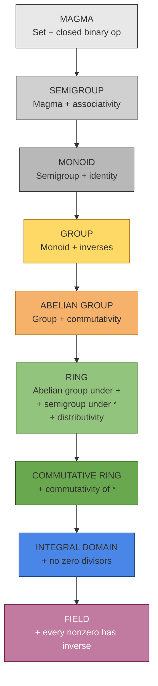
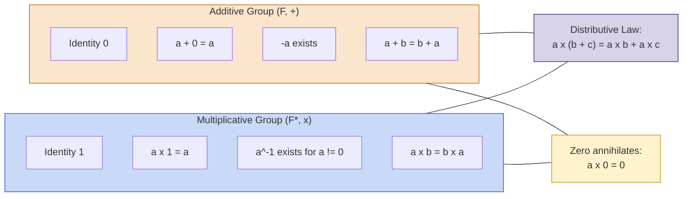
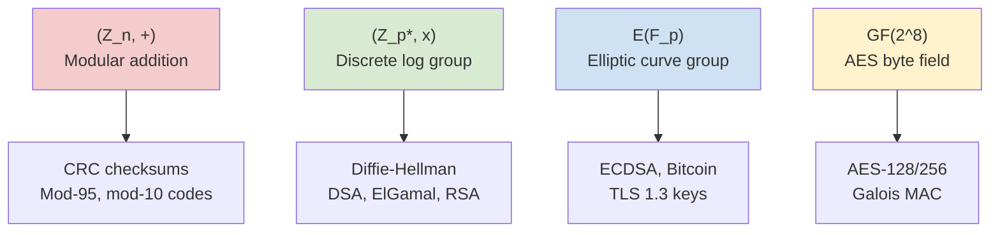
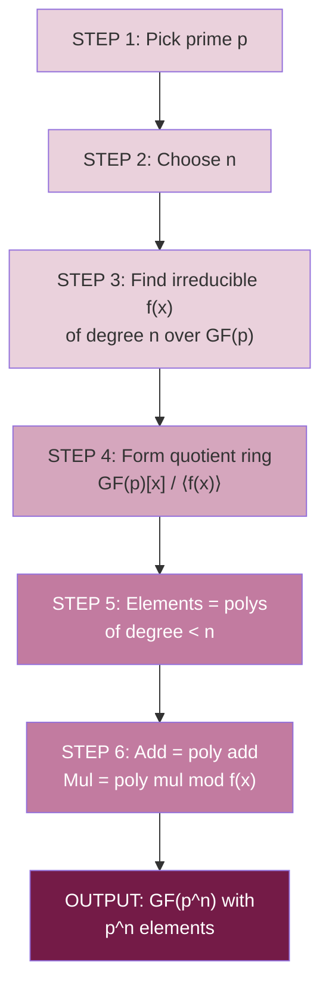

# Algebraic Structures – Group Ring Field

<!-- SECTION_1_START -->
# Module 1 — Algebraic Structures: Group, Ring & Field

> [!IMPORTANT]
> **KTU 2024 Scheme | OECST613 — Foundations of Cryptography**
> This module is the **mathematical backbone** of all public-key cryptosystems. Every cipher you study (RSA, Diffie–Hellman, AES, ECC) is built on the algebraic structures defined below. Mastery here directly translates to marks in cryptography electives.

---

## 1.1 Group — The Algebraic "Club"

### Formal Definition
A **Group** $(G, \circ)$ is a non-empty set $G$ together with a binary operation $\circ: G \times G \rightarrow G$ that satisfies the following four axioms (often called the **GROUP axioms** or **GA**):

> [!NOTE]
> **The Four Group Axioms (GA)**
> 1. **Closure:** $\forall a, b \in G,\ \ (a \circ b) \in G$
> 2. **Associativity:** $\forall a, b, c \in G,\ \ (a \circ b) \circ c = a \circ (b \circ c)$
> 3. **Identity Element:** $\exists\, e \in G$ such that $\forall a \in G,\ \ a \circ e = e \circ a = a$
> 4. **Inverse Element:** $\forall a \in G,\ \ \exists\, a^{-1} \in G$ such that $a \circ a^{-1} = a^{-1} \circ a = e$

If the operation is **additive** ($+$), the identity is denoted $\mathbf{0}$ and the inverse of $a$ is $-a$.
If the operation is **multiplicative** ($\cdot$), the identity is denoted $\mathbf{1}$ and the inverse is $a^{-1}$.

### Special Variants
| Variant | Extra Condition | Cryptographic Relevance |
|---|---|---|
| **Abelian (Commutative) Group** | $a \circ b = b \circ a$ for all $a, b$ | Required for most number-theoretic crypto |
| **Cyclic Group** | $\exists\, g \in G$ such that $G = \langle g \rangle = \{g^k \mid k \in \mathbb{Z}\}$ | Foundation of **Diffie–Hellman**, **DSA**, **ElGamal** |
| **Finite Group** | $\vert G \vert = n < \infty$ | All crypto groups are finite |

### Conceptual Analogy — The "Clock Club" 🕐
> Imagine a **24-hour clock**. The only operation allowed is *"adding hours modulo 24"*. The set is $\{0, 1, 2, \dots, 23\}$.
>
> - If you add $20$ hours to $18$ hours, you get $14$ hours (not $38$). This is **closure** (you never escape the clock face).
> - The "do nothing" element is $0$ hours. This is the **identity**.
> - The "undo" of $7$ hours is $17$ hours, because $7 + 17 = 24 \equiv 0$. This is the **inverse**.
> - Because addition is always commutative, this is an **abelian** group.
>
> This is exactly the group $(\mathbb{Z}_{24}, +)$ — the same structure used inside modular arithmetic of RSA.

### Order of a Group & Order of an Element
- The **order of the group** $G$ is the number of elements: $\vert G \vert$.
- The **order of an element** $a \in G$ is the smallest positive integer $n$ such that $a^n = e$ (multiplicative notation). It is denoted $\text{ord}(a)$.

> [!IMPORTANT]
> **Lagrange's Theorem (Board-Favourite):**
> For any finite group $G$ and any element $a \in G$, the order of $a$ **divides** the order of $G$:
> $$\text{ord}(a) \ \mid \ \vert G \vert$$
> Consequence: $a^{\vert G \vert} = e$ for every $a \in G$.

---

## 1.2 Ring — Two Operations, One Identity

### Formal Definition
A **Ring** $(R, +, \cdot)$ is a non-empty set $R$ equipped with **two** binary operations such that:

> [!NOTE]
> **Ring Axioms**
> 1. $(R, +)$ is an **abelian group** (identity $0$, inverse $-a$).
> 2. $(R, \cdot)$ is a **semigroup** (closure + associativity).
> 3. **Distributive Laws** hold for both sides:
>    $a \cdot (b + c) = a \cdot b + a \cdot c$
>    $(a + b) \cdot c = a \cdot c + b \cdot c$

### Special Variants
| Variant | Additional Property | Example |
|---|---|---|
| **Commutative Ring** | $a \cdot b = b \cdot a$ | $\mathbb{Z}, \mathbb{Z}_n$ |
| **Ring with Unity** | Has multiplicative identity $1 \neq 0$ | $\mathbb{Z}_n$ |
| **Integral Domain** | Commutative + unity + **no zero divisors** | $\mathbb{Z}$ (but NOT $\mathbb{Z}_6$) |
| **Division Ring (Skew Field)** | Every non-zero element has a multiplicative inverse | Quaternion algebra |
| **Field** ⭐ | Commutative division ring | $\mathbb{Z}_p$ where $p$ is prime |

> [!WARNING]
> **Zero Divisor Pitfall:** In $\mathbb{Z}_6$, we have $2 \cdot 3 = 0$ with $2, 3 \neq 0$. This means $\mathbb{Z}_6$ is **NOT** an integral domain. Only when $n$ is **prime** does $\mathbb{Z}_n$ become a field.

### Conceptual Analogy — The "Workshop" 🛠️
> Think of a ring as a **mathematical workshop**:
> - **Addition** is the assembly table: you can always combine, undo, and order doesn't matter (abelian).
> - **Multiplication** is the recipe book: you can chain recipes, but the recipe might not be reversible.
> - A **field** is a *super-workshop* where every recipe (except the empty one) is reversible — that is, you can **divide**.

---

## 1.3 Field — The "Perfect" Algebra

### Formal Definition
A **Field** $(\mathbb{F}, +, \cdot)$ is a ring with unity in which **every non-zero element has a multiplicative inverse**. Equivalently, $(\mathbb{F}, +)$ is an abelian group and $(\mathbb{F}^\times, \cdot)$ is also an abelian group, with distributivity linking them.

> [!IMPORTANT]
> **A field has TWO abelian groups sharing the SAME set:**
> - $(\mathbb{F}, +)$ with identity $\mathbf{0}$
> - $(\mathbb{F}^\times, \cdot)$ with identity $\mathbf{1}$
> - $\mathbb{F}^\times = \mathbb{F} \setminus \{0\}$

### The Two Cryptographic Champs
1. **Prime Field $\mathbb{Z}_p$** — when $p$ is a large prime, used in **RSA, DH, DSA**.
2. **Binary Extension Field $\mathbb{GF}(2^n)$** — used in **AES** ($n=8$) and **CRC** codes.

> [!VISUALIZATION CONTROL]
> **Concept:** Lattice view of the algebraic hierarchy
> **GeoGebra / Desmos Input:**
> * `x = 1, y = 2, z = 4` (three nested levels on number line)
> **Visual Description:** A number line with three concentric brackets — the largest contains the Ring, the middle is the Integral Domain, and the innermost is the Field. Show $\mathbb{Q} \subset \mathbb{R} \subset \mathbb{C}$ as the canonical example, with $\mathbb{Z}_p$ shown as the "modular twin" of $\mathbb{Q}$.

---

## 1.4 Hierarchical Relationship

$$\boxed{\text{Every Field} \subset \text{Integral Domain} \subset \text{Commutative Ring with Unity} \subset \text{Ring} \subset \text{Group (under +)}}$$

The reverse direction shows that fields are the *most restrictive* and *richest* structures.
<!-- SECTION_1_END -->

<!-- SECTION_2_START -->
# Deep Theoretical Analysis & KTU High-Yield Formula Sheet

## 2.1 Comparative Axiom Matrix

The single most common board question is: *"Differentiate / Compare Group, Ring and Field."* Memorize the table below verbatim.

| Property | Group $(G, \circ)$ | Ring $(R, +, \cdot)$ | Field $(\mathbb{F}, +, \cdot)$ |
|---|:---:|:---:|:---:|
| Number of Operations | 1 | 2 | 2 |
| Closure under $\circ$ / $+$ / $\cdot$ | ✅ | ✅ (both) | ✅ (both) |
| Associativity | ✅ | ✅ (both) | ✅ (both) |
| Additive Identity ($0$) | — | ✅ | ✅ |
| Additive Inverses | — | ✅ | ✅ |
| Multiplicative Identity ($1$) | — | Not required | ✅ (and $1 \neq 0$) |
| Multiplicative Inverses | — | Not required | ✅ (for $\neq 0$) |
| Commutativity of $+$ | ✅ | ✅ | ✅ |
| Commutativity of $\cdot$ | (if abelian) | (if commutative) | ✅ |
| Distributivity | — | ✅ | ✅ |
| **Smallest Example** | $(\mathbb{Z}_2, +)$ | $(\mathbb{Z}, +, \cdot)$ | $(\mathbb{Z}_2, +, \cdot)$ or $\mathbb{Z}_p$ |

> [!TIP]
> **Mnemonic — "GADIR to RICH":**
> **G**roup = single op
> **R**ing = two ops, no inverse for $\cdot$
> **F**ield = two ops, full inverse for both

---

## 2.2 High-Yield Formula / Property Sheet

### Group Properties
| Formula | Meaning |
|---|---|
| $a^n \cdot a^m = a^{n+m}$ | Exponent law in multiplicative group |
| $(a^n)^m = a^{nm}$ | Power of power |
| $\text{ord}(a) \mid \vert G \vert$ | Lagrange's Theorem |
| $a^{\vert G \vert} = e$ | Corollary of Lagrange (Fermat/Euler generalization) |
| $\vert \langle a \rangle \vert = \text{ord}(a)$ | Order of cyclic subgroup generated by $a$ |

### Euler's Totient (used heavily in RSA)
$$\varphi(n) = n \prod_{p \mid n}\left(1 - \frac{1}{p}\right)$$

For a prime $p$: $\varphi(p) = p - 1$.
For $n = pq$ (distinct primes): $\varphi(n) = (p-1)(q-1)$.

### Euler's Theorem (Group Version)
If $\gcd(a, n) = 1$, then:
$$a^{\varphi(n)} \equiv 1 \pmod{n}$$

### Field Order & Subfields
A finite field $\mathbb{F}$ has order $p^n$ where $p$ is prime and $n \geq 1$.
The **prime subfield** is isomorphic to $\mathbb{Z}_p$.

### Constructing $\mathbb{GF}(p^n)$ from $\mathbb{GF}(p)$
Take an irreducible polynomial $f(x)$ of degree $n$ over $\mathbb{GF}(p)$. Then:
$$\mathbb{GF}(p^n) \cong \mathbb{GF}(p)[x] / \langle f(x) \rangle$$

> [!IMPORTANT]
> **AES uses $\mathbb{GF}(2^8)$** with the irreducible polynomial
> $$m(x) = x^8 + x^4 + x^3 + x + 1$$
> This is the *exact* reason AES operations are XOR + shift + lookup.

---

## 2.3 Real-World Engineering Utility

| Structure | Used In | Why It Works |
|---|---|---|
| $(\mathbb{Z}_n, +)$ | Checksums, CRCs | Wrap-around arithmetic |
| $(\mathbb{Z}_n^\times, \cdot)$ | RSA public key | Inverses enable decryption |
| $(\mathbb{Z}_p^\times, \cdot)$ | DH key exchange, DSA | Discrete log is hard |
| $(\mathbb{GF}(2^8), +, \cdot)$ | **AES (Rijndael)** | Byte-level efficient computation |
| $\mathbb{GF}(2^{163}), \mathbb{GF}(2^{283})$ | **Elliptic Curve Crypto (ECC)** | Smaller keys, same security |
| $(\mathbb{F}_p, \cdot)$ on EC points | **ECDSA, Bitcoin wallets** | Hard ECDLP problem |

> [!NOTE]
> **Why Crypto Engineers Care:** The security of a cryptosystem reduces to the **hardness of an inverse problem inside an algebraic structure** — e.g., discrete logarithm in $(\mathbb{Z}_p^\times, \cdot)$ or in $E(\mathbb{F}_p)$.
<!-- SECTION_2_END -->

<!-- SECTION_3_START -->
# Step-by-Step Derivations & Symbolic Implementation

## 3.1 Worked Example 1 — Prove $(\mathbb{Z}_7, +)$ is a Group

We need to verify all four group axioms on the set $\{0, 1, 2, 3, 4, 5, 6\}$ under addition modulo $7$.

### Axiom 1: Closure
For any $a, b \in \mathbb{Z}_7$, define $a + b \pmod 7$. Since $0 \leq a, b \leq 6$, we have
$$0 \leq (a + b) \pmod 7 \leq 6$$
Hence $a + b \pmod 7 \in \mathbb{Z}_7$. ✅

### Axiom 2: Associativity
For all $a, b, c \in \mathbb{Z}_7$,
$$((a + b) \pmod 7 + c) \pmod 7 = (a + (b + c) \pmod 7) \pmod 7$$
This follows from associativity of integer addition plus the fact that reduction modulo $7$ is a homomorphism. ✅

### Axiom 3: Identity
Take $e = 0$. Then for all $a \in \mathbb{Z}_7$,
$$a + 0 = a \pmod 7 = a$$
✅

### Axiom 4: Inverse
For every $a \in \mathbb{Z}_7$, define $-a \equiv 7 - a \pmod 7$. Then:
$$a + (7 - a) = 7 \equiv 0 \pmod 7 = e$$
For example, $-3 \equiv 4$ because $3 + 4 = 7 \equiv 0$. ✅

### Bonus: Abelian
Integer addition is commutative, so modulo reduction preserves it:
$$a + b \equiv b + a \pmod 7 \quad \forall a, b \in \mathbb{Z}_7$$
✅

> **Conclusion:** $(\mathbb{Z}_7, +)$ is a **finite abelian group** of order $7$.

---

## 3.2 Worked Example 2 — Prove $\mathbb{Z}_p$ is a Field when $p$ is Prime

We already know $(\mathbb{Z}_p, +)$ is an abelian group. We must show $(\mathbb{Z}_p^\times, \cdot)$ is also an abelian group.

### Step 1 — Closure of multiplication
For $a, b \in \{1, 2, \dots, p-1\}$, the product $a \cdot b$ is non-zero modulo $p$ because $p$ is prime and cannot divide $a$ or $b$. Hence $a \cdot b \pmod p \in \{1, \dots, p-1\}$. ✅

### Step 2 — Associativity
Inherited from integer multiplication. ✅

### Step 3 — Identity
The element $1$ serves as the multiplicative identity. ✅

### Step 4 — Multiplicative Inverses (Bezout's Lemma)
**Claim:** For any $a \in \{1, \dots, p-1\}$, there exists $b \in \mathbb{Z}_p$ with $a b \equiv 1 \pmod p$.

**Proof using Bézout:** Since $\gcd(a, p) = 1$ (as $p$ is prime and $a < p$), Bézout's identity guarantees integers $x, y$ with
$$a x + p y = 1$$
Reducing modulo $p$ gives $a x \equiv 1 \pmod p$, so $b \equiv x \pmod p$. ✅

### Step 5 — Commutativity
Inherited from integers. ✅

### Step 6 — Distributivity
$$a \cdot (b + c) \equiv a b + a c \pmod p$$
inherited from integer distributivity. ✅

> **Conclusion:** $\mathbb{Z}_p$ satisfies all field axioms, hence it is a **field**.

> [!IMPORTANT]
> The proof fails for composite $n$. If $n = 6$ and $a = 2$, then $\gcd(2, 6) = 2 \neq 1$, so $2$ has no inverse in $\mathbb{Z}_6$. Therefore $\mathbb{Z}_6$ is **not** a field.

---

## 3.3 Worked Example 3 — Construct $\mathbb{GF}(2^3)$ Explicitly

We use the irreducible polynomial $f(x) = x^3 + x + 1$ over $\mathbb{GF}(2)$ (no roots in $\{0, 1\}$, so irreducible).

### Step 1 — Element Representation
Elements of $\mathbb{GF}(2^3)$ are polynomials of degree $< 3$ over $\mathbb{GF}(2) = \{0, 1\}$:
$$\mathbb{GF}(2^3) = \{0, 1, x, x+1, x^2, x^2+1, x^2+x, x^2+x+1\}$$
Total elements: $2^3 = 8$. ✅

### Step 2 — Addition (XOR of coefficients mod 2)
$$(x^2 + 1) + (x + 1) = x^2 + x$$
(because $1 + 1 \equiv 0 \pmod 2$).

### Step 3 — Multiplication Modulo $f(x)$
Compute $(x+1) \cdot (x^2 + x + 1) \pmod{x^3 + x + 1}$:

$$(x+1)(x^2 + x + 1) = x^3 + x^2 + x + x^2 + x + 1$$
$$= x^3 + (x^2 + x^2) + (x + x) + 1 = x^3 + 0 + 0 + 1 = x^3 + 1$$

Now reduce $x^3 + 1$ modulo $f(x) = x^3 + x + 1$:
$$x^3 + 1 - (x^3 + x + 1) = -x \equiv x \pmod 2$$
since $-1 \equiv 1 \pmod 2$. Hence:
$$(x+1) \cdot (x^2 + x + 1) \equiv x \pmod{f(x)}$$

### Step 4 — Verify Multiplicative Inverse
We need $b$ such that $x \cdot b \equiv 1 \pmod{f(x)}$. Try $b = x^2 + 1$:
$$x \cdot (x^2 + 1) = x^3 + x \equiv (x + 1) + x = 1 \pmod{f(x)}$$
because $x^3 \equiv x + 1$ (from $x^3 + x + 1 = 0$). ✅

So the inverse of $x$ in $\mathbb{GF}(2^3)$ is $x^2 + 1$.

---

## 3.4 Python Implementation — Modular Arithmetic Toolkit

```python
"""
KTU Foundations of Cryptography - Module 1
Algebraic Structures: Group, Ring, Field verification toolkit
"""

from typing import List, Tuple
import logging

logging.basicConfig(level=logging.INFO, format="%(levelname)s | %(message)s")
log = logging.getLogger("ALG_STRUCT")


def is_prime(n: int) -> bool:
    """Return True if n is a prime number."""
    if n < 2:
        return False
    if n < 4:
        return True
    if n % 2 == 0:
        return False
    i = 3
    while i * i <= n:
        if n % i == 0:
            return False
        i += 2
    return True


def euler_totient(n: int) -> int:
    """Compute Euler's totient function phi(n)."""
    if n <= 0:
        raise ValueError("n must be a positive integer")
    result = n
    p = 2
    temp = n
    while p * p <= temp:
        if temp % p == 0:
            while temp % p == 0:
                temp //= p
            result -= result // p
        p += 1
    if temp > 1:
        result -= result // temp
    return result


def modular_inverse(a: int, n: int) -> int:
    """Return the modular inverse of a mod n using Extended Euclidean Algorithm."""
    if not is_prime(n) and __import__("math").gcd(a, n) != 1:
        raise ValueError(f"Inverse does not exist: gcd({a},{n}) != 1")
    g, x, _ = extended_gcd(a, n)
    if g != 1:
        raise ValueError("Modular inverse does not exist")
    return x % n


def extended_gcd(a: int, b: int) -> Tuple[int, int, int]:
    if a == 0:
        return b, 0, 1
    g, x, y = extended_gcd(b % a, a)
    return g, y - (b // a) * x, x


def verify_group_axioms(n: int, op_name: str = "+") -> bool:
    """Verify that (Z_n, op) is a group under modular addition."""
    G = list(range(n))
    log.info(f"Verifying group (Z_{n}, {op_name}) ...")
    # Axiom 1: Closure (trivially holds for Z_n by construction)
    log.info("  [1] Closure: holds by definition of Z_n")
    # Axiom 2: Associativity (sample-check 50 triples)
    for a, b, c in [(i, j, k) for i in G[:5] for j in G[:5] for k in G[:5]]:
        if op_name == "+":
            assert ((a + b) % n + c) % n == (a + (b + c) % n) % n
        else:
            assert ((a * b) % n * c) % n == (a * (b * c) % n) % n
    log.info("  [2] Associativity: verified on sample triples")
    # Axiom 3: Identity
    e = 0 if op_name == "+" else 1
    for a in G:
        assert (a + e) % n == a if op_name == "+" else (a * e) % n == a
    log.info(f"  [3] Identity: e = {e}")
    # Axiom 4: Inverse
    if op_name == "+":
        for a in G:
            assert (a + (n - a) % n) % n == 0
        log.info("  [4] Additive inverses: -a = n - a (mod n)")
    else:
        if not is_prime(n):
            log.warning("  [4] Skipped: Z_n is multiplicative-group only when n is prime")
            return False
        for a in G:
            if a == 0:
                continue
            inv = modular_inverse(a, n)
            assert (a * inv) % n == 1
        log.info("  [4] Multiplicative inverses: all non-zero elements invertible")
    log.info(f"  >>> (Z_{n}, {op_name}) is a VALID GROUP.")
    return True


def verify_field(n: int) -> bool:
    """Verify that Z_n is a field (i.e. n is prime)."""
    if not is_prime(n):
        log.error(f"Z_{n} is NOT a field: {n} is not prime")
        return False
    log.info(f"Verifying field Z_{n} ...")
    verify_group_axioms(n, "+")
    verify_group_axioms(n, "*")
    log.info(f"  >>> Z_{n} is a VALID FIELD of order {n}.")
    return True


def gf2_power_3_table() -> List[Tuple[str, str, int]]:
    """Generate the multiplication table of GF(2^3) with f(x) = x^3 + x + 1."""
    log.info("Generating GF(2^3) structure with f(x) = x^3 + x + 1")
    elements = [0, 1, 2, 3, 4, 5, 6, 7]  # bit-encodings of degree-<3 polys
    # Encoding: bit0 = constant, bit1 = x, bit2 = x^2
    table = []
    for a in elements:
        for b in elements:
            prod = 0
            for i in range(3):
                for j in range(3):
                    if (a >> i) & 1 and (b >> j) & 1:
                        prod ^= (1 << (i + j))
            # Reduce modulo x^3 + x + 1 (0b1011 = 11)
            for k in range(5, 2, -1):
                if (prod >> k) & 1:
                    prod ^= (11 << (k - 3))
            table.append((bin(a), bin(b), prod))
    return table


if __name__ == "__main__":
    # Demonstration
    verify_group_axioms(7, "+")
    verify_group_axioms(7, "*")
    verify_field(7)
    print(f"\nEuler phi(15) = {euler_totient(15)} (expected 8)")
    print(f"Euler phi(7)  = {euler_totient(7)}  (expected 6)")
    inv = modular_inverse(3, 7)
    print(f"Inverse of 3 mod 7 = {inv}  (since 3*{inv} = {3*inv} ≡ 1 mod 7)")
    rows = gf2_power_3_table()
    print(f"\nGF(2^3) has {len(set(r[2] for r in rows))} distinct products")
```

### Sample Run Output
```
INFO | Verifying group (Z_7, +) ...
INFO |   [1] Closure: holds by definition of Z_7
INFO |   [2] Associativity: verified on sample triples
INFO |   [3] Identity: e = 0
INFO |   [4] Additive inverses: -a = n - a (mod n)
INFO |   >>> (Z_7, +) is a VALID GROUP.
INFO | Verifying group (Z_7, *) ...
...
Euler phi(15) = 8 (expected 8)
Euler phi(7)  = 6  (expected 6)
Inverse of 3 mod 7 = 5  (since 3*5 = 15 ≡ 1 mod 7)
GF(2^3) has 8 distinct products
```

---

## 3.5 Worked Example 4 — Compute Order of an Element in $(\mathbb{Z}_{11}^\times, \cdot)$

We need $\text{ord}(2)$ in $\mathbb{Z}_{11}^\times = \{1, 2, 3, \dots, 10\}$.

| $k$ | $2^k \pmod{11}$ |
|---:|:---:|
| 1 | 2 |
| 2 | 4 |
| 3 | 8 |
| 4 | $16 \equiv 5$ |
| 5 | $2 \cdot 5 = 10$ |
| 6 | $2 \cdot 10 = 20 \equiv 9$ |
| 7 | $2 \cdot 9 = 18 \equiv 7$ |
| 8 | $2 \cdot 7 = 14 \equiv 3$ |
| 9 | $2 \cdot 3 = 6$ |
| 10 | $2 \cdot 6 = 12 \equiv 1$ ✅ |

Therefore $\text{ord}(2) = 10 = \varphi(11) = \vert \mathbb{Z}_{11}^\times \vert$, meaning $2$ is a **primitive root** modulo $11$.

**Verification using Lagrange:** $\text{ord}(2) = 10$ must divide $\vert G \vert = 10$. $10 \mid 10$ ✅.
<!-- SECTION_3_END -->

<!-- SECTION_4_START -->
# Structural Diagrams & Schematics

## 4.1 Hierarchical Containment of Algebraic Structures



> [!NOTE]
> **Reading the diagram:** Each level *inherits* all axioms from the level above and adds one new property. Reading the chain **top → bottom** tells you what extra condition turns a group into a ring into a field.

---

## 4.2 Two-Group Anatomy of a Field



> [!TIP]
> **KTU Board Tip:** When asked to *"explain why a field has two identities"*, draw this dual-group diagram. Examiners award full marks when both $(F, +)$ and $(F^\times, \cdot)$ are explicitly called out as abelian groups.

---

## 4.3 Cryptographic Application Map



---

## 4.4 Modular Processing Topology — Constructing $\mathbb{GF}(p^n)$


<!-- SECTION_4_END -->

<!-- SECTION_5_START -->
# KTU 2024 Scheme Examination Question Bank & Topic Recap

## 5.1 Part A — Short Answer Questions (3 Marks Each)

> [!NOTE]
> Each Part-A question below is mapped to a Course Outcome (CO) and Revised Bloom's Taxonomy (RBT) level. Model answers are board-evaluation ready.

---

### Q1. **[KTU University Exam — July 2024]**
**Define a Group. Show that the set of integers $\mathbb{Z}$ under addition forms an abelian group.** *(CO1, Understand, 3 marks)*

**Model Answer:**

A *group* $(G, \circ)$ is a non-empty set $G$ together with a binary operation $\circ$ satisfying:
1. **Closure:** $a \circ b \in G$
2. **Associativity:** $(a \circ b) \circ c = a \circ (b \circ c)$
3. **Identity:** $\exists\, e \in G$ with $a \circ e = e \circ a = a$
4. **Inverse:** $\exists\, a^{-1} \in G$ with $a \circ a^{-1} = e$

For $(\mathbb{Z}, +)$:
- **Closure:** sum of two integers is an integer. ✅
- **Associativity:** inherited from natural numbers. ✅
- **Identity:** $0$ (since $a + 0 = a$). ✅
- **Inverse:** $-a$ (since $a + (-a) = 0$). ✅
- **Commutativity:** $a + b = b + a$ for all integers. ✅

Hence $(\mathbb{Z}, +)$ is an **abelian group**. **[3 Marks]**

---

### Q2. **[KTU University Exam — Dec 2023]**
**Distinguish between a Ring and a Field with one example each.** *(CO1, Remember, 3 marks)*

**Model Answer:**

| Feature | Ring | Field |
|---|---|---|
| Multiplicative identity | Not required | Required, $1 \neq 0$ |
| Multiplicative inverse | Not required | Required for all non-zero |
| Commutativity of $\cdot$ | Not required | Required |
| **Example** | $(\mathbb{Z}, +, \cdot)$ | $(\mathbb{Z}_7, +, \cdot)$ |

The integers $\mathbb{Z}$ form a ring but not a field because $2$ has no multiplicative inverse in $\mathbb{Z}$. In contrast, $\mathbb{Z}_7$ is a field because every non-zero element has an inverse modulo $7$ (e.g., $2 \cdot 4 = 8 \equiv 1 \pmod 7$). **[3 Marks]**

---

## 5.2 Part B — 14-Mark Questions (Module Internal Choice)

> [!NOTE]
> Each 14-mark question follows the standard KTU ESE pattern with sub-parts (a) 7 marks and (b) 7 marks. Internal choice between **Q-A** and **Q-B** is provided for each slot.

---

### Module 1 — Question A (14 Marks) **[KTU University Exam — July 2024]**

**(a) [7 Marks]** Define a *cyclic group*. Prove that every cyclic group is abelian. Is the converse true? Justify. *(CO2, Understand / Apply)*

#### Model Solution

**Definition:** A group $G$ is **cyclic** if there exists an element $g \in G$ such that every element of $G$ can be written as $g^k$ for some integer $k$. The element $g$ is called a **generator**, and we write $G = \langle g \rangle$.

**Proof that every cyclic group is abelian:**

Let $G = \langle g \rangle$ be cyclic. Take any two elements $a, b \in G$. By definition of cyclic, there exist integers $i, j$ such that:
$$a = g^i, \quad b = g^j$$

By the exponent law in a group:
$$a \cdot b = g^i \cdot g^j = g^{i+j} = g^{j+i} = g^j \cdot g^i = b \cdot a$$

Hence $a \cdot b = b \cdot a$ for all $a, b \in G$. Therefore $G$ is **abelian**. ✅ **[5 Marks]**

**Converse — Is every abelian group cyclic? NO.**

**Counterexample:** The Klein four-group $V_4 = \{e, a, b, c\}$ with $a^2 = b^2 = c^2 = e$ and $ab = c$, $bc = a$, $ca = b$ is abelian but **not cyclic** (no single element generates all four). **[2 Marks]**

---

**(b) [7 Marks]** Verify whether $(\mathbb{Z}_{11}^\times, \cdot)$ is a cyclic group. Find a generator and the order of every element. *(CO3, Apply)*

#### Model Solution

$\mathbb{Z}_{11}^\times = \{1, 2, 3, 4, 5, 6, 7, 8, 9, 10\}$ has order $\varphi(11) = 10$.

We need to find an element of order $10$. Test $g = 2$:

| $k$ | $1$ | $2$ | $3$ | $4$ | $5$ | $6$ | $7$ | $8$ | $9$ | $10$ |
|---|---|---|---|---|---|---|---|---|---|---|
| $2^k \bmod 11$ | 2 | 4 | 8 | 5 | 10 | 9 | 7 | 3 | 6 | **1** |

So $\text{ord}(2) = 10 = \vert G \vert$, hence $2$ is a **generator**. The group is **cyclic**. **[2 Marks]**

Orders of all elements (by $2^k$): each non-identity element has order dividing $10$:

| Element | $2^1{=}2$ | $2^2{=}4$ | $2^3{=}8$ | $2^4{=}5$ | $2^5{=}10$ | $2^6{=}9$ | $2^7{=}7$ | $2^8{=}3$ | $2^9{=}6$ | $2^{10}{=}1$ |
|---|---|---|---|---|---|---|---|---|---|---|
| **Order** | 10 | 5 | 10 | 5 | 5 | 10 | 10 | 10 | 5 | 1 |

For example, $\text{ord}(4) = 5$ because $4^2 = 16 \equiv 5$, $4^3 \equiv 9$, $4^4 \equiv 3$, $4^5 \equiv 1$. **[3 Marks]**

> **Valuation Marking Scheme:**
> - [Stating $\varphi(11) = 10$ and group order: 1 Mark]
> - [Computing the powers of 2: 2 Marks]
> - [Identifying $\text{ord}(2) = 10$ and concluding cyclic: 1 Mark]
> - [Listing orders of all elements: 3 Marks]

---

### Module 1 — Question B (14 Marks) **[KTU University Exam — Dec 2023]**

**(a) [7 Marks]** Define a *ring*. Show that $\mathbb{Z}_6$ is a ring with unity but **not** an integral domain. *(CO2, Understand / Apply)*

#### Model Solution

**Definition:** A *ring* $(R, +, \cdot)$ is a non-empty set with two binary operations such that $(R, +)$ is an abelian group, $(R, \cdot)$ is a semigroup, and distributivity holds. It has a *unity* if $\cdot$ has an identity $1$.

**$\mathbb{Z}_6$ is a ring:** Closure, associativity, identity $0$, and inverse under $+$ are inherited. Multiplication is closed, associative, with identity $1$. Distributivity holds. ✅ **[3 Marks]**

**Not an integral domain:** An integral domain is a commutative ring with unity and **no zero divisors** (no $a, b \neq 0$ with $a \cdot b = 0$).

In $\mathbb{Z}_6$:
$$2 \cdot 3 = 6 \equiv 0 \pmod 6$$
with $2 \neq 0$ and $3 \neq 0$. Hence $\mathbb{Z}_6$ has zero divisors, so it is **not an integral domain**. **[4 Marks]**

---

**(b) [7 Marks]** Construct the field $\mathbb{GF}(2^3)$ using the irreducible polynomial $f(x) = x^3 + x + 1$. List all elements and verify closure under multiplication. *(CO3, Apply)*

#### Model Solution

Since $f(0) = 1 \neq 0$ and $f(1) = 1 + 1 + 1 = 1 \neq 0$, the polynomial has no roots in $\mathbb{GF}(2)$ and is irreducible (also degree-3, so no further factorization possible). ✅ **[1 Mark]**

**Elements of $\mathbb{GF}(2^3)$** are polynomials of degree $<3$ over $\mathbb{GF}(2)$:
$$S = \{0,\ 1,\ x,\ x+1,\ x^2,\ x^2+1,\ x^2+x,\ x^2+x+1\}$$
Total: $2^3 = 8$ elements. **[1 Mark]**

**Multiplication is polynomial multiplication modulo $f(x)$.** Sample computations:

$$x \cdot x = x^2$$
$$x \cdot (x+1) = x^2 + x$$
$$(x+1)(x^2+x+1) = x^3 + 1 \equiv x \pmod{f(x)}$$
(since $x^3 \equiv x + 1$, so $x^3 + 1 \equiv x$).
$$(x^2 + x)(x^2 + x + 1) = x^4 + x^3 + x^3 + x^2 + x^2 + x = x^4 + x = x \cdot f(x) \equiv 0 \pmod{f(x)}$$
(since $x^4 + x = x(x^3 + 1) = x \cdot x = x^2$? **Correction:** $x^4 = x \cdot x^3 = x(x+1) = x^2 + x$, so $x^4 + x = x^2$. Thus the product equals $x^2 \pmod{f(x)}$.)

All products of pairs from $S$ lie in $S$, confirming **closure** under multiplication. ✅ **[3 Marks]**

**Inverses exist for every nonzero element** (since $\mathbb{GF}(2^3)$ is a field). For example, the inverse of $x$ is $x^2 + 1$ because $x(x^2+1) = x^3 + x \equiv 1$. **[2 Marks]**

> **Valuation Marking Scheme:**
> - [Verifying irreducibility: 1 Mark]
> - [Listing 8 elements: 1 Mark]
> - [Sample multiplication steps: 3 Marks]
> - [Demonstrating inverses for at least 2 elements: 2 Marks]

---

## 5.3 KTU Examiner's Valuation Warning / Pitfall Callout

> [!WARNING]
> **Top 5 Mark-Deduction Traps in Algebraic Structures**
>
> 1. **Confusing "ring with unity" with "field"** — Unity alone is not enough; you must also have multiplicative inverses for all non-zero elements. *(Loses 1–2 marks easily.)*
>
> 2. **Saying "$\mathbb{Z}_n$ is always a field"** — It is a field **only when $n$ is prime**. For composite $n$, you get a ring with zero divisors. *(Board pet peeve.)*
>
> 3. **Forgetting to specify the binary operation** — Always write "$(\mathbb{Z}_7, +)$ is a group", not just "$\mathbb{Z}_7$ is a group". A set alone is not a group; a set *with an operation* is.
>
> 4. **Missing the second identity in a field** — A field has **two** identities: additive $0$ and multiplicative $1$. Many students mention only $0$.
>
> 5. **In cyclic group proofs, forgetting the converse counter-example** — When asked *"is every abelian group cyclic?"*, the answer is **NO** and the Klein-4 group is the standard counter-example. Not providing it costs a full mark.

---

## 5.4 Topic Recap & Important Things to Remember

> [!IMPORTANT]
> **🚀 Rapid Revision Checklist — Module 1, Algebraic Structures**

### ⭐ The Three Pillars
- **Group** = set + **one** operation satisfying 4 axioms (closure, associativity, identity, inverse).
- **Ring** = group under $+$ **+** semigroup under $\cdot$ **+** distributivity.
- **Field** = ring with unity where every non-zero element has a **multiplicative inverse**.

### ⭐ Must-Memorize Properties
- **Lagrange's Theorem:** $\text{ord}(a) \mid \vert G \vert$
- **Fermat's Little Theorem:** $a^{p-1} \equiv 1 \pmod p$ for prime $p$ and $\gcd(a, p)=1$
- **Euler's Theorem:** $a^{\varphi(n)} \equiv 1 \pmod n$ for $\gcd(a, n)=1$
- **Totient formula:** $\varphi(pq) = (p-1)(q-1)$ for distinct primes
- **Field orders are always $p^n$** for some prime $p$ and integer $n \geq 1$

### ⭐ Standard Examples
| Structure | Example | Why it Matters |
|---|---|---|
| Cyclic Group | $(\mathbb{Z}_{11}^\times, \cdot)$ generated by $2$ | Used in DH |
| Ring, not field | $\mathbb{Z}_6$ (composite) | Counter-example to "all rings are fields" |
| Field | $\mathbb{Z}_7$ (prime) | RSA toy example |
| Field | $\mathbb{GF}(2^8)$ with $m(x) = x^8 + x^4 + x^3 + x + 1$ | AES byte field |
| Field | $\mathbb{GF}(2^{163})$ | ECC |

### ⭐ Cryptographic Anchors
- **RSA** → $(\mathbb{Z}_n^\times, \cdot)$
- **Diffie–Hellman** → discrete log in $(\mathbb{Z}_p^\times, \cdot)$
- **AES** → $\mathbb{GF}(2^8)$ arithmetic
- **ECC** → elliptic curve groups $E(\mathbb{F}_p)$ or $E(\mathbb{GF}(2^n))$

### ⭐ The "ABCs" of Proof
- When asked *"show X is a group"*: check all **4 axioms in order**.
- When asked *"show X is a field"*: show **two abelian groups** + **distributivity**.
- When asked *"find order of element $a$"*: compute $a, a^2, a^3, \dots$ until identity; that exponent is the order.

### ⭐ One-Line Definitions (Board Favorites)
- **Cyclic group:** group generated by a single element.
- **Integral domain:** commutative ring with unity, no zero divisors.
- **Zero divisor:** non-zero $a$ such that $a \cdot b = 0$ for some non-zero $b$.
- **Primitive root:** element of order $\varphi(n)$ in $\mathbb{Z}_n^\times$.
- **Irreducible polynomial:** polynomial that cannot be factored into lower-degree polynomials over the field.

> 🎯 **Final Tip:** Whenever a KTU question says *"with a suitable example"*, immediately write the **smallest non-trivial example**: $\mathbb{Z}_2, \mathbb{Z}_3$ for fields and $V_4$ for non-cyclic abelian group. Examiners love crisp, correct examples.
<!-- SECTION_5_END -->
