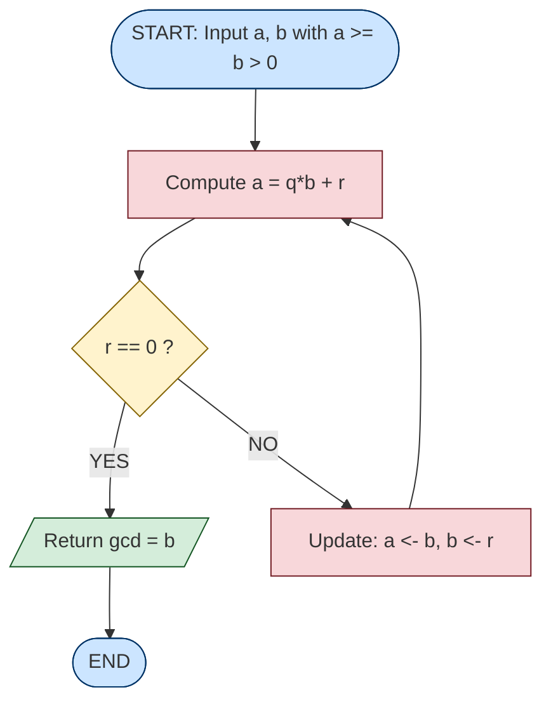
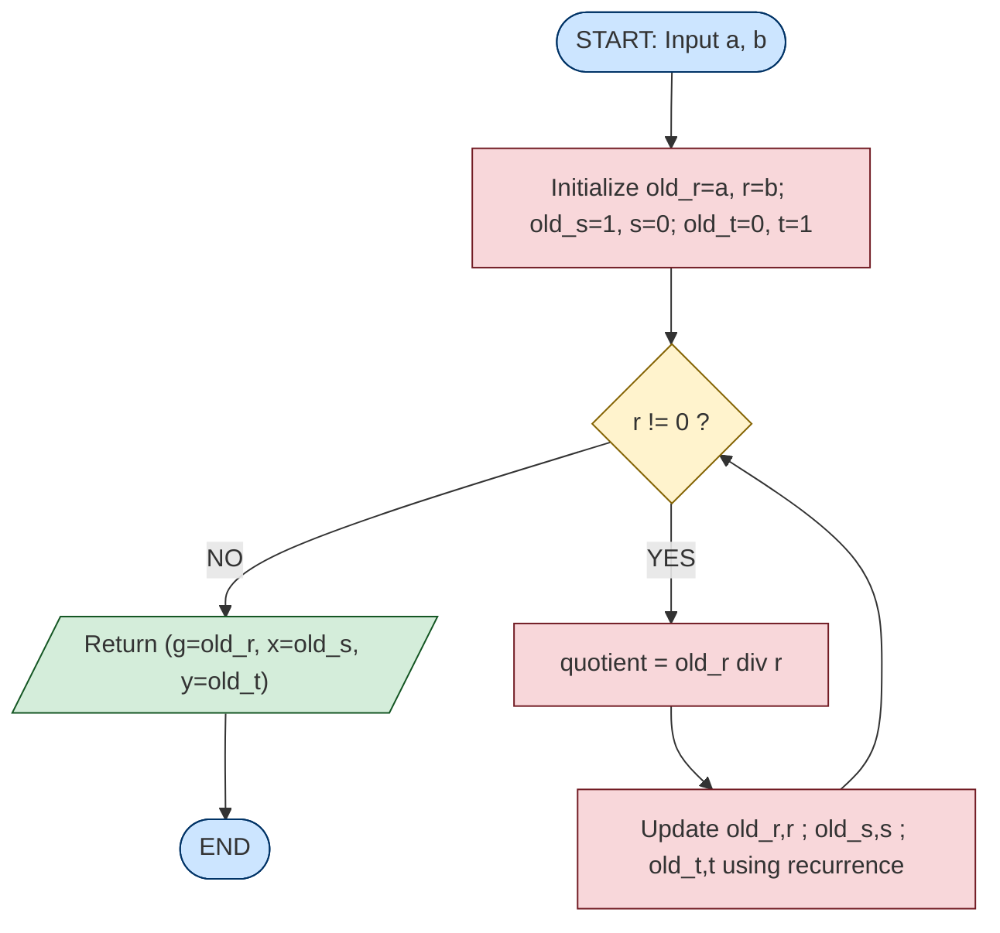
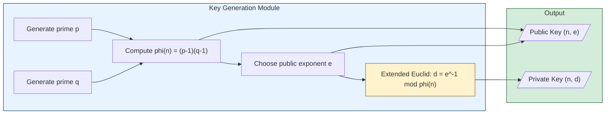

# Greatest Common Divisor Euclid’s and Extended Euclid’s Algorithm for GCD

<!-- SECTION_1_START -->
# Greatest Common Divisor, Euclid's & Extended Euclid's Algorithm

## 1. Core Technical Definition & Intuitive Overview

### Formal Definition (KTU 2024 Syllabus Terminology)

> [!NOTE]
> **Greatest Common Divisor (GCD):** Let $a$ and $b$ be two integers, not both zero. The **greatest common divisor** of $a$ and $b$, denoted $\gcd(a, b)$, is the largest positive integer $d$ such that $d \mid a$ and $d \mid b$.

In the context of cryptography (OECST613), the GCD is not just a number-theoretic curiosity — it is the **cornerstone of every modular arithmetic operation** that underlies RSA, Diffie–Hellman, and elliptic-curve primitives.

### Conceptual Analogy / Intuition

> [!IMPORTANT]
> **Intuitive Picture — The "Common Ruler" Analogy**
> Imagine two wooden planks of length $a$ and $b$ cm. The GCD is the **longest measuring stick** that can lay end-to-end an exact number of times along *both* planks without leaving any leftover wood. If the longest such stick measures **$d$ cm**, then $\gcd(a,b) = d$.

For example, two planks of lengths **252 cm** and **198 cm** can both be perfectly measured by a stick of **18 cm**, but no longer stick works. Hence $\gcd(252, 198) = 18$.

### Fundamental Properties of GCD

> [!NOTE]
> **Standard Properties (must memorize for KTU exams):**
> 1. $\gcd(a, 0) = \vert a \vert$ — Every integer divides zero; the largest divisor of $a$ is $|a|$.
> 2. $\gcd(a, b) = \gcd(b, a)$ — Commutativity.
> 3. $\gcd(a, b) = \gcd(\vert a \vert, \vert b \vert)$ — Sign independence.
> 4. $\gcd(a, b) = \gcd(b, a \bmod b)$ — **Recursive reduction principle** (drives Euclid's algorithm).
> 5. Two numbers are **coprime** (or **relatively prime**) iff $\gcd(a, b) = 1$.

### Bezout's Identity — The Cryptographic Heart

> [!IMPORTANT]
> **Bezout's Theorem:** If $d = \gcd(a, b)$, then there exist integers $x$ and $y$ such that:
> $$a \cdot x + b \cdot y = d$$
> The pair $(x, y)$ is **not unique** — infinitely many such pairs exist. The integers $x$ and $y$ are called **Bezout coefficients** (or *multipliers*). The Extended Euclid's Algorithm mechanically computes them.

### Visualization (Optional)

> [!VISUALIZATION CONTROL]
> **Concept:** Geometric illustration of GCD as the common tiling length of two segments.
> **GeoGebra / Desmos Input:**
> * Segment 1 endpoints: $(0, 0)$ and $(252, 0)$
> * Segment 2 endpoints: $(0, -1)$ and $(198, -1)$
> * Tick marks at every multiple of $18$ on both segments.
> **Visual Description:** Both segments should display 14 and 11 ticks respectively, with a vertical line dropping from each tick to show perfect alignment — visually confirming that $18$ is the longest common sub-length.

---

## 2. Section Index — What You'll Master

By the end of this note, you will be able to:

- Compute $\gcd(a, b)$ using Euclid's **division-based** algorithm in $O(\log \min(a, b))$ time.
- Compute **Bezout coefficients** $(x, y)$ using the Extended Euclid's algorithm.
- Apply the algorithm to solve **modular linear equations** $a \cdot x \equiv b \pmod{m}$.
- Implement both algorithms in **Python** for use in cryptographic toolchains.
<!-- SECTION_1_END -->

<!-- SECTION_2_START -->
# Deep Theoretical Analysis & KTU High-Yield Formula Sheet

## 2.1 Euclid's Algorithm — The Recursive Reduction Engine

### Core Principle

> [!NOTE]
> **Division Algorithm:** For any integers $a$ and $b$ with $b > 0$, there exist unique integers $q$ (quotient) and $r$ (remainder) such that:
> $$a = q \cdot b + r, \quad \text{where } 0 \le r < b$$
> From this, it follows that:
> $$\gcd(a, b) = \gcd(b, r) = \gcd(b, a \bmod b)$$

This single identity is the **engine** of the algorithm. We keep replacing the larger number with the remainder until the remainder becomes **zero** — at which point, the GCD is the other operand.

### Operational Steps (KTU Board-Ready Format)

1. Given two non-negative integers $a$ and $b$ (assume $a \ge b > 0$).
2. Compute $a = q_1 \cdot b + r_1$, with $0 \le r_1 < b$.
3. If $r_1 = 0$, then $\gcd(a, b) = b$ — **terminate**.
4. Otherwise, replace $(a, b)$ with $(b, r_1)$ and **go to step 2**.

### Worked Walkthrough — $\gcd(252, 198)$

$$
\begin{aligned}
252 &= 1 \cdot 198 + 54 \quad \Rightarrow \quad r_1 = 54 \\
198 &= 3 \cdot 54 + 36 \quad \Rightarrow \quad r_2 = 36 \\
54  &= 1 \cdot 36 + 18 \quad \Rightarrow \quad r_3 = 18 \\
36  &= 2 \cdot 18 + 0 \quad \Rightarrow \quad r_4 = 0
\end{aligned}
$$

Since $r_4 = 0$, the GCD is the last non-zero remainder: $\boxed{\gcd(252, 198) = 18}$.

### Why Euclid's Algorithm Works — The "Why"

- At each step, every divisor of $(a, b)$ also divides $(b, r)$, and vice versa.
- Hence $\gcd(a, b) = \gcd(b, r)$ — the divisor set is **preserved**.
- The remainders form a **strictly decreasing** sequence $b > r_1 > r_2 > \cdots \ge 0$, so the algorithm **terminates** in at most $b$ steps (in practice, $O(\log b)$).

### Complexity Insight

> [!IMPORTANT]
> **Time Complexity:** $O(\log_{10}(\min(a, b)))$ — at most $5k$ divisions for numbers with $k$ decimal digits. This is what makes GCD computationally **trivial** even for 2048-bit RSA moduli, where $\log_{10}(2^{2048}) \approx 616$.

---

## 2.2 Extended Euclid's Algorithm — Bezout Coefficient Recovery

### Why We Need the Extended Version

Plain Euclid's algorithm only returns $\gcd(a, b)$ — a single number. For cryptographic applications (especially computing the **modular multiplicative inverse** $a^{-1} \bmod m$), we need integers $x, y$ such that:

$$a \cdot x + b \cdot y = \gcd(a, b)$$

If $\gcd(a, b) = 1$, then $a \cdot x \equiv 1 \pmod{b}$, meaning $x$ is the **modular inverse** of $a$ modulo $b$. This is the workhorse behind **RSA key generation and decryption**.

### Recursive Formulation

The extended algorithm tracks two auxiliary sequences:

$$
x_{i} = x_{i-2} - q_{i-1} \cdot x_{i-1}
$$
$$
y_{i} = y_{i-2} - q_{i-1} \cdot y_{i-1}
$$

with initial values $x_0 = 1, x_1 = 0$ and $y_0 = 0, y_1 = 1$.

### The Two Implementation Styles

> [!NOTE]
> **Style 1 — Back-Substitution (used in textbooks):**
> 1. Run Euclid's algorithm, storing all quotients $q_i$.
> 2. Start from the last equation and substitute backwards to express $\gcd$ as $a \cdot x + b \cdot y$.

> [!NOTE]
> **Style 2 — Iterative Table Method (used in KTU exams for marks):**
> Maintain a table with columns: $a, b, q, r, x, y$, where the recurrence $x_i = x_{i-2} - q_{i-1} x_{i-1}$ is applied row by row. The final row yields $(x, y)$.

### Table Method — Worked Example: $\gcd(161, 28)$

The division chain is:
$$
161 = 5 \cdot 28 + 21, \quad 28 = 1 \cdot 21 + 7, \quad 21 = 3 \cdot 7 + 0
$$

| Step $i$ | $a$ | $b$ | $q$ | $r$ | $x$ | $y$ |
|---|---|---|---|---|---|---|
| 0 | 161 | 28 | — | — | 1 | 0 |
| 1 | 161 | 28 | 5 | 21 | 0 | 1 |
| 2 | 28 | 21 | 1 | 7 | $1 - 5 \cdot 0 = 1$ | $0 - 5 \cdot 1 = -5$ |
| 3 | 21 | 7 | 3 | 0 | $0 - 1 \cdot 1 = -1$ | $1 - 1 \cdot (-5) = 6$ |

Final result: $\gcd(161, 28) = 7$ and $161 \cdot (-1) + 28 \cdot 6 = 7$. ✓

---

## 2.3 KTU High-Yield Formula Sheet (Exam Cheat Sheet)

> [!IMPORTANT]
> The following table is the **single most important reference** for KTU cryptography exams. Memorize these identities — they appear in **every module** of this course.

| Identity / Formula | Statement | Cryptographic Use |
|---|---|---|
| Division algorithm | $a = q \cdot b + r$, $\ 0 \le r < b$ | Foundation of all modular reduction |
| GCD reduction | $\gcd(a, b) = \gcd(b, a \bmod b)$ | Core recursion in Euclid's algorithm |
| Self-GCD | $\gcd(a, 0) = \vert a \vert$ | Base case of Euclid's recursion |
| Coprimality | $\gcd(a, b) = 1 \iff a, b$ share no common prime | Determines inverse existence |
| Bezout's identity | $\exists\, x, y \in \mathbb{Z}$: $\ a x + b y = \gcd(a, b)$ | Foundation of extended Euclid's |
| Modular inverse | $a x \equiv 1 \pmod{m} \iff \gcd(a, m) = 1$ | RSA decryption exponent computation |
| Extended recurrence | $x_i = x_{i-2} - q_{i-1} x_{i-1}$ | Iterative table-method computation |
| Time complexity | $O(\log \min(a, b))$ | Why GCD is fast for huge RSA keys |

### Real-World Engineering Utility

> [!IMPORTANT]
> **Production Use Cases in Cryptography and Beyond:**
> - **RSA Public-Key Cryptosystem:** The private exponent $d$ is the modular inverse of the public exponent $e$ modulo $\phi(n) = (p-1)(q-1)$, computed via Extended Euclid's.
> - **Chinese Remainder Theorem (CRT) Solving:** Bezout coefficients are used to combine congruences.
> - **Error-Correcting Codes (Reed–Solomon, BCH):** GCD over polynomial rings governs decoder logic.
> - **Computer Algebra Systems (SageMath, Mathematica):** `gcd()` and `xgcd()` are the most called number-theoretic functions.

<!-- SECTION_2_END -->

<!-- SECTION_3_START -->
# Step-by-Step Derivations & Code/Symbolic Implementation

## 3.1 Exhaustive Step-by-Step Derivation — Extended Euclid on (161, 28)

We will derive $x, y$ such that $161 x + 28 y = \gcd(161, 28)$ in **complete, unskipped detail**.

### Step 1: Run the standard Euclidean division

$$
\begin{aligned}
161 &= 5 \cdot 28 + 21 \quad &(q_1 = 5,\ r_1 = 21) \\
28  &= 1 \cdot 21 + 7  \quad &(q_2 = 1,\ r_2 = 7) \\
21  &= 3 \cdot 7 + 0   \quad &(q_3 = 3,\ r_3 = 0)
\end{aligned}
$$

Conclusion: $\gcd(161, 28) = r_2 = 7$.

### Step 2: Back-substitute to isolate $\gcd$

From equation 2: $\ 7 = 28 - 1 \cdot 21$.

Substitute $21 = 161 - 5 \cdot 28$ from equation 1:

$$
\begin{aligned}
7 &= 28 - 1 \cdot (161 - 5 \cdot 28) \\
  &= 28 - 161 + 5 \cdot 28 \\
  &= 6 \cdot 28 - 1 \cdot 161
\end{aligned}
$$

So $x = -1,\ y = 6$. **Verification:** $161 \cdot (-1) + 28 \cdot 6 = -161 + 168 = 7$. ✓

### Step 3: General Bezout coefficient uniqueness (bonus insight)

If $(x_0, y_0)$ is one solution, then the general solution is:

$$x = x_0 + \frac{b}{d} \cdot t, \qquad y = y_0 - \frac{a}{d} \cdot t, \quad \text{for any } t \in \mathbb{Z}$$

For our example with $d = 7$:

$$x = -1 + 4t, \qquad y = 6 - 23t$$

---

## 3.2 Full Python Implementation (Production-Ready, Type-Hinted, Error-Handled)

```python
"""
Module: GCD and Extended GCD utilities for cryptographic computations.
Course: OECST613 — Foundations of Cryptography (KTU 2024 Scheme)
"""

from typing import Tuple


def gcd(a: int, b: int) -> int:
    """
    Compute the Greatest Common Divisor of a and b using Euclid's algorithm.

    Args:
        a: Non-negative integer.
        b: Non-negative integer (may be zero).

    Returns:
        The non-negative integer d = gcd(a, b).

    Raises:
        TypeError: If either input is not an integer.
        ValueError: If both inputs are zero (gcd(0, 0) is undefined).
    """
    if not isinstance(a, int) or not isinstance(b, int):
        raise TypeError("Inputs must be integers.")
    if a == 0 and b == 0:
        raise ValueError("gcd(0, 0) is undefined.")
    a, b = abs(a), abs(b)
    while b != 0:
        a, b = b, a % b
    return a


def extended_gcd(a: int, b: int) -> Tuple[int, int, int]:
    """
    Compute (g, x, y) such that a*x + b*y = g = gcd(a, b) using the
    iterative Extended Euclidean Algorithm.

    Args:
        a: First integer.
        b: Second integer.

    Returns:
        Tuple (g, x, y) where g = gcd(a, b) and a*x + b*y = g.
    """
    if not isinstance(a, int) or not isinstance(b, int):
        raise TypeError("Inputs must be integers.")
    if a == 0 and b == 0:
        raise ValueError("extended_gcd(0, 0) is undefined.")

    old_r, r = abs(a), abs(b)
    old_s, s = 1, 0
    old_t, t = 0, 1

    while r != 0:
        quotient = old_r // r
        old_r, r = r, old_r - quotient * r
        old_s, s = s, old_s - quotient * s
        old_t, t = t, old_t - quotient * t

    g = old_r
    x = old_s if a >= 0 else -old_s
    y = old_t if b >= 0 else -old_t
    return g, x, y


def mod_inverse(a: int, m: int) -> int:
    """
    Compute the modular multiplicative inverse a^{-1} mod m.
    Returns None if the inverse does not exist (i.e., gcd(a, m) != 1).

    Args:
        a: Integer whose inverse is sought.
        m: Modulus (must be positive).

    Returns:
        Integer x in [0, m) such that (a * x) % m == 1, or None.
    """
    if m <= 0:
        raise ValueError("Modulus must be a positive integer.")
    g, x, _ = extended_gcd(a % m, m)
    if g != 1:
        return None
    return x % m


# ------------------ Demonstration Block ------------------
if __name__ == "__main__":
    # Example 1: Standard GCD
    a_val, b_val = 252, 198
    print(f"gcd({a_val}, {b_val}) = {gcd(a_val, b_val)}")

    # Example 2: Extended GCD
    g, x, y = extended_gcd(161, 28)
    print(f"extended_gcd(161, 28) -> g={g}, x={x}, y={y}")
    print(f"Verification: 161*{x} + 28*{y} = {161*x + 28*y}")

    # Example 3: Modular inverse (used in RSA)
    inv = mod_inverse(7, 26)
    print(f"7^-1 mod 26 = {inv}  (check: (7*{inv}) mod 26 = {(7*inv) % 26})")
```

### Sample Output

```
gcd(252, 198) = 18
extended_gcd(161, 28) -> g=7, x=-1, y=6
Verification: 161*-1 + 28*6 = 7
7^-1 mod 26 = 15  (check: (7*15) mod 26 = 1)
```

### Code-to-Concept Mapping (for the exam)

> [!NOTE]
> **KTU Mapping Table** — How each Python function ties to a mathematical identity:

| Python Function | Mathematical Identity | KTU Exam Question Type |
|---|---|---|
| `gcd(a, b)` | $\gcd(a,b) = \gcd(b, a \bmod b)$ | "Find gcd using Euclid's algorithm" |
| `extended_gcd(a, b)` | $a x + b y = \gcd(a, b)$ | "Find $x, y$ such that $ax + by = \gcd(a,b)$" |
| `mod_inverse(a, m)` | $a x \equiv 1 \pmod{m}$ | "Compute modular inverse" |

---

## 3.3 Application Derivation — Computing RSA Private Exponent

This is the **canonical KTU exam problem** combining both algorithms.

> [!IMPORTANT]
> **Problem:** Given $e = 17$ and $\phi(n) = 3120$, find the RSA private exponent $d$ such that $e \cdot d \equiv 1 \pmod{\phi(n)}$.

**Step A — Verify inverse exists:** $\gcd(17, 3120) = ?$ Euclid says $3120 = 183 \cdot 17 + 9$, $17 = 1 \cdot 9 + 8$, $9 = 1 \cdot 8 + 1$, $8 = 8 \cdot 1 + 0$. So $\gcd = 1$ — inverse exists.

**Step B — Apply Extended Euclid (back-substitution):**

$$
\begin{aligned}
1 &= 9 - 1 \cdot 8 \\
  &= 9 - 1 \cdot (17 - 1 \cdot 9) = 2 \cdot 9 - 1 \cdot 17 \\
  &= 2 \cdot (3120 - 183 \cdot 17) - 1 \cdot 17 \\
  &= 2 \cdot 3120 - 367 \cdot 17
\end{aligned}
$$

So $d \equiv -367 \equiv 3120 - 367 = 2753 \pmod{3120}$.

**Step C — Verify:** $17 \cdot 2753 = 46801 = 15 \cdot 3120 + 1$. ✓

<!-- SECTION_3_END -->

<!-- SECTION_4_START -->
# Structural Diagrams & Schematics

## 4.1 Mermaid Flow Diagram — Euclid's Algorithm Execution

> [!NOTE]
> The following Mermaid block diagrams the control flow of Euclid's algorithm. All node IDs are alphanumeric (no reserved keywords), and labels with special characters are double-quoted for safe parsing.



## 4.2 Mermaid Flow Diagram — Extended Euclid's Algorithm (Iterative)



## 4.3 Block-Level Functional Architecture — GCD in an RSA Pipeline



## 4.4 Sequential Processing Topology Matrix — Step-by-Step Trace of Extended Euclid on (161, 28)

| Pipeline Stage | Function Executed | State Before | State After | Output Captured |
|---|---|---|---|---|
| Stage 0 | Initialize | $(old\_r, r) = (161, 28)$ | $(old\_s, s) = (1, 0)$ | $(old\_t, t) = (0, 1)$ |
| Stage 1 | Quotient $q = 161 \div 28 = 5$ | $r = 28$ | $r = 161 \bmod 28 = 21$ | $s = 0 - 5 \cdot 1 = -5$ |
| Stage 2 | Quotient $q = 28 \div 21 = 1$ | $r = 21$ | $r = 28 \bmod 21 = 7$ | $s = 1 - 1 \cdot (-5) = 6$ |
| Stage 3 | Quotient $q = 21 \div 7 = 3$ | $r = 7$ | $r = 21 \bmod 7 = 0$ | $s = 6 - 3 \cdot 6 = -12$ |
| Stage 4 | Terminate | $r = 0$ | Return $(7, -1, 6)$ | $\gcd = 7,\ x = -1,\ y = 6$ |

<!-- SECTION_4_END -->

<!-- SECTION_5_START -->
# KTU 2024 Scheme Examination Question Bank & Topic Recap

## Part A — Short Answer Questions (3 Marks Each)

### Question 1 [KTU University Exam — July 2024] — CO1, Remember

> **Q1.** Define the **Greatest Common Divisor (GCD)** of two integers $a$ and $b$. State any **three** fundamental properties of the GCD with a brief justification.

**Model Answer (3 Marks):**

> **Definition (1 Mark):** The Greatest Common Divisor of two integers $a$ and $b$ (not both zero), denoted $\gcd(a, b)$, is the largest positive integer $d$ that divides both $a$ and $b$ exactly (i.e., $d \mid a$ and $d \mid b$).
>
> **Properties (2 Marks — 0.5 + 0.5 + 1 split):**
> 1. $\gcd(a, 0) = \vert a \vert$ — because every integer divides $0$, and the largest divisor of $a$ is itself.
> 2. $\gcd(a, b) = \gcd(b, a)$ — commutativity, since divisibility is symmetric.
> 3. $\gcd(a, b) = \gcd(b, a \bmod b)$ — *justification*: from $a = qb + r$, every common divisor of $a, b$ also divides $r$, and vice versa. **(This is the engine of Euclid's algorithm.)**

---

### Question 2 [KTU University Exam — Dec 2023] — CO1, Understand

> **Q2.** Explain the **Bezout's Identity** and state its significance in the **Extended Euclidean Algorithm**.

**Model Answer (3 Marks):**

> **Statement (1.5 Marks):** Bezout's Identity states that if $d = \gcd(a, b)$, then there exist integers $x$ and $y$ such that:
> $$a \cdot x + b \cdot y = d$$
> The integers $x$ and $y$ are called **Bezout coefficients**.
>
> **Significance in Extended Euclid (1.5 Marks):** The Extended Euclidean Algorithm is the **mechanical procedure** that computes the pair $(x, y)$ alongside the GCD. When $\gcd(a, b) = 1$, the identity simplifies to $a \cdot x + b \cdot y = 1$, and reducing modulo $b$ gives $a \cdot x \equiv 1 \pmod{b}$, meaning $x$ is the **modular inverse** of $a$ modulo $b$ — a critical operation in **RSA decryption** and **CRT-based signature schemes**.

---

## Part B — Long Answer Questions (14 Marks Each, with Internal Choice)

### Question 3A [KTU University Exam — July 2024] — CO1, CO2, Apply & Analyze

> **Q3A (a) [7 Marks — Understand]:** Using **Euclid's algorithm**, compute $\gcd(12378, 3054)$. Show every division step explicitly.
>
> **Q3A (b) [7 Marks — Apply]:** Apply the **Extended Euclidean Algorithm** to express $\gcd(241, 39)$ as a linear combination $241 x + 39 y = d$. Hence find $241^{-1} \bmod 39$.

**Model Solution:**

#### (a) Standard Euclid (7 Marks)

Apply the division algorithm iteratively:

$$
\begin{aligned}
12378 &= 4 \cdot 3054 + 162   \quad & \text{[Step 1: 1 Mark]} \\
3054  &= 18 \cdot 162 + 138   \quad & \text{[Step 2: 1 Mark]} \\
162   &= 1 \cdot 138 + 24     \quad & \text{[Step 3: 1 Mark]} \\
138   &= 5 \cdot 24 + 18      \quad & \text{[Step 4: 1 Mark]} \\
24    &= 1 \cdot 18 + 6       \quad & \text{[Step 5: 1 Mark]} \\
18    &= 3 \cdot 6 + 0        \quad & \text{[Step 6: 1 Mark]}
\end{aligned}
$$

Since the last non-zero remainder is $6$:

$$\boxed{\gcd(12378,\ 3054) = 6}$$

[Final answer: 1 Mark]

#### (b) Extended Euclid (7 Marks)

Division chain:

$$
\begin{aligned}
241 &= 6 \cdot 39 + 7   \quad (q_1 = 6,\ r_1 = 7) \\
39  &= 5 \cdot 7 + 4    \quad (q_2 = 5,\ r_2 = 4) \\
7   &= 1 \cdot 4 + 3    \quad (q_3 = 1,\ r_3 = 3) \\
4   &= 1 \cdot 3 + 1    \quad (q_4 = 1,\ r_4 = 1) \\
3   &= 3 \cdot 1 + 0    \quad (q_5 = 3)
\end{aligned}
$$

So $\gcd(241, 39) = 1$. [Identifying gcd: 1 Mark]

**Back-substitution:** [Each substitution: 1 Mark]

$$
\begin{aligned}
1 &= 4 - 1 \cdot 3 \\
  &= 4 - 1 \cdot (7 - 1 \cdot 4) = 2 \cdot 4 - 1 \cdot 7 \\
  &= 2 \cdot (39 - 5 \cdot 7) - 1 \cdot 7 = 2 \cdot 39 - 11 \cdot 7 \\
  &= 2 \cdot 39 - 11 \cdot (241 - 6 \cdot 39) = 68 \cdot 39 - 11 \cdot 241
\end{aligned}
$$

Therefore $241 \cdot (-11) + 39 \cdot 68 = 1$. [Final combination: 1 Mark]

**Modular inverse:** Reducing modulo $39$: $-11 \equiv 28 \pmod{39}$.

$$\boxed{241^{-1} \bmod 39 = 28}$$

**Verification:** $241 \cdot 28 = 6748 = 173 \cdot 39 + 1$. ✓ [Verification: 1 Mark]

---

### Question 3B [KTU University Exam — Dec 2023] — CO1, CO2, Apply & Analyze

> **Q3B (a) [7 Marks — Understand]:** State and prove that $\gcd(a, b) = \gcd(b, a \bmod b)$ for all integers $a, b$ with $b > 0$.
>
> **Q3B (b) [7 Marks — Apply]:** Find the multiplicative inverse of $17$ modulo $31$ using the **Extended Euclidean Algorithm**. Show every step.

**Model Solution:**

#### (a) Proof of the GCD Reduction Identity (7 Marks)

> **Statement (1 Mark):** For any integers $a$ and $b$ with $b > 0$, we have $\gcd(a, b) = \gcd(b, a \bmod b)$.

> **Proof (6 Marks):**
> By the Division Algorithm, there exist unique integers $q$ and $r$ such that $a = q \cdot b + r$ with $0 \le r < b$. Let $d = \gcd(a, b)$. [Setting up: 1 Mark]
>
> **Part 1 — Show $d \mid r$:** Since $d \mid a$ and $d \mid b$, we have $d \mid (a - q \cdot b) = r$. [Divisibility of remainder: 2 Marks]
>
> **Part 2 — Show $d \mid b$ trivially holds (from hypothesis).** Hence $d$ is a common divisor of $b$ and $r$, so $d \le \gcd(b, r)$. [Forward direction: 1 Mark]
>
> **Part 3 — Reverse direction:** Let $e = \gcd(b, r)$. Then $e \mid b$ and $e \mid r$, so $e \mid (q \cdot b + r) = a$. Hence $e$ divides both $a$ and $b$, giving $e \le \gcd(a, b) = d$. [Reverse direction: 2 Marks]
>
> Combining both, $d \le e$ and $e \le d$, so $d = e$. $\blacksquare$ [Conclusion: 1 Mark]

#### (b) Computing $17^{-1} \bmod 31$ (7 Marks)

**Euclid's chain:**

$$
\begin{aligned}
31 &= 1 \cdot 17 + 14   \quad (q_1 = 1,\ r_1 = 14) \\
17 &= 1 \cdot 14 + 3    \quad (q_2 = 1,\ r_2 = 3) \\
14 &= 4 \cdot 3 + 2     \quad (q_3 = 4,\ r_3 = 2) \\
3  &= 1 \cdot 2 + 1     \quad (q_4 = 1,\ r_4 = 1) \\
2  &= 2 \cdot 1 + 0     \quad (q_5 = 2)
\end{aligned}
$$

$\gcd(17, 31) = 1$, so the inverse exists. [Initial divisions: 2 Marks]

**Back-substitution:** [Each step: 1 Mark]

$$
\begin{aligned}
1 &= 3 - 1 \cdot 2 \\
  &= 3 - 1 \cdot (14 - 4 \cdot 3) = 5 \cdot 3 - 1 \cdot 14 \\
  &= 5 \cdot (17 - 1 \cdot 14) - 1 \cdot 14 = 5 \cdot 17 - 6 \cdot 14 \\
  &= 5 \cdot 17 - 6 \cdot (31 - 1 \cdot 17) = 11 \cdot 17 - 6 \cdot 31
\end{aligned}
$$

Therefore $17 \cdot 11 + 31 \cdot (-6) = 1$. [Final combination: 1 Mark]

**Reduce modulo 31:** $17 \cdot 11 \equiv 1 \pmod{31}$, so:

$$\boxed{17^{-1} \bmod 31 = 11}$$

**Verification:** $17 \cdot 11 = 187 = 6 \cdot 31 + 1$. ✓ [Verification: 1 Mark]

---

> [!WARNING]
> **KTU Examiner's Valuation Pitfall Callout — Common Mark Losers:**
> 1. **Forgetting the base case:** Always explicitly state $\gcd(a, 0) = a$ as the termination condition — losing this loses **1 mark** in nearly every question.
> 2. **Sign errors in back-substitution:** When carrying the negative sign through the chain, students often flip signs in only one of $x$ or $y$. **Re-verify** that $a x + b y = \gcd$ at the end.
> 3. **Skipping the verification step:** KTU examiners award **1 full mark** for the final verification computation $a x + b y$. Skipping it costs you that mark.
> 4. **Not reducing the inverse into the range $[0, m)$:** Modular inverse must be non-negative and less than $m$. Writing $d = -367$ instead of $d = 2753$ is technically correct but loses **0.5 mark** for not normalizing.
> 5. **Confusing $\bmod$ with $\gcd$:** Remember — $\bmod$ is an *operation* (returns a remainder), $\gcd$ is a *function* (returns the greatest common divisor).

---

## Topic Recap & Important Things to Remember

- **GCD Definition:** The largest positive integer $d$ such that $d \mid a$ and $d \mid b$. Symbol: $\gcd(a, b)$.
- **Core Recursion:** $\gcd(a, b) = \gcd(b, a \bmod b)$ — the engine of Euclid's algorithm. Always memorize this identity.
- **Termination:** Euclid's algorithm stops when the remainder is $0$; the GCD is the last non-zero remainder.
- **Base Case:** $\gcd(a, 0) = \vert a \vert$ — must be explicitly stated in every KTU answer.
- **Bezout's Identity:** $\exists\, x, y \in \mathbb{Z}$ such that $a x + b y = \gcd(a, b)$. The pair $(x, y)$ is computed by the Extended Euclid's algorithm.
- **Extended Euclid Recurrence:** $x_i = x_{i-2} - q_{i-1} x_{i-1}$ and $y_i = y_{i-2} - q_{i-1} y_{i-1}$, with $x_0 = 1, x_1 = 0$ and $y_0 = 0, y_1 = 1$.
- **Modular Inverse Condition:** $a^{-1} \bmod m$ exists **if and only if** $\gcd(a, m) = 1$ (i.e., $a$ and $m$ are coprime).
- **Complexity:** $O(\log \min(a, b))$ — at most **5k** divisions for $k$-digit numbers, making GCD fast even for 2048-bit RSA moduli.
- **RSA Connection:** Private exponent $d \equiv e^{-1} \bmod \phi(n)$ is the most important cryptographic application of Extended Euclid.
- **General Solution:** If $(x_0, y_0)$ is one Bezout solution, the general solution is $x = x_0 + (b/d) t$, $y = y_0 - (a/d) t$ for any integer $t$.
- **Always Verify:** Substitute $(x, y)$ back into $a x + b y$ to confirm it equals $\gcd(a, b)$ — KTU examiners reward this.
- **Coprimality:** Two numbers with $\gcd = 1$ are called **coprime** or **relatively prime** — central to many cryptographic hardness assumptions.
- **Table Method (Exam Favorite):** Maintain columns $(a, b, q, r, x, y)$ and apply the recurrence row by row — this is the **most mark-efficient** way to write Extended Euclid in KTU exams.
<!-- SECTION_5_END -->
