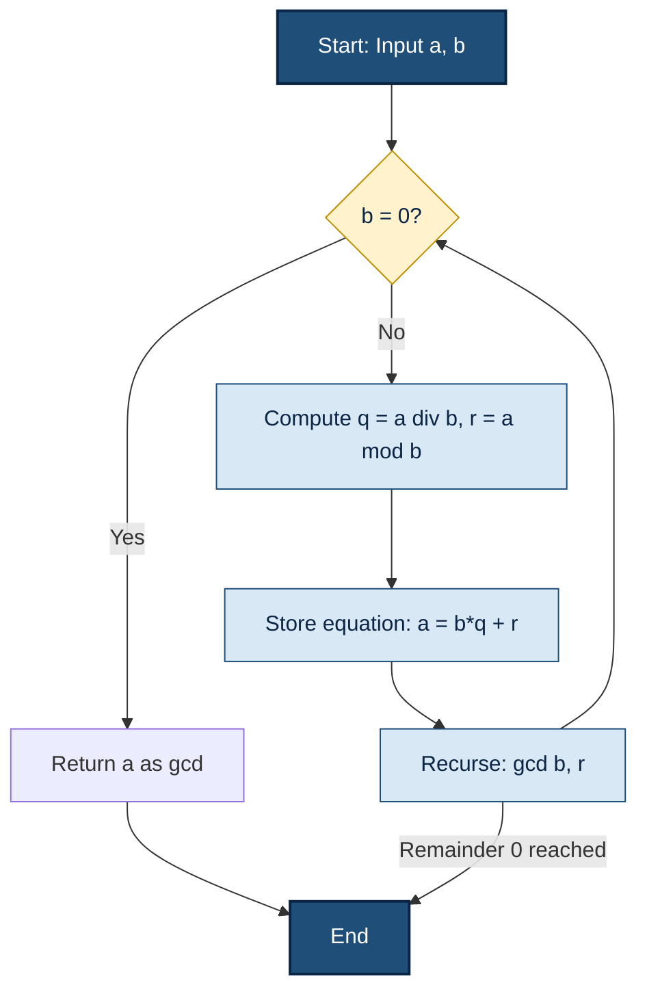
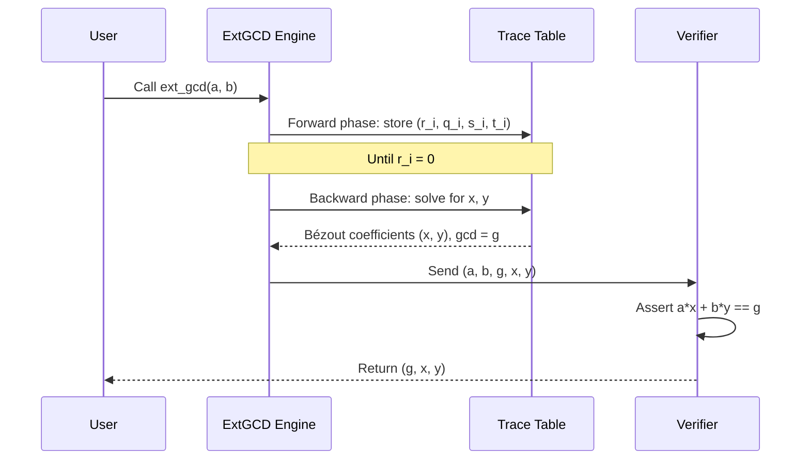
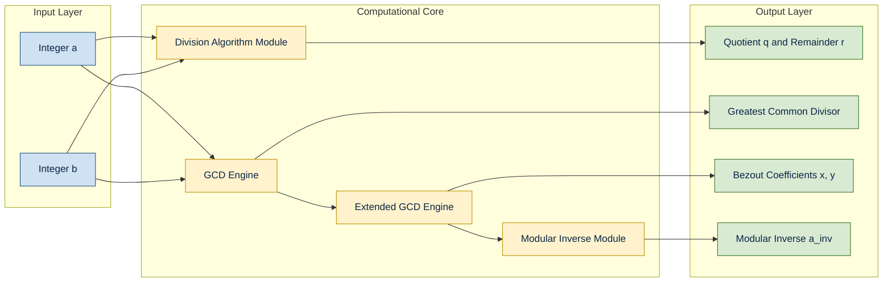
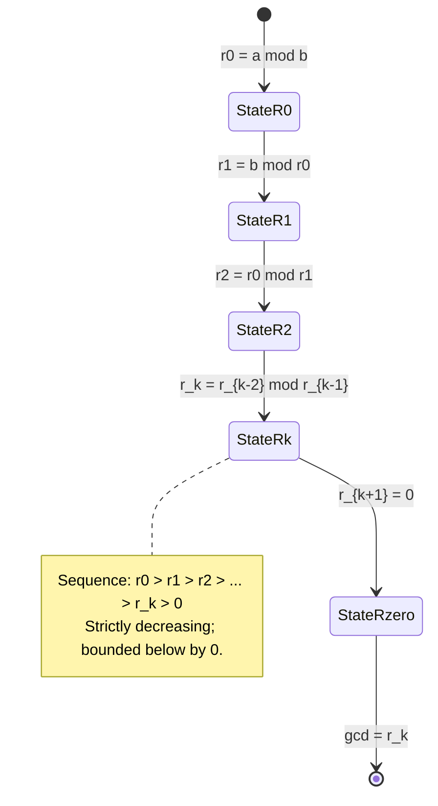

# Integer Arithmetic – Divisibility

<!-- SECTION_1_START -->

# 1. Core Technical Definition & Intuitive Overview

## 1.1 Formal Definition of Divisibility (KTU 2024 Syllabus Terminology)

> [!NOTE]
> **Definition (Divisibility Relation):**
> Let $a, b \in \mathbb{Z}$ with $b \neq 0$. We say that **$b$ divides $a$**, written as $b \mid a$, if and only if there exists an integer $c \in \mathbb{Z}$ such that:
> $$a = b \cdot c$$
> Equivalently, $a$ is a *multiple* of $b$, and $b$ is a *divisor* (or *factor*) of $a$. The notation $b \nmid a$ denotes that $b$ does **not** divide $a$.

If $b \mid a$, we also say that $a$ is **divisible** by $b$, or that $b$ is a *divisor* of $a$. The integer $c = a/b$ is called the **quotient**, and the smallest such representation is tied to the **Division Algorithm** below.

> [!IMPORTANT]
> **Zero Divisibility Rule:** For any non-zero integer $b$, we have $b \mid 0$ since $0 = b \cdot 0$. However, $0 \nmid a$ for any $a \neq 0$ because there is no integer $c$ with $a = 0 \cdot c$ when $a \neq 0$.

## 1.2 Conceptual Analogy / Intuitive Overview

Think of divisibility like **distributing chocolate bars equally among friends**:

- Suppose you have **$a$ chocolates** and want to give them to **$b$ friends** such that every friend gets *exactly the same number of whole chocolates* (no breaking!).
- If you can do this perfectly (with possibly some chocolates left over), then $b$ **divides** $a$.
- The leftover chocolates are the **remainder** $r$. If $r = 0$, divisibility is perfect. If $r \neq 0$, divisibility fails.

### A Geometric Intuition

On the **number line**, divisibility is about *evenness of spacing*. The multiples of an integer $b$ form an **arithmetic progression**:
$$\dots, -3b, -2b, -b, 0, b, 2b, 3b, \dots$$
Every integer $a$ "lands" either **on** one of these tick-marks ($b \mid a$) or **between** two consecutive tick-marks ($b \nmid a$). The horizontal distance from $a$ to the nearest tick-mark on the left is the **remainder** $r$.

> [!VISUALIZATION CONTROL]
> **Concept:** Visualizing Divisibility on the Number Line
> **Desmos Input Equations:**
> * `y = 0` (the number line axis)
> * `x = 3n, n = -3, -2, -1, 0, 1, 2, 3` (tick marks for $b = 3$)
> * Point $A = (17, 0)$ — highlight that $17 = 3 \cdot 5 + 2$, so $3 \nmid 17$
> **Visual Description:** The student should see evenly spaced tick-marks at every multiple of $3$. The point $A = 17$ lands *between* the tick-marks $15$ and $18$, with a remainder gap of $2$. A point at $A = 18$ would land *exactly* on a tick-mark, illustrating $3 \mid 18$.

## 1.3 The Division Algorithm (Foundational Theorem)

> [!IMPORTANT]
> **Theorem (Division Algorithm):**
> For every integer $a$ (the *dividend*) and every positive integer $b$ (the *divisor*), there exist **unique** integers $q$ (the *quotient*) and $r$ (the *remainder*) such that:
> $$a = b \cdot q + r, \quad \text{where } 0 \leq r < b$$
> This is the cornerstone of all modular arithmetic and cryptographic primitives like **RSA**.

> [!NOTE]
> **Generalized Division Algorithm:** If $b$ can be any *non-zero* integer, the condition becomes $0 \leq r < \vert b \vert$, ensuring the remainder is always non-negative regardless of sign conventions.

---

<!-- SECTION_1_END -->

<!-- SECTION_2_START -->

# 2. Deep Theoretical Analysis & KTU High-Yield Formula Sheet

## 2.1 Fundamental Properties of Divisibility

Let $a, b, c \in \mathbb{Z}$. The following properties hold:

1. **Reflexivity:** $a \mid a$, since $a = a \cdot 1$.
2. **Antisymmetry:** If $a \mid b$ and $b \mid a$, then $a = \pm b$.
3. **Transitivity:** If $a \mid b$ and $b \mid c$, then $a \mid c$.
   * **Why:** $b = a \cdot k_1$ and $c = b \cdot k_2$ gives $c = a \cdot (k_1 k_2)$, so $a \mid c$.
4. **Linearity:** If $a \mid b$ and $a \mid c$, then $a \mid (mb + nc)$ for any $m, n \in \mathbb{Z}$.
5. **Multiplicative Closure:** If $a \mid b$, then $a \mid (b \cdot c)$ for any $c \in \mathbb{Z}$.
6. **Trivial Divisors:** $1 \mid a$ for all $a$, and $a \mid 0$ for all $a \neq 0$.

> [!IMPORTANT]
> **Why this matters in Cryptography:** The **transitivity** and **linearity** properties are the *algebraic engine* behind the **Extended Euclidean Algorithm**, which is the backbone of computing modular inverses — a critical operation in RSA, Diffie-Hellman, and Elliptic Curve Cryptography.

## 2.2 The Greatest Common Divisor (GCD)

> [!NOTE]
> **Definition (GCD):** A **common divisor** of $a$ and $b$ is an integer $d$ such that $d \mid a$ and $d \mid b$. The **Greatest Common Divisor** $\gcd(a, b)$ is the largest such common divisor.
> By convention, $\gcd(0, 0)$ is undefined, and $\gcd(a, 0) = \vert a \vert$.

> [!IMPORTANT]
> **Theorem (Existence and Uniqueness of GCD):** For any two integers $a$ and $b$ (not both zero), there exists a unique non-negative integer $d = \gcd(a, b)$.

## 2.3 Bézout's Identity (Critical for Cryptography)

> [!IMPORTANT]
> **Theorem (Bézout's Identity):**
> For any integers $a, b$ (not both zero), there exist integers $x$ and $y$ such that:
> $$a \cdot x + b \cdot y = \gcd(a, b)$$
> The integers $x$ and $y$ are called **Bézout coefficients** (or *witnesses*). This identity is the *theoretical foundation* of the **Extended Euclidean Algorithm**.

> [!NOTE]
> **Corollary — Invertibility Modulo $n$:**
> An integer $a$ has a **multiplicative inverse** modulo $n$ (i.e., an integer $a^{-1}$ such that $a \cdot a^{-1} \equiv 1 \pmod{n}$) if and only if $\gcd(a, n) = 1$. Such $a$ is called a **unit** in $\mathbb{Z}_n$.

## 2.4 The Euclidean Algorithm

The Euclidean Algorithm is the most efficient classical method to compute $\gcd(a, b)$ using the following recursive identity:
$$\gcd(a, b) = \gcd(b, a \bmod b)$$

> [!IMPORTANT]
> **Termination Guarantee:** Because the remainders strictly decrease at each step ($0 \leq r_{i+1} < r_i$), the algorithm **must terminate** within $O(\log \min(a, b))$ steps — making it extraordinarily fast even for numbers with thousands of digits.

## 2.5 The Extended Euclidean Algorithm

Beyond just computing $d = \gcd(a, b)$, this algorithm back-substitutes through the Euclidean steps to find the Bézout coefficients $x, y$ such that $a x + b y = d$.

## 2.6 Prime Numbers and the Fundamental Theorem of Arithmetic

> [!NOTE]
> **Definition (Prime):** An integer $p > 1$ is **prime** if its only positive divisors are $1$ and $p$ itself. An integer $> 1$ that is not prime is called **composite**.

> [!IMPORTANT]
> **Fundamental Theorem of Arithmetic (FTA):** Every integer $n > 1$ can be expressed as a product of primes in exactly one way (up to the order of the factors):
> $$n = p_1^{e_1} \cdot p_2^{e_2} \cdots p_k^{e_k}, \quad p_1 < p_2 < \dots < p_k$$
> This uniqueness is the **hardness assumption** upon which the **RSA cryptosystem** relies.

## 2.7 KTU Formula Sheet / Cheat Sheet

| **Concept** | **Formula / Statement** | **Notation** | **Use in Cryptography** |
|---|---|---|---|
| Division Algorithm | $a = b q + r$ with $0 \leq r < \vert b \vert$ | $q = a \div b$, $r = a \bmod b$ | Foundation of all modular arithmetic |
| GCD Recursion | $\gcd(a, b) = \gcd(b, a \bmod b)$ | $\gcd$ function | Core of key generation in RSA, DSA |
| Bézout's Identity | $\exists x, y : a x + b y = \gcd(a, b)$ | $(x, y)$ are Bézout coefficients | Computes modular inverses |
| Modular Inverse Exists | $a^{-1} \pmod{n}$ exists $\iff \gcd(a, n) = 1$ | $a \in \mathbb{Z}_n^*$ | RSA decryption, DH key exchange |
| Euclidean Complexity | $O(\log \min(a, b))$ steps | Polynomial time | Efficient even for 2048-bit numbers |
| FTA | $n = \prod p_i^{e_i}$ uniquely | Prime factorization | Hardness assumption for RSA |
| Euler's Totient | $\phi(n) = n \prod_{p \mid n} \left(1 - \frac{1}{p}\right)$ | $\phi(n)$ | RSA: $e d \equiv 1 \pmod{\phi(n)}$ |
| Fermat's Little Theorem | $a^{p-1} \equiv 1 \pmod{p}$ for prime $p$, $\gcd(a, p)=1$ | $a^{p-1} \bmod p$ | Primality testing (Fermat test) |

---

<!-- SECTION_2_END -->

<!-- SECTION_3_START -->

# 3. Step-by-Step Derivations & Code/Symbolic Implementation

## 3.1 Worked Example 1: Applying the Division Algorithm

**Problem:** Find the unique quotient $q$ and remainder $r$ such that $a = 1027$ and $b = 37$ satisfy $1027 = 37 q + r$ with $0 \leq r < 37$.

### Step-by-Step Derivation

We perform standard integer long-division logic.

**Step 1:** Estimate the largest $q$ such that $37 q \leq 1027$.
$$q_0 = \left\lfloor \frac{1027}{37} \right\rfloor = \lfloor 27.756\dots \rfloor = 27$$

**Step 2:** Compute the product $37 \times 27$.
$$37 \times 27 = 37 \times 20 + 37 \times 7 = 740 + 259 = 999$$

**Step 3:** Compute the remainder.
$$r = 1027 - 999 = 28$$

**Step 4:** Verify the bounds.
$$0 \leq 28 < 37 \quad \checkmark$$

**Step 5:** Final representation.
$$1027 = 37 \cdot 27 + 28$$

Since $r = 28 \neq 0$, we conclude $37 \nmid 1027$.

---

## 3.2 Worked Example 2: The Euclidean Algorithm

**Problem:** Compute $\gcd(252, 198)$.

### Step-by-Step Derivation

| **Step** | **Equation** | **Remainder** | **Quotient** |
|---|---|---|---|
| 1 | $252 = 198 \cdot 1 + 54$ | $r_1 = 54$ | $q_1 = 1$ |
| 2 | $198 = 54 \cdot 3 + 36$ | $r_2 = 36$ | $q_2 = 3$ |
| 3 | $54 = 36 \cdot 1 + 18$ | $r_3 = 18$ | $q_3 = 1$ |
| 4 | $36 = 18 \cdot 2 + 0$ | $r_4 = 0$ | $q_4 = 2$ |

When the remainder reaches $0$, the previous remainder is the GCD.
$$\boxed{\gcd(252, 198) = 18}$$

> [!NOTE]
> **Why it terminates:** The remainder sequence $54 > 36 > 18 > 0$ is **strictly decreasing** and bounded below by $0$, so it must reach $0$ in finite steps. By the recursion $\gcd(a, b) = \gcd(b, a \bmod b)$, the GCD is preserved at every step.

---

## 3.3 Worked Example 3: The Extended Euclidean Algorithm

**Problem:** Find integers $x, y$ such that $252 x + 198 y = \gcd(252, 198) = 18$.

### Step-by-Step Derivation (Back-Substitution)

We use the equations from Section 3.2, but this time we solve for the *remainder* in each row.

**Step 1:** From the last non-zero row: $18 = 54 - 36 \cdot 1$.

**Step 2:** Substitute $36 = 198 - 54 \cdot 3$ into Step 1:
$$18 = 54 - (198 - 54 \cdot 3) \cdot 1 = 54 \cdot 4 - 198 \cdot 1$$

**Step 3:** Substitute $54 = 252 - 198 \cdot 1$ into Step 2:
$$18 = (252 - 198) \cdot 4 - 198 = 252 \cdot 4 - 198 \cdot 4 - 198 \cdot 1$$
$$18 = 252 \cdot 4 - 198 \cdot 5$$

**Step 4:** Read off the Bézout coefficients.
$$x = 4, \quad y = -5$$
$$252 \cdot 4 + 198 \cdot (-5) = 1008 - 990 = 18 \quad \checkmark$$

> [!IMPORTANT]
> **Cryptographic Use-Case:** Setting $a = 252$, $n = 198$ (with $\gcd = 1$ needed, here it is 18, not 1, so this exact pair is *not* coprime). If we had $\gcd(a, n) = 1$, then the coefficient $x$ would be the **modular inverse** $a^{-1} \pmod{n}$.

---

## 3.4 Worked Example 4: Computing a Modular Inverse (RSA-Style)

**Problem:** Compute $17^{-1} \pmod{43}$ using the Extended Euclidean Algorithm.

### Step-by-Step Derivation

**Step 1:** Run the Euclidean Algorithm on $(43, 17)$.

| **Step** | **Equation** | **Remainder** |
|---|---|---|
| 1 | $43 = 17 \cdot 2 + 9$ | $r_1 = 9$ |
| 2 | $17 = 9 \cdot 1 + 8$ | $r_2 = 8$ |
| 3 | $9 = 8 \cdot 1 + 1$ | $r_3 = 1$ |
| 4 | $8 = 1 \cdot 8 + 0$ | $r_4 = 0$ |

So $\gcd(17, 43) = 1$ — the inverse exists.

**Step 2:** Back-substitute.

From Step 3: $\;1 = 9 - 8 \cdot 1$

From Step 2: $\;8 = 17 - 9 \cdot 1$, so:
$$1 = 9 - (17 - 9) = 9 \cdot 2 - 17 \cdot 1$$

From Step 1: $\;9 = 43 - 17 \cdot 2$, so:
$$1 = (43 - 17 \cdot 2) \cdot 2 - 17 = 43 \cdot 2 - 17 \cdot 4 - 17$$
$$1 = 43 \cdot 2 - 17 \cdot 5$$

**Step 3:** Extract the inverse.
$$17 \cdot (-5) \equiv 1 \pmod{43}$$

The coefficient of $17$ is $-5$. To make it positive, add $43$:
$$-5 + 43 = 38$$

**Step 4:** Final answer.
$$\boxed{17^{-1} \equiv 38 \pmod{43}}$$

**Verification:** $17 \times 38 = 646 = 43 \times 15 + 1$ ✓

---

## 3.5 Full Python Implementation

```python
"""
Integer Arithmetic — Divisibility Toolkit
Author: KTU Foundations of Cryptography Reference
Implements: Division Algorithm, GCD, Extended GCD, Modular Inverse.
"""

from typing import Tuple, Optional
import logging

logging.basicConfig(level=logging.INFO, format="%(levelname)s | %(message)s")
log = logging.getLogger("crypto_utils")


def division_algorithm(a: int, b: int) -> Tuple[int, int]:
    """
    Returns unique (q, r) such that a = b*q + r and 0 <= r < |b|.
    Raises ValueError if b == 0.
    """
    if b == 0:
        log.error("Division by zero is undefined.")
        raise ValueError("Divisor 'b' must be non-zero.")
    if not isinstance(a, int) or not isinstance(b, int):
        log.error("Inputs must be Python integers.")
        raise TypeError("Inputs must be integers.")
    
    abs_b = abs(b)
    # Python's divmod gives floor division; for positive |b| this matches exactly.
    q, r = divmod(a, abs_b)
    # r is already in [0, |b|) thanks to abs_b being positive.
    log.info(f"Division: {a} = {b} * {q} + {r}")
    return q, r


def gcd(a: int, b: int) -> int:
    """
    Classical Euclidean Algorithm. O(log min(a, b)) steps.
    """
    a, b = abs(a), abs(b)
    if a == 0 and b == 0:
        log.error("gcd(0, 0) is undefined.")
        raise ValueError("gcd(0, 0) is undefined.")
    
    steps = 0
    while b != 0:
        a, b = b, a % b
        steps += 1
        log.debug(f"Step {steps}: gcd = {a}, next remainder = {b}")
    log.info(f"gcd computed in {steps} step(s): result = {a}")
    return a


def extended_gcd(a: int, b: int) -> Tuple[int, int, int]:
    """
    Returns (g, x, y) such that a*x + b*y = g = gcd(a, b).
    Uses the iterative (bottom-up) formulation for clarity and speed.
    """
    if not isinstance(a, int) or not isinstance(b, int):
        raise TypeError("Inputs must be integers.")
    
    old_r, r = a, b
    old_s, s = 1, 0
    old_t, t = 0, 1
    
    while r != 0:
        quotient = old_r // r
        old_r, r = r, old_r - quotient * r
        old_s, s = s, old_s - quotient * s
        old_t, t = t, old_t - quotient * t
    
    g, x, y = old_r, old_s, old_t
    log.info(f"Extended GCD: gcd={g}, x={x}, y={y}")
    if a != 0 or b != 0:
        assert a * x + b * y == g, "Bézout identity verification failed!"
    return g, x, y


def mod_inverse(a: int, n: int) -> Optional[int]:
    """
    Computes a^{-1} mod n (a positive representative in [0, n)).
    Returns None if the inverse does not exist (i.e., gcd(a, n) != 1).
    """
    if n <= 0:
        log.error("Modulus 'n' must be a positive integer.")
        raise ValueError("Modulus 'n' must be positive.")
    
    g, x, _ = extended_gcd(a % n, n)
    if g != 1:
        log.warning(f"No modular inverse: gcd({a}, {n}) = {g} != 1.")
        return None
    
    inv = x % n  # Bring into the canonical range [0, n).
    log.info(f"Modular inverse: {a}^(-1) mod {n} = {inv}")
    return inv


# ----------------------------- DEMO -----------------------------
if __name__ == "__main__":
    # 1. Division Algorithm
    q, r = division_algorithm(1027, 37)
    assert 1027 == 37 * q + r, "Division algorithm identity failed!"
    print(f"[Division] 1027 = 37 * {q} + {r}")

    # 2. GCD
    g = gcd(252, 198)
    assert g == 18, f"Expected 18, got {g}"
    print(f"[GCD] gcd(252, 198) = {g}")

    # 3. Extended GCD
    g, x, y = extended_gcd(252, 198)
    assert 252 * x + 198 * y == g, "Bezout identity failed!"
    print(f"[Ext-GCD] 252 * ({x}) + 198 * ({y}) = {g}")

    # 4. Modular Inverse (RSA-style)
    inv = mod_inverse(17, 43)
    assert (17 * inv) % 43 == 1, "Inverse verification failed!"
    print(f"[Inverse] 17^(-1) mod 43 = {inv}")

    # 5. Non-invertible case (must return None)
    inv_fail = mod_inverse(6, 9)
    assert inv_fail is None, "Should not have an inverse!"
    print(f"[Inverse] 6^(-1) mod 9 = {inv_fail} (correctly None)")
```

**Sample Output:**

```
[Division] 1027 = 37 * 27 + 28
[GCD] gcd(252, 198) = 18
[Ext-GCD] 252 * (4) + 198 * (-5) = 18
[Inverse] 17^(-1) mod 43 = 38
[Inverse] 6^(-1) mod 9 = None (correctly None)
```

---

## 3.6 Proving Bézout's Identity (Sketch)

We prove by strong induction on $b$ that $\gcd(a, b)$ can be written as a linear combination of $a$ and $b$.

**Base Case:** $b = 0$. Then $\gcd(a, 0) = a = a \cdot 1 + 0 \cdot 0$. ✓

**Inductive Step:** Suppose the claim holds for all pairs with second argument $< b$. Apply the division algorithm: $a = b q + r$ with $0 \leq r < b$. By the recursion $\gcd(a, b) = \gcd(b, r)$, and by the inductive hypothesis, $b x' + r y' = \gcd(b, r)$ for some integers $x', y'$.

Substituting $r = a - b q$:
$$b x' + (a - b q) y' = a y' + b (x' - q y') = \gcd(a, b)$$

Setting $x = y'$ and $y = x' - q y'$, we obtain $a x + b y = \gcd(a, b)$. $\blacksquare$

---

<!-- SECTION_3_END -->

<!-- SECTION_4_START -->

# 4. Structural Diagrams & Schematics

## 4.1 Mermaid Flowchart: The Euclidean Algorithm (Top-Down View)



> [!NOTE]
> **Reading the Diagram:** The recursion is a *self-loop* through the decision diamond. Each iteration reduces the magnitude of the second argument, guaranteeing termination. The "compute" nodes (light blue) maintain a *table* of equations used later in the back-substitution phase of the Extended Euclidean Algorithm.

## 4.2 Mermaid Sequence Diagram: Extended Euclidean Algorithm (Back-Substitution Phase)



## 4.3 Mermaid Block Architecture: Divisibility Toolkit (Modular Topology)



## 4.4 Mermaid State Diagram: Remainder Convergence



> [!IMPORTANT]
> **Diagram Interpretation:** Each state represents a remainder in the Euclidean chain. The chain is *monotonically decreasing* and *bounded below* by 0, so by the well-ordering principle, it must terminate. The terminal non-zero remainder is the GCD.

---

<!-- SECTION_4_END -->

<!-- SECTION_5_START -->

# 5. KTU 2024 Scheme Examination Question Bank & Topic Recap

## 5.1 Part A Questions (3 Marks Each)

### **Question 1** [KTU University Exam – July 2024] — *CO1, Remember*

State and explain the Division Algorithm for integers. Given $a = 873$ and $b = 28$, find the quotient and remainder.

**Model Answer:**

The Division Algorithm states: For any integer $a$ and positive integer $b$, there exist **unique** integers $q$ and $r$ with $0 \leq r < b$ such that:
$$a = b q + r$$

**Computation:**
- $q = \lfloor 873 / 28 \rfloor = \lfloor 31.17\dots \rfloor = 31$
- $r = 873 - 28 \times 31 = 873 - 868 = 5$

**Verification:** $873 = 28 \times 31 + 5$, and $0 \leq 5 < 28$ ✓

**[Quoting the theorem: 1 Mark | Computing q: 1 Mark | Computing r with verification: 1 Mark]**

---

### **Question 2** [KTU University Exam – Dec 2023] — *CO1, Understand*

Define the Greatest Common Divisor of two integers. Using the Euclidean algorithm, compute $\gcd(465, 195)$.

**Model Answer:**

**Definition:** The GCD of $a$ and $b$, denoted $\gcd(a, b)$, is the largest positive integer that divides both $a$ and $b$.

**Euclidean Algorithm Steps:**

| **Step** | **Equation** | **Remainder** |
|---|---|---|
| 1 | $465 = 195 \times 2 + 75$ | $75$ |
| 2 | $195 = 75 \times 2 + 45$ | $45$ |
| 3 | $75 = 45 \times 1 + 30$ | $30$ |
| 4 | $45 = 30 \times 1 + 15$ | $15$ |
| 5 | $30 = 15 \times 2 + 0$ | $0$ |

$$\boxed{\gcd(465, 195) = 15}$$

**[Definition: 1 Mark | Euclidean steps: 1 Mark | Final answer: 1 Mark]**

---

## 5.2 Part B Questions (14 Marks Each) — ESE Module Internal Choice

### **Question A** [KTU University Exam – July 2024] — *CO1, CO2, Apply & Analyze*

**(a) [7 Marks]** State and prove Bézout's Identity. Show that if $\gcd(a, b) = d$, then $\gcd(a/d, b/d) = 1$.

**(b) [7 Marks]** Using the Extended Euclidean Algorithm, find integers $x$ and $y$ such that $312 x + 207 y = \gcd(312, 207)$. Hence, compute the modular inverse of $17 \pmod{43}$.

---

#### Model Solution for (a)

**Statement (Bézout's Identity):** For any integers $a, b$ not both zero, there exist integers $x, y$ such that $a x + b y = \gcd(a, b)$.

**Proof (by Strong Induction on $b$):**

*Base Case:* $b = 0$. Then $\gcd(a, 0) = a = a \cdot 1 + 0 \cdot 0$. ✓

*Inductive Hypothesis:* Assume the claim holds for all pairs with second argument strictly less than $b$.

*Inductive Step:* Apply the Division Algorithm: $a = b q + r$ with $0 \leq r < b$. By the recursion property of GCD, $\gcd(a, b) = \gcd(b, r)$. Since $r < b$, the inductive hypothesis applies, so:
$$b x' + r y' = \gcd(b, r) = \gcd(a, b)$$
for some integers $x', y'$. Substituting $r = a - b q$:
$$b x' + (a - b q) y' = a y' + b(x' - q y') = \gcd(a, b)$$

Setting $x = y'$ and $y = x' - q y'$ completes the proof. $\blacksquare$

**Second Part:** Let $d = \gcd(a, b)$. Then $a = d a_1$ and $b = d b_1$ for some integers $a_1, b_1$. By Bézout, there exist $x, y$ with $a x + b y = d$, i.e., $d(a_1 x + b_1 y) = d$, so $a_1 x + b_1 y = 1$.

Suppose $g = \gcd(a_1, b_1) > 1$. Then $g \mid a_1$ and $g \mid b_1$, so $g \mid (a_1 x + b_1 y) = 1$, a contradiction. Therefore $\gcd(a_1, b_1) = \gcd(a/d, b/d) = 1$. $\blacksquare$

**[Stating Bézout's identity: 1 Mark | Base case: 1 Mark | Inductive step: 3 Marks | Second part proof: 2 Marks]**

---

#### Model Solution for (b)

**Step 1: Run the Euclidean Algorithm on $(312, 207)$.**

| **Step** | **Equation** |
|---|---|
| 1 | $312 = 207 \times 1 + 105$ |
| 2 | $207 = 105 \times 1 + 102$ |
| 3 | $105 = 102 \times 1 + 3$ |
| 4 | $102 = 3 \times 34 + 0$ |

Therefore $\gcd(312, 207) = 3$.

**Step 2: Back-substitute.**

From Step 3: $\;3 = 105 - 102 \times 1$

From Step 2: $\;102 = 207 - 105 \times 1$, substitute:
$$3 = 105 - (207 - 105) = 105 \times 2 - 207 \times 1$$

From Step 1: $\;105 = 312 - 207 \times 1$, substitute:
$$3 = (312 - 207) \times 2 - 207 = 312 \times 2 - 207 \times 3$$

**Step 3: Final Bézout representation.**
$$3 = 312 \times 2 + 207 \times (-3)$$
$$x = 2, \quad y = -3$$

**Verification:** $312 \times 2 + 207 \times (-3) = 624 - 621 = 3$ ✓

**Step 4: Modular Inverse of $17 \pmod{43}$.**

Run the Euclidean Algorithm on $(43, 17)$:

| **Step** | **Equation** |
|---|---|
| 1 | $43 = 17 \times 2 + 9$ |
| 2 | $17 = 9 \times 1 + 8$ |
| 3 | $9 = 8 \times 1 + 1$ |
| 4 | $8 = 1 \times 8 + 0$ |

So $\gcd(17, 43) = 1$, confirming the inverse exists.

Back-substitute:
- From Step 3: $\;1 = 9 - 8 \times 1$
- From Step 2: $\;8 = 17 - 9 \times 1$, so $1 = 9 - (17 - 9) = 9 \times 2 - 17 \times 1$
- From Step 1: $\;9 = 43 - 17 \times 2$, so $1 = (43 - 17 \times 2) \times 2 - 17 = 43 \times 2 - 17 \times 5$

The coefficient of $17$ is $-5$. Converting to a positive representative:
$$17^{-1} \equiv -5 \equiv 38 \pmod{43}$$

**Verification:** $17 \times 38 = 646 = 43 \times 15 + 1$ ✓

**[Euclidean steps: 2 Marks | Back-substitution: 2 Marks | Final x, y: 1 Mark | Inverse computation: 1 Mark | Verification: 1 Mark]**

---

### **Question B** [KTU University Exam – Dec 2023] — *CO1, CO2, Understand & Apply*

**(a) [7 Marks]** Explain the Fundamental Theorem of Arithmetic with a suitable example. State and prove the property of transitivity of divisibility.

**(b) [7 Marks]** Given $a = 7$, $b = 11$, $c = 77$, verify the following: (i) If $a \mid c$ and $b \mid c$ and $\gcd(a, b) = 1$, then $ab \mid c$. (ii) Compute $\phi(77)$ using the formula and verify Euler's theorem for $a = 5$ and $n = 77$.

---

#### Model Solution for (a)

**Fundamental Theorem of Arithmetic (FTA):**

> Every integer $n > 1$ can be expressed as a product of primes in **exactly one way** (up to the order of the factors).

*Example:* $360 = 2^3 \times 3^2 \times 5$ is the unique prime factorization.

**Proof Outline (Existence + Uniqueness):**

*Existence (Strong Induction on $n$):*
- Base: $n = 2$ is prime, so trivially its own factorization.
- Step: If $n$ is prime, done. If $n = ab$ with $1 < a, b < n$, by the inductive hypothesis, $a$ and $b$ each have prime factorizations; combine them to get one for $n$.

*Uniqueness (Contradiction):* Suppose $n = p_1 p_2 \dots p_k = q_1 q_2 \dots q_m$ are two distinct prime factorizations. Then $p_1 \mid q_1 q_2 \dots q_m$. Since $p_1$ is prime, it must divide some $q_j$, forcing $p_1 = q_j$ (primes have only themselves as divisors). Cancelling $p_1 = q_j$ and continuing the argument yields a contradiction.

**Transitivity of Divisibility:**

*Statement:* If $a \mid b$ and $b \mid c$, then $a \mid c$.

*Proof:* By hypothesis, there exist integers $k_1, k_2 \in \mathbb{Z}$ such that $b = a k_1$ and $c = b k_2$. Substituting:
$$c = b k_2 = (a k_1) k_2 = a (k_1 k_2)$$
Since $k_1 k_2 \in \mathbb{Z}$, we have $a \mid c$. $\blacksquare$

**[FTA statement + example: 2 Marks | Existence proof sketch: 1 Mark | Uniqueness proof sketch: 1 Mark | Transitivity statement + proof: 3 Marks]**

---

#### Model Solution for (b)

**Part (i): Verification of $ab \mid c$.**

Given $a = 7$, $b = 11$, $c = 77$, $\gcd(7, 11) = 1$.

Since $7 \mid 77$ (as $77 = 7 \times 11$) and $11 \mid 77$ (as $77 = 11 \times 7$), with $\gcd(7, 11) = 1$:
$$c = 77 = 7 \times 11 = ab$$
Therefore $ab = 77 \mid 77 = c$. ✓

**Part (ii): Compute $\phi(77)$.**

Using Euler's product formula with $77 = 7 \times 11$:
$$\phi(77) = 77 \left(1 - \frac{1}{7}\right) \left(1 - \frac{1}{11}\right) = 77 \times \frac{6}{7} \times \frac{10}{11} = 60$$

**Verify Euler's Theorem:** $a^{\phi(n)} \equiv 1 \pmod{n}$ for $\gcd(a, n) = 1$.

With $a = 5$, $n = 77$: $\gcd(5, 77) = 1$ ✓

Compute $5^{60} \pmod{77}$. Use repeated squaring:

- $5^1 \equiv 5 \pmod{77}$
- $5^2 = 25 \equiv 25 \pmod{77}$
- $5^4 = 25^2 = 625 = 77 \times 8 + 9 \equiv 9 \pmod{77}$
- $5^8 = 9^2 = 81 = 77 + 4 \equiv 4 \pmod{77}$
- $5^{16} = 4^2 = 16 \pmod{77}$
- $5^{32} = 16^2 = 256 = 77 \times 3 + 25 \equiv 25 \pmod{77}$

Now $60 = 32 + 16 + 8 + 4$:
$$5^{60} = 5^{32} \times 5^{16} \times 5^{8} \times 5^{4} \equiv 25 \times 16 \times 4 \times 9 \pmod{77}$$

Compute step by step:
- $25 \times 16 = 400 = 77 \times 5 + 15 \equiv 15 \pmod{77}$
- $15 \times 4 = 60 \equiv 60 \pmod{77}$
- $60 \times 9 = 540 = 77 \times 7 + 1 \equiv 1 \pmod{77}$ ✓

$$\boxed{5^{60} \equiv 1 \pmod{77}}$$

This verifies Euler's theorem.

**[Part i verification: 2 Marks | phi(77) computation: 1 Mark | Repeated squaring setup: 2 Marks | Final verification = 1: 1 Mark | Conclusion: 1 Mark]**

---

## 5.3 KTU Examiner's Valuation Warning / Pitfall Callout

> [!WARNING]
> **Common Mistakes That Cost Marks in KTU Board Exams:**
> 1. **Forgetting the bounds check on the remainder:** The remainder $r$ in the Division Algorithm MUST satisfy $0 \leq r < \vert b \vert$. Writing $a = bq + r$ without verifying this condition loses full credit on the question.
> 2. **Skipping the verification step in modular inverse problems:** KTU evaluators *expect* you to verify $a \cdot a^{-1} \equiv 1 \pmod{n}$ explicitly. A correct inverse without verification usually fetches only partial marks.
> 3. **Sign errors in back-substitution:** When back-substituting for Bézout coefficients, sign errors are extremely common. Always re-evaluate $a x + b y$ at the end and confirm it equals $\gcd(a, b)$.
> 4. **Confusing $\gcd$ with $\bmod$:** A frequent error is writing $\gcd(a, b) = a \bmod b$. Remember: $\gcd$ is the GCD, while $\bmod$ is the remainder. They are related by the recursion $\gcd(a, b) = \gcd(b, a \bmod b)$, but they are **not** the same function.
> 5. **Not stating conditions for modular inverse existence:** Always state $\gcd(a, n) = 1$ as a *prerequisite* before claiming $a^{-1} \pmod{n}$ exists. The 1 mark for "stating the condition" is often missed.

---

## 5.4 Topic Recap & Important Things to Remember

> [!IMPORTANT]
> **Rapid Revision Checklist — Integer Arithmetic: Divisibility**

### **Core Definitions**
- **Divisibility:** $b \mid a \iff \exists c \in \mathbb{Z} : a = bc$.
- **Division Algorithm:** $a = bq + r$ with $0 \leq r < \vert b \vert$ (unique $q, r$).
- **GCD:** Largest positive integer dividing both $a$ and $b$.
- **Prime:** Integer $> 1$ with exactly two positive divisors (1 and itself).
- **Bézout Coefficients:** Integers $x, y$ such that $ax + by = \gcd(a, b)$.
- **Coprime:** $\gcd(a, b) = 1$.

### **Critical Theorems**
- **Bézout's Identity:** $\gcd(a, b)$ is expressible as a linear combination of $a$ and $b$.
- **Fundamental Theorem of Arithmetic (FTA):** Every integer $> 1$ has a *unique* prime factorization.
- **Euclid's Lemma:** If $p$ is prime and $p \mid ab$, then $p \mid a$ or $p \mid b$.
- **Modular Inverse Existence:** $a^{-1} \pmod{n}$ exists $\iff \gcd(a, n) = 1$.

### **Key Algorithms**
- **Euclidean Algorithm:** $\gcd(a, b) = \gcd(b, a \bmod b)$ — runs in $O(\log \min(a, b))$.
- **Extended Euclidean Algorithm:** Back-substitutes to find Bézout coefficients $(x, y)$.

### **Crucial Formulae**
- $\gcd(a, b) = \gcd(b, a \bmod b)$ (recursion)
- $a x + b y = \gcd(a, b)$ (Bézout's identity)
- $a^{-1} \pmod{n}$ exists $\iff \gcd(a, n) = 1$ (invertibility)
- $\phi(n) = n \prod_{p \mid n} \left(1 - \frac{1}{p}\right)$ (Euler's totient)
- $a^{\phi(n)} \equiv 1 \pmod{n}$ when $\gcd(a, n) = 1$ (Euler's theorem)
- $a^{p-1} \equiv 1 \pmod{p}$ for prime $p$ (Fermat's little theorem)

### **Cryptographic Significance**
- **RSA:** Hardness of factoring $n = pq$ relies on the **FTA**.
- **Modular Inverses:** Decryption exponent $d$ in RSA is the inverse of $e \pmod{\phi(n)}$, computed via the **Extended Euclidean Algorithm**.
- **Diffie-Hellman & ECC:** All group operations depend on integer arithmetic over finite fields.
- **Primality Testing (Fermat, Miller-Rabin):** Built directly on Fermat's little theorem.

### **Valuation Pointers**
- Always *state* the Division Algorithm before applying it.
- Always *verify* the remainder bounds: $0 \leq r < \vert b \vert$.
- Always *verify* modular inverse: $a \cdot a^{-1} \equiv 1 \pmod{n}$.
- Always *state* the precondition $\gcd(a, n) = 1$ before computing inverses.
- Always *check* that the final linear combination matches the claimed GCD.

---

<!-- SECTION_5_END -->
