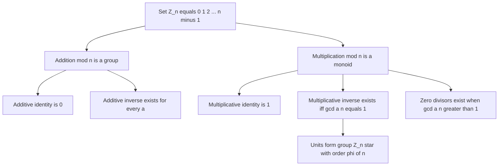
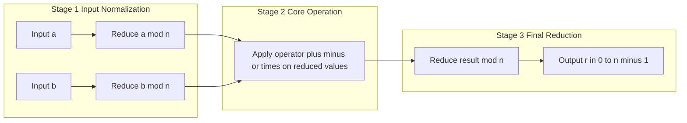
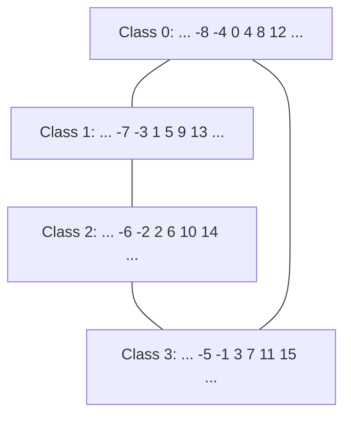

# Modular Arithmetic – Operations, Properties

<!-- SECTION_1_START -->

# Modular Arithmetic – Operations & Properties

## 1.1 Formal Definition (KTU 2024 Syllabus Terminology)

> [!IMPORTANT]
> **Definition — Congruence Relation.**
> Let $a, b \in \mathbb{Z}$ and let $n \in \mathbb{Z}$ with $n > 0$. We say that **$a$ is congruent to $b$ modulo $n$**, written
> $$a \equiv b \pmod{n},$$
> if and only if $n$ divides $(a - b)$, i.e., $(a - b) = k \cdot n$ for some integer $k$. The integer $n$ is called the **modulus** of the congruence.

> [!NOTE]
> **Definition — Modulo Operator.**
> The expression $a \bmod n$ denotes the **unique remainder** $r \in \{0, 1, \dots, n-1\}$ obtained when $a$ is divided by $n$ using the **Euclidean division** $a = qn + r$ where $0 \le r < n$. This remainder is also called the **residue of $a$ modulo $n$**.

> [!IMPORTANT]
> **Definition — Residue Class.**
> The set $\bar{a} = \{a + kn \mid k \in \mathbb{Z}\}$ is the **residue class of $a$ modulo $n$**. The collection of all distinct residue classes forms the quotient ring $\mathbb{Z}_n = \{0, 1, 2, \dots, n-1\}$, which has exactly **$n$ elements**.

## 1.2 Intuitive Overview — The Clock Analogy

Imagine a standard $12$-hour analog clock. If it is $10$ o'clock now and you wait $5$ more hours, the time will not be $15$ (which does not exist on a clock face); it will be $3$ o'clock. You have effectively performed the calculation:

$$(10 + 5) \bmod 12 = 15 \bmod 12 = 3.$$

Modular arithmetic is the arithmetic of **cyclic wrap-around** — numbers that exceed the modulus $n$ "wrap" back to the beginning. Every time you cross $n$, you restart from $0$. This is the precise arithmetic that governs **clock cycles, calendar dates, hash table indexing, AES S-boxes, RSA encryption, and elliptic-curve cryptography**.

> [!TIP]
> **One-line intuition.** Modular arithmetic is just regular integer arithmetic performed on a **ringed track of length $n$** — once you cross the finish line at $n$, you are reset to $0$ and continue running.

## 1.3 Visualization — Cyclic Group Structure of $\mathbb{Z}_n$

> [!VISUALIZATION CONTROL]
> **Concept:** Geometric representation of the cyclic group $(\mathbb{Z}_n, +)$ on the unit circle.
> **GeoGebra / Desmos Input Equations:**
> * `Point(k) = (cos(2π·k/n), sin(2π·k/n))` for $k = 0, 1, 2, \dots, n-1$.
> * For $n = 12$, enter points $P_k = (\cos(30^\circ \cdot k),\, \sin(30^\circ \cdot k))$.
> * Set $n = 5$ for a smaller prime example and label residues $0,1,2,3,4$.
> **Visual Description:** The student should observe $n$ equally spaced points on the unit circle. Adding a constant $m$ corresponds to a **uniform rotation by $2\pi m / n$ radians**, mirroring the hour-hand of a clock. The set $\mathbb{Z}_n$ is therefore a *discrete cyclic structure*, not a line — a key geometric fact exploited in **Diffie–Hellman key exchange** and **DSA signatures**.

---

<!-- SECTION_1_END -->

<!-- SECTION_2_START -->

# Deep Theoretical Analysis & KTU High-Yield Formula Sheet

## 2.1 The Congruence Relation as an Equivalence Relation

The relation "$\equiv \pmod n$" partitions $\mathbb{Z}$ into $n$ disjoint residue classes. It is a formal **equivalence relation** because it satisfies the three axioms:

- **Reflexive:** $\forall a \in \mathbb{Z}, \; a \equiv a \pmod n$ — because $n \mid 0$.
- **Symmetric:** $a \equiv b \pmod n \;\Rightarrow\; b \equiv a \pmod n$ — because $n \mid (a-b) \Rightarrow n \mid (b-a)$.
- **Transitive:** $a \equiv b \pmod n$ and $b \equiv c \pmod n \;\Rightarrow\; a \equiv c \pmod n$ — because $n$ divides the sum of two multiples of $n$.

## 2.2 Algebraic Operations in $\mathbb{Z}_n$

For $a, b \in \mathbb{Z}_n$, two operations are defined:

$$a \oplus b = (a + b) \bmod n, \qquad a \otimes b = (a \cdot b) \bmod n.$$

The tuple $(\mathbb{Z}_n, \oplus, \otimes)$ is a **commutative ring with unity**, meaning it satisfies the following structural properties:

| # | Property | Addition $\oplus$ | Multiplication $\otimes$ |
|---|----------|-------------------|--------------------------|
| 1 | **Closure** | $a \oplus b \in \mathbb{Z}_n$ | $a \otimes b \in \mathbb{Z}_n$ |
| 2 | **Associativity** | $(a \oplus b) \oplus c = a \oplus (b \oplus c)$ | $(a \otimes b) \otimes c = a \otimes (b \otimes c)$ |
| 3 | **Commutativity** | $a \oplus b = b \oplus a$ | $a \otimes b = b \otimes a$ |
| 4 | **Identity** | $0$: $a \oplus 0 = a$ | $1$: $a \otimes 1 = a$ |
| 5 | **Inverse** | Always: $(-a) \oplus a = 0$ | Only if $\gcd(a,n)=1$ |
| 6 | **Distributivity** | $a \otimes (b \oplus c) = (a \otimes b) \oplus (a \otimes c)$ | (multiplication distributes over addition) |

> [!NOTE]
> **Why inverse existence depends on $\gcd$.** An element $a \in \mathbb{Z}_n$ has a multiplicative inverse **iff** $\gcd(a, n) = 1$. Such elements are called **units**; they form the multiplicative group $\mathbb{Z}_n^{\times}$ of order $\varphi(n)$ (Euler's totient). This group is the mathematical backbone of **RSA** (encryption uses $\mathbb{Z}_n^{\times}$).

## 2.3 The Fundamental Reduction Property (High-Yield)

> [!IMPORTANT]
> **Reduction Before Operation.** For any integers $a, b$ and modulus $n > 0$:
> $$\boxed{(a \pm b) \bmod n \;=\; \bigl((a \bmod n) \pm (b \bmod n)\bigr) \bmod n}$$
> $$\boxed{(a \cdot b) \bmod n \;=\; \bigl((a \bmod n) \cdot (b \bmod n)\bigr) \bmod n}$$

This property is the **workhorse of all cryptographic implementations** — it allows computations on numbers with thousands of bits to be performed on small machine words, keeping intermediate values bounded by $n$.

## 2.4 Algebraic Manipulation Rules

Let $a, b, c, d \in \mathbb{Z}$ and $n > 0$. If $a \equiv b \pmod n$ and $c \equiv d \pmod n$, then:

- **Sum rule:** $a + c \equiv b + d \pmod n$.
- **Difference rule:** $a - c \equiv b - d \pmod n$.
- **Product rule:** $a \cdot c \equiv b \cdot d \pmod n$.
- **Power rule:** $a^k \equiv b^k \pmod n$ for all $k \in \mathbb{Z}_{\ge 0}$.
- **Scaling rule:** $k \cdot a \equiv k \cdot b \pmod n$ for any $k \in \mathbb{Z}$.
- **Cancellation rule:** If $\gcd(k, n) = 1$ and $k \cdot a \equiv k \cdot b \pmod n$, then $a \equiv b \pmod n$.

> [!WARNING]
> **Cancellation caveat.** The cancellation rule is **not** valid when $\gcd(k, n) > 1$. For example, $2 \cdot 3 \equiv 2 \cdot 1 \pmod 4$ gives $6 \equiv 2 \pmod 4$, yet $3 \not\equiv 1 \pmod 4$. This trap is heavily tested in KTU valuation.

## 2.5 Real-World Utility in Engineering

| Domain | Application of Modular Arithmetic |
|--------|-----------------------------------|
| **Public-Key Cryptography (RSA)** | Encryption $c = m^e \bmod n$; decryption $m = c^d \bmod n$ |
| **Hash Tables** | Bucket index $h(k) = k \bmod m$ for load balancing |
| **Checksums (CRC, ISBN, Luhn)** | Mod-2, Mod-10, Mod-11 arithmetic for error detection |
| **Computer Clocks & Timers** | 24-hour / 60-minute wrap-around |
| **Random Number Generators (LCG)** | $x_{n+1} = (a x_n + c) \bmod m$ |
| **Network Protocols** | TCP sequence numbers, sliding-window arithmetic |
| **Elliptic Curve Cryptography** | Point addition on curves over $\mathbb{Z}_p$ |

---

<!-- SECTION_2_END -->

<!-- SECTION_3_START -->

# Step-by-Step Derivations, Proofs & Symbolic Implementation

## 3.1 Proof of the Reduction Property (Addition)

> **Theorem.** For all $a, b \in \mathbb{Z}$ and $n > 0$:
> $$(a + b) \bmod n \;=\; \bigl((a \bmod n) + (b \bmod n)\bigr) \bmod n.$$

**Proof.** Write the Euclidean divisions:

$$
\begin{aligned}
a &= q_1 n + r_1, \quad 0 \le r_1 < n, \\
b &= q_2 n + r_2, \quad 0 \le r_2 < n.
\end{aligned}
$$

**Step 1 — Add the two expressions:**

$$
\begin{aligned}
a + b &= (q_1 n + r_1) + (q_2 n + r_2) \\
      &= (q_1 + q_2) n + (r_1 + r_2).
\end{aligned}
$$

**Step 2 — Examine the remainder of $a+b$ when divided by $n$.** The value $r_1 + r_2$ lies in $[0, 2n-2]$. We perform one more Euclidean step on $r_1 + r_2$:

$$
r_1 + r_2 = q_3 n + r_3, \quad 0 \le r_3 < n.
$$

**Step 3 — Substitute back:**

$$
a + b = (q_1 + q_2) n + q_3 n + r_3 = (q_1 + q_2 + q_3) n + r_3.
$$

**Step 4 — Conclude the remainder.** Since $0 \le r_3 < n$, by uniqueness of Euclidean division, $r_3$ is **the** remainder of $a + b$ modulo $n$. But $r_3 = (r_1 + r_2) \bmod n$, hence:

$$
(a + b) \bmod n = \bigl((a \bmod n) + (b \bmod n)\bigr) \bmod n. \qquad \blacksquare
$$

The product-case proof follows identically by replacing the sum with the product and using the distributivity $(q_1 n + r_1)(q_2 n + r_2) = q_1 q_2 n^2 + (q_1 r_2 + q_2 r_1) n + r_1 r_2$.

## 3.2 Worked Numerical Example

**Problem.** Compute $(17 \cdot 23) \bmod 5$ using the **reduction property**.

**Step 1 — Reduce each operand first:**

$$
17 \bmod 5 = 2, \qquad 23 \bmod 5 = 3.
$$

**Step 2 — Multiply the reduced values:**

$$
2 \cdot 3 = 6.
$$

**Step 3 — Reduce the product:**

$$
6 \bmod 5 = 1.
$$

**Step 4 — Verify by direct computation:**

$$
17 \cdot 23 = 391, \qquad 391 \bmod 5 = 1.
$$

Both methods yield $1$, confirming the property. This is exactly the technique used inside every RSA library to keep intermediate values small.

## 3.3 Negative Operands — The "Add n" Trick

A subtle but important case: in $\mathbb{Z}_n$, the residue is always in $[0, n-1]$. For negative $a$:

$$a \bmod n = \bigl(a - n \cdot \lfloor a / n \rfloor\bigr).$$

For example, $-7 \bmod 5$: since $-7 = (-2) \cdot 5 + 3$, we have $-7 \equiv 3 \pmod 5$. Algorithmically, the safe formula is:

$$a \bmod n = \bigl((a \% n) + n\bigr) \% n.$$

## 3.4 Python Implementation (Strict, Typed, Board-Exam Quality)

```python
"""
modular_arithmetic.py
Reference implementation of core modular arithmetic operations and
property verifiers — aligned with KTU OECST613 Module 1 syllabus.
"""

from typing import Final


# ---- Core primitive ---------------------------------------------------------

def mod_reduce(a: int, n: int) -> int:
    """Return a normalized in [0, n-1] that is congruent to a mod n."""
    if n <= 0:
        raise ValueError("Modulus n must be a strictly positive integer.")
    return a % n


# ---- Binary operations in Z_n ----------------------------------------------

def mod_add(a: int, b: int, n: int) -> int:
    """Compute (a + b) mod n using the reduction property."""
    return (mod_reduce(a, n) + mod_reduce(b, n)) % n


def mod_sub(a: int, b: int, n: int) -> int:
    """Compute (a - b) mod n — guarantees a non-negative residue."""
    return (mod_reduce(a, n) - mod_reduce(b, n)) % n


def mod_mul(a: int, b: int, n: int) -> int:
    """Compute (a * b) mod n using the reduction property."""
    return (mod_reduce(a, n) * mod_reduce(b, n)) % n


def mod_pow(base: int, exponent: int, n: int) -> int:
    """Compute base^exponent mod n via square-and-multiply (binary method)."""
    if n <= 0:
        raise ValueError("Modulus n must be strictly positive.")
    if exponent < 0:
        raise ValueError("Exponent must be a non-negative integer.")
    result: int = 1
    base = mod_reduce(base, n)
    e = exponent
    while e > 0:
        if e & 1:
            result = (result * base) % n
        e >>= 1
        base = (base * base) % n
    return result


# ---- Property verifiers (used in unit tests) -------------------------------

def verify_addition_property(a: int, b: int, n: int) -> bool:
    """Asserts (a+b) mod n == ((a mod n) + (b mod n)) mod n."""
    return (a + b) % n == mod_add(a, b, n)


def verify_multiplication_property(a: int, b: int, n: int) -> bool:
    """Asserts (a*b) mod n == ((a mod n) * (b mod n)) mod n."""
    return (a * b) % n == mod_mul(a, b, n)


# ---- Demonstration ----------------------------------------------------------

if __name__ == "__main__":
    # 1) Worked example from §3.2
    print(mod_mul(17, 23, 5))            # -> 1

    # 2) Negative operand normalization
    print(mod_reduce(-7, 5))             # -> 3

    # 3) Modular exponentiation (used in RSA, DH)
    print(mod_pow(7, 560, 561))          # -> 1  (Fermat pseudoprime witness)

    # 4) Property sanity checks
    assert verify_addition_property(1234567, -89, 100) is True
    assert verify_multiplication_property(98765, 4321, 997) is True
    print("All property assertions passed.")
```

> [!TIP]
> The `mod_pow` function above runs in $O(\log e)$ multiplications — a critical speedup when exponents are 2048-bit, as in modern RSA. The naive $b^e$ would produce a number with astronomically many digits.

## 3.5 Derivations for Selected Ring Properties in $\mathbb{Z}_n$

**Commutativity of $\otimes$.** For all $a, b \in \mathbb{Z}_n$:

$$
a \otimes b = (a \cdot b) \bmod n = (b \cdot a) \bmod n = b \otimes a,
$$

because integer multiplication is commutative and reduction is a function.

**Distributivity of $\otimes$ over $\oplus$.** For all $a, b, c \in \mathbb{Z}_n$:

$$
a \otimes (b \oplus c) = a \otimes ((b + c) \bmod n) = (a(b + c)) \bmod n = (ab + ac) \bmod n.
$$

The right-hand side equals $(ab \bmod n + ac \bmod n) \bmod n = (a \otimes b) \oplus (a \otimes c)$ by the reduction property. Hence distributivity holds.

---

<!-- SECTION_3_END -->

<!-- SECTION_4_START -->

# Structural Diagrams & Schematics

## 4.1 Algebraic Structure of $\mathbb{Z}_n$ — Ring Topology

The following diagram visualizes the algebraic structure formed by the operations on $\mathbb{Z}_n$:



## 4.2 Sequential Processing Topology — Modular Reduction Pipeline

The block-level functional flow of an arbitrary modular operation (e.g., $(a \cdot b) \bmod n$) inside a hardware/software pipeline:



## 4.3 Equivalence Class Partition of $\mathbb{Z}$ Modulo $n = 4$

For $n = 4$, the integers $\mathbb{Z}$ are partitioned into four residue classes. The following subgraph makes the **equivalence-relation** structure explicit:



> [!NOTE]
> Each edge above denotes that an element of one class, when added to $1$, maps to the next class — this is exactly the **modular addition operator** acting on the partition. Visualising the ring this way is the standard pedagogical step before introducing **quotient rings** and **cosets** in Module 2.

---

<!-- SECTION_4_END -->

<!-- SECTION_5_START -->

# KTU 2024 Scheme Examination Question Bank & Topic Recap

## Part A — Short Answer Questions (3 Marks Each)

### Question 1. [KTU University Exam – July 2024]
**Define modular arithmetic. State the formal definition of congruence modulo $n$ and illustrate it with a numerical example.** *(CO1, Remember)*

**Model Answer (Board Key):**
- **Definition (1 Mark):** Modular arithmetic is a system of arithmetic where integers "wrap around" upon reaching a fixed value $n$, called the modulus.
- **Formal statement (1 Mark):** For integers $a, b$ and modulus $n > 0$, we write $a \equiv b \pmod n$ iff $n \mid (a - b)$.
- **Illustration (1 Mark):** Example: $17 \equiv 5 \pmod{6}$ because $17 - 5 = 12 = 2 \cdot 6$, so $6 \mid 12$.

---

### Question 2. [KTU University Exam – Dec 2023]
**List any four algebraic properties satisfied by modular addition and multiplication in $\mathbb{Z}_n$.** *(CO1, Understand)*

**Model Answer (Board Key):** Any four of the following — *(1/2 Mark each)*:
1. **Closure:** $a \oplus b, \; a \otimes b \in \mathbb{Z}_n$.
2. **Associativity:** $(a \oplus b) \oplus c = a \oplus (b \oplus c)$.
3. **Commutativity:** $a \oplus b = b \oplus a$.
4. **Existence of identity:** $0$ for addition, $1$ for multiplication.
5. **Existence of inverse:** Every element has an additive inverse; a multiplicative inverse exists iff $\gcd(a,n) = 1$.
6. **Distributivity:** $a \otimes (b \oplus c) = (a \otimes b) \oplus (a \otimes c)$.

---

## Part B — Long Answer Questions (14 Marks Each, Internal Choice)

### Question A. [KTU University Exam – July 2024, Module 1]

**(a)** Explain the **properties of the congruence relation** (reflexive, symmetric, transitive) with proofs. Discuss why these properties imply that congruence is an **equivalence relation**, and state the consequence for partitioning $\mathbb{Z}$ into residue classes. *(7 Marks — CO1, Understand)*

**(b)** Given $a = 127$, $b = 49$, $n = 11$, **verify the modular reduction property for multiplication**, i.e., show that $(a \cdot b) \bmod n = ((a \bmod n) \cdot (b \bmod n)) \bmod n$, by computing both sides explicitly. *(7 Marks — CO1, Apply)*

---

#### Model Solution — (a) [7 Marks]

> **[Definition of congruence: 1 Mark]**
> $a \equiv b \pmod n$ iff $n \mid (a - b)$.

> **[Reflexive proof: 1 Mark]**
> $a - a = 0 = 0 \cdot n$, so $n \mid 0$, hence $a \equiv a \pmod n$.

> **[Symmetric proof: 1 Mark]**
> If $a \equiv b \pmod n$, then $n \mid (a - b)$, so $a - b = kn$ for some $k \in \mathbb{Z}$. Hence $b - a = -kn$, so $n \mid (b - a)$ and $b \equiv a \pmod n$.

> **[Transitive proof: 2 Marks]**
> If $a \equiv b \pmod n$ and $b \equiv c \pmod n$, then $a - b = k_1 n$ and $b - c = k_2 n$. Adding: $a - c = (k_1 + k_2) n$, so $n \mid (a - c)$, hence $a \equiv c \pmod n$.

> **[Equivalence-relation conclusion: 1 Mark]**
> The three properties together establish "$\equiv \pmod n$" as an equivalence relation on $\mathbb{Z}$.

> **[Residue class consequence: 1 Mark]**
> An equivalence relation partitions $\mathbb{Z}$ into disjoint equivalence classes. The class $\bar{a} = \{a + kn \mid k \in \mathbb{Z}\}$ contains exactly those integers leaving the same remainder as $a$ on division by $n$. There are exactly $n$ such classes: $\bar{0}, \bar{1}, \dots, \overline{n-1}$, collectively denoted $\mathbb{Z}_n$.

---

#### Model Solution — (b) [7 Marks]

> **[Stating the property: 1 Mark]**
> We must verify: $(127 \cdot 49) \bmod 11 = \bigl((127 \bmod 11) \cdot (49 \bmod 11)\bigr) \bmod 11$.

> **[Reduce $a$: 1 Mark]**
> $127 = 11 \cdot 11 + 6$, so $127 \bmod 11 = 6$.

> **[Reduce $b$: 1 Mark]**
> $49 = 11 \cdot 4 + 5$, so $49 \bmod 11 = 5$.

> **[LHS — direct computation: 1 Mark]**
> $127 \cdot 49 = 6223$. Now $6223 \div 11 = 565$ remainder $8$ (since $11 \cdot 565 = 6215$, and $6223 - 6215 = 8$). Hence LHS $= 8$.

> **[RHS — reduced computation: 2 Marks]**
> $6 \cdot 5 = 30$. $30 \bmod 11 = 30 - 2 \cdot 11 = 30 - 22 = 8$. Hence RHS $= 8$.

> **[Conclusion: 1 Mark]**
> LHS $= $ RHS $= 8$, confirming the modular reduction property for multiplication.

---

### Question B. [KTU University Exam – Dec 2023, Module 1 — Alternative Choice]

**(a)** Define **modular inverse**. State and justify the **condition for the existence** of a multiplicative inverse in $\mathbb{Z}_n$. Provide one example and one counter-example. *(7 Marks — CO1, Understand)*

**(b)** Using the **Extended Euclidean Algorithm**, find the multiplicative inverse of $17$ modulo $31$. Show every step. *(7 Marks — CO1, Apply)*

---

#### Model Solution — (a) [7 Marks]

> **[Definition: 2 Marks]**
> The multiplicative inverse of $a \in \mathbb{Z}_n$ is an integer $a^{-1} \in \mathbb{Z}_n$ such that $a \cdot a^{-1} \equiv 1 \pmod n$.

> **[Existence condition: 2 Marks]**
> $a^{-1}$ exists in $\mathbb{Z}_n$ **iff** $\gcd(a, n) = 1$ (i.e., $a$ and $n$ are coprime). *Justification:* the equation $a x \equiv 1 \pmod n$ is equivalent to $a x + n y = 1$ for some integers $x, y$. By Bézout's identity, this linear Diophantine equation has a solution iff $\gcd(a, n) \mid 1$, i.e., $\gcd(a, n) = 1$.

> **[Example: 1.5 Marks]**
> In $\mathbb{Z}_9$, the inverse of $2$ is $5$, because $2 \cdot 5 = 10 \equiv 1 \pmod 9$. Note $\gcd(2, 9) = 1$.

> **[Counter-example: 1.5 Marks]**
> In $\mathbb{Z}_6$, the element $2$ has **no** inverse. Checking all residues, $2 \cdot 0 = 0$, $2 \cdot 1 = 2$, $2 \cdot 2 = 4$, $2 \cdot 3 = 0$, $2 \cdot 4 = 2$, $2 \cdot 5 = 4$ — none equal $1 \pmod 6$. Note $\gcd(2, 6) = 2 \neq 1$.

---

#### Model Solution — (b) [7 Marks]

> **[Stating the algorithm goal: 1 Mark]**
> Find $x$ such that $17 x \equiv 1 \pmod{31}$, i.e., $17 x + 31 y = 1$ for some $y$.

> **[Apply Euclidean Algorithm: 2 Marks]**
>
> $$31 = 1 \cdot 17 + 14$$
> $$17 = 1 \cdot 14 + 3$$
> $$14 = 4 \cdot 3 + 2$$
> $$3 = 1 \cdot 2 + 1$$
> $$2 = 2 \cdot 1 + 0$$
>
> Therefore $\gcd(17, 31) = 1$, confirming invertibility.

> **[Back-substitute: 3 Marks]**
>
> $$1 = 3 - 1 \cdot 2$$
> $$= 3 - 1 \cdot (14 - 4 \cdot 3) = 5 \cdot 3 - 1 \cdot 14$$
> $$= 5 \cdot (17 - 1 \cdot 14) - 1 \cdot 14 = 5 \cdot 17 - 6 \cdot 14$$
> $$= 5 \cdot 17 - 6 \cdot (31 - 1 \cdot 17) = 11 \cdot 17 - 6 \cdot 31.$$

> **[Extract inverse: 1 Mark]**
> From $11 \cdot 17 - 6 \cdot 31 = 1$, we have $11 \cdot 17 \equiv 1 \pmod{31}$. Hence $17^{-1} \equiv 11 \pmod{31}$.

> **[Verification: 1 Mark — Optional but recommended]**
> $17 \cdot 11 = 187 = 6 \cdot 31 + 1$, so $187 \bmod 31 = 1$. $\checkmark$

> [!WARNING]
> **KTU Examiner's Valuation Warning — Common Pitfalls:**
> 1. **Confusing the two "mod" usages.** "$a \bmod n$" (a binary operator returning a remainder) and "$a \equiv b \pmod n$" (a congruence relation between two numbers) are **not** the same. Writing "$a = b \pmod n$" instead of "$a \equiv b$" is a recurring 1-mark deduction.
> 2. **Forgetting the additive-n correction for negative operands.** The expression `a % n` in Python is already non-negative for positive $n$, but in C/C++ the result inherits the sign of $a$. Always normalize: $r = ((a \% n) + n) \% n$.
> 3. **Assuming all elements have multiplicative inverses.** Without checking $\gcd(a, n) = 1$, the inverse may not exist. KTU examiners deduct full marks if the coprimality test is skipped.
> 4. **Skipping intermediate reduction steps.** Writing $a \otimes b$ as just $a \cdot b$ without applying the reduction property loses the 1 mark reserved for "stating the property explicitly".
> 5. **Dropping units or modulus in the final answer.** The answer $11$ alone is incomplete; the correct boxed form is $17^{-1} \equiv 11 \pmod{31}$.

---

## Topic Recap & Important Things to Remember

- **Congruence** is an equivalence relation (reflexive, symmetric, transitive) — the three proofs are *high-yield* and appear almost every semester.
- **Definition:** $a \equiv b \pmod n \iff n \mid (a-b)$.
- **Reduction Property (workhorse):**
  $(a \pm b) \bmod n = ((a \bmod n) \pm (b \bmod n)) \bmod n$.
  $(a \cdot b) \bmod n = ((a \bmod n) \cdot (b \bmod n)) \bmod n$.
- **$\mathbb{Z}_n$ is a commutative ring with identity**, not a field, because some elements lack multiplicative inverses.
- **Multiplicative inverse of $a$ exists in $\mathbb{Z}_n$ iff $\gcd(a, n) = 1$** — this is Bézout's identity in action.
- **Cancellation rule** is valid **only** when $\gcd(k, n) = 1$. Always verify before cancelling.
- **Negative-operand normalization:** use $((a \% n) + n) \% n$ to guarantee a residue in $[0, n-1]$.
- **Power reduction:** $a^k \bmod n$ is computed via **square-and-multiply** in $O(\log k)$ time — never compute $a^k$ first.
- **Operation precedence** matters: $(a + b \bmod n)$ is parsed as $(a + (b \bmod n))$, not $((a+b) \bmod n)$. Parenthesize explicitly in solutions.
- **Cryptographic relevance:** RSA, Diffie–Hellman, DSA, and ECC all rely on the **reduction property** and **modular inverses in $\mathbb{Z}_n^{\times}$** — Module 2 will build on these foundations directly.
- **Units of $\mathbb{Z}_n$:** the count is $\varphi(n)$ (Euler's totient); for a prime $p$, $\varphi(p) = p - 1$, making $\mathbb{Z}_p$ a *field* — a key fact in DH and ECC.

<!-- SECTION_5_END -->
