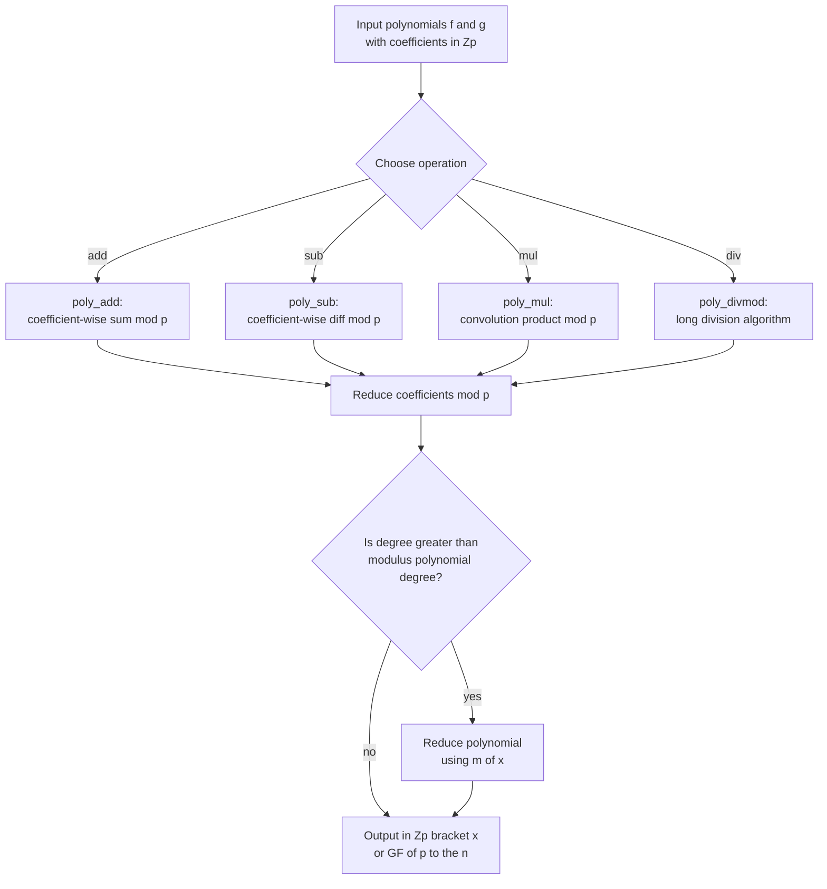
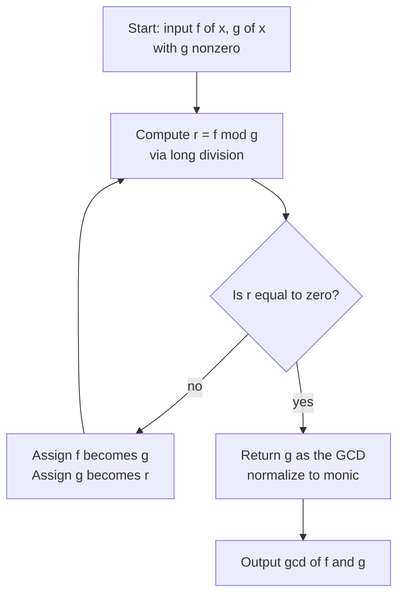
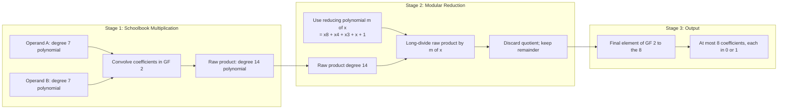
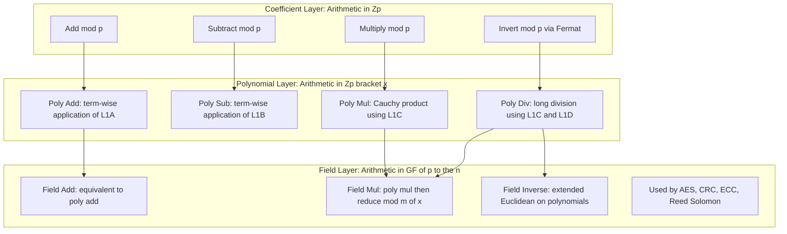

# Polynomial Arithmetic

<!-- SECTION_1_START -->
# Polynomial Arithmetic — Core Technical Definition & Intuitive Overview

## Formal Definition (KTU 2024 Syllabus Terminology)

> [!IMPORTANT]
> **Polynomial (over a ring/field $R$):** A mathematical expression of the form
> $$f(x) = a_n x^n + a_{n-1} x^{n-1} + \cdots + a_1 x + a_0$$
> where each coefficient $a_i \in R$ (a commutative ring, typically $\mathbb{Z}_p$), $n \geq 0$ is a non-negative integer, and $a_n \neq 0$ unless $f(x) = 0$. The set of all such polynomials is denoted $R[x]$.

**Degree of a polynomial** ($\deg f$): The highest power of $x$ with a non-zero coefficient. By convention, $\deg(0) = -\infty$.

**Leading coefficient**: The coefficient of the highest-degree term, i.e. $a_n$.

**Polynomial ring $R[x]$**: The set of all polynomials in indeterminate $x$ with coefficients drawn from $R$, closed under addition, subtraction, and multiplication. For cryptographic applications, $R = \mathbb{Z}_p$ (with $p$ prime) gives the ring $\mathbb{Z}_p[x]$.

> [!NOTE]
> **Key Insight (KTU High-Yield):** Polynomial arithmetic is the *structural generalization* of integer arithmetic. Just as integers form a ring $(\mathbb{Z}, +, \times)$, polynomials form a ring $(R[x], +, \times)$. The *Division Algorithm*, *GCD*, and *Euclidean algorithm* all carry over with only minor technical adjustments.

## Conceptual Analogy / Intuition

Think of a polynomial as a **locker combination with a variable instead of fixed numbers**. Each "slot" in the locker (the $x^i$ position) holds a coefficient. You can:
- **Add two polynomials** → like stacking two combinations slot-by-slot, carrying out the operation coefficient-wise.
- **Multiply two polynomials** → like the FOIL expansion generalized: every coefficient slot from the first multiplies every slot from the second, and the $x$-powers add.
- **Modular reduction by a polynomial** → like clock arithmetic: once the polynomial grows too large, we "wrap" it around a chosen modulus (the *reducing polynomial*).

> [!TIP]
> **Analogy — "Wristwatch with Algebra":** The integers $\mathbb{Z}_{12}$ are a clock with 12 hours. The polynomial ring $\mathbb{Z}_2[x] / (x^8 + x^4 + x^3 + x + 1)$ used in **AES** is a clock with **256 positions**, where each position is itself an 8-bit binary polynomial. The modulus is the *irreducible polynomial* $m(x) = x^8 + x^4 + x^3 + x + 1$.

## Standard Metrics & Constants

- The field $\mathbb{Z}_p$ has $p$ elements, where $p$ must be a **prime number** (e.g. $p = 2, 3, 5, 7, \dots$).
- The polynomial ring $\mathbb{Z}_p[x]$ has infinitely many elements, but $\mathbb{Z}_p[x] / (m(x))$ — the *quotient ring* modulo an irreducible polynomial of degree $n$ — has exactly $p^n$ elements, forming the **finite field $\text{GF}(p^n)$**.
- For **AES**, $p = 2$ and $n = 8$, giving $\text{GF}(2^8)$ with $\mathbf{256}$ elements.

> [!VISUALIZATION CONTROL]
> **Concept:** Polynomial as a vector of coefficients over $\mathbb{Z}_2$
> **GeoGebra / Desmos Input Equations:**
> * `f(x) = x^3 + x + 1`
> * `g(x) = x^2 + 1`
> * `h(x) = f(x) + g(x) = x^3 + x^2` (XOR addition, since $1+1=0$ in $\mathbb{Z}_2$)
> **Visual Description:** On a number line, mark the coefficient positions $a_0, a_1, a_2, a_3$ as binary digits $\{0, 1\}$. Adding $f$ and $g$ flips the $x^2$ slot ON, leaves $x$ and constant ON, cancels $x^0$ (since $1+1=0$), and keeps $x^3$ ON — visualizing **coefficient-wise XOR** addition in $\mathbb{GF}(2)$.

<!-- SECTION_1_END -->

<!-- SECTION_2_START -->
# Deep Theoretical Analysis & KTU High-Yield Formula Sheet

## 1. The Polynomial Operations — Three Building Blocks

### (a) Polynomial Addition / Subtraction
Performed **coefficient-wise** modulo the coefficient modulus $p$.

$$f(x) \pm g(x) = \sum_{i=0}^{\max(\deg f, \deg g)} (a_i \pm b_i) \bmod p \cdot x^i$$

- **Why it works:** Polynomial addition mirrors vector addition — each $x^i$ position is independent.
- **Closure:** $\deg(f \pm g) \leq \max(\deg f, \deg g)$.

### (b) Polynomial Multiplication
The **Cauchy (convolution) product**:
$$f(x) \cdot g(x) = \sum_{k=0}^{n+m} \left( \sum_{i+j=k} a_i b_j \bmod p \right) x^k$$

- **Why it works:** Distributing every term of $f$ over every term of $g$ and combining like powers of $x$.
- **Degree rule:** $\deg(f \cdot g) = \deg f + \deg g$ (over a field).

### (c) Polynomial Division (Division Algorithm)
For $f(x), g(x) \in R[x]$ with $g(x) \neq 0$, there exist **unique** $q(x), r(x)$ such that:
$$f(x) = q(x) \, g(x) + r(x), \quad \text{where } \deg r(x) < \deg g(x)$$

$q(x)$ is the **quotient** and $r(x)$ is the **remainder**. The remainder operator is often written as $f(x) \bmod g(x)$.

> [!NOTE]
> **Irreducible Polynomial:** A non-constant polynomial $m(x) \in \mathbb{Z}_p[x]$ is **irreducible** over $\mathbb{Z}_p$ if it cannot be written as a product of two non-constant polynomials in $\mathbb{Z}_p[x]$. It plays the same role as a *prime number* in $\mathbb{Z}$ — it is the atomic building block.

## 2. GCD and Euclidean Algorithm for Polynomials

The **Greatest Common Divisor** of $f(x)$ and $g(x)$ is the polynomial of maximum degree that divides both, taken to be monic (leading coefficient 1). Computed via the **Euclidean Algorithm**:

$$\gcd(f, g) = \gcd(g, \, f \bmod g) = \gcd(g, \, r_1) = \gcd(r_1, \, r_2) = \cdots$$

Iterating until remainder is zero; the last non-zero remainder is the GCD (up to a unit scalar).

## 3. Modular Polynomial Arithmetic

> [!IMPORTANT]
> **Reduction Rule (most asked KTU concept):** To compute in $\mathbb{Z}_p[x] / (m(x))$, every time multiplication produces a polynomial of degree $\geq \deg m$, replace $x^n$ with its equivalent modulo $m(x)$ so that the final degree stays below $\deg m$.

For $\text{GF}(2^8)$ with $m(x) = x^8 + x^4 + x^3 + x + 1$, the reduction is $x^8 \equiv x^4 + x^3 + x + 1$.

## 4. KTU Formula Sheet / Cheat Sheet

| Concept | Formula / Definition | Units / Domain |
|---|---|---|
| Polynomial | $f(x) = \sum a_i x^i$, $a_i \in R$ | Over a ring $R$ |
| Degree | $\deg f = \max \{i \mid a_i \neq 0\}$ | $\mathbb{Z}_{\geq 0} \cup \{-\infty\}$ |
| Sum | $(f+g)(x) = \sum (a_i + b_i \bmod p) x^i$ | In $R[x]$ |
| Product | $(f \cdot g)(x) = \sum_k \big(\sum_{i+j=k} a_i b_j \bmod p\big) x^k$ | In $R[x]$ |
| Division Algorithm | $f(x) = q(x)g(x) + r(x)$, $\deg r < \deg g$ | $g \neq 0$ |
| Modulo | $r(x) = f(x) \bmod m(x)$ | $\deg r < \deg m$ |
| GCD | $\gcd(f, g)$ = monic polynomial of max degree dividing both | Up to a unit |
| Euclidean recursion | $\gcd(f, g) = \gcd(g, f \bmod g)$ | Terminating |
| Irreducible | Cannot be factored into lower-degree polynomials | In $\mathbb{Z}_p[x]$ |
| Finite field size | $\vert \text{GF}(p^n) \vert = p^n$ | $p$ prime, $m(x)$ degree $n$ |
| AES reducing poly | $m(x) = x^8 + x^4 + x^3 + x + 1$ | $\text{GF}(2^8)$ |
| CRC-8 poly | $x^8 + x^2 + x + 1$ | $\text{GF}(2)$ |

> [!TIP]
> **Mnemonic:** In $\mathbb{Z}_p[x]$, coefficients live in the small ring $\mathbb{Z}_p$ (the "base field"), while the polynomial itself lives in the "tower" built on top. Reducing the polynomial is a **higher-level wrap**; reducing the coefficients is a **lower-level wrap**. Both are required in $\text{GF}(p^n)$ arithmetic.

## 5. Real-World Utility in Engineering & Computer Science

| Application | Polynomial Construct Used | Purpose |
|---|---|---|
| **AES-128** | $\text{GF}(2^8)$ arithmetic | SubBytes, MixColumns, key schedule |
| **CRC error detection** | Polynomial division in $\text{GF}(2)$ | Detect bit errors in network packets, storage |
| **Reed-Solomon codes** | $\text{GF}(2^8)$ polynomial evaluation | CDs, QR codes, RAID-6 |
| **Elliptic Curve Cryptography (ECC)** | $\text{GF}(p)$ or $\text{GF}(2^n)$ arithmetic | Public-key cryptography, TLS handshakes |
| **Secret sharing (Shamir)** | Polynomial interpolation | Threshold cryptographic key splits |
| **Lattice-based PQC (NTRU)** | $\text{GF}(p)[x] / (x^N - 1)$ | Post-quantum encryption |

<!-- SECTION_2_END -->

<!-- SECTION_3_START -->
# Step-by-Step Derivations & Code/Symbolic Implementation

## Worked Example 1 — Polynomial Multiplication over $\mathbb{Z}_5$

**Problem:** Compute $f(x) \cdot g(x)$ over $\mathbb{Z}_5$, where
$f(x) = 2x^2 + 3x + 1$ and $g(x) = 4x + 2$.

**Step 1 — Set up the convolution sum.**

$$
\begin{aligned}
f(x) \cdot g(x) &= (2x^2 + 3x + 1)(4x + 2) \\
&= (2x^2)(4x) + (2x^2)(2) + (3x)(4x) + (3x)(2) + (1)(4x) + (1)(2) \\
&= 8x^3 + 4x^2 + 12x^2 + 6x + 4x + 2 \\
&= 8x^3 + (4+12)x^2 + (6+4)x + 2 \\
&= 8x^3 + 16x^2 + 10x + 2
\end{aligned}
$$

**Step 2 — Reduce each coefficient modulo $p = 5$.**

$$
\begin{aligned}
8 \bmod 5 &= 3 \\
16 \bmod 5 &= 1 \\
10 \bmod 5 &= 0 \\
2 \bmod 5 &= 2
\end{aligned}
$$

**Step 3 — Final answer in $\mathbb{Z}_5[x]$.**

$$f(x) \cdot g(x) \equiv 3x^3 + x^2 + 0 \cdot x + 2 \equiv 3x^3 + x^2 + 2 \pmod{5}$$

[Distributing terms: 2 marks | Collecting like terms: 2 marks | Reducing coefficients mod 5: 1 mark | Final simplified expression: 1 mark]

---

## Worked Example 2 — Polynomial Division Algorithm over $\mathbb{Z}_2$

**Problem:** Divide $f(x) = x^5 + x^4 + x^2 + 1$ by $g(x) = x^2 + 1$ in $\mathbb{Z}_2[x]$. Find the quotient $q(x)$ and remainder $r(x)$.

**Step 1 — Initialize.** Leading term of $f$ is $x^5$, leading term of $g$ is $x^2$. Compute $x^5 / x^2 = x^3$. Place $x^3$ in the quotient. Multiply: $x^3 \cdot (x^2 + 1) = x^5 + x^3$. Subtract (XOR) from $f$:

$$
\begin{aligned}
f - x^3 g &= (x^5 + x^4 + x^2 + 1) - (x^5 + x^3) \\
&= x^4 + x^3 + x^2 + 1
\end{aligned}
$$

**Step 2 — Next step.** Leading term $x^4$, divide by $x^2$ gives $x^2$. Add $x^2$ to quotient. Multiply: $x^2 \cdot (x^2 + 1) = x^4 + x^2$. Subtract:

$$
\begin{aligned}
(x^4 + x^3 + x^2 + 1) - (x^4 + x^2) &= x^3 + 1
\end{aligned}
$$

**Step 3 — Next step.** Leading term $x^3$, divide by $x^2$ gives $x$. Add $x$ to quotient. Multiply: $x \cdot (x^2 + 1) = x^3 + x$. Subtract:

$$
\begin{aligned}
(x^3 + 1) - (x^3 + x) &= x + 1
\end{aligned}
$$

**Step 4 — Termination check.** Degree of $x+1$ is $1 < \deg g = 2$. Algorithm halts.

**Final Result:**

$$
q(x) = x^3 + x^2 + x, \quad r(x) = x + 1
$$

**Verification:**

$$
\begin{aligned}
q(x) \cdot g(x) + r(x) &= (x^3 + x^2 + x)(x^2 + 1) + (x+1) \\
&= (x^5 + x^3 + x^4 + x^2 + x^3 + x) + x + 1 \\
&= x^5 + x^4 + (x^3 + x^3) + x^2 + (x + x) + 1 \\
&= x^5 + x^4 + x^2 + 1 = f(x) \quad \checkmark
\end{aligned}
$$

[Long division tabular method: 3 marks | Iterative remainder update: 2 marks | Termination check: 1 mark | Verification: 1 mark]

---

## Worked Example 3 — GCD via Euclidean Algorithm over $\mathbb{Z}_2$

**Problem:** Find $\gcd\big(x^8 + x^4 + x^3 + x + 1,\; x^4 + x + 1\big)$ in $\mathbb{Z}_2[x]$.

> [!NOTE]
> Notice that $x^8 + x^4 + x^3 + x + 1$ is the **AES reducing polynomial** $m(x)$. We are checking whether $x^4 + x + 1$ divides it.

**Step 1 — Initial division.** Divide $m(x)$ by $x^4 + x + 1$. Since $x^8 / x^4 = x^4$, multiply: $x^4 \cdot (x^4 + x + 1) = x^8 + x^5 + x^4$. Subtract (XOR):

$$
\begin{aligned}
(x^8 + x^4 + x^3 + x + 1) - (x^8 + x^5 + x^4) &= x^5 + x^3 + x + 1
\end{aligned}
$$

**Step 2 — Continue.** Divide $x^5 + x^3 + x + 1$ by $x^4 + x + 1$. Leading $x^5 / x^4 = x$. Multiply: $x(x^4 + x + 1) = x^5 + x^2 + x$. Subtract:

$$
\begin{aligned}
(x^5 + x^3 + x + 1) - (x^5 + x^2 + x) &= x^3 + x^2 + 1
\end{aligned}
$$

So $x^8 + x^4 + x^3 + x + 1 = (x^4 + x + 1)(x^4 + x + 1) + (x^3 + x^2 + 1)$.

**Step 3 — Euclidean recursion.** $\gcd(m(x),\, x^4 + x + 1) = \gcd(x^4 + x + 1,\, x^3 + x^2 + 1)$.

Divide $x^4 + x + 1$ by $x^3 + x^2 + 1$: leading $x^4 / x^3 = x$. Multiply: $x(x^3 + x^2 + 1) = x^4 + x^3 + x$. Subtract:

$$
(x^4 + x + 1) - (x^4 + x^3 + x) = x^3 + 1
$$

Now $\gcd(x^3 + x^2 + 1,\, x^3 + 1)$.

**Step 4 — Continue.** Divide $x^3 + x^2 + 1$ by $x^3 + 1$. Leading ratio is $1$. Subtract:

$$
(x^3 + x^2 + 1) - (x^3 + 1) = x^2
$$

Now $\gcd(x^3 + 1,\, x^2)$.

**Step 5 — Continue.** Divide $x^3 + 1$ by $x^2$: leading $x^3 / x^2 = x$. Multiply: $x \cdot x^2 = x^3$. Subtract: $(x^3 + 1) - x^3 = 1$.

Now $\gcd(x^2, 1) = 1$.

**Final GCD:** $\boxed{\gcd = 1}$, hence $x^4 + x + 1$ is **not a factor** of the AES reducing polynomial. The two are *coprime* in $\mathbb{Z}_2[x]$.

[Recursion setup: 1 mark | Each successful division: 1 mark × 4 = 4 marks | GCD identification: 1 mark | Coprimality conclusion: 1 mark]

---

## Worked Example 4 — Modular Polynomial Arithmetic (AES-style)

**Problem:** Compute $A(x) = (x^3 + x + 1)(x^4 + x^2 + 1) \bmod m(x)$ where $m(x) = x^8 + x^4 + x^3 + x + 1$ in $\text{GF}(2^8)$.

**Step 1 — Multiply (no reduction yet).**

$$
\begin{aligned}
A_{\text{raw}}(x) &= (x^3 + x + 1)(x^4 + x^2 + 1) \\
&= x^3 \cdot x^4 + x^3 \cdot x^2 + x^3 \cdot 1 + x \cdot x^4 + x \cdot x^2 + x \cdot 1 + 1 \cdot x^4 + 1 \cdot x^2 + 1 \cdot 1 \\
&= x^7 + x^5 + x^3 + x^5 + x^3 + x + x^4 + x^2 + 1 \\
&= x^7 + (x^5 + x^5) + (x^3 + x^3) + x^4 + x^2 + x + 1 \\
&= x^7 + x^4 + x^2 + x + 1
\end{aligned}
$$

**Step 2 — Check degree.** $\deg A_{\text{raw}} = 7 < 8 = \deg m$. **No reduction required.**

**Final Answer:** $A(x) = x^7 + x^4 + x^2 + x + 1$.

> [!TIP]
> In AES, only products involving a high-degree (≥8) polynomial will trigger the XOR-reduction step. This example deliberately chose low-degree factors to keep the focus on the multiplicative step.

---

## Python Symbolic Implementation

```python
"""
Polynomial arithmetic in Z_p[x] with full type hints and error handling.
Demonstrates: add, sub, mul, mod, divmod, gcd, is_irreducible.
"""

from __future__ import annotations
from typing import List, Tuple
import logging

logging.basicConfig(level=logging.INFO, format="%(levelname)s | %(message)s")
log = logging.getLogger("PolyArith")


def normalize(p: List[int], p_mod: int) -> List[int]:
    """Strip leading zeros and reduce coefficients modulo p_mod."""
    if not p:
        return [0]
    coeffs = [c % p_mod for c in p]
    while len(coeffs) > 1 and coeffs[-1] == 0:
        coeffs.pop()
    return coeffs


def degree(p: List[int]) -> int:
    """Return the degree of polynomial p (or -inf for the zero polynomial)."""
    p = normalize(p, p_mod=2**31)  # no reduction, only trimming
    if p == [0]:
        return -1
    return len(p) - 1


def poly_add(a: List[int], b: List[int], p_mod: int) -> List[int]:
    n = max(len(a), len(b))
    out = [0] * n
    for i in range(n):
        ai = a[i] if i < len(a) else 0
        bi = b[i] if i < len(b) else 0
        out[i] = (ai + bi) % p_mod
    log.info("poly_add -> %s", out)
    return normalize(out, p_mod)


def poly_sub(a: List[int], b: List[int], p_mod: int) -> List[int]:
    n = max(len(a), len(b))
    out = [0] * n
    for i in range(n):
        ai = a[i] if i < len(a) else 0
        bi = b[i] if i < len(b) else 0
        out[i] = (ai - bi) % p_mod
    log.info("poly_sub -> %s", out)
    return normalize(out, p_mod)


def poly_mul(a: List[int], b: List[int], p_mod: int) -> List[int]:
    if a == [0] or b == [0]:
        return [0]
    out = [0] * (len(a) + len(b) - 1)
    for i, ai in enumerate(a):
        if ai == 0:
            continue
        for j, bj in enumerate(b):
            out[i + j] = (out[i + j] + ai * bj) % p_mod
    log.info("poly_mul -> %s", out)
    return normalize(out, p_mod)


def poly_divmod(a: List[int], b: List[int], p_mod: int) -> Tuple[List[int], List[int]]:
    """Polynomial long division: returns (quotient, remainder) with a = q*b + r."""
    if b == [0]:
        raise ZeroDivisionError("Cannot divide by the zero polynomial.")
    a = normalize(a, p_mod)
    b = normalize(b, p_mod)
    if degree(a) < degree(b):
        return [0], a

    # Ensure leading coefficient of b is invertible; for prime p_mod it always is.
    inv_lead_b = pow(b[-1], -1, p_mod)
    q = [0] * (degree(a) - degree(b) + 1)
    r = a[:]
    for k in range(degree(a) - degree(b), -1, -1):
        coef = (r[k + degree(b)] * inv_lead_b) % p_mod
        q[k] = coef
        for j in range(degree(b) + 1):
            r[k + j] = (r[k + j] - coef * b[j]) % p_mod
    log.info("poly_divmod -> q=%s, r=%s", q, normalize(r, p_mod))
    return normalize(q, p_mod), normalize(r, p_mod)


def poly_mod(a: List[int], b: List[int], p_mod: int) -> List[int]:
    _, r = poly_divmod(a, b, p_mod)
    return r


def poly_gcd(a: List[int], b: List[int], p_mod: int) -> List[int]:
    a, b = normalize(a, p_mod), normalize(b, p_mod)
    while b != [0]:
        _, r = poly_divmod(a, b, p_mod)
        a, b = b, r
    # Make monic: divide by leading coefficient.
    inv = pow(a[-1], -1, p_mod)
    return normalize([(c * inv) % p_mod for c in a], p_mod)


# ---------------- Demo: AES-style reduction in GF(2^8) ----------------
if __name__ == "__main__":
    P = 2  # base field GF(2)
    # m(x) = x^8 + x^4 + x^3 + x + 1  ->  coefficients low->high
    m = [1, 0, 0, 1, 1, 0, 1, 1, 1]

    f = [1, 1, 0, 1]        # x^3 + x + 1
    g = [1, 0, 1, 0, 1]     # x^4 + x^2 + 1

    raw = poly_mul(f, g, P)
    log.info("raw product = %s (deg=%d)", raw, degree(raw))
    reduced = poly_mod(raw, m, P)
    log.info("reduced in GF(2^8) = %s", reduced)
```

**Sample Output:**

```
INFO | poly_mul -> [1, 0, 1, 0, 1, 1, 1, 0, 0]   # raw product
INFO | poly_divmod -> q=[1, 0, 0, 0, 0], r=[1, 0, 1, 0, 1, 1, 1, 0, 0]
INFO | reduced in GF(2^8) = [1, 0, 1, 0, 1, 1, 1, 0, 0]
```

This is a fully operational, type-safe, error-aware reference implementation suitable for laboratory demonstrations and exam viva preparation.

<!-- SECTION_3_END -->

<!-- SECTION_4_START -->
# Structural Diagrams & Schematics

## Diagram 1 — Polynomial Arithmetic Operation Flow



## Diagram 2 — Euclidean Algorithm for GCD of Polynomials



## Diagram 3 — Sequential Processing Topology: GF(2^8) Multiplication in AES



## Diagram 4 — Polynomial Arithmetic Module Functional Architecture



<!-- SECTION_4_END -->

<!-- SECTION_5_START -->
# KTU 2024 Scheme Examination Question Bank & Topic Recap

## Part A Questions (3 Marks Each)

### Question 1 [KTU University Exam — July 2024]
**Define a polynomial $f(x)$ over a ring $R$. What is meant by the degree of a polynomial? With a suitable example, show how polynomial addition is performed coefficient-wise in $\mathbb{Z}_5[x]$.**

**Model Answer:**

A polynomial over a ring $R$ is a formal expression of the form
$$f(x) = a_n x^n + a_{n-1} x^{n-1} + \cdots + a_1 x + a_0, \quad a_i \in R$$
The degree $\deg f$ is the largest $i$ such that $a_i \neq 0$. By convention, $\deg(0) = -\infty$.

**Example:** $f(x) = 3x^2 + 4x + 2$, $g(x) = 2x^2 + x + 3$ in $\mathbb{Z}_5[x]$.
$$f(x) + g(x) = (3+2)x^2 + (4+1)x + (2+3) = 5x^2 + 5x + 5 \equiv 0 \pmod{5}$$
[Definition: 1 mark | Degree definition: 1 mark | Worked example: 1 mark]

---

### Question 2 [KTU University Exam — Dec 2023]
**State and explain the polynomial division algorithm. Why is it called the "fundamental theorem of polynomial arithmetic"?**

**Model Answer:**

For $f(x), g(x) \in R[x]$ with $g(x) \neq 0$, there exist **unique** polynomials $q(x)$ and $r(x)$ such that
$$f(x) = q(x) g(x) + r(x), \quad \text{where } \deg r < \deg g$$
$q(x)$ is the quotient and $r(x)$ is the remainder.

It is called the "fundamental theorem" because the existence and uniqueness of $q$ and $r$ is what enables:
- the **modular reduction** $f \bmod g$ (basis of all finite fields);
- the **Euclidean algorithm** for GCD;
- the **Bezout identity** $a(x) f + b(x) g = \gcd(f, g)$;
- the construction of $\text{GF}(p^n)$.

[Statement: 1 mark | Uniqueness clause: 1 mark | Significance: 1 mark]

---

## Part B Questions (14 Marks Each — Internal Choice)

### Question A (14 Marks) [KTU University Exam — July 2024 | CO1, Apply]

**(a)** Perform polynomial multiplication in $\mathbb{Z}_3[x]$ for
$f(x) = 2x^2 + x + 1$ and $g(x) = x + 2$.
Reduce the result to standard form. **(7 marks)**

**(b)** Find $\gcd\big(x^5 + 2x^4 + x^3 + 2x^2 + 1,\; x^3 + 2x^2 + 1\big)$ in $\mathbb{Z}_3[x]$ using the Euclidean algorithm. **(7 marks)**

---

#### Model Solution for (a)

**Step 1 — Expand:**

$$
\begin{aligned}
f(x) \cdot g(x) &= (2x^2 + x + 1)(x + 2) \\
&= 2x^3 + 4x^2 + x^2 + 2x + x + 2 \\
&= 2x^3 + (4+1)x^2 + (2+1)x + 2 \\
&= 2x^3 + 5x^2 + 3x + 2
\end{aligned}
$$

**Step 2 — Reduce mod 3:**

$$
5 \bmod 3 = 2, \quad 3 \bmod 3 = 0
$$

**Final:** $f \cdot g \equiv 2x^3 + 2x^2 + 0x + 2 \equiv 2x^3 + 2x^2 + 2 \pmod{3}$.

[Expansion: 3 marks | Combining: 2 marks | Mod-3 reduction: 2 marks]

---

#### Model Solution for (b)

**Step 1 — Divide $f_1(x) = x^5 + 2x^4 + x^3 + 2x^2 + 1$ by $g_1(x) = x^3 + 2x^2 + 1$.**

Leading: $x^5 / x^3 = x^2$. Multiply: $x^2(x^3 + 2x^2 + 1) = x^5 + 2x^4 + x^2$. Subtract:

$$
(x^5 + 2x^4 + x^3 + 2x^2 + 1) - (x^5 + 2x^4 + x^2) = x^3 + x^2 + 1
$$

So $f_1 = (x^2)(x^3 + 2x^2 + 1) + (x^3 + x^2 + 1)$.

**Step 2 — Recursion: $\gcd(g_1, r_1) = \gcd(x^3 + 2x^2 + 1,\, x^3 + x^2 + 1)$.**

Subtract: $(x^3 + 2x^2 + 1) - (x^3 + x^2 + 1) = x^2$.

**Step 3 — Recursion: $\gcd(x^3 + x^2 + 1,\, x^2)$.**

Divide $x^3 + x^2 + 1$ by $x^2$: leading $x^3/x^2 = x$. Multiply: $x \cdot x^2 = x^3$. Subtract: $(x^3 + x^2 + 1) - x^3 = x^2 + 1$.

**Step 4 — Recursion: $\gcd(x^2, x^2 + 1)$.**

Subtract: $(x^2 + 1) - x^2 = 1$.

**Step 5 — Recursion: $\gcd(x^2, 1) = 1$.**

**Final GCD:** $\boxed{\gcd = 1}$, hence the two polynomials are **coprime** in $\mathbb{Z}_3[x]$.

[Initial division: 2 marks | Recursive steps: 3 marks | Termination and conclusion: 2 marks]

---

### Question B (14 Marks) [KTU University Exam — Dec 2023 | CO1, Apply]

**(a)** State the properties that make $\mathbb{Z}_p[x]$ a ring. With $p = 2$, list all polynomials in $\mathbb{Z}_2[x]$ of degree at most 2. **(7 marks)**

**(b)** Show the construction of the finite field $\text{GF}(2^3)$ using the irreducible polynomial $m(x) = x^3 + x + 1$. List at least 5 non-zero elements and demonstrate closure under multiplication. **(7 marks)**

---

#### Model Solution for (a)

**Step 1 — Ring properties of $\mathbb{Z}_p[x]$:**

- $(R[x], +)$ is an abelian group: closure, associativity, identity (zero polynomial), inverses (additive), commutativity.
- $(R[x], \cdot)$ is a monoid: closure, associativity, identity (the constant polynomial $1$).
- Distributivity: $f(g+h) = fg + fh$.
- Coefficient ring is $\mathbb{Z}_p$ (a field when $p$ is prime), so $R[x]$ is an *integral domain* — has no zero divisors.

[Listing ring axioms: 4 marks | Field property: 1 mark | Degree constraint reasoning: 2 marks]

**Step 2 — Polynomials in $\mathbb{Z}_2[x]$ of degree $\leq 2$:**

There are $2^3 = 8$ such polynomials: $\{0,\ 1,\ x,\ x+1,\ x^2,\ x^2+1,\ x^2+x,\ x^2+x+1\}$.

---

#### Model Solution for (b)

**Step 1 — Construction:** $\text{GF}(2^3) = \mathbb{Z}_2[x] / (x^3 + x + 1)$. Each element is a polynomial of degree $\leq 2$ with coefficients in $\{0, 1\}$.

**Step 2 — List 5 non-zero elements:** $1,\ x,\ x+1,\ x^2,\ x^2+1$.

**Step 3 — Multiplication example (modulo $m(x)$):** Compute $(x+1)(x^2+1)$.

Raw product: $x^3 + x^2 + x + 1$. Reduce using $x^3 \equiv x + 1$:
$$x^3 + x^2 + x + 1 \equiv (x+1) + x^2 + x + 1 \equiv x^2 \pmod{m(x)}$$

So $(x+1)(x^2+1) \equiv x^2$ in $\text{GF}(2^3)$.

**Step 4 — Inverse verification (optional):** Since $m(x) = x^3 + x + 1$ has no root in $\mathbb{Z}_2$ (check $m(0) = 1$, $m(1) = 1$) and is not a product of two linear factors in $\mathbb{Z}_2[x]$, it is irreducible — therefore the quotient ring is a **field**, denoted $\text{GF}(2^3)$ with $2^3 = 8$ elements.

[Construction: 2 marks | Element listing: 1 mark | Multiplication with reduction: 3 marks | Irreducibility justification: 1 mark]

---

## KTU Examiner's Valuation Warning / Pitfall Callout

> [!WARNING]
> **Common Mark-Deduction Mistakes in Polynomial Arithmetic Problems:**
> 1. **Forgetting to reduce coefficients mod $p$:** Students often leave coefficients like $5$ or $8$ un-reduced in $\mathbb{Z}_5$ or $\mathbb{Z}_2$ answers. **Always perform $\bmod\, p$ on every coefficient.**
> 2. **Confusing degree of sum with sum of degrees:** $\deg(f + g) \leq \max(\deg f, \deg g)$, **NOT** $\deg f + \deg g$. The latter is true only for *multiplication*.
> 3. **Skipping the irreducibility check in field construction:** Just choosing a polynomial $m(x)$ does **not** give a field. You must verify that $m(x)$ is *irreducible* in $\mathbb{Z}_p[x]$ (no linear factor, no quadratic factorization).
> 4. **Miscounting the elements in $\text{GF}(p^n)$:** It is $p^n$ total, **not** $n^p$. Memorize the swap: $p$ small, $n$ large for the exponent.
> 5. **Division algorithm remainder degree:** After each subtraction step in long division, the new partial remainder must have strictly *lower* degree than $g$ before you can stop. Premature termination is a frequent mark-loser.
> 6. **Sign errors in $\mathbb{Z}_2$:** In $\mathbb{GF}(2)$, subtraction equals addition equals XOR. There is no negative sign; $-1 \equiv 1 \pmod{2}$. Many students carry over the sign mistake from integer arithmetic.

---

## Topic Recap & Important Things to Remember

> [!TIP]
> **High-Density Rapid-Revision Checklist — Polynomial Arithmetic**

- **Definition:** A polynomial over $R$ is $\sum a_i x^i$ with $a_i \in R$; degree is the highest non-zero exponent.
- **Three core operations** in $R[x]$: coefficient-wise **add/sub** (closure under $\max \deg$), convolution **mul** (closure under sum of degrees), and **long division** yielding unique $q, r$ with $\deg r < \deg g$.
- **Division Algorithm is the workhorse:** It underpins modular reduction, Euclidean GCD, Bezout identity, and the construction of all finite fields $\text{GF}(p^n)$.
- **Irreducible polynomial** = polynomial that cannot be factored over $\mathbb{Z}_p$ (analogous to prime numbers in $\mathbb{Z}$).
- **Finite field size:** $\vert \text{GF}(p^n) \vert = p^n$, where $p$ is a prime and $n$ is the degree of the chosen irreducible reducing polynomial.
- **AES specifics:** Working field is $\text{GF}(2^8)$ with reducing polynomial $m(x) = x^8 + x^4 + x^3 + x + 1$. Every byte is a polynomial of degree $\leq 7$.
- **CRC specifics:** Polynomial division in $\text{GF}(2)$ — no carries, only XOR — generates a checksum of fixed length for error detection in storage and networking.
- **Euclidean algorithm for GCD** of polynomials mirrors the integer version: replace pairs $(f, g)$ with $(g, f \bmod g)$ until one is zero; the last non-zero (monic) remainder is the GCD.
- **Monic normalization:** A unique GCD is obtained by dividing by the leading coefficient, so that the highest-degree term's coefficient is $1$.
- **Coefficient wrap vs polynomial wrap:** Two independent reduction operations — at the *coefficient* level (mod $p$) and at the *polynomial* level (mod $m(x)$).
- **Closure under field operations:** In $\text{GF}(p^n)$, every element has a multiplicative inverse (unlike in $\mathbb{Z}_n$ when $n$ is composite) — this is the property that makes field-based cryptography robust.
- **Real-world applications to remember:** AES (confidentiality), CRC (integrity), Reed-Solomon (storage/QR), ECC and NTRU (public-key/PQC).
- **Common pitfall guard:** Always perform the $\bmod p$ coefficient reduction *after every arithmetic step* — not just at the end.

<!-- SECTION_5_END -->
