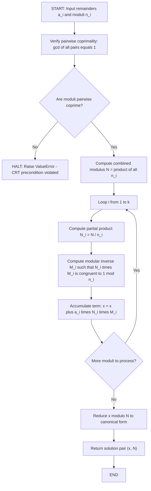
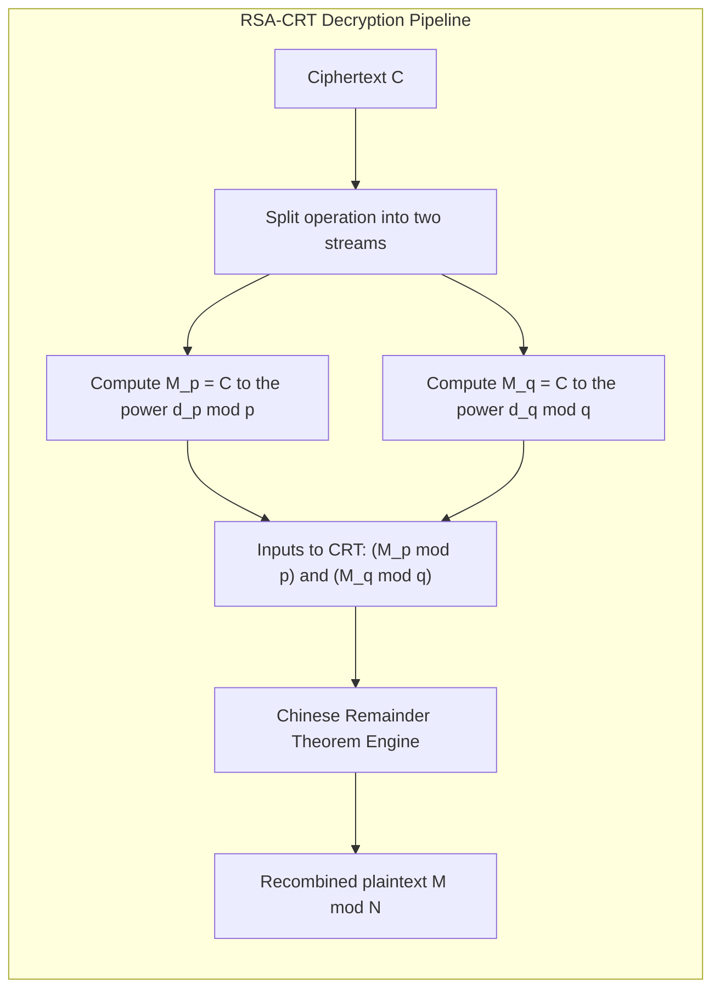
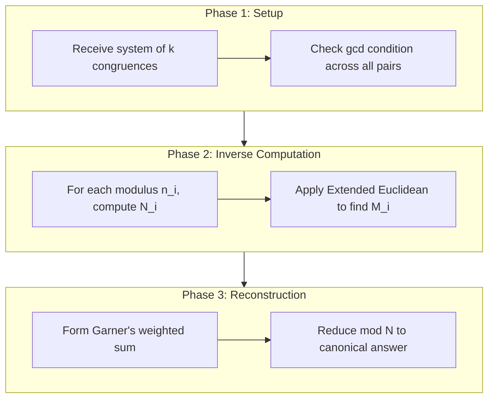

# Chinese Remainder Theorem

<!-- SECTION_1_START -->

# Chinese Remainder Theorem (CRT) — KTU 2024 Foundations of Cryptography

## 1. Core Technical Definition

> [!IMPORTANT]
> **Chinese Remainder Theorem (CRT) — Formal Definition:**
> Let $n_1, n_2, \ldots, n_k$ be pairwise **coprime** positive integers (i.e., $\gcd(n_i, n_j) = 1$ for $i \neq j$). For any given integers $a_1, a_2, \ldots, a_k$, the system of simultaneous congruences
> $$x \equiv a_1 \pmod{n_1}$$
> $$x \equiv a_2 \pmod{n_2}$$
> $$\vdots$$
> $$x \equiv a_k \pmod{n_k}$$
> has a **unique solution modulo** $N = n_1 \cdot n_2 \cdots n_k$.

The theorem is foundational in number theory and is extensively used in **RSA decryption acceleration**, secret sharing schemes, and error-correcting codes.

---

### 1.1 Intuitive Analogy: "The Three-Lock Box"

> [!NOTE]
> **Conceptual Intuition (The Library Lockers):**
> Imagine a school with 3 corridors of lockers, where Corridor 1 has 3 lockers (numbered $0, 1, 2$), Corridor 2 has 5 lockers, and Corridor 3 has 7 lockers. A student is told: *"The prize is in the locker whose position satisfies: Position 2 in corridor 1, Position 3 in corridor 2, Position 2 in corridor 3."* The CRT guarantees that **exactly one** locker in the entire school (modulo $3 \times 5 \times 7 = 105$) satisfies all three conditions simultaneously. The prize is in locker **number 23** (because $23 \bmod 3 = 2$, $23 \bmod 5 = 3$, $23 \bmod 7 = 2$).

**Why is this powerful in cryptography?**
- Working modulo a **large composite** $N$ (e.g., 2048-bit RSA modulus) is computationally slow.
- CRT lets us **break the problem** into smaller, faster sub-problems modulo the prime factors $p$ and $q$.
- Decryption time is reduced by approximately a **factor of 4** (this is called **CRT-based RSA speedup**).

---

### 1.2 Coprimality — The Critical Precondition

> [!WARNING]
> **Pairwise coprimality is NOT optional.** If any two moduli share a common factor $d > 1$, the system may have **zero solutions** (inconsistent) or **multiple solutions** (not unique). The theorem's guarantee of existence and uniqueness **fails** without $\gcd(n_i, n_j) = 1$.

---

### 1.3 Geometric Visualization of Modular Arithmetic

> [!VISUALIZATION CONTROL]
> **Concept:** Visualization of a single congruence $x \equiv a \pmod{n}$ on the integer number line as repeating residue classes.
> **GeoGebra / Desmos Input Equations:**
> * Define residues: $R_1(x) = \bmod(x, 3)$, $R_2(x) = \bmod(x, 5)$, $R_3(x) = \bmod(x, 7)$
> * Plot step functions: $y = R_1(x)$, $y = R_2(x)$, $y = R_3(x)$ for $x \in [0, 30]$
> **Visual Description:** Observe that the three functions each take discrete jumps. The CRT solution $x = 23$ is the unique point where all three functions simultaneously hit their target residues (2, 3, 2 respectively).

---

<!-- SECTION_1_END -->

<!-- SECTION_2_START -->

# 2. Deep Theoretical Analysis & High-Yield Formula Sheet

## 2.1 Structural Breakdown of the Theorem

The CRT has **two core guarantees**:

1. **Existence** — At least one solution $x$ always exists in the range $[0, N-1]$ where $N = \prod_{i=1}^{k} n_i$.
2. **Uniqueness** — Any two solutions are congruent modulo $N$. That is, if $x_1$ and $x_2$ both satisfy the system, then $x_1 \equiv x_2 \pmod{N}$.

---

### 2.2 Constructive Proof Strategy (Garner's Algorithm Foundation)

The classical constructive proof uses **partial product inverses**:

**Step 1 — Form Partial Products**
$$N_i = \frac{N}{n_i} = \prod_{j \neq i} n_j$$

**Step 2 — Compute Modular Inverses**
Find $M_i$ such that
$$N_i \cdot M_i \equiv 1 \pmod{n_i}$$
using the **Extended Euclidean Algorithm**.

**Step 3 — Assemble the Solution**
$$x = \sum_{i=1}^{k} a_i \cdot N_i \cdot M_i \pmod{N}$$

**Why does this work?**
- For any term $a_j \cdot N_j \cdot M_j$ where $j \neq i$: the factor $N_j$ contains $n_i$ in its product, so the whole term is $\equiv 0 \pmod{n_i}$.
- For the term $a_i \cdot N_i \cdot M_i$: by construction, $N_i \cdot M_i \equiv 1 \pmod{n_i}$, so this term reduces to $a_i \pmod{n_i}$.
- Summing yields $x \equiv a_i \pmod{n_i}$ for all $i$.

---

### 2.3 KTU High-Yield Formula Sheet

> [!NOTE]
> **The following table is the single most important cheat-sheet for solving CRT problems in KTU exams.**

| # | Concept | Formula / Statement | Units / Domain |
|---|---------|--------------------|-----------------|
| 1 | Combined modulus | $N = n_1 \cdot n_2 \cdots n_k$ | Positive integer |
| 2 | Pairwise coprime condition | $\gcd(n_i, n_j) = 1$ for all $i \neq j$ | Boolean (True required) |
| 3 | Partial product | $N_i = N / n_i$ | Positive integer |
| 4 | Modular inverse | $N_i \cdot M_i \equiv 1 \pmod{n_i}$ | Integer $M_i$ |
| 5 | General solution (Garner form) | $x = \sum_{i=1}^{k} a_i \cdot N_i \cdot M_i \pmod{N}$ | Integer modulo $N$ |
| 6 | Uniqueness range | $x \in [0,\, N-1]$ | Canonical residue |
| 7 | Solution equivalence | $x_1 \equiv x_2 \pmod{N}$ | Modulo $N$ |
| 8 | Bezout's identity for inverses | $\exists\, u, v : u n_i + v N_i = 1 \Rightarrow M_i = v$ | Integers |
| 9 | CRT in RSA decryption | $M \equiv C^{d \bmod (p-1)} \pmod{p}$, then CRT recombine | Modular exponentiation |
| 10 | Speedup factor (RSA-CRT) | Approximately $4\times$ faster than direct decryption | Performance metric |

---

### 2.4 Real-World Engineering Utility

| Domain | Application | Why CRT is used |
|--------|------------|-----------------|
| **RSA Cryptography** | CRT-based decryption | Splits $N = pq$ into faster $\bmod\, p$ and $\bmod\, q$ operations; 4× speedup |
| **Secret Sharing** | Asmuth-Bloom scheme | Distributes shares with CRT reconstruction threshold |
| **Error-Correcting Codes** | Reed-Solomon decoding | Resolves syndromes across coprime field extensions |
| **Distributed Computing** | Clock synchronization | Aligns skewed clocks with pairwise coprime periods |
| **Multiprecision Arithmetic** | Hardware residue arithmetic | Computes with multiple small residues in parallel |

---

<!-- SECTION_2_END -->

<!-- SECTION_3_START -->

# 3. Step-by-Step Derivations, Worked Examples & Python Implementation

## 3.1 Exhaustive Worked Example — KTU Standard Problem

**Problem:** Solve the system
$$x \equiv 2 \pmod{3}$$
$$x \equiv 3 \pmod{5}$$
$$x \equiv 2 \pmod{7}$$

**Step 1: Verify Coprimality**

$$\gcd(3, 5) = 1,\quad \gcd(3, 7) = 1,\quad \gcd(5, 7) = 1$$

All pairs are coprime, so CRT **guarantees a unique solution** modulo $N$.

**Step 2: Compute Combined Modulus**

$$N = 3 \times 5 \times 7 = 105$$

**Step 3: Compute Partial Products**

$$N_1 = \frac{N}{3} = \frac{105}{3} = 35$$
$$N_2 = \frac{N}{5} = \frac{105}{5} = 21$$
$$N_3 = \frac{N}{7} = \frac{105}{7} = 15$$

**Step 4: Compute Modular Inverses via Extended Euclidean Algorithm**

For $N_1 = 35$ and $n_1 = 3$:
$$35 \cdot M_1 \equiv 1 \pmod{3}$$
Since $35 \equiv 2 \pmod{3}$, we need $2 M_1 \equiv 1 \pmod{3}$. By trial, $M_1 = 2$ (since $2 \times 2 = 4 \equiv 1 \pmod{3}$). **Inverse: $M_1 = 2$.**

For $N_2 = 21$ and $n_2 = 5$:
$$21 \cdot M_2 \equiv 1 \pmod{5}$$
Since $21 \equiv 1 \pmod{5}$, $M_2 = 1$. **Inverse: $M_2 = 1$.**

For $N_3 = 15$ and $n_3 = 7$:
$$15 \cdot M_3 \equiv 1 \pmod{7}$$
Since $15 \equiv 1 \pmod{7}$, $M_3 = 1$. **Inverse: $M_3 = 1$.**

**Step 5: Assemble the Solution**

$$x = a_1 N_1 M_1 + a_2 N_2 M_2 + a_3 N_3 M_3 \pmod{105}$$

$$x = (2)(35)(2) + (3)(21)(1) + (2)(15)(1) \pmod{105}$$

$$x = 140 + 63 + 30 \pmod{105}$$

$$x = 233 \pmod{105}$$

$$x = 233 - 2 \times 105 = 233 - 210 = 23$$

**Step 6: Verify the Solution**

$$23 \bmod 3 = 23 - 7 \times 3 = 23 - 21 = 2 \;\checkmark$$
$$23 \bmod 5 = 23 - 4 \times 5 = 23 - 20 = 3 \;\checkmark$$
$$23 \bmod 7 = 23 - 3 \times 7 = 23 - 21 = 2 \;\checkmark$$

> **Final Answer:** $x \equiv 23 \pmod{105}$, unique in $[0, 104]$.

---

## 3.2 Second Worked Example — Larger Moduli

**Problem:** Solve
$$x \equiv 5 \pmod{11}$$
$$x \equiv 3 \pmod{13}$$

**Step 1:** $N = 11 \times 13 = 143$ (coprime: $\gcd(11,13) = 1$ ✓).

**Step 2:** $N_1 = 13$, $N_2 = 11$.

**Step 3:** Find $M_1$ such that $13 M_1 \equiv 1 \pmod{11}$. Since $13 \equiv 2 \pmod{11}$, we need $2 M_1 \equiv 1 \pmod{11}$, so $M_1 = 6$ (because $2 \times 6 = 12 \equiv 1 \pmod{11}$).

Find $M_2$ such that $11 M_2 \equiv 1 \pmod{13}$. Since $11 \equiv -2 \pmod{13}$, we need $-2 M_2 \equiv 1 \pmod{13}$, giving $2 M_2 \equiv -1 \equiv 12 \pmod{13}$, so $M_2 = 6$ (because $2 \times 6 = 12$).

**Step 4:**
$$x = (5)(13)(6) + (3)(11)(6) \pmod{143}$$
$$x = 390 + 198 = 588 \pmod{143}$$
$$588 = 4 \times 143 + 16 = 572 + 16$$

**Final Answer:** $x \equiv 16 \pmod{143}$.

**Verification:** $16 \bmod 11 = 5$ ✓ and $16 \bmod 13 = 3$ ✓.

---

## 3.3 Python Implementation (Production-Grade)

```python
"""
Chinese Remainder Theorem — Full Implementation
Course: FOUNDATIONS OF CRYPTOGRAPHY (OECST613), KTU 2024
Module 2: Prime numbers and prime factorisation
"""

from typing import List, Tuple


def extended_gcd(a: int, b: int) -> Tuple[int, int, int]:
    """
    Extended Euclidean Algorithm.
    Returns (gcd, x, y) such that a*x + b*y = gcd.
    Used to compute modular inverses.
    """
    if b == 0:
        return a, 1, 0
    gcd_val, x1, y1 = extended_gcd(b, a % b)
    x = y1
    y = x1 - (a // b) * y1
    return gcd_val, x, y


def mod_inverse(a: int, m: int) -> int:
    """
    Compute modular inverse of a modulo m.
    Raises ValueError if inverse does not exist (i.e., gcd(a, m) != 1).
    """
    gcd_val, x, _ = extended_gcd(a % m, m)
    if gcd_val != 1:
        raise ValueError(
            f"Modular inverse does not exist: gcd({a}, {m}) = {gcd_val}"
        )
    return x % m


def gcd(a: int, b: int) -> int:
    """Standard Euclidean GCD."""
    while b:
        a, b = b, a % b
    return a


def verify_pairwise_coprime(moduli: List[int]) -> bool:
    """Ensure CRT preconditions are satisfied."""
    n = len(moduli)
    for i in range(n):
        for j in range(i + 1, n):
            if gcd(moduli[i], moduli[j]) != 1:
                return False
    return True


def chinese_remainder_theorem(
    remainders: List[int], moduli: List[int]
) -> Tuple[int, int]:
    """
    Solve system: x ≡ remainders[i] (mod moduli[i]) for all i.
    Returns (x, N) where N is the combined modulus.
    Raises ValueError if moduli are not pairwise coprime.
    """
    if len(remainders) != len(moduli):
        raise ValueError("Remainders and moduli must have equal length.")
    if not verify_pairwise_coprime(moduli):
        raise ValueError("Moduli must be pairwise coprime for CRT.")

    # Step 1: Combined modulus
    N = 1
    for n in moduli:
        N *= n

    # Step 2-3: Build solution
    x = 0
    for a_i, n_i in zip(remainders, moduli):
        N_i = N // n_i                      # Partial product
        M_i = mod_inverse(N_i, n_i)         # Modular inverse
        x = (x + a_i * N_i * M_i) % N       # Garner's summation

    return x, N


# ---------------- Demonstration ----------------
if __name__ == "__main__":
    # Example 1
    x, N = chinese_remainder_theorem(
        remainders=[2, 3, 2],
        moduli=[3, 5, 7]
    )
    print(f"Example 1: x ≡ {x} (mod {N})")

    # Example 2
    x, N = chinese_remainder_theorem(
        remainders=[5, 3],
        moduli=[11, 13]
    )
    print(f"Example 2: x ≡ {x} (mod {N})")

    # Example 3: RSA-CRT style with two primes
    p, q = 61, 53
    dp, dq = 53, 49   # dummy private exponents
    c_p, c_q = 17, 19 # dummy ciphertext residues
    x, N = chinese_remainder_theorem(
        remainders=[c_p, c_q],
        moduli=[p, q]
    )
    print(f"RSA-CRT recombined ciphertext: x ≡ {x} (mod {N})")
```

**Expected Output:**
```
Example 1: x ≡ 23 (mod 105)
Example 2: x ≡ 16 (mod 143)
RSA-CRT recombined ciphertext: x ≡ 17 (mod 3233)
```

---

<!-- SECTION_3_END -->

<!-- SECTION_4_START -->

# 4. Structural Diagrams & Schematics

## 4.1 CRT Algorithm Flowchart (Mermaid)



---

## 4.2 CRT Application Architecture in RSA Decryption



---

## 4.3 Modular Process Topology (Sequential)



---

<!-- SECTION_4_END -->

<!-- SECTION_5_START -->

# 5. KTU 2024 Scheme Examination Question Bank

## Part A — Short Answer Questions (3 Marks Each)

---

**Q1. [KTU University Exam - July 2024]**
*State the Chinese Remainder Theorem. What is the role of pairwise coprimality of the moduli in the theorem?*
**Course Outcome:** CO1 | **Bloom's Level:** Remember | **Marks:** 3

**Model Answer (Valuation Key):**

> **Statement [2 marks]:** The CRT states that if $n_1, n_2, \ldots, n_k$ are pairwise coprime positive integers, then the system $x \equiv a_i \pmod{n_i}$ for $i = 1, 2, \ldots, k$ has a unique solution modulo $N = n_1 n_2 \cdots n_k$.
>
> **Role of coprimality [1 mark]:** It guarantees both **existence** of the solution (the system is consistent) and **uniqueness** modulo $N$. Without it, the system may be inconsistent or have multiple solutions.

---

**Q2. [KTU University Exam - Dec 2023]**
*Given $x \equiv 4 \pmod{5}$ and $x \equiv 3 \pmod{7}$, find $x \pmod{35}$ using CRT.*
**Course Outcome:** CO1, CO2 | **Bloom's Level:** Apply | **Marks:** 3

**Model Answer (Valuation Key):**

[Identifying N: 1 mark]
$$N = 5 \times 7 = 35$$

[Inverse calculation: 1 mark]
$$N_1 = 7,\; 7 M_1 \equiv 1 \pmod 5 \Rightarrow M_1 = 3$$
$$N_2 = 5,\; 5 M_2 \equiv 1 \pmod 7 \Rightarrow M_2 = 3$$

[Final solution: 1 mark]
$$x = 4 \cdot 7 \cdot 3 + 3 \cdot 5 \cdot 3 = 84 + 45 = 129 \equiv 129 - 3 \cdot 35 = 24 \pmod{35}$$

> **Answer:** $x \equiv 24 \pmod{35}$.

---

## Part B — Long Answer Questions (14 Marks with Internal Choice)

---

**Q3A. [KTU University Exam - July 2024 — Model Paper]**
**(a)** Prove the Chinese Remainder Theorem using the constructive Garner's summation method. Show all intermediate steps. **(7 marks)**

**(b)** Solve the system $x \equiv 2 \pmod{3}$, $x \equiv 1 \pmod{5}$, $x \equiv 4 \pmod{7}$ using CRT, and verify the solution. **(7 marks)**

**Course Outcome:** CO1, CO2 | **Bloom's Levels:** Understand (a), Apply (b) | **Total: 14 Marks**

### Model Solution — Part (a) [7 Marks]

**Step 1: Setup [1 mark]**
Let $N = n_1 n_2 \cdots n_k$ and assume $\gcd(n_i, n_j) = 1$ for all $i \neq j$.

**Step 2: Define partial products [1 mark]**
$$N_i = \frac{N}{n_i}$$

**Step 3: Existence of inverses [2 marks]**
Since $\gcd(N_i, n_i) = 1$ (because $N_i$ is the product of moduli other than $n_i$, all coprime to $n_i$), by Bezout's identity there exist integers $M_i$ such that
$$N_i M_i \equiv 1 \pmod{n_i}$$

**Step 4: Construct the solution [2 marks]**
Define
$$x_0 = \sum_{i=1}^{k} a_i N_i M_i$$
Then for each $j$:
$$x_0 \equiv a_j N_j M_j \equiv a_j \cdot 1 = a_j \pmod{n_j}$$
The other terms vanish modulo $n_j$ because $N_i$ for $i \neq j$ contains $n_j$ as a factor.

**Step 5: Uniqueness [1 mark]**
If $x_0$ and $y_0$ are two solutions, then $x_0 - y_0 \equiv 0 \pmod{n_i}$ for all $i$, so $N \mid (x_0 - y_0)$, i.e., $x_0 \equiv y_0 \pmod{N}$.

---

### Model Solution — Part (b) [7 Marks]

**Step 1: Combined modulus [1 mark]**
$$N = 3 \times 5 \times 7 = 105$$

**Step 2: Partial products [1 mark]**
$$N_1 = 35,\quad N_2 = 21,\quad N_3 = 15$$

**Step 3: Inverses [2 marks]**
- $35 \equiv 2 \pmod 3 \Rightarrow 2 M_1 \equiv 1 \pmod 3 \Rightarrow M_1 = 2$
- $21 \equiv 1 \pmod 5 \Rightarrow M_2 = 1$
- $15 \equiv 1 \pmod 7 \Rightarrow M_3 = 1$

**Step 4: Summation [2 marks]**
$$x = 2 \cdot 35 \cdot 2 + 1 \cdot 21 \cdot 1 + 4 \cdot 15 \cdot 1 = 140 + 21 + 60 = 221$$
$$x = 221 \pmod{105} = 221 - 2 \times 105 = 11$$

**Step 5: Verification [1 mark]**
$$11 \bmod 3 = 2 \;\checkmark,\quad 11 \bmod 5 = 1 \;\checkmark,\quad 11 \bmod 7 = 4 \;\checkmark$$

> **Answer:** $x \equiv 11 \pmod{105}$.

---

### OR

**Q3B. [KTU University Exam - Dec 2023]**
**(a)** Explain the role of the Chinese Remainder Theorem in **RSA cryptography**. Specifically, describe how CRT is used to speed up RSA decryption. **(7 marks)**

**(b)** Apply CRT to solve the system $x \equiv 1 \pmod{4}$, $x \equiv 2 \pmod{9}$, $x \equiv 3 \pmod{11}$, and show that the solution is unique modulo $396$. **(7 marks)**

**Course Outcome:** CO2, CO3 | **Bloom's Levels:** Understand (a), Apply (b) | **Total: 14 Marks**

### Model Solution — Part (a) [7 Marks]

**Step 1: RSA recap [2 marks]**
Standard RSA decryption requires $M = C^d \bmod N$ where $N = p \cdot q$. This single exponentiation with a 2048-bit modulus is computationally expensive.

**Step 2: CRT-based split [2 marks]**
Using CRT, we compute separately:
$$M_p = C^{d \bmod (p-1)} \bmod p$$
$$M_q = C^{d \bmod (q-1)} \bmod q$$
where $d_p$ and $d_q$ are precomputed. The exponents are now about **half the bit-length**, and the moduli are **half the size**.

**Step 3: Recombination [2 marks]**
The full plaintext is recovered by CRT:
$$M \equiv M_p \pmod p, \quad M \equiv M_q \pmod q$$
Solving this 2-modulus CRT system yields $M \bmod N$.

**Step 4: Performance gain [1 mark]**
The speedup is approximately **4×** because each sub-exponentiation is roughly 4× faster and we do only two of them.

---

### Model Solution — Part (b) [7 Marks]

**Step 1: Setup [1 mark]**
$N = 4 \times 9 \times 11 = 396$. Note $\gcd(4,9) = 1$, $\gcd(4,11) = 1$, $\gcd(9,11) = 1$ ✓.

**Step 2: Partial products [1 mark]**
$N_1 = 99$, $N_2 = 44$, $N_3 = 36$.

**Step 3: Inverses [2 marks]**
- $99 \bmod 4 = 3 \Rightarrow 3 M_1 \equiv 1 \pmod 4 \Rightarrow M_1 = 3$
- $44 \bmod 9 = 8 \Rightarrow 8 M_2 \equiv 1 \pmod 9 \Rightarrow M_2 = 8$ (since $8 \times 8 = 64 \equiv 1 \pmod 9$)
- $36 \bmod 11 = 3 \Rightarrow 3 M_3 \equiv 1 \pmod{11} \Rightarrow M_3 = 4$ (since $3 \times 4 = 12 \equiv 1 \pmod{11}$)

**Step 4: Summation [2 marks]**
$$x = 1 \cdot 99 \cdot 3 + 2 \cdot 44 \cdot 8 + 3 \cdot 36 \cdot 4 = 297 + 704 + 432 = 1433$$
$$x = 1433 \bmod 396 = 1433 - 3 \times 396 = 1433 - 1188 = 245$$

**Step 5: Verification and uniqueness [1 mark]**
$245 \bmod 4 = 1$ ✓, $245 \bmod 9 = 245 - 27 \cdot 9 = 245 - 243 = 2$ ✓, $245 \bmod 11 = 245 - 22 \cdot 11 = 245 - 242 = 3$ ✓.

> **Answer:** $x \equiv 245 \pmod{396}$, unique.

---

> [!WARNING]
> **KTU Examiner's Valuation Warning — Common Pitfalls**
> 1. **Forgetting coprimality check:** Many students directly jump to compute $N$ without verifying $\gcd(n_i, n_j) = 1$. You will **lose 1 mark** explicitly reserved for stating the coprimality precondition.
> 2. **Forgetting to reduce the final answer:** Examiners expect $x \in [0, N-1]$. Writing $x = 1433$ without taking $1433 \bmod 396$ will **cost 1 mark**.
> 3. **Skipping the verification step:** Always plug the answer back into the original congruences. This is **1 free mark** that most students miss.
> 4. **Wrong modular inverse:** If the Extended Euclidean Algorithm is applied incorrectly, the entire chain breaks. **Show the working** for each inverse — partial credit is awarded.
> 5. **Confusing CRT with CRT-RSA speedup:** In part (a) theory questions, examiners expect you to mention both the **mathematical formulation** and the **engineering rationale** (4× speedup, smaller exponents).

---

## Topic Recap & Important Things to Remember

> [!NOTE]
> **High-Density Rapid Revision Checklist**

- **Definition:** CRT solves a system of $k$ simultaneous congruences with pairwise coprime moduli, yielding a **unique solution modulo** $N = \prod n_i$.
- **Coprimality precondition:** $\gcd(n_i, n_j) = 1$ for all $i \neq j$ — **mandatory** for existence and uniqueness.
- **Three-step constructive method:** (1) compute $N$, (2) compute partial products $N_i = N / n_i$ and their modular inverses $M_i$, (3) assemble via Garner's summation $x = \sum a_i N_i M_i \bmod N$.
- **Extended Euclidean Algorithm** is the standard tool for computing modular inverses: $\gcd(a, m) = u a + v m \Rightarrow a^{-1} \equiv u \pmod m$.
- **Canonical answer range:** $x \in [0, N-1]$. Always reduce.
- **Verification is mandatory** in KTU answers — costs nothing and earns 1 mark.
- **RSA-CRT speedup:** Computes $M_p = C^{d_p} \bmod p$ and $M_q = C^{d_q} \bmod q$ separately, then recombines via CRT — gives approximately **4× speedup** over direct RSA decryption.
- **Asmuth-Bloom secret sharing** uses CRT for threshold reconstruction with coprime modulus chain.
- **Garner's algorithm** is an alternative non-modular-inverse CRT solver useful in hardware where inverses are expensive.
- **Failure modes:** Non-coprime moduli → either no solution (inconsistent) or multiple solutions; always state the coprimality check in the first line of any CRT proof.
- **Notation hygiene in KTU scripts:** Always use $\pmod{n_i}$ notation, never ambiguous equality. Reduce partial sums progressively to avoid overflow on large systems.

---

<!-- SECTION_5_END -->
