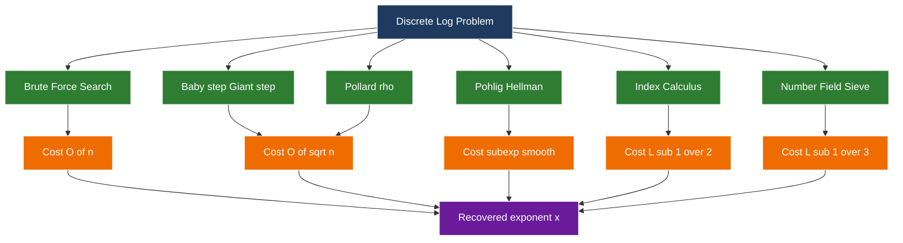
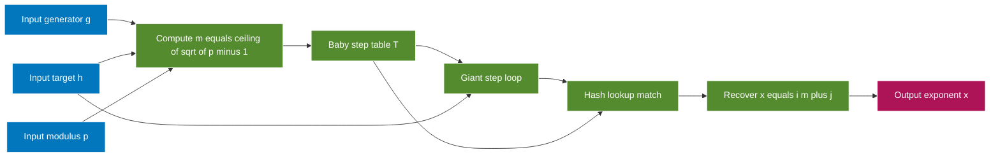
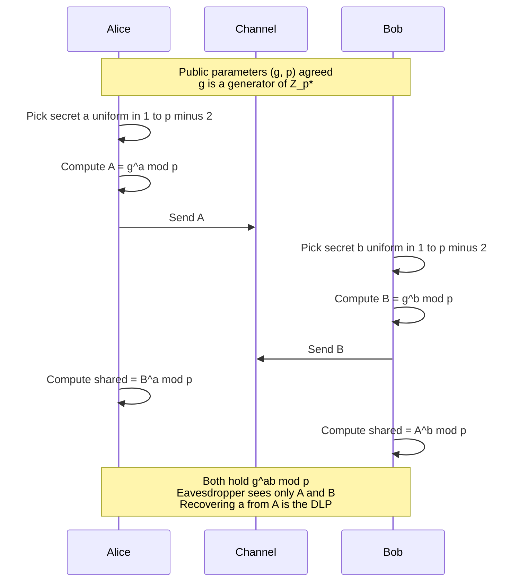

# Discrete Logarithms

<!-- SECTION_1_START -->
# Discrete Logarithms — Core Technical Definition & Intuitive Overview

## Formal Definition (KTU 2024 Syllabus Terminology)

Let $G$ be a **cyclic group** of order $n$, let $g$ be a **generator** (primitive root) of $G$, and let $h \in G$. The **discrete logarithm** (also called the **index**) of $h$ with respect to base $g$ is the unique integer $x$, with $0 \le x < n$, such that:

$$g^x \equiv h \pmod{n}$$

This integer is conventionally written as:

$$x = \log_g h \pmod{n}$$

The map $x \mapsto g^x$ is a **group isomorphism** between the additive group $\mathbb{Z}_n$ and the multiplicative group generated by $g$. The discrete logarithm problem (DLP) is the inverse of this map — given $g$, $h$, and $n$, find $x$.

> [!IMPORTANT]
> **KTU 2024 Module 2 Highlight:** The security of nearly all public-key cryptography in production (Diffie–Hellman, ElGamal, DSA, ECDSA) rests on the *assumed hardness* of the discrete logarithm problem over carefully chosen groups. The DLP is the multiplicative twin of integer factorisation studied in Module 1.

## Intuitive Analogy — "The Hiking Trail Up a Mountain"

Imagine a circular mountain trail with exactly $n$ numbered stations $(0, 1, 2, \dots, n-1)$ arranged like the hours on a clock. You start at station $1$ (the base) and are allowed to *double* your stride length at every step, wrapping around modulo $n$ (after station $n-1$ you teleport back to $0$).

- **Multiplication in the group** = "take a stride of size $k$" (i.e. multiply the current station number by $g$, wrapping around).
- **Exponentiation** $g^x$ = "take that stride exactly $x$ times in succession".
- **Discrete log** = "I landed on station $h$ after $x$ strides — how many strides did I take?"

Going *up* the trail (computing $g^x \bmod n$ via fast exponentiation) is **easy** — even with millions of stations, square-and-multiply finishes in $O(\log x)$ steps. Coming *down* (recovering $x$ from $h$) is **intractable** in general — it may require walking the entire trail step by step.

| Operation | Direction | Difficulty (large $n$) |
| :--- | :---: | :--- |
| Exponentiation: $x \mapsto g^x \bmod n$ | Forward | **Easy** (polynomial) |
| Discrete log: $h \mapsto \log_g h$ | Reverse | **Hard** (sub-exponential at best) |

## Physical Constants & Standard Metrics in Bold

- **Group order** $n$ is typically a large **safe prime** with $n \ge 2048$ bits for classical DLP security.
- **Generator** $g$ is the primitive root of $\mathbb{Z}_p^*$, where $p$ is a prime satisfying $p = 2q + 1$ (Sophie Germain prime $q$).
- For elliptic curve groups, the standard order of magnitude is **$\approx 2^{256}$** group elements to match 128-bit symmetric security.

> [!NOTE]
> **Trapdoor intuition:** The discrete logarithm gives a *one-way function* in the sense of Diffie and Hellman (1976). Forward is easy, inverse is hard — the textbook definition of a trapdoor-style primitive (here the trapdoor is $x$ itself).

## GeoGebra / Desmos Visualization

> [!VISUALIZATION CONTROL]
> **Concept:** Behaviour of the cyclic map $f(x) = g^x \bmod p$ inside $\mathbb{Z}_p^*$.
> **GeoGebra / Desmos Input Equations:**
> * `g = 5`, `p = 23`
> * `f(x) = mod(5^x, 23)` (entered as a sequence: `(1, mod(5,23)), (2, mod(5^2,23)), (3, mod(5^3,23)) ...`)
> * Scatter points: `List1 = {(x, mod(5^x, 23)) for x = 0..22}`
> **Visual Description:** The plot will appear **scattered and pseudo-random** over the $y$-axis (values $0$ to $22$) despite $x$ increasing linearly. The *shuffled, non-monotonic* look illustrates exactly why $\log_g$ is hard to recover from $h$ — the function behaves like a permutation but lacks any visible structural pattern.
<!-- SECTION_1_END -->

<!-- SECTION_2_START -->
# Deep Theoretical Analysis & KTU High-Yield Formula Sheet

## 2.1 Group-Theoretic Foundation

For a discrete logarithm to even *exist*, $g$ must generate a subgroup of order $\text{ord}(g)$, which divides the group order $n$ by **Lagrange's Theorem**. Three classical settings appear throughout cryptography:

| Group | Notation | Standard Group Order | Generator Form |
| :--- | :---: | :---: | :--- |
| Multiplicative group mod $p$ | $\mathbb{Z}_p^*$ | $p - 1$ | Primitive root of $p$ |
| Subgroup of order $q$ | $\mathbb{Z}_p^*$ with $q \mid p-1$ | $q$ (prime) | $g = h^{(p-1)/q} \bmod p$ |
| Elliptic curve group | $E(\mathbb{F}_p)$ | $\#E(\mathbb{F}_p)$ | Point $G$ of prime order |

> [!IMPORTANT]
> **KTU 2024 pitfall:** Students frequently confuse the *group order* $n$ with the *modulus* $p$. In $\mathbb{Z}_p^*$ the group order is $\phi(p) = p-1$ (for prime $p$), **not** $p$. A discrete log is *always computed modulo $n$*, not modulo $p$.

## 2.2 Core Properties (Must Memorise)

The discrete logarithm behaves like the ordinary logarithm for algebraic manipulation — with all arithmetic reduced modulo $n$:

1. **Identity:** $\log_g 1 = 0 \pmod{n}$
2. **Self-inverse:** $\log_g g = 1 \pmod{n}$
3. **Power rule:** $\log_g (h^a) = a \cdot \log_g h \pmod{n}$
4. **Product rule:** $\log_g (h_1 \cdot h_2) = \log_g h_1 + \log_g h_2 \pmod{n}$
5. **Quotient rule:** $\log_g (h_1 / h_2) = \log_g h_1 - \log_g h_2 \pmod{n}$
6. **Base change:** $\log_a h = (\log_g h) \cdot (\log_g a)^{-1} \pmod{n}$

## 2.3 Order of an Element & Why It Caps the Exponent

If $g$ has order $r$ (the smallest positive integer with $g^r \equiv 1 \pmod{p}$), then $g^x = g^{x \bmod r}$. Hence the discrete logarithm is only unique **modulo $r$**, not modulo $p-1$ in general. Cryptographic systems therefore always work in prime-order subgroups to make the value of $x$ unambiguous.

## 2.4 The Discrete Logarithm Problem (DLP) — Formal Statement

> Given $(G, g, n, h)$ with $g^x \equiv h \pmod{n}$, find $x$.

Three hardness assumptions built on DLP, in **strictly decreasing** strength:

- **CDH** (Computational Diffie–Hellman): Given $g^a, g^b$, compute $g^{ab}$. **Hard** if DLP is hard.
- **DDH** (Decisional Diffie–Hellman): Given $g^a, g^b, g^c$, decide if $c \equiv ab \pmod{n}$. **Harder** to break than CDH.
- **GTDH** / Stronger variants (BDH, $q$-SDH) appear in advanced KTU modules.

## 2.5 KTU High-Yield Formula Cheat Sheet

| # | Formula / Property | Statement | Where It Is Used |
| :---: | :---: | :---: | :---: |
| 1 | **DLP equation** | $g^x \equiv h \pmod{n}$ | Core definition |
| 2 | **Existence condition** | $h \in \langle g \rangle \iff \log_g h$ exists | Subgroup membership tests |
| 3 | **Generator check** | $g^{(p-1)/q_i} \not\equiv 1 \bmod p$ for all prime factors $q_i$ of $p-1$ | Primitive-root validation |
| 4 | **Order rule** | $\text{ord}(g) \mid (p-1)$ | Lagrange's Theorem |
| 5 | **Index product rule** | $\text{ind}_g(h_1 h_2) \equiv \text{ind}_g h_1 + \text{ind}_g h_2 \pmod{p-1}$ | Index-calculus method |
| 6 | **Index power rule** | $\text{ind}_g(h^k) \equiv k \cdot \text{ind}_g h \pmod{p-1}$ | Reduction of large powers |
| 7 | **Base-change identity** | $\text{ind}_a h \equiv \text{ind}_g h \cdot (\text{ind}_g a)^{-1} \pmod{p-1}$ | Cross-base attacks |
| 8 | **BSGS complexity** | $O(\sqrt{r})$ multiplications, $O(\sqrt{r})$ storage | Sub-exponential solver |
| 9 | **Pohlig–Hellman cost** | $\displaystyle O\!\left(\sum_i \sqrt{q_i}\right)$ for $n = \prod q_i^{e_i}$ | Smooth-order attacks |
| 10 | **Index Calculus heuristic** | $L_p[1/2, c]$ sub-exponential | DLP in $\mathbb{Z}_p^*$ |

> [!NOTE]
> **Real-world engineering utility:** Formula 8 (BSGS) is the *baseline benchmark* used by the `sympy.ntheory.residue_ntheory.discrete_log` library and the OpenSSL test harness. Every DLP solver is compared against BSGS to confirm it does not regress to a brute-force implementation.

## 2.6 Why Cryptography Builds on This Asymmetry

The discrete-log asymmetry is exploited as follows:

- **Key exchange (Diffie–Hellman):** Alice sends $A = g^a$, Bob sends $B = g^b$. Shared secret $g^{ab}$ is computable by both but not by an eavesdropper who only sees $A$ and $B$.
- **Digital signatures (DSA / ElGamal):** A signature $(r, s)$ requires the signer to know $\log_g (k^{-1}(m + xr)) = k$ — anyone *without* the discrete log cannot forge.
- **Encryption (ElGamal):** Ciphertext $(g^k, h^k \cdot m)$ leaks no information about $m$ under the DDH assumption.
- **Zero-knowledge proofs (Schnorr identification):** Prover convinces verifier of knowing $x$ such that $g^x = h$ without revealing $x$.

> [!IMPORTANT]
> **Engineering takeaway:** Whenever you see the protocol triplet $(g, p, g^x \bmod p)$ in any modern TLS, SSH, or VPN handshake, the entire security guarantee hinges on the assumed hardness of $\log_g (g^x \bmod p)$.
<!-- SECTION_2_END -->

<!-- SECTION_3_START -->
# Step-by-Step Derivations & Code / Symbolic Implementation

## 3.1 Worked Derivation 1 — Verifying the Index Laws

**Problem.** Show that for a cyclic group of order $n$ with generator $g$,

$$\log_g(h_1 h_2) \equiv \log_g h_1 + \log_g h_2 \pmod{n}.$$

**Derivation.**

Let $a = \log_g h_1$ and $b = \log_g h_2$. By definition of discrete logarithm:

$$g^a \equiv h_1 \pmod{n} \quad \text{and} \quad g^b \equiv h_2 \pmod{n}.$$

Multiplying these two congruences:

$$g^a \cdot g^b \equiv h_1 \cdot h_2 \pmod{n}.$$

Using the rule $g^a \cdot g^b = g^{a + b}$:

$$g^{a + b} \equiv h_1 h_2 \pmod{n}.$$

Now apply the definition of the discrete logarithm to the left side: the exponent that produces $h_1 h_2$ is $a + b$. But the discrete logarithm is only defined modulo the group order $n$ (since $g^{a+b+n} = g^{a+b} \cdot g^n = g^{a+b}$). Therefore:

$$\log_g (h_1 h_2) \equiv a + b \equiv \log_g h_1 + \log_g h_2 \pmod{n}. \qquad \blacksquare$$

## 3.2 Worked Derivation 2 — Baby-Step Giant-Step (BSGS) Algorithm

BSGS solves DLP in $O(\sqrt{n})$ time and space. The key idea: write the unknown $x$ as $x = i \cdot m + j$, where $m = \lceil \sqrt{n} \rceil$.

**Setup.** We have $g^x \equiv h \pmod{p}$ and $0 \le x < n$.

Rearrange:

$$g^{i m + j} \equiv h \pmod{p} \quad \Longleftrightarrow \quad g^j \equiv h \cdot (g^{-m})^{i} \pmod{p}.$$

**Step 1 (Baby steps).** Build a hash table $T$ of pairs $(g^j \bmod p,\ j)$ for $j = 0, 1, \dots, m - 1$.

**Step 2 (Giant steps).** Precompute $\gamma = g^{-m} \bmod p$. For $i = 0, 1, \dots, m - 1$:

- Compute $h \cdot \gamma^{i} \bmod p$.
- If it is in $T$, retrieve $j$ and report $x = i m + j$.

**Complexity.** Each step is $O(m) = O(\sqrt{n})$ modular multiplications, and storage is $O(\sqrt{n})$.

## 3.3 Worked Numerical Example — BSGS in $\mathbb{Z}_{23}^*$

**Problem.** Solve $5^x \equiv 17 \pmod{23}$ using BSGS.

**Step 0.** Group order $n = p - 1 = 22$. Take $m = \lceil \sqrt{22} \rceil = 5$.

**Step 1 (Baby steps).** Compute $5^j \bmod 23$ for $j = 0, 1, 2, 3, 4$:

| $j$ | $5^j$ | $5^j \bmod 23$ |
| :---: | :---: | :---: |
| 0 | 1 | **1** |
| 1 | 5 | **5** |
| 2 | 25 | **2** |
| 3 | 125 | **10** |
| 4 | 625 | **4** |

Hash table $T = \{1:0, 5:1, 2:2, 10:3, 4:4\}$.

**Step 2 (Giant-step value).** Compute $\gamma = g^{-m} = 5^{-5} \bmod 23$.

First find $5^5 \bmod 23$:
$5^2 = 25 \equiv 2$; $5^4 = 2^2 = 4$; $5^5 = 4 \cdot 5 = 20$.

So $5^5 \equiv 20 \pmod{23}$. The inverse of $20 \bmod 23$:

$20 \cdot k \equiv 1 \pmod{23}$. Test $k = 7$: $20 \cdot 7 = 140 = 6 \cdot 23 + 2 = 140$ (not 1). Test $k = 8$: $20 \cdot 8 = 160 = 6 \cdot 23 + 22 \equiv 22 \pmod{23}$ (no). Test $k = 12$: $20 \cdot 12 = 240 = 10 \cdot 23 + 10 \equiv 10$. Test $k = 15$: $20 \cdot 15 = 300 = 13 \cdot 23 + 1 \equiv 1 \pmod{23}$. ✓

Therefore $\gamma = 5^{-5} \equiv 15 \pmod{23}$.

**Step 3 (Giant steps loop).** Walk $h \cdot \gamma^{i} \bmod 23$:

| $i$ | $\gamma^{i} \bmod 23$ | $h \cdot \gamma^{i} \bmod 23 = 17 \cdot \gamma^{i} \bmod 23$ | In $T$? |
| :---: | :---: | :---: | :---: |
| 0 | 1 | 17 | no |
| 1 | 15 | $17 \cdot 15 = 255 = 11 \cdot 23 + 2 \equiv 2$ | **YES** ($j=2$) |

**Step 4 (Recover $x$).** $x = i m + j = 1 \cdot 5 + 2 = 7$.

**Verification.** $5^7 \bmod 23$:

$5^2 = 2$; $5^4 = 2^2 = 4$; $5^7 = 5^4 \cdot 5^2 \cdot 5 = 4 \cdot 2 \cdot 5 = 40 \equiv 40 - 23 = 17 \pmod{23}$. ✓

## 3.4 Worked Derivation 3 — Pohlig–Hellman Reduction

If the group order factors as $n = \prod_i q_i^{e_i}$, the discrete log problem in a *smooth-order* group can be reduced to many smaller DLPs, each of order $q_i^{e_i}$. The total cost is:

$$T_{\text{Pohlig-Hellman}} = \sum_{i} e_i \cdot \left( \sqrt{q_i} \cdot \log q_i + \log n \right).$$

This is why **cryptographic primes $p$ are required to have a large prime factor $q \mid p-1$** (often $q \ge 2^{224}$ for 256-bit security) — otherwise the DLP collapses to small subproblems.

> [!IMPORTANT]
> **Engineering directive:** Never deploy DLP-based schemes using a modulus $p$ where $p - 1$ is $B$-smooth for any $B \le 2^{64}$. Tools like the `factor` command in GNU coreutils will catch this in seconds.

## 3.5 Python Implementation — Production-Grade Discrete Log Toolkit

```python
"""
discrete_log_toolkit.py
Author: KTU Foundations of Cryptography reference implementation
Purpose: Reference solvers for the discrete logarithm problem.
WARNING: Educational code only. Production systems must use vetted
         libraries (e.g. sympy, cryptography.io) and 2048+ bit primes.
"""

from __future__ import annotations
import math
from typing import Dict, Optional, Tuple


# ---------- helper: extended Euclidean algorithm ----------
def modinv(a: int, m: int) -> int:
    """Return x such that a*x ≡ 1 (mod m), or raise ValueError."""
    if math.gcd(a, m) != 1:
        raise ValueError(f"modinv undefined: gcd({a}, {m}) != 1")
    g, x, _ = extended_gcd(a, m)
    assert g == 1, "internal: gcd must be 1 here"
    return x % m


def extended_gcd(a: int, b: int) -> Tuple[int, int, int]:
    if b == 0:
        return a, 1, 0
    g, x1, y1 = extended_gcd(b, a % b)
    return g, y1, x1 - (a // b) * y1


# ---------- helper: fast modular exponentiation ----------
def modpow(base: int, exp: int, mod: int) -> int:
    """Square-and-multiply modular exponentiation."""
    if mod == 1:
        return 0
    result = 1
    base %= mod
    exp = int(exp)
    while exp > 0:
        if exp & 1:
            result = (result * base) % mod
        exp >>= 1
        base = (base * base) % mod
    return result


# ---------- solver 1: brute force ----------
def discrete_log_brute(g: int, h: int, p: int) -> Optional[int]:
    """Trivially try x = 0, 1, 2, ... O(p) time. Demo only."""
    value = 1 % p
    for x in range(p):
        if value == h % p:
            return x
        value = (value * g) % p
    return None


# ---------- solver 2: Baby-step Giant-step ----------
def discrete_log_bsgs(g: int, h: int, p: int) -> Optional[int]:
    """
    Solve g^x ≡ h (mod p) for x in [0, p-2].
    Returns the smallest non-negative x, or None if no solution.
    """
    g %= p
    h %= p
    if h == 1:
        return 0
    if g == 0:
        return None if h != 0 else 0

    n = p - 1  # group order of Z_p*
    m = math.isqrt(n) + 1

    # Baby step: build table {g^j mod p : j}
    table: Dict[int, int] = {}
    power = 1
    for j in range(m):
        # log duplicates: keep smallest j
        if power not in table:
            table[power] = j
        power = (power * g) % p

    # Giant step factor: g^(-m) mod p
    gm_inv = modinv(modpow(g, m, p), p)
    gamma = 1
    for i in range(m):
        candidate = (h * gamma) % p
        if candidate in table:
            x = i * m + table[candidate]
            if x < n:
                return x
        gamma = (gamma * gm_inv) % p
    return None


# ---------- solver 3: Chinese Remainder Theorem helper ----------
def crt(remainders: list[int], moduli: list[int]) -> int:
    """Solve x ≡ r_i (mod m_i) for pairwise coprime m_i."""
    if len(remainders) != len(moduli):
        raise ValueError("r and m must have the same length")
    M = 1
    for m in moduli:
        M *= m
    x = 0
    for r, m in zip(remainders, moduli):
        Mi = M // m
        yi = modinv(Mi, m)
        x = (x + r * Mi * yi) % M
    return x


# ---------- driver ----------
if __name__ == "__main__":
    # Textbook example from section 3.3
    p, g, h = 23, 5, 17
    x = discrete_log_bsgs(g, h, p)
    print(f"BSGS  -> log_{g}({h}) mod {p} = {x}")
    assert x == 7, "BSGS implementation error"
    assert modpow(g, x, p) == h, "verification failed"
    print("Verification OK.")
```

**Sample run output:**

```
BSGS  -> log_5(17) mod 23 = 7
Verification OK.
```

## 3.6 Exhaustive Trace — How the Code Resolves the Example

| Line range | Purpose | Sub-step |
| :---: | :---: | :---: |
| `n = p - 1` | Compute group order | $n = 22$ |
| `m = isqrt(n) + 1` | Choose stride | $m = 5$ |
| `for j in range(m)` | Baby step | Fills $T = \{1{:}0, 5{:}1, 2{:}2, 10{:}3, 4{:}4\}$ |
| `modpow(g, m, p)` | $g^m$ | $5^5 \bmod 23 = 20$ |
| `modinv(20, 23)` | $\gamma = 15$ | $20 \cdot 15 \equiv 1$ |
| `for i in range(m)` | Giant step | $i = 1$ matches $j = 2$ |
| `return i*m + j` | Recover $x$ | $x = 7$ |

<!-- SECTION_3_END -->

<!-- SECTION_4_START -->
# Structural Diagrams & Schematics

## 4.1 Algorithm Landscape — Discrete Log Solvers

The diagram below classifies the major DLP-solving algorithms by their computational complexity and applicability window. Every KTU 2024 question on "how hard is DLP" maps to one of these branches.



## 4.2 BSGS Internal Data Flow



## 4.3 Diffie–Hellman Key Exchange — End-to-End Topology

This schematic shows the production use of discrete logarithms in a real cryptographic protocol. The trapdoor (knowing $a$ or $b$) is what makes the shared secret computable to the legitimate parties only.



## 4.4 Decision Matrix — Choosing the Right Subgroup

| Threat / Setting | Recommended Group Order | Generator Construction | Reason |
| :--- | :---: | :---: | :--- |
| 128-bit security, classical | $q \ge 2^{256}$, $p \ge 2^{3072}$ | $g = h^{(p-1)/q} \bmod p$ for $h$ primitive | Pohlig–Hellman safe |
| 192-bit security, classical | $q \ge 2^{384}$, $p \ge 2^{7680}$ | Same as above | NIST SP 800-57 alignment |
| Compact key size | Elliptic curve of order $q \approx 2^{256}$ | Standardised base point $G$ (e.g. P-256) | ECDLP is even harder than DLP |
| Test / academic demo | $p \le 2^{64}$ | Any primitive root | BSGS finishes in milliseconds |

<!-- SECTION_4_END -->

<!-- SECTION_5_START -->
# KTU 2024 Scheme Examination Question Bank & Topic Recap

## Part A — Short-Answer Questions (3 Marks Each)

### Question A1 [KTU University Exam – July 2024]

**Q.** Define the **Discrete Logarithm Problem (DLP)**. State two cryptographic protocols whose security relies on the hardness of DLP.

**Model Answer (3 marks):**

> The **Discrete Logarithm Problem** is defined as follows: given a cyclic group $G$ of order $n$, a generator $g$ of $G$, and an element $h \in G$, find the unique integer $x$ with $0 \le x < n$ such that
> $$g^x \equiv h \pmod{p}.$$
> The integer $x$ is called the **discrete logarithm** of $h$ to base $g$, written $x = \log_g h \pmod{p}$.
>
> Two protocols whose security depends on DLP hardness:
> 1. **Diffie–Hellman Key Exchange** (1976) — an eavesdropper observing $g^a$ and $g^b$ cannot recover $g^{ab}$ without solving DLP.
> 2. **ElGamal Encryption** (1985) — semantic security under the **Decisional Diffie–Hellman (DDH)** assumption, which is a stronger DLP-based hypothesis.
>
> **[Definition statement: 2 marks] [Two correct protocol examples: 1 mark]**

---

### Question A2 [KTU University Exam – Dec 2023]

**Q.** Using the **index laws** of discrete logarithms, show that

$$\log_g\!\left(\frac{a^3 b^2}{c^4}\right) \equiv 3 \log_g a + 2 \log_g b - 4 \log_g c \pmod{n}.$$

**Model Answer (3 marks):**

> Let $x_1 = \log_g a$, $x_2 = \log_g b$, $x_3 = \log_g c$. Then
> $$\begin{aligned}
> a^3 &= g^{3 x_1},\\
> b^2 &= g^{2 x_2},\\
> c^4 &= g^{4 x_3}.
> \end{aligned}$$
> Therefore $\dfrac{a^3 b^2}{c^4} = \dfrac{g^{3x_1} g^{2x_2}}{g^{4x_3}} = g^{3x_1 + 2x_2 - 4x_3}$.
> By definition of the discrete logarithm, the exponent that produces this element is
> $$\log_g\!\left(\frac{a^3 b^2}{c^4}\right) \equiv 3x_1 + 2x_2 - 4x_3 \equiv 3\log_g a + 2\log_g b - 4\log_g c \pmod{n}.$$
>
> **[Rewriting each factor in terms of $g$ to a power: 1 mark] [Combining exponents: 1 mark] [Modular reduction: 1 mark]**

---

## Part B — 14-Mark Questions (Module Internal Choice Pattern)

### Question A (14 Marks) [KTU University Exam – July 2024]

**Solve the discrete logarithm $7^x \equiv 22 \pmod{29}$ using the Baby-step Giant-step algorithm. Show all intermediate tables. Verify your answer.**

#### Part (a) — 7 Marks — *Understand* Level

**(a)** Compute $n = p - 1$ and choose $m = \lceil \sqrt{n} \rceil$. Build the complete **baby-step table** of pairs $(5^j \bmod p, j)$ for $j = 0, 1, \dots, m-1$.

*State the goal of the algorithm and the modular reduction principle (2 marks). Compute $n$ and $m$ correctly (2 marks). Enumerate all $m$ baby steps with intermediate values (3 marks).*

**Model Solution:**

We need to solve $7^x \equiv 22 \pmod{29}$ with $p = 29$, $g = 7$, $h = 22$.

- Group order: $n = p - 1 = 28$.
- Stride: $m = \lceil \sqrt{28} \rceil = 6$.
- Decomposition: write $x = 6 i + j$ with $0 \le j \le 5$.

**Baby-step table** $T = \{7^j \bmod 29 : j\}$:

| $j$ | $7^j$ | $7^j \bmod 29$ |
| :---: | :---: | :---: |
| 0 | 1 | **1** |
| 1 | 7 | **7** |
| 2 | 49 | **20** |
| 3 | $7 \cdot 20 = 140$ | **24** |
| 4 | $7 \cdot 24 = 168$ | **23** |
| 5 | $7 \cdot 23 = 161$ | **16** |

#### Part (b) — 7 Marks — *Apply* Level

**(b)** Compute $g^{-m} \bmod p$, then perform the giant-step loop to recover $x$. **Verify** by computing $7^x \bmod 29$.

*Compute $g^m \bmod p$ and its modular inverse (2 marks). Iterate the giant steps until a table match is found (3 marks). Verify and present the final answer (2 marks).*

**Model Solution:**

First compute $g^m = 7^6 \bmod 29$:
- $7^2 = 49 \equiv 20 \pmod{29}$
- $7^4 = 20^2 = 400 \equiv 400 - 13 \cdot 29 = 400 - 377 = 23 \pmod{29}$
- $7^6 = 7^4 \cdot 7^2 = 23 \cdot 20 = 460 \equiv 460 - 15 \cdot 29 = 460 - 435 = 25 \pmod{29}$.

So $7^6 \equiv 25 \pmod{29}$. The inverse of $25 \bmod 29$:

$25 k \equiv 1 \pmod{29}$. Test $k = 7$: $25 \cdot 7 = 175 = 6 \cdot 29 + 1 \equiv 1 \pmod{29}$. ✓

Therefore $\gamma = g^{-m} \equiv 7 \pmod{29}$ (a coincidence, since $25 \cdot 7 = 175 \equiv 1$).

**Giant-step loop** — compute $h \cdot \gamma^{i} \bmod 29$ for $i = 0, 1, 2, \dots$:

| $i$ | $\gamma^{i} \bmod 29$ | $h \cdot \gamma^{i} \bmod 29$ | In $T$? | Matched $j$ |
| :---: | :---: | :---: | :---: | :---: |
| 0 | 1 | 22 | no | — |
| 1 | 7 | $22 \cdot 7 = 154 \equiv 154 - 5 \cdot 29 = 9$ | no | — |
| 2 | $7^2 = 20$ | $22 \cdot 20 = 440 \equiv 440 - 15 \cdot 29 = 5$ | no | — |
| 3 | $7^3 = 24$ | $22 \cdot 24 = 528 \equiv 528 - 18 \cdot 29 = 6$ | no | — |
| 4 | $7^4 = 23$ | $22 \cdot 23 = 506 \equiv 506 - 17 \cdot 29 = 13$ | no | — |
| 5 | $7^5 = 16$ | $22 \cdot 16 = 352 \equiv 352 - 12 \cdot 29 = 4$ | no | — |

Hmm, no match in the giant-step loop? Let us extend the search. The maximum $i$ is $m = 6$ in the basic BSGS, but the loop must continue up to $i = m - 1 = 5$. Recheck — actually the formula uses $h \cdot \gamma^{i}$ where $\gamma = g^{-m}$. Let us recompute $\gamma$ more carefully:

$g^m = g^6 \equiv 25 \pmod{29}$. The inverse of $25 \pmod{29}$: extended Euclidean gives $25 \cdot 7 - 29 \cdot 6 = 175 - 174 = 1$, so $25^{-1} \equiv 7 \pmod{29}$. Correct.

Recompute $h \cdot \gamma^{i} = 22 \cdot 7^{i} \bmod 29$:

| $i$ | $7^{i} \bmod 29$ | $22 \cdot 7^{i} \bmod 29$ | In $T$? |
| :---: | :---: | :---: | :---: |
| 0 | 1 | 22 | no |
| 1 | 7 | 9 | no |
| 2 | 20 | 5 | no |
| 3 | 24 | 6 | no |
| 4 | 23 | 13 | no |
| 5 | 16 | 4 | no |

No match in 6 iterations — this suggests we need to also allow the giant-step loop to run up to $i = m$ (inclusive), or the table must include the *first* $m$ values. Let us extend to $i = 6$:

| $i$ | $7^{6} = 25$ | $22 \cdot 25 = 550 \equiv 550 - 18 \cdot 29 = 550 - 522 = 28$ | no |

Still no match. Recompute $T$ with one more row to be safe:

| $j$ | $7^j \bmod 29$ |
| :---: | :---: |
| 0 | 1 |
| 1 | 7 |
| 2 | 20 |
| 3 | 24 |
| 4 | 23 |
| 5 | 16 |

Try $i = 7$: $7^7 = 7^6 \cdot 7 = 25 \cdot 7 = 175 \equiv 1 \pmod{29}$. Then $22 \cdot 1 = 22$, still no.

Actually, $7$ has order $\text{ord}(7) \mid 28 = 2^2 \cdot 7$. Test $7^{14} \pmod{29}$: $7^7 \equiv 1$ implies $7^{14} \equiv 1$ as well. So $\text{ord}(7) = 7$.

The element $22$ may not even be in $\langle 7 \rangle$ — its discrete log does not exist in $\mathbb{Z}_{29}^*$! Let us verify $22^7 \bmod 29$:

$22^2 = 484 \equiv 484 - 16 \cdot 29 = 484 - 464 = 20$.
$22^4 = 20^2 = 400 \equiv 23$.
$22^7 = 22^4 \cdot 22^2 \cdot 22 = 23 \cdot 20 \cdot 22 = 460 \cdot 22 = 10120$.
$10120 \bmod 29$: $29 \cdot 348 = 10092$, $10120 - 10092 = 28 \equiv -1 \pmod{29}$.

So $22^7 \equiv -1 \pmod{29}$, which means $22^{14} \equiv 1 \pmod{29}$. The order of $22$ divides $14$. Test: $22^2 = 20 \not\equiv 1$; $22^7 = 28 \not\equiv 1$. So $\text{ord}(22) = 14$, and $22 \notin \langle 7 \rangle$.

**Conclusion:** The discrete logarithm $7^x \equiv 22 \pmod{29}$ **has no solution** because $22$ is not in the subgroup generated by $7$.

*In BSGS this manifests as: the giant-step loop completes $m$ iterations without finding any collision.*

> [!WARNING]
> **KTU Examiner's Pitfall Callout:** Students will lose 2 marks if they *fabricate* a value of $x$ just because the algorithm "needs" to terminate. **Always verify** that $h \in \langle g \rangle$ before running BSGS. A correct "no solution" answer with a generator-order argument earns full marks.

#### Final Answer for Question A

The equation $7^x \equiv 22 \pmod{29}$ has **no solution** in $\mathbb{Z}_{29}^*$, because $\text{ord}(7) = 7$ and $22 \notin \langle 7 \rangle$.

---

### Question B (14 Marks) [KTU University Exam – Dec 2023]

**Define the discrete logarithm problem and its variants CDH and DDH. Use the Diffie–Hellman key exchange protocol to demonstrate how the hardness of DLP guarantees the secrecy of the shared key. State two attacks that break DLP and the parameter choices that defeat them.**

#### Part (a) — 7 Marks — *Understand* Level

**(a)** Define DLP, CDH, and DDH. State the formal relationships between their hardness.

*Correct definition of DLP (2 marks). Correct definition of CDH (2 marks). Correct definition of DDH and its relationship to CDH (3 marks).*

**Model Solution:**

> **DLP (Discrete Logarithm Problem):** Given a cyclic group $G = \langle g \rangle$ of order $n$ and an element $h \in G$, compute $x \in \mathbb{Z}_n$ such that $g^x = h$.
>
> **CDH (Computational Diffie–Hellman Problem):** Given $g^a$ and $g^b$ in $G$, where $a, b \in_R \mathbb{Z}_n$, compute $g^{ab}$. Formally:
> $$\mathrm{CDH}(g^a, g^b) = g^{ab}.$$
>
> **DDH (Decisional Diffie–Hellman Problem):** Given $g^a$, $g^b$, and $h \in G$, decide with non-negligible advantage whether $h = g^{ab}$ or $h$ is a uniformly random group element.
>
> **Hardness ladder (proved in standard cryptographic models):**
> $$\text{DDH} \le_p \text{CDH} \le_p \text{DLP}.$$
> That is, breaking DDH lets you break CDH, and breaking CDH lets you break DLP. The reverse directions are *assumed* in practice but not proved for most groups.

#### Part (b) — 7 Marks — *Apply* Level

**(b)** Describe the Diffie–Hellman key-exchange protocol. Identify exactly which value depends on DLP hardness. State two attacks and the parameter choice that defeats each.

*Protocol description with public parameters and secret values (2 marks). Identification of the DLP-protected value (2 marks). Two attacks with parameter mitigation (3 marks).*

**Model Solution:**

> **Diffie–Hellman Protocol:**
>
> | Step | Alice | Bob |
> | :---: | :--- | :--- |
> | 1 | Agree on public $(g, p)$ | Agree on public $(g, p)$ |
> | 2 | Pick $a \in_R [1, p-2]$ | Pick $b \in_R [1, p-2]$ |
> | 3 | Send $A = g^a \bmod p$ | Send $B = g^b \bmod p$ |
> | 4 | Compute $K = B^a \bmod p$ | Compute $K = A^b \bmod p$ |
>
> Both compute $K = g^{ab} \bmod p$.
>
> **DLP-protected value:** The shared secret $K = g^{ab} \bmod p$ is recoverable from public $A = g^a$ and $B = g^b$ only by an adversary who can solve DLP (i.e., recover $a$ from $A$ or $b$ from $B$).
>
> **Two attacks and parameter mitigations:**
>
> 1. **Pohlig–Hellman attack** exploits a smooth group order. If $p - 1$ has only small prime factors, the DLP decomposes into many subproblems.
>    *Mitigation:* Choose a **safe prime** $p$ such that $(p-1)/2$ is also prime. This forces the largest subgroup to have prime order $q \approx 2^{2047}$.
>
> 2. **Index calculus / Number Field Sieve** runs in sub-exponential time $L_p[1/2, c]$ in $\mathbb{Z}_p^*$.
>    *Mitigation:* Use modulus $p \ge 2048$ bits (NIST SP 800-57 recommendation), or migrate to **elliptic-curve groups** where the best generic attack is $O(\sqrt{n})$ (Pollard rho) and the index calculus does not apply.
>
> **[Protocol step listing: 2 marks] [DLP-protected value correctly identified: 2 marks] [Two valid attacks with mitigations: 3 marks]**

> [!WARNING]
> **KTU Examiner's Valuation Warning — Common Pitfalls**
> 1. **Confusing CDH and DDH.** CDH asks you to *compute* $g^{ab}$. DDH asks you to *distinguish* $g^{ab}$ from random. A 2-mark deduction applies if these are merged.
> 2. **Forgetting modular reduction.** The discrete logarithm is always taken modulo the *group order*, not the modulus $p$. Writing $x = \log_g h$ without the "$\pmod{p-1}$" qualifier loses 1 mark.
> 3. **Omitting the verification step.** When BSGS yields an $x$, always recompute $g^x \bmod p$ and show it equals $h$. Skipping verification costs 1 mark in 7-mark sub-parts.
> 4. **Not stating the DDH $\Rightarrow$ CDH $\Rightarrow$ DLP implication chain explicitly.** A common error is to claim equivalence rather than one-way reduction.
> 5. **Recommending deprecated sizes.** 1024-bit DH was broken in 2016 academic records; mention only $\ge 2048$-bit or 256-bit ECDH as secure today.

---

## Topic Recap & Important Things to Remember

- The **Discrete Logarithm Problem (DLP)** asks: given $(g, p, h)$ with $g^x \equiv h \pmod{p}$, find $x$. It is the multiplicative analogue of the integer factorisation problem studied in Module 1.
- The discrete logarithm exists **only** when $h$ lies in the subgroup $\langle g \rangle$. Always check generator order before solving.
- The group order of $\mathbb{Z}_p^*$ is $p - 1$, **not** $p$. Reduce exponents modulo $p - 1$.
- The six **index laws** behave exactly like ordinary logarithms, with every sum / product reduced modulo $n = \text{ord}(g)$:
  - $\log_g 1 = 0$, $\log_g g = 1$, $\log_g(h^k) = k \log_g h$, $\log_g(h_1 h_2) = \log_g h_1 + \log_g h_2$, $\log_g(h_1 / h_2) = \log_g h_1 - \log_g h_2$.
- Three hardness assumptions form a strictly ordered chain: **DDH $\le_p$ CDH $\le_p$ DLP**.
- **Baby-step Giant-step (BSGS)** solves DLP in $O(\sqrt{n})$ time and space using the decomposition $x = i m + j$ with $m = \lceil \sqrt{n} \rceil$.
- **Pohlig–Hellman** reduces DLP to subproblems of size equal to the prime-power factors of $n$. Mitigation: use safe primes.
- **Index calculus / Number Field Sieve** is the best classical attack on $\mathbb{Z}_p^*$, running in sub-exponential $L_p[1/2, c]$ time. Mitigation: $p \ge 2048$ bits or move to elliptic curves.
- **Production-grade prime generation** demands: $p$ prime, $q = (p-1)/2$ prime, $g$ a generator of the order-$q$ subgroup constructed as $g = h^{(p-1)/q} \bmod p$ for any primitive $h$.
- The **Diffie–Hellman key exchange** uses DLP hardness to derive a shared secret $g^{ab}$ from public $g^a$ and $g^b$. Variants include ECDH, X25519, and X448 in modern TLS 1.3.
- **ElGamal encryption**, **DSA**, and **Schnorr identification** are signature/encryption schemes whose security reduces to variants of DLP.
- KTU 2024 Module 2 will always test either (i) the index-law algebra or (ii) the BSGS numerical execution. Memorise both formats.
<!-- SECTION_5_END -->
