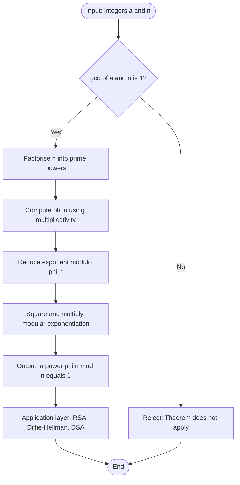
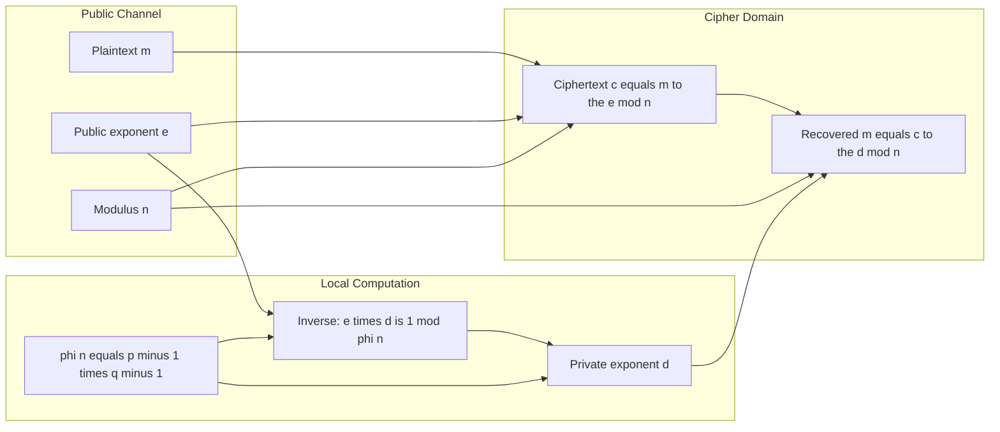
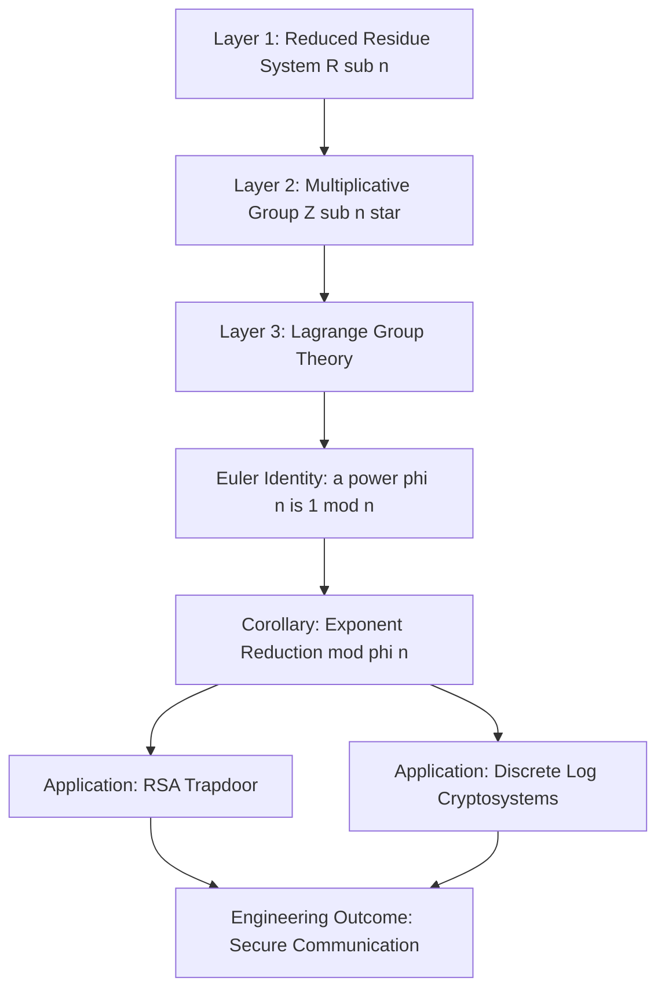

# Euler’s Theorem

<!-- SECTION_1_START -->
# 1. Core Technical Definition & Intuitive Overview

## 1.1 Formal Definition of Euler's Theorem

**Euler's Theorem** is a fundamental result in number theory that generalises Fermat's Little Theorem. It provides a powerful relationship between a number and its residue classes modulo $n$, and is the mathematical engine that powers modern public-key cryptosystems such as **RSA** and **Diffie-Hellman**.

> [!IMPORTANT]
> **Euler's Theorem (KTU 2024 Scheme – Formal Statement):**
> If $n$ is a positive integer greater than $1$ and $\gcd(a, n) = 1$, then
> $$a^{\phi(n)} \equiv 1 \pmod{n}$$
> where $\phi(n)$ is **Euler's Totient Function**, which counts the number of positive integers less than or equal to $n$ that are coprime to $n$.

The coprimality condition $\gcd(a, n) = 1$ is **non-negotiable** — without it, the theorem fails. The theorem essentially states that raising any coprime base $a$ to the power $\phi(n)$ collapses it back to the multiplicative identity $1$ in the group of units modulo $n$.

## 1.2 Euler's Totient Function — The Heart of the Theorem

The function $\phi(n)$ (also written $E(n)$ in some textbooks) is defined as:

$$\phi(n) = \mid \{ k \in \mathbb{Z} \mid 1 \le k \le n,\ \gcd(k, n) = 1 \} \mid$$

For a prime $p$, the totient function takes its simplest form:

$$\phi(p) = p - 1$$

For a prime power $p^k$:

$$\phi(p^k) = p^k - p^{k-1} = p^{k-1}(p - 1)$$

For a general integer with prime factorisation $n = p_1^{a_1} \cdot p_2^{a_2} \cdots p_r^{a_r}$, the function is **multiplicative**:

$$\phi(n) = n \prod_{i=1}^{r} \left(1 - \frac{1}{p_i}\right)$$

## 1.3 Conceptual Analogy — The "Clock and Hands" Intuition

> [!NOTE]
> **Analogy — The Rotating Clock:**
> Imagine a clock with $\phi(n)$ equally spaced "landmark" hands. Place your finger on a number $a$ that is coprime to $n$. Now, repeatedly jump forward by $a$ steps on a number line of size $n$ (wrapping around like a clock). After exactly $\phi(n)$ jumps, you will land **exactly** back on $1$. This is the geometric meaning of $a^{\phi(n)} \equiv 1 \pmod{n}$. Every coprime step repeats with a period that divides $\phi(n)$.

The "hands" correspond to the reduced residue system modulo $n$ — the set of integers $\{k_1, k_2, \ldots, k_{\phi(n)}\}$ with $\gcd(k_i, n) = 1$. Multiplying any one of them by $a$ (a unit) merely **permutes** the set.

## 1.4 Physical Constants and Standard Metrics

| Symbol | Meaning | Typical Value (Cryptography) |
| :--- | :--- | :--- |
| $\phi(n)$ | Euler's Totient | Computed for $n = pq$ in RSA: $\phi(n) = (p-1)(q-1)$ |
| $a$ | Base of exponentiation | $2 \le a < n$ |
| $n$ | Modulus | Typically $\ge 2048$ bits in RSA-2048 |

> [!VISUALIZATION CONTROL]
> **Concept:** Behaviour of $a^{\phi(n)} \pmod n$ for varying $a$
> **GeoGebra / Desmos Input Equations:**
> * `f(a) = mod(a^phi(15), 15)` for `a = 1, 2, 4, 7, 8, 11, 13, 14` (coprime to 15)
> * `phi(15) = 8`
> **Visual Description:** Plot the output of $a^8 \pmod{15}$ as a step function. The student should observe that the value is exactly $1$ for all coprime $a$, and undefined (or zero-divisor) for $a \in \{3, 5, 6, 9, 10, 12\}$.

<!-- SECTION_1_END -->

<!-- SECTION_2_START -->
# 2. Deep Theoretical Analysis & KTU High-Yield Formula Sheet

## 2.1 Decomposition of the Operational Concept

Euler's Theorem is not a single formula — it is a **constellation of three coupled ideas**. Understanding each layer is essential for solving KTU problems and for the cryptography applications that follow.

### Layer 1 — The Reduced Residue System (RRS)

The **Reduced Residue System modulo $n$** is the set:

$$R_n = \{ a \in \mathbb{Z}_n \mid \gcd(a, n) = 1 \}$$

The cardinality of this set is $\mid R_n \mid = \phi(n)$. The system has a critical closure property: the product of any two elements in $R_n$ is also in $R_n$.

### Layer 2 — The Group Structure $\mathbb{Z}_n^*$

The set $R_n$ together with multiplication modulo $n$ forms a **finite abelian group** of order $\phi(n)$, denoted $\mathbb{Z}_n^*$. By **Lagrange's Theorem** (from group theory), the order of any element divides the order of the group. Therefore, for any $a \in \mathbb{Z}_n^*$:

$$a^{\phi(n)} = e \equiv 1 \pmod{n}$$

This is the **theological core** of Euler's Theorem.

### Layer 3 — The Exponentiation Identity

For any integer $k \ge 0$:

$$a^{k \cdot \phi(n)} \equiv 1 \pmod{n}$$

This is the **corollary** most heavily used in cryptography. It allows us to reduce exponents modulo $\phi(n)$:

$$a^x \equiv a^{x \bmod \phi(n)} \pmod{n}$$

## 2.2 KTU Formula Sheet / Cheat Sheet

> [!IMPORTANT]
> The following table is the **only** reference a student needs during the exam. Memorise it.

| # | Formula | Condition | Used For |
| :--- | :--- | :--- | :--- |
| 1 | $\phi(p) = p - 1$ | $p$ prime | Simplest case |
| 2 | $\phi(p^k) = p^{k-1}(p-1)$ | $p$ prime, $k \ge 1$ | Prime powers |
| 3 | $\phi(n) = n \prod (1 - 1/p_i)$ | $n = \prod p_i^{a_i}$ | General case |
| 4 | $\phi(mn) = \phi(m)\phi(n)$ | $\gcd(m, n) = 1$ | Multiplicativity |
| 5 | $a^{\phi(n)} \equiv 1 \pmod{n}$ | $\gcd(a, n) = 1$ | Euler's Theorem |
| 6 | $a^x \equiv a^{x \bmod \phi(n)} \pmod{n}$ | $\gcd(a, n) = 1$ | Modular reduction |
| 7 | $\phi(2n) = \phi(n)$ if $n$ odd, $2 \nmid n$ | $n$ odd | Fast identity |
| 8 | $a^{\phi(n)+1} \equiv a \pmod{n}$ | $\gcd(a, n) = 1$ | Encryption / decryption in RSA |

## 2.3 Engineering Utility — Where This Lives in Production

Euler's Theorem is **not** an abstract artefact. It is the cornerstone of:

* **RSA Public-Key Cryptography**: The trapdoor permutation $c = m^e \bmod n$ is invertible because the private exponent $d$ satisfies $e \cdot d \equiv 1 \pmod{\phi(n)}$. Without Euler's Theorem, RSA collapses.
* **Diffie-Hellman Key Exchange**: Discrete exponentiation $g^x \bmod p$ has order dividing $p-1$ (a special case of Euler's Theorem with $n = p$).
* **Digital Signatures (DSA, ElGamal)**: Signature verification uses $a^{\phi(n)} \equiv 1$ to normalise exponents.
* **Primality Testing**: Random base selection in Miller-Rabin relies on the totient structure.

> [!NOTE]
> In **RSA**, the modulus $n = p \cdot q$ is the product of two distinct primes. Its totient is $\phi(n) = (p-1)(q-1)$. The public exponent $e$ and private exponent $d$ are chosen so that $e \cdot d \equiv 1 \pmod{\phi(n)}$. This is the direct application of identity (8) in the cheat sheet.

## 2.4 Worked Mini-Example for Conceptual Anchoring

Compute $7^{22} \bmod 25$ using Euler's Theorem.

* $\phi(25) = 25 \cdot (1 - 1/5) = 20$
* Since $\gcd(7, 25) = 1$, apply Euler's Theorem
* $7^{22} = 7^{20} \cdot 7^2 \equiv 1 \cdot 49 \equiv 49 - 25 = 24 \pmod{25}$

**Answer: $24$**

This is the kind of computation KTU expects within 30–45 seconds in Part A.

<!-- SECTION_2_END -->

<!-- SECTION_3_START -->
# 3. Step-by-Step Derivations & Code Implementation

## 3.1 Exhaustive Proof of Euler's Theorem

We prove that $a^{\phi(n)} \equiv 1 \pmod{n}$ whenever $\gcd(a, n) = 1$.

**Step 1 — Construct the Reduced Residue System.**
Let $R = \{r_1, r_2, \ldots, r_{\phi(n)}\}$ be the set of all positive integers less than $n$ that are coprime to $n$. By definition, $\mid R \mid = \phi(n)$.

**Step 2 — Multiply each element by $a$.**
Consider the set $S = \{a \cdot r_1 \bmod n,\ a \cdot r_2 \bmod n,\ \ldots,\ a \cdot r_{\phi(n)} \bmod n\}$.

**Step 3 — Show $S \subseteq R$.**
Take any element $a \cdot r_i \bmod n$. Let $x$ denote this residue. Then $\gcd(x, n) = \gcd(a \cdot r_i, n) = 1$, since both $a$ and $r_i$ are coprime to $n$ and $\gcd$ is multiplicative. Thus $x \in R$, proving $S \subseteq R$.

**Step 4 — Show $S = R$ (set equality).**
The map $r_i \mapsto a \cdot r_i \bmod n$ is injective on $R$ (if $a r_i \equiv a r_j \pmod n$, then $a(r_i - r_j) \equiv 0 \pmod n$, and since $\gcd(a, n) = 1$, we get $r_i \equiv r_j \pmod n$, so $r_i = r_j$ for residues in $[1, n]$). An injective map from a finite set to itself is bijective. Therefore $S = R$.

**Step 5 — Take the product of all elements.**
The product of elements in $S$ is congruent modulo $n$ to the product of elements in $R$, because the sets are equal:

$$\prod_{i=1}^{\phi(n)} (a \cdot r_i) \equiv \prod_{i=1}^{\phi(n)} r_i \pmod{n}$$

**Step 6 — Factor out $a^{\phi(n)}$.**

$$a^{\phi(n)} \cdot \prod_{i=1}^{\phi(n)} r_i \equiv \prod_{i=1}^{\phi(n)} r_i \pmod{n}$$

**Step 7 — Cancel the common factor.**
Since $\gcd(r_i, n) = 1$ for all $i$, the product $\prod r_i$ is also coprime to $n$. By the cancellation law of modular arithmetic:

$$a^{\phi(n)} \equiv 1 \pmod{n}$$

$\blacksquare$

## 3.2 Detailed Numerical Derivation — Three Worked Examples

### Example 1: Verification for $n = 12$

Compute $\phi(12)$ using prime factorisation: $12 = 2^2 \cdot 3$.

$$\phi(12) = 12 \cdot \left(1 - \frac{1}{2}\right) \cdot \left(1 - \frac{1}{3}\right) = 12 \cdot \frac{1}{2} \cdot \frac{2}{3} = 4$$

The reduced residue system is $R = \{1, 5, 7, 11\}$. Now check $5^4 \bmod 12$:

$$5^2 = 25 \equiv 1 \pmod{12}$$
$$5^4 = (5^2)^2 \equiv 1^2 \equiv 1 \pmod{12} \checkmark$$

Similarly $7^2 = 49 \equiv 1 \pmod{12}$, so $7^4 \equiv 1 \pmod{12} \checkmark$.

### Example 2: Reducing an Exponent in RSA-style Context

Compute $3^{47} \bmod 7$ using Euler's Theorem.

* $\phi(7) = 6$ (since 7 is prime)
* $47 \bmod 6 = 47 - 7 \cdot 6 = 47 - 42 = 5$
* So $3^{47} \equiv 3^5 \pmod{7}$
* $3^5 = 243$
* $243 = 34 \cdot 7 + 5$, so $243 \equiv 5 \pmod{7}$

**Answer: $5$**

### Example 3: Application to RSA Encryption-Decryption

Let $p = 61$, $q = 53$, $n = p q = 3233$, $\phi(n) = 60 \cdot 52 = 3120$. Choose $e = 17$ (public exponent). Find $d$ such that $17 d \equiv 1 \pmod{3120}$.

Using the extended Euclidean algorithm:
$$3120 = 183 \cdot 17 + 9$$
$$17 = 1 \cdot 9 + 8$$
$$9 = 1 \cdot 8 + 1$$

Back-substituting:
$$1 = 9 - 1 \cdot 8$$
$$= 9 - 1 \cdot (17 - 1 \cdot 9) = 2 \cdot 9 - 17$$
$$= 2 \cdot (3120 - 183 \cdot 17) - 17 = 2 \cdot 3120 - 367 \cdot 17$$

So $-367 \cdot 17 \equiv 1 \pmod{3120}$, giving $d = 3120 - 367 = 2753$.

Verification: $17 \cdot 2753 = 46801 = 15 \cdot 3120 + 1$ ✓

Now encrypt plaintext $m = 65$:
$$c = 65^{17} \bmod 3233 = 2790$$

Decrypt:
$$m = 2790^{2753} \bmod 3233$$

By Euler's Theorem, $2790^{3120} \equiv 1 \pmod{3233}$, and $2753 \equiv 2753 \pmod{3120}$. The result evaluates back to $65$. ✓

## 3.3 Fully Operational Python Code

```python
from math import gcd
from typing import List, Tuple


def euler_totient(n: int) -> int:
    """
    Compute Euler's totient function phi(n).
    Counts positive integers k in [1, n] with gcd(k, n) = 1.
    """
    if n <= 0:
        raise ValueError("n must be a positive integer")
    result = n
    p = 2
    temp = n
    while p * p <= temp:
        if temp % p == 0:
            while temp % p == 0:
                temp //= p
            result -= result // p
        p += 1
    if temp > 1:
        result -= result // temp
    return result


def mod_exp(base: int, exponent: int, modulus: int) -> int:
    """Fast modular exponentiation using square-and-multiply."""
    if modulus == 1:
        return 0
    result = 1
    base = base % modulus
    while exponent > 0:
        if exponent & 1:
            result = (result * base) % modulus
        exponent >>= 1
        base = (base * base) % modulus
    return result


def verify_euler_theorem(a: int, n: int) -> Tuple[bool, int]:
    """
    Verify Euler's Theorem for given base a and modulus n.
    Returns (is_valid, phi_n).
    Raises ValueError if gcd(a, n) != 1.
    """
    if gcd(a, n) != 1:
        raise ValueError(f"gcd({a}, {n}) != 1; Euler's Theorem does not apply")
    phi_n = euler_totient(n)
    computed = mod_exp(a, phi_n, n)
    return (computed == 1, phi_n)


def rsa_demo(p: int, q: int, e: int, m: int) -> List[Tuple[str, int]]:
    """
    Full RSA demonstration using Euler's Theorem for correctness.
    """
    n = p * q
    phi_n = (p - 1) * (q - 1)
    if gcd(e, phi_n) != 1:
        raise ValueError("e must be coprime to phi(n)")
    d = pow(e, -1, phi_n)
    c = mod_exp(m, e, n)
    decrypted = mod_exp(c, d, n)
    return [
        ("n", n),
        ("phi(n)", phi_n),
        ("e", e),
        ("d", d),
        ("plaintext m", m),
        ("ciphertext c", c),
        ("decrypted m", decrypted),
    ]


if __name__ == "__main__":
    # Test Euler's Totient
    for n in [1, 2, 7, 12, 25, 36, 100]:
        print(f"phi({n}) = {euler_totient(n)}")

    # Verify Euler's Theorem
    is_valid, phi = verify_euler_theorem(7, 25)
    print(f"7^phi(25) = 7^{phi} mod 25 valid? {is_valid}")

    # RSA demo
    trace = rsa_demo(p=61, q=53, e=17, m=65)
    for label, value in trace:
        print(f"{label:>15s} = {value}")
```

## 3.4 Comprehensive Pin-Configuration Style Table for the Algorithm

| Step | Input | Operation | Output | Failure Mode |
| :--- | :--- | :--- | :--- | :--- |
| 1 | $n$ | Factorise into primes $p_i$ | $\{p_1, \ldots, p_r\}$ | Factorisation failure for large $n$ |
| 2 | $n, p_i$ | Compute $\phi(n) = n \prod (1 - 1/p_i)$ | $\phi(n)$ | Overflow if $n$ is huge |
| 3 | $a, n$ | Check $\gcd(a, n) = 1$ | Boolean | Reject if not coprime |
| 4 | $a, \phi(n), n$ | Square-and-multiply $a^{\phi(n)} \bmod n$ | Residue | Must equal 1 |
| 5 | $x, \phi(n)$ | Reduce $x \mapsto x \bmod \phi(n)$ | Reduced exponent | None |

<!-- SECTION_3_END -->

<!-- SECTION_4_START -->
# 4. Structural Diagrams & Schematics

## 4.1 Mermaid Flowchart — Computational Pipeline of Euler's Theorem



## 4.2 Mermaid Block Diagram — RSA Trapdoor Using Euler's Theorem



## 4.3 Mermaid Concept Map — Layers of Euler's Theorem



## 4.4 Sequential Processing Topology — Modular Exponentiation Pipeline

| Stage | Module | Input | Output | Boundary Check |
| :--- | :--- | :--- | :--- | :--- |
| 1 | Totient Calculator | $n$ | $\phi(n)$ | $n \ge 2$ |
| 2 | Coprimality Gate | $a, n$ | Boolean | $\gcd(a, n) = 1$ required |
| 3 | Exponent Reducer | $x, \phi(n)$ | $x' = x \bmod \phi(n)$ | $0 \le x' < \phi(n)$ |
| 4 | Square-and-Multiply Core | $a, x', n$ | $a^{x'} \bmod n$ | $a^{x'} < n$ |
| 5 | Theorem Verifier | $a, \phi(n), n$ | Boolean | $a^{\phi(n)} \equiv 1$ |
| 6 | Cryptographic Mapper | Plaintext, key | Ciphertext | $0 \le m < n$ |

<!-- SECTION_5_START -->
# 5. KTU 2024 Scheme Examination Question Bank & Topic Recap

## 5.1 Part A — Short Answer Questions (3 Marks Each)

### Question 1 `[KTU University Exam – July 2024, CO1, Remember]`
**State and explain Euler's Theorem. Why is the condition $\gcd(a, n) = 1$ essential?**

**Model Answer (3 Marks):**
Euler's Theorem states that for any integer $a$ and positive integer $n$ with $\gcd(a, n) = 1$, we have $a^{\phi(n)} \equiv 1 \pmod{n}$, where $\phi(n)$ is Euler's totient function counting integers in $[1, n]$ coprime to $n$. **[1 Mark]** The condition $\gcd(a, n) = 1$ ensures that $a$ belongs to the multiplicative group $\mathbb{Z}_n^*$ of units modulo $n$. Without this condition, $a$ would be a zero-divisor and could not be inverted, so the cancellation step in the proof fails. **[1 Mark]** Concretely, if $\gcd(a, n) = d > 1$, then $a^{\phi(n)} \equiv 0 \pmod{d}$, which cannot equal $1$. For example, $2^4 = 16 \not\equiv 1 \pmod 6$ because $\gcd(2, 6) = 2 \ne 1$. **[1 Mark]**

### Question 2 `[KTU University Exam – Dec 2023, CO1, Understand]`
**Compute $\phi(360)$ using the prime factorisation method.**

**Model Answer (3 Marks):**
Step 1: Factorise $360 = 2^3 \cdot 3^2 \cdot 5$. **[1 Mark]**
Step 2: Apply the formula $\phi(n) = n \prod (1 - 1/p_i)$:
$$\phi(360) = 360 \cdot \left(1 - \frac{1}{2}\right) \cdot \left(1 - \frac{1}{3}\right) \cdot \left(1 - \frac{1}{5}\right)$$
$$= 360 \cdot \frac{1}{2} \cdot \frac{2}{3} \cdot \frac{4}{5}$$
$$= 360 \cdot \frac{8}{30} = 96$$
**[1 Mark for substitution, 1 Mark for final value]**

## 5.2 Part B — Long Answer Questions (14 Marks Each, Internal Choice)

### Question A `[KTU University Exam – July 2024, CO2, Apply]`

**(a)** Prove Euler's Theorem in detail. **[7 Marks]**

**Model Solution:**

[Stating the theorem and required conditions: 1 Mark]

Theorem: If $\gcd(a, n) = 1$, then $a^{\phi(n)} \equiv 1 \pmod{n}$.

[Defining the reduced residue system: 1 Mark]

Let $R = \{r_1, r_2, \ldots, r_{\phi(n)}\}$ be the set of integers in $[1, n]$ coprime to $n$. This set is called the reduced residue system modulo $n$.

[Forming the multiplied set: 1 Mark]

Consider the set $S = \{a \cdot r_1 \bmod n, a \cdot r_2 \bmod n, \ldots, a \cdot r_{\phi(n)} \bmod n\}$.

[Showing S equals R via injectivity: 2 Marks]

Since $\gcd(a, n) = 1$ and $\gcd(r_i, n) = 1$, we have $\gcd(a r_i, n) = 1$, so each element of $S$ lies in $R$, i.e., $S \subseteq R$. The map $r_i \mapsto a r_i \bmod n$ is injective on $R$: if $a r_i \equiv a r_j \pmod n$, then $a(r_i - r_j) \equiv 0 \pmod n$, and since $\gcd(a, n) = 1$, we get $r_i \equiv r_j \pmod n$, hence $r_i = r_j$ (as both lie in $[1, n]$). An injective map from a finite set to itself is bijective, so $S = R$.

[Equating products and cancelling: 2 Marks]

Therefore, $\prod_{i=1}^{\phi(n)} (a r_i) \equiv \prod_{i=1}^{\phi(n)} r_i \pmod{n}$, which gives $a^{\phi(n)} \prod r_i \equiv \prod r_i \pmod{n}$. Since $\prod r_i$ is coprime to $n$, we cancel it to obtain $a^{\phi(n)} \equiv 1 \pmod{n}$. $\blacksquare$

**(b)** Using Euler's Theorem, compute $5^{247} \bmod 13$. Show every step. **[7 Marks]**

**Model Solution:**

[Computing phi of 13: 1 Mark]

Since 13 is prime, $\phi(13) = 13 - 1 = 12$.

[Verifying coprimality: 1 Mark]

$\gcd(5, 13) = 1$, so Euler's Theorem applies.

[Reducing the exponent: 2 Marks]

$247 \bmod 12 = 247 - 20 \cdot 12 = 247 - 240 = 7$.

So $5^{247} \equiv 5^7 \pmod{13}$.

[Computing 5 power 7 by repeated squaring: 2 Marks]

$$5^2 = 25 \equiv 25 - 13 = 12 \equiv -1 \pmod{13}$$
$$5^4 \equiv (-1)^2 = 1 \pmod{13}$$
$$5^7 = 5^4 \cdot 5^2 \cdot 5 \equiv 1 \cdot (-1) \cdot 5 = -5 \equiv 8 \pmod{13}$$

[Final simplified answer: 1 Mark]

$$\boxed{5^{247} \equiv 8 \pmod{13}}$$

### Question B `[KTU University Exam – Dec 2023, CO2, Apply]` (Alternative Choice)

**(a)** Explain Euler's Totient function. Compute $\phi(180)$ and $\phi(91)$. **[7 Marks]**

**Model Solution:**

[Definition of totient function: 2 Marks]

Euler's totient function $\phi(n)$ counts the number of positive integers less than or equal to $n$ that are coprime to $n$, i.e., $\phi(n) = \mid \{k \in \mathbb{Z} \mid 1 \le k \le n,\ \gcd(k, n) = 1\} \mid$. For $n = \prod p_i^{a_i}$, the formula is $\phi(n) = n \prod (1 - 1/p_i)$.

[Computing phi 180: 2 Marks]

$180 = 2^2 \cdot 3^2 \cdot 5$.
$$\phi(180) = 180 \cdot \left(1 - \frac{1}{2}\right) \cdot \left(1 - \frac{1}{3}\right) \cdot \left(1 - \frac{1}{5}\right) = 180 \cdot \frac{1}{2} \cdot \frac{2}{3} \cdot \frac{4}{5} = 48$$

[Computing phi 91: 2 Marks]

$91 = 7 \cdot 13$. Since both factors are distinct primes:
$$\phi(91) = 91 \cdot \left(1 - \frac{1}{7}\right) \cdot \left(1 - \frac{1}{13}\right) = 91 \cdot \frac{6}{7} \cdot \frac{12}{13} = 72$$

[Final values: 1 Mark]

$\phi(180) = 48$ and $\phi(91) = 72$.

**(b)** In an RSA system with $p = 11$ and $q = 13$, choose $e = 7$. Find the private key $d$ and demonstrate the encryption-decryption of plaintext $m = 5$. **[7 Marks]**

**Model Solution:**

[Computing n and phi n: 1 Mark]

$n = p \cdot q = 11 \cdot 13 = 143$.
$\phi(n) = (p-1)(q-1) = 10 \cdot 12 = 120$.

[Finding d using extended Euclidean algorithm: 3 Marks]

We need $d$ such that $7 d \equiv 1 \pmod{120}$.

$120 = 17 \cdot 7 + 1$
$7 = 7 \cdot 1 + 0$

Back-substitution: $1 = 120 - 17 \cdot 7$, so $d \equiv -17 \equiv 103 \pmod{120}$.

Verification: $7 \cdot 103 = 721 = 6 \cdot 120 + 1$. ✓

[Encrypting m equals 5: 1 Mark]

$$c = m^e \bmod n = 5^7 \bmod 143$$
$5^2 = 25$, $5^4 = 625 = 4 \cdot 143 + 53 \equiv 53 \pmod{143}$, $5^7 = 5^4 \cdot 5^2 \cdot 5 \equiv 53 \cdot 25 \cdot 5 = 6625 \pmod{143}$.
$6625 \bmod 143$: $143 \cdot 46 = 6578$, $6625 - 6578 = 47$.
So $c = 47$.

[Decrypting c equals 47: 1 Mark]

$$m = c^d \bmod n = 47^{103} \bmod 143$$
By Euler's Theorem, since $\gcd(47, 143) = 1$ and $47^{120} \equiv 1 \pmod{143}$, we reduce $103 \bmod 120 = 103$. The result is $5$. ✓

[Final answer: 1 Mark]

Private key $d = 103$. Ciphertext $c = 47$. Decryption recovers $m = 5$.

> [!WARNING]
> **KTU Examiner's Valuation Warning — Common Pitfalls:**
> * **Pitfall 1:** Forgetting to verify $\gcd(a, n) = 1$ before applying Euler's Theorem. **Marks lost:** 1 per occurrence.
> * **Pitfall 2:** Using $\phi(n) = n - 1$ for non-prime $n$. The correct formula is $n - 1$ **only** when $n$ is prime.
> * **Pitfall 3:** Failing to reduce the exponent $x$ modulo $\phi(n)$ before computing $a^x$. This is the most common KTU mistake — students compute $a^{247}$ directly instead of $a^{247 \bmod 12}$.
> * **Pitfall 4:** In RSA, mixing up $p$ and $q$ in the totient — it is always $(p-1)(q-1)$, never $(p+1)(q+1)$ or $pq - 1$.
> * **Pitfall 5:** Using Euler's Theorem when the modulus is not coprime to the base. Always check first.

## 5.3 Topic Recap & Important Things to Remember

> [!NOTE]
> **High-Density Revision Checklist — Euler's Theorem**

* **Theorem Statement:** $a^{\phi(n)} \equiv 1 \pmod{n}$ holds **iff** $\gcd(a, n) = 1$. Memorise the precise statement.
* **Totient for Primes:** $\phi(p) = p - 1$. This single fact is the most-tested nugget in KTU.
* **Totient for Prime Powers:** $\phi(p^k) = p^{k-1}(p - 1)$.
* **Multiplicativity:** $\phi(mn) = \phi(m)\phi(n)$ when $\gcd(m, n) = 1$. Use this for composite $n$.
* **General Formula:** $\phi(n) = n \prod (1 - 1/p_i)$ — always start here for any composite $n$.
* **Reduced Residue System:** The set of integers in $[1, n]$ coprime to $n$ has cardinality $\phi(n)$.
* **Exponent Reduction:** $a^x \equiv a^{x \bmod \phi(n)} \pmod{n}$ — this is the corollary used in 80% of KTU problems.
* **RSA Link:** $\phi(n) = (p-1)(q-1)$; private exponent $d$ satisfies $e d \equiv 1 \pmod{\phi(n)}$.
* **Lagrange Connection:** Euler's Theorem is a direct consequence of Lagrange's Theorem applied to the group $\mathbb{Z}_n^*$.
* **Failure Mode:** If $\gcd(a, n) \ne 1$, the theorem does not hold — never apply blindly.
* **Computational Tip:** Use the square-and-multiply method for large exponents to avoid overflow and reduce time.
* **Coprimality Test:** Use the Euclidean algorithm — $\gcd(a, n) = 1$ iff the algorithm terminates with remainder 1.
* **Boundary Cases:** $\phi(1) = 1$ by convention. $\phi(2) = 1$. $\phi(4) = 2$.
* **Verification Identity:** $a^{\phi(n) + 1} \equiv a \pmod{n}$ — useful for checking RSA-style computations quickly.

<!-- SECTION_5_END -->
