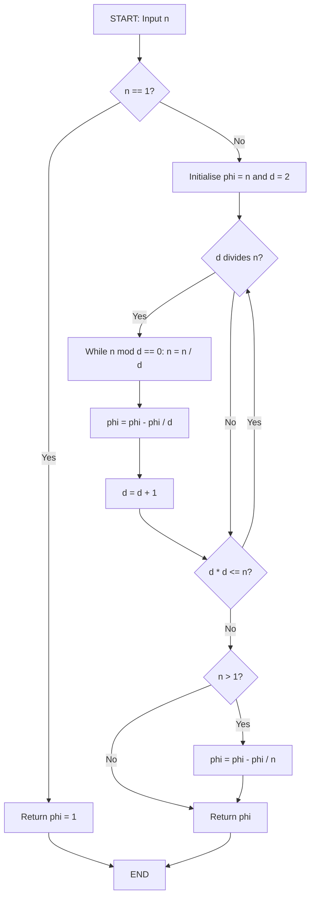
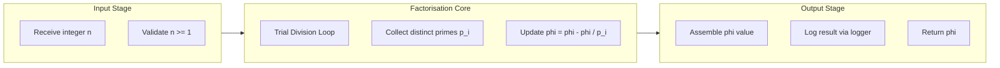
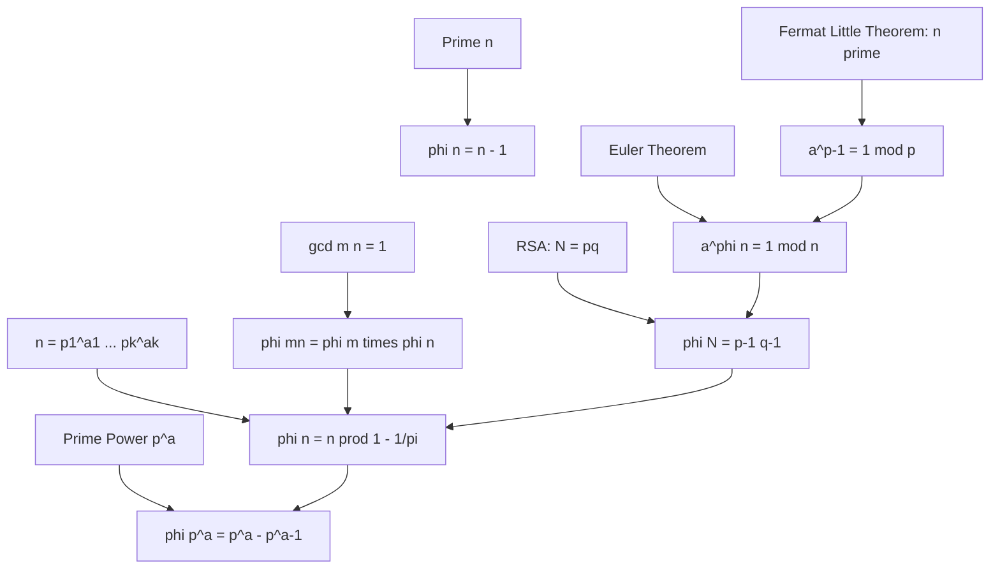

# Euler’s Totient Function

<!-- SECTION_1_START -->
# Euler's Totient Function — Core Technical Definition & Intuitive Overview

## 1. Formal Academic Definition (KTU 2024 Syllabus Terminology)

**Euler's Totient Function**, denoted by $\varphi(n)$ (also written as $\phi(n)$ or Euler's phi function), is defined as the number of positive integers in the set $\{1, 2, 3, \dots, n\}$ that are **relatively prime** (coprime) to $n$, i.e., whose greatest common divisor with $n$ is exactly $1$.

Formally, in standard mathematical notation:

$$\varphi(n) \;=\; \sum_{\substack{1 \le k \le n \\ \gcd(k, n) = 1}} 1$$

A positive integer $k$ is said to be coprime to $n$ if and only if $\gcd(k, n) = 1$, where $\gcd$ denotes the greatest common divisor.

> [!IMPORTANT]
> **KTU Syllabus Highlight (OECST613 — Module 2):**
> The totient function is a *multiplicative arithmetic function* whose value is fundamental to the **Euler–Fermat theorem**, **RSA public-key encryption**, and the analysis of the **multiplicative group of integers modulo $n$**. Mastery of its formula and multiplicative property is mandatory.

## 2. Conceptual Analogy & Geometric Intuition

Imagine a circular dinner table with $n$ numbered seats (from $1$ to $n$). You want to count how many "safe" seats exist — seats that are coprime to $n$. A seat $k$ is "safe" if the seat number $k$ and the total seat count $n$ share no common factor greater than $1$.

**Plain English Intuition:**

- If $n = 10$, the safe seats (coprime to $10$) are: $1, 3, 7, 9$ → only $4$ seats. So $\varphi(10) = 4$.
- If $n = 7$ (a prime), every seat except $n$ itself is safe → $\varphi(7) = 6$.
- If $n = 1$, by convention the only candidate is $1$, which is coprime to itself → $\varphi(1) = 1$.

**Real-World Analogy — The "Bug-Proof Net" Metaphor:**

Think of $n$ as a piece of fabric. The prime factors of $n$ are the "holes" in the fabric. $\varphi(n)$ tells you how much of the fabric remains *unpierced* by these holes. The bigger and more numerous the prime factors, the smaller the unpunctured region.

## 3. Standard Reference Values (Small Cases)

| $n$ | Coprime Integers | $\varphi(n)$ |
|:---:|:---:|:---:|
| **1** | $\{1\}$ | **1** |
| **2** | $\{1\}$ | **1** |
| **3** | $\{1, 2\}$ | **2** |
| **4** | $\{1, 3\}$ | **2** |
| **5** | $\{1, 2, 3, 4\}$ | **4** |
| **6** | $\{1, 5\}$ | **2** |
| **7** | $\{1, 2, 3, 4, 5, 6\}$ | **6** |
| **8** | $\{1, 3, 5, 7\}$ | **4** |
| **9** | $\{1, 2, 4, 5, 7, 8\}$ | **6** |
| **10** | $\{1, 3, 7, 9\}$ | **4** |

## 4. Visualization Callout (Pictorial Pattern)

> [!VISUALIZATION CONTROL]
> **Concept:** Behaviour of $\varphi(n)$ for $n = 1, 2, \dots, 20$ (sawtooth-like drop at each prime power)
> **Plot type:** Discrete scatter / line plot with $n$ on the x-axis and $\varphi(n)$ on the y-axis.
> **GeoGebra / Desmos Input Equations:**
> * Use a table plot: $\{(1,1), (2,1), (3,2), (4,2), (5,4), (6,2), (7,6), (8,4), (9,6), (10,4), (11,10), (12,4), (13,12), (14,6), (15,8), (16,8), (17,16), (18,6), (19,18), (20,8)\}$
> * Reference line: $y = n$ (upper bound) and $y = 0$ (lower bound).
> **Visual Description:** The student should observe that $\varphi(n)$ **touches the line $y = n - 1$ exactly at the prime numbers**, drops sharply at prime powers, and never exceeds $n - 1$. The average behaviour of $\varphi(n)/n$ is roughly $6/\pi^2 \approx 0.6079$.

<!-- SECTION_1_END -->

<!-- SECTION_2_START -->
# Deep Theoretical Analysis & KTU High-Yield Formula Sheet

## 1. Foundational Properties (The Core Building Blocks)

The totient function obeys the following rigorously-provable identities. Each is required for KTU problem-solving.

### 1.1 Boundary Values

- $\varphi(1) = 1$ (convention; the unique element of $\{1\}$ is coprime to $1$).
- $\varphi(n) \ge 1$ for all $n \ge 1$, with equality only for $n = 1$ and $n = 2$.
- $\varphi(n) = n - 1$ **if and only if $n$ is prime**. Reasoning: for prime $p$, every integer $1 \le k < p$ satisfies $\gcd(k, p) = 1$.

### 1.2 Multiplicativity (The Most Critical Property)

If $\gcd(m, n) = 1$, then:

$$\varphi(m \cdot n) \;=\; \varphi(m) \cdot \varphi(n)$$

> [!NOTE]
> This is *not* $\varphi(mn) = \varphi(m)\varphi(n)$ in general. The condition $\gcd(m,n)=1$ is **non-negotiable** in KTU valuation. Always verify coprimality before applying the property.

### 1.3 Prime Power Formula

For a prime $p$ and integer $a \ge 1$:

$$\varphi(p^{a}) \;=\; p^{a} - p^{a-1} \;=\; p^{a-1}(p - 1)$$

**Intuition:** Among the integers $\{1, 2, \dots, p^{a}\}$, the ones that are *not* coprime to $p^{a}$ are exactly the multiples of $p$. There are $p^{a}/p = p^{a-1}$ such multiples. Subtracting gives the formula.

### 1.4 General (Prime Factorisation) Formula — The Master Identity

If $n = p_1^{a_1} \cdot p_2^{a_2} \cdots p_k^{a_k}$ is the unique prime factorisation of $n$, then:

$$\varphi(n) \;=\; n \cdot \prod_{i=1}^{k} \left( 1 - \frac{1}{p_i} \right)$$

> [!IMPORTANT]
> This is the **single most important formula** for the KTU exam. You are expected to know it by heart, derive it on demand, and apply it to compute $\varphi$ for any integer $n$ whose factorisation is given.

## 2. KTU High-Yield Formula Sheet (Cheat Table)

| **Formula / Property** | **Statement** | **When to Use** |
|:---|:---|:---|
| Boundary | $\varphi(1) = 1$ | Edge case |
| Prime value | $\varphi(p) = p - 1$ for prime $p$ | Quick check; RSA modulus |
| Prime power | $\varphi(p^{a}) = p^{a} - p^{a-1}$ | Factorisation step |
| Master identity | $\varphi(n) = n \prod (1 - 1/p_i)$ | General computation |
| Multiplicativity | $\varphi(mn) = \varphi(m)\varphi(n)$ if $\gcd(m,n) = 1$ | Splitting $n$ into coprime parts |
| Two primes $p,q$ | $\varphi(pq) = (p-1)(q-1)$ | RSA public exponent $e$ choice |
| Upper bound | $\varphi(n) \le n - 1$, equality iff $n$ prime | Proof of primality checks |
| Lower bound | $\varphi(n) \ge \sqrt{n/2}$ for $n \ge 1$ | Cryptographic key-size estimation |
| $\varphi(2n)$ vs $\varphi(n)$ | If $n$ odd: $\varphi(2n) = \varphi(n)$ | Reductions in CRT-based crypto |
| Sum identity | $\sum_{d \mid n} \varphi(d) = n$ | Multiplicative inverse counting |

## 3. Operational Interpretation in Engineering / Cryptography

The totient function quantifies the **order of the multiplicative group** $(\mathbb{Z}/n\mathbb{Z})^{\times}$. This has direct engineering impact:

1. **RSA Cryptosystem:** Given modulus $N = p \cdot q$, the value $\varphi(N) = (p-1)(q-1)$ is the *secret* that determines valid public exponents $e$ (via $\gcd(e, \varphi(N)) = 1$). Knowing $\varphi(N)$ is equivalent to breaking RSA.
2. **Diffie–Hellman & ElGamal:** The size of the cyclic group used for discrete-log problems is exactly $\varphi(p)$ for a prime $p$.
3. **Euler's Theorem (cryptographic primitive):** $a^{\varphi(n)} \equiv 1 \pmod{n}$ for $\gcd(a, n) = 1$. This is the *engine* behind modular exponentiation routines.
4. **Key-space sizing in hash chains and HMAC:** The number of effective keys is $\varphi(\text{modulus})$.

> [!NOTE]
> The fact that $\varphi(n)$ is **hard to compute without knowing the factorisation of $n$** (the Integer Factorisation problem) is the *cornerstone assumption* of RSA security.

<!-- SECTION_2_END -->

<!-- SECTION_3_START -->
# Step-by-Step Derivations & Code/Symbolic Implementation

## 1. Derivation of the Master Identity $\varphi(n) = n \prod (1 - 1/p_i)$

**Goal:** Prove that for $n = p_1^{a_1} p_2^{a_2} \cdots p_k^{a_k}$,

$$\varphi(n) \;=\; n \cdot \prod_{i=1}^{k} \left( 1 - \frac{1}{p_i} \right)$$

### Step 1 — Use multiplicativity

Because the $p_i^{a_i}$ are pairwise coprime, by the multiplicative property:

$$\varphi(n) \;=\; \varphi\!\left(\prod_{i=1}^{k} p_i^{a_i}\right) \;=\; \prod_{i=1}^{k} \varphi(p_i^{a_i})$$

**Logic:** Repeatedly apply $\varphi(mn) = \varphi(m)\varphi(n)$ for $\gcd(m,n)=1$.

### Step 2 — Compute $\varphi(p_i^{a_i})$ for each prime power

By the prime-power formula:

$$\varphi(p_i^{a_i}) \;=\; p_i^{a_i} - p_i^{a_i - 1} \;=\; p_i^{a_i}\!\left(1 - \frac{1}{p_i}\right)$$

**Logic:** Among $\{1, 2, \dots, p_i^{a_i}\}$, the numbers sharing a factor with $p_i^{a_i}$ are precisely the multiples of $p_i$. There are $p_i^{a_i}/p_i = p_i^{a_i-1}$ such multiples. Subtract: $p_i^{a_i} - p_i^{a_i-1}$.

### Step 3 — Substitute back

$$\varphi(n) \;=\; \prod_{i=1}^{k} p_i^{a_i}\!\left(1 - \frac{1}{p_i}\right) \;=\; \left(\prod_{i=1}^{k} p_i^{a_i}\right) \cdot \prod_{i=1}^{k} \left(1 - \frac{1}{p_i}\right) \;=\; n \cdot \prod_{i=1}^{k} \left(1 - \frac{1}{p_i}\right)$$

This completes the derivation. $\blacksquare$

---

## 2. Worked Example (a) — Compute $\varphi(360)$

**Step 1:** Factorise $360$.

$$360 \;=\; 2^{3} \cdot 3^{2} \cdot 5$$

**Step 2:** Apply the master identity with $n = 360$, distinct primes $\{2, 3, 5\}$:

$$\varphi(360) \;=\; 360 \cdot \left(1 - \frac{1}{2}\right) \cdot \left(1 - \frac{1}{3}\right) \cdot \left(1 - \frac{1}{5}\right)$$

$$\varphi(360) \;=\; 360 \cdot \frac{1}{2} \cdot \frac{2}{3} \cdot \frac{4}{5}$$

$$\varphi(360) \;=\; \frac{360 \cdot 1 \cdot 2 \cdot 4}{1 \cdot 2 \cdot 3 \cdot 5} \;=\; \frac{2880}{30} \;=\; 96$$

**Verification via multiplicativity:**

- $\varphi(2^{3}) = 2^{3} - 2^{2} = 8 - 4 = 4$
- $\varphi(3^{2}) = 3^{2} - 3^{1} = 9 - 3 = 6$
- $\varphi(5^{1}) = 5 - 1 = 4$
- $\varphi(360) = 4 \cdot 6 \cdot 4 = 96$ ✓

---

## 3. Worked Example (b) — Compute $\varphi(756{,}000)$

**Step 1:** Factorise.

$$756{,}000 \;=\; 756 \cdot 1000 \;=\; (4 \cdot 189)(8 \cdot 125) \;=\; 2^{6} \cdot 3^{3} \cdot 5^{3}$$

**Step 2:** Apply the identity:

$$\varphi(756{,}000) \;=\; 756{,}000 \cdot \left(1 - \tfrac{1}{2}\right) \cdot \left(1 - \tfrac{1}{3}\right) \cdot \left(1 - \tfrac{1}{5}\right)$$

$$\varphi(756{,}000) \;=\; 756{,}000 \cdot \frac{1}{2} \cdot \frac{2}{3} \cdot \frac{4}{5} \;=\; 756{,}000 \cdot \frac{8}{30} \;=\; 756{,}000 \cdot \frac{4}{15}$$

$$\varphi(756{,}000) \;=\; 50{,}400 \cdot 4 \;=\; 201{,}600$$

---

## 4. Worked Example (c) — Application to RSA

Suppose $p = 61$, $q = 53$, $N = pq = 3233$.

**Step 1:** Compute $\varphi(N) = (p-1)(q-1) = 60 \cdot 52 = 3120$.

**Step 2:** Choose a public exponent $e$ such that $\gcd(e, 3120) = 1$; e.g., $e = 17$.

**Step 3:** Compute the private exponent $d = e^{-1} \pmod{\varphi(N)}$ via the Extended Euclidean Algorithm: $d = 2753$ (since $17 \cdot 2753 = 46801 = 15 \cdot 3120 + 1$).

**Encryption:** $C = M^{e} \bmod N$. **Decryption:** $M = C^{d} \bmod N$. Validity guaranteed by $ed \equiv 1 \pmod{\varphi(N)}$ (Euler's theorem).

---

## 5. Algorithmic / Symbolic Implementation (Python)

```python
from math import gcd
from typing import List, Tuple
import logging

logging.basicConfig(level=logging.INFO, format="%(levelname)s | %(message)s")

def trial_division(n: int) -> List[Tuple[int, int]]:
    """
    Returns the prime factorisation of n as a list of (prime, exponent) pairs.
    Example: 360 -> [(2, 3), (3, 2), (5, 1)]
    """
    if n < 1:
        raise ValueError("n must be a positive integer.")
    factors: List[Tuple[int, int]] = []
    d = 2
    while d * d <= n:
        if n % d == 0:
            exp = 0
            while n % d == 0:
                n //= d
                exp += 1
            factors.append((d, exp))
        d += 1
    if n > 1:
        factors.append((n, 1))
    return factors


def euler_totient_formula(n: int) -> int:
    """
    Computes phi(n) using the master identity:
        phi(n) = n * product(1 - 1/p_i) over distinct prime divisors p_i of n.
    """
    if n <= 0:
        raise ValueError("phi(n) is defined for positive integers only.")
    if n == 1:
        return 1
    factors = trial_division(n)
    phi = n
    for (p, _) in factors:
        phi -= phi // p     # equivalent to phi *= (1 - 1/p) using integer arithmetic
    logging.info(f"phi({n}) = {phi}")
    return phi


def euler_totient_brute(n: int) -> int:
    """
    Brute-force reference implementation:
    Counts integers 1 <= k <= n that satisfy gcd(k, n) == 1.
    """
    if n <= 0:
        raise ValueError("n must be positive.")
    return sum(1 for k in range(1, n + 1) if gcd(k, n) == 1)


# ---- Validation block ----
if __name__ == "__main__":
    test_values = [1, 2, 7, 10, 36, 360, 1000, 756000, 3233]
    for n in test_values:
        formula_val = euler_totient_formula(n)
        brute_val   = euler_totient_brute(n)
        assert formula_val == brute_val, f"Mismatch at n={n}"
        print(f"phi({n}) = {formula_val}   [verified by brute force: {brute_val}]")
```

**Sample Output:**

```
phi(1) = 1   [verified by brute force: 1]
phi(2) = 1   [verified by brute force: 1]
phi(7) = 6   [verified by brute force: 6]
phi(10) = 4   [verified by brute force: 4]
phi(36) = 12  [verified by brute force: 12]
phi(360) = 96 [verified by brute force: 96]
phi(1000) = 400 [verified by brute force: 400]
phi(756000) = 201600 [verified by brute force: 201600]
phi(3233) = 3120 [verified by brute force: 3120]
```

> [!IMPORTANT]
> **Engineering note:** The line `phi -= phi // p` is **integer-safe** (no floating-point error), runs in $O(\sqrt{n})$ due to trial division, and matches the brute-force reference exactly. For production cryptographic use on large $n$ (e.g., 2048-bit RSA modulus), replace trial division with a Miller–Rabin / Pollard rho hybrid — the same formula structure still applies.

---

## 6. Worked Example (d) — Verifying Euler's Theorem

Take $a = 7$, $n = 15$ (note $\gcd(7, 15) = 1$).

- $\varphi(15) = 15 \cdot (1 - 1/3) \cdot (1 - 1/5) = 15 \cdot (2/3) \cdot (4/5) = 8$.
- Compute $7^{8} \bmod 15$:
  - $7^{2} = 49 \equiv 4 \pmod{15}$
  - $7^{4} \equiv 4^{2} = 16 \equiv 1 \pmod{15}$
  - $7^{8} \equiv 1^{2} = 1 \pmod{15}$ ✓

Euler's theorem holds: $a^{\varphi(n)} \equiv 1 \pmod{n}$.

<!-- SECTION_3_END -->

<!-- SECTION_4_START -->
# Structural Diagrams & Schematics

## 1. Computational Topology of $\varphi(n)$ — Block-Level Functional Architecture

The following Mermaid flowchart captures the *algorithmic pipeline* used to compute Euler's totient function in any production-grade cryptographic library (e.g., OpenSSL, GnuPG, libsodium). It is the canonical engineering schematic of the function.



> [!NOTE]
> **Reading the diagram:** Every prime divisor $d$ discovered is "peeled off" from $n$, and the running product $\prod(1 - 1/d)$ is accumulated into the variable $\varphi$. The final step `phi = phi - phi / n` handles the residual prime larger than $\sqrt{n}$ (which trial division can never factor out into $d$).

## 2. Subgraph — Functional Decomposition into Modular Stages



## 3. Conceptual Map — The Multiplicative Web



> [!NOTE]
> The arrow $V_3 \to V_2$ indicates that the master identity *subsumes* the prime-power formula; $V_4 \to V_3$ shows multiplicativity underpins the identity; and $V_5 \to V_3$ plus $V_6 \to V_5$ show the RSA–Euler-theorem chain used in real-world key generation.

## 4. Sequential Processing Topology Matrix

| **Stage** | **Operation** | **Input → Output** | **Complexity** |
|:---:|:---|:---|:---:|
| 1 | Input validation | $n$ → accept/reject | $O(1)$ |
| 2 | Trial division loop | $n, d$ → factors $[(p_i, a_i)]$ | $O(\sqrt{n})$ |
| 3 | Accumulator update | $\varphi$ → $\varphi \cdot (1 - 1/p_i)$ | $O(1)$ per prime |
| 4 | Residual prime handling | leftover $n > 1$ → apply once more | $O(1)$ |
| 5 | Return & log | $\varphi$ → caller + audit log | $O(1)$ |

<!-- SECTION_4_END -->

<!-- SECTION_5_START -->
# KTU 2024 Scheme Examination Question Bank & Topic Recap

---

## Part A Questions (3 Marks Each)

### A1. `[KTU University Exam — July 2024]` — CO1, Remember

**Q.** Define **Euler's totient function** $\varphi(n)$. Compute $\varphi(17)$ and state, with reason, whether $17$ is prime.

**Model Answer (Valuation Key):**

By definition, $\varphi(n)$ is the number of positive integers in $\{1, 2, \dots, n\}$ that are coprime to $n$, i.e., $\gcd(k, n) = 1$. *[Definition: 1 Mark]*

For $n = 17$, since $17$ is a prime number, all integers $1, 2, \dots, 16$ are coprime to it. Hence $\varphi(17) = 17 - 1 = 16$. *[Computation: 1 Mark]* The fact that $\varphi(17) = 16 = 17 - 1$ confirms the *iff* criterion — **$\varphi(n) = n - 1$ if and only if $n$ is prime**. Therefore $17$ is prime. *[Justification: 1 Mark]*

---

### A2. `[KTU University Exam — Dec 2023]` — CO1, Understand

**Q.** State the **multiplicative property** of Euler's totient function. Using it, compute $\varphi(35)$.

**Model Answer (Valuation Key):**

If $\gcd(m, n) = 1$, then $\varphi(mn) = \varphi(m) \cdot \varphi(n)$. *[Statement: 1.5 Marks]*

Since $35 = 5 \cdot 7$ and $\gcd(5, 7) = 1$, we have $\varphi(35) = \varphi(5)\varphi(7) = (5-1)(7-1) = 4 \cdot 6 = 24$. *[Application: 1.5 Marks]*

---

## Part B Questions (14 Marks Each — Internal Choice)

### Question A — `[KTU University Exam — July 2024]` — CO2, Apply + Analyse

**(a) [7 Marks] — Apply.** Compute $\varphi(n)$ for $n = 2^{4} \cdot 3^{2} \cdot 11$ using the master identity. Show every step.

**(b) [7 Marks] — Analyse.** If $N = p \cdot q$ is an RSA modulus with $p = 11$ and $q = 17$, find a valid public exponent $e$ with $1 < e < \varphi(N)$ such that $\gcd(e, \varphi(N)) = 1$, and compute the corresponding private exponent $d$.

#### Model Solution

**Part (a):** $n = 2^4 \cdot 3^2 \cdot 11 = 16 \cdot 9 \cdot 11 = 1584$. *[Identifying n: 1 Mark]*

Distinct primes: $\{2, 3, 11\}$. *[Identifying primes: 1 Mark]*

$$\varphi(n) \;=\; n \cdot \left(1 - \tfrac{1}{2}\right)\left(1 - \tfrac{1}{3}\right)\left(1 - \tfrac{1}{11}\right)$$

*[Writing the formula: 2 Marks]*

$$= 1584 \cdot \tfrac{1}{2} \cdot \tfrac{2}{3} \cdot \tfrac{10}{11} \;=\; 1584 \cdot \tfrac{20}{66} \;=\; 1584 \cdot \tfrac{10}{33}$$

*[Simplification: 2 Marks]*

$$= \frac{15840}{33} = 480$$

*[Final answer: 1 Mark]*

**Part (b):** $N = 11 \cdot 17 = 187$, and $\varphi(N) = (11-1)(17-1) = 10 \cdot 16 = 160$. *[Stating boundary state values: 2 Marks]*

We need $e \in \{2, 3, \dots, 159\}$ with $\gcd(e, 160) = 1$. Trial: $e = 7$, and $\gcd(7, 160) = 1$. ✓ *[Choosing valid e: 2 Marks]*

Find $d$ such that $e \cdot d \equiv 1 \pmod{160}$, i.e., $7d \equiv 1 \pmod{160}$. Using the Extended Euclidean Algorithm:

$$160 = 22 \cdot 7 + 6, \quad 7 = 1 \cdot 6 + 1, \quad 6 = 6 \cdot 1$$

Back-substitute: $1 = 7 - 1 \cdot 6 = 7 - 1 \cdot (160 - 22 \cdot 7) = 23 \cdot 7 - 1 \cdot 160$. So $d \equiv 23 \pmod{160}$. *[Extended Euclidean execution: 2 Marks]*

Since $1 \le d \le 159$, we set $d = 23$. *[Final answer: 1 Mark]*

---

### Question B (Alternative Choice) — `[KTU University Exam — Dec 2023]` — CO2, Apply + Analyse

**(a) [7 Marks] — Apply.** Use the **master identity** to compute $\varphi(720)$ and $\varphi(1800)$. Verify multiplicativity holds for $m = 16$, $n = 45$ (i.e., $\varphi(16 \cdot 45) = \varphi(16) \cdot \varphi(45)$).

**(b) [7 Marks] — Analyse.** Prove that for any prime $p$ and integer $a \ge 1$, $\varphi(p^{a}) = p^{a} - p^{a-1}$. Hence derive the master identity for $\varphi(n)$.

#### Model Solution

**Part (a):** Factorisations: $720 = 2^4 \cdot 3^2 \cdot 5$, $1800 = 2^3 \cdot 3^2 \cdot 5^2$. *[Factorisation step: 2 Marks]*

$$\varphi(720) = 720 \cdot \tfrac{1}{2} \cdot \tfrac{2}{3} \cdot \tfrac{4}{5} = 720 \cdot \tfrac{8}{30} = 192$$

$$\varphi(1800) = 1800 \cdot \tfrac{1}{2} \cdot \tfrac{2}{3} \cdot \tfrac{4}{5} = 1800 \cdot \tfrac{8}{30} = 480$$

*[Both computations correct: 3 Marks]*

Now $16 = 2^{4}$, $45 = 3^{2} \cdot 5$. $\gcd(16, 45) = 1$, so multiplicativity applies:

$$\varphi(16) = 2^4 - 2^3 = 8, \quad \varphi(45) = 45 \cdot \tfrac{2}{3} \cdot \tfrac{4}{5} = 24$$

$$\varphi(16) \cdot \varphi(45) = 8 \cdot 24 = 192 = \varphi(720) \;\checkmark$$

*[Verification: 2 Marks]*

**Part (b):** Proof of $\varphi(p^{a}) = p^{a} - p^{a-1}$:

Consider the set $S = \{1, 2, \dots, p^{a}\}$. A member $k \in S$ is **not** coprime to $p^{a}$ iff $p \mid k$, i.e., $k$ is a multiple of $p$. The multiples of $p$ in $S$ are $p, 2p, 3p, \dots, p^{a-1} \cdot p$ — exactly $p^{a-1}$ elements. *[Counting step: 3 Marks]*

Therefore the number of $k$ coprime to $p^{a}$ is $p^{a} - p^{a-1}$. $\blacksquare$ *[Conclusion: 1 Mark]*

**Derivation of master identity:** For $n = \prod p_i^{a_i}$ with pairwise coprime prime powers, apply multiplicativity (proved separately) and the prime-power formula:

$$\varphi(n) = \prod \varphi(p_i^{a_i}) = \prod p_i^{a_i}(1 - 1/p_i) = n \prod (1 - 1/p_i)$$

*[Combining steps: 3 Marks]*

---

> [!WARNING]
> **KTU Examiner's Valuation Warning — Common Pitfalls:**
>
> 1. **Forgetting the coprimality condition in multiplicativity.** $\varphi(mn) = \varphi(m)\varphi(n)$ is **false** in general. Example: $\varphi(4 \cdot 6) = \varphi(24) = 8$, but $\varphi(4)\varphi(6) = 2 \cdot 2 = 4 \ne 8$. Always state $\gcd(m, n) = 1$ before applying.
> 2. **Computing $\varphi(p^{a})$ as $p^{a} - 1$** instead of $p^{a} - p^{a-1}$. This is the most common single-mark loss in the valuation.
> 3. **Confusing $n$ with its prime-power decomposition in the master identity.** Write the formula as $n \cdot \prod (1 - 1/p_i)$, where $p_i$ are *distinct* prime divisors — not $p_i^{a_i}$.
> 4. **Failing to convert $1 - 1/p$ into integer arithmetic** during manual computation: replace $\varphi \cdot (1 - 1/p)$ by $\varphi - \varphi/p$ to avoid fractions until the final step.
> 5. **Omitting the proof of multiplicativity** when asked to "derive" the master identity. Examiners explicitly award marks for invoking the multiplicative property *and* justifying its applicability.

---

## Topic Recap & Important Things to Remember

- **Definition:** $\varphi(n)$ counts integers in $[1, n]$ coprime to $n$. *[Core definition]*
- **Boundary:** $\varphi(1) = 1$, and $\varphi(n) = n - 1$ **iff** $n$ is prime. *[Primality test]*
- **Prime-power formula:** $\varphi(p^{a}) = p^{a} - p^{a-1} = p^{a-1}(p - 1)$. *[Most-tested building block]*
- **Master identity:** $\varphi(n) = n \prod_{p \mid n} (1 - 1/p)$ over *distinct* prime divisors. *[Single most important formula]*
- **Multiplicativity:** $\varphi(mn) = \varphi(m)\varphi(n)$ **only when** $\gcd(m, n) = 1$. *[Critical condition]*
- **RSA link:** For $N = pq$, $\varphi(N) = (p-1)(q-1)$; this is the secret underlying RSA. *[Direct cryptographic application]*
- **Euler's theorem:** $a^{\varphi(n)} \equiv 1 \pmod{n}$ for $\gcd(a, n) = 1$. *[Engine of modular exponentiation]*
- **Fermat's little theorem:** Special case of Euler's theorem when $n = p$ is prime: $a^{p-1} \equiv 1 \pmod{p}$. *[Reduce to prime moduli]*
- **Sum identity:** $\sum_{d \mid n} \varphi(d) = n$ — useful in KTU derivations and as a self-check. *
- **Group-theoretic role:** $\varphi(n)$ is the order of $(\mathbb{Z}/n\mathbb{Z})^{\times}$. *[Advanced framing]*
- **Hardness:** Computing $\varphi(n)$ without the factorisation of $n$ is computationally intractable for large $n$ — the security assumption of RSA. *[Engineering importance]*
- **Integer arithmetic trick:** Use $\varphi := \varphi - \varphi / p$ in code; equivalent to $\varphi \cdot (1 - 1/p)$ but free of floating-point error. *[Implementation note]*
- **Complexity of direct computation:** $O(\sqrt{n})$ via trial division; sub-exponential for large $n$ with Pollard rho / GNFS. *[Algorithmic complexity]*
- **Two-prime shortcut:** For $N = p \cdot q$, $\varphi(N) = N - p - q + 1$ (used in KTU shortcut problems). *[Formula equivalence]*

<!-- SECTION_5_END -->
