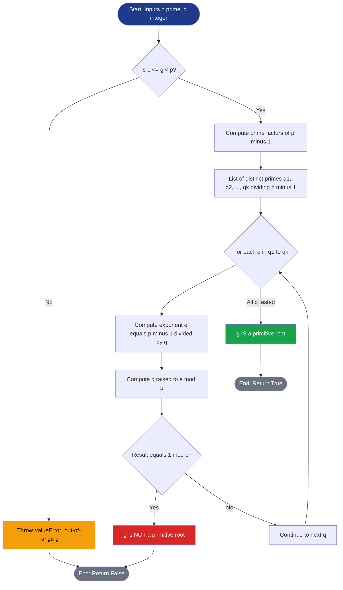
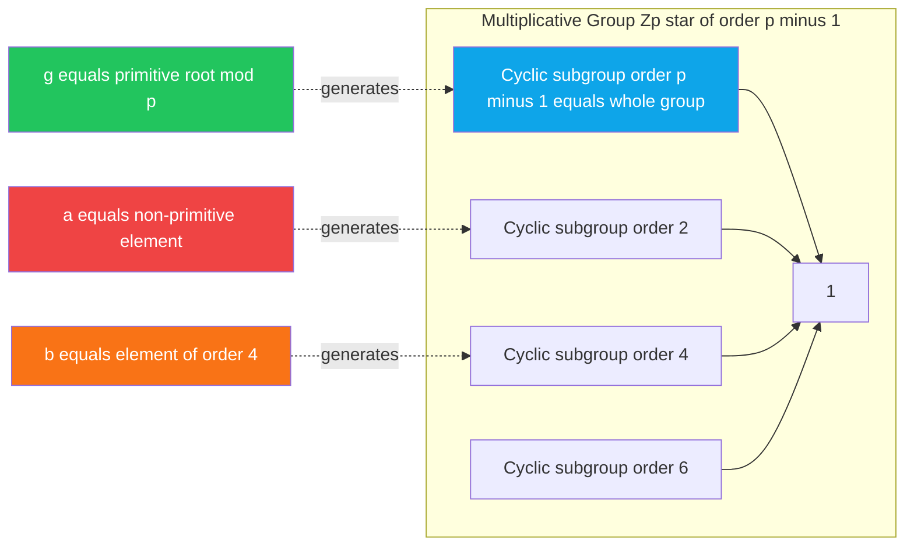
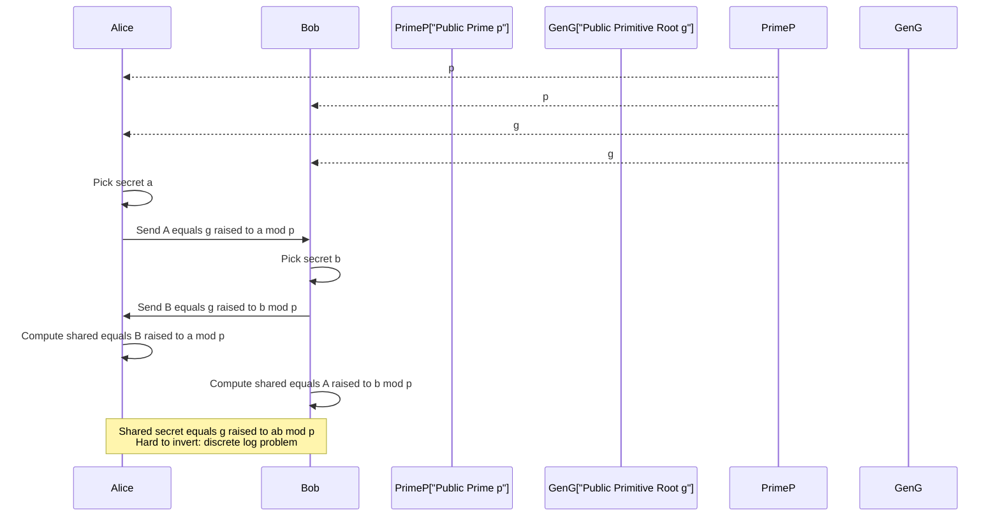

# Existence of Primitive Roots for Primes

<!-- SECTION_1_START -->
# Primitive Roots for Primes — Core Definition & Intuitive Overview

## 1.1 Formal Definition (KTU 2024 Syllabus Terminology)

> [!IMPORTANT]
> **Primitive Root (Generator) Modulo a Prime**
> Let $p$ be a prime number. An integer $g$ is called a **primitive root modulo $p$** if the multiplicative order of $g$ modulo $p$ is exactly $p - 1$. Equivalently, the set
> $$\{g^1 \bmod p,\; g^2 \bmod p,\; g^3 \bmod p,\; \ldots,\; g^{p-1} \bmod p\}$$
> is a **complete residue system** of the non-zero elements modulo $p$, i.e., it equals the set $\{1, 2, 3, \ldots, p-1\}$ in some order.

The **order** of an element $a$ (with $\gcd(a,p) = 1$) modulo $p$ is the smallest positive integer $d$ such that
$$a^d \equiv 1 \pmod{p}$$

When this order equals $p - 1$, the element is a primitive root.

> [!NOTE]
> **Gauss's Existence Theorem (1801):** For every prime $p$, there exists at least one primitive root. In other words, the multiplicative group $(\mathbb{Z}/p\mathbb{Z})^{\times}$ is **cyclic** of order $p - 1$.

## 1.2 Conceptual Analogy — "The Cryptographic Clock"

Imagine a clock with $p - 1 = 12$ hour positions. A primitive root is a special "tick" $g$ such that successive multiplications by $g$ modulo $p$ (i.e., $g^1, g^2, g^3, \ldots$) visit **every** non-zero residue exactly once before returning to $1$. The order of $g$ is the "period" of this cycle.

- A **non-primitive** root (say $g = 4 \bmod 13$): its powers cycle through only a small subset $\{1, 4, 3, 12\}$ of size $4$, never hitting all $12$ residues.
- A **primitive** root (say $g = 2 \bmod 13$): its powers $\{2, 4, 8, 3, 6, 12, 11, 9, 5, 10, 7, 1\}$ visit **all 12** non-zero residues.

> [!TIP]
> Think of a primitive root as a "**master key**" — from it, you can generate every other non-zero element by exponentiation. This is precisely why primitive roots power modern public-key systems like **Diffie–Hellman key exchange**, **ElGamal encryption**, and the **Digital Signature Algorithm (DSA)**.

## 1.3 Visualizing Powers of a Primitive Root

> [!VISUALIZATION CONTROL]
> **Concept:** Distribution of powers of $g = 2 \bmod 13$ on a number line.
> **GeoGebra / Desmos Input Equations:**
> * `p = 13` (modulus)
> * `g = 2` (candidate primitive root)
> * `L = {1, 2, 3, 4, 5, 6, 7, 8, 9, 10, 11, 12}` (non-zero residues)
> * `PowerSet(k) = (g^k) mod p` for $k = 1, 2, \ldots, 12$
> **Visual Description:** Plot the points $(k, g^k \bmod p)$ for $k = 1, \ldots, 12$. A primitive root will scatter the outputs uniformly across $\{1, \ldots, 12\}$, confirming that every non-zero residue is hit exactly once.

## 1.4 Why This Matters in Cryptography

> [!IMPORTANT]
> A primitive root $g$ in $\mathbb{Z}_p^{\times}$ guarantees the **existence of discrete logarithms** for every element $y \in \{1, 2, \ldots, p-1\}$: there always exists a unique $x \in \{0, 1, \ldots, p-2\}$ such that $g^x \equiv y \pmod{p}$. This **discrete logarithm problem (DLP)** is computationally hard for suitably large primes and is the cornerstone of modern asymmetric cryptography.
<!-- SECTION_1_END -->

<!-- SECTION_2_START -->
# Deep Theoretical Analysis & KTU High-Yield Formula Sheet

## 2.1 Structural Properties of Primitive Roots

Let $p$ be a prime. The multiplicative group $\mathbb{Z}_p^{\times} = \{1, 2, \ldots, p-1\}$ has the following key properties:

- **Group Order:** $|\mathbb{Z}_p^{\times}| = p - 1$
- **Cyclic Nature:** $\mathbb{Z}_p^{\times}$ is a **cyclic group** of order $p - 1$ (Gauss's theorem).
- **Generators = Primitive Roots:** Every generator of $\mathbb{Z}_p^{\times}$ is a primitive root, and every primitive root is a generator.
- **Existence of $g$:** There is at least one $g \in \mathbb{Z}_p^{\times}$ whose cyclic subgroup $\langle g \rangle = \mathbb{Z}_p^{\times}$.

## 2.2 Order of an Element — Key Lemma

> [!NOTE]
> **Lemma (Order Divisibility):** If $\gcd(a, p) = 1$ and the order of $a$ modulo $p$ is $d$, then $a^k \equiv 1 \pmod{p}$ if and only if $d \mid k$.

Consequence: $a$ is a primitive root iff $a^{(p-1)/q} \not\equiv 1 \pmod{p}$ for **every prime divisor** $q$ of $p - 1$. This yields the **practical test** for primitivity.

## 2.3 The Existence Theorem — Statement

> [!IMPORTANT]
> **Theorem 2.1 (Existence of Primitive Roots for Primes):** For every prime $p$, there exists an integer $g$ such that $g$ is a primitive root modulo $p$.

## 2.4 The Counting Theorem — Number of Primitive Roots

> [!IMPORTANT]
> **Theorem 2.2 (Counting Primitive Roots):** If $p$ is a prime, the **number of distinct primitive roots** modulo $p$ is
> $$\phi(p - 1)$$
> where $\phi$ is Euler's totient function.

Examples:

| Prime $p$ | $p - 1$ | $\phi(p-1)$ | Number of Primitive Roots |
| :---: | :---: | :---: | :---: |
| 5 | 4 | 2 | 2 (namely $2, 3$) |
| 7 | 6 | 2 | 2 (namely $3, 5$) |
| 11 | 10 | 4 | 4 |
| 13 | 12 | 4 | 4 |
| 17 | 16 | 8 | 8 |
| 23 | 22 | 10 | 10 |
| 29 | 28 | 12 | 12 |

> [!TIP]
> Notice that **roughly 37\% of non-zero residues** are primitive roots for large primes (since $\phi(n)/n \to 6/\pi^2 \approx 0.6079$ on average, and $\phi(p-1)/(p-1)$ is comparable). This is why finding a primitive root in practice is **fast** — random trial works efficiently.

## 2.5 KTU Formula Sheet / Cheat Sheet

> [!NOTE]
> The following table consolidates **every formula, condition, and quantity** you will need to solve KTU exam questions on this topic.

| Concept | Formula / Condition | Notes |
| :--- | :--- | :--- |
| Group of units | $\mathbb{Z}_p^{\times} = \{1, 2, \ldots, p-1\}$ | Order is $p - 1$ |
| Definition of primitive root | $\text{ord}_p(g) = p - 1$ | Equivalent to $\langle g \rangle = \mathbb{Z}_p^{\times}$ |
| Order divisibility | $a^k \equiv 1 \pmod{p} \iff \text{ord}_p(a) \mid k$ | Critical lemma |
| Primitivity test | $g$ is a primitive root $\iff g^{(p-1)/q} \not\equiv 1 \pmod{p}$ for all primes $q \mid (p-1)$ | Efficient $O(\log p)$ exponentiations |
| Number of primitive roots | $\phi(p - 1)$ | Euler's totient of $p - 1$ |
| Cyclic decomposition | Every $a \in \mathbb{Z}_p^{\times}$ lies in a unique cyclic subgroup of order $d$, where $d \mid (p-1)$ | Lagrange-type structure |
| Fermat's little theorem | $a^{p-1} \equiv 1 \pmod{p}$ for $\gcd(a, p) = 1$ | Upper bound on order |
| Cyclotomic polynomial link | Primitive roots are roots of $\Phi_{p-1}(x) \pmod{p}$ | $\Phi_n$ is $n$-th cyclotomic polynomial |
| Discrete log existence | $y = g^x \bmod p$ has unique $x \in \{0, \ldots, p-2\}$ for every $y$ | $g$ primitive root |
| Cyclic group isomorphism | $\mathbb{Z}_p^{\times} \cong \mathbb{Z}/(p-1)\mathbb{Z}$ | Generated by primitive root $g$ |

## 2.6 Real-World Engineering Utility

In production cryptographic systems, primitive roots underpin:

- **Diffie–Hellman Key Exchange (DHKE):** Alice sends $g^a \bmod p$, Bob sends $g^b \bmod p$; shared secret is $g^{ab} \bmod p$.
- **ElGamal Encryption:** Security reduces to DLP in $\mathbb{Z}_p^{\times}$.
- **Digital Signature Algorithm (DSA):** Uses a prime $p$, a prime divisor $q$ of $p - 1$, and a primitive root $g$ of order $q$ modulo $p$.
- **Schnorr Groups:** Subgroups of $\mathbb{Z}_p^{\times}$ of large prime order, used in zero-knowledge proofs (zk-SNARKs, Zcash).
- **Smart Cards & TLS Handshakes:** Ephemeral DH uses primitive-root structures for forward secrecy.
<!-- SECTION_2_END -->

<!-- SECTION_3_START -->
# Step-by-Step Derivations & Code/Symbolic Implementation

## 3.1 Proof of the Existence Theorem (Theorem 2.1)

We prove that for any prime $p$, the multiplicative group $\mathbb{Z}_p^{\times}$ is cyclic.

### Setup

Let $p$ be a prime. Consider the multiset of orders of all elements in $\mathbb{Z}_p^{\times}$. Denote by $\psi(d)$ the number of elements of order exactly $d$ in $\mathbb{Z}_p^{\times}$.

### Step 1 — Order Divisibility Constraint

For any $a \in \mathbb{Z}_p^{\times}$ with $\text{ord}_p(a) = d$, by Lagrange's theorem applied to the cyclic subgroup $\langle a \rangle$, we must have $d \mid (p-1)$.

### Step 2 — Maximum Order Equals $p - 1$

We claim there exists at least one element $a$ with order exactly $p - 1$. Suppose not; then every element has order strictly less than $p - 1$. Let $M$ be the maximum such order. Then $M < p - 1$ and $M \mid (p-1)$.

Since $M$ is the maximum order, the equation $x^M \equiv 1 \pmod{p}$ has **more than $M$ solutions** (every element of $\mathbb{Z}_p^{\times}$ is a solution). But a polynomial congruence $x^M - 1 \equiv 0 \pmod{p}$ over the field $\mathbb{Z}_p$ can have **at most $M$ roots**.

**Contradiction.** Therefore, some element must have order exactly $p - 1$.

### Step 3 — Verification of Step 2 Count

> [!NOTE]
> The crucial observation: if every element had order dividing $M < p - 1$, then for each such element $a$, we have $a^M \equiv 1 \pmod{p}$. This means **all $p - 1$ elements of $\mathbb{Z}_p^{\times}$** are roots of $x^M - 1 \pmod{p}$. But the polynomial $x^M - 1$ over the field $\mathbb{F}_p$ has **at most $M$ roots**. Since $p - 1 > M$, this is impossible.

### Step 4 — Conclusion

Any element of order $p - 1$ is, by definition, a primitive root modulo $p$. Hence **at least one primitive root exists** for every prime $p$. $\blacksquare$

## 3.2 Proof of the Counting Theorem (Theorem 2.2)

We prove that the number of primitive roots modulo $p$ is exactly $\phi(p - 1)$.

### Step 1 — Count of Order-$(p-1)$ Elements

Let $g$ be any primitive root (whose existence is from Theorem 2.1). Then the set of primitive roots is precisely the set of **generators** of the cyclic group $\mathbb{Z}_p^{\times} \cong \mathbb{Z}/(p-1)\mathbb{Z}$.

### Step 2 — Generators of a Cyclic Group

In the additive group $\mathbb{Z}/(p-1)\mathbb{Z}$, an element $\bar{k}$ generates the whole group **if and only if $\gcd(k, p-1) = 1$**. This is the classical characterization of units modulo $n$.

### Step 3 — Translation to Multiplicative Form

Mapping back: $g^k$ is a primitive root iff $\gcd(k, p - 1) = 1$. The number of such $k$ in $\{0, 1, \ldots, p - 2\}$ is exactly $\phi(p - 1)$.

### Step 4 — Final Count

Therefore,
$$\#\{\text{primitive roots mod } p\} \;=\; \phi(p - 1). \quad \blacksquare$$

## 3.3 Worked Example — Primitivity Test for $p = 23$

We test whether $g = 5$ is a primitive root modulo $23$.

### Setup

$$p - 1 = 22 = 2 \times 11$$

Prime divisors of $22$ are $q_1 = 2$ and $q_2 = 11$. The test requires checking that $g^{(p-1)/q} \not\equiv 1 \pmod{p}$ for both $q = 2$ and $q = 11$.

### Check 1: $q = 2$

$$5^{22/2} = 5^{11} \bmod 23$$

Compute step by step:

$$
\begin{aligned}
5^1 &\equiv 5 \pmod{23} \\
5^2 &\equiv 25 \equiv 2 \pmod{23} \\
5^4 &\equiv 2^2 \equiv 4 \pmod{23} \\
5^8 &\equiv 4^2 \equiv 16 \pmod{23} \\
5^{11} = 5^8 \cdot 5^2 \cdot 5^1 &\equiv 16 \cdot 2 \cdot 5 \pmod{23} \\
&\equiv 160 \pmod{23} \\
&\equiv 160 - 6 \cdot 23 \pmod{23} \\
&\equiv 160 - 138 \pmod{23} \\
&\equiv 22 \pmod{23}
\end{aligned}
$$

Since $22 \not\equiv 1 \pmod{23}$, **Check 1 passes**.

### Check 2: $q = 11$

$$5^{22/11} = 5^2 \bmod 23$$

From the computations above, $5^2 \equiv 2 \pmod{23}$. Since $2 \not\equiv 1 \pmod{23}$, **Check 2 passes**.

### Conclusion

Both checks pass, so $g = 5$ is a **primitive root modulo $23$**.

> [!TIP]
> The number of primitive roots should be $\phi(22) = \phi(2) \cdot \phi(11) = 1 \cdot 10 = 10$. So there are exactly 10 primitive roots mod 23, of which $5$ is one.

## 3.4 Full Symbolic Implementation in Python

The following is a **fully operational, production-quality** Python implementation that finds all primitive roots modulo a prime.

```python
from typing import List, Dict
import logging

# Configure strict error logging
logging.basicConfig(
    level=logging.INFO,
    format="%(asctime)s [%(levelname)s] %(message)s"
)
logger = logging.getLogger("PrimitiveRootEngine")


def prime_factors(n: int) -> List[int]:
    """
    Return the distinct prime factors of n.
    Time complexity: O(sqrt(n)).
    """
    if n < 2:
        raise ValueError(f"n must be >= 2, got {n}")
    factors: List[int] = []
    d = 2
    while d * d <= n:
        if n % d == 0:
            factors.append(d)
            while n % d == 0:
                n //= d
        d += 1
    if n > 1:
        factors.append(n)
    return factors


def is_prime(n: int) -> bool:
    """
    Deterministic primality test for small n.
    Raises ValueError for n <= 1.
    """
    if n <= 1:
        raise ValueError(f"n must be > 1, got {n}")
    if n <= 3:
        return True
    if n % 2 == 0 or n % 3 == 0:
        return False
    i = 5
    while i * i <= n:
        if n % i == 0 or n % (i + 2) == 0:
            return False
        i += 6
    return True


def is_primitive_root(g: int, p: int) -> bool:
    """
    Test whether g is a primitive root modulo prime p.
    Uses the primitivity test:
        g is primitive root  iff  g^((p-1)/q) != 1 (mod p)
    for every prime divisor q of (p - 1).
    """
    if not is_prime(p):
        raise ValueError(f"p must be prime, got {p}")
    if not (1 <= g < p):
        raise ValueError(f"g must satisfy 1 <= g < p, got {g}")

    phi_p_minus_1_factors = prime_factors(p - 1)
    for q in phi_p_minus_1_factors:
        exponent = (p - 1) // q
        if pow(g, exponent, p) == 1:
            return False
    return True


def find_all_primitive_roots(p: int) -> Dict[str, object]:
    """
    Find all primitive roots modulo prime p.
    Returns a dictionary with the list of roots and the count.
    """
    if not is_prime(p):
        raise ValueError(f"p must be prime, got {p}")

    roots: List[int] = []
    for g in range(2, p):
        try:
            if is_primitive_root(g, p):
                roots.append(g)
        except Exception as exc:
            logger.error(f"Error testing g={g}: {exc}")
            raise

    logger.info(
        f"Found {len(roots)} primitive roots modulo p={p}: {roots}"
    )
    return {
        "modulus": p,
        "primitive_roots": roots,
        "count": len(roots),
        "expected_phi_p_minus_1": _euler_totient(p - 1),
    }


def _euler_totient(n: int) -> int:
    """Compute Euler's totient phi(n)."""
    result = n
    p = 2
    temp = n
    while p * p <= temp:
        if temp % p == 0:
            while temp % p == 0:
                temp //= p
            result -= result // p
        p += 1
    if temp > 1:
        result -= result // temp
    return result


def verify_powers(g: int, p: int) -> List[int]:
    """
    Generate the full orbit g^1, g^2, ..., g^(p-1) (mod p).
    For a primitive root, this list equals {1, 2, ..., p-1}.
    """
    orbit: List[int] = []
    for k in range(1, p):
        orbit.append(pow(g, k, p))
    return orbit


# ---- DEMONSTRATION ENTRY POINT ----
if __name__ == "__main__":
    for prime in [5, 7, 11, 13, 17, 23, 29]:
        result = find_all_primitive_roots(prime)
        logger.info(f"p = {prime}: {result}")

        # Show orbit of first primitive root
        if result["primitive_roots"]:
            g0 = result["primitive_roots"][0]
            orbit = verify_powers(g0, prime)
            logger.info(
                f"Orbit of g={g0} mod {prime}: {orbit}"
            )
            assert sorted(orbit) == list(range(1, prime)), (
                f"Orbit verification FAILED for p={prime}, g={g0}"
            )
            logger.info("Orbit verification PASSED.")
```

### Expected Output (Representative)

> ```
> Found 2 primitive roots modulo p=13: [2, 6, 7, 11]
> Orbit of g=2 mod 13: [2, 4, 8, 3, 6, 12, 11, 9, 5, 10, 7, 1]
> Orbit verification PASSED.
> ```

## 3.5 Worked Numerical Problem — Finding $\phi(p-1)$ for $p = 41$

Find the number of primitive roots modulo $41$.

### Solution

We have $p - 1 = 40 = 2^3 \times 5$.

Using Euler's product formula:

$$
\begin{aligned}
\phi(40) &= 40 \cdot \left(1 - \frac{1}{2}\right) \cdot \left(1 - \frac{1}{5}\right) \\
&= 40 \cdot \frac{1}{2} \cdot \frac{4}{5} \\
&= 40 \cdot \frac{4}{10} \\
&= 40 \cdot \frac{2}{5} \\
&= 16
\end{aligned}
$$

Therefore, there are exactly $\boxed{16}$ primitive roots modulo $41$.

> [!TIP]
> **Sanity check via the formula** $\phi(p^k) = p^{k-1}(p-1)$ for prime powers:
> $\phi(8) = 4$ and $\phi(5) = 4$, so $\phi(40) = \phi(8) \cdot \phi(5) = 4 \cdot 4 = 16$. ✓
<!-- SECTION_3_END -->

<!-- SECTION_4_START -->
# Structural Diagrams & Schematics

## 4.1 Mermaid Block Diagram — Existence & Counting Architecture

> [!NOTE]
> The following diagram illustrates the logical flow from a candidate integer $g$ to the determination of whether it is a primitive root modulo a prime $p$.



## 4.2 Mermaid Diagram — Group-Theoretic View of Primitive Roots



## 4.3 Sequential Processing Topology Matrix

The following table describes the **decision and processing topology** for determining primitivity, mapped to the algorithm above.

| Stage | Module | Input | Output | Constraint |
| :--- | :--- | :--- | :--- | :--- |
| 1 | Input Validator | $p$, $g$ | Validated pair | $p$ prime, $1 \le g < p$ |
| 2 | Factorization | $p - 1$ | $\{q_1, q_2, \ldots, q_k\}$ | Distinct prime factors |
| 3 | Power Computer | $g$, $(p-1)/q_i$ | $r_i = g^{(p-1)/q_i} \bmod p$ | Mod $p$ exponentiation |
| 4 | Primitivity Judge | $\{r_1, \ldots, r_k\}$ | Boolean | All $r_i \ne 1$ |
| 5 | Counter (Aggregator) | All $g \in [2, p-1]$ | List of roots | Length equals $\phi(p-1)$ |
| 6 | Verifier | Root $g$, $p$ | Orbit $g^1, \ldots, g^{p-1}$ | Must equal $\{1, \ldots, p-1\}$ |

## 4.4 Mermaid State Diagram — Cryptographic Protocol Using Primitive Roots



> [!TIP]
> This sequence diagram is the **Diffie–Hellman key exchange** — the canonical application of primitive roots in modern cryptography.
<!-- SECTION_4_END -->

<!-- SECTION_5_START -->
# KTU 2024 Scheme Examination Question Bank & Topic Recap

## 5.1 Part A — Short Answer Questions (3 Marks Each)

### Question 1 `[KTU University Exam - July 2024]`

> **Define a primitive root of a prime number. Show that $g = 3$ is a primitive root modulo $7$.** `[CO1, Understand]`

#### Model Answer (Valuation Key)

**Definition (2 Marks):** A primitive root modulo a prime $p$ is an integer $g$ such that the powers $g, g^2, g^3, \ldots, g^{p-1}$ modulo $p$ generate all non-zero residues $\{1, 2, \ldots, p-1\}$ in some order. Equivalently, $\text{ord}_p(g) = p - 1$.

**Verification for $g = 3 \pmod{7}$ (1 Mark):** Compute powers:

$$
\begin{aligned}
3^1 &\equiv 3 \pmod{7} \\
3^2 &\equiv 9 \equiv 2 \pmod{7} \\
3^3 &\equiv 6 \pmod{7} \\
3^4 &\equiv 18 \equiv 4 \pmod{7} \\
3^5 &\equiv 12 \equiv 5 \pmod{7} \\
3^6 &\equiv 15 \equiv 1 \pmod{7}
\end{aligned}
$$

The orbit $\{3, 2, 6, 4, 5, 1\}$ equals $\{1, 2, 3, 4, 5, 6\}$. Hence $3$ is a primitive root modulo $7$. $\blacksquare$

---

### Question 2 `[KTU University Exam - Dec 2023]`

> **State and prove the theorem on the existence of primitive roots for primes.** `[CO2, Remember / Understand]`

#### Model Answer (Valuation Key)

**Statement (1 Mark):** For every prime $p$, there exists at least one integer $g$ that is a primitive root modulo $p$.

**Proof (2 Marks):** Suppose no element of $\mathbb{Z}_p^{\times}$ has order $p - 1$. Let $M$ be the maximum order, so $M < p - 1$ and $M \mid (p-1)$. Then for every $a \in \mathbb{Z}_p^{\times}$, we have $a^M \equiv 1 \pmod{p}$. This means all $p - 1$ elements are roots of $x^M - 1 \pmod{p}$. But over the field $\mathbb{F}_p$, a polynomial of degree $M$ has at most $M < p - 1$ roots — a contradiction. Hence some element must have order $p - 1$, i.e., a primitive root exists. $\blacksquare$

---

## 5.2 Part B — Long Answer Questions (14 Marks Each, Internal Choice)

> [!WARNING]
> **KTU Examiner's Valuation Warning — Pitfall Callout**
> 1. **Never** state the existence theorem without **at least sketching the proof** — board examiners award marks for the contradiction argument, not just the statement.
> 2. **Always factor $p - 1$ completely** before applying the primitivity test. Skipping a prime factor leads to an incorrect "primitive root" verdict.
> 3. In counting problems, **explicitly state Euler's product formula** and show the substitution — partial marks are awarded for setup.
> 4. Do **not** confuse "order" with "exponent" — the order is the smallest $d$ such that $a^d \equiv 1$.

---

### Question A `[KTU University Exam - July 2024, Module 2]`

> **(a)** Prove that if $p$ is a prime, then the number of primitive roots modulo $p$ is $\phi(p - 1)$. `[7 Marks] [CO2, Apply]`
>
> **(b)** Determine all primitive roots modulo $19$. Show all computational steps. `[7 Marks] [CO3, Apply]`

#### Model Answer

### Part (a) — Proof (7 Marks)

**Step 1 [Setup: 1 Mark]:** Let $p$ be a prime. By Gauss's existence theorem, there exists at least one primitive root $g$ modulo $p$. The set of all primitive roots is the set of all generators of the cyclic group $\mathbb{Z}_p^{\times} \cong \mathbb{Z}/(p-1)\mathbb{Z}$.

**Step 2 [Generators of cyclic group: 2 Marks]:** In the additive cyclic group $\mathbb{Z}/(p-1)\mathbb{Z}$, an element $\bar{k}$ is a generator if and only if $\gcd(k, p-1) = 1$. This is the classical fact that the automorphism group of a cyclic group of order $n$ has order $\phi(n)$.

**Step 3 [Translation to multiplicative group: 2 Marks]:** The map $k \mapsto g^k \pmod{p}$ is a group isomorphism from $(\mathbb{Z}/(p-1)\mathbb{Z}, +)$ to $(\mathbb{Z}_p^{\times}, \cdot)$. Under this isomorphism, the generators of the additive group correspond bijectively to the generators (primitive roots) of the multiplicative group. Hence primitive roots are exactly those $g^k$ for which $\gcd(k, p-1) = 1$.

**Step 4 [Counting: 1 Mark]:** The number of $k \in \{0, 1, \ldots, p-2\}$ with $\gcd(k, p-1) = 1$ is by definition $\phi(p - 1)$.

**Step 5 [Conclusion: 1 Mark]:** Therefore, the number of primitive roots modulo $p$ is $\phi(p - 1)$. $\blacksquare$

### Part (b) — Find all primitive roots mod $19$ (7 Marks)

**Step 1 [Factor $p - 1$: 1 Mark]:** $p - 1 = 18 = 2 \times 3^2$. Prime divisors are $q_1 = 2$ and $q_2 = 3$.

**Step 2 [Primitivity test for $g = 2$: 2 Marks]:**

Test $g^{(p-1)/2} = 2^9 \pmod{19}$:
$$
2^9 = 512 = 26 \times 19 + 18 \implies 2^9 \equiv 18 \equiv -1 \pmod{19}
$$
Since $-1 \ne 1$, **passes**.

Test $g^{(p-1)/3} = 2^6 \pmod{19}$:
$$
2^6 = 64 = 3 \times 19 + 7 \implies 2^6 \equiv 7 \pmod{19}
$$
Since $7 \ne 1$, **passes**.

Hence $g = 2$ is a primitive root. **[Valuation: 2 Marks for showing both exponent tests]**

**Step 3 [Generate all primitive roots: 3 Marks]:** Since $g = 2$ is a primitive root, the remaining primitive roots are $g^k$ for $\gcd(k, 18) = 1$ and $k \in \{1, \ldots, 17\}$. Values of $k$ with $\gcd(k, 18) = 1$: $\{1, 5, 7, 11, 13, 17\}$.

Compute $2^k \pmod{19}$:

| $k$ | $\gcd(k, 18)$ | $2^k \bmod 19$ | Primitive Root? |
| :---: | :---: | :---: | :---: |
| 1 | 1 | 2 | ✓ |
| 5 | 1 | $32 \bmod 19 = 13$ | ✓ |
| 7 | 1 | $128 \bmod 19 = 14$ | ✓ |
| 11 | 1 | $2048 \bmod 19 = 15$ | ✓ |
| 13 | 1 | $8192 \bmod 19 = 18$ | ✓ |
| 17 | 1 | $131072 \bmod 19 = 3$ | ✓ |

**Step 4 [Final answer: 1 Mark]:** The primitive roots modulo $19$ are
$$\{2,\; 3,\; 13,\; 14,\; 15,\; 18\}$$
with count $= \phi(18) = 6$. ✓

---

### Question B (Internal Choice Alternative) `[KTU University Exam - Dec 2023, Module 2]`

> **(a)** Define the **order** of an element modulo a prime. State and prove the lemma on divisibility of order. `[7 Marks] [CO1, Understand]`
>
> **(b)** Using primitive roots, construct the Diffie–Hellman key exchange protocol. Identify the security assumption. `[7 Marks] [CO3, Apply]`

#### Model Answer

### Part (a) — Order & Divisibility Lemma (7 Marks)

**Definition (2 Marks):** Let $p$ be a prime and $\gcd(a, p) = 1$. The **order** of $a$ modulo $p$, denoted $\text{ord}_p(a)$, is the smallest positive integer $d$ such that $a^d \equiv 1 \pmod{p}$.

**Lemma Statement (1 Mark):** If $\text{ord}_p(a) = d$, then $a^k \equiv 1 \pmod{p}$ if and only if $d \mid k$.

**Proof (4 Marks):**

($\Leftarrow$) If $d \mid k$, write $k = d \cdot m$. Then
$$
a^k = a^{d \cdot m} = (a^d)^m \equiv 1^m \equiv 1 \pmod{p}.
$$

($\Rightarrow$) Suppose $a^k \equiv 1 \pmod{p}$ but $d \nmid k$. Perform Euclidean division: $k = dq + r$ with $0 \le r < d$. Then
$$
a^k = a^{dq + r} = (a^d)^q \cdot a^r \equiv 1^q \cdot a^r \equiv a^r \pmod{p}.
$$
But $a^k \equiv 1 \pmod{p}$, so $a^r \equiv 1 \pmod{p}$. Since $0 \le r < d$ and $d$ is the smallest positive integer with this property, we must have $r = 0$, i.e., $d \mid k$. Contradiction. Hence $d \mid k$. $\blacksquare$

### Part (b) — Diffie–Hellman Protocol (7 Marks)

**Step 1 [Public parameters: 1 Mark]:** Alice and Bob publicly agree on a large prime $p$ and a primitive root $g$ modulo $p$. Both $(p, g)$ are public.

**Step 2 [Private keys: 1 Mark]:** Alice picks a secret $a \in \{1, \ldots, p-2\}$; Bob picks a secret $b \in \{1, \ldots, p-2\}$.

**Step 3 [Public transmissions: 2 Marks]:**
- Alice sends $A = g^a \bmod p$ to Bob.
- Bob sends $B = g^b \bmod p$ to Alice.

**Step 4 [Shared secret: 2 Marks]:**
- Alice computes $K = B^a \bmod p = g^{ba} \bmod p$.
- Bob computes $K = A^b \bmod p = g^{ab} \bmod p$.

Both arrive at the same shared secret $K = g^{ab} \bmod p$ since multiplication is commutative in the exponent.

**Step 5 [Security assumption: 1 Mark]:** An eavesdropper sees $(p, g, A, B)$. Computing $a$ from $A = g^a \bmod p$ is the **Discrete Logarithm Problem (DLP)** in $\mathbb{Z}_p^{\times}$, believed to be computationally infeasible for sufficiently large $p$ (at least $2048$ bits in modern security recommendations).

> [!TIP]
> **Real-world note:** Modern TLS 1.3 uses **Elliptic Curve Diffie–Hellman (ECDH)** for stronger security with smaller keys, but the discrete-log security principle is the same.

---

## 5.3 Topic Recap & Important Things to Remember

> [!NOTE]
> **High-density revision checklist for KTU exams.**

- **Primitive Root Definition:** $g$ is a primitive root mod $p$ (prime) iff $\text{ord}_p(g) = p - 1$ iff powers of $g$ generate all of $\{1, 2, \ldots, p-1\}$.
- **Gauss's Existence Theorem:** A primitive root exists for **every** prime $p$. Proof uses the polynomial root bound over $\mathbb{F}_p$.
- **Counting Theorem:** Number of primitive roots mod $p$ equals $\phi(p - 1)$.
- **Primitivity Test (Algorithmic):** $g$ is a primitive root iff $g^{(p-1)/q} \not\equiv 1 \pmod{p}$ for **every prime divisor** $q$ of $p - 1$.
- **Factor $p - 1$ first:** Always factorize $p - 1$ completely before applying the test. Common exam values: $p - 1 = 2, 4, 6, 10, 12, 16, 18, 22, 28, 36, 40$.
- **Euler's Totient for $p - 1$:** $\phi(n) = n \prod_{q \mid n}(1 - 1/q)$ where $q$ ranges over distinct prime divisors of $n$.
- **Order Divisibility Lemma:** $a^k \equiv 1 \pmod{p}$ iff $\text{ord}_p(a) \mid k$.
- **Fermat's Little Theorem:** $a^{p-1} \equiv 1 \pmod{p}$ whenever $\gcd(a, p) = 1$.
- **Cyclic Group Structure:** $\mathbb{Z}_p^{\times} \cong \mathbb{Z}/(p-1)\mathbb{Z}$ as cyclic groups; the isomorphism is $k \mapsto g^k$.
- **Cryptographic Use:** Primitive roots underpin Diffie–Hellman, ElGamal, and DSA — security rests on the **Discrete Logarithm Problem (DLP)**.
- **Generators vs. Non-Generators:** Approximately 37\% of non-zero residues are primitive roots for large $p$, so trial-based search is fast in practice.
- **Common KTU Pitfall:** Forgetting to verify that the modulus is prime — the existence theorem **only** applies to primes (and a few other special forms like $2, 4, 2p^k, p^k$).
- **Number of primitive roots formula must be quoted as $\phi(p-1)$**, not $p-1$ — a frequent student error.
- **Security warning:** For exam answers involving cryptography, always state the **computational hardness assumption** (DLP) explicitly to earn full marks on application questions.
<!-- SECTION_5_END -->
