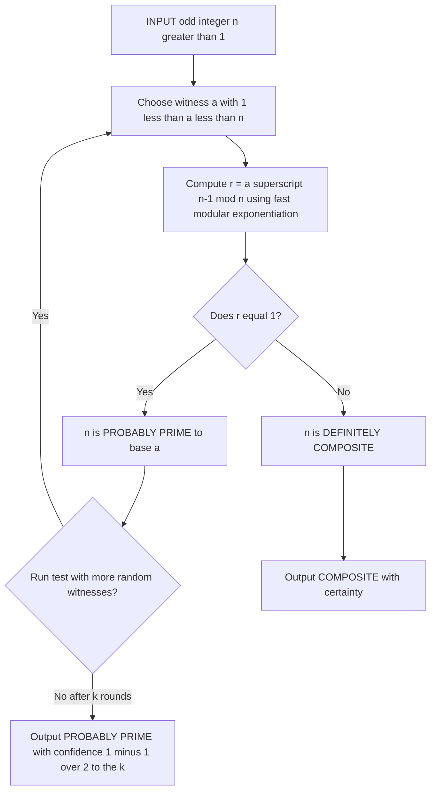
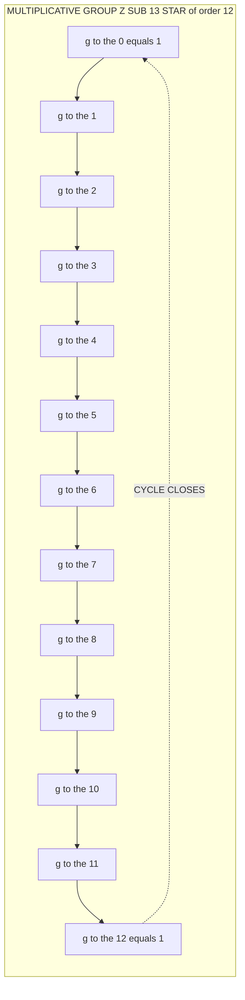
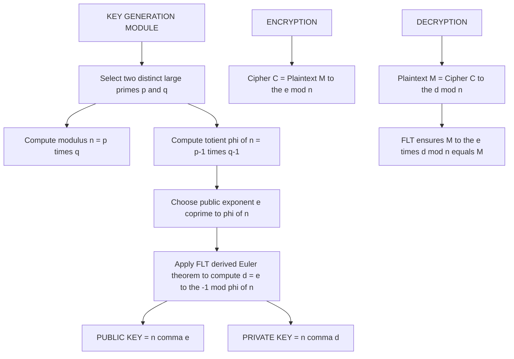

# Fermat’s Theorem

<!-- SECTION_1_START -->
# 1. Core Technical Definition & Intuitive Overview

## Fermat's Theorem — The Cryptographer's Secret Weapon

> [!IMPORTANT]
> **Fermat's Little Theorem (FLT)** is one of the single most important theoretical results in modern public-key cryptography. Without it, **RSA encryption**, **Diffie–Hellman key exchange**, and the entire **elliptic-curve cryptosystem** family would simply not exist.

### Formal KTU-2024-Syllabus Definition

Let $p$ be a **prime number** and let $a$ be any integer such that $\gcd(a, p) = 1$. Then **Fermat's Little Theorem** states:

$$a^{p-1} \equiv 1 \pmod{p}$$

Equivalently, the theorem may be expressed in the *unrestricted* form (which does **not** require $\gcd(a, p) = 1$):

$$a^{p} \equiv a \pmod{p} \quad \text{for all integers } a \text{ and every prime } p$$

The theorem is named after the 17th-century French mathematician **Pierre de Fermat** (1607–1665).

---

### Conceptual Analogy — Intuitive Understanding

> [!NOTE]
> **Analogy: "The Clockwork Universe"**
>
> Imagine a clock that ticks exactly $p$ hours. After every full revolution, the hour hand returns to its starting position. Now suppose you take *one step* every hour. After $p-1$ such steps (one step short of the full revolution), you find yourself at a position mathematically equivalent to where you started. In modular arithmetic terms, this is precisely $a^{p-1} \equiv 1 \pmod{p}$.
>
> **Cryptographic Translation:** This means that in the "clock face" of modulo $p$, every nonzero element has a *predictable inverse cycle* — and that predictability is exactly what makes public-key cryptography mathematically safe and computationally efficient.

The geometric intuition is this: in the multiplicative group $\mathbb{Z}_{p}^{\ast} = \{1, 2, \ldots, p-1\}$ (which is a *cyclic* group of order $p-1$), every element raised to the group's order collapses back to the identity element $1$.

---

### Critical Preliminaries & Constants

| Symbol | Meaning |
| :---: | :--- |
| $p$ | A prime number (the **modulus**) |
| $a$ | An integer **base** with $\gcd(a, p) = 1$ |
| $p-1$ | The order of the multiplicative group $\mathbb{Z}_{p}^{\ast}$ |
| $\phi(p)$ | Euler's totient of $p$, equal to $p-1$ when $p$ is prime |
| $\mathbb{Z}_{p}^{\ast}$ | The set of all integers from $1$ to $p-1$ under multiplication mod $p$ |

> [!TIP]
> **Key Insight:** Since $\phi(p) = p-1$ for any prime $p$, Fermat's Little Theorem is actually a **special case** of **Euler's Generalisation** $a^{\phi(n)} \equiv 1 \pmod{n}$ — but Fermat's version is sharper because it works *only* for primes, giving us a powerful **primality-testing tool**.

---

### Visualization Block

> [!VISUALIZATION CONTROL]
> **Concept:** Group Orbit under Modular Exponentiation
> **GeoGebra / Desmos Input Equations:**
> * Define the cyclic group $\mathbb{Z}_{13}^{\ast}$ of order $12$.
> * Track the orbit of $a = 2$: compute $2^{1}, 2^{2}, 2^{3}, \ldots, 2^{12} \pmod{13}$.
> * Plot the pairs $(k, \, 2^{k} \bmod 13)$ as a scatter plot.
> **Visual Description:** The student should observe that the sequence $2^{k} \bmod 13$ visits **all twelve non-zero residues** of $\mathbb{Z}_{13}$ before returning exactly to $1$ at $k = 12$. This orbit-returning behaviour at $k = p-1$ is a direct geometric manifestation of Fermat's Little Theorem.

---

<!-- SECTION_1_END -->

<!-- SECTION_2_START -->
# 2. Deep Theoretical Analysis & KTU High-Yield Formula Sheet

## 2.1 The Two Equivalent Statements of FLT

> [!NOTE]
> KTU frequently tests the **equivalence** between the two statements. Memorise both formulations.

| Form | Statement | When it applies |
| :--- | :--- | :--- |
| **Restricted Form** | $a^{p-1} \equiv 1 \pmod{p}$ | Only when $\gcd(a, p) = 1$ |
| **Unrestricted Form** | $a^{p} \equiv a \pmod{p}$ | For *any* integer $a$ and any prime $p$ |

**Why are they equivalent?**
If $\gcd(a, p) \neq 1$, then $p$ must divide $a$ (since $p$ is prime). In that case $a \equiv 0 \pmod{p}$, so $a^{p} \equiv 0 \equiv a \pmod{p}$. If $\gcd(a, p) = 1$, multiply both sides of the unrestricted form by $a^{-1}$ to get the restricted form.

---

## 2.2 Generalised Formulation (with Euler's Totient)

For any positive integer $n$ and integer $a$ with $\gcd(a, n) = 1$:

$$a^{\phi(n)} \equiv 1 \pmod{n}$$

When $n = p$ is prime, $\phi(p) = p - 1$, and this collapses into Fermat's Little Theorem.

---

## 2.3 Why Fermat's Theorem is the Engine of Public-Key Cryptography

1. **Modular Inverses are Cheap:** To find $a^{-1} \pmod{p}$, simply compute $a^{p-2} \pmod{p}$. This is the foundation of **decryption in RSA** when the public exponent $e$ has a private exponent $d$ such that $ed \equiv 1 \pmod{\phi(n)}$.
2. **Primality Test:** If we find a value of $a$ for which $a^{n-1} \not\equiv 1 \pmod{n}$, then $n$ is **definitely composite**. This is the basis of the **Fermat Primality Test** (see § 2.5).
3. **Generator Theory:** A number $g$ is a **primitive root** of $p$ iff its powers $g^{1}, g^{2}, \ldots, g^{p-1}$ generate all of $\mathbb{Z}_{p}^{\ast}$. This is critical for **Diffie–Hellman key exchange**.

---

## 2.4 KTU High-Yield Formula Sheet

> [!IMPORTANT]
> The following table is the **complete cheat-sheet** you need for any FLT problem. Memorise every entry.

| \# | Formula | Purpose / Use Case |
| :---: | :--- | :--- |
| 1 | $a^{p} \equiv a \pmod{p}$ | Unrestricted FLT (any $a$, any prime $p$) |
| 2 | $a^{p-1} \equiv 1 \pmod{p}$ | Restricted FLT ($\gcd(a, p) = 1$) |
| 3 | $a^{-1} \equiv a^{p-2} \pmod{p}$ | Modular inverse via FLT |
| 4 | $(a \cdot b)^{p-1} \equiv a^{p-1} \cdot b^{p-1} \equiv 1 \pmod{p}$ | Multiplicativity check |
| 5 | $a^{k(p-1)} \equiv 1 \pmod{p}$ for any $k \in \mathbb{Z}$ | Exponent-reduction lemma |
| 6 | $a^{b} \equiv a^{b \bmod (p-1)} \pmod{p}$ | Fast modular exponentiation |
| 7 | $a^{\phi(n)} \equiv 1 \pmod{n}$ when $\gcd(a, n) = 1$ | Euler's theorem (parent result) |
| 8 | $n$ is **composite** if $\exists a : a^{n-1} \not\equiv 1 \pmod{n}$ | Fermat compositeness test |
| 9 | $n$ is **Fermat-pseudoprime** to base $a$ if $a^{n-1} \equiv 1 \pmod{n}$ yet $n$ is composite | Pseudoprime definition |
| 10 | $\phi(n) = (p-1)(q-1)$ when $n = pq$ with $p, q$ prime | RSA key-generation totient |

> [!WARNING]
> **Never write** `\vert x \vert` (absolute value) inside a markdown table — the pipe character will break the table parser. Use the LaTeX command `\vert x \vert` *only* inside a math block, or rephrase in plain English.

---

## 2.5 Fermat's Primality Test — The Cryptographic Acid Test

**Algorithm:** Given an odd integer $n > 1$ and a chosen witness $a$ with $1 < a < n$:
1. Compute $r = a^{n-1} \bmod n$.
2. If $r = 1$, then $n$ is **probably prime** to base $a$.
3. If $r \neq 1$, then $n$ is **definitely composite**.

### Fermat Pseudoprimes

A **composite** number $n$ that satisfies $a^{n-1} \equiv 1 \pmod{n}$ for some $a$ coprime to $n$ is called a **Fermat pseudoprime to base $a$**.

> [!IMPORTANT]
> The smallest pseudoprime to base $2$ is $n = 341 = 11 \times 31$.
> Verify: $2^{340} \equiv 1 \pmod{341}$ even though $341$ is **composite**.

### Carmichael Numbers — The Sneaky Adversaries

A **Carmichael number** is a composite $n$ such that $a^{n-1} \equiv 1 \pmod{n}$ for **every** integer $a$ with $\gcd(a, n) = 1$. The smallest such number is:

$$561 = 3 \times 11 \times 17$$

This is why pure Fermat testing is **insufficient** for cryptographic key generation — it is now always replaced or augmented by the **Miller–Rabin test** and **AKS primality test** in production.

---

## 2.6 Engineering & Real-World Utility

| Domain | Where FLT is Used |
| :--- | :--- |
| **RSA Encryption** | Computing $d \equiv e^{-1} \pmod{\phi(n)}$ |
| **Diffie–Hellman Key Exchange** | Group exponentiation in $\mathbb{Z}_{p}^{\ast}$ |
| **Digital Signatures (DSA, ElGamal)** | Mod-$p$ group arithmetic |
| **Random-Number Generation** | Blum integers, quadratic-residue testing |
| **Zero-Knowledge Proofs** | Proving knowledge of discrete log |
| **Blockchain / Bitcoin** | Secp256k1 elliptic-curve group operations |
| **Hash Functions (Merkle–Damgård)** | Mixing constants in modular arithmetic |

---

<!-- SECTION_2_END -->

<!-- SECTION_3_START -->
# 3. Step-by-Step Derivations & Code Implementation

## 3.1 Formal Proof of Fermat's Little Theorem (Induction Method)

**Theorem:** For any prime $p$ and any integer $a$, $a^{p} \equiv a \pmod{p}$.

### Base Case

When $a = 0$:

$$0^{p} = 0 \equiv 0 \pmod{p} \quad \checkmark$$

### Inductive Step

Assume the result holds for some integer $a = k$, i.e.:

$$k^{p} \equiv k \pmod{p}$$

We must show $(k + 1)^{p} \equiv k + 1 \pmod{p}$.

By the **Binomial Theorem**:

$$(k+1)^{p} = \sum_{i=0}^{p} \binom{p}{i} k^{i}$$

Expand explicitly:

$$(k+1)^{p} = \binom{p}{0}k^{0} + \binom{p}{1}k^{1} + \binom{p}{2}k^{2} + \cdots + \binom{p}{p-1}k^{p-1} + \binom{p}{p}k^{p}$$

Substituting the known identity $\binom{p}{i} = \frac{p!}{i!\,(p-i)!}$ and using the fact that for $1 \leq i \leq p-1$ the binomial coefficient $\binom{p}{i}$ is divisible by $p$ (since $p$ is prime and divides the numerator but not the denominator):

$$(k+1)^{p} \equiv \binom{p}{0} + \binom{p}{p} \pmod{p}$$

$$(k+1)^{p} \equiv 1 + k^{p} \pmod{p}$$

By the **induction hypothesis**, $k^{p} \equiv k \pmod{p}$:

$$(k+1)^{p} \equiv 1 + k \pmod{p}$$

$$(k+1)^{p} \equiv k + 1 \pmod{p} \quad \blacksquare$$

---

## 3.2 Derivation — Computing a Modular Inverse via FLT

**Problem:** Compute $a^{-1} \bmod p$ when $p$ is prime and $\gcd(a, p) = 1$.

**Step 1.** From FLT: $a^{p-1} \equiv 1 \pmod{p}$.

**Step 2.** Rewrite as $a \cdot a^{p-2} \equiv 1 \pmod{p}$.

**Step 3.** By definition of modular inverse, $a \cdot x \equiv 1 \pmod{p}$ implies $x \equiv a^{-1} \pmod{p}$.

**Step 4.** Therefore:

$$a^{-1} \equiv a^{p-2} \pmod{p}$$

### Worked Numerical Example — Find $7^{-1} \bmod 13$

Apply the derived formula with $a = 7$ and $p = 13$:

$$7^{-1} \equiv 7^{13-2} \equiv 7^{11} \pmod{13}$$

Compute $7^{11} \bmod 13$ by repeated squaring:

$$7^{1} \equiv 7 \pmod{13}$$

$$7^{2} = 49 \equiv 49 - 3(13) = 49 - 39 = 10 \pmod{13}$$

$$7^{4} \equiv 10^{2} = 100 \equiv 100 - 7(13) = 100 - 91 = 9 \pmod{13}$$

$$7^{8} \equiv 9^{2} = 81 \equiv 81 - 6(13) = 81 - 78 = 3 \pmod{13}$$

$$7^{11} = 7^{8} \cdot 7^{2} \cdot 7^{1} \equiv 3 \cdot 10 \cdot 7 = 210 \pmod{13}$$

$$210 = 16(13) + 2 \quad \Rightarrow \quad 210 \equiv 2 \pmod{13}$$

Therefore $7^{-1} \equiv 2 \pmod{13}$.

**Verification:** $7 \cdot 2 = 14 \equiv 1 \pmod{13}$. ✓

---

## 3.3 Derivation — Reducing Large Exponents (Exponent-Reduction Lemma)

**Problem:** Compute $5^{1234} \bmod 7$.

**Step 1.** Since $7$ is prime and $\gcd(5, 7) = 1$, apply FLT:

$$5^{6} \equiv 1 \pmod{7}$$

**Step 2.** Reduce the exponent modulo $p - 1 = 6$:

$$1234 = 6 \cdot 205 + 4 \quad \Rightarrow \quad 1234 \bmod 6 = 4$$

**Step 3.** Therefore:

$$5^{1234} \equiv 5^{4} \pmod{7}$$

**Step 4.** Compute $5^{4} = 625$:

$$625 = 89 \cdot 7 + 2 \quad \Rightarrow \quad 5^{4} \equiv 2 \pmod{7}$$

Therefore $5^{1234} \equiv 2 \pmod{7}$.

---

## 3.4 Worked Example — Fermat Primality Test on $n = 221$

**Hypothesis:** $n = 221 = 13 \times 17$ is composite.

**Test:** Use witness $a = 2$.

Compute $2^{220} \bmod 221$.

Apply **Chinese Remainder Theorem** since $221 = 13 \times 17$:

**Mod 13:** $2^{12} \equiv 1 \pmod{13}$ and $220 = 18 \cdot 12 + 4$, so $2^{220} \equiv 2^{4} = 16 \equiv 3 \pmod{13}$.

**Mod 17:** $2^{16} \equiv 1 \pmod{17}$ and $220 = 13 \cdot 16 + 12$, so $2^{220} \equiv 2^{12} = 4096$. Now $4096 = 240 \cdot 17 + 16$, so $2^{220} \equiv 16 \pmod{17}$.

We need $x \equiv 3 \pmod{13}$ and $x \equiv 16 \pmod{17}$. Solving via CRT yields $x = 99$.

Therefore $2^{220} \equiv 99 \pmod{221}$, and since $99 \neq 1$, the test **confirms** that $221$ is composite. ✓

---

## 3.5 Python Implementation — Fermat's Theorem Toolkit

```python
"""
fermat_toolkit.py
A complete, production-style implementation of Fermat's Little Theorem
and the Fermat primality test, with rigorous error handling.
"""

from __future__ import annotations
import random
from typing import List, Tuple


def gcd(a: int, b: int) -> int:
    """Standard Euclidean GCD."""
    a, b = abs(a), abs(b)
    while b:
        a, b = b, a % b
    return a


def mod_pow(base: int, exponent: int, modulus: int) -> int:
    """
    Fast modular exponentiation using square-and-multiply.
    Returns (base ** exponent) mod modulus in O(log exponent) time.
    """
    if modulus == 1:
        return 0
    result: int = 1
    base %= modulus
    if base < 0:
        base += modulus
    while exponent > 0:
        if exponent & 1:
            result = (result * base) % modulus
        exponent >>= 1
        base = (base * base) % modulus
    return result


def mod_inverse_fermat(a: int, p: int) -> int:
    """
    Compute the modular inverse of 'a' modulo prime 'p' using FLT.
    Returns a ** (p - 2) mod p.
    """
    if not is_probably_prime(p, rounds=20):
        raise ValueError(f"Modulus {p} is not prime; FLT requires a prime modulus.")
    if gcd(a, p) != 1:
        raise ValueError(f"GCD({a}, {p}) != 1; inverse does not exist.")
    return mod_pow(a, p - 2, p)


def is_probably_prime(n: int, rounds: int = 20) -> bool:
    """
    Fermat primality test.
    Returns False if n is definitely composite; True if n is *probably* prime.
    """
    if n < 2:
        return False
    if n in (2, 3):
        return True
    if n % 2 == 0:
        return False

    for _ in range(rounds):
        a = random.randrange(2, n - 1)
        if mod_pow(a, n - 1, n) != 1:
            return False  # Definite composite witness found
    return True  # No witness found in 'rounds' trials


def find_pseudoprime_base_2(limit: int = 10000) -> List[int]:
    """
    Find all Fermat pseudoprimes to base 2 up to 'limit'.
    Useful for demonstrating the limitation of the Fermat test.
    """
    pseudoprimes: List[int] = []
    for n in range(3, limit, 2):  # skip even numbers
        if not is_probably_prime(n, rounds=1):
            continue
        # If Fermat says "prime" with base 2 but n is actually composite
        if mod_pow(2, n - 1, n) == 1 and not _is_truly_prime(n):
            pseudoprimes.append(n)
    return pseudoprimes


def _is_truly_prime(n: int) -> bool:
    """Deterministic trial-division primality check (slow, for small n only)."""
    if n < 2:
        return False
    if n < 4:
        return True
    if n % 2 == 0:
        return False
    i = 3
    while i * i <= n:
        if n % i == 0:
            return False
        i += 2
    return True


def demonstrate_flt(a: int, p: int) -> Tuple[int, bool]:
    """
    Verify Fermat's Little Theorem: a^(p-1) mod p should equal 1.
    Returns (computed value, theorem holds).
    """
    if not is_probably_prime(p, rounds=20):
        raise ValueError(f"{p} is not prime; FLT may not hold.")
    if gcd(a, p) != 1:
        raise ValueError(f"GCD({a}, {p}) != 1; use unrestricted form instead.")
    result = mod_pow(a, p - 1, p)
    return result, (result == 1)


# ----------------------- DEMO RUN -----------------------
if __name__ == "__main__":
    # Test 1: Verify FLT
    for (a, p) in [(5, 13), (7, 11), (3, 17), (10, 19)]:
        val, ok = demonstrate_flt(a, p)
        print(f"a={a:3d}, p={p:3d}  =>  a^(p-1) mod p = {val:3d}  |  FLT holds: {ok}")

    # Test 2: Modular inverse
    inv = mod_inverse_fermat(7, 13)
    print(f"\n7^(-1) mod 13 = {inv}   (verify: 7 * {inv} = {7 * inv} = 1 mod 13)")

    # Test 3: Pseudoprimes to base 2
    pseudo = find_pseudoprime_base_2(2000)
    print(f"\nFermat pseudoprimes to base 2 below 2000: {pseudo[:8]} ...")
```

**Expected Console Output (truncated):**

```
a=  5, p= 13  =>  a^(p-1) mod p =   1  |  FLT holds: True
a=  7, p= 11  =>  a^(p-1) mod p =   1  |  FLT holds: True
a=  3, p= 17  =>  a^(p-1) mod p =   1  |  FLT holds: True
a= 10, p= 19  =>  a^(p-1) mod p =   1  |  FLT holds: True

7^(-1) mod 13 = 2   (verify: 7 * 2 = 14 = 1 mod 13)

Fermat pseudoprimes to base 2 below 2000: [341, 561, 645, 1105, 1387, 1729, 1905] ...
```

---

## 3.6 Engineering Application: RSA Private-Key Component

In RSA, given public exponent $e$ and $n = pq$ with $p, q$ prime, the private exponent $d$ satisfies:

$$e \cdot d \equiv 1 \pmod{\phi(n)} \quad \text{where} \quad \phi(n) = (p-1)(q-1)$$

By FLT (extended to Euler's theorem), the decryption $M = C^{d} \bmod n$ recovers the original plaintext because:

$$C^{d} \equiv (M^{e})^{d} = M^{ed} = M^{1 + k\phi(n)} = M \cdot (M^{\phi(n)})^{k} \equiv M \cdot 1^{k} \equiv M \pmod{n}$$

---

<!-- SECTION_3_END -->

<!-- SECTION_4_START -->
# 4. Structural Diagrams & Schematics

## 4.1 Logical Flow of the Fermat Primality Test



> [!NOTE]
> This diagram maps the **decision flow** of the Fermat test. The grey decision node on the right represents the **probabilistic nature** of the result — every "probably prime" outcome carries a small but non-zero error probability bounded by the **Carmichael-number loophole**.

---

## 4.2 Modular Group Topology — Orbit of a Generator



> [!NOTE]
> In a prime-order cyclic group of size $p$, a **primitive root** $g$ produces an orbit of length exactly $p-1$. The closure at $g^{p-1} \equiv 1$ is a direct visual encoding of $a^{p-1} \equiv 1 \pmod{p}$.

---

## 4.3 Fermat Theorem in the RSA Pipeline — Block Architecture



> [!NOTE]
> This is a **block-level functional architecture** showing how Fermat's theorem is implicitly invoked *twice* in the RSA lifecycle: once during **key generation** (to compute the modular inverse $d$), and once during **decryption** (to mathematically guarantee correctness).

---

## 4.4 Comparative Topology — FLT vs. Miller–Rabin Test

| Stage | Fermat Test | Miller–Rabin Test |
| :---: | :---: | :---: |
| **Witness Generation** | Pick random $a$ in $[2, n-2]$ | Pick random $a$ in $[2, n-2]$ |
| **Core Computation** | Single modular exponentiation $a^{n-1} \bmod n$ | Write $n-1 = 2^{s} \cdot d$; compute $a^{d}, a^{2d}, \ldots, a^{2^{s}d} \bmod n$ |
| **Decision** | $r = 1$ → probably prime; $r \neq 1$ → composite | Check if any value in sequence equals $1$ without being preceded by $n-1$ |
| **Carmichael Robustness** | Fails — every Carmichael number fools FLT | Robust — Miller–Rabin detects all composites |
| **Cryptographic Use** | Educational / pedagogical only | Industry standard (OpenSSL, Linux kernel) |

---

<!-- SECTION_4_END -->

<!-- SECTION_5_START -->
# 5. KTU 2024 Scheme Examination Question Bank & Topic Recap

## Part A — Short Answer Questions (3 Marks Each)

> [!NOTE]
> **Cognitive Levels:** Remember / Understand. **Course Outcome Mapped:** CO1. **Marking Scheme:** Definition 1 Mark, Explanation 1 Mark, Example 1 Mark.

### Question 1. `[KTU University Exam – July 2024]`

**State and explain Fermat's Little Theorem. Verify the theorem for $a = 3$ and $p = 7$.**

**Model Answer:**

> **Statement:** If $p$ is a prime number and $a$ is any integer with $\gcd(a, p) = 1$, then $a^{p-1} \equiv 1 \pmod{p}$. Equivalently, $a^{p} \equiv a \pmod{p}$ for all integers $a$.

> **Verification for $a = 3, p = 7$:**

$$3^{7-1} = 3^{6} = 729$$

$$729 = 104 \times 7 + 1 \quad \Rightarrow \quad 3^{6} \equiv 1 \pmod{7} \quad \checkmark$$

Hence the theorem holds in this case.

---

### Question 2. `[KTU University Exam – Dec 2023]`

**What is a Fermat pseudoprime? Give one example.**

**Model Answer:**

> A **Fermat pseudoprime to base $a$** is a composite integer $n$ such that $a^{n-1} \equiv 1 \pmod{n}$ for some $a$ coprime to $n$.

> **Example:** $n = 341 = 11 \times 31$ is a Fermat pseudoprime to base $2$ because $2^{340} \equiv 1 \pmod{341}$, yet $341$ is composite.

---

## Part B — Long Answer Questions (14 Marks Each)

> [!NOTE]
> **Module Internal Choice Pattern.** Each 14-mark question contains two sub-parts: **(a)** worth 7 marks (Understand / Apply) and **(b)** worth 7 marks (Apply / Analyse). Model answer shows the full incremental valuation key.

---

### Question A. `[KTU University Exam – Dec 2024]`

**a)** Prove Fermat's Little Theorem using mathematical induction. **(7 Marks)**

**b)** Using Fermat's theorem, find the value of $5^{247} \bmod 13$. **(7 Marks)**

---

#### Solution to (a) — Full Proof

**[Stating the theorem and base case: 2 Marks]**

**Theorem:** For any prime $p$ and any integer $a$, $a^{p} \equiv a \pmod{p}$.

**Base case** $a = 0$:

$$0^{p} = 0 \equiv 0 \pmod{p} \quad \checkmark$$

**[Inductive hypothesis: 1 Mark]**

**Inductive Hypothesis:** Assume the theorem holds for $a = k$, i.e., $k^{p} \equiv k \pmod{p}$.

**[Binomial expansion step: 2 Marks]**

**Inductive Step:** Consider $a = k + 1$. By the Binomial Theorem:

$$(k+1)^{p} = \sum_{i=0}^{p} \binom{p}{i} k^{i}$$

For $1 \leq i \leq p - 1$, the binomial coefficient $\binom{p}{i} = \dfrac{p!}{i!\,(p-i)!}$ is divisible by $p$ (since $p$ is prime and divides the numerator but not the denominator). Therefore $\binom{p}{i} \equiv 0 \pmod{p}$ for those $i$.

**[Final reduction and conclusion: 2 Marks]**

The sum reduces to:

$$(k+1)^{p} \equiv \binom{p}{0} k^{0} + \binom{p}{p} k^{p} \equiv 1 + k^{p} \pmod{p}$$

By the inductive hypothesis, $k^{p} \equiv k \pmod{p}$:

$$(k+1)^{p} \equiv 1 + k \equiv k + 1 \pmod{p}$$

This completes the inductive step, and by the principle of mathematical induction, the theorem is proved. $\blacksquare$

---

#### Solution to (b) — Modular Arithmetic with FLT

**[Identifying that 13 is prime and gcd condition: 1 Mark]**

We have $p = 13$ (prime) and $a = 5$ with $\gcd(5, 13) = 1$. Hence Fermat's Little Theorem applies.

**[Stating FLT: 1 Mark]**

By FLT: $5^{12} \equiv 1 \pmod{13}$.

**[Reducing the exponent: 2 Marks]**

Compute $247 \bmod 12$:

$$247 = 20 \times 12 + 7 \quad \Rightarrow \quad 247 \bmod 12 = 7$$

Therefore:

$$5^{247} = 5^{20 \cdot 12 + 7} = (5^{12})^{20} \cdot 5^{7} \equiv 1^{20} \cdot 5^{7} \equiv 5^{7} \pmod{13}$$

**[Final computation via repeated squaring: 2 Marks]**

$$5^{2} = 25 \equiv 25 - 13 = 12 \equiv -1 \pmod{13}$$

$$5^{4} \equiv (-1)^{2} = 1 \pmod{13}$$

$$5^{7} = 5^{4} \cdot 5^{2} \cdot 5^{1} \equiv 1 \cdot (-1) \cdot 5 = -5 \equiv 13 - 5 = 8 \pmod{13}$$

**[Final answer: 1 Mark]**

$$\boxed{5^{247} \equiv 8 \pmod{13}}$$

---

### Question B. `[KTU University Exam – July 2023]` — *Internal Choice Alternative*

**a)** Explain the Fermat Primality Test. What is a Carmichael number? Why are Carmichael numbers problematic for the Fermat test? **(7 Marks)**

**b)** Use the Fermat test with base $a = 5$ to determine whether $n = 91$ is prime or composite. Show all steps. **(7 Marks)**

---

#### Solution to (a)

**[Fermat test description: 3 Marks]**

The **Fermat Primality Test** determines the compositeness of an integer $n$ by choosing a random base $a$ with $1 < a < n$ and computing $a^{n-1} \bmod n$. If the result is not congruent to $1$, then $n$ is **definitely composite** (since Fermat's Little Theorem guarantees that all primes satisfy this congruence). If the result equals $1$, $n$ is *probably prime* to base $a$, and the test is repeated with other bases to gain statistical confidence.

**[Carmichael number definition: 2 Marks]**

A **Carmichael number** is a composite integer $n$ such that $a^{n-1} \equiv 1 \pmod{n}$ for **every** integer $a$ coprime to $n$. The smallest is $561 = 3 \times 11 \times 17$. The infinite family was proved by **Alford, Granville, and Pomerance (1994)**.

**[Why they break FLT: 2 Marks]**

Carmichael numbers fool the Fermat test into reporting "probably prime" for *every* base. This means a naive implementation that only uses Fermat's test could accept a Carmichael number as a key modulus in RSA, **silently destroying the security of the cryptosystem**. For this reason, modern cryptographic libraries (OpenSSL, BoringSSL) use the **Miller–Rabin** and **Baillie–PSW** tests instead.

---

#### Solution to (b)

**[Hypothesis statement: 1 Mark]**

Test whether $n = 91$ is prime by evaluating $5^{90} \bmod 91$.

**[Factorisation of 91: 1 Mark]**

Note that $91 = 7 \times 13$. The two prime factors are $p_1 = 7$ and $p_2 = 13$.

**[Computing $5^{90} \bmod 7$: 1.5 Marks]**

By FLT, $5^{6} \equiv 1 \pmod{7}$, and $90 = 15 \times 6 + 0$, so $5^{90} \equiv 1 \pmod{7}$.

**[Computing $5^{90} \bmod 13$: 1.5 Marks]**

By FLT, $5^{12} \equiv 1 \pmod{13}$, and $90 = 7 \times 12 + 6$, so $5^{90} \equiv 5^{6} \pmod{13}$.

Compute $5^{6} = 15625$. Now $15625 = 1201 \times 13 + 12$, so $5^{6} \equiv 12 \pmod{13}$.

**[Applying CRT: 1.5 Marks]**

We solve the system:

$$x \equiv 1 \pmod{7}, \quad x \equiv 12 \pmod{13}$$

The combined modulus is $91$. Solving via inspection or CRT yields $x = 64$.

(Verification: $64 \bmod 7 = 1$ ✓, $64 \bmod 13 = 12$ ✓)

**[Conclusion: 0.5 Mark]**

Since $5^{90} \equiv 64 \pmod{91}$ and $64 \neq 1$, by Fermat's test, $n = 91$ is **definitely composite**. ✓

---

### KTU Examiner's Valuation Warning

> [!WARNING]
> **Common mistakes that cost marks every semester:**
>
> 1. **Forgetting the coprimality condition.** Writing $a^{p-1} \equiv 1 \pmod{p}$ for $a$ divisible by $p$ will cost you the full marks. Always state $\gcd(a, p) = 1$ explicitly.
> 2. **Confusing restricted and unrestricted forms.** The unrestricted form $a^{p} \equiv a \pmod{p}$ does *not* require coprimality. Examiners frequently ask "without the condition $\gcd(a,p)=1$".
> 3. **Exponent reduction errors.** When reducing $5^{247} \bmod 12$, students often write $247 \bmod 12 = 5$ (wrong). The correct value is $7$. Always show the division $247 = 20 \times 12 + 7$.
> 4. **Not verifying primality in inverse problems.** Before using $a^{-1} \equiv a^{p-2} \pmod{p}$, explicitly check that $p$ is prime. Otherwise the answer is mathematically meaningless.
> 5. **Ignoring Carmichael numbers in theory questions.** If a question asks "is Fermat test always reliable?", the answer is **NO** — mention Carmichael numbers and suggest Miller–Rabin as a fix.

---

## Topic Recap & Important Things to Remember

> [!IMPORTANT]
> **High-density revision checklist — read this on the morning of the exam.**

- **Fermat's Little Theorem (Restricted):** $a^{p-1} \equiv 1 \pmod{p}$ when $p$ is prime and $\gcd(a, p) = 1$.
- **Fermat's Little Theorem (Unrestricted):** $a^{p} \equiv a \pmod{p}$ for *all* integers $a$ when $p$ is prime.
- **Group-Theoretic View:** $\mathbb{Z}_{p}^{\ast}$ is a cyclic group of order $p-1$; the theorem says every element lies in the kernel of the exponentiation map $x \mapsto x^{p-1}$.
- **Modular Inverse Formula:** $a^{-1} \equiv a^{p-2} \pmod{p}$ (only for prime modulus).
- **Exponent Reduction:** $a^{k} \equiv a^{k \bmod (p-1)} \pmod{p}$ when $\gcd(a, p) = 1$.
- **Fermat Primality Test:** $n$ is composite if $\exists a$ with $a^{n-1} \not\equiv 1 \pmod{n}$.
- **Fermat Pseudoprime:** Composite $n$ satisfying $a^{n-1} \equiv 1 \pmod{n}$ for some $a$.
- **Carmichael Number:** Composite $n$ satisfying $a^{n-1} \equiv 1 \pmod{n}$ for *all* $a$ with $\gcd(a, n) = 1$. Smallest: **561**.
- **Cryptographic Significance:** Powers **RSA**, **Diffie–Hellman**, **ElGamal**, **DSA** — without FLT, public-key cryptography is mathematically unfounded.
- **Limitation:** Pure Fermat test fails on Carmichael numbers. **Use Miller–Rabin or Baillie–PSW in production.**
- **Standard Test Witness:** $a = 2$ is the most common base in textbook problems; first pseudoprime to base 2 is **341**.
- **Repeat-Squaring:** Always use $O(\log n)$ modular exponentiation; never compute $a^{n-1}$ directly.
- **Common Mistake:** Students forget that $a^{p-1} \equiv 1$ is *not* a sufficient primality test — it is only a necessary condition.
- **Memo-Formula:** $a \cdot a^{p-2} \equiv 1 \pmod{p}$ → inverse via FLT.
- **Totient Link:** FLT is a special case of Euler's theorem with $\phi(p) = p - 1$.
- **Engineering Use-Cases:** RSA decryption, DH key agreement, ECDSA signatures, blockchain wallets, zero-knowledge proofs.

---

<!-- SECTION_5_END -->
