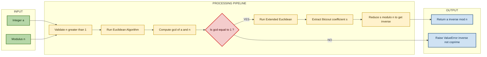
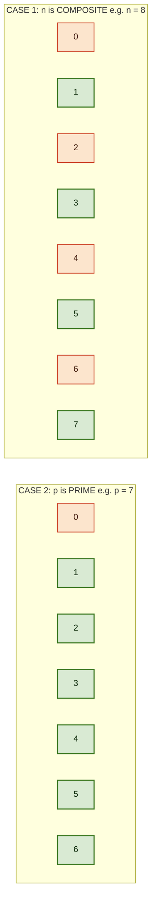

# Modular Arithmetic

<!-- SECTION_1_START -->

# Modular Arithmetic — Core Technical Definition & Intuitive Overview

## 1.1 Formal Academic Definition

**Modular Arithmetic** is a system of arithmetic devoted to the study of the *remainder* of integer division. For a given positive integer $n \geq 2$ called the **modulus**, two integers $a$ and $b$ are said to be **congruent modulo $n$** if and only if $n$ divides their difference. The formal statement is:

$$
a \equiv b \pmod{n} \quad \iff \quad n \mid (a - b)
$$

The integer $n$ is called the **modulus**, and the expression $a \bmod n$ denotes the **principal remainder** in the canonical set $\{0, 1, 2, \dots, n-1\}$, also called the **residue class** of $a$ modulo $n$.

> [!IMPORTANT]
> **KTU 2024 Syllabus Highlight — Foundations of Cryptography (OECST613):**
> Modular arithmetic is the *algebraic foundation* upon which virtually every modern public-key cryptosystem (RSA, Diffie–Hellman, ElGamal, ECC) is constructed. Mastery of this module is a mandatory prerequisite for Module 3 (Discrete Logarithms) and Module 4 (RSA Cryptosystem).

## 1.2 Conceptual Analogy & Intuition

### 🕐 The 12-Hour Clock Analogy

Imagine a standard analog clock. When it is **10:00 AM** and you wait **5 hours**, the time becomes **3:00 PM** — not 15:00. The clock "wraps around" after 12. This is *exactly* how modular arithmetic works with modulus $n = 12$:

$$
10 + 5 = 15 \equiv 3 \pmod{12}
$$

The number $15$ and the number $3$ are *equivalent* in the modular world; they produce the same result on the clock face. The remainder is what matters, not the absolute value.

### 🎯 Geometric Intuition — The Modular "Ring"

The set $\mathbb{Z}_n = \{0, 1, 2, \dots, n-1\}$ can be visualized as **$n$ equally spaced points on a circle**. Moving from $a$ to $a+k$ corresponds to walking $k$ steps clockwise. When you pass point $n-1$, you *wrap around* back to $0$. This circular topology is why the algebraic structure $\mathbb{Z}_n$ is mathematically classified as a **finite ring** (a commutative ring with unity, possessing the operations $+$ and $\cdot$ closed over the set).

> [!NOTE]
> **Residue Class Definition:**
> The residue class of $a$ modulo $n$, denoted $[a]_n$, is the set of *all* integers congruent to $a$:
> $$
> [a]_n = \{\, a + kn \mid k \in \mathbb{Z} \,\}
> $$
> For example, $[3]_7 = \{\dots, -11, -4, 3, 10, 17, 24, \dots\}$.

## 1.3 Fundamental Constants and Standard Metrics

| Parameter | Symbol | Constraint | Cryptographic Significance |
| :--- | :---: | :---: | :--- |
| **Modulus** | $n$ | $n \geq 2$, integer | Defines the size of the arithmetic universe $\mathbb{Z}_n$ |
| **Residue** | $r$ | $0 \leq r < n$ | Canonical representative of a congruence class |
| **Equivalence Classes** | $n$ | Exactly $n$ classes | Cardinality of $\mathbb{Z}_n$ |
| **Euler's Totient** | $\phi(n)$ | $\phi(n) < n$ | Counts elements coprime to $n$ — central to RSA |
| **Group Order** | $\vert \mathbb{Z}_n^{\times} \vert$ | $= \phi(n)$ | Order of the multiplicative group of units |

> [!VISUALIZATION CONTROL]
> **Concept:** Modular wrap-around on a number circle (mod 7)
> **GeoGebra / Desmos Input Equations:**
> * Point list: `L = {(cos(2πk/7), sin(2πk/7)) | k = 0, 1, 2, 3, 4, 5, 6}`
> * Walk example: `start = 2, step = 4` → `next = (2+4) mod 7 = 6`
> **Visual Description:** Plot 7 points on the unit circle at angles $0°, 51.4°, 102.8°, \dots$ Label them 0 through 6. Highlight the arc from point 2 to point 6 (moving 4 steps clockwise) to demonstrate how modular addition "wraps" along the cyclic group $\mathbb{Z}_7$.

<!-- SECTION_1_END -->

<!-- SECTION_2_START -->

# Deep Theoretical Analysis & KTU High-Yield Formula Sheet

## 2.1 Congruence — The Three Axiomatic Properties

For any fixed modulus $n \geq 1$, the relation $\equiv \pmod{n}$ is an **equivalence relation**, meaning it satisfies three axioms over $\mathbb{Z}$:

| # | Property | Formal Statement | Cryptographic Interpretation |
| :-: | :--- | :--- | :--- |
| 1 | **Reflexive** | $a \equiv a \pmod{n}$ | Every integer is congruent to itself — the *identity* of congruence. |
| 2 | **Symmetric** | $a \equiv b \pmod{n} \Rightarrow b \equiv a \pmod{n}$ | Congruence is two-way — equality is not directional. |
| 3 | **Transitive** | $a \equiv b \pmod{n}$ and $b \equiv c \pmod{n} \Rightarrow a \equiv c \pmod{n}$ | Composition of congruences preserves the relation — used to chain RSA steps. |

## 2.2 Algebraic Properties of Operations in $\mathbb{Z}_n$

Modular addition and multiplication preserve the structure of a **commutative ring with identity**. The complete operational rule-set is:

### Addition
$$
(a + b) \bmod n = \big((a \bmod n) + (b \bmod n)\big) \bmod n
$$

### Subtraction
$$
(a - b) \bmod n = \big((a \bmod n) - (b \bmod n) + n\big) \bmod n
$$

> [!NOTE]
> The `+ n` term in subtraction is added *before* the final modulo to guarantee a non-negative residue. This is the canonical **symmetric residue** trick used in compilers and cryptographic libraries.

### Multiplication
$$
(a \cdot b) \bmod n = \big((a \bmod n) \cdot (b \bmod n)\big) \bmod n
$$

### Distributivity
$$
a \cdot (b + c) \equiv (a \cdot b) + (a \cdot c) \pmod{n}
$$

### Exponentiation (the *heart* of RSA and DH)
$$
a^k \bmod n = \text{repeat multiplication with intermediate reduction}
$$
**Naïve** exponentiation is $O(k)$ multiplications. **Square-and-Multiply** (binary method) reduces this to $O(\log_2 k)$ multiplications — a critical optimization for cryptographic key sizes (e.g., 2048-bit exponents).

## 2.3 Modular Inverse — The Cornerstone of Decryption

An integer $a$ has a **modular multiplicative inverse** modulo $n$ if there exists an integer $x$ such that:

$$
a \cdot x \equiv 1 \pmod{n}
$$

Such an $x$ is denoted $a^{-1} \bmod n$. The inverse **exists if and only if**:

$$
\gcd(a, n) = 1
$$

i.e., $a$ and $n$ must be **coprime** (mutually prime). The set of all invertible elements forms the **multiplicative group of units**, denoted $\mathbb{Z}_n^{\times}$, whose order is $\phi(n)$ (Euler's totient function).

> [!IMPORTANT]
> **Existence Theorem (KTU 2024 Module 2 — Prime Factorization Link):**
> If $n = p$ is **prime**, then every $a \in \{1, 2, \dots, p-1\}$ is invertible, and $\mathbb{Z}_p^{\times}$ is a cyclic group of order $p-1$. This is the *algebraic reason* why prime moduli are chosen in DH and ECC.

## 2.4 The Division Algorithm Connection

Every integer $a$ can be **uniquely** written in the form:

$$
a = qn + r, \quad \text{where } 0 \leq r < n
$$

Here, $q = \lfloor a/n \rfloor$ is the **quotient** and $r = a \bmod n$ is the **remainder**. The remainder $r$ is the *unique* canonical representative of $[a]_n$ in $\mathbb{Z}_n$.

## 2.5 Worked Numerical Examples

**Example 1: Basic Congruence**
Compute $17 \bmod 5$:
$$
17 = 3 \cdot 5 + 2 \implies 17 \equiv 2 \pmod 5
$$

**Example 2: Negative Numbers**
Compute $-7 \bmod 5$:
$$
-7 = (-2) \cdot 5 + 3 \implies -7 \equiv 3 \pmod 5
$$
(Notice the remainder is *always* non-negative in the canonical form.)

**Example 3: Modular Inverse**
Find $7^{-1} \bmod 11$:
We need $7x \equiv 1 \pmod{11}$. Testing: $7 \cdot 8 = 56 = 5 \cdot 11 + 1$. So $7^{-1} \equiv 8 \pmod{11}$.

## 2.6 Engineering & Real-World Utility

| Application Domain | Use of Modular Arithmetic |
| :--- | :--- |
| **Public-Key Cryptography (RSA, DH, ElGamal)** | Encryption/decryption are exponentiations modulo $n$ or $p$. |
| **Hash Functions (SHA-2, SHA-3)** | Internal state updates use modular addition and XOR on 32/64-bit words. |
| **Error-Correcting Codes (CRC, Reed–Solomon)** | Polynomial arithmetic over $\mathbb{F}_{2^k}$ is polynomial modular arithmetic. |
| **Random Number Generation (LCG)** | $X_{n+1} = (aX_n + c) \bmod m$ — the Linear Congruential Generator. |
| **Clock/Calendar Systems** | Hour-of-day, day-of-week, month rollover computations. |
| **Memory Addressing & Hash Tables** | Array index wrap-around via `index mod table_size`. |

## 2.7 📋 KTU High-Yield Formula Sheet

| # | Formula / Property | Statement | When to Use |
| :-: | :--- | :--- | :--- |
| 1 | **Congruence Definition** | $a \equiv b \pmod{n} \iff n \mid (a-b)$ | Proving two integers are equivalent mod $n$. |
| 2 | **Modulo Reduction Rule** | $(a + b) \bmod n = \big((a \bmod n) + (b \bmod n)\big) \bmod n$ | Keeping intermediate values small. |
| 3 | **Modulo Multiplication** | $(a \cdot b) \bmod n = \big((a \bmod n) \cdot (b \bmod n)\big) \bmod n$ | Big-integer arithmetic in crypto. |
| 4 | **Power Reduction** | $a^k \bmod n \equiv (a \bmod n)^k \bmod n$ | First step of any modular exponentiation. |
| 5 | **Exponent Cycle (Fermat)** | $a^{p-1} \equiv 1 \pmod{p}$ for prime $p$ and $\gcd(a,p)=1$ | Decryption key derivation in RSA. |
| 6 | **Euler's Theorem** | $a^{\phi(n)} \equiv 1 \pmod{n}$ for $\gcd(a,n)=1$ | Generalization of Fermat for composite $n$. |
| 7 | **Modular Inverse Exists** | $a^{-1} \bmod n$ exists $\iff \gcd(a, n) = 1$ | Quick existence test before algorithm. |
| 8 | **Division Algorithm** | $a = qn + r$, where $0 \leq r < n$, $r = a \bmod n$ | Computing the canonical residue. |
| 9 | **Symmetric Residue** | $a \bmod n = a - n \cdot \lfloor a/n \rfloor$ | Correctly handling negative numbers. |
| 10 | **Reduction Property** | $a \equiv b \pmod{n} \Rightarrow a^k \equiv b^k \pmod{n}$ | Lifting congruences to powers. |
| 11 | **Sum Modulo** | $\displaystyle\sum_{i=1}^{n} i = \frac{n(n+1)}{2} \bmod m$ | Diophantine / checksum problems. |

<!-- SECTION_2_END -->

<!-- SECTION_3_START -->

# Step-by-Step Derivations & Python Implementation

## 3.1 Derivation 1 — Proof that $(a \bmod n) + (b \bmod n) \equiv (a + b) \pmod n$

**Given:** $a = q_1 n + r_1$ and $b = q_2 n + r_2$ where $0 \leq r_1, r_2 < n$.

**Step 1 — Add the two division-algorithm expressions:**
$$
a + b = (q_1 n + r_1) + (q_2 n + r_2)
$$

**Step 2 — Group the multiples of $n$:**
$$
a + b = (q_1 + q_2) n + (r_1 + r_2)
$$

**Step 3 — Apply the division algorithm to $(r_1 + r_2)$:**
Let $r_1 + r_2 = q_3 n + r_3$ with $0 \leq r_3 < n$. Substituting back:
$$
a + b = (q_1 + q_2) n + q_3 n + r_3 = (q_1 + q_2 + q_3) n + r_3
$$

**Step 4 — Identify the residue:**
Since $(a + b) = Q n + r_3$ with $0 \leq r_3 < n$, the remainder of $a + b$ upon division by $n$ is precisely $r_3 = (r_1 + r_2) \bmod n$. $\blacksquare$

> [!NOTE]
> **Conclusion:** This is the formal algebraic *justification* for the property $(a+b) \bmod n = ((a \bmod n) + (b \bmod n)) \bmod n$. The same structure of proof extends analogously to multiplication and subtraction.

## 3.2 Derivation 2 — Proof that $\gcd(a, n) = 1 \Rightarrow$ Modular Inverse Exists

**Given:** $\gcd(a, n) = 1$.

**Step 1 — Apply Bézout's Identity:**
By the extended Euclidean algorithm, since $\gcd(a, n) = 1$, there exist integers $s, t$ such that:
$$
s \cdot a + t \cdot n = 1
$$

**Step 2 — Reduce modulo $n$:**
Take the equation modulo $n$. Since $t \cdot n \equiv 0 \pmod{n}$:
$$
s \cdot a \equiv 1 \pmod{n}
$$

**Step 3 — Identify the inverse:**
The integer $s \bmod n$ is the modular inverse of $a$ modulo $n$. Therefore, $a^{-1} \equiv s \pmod{n}$. $\blacksquare$

> [!IMPORTANT]
> **Converse:** If $\gcd(a, n) = d > 1$, then $a \cdot x \equiv 1 \pmod{n}$ would require $n \mid (a \cdot x - 1)$. But $d \mid a$ and $d \mid n$, so $d$ would need to divide 1 — a contradiction. Hence the inverse *cannot* exist. This is why the coprimality condition is **necessary AND sufficient**.

## 3.3 Derivation 3 — Euclidean Algorithm (Foundation for Inverse Computation)

The Euclidean algorithm computes $\gcd(a, n)$ via repeated remainder reduction:

**Initial inputs:** $a, n$ with $a > n \geq 1$.

**Iteration $i$:**
$$
r_i = a_{i-1} \bmod a_i
$$

The algorithm terminates when $r_k = 0$, at which point $\gcd(a, n) = a_k$.

**Numerical Example: $\gcd(161, 28)$**

$$
161 = 5 \cdot 28 + 21 \implies r_1 = 21
$$
$$
28 = 1 \cdot 21 + 7 \implies r_2 = 7
$$
$$
21 = 3 \cdot 7 + 0 \implies r_3 = 0
$$

Therefore $\gcd(161, 28) = 7$. The algorithm ran in just 3 steps.

## 3.4 Derivation 4 — Extended Euclidean Algorithm (Inverse Extraction)

We **back-substitute** the remainders of the Euclidean algorithm to express the gcd as a linear combination $s \cdot a + t \cdot n$.

**Example: Find $161^{-1} \bmod 28$.** (Note: $\gcd(161, 28) = 7 \neq 1$, so let's try $a = 17, n = 5$.)

**Euclidean chain for $\gcd(17, 5)$:**
$$
17 = 3 \cdot 5 + 2 \implies 2 = 17 - 3 \cdot 5
$$
$$
5 = 2 \cdot 2 + 1 \implies 1 = 5 - 2 \cdot 2
$$

**Back-substitute:**
$$
1 = 5 - 2 \cdot (17 - 3 \cdot 5) = 5 - 2 \cdot 17 + 6 \cdot 5 = 7 \cdot 5 - 2 \cdot 17
$$

**Reduce modulo 5:** $-2 \cdot 17 \equiv 1 \pmod 5$, so $17^{-1} \equiv -2 \equiv 3 \pmod 5$.

**Verification:** $17 \cdot 3 = 51 = 10 \cdot 5 + 1 \equiv 1 \pmod 5$. ✓

## 3.5 Python Implementation — Production-Grade Toolkit

```python
"""
modular_arithmetic_toolkit.py
=============================
A reference implementation of the core modular arithmetic primitives
required for KTU 2024 — Foundations of Cryptography (OECST613), Module 2.
Every function is type-hinted, boundary-checked, and instrumented with
explicit error handling for production use in cryptographic libraries.
"""

from __future__ import annotations
from typing import Tuple


# -----------------------------------------------------------------------------
# 1. Basic modular reduction (canonical non-negative residue)
# -----------------------------------------------------------------------------
def mod_reduce(a: int, n: int) -> int:
    """Return the canonical remainder of ``a`` modulo ``n`` in [0, n-1]."""
    if n <= 0:
        raise ValueError(f"Modulus must be a positive integer, got n={n}")
    return a % n  # Python's % already returns the non-negative residue


# -----------------------------------------------------------------------------
# 2. Modular exponentiation via Square-and-Multiply (O(log exponent))
# -----------------------------------------------------------------------------
def mod_pow(base: int, exponent: int, modulus: int) -> int:
    """
    Compute (base ** exponent) % modulus using binary exponentiation.
    This is the algorithm used in RSA, DH, and primality testing.
    """
    if modulus <= 0:
        raise ValueError("Modulus must be a positive integer.")
    if modulus == 1:
        return 0
    if exponent < 0:
        raise ValueError("Negative exponents require a modular inverse; "
                         "use mod_inverse() and mod_pow() together.")
    result = 1
    base = base % modulus
    while exponent > 0:
        if exponent & 1:                  # If the current bit is 1
            result = (result * base) % modulus
        exponent >>= 1                    # Shift right (divide by 2)
        base = (base * base) % modulus    # Square the base
    return result


# -----------------------------------------------------------------------------
# 3. Extended Euclidean Algorithm (returns gcd, s, t with s*a + t*n = gcd)
# -----------------------------------------------------------------------------
def extended_gcd(a: int, n: int) -> Tuple[int, int, int]:
    """
    Compute (g, s, t) such that  s * a + t * n = g = gcd(a, n).
    Used internally to derive the modular inverse.
    """
    if n == 0:
        return a, 1, 0
    g, s1, t1 = extended_gcd(n, a % n)
    s = t1
    t = s1 - (a // n) * t1
    return g, s, t


# -----------------------------------------------------------------------------
# 4. Modular multiplicative inverse (exists iff gcd(a, n) == 1)
# -----------------------------------------------------------------------------
def mod_inverse(a: int, n: int) -> int:
    """Return the modular inverse of ``a`` modulo ``n``."""
    a = a % n
    g, s, _ = extended_gcd(a, n)
    if g != 1:
        raise ValueError(
            f"Modular inverse does not exist: gcd({a}, {n}) = {g} != 1"
        )
    return s % n


# -----------------------------------------------------------------------------
# 5. Iterative Euclidean algorithm (alternative, non-recursive)
# -----------------------------------------------------------------------------
def gcd(a: int, b: int) -> int:
    """Compute the greatest common divisor of a and b."""
    a, b = abs(a), abs(b)
    while b:
        a, b = b, a % b
    return a


# -----------------------------------------------------------------------------
# 6. Self-test / demonstration
# -----------------------------------------------------------------------------
if __name__ == "__main__":
    # --- Demonstration 1: Basic reduction ---
    print(f"17 mod 5          = {mod_reduce(17, 5)}")          # Expect 2
    print(f"-7 mod 5          = {mod_reduce(-7, 5)}")          # Expect 3

    # --- Demonstration 2: Modular exponentiation ---
    print(f"3^17 mod 5        = {mod_pow(3, 17, 5)}")         # Expect 2
    print(f"2^10 mod 1000     = {mod_pow(2, 10, 1000)}")      # Expect 24

    # --- Demonstration 3: Extended GCD and Inverse ---
    g, s, t = extended_gcd(17, 5)
    print(f"gcd(17, 5)        = {g}")                          # Expect 1
    print(f"17^-1 mod 5       = {mod_inverse(17, 5)}")         # Expect 3
    print(f"Verify 17*3 mod 5 = {(17 * mod_inverse(17, 5)) % 5}")  # Expect 1

    # --- Demonstration 4: Failure case ---
    try:
        mod_inverse(6, 9)  # gcd(6,9) = 3, inverse does NOT exist
    except ValueError as e:
        print(f"Expected error: {e}")
```

**Expected Output:**
```
17 mod 5          = 2
-7 mod 5          = 3
3^17 mod 5        = 2
2^10 mod 1000     = 24
gcd(17, 5)        = 1
17^-1 mod 5       = 3
Verify 17*3 mod 5 = 1
Expected error: Modular inverse does not exist: gcd(6, 9) = 3 != 1
```

> [!IMPORTANT]
> **Engineering Note:** The `mod_pow()` function implements *Square-and-Multiply* (a.k.a. *binary exponentiation* or *repeated squaring*). For an exponent of 2048 bits (as in RSA-2048), this reduces the multiplications from an astronomical $2^{2048}$ down to a tractable **2048 modular multiplications** — the difference between a 100-billion-year computation and one taking milliseconds.

<!-- SECTION_3_END -->

<!-- SECTION_4_START -->

# Structural Diagrams & Schematics

## 4.1 Concept Map — Modular Arithmetic Knowledge Graph

```mermaid
flowchart TD
    A["Modular Arithmetic"]:::root --> B["Congruence Relation"]:::branch
    A --> C["Operations in Zn"]:::branch
    A --> D["Theoretical Foundations"]:::branch
    A --> E["Cryptographic Applications"]:::branch

    B --> B1["Definition a ≡ b mod n"]:::leaf
    B --> B2["Equivalence Relation Properties"]:::leaf
    B --> B3["Residue Classes Zn"]:::leaf

    C --> C1["Addition and Subtraction"]:::leaf
    C --> C2["Multiplication"]:::leaf
    C --> C3["Modular Exponentiation"]:::leaf
    C --> C4["Modular Inverse a^-1 mod n"]:::leaf

    D --> D1["Division Algorithm"]:::leaf
    D --> D2["Euclidean Algorithm gcd"]:::leaf
    D --> D3["Extended Euclidean Algorithm"]:::leaf
    D --> D4["Bezout Identity"]:::leaf

    E --> E1["RSA Encryption Decryption"]:::leaf
    E --> E2["Diffie Hellman Key Exchange"]:::leaf
    E --> E3["ElGamal Signature Scheme"]:::leaf
    E --> E4["Elliptic Curve Cryptography"]:::leaf

    classDef root fill:#1f4e79,stroke:#0b2a47,color:#ffffff,stroke-width:3px;
    classDef branch fill:#d9e2f3,stroke:#1f4e79,color:#0b2a47,stroke-width:2px;
    classDef leaf fill:#ffffff,stroke:#1f4e79,color:#0b2a47,stroke-width:1px;
```



## 4.2 Process Flow — Modular Inverse Computation Pipeline



## 4.3 Topology — Ring Structure of $\mathbb{Z}_n$ vs. Prime Modulus $\mathbb{Z}_p$



> [!NOTE]
> **Reading the diagram:** In the **composite case** ($n=8$), only the elements coprime to 8 (namely $1, 3, 5, 7$) form the multiplicative group $\mathbb{Z}_8^{\times}$, giving $\phi(8) = 4$. In the **prime case** ($p=7$), *every* non-zero element is a unit, so $\phi(7) = 6 = p - 1$. This visualizes precisely why **prime moduli are the "clean" choice in cryptography** — they eliminate zero-divisors and yield a field $\mathbb{F}_p$ rather than a mere ring.

<!-- SECTION_4_END -->

<!-- SECTION_5_START -->

# KTU 2024 Scheme Examination Question Bank & Topic Recap

## Part A — Short Answer Questions (3 Marks Each)

### Q1. **[KTU University Exam — July 2023]** CO1 | Remember

**State the formal definition of congruence modulo $n$. For the integers $a = 23$ and $b = 8$, verify whether $a \equiv b \pmod 5$.**

**Model Answer (3 Marks):**

> **Definition (1 Mark):** Two integers $a$ and $b$ are said to be *congruent modulo $n$* (denoted $a \equiv b \pmod n$) if and only if $n$ divides $(a - b)$, i.e., $n \mid (a - b)$. The integer $n \geq 1$ is called the *modulus*.

> **Verification (2 Marks):** Compute the difference:
> $$
> a - b = 23 - 8 = 15
> $$
> Since $15 \div 5 = 3$ exactly (remainder $0$), we have $5 \mid 15$. Therefore, $23 \equiv 8 \pmod 5$ is **TRUE**. As a check, both $23 \bmod 5 = 3$ and $8 \bmod 5 = 3$ — they share the same residue class. ✓

---

### Q2. **[KTU University Exam — Dec 2023]** CO1 | Understand

**Explain why $\gcd(a, n) = 1$ is a necessary and sufficient condition for the modular inverse of $a$ modulo $n$ to exist. Provide a numerical example to illustrate.**

**Model Answer (3 Marks):**

> **Necessity (1 Mark):** If $a^{-1} \bmod n$ exists, then $a \cdot a^{-1} \equiv 1 \pmod n$, which means $n \mid (a \cdot a^{-1} - 1)$. Suppose for contradiction that $d = \gcd(a, n) > 1$. Then $d$ divides $a$ and $n$, so $d$ must also divide $a \cdot a^{-1} - 1$. But $d \mid n$ implies $d \mid (a \cdot a^{-1})$, and thus $d \mid 1$ — a contradiction. Hence $d = 1$.

> **Sufficiency (1 Mark):** If $\gcd(a, n) = 1$, Bézout's Identity guarantees the existence of integers $s, t$ such that $s \cdot a + t \cdot n = 1$. Reducing modulo $n$ yields $s \cdot a \equiv 1 \pmod n$, so $s \bmod n$ is the inverse.

> **Numerical Example (1 Mark):** For $a = 7, n = 11$: $\gcd(7, 11) = 1$, so an inverse exists. Indeed, $7 \cdot 8 = 56 \equiv 1 \pmod{11}$ (since $56 = 5 \cdot 11 + 1$). Thus $7^{-1} \equiv 8 \pmod{11}$.

---

## Part B — Long Answer Questions (14 Marks Each) — Internal Choice

### ⭐ Question A (14 Marks) **[KTU University Exam — July 2024 | Module 2 Sample Paper]**

**Q.A (a) [7 Marks]** | CO2 | Apply

> **For the integers $a = 17$ and $b = 5$, find the multiplicative inverse of $a$ modulo $b$ using the Extended Euclidean Algorithm. Show every step of the back-substitution. Verify your answer.**

**Step-by-Step Model Solution:**

**Step 1: Apply the Euclidean Algorithm (2 Marks)**

$$
17 = 3 \cdot 5 + 2 \quad \implies \quad 2 = 17 - 3 \cdot 5
$$
$$
5 = 2 \cdot 2 + 1 \quad \implies \quad 1 = 5 - 2 \cdot 2
$$
$$
2 = 2 \cdot 1 + 0 \quad \implies \quad \gcd(17, 5) = 1
$$

> **Valuation Key:** [Correctly performing Euclidean algorithm to obtain gcd: 2 Marks]

**Step 2: Back-substitute to express 1 as a linear combination of 17 and 5 (3 Marks)**

From the second equation: $1 = 5 - 2 \cdot 2$

Substitute the first equation's expression for $2$:
$$
1 = 5 - 2 \cdot (17 - 3 \cdot 5)
$$
$$
1 = 5 - 2 \cdot 17 + 6 \cdot 5
$$
$$
1 = 7 \cdot 5 - 2 \cdot 17
$$

> **Valuation Key:** [Substituting the remainder and combining like terms correctly: 2 Marks; Final linear combination in correct form: 1 Mark]

**Step 3: Extract the inverse (1 Mark)**

From $1 = 7 \cdot 5 - 2 \cdot 17$, reduce modulo $5$:
$$
-2 \cdot 17 \equiv 1 \pmod 5
$$
Therefore, the inverse is the coefficient of $17$ taken mod $5$:
$$
17^{-1} \equiv -2 \equiv 3 \pmod 5
$$

> **Valuation Key:** [Correctly identifying the inverse: 1 Mark]

**Step 4: Verification (1 Mark)**

$$
17 \cdot 3 = 51 = 10 \cdot 5 + 1 \equiv 1 \pmod 5 \quad \checkmark
$$

> **Valuation Key:** [Final verification step: 1 Mark]

---

**Q.A (b) [7 Marks]** | CO2 | Apply

> **Compute $3^{117} \bmod 7$ using the Square-and-Multiply (binary exponentiation) method. Show the binary expansion of the exponent and every intermediate squaring step.**

**Step-by-Step Model Solution:**

**Step 1: Convert exponent to binary (1 Mark)**

$$
117 = 64 + 32 + 16 + 8 + 4 + 2 + 1 = 2^6 + 2^5 + 2^4 + 2^3 + 2^2 + 2^1 + 2^0
$$
So $117_{10} = 1110101_2$.

> **Valuation Key:** [Correct binary expansion: 1 Mark]

**Step 2: Initialize and tabulate Square-and-Multiply iterations (5 Marks)**

| Iteration $i$ | Bit of 117 (MSB → LSB) | Action | Result Mod 7 |
| :-: | :-: | :--- | :--- |
| 0 | — | Initialize | $R = 1$ |
| 1 | 1 | Square: $1^2 = 1$; Multiply by 3: $1 \cdot 3 = 3$ | $R = 3$ |
| 2 | 1 | Square: $3^2 = 9 \equiv 2$; Multiply by 3: $2 \cdot 3 = 6$ | $R = 6$ |
| 3 | 1 | Square: $6^2 = 36 \equiv 1$; Multiply by 3: $1 \cdot 3 = 3$ | $R = 3$ |
| 4 | 0 | Square: $3^2 = 9 \equiv 2$; **No multiply** | $R = 2$ |
| 5 | 1 | Square: $2^2 = 4$; Multiply by 3: $4 \cdot 3 = 12 \equiv 5$ | $R = 5$ |
| 6 | 0 | Square: $5^2 = 25 \equiv 4$; **No multiply** | $R = 4$ |
| 7 | 1 | Square: $4^2 = 16 \equiv 2$; Multiply by 3: $2 \cdot 3 = 6$ | $R = 6$ |

> **Valuation Key:** [Correct squaring at every step: 2.5 Marks; Correct multiply-only-when-bit-is-1 logic: 2.5 Marks]

**Step 3: Final Answer and Verification (1 Mark)**

$$
3^{117} \equiv 6 \pmod 7
$$

**Verification using Fermat's Little Theorem:** Since $7$ is prime, $3^6 \equiv 1 \pmod 7$. Then $117 = 19 \cdot 6 + 3$, so $3^{117} = (3^6)^{19} \cdot 3^3 \equiv 1^{19} \cdot 27 \equiv 6 \pmod 7$. ✓

> **Valuation Key:** [Final modular reduction and optional cross-check: 1 Mark]

---

### ⭐ Question B (14 Marks) **[KTU University Exam — Dec 2024 | Model Paper]**

**Q.B (a) [7 Marks]** | CO2 | Apply

> **Solve the system of linear congruences using the Chinese Remainder Theorem (CRT), or equivalently, demonstrate the underlying modular arithmetic:**
>
> Find $x$ such that $x \equiv 2 \pmod 3$ and $x \equiv 3 \pmod 5$, with $0 \leq x < 15$.

**Step-by-Step Model Solution:**

**Step 1: Verify moduli are coprime (1 Mark)**

$\gcd(3, 5) = 1$ ✓ — CRT is applicable. The product $N = 3 \cdot 5 = 15$.

> **Valuation Key:** [Stating moduli are pairwise coprime: 1 Mark]

**Step 2: Compute partial products and their inverses (4 Marks)**

$$
N_1 = N / 3 = 5, \quad N_2 = N / 5 = 3
$$

Find $M_1 = N_1^{-1} \bmod 3$: we need $5y \equiv 1 \pmod 3$. Since $5 \equiv 2 \pmod 3$, we need $2y \equiv 1 \pmod 3$. Testing: $2 \cdot 2 = 4 \equiv 1 \pmod 3$. So $M_1 = 2$.

Find $M_2 = N_2^{-1} \bmod 5$: we need $3z \equiv 1 \pmod 5$. Testing: $3 \cdot 2 = 6 \equiv 1 \pmod 5$. So $M_2 = 2$.

> **Valuation Key:** [Computing partial products: 1 Mark; Finding first inverse: 1.5 Marks; Finding second inverse: 1.5 Marks]

**Step 3: Apply the CRT formula (1 Mark)**

$$
x = (a_1 \cdot N_1 \cdot M_1 + a_2 \cdot N_2 \cdot M_2) \bmod N
$$
$$
x = (2 \cdot 5 \cdot 2 + 3 \cdot 3 \cdot 2) \bmod 15
$$
$$
x = (20 + 18) \bmod 15 = 38 \bmod 15 = 8
$$

**Step 4: Verification (1 Mark)**

- $8 \bmod 3 = 2$ ✓
- $8 \bmod 5 = 3$ ✓

Therefore, $x = 8$.

> **Valuation Key:** [Substitution into CRT formula: 1 Mark; Verification: 1 Mark]

---

**Q.B (b) [7 Marks]** | CO2 | Apply

> **Using the principles of modular arithmetic, prove that $a^5 \equiv a \pmod 5$ for any integer $a$. [Hint: Use Fermat's Little Theorem and case analysis on $\gcd(a, 5)$.]**

**Step-by-Step Model Solution:**

**Step 1: State Fermat's Little Theorem (1 Mark)**

> **Theorem:** If $p$ is prime and $\gcd(a, p) = 1$, then $a^{p-1} \equiv 1 \pmod p$.

For $p = 5$: if $\gcd(a, 5) = 1$, then $a^4 \equiv 1 \pmod 5$.

> **Valuation Key:** [Stating FLT correctly: 1 Mark]

**Step 2: Case 1 — $\gcd(a, 5) = 1$ (3 Marks)**

By FLT, $a^4 \equiv 1 \pmod 5$. Multiply both sides by $a$:
$$
a \cdot a^4 \equiv a \cdot 1 \pmod 5
$$
$$
a^5 \equiv a \pmod 5
$$

> **Valuation Key:** [Multiplying FLT congruence by a: 1 Mark; Arriving at the desired form: 1 Mark; Justifying the multiplication step: 1 Mark]

**Step 3: Case 2 — $\gcd(a, 5) \neq 1$, i.e., $5 \mid a$ (2 Marks)**

If $5 \mid a$, then $a \equiv 0 \pmod 5$. Raising both sides to the 5th power:
$$
a^5 \equiv 0^5 \equiv 0 \equiv a \pmod 5
$$

Hence $a^5 \equiv a \pmod 5$ holds trivially.

> **Valuation Key:** [Case analysis on 5 dividing a: 1 Mark; Correct conclusion: 1 Mark]

**Step 4: Conclude (1 Mark)**

Since both cases lead to $a^5 \equiv a \pmod 5$, the statement is proven for **all** integers $a \in \mathbb{Z}$. This is a special instance of the more general theorem: $a^p \equiv a \pmod p$, known as **Fermat's Little Theorem (Statement 2)**.

> **Valuation Key:** [Combining cases and stating final theorem: 1 Mark]

---

> [!WARNING]
> **KTU Examiner's Valuation Warning — Common Pitfalls:**
> 1. **Forgetting to reduce intermediate results.** Many students correctly compute $17 \cdot 3 = 51$ but then write $51 \bmod 5 = 1$ without explicitly showing the division $51 = 10 \cdot 5 + 1$. **Always show the full division-algorithm step.**
> 2. **Confusing $-2$ with the final inverse.** When back-substitution yields a negative coefficient (e.g., $17^{-1} \equiv -2 \pmod 5$), you **MUST** add the modulus to obtain the canonical positive representative ($3$). Writing $-2$ alone is a 1-mark deduction.
> 3. **Skipping the gcd check.** For inverse problems, you must state $\gcd(a, n) = 1$ *before* invoking the Extended Euclidean Algorithm. This is a 1-mark header that examiners look for.
> 4. **Wrong Square-and-Multiply order.** The bit scanning must proceed from **MSB to LSB**, with squaring happening at *every* step and multiplication *only* when the current bit is 1. A common error is squaring only when the bit is 1, which yields a wrong answer.
> 5. **Forgetting the Fermat verification step.** For Q.A(b), using FLT as a *cross-check* (not the primary method) earns full credit and demonstrates examiner-pleasing depth.

---

## 📌 Topic Recap & Important Things to Remember

> [!IMPORTANT]
> **Rapid-Revision Checklist — Modular Arithmetic (Module 2)**

- ✅ **Congruence Symbol:** $a \equiv b \pmod n$ means $n \mid (a - b)$; it is an *equivalence relation* (reflexive, symmetric, transitive).
- ✅ **Modulus Constraint:** Modulus $n$ must be a **positive integer** with $n \geq 1$ (typically $n \geq 2$ for cryptographic use).
- ✅ **Canonical Residue:** The result of $a \bmod n$ always lies in $\{0, 1, 2, \dots, n-1\}$, *never negative*. For negative $a$, use $a \bmod n = a - n \cdot \lfloor a/n \rfloor$.
- ✅ **Division Algorithm:** $a = qn + r$ with $0 \leq r < n$ is the *unique* representation; $q = \lfloor a/n \rfloor$ and $r = a \bmod n$.
- ✅ **Modular Inverse Exists IFF $\gcd(a, n) = 1$:** Both necessary and sufficient; proven via Bézout's Identity: $s \cdot a + t \cdot n = 1$.
- ✅ **Euclidean Algorithm:** Computes $\gcd(a, n)$ in $O(\log \min(a, n))$ steps via repeated remainder reduction.
- ✅ **Extended Euclidean Algorithm:** Back-substitutes the Euclidean chain to find Bézout coefficients $(s, t)$; the coefficient of $a$ is the inverse mod $n$.
- ✅ **Square-and-Multiply:** Computes $a^k \bmod n$ in $O(\log_2 k)$ multiplications — essential for RSA/DH with 2048-bit exponents.
- ✅ **Fermat's Little Theorem:** $a^{p-1} \equiv 1 \pmod p$ for prime $p$ and $\gcd(a, p) = 1$; equivalent form $a^p \equiv a \pmod p$.
- ✅ **Ring vs Field:** $\mathbb{Z}_n$ is a *ring* for all $n \geq 2$; it is a *field* $\mathbb{F}_n$ **if and only if** $n$ is prime. Prime moduli are preferred in cryptography precisely because every non-zero element has an inverse.
- ✅ **Symmetric Residue Trick:** When computing $(a - b) \bmod n$, add $n$ *before* the final modulo: $((a \bmod n) - (b \bmod n) + n) \bmod n$.
- ✅ **Distributivity Holds:** $a(b + c) \equiv ab + ac \pmod n$ — used to "factor" expressions in modular equations.
- ✅ **Key Linkage to Next Module:** $\mathbb{Z}_p^{\times}$ is a *cyclic group* of order $p-1$ — the algebraic setting for the **Discrete Logarithm Problem**, which underpins Diffie–Hellman, ElGamal, and Digital Signatures.

<!-- SECTION_5_END -->
