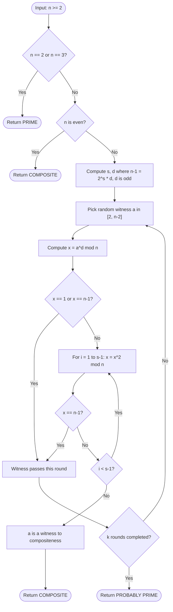
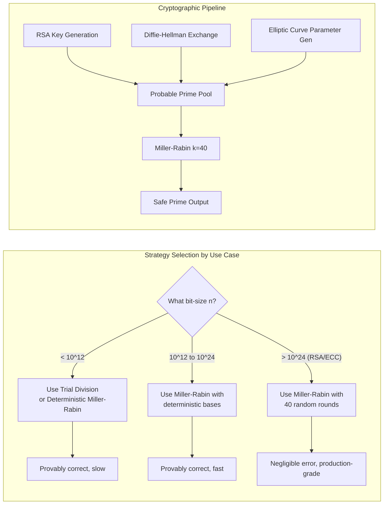
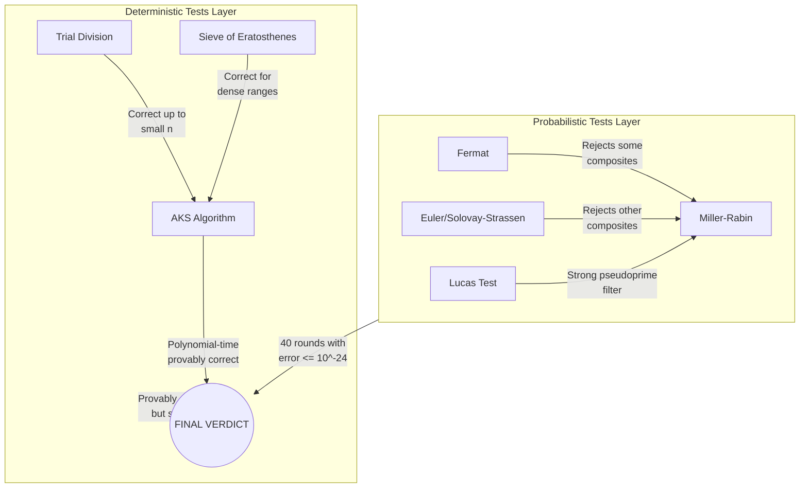
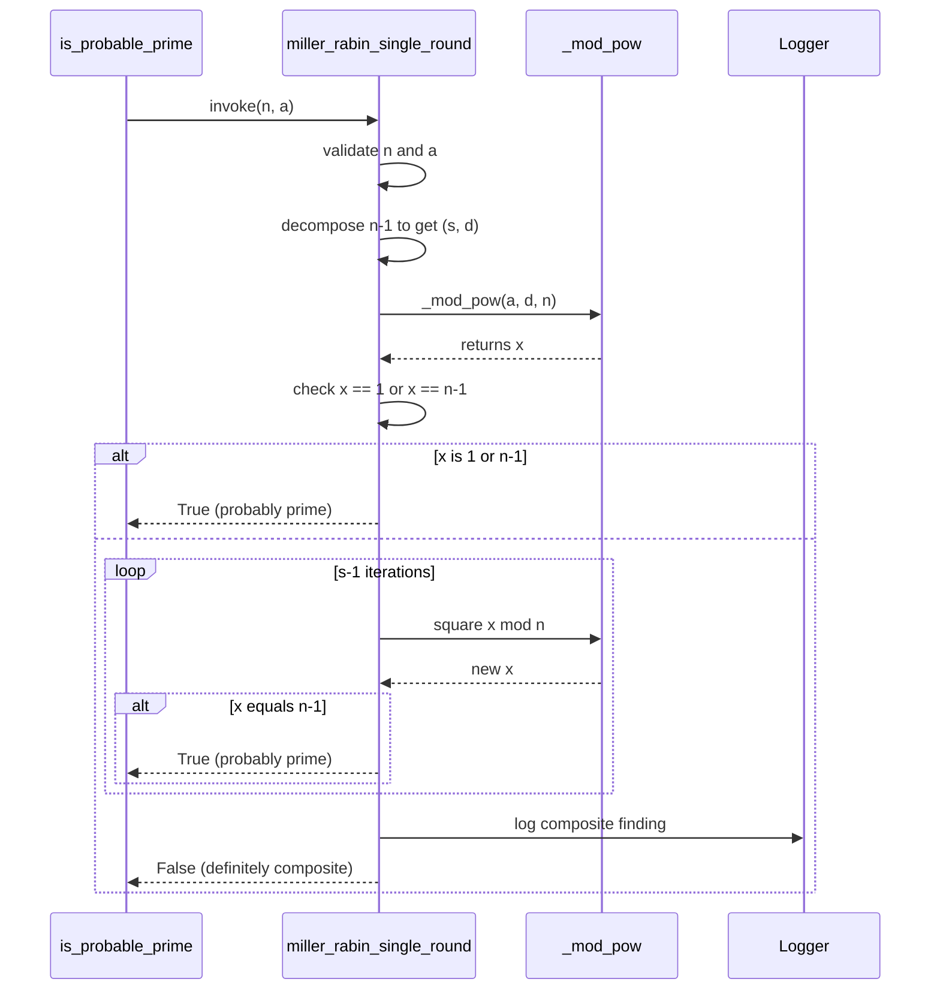

# Primality Testing

<!-- SECTION_1_START -->
# Primality Testing

## 1. Core Technical Definition

> [!IMPORTANT]
> **Primality Testing** is the computational procedure used to determine whether a given positive integer $n > 1$ is a **prime number** (i.e., it has no positive divisors other than $1$ and $n$ itself) or a **composite number**, without necessarily finding its factors.

In the **KTU 2024 Scheme (OECST613 — Foundations of Cryptography)** syllabus, primality testing is positioned as a critical building block of asymmetric cryptography. Almost every public-key algorithm — most notably the **Rivest–Shamir–Adleman (RSA)** cryptosystem, **Diffie–Hellman key exchange**, and **Elliptic Curve Cryptography (ECC)** — depends on the ability to **efficiently generate large prime numbers** (typically of size $\mathbf{1024}$ to $\mathbf{4096}$ bits).

Formally, a primality test is a function:

$$T : \mathbb{N} \setminus \{0, 1\} \rightarrow \{\text{PRIME}, \text{COMPOSITE}\}$$

such that for every prime $p$, $T(p) = \text{PRIME}$, and for every composite $n$, $T(n) = \text{COMPOSITE}$.

### 1.1 Conceptual Analogy — The "Club Membership" Intuition

Imagine a number is a person trying to enter an exclusive club. The club has a strict rule: **you can enter only if you have no other "friends" (divisors) inside the club besides yourself and the doorman (1)**.

- A **deterministic test** is like a strict bouncer who checks *every single member* of the club (trial division up to $\sqrt{n}$). It is **guaranteed correct** but extremely **slow for large crowds**.
- A **probabilistic test** is like a sample-checking bouncer who picks a few random members and asks, "Is this person your friend?" If the person denies all of them, the bouncer *probably* lets them in — but with a tiny, quantifiable **error probability**.
- The **AKS test** is the holy grail: a strict bouncer who can check the entire club **in polynomial time** — fast *and* perfectly correct.

### 1.2 Why This Matters in Cryptography

> [!NOTE]
> **Key Cryptographic Constants & Metrics**
> - **Symmetric key sizes:** $128$ to $\mathbf{256}$ bits (e.g., AES).
> - **RSA modulus size $n = p \cdot q$:** $\mathbf{2048}$ to $\mathbf{4096}$ bits (where $p, q$ are large primes).
> - **Probability of error in Miller–Rabin:** $\le 4^{-k}$ for $k$ independent rounds.
> - **AKS complexity:** $\tilde{O}(\log^6 n)$ — polynomial in bit length.

A single wrong primality decision in RSA key generation can collapse the entire security of the cryptosystem, because if an adversary realizes that the supposedly prime $p$ is actually composite with a small factor, they can factor the modulus in seconds.

### 1.3 GeoGebra Visualization of Trial Division

> [!VISUALIZATION CONTROL]
> **Concept:** Visualizing trial division up to $\sqrt{n}$ — showing the "divisor pairs" and why checking up to $\sqrt{n}$ is sufficient.
>
> **GeoGebra / Desmos Input Equations:**
> - Plot $f(x) = x$ and $g(x) = 17 / x$ for testing $n = 17$.
> - Mark points where $f(x) = g(x)$ (integer intersections indicate divisors).
>
> **Visual Description:** On the X-axis, plot integer values from $1$ to $17$. For $n = 17$, the curve $y = 17/x$ intersects the integer lattice at $(1, 17)$ and $(17, 1)$ only — confirming primality. For $n = 21$, intersections appear at $(1, 21), (3, 7), (7, 3), (21, 1)$ — revealing a divisor pair. The intersection window is bounded by $x = \sqrt{n} \approx 4.58$, demonstrating that checking divisors only up to $\sqrt{n}$ is sufficient.

---

<!-- SECTION_1_END -->

<!-- SECTION_2_START -->
# 2. Deep Theoretical Analysis & KTU High-Yield Formula Sheet

## 2.1 Classification of Primality Tests

Primality tests fall into two broad categories:

1. **Deterministic Tests** — Always return the correct answer.
   - Trial Division
   - Sieve of Eratosthenes
   - **AKS Algorithm** (Agrawal–Kayal–Saxena, 2002)
2. **Probabilistic Tests** — May err with a controllable, negligible probability.
   - **Fermat Primality Test**
   - **Miller–Rabin Test**
   - **Solovay–Strassen Test**
   - **Baillie–PSW Test**

## 2.2 Theoretical Foundation — Fermat's Little Theorem

> [!IMPORTANT]
> **Fermat's Little Theorem (1640):** If $p$ is prime and $\gcd(a, p) = 1$, then
> $$a^{p-1} \equiv 1 \pmod{p}$$

This theorem is the **bedrock** of all modern probabilistic primality tests. It provides a necessary (but not sufficient) condition for primality.

### 2.2.1 Carmichael Numbers — The Trap

A **Carmichael number** $n$ is a composite integer that satisfies $a^{n-1} \equiv 1 \pmod{n}$ for **every** integer $a$ with $\gcd(a, n) = 1$. The smallest example is $\mathbf{561 = 3 \times 11 \times 17}$. These numbers **trick the Fermat test** for almost all bases — hence the Fermat test alone is unreliable for cryptographic use.

## 2.3 The Miller–Rabin Test (Industry Standard)

The Miller–Rabin test strengthens the Fermat test by exploiting the structure of **square roots of unity modulo $n$**.

### 2.3.1 Setup

Write $n - 1 = 2^s \cdot d$ where $d$ is odd and $s \ge 0$. For a randomly chosen witness $a$:

$$a^d, \ a^{2d}, \ a^{4d}, \ \dots, \ a^{2^{s-1} d}, \ a^{2^s d} \pmod{n}$$

Either one of the following must hold for $n$ to be prime:
- $a^d \equiv 1 \pmod{n}$, or
- $a^{2^r d} \equiv -1 \pmod{n}$ for some $0 \le r < s$.

If neither holds, $a$ is a **witness** to compositeness, and $n$ is **definitely composite**.

> [!NOTE]
> **Error Bound:** If $n$ is composite, at least **$3/4$ of all bases** are witnesses. Hence, the probability that $n$ passes $k$ independent Miller–Rabin rounds is at most $4^{-k}$. With $k = 40$ rounds, the error is astronomically small ($\approx 10^{-24}$).

## 2.4 The Solovay–Strassen Test

Uses **Euler's criterion**:

$$a^{(n-1)/2} \equiv \left(\frac{a}{n}\right) \pmod{n}$$

where $\left(\frac{a}{n}\right)$ is the **Jacobi symbol**. If the congruence fails, $n$ is composite. Error probability per round: $\le 1/2$.

## 2.5 The AKS Algorithm (Deterministic Polynomial-Time)

In 2002, **Manindra Agrawal, Neeraj Kayal, and Nitin Saxena** proved that PRIMES is in the complexity class **P**. The AKS test is based on the identity:

$$(x + a)^n \equiv x^n + a \pmod{n}$$

which holds for all integers $a$ if and only if $n$ is prime. Time complexity: $\tilde{O}(\log^{6} n)$.

## 2.6 KTU High-Yield Formula Sheet

| Test | Basis Theorem | Time Complexity | Error Probability | Deterministic? |
| :--- | :--- | :--- | :--- | :--- |
| Trial Division | Direct divisor search | $O(\sqrt{n})$ | $0$ | Yes |
| Fermat Test | Fermat's Little Theorem | $O(k \log^2 n)$ | Carmichael numbers evade | No |
| Miller–Rabin | Fermat + Square roots of 1 | $O(k \log^3 n)$ | $\le 4^{-k}$ | No (in practice) |
| Solovay–Strassen | Euler's Criterion / Jacobi | $O(k \log^3 n)$ | $\le 2^{-k}$ | No |
| AKS | Binomial expansion mod $n$ | $\tilde{O}(\log^{6} n)$ | $0$ | Yes |
| Baillie–PSW | Miller–Rabin + Lucas | $O(\log^3 n)$ | $0$ (empirically) | Conjectured Yes |

> [!IMPORTANT]
> **Engineering Utility:** In production systems (OpenSSL, GnuPG, OpenSSH, TLS handshakes), **Miller–Rabin with 40 rounds** is the *de facto* standard. AKS is theoretically beautiful but practically too slow for routine use.

---

<!-- SECTION_2_END -->

<!-- SECTION_3_START -->
# 3. Step-by-Step Derivations, Worked Examples & Code Implementation

## 3.1 Proof of Fermat's Little Theorem (Combinatorial Argument)

**Claim:** For prime $p$ and $\gcd(a, p) = 1$, $a^{p-1} \equiv 1 \pmod{p}$.

**Derivation:**

Consider the set $S = \{a, 2a, 3a, \dots, (p-1)a\}$ modulo $p$.

$$
\begin{aligned}
\text{Step 1: } & \text{All } ka \pmod{p} \text{ for } 1 \le k \le p-1 \text{ are distinct.} \\
\text{Step 2: } & \text{None of them is } 0 \pmod{p} \text{ because } \gcd(a, p) = 1. \\
\text{Step 3: } & \text{Therefore, } S \equiv \{1, 2, 3, \dots, p-1\} \pmod{p} \text{ (a permutation).} \\
\text{Step 4: } & \prod_{k=1}^{p-1} (ka) \equiv \prod_{k=1}^{p-1} k \pmod{p} \\
\text{Step 5: } & a^{p-1} \cdot (p-1)! \equiv (p-1)! \pmod{p} \\
\text{Step 6: } & \text{Since } \gcd((p-1)!, p) = 1, \text{ divide both sides by } (p-1)! \\
\text{Step 7: } & a^{p-1} \equiv 1 \pmod{p} \quad \blacksquare
\end{aligned}
$$

## 3.2 Worked Example — Miller–Rabin on $n = 221$

We want to determine whether $n = 221 = 13 \times 17$ is prime.

**Step 1: Factor out powers of 2.**

$$
n - 1 = 220 = 2^2 \times 55 \quad \Rightarrow \quad s = 2, \ d = 55
$$

**Step 2: Choose a witness** $a = 174$ (random).

**Step 3: Compute the sequence modulo $221$.**

$$
\begin{aligned}
a^d \bmod n &= 174^{55} \bmod 221 \\
&\equiv 47 \pmod{221} \quad \text{(not 1, not } {-1} \equiv 220\text{)} \\
a^{2d} \bmod n &= 47^2 \bmod 221 \\
&= 2209 \bmod 221 \\
&\equiv 220 \pmod{221} \quad \text{(equals } {-1}\text{, passes!)}
\end{aligned}
$$

Since the sequence ends at $-1 \pmod{221}$, the witness $a = 174$ **does not** prove compositeness. We need another witness.

**Step 4: Choose** $a = 137$.

$$
\begin{aligned}
137^{55} \bmod 221 &\equiv 188 \pmod{221} \\
188^2 \bmod 221 &\equiv 205 \pmod{221} \quad \text{(not } {-1}\text{)}
\end{aligned}
$$

The sequence is $188, 205$ — never hits $1$ or $-1 \pmod{221}$. Therefore, $a = 137$ is a **witness to compositeness**, and $n = 221$ is **composite**. $\blacksquare$

## 3.3 Python Implementation — Production-Grade Miller–Rabin

```python
"""
Miller–Rabin Primality Test
Production-grade implementation with deterministic small-n optimization.
Course: OECST613 - Foundations of Cryptography (KTU 2024 Scheme)
"""

import random
import logging
from typing import List, Tuple

# Configure logging for cryptographic audit trails
logging.basicConfig(
    level=logging.INFO,
    format="%(asctime)s [%(levelname)s] %(message)s"
)
logger = logging.getLogger("PrimalityTest")


# Deterministic witness set for n < 3,317,044,064,679,887,385,961,981
# (proved by Sorenson & Webster, 2017)
_DETERMINISTIC_BASES: Tuple[int, ...] = (2, 3, 5, 7, 11, 13, 17, 19, 23, 29, 31, 37)


def _decompose(n: int) -> Tuple[int, int]:
    """
    Decompose n - 1 into (2^s) * d where d is odd.
    Returns (s, d).
    """
    if n < 2:
        raise ValueError("n must be >= 2")
    n_minus_1 = n - 1
    s: int = 0
    d: int = n_minus_1
    while d % 2 == 0:
        d //= 2
        s += 1
    return s, d


def _mod_pow(base: int, exponent: int, modulus: int) -> int:
    """
    Fast modular exponentiation using the square-and-multiply algorithm.
    Runs in O(log exponent) multiplications.
    """
    if modulus == 1:
        return 0
    result: int = 1
    base = base % modulus
    while exponent > 0:
        if exponent & 1:
            result = (result * base) % modulus
        exponent >>= 1
        base = (base * base) % modulus
    return result


def miller_rabin_single_round(n: int, a: int) -> bool:
    """
    Performs ONE round of Miller-Rabin with witness `a`.
    Returns True if `n` is *probably* prime, False if definitely composite.
    """
    if n < 2:
        return False
    if n == 2 or n == 3:
        return True
    if n % 2 == 0:
        return False

    s, d = _decompose(n)

    # Compute a^d mod n
    x = _mod_pow(a, d, n)

    if x == 1 or x == n - 1:
        return True  # passes this round

    # Square repeatedly up to s - 1 times
    for _ in range(s - 1):
        x = (x * x) % n
        if x == n - 1:
            return True  # found -1, passes

    return False  # never hit 1 or -1: n is COMPOSITE


def is_probable_prime(n: int, k: int = 40) -> bool:
    """
    Miller-Rabin primality test with k independent random rounds.

    Args:
        n: The integer to test (must be >= 2).
        k: Number of rounds. Error probability <= 4^(-k).

    Returns:
        True if n is probably prime, False if definitely composite.
    """
    # --- Boundary checks ---
    if n < 2:
        logger.error(f"Invalid input: n = {n} (< 2)")
        return False
    if n == 2 or n == 3:
        return True
    if n % 2 == 0:
        return False

    # --- Small n optimization (deterministic) ---
    if n < 3_317_044_064_679_887_385_961_981:
        for a in _DETERMINISTIC_BASES:
            if a >= n:
                continue
            if not miller_rabin_single_round(n, a):
                logger.info(f"n = {n} is COMPOSITE (witness a = {a})")
                return False
        return True

    # --- Probabilistic phase for large n ---
    logger.info(f"Testing large n ({n.bit_length()} bits) with k = {k} rounds")
    for round_idx in range(k):
        # Random witness in [2, n - 2]
        a = random.randrange(2, n - 1)
        if not miller_rabin_single_round(n, a):
            logger.warning(
                f"Round {round_idx + 1}: a = {a} is a witness. "
                f"n = {n} is COMPOSITE."
            )
            return False
        logger.debug(f"Round {round_idx + 1}: passed (witness a = {a})")

    return True  # probably prime


def generate_large_prime(bits: int = 1024, k: int = 40) -> int:
    """
    Generate a random probable prime of `bits` bit length.
    Used in RSA key generation pipelines.
    """
    if bits < 2:
        raise ValueError("bits must be >= 2")

    logger.info(f"Generating {bits}-bit probable prime...")
    attempts: int = 0
    while True:
        attempts += 1
        # Generate a random odd number with the top bit set
        candidate = random.getrandbits(bits)
        candidate |= (1 << (bits - 1))  # ensure bit length
        candidate |= 1                   # ensure odd
        if is_probable_prime(candidate, k):
            logger.info(f"Found prime after {attempts} attempt(s).")
            return candidate


# ----------------------------------------------------------------------
# Demonstration
# ----------------------------------------------------------------------
if __name__ == "__main__":
    test_values: List[int] = [
        2, 3, 4, 17, 561, 1009, 1729, 221, 7919, 10_006_721
    ]

    print("=" * 60)
    print("Miller-Rabin Primality Test - Demo")
    print("=" * 60)
    for value in test_values:
        result = is_probable_prime(value)
        status = "PRIME" if result else "COMPOSITE"
        print(f"  n = {value:>10}  ->  {status}")
    print("=" * 60)

    # Generate a small cryptographic-grade prime for demonstration
    demo_prime = generate_large_prime(bits=512, k=20)
    print(f"\nGenerated 512-bit prime (hex prefix): {hex(demo_prime)[:40]}...")
    print(f"Bit length: {demo_prime.bit_length()} bits")
```

## 3.4 AKS Algorithm — Step-by-Step Outline

The AKS test deterministically establishes primality in polynomial time.

**Step 1:** Check that $n$ is not a perfect power $a^b$ for $b \ge 2$. If yes → composite.

**Step 2:** Find the smallest $r$ such that $\text{ord}_r(n) > \log_2^2 n$. This $r$ exists and is bounded.

**Step 3:** Verify $\gcd(n, a) = 1$ for all $2 \le a \le r$. If any $\gcd > 1$ → composite.

**Step 4:** For $a = 1$ to $\lfloor \sqrt{\phi(r)} \cdot \log_2 n \rfloor$, check the congruence:

$$(x + a)^n \equiv x^n + a \pmod{x^r - 1, \ n}$$

**Step 5:** If all congruences hold, $n$ is **definitely prime**.

> [!NOTE]
> **Why It Works:** The polynomial identity $(x + a)^n \equiv x^n + a$ holds modulo a prime $n$ due to properties of the **binomial coefficients** $\binom{n}{k} \equiv 0 \pmod{n}$ for $0 < k < n$ when $n$ is prime. The test cleverly uses modular polynomials to avoid expanding the entire expression.

---

<!-- SECTION_3_END -->

<!-- SECTION_4_START -->
# 4. Structural Diagrams & Schematics

## 4.1 Miller–Rabin Decision Flowchart



## 4.2 Primality Testing Strategy Selection Matrix



## 4.3 Comparative Architecture — Probabilistic vs Deterministic Tests



## 4.4 Sequential Processing Topology — Single Round of Miller–Rabin



---

<!-- SECTION_4_END -->

<!-- SECTION_5_START -->
# 5. KTU 2024 Scheme Examination Question Bank & Topic Recap

## 5.1 Part A Questions (3 Marks Each)

### Question 1 `[KTU University Exam - July 2024]`
**CO1, Remember:** Define a primality test. State Fermat's Little Theorem.

**Model Answer (3 Marks):**

A primality test is an algorithm that determines whether a given integer $n > 1$ is prime or composite. **Fermat's Little Theorem** states: if $p$ is prime and $\gcd(a, p) = 1$, then $a^{p-1} \equiv 1 \pmod{p}$.

> [Statement of definition: **1 Mark**]
> [Statement of FLT: **1 Mark**]
> [Correctly noting $\gcd$ condition: **1 Mark**]

### Question 2 `[KTU University Exam - Dec 2023]`
**CO1, Understand:** What are Carmichael numbers? Why are they significant in primality testing?

**Model Answer (3 Marks):**

Carmichael numbers are composite integers $n$ that satisfy $a^{n-1} \equiv 1 \pmod{n}$ for **all** integers $a$ coprime to $n$. The smallest is $561 = 3 \times 11 \times 17$. They are significant because they **evade the basic Fermat primality test**, leading to the development of stronger tests like Miller–Rabin.

> [Definition: **1 Mark**]
> [Example: **1 Mark**]
> [Cryptographic significance: **1 Mark**]

---

## 5.2 Part B Questions (14 Marks Each — Internal Choice)

### Question A `[KTU University Exam - July 2024]` (14 Marks)

**(a) [7 Marks, CO2, Understand]** Explain the Miller–Rabin primality test with its underlying logic. State the error bound for $k$ independent rounds.

**(b) [7 Marks, CO3, Apply]** Apply the Miller–Rabin test to $n = 221$ using witness $a = 5$. Show every computation step and determine whether $221$ is prime or composite.

#### Model Solution

**(a) Miller–Rabin Test Explanation [7 Marks]**

**Step 1 [Miller–Rabin Setup — 2 Marks]:** Write $n - 1 = 2^s \cdot d$ with $d$ odd. For a witness $a \in [2, n-2]$, compute the sequence:

$$x_0 = a^d \pmod{n}, \quad x_{i+1} = x_i^2 \pmod{n}$$

**Step 2 [Pass Condition — 2 Marks]:** $n$ is *probably prime* for this witness if either $x_0 \equiv 1$ or some $x_i \equiv -1 \pmod{n}$. If neither holds, $n$ is **definitely composite** and $a$ is a *witness*.

**Step 3 [Error Bound — 2 Marks]:** At least $3/4$ of all bases are witnesses for any composite $n$. Error after $k$ rounds:

$$P(\text{error}) \le 4^{-k}$$

**Step 4 [Practical Use — 1 Mark]:** With $k = 40$, error $\le 10^{-24}$, suitable for RSA key generation.

**(b) Applying Miller–Rabin to $n = 221$, $a = 5$ [7 Marks]**

**Step 1 [Decomposition — 1 Mark]:** $220 = 2^2 \times 55$, so $s = 2, d = 55$.

**Step 2 [Compute $x_0$ — 2 Marks]:**

$$x_0 = 5^{55} \bmod 221$$

Computing stepwise: $5^2 = 25$, $5^4 = 625 \equiv 183 \pmod{221}$, $5^8 \equiv 183^2 = 33489 \equiv 118 \pmod{221}$, $5^{16} \equiv 118^2 = 13924 \equiv 1 \pmod{221}$, $5^{32} \equiv 1 \pmod{221}$, $5^{55} = 5^{32} \cdot 5^{16} \cdot 5^4 \cdot 5^2 \cdot 5^1 \equiv 1 \cdot 1 \cdot 183 \cdot 25 \cdot 5 \pmod{221}$.

$183 \cdot 25 = 4575 \equiv 4575 - 20 \times 221 = 4575 - 4420 = 155 \pmod{221}$.
$155 \cdot 5 = 775 \equiv 775 - 3 \times 221 = 775 - 663 = 112 \pmod{221}$.

So $x_0 = 112 \pmod{221}$. **Not 1, not 220.**

**Step 3 [Compute $x_1$ — 2 Marks]:**

$$x_1 = 112^2 \bmod 221 = 12544 \bmod 221$$
$12544 / 221 \approx 56.76$; $56 \times 221 = 12376$; $12544 - 12376 = 168$.
So $x_1 = 168 \pmod{221}$. **Not 220.**

**Step 4 [Verdict — 2 Marks]:** The sequence is $112, 168$ — never hits $1$ or $-1 \equiv 220$. **Therefore $a = 5$ is a witness, and $n = 221$ is COMPOSITE.** In fact, $221 = 13 \times 17$.

> [!WARNING]
> **KTU Examiner's Pitfall Callout:** Students commonly lose marks by **forgetting to check the $-1$ condition after every squaring**, not just at the end. The sequence $x_0, x_1, x_2, \ldots, x_{s-1}$ must be checked for $-1$ at **every** step. Also, ensure you clearly state **whether $n$ is prime or composite** at the end of the computation — partial answers without a final verdict lose at least 1 mark.

---

### Question B `[KTU University Exam - Dec 2023]` (14 Marks) — *Alternative Choice*

**(a) [7 Marks, CO2, Understand]** State and explain the Solovay–Strassen primality test. How does it differ from the Fermat test? Use the Jacobi symbol in your explanation.

**(b) [7 Marks, CO3, Apply]** Test the primality of $n = 91$ using the Fermat test with bases $a = 3$ and $a = 5$. Show all steps.

#### Model Solution

**(a) Solovay–Strassen Test [7 Marks]**

**Step 1 [Foundation — 2 Marks]:** Based on **Euler's criterion**: for odd prime $p$ and $\gcd(a, p) = 1$:

$$a^{(p-1)/2} \equiv \left(\frac{a}{p}\right) \pmod{p}$$

where $\left(\frac{a}{p}\right)$ is the **Legendre symbol** (which equals $+1$ if $a$ is a QR, $-1$ if not, $0$ if $p \mid a$).

**Step 2 [Jacobi Extension — 2 Marks]:** For composite $n$, the **Jacobi symbol** $\left(\frac{a}{n}\right)$ is defined using the prime factorization. Unlike Legendre, $\left(\frac{a}{n}\right) = -1$ guarantees compositeness, but $\left(\frac{a}{n}\right) = +1$ does **not** guarantee primality.

**Step 3 [Test Procedure — 2 Marks]:**
- Pick random $a \in [2, n-2]$.
- Compute both $a^{(n-1)/2} \bmod n$ and the Jacobi symbol $\left(\frac{a}{n}\right)$.
- If they are **not equal**, $n$ is **composite**. Otherwise, repeat with more bases.

**Step 4 [Difference from Fermat — 1 Mark]:** Fermat uses exponent $n-1$ with no quadratic-residue check; Solovay–Strassen uses $(n-1)/2$ with the Jacobi symbol, making it **stronger** but still probabilistic with error $\le 2^{-k}$.

**(b) Fermat Test on $n = 91$ [7 Marks]**

**Step 1 [Decomposition setup — 1 Mark]:** $n = 91 = 7 \times 13$ is composite. We need $n - 1 = 90$.

**Step 2 [Base $a = 3$ — 3 Marks]:** Compute $3^{90} \bmod 91$.

Using $3^6 = 729 = 8 \times 91 + 1 \equiv 1 \pmod{91}$:

$$3^{90} = (3^6)^{15} \equiv 1^{15} \equiv 1 \pmod{91}$$

The test **passes** for $a = 3$ — $91$ is *probably prime* (false positive).

**Step 3 [Base $a = 5$ — 2 Marks]:** Compute $5^{90} \bmod 91$.

$5^2 = 25$, $5^4 = 625 \equiv 625 - 6 \times 91 = 625 - 546 = 79 \equiv -12 \pmod{91}$.
$5^8 \equiv (-12)^2 = 144 \equiv 144 - 91 = 53 \pmod{91}$.
$5^{16} \equiv 53^2 = 2809 \equiv 2809 - 30 \times 91 = 2809 - 2730 = 79 \equiv -12 \pmod{91}$.
$5^{32} \equiv (-12)^2 = 144 \equiv 53 \pmod{91}$.
$5^{64} \equiv 53^2 = 2809 \equiv 79 \equiv -12 \pmod{91}$.

$5^{90} = 5^{64} \cdot 5^{16} \cdot 5^8 \cdot 5^2 \equiv (-12)(-12)(53)(25) \pmod{91}$.
$(-12)(-12) = 144 \equiv 53$. Then $53 \cdot 53 = 2809 \equiv 79 \equiv -12$. Then $(-12) \cdot 25 = -300 \equiv -300 + 4 \times 91 = -300 + 364 = 64 \pmod{91}$.

So $5^{90} \equiv 64 \pmod{91}$, which is **not 1**.

**Step 4 [Verdict — 1 Mark]:** $a = 5$ is a witness — $91$ is **composite**.

> [!WARNING]
> **KTU Examiner's Pitfall Callout (Part B):** Many students forget to show the **intermediate exponent breakdowns** when computing large powers (e.g., $5^{90}$ as $5^{64} \cdot 5^{16} \cdot 5^8 \cdot 5^2$). Always show this decomposition — KTU valuation keys award **1 to 2 marks** for the modular arithmetic strategy. Also, a single witness **passing** does not prove primality; only a **witness failing** proves compositeness. Make this distinction explicit.

---

## 5.3 Topic Recap & Important Things to Remember

> [!IMPORTANT]
> **Rapid Revision Checklist — Primality Testing**

- **Core Question:** Is $n$ prime or composite?
- **Fermat's Little Theorem:** $a^{p-1} \equiv 1 \pmod{p}$ for prime $p$, $\gcd(a,p)=1$.
- **Fermat Test Pitfall:** **Carmichael numbers** (e.g., $561$, $1105$, $1729$) fool it.
- **Miller–Rabin Decomposition:** Always write $n - 1 = 2^s \cdot d$ with $d$ odd.
- **Miller–Rabin Pass Conditions:** Sequence must hit $1$ or $-1 \pmod{n}$.
- **Miller–Rabin Error:** $\le 4^{-k}$; with $k = 40$, error $< 10^{-24}$.
- **Solovay–Strassen Basis:** Euler's criterion + Jacobi symbol; error $\le 2^{-k}$.
- **AKS Algorithm:** First **deterministic polynomial-time** primality test (2002); $\tilde{O}(\log^6 n)$.
- **Industry Standard:** OpenSSL, GnuPG use **Miller–Rabin with 40 rounds** for RSA primes.
- **RSA Prime Size:** $p, q$ of $1024$ to $2048$ bits each; modulus $n = p \cdot q$ is $2048$ to $4096$ bits.
- **Deterministic Threshold:** For $n < 3.317 \times 10^{24}$, the 12-base set $(2, 3, 5, 7, 11, 13, 17, 19, 23, 29, 31, 37)$ is **provably sufficient** for Miller–Rabin.
- **Common Exam Trap:** A single passing witness in a probabilistic test does **NOT** prove primality — only that $n$ is *probably* prime. Only a **failing** witness (a witness to compositeness) definitively proves compositeness.
- **Complexity Ranking (fastest to slowest, asymptotically):** Miller–Rabin $<$ AKS $<$ Trial Division for large $n$.
- **Key Cryptographic Insight:** A faulty primality test in RSA key generation can leak the entire private key. Always use $k \ge 20$ rounds for cryptographic applications.

<!-- SECTION_5_END -->
