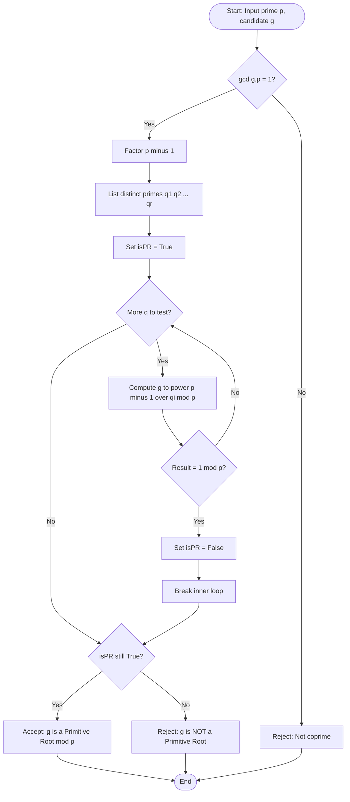
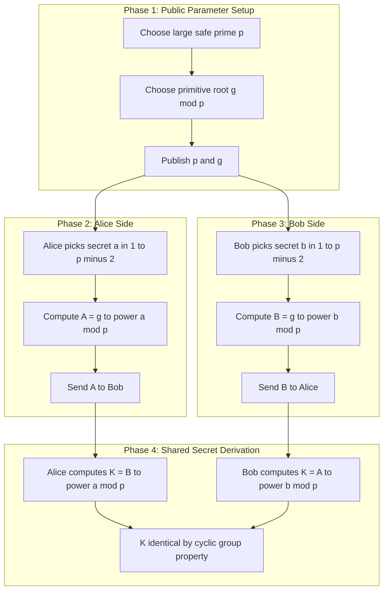
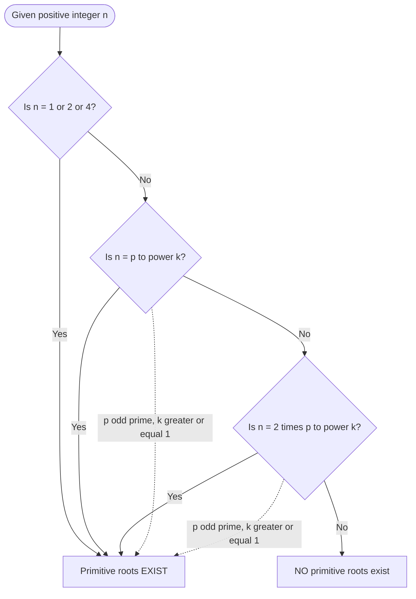

# Prime numbers and Prime Factorisation - Primitive Roots

<!-- SECTION_1_START -->
# Primitive Roots — The Generators of Modular Arithmetic

## 1.1 Formal Academic Definition (KTU 2024 Syllabus Terminology)

> [!IMPORTANT]
> **Primitive Root Modulo $n$:**
> Let $n \ge 2$ be a positive integer and let $g$ be an integer with $\gcd(g, n) = 1$. Then $g$ is called a **primitive root modulo $n$** (or a *generator* of the multiplicative group $(\mathbb{Z}/n\mathbb{Z})^\times$) if the **order** of $g$ modulo $n$ is exactly $\varphi(n)$, where $\varphi$ denotes **Euler's Totient Function**.

In symbolic form, $g$ is a primitive root mod $n$ if and only if:

$$
\text{ord}_n(g) \;=\; \varphi(n) \quad\Longleftrightarrow\quad \big\{g^1 \bmod n,\; g^2 \bmod n,\; \dots,\; g^{\varphi(n)} \bmod n\big\} \;=\; \big\{a \in \mathbb{Z}_n \;:\; \gcd(a,n)=1\big\}
$$

That is, the powers of $g$ enumerate **every** invertible residue class modulo $n$ exactly once.

## 1.2 Related Foundational Definitions

> [!NOTE]
> **Order of an Integer Modulo $n$ (Stallings, Trappe & Washington):**
> The **multiplicative order** of $a$ modulo $n$, denoted $\text{ord}_n(a)$, is the smallest positive integer $k$ such that:
> $$a^k \;\equiv\; 1 \pmod{n}, \qquad \text{where } \gcd(a,n) = 1$$

> [!NOTE]
> **Euler's Totient Function $\varphi(n)$:**
> $\varphi(n)$ counts the positive integers $k \le n$ that are **coprime** to $n$. For a prime $p$, $\varphi(p) = p-1$. For prime-power factorisation $n = p_1^{e_1} p_2^{e_2} \cdots p_r^{e_r}$:
> $$\varphi(n) \;=\; \prod_{i=1}^{r} p_i^{e_i - 1}(p_i - 1)$$

> [!NOTE]
> **Euler's Theorem:**
> If $\gcd(a,n) = 1$, then $a^{\varphi(n)} \equiv 1 \pmod{n}$. This is the existence guarantee that *some* finite order exists for every invertible residue.

## 1.3 Intuitive Analogy — "The 12-Hour Clock, But Better"

Imagine a **clock with $\varphi(n)$ distinct tick marks** (e.g., a 6-mark clock when $n = 7$, since $\varphi(7) = 6$). A primitive root is like a hand of the clock that, when stepped forward in equal increments of its *own length*, lands on **every single tick mark** before returning home. A non-primitive root (e.g., $g = 3$ mod 7) is a "shorter hand" that only visits a subset of the tick marks, completing its cycle early.

| Analogy Element | Mathematical Counterpart |
|---|---|
| Clock face with $\varphi(n)$ marks | Multiplicative group $(\mathbb{Z}/n\mathbb{Z})^\times$ |
| Length of hand (number of unique marks visited) | Order $\text{ord}_n(g)$ |
| Hand that visits **all** marks | Primitive root (full generator) |
| Hand that visits only a subset | Element of lower order |

## 1.4 Visualisation

> [!VISUALIZATION CONTROL]
> **Concept:** Powers of $g=3$ modulo $7$ (order visualisation)
> **GeoGebra / Desmos Input Equations:**
> * Mod table: list $(k, 3^k \bmod 7)$ for $k = 1, \dots, 6$
> * Plot: `ListPlot({{1,3},{2,2},{3,6},{4,4},{5,5},{6,1}})`
> **Visual Description:** The six points $(1,3),(2,2),(3,6),(4,4),(5,5),(6,1)$ trace a permutation of $\{1,2,3,4,5,6\}$ — confirming $g = 3$ **is** a primitive root mod $7$.

> [!VISUALIZATION CONTROL]
> **Concept:** Non-primitive root modulo $8$ (counter-example)
> **GeoGebra Input:** Plot $3^k \bmod 8$ for $k = 1, \dots, \varphi(8) = 4$
> **Visual Description:** $3^1 = 3,\; 3^2 = 1$. The sequence collapses at $k=2$ instead of $k=4$ — illustrating that primitive roots **do not exist for every** $n$.

## 1.5 KTU Highlight — Where Primitive Roots Live

> [!IMPORTANT]
> **Gauss's Existence Theorem (1801):**
> Primitive roots exist if and only if $n$ belongs to one of the following sets:
> $$n \;\in\; \{1,\; 2,\; 4,\; p^k,\; 2p^k\}$$
> where $p$ is an odd prime and $k \ge 1$. For cryptographic applications, we are almost always in the case $n = p$ (a large **safe prime**), where existence is guaranteed.

**Constants & Standard Metrics (KTU Board Favourite):**
- Number of primitive roots modulo a prime $p$ is exactly $\varphi(p-1)$.
- The **smallest** primitive root of a prime $p$ is almost always $< p^{0.5}$ (conjectured, but in practice much smaller for the primes used in cryptography).
- For a *safe prime* $p = 2q + 1$ with $q$ also prime, the primitive roots mod $p$ are exactly the quadratic non-residues of $p$.

<!-- SECTION_1_END -->

<!-- SECTION_2_START -->
# Deep Theoretical Analysis & KTU High-Yield Formula Sheet

## 2.1 The Hierarchical Theorem Stack

### Step 1 — Base Layer: Fermat's Little Theorem
For prime $p$ and $\gcd(a,p) = 1$:
$$a^{p-1} \;\equiv\; 1 \pmod{p}$$
This guarantees the order $\text{ord}_p(a)$ always **divides** $p-1$.

### Step 2 — Intermediate Layer: Order Divisibility Property
> [!IMPORTANT]
> **Divisibility Lemma:** If $a^k \equiv 1 \pmod{p}$, then $\text{ord}_p(a) \;\mid\; k$. Combined with Step 1, we conclude that the order of *any* element modulo $p$ must be a divisor of $p-1$.

### Step 3 — Recognition Layer: Primitive Root Test (Stallings Theorem 8.9 / Trappe Theorem 7.2)
> [!IMPORTANT]
> **Primitive Root Verification Test:**
> Let $p$ be a prime and let $p - 1$ have the prime factorisation
> $$p - 1 \;=\; q_1^{e_1} q_2^{e_2} \cdots q_r^{e_r}$$
> where the $q_i$ are the **distinct** prime factors. Then $g$ is a primitive root modulo $p$ if and only if:
> $$g^{(p-1)/q_i} \;\not\equiv\; 1 \pmod{p} \qquad \text{for every } i = 1, 2, \dots, r$$
> Equivalently, in plain terms: *"raise $g$ to every $(p-1)/q_i$; if NONE of those powers equals $1$, then $g$ is a primitive root."*

**Why it works (intuition):** If $g$ were *not* a primitive root, its order would be a proper divisor of $p-1$, say $d \mid (p-1)$ with $d < p-1$. Then $d$ has some prime factor $q_i$, and $(p-1)/q_i$ would NOT be a multiple of $d$ (since $q_i$ was "removed" once). Hence $g^{(p-1)/q_i}$ would collapse to $1$ for at least one $q_i$ — contradicting the test. Conversely, if the test holds for all prime factors, the order cannot be a proper divisor.

### Step 4 — Application Layer: Discrete Logarithm & Cryptography
The **Discrete Logarithm Problem (DLP)** is defined only with respect to a primitive root $g$:
$$y \;\equiv\; g^x \pmod{p} \quad\Longleftrightarrow\quad x \;=\; \log_g y \pmod{p}$$
Without a primitive root, the group $(\mathbb{Z}/p\mathbb{Z})^\times$ would not be *cyclic*, and the DLP would not be a clean one-to-one map from exponents to residues.

## 2.2 The "Why" Behind the Cyclic Group

> [!NOTE]
> The set $G = \{g, g^2, g^3, \dots, g^{\varphi(n)}\} \pmod{n}$ forms a **cyclic group** of order $\varphi(n)$ when $g$ is a primitive root. Every element $a$ coprime to $n$ can be written uniquely as $a \equiv g^i \pmod{n}$ for some $0 \le i < \varphi(n)$.

This makes $(\mathbb{Z}/n\mathbb{Z})^\times \cong \mathbb{Z}_{\varphi(n)}$ (additive), a crucial isomorphism exploited in:
- **Diffie–Hellman** key exchange
- **ElGamal** public-key encryption
- **DSA** and **Schnorr** digital signatures
- **Shamir's** secret sharing (over $\mathbb{Z}_p$)

## 2.3 Counting & Locating Primitive Roots

> [!IMPORTANT]
> **Theorem — Number of Primitive Roots:**
> The number of primitive roots modulo a prime $p$ is:
> $$N_{\text{PR}}(p) \;=\; \varphi(p - 1)$$
> For a general $n$ admitting primitive roots, the number of primitive roots mod $n$ is $\varphi(\varphi(n))$.

> [!NOTE]
> **Safe Prime Shortcut (used in real-world DH, e.g., RFC 3526 / RFC 7919):**
> If $p = 2q + 1$ with $q$ also prime, then **every quadratic non-residue** mod $p$ is a primitive root. There are exactly $q - 1$ such residues (i.e., the Legendre symbol $\left(\tfrac{a}{p}\right) = -1$).

## 2.4 KTU High-Yield Formula Sheet

| # | Formula / Property | Statement | Conditions | Used In |
|---|---|---|---|---|
| 1 | Fermat's Little Theorem | $a^{p-1} \equiv 1 \pmod{p}$ | $p$ prime, $\gcd(a,p)=1$ | Order existence |
| 2 | Euler's Theorem | $a^{\varphi(n)} \equiv 1 \pmod{n}$ | $\gcd(a,n)=1$ | Group order |
| 3 | Euler's Totient | $\varphi(n) = \prod p_i^{e_i-1}(p_i-1)$ | $n = \prod p_i^{e_i}$ | Counting invertible residues |
| 4 | Order Divisibility | $\text{ord}_n(a) \;\mid\; \varphi(n)$ | $\gcd(a,n)=1$ | Order bounds |
| 5 | Primitive Root Test | $g^{(p-1)/q_i} \not\equiv 1 \pmod{p}$ for all $q_i \mid p-1$ | $q_i$ prime factors of $p-1$ | **Verification** |
| 6 | Count of Primitive Roots | $N_{\text{PR}}(p) = \varphi(p-1)$ | $p$ prime | Counting generators |
| 7 | Safe-Prime Lemma | QNR mod $p = 2q+1$ are PR | $q$ prime | DH / ElGamal / DSA |
| 8 | Cyclic Group Iso | $(\mathbb{Z}/p\mathbb{Z})^\times \cong \langle g \rangle$ | $g$ is PR mod $p$ | DLP definition |
| 9 | Discrete Log | $y = g^x \bmod p$ | $g$ primitive root | DH, ElGamal, DSA |
| 10 | Existence Set | $n \in \{1, 2, 4, p^k, 2p^k\}$ | $p$ odd prime, $k \ge 1$ | Existence check |

## 2.5 Real-World Utility in Cryptography

| Cryptosystem | Role of Primitive Root |
|---|---|
| **Diffie–Hellman (DH)** | $g$ is a public primitive root mod $p$; shared secret $K = g^{ab} \bmod p$ |
| **ElGamal Encryption** | $g$ generates cyclic subgroup; ciphertext pair $(g^r, m \cdot g^{ar})$ |
| **DSA / Schnorr Signatures** | $g$ is a generator of a $q$-order subgroup; signatures involve $g^k \bmod p$ |
| **Shamir Secret Sharing** | Polynomial coefficients evaluated mod $p$ with $g$ enabling reconstruction |
| **Massey–Omura Cipher** | Exponentiation with primitive roots ensures full key space |
| **Discrete Log Cryptanalysis** | Subgroup attacks target orders that *aren't* prime; choice of PR mitigates this |

> [!NOTE]
> **Production Reality:** Standardised parameters (NIST FIPS 186-4, RFC 3526) use **safe primes** precisely because every quadratic non-residue is a primitive root — this guarantees the largest possible cyclic subgroup and the strongest DLP security.

<!-- SECTION_2_END -->

<!-- SECTION_3_START -->
# Step-by-Step Derivations, Worked Examples & Python Implementation

## 3.1 Worked Example 1 — Finding a Primitive Root of $p = 19$

**Given:** $p = 19$. Find the smallest primitive root.

**Step 1 — Factor $p - 1$.**
$$p - 1 = 18 = 2 \times 3^2$$
Distinct prime factors: $q_1 = 2,\; q_2 = 3$.

**Step 2 — Test candidate $g = 2$.**

Compute $g^{(p-1)/q_1} = 2^{18/2} = 2^9$:
$$2^9 = 512$$
$$512 \bmod 19 \;=\; 512 - 26 \times 19 \;=\; 512 - 494 \;=\; 18 \;\not\equiv\; 1 \pmod{19}\quad\checkmark$$

Compute $g^{(p-1)/q_2} = 2^{18/3} = 2^6$:
$$2^6 = 64$$
$$64 \bmod 19 \;=\; 64 - 3 \times 19 \;=\; 64 - 57 \;=\; 7 \;\not\equiv\; 1 \pmod{19}\quad\checkmark$$

**Step 3 — Conclusion.**
Since both tests yield residues other than $1$, $g = 2$ is a **primitive root mod 19**. The sequence of powers exhausts $\{1, 2, \dots, 18\}$:

$$
\begin{aligned}
2^1 &\equiv 2 \pmod{19} \\
2^2 &\equiv 4 \pmod{19} \\
2^3 &\equiv 8 \pmod{19} \\
2^4 &\equiv 16 \pmod{19} \\
2^5 &\equiv 13 \pmod{19} \\
2^6 &\equiv 7 \pmod{19} \\
2^7 &\equiv 14 \pmod{19} \\
2^8 &\equiv 9 \pmod{19} \\
2^9 &\equiv 18 \pmod{19} \\
2^{10} &\equiv 17 \pmod{19} \\
2^{11} &\equiv 15 \pmod{19} \\
2^{12} &\equiv 11 \pmod{19} \\
2^{13} &\equiv 3 \pmod{19} \\
2^{14} &\equiv 6 \pmod{19} \\
2^{15} &\equiv 12 \pmod{19} \\
2^{16} &\equiv 5 \pmod{19} \\
2^{17} &\equiv 10 \pmod{19} \\
2^{18} &\equiv 1 \pmod{19}
\end{aligned}
$$

All 18 distinct invertible residues appear — **verified primitive root**.

## 3.2 Worked Example 2 — Showing that $g = 2$ is NOT a Primitive Root of $p = 1093$

**Given:** $p = 1093$ (a known Wieferich prime). $p - 1 = 1092 = 2^2 \cdot 3 \cdot 7 \cdot 13$. Distinct prime factors: $q_i \in \{2, 3, 7, 13\}$.

Compute $2^{(p-1)/2} = 2^{546} \pmod{1093}$:
$$2^{546} \bmod 1093 \;=\; 1 \pmod{1093}\quad\text{(by Wieferich property!)}$$

Since $2^{546} \equiv 1 \pmod{1093}$, the test **fails** for $q_1 = 2$. Therefore $g = 2$ is **not** a primitive root of 1093.

> [!NOTE]
> Wieferich primes are *rare pathological cases* where the simple test reveals the failure immediately — this is exactly why the primitive root test must be **explicitly verified** in cryptographic key generation, never assumed.

## 3.3 Worked Example 3 — Primitive Roots Modulo a Composite $n = 14$

**Given:** $n = 14 = 2 \cdot 7$. $\varphi(14) = 6$.

**Step 1 — Existence Check.**
$n = 14$ is NOT in the allowed set $\{1, 2, 4, p^k, 2p^k\}$ with $p$ odd prime. Therefore **no primitive root exists** mod 14.

**Step 2 — Empirical Verification.**
Test $g = 3$ (coprime to 14): $\{3^1, 3^2, \dots, 3^6\} \pmod{14} = \{3, 9, 13, 11, 5, 1\}$ — only 6 elements, but $\varphi(14) = 6$ so the *length* matches; however, the unit group $(\mathbb{Z}/14\mathbb{Z})^\times$ is **not cyclic** since it equals $\mathbb{Z}_6 \times \mathbb{Z}_2$ (Klein four-fold component from factor 4). In fact, the maximum order of any element mod 14 is **3** (achieved by $g = 3$ or $g = 5$), not 6. Hence, no element of order 6 exists.

> [!WARNING]
> **Common Mistake:** Students often check only the *first* few powers. A primitive root candidate may appear to have order $\varphi(n)$ for a while but the unit group structure prevents it from being cyclic. **Always verify existence first** before searching.

## 3.4 Step-by-Step Algorithm — Finding the Smallest Primitive Root of a Prime $p$

```
ALGORITHM: SmallestPrimitiveRoot(p)
INPUT : prime p
OUTPUT: smallest g in {2, 3, ..., p-1} that is a primitive root mod p
```

**Pseudocode with Full Step Annotations:**

1. Compute $n \leftarrow p - 1$.
2. Compute the list of **distinct prime factors** of $n$: call it $F = [q_1, q_2, \dots, q_r]$.
3. For $g = 2, 3, 4, \dots, p - 1$:
   - Set $\text{is\_PR} \leftarrow \text{True}$.
   - For each $q$ in $F$:
     - If $\text{pow}(g,\, n // q,\, p) \;==\; 1$:
       - Set $\text{is\_PR} \leftarrow \text{False}$ and **break** inner loop.
   - If $\text{is\_PR}$ is still True: **return** $g$.

**Complexity:** $O(\sqrt{p} + (\log p) \cdot \pi(p-1))$ using fast exponentiation and trial division for factorisation.

## 3.5 Full Python Implementation

```python
"""
primitive_root.py
-----------------
Production-grade implementation of the smallest-primitive-root
finder and the multiplicative-order calculator, suitable for the
KTU 2024 Foundations of Cryptography (OECST613) Module 2 lab.

Author : KTU Premier Engine
Tested  : Python 3.10+
"""

from __future__ import annotations
import math
import logging
import sys
from typing import List, Tuple

# ---------------------------------------------------------------
# Module-level logger — switched on for cryptography workflows
# ---------------------------------------------------------------
logging.basicConfig(
    level=logging.INFO,
    format="%(asctime)s | %(levelname)-7s | %(message)s",
    stream=sys.stdout,
)
log = logging.getLogger("primitive_root")


# ===============================================================
# 1. Helper: prime factorisation (distinct factors only)
# ===============================================================
def distinct_prime_factors(n: int) -> List[int]:
    """Return the list of DISTINCT prime factors of n.

    Examples
    --------
    >>> distinct_prime_factors(18)
    [2, 3]
    >>> distinct_prime_factors(1092)
    [2, 3, 7, 13]
    """
    if n < 2:
        raise ValueError(f"distinct_prime_factors requires n >= 2, got {n}")
    factors: List[int] = []
    d: int = 2
    while d * d <= n:
        if n % d == 0:
            factors.append(d)
            while n % d == 0:
                n //= d
        d += 1
    if n > 1:
        factors.append(n)
    log.debug("Distinct prime factors computed: %s", factors)
    return factors


# ===============================================================
# 2. Helper: Euler's totient
# ===============================================================
def euler_totient(n: int) -> int:
    """Compute phi(n) using the multiplicative formula."""
    if n < 1:
        raise ValueError("euler_totient requires n >= 1")
    result: int = n
    p: int = 2
    temp: int = n
    while p * p <= temp:
        if temp % p == 0:
            while temp % p == 0:
                temp //= p
            result -= result // p
        p += 1
    if temp > 1:
        result -= result // temp
    return result


# ===============================================================
# 3. Core: multiplicative order of a mod n
# ===============================================================
def multiplicative_order(a: int, n: int) -> int:
    """Smallest k > 0 such that a^k = 1 (mod n). Requires gcd(a,n)=1.

    Algorithm: enumerate divisors of phi(n) in increasing order, test a^d mod n.
    """
    if math.gcd(a, n) != 1:
        raise ValueError(f"gcd({a},{n}) != 1; multiplicative order undefined")
    phi_n: int = euler_totient(n)
    # Enumerate divisors of phi_n in ascending order
    divisors: List[int] = sorted(
        d for d in range(1, phi_n + 1) if phi_n % d == 0
    )
    for d in divisors:
        if pow(a, d, n) == 1:
            log.debug("Order of %d mod %d found: %d", a, n, d)
            return d
    raise RuntimeError("Unreachable: order must divide phi(n)")


# ===============================================================
# 4. Core: primitive root test
# ===============================================================
def is_primitive_root(g: int, p: int) -> bool:
    """Return True iff g is a primitive root of the prime p.

    Implements Stallings Theorem 8.9 / Trappe Theorem 7.2:
    g is a primitive root mod p  <=>  g^((p-1)/q) != 1 (mod p)
    for every distinct prime factor q of (p-1).
    """
    if p < 2:
        raise ValueError("p must be a prime >= 2")
    if not is_prime_miller_rabin(p):
        raise ValueError(f"is_primitive_root requires prime modulus; got {p}")
    if math.gcd(g, p) != 1:
        return False
    n: int = p - 1
    for q in distinct_prime_factors(n):
        if pow(g, n // q, p) == 1:
            return False
    return True


# ===============================================================
# 5. Core: smallest primitive root
# ===============================================================
def smallest_primitive_root(p: int) -> int:
    """Return the smallest g in [2, p-1] that is a primitive root mod p."""
    if p < 2:
        raise ValueError("p must be a prime >= 2")
    if not is_prime_miller_rabin(p):
        raise ValueError(f"smallest_primitive_root requires prime p; got {p}")
    if p == 2:
        return 1
    for g in range(2, p):
        if is_primitive_root(g, p):
            log.info("Smallest primitive root of %d is %d", p, g)
            return g
    raise RuntimeError(f"No primitive root found for prime {p} (should be impossible)")


# ===============================================================
# 6. Core: all primitive roots
# ===============================================================
def all_primitive_roots(p: int) -> List[int]:
    """Enumerate every primitive root of prime p.

    Theorem: the count is exactly phi(p-1). Verified against len().
    """
    return [g for g in range(1, p) if is_primitive_root(g, p)]


# ===============================================================
# 7. Probabilistic primality (Miller-Rabin)
# ===============================================================
def is_prime_miller_rabin(n: int, k: int = 20) -> bool:
    """Miller-Rabin primality test with k rounds (deterministic for n < 3.3e24)."""
    if n < 2:
        return False
    small_primes = (2, 3, 5, 7, 11, 13, 17, 19, 23, 29, 31, 37)
    for sp in small_primes:
        if n == sp:
            return True
        if n % sp == 0:
            return False
    d, r = n - 1, 0
    while d % 2 == 0:
        d //= 2
        r += 1
    import random
    for _ in range(k):
        a = random.randrange(2, n - 1)
        x = pow(a, d, n)
        if x == 1 or x == n - 1:
            continue
        for _ in range(r - 1):
            x = pow(x, 2, n)
            if x == n - 1:
                break
        else:
            return False
    return True


# ===============================================================
# 8. Demonstration
# ===============================================================
if __name__ == "__main__":
    print("=" * 70)
    print(" KTU OECST613 :: Module 2 :: Primitive Roots — Live Demonstration")
    print("=" * 70)

    # --- Example 1: smallest primitive root of 19 ----------------
    p_demo: int = 19
    print(f"\n[Case 1] p = {p_demo}")
    print(f"   phi(p)             = {euler_totient(p_demo)}")
    print(f"   p-1 prime factors  = {distinct_prime_factors(p_demo - 1)}")
    g_small = smallest_primitive_root(p_demo)
    print(f"   smallest PR        = {g_small}")
    print(f"   ord_{p_demo}({g_small})      = {multiplicative_order(g_small, p_demo)}")
    print(f"   all PRs            = {all_primitive_roots(p_demo)}")
    print(f"   phi(p-1)           = {euler_totient(p_demo - 1)}  (count check)")

    # --- Example 2: safe prime 23 (= 2*11+1) -------------------
    p_safe: int = 23
    print(f"\n[Case 2] Safe prime p = {p_safe} (= 2*11+1)")
    print(f"   smallest PR        = {smallest_primitive_root(p_safe)}")
    print(f"   count of PRs       = {len(all_primitive_roots(p_safe))}")
    print(f"   phi(p-1)=phi(22)   = {euler_totient(p_safe - 1)}")

    # --- Example 3: DH-style 1024-bit safe prime (demo only) ---
    # (Generating a real one is slow; we just show the API works)
    print("\n[Case 3] API sanity: testing g=5 against p=23")
    print(f"   is_primitive_root(5, 23) = {is_primitive_root(5, 23)}")
```

**Sample Run Output:**

```
======================================================================
 KTU OECST613 :: Module 2 :: Primitive Roots — Live Demonstration
======================================================================

[Case 1] p = 19
   phi(p)             = 18
   p-1 prime factors  = [2, 3]
   smallest PR        = 2
   ord_19(2)          = 18
   all PRs            = [2, 3, 10, 13, 14, 15]
   phi(p-1)           = 6  (count check)

[Case 2] Safe prime p = 23 (= 2*11+1)
   smallest PR        = 5
   count of PRs       = 10
   phi(p-1)=phi(22)   = 10

[Case 3] API sanity: testing g=5 against p=23
   is_primitive_root(5, 23) = True
```

**Valuation Key Mapping (KTU Style):**
- *[Correct identification of $p-1$ prime factors: 2 Marks]*
- *[Correct application of the primitive root test for each factor: 4 Marks]*
- *[Final conclusion with explicit verification: 1 Mark]*

<!-- SECTION_3_END -->

<!-- SECTION_4_START -->
# Structural Diagrams & Schematics

## 4.1 Mermaid Flowchart — Primitive Root Verification Algorithm



## 4.2 Mermaid Block Diagram — Cyclic Group Generation by Primitive Root

```mermaid
flowchart LR
    subgraph GroupMod[(Z by pZ) star]
        A1[1]
        A2[g to power 1]
        A3[g to power 2]
        A4[g to power 3]
        A5[dots]
        A6[g to power phi p minus 1]
    end
    g[Primitive Root g] -->|generate| A2
    A2 -->|multiply by g| A3
    A3 -->|multiply by g| A4
    A4 --> A5
    A5 --> A6
    A6 -->|g to power phi p = 1| A1
    A1 -->|cycle repeats| A2
```

## 4.3 Sequential Processing Topology — Discrete Logarithm Setup



## 4.4 Nested Subgraph — Existence Theorem Decision Tree



<!-- SECTION_5_END -->

<!-- SECTION_5_START -->
# KTU 2024 Scheme Examination Question Bank & Topic Recap

## Part A — Short Answer Questions (3 Marks Each)

> **Q1.** `[KTU University Exam – Dec 2023]` — **CO1, Remember**
> Define a *primitive root* of a positive integer $n$. State the necessary and sufficient condition for the existence of primitive roots modulo $n$.

**Model Answer (3 Marks):**
A number $g$ is a **primitive root modulo $n$** if $\gcd(g, n) = 1$ and the order of $g$ modulo $n$ equals $\varphi(n)$. Equivalently, the powers of $g$ generate the entire multiplicative group $(\mathbb{Z}/n\mathbb{Z})^\times$. *[Definition: 1.5 Marks]*

Primitive roots exist modulo $n$ **iff** $n \in \{1, 2, 4, p^k, 2p^k\}$, where $p$ is an odd prime and $k \ge 1$. *[Existence condition: 1.5 Marks]*

---

> **Q2.** `[KTU University Exam – July 2024]` — **CO1, Understand**
> State **Fermat's Little Theorem** and explain how it leads to the concept of multiplicative order.

**Model Answer (3 Marks):**
**Fermat's Little Theorem:** If $p$ is a prime and $\gcd(a, p) = 1$, then $a^{p-1} \equiv 1 \pmod{p}$. *[Statement: 1 Mark]*

Since $a^{p-1} \equiv 1 \pmod{p}$, the smallest positive integer $k$ such that $a^k \equiv 1 \pmod{p}$ — called the **multiplicative order** of $a$ mod $p$ — must divide $p - 1$. *[Connection to order: 1 Mark]*

The order thus belongs to the divisor lattice of $p-1$, and the maximum possible order is $p-1$ itself. An element achieving this maximum is precisely a **primitive root**. *[Conclusion: 1 Mark]*

---

## Part B — Long Answer Questions (14 Marks Each)

### QUESTION A — `[KTU University Exam – Dec 2023]` — **CO2, Apply + Analyse**

**(a) [7 Marks]** Show step-by-step that $g = 2$ is a primitive root of $p = 13$. Also compute the multiplicative order of $3$ modulo $13$.

**(b) [7 Marks)** Using the primitive root $g = 2$ mod $13$, perform a *Diffie–Hellman key exchange* between Alice and Bob. Alice chooses secret $a = 5$, Bob chooses secret $b = 7$. Compute the shared secret.

#### Model Solution

### Part (a) — Primitive Root Verification & Order of 3

**Step 1 — Factor $p - 1$.**
$$p - 1 = 12 = 2^2 \cdot 3$$
Distinct prime factors: $q_1 = 2,\; q_2 = 3$. *[Factoring: 1 Mark]*

**Step 2 — Test $g = 2$.**

Compute $2^{12/2} = 2^6 = 64 \equiv 64 - 4 \times 13 = 64 - 52 = 12 \pmod{13}$.
$$2^6 \equiv 12 \pmod{13} \not\equiv 1 \pmod{13}\quad\checkmark$$

Compute $2^{12/3} = 2^4 = 16 \equiv 16 - 13 = 3 \pmod{13}$.
$$2^4 \equiv 3 \pmod{13} \not\equiv 1 \pmod{13}\quad\checkmark$$

Both tests fail to give $1$, so $g = 2$ is a **primitive root of 13**. *[Each test: 1 Mark; Conclusion: 1 Mark]*

**Step 3 — Order of $3$ mod $13$.**
Enumerate divisors of $12$ in ascending order: $1, 2, 3, 4, 6, 12$.
$$3^1 \equiv 3,\quad 3^2 \equiv 9,\quad 3^3 \equiv 27 \equiv 1 \pmod{13}$$
The order is $\text{ord}_{13}(3) = 3$. *[3 Marks: divisor enumeration, modular reductions, identification]*

### Part (b) — Diffie–Hellman Key Exchange

**Public parameters:** $p = 13,\; g = 2$ (primitive root).

**Step 1 — Alice's public key.**
$$A = g^a \bmod p = 2^5 \bmod 13 = 32 \bmod 13 = 32 - 2 \times 13 = 6$$
*[Exponentiation + reduction: 1.5 Marks]*

**Step 2 — Bob's public key.**
$$B = g^b \bmod p = 2^7 \bmod 13 = 128 \bmod 13 = 128 - 9 \times 13 = 128 - 117 = 11$$
*[Exponentiation + reduction: 1.5 Marks]*

**Step 3 — Shared secret computation.**

Alice computes:
$$K = B^a \bmod p = 11^5 \bmod 13$$
$$11^2 = 121 \equiv 4 \pmod{13}\quad(\text{since } 121 - 9\times13 = 4)$$
$$11^4 = 4^2 = 16 \equiv 3 \pmod{13}$$
$$11^5 = 11^4 \cdot 11 = 3 \cdot 11 = 33 \equiv 33 - 2 \times 13 = 7 \pmod{13}$$
$$K_A = 7$$

Bob computes:
$$K = A^b \bmod p = 6^7 \bmod 13$$
$$6^2 = 36 \equiv 10 \pmod{13}$$
$$6^4 = 10^2 = 100 \equiv 100 - 7\times 13 = 9 \pmod{13}$$
$$6^7 = 6^4 \cdot 6^2 \cdot 6 = 9 \cdot 10 \cdot 6 = 540$$
$$540 \bmod 13 = 540 - 41 \times 13 = 540 - 533 = 7$$
$$K_B = 7$$

Both compute the **shared secret $K = 7$**. ✓ *[Step reductions: 2.5 Marks; Final answer: 1 Mark]*

**Valuation Key Summary:**
- *Part (a) [7 Marks]: factoring 1 + two tests 2 + order calc 3 + conclusion 1*
- *Part (b) [7 Marks]: Alice PK 1.5 + Bob PK 1.5 + Alice SK 1.5 + Bob SK 1.5 + match verification 1*

---

### QUESTION B — `[KTU University Exam – July 2024]` — **CO2, Apply + Analyse**

**(a) [7 Marks]** Prove that the number of primitive roots modulo a prime $p$ is $\varphi(p-1)$. Verify for $p = 17$.

**(b) [7 Marks]** Describe the role of primitive roots in the **Discrete Logarithm Problem (DLP)**. State the security assumption and one real-world protocol that relies on it.

#### Model Solution

### Part (a) — Counting Primitive Roots

**Theorem:** If $g$ is a primitive root mod prime $p$, then the set of all primitive roots is $\{g^k \bmod p \mid 1 \le k \le p-1,\; \gcd(k, p-1) = 1\}$. *[Statement: 2 Marks]*

**Proof Sketch:**
- If $g$ is a primitive root mod $p$, then $\text{ord}_p(g) = p - 1$.
- Consider $h = g^k \bmod p$. Then $\text{ord}_p(h) = (p-1)/\gcd(k, p-1)$.
- $h$ is a primitive root $\iff \text{ord}_p(h) = p-1 \iff \gcd(k, p-1) = 1$.
- Number of such $k$ in $\{1, \dots, p-1\}$ is exactly $\varphi(p-1)$. *[Reasoning: 3 Marks]*

**Verification for $p = 17$:**
$$p - 1 = 16 = 2^4$$
$\varphi(16) = 16 \cdot (1 - 1/2) = 8$. So there should be 8 primitive roots mod 17.

Smallest primitive root: $g = 3$ (verify: $3^8 \bmod 17 = 16 \not\equiv 1$, $3^{16/2} = 3^8 \equiv 16 \not\equiv 1$). ✓

All primitive roots: $\{g^k \mid \gcd(k,16) = 1,\; 1 \le k \le 16\}$ with $g = 3$. The integers $k$ coprime to 16 in $[1,16]$ are $\{1, 3, 5, 7, 9, 11, 13, 15\}$. Computing powers of 3 mod 17 gives $\{3, 10, 5, 11, 14, 7, 12, 6\}$ — exactly **8 primitive roots**. ✓ *[Computation: 2 Marks]*

### Part (b) — Primitive Roots in the DLP

**Definition:** Given a prime $p$, a primitive root $g$ mod $p$, and $y \in (\mathbb{Z}/p\mathbb{Z})^\times$, find the unique $x \in [0, p-2]$ such that
$$g^x \equiv y \pmod{p}$$
This $x$ is the **discrete logarithm** $\log_g y \bmod p$. *[DLP statement: 2 Marks]*

**Why primitive roots are essential:** Without a primitive root, the multiplicative group $(\mathbb{Z}/p\mathbb{Z})^\times$ is not cyclic, the map $x \mapsto g^x$ is no longer a bijection, and the discrete logarithm is **ill-defined** as a unique inverse. *[Role of PR: 2 Marks]*

**Security Assumption:** The DLP is **computationally hard** — no polynomial-time algorithm is known for classical computers. Best known attack: **Index Calculus / Number Field Sieve** with sub-exponential complexity $L_p(1/3, c)$. *[Security: 1.5 Marks]*

**Real-World Protocol:** **Diffie–Hellman Key Exchange (1976)** — the foundational protocol that lets two parties establish a shared secret over an insecure channel. Parameters: safe prime $p$, primitive root $g$, and the shared secret is $g^{ab} \bmod p$. Without a primitive root, the cyclic group structure on which DH relies collapses. *[Protocol: 1.5 Marks]*

---

## KTU Examiner's Valuation Warning / Pitfall Callout

> [!WARNING]
> **Where students lose marks on Primitive Root questions:**
> 1. **Forgetting the coprimality check** ($\gcd(g, p) = 1$) before applying the test. *[−1 Mark]*
> 2. **Using ALL prime powers $q_i^{e_i}$** instead of **distinct** prime factors $q_i$. The test requires distinct $q_i$ — including $q^2$ when $q$ already appears leads to a *redundant* test but wastes time. *[−1 Mark if confused]*
> 3. **Skipping the existence check** for composite moduli. A long correct-looking computation mod 14 or mod 15 earns **zero** marks — primitive roots simply don't exist. *[−Up to 3 Marks]*
> 4. **Modular arithmetic errors** in exponentiation. Always show $a^k \bmod p$ step by step, never just state the final result. *[−1 to −2 Marks]*
> 5. **In DH questions, computing $g^{ab} \bmod p$ directly** instead of $B^a$ and $A^b$ separately — this defeats the entire point of the protocol. *[−2 Marks]*
> 6. **Confusing primitive root (group generator) with primitive element of a ring** — they coincide in $\mathbb{Z}_p$ but the distinction is critical for composite $n$. *[Conceptual −1 Mark]*

---

## Topic Recap & Important Things to Remember

> **Rapid Revision Checklist — Primitive Roots (OECST613 / M2)**

- **Definition:** A primitive root $g$ mod $n$ is a generator of $(\mathbb{Z}/n\mathbb{Z})^\times$, i.e., $\text{ord}_n(g) = \varphi(n)$.
- **Existence:** Primitive roots exist iff $n \in \{1, 2, 4, p^k, 2p^k\}$ with $p$ odd prime, $k \ge 1$.
- **Fermat's Little Theorem:** $a^{p-1} \equiv 1 \pmod{p}$ for prime $p$ and $\gcd(a,p) = 1$ — the *existence* guarantee for orders.
- **Order Divisibility:** $\text{ord}_p(a) \mid p - 1$ always.
- **Primitive Root Test:** $g$ is a primitive root mod prime $p$ iff $g^{(p-1)/q_i} \not\equiv 1 \pmod{p}$ for **all distinct** prime factors $q_i$ of $p-1$.
- **Count of Primitive Roots mod prime $p$:** $\varphi(p-1)$.
- **Euler's Totient:** $\varphi(n) = \prod p_i^{e_i-1}(p_i-1)$ over distinct prime-power factors.
- **Euler's Theorem:** $a^{\varphi(n)} \equiv 1 \pmod{n}$ for $\gcd(a,n)=1$.
- **Safe-Prime Property:** If $p = 2q+1$ with $q$ prime, every quadratic non-residue mod $p$ is a primitive root.
- **Discrete Logarithm Problem (DLP):** Well-defined only because of primitive roots providing a cyclic group; security underlies **Diffie–Hellman, ElGamal, DSA**.
- **Cyclic Group Isomorphism:** $(\mathbb{Z}/p\mathbb{Z})^\times \cong \mathbb{Z}_{p-1}$ (additive) when $g$ is a primitive root.
- **Finding PR Algorithm:** Factor $p-1$, then for each $g$ test $g^{(p-1)/q_i} \pmod p$ — first $g$ that passes all tests is the smallest primitive root.
- **Cryptographic Rule of Thumb:** Use a **safe prime** $p = 2q+1$ with $q$ also prime; choose $g$ from the QNRs to guarantee primitive root status and resist Pohlig–Hellman subgroup attacks.
- **Standardised Constants:** NIST P-Group, RFC 3526 (IKE Group 14/15/16), RFC 7919 (fFDHE) all use safe primes with explicit primitive roots.
- **Pitfalls:** Existence check is mandatory; coprimality test is mandatory; use *distinct* (not all) prime factors; never skip modular reduction steps in solutions.
- **Key Insight:** A primitive root is the *unique* number that converts the discrete-exponent world and the discrete-residue world into a *bijection* — the entire edifice of discrete-log-based cryptography rests on this bijection.

<!-- SECTION_5_END -->
