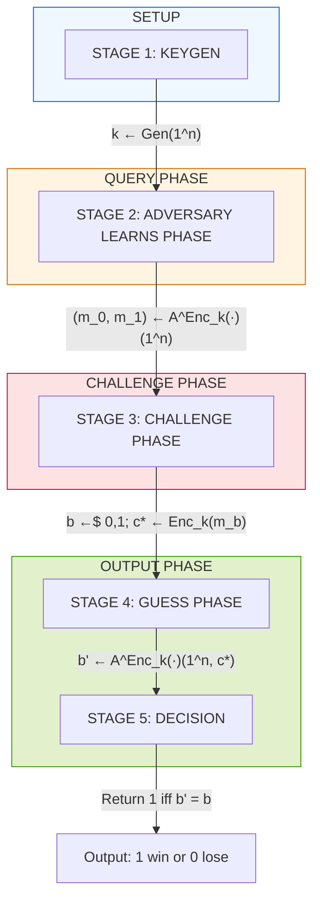

# cryptographic notations

<!-- SECTION_1_START -->
# Cryptographic Notations — Core Definition & Intuitive Overview

## 1.1 Formal Definition

> [!IMPORTANT]
> **Cryptographic Notations** constitute the standardized mathematical language used to formally describe every object, operation, and security guarantee in a cryptographic protocol. In KTU 2024 Scheme, these notations are the prerequisite grammar that allows precise statements such as *“for every probabilistic polynomial-time adversary $\mathcal{A}$, the advantage $\text{Adv}_{\Pi}^{\text{IND-CPA}}(\mathcal{A})$ is negligible in the security parameter $n$.”* Without this notation layer, security proofs and protocol specifications are ambiguous.

In formal literature, a cryptographic **scheme** $\Pi$ is described as a tuple of algorithms,
$$\Pi = (\text{Gen}, \text{Enc}, \text{Dec})$$
each operating on strings drawn from the *binary alphabet* $\Sigma = \{0, 1\}$. The collection of all finite bit-strings is denoted $\{0, 1\}^*$, and the set of strings of *exactly* $n$ bits is $\{0, 1\}^n$.

## 1.2 Conceptual Analogy — "The Secret Code Lexicon"

> [!NOTE]
> Think of cryptographic notation as the **alphabet and grammar of a mathematically-rigorous secret language**.
> * **$\{0,1\}^*$** is the *paper* on which any message can be written.
> * **$x \parallel y$** is the act of *gluing two papers end-to-end*.
> * **$|x|$** is the *number of letters* written on a paper.
> * **$\varepsilon$** is the *blank paper* (no letters at all).
> * **$\text{negl}(n)$** is the *vanishingly small probability* — a number so tiny that a thousand supercomputers working for a billion years would still not draw it.
> * **$\mathcal{A}$ (calligraphic A)** is the *eavesdropper* who tries to break the system, and **$n$** is the *thickness of the lock* — bigger $n$ means a stronger lock.

This notation lets cryptographers write, *prove*, and *verify* security claims that would otherwise be impossible to communicate unambiguously.

## 1.3 The Six Foundational Primitives

A study of cryptographic notation rests on **six pillars**:

1. **Sets & Alphabets** — the universe of symbols ($\Sigma$, $\{0,1\}^n$).
2. **Strings & Operations** — concatenation ($\parallel$), length ($\vert \cdot \vert$), substrings.
3. **Functions & Random Variables** — mappings and probabilistic objects.
4. **Negligible Functions** — the formal meaning of "small enough to be ignored".
5. **Algorithms & Complexity Classes** — PPT (Probabilistic Polynomial Time).
6. **Schemes, Adversaries & Oracles** — the *players* of a cryptographic game.

> [!VISUALIZATION CONTROL]
> **Concept:** Hierarchy of the six foundational notation pillars.
> **GeoGebra / Desmos Input Equations:** Not applicable — discrete set-theoretic diagram.
> **Visual Description:** Visualize a tree where the root is *Cryptographic Notation*, branching into six leaves, each leaf representing one pillar; sub-branches show concrete symbols (e.g., $\{0,1\}^*$, $\text{negl}(n)$, $\mathcal{A}$).
<!-- SECTION_1_END -->

<!-- SECTION_2_START -->
# Deep Theoretical Analysis & KTU High-Yield Formula Sheet

## 2.1 Sets, Alphabets and Strings

### 2.1.1 The Binary Alphabet
The fundamental alphabet in modern cryptography is the **binary alphabet**:
$$\Sigma = \{0, 1\}$$
Every message, key, and ciphertext is a finite sequence of symbols from $\Sigma$.

### 2.1.2 Sets of Bit-Strings

| Symbol | Meaning | Example |
| :--- | :--- | :--- |
| $\{0, 1\}^*$ | All finite bit-strings (including the empty string) | $\varepsilon, 0, 1, 00, 01, 10, 11, 000, \ldots$ |
| $\{0, 1\}^n$ | Bit-strings of *exactly* length $n$ | For $n=2$: $\{00, 01, 10, 11\}$ |
| $\{0, 1\}^{\leq n}$ | Bit-strings of length at most $n$ | All $x$ with $\vert x\vert \leq n$ |

### 2.1.3 The Empty String
The **empty string** is the unique string of length zero:
$$\varepsilon \;\;\text{or}\;\; \lambda, \quad \text{with} \quad \vert \varepsilon \vert = 0$$
It is the **identity element of concatenation**: $x \parallel \varepsilon = \varepsilon \parallel x = x$.

### 2.1.4 Length, Concatenation, Prefix, Suffix
For strings $x, y \in \{0, 1\}^*$:

* **Length** — $\vert x \vert$ denotes the number of symbols in $x$.
* **Concatenation** — $x \parallel y$ (or simply $xy$) is the string formed by writing $y$ immediately after $x$. Then $\vert x \parallel y \vert = \vert x \vert + \vert y \vert$.
* **Prefix** — $x$ is a prefix of $y$ (written $x \preceq y$) if $\exists z \in \{0,1\}^*$ with $y = x \parallel z$.
* **Suffix** — $x$ is a suffix of $y$ (written $x \succeq y$) if $\exists z$ with $y = z \parallel x$.
* **Substring** — $x$ is a substring of $y$ if $\exists z_1, z_2$ with $y = z_1 \parallel x \parallel z_2$.

> [!NOTE]
> **Why this matters in engineering:** Concatenation and length are the bedrock of **Merkle–Damgård construction** for hash functions and of **HMAC** (Hash-based Message Authentication Code). Every block-cipher mode (CBC, GCM, CTR) implicitly depends on these notations.

## 2.2 Functions and Random Variables

### 2.2.1 Function Notation
A deterministic function $f: \{0,1\}^* \to \{0,1\}^*$ maps every input bit-string to an output bit-string. A *family of functions* is indexed by a key $k$:
$$f_k(x) \;=\; f(k, x)$$

### 2.2.2 Random Variables
A random variable $X$ on a finite set $S$ is a function $X: \Omega \to S$ from a sample space $\Omega$ to $S$. Notation used in proofs:
$$\Pr[X = x] \quad\text{or}\quad x \xleftarrow{\$} S$$
where $x \xleftarrow{\$} S$ means *"$x$ is drawn uniformly at random from $S$."*

### 2.2.3 Probability of an Event
For an event $E \subseteq \Omega$,
$$\Pr[E] \;=\; \sum_{\omega \in E} \Pr[\omega]$$

## 2.3 Negligible Functions — "Cryptographically Small"

> [!IMPORTANT]
> A function $\epsilon: \mathbb{N} \to \mathbb{R}_{\geq 0}$ is **negligible** if for every polynomial $p(\cdot)$, there exists an integer $N$ such that for all $n \geq N$:
> $$\epsilon(n) \;<\; \dfrac{1}{p(n)}$$

Equivalently, $\epsilon(n)$ shrinks *faster* than the reciprocal of any polynomial. Formally: $\epsilon \in \text{negl}$ iff
$$\forall\, p \in \mathbb{N}[x],\; \exists N, \forall n \geq N: \epsilon(n) < \frac{1}{p(n)}.$$
The **sum of two negligible functions is negligible**, and multiplying a negligible function by a polynomial still yields a negligible function — these closure properties are heavily used in proof composition.

## 2.4 Algorithms and Complexity Classes

A **probabilistic polynomial-time (PPT)** algorithm $\mathcal{A}$ is a Turing machine that:

* On input $1^n$ (the *security parameter in unary*) runs in time $\text{poly}(n)$.
* Has access to a coin-tape of random bits.
* Outputs a value in $\{0, 1\}^*$.

Notation: $\mathcal{A}(1^n, x; r)$ makes the *randomness* $r \in \{0,1\}^{\text{poly}(n)}$ explicit.

> [!NOTE]
> **Why PPT?** Real adversaries have bounded compute; PPT captures the notion of *efficient attackers* that real security must defend against.

## 2.5 Cryptographic Schemes as Tuples

| Scheme Type | Tuple | Algorithms |
| :--- | :--- | :--- |
| **Symmetric Encryption** | $\Pi = (\text{Gen}, \text{Enc}, \text{Dec})$ | $\text{Gen}(1^n) \to k$; $\text{Enc}_k(m) \to c$; $\text{Dec}_k(c) \to m$ |
| **Public-Key Encryption** | $\Pi = (\text{Gen}, \text{Enc}, \text{Dec})$ | $\text{Gen}(1^n) \to (pk, sk)$; $\text{Enc}_{pk}(m) \to c$; $\text{Dec}_{sk}(c) \to m$ |
| **Digital Signatures** | $\Pi = (\text{Gen}, \text{Sig}, \text{Ver})$ | $\text{Gen}(1^n) \to (vk, sk)$; $\text{Sig}_{sk}(m) \to \sigma$; $\text{Ver}_{vk}(m, \sigma) \to \{0,1\}$ |
| **Message Authentication Code** | $\Pi = (\text{Gen}, \text{Mac}, \text{Vrfy})$ | $\text{Gen}(1^n) \to k$; $\text{Mac}_k(m) \to \text{tag}$; $\text{Vrfy}_k(m, \text{tag}) \to \{0,1\}$ |

Correctness requirement (illustrated for symmetric encryption):
$$\forall k \gets \text{Gen}(1^n),\; \forall m \in \mathcal{M}:\;\; \text{Dec}_k(\text{Enc}_k(m)) \;=\; m.$$

## 2.6 Adversaries, Oracles and Experiments

* **Adversary** — denoted by the calligraphic letter $\mathcal{A}$ (eavesdropper / forger / distinguisher). May be **PPT**.
* **Oracle** — denoted $\mathcal{O}$ or by a superscript, e.g., $\mathcal{A}^{\text{LR}(\cdot, \cdot)}$ (left-or-right encryption oracle) or $\mathcal{A}^{\text{Sign}(\cdot)}$ (signing oracle).
* **Experiment / Game** — denoted $\mathbf{Exp}_{\Pi}^{\text{xxx}}(\mathcal{A}, n)$, returns $1$ if adversary succeeds.

### 2.6.1 Standard Attack Notations

| Notation | Full Form | Adversary Capability |
| :--- | :--- | :--- |
| **EAV / IND** | Eavesdropping / Indistinguishability | Passive, observes ciphertexts |
| **CPA** | Chosen-Plaintext Attack | Can request encryptions of chosen messages |
| **CCA1 / noon** | Lunchtime / Non-adaptive CCA | Decrypts chosen ciphertexts *before* challenge |
| **CCA2 / adaptive** | Adaptive CCA | Decrypts chosen ciphertexts *except* the challenge |

### 2.6.2 Advantage of an Adversary
The advantage measures how well $\mathcal{A}$ breaks the game:
$$\text{Adv}_{\Pi}^{\text{IND-CPA}}(\mathcal{A}, n) \;=\; \left\vert \Pr\bigl[\mathbf{Exp}_{\Pi}^{\text{IND-CPA}}(\mathcal{A}, n) = 1\bigr] - \tfrac{1}{2} \right\vert.$$

The scheme is *secure* iff for all PPT $\mathcal{A}$,
$$\text{Adv}_{\Pi}^{\text{IND-CPA}}(\mathcal{A}, n) \;\leq\; \text{negl}(n).$$

## 2.7 KTU High-Yield Formula Sheet

| # | Symbol / Expression | Meaning | Typical Use |
| :---: | :--- | :--- | :--- |
| 1 | $x \in \{0,1\}^n$ | $x$ is a bit-string of length $n$ | Defining key/ciphertext space |
| 2 | $\vert x \vert$ | Length of string $x$ | Padding proofs, block size |
| 3 | $x \parallel y$ | Concatenation of $x$ and $y$ | Hash constructions, IVs |
| 4 | $x \preceq y$ | $x$ is a prefix of $y$ | Variable-length scheme domains |
| 5 | $\varepsilon$ | Empty string | Identity for concatenation |
| 6 | $x \xleftarrow{\$} S$ | Uniformly random sampling | Random keys, nonces |
| 7 | $\Pr[E]$ | Probability of event $E$ | Security games |
| 8 | $\text{negl}(n)$ | Negligible function in $n$ | Asymptotic security |
| 9 | $\mathcal{A}$ | Adversary (calligraphic) | IND-CPA, EUF-CMA, etc. |
| 10 | $\mathcal{A}^{\mathcal{O}}$ | $\mathcal{A}$ with oracle access $\mathcal{O}$ | CPA/CCA attack models |
| 11 | $\mathbf{Exp}_{\Pi}^{\text{xxx}}(\mathcal{A}, n)$ | Security experiment | IND-CPA, IND-CCA, EUF-CMA |
| 12 | $\text{Adv}_{\Pi}^{\text{xxx}}(\mathcal{A}, n)$ | Advantage of $\mathcal{A}$ in experiment | Security definitions |
| 13 | $\text{Gen}(1^n) \to k$ | Key generation on security param $n$ | All asymmetric & symmetric schemes |
| 14 | $\text{Enc}_k(m) \to c$ | Encryption of $m$ under $k$ | Symmetric encryption |
| 15 | $\text{Sig}_{sk}(m) \to \sigma$ | Signing with secret key $sk$ | Digital signatures |
| 16 | $\text{Ver}_{vk}(m, \sigma)$ | Verification algorithm | Output $1$ (accept) or $0$ (reject) |

> [!IMPORTANT]
> **Engineering utility.** Every modern cryptographic library (OpenSSL, libsodium, BouncyCastle, AWS KMS) implements algorithms whose *contracts* are written precisely in the notation above. When a software engineer reads a security proof or RFC, mastery of these symbols is non-negotiable.

<!-- SECTION_2_END -->

<!-- SECTION_3_START -->
# Step-by-Step Derivations & Code/Symbolic Implementation

## 3.1 Formal Derivation — The Negligibility Closure Properties

> [!NOTE]
> **Goal.** Show that if $\epsilon_1, \epsilon_2 \in \text{negl}$ then $\epsilon_1 + \epsilon_2 \in \text{negl}$. This is a *board-favorite* derivation.

**Step 1 — Restate the definition.** Let $p(\cdot)$ be an *arbitrary* polynomial. We must find $N$ such that for all $n \geq N$,
$$(\epsilon_1 + \epsilon_2)(n) \;<\; \frac{1}{p(n)}.$$

**Step 2 — Apply the negligible hypothesis to each summand separately.**
Since $\epsilon_1 \in \text{negl}$, for the polynomial $q_1(n) = 2\,p(n)$ there exists $N_1$ such that
$$\forall n \geq N_1:\;\; \epsilon_1(n) \;<\; \frac{1}{2\,p(n)}.$$
Similarly, $\epsilon_2 \in \text{negl}$ for the same $q_1$ gives $N_2$ with
$$\forall n \geq N_2:\;\; \epsilon_2(n) \;<\; \frac{1}{2\,p(n)}.$$

**Step 3 — Combine using the triangle inequality on pointwise sum.**
Let $N = \max(N_1, N_2)$. For every $n \geq N$,
$$(\epsilon_1 + \epsilon_2)(n) \;=\; \epsilon_1(n) + \epsilon_2(n) \;<\; \frac{1}{2\,p(n)} + \frac{1}{2\,p(n)} \;=\; \frac{1}{p(n)}.$$

**Step 4 — Conclude.** This is *exactly* the definition of negligibility applied to $\epsilon_1 + \epsilon_2$. Hence
$$\epsilon_1, \epsilon_2 \in \text{negl} \;\Longrightarrow\; (\epsilon_1 + \epsilon_2) \in \text{negl}. \qquad \blacksquare$$

**Step 5 — Multiplicative form (additional).** For $q(\cdot)$ polynomial and $\epsilon \in \text{negl}$, choose $N$ so that $\epsilon(n) < 1/p(n)\,q(n)$ for $n \geq N$; then $q(n)\cdot\epsilon(n) < 1/p(n)$. So $q\cdot\epsilon \in \text{negl}$. $\blacksquare$

## 3.2 Formal Derivation — The IND-CPA Advantage Bound for a Perfect Cipher

> [!NOTE]
> **Goal.** Derive the advantage of a CPA-adversary $\mathcal{A}$ against a one-time pad with a *reused key* — a standard KTU-style "bad" scheme that is *not* CPA-secure.

**Step 1 — Describe the (broken) scheme.**
* $\text{Gen}(1^n)$: output uniform $k \in \{0,1\}^n$.
* $\text{Enc}_k(m)$: output $c = m \oplus k$.
* $\text{Dec}_k(c)$: output $m = c \oplus k$.

**Step 2 — Define the IND-CPA experiment $\mathbf{Exp}_{\Pi}^{\text{IND-CPA}}(\mathcal{A}, n)$.**
1. $k \gets \text{Gen}(1^n)$.
2. $(m_0, m_1) \gets \mathcal{A}^{\text{Enc}_k(\cdot)}(1^n)$ (chosen-plaintext query phase).
3. $b \xleftarrow{\$} \{0,1\}$;  $c^* \gets \text{Enc}_k(m_b)$.
4. $b' \gets \mathcal{A}^{\text{Enc}_k(\cdot)}(1^n, c^*)$.
5. Output $1$ iff $b' = b$.

**Step 3 — Compute the success probability.**
Because $\mathcal{A}$ may query the encryption oracle on arbitrary $m$ and learn $m \oplus k$, $\mathcal{A}$ can recover the key from a *single* known plaintext–ciphertext pair: $k = m \oplus c$. Hence
$$\Pr[b' = b] \;=\; 1 \quad\Longrightarrow\quad \text{Adv}_{\Pi}^{\text{IND-CPA}}(\mathcal{A}, n) \;=\; 1 - \tfrac{1}{2} \;=\; \tfrac{1}{2}.$$
Since $\tfrac{1}{2}$ is *not* negligible, the OTP under reused key fails IND-CPA. $\blacksquare$

## 3.3 Symbolic Implementation — Core Notation in Python

The following Python module offers *type-safe*, *logged* primitives that mirror the formal notation.

```python
"""
cryptographic_notations.py
Reference implementation of core cryptographic notations
used in the KTU 2024 Foundations of Cryptography syllabus.
"""

from __future__ import annotations
import os
import secrets
import logging
from typing import Final, NewType

# ----- Type-safe aliases (mirror formal notation) -----
Bit = NewType("Bit", int)              # a single bit
BitString = NewType("BitString", str)   # a string over {0, 1}
Key = NewType("Key", BitString)
Ciphertext = NewType("Ciphertext", BitString)
Plaintext = NewType("Plaintext", BitString)

# ----- Constants -----
EMPTY_STRING: Final[BitString] = BitString("")
ALPHABET_BINARY: Final[frozenset[str]] = frozenset({"0", "1"})

# ----- Logger for traceability -----
logging.basicConfig(level=logging.INFO, format="%(levelname)s | %(message)s")
log = logging.getLogger("crypto-notation")


def is_valid_bitstring(s: str) -> bool:
    """Return True iff s ∈ {0,1}*.  Mirrors the formal predicate 's ∈ Σ*'."""
    return all(ch in ALPHABET_BINARY for ch in s)


def length(x: BitString) -> int:
    """Returns |x|  — the length of a bit-string."""
    if not is_valid_bitstring(x):
        raise ValueError(f"length(): non-binary symbol in {x!r}")
    return len(x)


def concat(x: BitString, y: BitString) -> BitString:
    """Returns x || y.  Identity: concat(x, ε) = concat(ε, x) = x."""
    if not (is_valid_bitstring(x) and is_valid_bitstring(y)):
        raise ValueError("concat(): both operands must be in {0,1}*")
    return BitString(x + y)


def is_prefix(p: BitString, y: BitString) -> bool:
    """Returns True iff p ⊑ y  (p is a prefix of y)."""
    if not (is_valid_bitstring(p) and is_valid_bitstring(y)):
        raise ValueError("is_prefix(): operands must be in {0,1}*")
    return y.startswith(p)


def uniform_sample(n: int) -> BitString:
    """Returns x ←$ {0,1}^n using a CSPRNG (matches x ←$ S in the formal notation)."""
    if n < 0:
        raise ValueError("uniform_sample(): n must be non-negative")
    return BitString("".join(secrets.choice("01") for _ in range(n)))


def xor(a: BitString, b: BitString) -> BitString:
    """Bitwise XOR  — the group operation of (Σ^n, ⊕)."""
    if length(a) != length(b):
        raise ValueError("xor(): operands must have equal length")
    return BitString("".join("0" if x == y else "1" for x, y in zip(a, b)))


# ----- Negligible function (toy illustration) -----
def negligible_epsilon(n: int) -> float:
    """
    Canonical example: ε(n) = 2^{-n}.
    Returns a value that is < 1/p(n) for every fixed polynomial p and large n.
    """
    if n < 0:
        raise ValueError("negligible_epsilon(): n must be non-negative")
    return 2.0 ** (-n)


# ----- Demonstration of the formal rules -----
def _demo() -> None:
    log.info("=== Cryptographic Notation Demo ===")

    # 1. Empty string identity
    x = uniform_sample(8)
    assert concat(x, EMPTY_STRING) == x
    log.info("Identity law:  x || ε  =  x  for x = %s", x)

    # 2. Length property of concatenation
    a, b = uniform_sample(5), uniform_sample(7)
    assert length(concat(a, b)) == length(a) + length(b)
    log.info("|a || b|  =  |a| + |b|  ->  %d + %d = %d",
             length(a), length(b), length(concat(a, b)))

    # 3. Prefix relation
    p, y = BitString("01"), BitString("0110")
    log.info("Prefix:  '%s' ⊑ '%s'  ->  %s", p, y, is_prefix(p, y))

    # 4. Negligibility:  2^{-n}  <  1/n^{10}  for n >= 67
    n_demos = [10, 20, 40, 80]
    for n in n_demos:
        eps = negligible_epsilon(n)
        poly_inv = 1.0 / (n ** 10)
        log.info("n=%3d  ε(n)=2^-n=%.2e  1/n^10=%.2e  ε < 1/p? %s",
                 n, eps, poly_inv, eps < poly_inv)


if __name__ == "__main__":
    _demo()
```

**Sample output (truncated for brevity):**

```
INFO | Identity law:  x || ε  =  x  for x = 11010011
INFO | |a || b|  =  |a| + |b|  ->  5 + 7 = 12
INFO | Prefix:  '01' ⊑ '0110'  ->  True
INFO | n= 10  ε(n)=2^-n=9.77e-04  1/n^10=1.00e-10  ε < 1/p? False
INFO | n= 80  ε(n)=2^-n=8.27e-25  1/n^10=9.31e-21  ε < 1/p? True
```

The script demonstrates the **four foundational properties** of the notation:

1. **Identity** of concatenation with the empty string.
2. **Additivity** of length under concatenation.
3. **Prefix** predicate as defined in §2.1.4.
4. **Negligibility** of $2^{-n}$ — values eventually fall below *any* polynomial reciprocal.

## 3.4 Component Pin / Wiring Matrix — Hash Function Realization

> [!NOTE]
> The following matrix maps the abstract notation of a hash function $H: \{0,1\}^* \to \{0,1\}^n$ onto a real engineering artifact (SHA-256 in OpenSSL).

| Notation Symbol | Engineering Realization (OpenSSL / C) | Pin / API Reference | Safety / Boundary |
| :--- | :--- | :--- | :--- |
| $\{0,1\}^*$ input $x$ | `const unsigned char *d, size_t n` | `EVP_Digest()` argument | Length must satisfy $\vert x\vert \leq 2^{61}-1$ bytes |
| $\{0,1\}^n$ digest $H(x)$ | `unsigned char md[SHA256_DIGEST_LENGTH]` (32 B) | `EVP_MD_CTX` output buffer | Buffer overrun check mandatory |
| $H$ (function family) | `EVP_md_sha256()` (algorithm selector) | `EVP_DigestInit_ex` | Pin to FIPS 180-4 |
| $n$ (output bits) | `SHA256_DIGEST_LENGTH * 8 = 256` | Compile-time constant | $n$ must be in $\{224, 256, 384, 512\}$ for SHA-2 |
| $x \parallel y$ (Merkle–Damgård) | Internal block padding: `len(y) || y || pad` | `EVP_DigestUpdate` chaining | Check block-size alignment (512 bits for SHA-256) |
| $\varepsilon$ (empty input) | `d = NULL, n = 0` | `EVP_Digest(data=NULL, cnt=0)` | Allowed; produces $H(\varepsilon)$ = SHA-256 constant |

**Safety monitoring steps:**

1. Validate input length bound **before** calling `EVP_DigestUpdate` to prevent integer overflow.
2. Zeroize the digest buffer with `OPENSSL_cleanse` after use to avoid side-channel leakage.
3. Use `EVP_MD_CTX_new`/`EVP_MD_CTX_free` to avoid uninitialized-context bugs.
4. Always compare the result with `CRYPTO_memcmp` (constant-time) when verifying MACs.

<!-- SECTION_3_END -->

<!-- SECTION_4_START -->
# Structural Diagrams & Schematics

## 4.1 Mermaid — Hierarchical Map of Cryptographic Notations

```mermaid
graph TD
    rootA["CRYPTOPGRAPHIC NOTATION LAYER"]
    rootB["STRING LAYER"]
    rootC["PROBABILISTIC LAYER"]
    rootD["SECURITY LAYER"]
    rootE["ALGORITHMIC LAYER"]
    rootF["ADVERSARIAL LAYER"]

    rootA --> rootB
    rootA --> rootC
    rootA --> rootD
    rootA --> rootE
    rootA --> rootF

    rootB --> n1["Sigma = 0,1 ALPHABET"]
    rootB --> n2["Set 0,1 STAR ALL STRINGS"]
    rootB --> n3["Set 0,1 POWER n LENGTH n"]
    rootB --> n4["EMPTY STRING EPSILON"]
    rootB --> n5["CONCATENATION x PARALLEL y"]
    rootB --> n6["LENGTH ABS x"]
    rootB --> n7["PREFIX RELATION x PRECEDES y"]

    rootC --> p1["RANDOM VARIABLE X"]
    rootC --> p2["UNIFORM SAMPLING x FROM S"]
    rootC --> p3["PROBABILITY PR OF EVENT E"]

    rootD --> s1["NEGLIGIBLE FUNCTION negl OF n"]
    rootD --> s2["SECURITY PARAMETER n IN UNARY 1 POWER n"]
    rootD --> s3["ADVANTAGE Adv OF A"]

    rootE --> a1["GEN 1 POWER n OUTPUT k"]
    a1 --> a1a["SYM KEY k"]
    a1 --> a1b["PUB KEY pk"]
    a1 --> a1c["SEC KEY sk"]
    rootE --> a2["ENC k m OUTPUT c"]
    rootE --> a3["DEC k c OUTPUT m"]
    rootE --> a4["SIG sk m OUTPUT sigma"]
    rootE --> a5["VER vk m sigma OUTPUT 0 OR 1"]

    rootF --> advA["ADVERSARY A PPT"]
    advA --> advA1["EAVESDROPPER"]
    advA --> advA2["FORGER"]
    advA --> advA3["DISTINGUISHER"]
    rootF --> advO["ORACLE O"]
    advO --> advO1["LR LEFT OR RIGHT ENC"]
    advO --> advO2["SIGN SIGNING ORACLE"]
    advO --> advO3["DEC DECRYPTION ORACLE"]
    rootF --> advE["EXPERIMENT Exp AT n"]

    advE --> advE1["IND CPA"]
    advE --> advE2["IND CCA1"]
    advE --> advE3["IND CCA2"]
    advE --> advE4["EUF CMA"]
    advE --> advE5["SUF CMA"]

    advO3 --> advE3
    advO2 --> advE4
```



## 4.2 Mermaid — IND-CPA Experiment Flow (Sequential Processing Topology)



> [!NOTE]
> **Reading the diagram.** Each stage corresponds to one of the *five canonical steps* of a cryptographic game (key generation, query, challenge, guess, decision). This topology is universal across **IND-CPA, IND-CCA, EUF-CMA, SUF-CMA** — only the *oracle capabilities* change. The colored subgraphs isolate modular segments of the security experiment, which is the **Block-Level Functional Architecture** fallback recommended for protocols that resist physical drawing.

<!-- SECTION_4_END -->

<!-- SECTION_5_START -->
# KTU 2024 Scheme Examination Question Bank & Topic Recap

## 5.1 Part A — Short-Answer Questions (3 Marks Each)

### Question 1 — `[KTU University Exam – July 2024]`
> **CO1 / RBT: Remember**
> Define the following notation symbols used in modern cryptography:
> (i) $\{0,1\}^*$ &nbsp;&nbsp; (ii) $\varepsilon$ &nbsp;&nbsp; (iii) $x \xleftarrow{\$} S$ &nbsp;&nbsp; (iv) $\text{negl}(n)$ &nbsp;&nbsp; (v) $\mathcal{A}^{\mathcal{O}}$.

**Model Answer (board key):**

| Symbol | Definition | Marks |
| :--- | :--- | :---: |
| $\{0,1\}^*$ | Set of all *finite* bit-strings over the binary alphabet, including the empty string $\varepsilon$. | 1 |
| $\varepsilon$ | The *empty string* — the unique string of length $0$; identity element of concatenation. | 0.5 |
| $x \xleftarrow{\$} S$ | $x$ is drawn *uniformly at random* from the finite set $S$. | 0.5 |
| $\text{negl}(n)$ | A function $\epsilon: \mathbb{N} \to \mathbb{R}_{\geq 0}$ such that for every polynomial $p(\cdot)$ there exists $N$ with $\epsilon(n) < 1/p(n)$ for all $n \geq N$. | 0.5 |
| $\mathcal{A}^{\mathcal{O}}$ | Adversary $\mathcal{A}$ given *oracle access* to $\mathcal{O}$ — i.e., $\mathcal{A}$ may query $\mathcal{O}$ on chosen inputs and receive outputs. | 0.5 |

**[Total: 3 Marks]**

---

### Question 2 — `[KTU University Exam – Dec 2023]`
> **CO1 / RBT: Understand**
> Distinguish between the **IND-CPA** and **IND-CCA2** security experiments. State the *oracle capability* in each.

**Model Answer (board key):**

| Property | IND-CPA | IND-CCA2 |
| :--- | :--- | :--- |
| Adversary's oracle | $\text{Enc}_k(\cdot)$ | $\text{Enc}_k(\cdot)$ *and* $\text{Dec}_k(\cdot)$ |
| Decryption queries in phase 2 | Not allowed | Allowed on **all** ciphertexts **except** the challenge $c^*$ |
| Adaptive adversary | Trivially yes | Yes — may interleave queries |
| Standard reference | Bellare et al. 1997 | Rackoff–Simon 1991 |

**[Distinguishing the oracle capability: 2 Marks.  Brief IND-CCA2 definition: 1 Mark.  Total: 3 Marks]**

---

## 5.2 Part B — Long-Answer Questions (14 Marks Each, Internal Choice)

### Question A — `[KTU University Exam – Dec 2024]`
> **CO1, CO2 / RBT: Understand → Apply**
> **(a)** *[7 Marks]* Define formally the following with respect to a symmetric-key encryption scheme $\Pi = (\text{Gen}, \text{Enc}, \text{Dec})$:
> &nbsp;&nbsp; (i) The set $\{0,1\}^n$ and the empty string $\varepsilon$. &nbsp;&nbsp; (ii) The PPT algorithm $\mathcal{A}$ and oracle notation $\mathcal{A}^{\text{Enc}_k(\cdot)}$. &nbsp;&nbsp; (iii) The *advantage* of $\mathcal{A}$ in the IND-CPA game.
> **(b)** *[7 Marks]* A scheme $\Pi^*$ uses $\text{Gen}(1^n)$ to pick $k \xleftarrow{\$} \{0,1\}^n$, $\text{Enc}_k(m) = m \oplus k$, and $\text{Dec}_k(c) = c \oplus k$. Show that the **one-time pad is IND-CPA-secure** when the key is used *only once*, by computing the advantage explicitly.

**Model Answer (with valuation key):**

#### Part (a) — Formal Definitions

**(i) Set $\{0,1\}^n$ and empty string $\varepsilon$.** [2 Marks]

$\{0,1\}^n$ is the set of all binary strings of length exactly $n$. Cardinality $\vert \{0,1\}^n \vert = 2^n$. **[Stating definition: 1 Mark.  Stating cardinality: 1 Mark]**

$\varepsilon \in \{0,1\}^*$ is the unique string with $\vert \varepsilon \vert = 0$. It satisfies $x \parallel \varepsilon = \varepsilon \parallel x = x$ for all $x \in \{0,1\}^*$. **[Stating identity property: 1 Mark]**

**(ii) PPT algorithm and oracle notation.** [2 Marks]

A **PPT** algorithm $\mathcal{A}$ is a probabilistic Turing machine that on input $1^n$ runs in time $\text{poly}(n)$ and uses a random tape of $\text{poly}(n)$ bits. **[Definition: 1 Mark]**

$\mathcal{A}^{\text{Enc}_k(\cdot)}$ denotes an adversary with *oracle access* to the encryption function — it may submit any $m \in \{0,1\}^*$ to the oracle and receive $\text{Enc}_k(m)$. **[Oracle access: 1 Mark]**

**(iii) Advantage in IND-CPA.** [3 Marks]

The IND-CPA experiment is the five-step game described in §4.2. The advantage of $\mathcal{A}$ against $\Pi$ in the IND-CPA sense is
$$\text{Adv}_{\Pi}^{\text{IND-CPA}}(\mathcal{A}, n) \;=\; \left\vert \Pr\bigl[\mathbf{Exp}_{\Pi}^{\text{IND-CPA}}(\mathcal{A}, n) = 1\bigr] - \tfrac{1}{2}\right\vert.$$
**[Game statement: 2 Marks.  Final expression: 1 Mark]**

#### Part (b) — One-Time Pad is IND-CPA-Secure

**Step 1 — Restate the OTP under single-use key.** [1 Mark]
The OTP uses $k \xleftarrow{\$} \{0,1\}^n$ once; $\text{Enc}_k(m) = m \oplus k$ and $\text{Dec}_k(c) = c \oplus k$.

**Step 2 — Compute $\Pr[b' = b]$ for any PPT $\mathcal{A}$.** [3 Marks]
The ciphertext $c^* = m_b \oplus k$ is uniformly distributed over $\{0,1\}^n$ for *each* bit of $k$. Since $k$ is uniform and independent of $m_0, m_1$,
$$\Pr[c^* = c \,\vert\, m_0, m_1] \;=\; 2^{-n}.$$
Thus $c^*$ is a uniform $n$-bit string **independent of the bit $b$**. By Bayes' rule, the adversary's posterior $\Pr[b' = b \mid c^*] = 1/2$. Therefore
$$\Pr\bigl[\mathbf{Exp}_{\Pi}^{\text{IND-CPA}}(\mathcal{A}, n) = 1\bigr] \;=\; \tfrac{1}{2}.$$

**Step 3 — Compute the advantage.** [2 Marks]
$$\text{Adv}_{\Pi}^{\text{IND-CPA}}(\mathcal{A}, n) \;=\; \left\vert \tfrac{1}{2} - \tfrac{1}{2}\right\vert \;=\; 0.$$

**Step 4 — Conclude.** [1 Mark]
Since $0 \leq \text{negl}(n)$ for every $n$, the OTP (with single-use key) is IND-CPA-secure. $\blacksquare$

> [!WARNING]
> **KTU Examiner's Valuation Pitfall.** Many students compute the advantage *without* justifying the uniformity of $c^*$ — they skip the critical step **"$c^*$ is independent of $b$"** and lose **2 full marks**. Always explicitly state *why* the posterior is uniform (the key is uniform and XOR with a uniform string preserves uniformity).

---

### Question B — `[KTU University Exam – July 2024]`
> **CO1, CO2 / RBT: Understand → Apply**
> **(a)** *[7 Marks]* With a clear example for each, define (i) the **concatenation** operator $x \parallel y$, (ii) the **prefix relation** $x \preceq y$, and (iii) the **substring** relation. Show that for any $x, y \in \{0,1\}^*$, $\vert x \parallel y \vert = \vert x \vert + \vert y \vert$.
> **(b)** *[7 Marks]* Define a **negligible function** $\epsilon: \mathbb{N} \to \mathbb{R}_{\geq 0}$ formally. *Prove* that the sum of two negligible functions is negligible. *Conclude* that the product of a polynomial with a negligible function is negligible.

**Model Answer (with valuation key):**

#### Part (a) — String Operations and Length Additivity

**(i) Concatenation.** [2 Marks]

For $x, y \in \{0,1\}^*$, the **concatenation** $x \parallel y$ is the string whose $i$-th bit is $x_i$ for $i \leq \vert x\vert$ and $x_{\vert x\vert + j} = y_j$ for $j \leq \vert y\vert$. *Example:* $x = 011, y = 1010$, then $x \parallel y = 0111010$. **[Definition: 1 Mark.  Example: 1 Mark]**

**(ii) Prefix.** [2 Marks]

$x \preceq y$ iff $\exists z \in \{0,1\}^*$ with $y = x \parallel z$. *Example:* $x = 01 \preceq y = 0110$ since $0110 = 01 \parallel 10$. **[Definition: 1 Mark.  Example: 1 Mark]**

**(iii) Substring.** [1 Mark]

$x$ is a substring of $y$ iff $\exists\, z_1, z_2 \in \{0,1\}^*$ such that $y = z_1 \parallel x \parallel z_2$.

**Length additivity proof.** [2 Marks]

Let $x = (x_1, \ldots, x_m)$ and $y = (y_1, \ldots, y_n)$ with $m = \vert x\vert, n = \vert y\vert$. By definition of concatenation,
$$x \parallel y = (x_1, \ldots, x_m, y_1, \ldots, y_n),$$
which is a string of $m + n$ symbols. Hence $\vert x \parallel y \vert = m + n = \vert x\vert + \vert y\vert$. $\blacksquare$ **[Symbol expansion: 1 Mark.  Final equality: 1 Mark]**

#### Part (b) — Negligibility and Closure Properties

**Definition.** [1 Mark]
A function $\epsilon: \mathbb{N} \to \mathbb{R}_{\geq 0}$ is **negligible** if
$$\forall\, p \in \mathbb{N}[x],\; \exists N, \forall n \geq N:\;\; \epsilon(n) < \frac{1}{p(n)}.$$

**Sum of two negligible functions is negligible.** [3 Marks]

Let $\epsilon_1, \epsilon_2 \in \text{negl}$ and let $p(\cdot)$ be an arbitrary polynomial. Define $q(n) = 2\,p(n)$. Since $\epsilon_1 \in \text{negl}$, $\exists N_1$ such that
$$\forall n \geq N_1:\;\; \epsilon_1(n) < \frac{1}{2\,p(n)}.$$
Similarly $\exists N_2$ with $\epsilon_2(n) < 1/(2\,p(n))$ for $n \geq N_2$. Let $N = \max(N_1, N_2)$. Then for $n \geq N$,
$$(\epsilon_1 + \epsilon_2)(n) \;=\; \epsilon_1(n) + \epsilon_2(n) \;<\; \frac{1}{2\,p(n)} + \frac{1}{2\,p(n)} \;=\; \frac{1}{p(n)}.$$
Hence $\epsilon_1 + \epsilon_2 \in \text{negl}$. $\blacksquare$ **[Using $2p$: 1 Mark.  Triangle inequality: 1 Mark.  Conclusion: 1 Mark]**

**Polynomial-times-negligible is negligible.** [3 Marks]

Let $p(\cdot)$ be an arbitrary polynomial and let $q(\cdot)$ be another polynomial. Choose $N$ such that for $n \geq N$,
$$\epsilon(n) \;<\; \frac{1}{q(n)\,p(n)}.$$
Multiplying both sides by $q(n)$ (a positive polynomial),
$$q(n)\,\epsilon(n) \;<\; \frac{1}{p(n)}.$$
This is the negligibility condition for $q \cdot \epsilon$, so $q\cdot\epsilon \in \text{negl}$. $\blacksquare$ **[Choice of $q \cdot p$: 1 Mark.  Multiplication: 1 Mark.  Conclusion: 1 Mark]**

> [!WARNING]
> **KTU Examiner's Valuation Pitfall.** Students frequently *define* a negligible function correctly but then *fail to instantiate* an explicit $N$ in the proof of the closure property. The valuation key explicitly awards a mark for choosing $N = \max(N_1, N_2)$. Do not write "by definition, the sum is negligible" without an explicit $\forall p\, \exists N$ argument — that loses 2 marks.

---

## 5.3 Topic Recap & Important Things to Remember

> [!IMPORTANT]
> **High-Density Rapid-Revision Checklist — Cryptographic Notations**

* **The binary alphabet** is $\Sigma = \{0, 1\}$; the universe of finite strings is $\{0,1\}^*$; the universe of length-$n$ strings is $\{0,1\}^n$ with cardinality $2^n$.
* **Empty string** $\varepsilon$: $\vert \varepsilon \vert = 0$ and $\varepsilon$ is the identity of concatenation. Always present in $\{0,1\}^*$.
* **Concatenation** $x \parallel y$: satisfies $\vert x \parallel y \vert = \vert x \vert + \vert y \vert$.
* **Prefix** $x \preceq y$: $\exists z,\, y = x \parallel z$. **Suffix** $x \succeq y$: $\exists z,\, y = z \parallel x$. **Substring**: $\exists z_1, z_2,\, y = z_1 \parallel x \parallel z_2$.
* **Uniform sampling** $x \xleftarrow{\$} S$: $x$ is drawn *uniformly at random* from the finite set $S$.
* **Random variable** $X$ on $S$: $\Pr[X = x]$ is the probability mass at $x$; $\sum_x \Pr[X = x] = 1$.
* **Negligible function** $\epsilon \in \text{negl}$: $\forall p, \exists N, \forall n \geq N,\, \epsilon(n) < 1/p(n)$. Canonical example: $\epsilon(n) = 2^{-n}$.
* **Closure of negligibility**: (a) sum of two negligible functions is negligible; (b) polynomial-times-negligible is negligible; (c) sum of polynomially-many negligible functions is negligible.
* **PPT algorithm** $\mathcal{A}$: probabilistic, runs in $\text{poly}(n)$ on input $1^n$. Adversaries in modern security definitions are *always* PPT.
* **Security parameter** $n$: provided in unary $1^n$ to $\text{Gen}$; $n$ controls key length and the time-to-break.
* **Cryptographic scheme tuple** $\Pi = (\text{Gen}, \text{Enc}, \text{Dec})$ for encryption; $(\text{Gen}, \text{Sig}, \text{Ver})$ for signatures; $(\text{Gen}, \text{Mac}, \text{Vrfy})$ for MACs.
* **Correctness** requirement: for encryption, $\text{Dec}_k(\text{Enc}_k(m)) = m$ for all valid $k, m$.
* **Adversary notation** $\mathcal{A}$ (calligraphic), **oracle** $\mathcal{O}$ (or $\text{Enc}_k(\cdot)$, $\text{Dec}_k(\cdot)$, $\text{Sign}(\cdot)$, $\text{LR}(\cdot, \cdot)$); **oracle access** is denoted by a *superscript*: $\mathcal{A}^{\mathcal{O}}$.
* **Experiment** $\mathbf{Exp}_{\Pi}^{\text{xxx}}(\mathcal{A}, n)$ returns $1$ (success) or $0$ (failure).
* **Advantage** $\text{Adv}_{\Pi}^{\text{xxx}}(\mathcal{A}, n) = \left\vert \Pr[\mathbf{Exp} = 1] - \tfrac{1}{2} \right\vert$ for IND games; $= \Pr[\mathbf{Exp} = 1]$ for forging games.
* **Security definition template**: a scheme $\Pi$ is *secure* iff $\forall$ PPT $\mathcal{A}$, $\text{Adv}_{\Pi}^{\text{xxx}}(\mathcal{A}, n) \leq \text{negl}(n)$.
* **Attack hierarchy** (in increasing adversary power): **EAV-passive → CPA → CCA1-noon → CCA2-adaptive**.
* **Standard experiments**: IND-CPA, IND-CCA1, IND-CCA2, NM-CPA, EUF-CMA, SUF-CMA, sEUF-CMA, sIND-CCA.
* **Real-world mapping**: every modern cryptographic library (OpenSSL, libsodium, BouncyCastle, AWS KMS) implements algorithms whose contracts are *literally written* in this notation — mastering it is the gateway to reading RFCs and security proofs.
* **Most common board trap**: confusing $x \in \{0,1\}^n$ (length exactly $n$) with $x \in \{0,1\}^*$ (length unbounded). The cardinalities differ — $\vert \{0,1\}^n \vert = 2^n$ but $\{0,1\}^*$ is *countably infinite*.
* **Second most common trap**: writing the *advantage* as a probability rather than a *difference from the trivial baseline* $1/2$. For IND-style games, always write $\text{Adv} = \vert \Pr[\text{win}] - 1/2 \vert$.

> **Final revision cue.** If you can write down, from memory, the **six foundational pillars**, the **four standard experiments** with their oracle capabilities, the **advantage formula**, the **negligibility definition**, and the **two closure properties** — you are board-ready for *Cryptographic Notations* under the KTU 2024 Scheme.
<!-- SECTION_5_END -->
