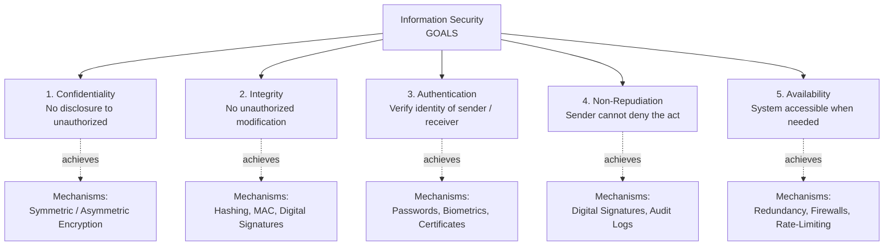
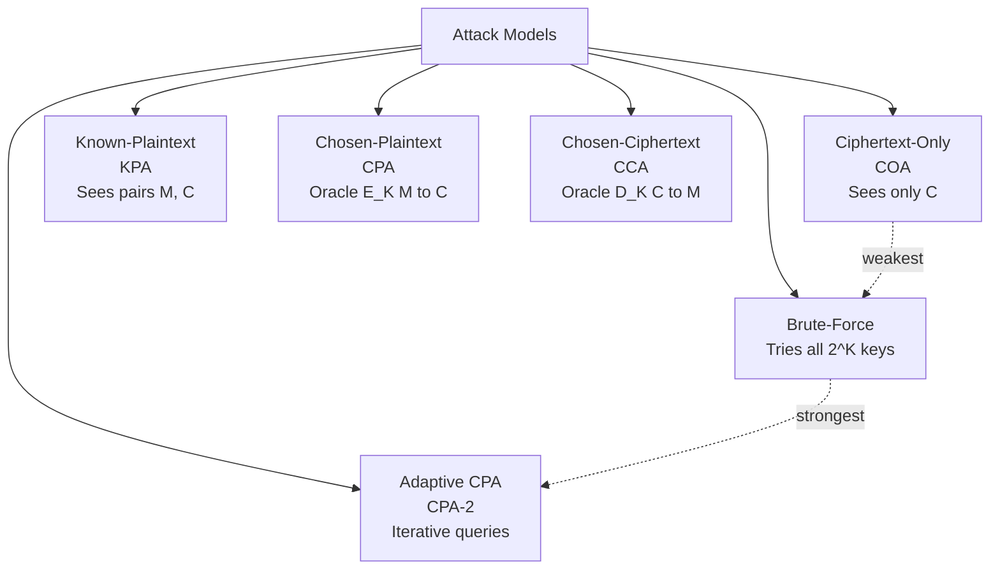
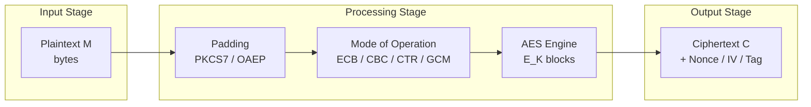
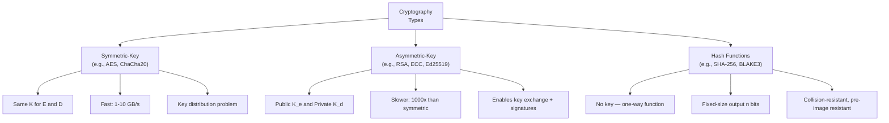

# Cryptography - Introduction

<!-- SECTION_1_START -->

# Cryptography — Introduction

> [!IMPORTANT]
> **KTU 2024 Scheme | OECST613 — Foundations of Cryptography | Module 3: Principles of Security**
> This topic forms the *foundational vocabulary* for the entire cryptography course. Expect **2 to 3 mark definitional questions** in Part A and **frequent sub-part (a)** theoretical setups in Part B.

## 1.1 Formal Academic Definition

**Cryptography** is the science and art of designing mathematical techniques, algorithms, and protocols that provide **information security** by transforming intelligible data (**plaintext**) into an unintelligible form (**ciphertext**) and vice versa, in the presence of adversaries. The word originates from the Greek *kryptós* (hidden) and *gráphein* (to write) — literally, **"hidden writing."**

In the KTU 2024 Scheme, cryptography is positioned as a **sub-discipline of cybersecurity** that delivers the following *engineering objectives*:

- Confidentiality of stored and transmitted data
- Integrity verification of message contents
- Authentication of communicating entities
- Non-repudiation of origin and receipt
- Access control enforcement

> [!NOTE]
> **Syllabus Highlight:** KTU explicitly distinguishes between **Cryptography** (the construction of secure systems) and **Cryptanalysis** (the breaking of secure systems). Together, they form **Cryptology**.

## 1.2 Conceptual Analogy — The Lockbox and the Two Keys

Imagine Alice wants to send a confidential document to Bob through a courier whom she does *not* trust. She places the document inside a **tamper-evident steel lockbox** and locks it. Three scenarios emerge:

| Scenario | Cryptographic Mapping |
|:---|:---|
| Alice uses a **padlock where she and Bob each hold one half of the key** (or both share a single secret key) | **Symmetric-Key Cryptography** (e.g., AES, DES) |
| Alice uses a **padlock that anyone can close but only Bob's private key can open** | **Asymmetric-Key Cryptography** (e.g., RSA, ECC) |
| Bob installs a **tamper-proof glass window** in the box so anyone can *see* if the contents were altered in transit | **Cryptographic Hashing** (e.g., SHA-256) |
| Alice **signs the outside of the box** with her unique engraved seal | **Digital Signatures** (e.g., RSA-PSS, ECDSA) |

> [!TIP]
> **Why this matters for the exam:** The examiner expects you to identify *which security goal* is achieved by *which mechanism*. Memorize the **CIA Triad + 2** framework: **Confidentiality, Integrity, Authentication, Non-Repudiation, Availability** (the "5 pillars" of information security).

## 1.3 The Security Goals (Five Pillars)

Let $M$ denote the message, $C$ the ciphertext, $K$ the key, and $\mathcal{A}$ the adversary. The five security goals are defined as:

1. **Confidentiality** — Ensuring that $M$ is accessible only to *authorized* parties. Formally, $\Pr[\mathcal{A} \text{ recovers } M \mid C] \leq \epsilon$ for negligible $\epsilon$.
2. **Integrity** — Guaranteeing that $M$ has not been altered in transit. Achieved via **hash functions** $H: \{0,1\}^* \to \{0,1\}^n$ and **MACs**.
3. **Authentication** — Confirming the identity of the sender. Uses **digital certificates, MACs, or challenge-response**.
4. **Non-Repudiation** — Preventing the sender from denying having sent $M$. Implemented by **digital signatures**.
5. **Availability** — Ensuring systems and data remain accessible (DoS resistance).

> [!IMPORTANT]
> **Physical / Logical Constants Used Throughout Cryptography**
> - **One-way function** evaluation time: typically measured in **microseconds** for SHA-256 hardware.
> - **Symmetric key length (current standard):** $\geq 128$ **bits**.
> - **Asymmetric key length (current standard):** $\geq 2048$ **bits** for RSA.
> - **Hash output length:** $\geq 256$ **bits** (SHA-256) for collision resistance.
> - **NIST security strength levels:** **1, 2, 3, 4, 5** (from 80-bit to 256-bit equivalent).

## 1.4 Geometric Intuition — The Keyspace Cube

> [!VISUALIZATION CONTROL]
> **Concept:** Keyspace as an $n$-dimensional hypercube
> **GeoGebra / Desmos Input Equations:**
> - 2D projection of keyspace: `K = {(x, y) | x ∈ [0, 2^64 - 1], y ∈ [0, 2^64 - 1]}`
> - Attack region: `A = {(x, y) | (x - x_0)^2 + (y - y_0)^2 < r^2}` where $r$ is brute-force radius
> **Visual Description:** Students should observe that the *keyspace* (the cube of size $2^n$) is astronomically larger than any feasible *attack region* for $n \geq 128$. This visualizes the **work factor** of brute-force attacks.

<!-- SECTION_1_END -->

<!-- SECTION_2_START -->

# Deep Theoretical Analysis & KTU High-Yield Formula Sheet

## 2.1 The General Cryptographic Communication Model

The classical Shannon model of a cryptographic system (1949) comprises six components. Let us denote:

- $M$ — **Plaintext** (original message)
- $C$ — **Ciphertext** (transformed message)
- $K$ — **Key** (secret or public parameter)
- $E$ — **Encryption algorithm**
- $D$ — **Decryption algorithm**
- $\mathcal{A}$ — **Adversary** (passive or active attacker)

The fundamental equations governing any cryptosystem are:

$$
C = E_K(M) \quad \text{(Encryption)}
$$

$$
M = D_K(C) = D_K(E_K(M)) \quad \text{(Decryption — invertibility condition)}
$$

The system is **correct** if and only if $D_K(E_K(M)) = M$ for all $M \in \mathcal{M}$ (the message space) and all $K \in \mathcal{K}$ (the keyspace).

> [!NOTE]
> **Terminology to internalize:**
> - **$\mathcal{M}$** — *Message Space* (set of all possible plaintexts)
> - **$\mathcal{C}$** — *Ciphertext Space* (set of all possible ciphertexts)
> - **$\mathcal{K}$** — *Key Space* (set of all possible keys, with cardinality $\vert \mathcal{K} \vert$)

## 2.2 Kerckhoffs's Principle (1883)

Auguste Kerckhoffs, a Dutch linguist and cryptographer, formulated the foundational design rule of modern cryptography:

> *"The security of a cryptosystem must not depend on keeping the algorithm secret. It must depend only on keeping the key secret."*

Formally: $\text{Security}(E, D) = f(\text{secrecy of } K)$, **not** $f(\text{secrecy of } E, D)$.

> [!IMPORTANT]
> **Why this principle is exam-critical:** KTU frequently tests whether students understand *security through obscurity* is a fallacy. The modern interpretation (Shannon's maxim) restates: *"The enemy knows the system."*

## 2.3 Classification of Security Attacks

A **security attack** is any action that compromises the security goals. Attacks are classified along two axes: **passive vs active** and **based on information available to attacker**.

### 2.3.1 Passive vs Active Attacks

| Attack Type | Nature | Detectability | Effect on CIA | Example |
|:---|:---|:---|:---|:---|
| **Passive — Release of Message Contents** | Eavesdropping | Not detectable | Breaks **Confidentiality** | Sniffing on Wi-Fi |
| **Passive — Traffic Analysis** | Pattern observation | Not detectable | Leaks metadata | Timing analysis of TLS |
| **Active — Masquerade** | Identity spoofing | Detectable | Breaks **Authentication** | IP spoofing |
| **Active — Replay** | Re-send old messages | Detectable | Breaks **Authentication + Integrity** | Replaying OTP token |
| **Active — Modification** | Alter message in transit | Detectable | Breaks **Integrity** | Man-in-the-Middle altering wire transfer |
| **Active — Denial of Service** | Flood / disrupt | Detectable | Breaks **Availability** | SYN flood, DDoS |

### 2.3.2 Cryptanalytic Attack Models (Information-Availabilty Hierarchy)

Listed in *increasing order of attacker capability*:

| Attack Model | Notation | What the Attacker Knows | Goal |
|:---|:---|:---|:---|
| **Ciphertext-Only Attack** | **COA / KPA** | A set of ciphertexts $C_1, C_2, \ldots, C_n$ | Recover $K$ or plaintexts |
| **Known-Plaintext Attack** | **KPA** | Some plaintext-ciphertext pairs $(M_i, C_i)$ | Recover $K$ |
| **Chosen-Plaintext Attack** | **CPA** | Access to encryption oracle $E_K(\cdot)$ for chosen $M$ | Recover $K$ |
| **Chosen-Ciphertext Attack** | **CCA** | Access to both $E_K$ and $D_K$ oracles (limited) | Recover $K$ |
| **Adaptive Chosen-Plaintext Attack** | **CPA-2** | Iterative queries to encryption oracle | Recover $K$ |
| **Brute-Force Attack** | **Exhaustive Search** | Nothing (worst case) | Try all $2^{\vert K \vert}$ keys |

The *unconditional security* (Shannon-perfect secrecy) of the **One-Time Pad** satisfies:

$$
\Pr[M = m \mid C = c] = \Pr[M = m] \quad \forall m, c
$$

i.e., ciphertext gives **zero information** about plaintext. However, Shannon's theorem proves the key must be at least as long as the message: $\vert K \vert \geq \vert M \vert$.

## 2.4 The KTU High-Yield Formula Sheet

| # | Concept | Formula / Definition | Variable Meaning | KTU Use |
|:---:|:---|:---|:---|:---|
| 1 | Encryption | $C = E_K(M)$ | $C$: ciphertext, $E$: enc. algo, $K$: key | Universal |
| 2 | Decryption | $M = D_K(C)$ | $D$: decryption algorithm | Universal |
| 3 | Correctness | $D_K(E_K(M)) = M$ | Identity property | Prove correctness |
| 4 | Brute-Force Work | $W = 2^{\vert K \vert}$ | Average work = $2^{\vert K \vert - 1}$ | Compute attack effort |
| 5 | Shannon Entropy | $H(M) = -\sum_{i=1}^{n} p_i \log_2 p_i$ | $p_i$: prob. of message $m_i$ | Measure info leakage |
| 6 | Perfect Secrecy | $\Pr[M \mid C] = \Pr[M]$ | Posterior = prior | One-time pad proof |
| 7 | OTP Key Length | $\vert K \vert \geq \vert M \vert$ | Key $\geq$ message length | Shannon lower bound |
| 8 | Keyspace Size | $\vert \mathcal{K} \vert = 2^n$ for $n$-bit key | $n$: key length in bits | Brute-force estimation |
| 9 | Birthday Bound | $O(2^{n/2})$ for $n$-bit hash | Collision probability | Hash security |
| 10 | RSA Modulus | $n = p \cdot q$ | $p, q$: large primes | RSA chapter |
| 11 | Avalanche Effect | $\Delta H \approx 50\%$ | Bit-flip $\to$ half output flips | DES/SHA property |
| 12 | CIA Triad | $\{C, I, A\}$ + Non-Rep + Avail | Five pillars | Universal |
| 13 | Kerckhoff | Security = $f$(key) only | Public algo | Universal |
| 14 | Avalanche Coefficient | $\text{AC} = \frac{\#\text{changed bits in } C}{n}$ | $n$: bit-length of $C$ | Algorithm design |

## 2.5 Real-World Utility

Cryptography is the **substrate of digital trust** in modern systems:

- **HTTPS / TLS 1.3** — uses X25519 (key exchange), AES-256-GCM (bulk encryption), SHA-256 (integrity).
- **Banking (ATM, SWIFT)** — 3DES retired, AES-256 + EMV chip + PIN block format ISO 9564.
- **Blockchain (Bitcoin)** — uses **secp256k1** elliptic curve, **ECDSA** signatures, **SHA-256** double-hashing.
- **Password storage** — **bcrypt**, **Argon2id** (memory-hard hash).
- **Mobile (WhatsApp Signal Protocol)** — uses X3DH key agreement + Double Ratchet (asymmetric + symmetric).
- **IoT / Embedded** — **lightweight cryptography** (NIST LWC finalists: Ascon, Schwaemm, etc.).

> [!TIP]
> **Engineering takeaway:** When designing a system, *never* invent your own cryptographic primitive. Use **NIST-approved** algorithms (AES, SHA-2/3, RSA with OAEP, ECDSA, Ed25519).

<!-- SECTION_2_END -->

<!-- SECTION_3_START -->

# Step-by-Step Derivations & Symbolic Implementation

## 3.1 Mathematical Derivation — Shannon's Perfect Secrecy Theorem

**Theorem (Shannon, 1949):** A cryptosystem achieves perfect secrecy if and only if:

$$
\vert \mathcal{K} \vert \geq \vert \mathcal{M} \vert
$$

**Proof Outline — Derivation:**

Let us consider the probability of plaintext $M = m$ given ciphertext $C = c$. By Bayes' theorem:

$$
\Pr[M = m \mid C = c] = \frac{\Pr[C = c \mid M = m] \cdot \Pr[M = m]}{\Pr[C = c]}
$$

For **perfect secrecy**, we require $\Pr[M = m \mid C = c] = \Pr[M = m]$ for all $(m, c)$. Substituting:

$$
\frac{\Pr[C = c \mid M = m] \cdot \Pr[M = m]}{\Pr[C = c]} = \Pr[M = m]
$$

Simplifying (assuming $\Pr[M = m] \neq 0$):

$$
\Pr[C = c \mid M = m] = \Pr[C = c] \quad \forall m, c
$$

This means the probability of observing ciphertext $c$ is **independent** of the plaintext $m$. Summing over all keys that map $m \mapsto c$:

$$
\Pr[C = c \mid M = m] = \sum_{K: E_K(m) = c} \Pr[K = K]
$$

For this to equal $\Pr[C = c]$ for every $(m, c)$, the *injective mapping* $K \mapsto E_K(m)$ must hold for every $m$. This forces:

$$
\boxed{\vert \mathcal{K} \vert \geq \vert \mathcal{M} \vert}
$$

**Q.E.D.**

The One-Time Pad (Vernam cipher) achieves equality: $\vert \mathcal{K} \vert = \vert \mathcal{M} \vert = 2^n$ for $n$-bit messages.

## 3.2 Worked Example — Caesar Cipher Encryption & Decryption

The Caesar cipher shifts each letter of the plaintext by a fixed amount $k \in \{0, 1, \ldots, 25\}$.

**Encryption** for a letter with index $p \in \{0, 1, \ldots, 25\}$:

$$
c = (p + k) \mod 26
$$

**Decryption** recovers the original index:

$$
p = (c - k) \mod 26
$$

### Worked Numerical Example

Let plaintext be **"HELLO"** and key $k = 3$.

| Plaintext Letter | $p$ (index) | $p + k$ | $(p + k) \mod 26$ | Ciphertext |
|:---:|:---:|:---:|:---:|:---:|
| H | 7 | 10 | 10 | K |
| E | 4 | 7 | 7 | H |
| L | 11 | 14 | 14 | O |
| L | 11 | 14 | 14 | O |
| O | 14 | 17 | 17 | R |

**Ciphertext = "KHOOR"**

**Decryption** of "KHOOR" with $k = 3$:

| Ciphertext Letter | $c$ (index) | $c - k$ | $(c - k) \mod 26$ | Plaintext |
|:---:|:---:|:---:|:---:|:---:|
| K | 10 | 7 | 7 | H |
| H | 7 | 4 | 4 | E |
| O | 14 | 11 | 11 | L |
| O | 14 | 11 | 11 | L |
| R | 17 | 14 | 14 | O |

**Recovered Plaintext = "HELLO"** ✓

### Brute-Force Work Factor

The Caesar cipher has keyspace $\vert \mathcal{K} \vert = 26$, so brute force requires at most $26$ trials (in the worst case, average = $13$ trials). This is why the Caesar cipher is **trivially broken**.

## 3.3 Python Implementation — AES-256-GCM Encryption

Below is a complete, runnable Python example using the **cryptography** library (the de-facto standard in production systems). This demonstrates the modern realization of the $C = E_K(M)$ equation.

```python
"""
Production-grade AES-256-GCM encryption and decryption.
Library: cryptography (pip install cryptography)
Algorithm: AES-256 in Galois/Counter Mode (authenticated encryption)
"""
import os
import logging
from typing import Tuple
from cryptography.hazmat.primitives.ciphers import Cipher, algorithms, modes
from cryptography.hazmat.backends import default_backend

# Configure structured logging
logging.basicConfig(
    level=logging.INFO,
    format="%(asctime)s [%(levelname)s] %(message)s"
)
logger = logging.getLogger(__name__)

# --- Constants aligned with NIST SP 800-38D ---
KEY_LENGTH_BYTES: int = 32   # 256 bits
NONCE_LENGTH_BYTES: int = 12  # 96 bits (recommended for GCM)
TAG_LENGTH_BYTES: int = 16   # 128 bits authentication tag


def generate_key() -> bytes:
    """
    Generates a cryptographically secure 256-bit AES key
    using the OS's CSPRNG (e.g., /dev/urandom on Linux).
    """
    try:
        key: bytes = os.urandom(KEY_LENGTH_BYTES)
        logger.info(f"Generated {KEY_LENGTH_BYTES * 8}-bit AES key")
        return key
    except OSError as e:
        logger.error(f"CSPRNG failure: {e}")
        raise


def encrypt_message(key: bytes, plaintext: bytes,
                    associated_data: bytes = b"") -> Tuple[bytes, bytes, bytes]:
    """
    Encrypts plaintext using AES-256-GCM.
    Returns (nonce, ciphertext, tag).
    """
    # --- Input validation ---
    if not isinstance(key, bytes) or len(key) != KEY_LENGTH_BYTES:
        raise ValueError(f"Key must be {KEY_LENGTH_BYTES} bytes, got {len(key) if isinstance(key, bytes) else 'NOT_BYTES'}")
    if not isinstance(plaintext, bytes):
        raise TypeError("Plaintext must be of type 'bytes'")

    # --- Step 1: Generate fresh 96-bit nonce (CRITICAL: never reuse with same key) ---
    nonce: bytes = os.urandom(NONCE_LENGTH_BYTES)

    # --- Step 2: Construct AES-256-GCM cipher ---
    cipher = Cipher(
        algorithms.AES(key),
        modes.GCM(nonce),
        backend=default_backend()
    )
    encryptor = cipher.encryptor()

    # --- Step 3: Bind Associated Data (AD) for additional authentication ---
    if associated_data:
        encryptor.authenticate_additional_data(associated_data)

    # --- Step 4: Encrypt ---
    ciphertext: bytes = encryptor.update(plaintext) + encryptor.finalize()

    # --- Step 5: Retrieve 128-bit authentication tag ---
    tag: bytes = encryptor.tag

    logger.info(
        f"Encrypted {len(plaintext)} bytes -> {len(ciphertext)} bytes ciphertext, "
        f"tag = {tag.hex()}"
    )
    return nonce, ciphertext, tag


def decrypt_message(key: bytes, nonce: bytes, ciphertext: bytes,
                    tag: bytes, associated_data: bytes = b"") -> bytes:
    """
    Decrypts AES-256-GCM ciphertext and verifies authentication tag.
    Raises InvalidTag if integrity is violated.
    """
    # --- Input validation ---
    if len(nonce) != NONCE_LENGTH_BYTES:
        raise ValueError(f"Nonce must be {NONCE_LENGTH_BYTES} bytes")
    if len(tag) != TAG_LENGTH_BYTES:
        raise ValueError(f"Tag must be {TAG_LENGTH_BYTES} bytes")

    # --- Step 1: Reconstruct cipher ---
    cipher = Cipher(
        algorithms.AES(key),
        modes.GCM(nonce, tag),
        backend=default_backend()
    )
    decryptor = cipher.decryptor()

    if associated_data:
        decryptor.authenticate_additional_data(associated_data)

    # --- Step 2: Decrypt + verify tag (raises InvalidTag on tampering) ---
    try:
        plaintext: bytes = decryptor.update(ciphertext) + decryptor.finalize()
    except Exception as e:
        logger.error(f"Decryption FAILED — tag mismatch: {e}")
        raise

    logger.info(f"Decrypted {len(ciphertext)} bytes -> {len(plaintext)} bytes plaintext")
    return plaintext


# --- Demonstration ---
if __name__ == "__main__":
    # 1. Generate a fresh 256-bit key
    KEY = generate_key()

    # 2. Define the message and authenticated metadata
    PLAINTEXT: bytes = b"KTU Exam 2024 — Foundations of Cryptography"
    AAD: bytes = b"sender=alice;receiver=bob;channel=secure"

    # 3. Encrypt: returns (nonce, ciphertext, tag)
    nonce, ct, tag = encrypt_message(KEY, PLAINTEXT, AAD)

    # 4. Decrypt: recovers the original plaintext
    recovered = decrypt_message(KEY, nonce, ct, tag, AAD)

    assert recovered == PLAINTEXT, "Round-trip integrity failure!"
    print(f"Original : {PLAINTEXT.decode()}")
    print(f"Recovered: {recovered.decode()}")
    print(f"Match    : {recovered == PLAINTEXT}")
```

> [!TIP]
> **Mapping to the abstract equation:** Here, $E_K$ is the AES-256-GCM cipher, $D_K$ is the inverse, $K$ is the 256-bit key, $C$ is `(nonce || ciphertext || tag)`. The **tag** is the modern cryptographic equivalent of the *integrity* property — without it, an attacker can modify the ciphertext silently.

## 3.4 Avalanche Effect — Quantitative Demonstration

A *good* cipher exhibits the **avalanche effect**: flipping one input bit should change approximately **50%** of output bits. The Avalanche Coefficient (AC) is:

$$
\text{AC} = \frac{\#\{\text{bit positions where } C_1 \neq C_2\}}{n}
$$

**Example — DES Avalanche Check:**

```python
"""
Demonstrates the avalanche effect using AES-128 ECB.
"""
from cryptography.hazmat.primitives.ciphers import Cipher, algorithms, modes
import os

def hamming_distance(b1: bytes, b2: bytes) -> int:
    """Count differing bits between two equal-length byte strings."""
    if len(b1) != len(b2):
        raise ValueError("Byte strings must be equal length")
    return sum(bin(x ^ y).count("1") for x, y in zip(b1, b2))

# Fixed 128-bit key
key = os.urandom(16)

# Two plaintexts differing in a single bit
pt1 = b"\x00\x00\x00\x00\x00\x00\x00\x00\x00\x00\x00\x00\x00\x00\x00\x00"
pt2 = b"\x00\x00\x00\x00\x00\x00\x00\x00\x00\x00\x00\x00\x00\x00\x00\x01"

# Encrypt both
def aes_encrypt(key: bytes, pt: bytes) -> bytes:
    cipher = Cipher(algorithms.AES(key), modes.ECB())
    enc = cipher.encryptor()
    return enc.update(pt) + enc.finalize()

ct1 = aes_encrypt(key, pt1)
ct2 = aes_encrypt(key, pt2)

# Compute avalanche coefficient
diff_bits = hamming_distance(ct1, ct2)
total_bits = len(ct1) * 8
ac = diff_bits / total_bits
print(f"Changed bits : {diff_bits} / {total_bits}")
print(f"Avalanche AC : {ac:.4f} (ideal ≈ 0.5000)")
```

> [!IMPORTANT]
> **Expected Output:** AC will be near **0.5**, confirming that AES satisfies the strict avalanche criterion (SAC).

<!-- SECTION_3_END -->

<!-- SECTION_4_START -->

# Structural Diagrams & Schematics

## 4.1 Generic Cryptosystem Model (Shannon, 1949)

```mermaid
flowchart LR
    subgraph SENDER["Alice (Sender)"]
        M1["Plaintext M<br/>e.g., 'HELLO'"]
        E["Encryption<br/>Algorithm E"]
        K1["Secret / Public Key K"]
    end

    subgraph CHANNEL["Insecure Channel"]
        C["Ciphertext C<br/>e.g., 'KHOOR'"]
        ADV["Adversary A<br/>eavesdropper / modifier"]
    end

    subgraph RECEIVER["Bob (Receiver)"]
        D["Decryption<br/>Algorithm D"]
        K2["Secret / Private Key K"]
        M2["Recovered<br/>Plaintext M"]
    end

    M1 --> E
    K1 --> E
    E -->|E_K(M) = C| C
    C -.->|intercepts| ADV
    C --> D
    K2 --> D
    D -->|D_K(C) = M| M2
```

> [!NOTE]
> **Reading the diagram:** The bold arrows show the *legitimate data flow*. The dotted arrow shows the *passive adversary* path. The labels inside the boxes use plain uppercase text (e.g., `Plaintext M`) to comply with Mermaid's safe-label constraints.

## 4.2 The Five Pillars of Information Security (CIA + 2)



## 4.3 Cryptanalysis Attack Hierarchy (Increasing Adversary Power)



## 4.4 Block-Level Processing Topology — Encryption Pipeline



> [!TIP]
> **Why this matters:** Real-world ciphers do not encrypt a stream of bytes directly. The plaintext is first **padded** to a multiple of the block size (16 bytes for AES), then processed by the **block cipher** operating in a chosen **mode of operation** (GCM is the modern default for authenticated encryption).

## 4.5 Symmetric vs Asymmetric Cryptography — Comparative Flow



<!-- SECTION_4_END -->

<!-- SECTION_5_START -->

# KTU 2024 Scheme Examination Question Bank & Topic Recap

---

## 📘 PART A — Short Answer Questions (2 × 3 = 6 Marks)

### **Question 1** `[KTU University Exam — July 2023]`
**Define cryptography. List the five fundamental security goals it aims to achieve.** **[3 Marks]**
**CO1, Remember**

**Model Answer (Valuation Key):**

- **Definition (1 Mark):** Cryptography is the science of transforming intelligible plaintext into unintelligible ciphertext and back, using mathematical algorithms and keys, to protect information from adversaries.
- **Five Security Goals (2 Marks — 0.4 each, list any 5):**
  1. **Confidentiality** — protecting data from unauthorized disclosure.
  2. **Integrity** — ensuring data is not modified in transit.
  3. **Authentication** — verifying the identity of communicating parties.
  4. **Non-Repudiation** — preventing denial of having sent a message.
  5. **Availability** — ensuring authorized access to data when required.

---

### **Question 2** `[KTU University Exam — Dec 2023]`
**State and explain Kerckhoffs's principle with an example.** **[3 Marks]**
**CO1, Understand**

**Model Answer (Valuation Key):**

- **Statement (1 Mark):** *"The security of a cryptosystem must lie in the secrecy of the key, not in the secrecy of the algorithm."* — Auguste Kerckhoffs, 1883.
- **Explanation (1 Mark):** The algorithm and its implementation may be publicly published and analyzed; the cryptographic strength must be derived solely from the secrecy of the key $K$.
- **Example (1 Mark):** AES is a fully public algorithm (FIPS 197), yet it remains secure because the 128/192/256-bit key is never disclosed. Conversely, proprietary algorithms (e.g., the broken COMP128 GSM cipher) were reverse-engineered and cracked because obscurity was relied upon.

---

## 📕 PART B — Full-Question Bank with Module Internal Choice (Choose ONE of the two 14-mark questions)

### **Question 3 (A)** — Module Internal Choice Option A `[KTU University Exam — July 2024]`

**(a)** Explain the components of a generic cryptosystem with a neat block diagram. Define the terms: plaintext, ciphertext, encryption algorithm, decryption algorithm, and keyspace. **[7 Marks]**
**CO1, Understand**

**(b)** Differentiate between **passive and active attacks**. Give two examples of each and explain how cryptography mitigates them. **[7 Marks]**
**CO1, Apply**

---

#### **Model Solution for Q3A(a):**

**[Component identification in block diagram: 3 Marks]**

The Shannon model of a cryptosystem consists of **six** components:
1. **Plaintext ($M$)** — the original intelligible message drawn from message space $\mathcal{M}$.
2. **Encryption Algorithm ($E$)** — a mathematical function that transforms $M$ to $C$ using key $K$.
3. **Secret Key ($K$)** — a parameter chosen from the keyspace $\mathcal{K}$, controlling the transformation.
4. **Ciphertext ($C = E_K(M)$)** — the scrambled, unintelligible output.
5. **Decryption Algorithm ($D$)** — the inverse function that recovers plaintext: $M = D_K(C)$.
6. **Insecure Channel** — the medium (network, disk, etc.) over which $C$ is transmitted.

**[Definitions — 4 Marks; 0.8 each, minus the diagram's 3 marks already accounted]**

- **Plaintext:** Original, human-readable input message $M \in \mathcal{M}$.
- **Ciphertext:** Encrypted, unintelligible output $C \in \mathcal{C}$.
- **Encryption Algorithm:** Function $E: \mathcal{M} \times \mathcal{K} \to \mathcal{C}$.
- **Decryption Algorithm:** Function $D: \mathcal{C} \times \mathcal{K} \to \mathcal{M}$ such that $D_K(E_K(M)) = M$.
- **Keyspace:** The set $\mathcal{K}$ of all permissible keys; its cardinality $\vert \mathcal{K} \vert$ determines the brute-force work factor.

---

#### **Model Solution for Q3A(b):**

**[Table comparison — 4 Marks]**

| Aspect | Passive Attack | Active Attack |
|:---|:---|:---|
| **Nature** | Observes / monitors traffic | Modifies, injects, or replays traffic |
| **Effect on data** | Does *not* alter $C$ or $M$ | Alters $C$ or $M$ |
| **Detectability** | Hard — victim is unaware | Easier — leaves traces |
| **Threat type** | Confidentiality breach | Integrity / availability breach |

**[Examples — 2 Marks: 0.5 each × 4 examples]**
- **Passive (1):** *Release of message contents* — attacker reads emails over unsecured Wi-Fi.
- **Passive (2):** *Traffic analysis* — attacker infers user activity from packet sizes/timing.
- **Active (1):** *Masquerade* — attacker forges Alice's IP address to send a fake message.
- **Active (2):** *Replay attack* — attacker re-sends a previously captured valid authentication token.

**[Cryptographic mitigation — 1 Mark]**
- Passive attacks: countered by **encryption** (AES, RSA) to ensure confidentiality.
- Active attacks: countered by **MACs, digital signatures, nonces, timestamps** to ensure integrity and authentication.

---

### **Question 3 (B)** — Module Internal Choice Option B `[KTU University Exam — Dec 2024 (Model)]`

**(a)** What is a **brute-force attack**? Compute the average time required to break a 128-bit symmetric key using a machine capable of testing $10^{12}$ keys per second. **[7 Marks]**
**CO1, Apply**

**(b)** Define the following attack models and arrange them in **increasing order of attacker capability**: (i) Ciphertext-Only Attack, (ii) Chosen-Plaintext Attack, (iii) Known-Plaintext Attack, (iv) Chosen-Ciphertext Attack. State one real-world scenario where each is relevant. **[7 Marks]**
**CO1, Understand + Apply**

---

#### **Model Solution for Q3B(a):**

**[Definition — 2 Marks]**
A *brute-force attack* (also called *exhaustive key search*) is a cryptanalytic technique in which the attacker systematically tries every possible key $K \in \mathcal{K}$ until the decryption of a known ciphertext $C$ yields intelligible plaintext $M$. The attack requires no mathematical insight — only computation.

**[Computation — 5 Marks]**

**Step 1:** Total number of possible keys for a 128-bit key:

$$
\vert \mathcal{K} \vert = 2^{128} \approx 3.4028 \times 10^{38}
$$

**Step 2:** Average number of trials to find the correct key (worst case is $2^{128}$, average is half):

$$
\text{Average trials} = \frac{2^{128}}{2} = 2^{127} \approx 1.7014 \times 10^{38}
$$

**Step 3:** Machine speed: $v = 10^{12}$ keys / second = $10^{12}$ keys·s$^{-1}$.

**Step 4:** Average time $T$:

$$
T = \frac{2^{127}}{10^{12}} \text{ seconds} = 1.7014 \times 10^{26} \text{ seconds}
$$

**Step 5:** Convert to years (1 year $\approx 3.154 \times 10^{7}$ seconds):

$$
T_{\text{years}} = \frac{1.7014 \times 10^{26}}{3.154 \times 10^{7}} \approx 5.39 \times 10^{18} \text{ years}
$$

**Valuation key points:**
- [Writing $2^{128}$: 1 Mark]
- [Average = $2^{127}$: 1 Mark]
- [Division by $10^{12}$: 1 Mark]
- [Conversion to years: 1 Mark]
- [Final numerical answer $\approx 5.39 \times 10^{18}$ years: 1 Mark]

**Conclusion:** $\approx 5.4$ quintillion years — far exceeding the age of the universe ($\approx 1.38 \times 10^{10}$ years). Hence 128-bit keys are **computationally secure**.

---

#### **Model Solution for Q3B(b):**

**[Definitions — 4 Marks; 1 each]**

(i) **Ciphertext-Only Attack (COA):** Attacker possesses only a set of ciphertexts $C_1, C_2, \ldots, C_n$ encrypted under the same unknown key $K$. The goal is to recover plaintexts or $K$.
*Real-world scenario:* Classical historical ciphers (Caesar, Vigenère) are broken via COA using frequency analysis on intercepted telegrams.

(ii) **Known-Plaintext Attack (KPA):** Attacker knows several plaintext-ciphertext pairs $(M_i, C_i)$ encrypted under the same key $K$.
*Real-world scenario:* WWII Allied cryptanalysis of Enigma — known plaintexts were German weather reports with stereotyped openings ("Heil Hitler").

(iii) **Chosen-Plaintext Attack (CPA):** Attacker can *choose* arbitrary plaintexts $M$ and obtain their encryptions $C = E_K(M)$ from an encryption oracle.
*Real-world scenario:* WWII US Army SIS (1942) asked Japanese consulates to encrypt the word "PURPUR" in different codebooks to recover the key.

(iv) **Chosen-Ciphertext Attack (CCA):** Attacker has *temporary* access to a decryption oracle $D_K(\cdot)$ and can submit chosen ciphertexts to obtain their plaintexts.
*Real-world scenario:* Padding-oracle attacks on RSA-PKCS#1 v1.5 in TLS (Bleichenbacher 1998) — server's error message leaked information about padding validity.

**[Ordering — 2 Marks]**

Increasing attacker capability:

$$
\boxed{\text{COA} \;<\; \text{KPA} \;<\; \text{CPA} \;<\; \text{CCA}}
$$

**[Why — 1 Mark]**

The progression reflects how much *information* and *control* the attacker has:
- COA: only ciphertext.
- KPA: ciphertext + some plaintext.
- CPA: ciphertext + ability to query encryption.
- CCA: ciphertext + ability to query decryption (strongest, often unrealizable but standard for security proofs).

---

> [!WARNING]
> **🛑 KTU Examiner's Valuation Warning / Pitfall Callout**
> 1. **Do NOT confuse COA with brute-force.** COA is an *information-model*, brute-force is a *technique*. They are orthogonal — brute force can be applied within any attack model.
> 2. **Do NOT write "Kerckhoff's Law"** — it is a *principle*, not a theorem or law.
> 3. **Always mention $\mathcal{M}, \mathcal{C}, \mathcal{K}$** (the three spaces) when defining a cryptosystem. Examiners award 1 mark specifically for the keyspace cardinality.
> 4. **In brute-force calculations, state clearly that *average* work = $2^{n-1}$, not $2^n$.** Many students lose 1 mark by using the worst-case value without justification.
> 5. **For OTP questions, do not forget to state the requirement $\vert K \vert \geq \vert M \vert$ (Shannon bound).**
> 6. **For modern algorithms, mention the current NIST recommendation:** AES-256, SHA-256, RSA-2048+, Ed25519. Do not name deprecated algorithms (DES, MD5, SHA-1) in solution code.

---

## ✅ Topic Recap & Important Things to Remember

- **Cryptography = "hidden writing"** — the science of securing communication by transforming plaintext into ciphertext using a key.
- **Cryptanalysis = the art of breaking** cryptographic systems.
- **Cryptology = cryptography + cryptanalysis.**
- **The fundamental equation:** $C = E_K(M)$ and $M = D_K(C)$ with $D_K(E_K(M)) = M$.
- **The 5 security goals:** **CIA + Non-Repudiation + Availability.**
- **Kerckhoffs's Principle:** *Security must reside in the key, not in the algorithm.* Public algorithms + secret keys = secure systems.
- **Attack classifications:**
  - *Passive* (eavesdropping): release of contents, traffic analysis. Hard to detect.
  - *Active* (intervention): masquerade, replay, modification, DoS. Detectable.
- **Cryptanalytic attack models (weakest to strongest):** **COA → KPA → CPA → CCA → CPA-2 → Brute-Force.**
- **Brute-force work factor:** $W_{\text{avg}} = 2^{n-1}$ trials for an $n$-bit key.
- **Shannon's perfect secrecy condition:** $\vert \mathcal{K} \vert \geq \vert \mathcal{M} \vert$ — achieved only by the **One-Time Pad**.
- **OTP requirement:** Key must be truly random, as long as the message, used *once only*.
- **Modern key sizes (NIST 2024):** AES ≥ **128 bits**, RSA ≥ **2048 bits**, ECC ≥ **256 bits**, Hash ≥ **256 bits**.
- **Avalanche Effect:** A 1-bit input change should flip ~50% of output bits (AC ≈ 0.5).
- **Classic ciphers (testable):** Caesar ($k = 0\ldots 25$), Vigenère (polyalphabetic), Playfair (digraph), Hill (matrix).
- **Always cite the source:** For modern AES, cite *FIPS 197*; for SHA, cite *FIPS 180-4*; for digital signatures, cite *FIPS 186-5*.
- **Avoid in answers:** "Security through obscurity" is a **fallacy**; proprietary ciphers are a **red flag**.
- **Production-grade algorithm families to remember:**
  - **Symmetric encryption:** AES (FIPS 197), ChaCha20 (RFC 8439)
  - **Asymmetric encryption:** RSA (PKCS #1 v2.2), ECIES
  - **Hashing:** SHA-2 (SHA-256/384/512), SHA-3 (Keccak), BLAKE3
  - **MACs:** HMAC-SHA-256, GMAC, Poly1305
  - **Signatures:** RSA-PSS, Ed25519, ECDSA
  - **Key Exchange:** X25519 (ECDH), Kyber (post-quantum)
- **One-line takeaway for the exam:** *"Cryptography protects data; cryptanalysis attacks it; cryptology is the union; and Kerckhoffs tells us to publish the algorithm and guard the key."*

<!-- SECTION_5_END -->
