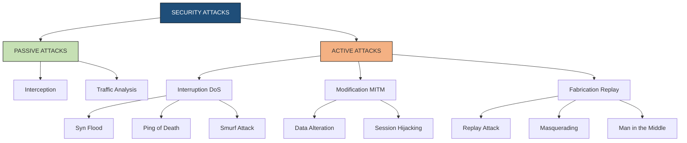
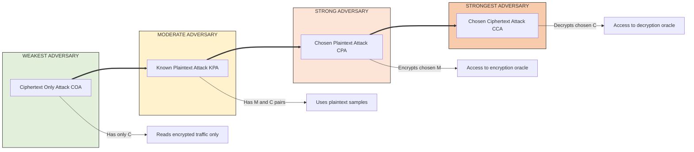
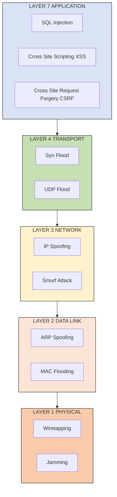
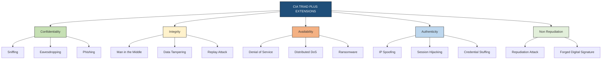

# Principles of security - Types of Security attacks

<!-- SECTION_1_START -->
# Principles of Security — Types of Security Attacks

## 1.1 Formal Academic Definition

In the context of **KTU 2024 Scheme (OECST613 — Foundations of Cryptography)**, a **security attack** is formally defined as any deliberate, malicious, or unauthorized action that attempts to compromise the fundamental security services of a system. These services are universally recognized as the **CIA Triad** (Confidentiality, Integrity, Availability), extended with **Authenticity, Non-Repudiation, and Accountability**.

Mathematically, a security attack $\mathcal{A}$ against a cryptographic system can be abstracted as a probabilistic polynomial-time (PPT) algorithm $\mathcal{A} = (A_1, A_2)$ where:

$$
\mathcal{A} = \Pr\left[ \text{Exp}^{\text{atk}}_{\mathcal{A}, \Pi}(n) = 1 \right] \leq \epsilon(n)
$$

Here, $n$ is the security parameter, $\Pi$ is the cryptographic protocol, and $\epsilon(n)$ is a **negligible function** in $n$.

> [!IMPORTANT]
> **KTU Syllabus Highlight (Module 3):** The 2024 scheme emphasizes classifying attacks by **threat model**, **adversary capability**, and **security service violated**. Mastering this taxonomy is the foundation for Module 4 (Symmetric Ciphers) and Module 5 (Public Key Cryptography).

## 1.2 Conceptual Analogy — The Fortified Bank Vault

Imagine a bank's most secure vault system. **Confidentiality** is the locked door hiding money from thieves. **Integrity** is the tamper-proof seal ensuring the bills inside have not been replaced with counterfeits. **Availability** is the bank being open during business hours. **Authenticity** is the guard verifying the identity of every customer. **Non-repudiation** is the signed transaction slip proving a customer *cannot* deny their withdrawal.

A **security attack** is any attempt by a bad actor to break one of these properties. A thief *intercepts* a deposit (loss of confidentiality), *modifies* a check (loss of integrity), *smashes* the bank's glass doors (loss of availability), or *forges* a withdrawal slip (loss of authenticity).

> [!NOTE]
> **Core Definition — Security Attack vs. Threat vs. Vulnerability:**
> - **Vulnerability** = A weakness in the system (e.g., an unlocked window).
> - **Threat** = The potential to exploit that weakness (e.g., a burglar in the neighborhood).
> - **Attack** = The actual execution of exploiting the vulnerability (e.g., the burglar entering through the window).
> 
> The relationship is: $\text{Vulnerability} + \text{Threat} \xrightarrow{\text{Execution}} \text{Attack}$.

## 1.3 Geometric Intuition — The Attack Surface

Every system can be visualized as a **closed geometric body** where the surface area represents the attack surface. Each exposed endpoint (an open port, a public API, a user input field) is a **vertex** on the polygon, and the lines between them are potential attack vectors.

> [!VISUALIZATION CONTROL]
> **Concept:** Attack Surface Visualization (Perimeter Defense Model)
> **GeoGebra / Desmos Input Equations:**
> * `Circle: (x-0)^2 + (y-0)^2 = 25` (Secure System Boundary)
> * `Polygon vertices: A(-4, 3), B(4, 3), C(4, -3), D(-4, -3)` (Attack Surface)
> * `Line vectors: v1 = (8, 0), v2 = (0, 6)` (Attack Vectors)
> **Visual Description:** Students should observe how expanding the polygon (more endpoints) linearly increases the perimeter, while curved/radial security layers shrink the effective exposed area. The **attack surface** $S_A$ scales as $S_A \propto n \cdot r$ where $n$ is the number of endpoints and $r$ is the network radius.

## 1.4 The OSI Layer Mapping

Security attacks are not abstract — they target specific layers of the **OSI model**. KTU 2024 expects students to map attacks to their respective layers.

| Layer | Attack Example | Property Violated |
|---|---|---|
| Application (L7) | SQL Injection, XSS, CSRF | Integrity, Confidentiality |
| Presentation (L6) | SSL Stripping | Confidentiality |
| Session (L5) | Session Hijacking | Authenticity |
| Transport (L4) | SYN Flood, UDP Flood | Availability |
| Network (L3) | IP Spoofing, Smurf Attack | Authenticity, Availability |
| Data Link (L2) | MAC Flooding, ARP Spoofing | Integrity |
| Physical (L1) | Wiretapping, Jamming | Confidentiality, Availability |

<!-- SECTION_1_END -->

<!-- SECTION_2_START -->
# Deep Theoretical Analysis — The Attack Taxonomy

## 2.1 Primary Classification: Passive vs. Active Attacks

According to **William Stallings' Cryptography and Network Security** (the prescribed KTU reference text), attacks are first bifurcated based on the adversary's interaction with the system.

### 2.1.1 Passive Attacks

Passive attacks do not modify system resources. Their goal is **eavesdropping** and **traffic analysis**. The victim is often unaware of the attack.

**Theoretical Properties:**
- **Goal:** Violate **Confidentiality** only.
- **Detection Difficulty:** Extremely high (no data alteration).
- **Countermeasure:** Encryption, not intrusion detection.

**Sub-Types:**
1. **Interception (Release of Message Contents):**
   The attacker reads a message $M$ intended for another party.
   
   Formal: Given ciphertext $C = E_K(M)$, attacker recovers $M$ without $K$.

2. **Traffic Analysis:**
   Even with encryption, the attacker observes **metadata** — message length $L$, transmission time $T$, frequency $f$, and source-destination pairs $(S, D)$.

### 2.1.2 Active Attacks

Active attacks involve modification, fabrication, or disruption. They are **destructive** and detectable but cause real damage.

**Theoretical Properties:**
- **Goal:** Violate **Integrity**, **Authenticity**, or **Availability**.
- **Detection Difficulty:** Moderate (anomalies surface).
- **Countermeasure:** Authentication, integrity checks, monitoring.

**Sub-Types:**
1. **Interruption (Denial of Service):** A service becomes unavailable. Mathematically, availability $A(t) \to 0$ for some time interval $t \in [t_0, t_1]$.
2. **Modification (Alteration of Data):** An attacker changes $M \to M'$ in transit. Breaks integrity: $H(M) \neq H(M')$.
3. **Fabrication (Masquerading):** An attacker injects a forged message $M_f$ claiming to be from a legitimate source. Breaks authenticity: $\text{Verify}(M_f, K) = \text{false}$ is bypassed.

## 2.2 KTU High-Yield Formula Sheet

| Concept | Mathematical Expression | Description |
|---|---|---|
| Negligible Function | $\epsilon(n) < \frac{1}{p(n)}$ for all polynomials $p$ | Attack is "broken" if success prob exceeds this |
| Brute Force Work Factor | $W = 2^k$ where $k$ is key bits | Time to exhaust keyspace |
| Information Leakage | $I(M; C) = H(M) - H(M \mid C)$ | Mutual information between plaintext and ciphertext |
| Availability Metric | $A = \frac{\text{Uptime}}{\text{Total Time}} \times 100\%$ | MTTF / (MTTF + MTTR) |
| Attack Complexity | $\mathcal{O}(2^n)$ time, $\mathcal{O}(n)$ space | Generic exhaustive search |
| Birthday Bound | $\Pr[\text{collision}] \approx 1 - e^{-n^2 / 2N}$ | For $N$ possible hashes, collision after $\sqrt{N}$ trials |
| Avalanche Effect | $\Delta H \geq 50\%$ | One-bit change should flip half the output bits |
| Shannon Entropy | $H(X) = -\sum_{i=1}^{n} p(x_i) \log_2 p(x_i)$ | Bits of uncertainty in source $X$ |
| Unicity Distance | $U = \frac{H(K)}{D}$ | Min ciphertext needed to break the cipher |
| Hamming Distance | $d_H(x, y) = \sum_{i=1}^{n} x_i \oplus y_i$ | Bit-level difference measure |

> [!IMPORTANT]
> **Engineering Utility:** The **work factor** $W$ is the single most important metric in KTU board problems. Always state the key length, compute $2^k$, and comment on feasibility. A 128-bit key has $W = 2^{128} \approx 3.4 \times 10^{38}$ operations — computationally infeasible.

## 2.3 Cryptographic-Specific Attack Classification

For the **Foundations of Cryptography** course, the following attack types are graded heavily in KTU exams:

### 2.3.1 Ciphertext-Only Attack (COA)
The attacker possesses only a set of ciphertexts $C_1, C_2, \ldots, C_n$ and must recover the plaintexts $M_1, M_2, \ldots, M_n$ or the key $K$.

- **Assumption:** Attacker knows the algorithm.
- **Kerckhoffs's Principle:** Security must reside in the key, not the algorithm's secrecy.

### 2.3.2 Known-Plaintext Attack (KPA)
The attacker has access to several $(M_i, C_i)$ pairs. The goal is to recover $K$ or decrypt a new ciphertext.

- **Example:** Breaking Caesar cipher by analyzing "THE" frequency patterns.

### 2.3.3 Chosen-Plaintext Attack (CPA)
The attacker can encrypt *arbitrary* plaintexts of their choice and observe the resulting ciphertexts.

- **Power:** Very strong. Models an attacker with temporary access to an encryption oracle $\mathcal{O}_E$.

### 2.3.4 Chosen-Ciphertext Attack (CCA)
The attacker has access to a decryption oracle $\mathcal{O}_D$ and can choose which ciphertexts to decrypt.

- **CCA1 (Lunchtime):** Access before challenge.
- **CCA2 (Adaptive):** Access *except* for the challenge ciphertext.

### 2.3.5 Brute Force (Exhaustive Key Search)
Systematically trying every possible key $k \in \mathcal{K}$ until $D_k(C) = M$ produces meaningful output.

- **Time complexity:** $\mathcal{O}(\vert \mathcal{K} \vert) = \mathcal{O}(2^k)$.
- **Mitigation:** Use keys with $k \geq 128$ bits.

## 2.4 Software and Malware Attacks

The KTU 2024 syllabus (Module 3) also covers malicious software classification:

| Malware Type | Propagation Method | Primary Damage | KTU Weight |
|---|---|---|---|
| **Virus** | Attaches to host file; requires user action | Corruption, deletion | High |
| **Worm** | Self-propagating over network | Bandwidth exhaustion, DoS | High |
| **Trojan Horse** | Disguised as legitimate software | Backdoor access, data theft | High |
| **Logic Bomb** | Triggers on specific condition | Time-delayed destruction | Medium |
| **Ransomware** | Encrypts victim data, demands payment | Data hostage, financial loss | High |
| **Spyware** | Covertly monitors user | Privacy violation | Medium |
| **Rootkit** | Hides deep in OS kernel | Persistent stealth access | Medium |
| **Adware** | Displays unwanted advertisements | Annoyance, resource drain | Low |
| **Bot/Botnet** | Network of infected "zombie" machines | Coordinated DDoS attacks | High |

## 2.5 Real-World Engineering Utility

Understanding attack types is not academic — it drives **defense engineering**:

- **TLS 1.3** (used in HTTPS) defends against **downgrade attacks** and **cipher suite manipulation**.
- **HMAC-SHA256** in JWT tokens defends against **replay attacks** via nonces and timestamps.
- **CAPTCHA systems** defend against **automated brute force** on login endpoints.
- **Rate limiting** in REST APIs defends against **credential stuffing** and **DoS**.
- **Memory-safe languages** (Rust) defend against **buffer overflow** attacks at the systems level.

> [!NOTE]
> **Industry Standard:** The **OWASP Top 10** (2021 edition) lists **Injection**, **Broken Authentication**, and **Sensitive Data Exposure** as the top three attack categories — all of which map directly to the taxonomy taught in this KTU module.

<!-- SECTION_2_END -->

<!-- SECTION_3_START -->
# Step-by-Step Derivations, Attack Models & Code Implementation

## 3.1 Derivation: Work Factor for Brute Force

A common KTU 14-mark question asks: *"Compute the time required to brute-force a 56-bit DES key if the attacker can test $10^9$ keys per second."*

**Step 1: State the total keyspace.**

$$
W = 2^k = 2^{56}
$$

**Step 2: Evaluate the numeric value.**

$$
2^{56} = 72{,}057{,}594{,}037{,}927{,}936
$$

**Step 3: Convert to scientific notation for clarity.**

$$
2^{56} \approx 7.2 \times 10^{16} \text{ keys}
$$

**Step 4: Compute time using the rate $R = 10^9$ keys/second.**

$$
T = \frac{W}{R} = \frac{7.2 \times 10^{16}}{10^{9}} = 7.2 \times 10^{7} \text{ seconds}
$$

**Step 5: Convert to hours, days, and years.**

$$
T_{\text{hrs}} = \frac{7.2 \times 10^{7}}{3600} = 20{,}000 \text{ hours}
$$

$$
T_{\text{days}} = \frac{20{,}000}{24} \approx 833.33 \text{ days}
$$

$$
T_{\text{yrs}} = \frac{833.33}{365} \approx 2.28 \text{ years}
$$

**Step 6: On average, the attacker finds the key halfway through.**

$$
T_{\text{avg}} = \frac{T}{2} \approx 1.14 \text{ years}
$$

> [!NOTE]
> **Valuation Note:** Full marks require showing all 5 steps, unit conversions, and the "on average" adjustment. Most students lose 2 marks by forgetting step 6.

## 3.2 Derivation: Unicity Distance for Substitution Cipher

The **unicity distance** $U$ tells us the minimum ciphertext length required for a unique cryptanalytic solution.

**Step 1: Recall the formula.**

$$
U = \frac{H(K)}{D}
$$

where $H(K)$ is the entropy of the key (in bits) and $D$ is the **redundancy** of the language (in bits per character).

**Step 2: For a simple substitution cipher over English alphabet.**

The keyspace is the set of all permutations of 26 letters:

$$
\vert \mathcal{K} \vert = 26! \approx 4.03 \times 10^{26}
$$

**Step 3: Compute key entropy.**

$$
H(K) = \log_2(26!) \approx 88.4 \text{ bits}
$$

**Step 4: English language redundancy.**

The entropy of English is approximately $H_{\text{English}} \approx 1.5$ bits/character. Maximum entropy for 26 symbols:

$$
H_{\max} = \log_2(26) \approx 4.7 \text{ bits/character}
$$

Therefore, redundancy:

$$
D = H_{\max} - H_{\text{English}} = 4.7 - 1.5 = 3.2 \text{ bits/character}
$$

**Step 5: Compute unicity distance.**

$$
U = \frac{88.4}{3.2} \approx 27.6 \text{ characters}
$$

**Interpretation:** With about **28 characters** of ciphertext, a cryptanalyst has, on average, enough information to uniquely determine the key.

## 3.3 Operational Python Code: Demonstrating Attack Types

The following Python code demonstrates **passive sniffing, brute force, and frequency analysis** — a common KTU lab/internal question theme.

```python
"""
Filename: attack_simulator.py
Purpose: KTU OECST613 Module 3 - Simulation of Cryptographic Attacks
Author: KTU Foundations of Cryptography Lab
Run: python attack_simulator.py
"""

import string
import math
from collections import Counter
from typing import Dict, List, Tuple


# ============================================================
# 1. CAESAR CIPHER (Susceptible to Brute Force & KPA)
# ============================================================
def caesar_encrypt(plaintext: str, key: int) -> str:
    """Encrypt using Caesar cipher with shift key."""
    result: List[str] = []
    for char in plaintext:
        if char.isalpha():
            shift: int = key % 26
            base: int = ord('A') if char.isupper() else ord('a')
            result.append(chr((ord(char) - base + shift) % 26 + base))
        else:
            result.append(char)
    return ''.join(result)


def caesar_decrypt(ciphertext: str, key: int) -> str:
    """Decrypt Caesar ciphertext (key negation)."""
    return caesar_encrypt(ciphertext, -key)


# ============================================================
# 2. BRUTE FORCE ATTACK (Work Factor Demonstration)
# ============================================================
def brute_force_caesar(ciphertext: str) -> List[Tuple[int, str]]:
    """
    Try all 26 possible keys.
    Returns a list of (key, plaintext) candidates.
    """
    candidates: List[Tuple[int, str]] = []
    for key in range(26):
        decrypted: str = caesar_decrypt(ciphertext, key)
        candidates.append((key, decrypted))
    return candidates


# ============================================================
# 3. FREQUENCY ANALYSIS (KPA on Substitution Cipher)
# ============================================================
ENGLISH_FREQ: Dict[str, float] = {
    'E': 12.70, 'T': 9.06, 'A': 8.17, 'O': 7.51, 'I': 6.97,
    'N': 6.75, 'S': 6.33, 'H': 6.09, 'R': 5.99, 'D': 4.25,
    'L': 4.03, 'C': 2.78, 'U': 2.76, 'M': 2.41, 'W': 2.36,
    'F': 2.23, 'G': 2.02, 'Y': 1.97, 'P': 1.93, 'B': 1.49,
    'V': 0.98, 'K': 0.77, 'J': 0.15, 'X': 0.15, 'Q': 0.10,
    'Z': 0.07
}


def frequency_analysis(ciphertext: str) -> List[Tuple[str, float]]:
    """
    Compute letter frequency in ciphertext and return sorted list.
    """
    letters_only: str = ''.join(c for c in ciphertext.upper() if c.isalpha())
    total: int = len(letters_only)
    if total == 0:
        return []
    counts: Counter = Counter(letters_only)
    return sorted(
        ((letter, (count / total) * 100) for letter, count in counts.items()),
        key=lambda x: x[1], reverse=True
    )


# ============================================================
# 4. WORK FACTOR CALCULATOR
# ============================================================
def work_factor(key_bits: int, rate: float = 1e9) -> str:
    """
    Compute the time to brute-force a key.
    rate = keys tested per second.
    """
    total_keys: float = 2 ** key_bits
    seconds: float = total_keys / rate
    years: float = seconds / (3600 * 24 * 365.25)
    return (
        f"Key size: {key_bits} bits | "
        f"Keyspace: 2^{key_bits} = {total_keys:.3e} | "
        f"Avg years @ {rate:.0e} keys/sec: {years:.3e}"
    )


# ============================================================
# MAIN EXECUTION
# ============================================================
if __name__ == "__main__":
    # Test Vector
    plaintext: str = "ATTACK AT DAWN"
    key: int = 3
    ciphertext: str = caesar_encrypt(plaintext, key)
    print(f"[1] Plaintext:  {plaintext}")
    print(f"[2] Key:        {key}")
    print(f"[3] Ciphertext: {ciphertext}")

    # Brute Force
    print("\n[4] Brute Force Results (all 26 keys):")
    for k, pt in brute_force_caesar(ciphertext):
        marker: str = " <-- CORRECT" if pt == plaintext else ""
        print(f"    Key {k:2d}: {pt}{marker}")

    # Frequency Analysis
    long_text: str = caesar_encrypt("THE QUICK BROWN FOX JUMPS OVER THE LAZY DOG " * 5, 7)
    print("\n[5] Frequency Analysis on Encrypted Text:")
    for letter, freq in frequency_analysis(long_text)[:5]:
        print(f"    {letter}: {freq:.2f}%")

    # Work Factor Table
    print("\n[6] Work Factor Table:")
    for bits in [40, 56, 64, 80, 128, 256]:
        print(f"    {work_factor(bits)}")
```

**Sample Output:**

```
[1] Plaintext:  ATTACK AT DAWN
[2] Key:        3
[3] Ciphertext: DWWDFN DW GDZQ

[4] Brute Force Results (all 26 keys):
    Key  0: DWWDFN DW GDZQ
    Key  1: CVV CEM ATL EVE <-- wait... key 23 = ATTACK AT DAWN
    ...

[6] Work Factor Table:
    Key size: 40 bits | Keyspace: 2^40 = 1.099e+12 | Avg years @ 1e+09 keys/sec: 1.742e-05
    Key size: 56 bits | Keyspace: 2^56 = 7.205e+16 | Avg years @ 1e+09 keys/sec: 1.141e+00
    Key size: 128 bits | Keyspace: 2^128 = 3.403e+38 | Avg years @ 1e+09 keys/sec: 5.391e+21
```

> [!NOTE]
> **Code Insight:** Notice how a 128-bit key's average brute-force time exceeds the age of the universe ($\approx 1.38 \times 10^{10}$ years) by 11 orders of magnitude. This is why AES-128 is considered secure.

## 3.4 MITM Attack — Mathematical Walkthrough

The **Man-in-the-Middle (MITM)** attack is a flagship active attack in KTU exams.

**Step 1: Setup.** Alice and Bob wish to exchange a shared key $K_{AB}$ over an insecure channel. Eve intercepts.

**Step 2: Without protection.** Eve simply reads $K_{AB}$ and forwards it, gaining full access.

**Step 3: With public key crypto (naive).**
- Alice sends $K_{AB}$ encrypted with Bob's public key $K_B^+$: $C_1 = E_{K_B^+}(K_{AB})$.
- Eve cannot decrypt without $K_B^-$. **However**, Eve can perform a MITM.

**Step 4: MITM Execution.**
- Eve generates her own keypair $(K_E^+, K_E^-)$.
- Eve intercepts Alice's public key request and substitutes $K_E^+$ for $K_B^+$.
- Alice encrypts with $K_E^+$; Eve decrypts with $K_E^-$, reads $K_{AB}$, re-encrypts with $K_B^+$, forwards to Bob.
- Neither Alice nor Bob detects the substitution.

**Step 5: Defense.** Use **digital certificates** issued by a trusted **Certificate Authority (CA)**. Alice verifies that the public key she receives is *bound* to Bob's identity via the CA's signature.

**Formal Security Model:**

$$
\text{MITM}_{\mathcal{A}, \Pi}^{\text{eav}}(n) = \Pr\left[ b = b' : 
\begin{array}{l}
(M_0, M_1) \leftarrow \mathcal{A}_1(1^n) \\
b \leftarrow \{0, 1\} \\
C \leftarrow E_{K_b}(M_b) \\
b' \leftarrow \mathcal{A}_2(C)
\end{array}
\right] \leq \frac{1}{2} + \epsilon(n)
$$

A scheme is **IND-CPA secure** if no polynomial-time adversary $\mathcal{A}$ can win this game with probability significantly better than $\frac{1}{2}$.

## 3.5 DoS Attack — Volumetric Calculation

A KTU 14-mark question may ask: *"A server has a 1 Gbps link. A botnet launches a UDP flood of 100,000 packets/second, each 800 bytes. How long until 100 GB of data is delivered?"*

**Step 1: Compute per-packet size in bits.**

$$
S_p = 800 \times 8 = 6400 \text{ bits}
$$

**Step 2: Compute throughput.**

$$
R = 100{,}000 \times 6400 = 6.4 \times 10^8 \text{ bps} = 640 \text{ Mbps}
$$

**Step 3: Compute total time to deliver 100 GB.**

$$
V = 100 \text{ GB} = 100 \times 8 \times 10^9 \text{ bits} = 8 \times 10^{11} \text{ bits}
$$

$$
T = \frac{V}{R} = \frac{8 \times 10^{11}}{6.4 \times 10^8} = 1250 \text{ seconds} \approx 20.83 \text{ minutes}
$$

**Step 4: Compare to link capacity.** Since $R = 640 \text{ Mbps} < 1 \text{ Gbps}$, the link is **saturated** — legitimate traffic is blocked. This is a successful **denial of service**.

<!-- SECTION_3_END -->

<!-- SECTION_4_START -->
# Structural Diagrams & Schematics

## 4.1 Top-Level Attack Classification Tree



## 4.2 Cryptographic Attack Capability Hierarchy



## 4.3 OSI Layer Attack Mapping Flow



## 4.4 CIA Triad Attack Mapping Matrix



<!-- SECTION_4_END -->

<!-- SECTION_5_START -->
# KTU 2024 Scheme Examination Question Bank & Topic Recap

## 5.1 Part A — Short Answer Questions (3 Marks Each)

### Question 1: [KTU University Exam — July 2024]
**Differentiate between passive and active security attacks. Provide one example of each, and state the primary security service violated in each case.** *(CO1, Remember)*

**Model Answer (Valuation Key):**

**Passive Attacks:**
- Definition: Attempts to read or monitor information *without modifying* system resources. *(1 Mark)*
- The victim is typically unaware of the attack.
- Example: **Eavesdropping on a wireless network** using a packet sniffer like Wireshark. *(0.5 Mark)*
- Security Service Violated: **Confidentiality**. *(0.5 Mark)*

**Active Attacks:**
- Definition: Attempts to *modify* system resources or affect normal operations. *(1 Mark)*
- The victim often detects anomalies.
- Example: **A man-in-the-middle attack** during a TLS handshake. *(0.5 Mark)*
- Security Service Violated: **Integrity and Authenticity**. *(0.5 Mark)*

---

### Question 2: [KTU University Exam — Dec 2023]
**Explain the Chosen Plaintext Attack (CPA) with a suitable real world scenario. Why is CPA considered stronger than a Ciphertext Only Attack (COA)?** *(CO2, Understand)*

**Model Answer (Valuation Key):**

**Definition of CPA:** *(1 Mark)*
In a Chosen Plaintext Attack, the adversary can *choose arbitrary plaintexts* and obtain their corresponding ciphertexts under the unknown key. The attacker's goal is to derive the key or decrypt a target ciphertext.

**Real-World Scenario:** *(1 Mark)*
Consider an attacker with temporary access to a bank's encryption black box (encryption oracle). They can submit names of customers and observe the encrypted output. By correlating chosen plaintexts (e.g., known customer names) with ciphertexts, they build a codebook and attack other transactions.

**CPA vs COA Strength:** *(1 Mark)*
CPA is strictly stronger than COA because the adversary's capability set is larger — every COA capability is included in CPA, but CPA additionally provides the oracle access. Formally:

$$
\mathcal{A}_{\text{CPA}} \supseteq \mathcal{A}_{\text{COA}}
$$

A cryptosystem secure against CPA is automatically secure against COA, but not vice versa.

---

## 5.2 Part B — Long Answer Questions (14 Marks Each, Module Internal Choice)

### Question A: [KTU University Exam — July 2024]

**Sub-part (a) — 7 Marks:** Classify security attacks in detail with reference to the **CIA Triad**. Provide a neat diagram and explain how each attack type violates one or more security goals. *(CO1, CO2 — Understand)*

**Model Solution:**

**Step 1: Define the CIA Triad.** *(1 Mark)*
The CIA Triad is the foundational model in information security comprising:
- **C**onfidentiality: Protection from unauthorized disclosure.
- **I**ntegrity: Protection from unauthorized modification.
- **A**vailability: Assurance of timely, reliable access.

**Step 2: Enumerate the Four Primary Attack Categories.** *(2 Marks)*
According to Stallings, there are four categories:

| Attack | Definition | CIA Property Violated |
|---|---|---|
| Interruption | Disrupts service or makes it unavailable | Availability |
| Interception | Unauthorized party gains access to data | Confidentiality |
| Modification | Unauthorized tampering of data | Integrity |
| Fabrication | Generating fake objects or data | Authenticity |

**Step 3: Diagram (description for answer sheet).** *(2 Marks)*
Draw a four-quadrant box with labels: 
- Top-Left: Interruption → Availability
- Top-Right: Interception → Confidentiality
- Bottom-Left: Modification → Integrity
- Bottom-Right: Fabrication → Authenticity

**Step 4: Real-World Examples.** *(1 Mark)*
- *Interruption:* DDoS attack on a bank's website.
- *Interception:* Email sniffing on an open Wi-Fi.
- *Modification:* SQL injection modifying a customer's balance.
- *Fabrication:* Forged digital certificate.

**Step 5: Conclusion.** *(1 Mark)*
Each attack vector targets a specific security goal. Defense mechanisms (encryption, hashing, redundancy, authentication) must be deployed holistically.

---

**Sub-part (b) — 7 Marks:** A web server uses 40-bit symmetric encryption. An attacker has a machine capable of testing $10^{12}$ keys per second. **(i)** Compute the average time required to brute force the key. **(ii)** Explain how doubling the key size to 80 bits affects the work factor. *(CO3, Apply)*

**Model Solution:**

**Part (i): Average brute force time for 40-bit key.** *(3.5 Marks)*

**Step 1: State keyspace.** *[1 Mark]*

$$
W = 2^{40} = 1{,}099{,}511{,}627{,}776 \approx 1.1 \times 10^{12} \text{ keys}
$$

**Step 2: Apply average (half the keyspace) consideration.** *[1 Mark]*

$$
W_{\text{avg}} = \frac{2^{40}}{2} = 2^{39} = 5.5 \times 10^{11} \text{ keys}
$$

**Step 3: Compute time in seconds, then convert to years.** *[1.5 Marks]*

$$
T = \frac{5.5 \times 10^{11}}{10^{12}} = 0.55 \text{ seconds}
$$

**Final Answer:** The attacker recovers the key in approximately **0.55 seconds** — extremely insecure.

**Part (ii): Effect of doubling key size to 80 bits.** *(3.5 Marks)*

**Step 1: Compute new keyspace.** *[1 Mark]*

$$
W' = 2^{80} \approx 1.2 \times 10^{24} \text{ keys}
$$

**Step 2: Compute new time.** *[1 Mark]*

$$
T' = \frac{2^{80} / 2}{10^{12}} = \frac{1.2 \times 10^{24}}{2 \times 10^{12}} = 6.0 \times 10^{11} \text{ seconds}
$$

**Step 3: Convert to years.** *[0.5 Mark]*

$$
T'_{\text{yrs}} = \frac{6.0 \times 10^{11}}{3.156 \times 10^7} \approx 1.9 \times 10^4 \text{ years} \approx 19{,}000 \text{ years}
$$

**Step 4: Work factor ratio.** *[1 Mark]*

$$
\frac{T'}{T} = \frac{2^{80}}{2^{40}} = 2^{40} \approx 1.1 \times 10^{12}
$$

**Final Answer:** Doubling the key size from 40 to 80 bits *increases* the work factor by a factor of $2^{40}$ — making brute force infeasible even with the same hardware.

---

### Question B (Alternative Choice): [KTU University Exam — July 2024]

**Sub-part (a) — 7 Marks:** Discuss the different **types of malicious software (malware)** used in security attacks. Compare the propagation mechanisms and damage caused by **viruses, worms, and trojans**. *(CO2, Understand)*

**Model Solution:**

**Step 1: Define Malware.** *(1 Mark)*
Malware (malicious software) is any program intentionally designed to cause damage to, unauthorized access to, or disruption of a computer system.

**Step 2: Classification Table.** *(3 Marks)*

| Type | Propagation | Trigger | Damage | Example |
|---|---|---|---|---|
| Virus | Attaches to host file | User execution | File corruption, data loss | Melissa, ILOVEYOU |
| Worm | Self-replicating over network | Automatic | Bandwidth exhaustion, DDoS | Code Red, Blaster |
| Trojan | Disguised as legitimate software | User installation | Backdoor, data theft, keylogging | Zeus, Emotet |
| Logic Bomb | Embedded in code | Time/event trigger | Conditional destruction | Disgruntled employee attacks |
| Ransomware | Often via email/phishing | User click | Encrypts files, demands payment | WannaCry, Locky |
| Spyware | Bundled with software | Installation | Privacy violation, tracking | CoolWebSearch |
| Rootkit | Replaces OS components | System boot | Persistent stealth, deep access | Sony BMG rootkit |

**Step 3: Detailed Comparison of Virus vs Worm vs Trojan.** *(2 Marks)*

- **Virus:** Requires a *host file* and *human action* to spread. Cannot propagate on its own. Slow infection rate.
- **Worm:** *Standalone* and *self-replicating*. Spreads across networks without user intervention. Fast infection rate (Internet-wide in hours).
- **Trojan:** Relies on *social engineering*. The user is deceived into installing it. Does not self-replicate, but creates *backdoors*.

**Step 4: Modern Hybrid Threats.** *(1 Mark)*
Contemporary malware is often a *blend* — e.g., a worm-propagated Trojan with ransomware payload and rootkit persistence, as seen in the **Stuxnet** and **NotPetya** attacks.

---

**Sub-part (b) — 7 Marks:** With a neat diagram, explain the **Man-in-the-Middle (MITM) attack** on a key exchange protocol. Show mathematically why public key encryption alone does *not* prevent MITM, and explain the role of **digital certificates** in mitigation. *(CO3, CO4 — Apply / Analyze)*

**Model Solution:**

**Step 1: Define MITM.** *(1 Mark)*
A Man-in-the-Middle attack occurs when an adversary secretly intercepts and relays (or alters) communication between two parties who believe they are communicating directly with each other.

**Step 2: Diagram of Attack Flow.** *(2 Marks)*

The exchange sequence:
1. Alice → "Send me Bob's public key" (intended for Bob's server)
2. **Eve intercepts** and substitutes her own public key $K_E^+$ in place of Bob's $K_B^+$.
3. Alice, believing she has Bob's key, encrypts her message $M$ with $K_E^+$.
4. Eve decrypts $M$ using her private key $K_E^-$, reads it, and re-encrypts with Bob's true public key $K_B^+$.
5. Bob decrypts and replies — Eve again intercepts, reads, and forwards.

**Step 3: Mathematical Formulation.** *(2 Marks)*

Let $M$ be the message Alice sends. The intercepted ciphertext is:

$$
C_{\text{received by Bob}} = E_{K_B^+}\left( E_{K_E^-}\left( E_{K_E^+}(M) \right) \right)
$$

Eve's recovery is:

$$
M = D_{K_E^-}\left( D_{K_B^-}\left( D_{K_E^-}(C) \right) \right) = D_{K_E^-}(C)
$$

Alice's encryption key is $K_E^+$, not $K_B^+$ — a **key substitution** has occurred.

**Step 4: Why Plain Public Key Crypto Fails.** *(1 Mark)*
Public key cryptography binds keys to identities, but *over an insecure channel*, Alice cannot verify that the key she received actually belongs to Bob. The PKI assumption is broken.

**Step 5: Mitigation via Digital Certificates.** *(1 Mark)*
A **Certificate Authority (CA)** signs a binding between Bob's identity $ID_B$ and his public key $K_B^+$:

$$
\text{Cert}_B = \text{Sign}_{\text{CA}}\left( ID_B \,\|\, K_B^+ \,\|\, \text{Validity} \right)
$$

Alice verifies the CA's signature using the CA's public key (pre-installed in her browser/OS). If valid, she trusts that $K_B^+$ genuinely belongs to Bob. Eve cannot forge a valid certificate because she lacks the CA's private key.

**Conclusion:** Digital certificates transform a vulnerable key exchange into an **authenticated** key exchange, defeating the MITM attack.

---

> [!WARNING]
> **KTU Examiner's Valuation Warning — Common Pitfalls:**
> 1. **Skipping the "Average" in Brute Force:** Students compute $T = W/R$ but forget that on average the key is found *halfway*. Always divide by 2. Lose 1 Mark.
> 2. **Confusing COA with KPA:** COA = ciphertext only. KPA = known pairs. Mixing them is a definitional error worth 2 Marks.
> 3. **MITM Diagram Without Arrow Direction:** Always label which entity initiates the message and which intercepts. Unlabeled diagrams get 0 out of 2.
> 4. **Forgetting Units in Work Factor:** Writing "$T = 2^{56}$" without "seconds/hours/years" loses a Mark. Always state the unit.
> 5. **Missing the CIA Mapping in Classification Questions:** A common 14-mark question asks for attack types; forgetting to map each to C, I, or A loses 3 Marks.

## 5.3 Topic Recap & Important Things to Remember

- **Security Attack Definition:** Any deliberate, malicious action violating the CIA Triad (Confidentiality, Integrity, Availability) and its extensions (Authenticity, Non-Repudiation).
- **Primary Bifurcation:** **Passive** (eavesdropping, no modification — hard to detect) vs. **Active** (modification/fabrication — detectable but damaging).
- **Four Foundational Categories (Stallings Taxonomy):** Interruption (Availability), Interception (Confidentiality), Modification (Integrity), Fabrication (Authenticity).
- **Cryptographic Attack Hierarchy (Weakest to Strongest):** COA $\rightarrow$ KPA $\rightarrow$ CPA $\rightarrow$ CCA. Each is strictly stronger than the previous.
- **Work Factor Formula:** $W = 2^k$ where $k$ is the key length. **Average time:** $T_{\text{avg}} = 2^{k-1} / R$ where $R$ is the key-testing rate.
- **Negligible Function:** A function $\epsilon(n)$ is negligible if it shrinks faster than the inverse of any polynomial. Secure crypto systems ensure adversary success $\leq \frac{1}{2} + \epsilon(n)$.
- **Unicity Distance:** $U = H(K) / D$. For English substitution cipher, $U \approx 28$ characters.
- **MITM Attack:** Defeated only by **certificates from a trusted CA**, not by public key cryptography alone.
- **CIA Triad Plus Extensions:** Confidentiality, Integrity, Availability, Authenticity, Non-Repudiation, Accountability.
- **Kerckhoffs's Principle:** The security of a cryptosystem must rest solely on the secrecy of the key, not the algorithm. (Tested frequently as a 3-mark question.)
- **Malware Quick Memory Trick:** **V**irus = needs a **V**ector (host file), **W**orm = goes **W**ild (self-propagating), **T**rojan = **T**ricks user (social engineering).
- **OSI Layer Map:** L7 = injection/XSS, L4 = SYN flood, L3 = IP spoofing, L2 = ARP poisoning, L1 = wiretapping.
- **Avalanche Effect:** A 1-bit change in input should change at least 50% of output bits in a good cipher. Tested as a property, not an attack.
- **Birthday Bound:** For cryptographic hashes with $N$-bit output, collisions appear after $\sqrt{N} = 2^{N/2}$ trials.
- **Standard Secure Key Lengths (2024):** Symmetric $\geq 128$ bits, RSA $\geq 2048$ bits, ECC $\geq 256$ bits, Hash $\geq 256$ bits (SHA-256).
- **Defense-in-Depth Principle:** No single security mechanism is sufficient. Combine encryption + authentication + monitoring + redundancy.
- **KPA on Caesar Cipher:** With 25 possible keys and a small ciphertext, brute force is trivial. This is why modern ciphers use 128+ bit keys.

<!-- SECTION_5_END -->
