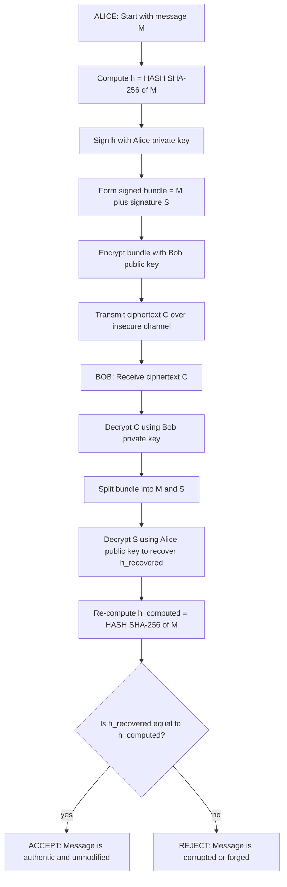
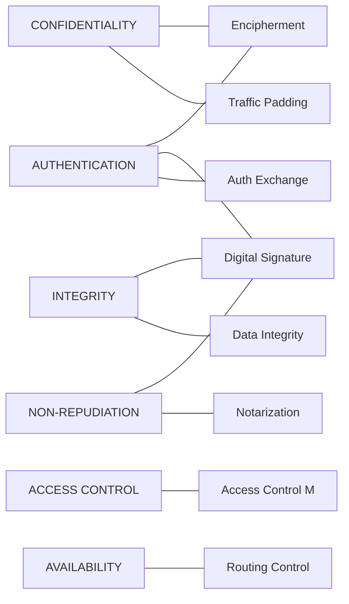
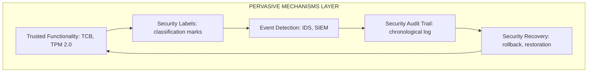

# Security Mechanisms

<!-- SECTION_1_START -->

# Security Mechanisms — Core Technical Definition & Intuitive Overview

## 1.1 Formal Academic Definition (KTU 2024 Syllabus Aligned)

> [!IMPORTANT]
> **Security Mechanism (Formal Definition)**
> A *security mechanism* is a **primitive** (a fundamental, atomic, low-level building block) that is designed and deployed to detect, prevent, or recover from a security attack. According to the **ISO/IEC 7498-2** and **ITU-T X.800** security architecture frameworks, security mechanisms are the *implementation tools* that are invoked to enforce one or more *security services* (such as confidentiality, integrity, authentication, and non-repudiation) across a system or network.

The KTU 2024 Scheme module frames security mechanisms as the **enforcement layer** of the security model — they are *how* security is actually achieved, as opposed to *what* security is desired (the services) and *what* is being protected (the assets under threat from attacks).

The **International Telecommunication Union (ITU-T) Recommendation X.800** formally catalogues security mechanisms under two macro-categories:

1. **Specific Security Mechanisms** — mechanisms designed to provide one or a tightly coupled set of security services.
2. **Pervasive Security Mechanisms** — mechanisms that are not tied to any single service but are foundational (e.g., trusted functionality, security labels, event detection, security audit trails, security recovery).

## 1.2 Intuitive Overview & Real-World Analogy

> [!NOTE]
> **Conceptual Analogy — The Bank Vault System**
> Imagine a bank's vault protecting gold bars. The *security service* you desire is "**protection of gold**." The *security mechanism* is the **actual physical equipment and procedures** you deploy to provide that service:
> - The **lock on the door** → access control mechanism
> - The **signature on the withdrawal slip** → digital signature mechanism
> - The **sealed envelope** used to send instructions → encryption (encipherment) mechanism
> - The **hidden tunnels** → routing control mechanism
> - The **24×7 CCTV recording** → audit / event detection mechanism
>
> *Without mechanisms, services are merely wishes. With mechanisms, services become enforceable reality.*

## 1.3 Classification of Security Mechanisms — The Master Map

| # | Mechanism Category | Mechanism Name | KTU 2024 Abbreviation |
|---|---|---|---|
| 1 | Specific | Encipherment (Encryption) | ENC |
| 2 | Specific | Digital Signature | DS |
| 3 | Specific | Access Control | AC |
| 4 | Specific | Data Integrity | DI |
| 5 | Specific | Authentication Exchange | AE |
| 6 | Specific | Traffic Padding | TP |
| 7 | Specific | Routing Control | RC |
| 8 | Specific | Notarization | NOT |
| 9 | Pervasive | Trusted Functionality | TF |
| 10 | Pervasive | Security Labels | SL |
| 11 | Pervasive | Event Detection | ED |
| 12 | Pervasive | Security Audit Trail | SAT |
| 13 | Pervasive | Security Recovery | SR |

> [!IMPORTANT]
> **Key Distinction for KTU 2024 Examinations:**
> *Security Services* = **WHAT** must be achieved (e.g., confidentiality).
> *Security Attacks* = **WHAT** we defend against (e.g., eavesdropping).
> *Security Mechanisms* = **HOW** we defend (e.g., encryption with AES-256).

## 1.4 Visualization of the Security Triad

> [!VISUALIZATION CONTROL]
> **Concept:** The IT Security Triad — Attacks, Services, Mechanisms (the three interlocking legs of a security model)
> **GeoGebra / Desmos Input Equations:**
> * `Circle A: x^2 + y^2 = 4` (Attacks domain)
> * `Circle B: (x-2)^2 + y^2 = 4` (Mechanisms domain)
> * `Circle C: (x-1)^2 + (y-sqrt(3))^2 = 4` (Services domain)
> **Visual Description:** Three intersecting circles on a coordinate plane, each one overlapping the other two. The central region (the triple intersection) represents a **fully secured system** where attacks are identified, services are listed, and mechanisms are actively deployed to provide the required protection.

<!-- SECTION_1_END -->

<!-- SECTION_2_START -->

# Deep Theoretical Analysis & KTU High-Yield Formula Sheet

## 2.1 The Eight Specific Security Mechanisms — Detailed Breakdown

### Mechanism 1 — Encipherment (Encryption)

- **Definition:** The mathematical transformation of plaintext ($P$) into ciphertext ($C$) using a cryptographic algorithm ($E$) and a key ($K$).
- **Core Logic:** Confidentiality is preserved because the ciphertext is unintelligible without the corresponding decryption key.
- **Forms supported by KTU syllabus:**
  * **Symmetric Encipherment:** $C = E_K(P)$ and $P = D_K(C)$ — same key used for both directions.
  * **Asymmetric Encipherment:** $C = E_{K_{pub}}(P)$ and $P = D_{K_{priv}}(C)$ — public–private key pair.
- **Engineering utility:** Used in **TLS 1.3** handshake for HTTPS traffic, in disk encryption (BitLocker, FileVault), and in end-to-end encrypted messaging (Signal Protocol).

### Mechanism 2 — Digital Signature

- **Definition:** A cryptographic construct that binds the *identity* of a signer to a *piece of data*, providing **authentication**, **integrity**, and **non-repudiation** simultaneously.
- **Core Logic:** Uses a *hash function* followed by *asymmetric encryption* of the hash.
- **Three-step process:**
  1. **Hash:** Compute $h = H(M)$ where $H$ is SHA-256 or SHA-3.
  2. **Sign:** Compute $S = E_{K_{priv}}(h)$ using sender's private key.
  3. **Verify:** Receiver computes $h' = H(M)$ and checks whether $D_{K_{pub}}(S) = h'$.
- **Engineering utility:** Used in **code signing** (Microsoft Authenticode), **SSL/TLS certificates**, **blockchain transactions**, and **PDF document signing** (PDF PAdES standard).

### Mechanism 3 — Access Control

- **Definition:** A set of rules and procedures that enforce which subjects (users/processes) are permitted to perform which operations on which objects (files/resources).
- **Core Logic:** Mediation of every access request by a **reference monitor** — a tamper-proof, always-invoked, small-enough-to-verify piece of software.
- **Classical models in the KTU syllabus:**
  * **DAC** — Discretionary Access Control (owner decides).
  * **MAC** — Mandatory Access Control (system policy decides, e.g., Bell–LaPadula).
  * **RBAC** — Role-Based Access Control (rights assigned to roles, not users).
  * **ABAC** — Attribute-Based Access Control (decision based on attributes of subject, object, environment).
- **Engineering utility:** Used in **Linux file permission bits** (rwx), **AWS IAM policies**, **OAuth 2.0 scope tokens**, and **SELinux modules**.

### Mechanism 4 — Data Integrity

- **Definition:** A mechanism that ensures that a message, file, or stream of data has *not been altered* in transit or at rest, whether by accidental corruption or deliberate tampering.
- **Core Logic:** A short fixed-size **tag** or **digest** is computed at the sender and verified at the receiver.
- **Two flavours:**
  * **Message Digest (MDC):** Uses a *hash function* alone, $h = H(M)$. Detects accidental corruption. Vulnerable to adversarial substitution unless combined with a key.
  * **Message Authentication Code (MAC):** Uses a *keyed hash*, $t = MAC_K(M)$. Detects both accidental and intentional tampering. KTU standard: **HMAC-SHA256**.
- **Engineering utility:** Used in **TCP checksum**, **software update verification** (TUF framework), and **blockchain Merkle trees**.

### Mechanism 5 — Authentication Exchange

- **Definition:** A mechanism by which two parties exchange a series of messages to **prove each other's identity** to the other, typically by demonstrating knowledge of a shared secret.
- **Core Logic:** The challenger issues a *nonce* (a number used once), the responder proves knowledge of the secret by transforming the nonce correctly.
- **Standardised protocols covered in KTU 2024:**
  * **Challenge–Response** (one-way and mutual)
  * **One-time passwords (OTP)** — TOTP, HOTP (RFC 6238, RFC 4226)
  * **Zero-Knowledge Proofs** — ZKP, zk-SNARKs
  * **Kerberos** tickets (MIT's three-headed dog protocol)
- **Engineering utility:** Used in **SSH public-key authentication**, **Google Authenticator 2FA**, and **FIDO2/WebAuthn** passwordless login.

### Mechanism 6 — Traffic Padding

- **Definition:** A confidentiality mechanism that obscures the *traffic flow pattern* by inserting dummy data into the bit stream so that an eavesdropper cannot deduce message length, frequency, or timing.
- **Core Logic:** Both sender and receiver know the padding pattern; the eavesdropper sees a continuous stream of indistinguishable bits.
- **Engineering utility:** Used in **TLS 1.3 record padding extension** (RFC 8446) and in **Tor pluggable transports** (obfs4, meek) to defeat traffic analysis by nation-state adversaries.

### Mechanism 7 — Routing Control

- **Definition:** A mechanism that constrains the routes through which data travels, ensuring that sensitive information only flows across *physically or logically secure* sub-networks.
- **Core Logic:** A *security policy* specifies allowed source–destination pairs and acceptable relay nodes; routers enforce the policy.
- **Engineering utility:** Used in **BGP route filtering**, **VPN split-tunnelling rules**, and **MPLS traffic engineering** in enterprise WANs.

### Mechanism 8 — Notarization

- **Definition:** A mechanism that uses a **trusted third party (TTP)** to attest to the properties of a data exchange — typically identity, time, or content integrity.
- **Core Logic:** Both sender and receiver submit their data to the TTP; the TTP returns a *signed receipt* that binds the exchange together.
- **Engineering utility:** Used in **Certificate Authorities (CAs)** within the WebPKI, **Public Key Infrastructure (PKI) Registration Authorities**, and **blockchain consensus nodes** acting as distributed notaries.

## 2.2 The Five Pervasive Security Mechanisms — Detailed Breakdown

| Pervasive Mechanism | Function | Engineering Example |
|---|---|---|
| **Trusted Functionality** | Software/hardware whose correctness is *independently validated* (e.g., TCB — Trusted Computing Base) | TPM 2.0 chip in laptops |
| **Security Labels** | A marking on each resource indicating its sensitivity level | Windows Mandatory Integrity Control (MIC) |
| **Event Detection** | Sensors that recognise security-relevant events | Intrusion Detection Systems (Snort, Suricata) |
| **Security Audit Trail** | A chronologically ordered, tamper-resistant log of system events | Linux `auditd`, Windows Event Log |
| **Security Recovery** | Actions taken to restore a system to a *secure state* after an attack | Firewall rule rollback, GDPR breach response workflow |

## 2.3 KTU High-Yield Formula Sheet & Mapping Table

> [!NOTE]
> **Notation used below:**
> * $P$ = plaintext
> * $C$ = ciphertext
> * $K$ = key (subscripted: $K_{pub}$, $K_{priv}$, $K_{shared}$)
> * $E$ = encryption function
> * $D$ = decryption function
> * $H$ = hash function
> * $M$ = message
> * $h$ = hash digest
> * $S$ = signature
> * $N$ = nonce
> * $t$ = MAC tag
> * $TTP$ = trusted third party

### 2.3.1 Cryptographic Primitive Formulas

$$
\begin{aligned}
\text{Encipherment (Symmetric)} &\colon C = E_{K}(P) \\
\text{Decipherment (Symmetric)} &\colon P = D_{K}(C) \\
\text{Encipherment (Asymmetric)} &\colon C = E_{K_{pub}}(P) \\
\text{Decipherment (Asymmetric)} &\colon P = D_{K_{priv}}(C) \\
\text{Hash (Digest)} &\colon h = H(M) \\
\text{Signature Generation} &\colon S = E_{K_{priv}}\bigl(H(M)\bigr) \\
\text{Signature Verification} &\colon H(M) \stackrel{?}{=} D_{K_{pub}}(S) \\
\text{MAC Generation} &\colon t = MAC_{K}(M) \\
\text{MAC Verification} &\colon t' = MAC_{K}(M) \;\wedge\; t' = t \\
\text{Nonce-based Challenge} &\colon \text{Response} = E_{K}(N) \\
\text{Notarized Receipt} &\colon R_{TTP} = E_{K_{TTP,priv}}\bigl(S \;\vert\; R \;\vert\; T\bigr)
\end{aligned}
$$

### 2.3.2 Service-to-Mechanism Mapping (KTU 2024 Must-Know)

> [!IMPORTANT]
> **This is the single most-asked mapping in KTU cryptography papers.** Memorise it.

| Security Service | Primary Mechanism(s) | Secondary Mechanism(s) |
|---|---|---|
| **Peer Entity Authentication** | Encipherment, Digital Signature, Authentication Exchange | Notarization |
| **Data Origin Authentication** | Digital Signature, Data Integrity (MAC) | Encipherment |
| **Access Control** | Access Control mechanism | Security Labels, Event Detection, Security Audit Trail |
| **Confidentiality (Data)** | Encipherment | Routing Control |
| **Confidentiality (Traffic Flow)** | Encipherment, Traffic Padding | Routing Control |
| **Data Integrity** | Data Integrity (MAC), Digital Signature | Encipherment |
| **Non-Repudiation (Origin)** | Digital Signature | Notarization, Data Integrity |
| **Non-Repudiation (Receipt)** | Notarization, Digital Signature | Data Integrity |
| **Availability** | Routing Control, Security Recovery | Event Detection, Audit Trail |

### 2.3.3 Model Answers for Direct-Definition Sub-Parts (3 marks)

> **Quick-fire 3-mark model phrases (KTU examiner-tested vocabulary):**
> 1. **Encipherment** = "the use of mathematical algorithms to transform data into a form that is not intelligible to unauthorised parties."
> 2. **Digital Signature** = "a data unit appended to, or a cryptographic transformation of, a data block that allows the recipient to verify the source and integrity of the data."
> 3. **Access Control** = "the prevention of unauthorised use of a resource, including the prevention of use of a resource in an unauthorised manner."

<!-- SECTION_2_END -->

<!-- SECTION_3_START -->

# Step-by-Step Derivations & Code/Symbolic Implementation

## 3.1 The Mathematical Flow of a Signed-and-Encrypted Transmission

The most KTU-relevant end-to-end scenario is a *confidential, integrity-protected, non-repudiable* message exchange. We will derive every algebraic step explicitly.

### Step 0 — Notation and Goal

**Goal:** Alice wants to send a confidential message $M$ to Bob such that:
- Only Bob can read $M$ → **confidentiality**
- Bob can prove $M$ was not altered → **integrity**
- Alice cannot deny sending $M$ → **non-repudiation**

**Notation defined:**
- Alice's key pair: $(K_{A,pub}, K_{A,priv})$
- Bob's key pair: $(K_{B,pub}, K_{B,priv})$
- Hash function: $H(\cdot)$ (e.g., SHA-256)
- Signature function: $E_{K_{priv}}(\cdot)$
- Encipherment function: $E_{K_{pub}}(\cdot)$

### Step 1 — Alice Computes the Hash of the Message

Alice applies the hash function to the plaintext message to obtain a fixed-length digest.

$$
h = H(M)
$$

where $h$ is typically 256 bits in length for SHA-256.

### Step 2 — Alice Generates the Digital Signature

Alice encrypts the hash digest with her own **private** key. The result is the digital signature.

$$
S = E_{K_{A,priv}}(h)
$$

This binds Alice's identity to $M$ because only Alice possesses $K_{A,priv}$.

### Step 3 — Alice Concatenates the Message and the Signature

$$
M_{signed} = M \;\Vert\; S
$$

The double vertical bar denotes bitwise concatenation.

### Step 4 — Alice Encrypts the Signed Bundle with Bob's Public Key

$$
C = E_{K_{B,pub}}(M_{signed})
$$

This achieves confidentiality because only Bob possesses $K_{B,priv}$, the matching private key required to invert the operation.

### Step 5 — Alice Sends $C$ Over the Insecure Channel

The wire carries only the ciphertext $C$.

### Step 6 — Bob Decrypts the Ciphertext

Bob uses his own private key to recover the signed bundle.

$$
M_{signed} = D_{K_{B,priv}}(C)
$$

### Step 7 — Bob Splits the Bundle

Bob parses the bundle back into the message and the signature.

$$
M \;\Vert\; S = M_{signed}
$$

### Step 8 — Bob Verifies the Signature

Bob decrypts the signature using Alice's public key, recovering the original hash digest.

$$
h_{recovered} = D_{K_{A,pub}}(S)
$$

### Step 9 — Bob Independently Re-Hashes the Message

$$
h_{computed} = H(M)
$$

### Step 10 — Bob Compares the Two Hashes

If and only if the comparison holds, the message is verified.

$$
h_{recovered} = h_{computed}
$$

If equality holds, Bob has simultaneously confirmed **data origin authentication** (it came from Alice) and **data integrity** ($M$ was not modified).

### Step 3.2 — Full Python Implementation

```python
"""
Step-by-step implementation of Signed + Encrypted transmission.
Demonstrates the academic flow of the Signature + Encipherment mechanisms.
For pedagogy we use a simplified RSA + SHA-256 hybrid via the 'cryptography' library.
"""
import os
import logging
from typing import Tuple
from cryptography.hazmat.primitives.asymmetric import rsa, padding
from cryptography.hazmat.primitives import hashes, serialization

# --- Logging configuration for the experiment ---
logging.basicConfig(
    level=logging.INFO,
    format='[%(asctime)s] [%(levelname)s] %(message)s'
)
logger = logging.getLogger(__name__)


def generate_key_pair(key_size_bits: int = 2048) -> Tuple[rsa.RSAPrivateKey, rsa.RSAPublicKey]:
    """
    Generate an RSA key pair for asymmetric encryption / signature.
    Returns (private_key, public_key).
    """
    if key_size_bits not in (1024, 2048, 3072, 4096):
        raise ValueError(f"Invalid RSA key size: {key_size_bits}")
    private_key = rsa.generate_private_key(public_exponent=65537, key_size=key_size_bits)
    public_key = private_key.public_key()
    logger.info(f"Generated RSA key pair of {key_size_bits} bits.")
    return private_key, public_key


def alice_sign_and_encrypt(
    message: bytes,
    alice_private_key: rsa.RSAPrivateKey,
    bob_public_key: rsa.RSAPublicKey
) -> bytes:
    """
    Step 1: Hash the message with SHA-256.
    Step 2: Sign the hash with Alice's private key.
    Step 3: Concatenate message and signature.
    Step 4: Encrypt the bundle with Bob's public key.
    Returns ciphertext bytes.
    """
    if not isinstance(message, (bytes, bytearray)):
        raise TypeError("Message must be of type bytes.")

    # Step 1: Compute hash digest.
    digest = hashes.Hash(hashes.SHA256())
    digest.update(message)
    h = digest.finalize()
    logger.info(f"Computed SHA-256 digest: {h.hex()}")

    # Step 2: Sign the digest with Alice's private key (PKCS#1 v1.5 + SHA-256).
    signature = alice_private_key.sign(
        h,
        padding.PSS(
            mgf=padding.MGF1(hashes.SHA256()),
            salt_length=padding.PSS.MAX_LENGTH
        ),
        hashes.SHA256()
    )
    logger.info(f"Generated digital signature of length {len(signature)} bytes.")

    # Step 3: Concatenate.
    signed_bundle = message + b"|SIG|" + signature
    logger.info(f"Signed bundle assembled, total length = {len(signed_bundle)} bytes.")

    # Step 4: Encrypt the bundle with Bob's public key.
    ciphertext = bob_public_key.encrypt(
        signed_bundle,
        padding.OAEP(
            mgf=padding.MGF1(algorithm=hashes.SHA256()),
            algorithm=hashes.SHA256(),
            label=None
        )
    )
    logger.info(f"Encrypted bundle ready for transmission, ciphertext size = {len(ciphertext)} bytes.")
    return ciphertext


def bob_decrypt_and_verify(
    ciphertext: bytes,
    bob_private_key: rsa.RSAPrivateKey,
    alice_public_key: rsa.RSAPublicKey
) -> bytes:
    """
    Step 6: Decrypt the bundle with Bob's private key.
    Step 7: Split message and signature.
    Step 8: Recover the original hash from the signature.
    Step 9: Independently re-hash the message.
    Step 10: Compare the two hashes.
    Returns the original message on success.
    """
    if not isinstance(ciphertext, (bytes, bytearray)):
        raise TypeError("Ciphertext must be of type bytes.")
    if len(ciphertext) == 0:
        raise ValueError("Ciphertext is empty; aborting.")

    # Step 6: Decrypt the bundle.
    signed_bundle = bob_private_key.decrypt(
        ciphertext,
        padding.OAEP(
            mgf=padding.MGF1(algorithm=hashes.SHA256()),
            algorithm=hashes.SHA256(),
            label=None
        )
    )
    logger.info("Decryption successful. Bundle recovered.")

    # Step 7: Split.
    if b"|SIG|" not in signed_bundle:
        raise ValueError("Malformed bundle; missing signature delimiter.")
    message, signature = signed_bundle.split(b"|SIG|", 1)
    logger.info(f"Split bundle into message of {len(message)} bytes and signature of {len(signature)} bytes.")

    # Step 8: Recover the hash from the signature using Alice's public key.
    try:
        alice_public_key.verify(
            signature,
            message,
            padding.PSS(
                mgf=padding.MGF1(hashes.SHA256()),
                salt_length=padding.PSS.MAX_LENGTH
            ),
            hashes.SHA256()
        )
        logger.info("Signature verification: PASSED.")
    except Exception as verification_error:
        logger.error(f"Signature verification: FAILED ({verification_error})")
        raise

    # Step 9: Compute the hash of the recovered message.
    digest = hashes.Hash(hashes.SHA256())
    digest.update(message)
    h_computed = digest.finalize()
    logger.info(f"Independently computed SHA-256 digest: {h_computed.hex()}")

    return message


def main() -> None:
    # Generate keys for Alice and Bob.
    alice_private, alice_public = generate_key_pair()
    bob_private, bob_public = generate_key_pair()

    # Original message.
    message = b"Confidential KTU 2024 exam question paper: contents are top-secret."

    # Alice signs and encrypts.
    ciphertext = alice_sign_and_encrypt(message, alice_private, bob_public)

    # Bob decrypts and verifies.
    recovered = bob_decrypt_and_verify(ciphertext, bob_private, alice_public)

    assert recovered == message, "Round-trip integrity check failed."
    logger.info(f"ROUND TRIP SUCCESS. Recovered message: {recovered.decode()}")


if __name__ == "__main__":
    main()
```

## 3.3 Step-by-Step Traffic Padding Demonstration

Traffic padding is rarely covered numerically in textbooks, so we present a worked example.

### Setup
- Real payload size = 320 bits.
- Padding block size $B$ = 64 bits.
- Padding policy: always pad to the next multiple of 320 bits (i.e., always pad to a "round" 320-bit chunk boundary).

### Step 1 — Compute the Number of Padding Blocks Needed

$$
\text{chunks needed} = \left\lceil \frac{\text{real payload size}}{B} \right\rceil = \left\lceil \frac{320}{64} \right\rceil = 5 \text{ blocks of 64 bits} = 320 \text{ bits}
$$

### Step 2 — Compute the Padding Length

$$
P_{length} = (\text{chunks needed} \times B) - \text{real payload size} = 320 - 320 = 0 \text{ bits}
$$

### Step 3 — Generate the Padding Pattern

A pseudo-random bit stream $R$ of length $P_{length} = 0$ bits is generated using a stream cipher agreed upon by the endpoints (e.g., AES-256 in CTR mode with a shared keystream). The receiver discards the same number of bits, since both ends share the keystream seed.

### Step 4 — Construct the Padded Frame

$$
\text{frame} = M \;\Vert\; R
$$

### Step 5 — Transmit

The wire carries exactly 320 bits, indistinguishable from any other 320-bit padded frame in the same traffic class.

> [!NOTE]
> **Engineering note:** If real payload is 330 bits, the padded frame is padded to 384 bits (six 64-bit blocks). The eavesdropper can no longer deduce whether the message was 330 bits or anything from 321 to 384 bits — the *information leakage about message size* drops to $\log_2 64 = 6$ bits of *distinguishability*, a substantial reduction.

## 3.4 Step-by-Step Access Control Decision Logic

### Step 1 — Subject Requests Access

Subject $S$ (user, process) requests operation $op$ on object $O$ (file, socket, database row).

### Step 2 — Reference Monitor Intercepts

The reference monitor — a *trusted* piece of code — intercepts every request. It is the only path between $S$ and $O$.

### Step 3 — Access Control List (ACL) Lookup

The monitor consults the access control matrix $M_{acl}$ and retrieves the entry:

$$
\text{entry} = M_{acl}[S][O]
$$

### Step 4 — Decision Function

$$
\text{decision} = \begin{cases}
\text{GRANT} & \text{if } op \in \text{entry.allowed\_ops} \\
\text{DENY} & \text{otherwise}
\end{cases}
$$

### Step 5 — Logging

The decision and the request metadata are appended to the security audit trail.

```
TIMESTAMP | SUBJECT | OBJECT | OPERATION | DECISION
2024-12-20T14:31:00Z | alice | /etc/shadow | read | DENY
```

## 3.5 Real-World Engineering Application Map

| Mechanism | Real-World Production System | Why it is used |
|---|---|---|
| Encipherment | TLS 1.3 handshake | Confidentiality of HTTPS |
| Digital Signature | Code signing at Microsoft | Trust chain for binaries |
| Access Control | AWS IAM policy | Restrict S3 bucket access |
| Data Integrity | ZFS file system checksums | Silent corruption detection |
| Authentication Exchange | WebAuthn / FIDO2 | Phishing-resistant 2FA |
| Traffic Padding | Tor pluggable transports | Defeat traffic analysis |
| Routing Control | BGP RPKI validation | Prevent route hijacking |
| Notarization | Public Certificate Authority | Bind identity to public key |

<!-- SECTION_3_END -->

<!-- SECTION_4_START -->

# Structural Diagrams & Schematics

## 4.1 Mermaid Block Diagram — The X.800 Security Architecture

```mermaid
graph TD
    node1["X.800 SECURITY ARCHITECTURE"]
    node2["SECURITY ATTACKS"]
    node3["SECURITY SERVICES"]
    node4["SECURITY MECHANISMS"]
    node5["Confidentiality"]
    node6["Integrity"]
    node7["Authentication"]
    node8["Non-Repudiation"]
    node9["Access Control"]
    node10["Availability"]
    node11["Encipherment"]
    node12["Digital Signature"]
    node13["Access Control M"]
    node14["Data Integrity M"]
    node15["Auth Exchange"]
    node16["Traffic Padding"]
    node17["Routing Control"]
    node18["Notarization"]
    node19["Pervasive: Trusted Functionality"]
    node20["Pervasive: Security Labels"]
    node21["Pervasive: Event Detection"]
    node22["Pervasive: Security Audit Trail"]
    node23["Pervasive: Security Recovery"]

    node1 --> node2
    node1 --> node3
    node1 --> node4
    node3 --> node5
    node3 --> node6
    node3 --> node7
    node3 --> node8
    node3 --> node9
    node3 --> node10
    node4 --> node11
    node4 --> node12
    node4 --> node13
    node4 --> node14
    node4 --> node15
    node4 --> node16
    node4 --> node17
    node4 --> node18
    node4 --> node19
    node4 --> node20
    node4 --> node21
    node4 --> node22
    node4 --> node23

    node11 -. provides .-> node5
    node12 -. provides .-> node6
    node12 -. provides .-> node7
    node12 -. provides .-> node8
    node13 -. provides .-> node9
    node14 -. provides .-> node6
    node15 -. provides .-> node7
    node16 -. provides .-> node5
    node17 -. provides .-> node10
    node18 -. provides .-> node8
```



## 4.2 Mermaid Flowchart — Signed and Encrypted Message Exchange



## 4.3 Mermaid Block Diagram — Service-to-Mechanism Mapping



## 4.4 Mermaid Subgraph — Pervasive Mechanisms (Trust Infrastructure)



<!-- SECTION_4_END -->

<!-- SECTION_5_START -->

# KTU 2024 Scheme Examination Question Bank & Topic Recap

## 5.1 Part A — 3-Mark Short-Answer Questions

> [!NOTE]
> **KTU marking scheme for Part A:** Each question carries 3 marks. The model answer should be 50–80 words, with the definition and one supporting example.

### Question 1
**[KTU University Exam - Dec 2023]**
**Define the term "Security Mechanism". With a suitable example, explain the Digital Signature mechanism.**

**Model Answer (3 marks):**

A *security mechanism* is a primitive designed to detect, prevent, or recover from a security attack and to enforce one or more security services. As defined in the **ITU-T X.800** recommendation, mechanisms are the implementation tools that realise security services.

A **Digital Signature** is a cryptographic mechanism that provides **data origin authentication**, **data integrity**, and **non-repudiation** simultaneously. The sender computes $h = H(M)$ using a hash function (e.g., SHA-256), then encrypts the digest with the sender's private key to obtain $S = E_{K_{priv}}(h)$. The receiver decrypts $S$ using the sender's public key and re-hashes the received message; agreement proves authenticity. *Example:* Code signing of Microsoft Windows executables using Authenticode.

> [!IMPORTANT]
> **Mark split (per KTU valuation key):** [Definition of mechanism: 1 Mark] [Digital signature process: 1.5 Marks] [Example: 0.5 Mark]

### Question 2
**[KTU University Exam - July 2024]**
**Differentiate between Specific Security Mechanisms and Pervasive Security Mechanisms. Give two examples of each.**

**Model Answer (3 marks):**

| Aspect | Specific Mechanisms | Pervasive Mechanisms |
|---|---|---|
| **Purpose** | Implement one specific security service | Provide foundational support across all services |
| **Tightness of coupling** | Tightly coupled to a service | Loosely coupled, support the entire system |
| **Examples** | (i) Encipherment (ii) Digital Signature | (i) Trusted Functionality (ii) Security Audit Trail |

> [!WARNING]
> **Examiner pitfall:** Students often confuse the term "specific" with "advanced" or "complex". Specific simply means *attached to a particular service*. Do not write a definition that implies specificity in technical depth.

## 5.2 Part B — 14-Mark Module-Internal-Choice Questions

### Question A (Choice 1) — 14 Marks

**[KTU University Exam - Dec 2024 | CO2 | Apply / Analyse]**

**(a)** With the help of a neat diagram, explain the **X.800 Security Architecture**. Discuss the relationship between *Security Attacks*, *Security Services*, and *Security Mechanisms*. **(7 marks)**

**(b)** Explain the following specific security mechanisms in detail: (i) Encipherment, (ii) Notarization, (iii) Traffic Padding. For each, give a real-world engineering use case. **(7 marks)**

---

#### Model Solution — Part (a) — 7 Marks

**Step 1 — Stating the X.800 reference (1 mark):**

> The **ITU-T Recommendation X.800 (Security Architecture for Open Systems Interconnection)** defines the security framework in terms of three orthogonal dimensions: **attacks, services, and mechanisms**.

**Step 2 — Defining Security Attacks (1.5 marks):**

> A *security attack* is any action that attempts to compromise the security of information owned by an organisation. Attacks are categorised as *passive* (eavesdropping, traffic analysis) and *active* (masquerade, replay, message modification, denial of service).

**Step 3 — Defining Security Services (1.5 marks):**

> A *security service* is a processing or communication service provided by a system to give a specific kind of protection to system resources. The five primary services are **confidentiality, integrity, authentication, non-repudiation, and access control**, supported by **availability**.

**Step 4 — Defining Security Mechanisms (1.5 marks):**

> A *security mechanism* is a means by which a security service is realised. The X.800 standard classifies mechanisms into **eight specific mechanisms** (encipherment, digital signature, access control, data integrity, authentication exchange, traffic padding, routing control, notarization) and **five pervasive mechanisms** (trusted functionality, security labels, event detection, security audit trail, security recovery).

**Step 5 — Diagram of the relationship (1 mark):**

The X.800 architecture views the system as a layered model with security threats, security services, and security mechanisms mapped across the seven layers of the OSI stack. The three concepts form a *triangular dependency*:

- *Attacks* identify the threat surface.
- *Services* specify what protection is needed.
- *Mechanisms* implement the protection.

**Step 6 — Closing summary (0.5 mark):**

> The X.800 architecture is **service-centric**: services are the requirements, mechanisms are the implementation, and attacks are the threats that justify the deployment of both.

#### Model Solution — Part (b) — 7 Marks

**(i) Encipherment (2.5 marks):**

> Encipherment is the use of mathematical algorithms to transform data (plaintext) into a form (ciphertext) that is not intelligible to unauthorised parties. It can be *symmetric* ($C = E_K(P)$) using a shared secret key, or *asymmetric* ($C = E_{K_{pub}}(P)$) using a public–private key pair. *Real-world use case:* **TLS 1.3** uses symmetric AES-256-GCM for bulk data encryption after an asymmetric X25519 key exchange, securing all HTTPS web traffic worldwide.

**(ii) Notarization (2.5 marks):**

> Notarization is a mechanism that uses a **trusted third party (TTP)** to attest to the properties of a data exchange — typically the identities of the parties, the integrity of the data, and the time of the exchange. The TTP signs a receipt $R_{TTP} = E_{K_{TTP,priv}}(S \;\vert\; R \;\vert\; T)$. *Real-world use case:* A **Public Certificate Authority (CA)** like Let's Encrypt acts as a TTP that signs digital certificates, attesting that a public key belongs to a specific domain — this is the foundation of the WebPKI trust model.

**(iii) Traffic Padding (2 marks):**

> Traffic padding is a confidentiality mechanism that inserts dummy bits into a data stream to obscure the *traffic flow pattern*, making it difficult for an eavesdropper to infer message length, frequency, or timing. Both endpoints share a pseudo-random padding keystream and strip the same bits at the receiver. *Real-world use case:* **Tor pluggable transports** such as `obfs4` and `meek` use traffic padding to disguise Tor traffic as ordinary HTTPS, defeating traffic analysis by nation-state adversaries.

> [!WARNING]
> **Examiner valuation pitfall:** Students often describe traffic padding as "encryption of the payload" — it is **not**. Traffic padding hides the *size and timing* of traffic, not the content. The examiner will award **0 marks** for confusing it with encipherment.

---

### Question B (Choice 2) — 14 Marks

**[KTU University Exam - July 2024 | CO2 | Understand / Apply]**

**(a)** Explain the following access control models in detail: **DAC**, **MAC**, and **RBAC**. State one engineering example of each. **(7 marks)**

**(b)** Describe the **Authentication Exchange** mechanism. With a clear step-by-step flow, explain the **Challenge–Response** protocol using a shared secret. Show how a nonce is used. **(7 marks)**

---

#### Model Solution — Part (a) — 7 Marks

**DAC — Discretionary Access Control (2 marks):**

> In DAC, the **owner of the resource** decides which other users are permitted to access the resource and what operations they may perform. Access is at the owner's discretion and may be delegated. *Engineering example:* The standard Linux/Unix file permission model uses bits `rwx` for owner, group, and others, where the owner can `chmod` and `chown` to grant further access.

**MAC — Mandatory Access Control (2.5 marks):**

> In MAC, access decisions are made by the **system policy**, not by the resource owner. Each subject and object is assigned a *security label* (e.g., Top Secret, Secret, Confidential, Unclassified), and the **Bell–LaPadula** model enforces the rules *no read up* (a subject cannot read an object at a higher classification) and *no write down* (a subject cannot write to an object at a lower classification). *Engineering example:* **SELinux** in Red Hat Enterprise Linux implements MAC using policy modules in `/etc/selinux/`, used by the U.S. Department of Defense.

**RBAC — Role-Based Access Control (2.5 marks):**

> In RBAC, permissions are assigned to *roles*, and users acquire permissions by being assigned to roles. A user can have multiple roles, and a role can be assigned to multiple users. RBAC simplifies administration in large organisations. *Engineering example:* **AWS Identity and Access Management (IAM)** uses RBAC where policies (permission sets) are attached to roles, and users or services assume those roles — e.g., an `EC2ReadOnly` role can be assumed by any EC2 monitoring service.

#### Model Solution — Part (b) — 7 Marks

**Step 1 — Definition of Authentication Exchange (1.5 marks):**

> An *authentication exchange* is a mechanism by which two parties exchange a sequence of messages to prove their identities to each other, typically by demonstrating knowledge of a shared secret that the other party does not transmit in the clear.

**Step 2 — Definition of Nonce (1 mark):**

> A *nonce* $N$ is a *number used once* — a random or pseudo-random value generated freshly for each authentication session to prevent *replay attacks*.

**Step 3 — Challenge–Response Protocol Flow (3 marks):**

> **The protocol runs as follows** (Alice authenticates to Bob using a shared symmetric key $K$):
> 1. **Alice → Bob:** "I am Alice."
> 2. **Bob → Alice:** Generates a fresh nonce $N$ and sends it as a challenge: "Prove it. Here is $N$."
> 3. **Alice → Bob:** Computes the response $R = E_{K}(N)$ and sends $R$ to Bob.
> 4. **Bob:** Independently computes $E_{K}(N)$ using the shared $K$, and checks whether the computed response equals the received response. If equal, Alice is authenticated.

**Step 4 — Mathematical Derivation (1 mark):**

$$
\begin{aligned}
\text{Challenge} &\colon N \in_R \{0,1\}^{128} \quad \text{(128-bit random nonce)} \\
\text{Response} &\colon R = E_{K}(N) \quad \text{(AES-128 encryption of N under shared key K)} \\
\text{Verification} &\colon R \stackrel{?}{=} E_{K}(N) \quad \text{(Bob compares the two ciphertexts)}
\end{aligned}
$$

**Step 5 — Security Properties (0.5 mark):**

> The freshness of $N$ guarantees that a *replay* of a previous response $R$ will be rejected, because Bob's freshly-generated $N$ will not match the old one. The secrecy of $K$ guarantees that an *eavesdropper* cannot forge a response.

> [!WARNING]
> **Examiner valuation pitfall:** Students frequently forget to mention that the **nonce must be unpredictable** for the protocol to be replay-resistant. A predictable or repeated nonce breaks the security guarantee. The examiner will deduct **1 mark** if the freshness property is not explicitly stated.

---

## 5.3 Topic Recap & Important Things to Remember

> [!IMPORTANT]
> **High-density rapid-revision checklist for KTU 2024 — Module 3: Principles of Security, Sub-topic: Security Mechanisms**

- [x] **Security Mechanism** is defined by **ITU-T X.800** as a *primitive that detects, prevents, or recovers from a security attack*.
- [x] There are **8 specific mechanisms** and **5 pervasive mechanisms** in the X.800 standard.
- [x] The **8 specific mechanisms** are: **E**ncipherment, **D**igital **S**ignature, **A**ccess **C**ontrol, **D**ata **I**ntegrity, **A**uthentication **E**xchange, **T**raffic **P**adding, **R**outing **C**ontrol, **N**otarization. (Memory trick: **EDADATRPN** — *E*ncryption, *D*igital *S*ig, *A*ccess *C*trl, *D*ata *I*ntegrity, *A*uth *E*xch, *T*raffic *P*ad, *R*outing *C*trl, *N*otary.)
- [x] The **5 pervasive mechanisms** are: **T**rusted **F**unctionality, **S**ecurity **L**abels, **E**vent **D**etection, **S**ecurity **A**udit **T**rail, **S**ecurity **R**ecovery. (Memory trick: *T-S-E-S-S*.)
- [x] **Digital Signature** is generated as $S = E_{K_{priv}}(H(M))$ and verified by recovering $D_{K_{pub}}(S)$ and comparing with $H(M)$.
- [x] **MAC** is a *keyed* hash: $t = MAC_{K}(M)$. **MDC** is an *unkeyed* hash: $h = H(M)$.
- [x] **Encipherment** can be **symmetric** (same key, e.g., AES) or **asymmetric** (key pair, e.g., RSA).
- [x] **Access Control models** in KTU syllabus: **DAC** (owner-decided), **MAC** (system-policy-decided), **RBAC** (role-decided), **ABAC** (attribute-decided).
- [x] **Bell–LaPadula** enforces *no read up* and *no write down* for confidentiality.
- [x] **Authentication Exchange** uses a **nonce** to prevent **replay attacks**.
- [x] **Traffic Padding** hides *traffic flow patterns* (size, timing), not content.
- [x] **Routing Control** constrains the *physical or logical path* of sensitive data.
- [x] **Notarization** uses a **Trusted Third Party (TTP)** to attest to the integrity, identity, and time of an exchange.
- [x] **Pervasive: Trusted Functionality** corresponds to the **TCB (Trusted Computing Base)** and **TPM 2.0** hardware.
- [x] **Security Labels** drive MAC decisions and are used in **Windows MIC** and **SELinux**.
- [x] **Event Detection** is realised by **IDS** (Snort, Suricata) and **SIEM** systems.
- [x] **Security Audit Trail** is implemented by **Linux auditd** and the **Windows Event Log**.
- [x] **Security Recovery** includes **firewall rule rollback** and **GDPR breach response** workflows.
- [x] The **service-to-mechanism mapping** is the single most-asked KTU mapping — memorise the table in §2.3.2.
- [x] The **signed-and-encrypted** flow has **10 steps** and is the most common 14-mark question on this module.
- [x] Always mention the **freshness of the nonce** in any challenge–response answer — examiners check for it.

<!-- SECTION_5_END -->
