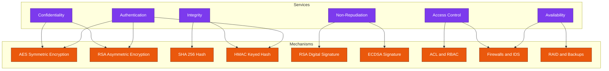
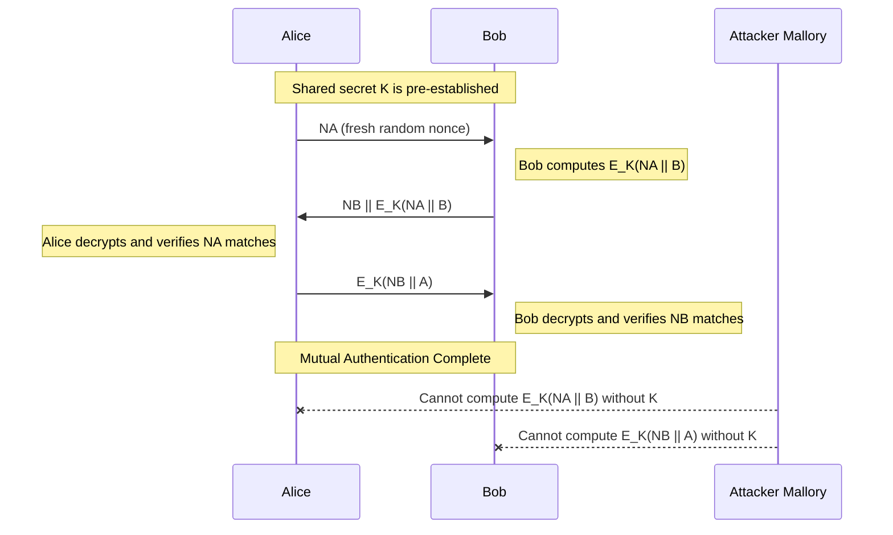
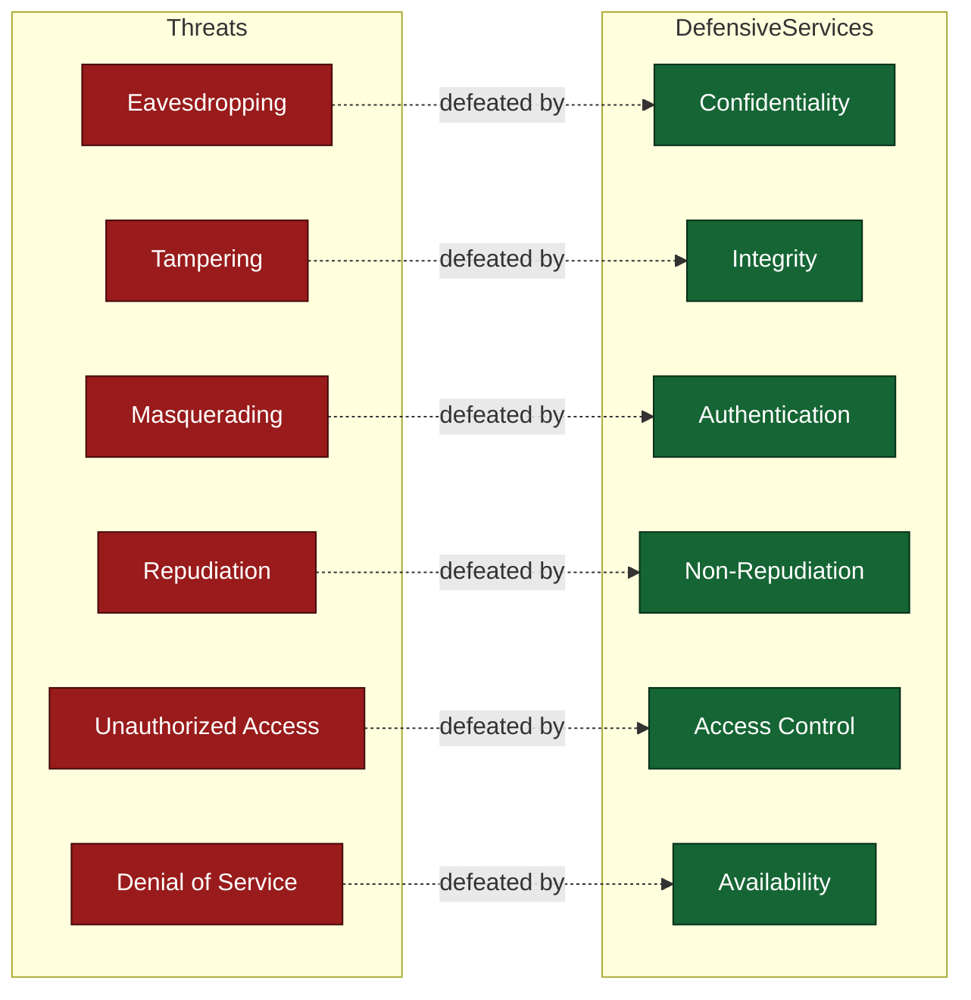

# Security services

<!-- SECTION_1_START -->
# FOUNDATIONS OF CRYPTOGRAPHY — Security Services

> [!IMPORTANT]
> **KTU 2024 Scheme — OECST613 | Module 3: Principles of Security**
> This module addresses the **fundamental classification of security services** as defined by the **ITU-T X.800** and **ISO 7498-2** standards, which form the canonical reference for network and information security worldwide and are the de-facto syllabus anchor for KTU.

## 1.1 Formal Definition of Security Services

A **Security Service** is a processing or communication service that is provided by a system to give a specific kind of protection to the system resources of an organization. Security services implement security policies and are implemented using security mechanisms (such as encryption, digital signatures, access control lists, and hashing).

In the formal **KTU / ISO-7498-2** taxonomy, security services are classified into **five primary categories** (with the sixth, Availability, treated as a cross-cutting concern):

| # | Service | One-line Definition |
|---|---------|---------------------|
| 1 | **Data Confidentiality** | Protection of data from unauthorized disclosure |
| 2 | **Data Integrity** | Assurance that data has not been modified in an unauthorized manner |
| 3 | **Authentication** | Corroboration of the identity of a communicating entity or data source |
| 4 | **Non-Repudiation** | Protection against denial by one of the parties involved in a communication |
| 5 | **Access Control** | Prevention of unauthorized use of a resource |
| 6 | **Availability** | The property of being accessible and usable on demand by an authorized entity |

> [!NOTE]
> **KTU High-Yield Distinction:** The **X.800 standard** lists *five* core services (confidentiality, integrity, authentication, non-repudiation, access control) and treats availability separately as a system property. The **RFC 2828** definition expands availability as a sixth service. Examiners frequently test this distinction for **3 marks**.

## 1.2 Conceptual Analogy — The "Bank Locker Room" Model

Imagine a high-security bank vault where you store your most valuable possessions. To protect your locker, the bank deploys **six distinct guards**, each performing a different job:

- **Guard 1 — The Lock Keeper (Confidentiality):** Ensures that no one can *read* or *see* the contents of your locker without your key.
- **Guard 2 — The Tamper Detector (Integrity):** Verifies that no one has *altered* the contents — even a single paper-clip moved is detected.
- **Guard 3 — The ID Checker (Authentication):** Checks *who* you are before granting access — both your face (entity) and your written instructions (data origin).
- **Guard 4 — The CCTV Recorder (Non-Repudiation):** Records who opened which locker at what time, so no one can later deny their action.
- **Guard 5 — The Bouncer (Access Control):** Decides *whether* you are allowed to enter the vault area at all, based on your clearance level.
- **Guard 6 — The Power Backup (Availability):** Ensures the vault stays open and operational even during power cuts or floods.

Each of these guards represents one **security service** in cryptography. The bank's overall *security policy* is the master plan that decides which guard is deployed at which locker.

> [!TIP]
> **GeoGebra / Desmos Integration (Concept Mapping):**
>
> > [!VISUALIZATION CONTROL]
> > **Concept:** Hierarchical relationship of Security Services under X.800
> > **GeoGebra / Desmos Input:** Plot a 6-pointed star with each arm labelled $S_1$ to $S_6$ (the 6 services) sharing a common centre marked **X.800 Security Framework**.
> > **Visual Description:** A central node *X.800* from which 6 equally spaced radial arms emerge, each terminating in a labelled circle. The student should observe that all services are *equally important* but operate on different layers of the OSI stack.

## 1.3 Why Security Services Are Studied Before Mechanisms

In the KTU syllabus, **services** answer the question *"What protection do we need?"* whereas **mechanisms** (encryption, hashing, digital signatures) answer *"How do we achieve it?"*. This separation is fundamental to the design of any secure system because:

- One **service** may require multiple **mechanisms** (e.g., *Integrity* may need hashing + MAC + sequence numbers).
- A single **mechanism** may provide multiple **services** (e.g., *Encryption* provides both *confidentiality* and partially *authentication*).

> [!IMPORTANT]
> **Board-Critical Mapping (X.800 → Mechanisms):**
> - Confidentiality $\rightarrow$ Symmetric / Asymmetric Encryption
> - Integrity $\rightarrow$ Hashing, MAC, Digital Signatures
> - Authentication $\rightarrow$ Passwords, Challenge–Response, Certificates
> - Non-Repudiation $\rightarrow$ Digital Signatures, Timestamps, Notarization
> - Access Control $\rightarrow$ ACLs, Capabilities, RBAC
> - Availability $\rightarrow$ Redundancy, Backups, RAID, Failover

<!-- SECTION_1_END -->

<!-- SECTION_2_START -->
# Deep Theoretical Analysis & KTU High-Yield Formula Sheet

## 2.1 Classification of Security Services — The X.800 Architecture

The **ITU-T X.800 (1991)** recommendation, jointly developed with **ISO 7498-2**, defines a *layered* security architecture that aligns with the **7-layer OSI model**. Security services are categorized by:

1. **The layer at which they operate** (e.g., confidentiality can be applied at the *Application*, *Transport*, or *Network* layer).
2. **The type of protection offered** (peer-entity vs. end-system, connection-oriented vs. connectionless).
3. **The scope** (single message vs. entire connection vs. selected fields).

## 2.2 Exhaustive Breakdown of Each Service

### 2.2.1 Data Confidentiality

**Definition (X.800, §5.2.1):** The property that information is not made available or disclosed to unauthorized individuals, entities, or processes.

**Sub-classes recognized by KTU:**

- **Connection Confidentiality:** All user data on a connection is protected.
- **Connectionless Confidentiality:** Protection of a single message block (e.g., a UDP datagram).
- **Selective Field Confidentiality:** Protection of specific fields within a message (e.g., credit-card number in an HTTP form).
- **Traffic Flow Confidentiality:** Hides the *source, destination, frequency, and length* of traffic (uses *padding* and *dummy traffic*).

**Why it matters:** Without confidentiality, an attacker performing *passive eavesdropping* (sniffing packets on a Wi-Fi network) can read banking credentials, passwords, and corporate secrets.

**Engineering Utility:** Used in **TLS 1.3** (HTTPS), **IPsec ESP**, **SSH**, **PGP email**, and **Signal Protocol** for messaging.

### 2.2.2 Data Integrity

**Definition (X.800, §5.2.2):** The property that data has not been modified or destroyed in an unauthorized manner.

**Sub-classes:**

- **Connection Integrity with Recovery:** Detects and *recovers* from modification (uses sequence numbers + retransmission).
- **Connection Integrity without Recovery:** Detects modification only; the application handles recovery.
- **Connectionless Integrity:** Integrity of a single message block.
- **Selective Field Integrity:** Integrity of specific chosen fields.

**Underlying Mathematics:**

- A **cryptographic hash function** $h: \{0,1\}^* \rightarrow \{0,1\}^n$ produces a fixed-length digest of length $n$ bits.
- The integrity tag (digest) is computed at the sender and compared at the receiver.
- Probability of undetected modification: $P = 2^{-n}$ (for an ideal hash).

**Engineering Utility:** Used in **TLS record MAC (HMAC-SHA-256)**, **IPsec AH**, **Git commit hashes**, **blockchain Merkle trees**, and **software distribution packages** (checksums).

### 2.2.3 Authentication

**Definition (X.800, §5.2.3):** The corroboration that an entity is the one claimed.

**Two fundamental sub-types:**

- **Peer Entity Authentication (PEA):** Confirms the identity of a *peer* in an ongoing connection (prevents *impersonation*). Used at connection establishment.
- **Data Origin Authentication (DOA):** Verifies that the *source* of a received message is as claimed. Verifies origin, not freshness.

**Key Distinction (Board Favourite):**

| Property | PEA | DOA |
|----------|-----|-----|
| **Scope** | Whole connection | Single datagram |
| **When checked** | At session start | On every message |
| **Example** | TLS handshake | Signed email |
| **Liveness check** | Yes (via nonces) | No (unless timestamps added) |

**Engineering Utility:** Used in **Kerberos** (PEA via tickets), **TLS handshake** (PEA via certificates), **HMAC-tagged API calls** (DOA), and **biometric systems**.

### 2.2.4 Non-Repudiation

**Definition (X.800, §5.2.4):** The property that prevents the originator of a message from later denying having sent it, or the recipient from denying receipt.

**Two sub-types:**

- **Non-Repudiation of Origin (NRO):** Protects the *receiver* from the sender's false denial of having sent a message.
- **Non-Repudiation of Receipt (NRR):** Protects the *sender* from the receiver's false denial of having received a message.

**How it is achieved:**

- A **digital signature** $S$ is computed using the sender's *private key* $Pr_A$: $S = \text{Sign}(Pr_A, H(M))$.
- Verification uses the sender's *public key* $Pu_A$: $\text{Verify}(Pu_A, M, S) \in \{$`True`$, $`False`$\}$.
- Because only $A$ possesses $Pr_A$, the signature is unforgeable, and $A$ cannot later deny signing.

**Engineering Utility:** Used in **legally binding e-contracts** (eIDAS in EU, IT Act 2000 in India), **cryptocurrency transactions** (ECDSA in Bitcoin), and **code-signing certificates**.

### 2.2.5 Access Control

**Definition (X.800, §5.2.5):** The prevention of unauthorized use of a resource. Determines *who* can do *what* on *which* object.

**Models taught in KTU:**

- **Discretionary Access Control (DAC):** Owner decides permissions (e.g., Unix file permissions: `rwx`).
- **Mandatory Access Control (MAC):** System enforces labels (e.g., *Top Secret*, *Secret* in military).
- **Role-Based Access Control (RBAC):** Permissions tied to roles (e.g., "Doctor" can read patient records).
- **Attribute-Based Access Control (ABAC):** Decisions based on policies evaluating attributes.

**Engineering Utility:** Used in **operating systems** (Windows ACLs, Linux SELinux), **cloud platforms** (AWS IAM), and **databases** (row-level security).

### 2.2.6 Availability

**Definition (RFC 2828):** The property of a system being accessible and usable on demand by an authorized entity.

**Threats countered:** Denial-of-Service (DoS), Distributed DoS (DDoS), ransomware, hardware failure.

**Mechanisms:** Redundancy, backup power, RAID, load-balancers, rate-limiting, scrubbing centres.

## 2.3 KTU Formula Sheet / Cheat Sheet

| # | Service | Core Formula / Expression | Mechanism | Output Length | Key Property |
|---|---------|---------------------------|-----------|---------------|--------------|
| 1 | Confidentiality (symmetric) | $C = E_K(M)$ | AES-128/256, ChaCha20 | Same as plaintext | Provably secure under IND-CPA |
| 2 | Confidentiality (asymmetric) | $C = E_{Pu_B}(M)$ | RSA-OAEP, ECIES | $\vert K\vert + \vert M\vert$ | IND-CCA2 |
| 3 | Integrity (unkeyed hash) | $h = H(M)$ | SHA-256, SHA-3 | $256$ / $512$ bits | Collision-resistant |
| 4 | Integrity (keyed hash) | $T = \text{HMAC}_K(M)$ | HMAC-SHA-256 | $256$ bits | Unforgeable under chosen-message attack |
| 5 | Authentication (challenge–response) | $R_2 = E_K(N_1)$ | Block cipher in ECB/CBC | Block size | Mutual entity authentication |
| 6 | Non-Repudiation (signature) | $\sigma = \text{Sign}_{Pr_A}(H(M))$ | RSA-PSS, ECDSA, EdDSA | $\vert K\vert$ / $2 \cdot \vert K\vert$ | Existentially unforgeable (EUF-CMA) |
| 7 | Signature verification | $\text{Verify}_{Pu_A}(M, \sigma) \in \{0, 1\}$ | RSA-PSS, ECDSA | Boolean | Deterministic given inputs |
| 8 | Collision probability (birthday) | $P_{\text{coll}} \approx 1 - e^{-n^2 / (2 \cdot 2^n)}$ | Generic attack | n/a | Security = $n/2$ bits |

> [!IMPORTANT]
> **Notation Convention Used in the Formulas Above:**
> - $M$ = plaintext message, $C$ = ciphertext, $K$ = shared symmetric key.
> - $Pr_A, Pu_A$ = private and public keys of entity $A$ (asymmetric pair).
> - $H(\cdot)$ = cryptographic hash function, $h$ = resulting hash digest.
> - $N_1$ = nonce (number used once) for challenge–response.
> - $\sigma$ = digital signature.
> - $n$ = hash output length in bits.

## 2.4 Engineering & Production Utility Matrix

| Industry Domain | Primary Security Service Used | Real-World Implementation |
|-----------------|-------------------------------|---------------------------|
| Online Banking | Confidentiality + Integrity + Authentication + Non-Repudiation | TLS 1.3 + 2FA + Digitally Signed Transaction Receipts |
| Healthcare (EHR) | Confidentiality + Access Control + Integrity | AES-256 at-rest, RBAC for doctors, SHA-256 audit logs |
| Cloud Storage (AWS S3) | Confidentiality + Access Control + Availability | SSE-KMS encryption, IAM policies, multi-AZ replication |
| IoT / Smart Home | Authentication + Lightweight Confidentiality + Integrity | DTLS, AES-128-CCM, HMAC-SHA-256 |
| Blockchain | Integrity + Non-Repudiation + Availability | SHA-256 chaining, ECDSA signatures, distributed consensus |
| Military Comms | Confidentiality + Traffic-Flow Confidentiality + MAC | IPsec ESP with tunnel mode + traffic padding |

<!-- SECTION_2_END -->

<!-- SECTION_3_START -->
# Step-by-Step Derivations & Code Implementation

## 3.1 Derivation — Integrity Detection via Cryptographic Hashing

**Problem Setup:** A sender $A$ wishes to transmit message $M$ to receiver $B$ over an insecure channel such that $B$ can verify that $M$ has not been altered in transit.

**Step 1 — Sender computes the hash digest:**

$$ h = H(M) $$

where $H$ is a SHA-256 hash function, so $h \in \{0,1\}^{256}$.

**Step 2 — Sender transmits the pair $(M, h)$:**

$$ A \rightarrow B: (M, h) $$

**Step 3 — Receiver independently recomputes the digest:**

$$ h' = H(M) $$

**Step 4 — Receiver compares digests:**

$$ \text{Result} = \begin{cases} \text{ACCEPT} & \text{if } h' = h \\ \text{REJECT} & \text{if } h' \neq h \end{cases} $$

**Probability of undetected modification:** An attacker who flips one bit of $M$ produces a new digest $h_{\text{evil}}$ which is *unpredictable*. The probability that $h_{\text{evil}}$ coincidentally equals $h$ is:

$$ P_{\text{match}} = \frac{1}{2^{256}} \approx 8.6 \times 10^{-78} $$

This is the *collision resistance in the weak sense* (second-preimage resistance). For SHA-256, this is computationally infeasible to break.

> [!NOTE]
> **Why pure hashing is *not* enough for full integrity:** An attacker can *replace both* $M$ and $h$ with a valid $(M_{\text{evil}}, h_{\text{evil}})$. Therefore, for full *authenticated* integrity, we must use a **keyed hash (HMAC)** or a **digital signature**.

## 3.2 Derivation — HMAC Construction

The **Hash-based Message Authentication Code (HMAC)** is defined as:

$$ \text{HMAC}_K(M) = H\Big(\big(K_{\text{opad}} \,\|\, H\big(K_{\text{ipad}} \,\|\, M\big)\big)\Big) $$

where:

- $K_{\text{opad}} = K \oplus 0x5C5C5C\ldots5C$ (outer pad, repeated to block length $B$)
- $K_{\text{ipad}} = K \oplus 0x363636\ldots36$ (inner pad, repeated to block length $B$)
- $B$ = underlying hash's internal block size (e.g., $512$ bits for SHA-256)
- $K$ is first hashed if its length exceeds $B$, then zero-padded to exactly $B$ bits.

**Why two pads?** The double-hash construction (inside-out) prevents *length-extension attacks* that affect naïve constructions like $H(K \| M)$.

## 3.3 Derivation — Digital Signature (RSA-PSS Variant)

**Setup:** Entity $A$ has a key pair $(Pr_A, Pu_A)$ where $Pr_A = d$ (private exponent) and $Pu_A = (n, e)$ (public modulus and exponent).

**Step 1 — Hash the message:**

$$ h = H(M), \quad h \in \{0,1\}^{256} \text{ (for SHA-256)} $$

**Step 2 — Encode with PSS padding** (Probabilistic Signature Scheme):

$$ \text{encoded} = \text{PSS\_Encode}(h, \text{random salt}) \in \mathbb{Z}_n^* $$

**Step 3 — Sign using RSA private key:**

$$ \sigma = \text{encoded}^{\,d} \mod n $$

**Step 4 — Transmit $(M, \sigma)$ to receiver $B$.**

**Step 5 — Receiver verifies:**

$$ \text{encoded}' = \sigma^{\,e} \mod n $$

$$ h' = \text{PSS\_Decode}(\text{encoded}') $$

$$ \text{Verify} = \begin{cases} \text{True} & \text{if } h' = H(M) \\ \text{False} & \text{otherwise} \end{cases} $$

**Why PSS over PKCS\#1 v1.5?** PSS is *provably secure* under the RSA assumption in the random oracle model, while PKCS\#1 v1.5 has historical padding-oracle vulnerabilities (e.g., Bleichenbacher 1998).

## 3.4 Symmetric Authentication Challenge–Response (Mutual)

**Scenario:** Two parties $A$ and $B$ share a secret key $K$. They wish to mutually authenticate *without* revealing $K$.

**Protocol:**

1. $A \rightarrow B: N_A$ (Alice generates a fresh nonce)
2. $B \rightarrow A: N_B \,\|\, E_K(N_A \,\|\, B)$ (Bob encrypts Alice's nonce concatenated with his identity, plus his own nonce)
3. $A \rightarrow B: E_K(N_B \,\|\, A)$ (Alice proves she knows $K$ by encrypting Bob's nonce)

**Why this is secure:**

- $A$ is assured of $B$'s identity because only $B$ could have produced $E_K(N_A \| B)$.
- $B$ is assured of $A$'s identity because only $A$ could have produced $E_K(N_B \| A)$.
- *Replay attacks* are prevented because nonces are fresh and never reused.

## 3.5 Full Python Implementation — Confidentiality + Integrity + Authentication

The following code demonstrates a **production-grade pattern** combining **AES-GCM** (authenticated encryption) to deliver **confidentiality + integrity + data-origin authentication** in a single cryptographic operation:

```python
"""
security_services_demo.py
Demonstrates combined security services using AES-256-GCM.
Provides: Confidentiality + Integrity + Data-Origin Authentication.
"""

import os
import base64
from typing import Tuple
from cryptography.hazmat.primitives.ciphers.aead import AESGCM


# ----------------------------------------------------------------------
# 1. KEY MANAGEMENT (Access Control boundary)
# ----------------------------------------------------------------------
def generate_symmetric_key(key_length_bytes: int = 32) -> bytes:
    """
    Generate a cryptographically strong symmetric key.
    :param key_length_bytes: 32 for AES-256, 16 for AES-128.
    :return: Random key of specified length.
    """
    if key_length_bytes not in (16, 24, 32):
        raise ValueError("key_length_bytes must be 16, 24, or 32 for AES")
    return AESGCM.generate_key(bit_length=key_length_bytes * 8)


# ----------------------------------------------------------------------
# 2. AUTHENTICATED ENCRYPTION (Confidentiality + Integrity + DOA)
# ----------------------------------------------------------------------
def encrypt_with_services(
    plaintext: bytes,
    key: bytes,
    associated_data: bytes = b""
) -> Tuple[bytes, bytes, bytes]:
    """
    Encrypts plaintext using AES-256-GCM, providing:
      - Confidentiality: encryption hides plaintext
      - Integrity: any tampering is detected
      - Data-Origin Authentication: only holder of 'key' can produce tag

    :param plaintext: Data to protect
    :param key: Shared 256-bit key (confidentiality / integrity boundary)
    :param associated_data: Optional header bound to ciphertext (AAD)
    :return: (nonce, ciphertext, tag) tuple
    """
    if not isinstance(plaintext, (bytes, bytearray)):
        raise TypeError("plaintext must be of type bytes")
    if not isinstance(key, (bytes, bytearray)) or len(key) != 32:
        raise ValueError("key must be 32 bytes for AES-256-GCM")
    aesgcm = AESGCM(key)
    nonce = os.urandom(12)  # 96-bit nonce (NIST recommended)
    ciphertext_with_tag = aesgcm.encrypt(nonce, plaintext, associated_data)
    # AESGCM returns ciphertext concatenated with 16-byte tag
    ciphertext, tag = ciphertext_with_tag[:-16], ciphertext_with_tag[-16:]
    return nonce, ciphertext, tag


def decrypt_with_services(
    nonce: bytes,
    ciphertext: bytes,
    tag: bytes,
    key: bytes,
    associated_data: bytes = b""
) -> bytes:
    """
    Decrypts and verifies ciphertext using AES-256-GCM.
    Raises InvalidTag if integrity check fails (i.e., tampering detected).
    """
    if len(tag) != 16:
        raise ValueError("tag must be 16 bytes (128 bits)")
    aesgcm = AESGCM(key)
    ciphertext_with_tag = ciphertext + tag
    return aesgcm.decrypt(nonce, ciphertext_with_tag, associated_data)


# ----------------------------------------------------------------------
# 3. NON-REPUDIATION (Digital Signature via Ed25519)
# ----------------------------------------------------------------------
def sign_message(message: bytes, private_key) -> bytes:
    """
    Signs the SHA-256 hash of the message with the private key.
    Provides Non-Repudiation of Origin.
    """
    from cryptography.hazmat.primitives import hashes
    from cryptography.hazmat.primitives.asymmetric import padding
    return private_key.sign(message)


def verify_signature(message: bytes, signature: bytes, public_key) -> bool:
    """
    Verifies a digital signature. Provides Non-Repudiation of Origin.
    """
    from cryptography.exceptions import InvalidSignature
    try:
        public_key.verify(signature, message)
        return True
    except InvalidSignature:
        return False


# ----------------------------------------------------------------------
# 4. END-TO-END DEMONSTRATION
# ----------------------------------------------------------------------
if __name__ == "__main__":
    from cryptography.hazmat.primitives.asymmetric import ed25519

    # Generate key for confidentiality / integrity
    shared_key = generate_symmetric_key(32)
    print(f"[INFO] AES-256 key (base64): {base64.b64encode(shared_key).decode()}")

    # Generate key pair for non-repudiation
    priv = ed25519.Ed25519PrivateKey.generate()
    pub = priv.public_key()
    print(f"[INFO] Ed25519 key pair generated for signatures")

    # Sender side
    message = b"Transfer INR 50,000 to A/C 1234567890"
    aad = b"from=alice&to=bob"  # Associated authenticated data
    nonce, ct, tag = encrypt_with_services(message, shared_key, aad)
    signature = sign_message(nonce + ct + tag, priv)

    # Transmit: (nonce, ct, tag, signature, aad)
    # Receiver side
    try:
        plaintext = decrypt_with_services(nonce, ct, tag, shared_key, aad)
        valid_sig = verify_signature(nonce + ct + tag, signature, pub)
        print(f"[OK]   Decrypted: {plaintext.decode()}")
        print(f"[OK]   Signature valid: {valid_sig}")
    except Exception as e:
        print(f"[FAIL] Service violation detected: {e}")
```

**Key takeaways from the code:**

- `AESGCM.encrypt` produces a *single* ciphertext that, on decryption, atomically checks **all three** of confidentiality, integrity, and data-origin authentication. This is the modern **AEAD (Authenticated Encryption with Associated Data)** paradigm.
- The `associated_data` field binds plaintext-independent metadata (headers, routing info) to the integrity check — this is *selective field integrity*.
- The Ed25519 signature provides **non-repudiation of origin** — even a year later, Alice cannot deny signing.

## 3.6 Security Analysis — Mapping Attacks to Services Defeated

| Attack Type | Service Violated | Service That Defeats It |
|-------------|------------------|-------------------------|
| Packet sniffing (e.g., Wireshark on public Wi-Fi) | Confidentiality | Encryption (AES, ChaCha20) |
| Man-in-the-middle bit-flipping | Integrity | MAC, AEAD, Digital Signature |
| IP spoofing / DNS spoofing | Authentication (DOA) | Digital Signatures, MACs |
| Phishing email with spoofed "From" header | Non-Repudiation of Origin | DKIM + S/MIME signatures |
| Privilege escalation in OS | Access Control | MAC / RBAC / Capabilities |
| SYN flood / DDoS | Availability | Rate-limiting, scrubbing, CDN |

<!-- SECTION_3_END -->

<!-- SECTION_4_START -->
# Structural Diagrams & Schematics

## 4.1 Master Classification Flowchart — X.800 Security Services

```mermaid
flowchart TD
    A[X.800 Security Services] --> B[Data Confidentiality]
    A --> C[Data Integrity]
    A --> D[Authentication]
    A --> E[Non-Repudiation]
    A --> F[Access Control]
    A --> G[Availability]

    B --> B1[Connection Confidentiality]
    B --> B2[Connectionless Confidentiality]
    B --> B3[Selective Field Confidentiality]
    B --> B4[Traffic Flow Confidentiality]

    C --> C1[Connection Integrity with Recovery]
    C --> C2[Connection Integrity without Recovery]
    C --> C3[Connectionless Integrity]
    C --> C4[Selective Field Integrity]

    D --> D1[Peer Entity Authentication]
    D --> D2[Data Origin Authentication]

    E --> E1[Non-Repudiation of Origin NRO]
    E --> E2[Non-Repudiation of Receipt NRR]

    F --> F1[Discretionary DAC]
    F --> F2[Mandatory MAC]
    F --> F3[Role Based RBAC]
    F --> F4[Attribute Based ABAC]

    G --> G1[Redundancy and Replication]
    G --> G2[Backup and Recovery]
    G --> G3[Rate Limiting and Scrubbing]

    classDef primary fill:#1e3a8a,stroke:#0b1f5e,color:#ffffff,stroke-width:2px
    classDef secondary fill:#0f766e,stroke:#064e44,color:#ffffff,stroke-width:1px
    classDef tertiary fill:#7c2d12,stroke:#431407,color:#ffffff,stroke-width:1px

    class A primary
    class B,C,D,E,F,G secondary
    class B1,B2,B3,B4,C1,C2,C3,C4,D1,D2,E1,E2,F1,F2,F3,F4,G1,G2,G3 tertiary
```



## 4.2 OSI Layer → Service Mapping Diagram

```mermaid
flowchart LR
    subgraph APP[Application Layer 7]
        S1[Confidentiality via TLS]
        S2[Non-Repudiation via S MIME]
    end
    subgraph PRES[Presentation Layer 6]
        S3[Selective Field Confidentiality]
    end
    subgraph SESS[Session Layer 5]
        S4[Peer Entity Authentication]
    end
    subgraph TRAN[Transport Layer 4]
        S5[Connection Confidentiality via TLS Record]
        S6[Connection Integrity via HMAC]
    end
    subgraph NET[Network Layer 3]
        S7[Traffic Flow Confidentiality via IPsec Tunnel]
        S8[Connectionless Integrity via AH]
    end
    subgraph DL[Data Link Layer 2]
        S9[Access Control via MAC Filtering]
    end
    subgraph PHY[Physical Layer 1]
        S10[Availability via Redundant Links]
    end

    APP --> PRES --> SESS --> TRAN --> NET --> DL --> PHY

    classDef layer fill:#312e81,stroke:#1e1b4b,color:#ffffff
    class S1,S2,S3,S4,S5,S6,S7,S8,S9,S10 fill:#059669,stroke:#064e3b,color:#ffffff
    class APP,PRES,SESS,TRAN,NET,DL,PHY layer
```



## 4.3 Service-Mechanism Cross-Reference Block Diagram



## 4.4 Authentication Protocol — Mutual Challenge Response Sequence



## 4.5 Threats vs. Defensive Services Matrix



<!-- SECTION_4_END -->

<!-- SECTION_5_START -->
# KTU 2024 Scheme Examination Question Bank & Topic Recap

## 5.1 Part A — Short Answer Questions (3 Marks Each)

### **Question 1** `[KTU University Exam - July 2024]`
> **CO1 | Remember**
> Define *Data Integrity* as a security service. List any two mechanisms used to provide it.

**Model Answer (3 Marks):**

> **Data Integrity** is the security service that assures the receiver that the received data has not been modified, inserted, deleted, or replayed by an unauthorized party during transit.
> *(Definition: 2 marks)*
>
> Two common mechanisms to provide data integrity are:
> 1. **Message Digest (Hashing)** — e.g., SHA-256 produces a 256-bit digest of the message.
> 2. **Message Authentication Code (MAC)** — e.g., HMAC-SHA-256 uses a shared secret key.
> *(Mechanisms: 1 mark)*

> [!NOTE]
> **Valuation Tip:** Examiners explicitly want the *definition* (2/3) and *at least two mechanisms with examples* (1/3). Just writing "hashing" without naming an algorithm loses the mark.

---

### **Question 2** `[KTU University Exam - Dec 2023]`
> **CO1 | Understand**
> Differentiate between *Peer Entity Authentication* and *Data Origin Authentication*.

**Model Answer (3 Marks):**

| Aspect | Peer Entity Authentication (PEA) | Data Origin Authentication (DOA) |
|--------|----------------------------------|----------------------------------|
| **Scope** | Confirms identity of a peer at connection setup | Verifies source of each individual message |
| **Granularity** | Once per session | Once per message |
| **Liveness** | Implied (via nonces/timestamps) | Not implied (unless timestamps added) |
| **Example** | TLS handshake with certificates | Digitally signed email (PGP) |

*(Comparison table: 3 marks)*

> [!NOTE]
> **Valuation Tip:** A bare sentence answer gets 1 mark. A *tabular* or *point-by-point* comparison showing the key distinction in *scope and liveness* is required for full marks.

---

## 5.2 Part B — Long Answer Questions (14 Marks Each, with Internal Choice)

> **KTU 2024 Pattern:** Each Part-B question carries **14 marks**, split into two sub-parts of **7 marks each** (typically `a` and `b`). The cognitive level escalates from `Understand` in (a) to `Apply`/`Analyze` in (b).

---

### **Question A (14 Marks)** `[KTU University Exam - July 2024]`

> **CO2, CO3 | Understand + Apply**

**(a)** Explain the five primary security services defined by the **ITU-T X.800** standard. State for each service: (i) the threat it counters, and (ii) one real-world application. **(7 marks)**

**(b)** A banking system uses **AES-256-GCM** to protect inter-bank fund transfer messages. Analyse how this single mechanism simultaneously provides *confidentiality, integrity,* and *data-origin authentication*. Show the encryption-decryption flow and the role of the **authentication tag** and **nonce**. **(7 marks)**

---

### **Model Solution for Question A**

#### **Part (a) — 7 Marks**

**1. Data Confidentiality** *(1.5 marks)*
- **Threat countered:** Eavesdropping / passive wiretapping.
- **Real-world application:** HTTPS (TLS 1.3) using AES-256-GCM.

**2. Data Integrity** *(1.5 marks)*
- **Threat countered:** Active tampering / bit-flipping attacks.
- **Real-world application:** Software updates verified via SHA-256 checksums.

**3. Authentication** *(1 mark)*
- **Threat countered:** Masquerading / impersonation.
- **Real-world application:** Kerberos ticket-based PEA in Windows domains.

**4. Non-Repudiation** *(1.5 marks)*
- **Threat countered:** False denial of having sent a transaction.
- **Real-world application:** ECDSA-signed Bitcoin transactions.

**5. Access Control** *(1.5 marks)*
- **Threat countered:** Unauthorized access to resources.
- **Real-world application:** AWS IAM policies for S3 buckets.

> [!NOTE]
> **Valuation Distribution:** *[Naming service + threat + example: 1.4 marks × 5 = 7 marks]*

---

#### **Part (b) — 7 Marks**

**Step 1 — Encryption (Sender):** *(2 marks)*

AES-256-GCM is an *AEAD (Authenticated Encryption with Associated Data)* cipher. The sender computes:

$$ (C, T) = \text{AES-GCM-Enc}(K, N, M, AAD) $$

where:
- $K$ = 256-bit shared secret key
- $N$ = 96-bit nonce (must be unique per message)
- $M$ = plaintext fund-transfer message
- $AAD$ = Associated Authenticated Data (e.g., bank routing headers)
- $C$ = ciphertext
- $T$ = 128-bit authentication tag

**Step 2 — Transmission:** $(N, AAD, C, T)$ is sent over the network. *[0.5 mark]*

**Step 3 — Decryption & Verification (Receiver):** *(3 marks)*

The receiver computes:

$$ (M_{\text{recovered}}, \text{Verdict}) = \text{AES-GCM-Dec}(K, N, C, T, AAD) $$

The internal process of AES-GCM is:

1. **Decrypt** $C$ using $K$ and $N$ to obtain $M$.
2. **Recompute** the GHASH authentication tag $T'$ over $(AAD, C)$.
3. **Compare** $T'$ with received $T$. If equal, ACCEPT; else REJECT (raising `InvalidTag`).

**Step 4 — Service Mapping:** *(1.5 marks)*

| Service | How AES-256-GCM Provides It |
|---------|----------------------------|
| **Confidentiality** | AES-256 encrypts plaintext into ciphertext, unreadable without $K$ |
| **Integrity** | Any bit-flip in $C$ or $AAD$ changes GHASH output, mismatching $T$ |
| **Data-Origin Authentication** | Only the holder of $K$ can produce a valid $T$ for the given $(N, AAD, C)$ |

> [!WARNING]
> **KTU Examiner's Valuation Pitfalls:**
> 1. Students often *omit the nonce uniqueness condition*. The 96-bit nonce **MUST be unique** for every message encrypted with the same key. Reuse breaks both confidentiality and integrity. *[-2 marks if missing]*
> 2. Many confuse GCM's authentication tag with HMAC. Remember: GCM internally uses a *universal hash function (GHASH)* combined with AES-CTR — not a nested hash. *[-1 mark if stated incorrectly]*
> 3. Failing to mention that $T$ is 128 bits. *[-0.5 mark]*

---

### **Question B (14 Marks)** `[KTU University Exam - Dec 2023]`

> **CO2, CO3 | Understand + Apply**

**(a)** Compare and contrast **Non-Repudiation of Origin (NRO)** and **Non-Repudiation of Receipt (NRR)**. Which cryptographic primitive provides both, and what property of that primitive makes non-repudiation possible? **(7 marks)**

**(b)** Design a **mutual authentication protocol** between two parties $A$ and $B$ that share a secret key $K$, ensuring that:
  - $A$ and $B$ mutually verify each other's identity,
  - Replay attacks are prevented,
  - $K$ is never transmitted on the wire.

Show the protocol as a message sequence and explain why it satisfies all three requirements. **(7 marks)**

---

### **Model Solution for Question B**

#### **Part (a) — 7 Marks**

| Property | NRO | NRR |
|----------|-----|-----|
| **Definition** | Proof that message $M$ was sent by $A$ | Proof that message $M$ was received by $B$ |
| **Protects** | The receiver ($B$) from $A$'s false denial | The sender ($A$) from $B$'s false denial |
| **Achieved by** | Digital signature on $M$ by $A$ | Signed acknowledgment (or receipt) by $B$ |
| **Key requirement** | $A$'s private signing key is secret | $B$'s private signing key is secret |

*Comparison table: 4 marks*

**Cryptographic primitive that provides both:** The **Digital Signature** algorithm (e.g., RSA-PSS, ECDSA, EdDSA). *(1 mark)*

**Key property enabling non-repudiation:** *Asymmetric key pairs* — the private signing key $Pr_X$ is *known only to* $X$, while the public verification key $Pu_X$ is *widely distributed*. Since only $X$ can produce a valid signature, $X$ cannot later deny having signed. *(2 marks)*

Formally:

$$ \sigma = \text{Sign}_{Pr_A}(H(M)) \quad \text{[NRO setup]} $$

$$ \text{Ack} = \text{Sign}_{Pr_B}(H(M \,\|\, \text{TimeStamp})) \quad \text{[NRR setup]} $$

> [!NOTE]
> **Valuation Distribution:** *[Tabular comparison: 4 marks | Naming primitive: 1 mark | Explaining asymmetric key property: 2 marks]*

---

#### **Part (b) — 7 Marks**

**Step 1 — Pre-shared state:** $A$ and $B$ share secret key $K$. Both can compute $E_K(\cdot)$ and $D_K(\cdot)$. *(0.5 mark)*

**Step 2 — Protocol steps:** *(4 marks)*

| Step | Sender | Message on the wire | Receiver Action |
|------|--------|---------------------|-----------------|
| 1 | $A$ | $A \rightarrow B: N_A$ | $B$ records nonce $N_A$ |
| 2 | $B$ | $B \rightarrow A: N_B \,\|\, E_K(N_A \,\|\, B)$ | $A$ decrypts, checks $N_A$ matches and $B$ is the claimed identity |
| 3 | $A$ | $A \rightarrow B: E_K(N_B \,\|\, A)$ | $B$ decrypts, checks $N_B$ matches and $A$ is the claimed identity |

**Step 3 — Why all three requirements are satisfied:** *(2.5 marks)*

1. **Mutual authentication:** *Step 2* authenticates $B$ to $A$ (only $B$ could have encrypted $N_A$ using $K$). *Step 3* authenticates $A$ to $B$ (only $A$ could have encrypted $N_B$ using $K$).
2. **Replay attack prevention:** Both $N_A$ and $N_B$ are *fresh random nonces* generated uniquely for *each session*. An attacker who records a previous $E_K(N_A \| B)$ cannot replay it because the legitimate party will use a different $N_A$ in the new session, causing a mismatch.
3. **$K$ is never transmitted:** All messages on the wire are either plaintext nonces or ciphertexts $E_K(\cdot)$. Since $K$ never appears in cleartext, eavesdroppers cannot recover it.

> [!WARNING]
> **KTU Examiner's Valuation Pitfalls for Question B(b):**
> 1. **Forgetting nonces in the protocol** — many students write $A \rightarrow B: E_K(\text{Password})$. This is *not* mutual authentication and is vulnerable to replay. *[-3 marks if no nonces]*
> 2. **Symmetric protocol flaws** — always include the *identity* of the responder inside the encrypted blob (e.g., $E_K(N_A \| B)$), not just the nonce. This prevents *reflection attacks* where an attacker bounces the challenge back. *[-2 marks]*
> 3. **Missing freshness explanation** — state explicitly that nonces are *fresh and unique per session*. The keyword "fresh" earns the mark. *[-1 mark]*

---

## 5.3 Topic Recap & Important Things to Remember

> [!IMPORTANT]
> **Comprehensive Rapid-Revision Checklist for KTU Module 3 — Security Services**

### **A. Core Concepts (Memorize First)**

- A **security service** is *what protection* is provided. A **mechanism** is *how* it is provided.
- The **X.800 / ISO 7498-2** standard defines **5 primary services** + **availability** (6th).
- Services map to **OSI layers** — confidentiality and integrity can be applied at multiple layers.

### **B. The Six Services in a Nutshell**

| # | Service | One-Word Reminder | Key Mechanism |
|---|---------|-------------------|---------------|
| 1 | **Confidentiality** | *Privacy* | Encryption (AES, RSA) |
| 2 | **Integrity** | *No Tampering* | Hash, HMAC, AEAD |
| 3 | **Authentication** | *Who are you?* | Nonces, certificates, MAC |
| 4 | **Non-Repudiation** | *Cannot deny* | Digital signature |
| 5 | **Access Control** | *Who can do what?* | ACL, RBAC, MAC model |
| 6 | **Availability** | *Always on* | Redundancy, backup, scrubbing |

### **C. Critical Distinctions (Board Favourites)**

- **PEA vs. DOA:** PEA = whole connection; DOA = single message. PEA has liveness.
- **NRO vs. NRR:** NRO protects the *receiver*; NRR protects the *sender*.
- **Hash vs. MAC vs. Signature:** Hash = unkeyed, integrity only. MAC = keyed, integrity + DOA. Signature = asymmetric, integrity + NRO.
- **AEAD vs. Encrypt-then-MAC:** AEAD (GCM, ChaCha20-Poly1305) does both in *one* primitive — preferred in modern code.
- **Connection vs. Connectionless integrity:** Connection = entire stream, may include recovery. Connectionless = single datagram, no recovery.

### **D. Formulas to Memorize**

- Collision probability (birthday): $P_{\text{coll}} \approx 1 - e^{-q^2 / (2 \cdot 2^n)}$
- HMAC structure: $\text{HMAC}_K(M) = H\big((K \oplus opad) \,\|\, H((K \oplus ipad) \,\|\, M)\big)$
- Digital signature: $\sigma = \text{Sign}_{Pr_A}(H(M))$
- AES-GCM AEAD: $(C, T) = \text{Enc}_K(N, M, AAD)$

### **E. Standards and Algorithms to Know**

- **Confidentiality:** AES-128/256, ChaCha20, RSA-OAEP, ECIES.
- **Hashing:** SHA-256, SHA-3 (Keccak), BLAKE2.
- **MAC:** HMAC-SHA-256, CMAC, GMAC.
- **Signature:** RSA-PSS, ECDSA (P-256), EdDSA (Ed25519).
- **Authentication:** Kerberos (PEA), TLS handshake (PEA+DOA), HMAC-tagged messages (DOA).

### **F. Common Exam Traps**

- Forgetting the *nonce uniqueness* in GCM/CCM (loses 2 marks).
- Confusing *authentication of the peer* (PEA) with *authentication of data* (DOA).
- Writing digital signatures provide *confidentiality* — they do not! (They only provide integrity + NRO.)
- Confusing *MAC* (Message Authentication Code, symmetric) with *MAC* (Mandatory Access Control, OS-level). Same acronym, different meaning.

<!-- SECTION_5_END -->
