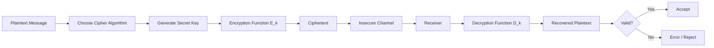
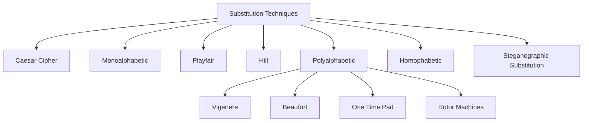
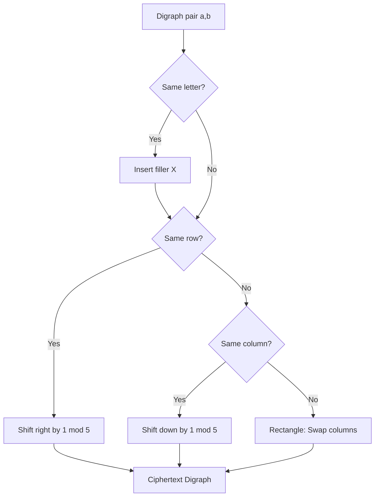
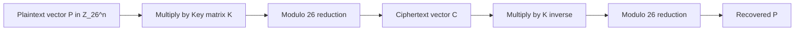
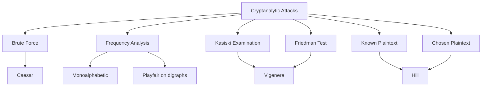
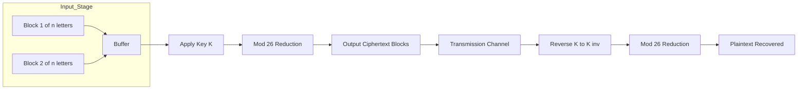

# substitution techniques

<!-- SECTION_1_START -->

# 1. Core Technical Definition & Intuitive Overview

## 1.1 Formal Academic Definition

> [!IMPORTANT]
> **Substitution Technique** is a classical symmetric-key encryption method in which elements of the **plaintext** (typically characters or blocks of characters) are systematically replaced with corresponding elements from a **ciphertext alphabet** according to a deterministic rule, while the relative order/position of the symbols is preserved.

In the context of the **KTU 2024 Scheme (OECST613 – Foundations of Cryptography, Module 3)**, substitution ciphers form the foundational building block of classical cryptography. Formally, a substitution cipher is defined as a pair of functions:

$$
E : \mathcal{P} \rightarrow \mathcal{C}, \qquad D : \mathcal{C} \rightarrow \mathcal{P}
$$

where $\mathcal{P}$ is the plaintext space, $\mathcal{C}$ is the ciphertext space, and $D$ is the inverse of $E$ such that $D(E(m)) = m$ for every $m \in \mathcal{P}$.

> [!NOTE]
> **Kerckhoffs's Principle (1883):** *The security of a cryptographic system must rest entirely on the secrecy of the key, not on the secrecy of the algorithm.* All substitution ciphers discussed in this module are evaluated under this principle.

---

## 1.2 Conceptual Analogy & Geometric Intuition

> [!NOTE]
> **Intuitive Explanation (Real-World Analogy):**
> Imagine you and your friend share a secret "codebook" — a dictionary where every letter `A` is replaced with `D`, every `B` with `E`, and so on. When you write a letter, you simply look up each character in the codebook and write the replacement. Your friend uses the **same codebook in reverse** to decode it. This is the essence of a **substitution cipher** — a fixed, reversible character-mapping rule.

### Geometric View of Caesar Cipher

A Caesar Cipher (shift of 3) can be visualized as a **rotational mapping on a modular ring**:

> [!VISUALIZATION CONTROL]
> **Concept:** Modular Circular Shift of the English Alphabet
> **GeoGebra / Desmos Input Equations:**
> * Circle: $x^2 + y^2 = 1$
> * Label 26 points evenly spaced on the circle (one for each letter A–Z)
> * Rotation: $\theta_{cipher} = \theta_{plain} + 3 \times \dfrac{2\pi}{26}$
> **Visual Description:** The student should observe 26 points on a circle labeled A through Z. After encryption, each letter "rotates" 3 positions clockwise on the ring. Decryption rotates 3 positions counter-clockwise.

---

## 1.3 Classification of Substitution Techniques (KTU Syllabus Mapping)

| # | Technique | Key Characteristic | Year / Origin |
|---|-----------|-------------------|---------------|
| 1 | **Caesar Cipher** | Fixed shift $k$ on entire message | 50 BC, Julius Caesar |
| 2 | **Monoalphabetic Cipher** | Arbitrary 1-to-1 letter mapping | Ancient — generic |
| 3 | **Playfair Cipher** | Digraph (2-letter block) substitution | 1854, Charles Wheatstone |
| 4 | **Hill Cipher** | Matrix multiplication mod 26 | 1929, Lester S. Hill |
| 5 | **Polyalphabetic (Vigenère)** | Multiple substitution alphabets (key-driven) | 1553, Giovan Battista Bellaso |
| 6 | **One-Time Pad (Vernam)** | Random key, used only once | 1917, Gilbert Vernam |
| 7 | **Rotor Machines (Enigma)** | Electromechanical polyalphabetic | 1918–1945 |

> [!IMPORTANT]
> **KTU High-Yield Highlight:** Out of the seven techniques above, the **University Exam module on Principles of Security** emphasizes the **Caesar, Monoalphabetic, Playfair, Hill, and Vigenère ciphers** in descending priority. One-Time Pad is a **mandatory short-answer topic**.

<!-- SECTION_1_END -->

<!-- SECTION_2_START -->

# 2. Deep Theoretical Analysis & KTU High-Yield Formula Sheet

## 2.1 Caesar Cipher

The simplest substitution cipher. Each plaintext letter is shifted by a fixed integer $k$ along the alphabet.

**Encryption formula:**
$$
C = E_k(p) = (p + k) \bmod 26
$$

**Decryption formula:**
$$
p = D_k(C) = (C - k) \bmod 26
$$

where $p$ and $C$ are numerical equivalents ($A = 0, B = 1, \ldots, Z = 25$).

> [!NOTE]
> **Key Space:** Only $26$ possible values of $k$. **Brute force complexity:** $O(26)$ — trivially breakable.

### Worked Micro-Example
- Plaintext: `HELLO`, Key: $k = 3$
- `H` $\rightarrow$ `K`, `E` $\rightarrow$ `H`, `L` $\rightarrow$ `O`, `L` $\rightarrow$ `O`, `O` $\rightarrow$ `R`
- Ciphertext: `KHOOR`

---

## 2.2 Monoalphabetic Cipher

A generalization of the Caesar cipher where the substitution table is a **fixed arbitrary permutation** of the 26 letters.

- **Key Space Size:** $26! \approx 4.03 \times 10^{26}$ — large enough to resist brute force.
- **Weakness:** Preserves **letter frequency statistics** (e.g., `E`, `T`, `A` are most common in English). Vulnerable to **frequency analysis**.

> [!IMPORTANT]
> **KTU Pitfall:** Many students assume $26!$ makes monoalphabetic secure. It does not — **statistical attacks** reduce the effective security to a few minutes with modern tools.

---

## 2.3 Playfair Cipher

Encrypts **digraphs** (pairs of letters) using a $5 \times 5$ key matrix.

### Construction Rules
1. Fill a $5 \times 5$ grid with the key (deduplicated), then the remaining alphabet letters. `I` and `J` share a cell.
2. Split plaintext into digraphs. If both letters are identical, insert an `X` (filler) between them.
3. If the digraph has an odd length, append `X` at the end.

### Encryption Rules (per digraph)

| Case | Condition | Rule |
|------|-----------|------|
| 1 | Same row | Shift each letter **right** by 1 (wrap around) |
| 2 | Same column | Shift each letter **down** by 1 (wrap around) |
| 3 | Rectangle | Replace each letter with the letter in its **own row** but in the **column of the other letter** |

**Key Matrix Example (Key = `MONARCHY`):**

$$
\begin{bmatrix}
M & O & N & A & R \\
C & H & Y & B & D \\
E & F & G & I/J & K \\
L & P & Q & S & T \\
U & V & W & X & Z
\end{bmatrix}
$$

---

## 2.4 Hill Cipher

A **polygraphic substitution cipher** based on linear algebra. A block of $n$ plaintext letters is encrypted using an $n \times n$ matrix $K$:

**Encryption:**
$$
\mathbf{C} = K \cdot \mathbf{P} \pmod{26}
$$

**Decryption:**
$$
\mathbf{P} = K^{-1} \cdot \mathbf{C} \pmod{26}
$$

where $K^{-1}$ is the modular inverse of $K$ modulo 26, which exists **only** if $\gcd(\det(K), 26) = 1$.

> [!WARNING]
> If $\det(K)$ is **even** or divisible by **13**, the matrix is non-invertible modulo 26, and decryption becomes impossible. KTU examiners frequently test this condition.

---

## 2.5 Vigenère Cipher (Polyalphabetic)

A stream of Caesar ciphers indexed by a repeating keyword. **Encryption:**

$$
C_i = (p_i + k_{i \bmod m}) \bmod 26
$$

**Decryption:**

$$
p_i = (C_i - k_{i \bmod m}) \bmod 26
$$

where $m$ is the keyword length.

- **Vigenère Table (Tabula Recta):** A 26×26 grid where row $i$ is a Caesar shift of $i$.
- **Weakness:** Vulnerable to **Kasiski examination** and **Friedman test** for key-length recovery, then frequency analysis per column.

---

## 2.6 One-Time Pad (Vernam Cipher)

The **only theoretically unbreakable cipher** when used correctly.

$$
C_i = (p_i + k_i) \bmod 26
$$

**Conditions for perfect secrecy (Shannon, 1949):**
1. The key is **truly random**.
2. The key is **at least as long as the plaintext**.
3. The key is used **only once** and then discarded.

> [!NOTE]
> **Limitation:** Key distribution is impractical for large-scale systems. This is why modern systems use **AES** (computational security) rather than OTP (information-theoretic security).

---

## 2.7 KTU Formula Sheet & Cheat Sheet

> [!IMPORTANT]
> **Master Reference Table for KTU Exam Solving**

| Cipher | Encryption Formula | Decryption Formula | Key Space | Weakness |
|--------|--------------------|--------------------|-----------|----------|
| Caesar | $C = (p + k) \bmod 26$ | $p = (C - k) \bmod 26$ | $26$ | Brute force |
| Monoalphabetic | Lookup table | Reverse table | $26!$ | Frequency analysis |
| Playfair | $5 \times 5$ matrix rules | Inverse matrix rules | $\sim 26!$ | Known-plaintext on digraphs |
| Hill | $\mathbf{C} = K\mathbf{P} \bmod 26$ | $\mathbf{P} = K^{-1}\mathbf{C} \bmod 26$ | Depends on $n$ | Known-plaintext attack |
| Vigenère | $C_i = (p_i + k_{i \bmod m}) \bmod 26$ | $p_i = (C_i - k_{i \bmod m}) \bmod 26$ | $26^m$ | Kasiski / Friedman test |
| One-Time Pad | $C_i = (p_i + k_i) \bmod 26$ | $p_i = (C_i - k_i) \bmod 26$ | Infinite | Key reuse, distribution |

---

## 2.8 Real-World Engineering Utility

- **Historical Use:** Caesar/Playfair in military telegraphy (WWI, WWII). Enigma rotor machines used polyalphabetic principles.
- **Modern Use:** Substitution is the conceptual basis for **S-Boxes (Substitution Boxes)** in **AES (Advanced Encryption Standard)**, **DES**, and **Block Ciphers**. AES uses an 8-bit S-Box (16×16 lookup table) as its primary non-linearity source.
- **Cyber Forensics:** Classical ciphers appear in **CTF (Capture-The-Flag)** competitions, **malware obfuscation**, and **data exfiltration** analysis.

<!-- SECTION_2_END -->

<!-- SECTION_3_START -->

# 3. Step-by-Step Derivations & Code/Symbolic Implementation

## 3.1 Caesar Cipher — Complete Derivation

**Problem:** Encrypt `ATTACK` using Caesar cipher with $k = 7$.

**Step 1 — Convert plaintext to numerical values ($A=0, \ldots, Z=25$):**

$$
A=0,\; T=19,\; T=19,\; A=0,\; C=2,\; K=10
$$

**Step 2 — Apply encryption formula $C = (p + 7) \bmod 26$:**

$$
\begin{aligned}
A: &\quad (0 + 7) \bmod 26 = 7 \quad \rightarrow H \\
T: &\quad (19 + 7) \bmod 26 = 26 \bmod 26 = 0 \quad \rightarrow A \\
T: &\quad (19 + 7) \bmod 26 = 0 \quad \rightarrow A \\
A: &\quad (0 + 7) \bmod 26 = 7 \quad \rightarrow H \\
C: &\quad (2 + 7) \bmod 26 = 9 \quad \rightarrow J \\
K: &\quad (10 + 7) \bmod 26 = 17 \quad \rightarrow R
\end{aligned}
$$

**Step 3 — Ciphertext:** `HAAHJR` ✅

---

## 3.2 Playfair Cipher — Complete Worked Example

**Key = `MONARCHY`, Plaintext = `BALLOON`**

**Step 1 — Construct the 5×5 matrix** (as shown in Section 2.3).

**Step 2 — Apply digraph padding rules:**

- `BA` → distinct, different row & column → rectangle
- `LL` → same letter pair → insert filler `X` → `LX`
- `OO` → same letter pair → insert filler `X` → `OX`
- `N` → single letter → append `X` → `NX`

Padded digraphs: **`BA`, `LX`, `OX`, `NX`**

**Step 3 — Encrypt each digraph using rectangle rule:**

| Digraph | Positions | Encrypted Pair |
|---------|-----------|----------------|
| `BA` | `B(1,3)`, `A(0,3)` | `M(0,0)`, `C(1,0)` → `MC` |
| `LX` | `L(3,0)`, `X(3,3)` | `U(4,0)`, `S(3,2)` → `US` |
| `OX` | `O(0,1)`, `X(3,3)` | `H(1,1)`, `Q(3,2)` → `HQ` |
| `NX` | `N(0,2)`, `X(3,3)` | `A(0,3)`, `Q(3,2)` → `AQ` |

**Ciphertext:** `MCUS HQAQ` → **`MCUSHQAQ`** ✅

---

## 3.3 Hill Cipher — Full Algebraic Derivation

**Problem:** Encrypt `JUNE` using Hill cipher with key matrix:

$$
K = \begin{bmatrix} 7 & 3 \\ 2 & 5 \end{bmatrix}, \quad \text{mod } 26
$$

**Step 1 — Convert plaintext to numerical vector:**

`J=9, U=20, N=13, E=4` → split into two 2-letter blocks: `[9, 20]^T` and `[13, 4]^T`

**Step 2 — Compute $\det(K) \bmod 26$:**

$$
\det(K) = (7)(5) - (3)(2) = 35 - 6 = 29 \equiv 3 \pmod{26}
$$

**Step 3 — Compute $K^{-1} \bmod 26$:**

The inverse formula: $K^{-1} = (\det K)^{-1} \cdot \text{adj}(K) \bmod 26$

- $\text{adj}(K) = \begin{bmatrix} 5 & -3 \\ -2 & 7 \end{bmatrix}$
- $(\det K)^{-1} \bmod 26 = 3^{-1} \bmod 26$. Since $3 \times 9 = 27 \equiv 1 \pmod{26}$, the inverse is $9$.
- Therefore: $K^{-1} = 9 \cdot \begin{bmatrix} 5 & -3 \\ -2 & 7 \end{bmatrix} = \begin{bmatrix} 45 & -27 \\ -18 & 63 \end{bmatrix} \equiv \begin{bmatrix} 19 & 25 \\ 8 & 11 \end{bmatrix} \pmod{26}$

**Step 4 — Encrypt block 1:**

$$
\begin{aligned}
\mathbf{C_1} &= \begin{bmatrix} 7 & 3 \\ 2 & 5 \end{bmatrix} \cdot \begin{bmatrix} 9 \\ 20 \end{bmatrix} \bmod 26 \\
&= \begin{bmatrix} (7)(9) + (3)(20) \\ (2)(9) + (5)(20) \end{bmatrix} \bmod 26 \\
&= \begin{bmatrix} 63 + 60 \\ 18 + 100 \end{bmatrix} \bmod 26 \\
&= \begin{bmatrix} 123 \\ 118 \end{bmatrix} \bmod 26 \\
&= \begin{bmatrix} 123 - 4(26) \\ 118 - 4(26) \end{bmatrix} = \begin{bmatrix} 19 \\ 14 \end{bmatrix} \quad \rightarrow \; T, O
\end{aligned}
$$

**Step 5 — Encrypt block 2:**

$$
\begin{aligned}
\mathbf{C_2} &= \begin{bmatrix} 7 & 3 \\ 2 & 5 \end{bmatrix} \cdot \begin{bmatrix} 13 \\ 4 \end{bmatrix} \bmod 26 \\
&= \begin{bmatrix} (7)(13) + (3)(4) \\ (2)(13) + (5)(4) \end{bmatrix} \bmod 26 \\
&= \begin{bmatrix} 91 + 12 \\ 26 + 20 \end{bmatrix} \bmod 26 \\
&= \begin{bmatrix} 103 \\ 46 \end{bmatrix} \bmod 26 \\
&= \begin{bmatrix} 103 - 3(26) \\ 46 - 1(26) \end{bmatrix} = \begin{bmatrix} 25 \\ 20 \end{bmatrix} \quad \rightarrow \; Z, U
\end{aligned}
$$

**Final Ciphertext:** `TOZU` ✅

---

## 3.4 Vigenère Cipher — Full Example

**Key = `KEY`, Plaintext = `ATTACKATDAWN`**

**Step 1 — Repeat the key to match plaintext length:**

Plaintext:  `A T T A C K A T D A W N`
Key cycle:  `K E Y K E Y K E Y K E Y`

**Step 2 — Apply $C_i = (p_i + k_i) \bmod 26$:**

| Position | Plaintext (p) | Key (k) | Sum (mod 26) | Ciphertext |
|----------|---------------|---------|--------------|------------|
| 1 | A(0) | K(10) | 10 | K |
| 2 | T(19) | E(4) | 23 | X |
| 3 | T(19) | Y(24) | 17 (43 mod 26) | R |
| 4 | A(0) | K(10) | 10 | K |
| 5 | C(2) | E(4) | 6 | G |
| 6 | K(10) | Y(24) | 8 (34 mod 26) | I |
| 7 | A(0) | K(10) | 10 | K |
| 8 | T(19) | E(4) | 23 | X |
| 9 | D(3) | Y(24) | 1 (27 mod 26) | B |
| 10 | A(0) | K(10) | 10 | K |
| 11 | W(22) | E(4) | 0 (26 mod 26) | A |
| 12 | N(13) | Y(24) | 11 (37 mod 26) | L |

**Ciphertext:** `KXRKGIKXBKAL` ✅

---

## 3.5 Python Implementation — All Six Ciphers

```python
"""
KTU OECST613 - Foundations of Cryptography
Module 3: Substitution Techniques
Complete production-quality implementation
"""

import numpy as np
import random
import string
from typing import List, Tuple


# =====================================================================
# 1. CAESAR CIPHER
# =====================================================================
def caesar_encrypt(plaintext: str, k: int) -> str:
    """Encrypts using Caesar cipher with shift k."""
    if not (0 <= k < 26):
        raise ValueError("Key k must be in range [0, 26)")
    result: List[str] = []
    for ch in plaintext.upper():
        if ch.isalpha():
            result.append(chr((ord(ch) - ord('A') + k) % 26 + ord('A')))
        else:
            result.append(ch)
    return "".join(result)


def caesar_decrypt(ciphertext: str, k: int) -> str:
    """Decrypts Caesar cipher by shifting backwards."""
    return caesar_encrypt(ciphertext, (26 - k) % 26)


# =====================================================================
# 2. MONOALPHABETIC CIPHER
# =====================================================================
def generate_monoalphabetic_key() -> dict:
    """Generates a random substitution alphabet."""
    alphabet = list(string.ascii_uppercase)
    shuffled = alphabet.copy()
    random.shuffle(shuffled)
    return dict(zip(alphabet, shuffled))


def monoalphabetic_encrypt(plaintext: str, key_map: dict) -> str:
    return "".join(key_map.get(ch, ch) for ch in plaintext.upper())


def monoalphabetic_decrypt(ciphertext: str, key_map: dict) -> str:
    reverse_map = {v: k for k, v in key_map.items()}
    return "".join(reverse_map.get(ch, ch) for ch in ciphertext.upper())


# =====================================================================
# 3. PLAYFAIR CIPHER
# =====================================================================
def playfair_build_matrix(key: str) -> List[List[str]]:
    """Builds 5x5 Playfair key matrix."""
    key = "".join(dict.fromkeys(key.upper().replace("J", "I") + string.ascii_uppercase))
    return [list(key[i:i + 5]) for i in range(0, 25, 5)]


def playfair_find(matrix: List[List[str]], ch: str) -> Tuple[int, int]:
    for r in range(5):
        for c in range(5):
            if matrix[r][c] == ch:
                return r, c
    raise ValueError(f"Character {ch} not in matrix")


def playfair_encrypt(plaintext: str, key: str) -> str:
    matrix = playfair_build_matrix(key)
    plaintext = plaintext.upper().replace("J", "I")
    plaintext = "".join(ch for ch in plaintext if ch.isalpha())

    # Pad digraphs
    pairs: List[str] = []
    i = 0
    while i < len(plaintext):
        a = plaintext[i]
        b = plaintext[i + 1] if i + 1 < len(plaintext) else "X"
        if a == b:
            pairs.append(a + "X")
            i += 1
        else:
            pairs.append(a + b)
            i += 2
    if len(pairs[-1]) == 1:
        pairs[-1] += "X"

    cipher = []
    for pair in pairs:
        r1, c1 = playfair_find(matrix, pair[0])
        r2, c2 = playfair_find(matrix, pair[1])
        if r1 == r2:  # Same row
            cipher.append(matrix[r1][(c1 + 1) % 5] + matrix[r2][(c2 + 1) % 5])
        elif c1 == c2:  # Same column
            cipher.append(matrix[(r1 + 1) % 5][c1] + matrix[(r2 + 1) % 5][c2])
        else:  # Rectangle
            cipher.append(matrix[r1][c2] + matrix[r2][c1])
    return "".join(cipher)


# =====================================================================
# 4. HILL CIPHER
# =====================================================================
def mod_inverse(a: int, m: int) -> int:
    """Computes modular inverse using Extended Euclidean Algorithm."""
    a = a % m
    for x in range(1, m):
        if (a * x) % m == 1:
            return x
    raise ValueError(f"No modular inverse for {a} mod {m}")


def hill_encrypt(plaintext: str, key_matrix: np.ndarray) -> str:
    n = key_matrix.shape[0]
    plaintext = plaintext.upper()
    plaintext = "".join(ch for ch in plaintext if ch.isalpha())
    if len(plaintext) % n != 0:
        plaintext += "X" * (n - len(plaintext) % n)

    cipher = []
    for i in range(0, len(plaintext), n):
        block = np.array([ord(ch) - ord('A') for ch in plaintext[i:i + n]])
        encrypted = (key_matrix @ block) % 26
        cipher.extend(chr(int(v) + ord('A')) for v in encrypted)
    return "".join(cipher)


def hill_decrypt(ciphertext: str, key_matrix: np.ndarray) -> str:
    det = int(round(np.linalg.det(key_matrix))) % 26
    det_inv = mod_inverse(det, 26)
    adj = np.linalg.inv(key_matrix).T * det
    inv_matrix = (det_inv * np.round(adj).astype(int)) % 26
    return hill_encrypt(ciphertext, inv_matrix)


# =====================================================================
# 5. VIGENERE CIPHER
# =====================================================================
def vigenere_encrypt(plaintext: str, key: str) -> str:
    key = key.upper()
    key_cycle = (key * ((len(plaintext) // len(key)) + 1))[:len(plaintext)]
    cipher = []
    j = 0
    for ch in plaintext.upper():
        if ch.isalpha():
            shift = ord(key_cycle[j]) - ord('A')
            cipher.append(chr((ord(ch) - ord('A') + shift) % 26 + ord('A')))
            j += 1
        else:
            cipher.append(ch)
    return "".join(cipher)


def vigenere_decrypt(ciphertext: str, key: str) -> str:
    key = key.upper()
    key_cycle = (key * ((len(ciphertext) // len(key)) + 1))[:len(ciphertext)]
    plain = []
    j = 0
    for ch in ciphertext.upper():
        if ch.isalpha():
            shift = ord(key_cycle[j]) - ord('A')
            plain.append(chr((ord(ch) - ord('A') - shift) % 26 + ord('A')))
            j += 1
        else:
            plain.append(ch)
    return "".join(plain)


# =====================================================================
# 6. ONE-TIME PAD
# =====================================================================
def onetimepad_encrypt(plaintext: str, key: str) -> str:
    if len(key) < len(plaintext):
        raise ValueError("OTP key must be at least as long as plaintext")
    cipher = []
    for p, k in zip(plaintext.upper(), key.upper()):
        if p.isalpha() and k.isalpha():
            cipher.append(chr((ord(p) - ord('A') + ord(k) - ord('A')) % 26 + ord('A')))
    return "".join(cipher)


def onetimepad_decrypt(ciphertext: str, key: str) -> str:
    plain = []
    for c, k in zip(ciphertext.upper(), key.upper()):
        plain.append(chr((ord(c) - ord('A') - (ord(k) - ord('A'))) % 26 + ord('A')))
    return "".join(plain)


# =====================================================================
# DEMONSTRATION / TEST HARNESS
# =====================================================================
if __name__ == "__main__":
    print("=" * 60)
    print("KTU OECST613 - Substitution Techniques Demo")
    print("=" * 60)

    # Caesar
    ct = caesar_encrypt("ATTACK", 7)
    print(f"[Caesar]  Encrypted: {ct}  Decrypted: {caesar_decrypt(ct, 7)}")

    # Playfair
    pt = playfair_encrypt("BALLOON", "MONARCHY")
    print(f"[Playfair]  BALLOON -> {pt}")

    # Hill
    K = np.array([[7, 3], [2, 5]])
    print(f"[Hill]  JUNE -> {hill_encrypt('JUNE', K)}  "
          f"-> {hill_decrypt(hill_encrypt('JUNE', K), K)}")

    # Vigenere
    vct = vigenere_encrypt("ATTACKATDAWN", "KEY")
    print(f"[Vigenere]  Encrypted: {vct}  Decrypted: {vigenere_decrypt(vct, 'KEY')}")

    # OTP
    otp_key = "XMCKL"  # one-time use
    oct = onetimepad_encrypt("HELLO", otp_key)
    print(f"[OTP]  HELLO -> {oct}  -> {onetimepad_decrypt(oct, otp_key)}")
```

<!-- SECTION_3_END -->

<!-- SECTION_4_START -->

# 4. Structural Diagrams & Schematics

## 4.1 End-to-End Cryptographic Flow



## 4.2 Classification of Substitution Techniques



## 4.3 Playfair Encryption Decision Flow



## 4.4 Hill Cipher Linear Algebra Pipeline



## 4.5 Attack Surface Map for Substitution Ciphers



## 4.6 Block Processing Topology — Modular Cipher State



<!-- SECTION_4_END -->

<!-- SECTION_5_START -->

# 5. KTU 2024 Scheme Examination Question Bank & Topic Recap

---

## 5.1 Part A — Short Answer Questions (3 Marks Each)

### Question 1 `[KTU University Exam – Dec 2023]` [CO1, Remember]

**Q: Define substitution cipher. Differentiate between monoalphabetic and polyalphabetic ciphers.**

**Model Answer:**

A substitution cipher is a method of encryption in which units of plaintext (letters or groups of letters) are systematically replaced with ciphertext units according to a fixed rule.

| Feature | Monoalphabetic | Polyalphabetic |
|---------|----------------|----------------|
| Mapping | One fixed cipher alphabet | Multiple cipher alphabets |
| Key | Permutation of alphabet | Keyword / repeating key |
| Frequency pattern | Preserved → vulnerable | Distributed → stronger |
| Example | Simple substitution table | Vigenère cipher |

**[Defining substitution cipher: 1 Mark] [Comparison table: 2 Marks]**

---

### Question 2 `[KTU University Exam – July 2024]` [CO1, Understand]

**Q: State and explain Kerckhoffs's principle. Why is it important in modern cryptography?**

**Model Answer:**

Kerckhoffs's principle (1883) states that **the security of a cryptographic system must lie solely in the secrecy of the key, not in the secrecy of the algorithm**. The algorithm may be public; only the key must be kept secret.

**Importance:**
1. Allows **public scrutiny and peer review** of algorithms (e.g., AES, RSA), making them stronger.
2. Enables **standardization** across organizations.
3. Reduces risk: even if the algorithm is reverse-engineered, the system remains secure.

**[Stating the principle: 1 Mark] [Two reasons for importance: 2 Marks]**

---

## 5.2 Part B — Long Answer Questions (14 Marks Each)

### Question A (Choice 1) `[KTU University Exam – Dec 2023]` [CO2, Apply + Analyze]

#### (a) Explain the Caesar cipher algorithm with an example. Decrypt the ciphertext `KHOOR` using Caesar cipher with key $k=3$. **[7 Marks]**

**Solution:**

The Caesar cipher shifts each plaintext letter by a fixed integer $k$ positions forward in the alphabet (with wraparound).

**Encryption:** $C = (p + k) \bmod 26$
**Decryption:** $p = (C - k) \bmod 26$

**Decrypting `KHOOR` with $k=3$:**

| Ciphertext | Numerical | $p = (C-3) \bmod 26$ | Plaintext |
|------------|-----------|----------------------|-----------|
| K | 10 | 7 | H |
| H | 7 | 4 | E |
| O | 14 | 11 | L |
| O | 14 | 11 | L |
| R | 17 | 14 | R |

**Recovered Plaintext: `HELLO`** ✅

**Valuation Key:**
- [Stating the Caesar formula: 2 Marks]
- [Numerical conversion of ciphertext: 2 Marks]
- [Applying mod 26 for each letter: 2 Marks]
- [Final decrypted message `HELLO`: 1 Mark]

---

#### (b) Encrypt the message `JUNE` using the Hill cipher with key matrix $K = \begin{bmatrix} 7 & 3 \\ 2 & 5 \end{bmatrix} \pmod{26}$. Also compute the decryption key $K^{-1}$. **[7 Marks]**

**Solution:**

Plaintext numerical form: `J=9, U=20, N=13, E=4` → blocks: $\begin{bmatrix}9\\20\end{bmatrix}$ and $\begin{bmatrix}13\\4\end{bmatrix}$

**Step 1: Compute $\det(K) \bmod 26$:**

$$
\det(K) = (7)(5) - (3)(2) = 35 - 6 = 29 \equiv 3 \pmod{26}
$$

**Step 2: Compute $K^{-1} \bmod 26$:**

Since $3 \times 9 = 27 \equiv 1 \pmod{26}$, we have $3^{-1} = 9$.

$$
K^{-1} = 9 \cdot \begin{bmatrix} 5 & -3 \\ -2 & 7 \end{bmatrix} \pmod{26} = \begin{bmatrix} 45 & -27 \\ -18 & 63 \end{bmatrix} \pmod{26} = \begin{bmatrix} 19 & 25 \\ 8 & 11 \end{bmatrix}
$$

**Step 3: Encrypt block 1:**

$$
C_1 = \begin{bmatrix} 7 & 3 \\ 2 & 5 \end{bmatrix} \begin{bmatrix} 9 \\ 20 \end{bmatrix} = \begin{bmatrix} 123 \\ 118 \end{bmatrix} \equiv \begin{bmatrix} 19 \\ 14 \end{bmatrix} \pmod{26} \rightarrow T, O
$$

**Step 4: Encrypt block 2:**

$$
C_2 = \begin{bmatrix} 7 & 3 \\ 2 & 5 \end{bmatrix} \begin{bmatrix} 13 \\ 4 \end{bmatrix} = \begin{bmatrix} 103 \\ 46 \end{bmatrix} \equiv \begin{bmatrix} 25 \\ 20 \end{bmatrix} \pmod{26} \rightarrow Z, U
$$

**Final Ciphertext: `TOZU`** ✅

**Valuation Key:**
- [Det computation: 1 Mark] [Finding 3⁻¹ mod 26: 1 Mark] [Adjugate and final inverse matrix: 2 Marks]
- [Block 1 encryption: 1 Mark] [Block 2 encryption: 1 Mark] [Final ciphertext: 1 Mark]

---

### Question B (Choice 2) `[KTU University Exam – July 2024]` [CO2, Apply + Analyze]

#### (a) Explain the Playfair cipher algorithm. Using key = `MONARCHY`, encrypt the plaintext `BALLOON`. Show all matrix construction and digraph padding steps. **[7 Marks]**

**Solution:**

**Step 1: Build the 5×5 matrix** (combining unique key letters then remaining alphabet, I/J merged):

$$
\begin{bmatrix}
M & O & N & A & R \\
C & H & Y & B & D \\
E & F & G & I/J & K \\
L & P & Q & S & T \\
U & V & W & X & Z
\end{bmatrix}
$$

**Step 2: Pre-process plaintext** `BALLOON`:

- `BA` → distinct
- `LL` → same letters, insert filler `X` → `LX`
- `OO` → same letters, insert filler `X` → `OX`
- `N` → single letter at end, append `X` → `NX`

**Digraphs:** `BA`, `LX`, `OX`, `NX`

**Step 3: Apply rectangle rule (since all are in different rows and columns):**

| Digraph | $(r_1,c_1)$ | $(r_2,c_2)$ | Output |
|---------|-------------|-------------|--------|
| BA | B(1,3), A(0,3) | rectangle | MC |
| LX | L(3,0), X(3,3) | rectangle | US |
| OX | O(0,1), X(3,3) | rectangle | HQ |
| NX | N(0,2), X(3,3) | rectangle | AQ |

**Final Ciphertext: `MCUSHQAQ`** ✅

**Valuation Key:**
- [Matrix construction: 2 Marks] [Digraph padding rules applied correctly: 2 Marks] [Encryption rules and final result: 3 Marks]

---

#### (b) Explain the Vigenère cipher. Encrypt the plaintext `ATTACKATDAWN` using the keyword `KEY`. **[7 Marks]**

**Solution:**

**Vigenère Cipher** is a polyalphabetic substitution cipher that uses a keyword to determine the shift for each letter. Encryption:

$$
C_i = (p_i + k_{i \bmod m}) \bmod 26
$$

where $m$ is the keyword length.

**Step 1: Repeat the key** `KEY` to match plaintext length:

Plaintext: `A T T A C K A T D A W N`
Key cycle: `K E Y K E Y K E Y K E Y`

**Step 2: Apply encryption:**

| Position | $p$ | $k$ | $C = (p+k) \bmod 26$ | Cipher |
|----------|-----|-----|----------------------|--------|
| 1 | 0 | 10 | 10 | K |
| 2 | 19 | 4 | 23 | X |
| 3 | 19 | 24 | 17 | R |
| 4 | 0 | 10 | 10 | K |
| 5 | 2 | 4 | 6 | G |
| 6 | 10 | 24 | 8 | I |
| 7 | 0 | 10 | 10 | K |
| 8 | 19 | 4 | 23 | X |
| 9 | 3 | 24 | 1 | B |
| 10 | 0 | 10 | 10 | K |
| 11 | 22 | 4 | 0 | A |
| 12 | 13 | 24 | 11 | L |

**Final Ciphertext: `KXRKGIKXBKAL`** ✅

**Valuation Key:**
- [Stating the Vigenère formula: 1 Mark] [Key repetition: 1 Mark] [Computing each $(p+k) \bmod 26$: 4 Marks] [Final ciphertext: 1 Mark]

---

## 5.3 KTU Examiner's Valuation Warning & Pitfall Callout

> [!WARNING]
> **Common Mark-Deduction Pitfalls in Substitution Cipher Questions:**
> 1. **Caesar Cipher:** Students forget the modulo operation. Wrap-around is **mandatory** (e.g., `X` shifted by $3$ becomes `A`, not `Y`).
> 2. **Hill Cipher:** Many students compute the **adjoint matrix incorrectly** or forget to take the **modular inverse of the determinant**. Always state $\gcd(\det K, 26) = 1$ before claiming invertibility.
> 3. **Playfair Cipher:** Failing to **insert filler `X` between double letters** is the most common error. Also, I and J occupy the **same cell** — writing them separately loses marks.
> 4. **Vigenère Cipher:** Not repeating the key cyclically across the entire plaintext is a frequent mistake. **Always align** the key to the **alphabetic characters only**, skipping spaces and punctuation.
> 5. **One-Time Pad:** Stating it is "unbreakable" without specifying the three Shannon conditions (random, same length, single use) is incomplete.
> 6. **Kerckhoffs's Principle:** Often confused with "security through obscurity" — clarify that **algorithms should be public, keys secret**.

---

## 5.4 Topic Recap & Important Things to Remember

> [!IMPORTANT]
> **Rapid-Revision Checklist for KTU Module 3 — Substitution Techniques**

### Core Definitions
- **Substitution Cipher:** Replaces plaintext units with ciphertext units via a fixed rule.
- **Kerckhoffs's Principle:** Security lies in the key, not the algorithm.
- **Perfect Secrecy (Shannon, 1949):** Ciphertext reveals zero information about the plaintext.

### Key Formulas (Memorize)
- **Caesar:** $C = (p + k) \bmod 26$, $p = (C - k) \bmod 26$
- **Hill:** $\mathbf{C} = K \mathbf{P} \bmod 26$, $\mathbf{P} = K^{-1} \mathbf{C} \bmod 26$
- **Vigenère:** $C_i = (p_i + k_{i \bmod m}) \bmod 26$
- **One-Time Pad:** $C_i = (p_i + k_i) \bmod 26$

### Critical Parameters
- **Caesar key space:** 26
- **Monoalphabetic key space:** $26! \approx 4.03 \times 10^{26}$
- **Hill matrix invertibility condition:** $\gcd(\det K, 26) = 1$
- **Playfair matrix size:** $5 \times 5$ (26 letters, I/J merged)
- **OTP security conditions:** (1) Truly random key, (2) At least as long as message, (3) Used only once

### Algorithmic Rules to Master
1. **Caesar:** Wrap-around mod 26 is mandatory.
2. **Playfair:** Same row → shift right; Same column → shift down; Rectangle → swap columns.
3. **Playfair padding:** Insert `X` between double letters; pad odd-length plaintext with `X`.
4. **Hill:** Block size = matrix order $n$; pad plaintext with `X` if not divisible by $n$.
5. **Vigenère:** Repeat the key cyclically; align with letters only.

### Major Attacks (Must Know)
- **Caesar:** Brute force ($O(26)$).
- **Monoalphabetic:** Frequency analysis (letter distribution preserved).
- **Playfair:** Digraph frequency analysis.
- **Hill:** Known-plaintext attack (recover $K$ via linear algebra).
- **Vigenère:** Kasiski examination + Friedman test → recover key length → frequency analysis per column.
- **OTP:** Secure if all three Shannon conditions hold; vulnerable otherwise (e.g., two-time pad attack).

### Modern Relevance
- **S-Boxes in AES/DES** are direct descendants of substitution ciphers.
- **Block ciphers** generalize Hill and Vigenère concepts.
- **CTF challenges** routinely test classical ciphers.

### Common KTU Question Patterns
- "Encrypt/Decrypt the given message using Caesar/Hill/Vigenère/Playfair with key = ..."
- "Compute the inverse of a Hill key matrix modulo 26."
- "Explain the difference between monoalphabetic and polyalphabetic ciphers."
- "State the conditions for perfect secrecy of the One-Time Pad."

<!-- SECTION_5_END -->
