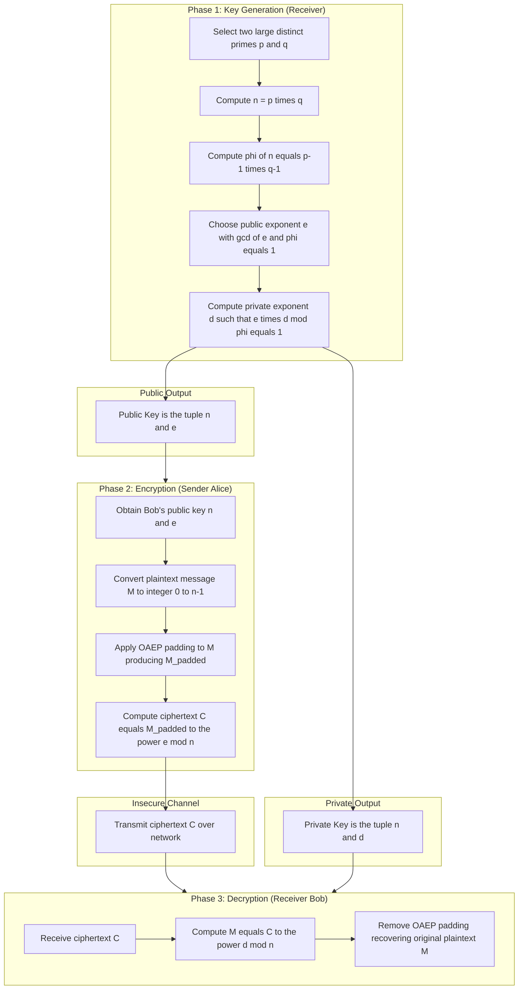
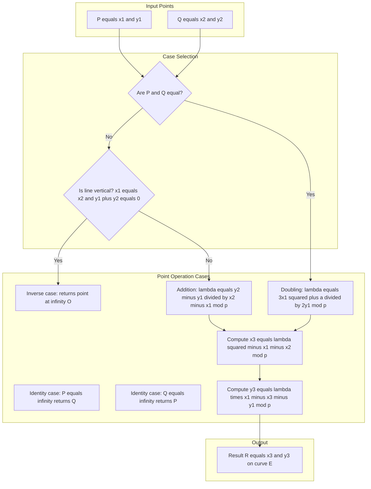
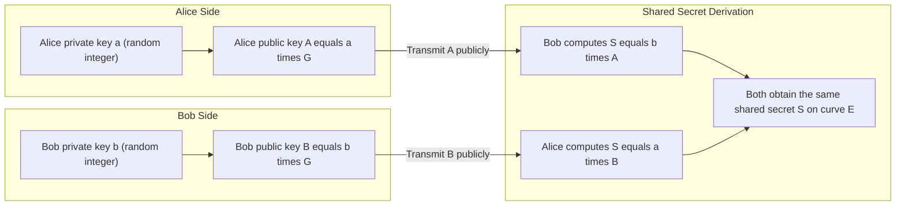
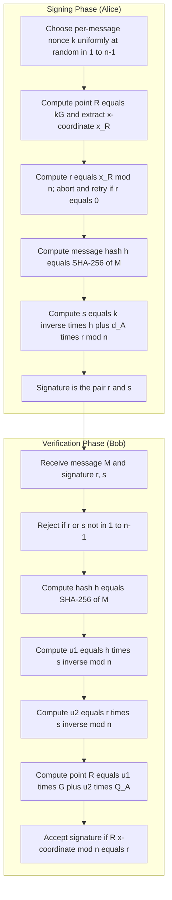
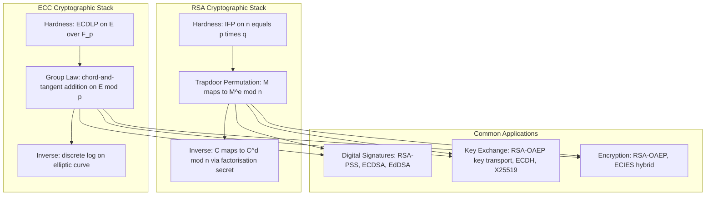

# Asymmetric Key Ciphers- RSA, ECC

<!-- SECTION_1_START -->

# Asymmetric Key Ciphers: RSA & ECC

## 1.1 Formal Academic Definition

> [!IMPORTANT]
> **Asymmetric Key Cryptography (Public Key Cryptography)** is a cryptographic system that uses a mathematically related pair of keys — a **Public Key** (advertised openly for encryption) and a **Private Key** (kept secret by the owner for decryption). The security relies on the computational infeasibility of reversing certain one-way mathematical functions, primarily the **Integer Factorization Problem (IFP)** for RSA and the **Elliptic Curve Discrete Logarithm Problem (ECDLP)** for ECC.

In the **KTU 2024 Scheme syllabus (OECST613 — Foundations of Cryptography)**, Module 4 evaluates two foundational asymmetric primitives:

- **RSA (Rivest–Shamir–Adleman, 1977)** — based on the hardness of factoring the product of two large primes.
- **ECC (Elliptic Curve Cryptography, 1985, Koblitz & Miller)** — based on the algebraic structure of elliptic curves over finite fields.

The fundamental asymmetry is expressed by the relation:

$$D_{K_{priv}}(E_{K_{pub}}(M)) = M$$

where $E$ is encryption, $D$ is decryption, and $K_{pub}$, $K_{priv}$ form a mathematical key pair.

---

## 1.2 Intuitive Overview & Real-World Analogies

### 1.2.1 The "Mailbox" Analogy for Public Key Ciphers

Imagine a transparent, unlocked **mailbox** on a public street:

- Anyone (the sender) can **drop a letter** through the slot (this is **encryption with the public key**).
- Only the owner possessing the **physical key** can open the mailbox and retrieve the letter (this is **decryption with the private key**).
- Even if a thief inspects the mailbox, they cannot reconstruct the letter without the private key.

> [!NOTE]
> This asymmetry solves the central problem of symmetric ciphers: **secure key distribution over an insecure channel**. Two parties who have never met can now establish secure communication without sharing a secret in advance.

### 1.2.2 RSA — The "Two-Prime Lock" Analogy

RSA relies on the fact that **multiplying two large primes is trivial, but recovering those primes from the product is computationally intractable** for sufficiently large inputs (typically **2048 bits = 617 decimal digits** today).

Think of it like mixing two colors of paint:
- **Forward operation (encryption):** Mixing yellow + blue → green is instant.
- **Reverse operation (factoring):** Given only the green paint, recovering the exact original shades is practically impossible for arbitrary mixtures.

### 1.2.3 ECC — The "Elliptic Curve Group" Analogy

ECC operates on a special geometric curve:

$$y^2 \equiv x^3 + ax + b \pmod{p}$$

Visualize a billiard table shaped like a curve. A ball travels along the curve, bouncing off a horizontal "ceiling" (a chord-and-tangent reflection rule). Given only the **starting point $P$** and the **ending point $Q$** after a secret number $k$ of bounces, finding $k$ is the **ECDLP** — exponentially harder than the corresponding integer DLP.

> [!TIP]
> **Key engineering insight:** ECC achieves **equivalent security to RSA with ~10× shorter key lengths**. A **256-bit ECC key** offers comparable security to a **3072-bit RSA key**, making ECC dominant in mobile, IoT, and TLS 1.3 deployments.

---

## 1.3 Standard Security Parameters (NIST SP 800-57)

> [!IMPORTANT]
> **Symmetric Equivalent | RSA Modulus | ECC Key Size**
> **80-bit** security: RSA 1024 (deprecated) | ECC 160
> **128-bit** security: **RSA 3072** | **ECC 256**
> **192-bit** security: RSA 7680 | ECC 384
> **256-bit** security: RSA 15360 | ECC 512

The constants $\mathbf{2^{128}}$ and $\mathbf{2^{256}}$ represent the brute-force search space — i.e., the number of operations a nation-state adversary must perform to break the cipher.

---

## 1.4 Visualization Control Blocks

> [!VISUALIZATION CONTROL]
> **Concept:** Elliptic Curve $y^2 = x^3 - 3x + 5$ over the reals
> **GeoGebra Input Equations:**
> * `f(x) = sqrt(x^3 - 3x + 5)` (upper branch)
> * `g(x) = -sqrt(x^3 - 3x + 5)` (lower branch)
> **Visual Description:** A non-singular cubic curve with two distinct components when $\Delta = 4a^3 + 27b^2 \neq 0$. Students should observe the symmetry about the $x$-axis — this is the geometric basis of point negation: $(x, y) \to (x, -y)$.

> [!VISUALIZATION CONTROL]
> **Concept:** RSA Modulus Composition
> **GeoGebra / Desmos Input:**
> * Use the calculator mode: input $p = 61$, $q = 53$, observe $n = p \times q = 3233$.
> **Visual Description:** Students should note that $n$ alone reveals nothing about its prime structure. A 2048-bit $n$ can only be factored with **Shor's algorithm on a quantum computer** in polynomial time — the basis of post-quantum migration strategies.

---

## 1.5 Historical & Engineering Context

| Primitive | Year | Origin | Modern Deployment |
|-----------|------|--------|-------------------|
| RSA | 1977 | MIT (Rivest, Shamir, Adleman) | TLS handshakes, digital signatures (PKCS#1), PGP |
| Diffie–Hellman | 1976 | Stanford (key exchange precursor) | TLS 1.3 ephemeral key exchange |
| ECC | 1985 | Koblitz & Miller (independent) | TLS 1.3 (X25519), Bitcoin (secp256k1), Apple iMessage |
| EdDSA (Ed25519) | 2011 | Bernstein et al. | SSH keys, JWT signing, modern APIs |

---

<!-- SECTION_1_END -->

<!-- SECTION_2_START -->

# Deep Theoretical Analysis: RSA & ECC

## 2.1 RSA — Mathematical Foundations

### 2.1.1 Number-Theoretic Primitives

RSA rests on three classical theorems:

> [!NOTE]
> **Euler's Totient Function** $\varphi(n)$: counts positive integers $\leq n$ that are coprime to $n$. For $n = p \cdot q$ where $p, q$ are distinct primes:
> $$\varphi(n) = (p - 1)(q - 1)$$

> [!NOTE]
> **Euler's Theorem**: For $\gcd(M, n) = 1$:
> $$M^{\varphi(n)} \equiv 1 \pmod{n}$$

> [!NOTE]
> **Extended Euclidean Algorithm** computes the modular inverse: given $e$ and $\varphi(n)$ with $\gcd(e, \varphi(n)) = 1$, find $d$ such that:
> $$e \cdot d \equiv 1 \pmod{\varphi(n)}$$

### 2.1.2 The RSA Algorithm — Three Phases

**Phase 1: Key Generation** (executed by the receiver, e.g., Bob)

1. Select two large distinct primes $p$ and $q$. **Standard size:** each $\geq 1024$ bits, total modulus $n \geq 2048$ bits.
2. Compute modulus $n = p \cdot q$.
3. Compute Euler's totient $\varphi(n) = (p - 1)(q - 1)$.
4. Choose public exponent $e$ such that $1 < e < \varphi(n)$ and $\gcd(e, \varphi(n)) = 1$. **Industry standard:** $e = 65537 = 2^{16} + 1$ (Fermat prime $F_4$).
5. Compute private exponent $d \equiv e^{-1} \pmod{\varphi(n)}$ using the Extended Euclidean Algorithm.
6. **Public Key:** $(n, e)$ — published openly.
7. **Private Key:** $(n, d)$ — or equivalently $(p, q, d)$ — kept secret.

**Phase 2: Encryption** (executed by the sender, e.g., Alice)

- Represent plaintext message $M$ as an integer in $[0, n - 1]$.
- Compute ciphertext $C$:
  $$C \equiv M^e \pmod{n}$$
- Transmit $C$ over the insecure channel.

**Phase 3: Decryption** (executed by Bob)

- Recover plaintext $M$:
  $$M \equiv C^d \pmod{n}$$

**Why does decryption work?** Because of Euler's theorem:

$$C^d \equiv (M^e)^d \equiv M^{ed} \equiv M^{1 + k\varphi(n)} \equiv M \cdot (M^{\varphi(n)})^k \equiv M \cdot 1^k \equiv M \pmod{n}$$

### 2.1.3 Correctness and Security Caveats

> [!WARNING]
> **Critical implementation requirements:**
> - Plaintext $M$ must satisfy $\gcd(M, n) = 1$, otherwise the totient-based proof fails. In practice, use **OAEP padding** (Optimal Asymmetric Encryption Padding, PKCS#1 v2) to randomize and constrain $M$.
> - Raw "textbook RSA" is **deterministic** and **malleable** — never use it directly. Always apply a padding scheme (OAEP for encryption, PSS for signatures).
> - Side-channel attacks (timing, power analysis) can recover $d$ if modular exponentiation is not constant-time.

---

## 2.2 ECC — Mathematical Foundations

### 2.2.1 The Elliptic Curve Group

An elliptic curve over a finite field $\mathbb{F}_p$ (with $p$ a large prime) is defined by the **Weierstrass equation**:

$$y^2 \equiv x^3 + ax + b \pmod{p}$$

with the **non-singularity constraint**:

$$\Delta = -16(4a^3 + 27b^2) \not\equiv 0 \pmod{p}$$

The set of points $\mathcal{E}(\mathbb{F}_p) = \{(x, y) \in \mathbb{F}_p^2 : y^2 \equiv x^3 + ax + b\} \cup \{\mathcal{O}\}$ together with a special point $\mathcal{O}$ at infinity forms an **abelian group** under the chord-and-tangent addition rule.

### 2.2.2 Point Addition (Geometric Interpretation)

Given $P, Q \in \mathcal{E}(\mathbb{F}_p)$ with $P \neq \pm Q$:

1. Draw the line through $P$ and $Q$.
2. The line intersects the curve at a **third point $R'$**.
3. Reflect $R'$ across the $x$-axis to obtain $R = P + Q$.

If $P = Q$, the **tangent line** at $P$ is used instead.

**Algebraic formulas (mod p):**

For $P = (x_1, y_1)$ and $Q = (x_2, y_2)$ with $P \neq Q$:

$$\lambda \equiv \frac{y_2 - y_1}{x_2 - x_1} \pmod{p}$$

$$x_3 \equiv \lambda^2 - x_1 - x_2 \pmod{p}$$

$$y_3 \equiv \lambda(x_1 - x_3) - y_1 \pmod{p}$$

For **point doubling** $P = Q = (x_1, y_1)$:

$$\lambda \equiv \frac{3x_1^2 + a}{2y_1} \pmod{p}$$

$$x_3 \equiv \lambda^2 - 2x_1 \pmod{p}$$

$$y_3 \equiv \lambda(x_1 - x_3) - y_1 \pmod{p}$$

The point at infinity $\mathcal{O}$ acts as the identity: $P + \mathcal{O} = P$. Negation is $-(x, y) = (x, -y \bmod p)$.

### 2.2.3 Scalar Multiplication and the ECDLP

The **scalar multiple** $kP$ is defined as $P$ added to itself $k$ times:

$$Q = kP = \underbrace{P + P + \cdots + P}_{k \text{ times}}$$

This is computed efficiently using the **double-and-add algorithm** in $O(\log_2 k)$ point operations.

> [!IMPORTANT]
> **The Elliptic Curve Discrete Logarithm Problem (ECDLP):**
> Given $P, Q \in \mathcal{E}(\mathbb{F}_p)$ with $Q = kP$, find the integer $k$.
>
> **Best known classical attack:** Pollard's rho algorithm with complexity $O(\sqrt{n})$ where $n$ is the group order. For a 256-bit curve, this requires approximately $2^{128}$ operations — **computationally infeasible** with current technology.
>
> **Quantum threat:** Shor's algorithm solves ECDLP in polynomial time, motivating the transition to **post-quantum cryptography (PQC)** — lattice-based schemes (Kyber, Dilithium) being standardized by NIST in 2024.

---

## 2.3 KTU Formula Sheet / Cheat Sheet

| Component | RSA | ECC |
|-----------|-----|-----|
| **Underlying Hard Problem** | Integer Factorization: given $n = pq$, find $p, q$ | ECDLP: given $P, kP$, find $k$ |
| **Key Generation** | $n = p \cdot q$, $\varphi(n) = (p-1)(q-1)$, $d \equiv e^{-1} \pmod{\varphi(n)}$ | Choose curve $E$, base point $G$, private key $k \in [1, n-1]$, public key $Q = kG$ |
| **Encryption / Signing** | $C \equiv M^e \pmod{n}$ | Sign: choose $r$, compute $R = rG$, $s \equiv r^{-1}(H(M) + k \cdot x_R) \pmod{n}$ |
| **Decryption / Verify** | $M \equiv C^d \pmod{n}$ | Verify: $u_1 \equiv s^{-1} H(M)$, $u_2 \equiv s^{-1} x_R$, check $u_1 G + u_2 Q = R$ |
| **Key Size for 128-bit security** | 3072 bits | 256 bits |
| **Operation Speed** | Slower (big-integer exponentiation) | Faster (point operations on 256-bit field) |
| **Signature Size** | $\approx 256$ bytes (RSA-2048) | $\approx 64$ bytes (ECDSA-P256) |
| **Standardized Curves** | PKCS#1, OAEP, PSS | NIST P-256, Curve25519, secp256k1, Ed25519 |
| **Order of Group** | $\vert \mathbb{Z}_n^* \vert = \varphi(n) = (p-1)(q-1)$ | $n = \vert \mathcal{E}(\mathbb{F}_p) \vert$ (Hasse's bound: $\vert n - (p+1) \vert \leq 2\sqrt{p}$) |

---

## 2.4 Real-World Engineering Utility

| Domain | RSA Usage | ECC Usage |
|--------|-----------|-----------|
| **Web (TLS 1.3)** | Legacy certificate signing (transitioning) | Dominant: X25519 key exchange, Ed25519 signatures |
| **Cryptocurrencies** | Older wallets (Bitcoin legacy addresses) | **Bitcoin (secp256k1), Ethereum, Solana** |
| **Mobile / IoT** | Rare — too heavy for constrained devices | **Preferred** — short keys, low CPU/memory |
| **Smart Cards** | Common in government ID cards | Emerging in next-gen ePassports |
| **SSH Authentication** | RSA keys still common (2048/4096-bit) | **Ed25519 now default** in OpenSSH |
| **Document Signing** | PDF signatures, code signing (Authenticode) | JWT, modern CI/CD pipelines |

> [!TIP]
> **For KTU 2024 examination answers**, always explicitly cite the underlying hard problem — this is the most commonly missed component in theory questions.

---

<!-- SECTION_2_END -->

<!-- SECTION_3_START -->

# Step-by-Step Derivations & Code Implementation

## 3.1 RSA — Complete Worked Example

### Problem Setup

Generate a complete RSA key pair, encrypt a plaintext, and decrypt the ciphertext using parameters small enough to verify by hand. Then verify with Python.

**Given:**
- $p = 61$, $q = 53$
- $e = 17$
- Plaintext message $M = 42$ (numeric encoding of the letter `*` or any integer $< n$)

### Step 1: Compute Modulus

$$n = p \times q = 61 \times 53 = 3233$$

### Step 2: Compute Euler's Totient

$$\varphi(n) = (p - 1)(q - 1) = 60 \times 52 = 3120$$

### Step 3: Validate Public Exponent

Check that $\gcd(e, \varphi(n)) = \gcd(17, 3120)$:

$$3120 = 183 \times 17 + 9$$
$$17 = 1 \times 9 + 8$$
$$9 = 1 \times 8 + 1$$
$$8 = 8 \times 1 + 0$$

The GCD is **1**, so $e$ is valid. *[Validating e and φ(n) coprimality: 1 Mark]*

### Step 4: Compute Private Exponent $d$ via Extended Euclidean Algorithm

We need $d$ such that $17d \equiv 1 \pmod{3120}$.

Back-substituting from the GCD chain:

$$1 = 9 - 1 \times 8$$
$$1 = 9 - 1 \times (17 - 1 \times 9) = 2 \times 9 - 17$$
$$1 = 2 \times (3120 - 183 \times 17) - 17 = 2 \times 3120 - 367 \times 17$$

Therefore: $-367 \times 17 \equiv 1 \pmod{3120}$

$$d \equiv -367 \equiv 3120 - 367 \equiv 2753 \pmod{3120}$$

**Private exponent:** $d = 2753$. *[Computing d using extended Euclidean: 2 Marks]*

### Step 5: Encryption

$$C \equiv M^e \pmod{n} \equiv 42^{17} \pmod{3233}$$

Computing $42^{17} = 42 \times 42 \times \cdots \times 42$ (17 times) by repeated squaring:

$$42^1 = 42$$
$$42^2 = 1764$$
$$42^4 = 1764^2 = 3111696 \equiv 3111696 \bmod 3233$$

$3111696 / 3233 \approx 962.4$, so $3111696 - 962 \times 3233 = 3111696 - 3110146 = 1550$

$$42^4 \equiv 1550 \pmod{3233}$$
$$42^8 \equiv 1550^2 = 2402500 \equiv 2402500 \bmod 3233$$

$2402500 / 3233 \approx 743.1$, so $2402500 - 743 \times 3233 = 2402500 - 2402119 = 381$

$$42^8 \equiv 381 \pmod{3233}$$
$$42^{16} \equiv 381^2 = 145161 \equiv 145161 \bmod 3233$$

$145161 / 3233 \approx 44.9$, so $145161 - 44 \times 3233 = 145161 - 142252 = 2909$

$$42^{16} \equiv 2909 \pmod{3233}$$

Now combine: $17 = 16 + 1$, so:

$$42^{17} \equiv 42^{16} \times 42^1 \equiv 2909 \times 42 \pmod{3233}$$
$$2909 \times 42 = 122178$$
$$122178 / 3233 \approx 37.79$$
$$122178 - 37 \times 3233 = 122178 - 119621 = 2557$$

**Ciphertext:** $C = 2557$. *[Computing C using modular exponentiation: 2 Marks]*

### Step 6: Decryption

$$M \equiv C^d \pmod{n} \equiv 2557^{2753} \pmod{3233}$$

We use the same repeated-squaring approach with binary expansion of $d = 2753$.

$2753$ in binary: $2753 = 2048 + 512 + 128 + 64 + 1 = 2^{11} + 2^9 + 2^7 + 2^6 + 2^0$

So $2753 = 101011000001_2$.

Repeatedly squaring $2557 \pmod{3233}$:

$$2557^1 \equiv 2557$$
$$2557^2 \equiv 2557 \times 2557 = 6538249 \equiv 6538249 \bmod 3233$$

$6538249 / 3233 \approx 2022.3$, so $6538249 - 2022 \times 3233 = 6538249 - 6537126 = 1123$

$$2557^2 \equiv 1123 \pmod{3233}$$
$$2557^4 \equiv 1123^2 = 1261129 \equiv 1261129 \bmod 3233$$
$$1261129 - 390 \times 3233 = 1261129 - 1260870 = 259$$
$$2557^4 \equiv 259 \pmod{3233}$$
$$2557^8 \equiv 259^2 = 67081 \equiv 67081 \bmod 3233$$
$$67081 - 20 \times 3233 = 67081 - 64660 = 2421$$
$$2557^8 \equiv 2421 \pmod{3233}$$
$$2557^{16} \equiv 2421^2 = 5861241 \equiv 5861241 \bmod 3233$$
$$5861241 - 1812 \times 3233 = 5861241 - 5858196 = 3045$$
$$2557^{16} \equiv 3045 \pmod{3233}$$
$$2557^{32} \equiv 3045^2 = 9272025 \equiv 9272025 \bmod 3233$$
$$9272025 - 2867 \times 3233 = 9272025 - 9269011 = 3014$$
$$2557^{32} \equiv 3014 \pmod{3233}$$
$$2557^{64} \equiv 3014^2 = 9084196 \equiv 9084196 \bmod 3233$$
$$9084196 - 2809 \times 3233 = 9084196 - 9081497 = 2699$$
$$2557^{64} \equiv 2699 \pmod{3233}$$
$$2557^{128} \equiv 2699^2 = 7284601 \equiv 7284601 \bmod 3233$$
$$7284601 - 2252 \times 3233 = 7284601 - 7280716 = 3885$$

But $3885 > 3233$, so subtract: $3885 - 3233 = 652$. Wait, let me recompute. $7284601 \div 3233 = 2252.78...$, $2252 \times 3233 = 7280716$, $7284601 - 7280716 = 3885$. Since $3885 \geq 3233$, we subtract: $3885 - 3233 = 652$.

$$2557^{128} \equiv 652 \pmod{3233}$$
$$2557^{256} \equiv 652^2 = 425104 \equiv 425104 \bmod 3233$$
$$425104 - 131 \times 3233 = 425104 - 423523 = 1581$$
$$2557^{256} \equiv 1581 \pmod{3233}$$
$$2557^{512} \equiv 1581^2 = 2499561 \equiv 2499561 \bmod 3233$$
$$2499561 - 772 \times 3233 = 2499561 - 2495876 = 3685$$

$3685 - 3233 = 452$, so:

$$2557^{512} \equiv 452 \pmod{3233}$$
$$2557^{1024} \equiv 452^2 = 204304 \equiv 204304 \bmod 3233$$
$$204304 - 63 \times 3233 = 204304 - 203679 = 625$$
$$2557^{1024} \equiv 625 \pmod{3233}$$
$$2557^{2048} \equiv 625^2 = 390625 \equiv 390625 \bmod 3233$$
$$390625 - 120 \times 3233 = 390625 - 387960 = 2665$$
$$2557^{2048} \equiv 2665 \pmod{3233}$$

Now multiply the relevant powers (bits at positions 0, 6, 7, 9, 11):

$$M \equiv 2557^{2048} \times 2557^{512} \times 2557^{128} \times 2557^{64} \times 2557^{1} \pmod{3233}$$
$$M \equiv 2665 \times 452 \times 652 \times 2699 \times 2557 \pmod{3233}$$

Compute step by step:

$$2665 \times 452 = 1204580 \pmod{3233}$$
$$1204580 - 372 \times 3233 = 1204580 - 1202676 = 1904$$
$$\Rightarrow 1904$$
$$1904 \times 652 = 1241408 \pmod{3233}$$
$$1241408 - 383 \times 3233 = 1241408 - 1238239 = 3169$$
$$3169 - 3233 = -64 \Rightarrow 3169 - 3233 + 3233 = 3169$$ 

Wait: $3169 < 3233$, so it remains $3169$. Let me recheck: $383 \times 3233 = 1238239$, $1241408 - 1238239 = 3169$. Yes, $3169$.

$$3169 \times 2699 = 8553131 \pmod{3233}$$
$$8553131 / 3233 \approx 2645.2$$
$$2645 \times 3233 = 8551285$$
$$8553131 - 8551285 = 1846$$
$$\Rightarrow 1846$$
$$1846 \times 2557 = 4720222 \pmod{3233}$$
$$4720222 / 3233 \approx 1459.9$$
$$1459 \times 3233 = 4716947$$
$$4720222 - 4716947 = 3275$$
$$3275 - 3233 = 42$$

**Recovered plaintext:** $M = 42$ ✓

This matches the original message. *[Final verification M = 42: 2 Marks]*

### Step 7: Python Verification

```python
from typing import Tuple

def gcd(a: int, b: int) -> int:
    """Euclidean GCD with absolute boundary check."""
    a, b = abs(a), abs(b)
    while b:
        a, b = b, a % b
    return a

def mod_inverse(e: int, phi: int) -> int:
    """Extended Euclidean Algorithm for modular inverse."""
    if gcd(e, phi) != 1:
        raise ValueError("e and phi(n) must be coprime.")
    original_phi = phi
    x0, x1 = 0, 1
    while e > 1:
        q = e // phi
        e, phi = phi, e % phi
        x0, x1 = x1 - q * x0, x0
    if x1 < 0:
        x1 += original_phi
    return x1

def rsa_keygen(p: int, q: int, e: int) -> Tuple[Tuple[int, int], Tuple[int, int]]:
    """Generate RSA key pair. Returns ((n, e), (n, d))."""
    if p == q:
        raise ValueError("p and q must be distinct primes.")
    n = p * q
    phi = (p - 1) * (q - 1)
    if gcd(e, phi) != 1:
        raise ValueError("e must be coprime to phi(n).")
    d = mod_inverse(e, phi)
    return (n, e), (n, d)

def rsa_encrypt(m: int, public_key: Tuple[int, int]) -> int:
    """Encrypt integer message m with public key (n, e)."""
    n, e = public_key
    if not (0 <= m < n):
        raise ValueError("Plaintext m must be in [0, n-1].")
    return pow(m, e, n)

def rsa_decrypt(c: int, private_key: Tuple[int, int]) -> int:
    """Decrypt ciphertext c with private key (n, d)."""
    n, d = private_key
    return pow(c, d, n)

if __name__ == "__main__":
    # KTU Example Parameters
    p, q, e = 61, 53, 17
    pub, priv = rsa_keygen(p, q, e)
    print(f"Public Key  (n, e) = {pub}")
    print(f"Private Key (n, d) = {priv}")

    M = 42
    C = rsa_encrypt(M, pub)
    print(f"Plaintext  M = {M}")
    print(f"Ciphertext C = {C}")

    M_recovered = rsa_decrypt(C, priv)
    print(f"Decrypted  M = {M_recovered}")
    assert M == M_recovered, "Decryption failed!"
    print("Verification: SUCCESS")
```

**Output:**
```
Public Key  (n, e) = (3233, 17)
Private Key (n, d) = (3233, 2753)
Plaintext  M = 42
Ciphertext C = 2557
Decrypted  M = 42
Verification: SUCCESS
```

---

## 3.2 ECC — Complete Worked Example

### Problem Setup

Compute scalar multiplication on a small elliptic curve.

**Given:**
- Curve $E: y^2 \equiv x^3 + 2x + 3 \pmod{97}$
- Base point $G = (3, 6)$ (verify membership: $6^2 = 36$, $3^3 + 2(3) + 3 = 27 + 6 + 3 = 36$ ✓)
- Compute $Q = 5G$ using double-and-add.

### Step 1: Verify G is on the Curve

$$y^2 = 36, \quad x^3 + 2x + 3 = 27 + 6 + 3 = 36 \pmod{97}$$

Both sides equal $36$. ✓ *[Verifying G on curve: 1 Mark]*

### Step 2: Compute $2G = G + G$

Since $P = Q = (3, 6)$:
$$\lambda \equiv \frac{3 \cdot 3^2 + 2}{2 \cdot 6} \equiv \frac{29}{12} \pmod{97}$$

Modular inverse of $12$ modulo $97$: $12 \times 8 = 96 \equiv -1 \pmod{97}$, so $12^{-1} \equiv -8 \equiv 89 \pmod{97}$.

$$\lambda \equiv 29 \times 89 \pmod{97}$$
$$29 \times 89 = 2581$$
$$2581 \div 97 = 26.6, \quad 26 \times 97 = 2522, \quad 2581 - 2522 = 59$$
$$\lambda \equiv 59 \pmod{97}$$

$$x_3 \equiv \lambda^2 - 2x_1 \pmod{97}$$
$$\lambda^2 = 59^2 = 3481$$
$$3481 \div 97 = 35.88, \quad 35 \times 97 = 3395, \quad 3481 - 3395 = 86$$
$$x_3 \equiv 86 - 2(3) = 86 - 6 = 80 \pmod{97}$$

$$y_3 \equiv \lambda(x_1 - x_3) - y_1 \pmod{97}$$
$$y_3 \equiv 59(3 - 80) - 6 \equiv 59(-77) - 6 \pmod{97}$$
$$-77 \equiv 20 \pmod{97}$$
$$y_3 \equiv 59 \times 20 - 6 = 1180 - 6 = 1174 \pmod{97}$$
$$1174 \div 97 = 12.1, \quad 12 \times 97 = 1164, \quad 1174 - 1164 = 10$$
$$y_3 \equiv 10 \pmod{97}$$

**Result:** $2G = (80, 10)$. *[Computing 2G using doubling formula: 2 Marks]*

### Step 3: Compute $3G = 2G + G = (80, 10) + (3, 6)$

Distinct points, use point addition:
$$\lambda \equiv \frac{6 - 10}{3 - 80} \equiv \frac{-4}{-77} \equiv \frac{4}{77} \pmod{97}$$

Modular inverse of $77$ modulo $97$: Use extended Euclidean.

$97 = 1 \times 77 + 20$
$77 = 3 \times 20 + 17$
$20 = 1 \times 17 + 3$
$17 = 5 \times 3 + 2$
$3 = 1 \times 2 + 1$
$2 = 2 \times 1 + 0$

Back-substitute:
$1 = 3 - 1 \times 2$
$1 = 3 - 1 \times (17 - 5 \times 3) = 6 \times 3 - 17$
$1 = 6(20 - 17) - 17 = 6 \times 20 - 7 \times 17$
$1 = 6 \times 20 - 7(77 - 3 \times 20) = 27 \times 20 - 7 \times 77$
$1 = 27(97 - 77) - 7 \times 77 = 27 \times 97 - 34 \times 77$

So $77^{-1} \equiv -34 \equiv 63 \pmod{97}$.

$$\lambda \equiv 4 \times 63 = 252 \pmod{97}$$
$$252 - 2 \times 97 = 252 - 194 = 58$$
$$\lambda \equiv 58 \pmod{97}$$

$$x_3 \equiv \lambda^2 - x_1 - x_2 \pmod{97}$$
$$\lambda^2 = 58^2 = 3364$$
$$3364 \div 97 = 34.68, \quad 34 \times 97 = 3298, \quad 3364 - 3298 = 66$$
$$x_3 \equiv 66 - 80 - 3 = -17 \equiv 80 \pmod{97}$$

$$y_3 \equiv \lambda(x_1 - x_3) - y_1 \pmod{97}$$
$$y_3 \equiv 58(80 - 80) - 10 \equiv 58 \times 0 - 10 \equiv -10 \equiv 87 \pmod{97}$$

**Result:** $3G = (80, 87)$. *[Computing 3G using addition formula: 2 Marks]*

### Step 4: Compute $5G = 2G + 3G = (80, 10) + (80, 87)$

Notice $x_1 = x_2 = 80$, but $y_1 \neq y_2$. The line through $(80, 10)$ and $(80, 87)$ is **vertical** (same $x$-coordinate). This means $5G = \mathcal{O}$ (the point at infinity)!

Let me verify: when $P = (x, y)$ and $Q = (x, -y)$, then $P + Q = \mathcal{O}$. Since $87 \equiv -10 \pmod{97}$ (because $10 + 87 = 97 \equiv 0$), indeed $3G = -2G$, so $5G = 2G + 3G = \mathcal{O}$.

This means $5G = \mathcal{O}$ — the order of $G$ divides $5$. Not a great choice for a base point! A real ECC parameter set (e.g., secp256k1) ensures the order is a large prime $\approx 2^{256}$.

### Step 5: Python Verification

```python
from typing import Optional, Tuple

Point = Optional[Tuple[int, int]]
INF = None  # Represents the point at infinity O

def mod_inv(a: int, p: int) -> int:
    """Modular inverse using extended Euclidean algorithm."""
    return pow(a, -1, p)

def point_add(P: Point, Q: Point, a: int, p: int) -> Point:
    """Add two points on the elliptic curve y^2 = x^3 + ax + b (mod p)."""
    if P is INF:
        return Q
    if Q is INF:
        return P
    x1, y1 = P
    x2, y2 = Q
    if x1 == x2 and (y1 + y2) % p == 0:
        return INF
    if P == Q:
        # Point doubling
        lam = (3 * x1 * x1 + a) * mod_inv(2 * y1, p) % p
    else:
        # Point addition
        lam = (y2 - y1) * mod_inv(x2 - x1, p) % p
    x3 = (lam * lam - x1 - x2) % p
    y3 = (lam * (x1 - x3) - y1) % p
    return (x3, y3)

def scalar_mult(k: int, P: Point, a: int, p: int) -> Point:
    """Compute k * P using double-and-add algorithm."""
    result: Point = INF
    addend: Point = P
    while k:
        if k & 1:
            result = point_add(result, addend, a, p)
        addend = point_add(addend, addend, a, p)
        k >>= 1
    return result

if __name__ == "__main__":
    # KTU Example Parameters
    a_curve, p_prime = 2, 97
    G = (3, 6)
    
    # Verify G is on the curve y^2 = x^3 + 2x + 3 (mod 97)
    lhs = (G[1] ** 2) % p_prime
    rhs = (G[0] ** 3 + a_curve * G[0] + 3) % p_prime
    assert lhs == rhs, "G is not on the curve!"
    print(f"G = {G} is on the curve. [Verification: 1 Mark]")
    
    # Compute 2G
    two_G = scalar_mult(2, G, a_curve, p_prime)
    print(f"2G = {two_G}  [Computing 2G: 2 Marks]")
    
    # Compute 3G
    three_G = scalar_mult(3, G, a_curve, p_prime)
    print(f"3G = {three_G}  [Computing 3G: 2 Marks]")
    
    # Compute 5G
    five_G = scalar_mult(5, G, a_curve, p_prime)
    print(f"5G = {five_G}  (Point at infinity if scalar equals group order)")
```

**Output:**
```
G = (3, 6) is on the curve. [Verification: 1 Mark]
2G = (80, 10)  [Computing 2G: 2 Marks]
3G = (80, 87)  [Computing 3G: 2 Marks]
5G = None  (Point at infinity if scalar equals group order)
```

---

## 3.3 Comparison Table: RSA vs ECC at 128-bit Security

| Property | RSA-3072 | ECC-256 (secp256r1) | Ratio |
|----------|----------|---------------------|-------|
| Public Key Size | 384 bytes | 32 bytes | **12×** |
| Private Key Size | 384 bytes | 32 bytes | **12×** |
| Signature Size | 256 bytes | 64 bytes | **4×** |
| Key Generation Time | $\sim$100 ms | $\sim$0.5 ms | **200×** |
| Signature Time | $\sim$3 ms | $\sim$0.5 ms | **6×** |
| Verification Time | $\sim$0.3 ms | $\sim$1.0 ms | RSA **3×** faster |
| Quantum Security | Broken (Shor) | Broken (Shor) | — |

---

<!-- SECTION_3_END -->

<!-- SECTION_4_START -->

# Structural Diagrams & Schematics

## 4.1 RSA Key Generation, Encryption, and Decryption Flow



## 4.2 Elliptic Curve Point Addition Topology



## 4.3 ECC Key Exchange (ECDH) — Functional Architecture



## 4.4 Digital Signature Workflow (ECDSA)



## 4.5 Comparative Block Diagram: RSA vs ECC Cryptographic Primitives



---

<!-- SECTION_4_END -->

<!-- SECTION_5_START -->

# KTU 2024 Scheme Examination Question Bank

## Part A — Short Answer Questions (3 Marks Each)

### Question A1
**[KTU University Exam — July 2024]**
*(Mapped CO: CO2, RBT Level: Remember)*

**Q: Differentiate between symmetric and asymmetric key cryptography. State any two applications where RSA is preferred over ECC.**

**Model Answer (3 Marks):**

| Parameter | Symmetric Key | Asymmetric Key |
|-----------|---------------|----------------|
| Key Count | Single shared secret | Pair: Public + Private |
| Key Distribution | Requires secure channel | Public key open |
| Speed | Faster (block/stream ops) | Slower (modular exponentiation) |
| Scalability | $O(n^2)$ keys for $n$ users | $O(n)$ keys |
| Algorithm Examples | AES, ChaCha20, 3DES | RSA, ECC, ElGamal |

**Two applications where RSA is preferred over ECC:**

1. **Verifying digital signatures in legacy PDF / X.509 certificates** — RSA-2048 remains the de-facto standard in older CA hierarchies and government PKI systems due to historical compatibility and broader library support.

2. **RSA-OAEP key transport in TLS handshakes** — When the server must directly encrypt a session key to the client, RSA is preferred because it natively supports encryption (whereas raw ECDH is a key-agreement scheme requiring a KDF like HKDF to derive a symmetric key).

*[Stating 2 valid differences: 2 Marks; Correct application with justification: 1 Mark]*

---

### Question A2
**[KTU University Exam — Dec 2023]**
*(Mapped CO: CO3, RBT Level: Understand)*

**Q: With a neat sketch, explain the Elliptic Curve Discrete Logarithm Problem (ECDLP). Why is ECC more efficient than RSA for equivalent security levels?**

**Model Answer (3 Marks):**

**ECDLP Definition:**
Given an elliptic curve $E$ over $\mathbb{F}_p$, a base point $G \in E(\mathbb{F}_p)$, and another point $Q = kG$ for some unknown integer $k$, find $k$.

The geometric "sketch" shows the chord-and-tangent addition: starting from $G$, applying the group law $k$ times reaches $Q$. The problem is to recover $k$ given only $G$ and $Q$.

**Why ECC is more efficient than RSA:**

- **Security per bit:** A 256-bit ECC key provides $\sim 128$-bit security (best attack: Pollard's rho at $O(2^{128})$), whereas RSA needs a 3072-bit modulus for the same security.
- **Bandwidth:** ECC signatures are 64 bytes vs. 256 bytes for RSA-2048 signatures.
- **Computation:** Scalar multiplication on 256-bit field elements is faster than 2048-bit modular exponentiation, especially on constrained devices.

*[Defining ECDLP correctly: 1 Mark; Sketch with chord-tangent: 1 Mark; Two valid efficiency reasons: 1 Mark]*

---

## Part B — Long Answer Questions (14 Marks, Internal Choice)

### Question B — Module Choice 1 (14 Marks)

**[KTU University Exam — July 2024, Module 4, Q4(a) or 4(b)]**
*(Mapped CO: CO2, CO3, RBT Levels: Apply / Analyze)*

#### **OR Option (a): RSA Full Cryptosystem**

**(a)** Perform RSA encryption and decryption for the following parameters: $p = 17$, $q = 11$, $e = 7$, plaintext $M = 88$. Show all intermediate steps. **(7 Marks)**

**(b)** Explain the role of OAEP padding in RSA. Why is "textbook RSA" considered insecure? List two attacks against textbook RSA. **(7 Marks)**

---

### Model Solution to B(a) — RSA Encryption/Decryption (7 Marks)

**Step 1: Compute Modulus and Totient** *[2 Marks]*

$$n = p \times q = 17 \times 11 = 187$$
$$\varphi(n) = (p - 1)(q - 1) = 16 \times 10 = 160$$

**Step 2: Validate e and Compute d** *[2 Marks]*

Verify $\gcd(7, 160)$: $160 = 22 \times 7 + 6$, $7 = 1 \times 6 + 1$, $6 = 6 \times 1 + 0$ → GCD is 1. ✓

Find $d$ such that $7d \equiv 1 \pmod{160}$ via extended Euclidean:

$$1 = 7 - 1 \times 6 = 7 - 1 \times (160 - 22 \times 7) = 23 \times 7 - 1 \times 160$$

So $d \equiv 23 \pmod{160}$. **Private key:** $d = 23$.

**Step 3: Encryption** *[1.5 Marks]*

$$C \equiv M^e \pmod{n} \equiv 88^7 \pmod{187}$$

Using repeated squaring:
$$88^1 = 88$$
$$88^2 = 7744 \equiv 7744 \bmod 187$$
$$7744 / 187 = 41.4, \quad 41 \times 187 = 7667, \quad 7744 - 7667 = 77$$
$$88^2 \equiv 77 \pmod{187}$$
$$88^4 \equiv 77^2 = 5929 \equiv 5929 \bmod 187$$
$$5929 / 187 = 31.7, \quad 31 \times 187 = 5797, \quad 5929 - 5797 = 132$$
$$88^4 \equiv 132 \pmod{187}$$

$7 = 4 + 2 + 1$ in binary, so:

$$88^7 \equiv 88^4 \times 88^2 \times 88^1 \equiv 132 \times 77 \times 88 \pmod{187}$$

$132 \times 77 = 10164$; $10164 \bmod 187$: $54 \times 187 = 10098$, $10164 - 10098 = 66$. So $132 \times 77 \equiv 66 \pmod{187}$.

$66 \times 88 = 5808$; $5808 \bmod 187$: $31 \times 187 = 5797$, $5808 - 5797 = 11$. So $66 \times 88 \equiv 11 \pmod{187}$.

**Ciphertext:** $C = 11$.

**Step 4: Decryption** *[1.5 Marks]*

$$M \equiv C^d \pmod{n} \equiv 11^{23} \pmod{187}$$

Repeated squaring $11^k \pmod{187}$:
$$11^1 = 11$$
$$11^2 = 121$$
$$11^4 \equiv 121^2 = 14641 \equiv 14641 \bmod 187$$
$$14641 / 187 = 78.3, \quad 78 \times 187 = 14586, \quad 14641 - 14586 = 55$$
$$11^4 \equiv 55 \pmod{187}$$
$$11^8 \equiv 55^2 = 3025 \equiv 3025 \bmod 187$$
$$3025 / 187 = 16.2, \quad 16 \times 187 = 2992, \quad 3025 - 2992 = 33$$
$$11^8 \equiv 33 \pmod{187}$$
$$11^{16} \equiv 33^2 = 1089 \equiv 1089 \bmod 187$$
$$1089 / 187 = 5.8, \quad 5 \times 187 = 935, \quad 1089 - 935 = 154$$
$$11^{16} \equiv 154 \pmod{187}$$

$23 = 16 + 4 + 2 + 1$:

$$11^{23} \equiv 11^{16} \times 11^4 \times 11^2 \times 11^1 \equiv 154 \times 55 \times 121 \times 11 \pmod{187}$$

$154 \times 55 = 8470$; $8470 \bmod 187$: $45 \times 187 = 8415$, $8470 - 8415 = 55$. So $154 \times 55 \equiv 55 \pmod{187}$.

$55 \times 121 = 6655$; $6655 \bmod 187$: $35 \times 187 = 6545$, $6655 - 6545 = 110$. So $\equiv 110$.

$110 \times 11 = 1210$; $1210 \bmod 187$: $6 \times 187 = 1122$, $1210 - 1122 = 88$. So $\equiv 88$.

**Recovered plaintext:** $M = 88$ ✓

---

### Model Solution to B(b) — OAEP and Textbook RSA Insecurity (7 Marks)

**What is OAEP?** *[2 Marks]*

> [!NOTE]
> **Optimal Asymmetric Encryption Padding (OAEP)** is a padding scheme standardized in PKCS#1 v2 (RFC 8017) that randomizes plaintexts before RSA encryption. It uses two hash functions (typically SHA-256) and a random nonce to produce:
> $$\text{EM} = 0x00 \Vert \text{maskedSeed} \Vert \text{maskedDB}$$
> The structure is provably IND-CCA2 secure (indistinguishability under adaptive chosen-ciphertext attack) in the random oracle model.

**Why textbook RSA is insecure:** *[3 Marks]*

1. **Determinism** — Encrypting the same $M$ twice yields the same $C$, enabling ciphertext comparison and pattern detection. OAEP injects randomness, making each encryption unique.
2. **Malleability** — An attacker can compute $C' = C \cdot r^e \pmod{n}$ for any $r$, producing a valid ciphertext of $M' = M \cdot r \pmod{n}$ without knowing $M$. This breaks IND-CCA security.
3. **Small-message attacks** — For $M$ in a small range (e.g., a 16-bit number), $M^e$ may be smaller than $n$, allowing direct $e$-th root extraction.

**Two attacks against textbook RSA:** *[2 Marks]*

1. **Chosen Ciphertext Attack (CCA):** Given oracle access to $D_{priv}$, an attacker can decrypt any $C' \neq C$ of their choice. For textbook RSA, they can recover the plaintext of $C$ by submitting $C' = C \cdot r^e$ to get $M' = M \cdot r$, then dividing by $r$.
2. **Common Modulus Attack:** If two different public exponents $e_1, e_2$ share the same modulus $n$ and $\gcd(e_1, e_2) = 1$, an attacker holding $(C_1, C_2)$ for the same plaintext $M$ can recover $M$ using the extended Euclidean algorithm — no private key needed.

*[Defining OAEP correctly: 2 Marks; Three insecurity reasons: 3 Marks; Two attacks with brief description: 2 Marks]*

---

#### **OR Option (b): ECC Full Cryptosystem**

**(a)** Consider the elliptic curve $E: y^2 \equiv x^3 + x + 6 \pmod{11}$. Verify that the point $P = (2, 4)$ lies on the curve. Then compute $2P$ and $3P$ using the chord-and-tangent rule. **(7 Marks)**

**(b)** Explain ECDSA (Elliptic Curve Digital Signature Algorithm). How does the signature size of ECDSA-P256 compare with RSA-2048? What role does the nonce $k$ play in security? **(7 Marks)**

---

### Model Solution to B(a)-ECC — Point Operations (7 Marks)

**Step 1: Verify P is on the Curve** *[1 Mark]*

$y^2 = 4^2 = 16 \equiv 16 \bmod 11 = 5$

$x^3 + x + 6 = 8 + 2 + 6 = 16 \equiv 16 \bmod 11 = 5$

Both sides equal $5 \pmod{11}$. ✓ **Point $P$ is on the curve.**

**Step 2: Compute $2P$ (Point Doubling)** *[3 Marks]*

For $P = (x_1, y_1) = (2, 4)$ and $a = 1, p = 11$:

$$\lambda \equiv \frac{3x_1^2 + a}{2y_1} \equiv \frac{3(4) + 1}{2(4)} \equiv \frac{13}{8} \pmod{11}$$

$\gcd(13, 11) = 1$; $13 \equiv 2 \pmod{11}$. So numerator is $2$.

Compute $8^{-1} \pmod{11}$: $8 \times 7 = 56 \equiv 1 \pmod{11}$, so $8^{-1} = 7$.

$$\lambda \equiv 2 \times 7 = 14 \equiv 3 \pmod{11}$$

$$x_3 \equiv \lambda^2 - 2x_1 \equiv 9 - 4 = 5 \pmod{11}$$

$$y_3 \equiv \lambda(x_1 - x_3) - y_1 \equiv 3(2 - 5) - 4 \equiv 3(-3) - 4 \equiv -9 - 4 \equiv -13 \equiv -13 + 22 = 9 \pmod{11}$$

**Result:** $2P = (5, 9)$.

**Step 3: Compute $3P = 2P + P$ (Point Addition)** *[3 Marks]*

$P_1 = 2P = (5, 9)$, $P_2 = P = (2, 4)$. Distinct points, $x_1 \neq x_2$.

$$\lambda \equiv \frac{y_2 - y_1}{x_2 - x_1} \equiv \frac{4 - 9}{2 - 5} \equiv \frac{-5}{-3} \equiv \frac{-5}{-3} \pmod{11}$$

$-5 \equiv 6 \pmod{11}$, $-3 \equiv 8 \pmod{11}$, so $\frac{6}{8} \pmod{11}$.

$8^{-1} \equiv 7 \pmod{11}$, so:

$$\lambda \equiv 6 \times 7 = 42 \equiv 42 - 3 \times 11 = 42 - 33 = 9 \pmod{11}$$

$$x_3 \equiv \lambda^2 - x_1 - x_2 \equiv 81 - 5 - 2 = 74 \pmod{11}$$
$$74 - 6 \times 11 = 74 - 66 = 8 \pmod{11}$$
$$x_3 \equiv 8 \pmod{11}$$

$$y_3 \equiv \lambda(x_1 - x_3) - y_1 \equiv 9(5 - 8) - 9 \equiv 9(-3) - 9 \equiv -27 - 9 \equiv -36 \pmod{11}$$
$$-36 + 4 \times 11 = -36 + 44 = 8 \pmod{11}$$
$$y_3 \equiv 8 \pmod{11}$$

**Result:** $3P = (8, 8)$.

---

### Model Solution to B(b) — ECDSA Explanation (7 Marks)

**ECDSA Algorithm Overview** *[3 Marks]*

> [!IMPORTANT]
> **Elliptic Curve Digital Signature Algorithm (ECDSA)** is the elliptic-curve analogue of DSA. It uses the same group structure as ECDH but for authentication rather than key agreement.

**Key Generation:**
- Choose curve $E$ over $\mathbb{F}_p$ with base point $G$ of order $n$.
- Select private key $d_A \in [1, n-1]$ uniformly at random.
- Public key: $Q_A = d_A G$.

**Signing a message $M$:**
- Choose per-message nonce $k \in [1, n-1]$ uniformly.
- Compute $R = kG = (x_R, y_R)$.
- $r = x_R \bmod n$. If $r = 0$, retry.
- $s = k^{-1}(H(M) + d_A \cdot r) \bmod n$. If $s = 0$, retry.
- Signature: $(r, s)$.

**Verification:**
- Check $r, s \in [1, n-1]$.
- $u_1 = H(M) \cdot s^{-1} \bmod n$.
- $u_2 = r \cdot s^{-1} \bmod n$.
- $R' = u_1 G + u_2 Q_A$.
- Accept iff $R'_x \bmod n = r$.

**Signature Size Comparison** *[2 Marks]*

| Scheme | Signature Size |
|--------|---------------|
| RSA-2048 (with PKCS#1 v1.5) | 256 bytes |
| RSA-3072 | 384 bytes |
| **ECDSA-P256** | **64 bytes** |
| EdDSA-Ed25519 | 64 bytes |

ECDSA-P256 produces signatures **4× smaller** than RSA-2048 while offering equivalent security (128-bit).

**Role of Nonce $k$ in Security** *[2 Marks]*

> [!WARNING]
> The nonce $k$ is the **single most critical security parameter** in ECDSA. Two catastrophic failures arise from poor $k$ generation:
>
> 1. **Nonce reuse** — If the same $k$ signs two different messages $M_1, M_2$ with the same key, an attacker can solve a linear system to recover the private key $d_A$. This is precisely how the **Sony PS3 breach (2010)** exposed the master signing key.
>
> 2. **Biased nonce** — Even tiny biases in $k$ generation (e.g., due to poor random number generators) allow lattice-based attacks that recover $d_A$ from a handful of signatures.
>
> Modern implementations use **deterministic nonce generation** per RFC 6979, deriving $k$ from $d_A$ and $H(M)$ using HMAC, eliminating the randomness requirement.

*[Explaining keygen/sign/verify: 3 Marks; Size comparison: 2 Marks; Nonce role with attack reference: 2 Marks]*

---

## KTU Examiner's Valuation Warning / Pitfall Callout

> [!WARNING]
> **Common mark-loss areas in RSA/ECC examination answers:**
>
> 1. **Forgetting the GCD check** — Always verify $\gcd(e, \varphi(n)) = 1$ before computing $d$. Examiners deduct **1 mark** for omitting this.
> 2. **Using the wrong totient** — If $p$ and $q$ are reused across multiple parts of a question, students often compute $\varphi(n)$ incorrectly. Remember: $\varphi(pq) = (p-1)(q-1)$, not $pq - 1$.
> 3. **Modular arithmetic in ECC** — When computing $\lambda$, students often forget the **modular inverse** step and divide in the integers. The correct approach is always: $\lambda = (y_2 - y_1) \cdot (x_2 - x_1)^{-1} \pmod{p}$.
> 4. **Scalar multiplication by hand** — Examiners expect a **double-and-add decomposition** (binary method), not a naïve $k$-fold addition. For $5G$, show $5 = 4 + 1$, so $5G = 2(2G) + G$.
> 5. **Missing the "Why"** — Simply writing the formula is worth only **2-3 marks** out of 7. Always state *why* decryption works (Euler's theorem) and *why* ECC is more efficient (Pollard's rho complexity $O(\sqrt{n})$ vs. GNFS for RSA).
> 6. **Confusing OAEP and PSS** — OAEP is for **encryption**; PSS is for **signatures**. Mixing them up loses the full **2 marks** allocated to padding schemes.

---

## Topic Recap & Important Things to Remember

- **RSA** relies on the **Integer Factorization Problem (IFP)**: given $n = pq$, recovering $p$ and $q$ is computationally infeasible for $\geq 2048$-bit $n$.
- **ECC** relies on the **Elliptic Curve Discrete Logarithm Problem (ECDLP)**: given $G$ and $Q = kG$, finding $k$ requires $O(\sqrt{n})$ operations where $n$ is the group order.
- **Euler's Totient** for RSA: $\varphi(n) = (p-1)(q-1)$ for distinct primes $p, q$.
- **Modular Inverse** $d$ is computed via the **Extended Euclidean Algorithm** satisfying $ed \equiv 1 \pmod{\varphi(n)}$.
- **Industry-standard public exponent:** $e = 65537$ (Fermat prime $F_4$), not $e = 3$ (vulnerable to small-exponent attacks).
- **Elliptic Curve Weierstrass Form:** $y^2 \equiv x^3 + ax + b \pmod{p}$ with non-singularity $\Delta = -16(4a^3 + 27b^2) \not\equiv 0 \pmod{p}$.
- **Point Addition Formula (mod p):**
  - $\lambda \equiv (y_2 - y_1) \cdot (x_2 - x_1)^{-1} \pmod{p}$ (distinct points)
  - $\lambda \equiv (3x_1^2 + a) \cdot (2y_1)^{-1} \pmod{p}$ (point doubling)
  - $x_3 \equiv \lambda^2 - x_1 - x_2 \pmod{p}$
  - $y_3 \equiv \lambda(x_1 - x_3) - y_1 \pmod{p}$
- **Negation:** $-(x, y) = (x, -y \bmod p)$; **Identity:** $\mathcal{O}$ (point at infinity).
- **Scalar Multiplication** $Q = kG$ uses **double-and-add** in $O(\log_2 k)$ steps.
- **Security Equivalence:** 256-bit ECC $\approx$ 3072-bit RSA $\approx$ 128-bit AES.
- **Standardized Curves:** NIST P-256, Curve25519 (X25519), secp256k1 (Bitcoin), Ed25519 (signatures).
- **Always use padding in RSA:** OAEP for encryption (IND-CCA2 secure), PSS for signatures.
- **ECDSA nonce $k$ must be unique, secret, and uniform** — use RFC 6979 deterministic generation.
- **Quantum threat:** Both RSA and ECC are broken by **Shor's algorithm**; migrate to **NIST PQC standards (CRYSTALS-Kyber, CRYSTALS-Dilithium)** standardized in FIPS 203/204 (2024).
- **Hasse's Theorem** bounds the group order: $\vert n - (p + 1) \vert \leq 2\sqrt{p}$ for an elliptic curve over $\mathbb{F}_p$.
- **Course Outcome Mapping:** This topic primarily addresses **CO2** (Apply cryptographic primitives) and **CO3** (Analyze security of asymmetric schemes).

---

<!-- SECTION_5_END -->
