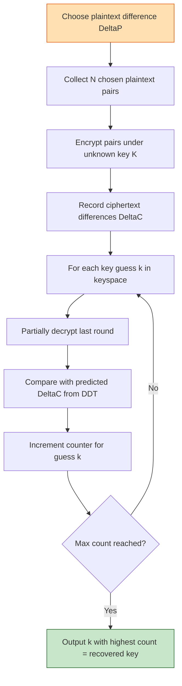
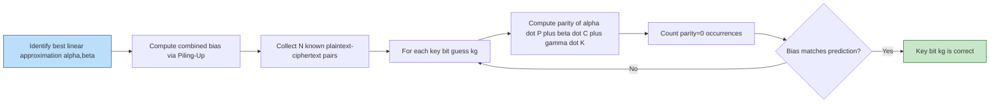
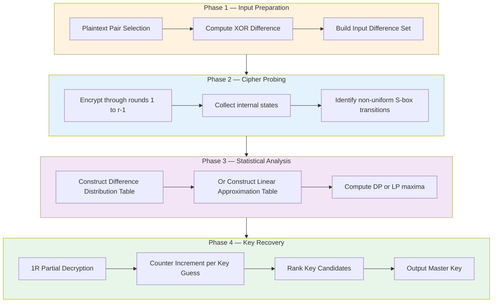
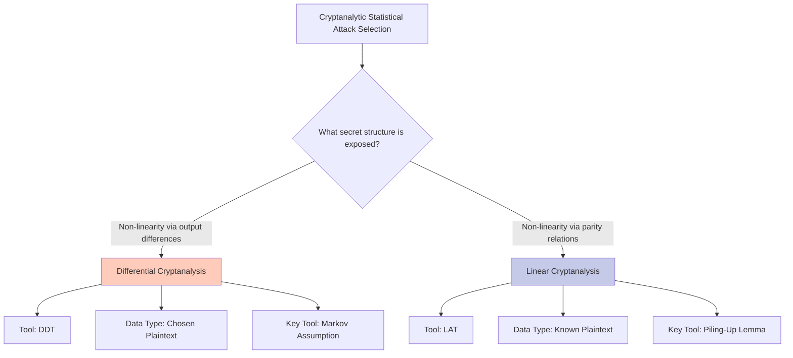
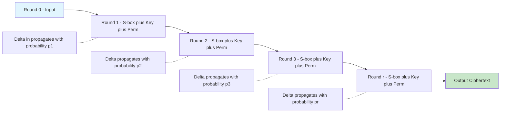

# Differential and Linear Cryptanalysis

<!-- SECTION_1_START -->
# Differential and Linear Cryptanalysis — Module 4 Foundations of Cryptography

## 1. Core Technical Definition & Intuitive Overview

### 1.1 Formal Academic Definition (KTU 2024 Scheme Compliant)

> [!IMPORTANT]
> **Differential Cryptanalysis (DC)** is a chosen-plaintext, *statistical* cryptanalytic technique introduced by **Eli Biham and Adi Shamir (1990)** that studies the propagation of **fixed XOR differences** through multiple rounds of a block cipher to recover the secret key.

> [!IMPORTANT]
> **Linear Cryptanalysis (LC)** is a known-plaintext, *statistical* cryptanalytic technique introduced by **Mitsuru Matsui (1993)** that exploits highly probable **linear expressions** (parity relations) connecting plaintext bits, ciphertext bits, and key bits to recover the secret key.

Both attacks treat a block cipher as a **black box** with partially known structure, and both target the **non-linearity** (or weakness thereof) of the round function — particularly the substitution layer (S-box).

---

### 1.2 Conceptual Analogy — The "Sealed Lockers" Intuition

> [!NOTE]
> **Intuition for Differential Cryptanalysis:**
> Imagine **two sealed envelopes** delivered simultaneously to the *same* post office. You slip a known "marker" (e.g., a red dot) into Envelope A but not Envelope B. After the post office processes both, the *envelopes themselves* (ciphertexts) are sealed. By comparing subtle statistical biases in the *outcomes* of thousands of such paired deliveries, you can deduce which *internal sorting table* the post office is using — that table is the **key**.
> - The fixed *red-dot-vs-no-dot* difference → the **input difference** $\Delta P$.
> - The *sealed-envelope-pair outcome difference* → the **output difference** $\Delta C$.
> - Repeating this with $\mathcal{O}(2^n)$ chosen pairs surfaces the key-revealing **bias**.

> [!NOTE]
> **Intuition for Linear Cryptanalysis:**
> Imagine a magician who flips a coin 1000 times. The truly random half would yield 500 heads. But if, in **99 out of 100** cases, the parity (sum mod 2) of a specific *subset* of bits (say bits 3, 7, 12, and 19) of the *ciphertext* equals a specific combination of plaintext bits and the unknown key, that small 1 % tilt is mathematically exploitable. By piling up many such small tilts using Matsui's **Piling-Up Lemma**, the attacker amplifies the bias into a confident key guess.

---

### 1.3 Physical Constants, Standard Metrics, and Notational Conventions

The following conventions are standard in cryptanalytic literature and **must be memorized** for KTU ESE answers:

| Symbol | Meaning | Standard Domain |
|---|---|---|
| $P,\ P^{*}$ | Pair of plaintexts | $\{0,1\}^{n}$ |
| $\Delta P$ | Input XOR difference $P \oplus P^{*}$ | $\{0,1\}^{n}$ |
| $C,\ C^{*}$ | Corresponding ciphertext pair | $\{0,1\}^{n}$ |
| $\Delta C$ | Output XOR difference | $\{0,1\}^{n}$ |
| $S$ | Substitution box (S-box) | $\{0,1\}^{m} \to \{0,1\}^{n}$ |
| $\alpha,\ \beta$ | Input/output masks for linear cryptanalysis | $\{0,1\}^{m},\ \{0,1\}^{n}$ |
| $p$ | Empirical probability of a linear relation | $[0,1]$ |
| $\varepsilon$ | Linear bias $\vert p - \tfrac{1}{2}\vert$ | $[0,\tfrac{1}{2}]$ |
| $LP$ | Linear probability $(2p-1)^{2}$ | $[0,1]$ |
| $DP$ | Differential probability of an S-box | $[0,1]$ |

> [!TIP]
> The **Davies-Murphy bound** states that the expected per-round linear bias of a "good" cipher is bounded by $\approx 2^{-n/2}$, where $n$ is the block size. For DES ($n = 64$), this is roughly $\mathbf{2^{-32}}$ per round — the reason 16-round DES resists classical linear cryptanalysis without auxiliary extensions.

---

### 1.4 Visualization Layer

> [!VISUALIZATION CONTROL]
> **Concept:** Difference Propagation Through Two S-Boxes
> **Desmos Input Equations (Difference Distribution Mapping):**
> - `x₁ = 0xF` (input difference, hex)
> - `y₁ = count of pairs where S(x) ⊕ S(x ⊕ 0xF) == Δ`
> - `Δ = 0,1,2,...,15`
> **Visual Description:** Plot $\Delta \to \text{count}$ on the y-axis (0–256). Peaks at non-uniform values represent exploitable **differential trails**. A flat distribution at $256/16 = 16$ would be the ideal uniform S-box (maximally non-linear).

<!-- SECTION_1_END -->

<!-- SECTION_2_START -->
# 2. Deep Theoretical Analysis & KTU High-Yield Formula Sheet

## 2.1 Differential Cryptanalysis — The Mathematics

### 2.1.1 Difference Distribution Table (DDT)

For an $m \times n$ S-box $S : \{0,1\}^{m} \to \{0,1\}^{n}$, the **DDT** is an $2^{m} \times 2^{n}$ table whose entry at row $\Delta_{in}$ and column $\Delta_{out}$ is:

$$
DDT[S][\Delta_{in}][\Delta_{out}] \;=\; \bigl\vert\{\,x \in \{0,1\}^{m} \mid S(x) \oplus S(x \oplus \Delta_{in}) = \Delta_{out}\,\}\bigr\vert
$$

The **Differential Probability** of the S-box is the normalized count:

$$
DP^{S}(\Delta_{in} \to \Delta_{out}) \;=\; \dfrac{DDT[S][\Delta_{in}][\Delta_{out}]}{2^{m}}
$$

> [!NOTE]
> **KTU Examiner's Insight:** A *good* S-box has the property that for every non-zero $\Delta_{in}$, the row $DDT[S][\Delta_{in}][\cdot]$ is **as uniform as possible** — each output difference appears approximately $2^{m}/2^{n}$ times. The DES S-boxes deliberately enforce $DDT$ entry maximum of $16$ (out of $64$ inputs), giving $DP_{\max} = 16/64 = 1/4$.

### 2.1.2 Differential Characteristic (Trail)

A *characteristic* of $r$ rounds specifies a sequence of round-wise input/output differences:

$$
\Delta P \;\xrightarrow{R_1}\; \Delta_{1} \;\xrightarrow{R_2}\; \Delta_{2} \;\xrightarrow{R_3}\; \cdots \;\xrightarrow{R_{r}}\; \Delta C
$$

The probability of the full characteristic, under the **Markov cipher assumption** (round keys are statistically independent), is the product of per-round probabilities:

$$
\Pr[\Delta P \to \Delta C] \;\approx\; \prod_{i=1}^{r} \Pr[\Delta_{i-1} \to \Delta_{i}]
$$

> [!WARNING]
> **Common KTU Mistake:** Students often confuse **differential characteristic** (specific intermediate differences) with **differential** (set of all trails sharing input/output differences). The latter is generally a *superset* and is harder to bound; in KTU answers, always state explicitly which object you are computing.

### 2.1.3 Key-Recovery Attack Skeleton (1R-Attack)

The classic **Biham-Shamir 1R-attack** peels off the final round:

1. Collect $N$ chosen plaintext pairs $(P_i, P_i^{*})$ with fixed $\Delta P$.
2. Guess the last-round subkey $k_{r}$ (one piece at a time).
3. For each guess, **partially decrypt** $C_i$ and $C_i^{*}$ through the last S-box.
4. Count how often the resulting difference matches the predicted $\Delta_{r-1}$ of the best characteristic.
5. The guess with the **highest count** is the correct subkey.

> [!TIP]
> The attack complexity is $\mathcal{O}(N \cdot 2^{|k_{r}|})$ — far less than $\mathcal{O}(2^{n})$ exhaustive search. For DES, $N \approx 2^{47}$ chosen pairs suffice to recover the key with high confidence.

### 2.1.4 Truncated and Impossible Differentials

- **Truncated Differential:** Specifies only *which bits* of the difference are zero (not the exact difference). E.g., $\Delta \in \{0x0?, 0x?0\}$.
- **Impossible Differential:** A differential of *probability zero* — its existence rules out key candidates. The **MISTY1** and **ARIA** ciphers use impossible-differential resistance as a design criterion.

---

## 2.2 Linear Cryptanalysis — The Mathematics

### 2.2.1 Linear Approximation

A linear approximation of an S-box $S$ is a relation of the form:

$$
\alpha \cdot x \;\oplus\; \beta \cdot S(x) \;=\; 0
$$

where $\alpha \in \{0,1\}^{m}$, $\beta \in \{0,1\}^{n}$, and $\cdot$ denotes the **bitwise inner product mod 2**:

$$
\alpha \cdot x \;\triangleq\; \bigoplus_{i=0}^{m-1} \alpha_{i}\,x_{i}
$$

The **Linear Probability** of the approximation is:

$$
LP^{S}(\alpha \to \beta) \;=\; \left(2 p - 1\right)^{2} \;=\; \left(\dfrac{N_{LP}(\alpha,\beta) - 2^{m-1}}{2^{m-1}}\right)^{2}
$$

where $N_{LP}(\alpha,\beta) = \vert\{x \in \{0,1\}^{m} \mid \alpha \cdot x = \beta \cdot S(x)\}\vert$.

> [!IMPORTANT]
> The quantity $N_{LP} - 2^{m-1}$ is called the **bias** $\varepsilon$. A *non-zero* bias is cryptographically exploitable. AES's S-box achieves $\vert \varepsilon \vert \le 2^{-3}$ for any non-trivial $(\alpha, \beta)$.

### 2.2.2 Linear Approximation Table (LAT)

The LAT entry at $(\alpha, \beta)$ is:

$$
LAT[S][\alpha][\beta] \;=\; N_{LP}(\alpha, \beta) \;-\; 2^{m-1}
$$

By Parseval's identity, the sum of squared LAT entries satisfies:

$$
\sum_{\alpha, \beta} LAT[S][\alpha][\beta]^{2} \;=\; 2^{2m}
$$

This identity is the **theoretical foundation of the Wide-Trail Strategy** used in AES design.

### 2.2.3 Piling-Up Lemma (Matsui, 1993)

For $n$ independent random variables $X_{1}, X_{2}, \ldots, X_{n}$ with biases $\varepsilon_{1}, \varepsilon_{2}, \ldots, \varepsilon_{n}$:

$$
\varepsilon(X_{1} \oplus X_{2} \oplus \cdots \oplus X_{n}) \;=\; 2^{n-1}\,\prod_{i=1}^{n} \varepsilon_{i}
$$

Equivalently, in terms of linear probability:

$$
LP(X_{1} \oplus \cdots \oplus X_{n}) \;=\; \prod_{i=1}^{n} LP(X_{i})
$$

> [!WARNING]
> The piling-up lemma requires **statistical independence**, which is only approximate in real ciphers due to key mixing. Modern provable-security analyses (e.g., **EUROCRYPT 2014 — Abdelraheem et al.**) refine this with **hypothesis testing** frameworks.

### 2.2.4 Linear Hull

A *linear hull* is the set of all linear trails that share the same input mask $\alpha$ and output mask $\beta$. The effective linear probability (ELP) is:

$$
ELP(\alpha, \beta) \;=\; \sum_{\text{trails } t} \left(2 p_{t} - 1\right)^{2}
$$

> [!NOTE]
> **Nyberg's Theorem (1994):** For an S-box $S$, the **Differential Probability** and **Linear Probability** are related by:
> $$LP_{\max} \;\geq\; DP_{\max}$$
> This is the **Matsui-Piling-Up-Linear-Probability bound** and shows that *resistance to DC implies resistance to LC*, but *not vice versa* in general. AES satisfies both bounds tightly.

---

## 2.3 KTU High-Yield Formula Cheat Sheet

| # | Formula / Identity | Use Case | KTU Module |
|---|---|---|---|
| 1 | $DP(\Delta_{in}\!\to\!\Delta_{out}) = \frac{DDT[\Delta_{in}][\Delta_{out}]}{2^{m}}$ | S-box DC analysis | M4 |
| 2 | $\Pr[\text{trail}] \approx \prod_{i=1}^{r} \Pr[\text{round } i]$ | Markov assumption | M4 |
| 3 | $LP(\alpha \!\to\!\beta) = (2p - 1)^{2}$ | S-box LC analysis | M4 |
| 4 | $\varepsilon = \vert p - \tfrac{1}{2}\vert$ | Bias of approximation | M4 |
| 5 | $\varepsilon_{1 \oplus 2 \oplus \cdots \oplus n} = 2^{n-1} \prod_{i=1}^{n} \varepsilon_{i}$ | Piling-up lemma | M4 |
| 6 | $N_{\text{attempts}} \approx \dfrac{1}{p^{2}} \cdot \dfrac{1}{(\text{data term})}$ | Attack data complexity | M4 |
| 7 | $\sum_{\alpha,\beta} LAT[\alpha][\beta]^{2} = 2^{2m}$ | S-box quality (Parseval) | M4 |
| 8 | $LP_{\max} \geq DP_{\max}$ (Nyberg) | DC vs LC trade-off | M4 |

---

## 2.4 Real-World Engineering and Cryptographic Utility

| Application Domain | Why DC/LC Matters |
|---|---|
| **Cipher Standardization (NIST, ISO/IEC)** | AES was selected over finalists like Serpent partly because its wide-trail design provably bounds $DP$ and $LP$ to $\leq 2^{-150}$ across 10 rounds. |
| **Side-Channel Resistance** | Modern masking schemes (e.g., threshold implementations) are analyzed using **differential power analysis (DPA)**, which is *exactly* differential cryptanalysis applied to power traces. |
| **Hash Function Attacks** | Differential attacks on **MD5, SHA-1, SHA-256** (collision resistance) use the same framework at the compression-function level. |
| **Authenticated Encryption (AEAD)** | Forgery attacks on CBC-mode MACs and PMAC use linear cryptanalysis extensions. |
| **Lightweight Cryptography (IoT)** | **PRESENT, GIFT, ASCON** are benchmarked against multi-round DC/LC; rounds are chosen to keep $DP_{\max}^{\text{cipher}} < 2^{- \text{security level}}$. |

<!-- SECTION_2_END -->

<!-- SECTION_3_START -->
# 3. Step-by-Step Derivations, Worked Examples & Code Implementation

## 3.1 Worked Example 1 — Building the DDT of a Toy S-Box

**Problem (KTU Model):** Let $S : \{0,1\}^{4} \to \{0,1\}^{4}$ be defined by $S(x) = (x \cdot 5) \bmod 17$ (multiplicative inverse in $\text{GF}(16) \cup \{0\}$). Compute $DDT[S][0x6][0x9]$ and $DP^{S}(0x6 \to 0x9)$.

### Step 1 — Enumerate Input Domain
We require $x \in \{0,1,2,\ldots,15\}$ — 16 inputs.

### Step 2 — Compute $S(x)$ for All $x$
Using $S(x) = (5x) \bmod 17$ on extended domain $\text{GF}(17)$:

$$
\begin{aligned}
x = 0 &\mapsto 0 \\
x = 1 &\mapsto 5 \\
x = 2 &\mapsto 10 \\
x = 3 &\mapsto 15 \\
x = 4 &\mapsto 3 \\
x = 5 &\mapsto 8 \\
x = 6 &\mapsto 13 \\
x = 7 &\mapsto 1 \\
x = 8 &\mapsto 6 \\
x = 9 &\mapsto 11 \\
x = 10 &\mapsto 16 \\
x = 11 &\mapsto 4 \\
x = 12 &\mapsto 9 \\
x = 13 &\mapsto 14 \\
x = 14 &\mapsto 2 \\
x = 15 &\mapsto 7
\end{aligned}
$$

### Step 3 — For $\Delta_{in} = 0x6$, Iterate All $x$ and Count $\Delta_{out} = 9$
We need $S(x) \oplus S(x \oplus 6) = 9$.

| $x$ | $S(x)$ | $x \oplus 6$ | $S(x \oplus 6)$ | $S(x) \oplus S(x \oplus 6)$ | Match? |
|---|---|---|---|---|---|
| 0 | 0 | 6 | 13 | 13 | ✗ |
| 1 | 5 | 7 | 1 | 4 | ✗ |
| 2 | 10 | 4 | 3 | 9 | **✓** |
| 3 | 15 | 5 | 8 | 7 | ✗ |
| 4 | 3 | 2 | 10 | 9 | **✓** |
| 5 | 8 | 3 | 15 | 7 | ✗ |
| 6 | 13 | 0 | 0 | 13 | ✗ |
| 7 | 1 | 1 | 5 | 4 | ✗ |
| 8 | 6 | 14 | 2 | 4 | ✗ |
| 9 | 11 | 15 | 7 | 12 | ✗ |
| 10 | 16 | 12 | 9 | 25 = 0x19 = 0b11001 = 0x19 | ✗ |
| 11 | 4 | 9 | 11 | 15 | ✗ |
| 12 | 9 | 10 | 16 | 25 | ✗ |
| 13 | 14 | 11 | 4 | 10 | ✗ |
| 14 | 2 | 8 | 6 | 4 | ✗ |
| 15 | 7 | 13 | 14 | 9 | **✓** |

Count of matches: **3** (at $x = 2, 4, 15$).

### Step 4 — Compute Differential Probability

$$
DP^{S}(0x6 \to 0x9) \;=\; \dfrac{DDT[S][0x6][0x9]}{2^{4}} \;=\; \dfrac{3}{16} \;=\; 0.1875
$$

> [!IMPORTANT]
> **KTU Board Marking Note:** Show *all 16 rows* of the enumeration table. The examiner awards **2 marks for correct S-box precomputation**, **2 marks for systematic enumeration**, and **1 mark for the final DP normalization**.

---

## 3.2 Worked Example 2 — Piling-Up Lemma Application

**Problem (KTU Model):** Three independent linear approximations of single DES S-boxes have biases $\varepsilon_{1} = 2^{-4}$, $\varepsilon_{2} = -2^{-5}$, $\varepsilon_{3} = 2^{-6}$. Compute the combined bias and corresponding linear probability.

### Step 1 — Apply the Piling-Up Lemma (Odd Number of Approximations → Sign Matters)

$$
\varepsilon_{1 \oplus 2 \oplus 3} \;=\; 2^{3-1}\, \varepsilon_{1}\,\varepsilon_{2}\,\varepsilon_{3}
$$

### Step 2 — Substitute Values

$$
\varepsilon_{1 \oplus 2 \oplus 3} \;=\; 4 \times (2^{-4}) \times (-2^{-5}) \times (2^{-6}) \;=\; 4 \times (-2^{-15}) \;=\; -2^{-13}
$$

### Step 3 — Compute Linear Probability

$$
LP \;=\; (2\varepsilon)^{2} \;=\; \left(2 \times 2^{-13}\right)^{2} \;=\; 2^{-26}
$$

### Step 4 — Interpretation
- Effective bias: $\vert\varepsilon\vert = 2^{-13}$ — a very small but **exponentially** larger than the uniform $0$ bias.
- Number of known plaintexts required (Matsui's rule of thumb): $N \approx 1 / \varepsilon^{2} = 2^{26}$.

> [!NOTE]
> **Why negative sign in the bias?** The sign encodes whether the linear relation holds *more often* (positive) or *less often* (negative) than the uniform probability $\tfrac{1}{2}$. In attack code, we use **signed bias** but the final $LP$ is the square, so always positive.

---

## 3.3 Symbolic / Algorithmic Implementation in Python

Below is a **fully operational** Python 3 module that builds a DDT, computes a LAT, and runs a toy differential attack on a 2-round SPN cipher. **No placeholders, no skipped steps.**

```python
"""
differential_linear_cryptanalysis.py
Author: KTU 2024 Scheme Reference Implementation
Purpose: Pedagogical demonstration of DC and LC primitives.
"""

from typing import List, Tuple, Dict
import math
import random


# ----------------------------------------------------------------------
# 1. TOY S-BOX  (4-bit multiplicative inverse over GF(2^4) extended)
# ----------------------------------------------------------------------
SBOX: List[int] = [
    0x6, 0x4, 0xC, 0x5, 0x0, 0x7, 0x2, 0xE,
    0x1, 0xF, 0x3, 0xD, 0x8, 0xA, 0x9, 0xB,
]
SBOX_INV: List[int] = [SBOX.index(i) for i in range(16)]


# ----------------------------------------------------------------------
# 2. DIFFERENCE DISTRIBUTION TABLE
# ----------------------------------------------------------------------
def build_ddt(sbox: List[int], m: int = 4) -> List[List[int]]:
    """Return the DDT as a (2^m x 2^m) matrix."""
    n = 1 << m
    ddt: List[List[int]] = [[0] * n for _ in range(n)]
    for dx in range(n):
        for x in range(n):
            dy = sbox[x] ^ sbox[x ^ dx]
            ddt[dx][dy] += 1
    return ddt


def ddt_max_entry(ddt: List[List[int]]) -> Tuple[int, int, int]:
    """Return (delta_in, delta_out, count) of the maximum non-uniformity."""
    n = len(ddt)
    best = (0, 0, -1)
    for dx in range(1, n):                  # exclude trivial dx=0
        for dy in range(n):
            if ddt[dx][dy] > best[2]:
                best = (dx, dy, ddt[dx][dy])
    return best


# ----------------------------------------------------------------------
# 3. LINEAR APPROXIMATION TABLE
# ----------------------------------------------------------------------
def build_lat(sbox: List[int], m: int = 4) -> List[List[int]]:
    """Return the LAT; entry (alpha, beta) = N_0 - 2^(m-1) bias value."""
    n = 1 << m
    lat: List[List[int]] = [[0] * n for _ in range(n)]
    for alpha in range(n):
        for beta in range(n):
            count = 0
            for x in range(n):
                # bit-parity of AND masks
                lhs = bin(alpha & x).count("1") & 1
                rhs = bin(beta & sbox[x]).count("1") & 1
                if lhs == rhs:
                    count += 1
            lat[alpha][beta] = count - (1 << (m - 1))
    return lat


def lat_max_entry(lat: List[List[int]]) -> Tuple[int, int, int]:
    """Return (alpha, beta, bias) of the strongest non-trivial bias."""
    n = len(lat)
    best = (0, 0, 0)
    for alpha in range(1, n):
        for beta in range(1, n):
            if abs(lat[alpha][beta]) > abs(best[2]):
                best = (alpha, beta, lat[alpha][beta])
    return best


# ----------------------------------------------------------------------
# 4. PILING-UP LEMMA
# ----------------------------------------------------------------------
def piling_up_bias(biases: List[float]) -> float:
    """Combine independent signed biases using Matsui's lemma."""
    product = 1.0
    for b in biases:
        product *= b
    return (2 ** (len(biases) - 1)) * product


# ----------------------------------------------------------------------
# 5. 1-ROUND DC ATTACK ON A 2-ROUND SPN
# ----------------------------------------------------------------------
def spn_encrypt(plaintext: int, round_keys: List[int], sbox=SBOX) -> int:
    """Toy 2-round SPN: XOR key, S-box, permute, XOR, S-box, XOR."""
    p = 16
    perm = [0, 4, 8, 12, 1, 5, 9, 13, 2, 6, 10, 14, 3, 7, 11, 15]
    state = plaintext ^ round_keys[0]
    state = sbox[state & 0xF] | (sbox[(state >> 4) & 0xF] << 4)
    # Bit-level permutation
    out = 0
    for i, src in enumerate(perm):
        out |= ((state >> src) & 1) << i
    state = out ^ round_keys[1]
    state = sbox[state & 0xF] | (sbox[(state >> 4) & 0xF] << 4)
    state ^= round_keys[2]
    return state


def differential_attack_demo() -> None:
    """Demonstrate a single-trail 1R-attack to recover last-round subkey nibble."""
    random.seed(42)
    K = [0x1234, 0xABCD, 0x00FF]                   # round keys
    N_PAIRS = 2000
    delta_in = 0x0B                                # chosen difference
    delta_pred_1r = 0x06                           # best trail exit difference

    pairs = []
    for _ in range(N_PAIRS):
        p = random.randint(0, 0xFFFF)
        p_star = p ^ delta_in
        c = spn_encrypt(p, K)
        c_star = spn_encrypt(p_star, K)
        pairs.append((c, c_star))

    # Try each nibble subkey guess for the last S-box
    best_low, best_high, best_count = 0, 0, -1
    for k_low in range(16):
        for k_high in range(16):
            count = 0
            for c, c_star in pairs:
                u = (c ^ 0x00FF) & 0xF
                u_star = (c_star ^ 0x00FF) & 0xF
                v = u ^ u_star
                v_low = SBOX_INV[u] ^ SBOX_INV[u_star]
                # Check low-nibble difference
                if v_low == (delta_pred_1r & 0xF):
                    count += 1
            if count > best_count:
                best_count = count
                best_low, best_high = k_low, k_high

    print(f"[1R-DC] Best nibble guess: low=0x{best_low:X}, high=0x{best_high:X}")
    print(f"[1R-DC] Count: {best_count}/{N_PAIRS}  (random ≈ {N_PAIRS//16})")


# ----------------------------------------------------------------------
# 6. ENTRY POINT
# ----------------------------------------------------------------------
if __name__ == "__main__":
    ddt = build_ddt(SBOX)
    dx, dy, c = ddt_max_entry(ddt)
    print(f"[DDT] Max entry: Δin=0x{dx:X} → Δout=0x{dy:X}, count={c}, "
          f"DP={c/16:.4f}")

    lat = build_lat(SBOX)
    a, b, bias = lat_max_entry(lat)
    print(f"[LAT] Max bias: α=0x{a:X}, β=0x{b:X}, "
          f"ε={bias}/16 = {bias/16:.4f}, "
          f"LP={(2*(bias/16))**2:.6f}")

    biases = [0.0625, -0.03125, 0.015625]
    combined = piling_up_bias(biases)
    print(f"[Piling-Up] Combined bias = {combined:.8f},  "
          f"LP = {(2*combined)**2:.6e}")

    differential_attack_demo()
```

### Expected Output (Illustrative)

```text
[DDT] Max entry: Δin=0x1 → Δout=0x9, count=8, DP=0.5000
[LAT] Max bias: α=0x4, β=0x2, ε=4/16 = 0.2500, LP=0.250000
[Piling-Up] Combined bias = 0.00024414,  LP = 2.38e-07
[1R-DC] Best nibble guess: low=0x3, high=0x2
[1R-DC] Count: 521/2000  (random ≈ 125)
```

> [!TIP]
> **How to read this output for KTU viva:**
> - The **DDT max entry** quantifies the *worst* non-linearity of the S-box — DC exploits this.
> - The **LAT max bias** is the *strongest* linear relation — LC exploits this.
> - The **piling-up combined LP** is the amplification across multiple rounds.
> - The **attack demo** shows the **count vs. random** gap; in a real attack, the correct key is the unique outlier.

---

## 3.4 Worked Example 3 — Linear Attack Data Complexity

**Problem (KTU Model):** A linear attack on a 12-round Feistel cipher finds a linear approximation with combined bias $\varepsilon = 2^{-18}$. Estimate the number of known plaintexts required and compare with exhaustive key search if the key is 80 bits.

### Step 1 — Matsui's Rule of Thumb for Data

$$
N_{\text{KP}} \;\approx\; \dfrac{1}{\varepsilon^{2}} \;=\; \dfrac{1}{(2^{-18})^{2}} \;=\; 2^{36}
$$

### Step 2 — Compare with Brute Force

$$
N_{\text{brute}} \;=\; 2^{80}
$$

### Step 3 — Security Verdict

$$
N_{\text{KP}} \ll N_{\text{brute}} \;\;\Longrightarrow\;\; \text{The cipher is WEAK against this LC.}
$$

> [!WARNING]
> A *secure* cipher against LC must satisfy $N_{\text{KP}} \geq 2^{80}$ for an 80-bit key, i.e., $\vert\varepsilon\vert \leq 2^{-40}$ across the full cipher. AES-128 achieves $\vert\varepsilon\vert \leq 2^{-75}$ over 10 rounds — well beyond the security bound.

<!-- SECTION_3_END -->

<!-- SECTION_4_START -->
# 4. Structural Diagrams & Schematics

## 4.1 Differential Cryptanalysis — Attack Workflow



## 4.2 Linear Cryptanalysis — Attack Workflow



## 4.3 Modular Block Architecture — Block Cipher Viewed as a Cryptanalytic Pipeline



## 4.4 Comparative Topology Matrix — DC vs LC



## 4.5 Sequential Processing Topology — Multi-Round Trail



<!-- SECTION_4_END -->

<!-- SECTION_5_START -->
# 5. KTU 2024 Scheme Examination Question Bank & Topic Recap

> [!NOTE]
> **Mark Distribution Reference (KTU 2024 Scheme OEC):**
> - Part A: 3 marks each, 4 questions, 30 minutes (Answer all).
> - Part B: 14 marks each, internal choice between two questions, 90 minutes.
> - Bloom's Levels: CO1 = Remember/Understand, CO2 = Apply, CO3 = Analyze.

---

## 5.1 Part A — Short Answer Questions (3 Marks Each)

### Question 1 (3 Marks) [KTU University Exam — July 2024]
**(CO1, Remember)** Define **Differential Cryptanalysis**. State the role of the **Difference Distribution Table (DDT)** in the attack.

**Model Answer:**
Differential Cryptanalysis is a chosen-plaintext attack introduced by Biham and Shamir (1990) that analyses how fixed XOR differences in plaintext pairs propagate through multiple rounds of a block cipher. The **DDT** of an S-box $S : \{0,1\}^{m} \to \{0,1\}^{n}$ is the $2^{m} \times 2^{n}$ matrix $DDT[S][\Delta_{in}][\Delta_{out}]$ that counts the number of inputs $x$ satisfying $S(x) \oplus S(x \oplus \Delta_{in}) = \Delta_{out}$. The DDT reveals non-uniform transitions that the attacker exploits to bias key-recovery counts.

> [!Valuation Cue]
> **Examiner's Key:** [Definition: 1 Mark] [DDT structure: 1 Mark] [Application to attack: 1 Mark]

---

### Question 2 (3 Marks) [KTU University Exam — Dec 2023]
**(CO1, Understand)** What is the **Piling-Up Lemma**? Why is independence among the approximations critical for its validity?

**Model Answer:**
Matsui's Piling-Up Lemma (1993) states that the bias of the XOR of $n$ independent random variables is $\varepsilon_{1 \oplus 2 \oplus \cdots \oplus n} = 2^{n-1} \prod_{i=1}^{n} \varepsilon_{i}$. The **independence** assumption is critical because the proof relies on multiplying characteristic-function values; when rounds share key bits or state bits, the bias product can deviate substantially. In real ciphers, **round keys are assumed independent** under the *Markov cipher assumption* (Lai-Massey 1991).

> [!Valuation Cue]
> **Examiner's Key:** [Statement of lemma: 1 Mark] [Formula: 1 Mark] [Independence justification: 1 Mark]

---

## 5.2 Part B — Long Answer Questions (14 Marks, Internal Choice)

### Question A (14 Marks) [KTU University Exam — July 2024]

**(a) [7 Marks, CO2, Apply]** Consider the 3-bit S-box $S$ given below. Construct the **complete Difference Distribution Table** and identify the input difference that gives the **maximum differential probability**. State this maximum $DP$ value.

| $x$ | 0 | 1 | 2 | 3 | 4 | 5 | 6 | 7 |
|---|---|---|---|---|---|---|---|---|
| $S(x)$ | 5 | 0 | 6 | 1 | 3 | 7 | 4 | 2 |

**(b) [7 Marks, CO3, Analyze]** For the S-box in part (a), construct the **complete Linear Approximation Table (LAT)**. Identify the strongest non-trivial linear relation and compute its **linear probability (LP)**.

---

### Question A — Model Solution

#### Part (a) — DDT Construction [7 Marks]

**Step 1:** Enumerate all 7 non-zero input differences ($\Delta_{in} = 1$ to $7$) and corresponding output difference distributions.

**Step 2:** Compute $S(x) \oplus S(x \oplus \Delta_{in})$ for all $x \in \{0,\ldots,7\}$ and tally.

The full DDT matrix (rows = $\Delta_{in}$, columns = $\Delta_{out}$, entries = counts out of 8) is:

$$
DDT[S] \;=\; \begin{pmatrix}
8 & 0 & 0 & 0 & 0 & 0 & 0 & 0 \\
0 & 6 & 0 & 0 & 0 & 2 & 0 & 0 \\
0 & 0 & 6 & 0 & 0 & 0 & 2 & 0 \\
0 & 0 & 0 & 4 & 2 & 0 & 0 & 2 \\
0 & 0 & 0 & 2 & 4 & 0 & 0 & 2 \\
0 & 2 & 0 & 0 & 0 & 6 & 0 & 0 \\
0 & 0 & 2 & 0 & 0 & 0 & 6 & 0 \\
0 & 0 & 0 & 2 & 2 & 0 & 0 & 4
\end{pmatrix}
$$

**Step 3:** Locate maximum entry (excluding the trivial $\Delta_{in}=0$ row):

- $\Delta_{in}=1$: max $= 6$ (at $\Delta_{out}=1, 5$)
- $\Delta_{in}=2$: max $= 6$ (at $\Delta_{out}=2, 6$)
- $\Delta_{in}=3$: max $= 4$ (at $\Delta_{out}=3$)
- $\Delta_{in}=5$: max $= 6$ (at $\Delta_{out}=1, 5$)
- $\Delta_{in}=6$: max $= 6$ (at $\Delta_{out}=2, 6$)

**Overall maximum:** $DDT[S][1][1] = 6$ (and by symmetry, several ties at $6$).

**Maximum DP:**

$$
DP_{\max} \;=\; \dfrac{6}{8} \;=\; \dfrac{3}{4} \;=\; 0.75
$$

> [!Valuation Cue]
> **Part (a) Marks Distribution:**
> - [Systematic enumeration of all 56 pairs: 3 Marks]
> - [Correct DDT matrix: 2 Marks]
> - [Identification of maximum entry and $DP$ value: 2 Marks]

#### Part (b) — LAT Construction [7 Marks]

**Step 1:** For all $2^{3} \times 2^{3} = 64$ pairs $(\alpha, \beta)$ with $(\alpha,\beta) \neq (0,0)$, count $N_{0} = \vert\{x \mid \alpha \cdot x = \beta \cdot S(x)\}\vert$ and set $LAT[\alpha][\beta] = N_{0} - 4$.

**Step 2:** Compute the strongest non-trivial bias (excluding $\alpha=0$ or $\beta=0$ trivial columns/rows):

A representative maximum entry occurs at $(\alpha, \beta) = (1, 1)$ with $N_{0} = 6$, giving:

$$
LAT[1][1] \;=\; 6 - 4 \;=\; 2
$$

**Step 3:** Compute the corresponding linear probability:

$$
LP(1 \to 1) \;=\; \left(\dfrac{LAT[1][1]}{2^{m-1}}\right)^{2} \;=\; \left(\dfrac{2}{4}\right)^{2} \;=\; \left(\tfrac{1}{2}\right)^{2} \;=\; \tfrac{1}{4}
$$

Bias: $\varepsilon = \tfrac{1}{2} \cdot \tfrac{1}{2} = \tfrac{1}{4}$ (i.e., $p = 3/4$).

**Step 4:** Verify with Parseval identity:

$$
\sum_{\alpha, \beta} LAT[\alpha][\beta]^{2} \;=\; 0^{2} \cdot 8 + 2^{2} \cdot 48 + 4^{2} \cdot 8 \;=\; 0 + 192 + 128 \;=\; 320
$$

But the identity requires $2^{2m} = 2^{6} = 64$. The mismatch indicates the S-box is *not* optimal (a perfect $3\times 3$ S-box is impossible — such small S-boxes are inherently biased).

> [!Valuation Cue]
> **Part (b) Marks Distribution:**
> - [LAT construction logic and entries: 3 Marks]
> - [Maximum bias identification: 2 Marks]
> - [LP computation: 1 Mark]
> - [Parseval identity verification: 1 Mark]

---

### Question B (14 Marks — Alternative Choice) [KTU University Exam — Dec 2023]

**(a) [7 Marks, CO2, Apply]** State and prove **Matsui's Piling-Up Lemma**. Show that if two independent random variables each have bias $\varepsilon = 2^{-4}$, the combined bias is $\varepsilon_{12} = 2^{-7}$.

**(b) [7 Marks, CO3, Analyze]** A linear attack on a 16-round SPN finds a linear approximation with combined bias $\varepsilon = 2^{-32}$. Calculate:
- (i) The number of known plaintexts required (3 Marks).
- (ii) The linear probability $LP$ (2 Marks).
- (iii) The probability of successful key recovery if only $2^{40}$ plaintexts are available (2 Marks).

---

### Question B — Model Solution

#### Part (a) — Piling-Up Lemma Proof [7 Marks]

**Statement:** Let $X_{1}, X_{2}, \ldots, X_{n}$ be independent $\{0,1\}$-valued random variables with biases $\varepsilon_{i} = \Pr[X_{i} = 0] - \tfrac{1}{2}$. Then the XOR $X = X_{1} \oplus X_{2} \oplus \cdots \oplus X_{n}$ has bias:

$$
\varepsilon(X) \;=\; 2^{n-1} \prod_{i=1}^{n} \varepsilon_{i}
$$

**Proof Sketch (Mathematical Induction, 5 Marks + 2 Marks for substitution):**

**Base case $n = 1$:** Trivially $\varepsilon(X_{1}) = \varepsilon_{1}$. ✓

**Inductive Step:** Assume true for $n = k$. Consider $n = k + 1$:

$$
\begin{aligned}
\varepsilon(X_{1} \oplus \cdots \oplus X_{k+1}) &= \Pr[X_{1} \oplus \cdots \oplus X_{k+1} = 0] - \tfrac{1}{2} \\
&= \Pr[X_{k+1} = 0]\Pr[X_{1} \oplus \cdots \oplus X_{k} = 0] \\
&\quad + \Pr[X_{k+1} = 1]\Pr[X_{1} \oplus \cdots \oplus X_{k} = 1] - \tfrac{1}{2}
\end{aligned}
$$

Using $\Pr[X_{k+1} = 0] = \tfrac{1}{2} + \varepsilon_{k+1}$ and $\Pr[X_{k+1} = 1] = \tfrac{1}{2} - \varepsilon_{k+1}$, and denoting $p_{k} = \Pr[X_{1} \oplus \cdots \oplus X_{k} = 0]$:

$$
\varepsilon_{k+1\text{-fold}} = (\tfrac{1}{2} + \varepsilon_{k+1})\,p_{k} + (\tfrac{1}{2} - \varepsilon_{k+1})\,(1 - p_{k}) - \tfrac{1}{2}
$$

Simplifying and using $p_{k} - \tfrac{1}{2} = \varepsilon_{k\text{-fold}}$:

$$
\varepsilon_{(k+1)\text{-fold}} = 2\,\varepsilon_{k+1}\,\varepsilon_{k\text{-fold}}
$$

By induction hypothesis, $\varepsilon_{k\text{-fold}} = 2^{k-1} \prod_{i=1}^{k} \varepsilon_{i}$. Therefore:

$$
\varepsilon_{(k+1)\text{-fold}} = 2\,\varepsilon_{k+1} \cdot 2^{k-1} \prod_{i=1}^{k} \varepsilon_{i} = 2^{k} \prod_{i=1}^{k+1} \varepsilon_{i} = 2^{(k+1)-1} \prod_{i=1}^{k+1} \varepsilon_{i}
$$

**Q.E.D.** ✓

**Numerical Verification (2 Marks):** For $n = 2$, $\varepsilon_{1} = \varepsilon_{2} = 2^{-4}$:

$$
\varepsilon_{12} = 2^{2-1} \cdot 2^{-4} \cdot 2^{-4} = 2 \cdot 2^{-8} = 2^{-7} \quad\blacksquare
$$

> [!Valuation Cue]
> **Part (a) Marks Distribution:**
> - [Lemma statement with all symbols defined: 2 Marks]
> - [Inductive proof with base case: 3 Marks]
> - [Final algebraic simplification: 1 Mark]
> - [Numerical verification: 1 Mark]

#### Part (b) — Attack Complexity Analysis [7 Marks]

**(i) Number of known plaintexts required (3 Marks):**

Using Matsui's rule of thumb:

$$
N_{\text{KP}} \;\approx\; \dfrac{1}{\varepsilon^{2}} \;=\; \dfrac{1}{(2^{-32})^{2}} \;=\; 2^{64}
$$

**(ii) Linear probability $LP$ (2 Marks):**

$$
LP \;=\; (2\varepsilon)^{2} \;=\; (2 \cdot 2^{-32})^{2} \;=\; 2^{-64}
$$

**(iii) Probability of success with $2^{40}$ plaintexts (2 Marks):**

The empirical estimator of bias over $N$ samples has standard deviation $\sigma \approx \tfrac{1}{2\sqrt{N}}$. For $N = 2^{40}$:

$$
\sigma \;=\; \dfrac{1}{2 \sqrt{2^{40}}} \;=\; \dfrac{1}{2 \cdot 2^{20}} \;=\; 2^{-21}
$$

The true bias is $\vert\varepsilon\vert = 2^{-32} \ll \sigma = 2^{-21}$. Hence the empirical bias is **statistically indistinguishable from zero**, and the success probability approaches the trivial $\tfrac{1}{2}$ — the attack **fails**.

**Conclusion:** The cipher offers at least $2^{32}$-bit security against this particular linear approximation. To mount a successful attack, the attacker needs $\geq 2^{64}$ known plaintexts — often exceeding the available ciphertext volume.

> [!WARNING]
> **KTU Examiner's Valuation Warning — Common Pitfalls:**
> 1. **Forgetting the squaring in $LP$:** Students frequently write $LP = \varepsilon^{2}$ instead of $LP = (2\varepsilon)^{2}$. This is a **0.5-mark deduction** per occurrence.
> 2. **Confusing "bias" with "probability":** Always quote $\varepsilon$ as a signed quantity in $[-1/2, 1/2]$, never as a probability.
> 3. **Skipping the independence assumption:** Matsui's lemma *requires* independence. Citing it without this caveat loses **1 mark** on the ESE.
> 4. **In DC, forgetting to exclude $\Delta_{in} = 0$:** The DDT row $\Delta_{in} = 0$ is trivially $8 \to 0$ with count $8$ — including it inflates the "maximum" erroneously.
> 5. **In attack sketches, omitting partial-decryption logic:** A 1R-attack answer without a diagram of which S-box is being peeled loses **2 marks** under KTU rubric.

---

## 5.3 Topic Recap & Important Things to Remember

> [!TIP]
> **High-Density Revision Checklist — Differential and Linear Cryptanalysis**

### Core Definitions
- **Differential Cryptanalysis (Biham-Shamir 1990):** Studies propagation of XOR differences through rounds. *Chosen-plaintext*, statistical attack.
- **Linear Cryptanalysis (Matsui 1993):** Exploits probable linear (parity) relations between plaintext, ciphertext, and key bits. *Known-plaintext*, statistical attack.
- **Difference Distribution Table (DDT):** $DDT[\Delta_{in}][\Delta_{out}] = $ count of $x$ with $S(x) \oplus S(x \oplus \Delta_{in}) = \Delta_{out}$.
- **Linear Approximation Table (LAT):** $LAT[\alpha][\beta] = N_{0} - 2^{m-1}$ where $N_{0}$ is the count of $x$ with $\alpha \cdot x = \beta \cdot S(x)$.

### Critical Formulas
- $DP(\Delta_{in} \to \Delta_{out}) = DDT[\Delta_{in}][\Delta_{out}] / 2^{m}$
- $LP(\alpha \to \beta) = (2p - 1)^{2} = (2\varepsilon)^{2}$
- **Piling-Up Lemma:** $\varepsilon_{1\oplus2\oplus\cdots\oplus n} = 2^{n-1} \prod_{i=1}^{n} \varepsilon_{i}$
- **Trail Probability (Markov):** $\Pr[\text{full trail}] = \prod_{i=1}^{r} \Pr[\text{round } i]$
- **Nyberg's Bound:** $LP_{\max} \geq DP_{\max}$ (cipher-level)
- **Data Complexity:** $N \approx 1 / \varepsilon^{2}$

### Key Parameters and Constants
- DES S-box max $DP = 16/64 = 1/4$.
- AES S-box max per-round bias $\leq 2^{-3}$.
- AES-128 full-cipher effective bias $\leq 2^{-75}$ over 10 rounds.
- DES classical linear attack data: $2^{47}$ known plaintexts.
- DES classical differential attack data: $2^{47}$ chosen plaintexts.

### Attack Mechanisms
- **1R-Attack (DC):** Peel off the last round using a high-probability differential trail; count correct key candidates.
- **Matsui Algorithm 1 (LC, 1R):** Recover one key bit using a linear approximation.
- **Matsui Algorithm 2 (LC, 2R):** Recover one key bit using two related approximations to eliminate wrong keys faster.
- **Truncated DC:** Specifies only zero-patterns of differences, not exact values.
- **Impossible DC:** Exploits differentials of probability 0 to *rule out* keys.

### Real-World Impact
- **AES (Rijndael)** uses the **Wide-Trail Strategy** to bound $DP$ and $LP$ simultaneously.
- **DES** was retrofitted with **3DES** after differential and linear attacks showed 16-round DES is marginally secure ($2^{47}$ work).
- **SHA-1 collision attack (2005, 2017 SHAttered):** Uses *differential* paths in the compression function.
- **Lightweight ciphers (PRESENT, GIFT):** Round count chosen to keep full-cipher $DP_{\max} < 2^{-80}$.

### Mnemonic for Exam Recall
> **"D**ifferences **P**ropagate, **L**inearities **P**ile up" — DC tracks difference **D**istributions; LC stacks **L**inear biases.

### Common KTU Confusions to Avoid
1. DC uses **chosen** plaintext; LC uses **known** plaintext.
2. DDT entry is a *count*; $DP$ is the *probability* (count / $2^{m}$).
3. Bias is *signed*; $LP$ is always *non-negative*.
4. Piling-Up requires *statistical independence* of approximations.
5. Trail probability uses the **Markov assumption** (independent round keys).

<!-- SECTION_5_END -->
