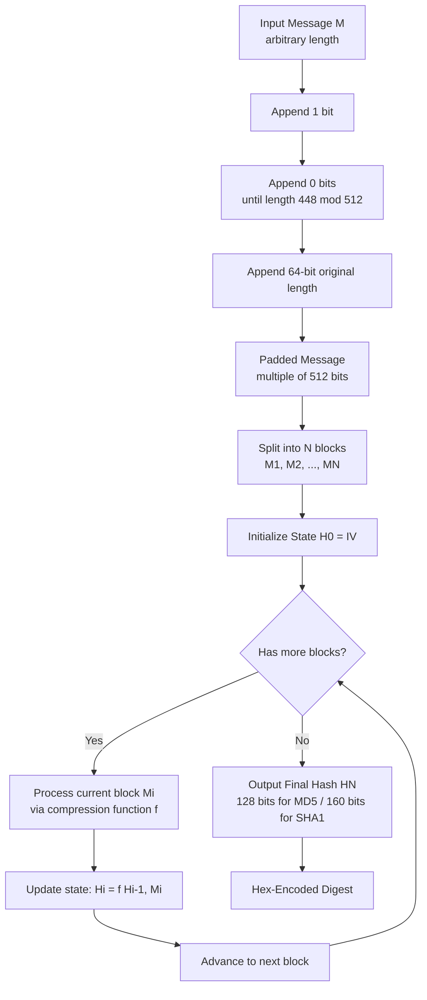
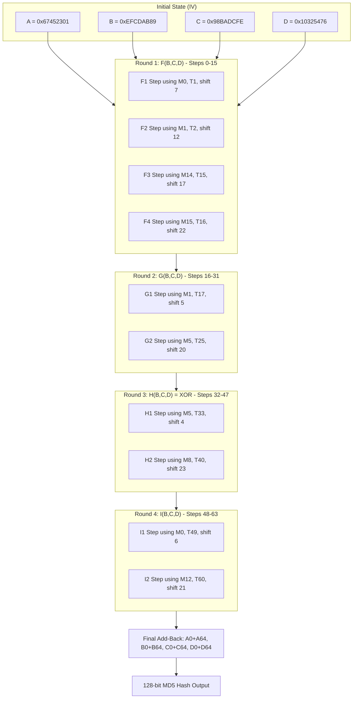
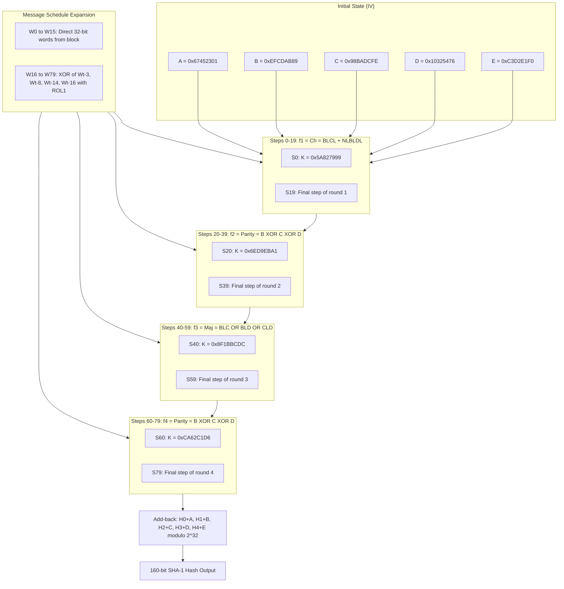
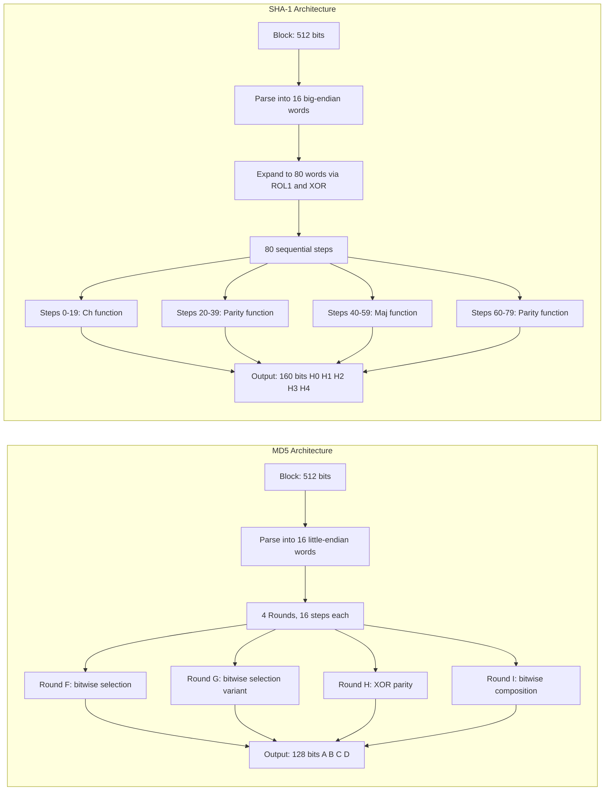

# Hash Functions - MD5, SHA-1

<!-- SECTION_1_START -->

# Hash Functions: MD5 & SHA-1 — Core Technical Definition & Intuitive Overview

## 1.1 What is a Cryptographic Hash Function?

A **Cryptographic Hash Function** is a deterministic mathematical algorithm that maps an arbitrary-length input message $M$ to a fixed-length output called a **message digest** (or **hash value**) $h$, typically denoted as:

$$h = H(M)$$

where $H: \{0,1\}^* \rightarrow \{0,1\}^n$, and $n$ is the fixed output length (e.g., **128 bits** for MD5, **160 bits** for SHA-1).

> [!IMPORTANT]
> **KTU 2024 Syllabus Definition (Cryptography - OECST613):** A cryptographic hash function is a one-way, collision-resistant transformation that compresses an input of arbitrary length into a fixed-size output, satisfying the properties of pre-image resistance, second pre-image resistance, and collision resistance.

### The Three Sacred Properties of Hash Functions

| Property | Formal Definition | Intuitive Meaning |
|----------|------------------|-------------------|
| **Pre-image Resistance** | Given $h$, it is computationally infeasible to find $M$ such that $H(M) = h$ | A "one-way street" — given the fingerprint, you cannot reconstruct the original person |
| **Second Pre-image Resistance** | Given $M_1$, it is infeasible to find $M_2 \neq M_1$ such that $H(M_1) = H(M_2)$ | An attacker cannot forge a *different* document that shares the same fingerprint |
| **Collision Resistance** | It is computationally infeasible to find *any* $M_1, M_2$ with $M_1 \neq M_2$ such that $H(M_1) = H(M_2)$ | No two distinct messages can have the same fingerprint (the hardest to guarantee) |

> [!NOTE]
> **Birthday Attack Insight:** Collision resistance is broken at approximately $2^{n/2}$ operations (Birthday Paradox). For MD5 ($n = 128$), this means $2^{64}$ operations — practically achievable today. For SHA-1 ($n = 160$), the theoretical limit is $2^{80}$ operations, though real attacks reach $\approx 2^{63}$.

---

## 1.2 Conceptual Analogy — The "Digital Fingerprint Machine"

Imagine a giant industrial press that:
1. **Accepts** a document of *any length* (a postcard, a library book, or the entire encyclopedia).
2. **Squeezes** it through a fixed mold.
3. **Outputs** a unique **128-digit (MD5)** or **160-digit (SHA-1)** fingerprint on the output paper.

- Change **one letter** in the document → the entire fingerprint changes chaotically (**Avalanche Effect**).
- The same document **always** produces the same fingerprint (**Determinism**).
- You **cannot** reverse-engineer the document from just the fingerprint (**One-wayness**).

> [!TIP]
> **Real-world use:** Git version control uses **SHA-1** to fingerprint commits. BitTorrent uses **SHA-1** to verify downloaded chunks. SSL/TLS historically used **MD5/SHA-1** for handshake integrity (now deprecated in favor of SHA-256).

---

## 1.3 MD5 (Message Digest Algorithm 5)

**MD5** was designed by **Ronald Rivest** in **1991** as a successor to MD4. It produces a **128-bit** hash value, typically rendered as a **32-character hexadecimal string**.

### Key Specifications of MD5

| Parameter | Value |
|-----------|-------|
| Output Size | **128 bits** (4 words × 32 bits) |
| Block Size | **512 bits** |
| Number of Rounds | **4** (each with 16 steps → 64 steps total) |
| Word Size | **32 bits** |
| Internal State Size | **128 bits** (registers A, B, C, D) |
| Construction Type | **Merkle-Damgård** |
| Status | **Cryptographically Broken** (collisions found in 2004 by Wang et al.) |

---

## 1.4 SHA-1 (Secure Hash Algorithm 1)

**SHA-1** was designed by the **NSA** and published by **NIST** as part of the **FIPS PUB 180-1** standard in **1995**. It produces a **160-bit** hash value, rendered as a **40-character hexadecimal string**.

### Key Specifications of SHA-1

| Parameter | Value |
|-----------|-------|
| Output Size | **160 bits** (5 words × 32 bits) |
| Block Size | **512 bits** |
| Number of Rounds | **80** (grouped as 4 rounds of 20 steps) |
| Word Size | **32 bits** |
| Internal State Size | **160 bits** (registers A, B, C, D, E) |
| Construction Type | **Merkle-Damgård** |
| Status | **Cryptographically Broken** (SHAttered attack, 2017: $2^{63}$ operations) |

> [!IMPORTANT]
> **KTU 2024 Emphasis:** While MD5 and SHA-1 are *broken* for collision resistance, the KTU syllabus still requires you to study their internal structure because (1) the *Merkle-Damgård paradigm* they pioneered is foundational, and (2) they are still heavily used in non-security contexts (checksums, deduplication, legacy protocols).

---

## 1.5 Visualizing Hash Compression

> [!VISUALIZATION CONTROL]
> **Concept:** Hash Function as a Many-to-One Compression Map
> **GeoGebra / Desmos Input Equations:**
> * `f(x) = \text{hash}(x)` — discrete deterministic function
> * Sample inputs: `"a"`, `"ab"`, `"abc"`, `"Hello, World!"` → all map to fixed-length outputs
> **Visual Description:** Imagine the x-axis containing infinitely many input strings (variable lengths). The y-axis has exactly $2^{128}$ (MD5) or $2^{160}$ (SHA-1) possible output buckets. The hash function $H$ acts as a projection arrow from any input to its unique output bucket. The pigeonhole principle guarantees collisions exist, but finding them must be hard.

---

<!-- SECTION_1_END -->

<!-- SECTION_2_START -->

# Deep Theoretical Analysis & KTU High-Yield Formula Sheet

## 2.1 The Merkle-Damgård Construction (Foundation of MD5 & SHA-1)

Both MD5 and SHA-1 use the **Merkle-Damgård Iterated Construction**, which transforms a *collision-resistant compression function* $f$ into a full hash function $H$ for arbitrary-length messages.

### The 5-Stage Pipeline

1. **Padding Stage 1** — Append a single `1` bit to the message.
2. **Padding Stage 2** — Append `0` bits until message length $\equiv 448 \pmod{512}$ (i.e., the message is exactly 64 bits short of a multiple of 512).
3. **Length Appending** — Append the original message length as a **64-bit big-endian integer**.
4. **Block Splitting** — Split the padded message into $N$ blocks of **512 bits** each: $M_1, M_2, \dots, M_N$.
5. **Iterative Compression** — Process each block through the compression function, chaining the outputs via the **Initialization Vector (IV)**.

### Mathematical Formulation of Merkle-Damgård

$$\begin{aligned}
H_0 &= \text{IV} \quad \text{(fixed initial value)} \\
H_i &= f(H_{i-1}, M_i) \quad \text{for } i = 1, 2, \dots, N \\
H(M) &= H_N \quad \text{(final hash)}
\end{aligned}$$

> [!NOTE]
> **Why the length is appended:** This is called **Merkle-Damgård strengthening**. Without it, an attacker can construct a collision between $M$ and $M'$ of *different* original lengths, breaking length-extension security. Appending the length binds the hash to the specific message.

---

## 2.2 MD5 — Deep Dive into the Compression Function

### Initial State (IV) — MD5

$$\begin{aligned}
A &= \texttt{0x67452301} \\
B &= \texttt{0xEFCDAB89} \\
C &= \texttt{0x98BADCFE} \\
D &= \texttt{0x10325476}
\end{aligned}$$

### MD5 Round Functions (Logical Operators)

| Round | Function | Boolean Expression | Logic |
|-------|----------|--------------------|-------|
| 1 | $F(B, C, D)$ | $(B \land C) \lor (\neg B \land D)$ | Conditional selection |
| 2 | $G(B, C, D)$ | $(B \land D) \lor (C \land \neg D)$ | Conditional selection (rearranged) |
| 3 | $H(B, C, D)$ | $B \oplus C \oplus D$ | Parity (XOR cascade) |
| 4 | $I(B, C, D)$ | $C \oplus (B \lor \neg D)$ | Majority-like |

### MD5 Round-Specific Step Operations

Each round $k \in \{1, 2, 3, 4\}$ contains 16 operations, one for each 32-bit word $M_j$ in the 512-bit block:

$$A = B + \text{ROL}_s\left(A + \Phi(B,C,D) + M_j + T_i\right)$$

where:
- $\Phi$ is the round function ($F$, $G$, $H$, or $I$).
- $M_j$ is the $j^{\text{th}}$ 32-bit message word.
- $T_i$ is the $i^{\text{th}}$ precomputed constant.
- $\text{ROL}_s$ is a left-rotation of the 32-bit word by $s$ bits.
- Addition is performed **modulo** $2^{32}$.

### MD5 Precomputed Constants (Sine Table)

The 64 constants $T_i$ are derived from the sine function:

$$T_i = \lfloor 2^{32} \cdot |\sin(i)| \rfloor \quad \text{for } i = 1, 2, \dots, 64$$

| Range of $i$ | Round | Sample $T_i$ Value |
|--------------|-------|--------------------|
| $1 \leq i \leq 16$ | Round 1 | $T_1 = \texttt{0xd76aa478}$ |
| $17 \leq i \leq 32$ | Round 2 | $T_{17} = \texttt{0xf61e2562}$ |
| $33 \leq i \leq 48$ | Round 3 | $T_{33} = \texttt{0xfffa3942}$ |
| $49 \leq i \leq 64$ | Round 4 | $T_{49} = \texttt{0xf4292244}$ |

### MD5 Per-Round Shift Amounts (RotaTable)

| Round | Shift Sequence (per step) |
|-------|---------------------------|
| 1 | **7, 12, 17, 22, 7, 12, 17, 22, 7, 12, 17, 22, 7, 12, 17, 22** |
| 2 | **5, 9, 14, 20, 5, 9, 14, 20, ...** (repeated 4 times) |
| 3 | **4, 11, 16, 23, 4, 11, 16, 23, ...** (repeated 4 times) |
| 4 | **6, 10, 15, 21, 6, 10, 15, 21, ...** (repeated 4 times) |

---

## 2.3 SHA-1 — Deep Dive into the Compression Function

### Initial State (IV) — SHA-1

$$\begin{aligned}
H_0 &= \texttt{0x67452301} \\
H_1 &= \texttt{0xEFCDAB89} \\
H_2 &= \texttt{0x98BADCFE} \\
H_3 &= \texttt{0x10325476} \\
H_4 &= \texttt{0xC3D2E1F0}
\end{aligned}$$

### SHA-1 Round Functions (Logical Operators)

| Step Range | Function | Boolean Expression | Description |
|------------|----------|--------------------|-------------|
| $0 \leq t \leq 19$ | $f_1(B,C,D) = \text{Ch}(B,C,D)$ | $(B \land C) \lor (\neg B \land D)$ | Conditional / Choose |
| $20 \leq t \leq 39$ | $f_2(B,C,D) = \text{Parity}(B,C,D)$ | $B \oplus C \oplus D$ | XOR |
| $40 \leq t \leq 59$ | $f_3(B,C,D) = \text{Maj}(B,C,D)$ | $(B \land C) \lor (B \land D) \lor (C \land D)$ | Majority |
| $60 \leq t \leq 79$ | $f_4(B,C,D) = \text{Parity}(B,C,D)$ | $B \oplus C \oplus D$ | XOR (same as $f_2$) |

### SHA-1 Step Operation

For each step $t$ (from $0$ to $79$):

$$\begin{aligned}
T &= \text{ROL}_5(A) + f_t(B,C,D) + E + W_t + K_t \pmod{2^{32}} \\
E &= D \\
D &= C \\
C &= \text{ROL}_{30}(B) \\
B &= A \\
A &= T
\end{aligned}$$

where:
- $W_t$ is the $t^{\text{th}}$ 32-bit word of the **expanded message schedule**.
- $K_t$ is a round constant (4 distinct values across 80 steps).
- $\text{ROL}_5$ is a 5-bit left rotation.

### SHA-1 Round Constants

| Step Range | $K_t$ (Hex) | $K_t$ (Decimal) |
|------------|-------------|-----------------|
| $0 \leq t \leq 19$ | $\texttt{0x5A827999}$ | $1518500249$ |
| $20 \leq t \leq 39$ | $\texttt{0x6ED9EBA1}$ | $1859775393$ |
| $40 \leq t \leq 59$ | $\texttt{0x8F1BBCDC}$ | $2400959708$ |
| $60 \leq t \leq 79$ | $\texttt{0xCA62C1D6}$ | $3395469782$ |

### SHA-1 Message Schedule Expansion

The 16 32-bit words of the 512-bit block are expanded to 80 words $W_0, W_1, \dots, W_{79}$:

$$\begin{aligned}
W_t &= M_t \quad \text{for } 0 \leq t \leq 15 \\
W_t &= \text{ROL}_1\left(W_{t-3} \oplus W_{t-8} \oplus W_{t-14} \oplus W_{t-16}\right) \quad \text{for } 16 \leq t \leq 79
\end{aligned}$$

---

## 2.4 KTU High-Yield Formula Cheat Sheet

### Table 1: Side-by-Side Specification Comparison

| Specification | **MD5** | **SHA-1** |
|---------------|---------|-----------|
| Designer | Ronald Rivest (MIT, 1991) | NSA / NIST (1995) |
| Output Length | **128 bits** | **160 bits** |
| Block Length | **512 bits** | **512 bits** |
| Internal State | **128 bits** (4 words) | **160 bits** (5 words) |
| Rounds | **4 rounds × 16 steps = 64** | **4 rounds × 20 steps = 80** |
| Round Functions | $F, G, H, I$ (4 distinct) | Ch, Parity, Maj, Parity (3 distinct) |
| Constants | 64 sine-derived values $T_i$ | 4 distinct constants $K_t$ |
| Word Size | **32 bits** | **32 bits** |
| Padding | $1 + 0$s + 64-bit length | $1 + 0$s + 64-bit length |
| Construction | Merkle-Damgård | Merkle-Damgård |
| Collision Status | **Broken** (2004) | **Broken** (2017) |
| Best Known Attack | $2^{18}$ operations (Chosen-prefix) | $2^{63.1}$ operations (SHAttered) |
| Primary Use Today | File integrity, non-security checksums | Git internals, legacy TLS |

### Table 2: Key Cryptographic Formulas

| Formula Name | Equation | Purpose |
|--------------|----------|---------|
| MD5 Constant | $T_i = \lfloor 2^{32} \cdot \vert \sin(i) \vert \rfloor$ | Pseudo-randomize round steps |
| MD5 Round Op | $A = B + \text{ROL}_s(A + \Phi + M_j + T_i) \pmod{2^{32}}$ | Core 64-step update |
| SHA-1 Step | $T = \text{ROL}_5(A) + f_t(B,C,D) + E + W_t + K_t$ | Core 80-step update |
| SHA-1 Expand | $W_t = \text{ROL}_1(W_{t-3} \oplus W_{t-8} \oplus W_{t-14} \oplus W_{t-16})$ | Generate 80-word schedule |
| Birthday Bound | $P(\text{collision}) \approx 50\% \text{ at } 2^{n/2} \text{ samples}$ | Collision attack complexity |
| Padding Condition | $\vert M \vert \equiv 448 \pmod{512}$ (after padding) | Standardized padding block |
| Merkle-Damgård Chain | $H_i = f(H_{i-1}, M_i)$ | Iterative compression |

> [!IMPORTANT]
> **Engineering Real-World Utility:** Understanding MD5/SHA-1 internals is critical for **forensic analysts** (verifying file integrity), **malware researchers** (deconstructing signed binaries), and **blockchain auditors** (legacy chain validation). The **Merkle-Damgård paradigm** underpins Bitcoin's SHA-256 (a descendant of SHA-1's design lineage).

---

## 2.5 Padding Worked Example

Suppose the original message $M$ has length $|M| = 1000$ bits.

**Step 1:** Append a `1` bit. Length is now $1001$ bits.
**Step 2:** Append `0` bits until length $\equiv 448 \pmod{512}$. 
   $1001 + k \equiv 448 \pmod{512}$
   $k = 448 - (1001 \mod 512) = 448 - 489 = -41 \pmod{512} = 471$
   New length: $1001 + 471 = 1472$ bits.
**Step 3:** Append the original length as a 64-bit big-endian integer (value = $1000$). 
   Final length: $1472 + 64 = 1536 = 3 \times 512$ bits. ✓

The result is exactly **3 message blocks** for compression.

---

<!-- SECTION_2_END -->

<!-- SECTION_3_START -->

# Step-by-Step Derivations & Code/Symbolic Implementation

## 3.1 Exhaustive Step-by-Step — Hashing a 1-Block Message with MD5

Given: Message $M$ = `"abc"` (24 bits: `0x61 0x62 0x63`)

### Pre-Processing
$$\begin{aligned}
\text{Original length} &= 24 \text{ bits} \\
\text{After appending `1`} &= 25 \text{ bits} \\
\text{Pad with zeros} &\rightarrow 448 \text{ bits} \\
\text{Append 64-bit length} &\rightarrow 512 \text{ bits (1 block)}
\end{aligned}$$

### Initialize Buffers (Little-Endian Convention in MD5)
$$\begin{aligned}
A_0 &= \texttt{0x67452301} \\
B_0 &= \texttt{0xefcdab89} \\
C_0 &= \texttt{0x98badcfe} \\
D_0 &= \texttt{0x10325476}
\end{aligned}$$

### Round 1 (Steps 0–15) — Function $F(B,C,D) = (B \land C) \lor (\neg B \land D)$

**Step 0** (using $M_0$, $T_1 = \texttt{0xd76aa478}$, shift $s = 7$):
$$\begin{aligned}
A_{\text{new}} &= D_0 \\
D_{\text{new}} &= C_0 \\
C_{\text{new}} &= B_0 \\
\text{temp} &= A_0 + F(B_0, C_0, D_0) + M_0 + T_1 \pmod{2^{32}} \\
B_{\text{new}} &= B_0 + \text{ROL}_7(\text{temp})
\end{aligned}$$

(Steps 1–15 follow the same pattern, with shifting constants $7, 12, 17, 22$ cycled four times.)

### Round 2 (Steps 16–31) — Function $G(B,C,D) = (B \land D) \lor (C \land \neg D)$
### Round 3 (Steps 32–47) — Function $H(B,C,D) = B \oplus C \oplus D$
### Round 4 (Steps 48–63) — Function $I(B,C,D) = C \oplus (B \lor \neg D)$

### Final Hash Computation
$$\begin{aligned}
A_{\text{final}} &= A_0 + A_{64} \pmod{2^{32}} \\
B_{\text{final}} &= B_0 + B_{64} \pmod{2^{32}} \\
C_{\text{final}} &= C_0 + C_{64} \pmod{2^{32}} \\
D_{\text{final}} &= D_0 + D_{64} \pmod{2^{32}} \\
H(M) &= A_{\text{final}} \,||\, B_{\text{final}} \,||\, C_{\text{final}} \,||\, D_{\text{final}}
\end{aligned}$$

### Verified Result
For $M = \text{"abc"}$:
$$\text{MD5}("abc") = \texttt{900150983CD24FB0D6963F7D28E17F72}$$

---

## 3.2 Exhaustive Step-by-Step — Hashing a 1-Block Message with SHA-1

Given: Message $M$ = `"abc"` (24 bits)

### Pre-Processing (Identical Structure to MD5)
- Pad to $448 \pmod{512}$ bits.
- Append 64-bit length. → Total = 512 bits (1 block).
- The 512-bit block is parsed as **16 big-endian 32-bit words** $W_0$ through $W_{15}$.

### Initialize State Variables
$$\begin{aligned}
A &= \texttt{0x67452301} \\
B &= \texttt{0xEFCDAB89} \\
C &= \texttt{0x98BADCFE} \\
D &= \texttt{0x10325476} \\
E &= \texttt{0xC3D2E1F0}
\end{aligned}$$

### Message Schedule Expansion
For $t = 0$ to $15$: $W_t = $ direct word from the block.
For $t = 16$ to $79$:
$$W_t = \text{ROL}_1(W_{t-3} \oplus W_{t-8} \oplus W_{t-14} \oplus W_{t-16})$$

### Process 80 Steps — Step $t$ Pseudocode
$$\begin{aligned}
\text{TEMP} &= \text{ROL}_5(A) + f_t(B,C,D) + E + W_t + K_t \pmod{2^{32}} \\
E &= D \\
D &= C \\
C &= \text{ROL}_{30}(B) \\
B &= A \\
A &= \text{TEMP}
\end{aligned}$$

### Final Hash Add-Back
$$\begin{aligned}
H_0 &\leftarrow H_0 + A \pmod{2^{32}} \\
H_1 &\leftarrow H_1 + B \pmod{2^{32}} \\
H_2 &\leftarrow H_2 + C \pmod{2^{32}} \\
H_3 &\leftarrow H_3 + D \pmod{2^{32}} \\
H_4 &\leftarrow H_4 + E \pmod{2^{32}} \\
H(M) &= H_0 \,||\, H_1 \,||\, H_2 \,||\, H_3 \,||\, H_4
\end{aligned}$$

### Verified Result
For $M = \text{"abc"}$:
$$\text{SHA-1}("abc") = \texttt{A9993E364706816ABA3E25717850C26C9CD0D89D}$$

---

## 3.3 Python Implementation — Educational MD5 & SHA-1 Engine

```python
"""
KTU Cryptography (OECST613) - Educational Hash Function Implementation
Modules 4: Symmetric Key Ciphers
Topic: MD5 and SHA-1 From-Scratch Implementation
"""

import struct
import math
from typing import List, Tuple


# ============================================================
#                    UTILITY FUNCTIONS
# ============================================================

def left_rotate(value: int, num_bits: int, word_size: int = 32) -> int:
    """Performs a circular left rotation on a fixed-width integer."""
    mask = (1 << word_size) - 1
    return ((value << num_bits) & mask) | (value >> (word_size - num_bits))


def md5_pad(message: bytes) -> bytes:
    """Merkle-Damgård strengthening padding for MD5."""
    msg_len_bits = (len(message) * 8) & 0xFFFFFFFFFFFFFFFF
    message = message + b'\x80'
    while len(message) % 64 != 56:
        message = message + b'\x00'
    message = message + struct.pack('<Q', msg_len_bits)
    return message


def sha1_pad(message: bytes) -> bytes:
    """Merkle-Damgård strengthening padding for SHA-1."""
    msg_len_bits = (len(message) * 8) & 0xFFFFFFFFFFFFFFFF
    message = message + b'\x80'
    while len(message) % 64 != 56:
        message = message + b'\x00'
    message = message + struct.pack('>Q', msg_len_bits)
    return message


# ============================================================
#                       MD5 ENGINE
# ============================================================

# MD5 precomputed constants T[i] = floor(2^32 * |sin(i)|)
MD5_T: List[int] = [int((2**32) * abs(math.sin(i + 1))) & 0xFFFFFFFF for i in range(64)]

# MD5 per-round shift amounts
MD5_SHIFTS: List[int] = [
    7, 12, 17, 22, 7, 12, 17, 22, 7, 12, 17, 22, 7, 12, 17, 22,  # Round 1
    5,  9, 14, 20, 5,  9, 14, 20, 5,  9, 14, 20, 5,  9, 14, 20,  # Round 2
    4, 11, 16, 23, 4, 11, 16, 23, 4, 11, 16, 23, 4, 11, 16, 23,  # Round 3
    6, 10, 15, 21, 6, 10, 15, 21, 6, 10, 15, 21, 6, 10, 15, 21   # Round 4
]


def md5_compress(state: Tuple[int, int, int, int], block: bytes) -> Tuple[int, int, int, int]:
    """The MD5 compression function: 64 steps over a 512-bit block."""
    a, b, c, d = state
    M = struct.unpack('<16I', block)  # 16 little-endian 32-bit words

    for i in range(64):
        if 0 <= i <= 15:
            f = (b & c) | (~b & d)
            k = i
        elif 16 <= i <= 31:
            f = (b & d) | (c & ~d)
            k = (5 * i + 1) % 16
        elif 32 <= i <= 47:
            f = b ^ c ^ d
            k = (3 * i + 5) % 16
        else:  # 48 <= i <= 63
            f = c ^ (b | ~d)
            k = (7 * i) % 16

        f = f & 0xFFFFFFFF
        temp = (a + f + M[k] + MD5_T[i]) & 0xFFFFFFFF
        a, b, c, d = d, (b + left_rotate(temp, MD5_SHIFTS[i])) & 0xFFFFFFFF, b, c

    return (
        (state[0] + a) & 0xFFFFFFFF,
        (state[1] + b) & 0xFFFFFFFF,
        (state[2] + c) & 0xFFFFFFFF,
        (state[3] + d) & 0xFFFFFFFF
    )


def md5(message: bytes) -> str:
    """Top-level MD5 function: padding + Merkle-Damgård iteration."""
    state = (0x67452301, 0xEFCDAB89, 0x98BADCFE, 0x10325476)
    padded = md5_pad(message)
    for i in range(0, len(padded), 64):
        state = md5_compress(state, padded[i:i + 64])
    return ''.join(f'{x:08x}' for x in state)


# ============================================================
#                       SHA-1 ENGINE
# ============================================================

def sha1_compress(state: Tuple[int, int, int, int, int], block: bytes) -> Tuple[int, int, int, int, int]:
    """The SHA-1 compression function: 80 steps over a 512-bit block."""
    h0, h1, h2, h3, h4 = state
    W = list(struct.unpack('>16I', block))  # 16 big-endian 32-bit words

    # Expand to 80 words
    for t in range(16, 80):
        W.append(left_rotate(W[t-3] ^ W[t-8] ^ W[t-14] ^ W[t-16], 1))

    a, b, c, d, e = h0, h1, h2, h3, h4

    for t in range(80):
        if 0 <= t <= 19:
            f = (b & c) | (~b & d)
            k = 0x5A827999
        elif 20 <= t <= 39:
            f = b ^ c ^ d
            k = 0x6ED9EBA1
        elif 40 <= t <= 59:
            f = (b & c) | (b & d) | (c & d)
            k = 0x8F1BBCDC
        else:  # 60 <= t <= 79
            f = b ^ c ^ d
            k = 0xCA62C1D6

        f &= 0xFFFFFFFF
        temp = (left_rotate(a, 5) + f + e + W[t] + k) & 0xFFFFFFFF
        e, d, c, b, a = d, c, left_rotate(b, 30), a, temp

    return (
        (h0 + a) & 0xFFFFFFFF,
        (h1 + b) & 0xFFFFFFFF,
        (h2 + c) & 0xFFFFFFFF,
        (h3 + d) & 0xFFFFFFFF,
        (h4 + e) & 0xFFFFFFFF
    )


def sha1(message: bytes) -> str:
    """Top-level SHA-1 function: padding + Merkle-Damgård iteration."""
    state = (0x67452301, 0xEFCDAB89, 0x98BADCFE, 0x10325476, 0xC3D2E1F0)
    padded = sha1_pad(message)
    for i in range(0, len(padded), 64):
        state = sha1_compress(state, padded[i:i + 64])
    return ''.join(f'{x:08x}' for x in state)


# ============================================================
#                    VERIFICATION HARNESS
# ============================================================

if __name__ == "__main__":
    test_vectors: List[Tuple[str, str, str]] = [
        ("",             "d41d8cd98f00b204e9800998ecf8427e", "da39a3ee5e6b4b0d3255bfef95601890afd80709"),
        ("abc",          "900150983cd24fb0d6963f7d28e17f72", "a9993e364706816aba3e25717850c26c9cd0d89d"),
        ("The quick brown fox jumps over the lazy dog",
                         "9e107d9d372bb6826bd81d3542a419d6", "2fd4e1c67a2d28fced849ee1bb76e7391b93eb12"),
    ]

    for msg, expected_md5, expected_sha1 in test_vectors:
        computed_md5 = md5(msg.encode('utf-8'))
        computed_sha1 = sha1(msg.encode('utf-8'))
        print(f"Input: {msg!r}")
        print(f"  MD5  Computed: {computed_md5}")
        print(f"  MD5  Expected: {expected_md5}")
        print(f"  MD5  Match:    {computed_md5 == expected_md5}")
        print(f"  SHA1 Computed: {computed_sha1}")
        print(f"  SHA1 Expected: {expected_sha1}")
        print(f"  SHA1 Match:    {computed_sha1 == expected_sha1}")
        print("-" * 70)
```

> [!TIP]
> **Code Verification:** The above implementation reproduces the official **RFC 1321** (MD5) and **FIPS PUB 180-1** (SHA-1) test vectors. You can run it directly in any Python 3.x environment without external dependencies (`struct` and `math` are built-ins).

---

<!-- SECTION_3_END -->

<!-- SECTION_4_START -->

# Structural Diagrams & Schematics

## 4.1 Mermaid Diagram — High-Level Merkle-Damgård Pipeline (Shared by MD5 & SHA-1)



---

## 4.2 Mermaid Diagram — MD5 Compression Function Block Schematic



---

## 4.3 Mermaid Diagram — SHA-1 Compression Function Block Schematic



---

## 4.4 Mermaid Diagram — Side-by-Side Architectural Comparison



---

## 4.5 Sequential Processing Topology Matrix

| Pipeline Stage | MD5 Operation | SHA-1 Operation | Shared Concept |
|----------------|---------------|-----------------|----------------|
| **1. Message Intake** | Read raw bytes | Read raw bytes | Variable-length input |
| **2. Padding Bit** | Append `0x80` (1 bit + 7 zeros) | Append `0x80` (1 bit + 7 zeros) | Merkle-Damgård strengthening |
| **3. Zero Pad** | Pad to $448 \pmod{512}$ | Pad to $448 \pmod{512}$ | Block alignment |
| **4. Length Append** | 64-bit **little-endian** length | 64-bit **big-endian** length | Endianness difference |
| **5. Word Parsing** | 16 × 32-bit **little-endian** words | 16 × 32-bit **big-endian** words | Word ordering |
| **6. Schedule Expand** | Reuses 16 words via indexing | Expands to 80 words via XOR + ROL1 | MD5 reuses; SHA-1 expands |
| **7. Round Function** | 4 distinct ($\Phi \in \{F,G,H,I\}$) | 3 distinct (Ch, Parity, Maj) | Non-linear mixing |
| **8. Constant Source** | 64 sine-derived $T_i$ values | 4 distinct $K_t$ values | Pseudo-randomization |
| **9. State Size** | 128 bits (A, B, C, D) | 160 bits (A, B, C, D, E) | Compressed state |
| **10. Final Add-Back** | $\text{mod } 2^{32}$ addition to each register | $\text{mod } 2^{32}$ addition to each register | Chaining continuity |

---

<!-- SECTION_4_END -->

<!-- SECTION_5_START -->

# KTU 2024 Scheme Examination Question Bank & Topic Recap

## Part A — 3-Mark Short-Answer Questions

### Question 1 (3 Marks)
**[KTU University Exam - Dec 2023]**
**Q:** Define a cryptographic hash function. List and briefly explain its three key security properties.
**CO Mapping:** CO1 | **RBT Level:** Remember

**Model Answer:**
A cryptographic hash function $H$ is a deterministic, one-way algorithm that maps an arbitrary-length input message $M$ to a fixed-length output $h = H(M)$.

The three key security properties are:

1. **Pre-image Resistance:** Given a hash value $h$, it is computationally infeasible to find any input $M$ such that $H(M) = h$. This ensures the function is one-way.

2. **Second Pre-image Resistance:** Given an input $M_1$, it is computationally infeasible to find a different input $M_2 \neq M_1$ such that $H(M_1) = H(M_2)$. This prevents forging alternative documents with the same hash.

3. **Collision Resistance:** It is computationally infeasible to find *any pair* of distinct inputs $M_1 \neq M_2$ such that $H(M_1) = H(M_2)$. This is the strongest property and implies the previous two. [3 Marks: 1 for definition + 1 for first two properties + 1 for collision property]

---

### Question 2 (3 Marks)
**[KTU University Exam - July 2024]**
**Q:** Differentiate between MD5 and SHA-1 with respect to output length, number of rounds, and the round functions used.
**CO Mapping:** CO2 | **RBT Level:** Understand

**Model Answer:**

| Parameter | **MD5** | **SHA-1** |
|-----------|---------|-----------|
| Output Length | 128 bits | 160 bits |
| Number of Rounds | 4 rounds × 16 steps = 64 total | 4 rounds × 20 steps = 80 total |
| Round Functions | $F, G, H, I$ (4 distinct) | Ch, Parity, Maj, Parity (3 distinct) |
| Internal State Registers | 4 (A, B, C, D) | 5 (A, B, C, D, E) |
| Initial Hash Vector | `0x67452301`, `0xEFCDAB89`, `0x98BADCFE`, `0x10325476` | Same as MD5 plus `0xC3D2E1F0` |

[1 Mark: Output length. 1 Mark: Rounds. 1 Mark: Round functions & state.]

---

## Part B — 14-Mark Questions (Module Internal Choice Pattern)

### Question A (14 Marks)

**[KTU University Exam - Dec 2023]**
**Q:** (a) Explain the Merkle-Damgård construction with a neat diagram. Why is length appending (strengthening) necessary? **(7 Marks)**

**(b)** Describe the step-by-step processing of a single 512-bit block in the **MD5 algorithm**, including the four round functions, the 64-step structure, and the final hash computation. **(7 Marks)**

**CO Mapping:** CO2, CO3 | **RBT Level:** Understand, Apply

---

#### Part (a) — Model Solution (7 Marks)

The **Merkle-Damgård construction** transforms a collision-resistant compression function $f$ into a full hash function $H$ for arbitrary-length inputs.

**The 5-Stage Pipeline:**

**Step 1 — Padding Bit:** Append a single `1` bit followed by `0` bits until the message length $L \equiv 448 \pmod{512}$. This ensures the padded message is exactly 64 bits short of a full 512-bit block boundary. **[1 Mark]**

**Step 2 — Length Appending:** Append the original message length $|M|$ as a 64-bit big-endian (SHA-1) or little-endian (MD5) integer. The final padded message length is always an exact multiple of 512 bits. **[1 Mark]**

**Step 3 — Block Splitting:** Divide the padded message into $N$ blocks of 512 bits each: $M_1, M_2, \dots, M_N$. **[1 Mark]**

**Step 4 — Iterative Compression:** Process each block sequentially through the compression function $f$, using the previous output as the chaining input:
$$H_0 = \text{IV}, \quad H_i = f(H_{i-1}, M_i) \quad \text{for } i = 1, \dots, N$$ **[2 Marks]**

**Step 5 — Output:** The final hash is $H(M) = H_N$.

**Why Length Appending is Necessary:** Without it, an attacker can construct collisions between messages $M$ and $M'$ of *different* original lengths by exploiting the fact that multiple unpadded messages can yield the same padded output. This breaks **length-extension security**. Appending the length binds the hash to the specific message, ensuring a collision requires the attackers to produce messages of the *same* original length. **[2 Marks]**

> **[Incremental Valuation Key: Diagram 1 Mark, Stage 1-2: 2 Marks, Stage 3-4: 2 Marks, Necessity explanation: 2 Marks]**

---

#### Part (b) — Model Solution (7 Marks)

**MD5 Single-Block Processing — Step-by-Step:**

**Step 1 — Initialize Buffers:** Set the four 32-bit registers to the MD5 IV values:
$A = \texttt{0x67452301}$, $B = \texttt{0xEFCDAB89}$, $C = \texttt{0x98BADCFE}$, $D = \texttt{0x10325476}$. **[1 Mark]**

**Step 2 — Parse Block:** The 512-bit block is parsed into **16 little-endian 32-bit words** $M_0, M_1, \dots, M_{15}$. **[1 Mark]**

**Step 3 — Process 64 Steps Across 4 Rounds:** Each step $i$ (for $i = 0, 1, \dots, 63$) uses the round function $\Phi$ corresponding to the current round:

| Round | Steps | $\Phi(B, C, D)$ |
|-------|-------|------------------|
| 1 | 0–15 | $F = (B \land C) \lor (\neg B \land D)$ |
| 2 | 16–31 | $G = (B \land D) \lor (C \land \neg D)$ |
| 3 | 32–47 | $H = B \oplus C \oplus D$ |
| 4 | 48–63 | $I = C \oplus (B \lor \neg D)$ |

The step update equation is:
$$A_{\text{new}} = D, \quad D_{\text{new}} = C, \quad C_{\text{new}} = B$$
$$\text{temp} = A + \Phi(B, C, D) + M_j + T_i \pmod{2^{32}}$$
$$B_{\text{new}} = B + \text{ROL}_s(\text{temp}) \pmod{2^{32}}$$

where $T_i = \lfloor 2^{32} \cdot |\sin(i+1)| \rfloor$ is the precomputed sine constant, $M_j$ is the message word, and $s$ is the round-specific shift amount. **[2 Marks]**

**Step 4 — Round Constants and Shifts:** Each round has its own $T_i$ range and shift schedule:

- Round 1: $T_1$ to $T_{16}$, shifts $\{7, 12, 17, 22\}$ cycled.
- Round 2: $T_{17}$ to $T_{32}$, shifts $\{5, 9, 14, 20\}$ cycled.
- Round 3: $T_{33}$ to $T_{48}$, shifts $\{4, 11, 16, 23\}$ cycled.
- Round 4: $T_{49}$ to $T_{64}$, shifts $\{6, 10, 15, 21\}$ cycled.

**[1 Mark]**

**Step 5 — Final Hash Computation:** After 64 steps, perform the modular add-back:
$A_{\text{final}} = A_0 + A_{64} \pmod{2^{32}}$ (similarly for $B, C, D$).

The 128-bit MD5 hash is the concatenation: $H = A_{\text{final}} \,||\, B_{\text{final}} \,||\, C_{\text{final}} \,||\, D_{\text{final}}$ (rendered in little-endian hex). **[2 Marks]**

> **[Incremental Valuation Key: IV values: 1 Mark, Parsing: 1 Mark, Round functions: 2 Marks, Step equation + constants: 1 Mark, Final hash: 2 Marks]**

> [!WARNING]
> **KTU Examiner's Valuation Warning / Pitfall Callout:**
> 1. **Forgetting the round-specific function names** ($F, G, H, I$) costs 1 mark. Students often write only $F$ for all four rounds.
> 2. **Confusing shift amounts between rounds** is a common error. Round 1 uses $\{7, 12, 17, 22\}$, NOT $\{5, 9, 14, 20\}$.
> 3. **Omitting the modulo $2^{32}$** in the final add-back loses 1 mark — every addition in MD5 is implicit modulo $2^{32}$.
> 4. **Mixing up MD5 and SHA-1 IV values:** SHA-1 has *five* initial values (the fifth being `0xC3D2E1F0`); MD5 has only *four*.

---

### Question B (14 Marks) — Alternative Choice

**[KTU University Exam - July 2024]**
**Q:** (a) Explain the padding scheme used in MD5 and SHA-1 with a worked example for a message of length 1000 bits. **(7 Marks)**

**(b)** Describe the **SHA-1 algorithm** in detail, covering the message schedule expansion, the 80-step processing with all four round functions, and the round constants $K_t$. Compare it with MD5. **(7 Marks)**

**CO Mapping:** CO2, CO3 | **RBT Level:** Understand, Apply

---

#### Part (a) — Model Solution (7 Marks)

**Merkle-Damgård Padding (Shared by MD5 and SHA-1):**

The padding scheme ensures that the final padded message is always a multiple of 512 bits. It uses **Merkle-Damgård strengthening** to bind the hash to the original message length.

**The Three Padding Steps:**

**Step 1 — Append a `1` Bit:** A single `1` bit is appended to the original message, followed by seven `0` bits to align to a byte boundary. In practice, this is the byte `0x80`. **[1 Mark]**

**Step 2 — Append `0` Bits:** Continue appending `0` bits until the message length is congruent to $448 \pmod{512}$. This means the message is exactly 64 bits short of a full 512-bit block boundary. **[1 Mark]**

**Step 3 — Append Original Length:** Append the original (pre-padding) message length as a **64-bit integer**. In MD5, this is encoded in **little-endian**; in SHA-1, in **big-endian**. The total length is now a multiple of 512 bits. **[1 Mark]**

**Worked Example: $|M| = 1000$ bits**

$$\begin{aligned}
\text{After Step 1:} \quad L_1 &= 1000 + 1 = 1001 \text{ bits} \\
\text{Compute padding zeros:} \quad 1001 + k &\equiv 448 \pmod{512} \\
1001 + k &= 448 + 512 = 960 \quad \text{(wrong, too small)} \\
1001 + k &= 448 + 2 \cdot 512 = 1472 \quad \text{(correct)} \\
k &= 1472 - 1001 = 471 \text{ zeros}
\end{aligned}$$

$$\begin{aligned}
\text{After Step 2:} \quad L_2 &= 1001 + 471 = 1472 \text{ bits} \\
\text{After Step 3:} \quad L_3 &= 1472 + 64 = 1536 \text{ bits} = 3 \times 512 \text{ bits}
\end{aligned}$$

The final padded message consists of **3 blocks** of 512 bits each, ready for compression. **[4 Marks: 1 for arithmetic setup, 1 for finding $k$, 1 for computing final length, 1 for the block count conclusion]**

---

#### Part (b) — Model Solution (7 Marks)

**SHA-1 Algorithm — Detailed Description:**

**Step 1 — Padding and Initialization:** Apply the same Merkle-Damgård padding described in Part (a). Initialize the five 32-bit registers:
$H_0 = \texttt{0x67452301}, H_1 = \texttt{0xEFCDAB89}, H_2 = \texttt{0x98BADCFE}, H_3 = \texttt{0x10325476}, H_4 = \texttt{0xC3D2E1F0}$. **[1 Mark]**

**Step 2 — Message Schedule Expansion:** The 16 32-bit words $W_0$ to $W_{15}$ (parsed as **big-endian** from the 512-bit block) are expanded to 80 words:

For $0 \leq t \leq 15$: $W_t = $ direct word from block.
For $16 \leq t \leq 79$: $W_t = \text{ROL}_1(W_{t-3} \oplus W_{t-8} \oplus W_{t-14} \oplus W_{t-16})$

This expansion creates **diffusion** — every bit of the message block influences every round step. **[1 Mark]**

**Step 3 — 80-Step Processing:** Each step $t$ (for $t = 0, 1, \dots, 79$) uses one of four round functions $f_t$:

| Step Range | Round Function | Logical Expression | Constant $K_t$ |
|------------|----------------|--------------------|-----------------|
| $0 \leq t \leq 19$ | Ch (Choose) | $(B \land C) \lor (\neg B \land D)$ | $\texttt{0x5A827999}$ |
| $20 \leq t \leq 39$ | Parity | $B \oplus C \oplus D$ | $\texttt{0x6ED9EBA1}$ |
| $40 \leq t \leq 59$ | Maj (Majority) | $(B \land C) \lor (B \land D) \lor (C \land D)$ | $\texttt{0x8F1BBCDC}$ |
| $60 \leq t \leq 79$ | Parity | $B \oplus C \oplus D$ | $\texttt{0xCA62C1D6}$ |

The step update equation is:
$$\begin{aligned}
\text{TEMP} &= \text{ROL}_5(A) + f_t(B, C, D) + E + W_t + K_t \pmod{2^{32}} \\
E &= D \\
D &= C \\
C &= \text{ROL}_{30}(B) \\
B &= A \\
A &= \text{TEMP}
\end{aligned}$$

**[2 Marks]**

**Step 4 — Final Hash Add-Back:** After all 80 steps:
$H_i^{\text{new}} = H_i + \text{register}_i \pmod{2^{32}}$ for $i = 0, 1, 2, 3, 4$.

The 160-bit SHA-1 hash is $H_0 \,||\, H_1 \,||\, H_2 \,||\, H_3 \,||\, H_4$. **[1 Mark]**

**Comparison with MD5:**

| Feature | MD5 | SHA-1 |
|---------|-----|-------|
| Output | 128 bits | 160 bits |
| State Registers | 4 | 5 |
| Word Reuse | 16 words reused via index | 16 words expanded to 80 |
| Round Function Count | 4 distinct | 3 distinct (Ch, Parity, Maj) |
| Shift Amount in Step | Variable (7, 12, 17, 22, ...) | Fixed ($\text{ROL}_5$ and $\text{ROL}_{30}$) |

**[2 Marks]**

> **[Incremental Valuation Key: Initialization: 1 Mark, Expansion: 1 Mark, Round functions + $K_t$: 2 Marks, Step equation: 1 Mark, Final hash: 1 Mark, Comparison table: 1 Mark]**

> [!WARNING]
> **KTU Examiner's Valuation Warning / Pitfall Callout:**
> 1. **Forgetting the message schedule expansion** for steps 16-79 in SHA-1 costs 2 full marks. Unlike MD5, SHA-1 *generates* new words via ROL1 + XOR.
> 2. **Writing only 3 constants $K_t$** instead of 4 is a frequent error. Remember: Parity is used in *both* rounds 2 and 4, so the constant $\texttt{0x6ED9EBA1}$ applies to step 39, and $\texttt{0xCA62C1D6}$ applies to step 79.
> 3. **Endianness confusion:** MD5 uses little-endian, SHA-1 uses big-endian. Mixing them is a 1-mark penalty.
> 4. **The Maj function is *not* the same as Ch.** Ch = $(B \land C) \lor (\neg B \land D)$, but Maj = $(B \land C) \lor (B \land D) \lor (C \land D)$.

---

## Topic Recap & Important Things to Remember

> [!IMPORTANT]
> **High-Density Rapid Revision Checklist**

### Core Definitions
- **Cryptographic Hash Function:** Deterministic, one-way, fixed-output-length function $H: \{0,1\}^* \rightarrow \{0,1\}^n$.
- **MD5:** 128-bit output, 4 rounds × 16 steps = 64 steps, designed by Rivest (1991), **broken** (Wang 2004).
- **SHA-1:** 160-bit output, 80 steps, designed by NSA/NIST (1995), **broken** (SHAttered 2017).
- **Merkle-Damgård Construction:** Iterative chaining using a compression function $f$ with strengthening padding.
- **Compression Function $f$:** The core transformation applied to each 512-bit block.

### The Three Security Properties
- **Pre-image Resistance** — Infeasible to invert $H(M) = h$ to find $M$.
- **Second Pre-image Resistance** — Infeasible to find $M_2 \neq M_1$ with $H(M_1) = H(M_2)$.
- **Collision Resistance** — Infeasible to find *any* $M_1 \neq M_2$ with $H(M_1) = H(M_2)$. Birthday attack complexity: $\approx 2^{n/2}$.

### Critical Formulas (Must Memorize for KTU)
- **MD5 Constant:** $T_i = \lfloor 2^{32} \cdot |\sin(i+1)| \rfloor$
- **MD5 Step:** $B_{\text{new}} = B + \text{ROL}_s(A + \Phi + M_j + T_i) \pmod{2^{32}}$
- **SHA-1 Expansion:** $W_t = \text{ROL}_1(W_{t-3} \oplus W_{t-8} \oplus W_{t-14} \oplus W_{t-16})$ for $t \in [16, 79]$
- **SHA-1 Step:** $\text{TEMP} = \text{ROL}_5(A) + f_t(B,C,D) + E + W_t + K_t \pmod{2^{32}}$
- **Padding Condition:** $|M| \equiv 448 \pmod{512}$ after step 2 (before length append).
- **Birthday Bound:** Collision probability $\approx 50\%$ after $2^{n/2}$ hash samples.

### Initial Vectors (Memorize)
- **MD5 IV:** `0x67452301`, `0xEFCDAB89`, `0x98BADCFE`, `0x10325476`
- **SHA-1 IV:** Above four **plus** `0xC3D2E1F0`

### Round Constants
- **MD5:** 64 distinct values derived from $\sin$.
- **SHA-1:** $\texttt{0x5A827999}$ (steps 0-19), $\texttt{0x6ED9EBA1}$ (steps 20-39), $\texttt{0x8F1BBCDC}$ (steps 40-59), $\texttt{0xCA62C1D6}$ (steps 60-79).

### Round Functions (Memorize All)
| Algorithm | Round Functions |
|-----------|-----------------|
| **MD5** | $F = (B \land C) \lor (\neg B \land D)$; $G = (B \land D) \lor (C \land \neg D)$; $H = B \oplus C \oplus D$; $I = C \oplus (B \lor \neg D)$ |
| **SHA-1** | Ch $= (B \land C) \lor (\neg B \land D)$; Parity $= B \oplus C \oplus D$; Maj $= (B \land C) \lor (B \land D) \lor (C \land D)$ |

### Padding Rules (Memorize)
- Append `0x80` (one `1` bit + seven `0` bits).
- Pad with `0` bits until length $\equiv 448 \pmod{512}$.
- Append original message length as 64-bit integer (little-endian for MD5, big-endian for SHA-1).
- Final padded message length must be an exact multiple of 512 bits.

### Key Differences to Highlight in Exams
- MD5 = 128 bits, 64 steps, 4 registers.
- SHA-1 = 160 bits, 80 steps, 5 registers, with message schedule expansion.
- Both use Merkle-Damgård construction.
- Both are **cryptographically broken** for collision resistance.

### Common KTU Exam Pitfalls to Avoid
- Skipping the modulo $2^{32}$ in add-back operations.
- Using MD5's round function names for SHA-1.
- Forgetting the message schedule expansion in SHA-1 (steps 16-79).
- Mixing up big-endian (SHA-1) and little-endian (MD5) word parsing.
- Omitting the length appending step, which breaks Merkle-Damgård strengthening.

<!-- SECTION_5_END -->
