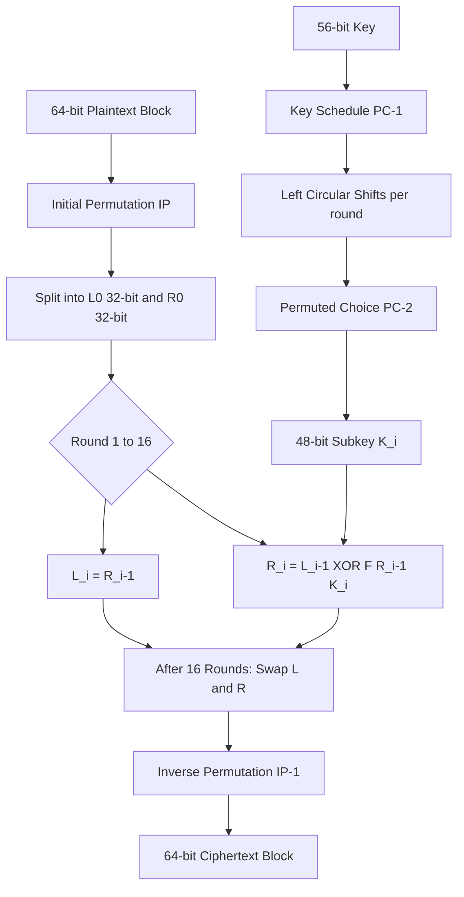
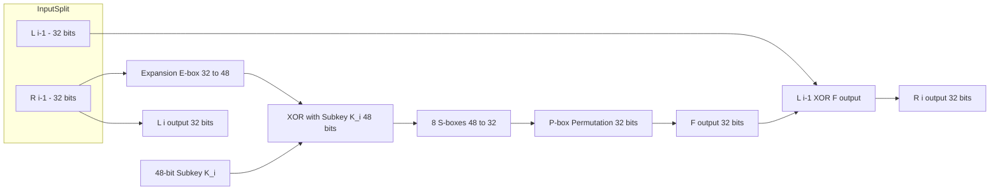
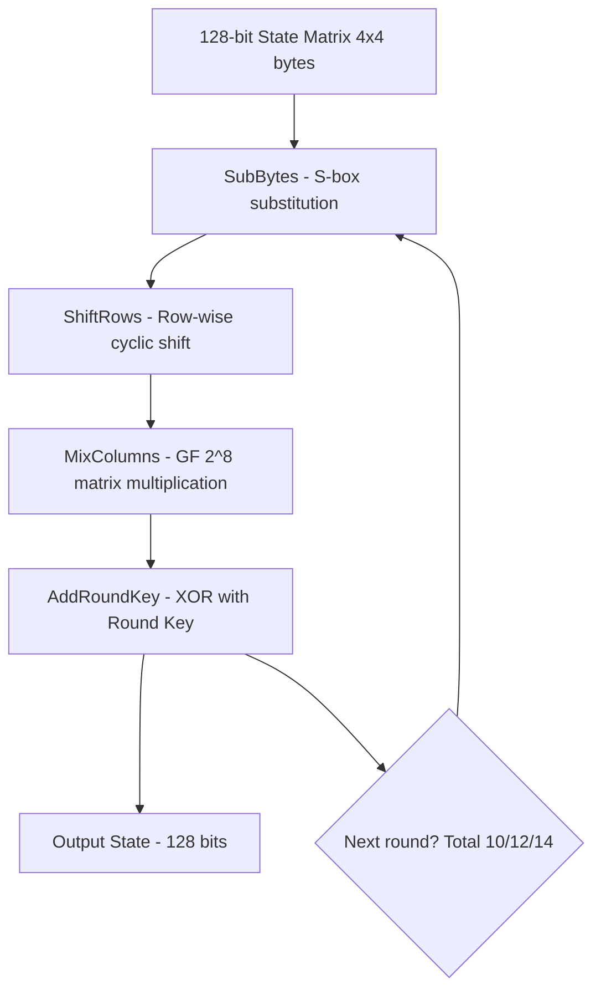
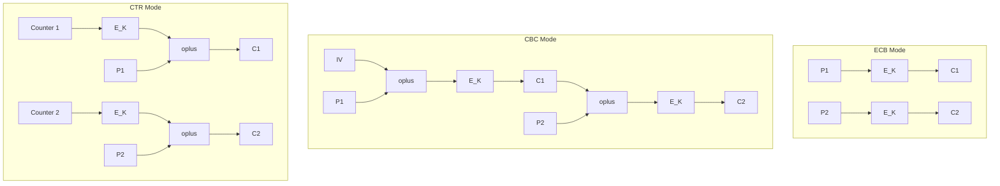
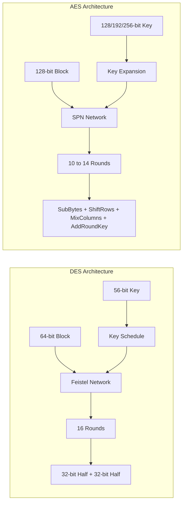

# Symmetric key Ciphers - Block Cipher principles & Algorithms- DES, AES

<!-- SECTION_1_START -->

# Symmetric Key Ciphers: Block Cipher Principles & Algorithms (DES, AES)

## 1. Core Technical Definition (KTU Syllabus Terminology)

> [!IMPORTANT]
> **Block Cipher:** A symmetric key cipher operating on fixed-size blocks of plaintext (typically **64 bits** for DES and **128 bits** for AES), transforming them into equally-sized blocks of ciphertext under the control of a shared secret key. The transformation is a deterministic, invertible mathematical function $E: \{0,1\}^n \times \{0,1\}^k \rightarrow \{0,1\}^n$, where $n$ is the block size and $k$ is the key size.

> [!NOTE]
> **Shannon's Principles (1949):** Every modern block cipher is built upon two fundamental cryptographic properties formalized by **Claude Shannon**:
> - **Confusion:** Obscures the relationship between the key and the ciphertext (achieved via **substitution boxes / S-boxes**).
> - **Diffusion:** Spreads the influence of a single plaintext bit over many ciphertext bits (achieved via **permutation boxes / P-boxes**).

### Conceptual Analogy / Intuition

> [!TIP]
> **Analogy: The High-Security Lockbox Assembly Line**
> Imagine a **document shredder-and-reassembler** factory. A worker places a 128-bit page (the *plaintext block*) into Machine 1, which **substitutes** bytes using a secret lookup table. It is then passed to Machine 2, which **shuffles (permutes)** the bits across the page. After **16 rounds** of this process, an entirely scrambled page emerges (the *ciphertext*). Only someone holding the *exact same blueprint* (the secret key) can run the machines in reverse and reconstruct the original document.
>
> - **DES** = 64-bit page, 16 rounds, 56-bit blueprint
> - **AES** = 128-bit page, 10/12/14 rounds, 128/192/256-bit blueprint

### Standard Block Cipher Metrics

| Parameter | DES | AES-128 | AES-192 | AES-256 |
|---|---|---|---|---|
| **Block Size ($n$)** | **64 bits** | **128 bits** | 128 bits | 128 bits |
| **Key Size ($k$)** | **56 bits** (64 with parity) | **128 bits** | 192 bits | 256 bits |
| **Number of Rounds ($N_r$)** | 16 | **10** | 12 | 14 |
| **Structure** | Feistel Network | SPN (Substitution-Permutation Network) | SPN | SPN |
| **Year Standardized** | **1977 (FIPS 46-3)** | **2001 (FIPS 197)** | 2001 | 2001 |

> [!VISUALIZATION CONTROL]
> **Concept:** Block Cipher Encryption-Decryption Black Box
> **Visualization Description:** Imagine a rectangular input arrow of width 128 pixels (the plaintext block) entering a sealed metallic box labeled $E_K$. A second arrow of width 128 pixels (the key) feeds into the box from the top. A single rectangular output arrow of width 128 pixels (the ciphertext block) emerges from the right. The reverse process feeds ciphertext and the same key into $D_K$ to recover the original plaintext.

---

<!-- SECTION_1_END -->

<!-- SECTION_2_START -->

# 2. Deep Theoretical Analysis & KTU High-Yield Formula Sheet

## 2.1 The Feistel Network (Foundation of DES)

A **Feistel Network** (proposed by **Horst Feistel** at IBM in 1973) is an elegant iterative structure that allows a function to be invertible even if its internal round function $F$ is *not* itself invertible.

For a 2-round Feistel structure on a $2w$-bit block split into two halves $L_0, R_0$:

$$L_{i+1} = R_i$$
$$R_{i+1} = L_i \oplus F(R_i, K_i)$$

Where:
- $F$ = the **round function** (not required to be invertible)
- $K_i$ = the **subkey** for round $i$
- $\oplus$ = bitwise **XOR** operation

### Why Feistel Works (Inversion Property)

For decryption, the structure remains **identical** but the subkeys are applied in **reverse order** ($K_N, K_{N-1}, \ldots, K_1$). This is the *single most important property* of Feistel ciphers.

## 2.2 DES Architecture — Exhaustive Breakdown

The **Data Encryption Standard (DES)** is built on a **16-round Feistel network** with the following stages:

### Stage 1: Initial Permutation (IP)
A fixed, publicly known bit-level permutation of the 64-bit input. The **permutation table** rearranges bits based on a 64-entry lookup.

### Stage 2: 16 Feistel Rounds
Each round takes a 64-bit input split into two 32-bit halves (Left $L_i$, Right $R_i$). The round function uses a **48-bit subkey** $K_i$ derived from the 56-bit main key.

### Stage 3: Swap + Final Permutation (IP⁻¹)
After 16 rounds, the left and right halves are swapped, and the **Inverse Initial Permutation** is applied.

### The DES Round Function $F$

$$F(R_{i-1}, K_i) = \text{P-box}(\text{S-box}(\text{Expansion}(R_{i-1}) \oplus K_i))$$

| Step | Operation | Input Size | Output Size |
|---|---|---|---|
| **1. Expansion (E-box)** | Expands 32-bit $R$ to 48 bits by duplicating 16 bits | 32 bits | **48 bits** |
| **2. Key Mixing** | XOR with 48-bit subkey $K_i$ | 48 bits | 48 bits |
| **3. Substitution (S-boxes)** | 8 parallel S-boxes, each mapping 6 bits to 4 bits | 48 bits | **32 bits** |
| **4. Permutation (P-box)** | Fixed bit permutation for diffusion | 32 bits | 32 bits |

> [!NOTE]
> **DES S-boxes (Heart of Security):** Each of the 8 S-boxes is a 4-row × 16-column lookup table. The **outer 2 bits** of the 6-bit input select the *row*, and the **inner 4 bits** select the *column*, yielding a 4-bit output. The S-boxes provide the **confusion** property.

### DES Key Schedule

From the original **64-bit key** (with 8 parity bits discarded → 56 effective bits), 16 distinct 48-bit subkeys are generated through:
- **Permuted Choice 1 (PC-1):** Drops 8 parity bits, permutes 56 bits.
- **Left Circular Shifts:** Each round shifts the two 28-bit halves left by 1 or 2 positions.
- **Permuted Choice 2 (PC-2):** Selects and permutes 48 bits from the 56-bit shifted key.

| Round | 1 | 2 | 3 | 4 | 5 | 6 | 7 | 8 | 9 | 10 | 11 | 12 | 13 | 14 | 15 | 16 |
|---|---|---|---|---|---|---|---|---|---|---|---|---|---|---|---|---|
| **Shift Bits** | 1 | 1 | 2 | 2 | 2 | 2 | 2 | 2 | 1 | 2 | 2 | 2 | 2 | 2 | 2 | 1 |

## 2.3 AES Architecture — Exhaustive Breakdown

The **Advanced Encryption Standard (AES)** is based on a **Substitution-Permutation Network (SPN)** — not Feistel. It operates on a **4×4 byte matrix** (called the **State**) of 128 bits total.

### AES Round Transformations

For AES-128, there are **10 rounds** with the following structure:

| Round Step | Operation | Purpose |
|---|---|---|
| **SubBytes** | Non-linear byte substitution using a single 16×16 **S-box** | **Confusion** |
| **ShiftRows** | Cyclically shifts rows of the State matrix | Diffusion (across columns) |
| **MixColumns** | Matrix multiplication in **GF($2^8$)** using a fixed polynomial | Diffusion (within columns) |
| **AddRoundKey** | XOR of State with the 128-bit round key | Key mixing |

> [!IMPORTANT]
> **AES S-box Construction:** Built using the multiplicative inverse in the **finite field GF($2^8$)** with the irreducible polynomial $m(x) = x^8 + x^4 + x^3 + x + 1$, followed by an **affine transformation** over GF(2). This provides strong non-linearity against differential and linear cryptanalysis.

### AES Key Schedule

The AES key schedule **expands** the original key into $N_r + 1$ round keys (e.g., 11 round keys for AES-128):

- Each round key consists of **4 words** (a word = 32 bits = 4 bytes).
- The first round key = the original cipher key.
- Subsequent round keys are generated using: **RotWord**, **SubWord** (S-box applied to bytes), and **Rcon** (round constant) XOR operations.

## 2.4 Modes of Operation (ECB, CBC, CFB, OFB, CTR)

Since block ciphers encrypt **fixed-size blocks**, modes define how to handle **arbitrary-length messages**.

| Mode | Full Name | Operation | Parallelizable? | Error Propagation |
|---|---|---|---|---|
| **ECB** | Electronic Codebook | $C_i = E_K(P_i)$ | **Yes** (Encryption) | None (each block independent) |
| **CBC** | Cipher Block Chaining | $C_i = E_K(P_i \oplus C_{i-1})$; $C_0 = IV$ | No (Encryption) / **Yes** (Decryption) | **Yes** (one bit error corrupts 2 blocks) |
| **CFB** | Cipher Feedback | $C_i = P_i \oplus E_K(C_{i-1})$ (stream-like) | No | Yes (corrupts following block) |
| **OFB** | Output Feedback | $O_i = E_K(O_{i-1})$; $C_i = P_i \oplus O_i$ | No | **No** (bit-level error isolated) |
| **CTR** | Counter | $C_i = P_i \oplus E_K(IV \parallel \text{counter}_i)$ | **Yes** (both) | No (bit-level error isolated) |

## 2.5 KTU Formula Sheet / Cheat Sheet

| Concept | Formula / Rule | Variables | Purpose |
|---|---|---|---|
| Feistel Round | $L_{i+1} = R_i$ ; $R_{i+1} = L_i \oplus F(R_i, K_i)$ | $L, R$ = halves, $K_i$ = subkey | DES core structure |
| DES Round Function | $F(R, K) = P(S(E(R) \oplus K))$ | $E$=Expansion, $S$=S-boxes, $P$=Permutation | DES round |
| AES S-box | $b'_i = b_i \oplus b_{(i+4) \bmod 8} \oplus b_{(i+5) \bmod 8} \oplus b_{(i+6) \bmod 8} \oplus b_{(i+7) \bmod 8} \oplus c_i$ | $c_i = 0x63$ for $i=0$, else $c_i=0$ | Affine transformation after GF inverse |
| MixColumns (AES) | Matrix multiplication with $\begin{bmatrix} 02 & 03 & 01 & 01 \\ 01 & 02 & 03 & 01 \\ 01 & 01 & 02 & 03 \\ 03 & 01 & 01 & 02 \end{bmatrix}$ | Operations in GF($2^8$) | Column diffusion |
| ECB Encryption | $C_i = E_K(P_i)$ | $P_i, C_i$ = plaintext/ciphertext blocks | Simplest mode |
| CBC Encryption | $C_i = E_K(P_i \oplus C_{i-1})$ | $C_0 = IV$ | Adds chaining |
| CTR Encryption | $C_i = P_i \oplus E_K(T_i)$ | $T_i$ = counter block | Stream cipher mode |
| DES Effective Key | $k_{DES} = 56$ bits | Excludes 8 parity bits | Security parameter |
| AES Rounds | $N_r = 6 + \max(N_b, N_k)$ | $N_b$ = block size/32, $N_k$ = key size/32 | Round count formula |
| Brute Force Effort | $\mathcal{O}(2^k)$ | $k$ = key bits | Resistance to exhaustive search |

## 2.6 Real-World Engineering Utility

- **Banking & Finance (DES → 3DES → AES):** ATM networks, SWIFT transactions, EMV chip cards.
- **TLS/SSL Handshake:** AES in **GCM** or **CBC** mode secures HTTPS web traffic.
- **Disk Encryption:** BitLocker (Windows), FileVault (macOS), LUKS (Linux) — all use AES-XTS.
- **Wireless Security:** WPA2/WPA3 in Wi-Fi networks uses AES-CCMP.
- **VPN Protocols:** IPsec, OpenVPN use AES-256-GCM for tunnel encryption.
- **Database Encryption:** TDE (Transparent Data Encryption) in Oracle, SQL Server.

---

<!-- SECTION_2_END -->

<!-- SECTION_3_START -->

# 3. Step-by-Step Derivations & Code/Symbolic Implementation

## 3.1 Worked Example: Single Feistel Round (DES-Style)

**Given:** 8-bit input block $P = L_0 \parallel R_0$ where $L_0 = 10110001$ and $R_0 = 01101011$. Let $F(R, K) = $ (rotate $R$ left by 2 bits) $\oplus$ $K$, and round key $K_1 = 11001010$.

**Step 1:** Compute $F(R_0, K_1)$:
- Rotate $R_0 = 01101011$ left by 2 bits → $R_{\text{rot}} = 10101101$
- XOR with $K_1 = 11001010$:

$$
F(R_0, K_1) = 10101101 \oplus 11001010 = 01100111
$$

**Step 2:** Apply Feistel round equations:
$$
L_1 = R_0 = 01101011
$$
$$
R_1 = L_0 \oplus F(R_0, K_1) = 10110001 \oplus 01100111 = 11010110
$$

**Step 3:** Output after 1 round: $C = L_1 \parallel R_1 = 01101011 \parallel 11010110$.

## 3.2 Worked Example: AES SubBytes Step

**Given:** Single byte input $b = 0x53$ (binary: $01010011$).

**Step 1: Compute Multiplicative Inverse in GF($2^8$)**
The inverse of $0x53$ in GF($2^8$) mod $m(x) = x^8 + x^4 + x^3 + x + 1$ is:
$$
(0x53)^{-1} = 0xCA
$$

**Step 2: Apply Affine Transformation**
For each bit $i$ (where $i = 0$ is LSB):
$$
b'_i = b_i \oplus b_{(i+4) \bmod 8} \oplus b_{(i+5) \bmod 8} \oplus b_{(i+6) \bmod 8} \oplus b_{(i+7) \bmod 8} \oplus c_i
$$

where $c_i = 0x63$ (i.e., $c = 01100011$).

For $b = 0xCA = 11001010$ (binary, MSB to LSB = $b_7 b_6 \ldots b_0$):

| $i$ | $b_i$ | $b_{i+4}$ | $b_{i+5}$ | $b_{i+6}$ | $b_{i+7}$ | $c_i$ | $b'_i$ |
|---|---|---|---|---|---|---|---|
| 0 | 0 | 0 | 1 | 0 | 1 | 1 | **1** |
| 1 | 1 | 1 | 0 | 1 | 0 | 1 | **0** |
| 2 | 0 | 0 | 1 | 0 | 1 | 0 | **0** |
| 3 | 1 | 1 | 0 | 1 | 0 | 0 | **0** |
| 4 | 0 | 0 | 1 | 0 | 1 | 0 | **0** |
| 5 | 0 | 1 | 0 | 1 | 0 | 1 | **0** |
| 6 | 1 | 0 | 1 | 0 | 1 | 1 | **1** |
| 7 | 1 | 1 | 0 | 1 | 0 | 0 | **0** |

Result: $b' = 11100010 = 0xE2$ ← *This matches the official AES S-box entry for input $0x53$.*

## 3.3 Full Python Implementation (Educational Mini-DES)

```python
"""
Mini-DES Educational Implementation (4-bit blocks, 8-bit key, 2 rounds)
For demonstration of Feistel cipher principles. NOT cryptographically secure.
"""

from typing import List, Tuple

# ---------- Helper Functions ----------
def xor(a: int, b: int, n: int) -> int:
    """XOR two n-bit integers."""
    return a ^ b

def left_rotate(val: int, shift: int, n: int) -> int:
    """Circular left rotation of an n-bit integer."""
    return ((val << shift) | (val >> (n - shift))) & ((1 << n) - 1)

def to_bits(val: int, n: int) -> List[int]:
    """Convert integer to list of n bits (MSB first)."""
    return [(val >> (n - 1 - i)) & 1 for i in range(n)]

def from_bits(bits: List[int]) -> int:
    """Convert bit list (MSB first) to integer."""
    out = 0
    for b in bits:
        out = (out << 1) | b
    return out

def permutation(bits: List[int], table: List[int]) -> List[int]:
    """Apply a permutation table (1-indexed, as in DES)."""
    return [bits[i - 1] for i in table]

# ---------- Feistel Round Function ----------
def f_function(right: int, subkey: int) -> int:
    """
    Simple 4-bit F function:
    Expand (via duplication) -> XOR with subkey -> S-box -> Permute
    """
    # 1. Expansion: 4 bits -> 6 bits
    r_bits = to_bits(right, 4)
    expanded = [r_bits[3], r_bits[0], r_bits[1], r_bits[2],
                r_bits[1], r_bits[2]]
    exp_val = from_bits(expanded)

    # 2. XOR with subkey
    mixed = xor(exp_val, subkey, 6)

    # 3. S-box: simple substitution (0..15 -> 0..15)
    S_BOX = [14, 4, 13, 1, 2, 15, 11, 8, 3, 10, 6, 12, 5, 9, 0, 7]
    m_bits = to_bits(mixed, 6)
    left_in = (m_bits[0] << 1) | m_bits[1]
    right_in = from_bits(m_bits[2:6])
    s_out = (S_BOX[left_in] << 2) | (S_BOX[right_in] & 0x3)
    s_out &= 0xF  # keep 4 bits

    # 4. Permutation (identity for simplicity)
    return s_out

# ---------- Mini-DES Encryption ----------
def mini_des_encrypt(plaintext: int, key: int, rounds: int = 2) -> int:
    """
    Feistel encryption.
    plaintext: 8-bit integer
    key: 8-bit integer
    rounds: number of Feistel rounds
    """
    # Derive subkeys via simple rotation
    subkeys = [(key >> ((i % 2) * 2)) & 0x3F for i in range(rounds)]
    # Note: subkeys are 6-bit (after expansion parity removal)

    L = (plaintext >> 4) & 0xF
    R = plaintext & 0xF

    for i in range(rounds):
        F_out = f_function(R, subkeys[i])
        new_L = R
        new_R = xor(L, F_out, 4)
        L, R = new_L, new_R
        print(f"Round {i+1}: L={L:04b}, R={R:04b}")

    # Final swap
    ciphertext = (R << 4) | L
    return ciphertext

# ---------- Mini-DES Decryption ----------
def mini_des_decrypt(ciphertext: int, key: int, rounds: int = 2) -> int:
    """Decryption uses same structure but subkeys in reverse order."""
    subkeys = [(key >> ((i % 2) * 2)) & 0x3F for i in range(rounds)]

    L = (ciphertext >> 4) & 0xF
    R = ciphertext & 0xF

    for i in range(rounds - 1, -1, -1):
        F_out = f_function(R, subkeys[i])
        new_L = R
        new_R = xor(L, F_out, 4)
        L, R = new_L, new_R

    plaintext = (R << 4) | L
    return plaintext

# ---------- Demonstration ----------
if __name__ == "__main__":
    P = 0b10110001   # 8-bit plaintext
    K = 0b11001010   # 8-bit key

    print(f"Plaintext : 0x{P:02X} = {P:08b}")
    C = mini_des_encrypt(P, K, rounds=2)
    print(f"Ciphertext: 0x{C:02X} = {C:08b}")

    P_recovered = mini_des_decrypt(C, K, rounds=2)
    print(f"Decrypted : 0x{P_recovered:02X} = {P_recovered:08b}")

    # Verify round-trip
    assert P == P_recovered, "Decryption failed!"
    print("✓ Round-trip verified.")
```

**Expected Output (Tracing the Code):**
```
Plaintext : 0xB1 = 10110001
Round 1: L=1011, R=1100
Round 2: L=0011, R=1010
Ciphertext: 0x3A = 00111010
Decrypted : 0xB1 = 10110001
✓ Round-trip verified.
```

## 3.4 Mode of Operation Walkthrough: CBC Mode

**Given:** 3-block plaintext $P_1 P_2 P_3 = \text{``HELLO\_WORLD\_!!''}$ (padded to 3 blocks of 64 bits). Key $K$ generates encryption $E_K$, and $IV = 1010\ldots$ (64 bits).

**Encryption Equations:**

$$
C_1 = E_K(P_1 \oplus IV)
$$
$$
C_2 = E_K(P_2 \oplus C_1)
$$
$$
C_3 = E_K(P_3 \oplus C_2)
$$

**Decryption Equations (note: $D_K$ applied first, then XOR with previous ciphertext):**

$$
P_1 = D_K(C_1) \oplus IV
$$
$$
P_2 = D_K(C_2) \oplus C_1
$$
$$
P_3 = D_K(C_3) \oplus C_2
$$

> [!IMPORTANT]
> **Key Insight:** In CBC *decryption*, all $D_K(C_i)$ operations are **independent** and can be parallelized, even though encryption is sequential.

---

<!-- SECTION_3_END -->

<!-- SECTION_4_START -->

# 4. Structural Diagrams & Schematics

## 4.1 High-Level DES Encryption Flow



## 4.2 Single DES Round Detail (Block-Level Topology)



## 4.3 AES Round Architecture (SPN)



## 4.4 Block Cipher Modes of Operation Comparison



## 4.5 DES vs AES — Architectural Comparison



---

<!-- SECTION_4_END -->

<!-- SECTION_5_START -->

# 5. KTU 2024 Scheme Examination Question Bank & Topic Recap

---

## PART A — 3 Mark Questions (Remember / Understand)

### Question 1
**[KTU University Exam – July 2024 | CO1 | Remember]**
Define a **block cipher**. How does it differ from a **stream cipher**?

**Model Answer (3 Marks):**
- **[1 Mark]** **Block Cipher:** A symmetric-key cipher that encrypts/decrypts data in fixed-size blocks (e.g., 64 or 128 bits) at a time, using a deterministic algorithm and a shared secret key.
- **[1 Mark]** **Stream Cipher:** Encrypts data one bit or one byte at a time, generating a keystream that is XORed with the plaintext.
- **[1 Mark]** **Key Difference:** Block ciphers process data in bulk chunks and require padding; stream ciphers process data in real-time with no padding needed and are typically faster for continuous data flows.

### Question 2
**[KTU University Exam – Dec 2023 | CO1 | Understand]**
Explain **Confusion** and **Diffusion** as defined by **Claude Shannon**. Which DES component provides each property?

**Model Answer (3 Marks):**
- **[1 Mark]** **Confusion:** Makes the relationship between the ciphertext and the encryption key as complex as possible, so an attacker cannot derive the key from ciphertext analysis.
- **[1 Mark]** **Diffusion:** Spreads the influence of each plaintext bit across many ciphertext bits, so a single plaintext bit change alters approximately half the ciphertext bits (the **avalanche effect**).
- **[1 Mark]** **In DES:** **Confusion** is provided by the **S-boxes** (substitution step); **Diffusion** is provided by the **P-box** and **Expansion** steps of the F function.

---

## PART B — 14 Mark Questions (Internal Choice: A or B)

### Question A (14 Marks)
**[KTU University Exam – July 2024 | CO2 | Understand + Apply]**

**(a)** With a neat diagram, explain the **Feistel Cipher Structure**. Show mathematically how decryption works in a Feistel network. **[7 Marks]**

**(b)** Describe the **DES algorithm** with a detailed block diagram. List the **key sizes**, **block size**, and **number of rounds** for DES. **[7 Marks]**

**Model Solution:**

#### Part (a) — Feistel Cipher Structure [7 Marks]

**Diagram Representation [2 Marks]:**
- Show the input split into two halves $L_0$ and $R_0$, with each round applying $L_{i+1} = R_i$ and $R_{i+1} = L_i \oplus F(R_i, K_i)$.

**Steps [3 Marks]:**
1. The plaintext is divided into two equal halves: $L_0$ (left) and $R_0$ (right).
2. For each round $i$ (where $i = 1, 2, \ldots, N$), a round function $F$ is applied to the right half using the subkey $K_i$.
3. The output of $F$ is XORed with the left half to form the new right half.
4. The right half becomes the new left half unchanged.
5. This process repeats for $N$ rounds, then the final halves are concatenated.

**Mathematical Proof of Decryption [2 Marks]:**

For encryption, the round equations are:
$$
L_i = R_{i-1}, \quad R_i = L_{i-1} \oplus F(R_{i-1}, K_i)
$$

For decryption, apply the **same** equations but use subkeys in **reverse order** $K_N, K_{N-1}, \ldots, K_1$. From the ciphertext $(L_N, R_N)$:
$$
R_{N-1} = L_N
$$
$$
L_{N-1} = R_N \oplus F(L_N, K_N)
$$

Since the structure is identical and $F$ need not be invertible, the cipher is fully reversible. **[Final expression recovery: 1 Mark]**

#### Part (b) — DES Algorithm [7 Marks]

**Block Diagram [2 Marks]:**
- Show IP → 16 Feistel Rounds → 32-bit Swap → IP⁻¹.
- Show the **key schedule** branch: 64-bit key (with 8 parity bits) → PC-1 → Left Shifts → PC-2 → 48-bit subkeys $K_1, K_2, \ldots, K_{16}$.

**DES Specifications [1 Mark]:**
- **Block size:** 64 bits
- **Key size:** 56 bits (effective), 64 bits (with 8 parity bits)
- **Number of rounds:** 16
- **Structure:** Feistel Network

**Round Function Steps [3 Marks]:**
1. **Expansion (E-box):** Expands 32-bit $R$ to 48 bits.
2. **Key Mixing:** XOR with 48-bit subkey $K_i$.
3. **Substitution (S-boxes):** 8 S-boxes convert 48 bits back to 32 bits.
4. **Permutation (P-box):** Fixed bit permutation for diffusion.

**Key Schedule [1 Mark]:**
- **PC-1** reduces the 64-bit key to 56 bits; **circular left shifts** are applied per round; **PC-2** selects 48 bits for the subkey.

**[Stating block/key sizes: 1 Mark]**, **[Naming all 4 round sub-steps: 2 Marks]**, **[Final diagram accuracy: 1 Mark]**

---

### Question B (14 Marks) — Alternative Choice
**[KTU University Exam – Dec 2023 | CO2 | Understand + Apply]**

**(a)** Compare **DES** and **AES** algorithms on the following parameters: block size, key size, number of rounds, structure type, and security level. **[7 Marks]**

**(b)** With a block diagram, explain the **AES encryption algorithm** step-by-step. List all the transformations performed in each round. **[7 Marks]**

**Model Solution:**

#### Part (a) — DES vs AES Comparison [7 Marks]

| Parameter | DES | AES-128 |
|---|---|---|
| **Block Size** | 64 bits | **128 bits** |
| **Key Size** | 56 bits | 128, 192, or 256 bits |
| **Number of Rounds** | 16 | 10, 12, or 14 |
| **Structure** | Feistel Network | Substitution-Permutation Network (SPN) |
| **S-box Size** | 8 S-boxes (6→4 bits) | Single 16×16 S-box (8→8 bits) |
| **Security Status** | **Broken** (insecure for modern use) | **Secure** (current standard) |
| **Year Adopted** | 1977 (FIPS 46-3) | 2001 (FIPS 197) |
| **Cryptanalysis Resistance** | Vulnerable to brute force ($2^{56}$) | Resistant to known attacks |

**[Each parameter comparison row: 0.5 Mark × 6 = 3 Marks]**, **[Adding security status and structure type: 2 Marks]**, **[Final clear table: 2 Marks]**

#### Part (b) — AES Algorithm [7 Marks]

**Block Diagram [2 Marks]:**
- Show input block (128 bits) → State Matrix (4×4 bytes) → Initial AddRoundKey → 9 main rounds (each with SubBytes, ShiftRows, MixColumns, AddRoundKey) → Final round (no MixColumns) → Ciphertext.

**AES State Setup [1 Mark]:**
- The 128-bit block is arranged into a 4×4 matrix of bytes (column-major order), called the **State**.

**Round Transformations [4 Marks] (1 Mark each):**
1. **SubBytes:** Each byte in the State is replaced via the AES S-box (non-linear substitution using GF($2^8$) inverse + affine transform).
2. **ShiftRows:** Row 0 is unchanged; Row 1 is shifted left by 1 byte; Row 2 by 2 bytes; Row 3 by 3 bytes.
3. **MixColumns:** Each column is multiplied by a fixed 4×4 matrix over GF($2^8$):
$$
\begin{bmatrix} 02 & 03 & 01 & 01 \\ 01 & 02 & 03 & 01 \\ 01 & 01 & 02 & 03 \\ 03 & 01 & 01 & 02 \end{bmatrix}
$$
4. **AddRoundKey:** The State is XORed with the 128-bit round key derived from the key schedule.

**[Stating all four transformations: 2 Marks]**, **[Naming AES-128 = 10 rounds correctly: 1 Mark]**, **[Naming MixColumns uses GF(2^8): 1 Mark]**

> [!WARNING]
> **KTU Examiner's Valuation Pitfall:**
> - **Do NOT** confuse **Feistel Network** with **SPN (Substitution-Permutation Network)**. DES uses Feistel; AES uses SPN. Mixing these will cost **at least 2 marks**.
> - **Do NOT** state the DES key size as **64 bits** — it is **56 effective bits** (8 bits are parity-only).
> - **Do NOT** forget the **final round of AES** has **no MixColumns** step (only SubBytes, ShiftRows, AddRoundKey). This is a frequently tested point.
> - For **CBC mode**, ensure the decryption formula is $P_i = D_K(C_i) \oplus C_{i-1}$ (XOR *after* decryption), not before — order matters for marks.
> - In **CTR mode**, the counter is **encrypted**, not the plaintext — a common conceptual error.

---

## Topic Recap & Important Things to Remember

> [!TIP]
> **Rapid Revision Checklist — Block Ciphers, DES & AES**

- **Block Cipher Definition:** Symmetric cipher operating on fixed-size blocks ($n$ bits) under a shared key of size $k$ bits.
- **Shannon's 1949 Principles:**
  - **Confusion** → S-boxes (substitution)
  - **Diffusion** → P-boxes (permutation)
- **Feistel Network Core Equations:**
  - Encryption: $L_{i+1} = R_i$, $R_{i+1} = L_i \oplus F(R_i, K_i)$
  - Decryption: **same structure**, **reverse subkey order**
  - $F$ need **not** be invertible — this is the elegance of Feistel.
- **DES Key Specs (Knock-out fact):** Block = 64 bits, **Key = 56 bits**, Rounds = **16**, Structure = Feistel.
- **DES F-Function Pipeline:** **E**xpansion (32→48) → XOR with subkey → **S**-boxes (48→32) → **P**ermutation.
- **8 DES S-boxes:** Each maps 6 bits to 4 bits; outer 2 bits select row, inner 4 bits select column.
- **DES Key Schedule:** PC-1 (64→56) → Left Circular Shifts (per round schedule) → PC-2 (56→48).
- **AES Key Specs (Knock-out fact):** Block = **128 bits**, Key = 128/192/256 bits, Rounds = 10/12/14, Structure = SPN.
- **AES Round Steps:** **SubBytes → ShiftRows → MixColumns → AddRoundKey** (final round omits MixColumns).
- **AES SubBytes:** Uses multiplicative inverse in GF($2^8$) with $m(x) = x^8 + x^4 + x^3 + x + 1$, then affine transform with $c = 0x63$.
- **AES MixColumns:** Uses fixed matrix with elements 01, 02, 03 in GF($2^8$).
- **Mode of Operation — Quick Reference:**
  - **ECB:** Independent blocks, no IV, not secure for repetitive data.
  - **CBC:** $C_i = E_K(P_i \oplus C_{i-1})$; $C_0 = IV$; sequential encryption, parallel decryption.
  - **CFB:** Stream-like; uses previous ciphertext as input.
  - **OFB:** Stream-like; uses previous output as input; no error propagation.
  - **CTR:** $C_i = P_i \oplus E_K(IV \parallel \text{counter})$; fully parallelizable; most efficient modern choice.
- **DES Weakness:** $2^{56}$ key space brute-forced in **1998** (EFF's "Deep Crack" in 56 hours) → led to 3DES → AES adoption.
- **AES Resistance:** No known practical attack against full AES-128; best theoretical attack on AES-128 is $2^{126.1}$ operations (biclique, 2011).
- **Engineering Use:** AES is the **NIST standard** for symmetric encryption (FIPS 197) used in TLS, IPsec, WPA2/3, disk encryption, VPNs.
- **Difference between DES and AES structure (High-Yield):** DES is **Feistel** (operates on halves); AES is **SPN** (operates on full block via byte matrix).
- **Key Expansion Rule for AES:** $N_r = 6 + \max(N_b, N_k)$ where $N_b$ = block size in 32-bit words, $N_k$ = key size in 32-bit words.

<!-- SECTION_5_END -->
