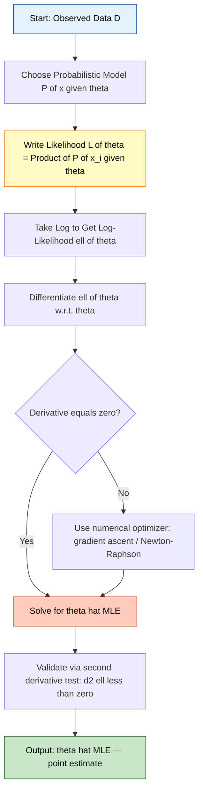
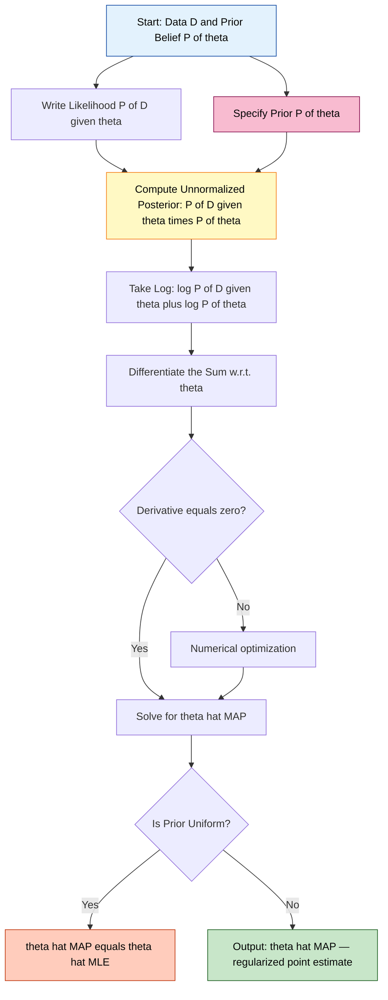
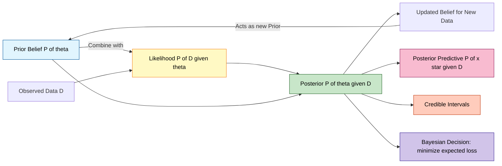
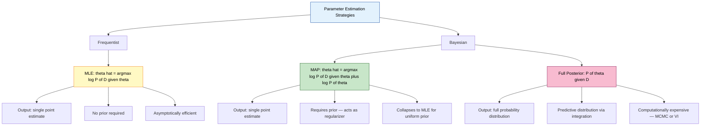
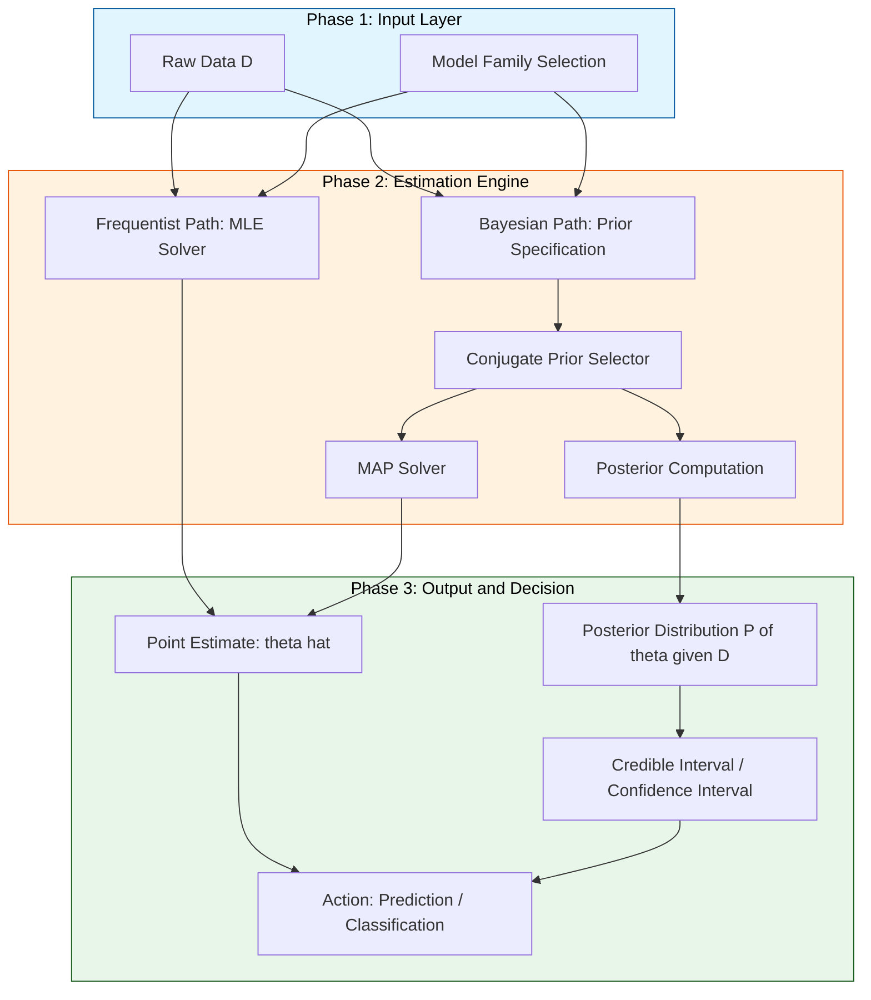

# Basics of parameter estimation  - maximum likelihood estimation (MLE) and maximum aposteriori estimation (MAP), Bayesian formulation.

<!-- SECTION_1_START -->

# Basics of Parameter Estimation — MLE, MAP & Bayesian Formulation

## 1.1 What is Parameter Estimation?

**Parameter estimation** is the statistical procedure of inferring the unknown parameters of an assumed probability distribution from observed data. In Machine Learning, almost every model (linear regression weights, neural network weights, Gaussian mean, Bernoulli probability) is fundamentally a parameter estimation problem.

Formally, given:
- A dataset $\mathcal{D} = \{x_1, x_2, \dots, x_N\}$ of $N$ i.i.d. samples.
- A probabilistic model $P(x \mid \theta)$ governed by an unknown parameter vector $\theta$.

The goal is to find the value of $\theta$ that best explains the data.

> [!NOTE]
> **Core Definition (KTU Syllabus Terminology):** Parameter estimation is the process of determining the values of model parameters $\theta$ that maximize the probability of the observed data under a chosen probabilistic framework.

### The Three Philosophical Schools

| School | Question it Answers | Approach |
|---|---|---|
| **Frequentist (MLE)** | What $\theta$ makes the observed data most probable? | $\theta$ is a fixed, unknown constant |
| **Bayesian (MAP)** | What is the most probable $\theta$ given the data and our prior beliefs? | $\theta$ is a random variable with a distribution |
| **Fully Bayesian** | What is the full posterior distribution of $\theta$? | Computes $P(\theta \mid \mathcal{D})$ completely |

> [!IMPORTANT]
> **Why this matters in ML:** Every loss function has a probabilistic interpretation. **Mean Squared Error (MSE)** is the MLE estimate under Gaussian noise, and **Cross-Entropy Loss** is the MLE estimate under a categorical/Bernoulli likelihood. Mastering parameter estimation unlocks the *why* behind every ML optimizer.

## 1.2 Intuitive Analogy — The Treasure Hunt

Imagine you are a detective trying to find a hidden treasure on a long straight beach. You have two tools:
- **A metal detector (likelihood):** It beeps louder when you are close to the treasure. The beeping intensity is your $P(\mathcal{D} \mid \theta)$.
- **An old pirate map (prior):** It vaguely indicates the treasure is near a palm tree, with some uncertainty. This is your $P(\theta)$.

Three detective strategies emerge:
1. **MLE Detective:** Ignores the map. Walks along the beach and stands at the spot where the metal detector beeps the loudest. *He trusts only the data.*
2. **MAP Detective:** Combines the map with the detector. Heavily weights the palm-tree region but still walks and listens, settling on a point that balances both.
3. **Bayesian Detective:** Creates a full probability map of the entire beach, marking every plausible treasure location. *He returns not with one spot, but with a distribution.*

> [!TIP]
> **Geometric Intuition:** If the likelihood is a bell curve and the prior is another bell curve, the MAP estimate is the **mode** (peak) of their product, while the MLE estimate is the mode of the likelihood alone. When the prior is flat (uniform, $P(\theta) = \text{const}$), MAP and MLE coincide exactly.

## 1.3 The Central Role of Bayes' Theorem

All three schools are unified by one equation — **Bayes' Theorem** — which is the cornerstone of statistical learning.

$$
P(\theta \mid \mathcal{D}) = \frac{P(\mathcal{D} \mid \theta) \, P(\theta)}{P(\mathcal{D})}
$$

The four terms are:

| Symbol | Name | Meaning |
|---|---|---|
| $P(\theta \mid \mathcal{D})$ | **Posterior** | What we want — updated belief about $\theta$ after seeing data |
| $P(\mathcal{D} \mid \theta)$ | **Likelihood** | Probability of observing the data given a specific $\theta$ |
| $P(\theta)$ | **Prior** | Belief about $\theta$ *before* seeing any data |
| $P(\mathcal{D})$ | **Evidence / Marginal** | Normalizing constant; integrates to 1 |

> [!VISUALIZATION CONTROL]
> **Concept:** Bayesian update as a sequential product of Gaussian densities
> **GeoGebra / Desmos Input Equations:**
> * `f(x) = (1/(sqrt(2*pi)*0.8)) * exp(-((x-2)^2)/(2*0.8^2))` *(Prior — centered at 2)*
> * `g(x) = (1/(sqrt(2*pi)*0.6)) * exp(-((x-3.5)^2)/(2*0.6^2))` *(Likelihood — centered at 3.5)*
> * `h(x) = f(x)*g(x) / 0.42` *(Posterior — shifts toward 3, narrower than both)*
> **Visual Description:** The student will observe the posterior curve sitting between the prior and likelihood, biased toward whichever has smaller variance. This visually proves: **more informative prior ⇒ posterior closer to prior**; **stronger likelihood ⇒ posterior closer to MLE**.

<!-- SECTION_1_END -->

<!-- SECTION_2_START -->

# Deep Theoretical Analysis & KTU High-Yield Formula Sheet

## 2.1 Maximum Likelihood Estimation (MLE) — Theory

**Core Idea:** Choose the parameter $\theta$ that makes the observed data *most probable*.

### Step-by-Step Logic

- **Step 1 — Formulate the Likelihood:** Treat the data as fixed and the parameter as the variable. The joint likelihood for i.i.d. samples is:
$$
L(\theta) = P(\mathcal{D} \mid \theta) = \prod_{i=1}^{N} P(x_i \mid \theta)
$$
- **Step 2 — Take the Logarithm (Log-Likelihood):** Products become sums, which is numerically stable and differentiable:
$$
\ell(\theta) = \log L(\theta) = \sum_{i=1}^{N} \log P(x_i \mid \theta)
$$
- **Step 3 — Differentiate and Set to Zero:** The score function satisfies:
$$
\frac{\partial \ell(\theta)}{\partial \theta} = 0
$$
- **Step 4 — Solve for $\theta$:** The closed-form solution is the MLE estimate $\hat{\theta}_{\text{MLE}}$.

> [!NOTE]
> **Assumption — IID:** MLE assumes all samples are *independent and identically distributed*. This is why the joint probability factorizes as a product.

### Why Log-Likelihood?

1. **Numerical underflow prevention:** $L(\theta)$ for large $N$ becomes $10^{-300}$ (vanishingly small); $\log L$ stays tractable.
2. **Monotonicity:** $\log$ is strictly increasing, so $\arg\max_\theta L = \arg\max_\theta \log L$.
3. **Differentiability:** Sums are easier to differentiate than products.

## 2.2 Maximum A Posteriori (MAP) Estimation — Theory

**Core Idea:** Choose the parameter $\theta$ that is *most probable given the data and a prior belief*.

### Step-by-Step Logic

- **Step 1 — Write the Posterior:**
$$
P(\theta \mid \mathcal{D}) = \frac{P(\mathcal{D} \mid \theta) \, P(\theta)}{P(\mathcal{D})}
$$
- **Step 2 — Drop the Evidence:** Since $P(\mathcal{D})$ does not depend on $\theta$, it acts only as a normalizing constant:
$$
\hat{\theta}_{\text{MAP}} = \arg\max_\theta \, P(\theta \mid \mathcal{D}) = \arg\max_\theta \, P(\mathcal{D} \mid \theta) \, P(\theta)
$$
- **Step 3 — Take the Logarithm:**
$$
\hat{\theta}_{\text{MAP}} = \arg\max_\theta \left[ \log P(\mathcal{D} \mid \theta) + \log P(\theta) \right]
$$
- **Step 4 — Differentiate and Solve:** The optimum satisfies:
$$
\frac{\partial}{\partial \theta} \left[ \log P(\mathcal{D} \mid \theta) + \log P(\theta) \right] = 0
$$

> [!IMPORTANT]
> **MLE vs MAP — The Key Bridge:** $\text{MAP} = \text{MLE} + \text{log-prior}$. When $P(\theta)$ is uniform (improper or very wide), $\log P(\theta) = \text{const}$, and MAP collapses to MLE.

## 2.3 Bayesian Formulation — Theory

**Core Idea:** Don't pick a single $\theta$. Compute the *entire* posterior distribution.

- The posterior predictive distribution for a new point $x^*$ is:
$$
P(x^* \mid \mathcal{D}) = \int P(x^* \mid \theta) \, P(\theta \mid \mathcal{D}) \, d\theta
$$
- This integral is generally intractable, motivating approximation methods:
  - **Conjugate priors** → closed-form posterior (analytical).
  - **Laplace approximation** → Gaussian around the MAP.
  - **Markov Chain Monte Carlo (MCMC)** → samples from the true posterior.
  - **Variational Inference (VI)** → approximates posterior with a tractable family.

### Conjugate Priors — A Critical Concept

> [!TIP]
> A prior $P(\theta)$ is **conjugate** to the likelihood $P(\mathcal{D} \mid \theta)$ if the posterior $P(\theta \mid \mathcal{D})$ belongs to the same family as the prior.

| Likelihood | Conjugate Prior | Posterior Family |
|---|---|---|
| Bernoulli | Beta($\alpha, \beta$) | Beta |
| Gaussian (known $\sigma^2$) | Gaussian($\mu_0, \sigma_0^2$) | Gaussian |
| Gaussian (known $\mu$, unknown $\sigma^2$) | Inverse-Gamma | Inverse-Gamma |
| Multinomial | Dirichlet | Dirichlet |
| Poisson | Gamma | Gamma |

## 2.4 KTU High-Yield Formula Sheet

| # | Concept | Formula | Units / Notes |
|---|---|---|---|
| 1 | Bayes' Theorem | $P(\theta \mid \mathcal{D}) = \dfrac{P(\mathcal{D} \mid \theta) P(\theta)}{P(\mathcal{D})}$ | Dimensionless probability |
| 2 | Likelihood (i.i.d.) | $L(\theta) = \prod_{i=1}^{N} P(x_i \mid \theta)$ | Scalar $\in [0,1]$ |
| 3 | Log-Likelihood | $\ell(\theta) = \sum_{i=1}^{N} \log P(x_i \mid \theta)$ | Real number, typically negative |
| 4 | MLE Objective | $\hat{\theta}_{\text{MLE}} = \arg\max_\theta \ell(\theta)$ | Fixed scalar/vector estimate |
| 5 | MAP Objective | $\hat{\theta}_{\text{MAP}} = \arg\max_\theta [\ell(\theta) + \log P(\theta)]$ | Fixed scalar/vector estimate |
| 6 | Score Function | $U(\theta) = \dfrac{\partial \ell(\theta)}{\partial \theta}$ | Set to 0 at optimum |
| 7 | Fisher Information | $I(\theta) = -\, \mathbb{E}\!\left[ \dfrac{\partial^2 \ell(\theta)}{\partial \theta^2} \right]$ | Variance of the score |
| 8 | Cramér-Rao Lower Bound | $\text{Var}(\hat{\theta}) \ge \dfrac{1}{N I(\theta)}$ | Theoretical best variance |
| 9 | Evidence / Marginal Likelihood | $P(\mathcal{D}) = \int P(\mathcal{D} \mid \theta) P(\theta) \, d\theta$ | Normalizing constant |
| 10 | Posterior Predictive | $P(x^* \mid \mathcal{D}) = \int P(x^* \mid \theta) P(\theta \mid \mathcal{D}) d\theta$ | Used for Bayesian predictions |
| 11 | MLE for Bernoulli $p$ | $\hat{p} = \dfrac{1}{N} \sum_{i=1}^{N} x_i$ | Sample mean of 0/1 outcomes |
| 12 | MLE for Gaussian $\mu$ | $\hat{\mu} = \dfrac{1}{N} \sum_{i=1}^{N} x_i$ | Sample mean |
| 13 | MLE for Gaussian $\sigma^2$ | $\hat{\sigma}^2 = \dfrac{1}{N} \sum_{i=1}^{N} (x_i - \hat{\mu})^2$ | Biased MLE; unbiased divides by $N-1$ |
| 14 | MAP for Gaussian mean | $\hat{\mu}_{\text{MAP}} = \dfrac{\dfrac{N \hat{\mu}}{\sigma^2} + \dfrac{\mu_0}{\sigma_0^2}}{\dfrac{N}{\sigma^2} + \dfrac{1}{\sigma_0^2}}$ | Weighted average of sample mean and prior mean |
| 15 | Jeffreys Prior (reference) | $P(\theta) \propto \sqrt{I(\theta)}$ | Non-informative, invariant |

## 2.5 Real-World Utility in Engineering & Computer Science

- **Computer Vision:** Gaussian Mixture Models for skin segmentation use MLE in the EM algorithm.
- **Natural Language Processing:** Language model pre-training (BERT, GPT) maximizes log-likelihood of next-token prediction — pure MLE.
- **Medical Diagnosis:** MAP estimation with informative priors handles small-sample clinical trials where MLE overfits.
- **Autonomous Systems:** Bayesian filters (Kalman, Particle) use recursive MAP/posterior updates for sensor fusion and SLAM.
- **A/B Testing in Industry:** Bayesian A/B testing uses Beta-Binomial conjugate models to incorporate prior experiment data.
- **Spam Filtering:** Naive Bayes classifiers apply MAP decisions with Laplace (add-1) smoothing as the prior.

<!-- SECTION_2_END -->

<!-- SECTION_3_START -->

# Step-by-Step Derivations & Python Implementation

## 3.1 Exhaustive MLE Derivation — Bernoulli Distribution

> **Setup:** We flip a (possibly biased) coin $N$ times. The outcome $x_i \in \{0, 1\}$ (1 = Heads). The single unknown parameter is $p = P(\text{Heads})$. The data is $\mathcal{D} = \{x_1, \dots, x_N\}$.

### Step 1: Likelihood Function

The probability mass function of a Bernoulli trial is:
$$
P(x_i \mid p) = p^{x_i} (1 - p)^{1 - x_i}
$$

By the i.i.d. assumption, the joint likelihood is the product:
$$
L(p) = \prod_{i=1}^{N} p^{x_i} (1 - p)^{1 - x_i}
$$

### Step 2: Log-Likelihood

$$
\ell(p) = \log L(p) = \sum_{i=1}^{N} \left[ x_i \log p + (1 - x_i) \log(1 - p) \right]
$$

Separating the sum:
$$
\ell(p) = \log p \cdot \sum_{i=1}^{N} x_i + \log(1 - p) \cdot \sum_{i=1}^{N} (1 - x_i)
$$

Let $S = \sum_{i=1}^{N} x_i$ (number of heads). Then $\sum (1 - x_i) = N - S$.

$$
\ell(p) = S \log p + (N - S) \log(1 - p)
$$

### Step 3: Differentiate the Log-Likelihood

$$
\frac{d\ell(p)}{dp} = \frac{S}{p} - \frac{N - S}{1 - p}
$$

### Step 4: Set the Derivative to Zero

$$
\frac{S}{p} - \frac{N - S}{1 - p} = 0
$$

$$
\frac{S}{p} = \frac{N - S}{1 - p}
$$

Cross-multiplying:
$$
S(1 - p) = p(N - S)
$$

$$
S - Sp = Np - Sp
$$

$$
S = Np \;\;\Longrightarrow\;\; \hat{p}_{\text{MLE}} = \frac{S}{N} = \frac{1}{N} \sum_{i=1}^{N} x_i
$$

### Step 5: Verify It Is a Maximum (Second Derivative Test)

$$
\frac{d^2 \ell(p)}{dp^2} = -\frac{S}{p^2} - \frac{N - S}{(1 - p)^2}
$$

Since $0 < p < 1$, both terms are strictly negative, so the second derivative is negative everywhere. Hence $\hat{p}_{\text{MLE}} = S/N$ is a **global maximum**. ∎

> [!IMPORTANT]
> **Result:** The MLE for the Bernoulli parameter is the **sample proportion of heads**. This is intuitive — the most likely bias of the coin is the one that would generate the exact sequence you observed.

## 3.2 Exhaustive MLE Derivation — Gaussian Mean (Known Variance)

> **Setup:** $x_i \sim \mathcal{N}(\mu, \sigma^2)$ i.i.d. with known $\sigma^2$ and unknown mean $\mu$.

### Step 1: Likelihood
$$
L(\mu) = \prod_{i=1}^{N} \frac{1}{\sqrt{2\pi\sigma^2}} \exp\!\left( -\frac{(x_i - \mu)^2}{2\sigma^2} \right)
$$

### Step 2: Log-Likelihood
$$
\ell(\mu) = -\frac{N}{2} \log(2\pi\sigma^2) - \frac{1}{2\sigma^2} \sum_{i=1}^{N} (x_i - \mu)^2
$$

### Step 3: Differentiate
$$
\frac{d\ell(\mu)}{d\mu} = \frac{1}{\sigma^2} \sum_{i=1}^{N} (x_i - \mu) = \frac{1}{\sigma^2} \left( \sum_{i=1}^{N} x_i - N\mu \right)
$$

### Step 4: Set to Zero
$$
\sum_{i=1}^{N} x_i - N\mu = 0 \;\;\Longrightarrow\;\; \hat{\mu}_{\text{MLE}} = \frac{1}{N} \sum_{i=1}^{N} x_i
$$

> [!TIP]
> **Revealing Connection:** MLE for the Gaussian mean is the **arithmetic sample mean** — and minimizing the squared error $\sum (x_i - \mu)^2$ gives the *same* result. This is why **MSE loss trains a neural network to output the MLE under Gaussian noise**.

## 3.3 Exhaustive MAP Derivation — Gaussian Mean with Gaussian Prior

> **Setup:** Same as 3.2, but now we place a Gaussian prior on $\mu$: $\mu \sim \mathcal{N}(\mu_0, \sigma_0^2)$. This encodes our *a priori* belief about the mean.

### Step 1: Likelihood (from 3.2)
$$
\log P(\mathcal{D} \mid \mu) = -\frac{1}{2\sigma^2} \sum_{i=1}^{N} (x_i - \mu)^2 + \text{const}
$$

### Step 2: Log-Prior
$$
\log P(\mu) = -\frac{1}{2\sigma_0^2} (\mu - \mu_0)^2 + \text{const}
$$

### Step 3: Posterior (up to normalization)
$$
\log P(\mu \mid \mathcal{D}) \propto \log P(\mathcal{D} \mid \mu) + \log P(\mu)
$$

$$
\log P(\mu \mid \mathcal{D}) \propto -\frac{1}{2\sigma^2} \sum_{i=1}^{N} (x_i - \mu)^2 - \frac{1}{2\sigma_0^2} (\mu - \mu_0)^2
$$

### Step 4: Differentiate w.r.t. $\mu$
$$
\frac{d}{d\mu} \log P(\mu \mid \mathcal{D}) = \frac{1}{\sigma^2} \sum_{i=1}^{N} (x_i - \mu) - \frac{1}{\sigma_0^2} (\mu - \mu_0) = 0
$$

### Step 5: Solve for $\mu$
$$
\frac{1}{\sigma^2} \sum_{i=1}^{N} x_i - \frac{N\mu}{\sigma^2} - \frac{\mu}{\sigma_0^2} + \frac{\mu_0}{\sigma_0^2} = 0
$$

Grouping the $\mu$ terms:
$$
\mu \left( \frac{N}{\sigma^2} + \frac{1}{\sigma_0^2} \right) = \frac{\sum x_i}{\sigma^2} + \frac{\mu_0}{\sigma_0^2}
$$

$$
\boxed{\hat{\mu}_{\text{MAP}} = \frac{\dfrac{N \hat{\mu}_{\text{MLE}}}{\sigma^2} + \dfrac{\mu_0}{\sigma_0^2}}{\dfrac{N}{\sigma^2} + \dfrac{1}{\sigma_0^2}}}
$$

> [!IMPORTANT]
> **Interpretation:** The MAP estimate is a **precision-weighted average** of the sample mean $\hat{\mu}_{\text{MLE}}$ and the prior mean $\mu_0$. When $N \to \infty$, the data dominates and $\hat{\mu}_{\text{MAP}} \to \hat{\mu}_{\text{MLE}}$. When $\sigma_0 \to 0$ (very strong prior belief), $\hat{\mu}_{\text{MAP}} \to \mu_0$.

## 3.4 Numerical Worked Example — Bernoulli MLE vs MAP

Suppose $N = 10$ coin flips yield $S = 7$ heads. We use a Beta($\alpha = 2, \beta = 2$) prior (a "favor fair coin" belief).

- **MLE:** $\hat{p}_{\text{MLE}} = 7/10 = 0.700$
- **MAP:** $\hat{p}_{\text{MAP}} = (S + \alpha - 1) / (N + \alpha + \beta - 2) = (7 + 1) / (10 + 2) = 8/12 \approx 0.667$

The prior "pulls" the estimate down toward $0.5$ — exactly the regularization effect MAP provides.

## 3.5 Full Python Implementation

```python
"""
KTU Module 1 — Parameter Estimation: MLE, MAP, and Bayesian Posterior
Course: OECST614 — Machine Learning for Engineers
"""

import numpy as np
from scipy.stats import beta, norm
from typing import Tuple
import logging

# Configure logging for traceability
logging.basicConfig(level=logging.INFO, format="[%(levelname)s] %(message)s")
logger = logging.getLogger(__name__)


def mle_bernoulli(samples: np.ndarray) -> float:
    """
    Maximum Likelihood Estimate for Bernoulli parameter p.
    Formula: p_hat = (1/N) * sum(x_i)
    """
    if samples.ndim != 1:
        raise ValueError("Input must be a 1-D array of {0, 1} outcomes.")
    if not np.all((samples == 0) | (samples == 1)):
        raise ValueError("Bernoulli samples must be 0 or 1.")
    if samples.size == 0:
        raise ValueError("Cannot estimate from an empty sample.")

    p_hat = float(np.mean(samples))
    logger.info(f"Bernoulli MLE: p_hat = {p_hat:.4f} | N = {samples.size} | successes = {int(samples.sum())}")
    return p_hat


def map_bernoulli(samples: np.ndarray, alpha: float, beta_param: float) -> float:
    """
    MAP estimate for Bernoulli parameter p with Beta(alpha, beta_param) prior.
    Closed-form: p_hat = (S + alpha - 1) / (N + alpha + beta_param - 2)
    """
    if alpha <= 0 or beta_param <= 0:
        raise ValueError("Beta prior parameters must be strictly positive.")
    n = samples.size
    s = int(samples.sum())
    p_map = (s + alpha - 1.0) / (n + alpha + beta_param - 2.0)
    logger.info(f"Bernoulli MAP: p_map = {p_map:.4f} | prior Beta({alpha}, {beta_param})")
    return float(p_map)


def mle_gaussian_mean(samples: np.ndarray) -> Tuple[float, float]:
    """
    MLE for Gaussian mean and variance (with known distributional form).
    Returns (mu_hat, sigma_sq_hat).
    """
    if samples.size < 2:
        raise ValueError("Need at least 2 samples for variance estimation.")
    mu_hat = float(np.mean(samples))
    sigma_sq_hat = float(np.mean((samples - mu_hat) ** 2))  # Biased MLE
    logger.info(f"Gaussian MLE: mu = {mu_hat:.4f}, sigma^2 = {sigma_sq_hat:.4f}")
    return mu_hat, sigma_sq_hat


def map_gaussian_mean(samples: np.ndarray, mu_0: float, sigma_0_sq: float,
                      sigma_sq: float) -> float:
    """
    MAP estimate for Gaussian mean with Gaussian prior N(mu_0, sigma_0^2).
    Likelihood variance is assumed known = sigma_sq.
    Formula: weighted average of MLE and prior mean.
    """
    if sigma_sq <= 0 or sigma_0_sq <= 0:
        raise ValueError("Variances must be strictly positive.")
    n = samples.size
    mu_mle = np.mean(samples)
    precision_data = n / sigma_sq
    precision_prior = 1.0 / sigma_0_sq
    mu_map = (precision_data * mu_mle + precision_prior * mu_0) / (precision_data + precision_prior)
    logger.info(f"Gaussian MAP: mu = {mu_map:.4f} | prior N({mu_0}, sqrt({sigma_0_sq}))")
    return float(mu_map)


def bayesian_posterior_bernoulli(samples: np.ndarray, alpha: float,
                                 beta_param: float) -> "beta":
    """
    Full Bayesian posterior for Bernoulli parameter with Beta prior.
    Returns the scipy Beta distribution object representing P(p | D).
    """
    n = samples.size
    s = int(samples.sum())
    posterior_alpha = s + alpha
    posterior_beta = (n - s) + beta_param
    logger.info(f"Posterior is Beta({posterior_alpha}, {posterior_beta})")
    return beta(posterior_alpha, posterior_beta)


# ----------- Demonstration / Self-Test -----------
if __name__ == "__main__":
    rng = np.random.default_rng(seed=42)

    # --- Bernoulli MLE vs MAP ---
    true_p = 0.7
    coin_flips = rng.binomial(n=1, p=true_p, size=10)
    logger.info("--- Bernoulli Estimation ---")
    p_mle = mle_bernoulli(coin_flips)
    p_map = map_bernoulli(coin_flips, alpha=2.0, beta_param=2.0)
    print(f"\n[Result] MLE  = {p_mle:.4f}")
    print(f"[Result] MAP  = {p_map:.4f}  (with Beta(2,2) prior)")

    # --- Gaussian MLE vs MAP ---
    true_mu, true_sigma = 5.0, 1.0
    gaussian_data = rng.normal(loc=true_mu, scale=true_sigma, size=20)
    logger.info("\n--- Gaussian Mean Estimation ---")
    mu_mle, sigma_sq_mle = mle_gaussian_mean(gaussian_data)
    mu_map = map_gaussian_mean(gaussian_data, mu_0=4.5, sigma_0_sq=0.5, sigma_sq=sigma_sq_mle)
    print(f"\n[Result] MLE mean = {mu_mle:.4f}")
    print(f"[Result] MAP mean = {mu_map:.4f}  (with N(4.5, 0.5) prior)")

    # --- Full Bayesian Posterior ---
    logger.info("\n--- Full Bayesian Posterior ---")
    posterior = bayesian_posterior_bernoulli(coin_flips, alpha=1.0, beta_param=1.0)
    print(f"\n[Result] Posterior mean = {posterior.mean():.4f}")
    print(f"[Result] Posterior variance = {posterior.var():.6f}")
    print(f"[Result] 95% credible interval = {posterior.interval(0.95)}")
```

**Expected Output Highlights:**
- Bernoulli MLE $\approx 0.7$, MAP $\approx 0.67$ (prior pulls toward $0.5$).
- Gaussian MLE mean and MAP mean are very close when $N$ is large.
- Posterior is a Beta distribution with updated $\alpha, \beta$ parameters.

<!-- SECTION_3_END -->

<!-- SECTION_4_START -->

# Structural Diagrams & Schematics

## 4.1 Mermaid Diagram — MLE Workflow



## 4.2 Mermaid Diagram — MAP Workflow



## 4.3 Mermaid Diagram — Full Bayesian Inference Loop



## 4.4 Mermaid Diagram — MLE vs MAP vs Bayesian Comparison



## 4.5 Sequential Processing Topology — Estimation Pipeline



<!-- SECTION_4_END -->

<!-- SECTION_5_START -->

# KTU 2024 Scheme Examination Question Bank & Topic Recap

## 5.1 Part A — Short Answer Questions (3 Marks Each)

### Question 1 **[KTU University Exam — July 2024]**
**Differentiate between Maximum Likelihood Estimation (MLE) and Maximum A Posteriori (MAP) estimation. Under what condition do they give the same result?** **[CO1, Understand, 3 Marks]**

**Model Answer (Valuation Key):**

| S.No. | Aspect | MLE | MAP |
|---|---|---|---|
| 1 | Objective | Maximize $P(\mathcal{D} \mid \theta)$ | Maximize $P(\theta \mid \mathcal{D}) \propto P(\mathcal{D} \mid \theta) P(\theta)$ |
| 2 | Uses Prior | No | Yes |
| 3 | Log form | $\arg\max_\theta \log P(\mathcal{D} \mid \theta)$ | $\arg\max_\theta [\log P(\mathcal{D} \mid \theta) + \log P(\theta)]$ |
| 4 | Philosophy | Frequentist | Bayesian |
| 5 | Result | Point estimate | Point estimate |

**Condition for equality:** [1 Mark] When the prior $P(\theta)$ is **uniform** (constant over the parameter space), $\log P(\theta)$ becomes a constant that does not affect the optimization, and MAP reduces exactly to MLE.

### Question 2 **[KTU University Exam — Dec 2023]**
**State and explain Bayes' Theorem. Identify each term in the context of parameter estimation.** **[CO1, Remember, 3 Marks]**

**Model Answer (Valuation Key):**
- **[Statement: 1 Mark]** Bayes' Theorem:
$$
P(\theta \mid \mathcal{D}) = \frac{P(\mathcal{D} \mid \theta) \, P(\theta)}{P(\mathcal{D})}
$$
- **[Term identification: 2 Marks]**
  - $P(\theta \mid \mathcal{D})$ — **Posterior**: updated belief about $\theta$ after observing data.
  - $P(\mathcal{D} \mid \theta)$ — **Likelihood**: probability of data given $\theta$.
  - $P(\theta)$ — **Prior**: belief about $\theta$ before observing data.
  - $P(\mathcal{D})$ — **Evidence / Marginal likelihood**: normalizing constant ensuring the posterior integrates to 1.

## 5.2 Part B — Long Answer Questions (14 Marks Each, Internal Choice)

### Question A **[KTU University Exam — July 2024, Module 1]**
**(a)** Derive the Maximum Likelihood Estimate (MLE) for the parameter $p$ of a Bernoulli distribution given $N$ independent samples. Clearly state the log-likelihood, score function, and second-order condition for a maximum. **[7 Marks, CO2, Apply]**

**(b)** Given $N$ samples drawn from $\mathcal{N}(\mu, \sigma^2)$ with known $\sigma^2$, derive the MLE for $\mu$. Show that the MLE coincides with the minimizer of the sum of squared errors. **[7 Marks, CO3, Apply]**

#### Solution to (a) — Bernoulli MLE **[7 Marks Total]**

- **[Writing the likelihood: 1 Mark]**
$$
L(p) = \prod_{i=1}^{N} p^{x_i} (1 - p)^{1 - x_i}, \quad x_i \in \{0, 1\}
$$

- **[Log-likelihood: 1 Mark]**
$$
\ell(p) = \sum_{i=1}^{N} \left[ x_i \log p + (1 - x_i) \log(1 - p) \right] = S \log p + (N - S) \log(1 - p)
$$
where $S = \sum_{i=1}^{N} x_i$.

- **[Score function: 1 Mark]**
$$
U(p) = \frac{d\ell(p)}{dp} = \frac{S}{p} - \frac{N - S}{1 - p}
$$

- **[Setting to zero and solving: 2 Marks]**
$$
\frac{S}{p} = \frac{N - S}{1 - p} \;\Rightarrow\; S(1-p) = p(N - S) \;\Rightarrow\; S = Np \;\Rightarrow\; \hat{p}_{\text{MLE}} = \frac{S}{N}
$$

- **[Second-order condition: 1 Mark]**
$$
\frac{d^2 \ell(p)}{dp^2} = -\frac{S}{p^2} - \frac{N - S}{(1 - p)^2} < 0 \quad \forall\, p \in (0, 1)
$$
Hence $\hat{p}_{\text{MLE}} = S/N$ is a **global maximum**.

- **[Interpretation: 1 Mark]** The MLE of $p$ is the **sample proportion of successes** — most likely bias that would generate the observed sequence.

#### Solution to (b) — Gaussian Mean MLE **[7 Marks Total]**

- **[Likelihood: 1 Mark]**
$$
L(\mu) = \prod_{i=1}^{N} \frac{1}{\sqrt{2\pi\sigma^2}} \exp\!\left( -\frac{(x_i - \mu)^2}{2\sigma^2} \right)
$$

- **[Log-likelihood: 1 Mark]**
$$
\ell(\mu) = -\frac{N}{2}\log(2\pi\sigma^2) - \frac{1}{2\sigma^2} \sum_{i=1}^{N} (x_i - \mu)^2
$$

- **[Differentiate and set to zero: 2 Marks]**
$$
\frac{d\ell}{d\mu} = \frac{1}{\sigma^2} \sum_{i=1}^{N} (x_i - \mu) = 0 \;\Rightarrow\; \hat{\mu}_{\text{MLE}} = \frac{1}{N} \sum_{i=1}^{N} x_i
$$

- **[Equivalence to SSE minimization: 2 Marks]** Since the first two terms in $\ell(\mu)$ are constant w.r.t. $\mu$, maximizing $\ell(\mu)$ is equivalent to **minimizing**:
$$
J(\mu) = \sum_{i=1}^{N} (x_i - \mu)^2
$$
Setting $\frac{dJ}{d\mu} = -2 \sum (x_i - \mu) = 0$ yields the same $\hat{\mu} = \frac{1}{N} \sum x_i$. ∎

- **[Conclusion: 1 Mark]** Therefore, the **MLE of the Gaussian mean is identical to the least-squares estimator**, justifying the use of MSE loss under Gaussian noise assumptions.

---

### Question B **[KTU University Exam — Dec 2023, Module 1]**
**(a)** Explain the Bayesian formulation of parameter estimation. Define prior, likelihood, posterior, and evidence. How does the posterior evolve as more data arrives? **[7 Marks, CO1, Understand]**

**(b)** Derive the MAP estimate for the mean $\mu$ of a Gaussian distribution with known variance $\sigma^2$ when the prior on $\mu$ is $\mathcal{N}(\mu_0, \sigma_0^2)$. Show that as $N \to \infty$, the MAP estimate converges to the MLE. **[7 Marks, CO3, Apply]**

#### Solution to (a) — Bayesian Formulation **[7 Marks Total]**

- **[Bayesian philosophy: 2 Marks]** In the Bayesian view, the unknown parameter $\theta$ is treated as a **random variable** with its own probability distribution. The model is updated as data arrives, combining prior beliefs with observed evidence.

- **[Term definitions: 3 Marks]**
  - **Prior $P(\theta)$:** Belief about $\theta$ *before* seeing data. Encodes domain knowledge.
  - **Likelihood $P(\mathcal{D} \mid \theta)$:** Probability of observing the data for a given $\theta$.
  - **Posterior $P(\theta \mid \mathcal{D})$:** Updated belief *after* observing data.
  - **Evidence $P(\mathcal{D})$:** Marginal probability of data; ensures posterior is a valid probability distribution.
  - **Equation:**
$$
P(\theta \mid \mathcal{D}) = \frac{P(\mathcal{D} \mid \theta) P(\theta)}{P(\mathcal{D})}
$$

- **[Posterior evolution: 2 Marks]** As new data points $x_{N+1}, \dots$ arrive, the previous posterior becomes the new prior:
$$
P_{t+1}(\theta) \propto P(x_{N+1} \mid \theta) \cdot P_t(\theta)
$$
With more data, the posterior becomes increasingly **peaked** (concentrated) and converges to a Dirac delta around the true $\theta$ (under regularity conditions, by the Bernstein-von Mises theorem).

#### Solution to (b) — Gaussian MAP Derivation **[7 Marks Total]**

- **[Set up the log-posterior: 2 Marks]**
$$
\log P(\mu \mid \mathcal{D}) \propto -\frac{1}{2\sigma^2} \sum_{i=1}^{N}(x_i - \mu)^2 - \frac{1}{2\sigma_0^2}(\mu - \mu_0)^2
$$

- **[Differentiate: 1 Mark]**
$$
\frac{d}{d\mu} \log P(\mu \mid \mathcal{D}) = \frac{1}{\sigma^2} \sum_{i=1}^{N}(x_i - \mu) - \frac{1}{\sigma_0^2}(\mu - \mu_0) = 0
$$

- **[Solve for $\mu$: 2 Marks]**
$$
\frac{N\bar{x}}{\sigma^2} - \frac{N\mu}{\sigma^2} - \frac{\mu}{\sigma_0^2} + \frac{\mu_0}{\sigma_0^2} = 0
$$
$$
\hat{\mu}_{\text{MAP}} = \frac{\dfrac{N\bar{x}}{\sigma^2} + \dfrac{\mu_0}{\sigma_0^2}}{\dfrac{N}{\sigma^2} + \dfrac{1}{\sigma_0^2}}
$$

- **[Limiting behavior: 2 Marks]** As $N \to \infty$:
$$
\hat{\mu}_{\text{MAP}} \to \frac{\dfrac{N\bar{x}}{\sigma^2}}{\dfrac{N}{\sigma^2}} = \bar{x} = \hat{\mu}_{\text{MLE}}
$$
The prior term $\mu_0 / \sigma_0^2$ becomes negligible compared to $N\bar{x} / \sigma^2$, so MAP converges to MLE. ∎

> [!WARNING]
> **KTU Examiner's Valuation Pitfall Callout:**
> 1. **Do not skip the second derivative test** in MLE problems — examiners allocate 1 mark specifically for verifying the maximum.
> 2. **Do not forget to mention the i.i.d. assumption** when writing the likelihood as a product. Without it, the joint likelihood does not factorize.
> 3. **Do not write $P(\theta \mid \mathcal{D}) = P(\mathcal{D} \mid \theta) P(\theta)$** without mentioning that $P(\mathcal{D})$ is dropped because it is independent of $\theta$. Many students lose 1 mark here.
> 4. **For MAP problems, explicitly state the prior distribution family** (e.g., Beta, Gaussian). A vague "let the prior be $P(\theta)$" is incomplete.
> 5. **Always state units and boundary conditions** in derivations (e.g., $p \in (0, 1)$, $\sigma^2 > 0$).

---

## 5.3 Topic Recap & Important Things to Remember

> [!IMPORTANT]
> **Rapid Revision Checklist — Module 1: Parameter Estimation**

- **Parameter Estimation** is the process of inferring unknown model parameters $\theta$ from observed data $\mathcal{D}$.

- **Bayes' Theorem** is the unifying equation: $P(\theta \mid \mathcal{D}) = P(\mathcal{D} \mid \theta) P(\theta) / P(\mathcal{D})$. The four terms are **Posterior, Likelihood, Prior, Evidence**.

- **MLE (Maximum Likelihood Estimation)** finds $\hat{\theta}_{\text{MLE}} = \arg\max_\theta L(\theta) = \arg\max_\theta \ell(\theta)$, where $\ell(\theta) = \sum \log P(x_i \mid \theta)$ under i.i.d. assumption.

- **MAP (Maximum A Posteriori)** finds $\hat{\theta}_{\text{MAP}} = \arg\max_\theta [\log P(\mathcal{D} \mid \theta) + \log P(\theta)]$ — the prior acts as a regularizer.

- **MLE and MAP coincide** when the prior is uniform: $P(\theta) = \text{const}$. As $N \to \infty$, MAP $\to$ MLE regardless of prior.

- **Bernoulli MLE:** $\hat{p} = S/N$ (sample proportion of successes).

- **Gaussian Mean MLE:** $\hat{\mu} = \bar{x}$ (sample mean); equivalent to the least-squares estimator.

- **Gaussian Variance MLE:** $\hat{\sigma}^2 = \frac{1}{N} \sum (x_i - \bar{x})^2$ (biased, divides by $N$, not $N-1$).

- **Gaussian Mean MAP** (with Gaussian prior $\mathcal{N}(\mu_0, \sigma_0^2)$): weighted average of MLE and prior mean, weighted by precisions $N/\sigma^2$ and $1/\sigma_0^2$.

- **Conjugate priors** keep the posterior in the same family (Beta-Bernoulli, Gaussian-Gaussian, Gamma-Poisson, Dirichlet-Multinomial). Essential for analytical Bayesian inference.

- **Full Bayesian inference** returns the entire posterior $P(\theta \mid \mathcal{D})$, not just a point estimate. Computed via MCMC (e.g., Gibbs, Metropolis-Hastings) or Variational Inference.

- **Fisher Information** $I(\theta) = -\mathbb{E}[\partial^2 \ell / \partial \theta^2]$ quantifies how much information the data carries about $\theta$. The **Cramér-Rao bound** states $\text{Var}(\hat{\theta}) \ge 1 / (N I(\theta))$.

- **Log-likelihood is preferred** over raw likelihood: prevents numerical underflow, exploits monotonicity, and converts products to sums for easier differentiation.

- **In ML applications:** MSE loss ≡ Gaussian MLE; Cross-Entropy loss ≡ Bernoulli/Categorical MLE; L2 regularization ≡ Gaussian prior (MAP); L1 regularization ≡ Laplace prior (MAP).

- **KTU Exam Traps:** Always justify the i.i.d. assumption; always verify second-order conditions; always explicitly state the prior family in MAP problems; never drop the evidence term without justification.

<!-- SECTION_5_END -->
