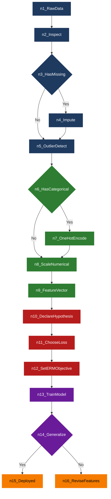
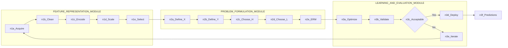
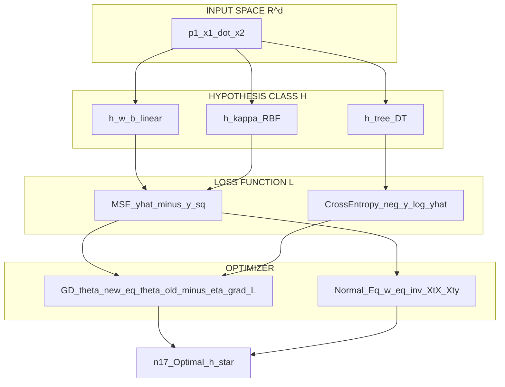

# Feature Representation and Problem Formulation

<!-- SECTION_1_START -->
# Feature Representation and Problem Formulation

> [!NOTE]
> **KTU 2024 Scheme | OECST614 — Machine Learning for Engineers | Module 1**
> **Course Outcome (CO) Mapped:** CO1 — *Understand the foundational concepts, taxonomy, and problem formulation strategies of machine learning systems.*
> **Revised Bloom's Level:** Remember & Understand

## 1.1 Formal Academic Definition

**Feature Representation** is the process of transforming raw, often unstructured, observational data into a mathematically tractable, structured, numerical form — typically a fixed-length real-valued vector — that a learning algorithm can ingest and process. Each component of this vector is called a **feature** (also termed an *attribute*, *predictor*, *independent variable*, or *covariate*), and the complete vector is known as a **feature vector**.

Mathematically, for a given instance $x$ in the input space $\mathcal{X}$, its representation is the mapping:

$$
\phi : \mathcal{X} \subseteq \mathbb{R}^{d_0} \longrightarrow \mathcal{F} \subseteq \mathbb{R}^{d}
$$

where $d_0$ is the dimensionality of the raw input (possibly undefined for unstructured data like images or text), and $d$ is the dimensionality of the engineered feature space.

**Problem Formulation** in machine learning is the engineering and mathematical act of *precisely* defining a learning task. It requires explicit declaration of five pillars:

1. The **input space** $\mathcal{X}$ (the feature representation).
2. The **output space** $\mathcal{Y}$ (the target variable's domain).
3. The **hypothesis class** $\mathcal{H}$ (the family of candidate functions $h : \mathcal{X} \rightarrow \mathcal{Y}$).
4. The **loss function** $L : \mathcal{Y} \times \mathcal{Y} \rightarrow \mathbb{R}_{\geq 0}$ (measuring prediction error).
5. The **data distribution** $\mathcal{D}$ from which samples are drawn i.i.d.

Together, these yield the canonical optimization objective:

$$
h^{*} = \arg\min_{h \in \mathcal{H}} \; \mathbb{E}_{(x,y) \sim \mathcal{D}} \big[\, L\big(h(x),\, y\big) \,\big]
$$

> [!IMPORTANT]
> **Syllabus Highlight (KTU 2024):** A student is expected to identify the *type* of ML problem (supervised / unsupervised / reinforcement), the *type* of output (continuous / discrete / structured), the *nature* of features (numerical / categorical / textual / image), and the appropriate **evaluation metric** *before* writing a single line of model code. This pre-modeling phase is the essence of problem formulation.

## 1.2 Intuitive Analogy — The Recipe & The Diagnosis

Imagine you are a **chef preparing a dish for a customer review panel**.

- The *raw ingredients* (vegetables, spices, meats) are like **raw data** — they exist, but the chef cannot feed them directly to the judges. They must be **washed, chopped, measured, and plated** into *tastable, comparable units*. This transformation from raw ingredient $\rightarrow$ *tastable portion* is exactly what **feature representation** does. The "tastable portion size," "spice intensity," and "color index" are your *features*.
- The "tastable portion size" is a *numerical feature*, the "type of cuisine" is a *categorical feature*, and the "spice rating" is an *ordinal feature*.
- Now, the chef asks: *"Is my goal to predict a numeric customer satisfaction score (regression), or to bucket the dish into categories like 'Excellent / Average / Poor' (classification), or to group similar dishes together to discover a new menu theme (clustering)?"* — this decision-making, where you clearly state the *input*, the *desired output*, the *judging panel's loss criteria*, and the *search space of recipes* is **problem formulation**.

> [!TIP]
> **Memory Hook:** **R**epresentation answers *"How do I describe the world to the algorithm?"*; **F**ormulation answers *"What is the algorithm supposed to learn, and how will I judge if it learned well?"*

## 1.3 The Two Pillars — A Conceptual Diagram (Textual Sketch)

```
   RAW DATA                  FEATURE                   PROBLEM
   (Images, Text,        REPRESENTATION              FORMULATION
    Tabular Logs)              |                          |
        |                      v                          v
   +---------+           +-------------+         +-----------------+
   | Pixel   |           | x = [0.21,  |         | Task: Classify? |
   | intensity,|  --->   |       0.87, |  --->   | Inputs:  x in R^d|
   | Word bag |  phi()   |       1,    |         | Outputs: y in {0,1,...,k-1}|
   | Sensor  |           |       0.45] |         | Model:  h_theta(x)|
   | logs    |           |   d=4       |         | Loss:   Cross-Entropy|
   +---------+           +-------------+         +-----------------+
                                                       |
                                                       v
                                              h* = argmin E[L(h(x),y)]
```

## 1.4 Categories of Features (KTU Board-Favorite Taxonomy)

| # | Feature Type | Definition | Example | Domain |
|---|--------------|------------|---------|--------|
| 1 | **Numerical (Continuous)** | Real-valued measurements on a continuous scale | Temperature = 36.7 °C, Salary = ₹5,40,000 | $\mathbb{R}$ |
| 2 | **Numerical (Discrete / Count)** | Integer-valued counts | Number of purchases = 7 | $\mathbb{Z}_{\geq 0}$ |
| 3 | **Categorical (Nominal)** | Unordered discrete labels | Blood Group $\in \{A, B, AB, O\}$ | Finite set, no order |
| 4 | **Categorical (Ordinal)** | Ordered discrete labels | Rating $\in \{Low, Medium, High\}$ | Finite set, with order |
| 5 | **Binary** | Two-state indicator | Spam $\{0, 1\}$, Has_Disease | $\{0, 1\}$ |
| 6 | **Text / NLP** | Tokenized, embedded string data | "I love ML" $\rightarrow$ Word2Vec vector | $\mathbb{R}^{d}$ |
| 7 | **Image / Pixel** | Raw or transformed pixel intensities | $28 \times 28$ grayscale image | $\mathbb{R}^{784}$ |
| 8 | **Time-Series / Sequential** | Ordered sequence of observations | Stock price over 30 days | $\mathbb{R}^{T \times d}$ |

> [!IMPORTANT]
> **Constant to Memorize:** Most classical ML algorithms (Linear/Logistic Regression, SVM, k-NN, Neural Networks) require the input to be a **fixed-length, real-valued feature vector** of constant dimension $d$. This is the *raison d'être* of feature representation.

## 1.5 Visualization (Geometric Intuition)

> [!VISUALIZATION CONTROL]
> **Concept:** *Geometric Intuition of Feature Vectors as Points in $d$-Dimensional Space*
>
> **GeoGebra / Desmos Input Equations (2-D Projection for Visualization):**
>
> * `P1 = (0.21, 0.87)` — Instance 1 (e.g., a "Healthy" patient)
> * `P2 = (0.85, 0.10)` — Instance 2 (e.g., a "Sick" patient)
> * `x-axis label: "Feature 1 (e.g., Blood Sugar normalized)"`
> * `y-axis label: "Feature 2 (e.g., Cholesterol normalized)"`
> * `Line: y = -x + 1.1` — A candidate *decision boundary* $h(x) = 0$
>
> **Visual Description:** The student should observe two distinct clusters of points on the 2-D plane separated by a straight line. Each point is a *feature vector* $\mathbf{x} \in \mathbb{R}^{2}$. The line represents a *hypothesis* $h \in \mathcal{H}$. The **goal of the learner** is to find the *best* such line (hypothesis) that separates the two classes with minimal loss. This is the geometric essence of problem formulation in classification.

---

<!-- SECTION_1_END -->

<!-- SECTION_2_START -->
# Deep Theoretical Analysis & KTU High-Yield Formula Sheet

## 2.1 The Anatomy of Feature Representation

Feature representation is rarely a one-shot operation. It is a **multi-stage engineering pipeline**. KTU examiners frequently test a student's understanding of *each stage independently*. The five canonical stages are:

### Stage 1 — Data Acquisition & Inspection
- Identify data modalities: tabular, image, text, audio, sensor, graph.
- Inspect for **missing values**, **outliers**, and **inconsistent encodings**.
- Compute summary statistics: $\mu$, $\sigma$, $x_{\min}$, $x_{\max}$, quartiles.

### Stage 2 — Cleaning & Imputation
- **Missing Value Strategies:**
  * *Mean/Median Imputation:* $\hat{x}_i = \mu$ or median of observed $x_i$.
  * *Forward Fill (Time Series):* $\hat{x}_t = x_{t-1}$.
  * *Model-Based Imputation:* Predict missing feature from other features.
- **Outlier Treatment:** Z-score clipping $z = \frac{x - \mu}{\sigma}$, with $|z| > 3$ considered an outlier.

### Stage 3 — Encoding Categorical Variables
Numerical models cannot ingest strings. Three encodings are essential:

- **Label Encoding:** $\text{Cat} \in \{A, B, C\} \mapsto \{0, 1, 2\}$.
  * *Pros:* Compact.
  * *Cons:* Imposes a false ordinal relationship — *C* is "greater than" *A* numerically.
- **One-Hot Encoding (OHE):** $\text{Cat} \in \{A, B, C\}$ creates 3 binary columns:

$$
x_{\text{OHE}} = \begin{bmatrix} 1 \\ 0 \\ 0 \end{bmatrix}, \quad \begin{bmatrix} 0 \\ 1 \\ 0 \end{bmatrix}, \quad \begin{bmatrix} 0 \\ 0 \\ 1 \end{bmatrix} \quad \text{for} \quad A, B, C \text{ respectively.}
$$

  * *Pros:* No false ordering.
  * *Cons:* Explodes dimensionality for high-cardinality features (curse of dimensionality).
- **Target / Mean Encoding:** Replace category with the mean of the target variable for that category. Powerful but leakage-prone.

### Stage 4 — Feature Scaling
Algorithms relying on **distance metrics** (k-NN, k-Means, SVM with RBF kernel) or **gradient descent** (Linear Regression, Neural Networks) are sensitive to feature scale. Two standard scalers:

- **Min-Max Normalization (Scaling to $[0, 1]$):**

$$
x' = \frac{x - x_{\min}}{x_{\max} - x_{\min}}
$$

- **Z-Score Standardization (Zero Mean, Unit Variance):**

$$
x' = \frac{x - \mu}{\sigma}
$$

### Stage 5 — Feature Construction & Selection
- **Feature Construction:** Domain-driven combinations. Example: BMI = Weight / Height².
- **Feature Selection:** Reduce $d \to d'$ by removing irrelevant/redundant features using:
  * *Filter methods:* Mutual Information, Chi-Square, ANOVA F-test.
  * *Wrapper methods:* Recursive Feature Elimination (RFE).
  * *Embedded methods:* L1 (Lasso) regularization $\to$ induces sparsity.
- **Feature Extraction (Dimensionality Reduction):** Project $\mathbb{R}^{d} \to \mathbb{R}^{d'}$ via PCA, LDA, or Autoencoders.

## 2.2 The Five Pillars of Problem Formulation — Deep Dive

### Pillar 1 — Input Space $\mathcal{X}$
This is the *output* of feature representation. Formally:

$$
\mathcal{X} = \mathcal{F} \subseteq \mathbb{R}^{d}
$$

The KTU examiner may ask: *"What is the dimensionality of your feature space after one-hot encoding a feature with $K$ unique categories?"* The answer is $K$ new binary columns.

### Pillar 2 — Output Space $\mathcal{Y}$
The type of $\mathcal{Y}$ *defines* the problem class:

| $\mathcal{Y}$ | Problem Class | Canonical Task |
|---------------|---------------|----------------|
| $\mathcal{Y} = \{1, 2, \dots, K\}$ | **Multi-Class Classification** | Digit recognition (0–9) |
| $\mathcal{Y} = \{0, 1\}$ | **Binary Classification** | Spam detection |
| $\mathcal{Y} = \mathbb{R}$ | **Regression** | House price prediction |
| $\mathcal{Y} = \mathbb{R}^{K}$ | **Multi-Output Regression** | Bounding-box $(x, y, w, h)$ |
| $\mathcal{Y} = \{\text{sequences}\}$ | **Sequence Learning** | Machine translation |
| $\mathcal{Y} = \{\text{clusters}\}$ | **Unsupervised Clustering** | Customer segmentation |
| $\mathcal{Y} = \mathbb{R}^{d}$ (latent) | **Representation Learning** | Autoencoder bottleneck |

### Pillar 3 — Hypothesis Class $\mathcal{H}$
The family of functions the learner is allowed to choose from. KTU board-favorites:

- **Linear Hypothesis:**

$$
\mathcal{H} = \{ h_{\mathbf{w},b}(x) = \mathbf{w}^{\top} x + b \mid \mathbf{w} \in \mathbb{R}^{d}, b \in \mathbb{R} \}
$$

- **Logistic (Sigmoid):**

$$
\mathcal{H} = \{ h_{\mathbf{w},b}(x) = \sigma(\mathbf{w}^{\top} x + b) \}, \quad \sigma(z) = \frac{1}{1 + e^{-z}}
$$

- **Decision Trees, k-NN, SVM, Neural Networks** — each defines a distinct $\mathcal{H}$ with varying capacity.

### Pillar 4 — Loss Function $L$
Quantifies the "cost" of a wrong prediction. Must be aligned with the problem type:

| Problem Type | Standard Loss | Formula |
|--------------|---------------|---------|
| Regression | Squared Error | $L(\hat{y}, y) = (\hat{y} - y)^2$ |
| Regression | Absolute Error | $L(\hat{y}, y) = \vert \hat{y} - y \vert$ |
| Binary Classification | Logistic Loss (Cross-Entropy) | $L = -[y \log \hat{y} + (1-y) \log(1-\hat{y})]$ |
| Multi-Class | Categorical Cross-Entropy | $L = -\sum_{k=1}^{K} y_k \log \hat{y}_k$ |
| Hinge Loss (SVM) | Hinge | $L = \max(0, 1 - y \cdot \hat{y})$ |

### Pillar 5 — Data Distribution $\mathcal{D}$
The unknown joint distribution $P(X, Y)$ from which training samples are drawn. The learner sees only a finite sample $\mathcal{D}_N = \{(x_i, y_i)\}_{i=1}^{N} \sim \mathcal{D}$. The **i.i.d. assumption** is foundational.

> [!IMPORTANT]
> **The Generalization Bridge:** Problem formulation ends with the *Empirical Risk Minimization (ERM)* principle, which replaces the unknown true risk with the empirical average over the training set:
>
> $$h^{*} \approx \hat{h} = \arg\min_{h \in \mathcal{H}} \; \frac{1}{N} \sum_{i=1}^{N} L\big(h(x_i), y_i\big)$$

## 2.3 The Three Learning Paradigms (KTU 2024 Module 1 Emphasis)

| Paradigm | Data Format | Goal | KTU Example |
|----------|-------------|------|-------------|
| **Supervised** | $\{(x_i, y_i)\}_{i=1}^{N}$ | Learn $P(Y \mid X)$ or $f: X \to Y$ | Email spam filter |
| **Unsupervised** | $\{x_i\}_{i=1}^{N}$ (no labels) | Learn $P(X)$ or hidden structure | Customer clustering |
| **Reinforcement** | $(s_t, a_t, r_t, s_{t+1})$ tuples | Learn policy $\pi(a \mid s)$ maximizing cumulative reward | Game-playing agent |

## 2.4 KTU High-Yield Formula Sheet (Exam-Ready Cheat Sheet)

| # | Concept | Formula / Symbol | Units / Domain | Notes |
|---|---------|------------------|----------------|-------|
| 1 | Feature vector | $\mathbf{x} \in \mathbb{R}^{d}$ | Dimensionless | Fixed length $d$ |
| 2 | Dataset | $\mathcal{D}_N = \{(x_i, y_i)\}_{i=1}^{N}$ | $N$ samples | i.i.d. from $\mathcal{D}$ |
| 3 | Linear hypothesis | $h_{\mathbf{w}}(x) = \mathbf{w}^{\top}\mathbf{x} + b$ | $h \in \mathbb{R}$ | Used in regression / classification |
| 4 | Sigmoid | $\sigma(z) = \frac{1}{1 + e^{-z}}$ | $(0, 1)$ | Logistic regression |
| 5 | Softmax | $\sigma(\mathbf{z})_k = \frac{e^{z_k}}{\sum_j e^{z_j}}$ | Probability simplex | Multi-class |
| 6 | Min-Max Scaling | $x' = \frac{x - x_{\min}}{x_{\max} - x_{\min}}$ | $[0, 1]$ | Sensitive to outliers |
| 7 | Z-Score Standardization | $x' = \frac{x - \mu}{\sigma}$ | $\mu=0, \sigma=1$ | Robust scaling |
| 8 | Empirical Risk | $\hat{R}(h) = \frac{1}{N}\sum_{i=1}^{N} L(h(x_i), y_i)$ | $\mathbb{R}_{\geq 0}$ | Approximates true risk |
| 9 | Squared Error Loss | $L = (h(x) - y)^2$ | $\mathbb{R}_{\geq 0}$ | Regression |
| 10 | Cross-Entropy Loss | $L = -\sum_k y_k \log \hat{y}_k$ | $\mathbb{R}_{\geq 0}$ | Classification |
| 11 | One-Hot Vector | $e_k \in \{0,1\}^{K}$, with $e_k[k]=1$ | Discrete | Label encoding |
| 12 | Curse of Dimensionality | Sample need $\sim e^d$ | Exponential | KTU favorite |
| 13 | Hypothesis Class | $\mathcal{H} = \{h(\cdot) \mid \theta \in \Theta\}$ | Function family | Defines model capacity |
| 14 | Optimization Objective | $\hat{h} = \arg\min_{h \in \mathcal{H}} \hat{R}(h)$ | — | ERM principle |
| 15 | i.i.d. Assumption | $(x_i, y_i) \overset{\text{iid}}{\sim} P(X, Y)$ | — | Foundation of learning theory |

## 2.5 Real-World Engineering Utility

- **Computer Vision (Autonomous Vehicles):** Raw images ($224 \times 224 \times 3 = 150{,}528$ pixels) are represented as feature vectors via CNN backbones (ResNet, ViT). Problem formulation: multi-class classification over 20 object categories using cross-entropy loss.
- **Natural Language Processing (Spam Filters):** Text is tokenized and converted to TF-IDF or transformer embeddings. Problem formulation: binary classification, $y \in \{0, 1\}$, hypothesis is logistic regression or fine-tuned BERT, loss is binary cross-entropy.
- **Healthcare (Disease Prediction):** Patient records (mixed numerical + categorical) undergo one-hot encoding, scaling, and imputation. Problem formulation: binary classification, $y \in \{0, 1\}$ (disease present/absent), $\mathcal{H}$ is gradient-boosted trees or logistic regression, $L$ is cross-entropy.
- **Finance (Credit Scoring):** Transaction logs are aggregated into engineered features (avg_balance, txn_frequency, debt_ratio). Problem formulation: regression for credit-limit or classification for default-risk, $L$ is squared error or cross-entropy.
- **IoT & Sensor Networks (Predictive Maintenance):** Vibration sensor streams (time-series) are converted into statistical features (RMS, kurtosis, spectral entropy). Problem formulation: binary classification, $y =$ "Failure within 7 days?".

---

<!-- SECTION_2_END -->

<!-- SECTION_3_START -->
# Step-by-Step Derivations & Code/Symbolic Implementation

## 3.1 Mathematical Derivation — From Raw Data to the ERM Objective

> [!NOTE]
> **Objective:** Show, *without skipping a single logical transition*, how a raw dataset is transformed into a well-posed mathematical learning problem.

### Step 1 — Raw Dataset Definition

We are given a raw, unprocessed dataset $\mathcal{D}_{\text{raw}}$ containing $N$ observations. Each observation $i$ has raw inputs $r_i$ (which could be text, image, or mixed-type tabular data) and a target $y_i$ (for supervised learning):

$$
\mathcal{D}_{\text{raw}} = \{(r_i,\, y_i)\}_{i=1}^{N}
$$

### Step 2 — Apply the Feature Map $\phi$

We define a *feature engineering pipeline* $\phi$ that maps raw inputs to feature vectors:

$$
\mathbf{x}_i = \phi(r_i) \in \mathbb{R}^{d}
$$

The complete mapping for tabular data with mixed types is:

$$
\phi_{\text{tabular}}(r) = \Big[\, \underbrace{\text{Scale}(r_{\text{num}})}_{\text{continuous}} \;,\; \underbrace{\text{OHE}(r_{\text{cat}})}_{\text{categorical}} \;,\; \underbrace{r_{\text{bin}}}_{\text{binary}} \,\Big]
$$

So the engineered dataset becomes:

$$
\mathcal{D}_{\text{eng}} = \{(\mathbf{x}_i, y_i)\}_{i=1}^{N}, \quad \mathbf{x}_i \in \mathbb{R}^{d}
$$

### Step 3 — Declare the Hypothesis Class

For a **linear classifier** (the simplest case KTU tests), the hypothesis class is:

$$
\mathcal{H} = \{ h_{\mathbf{w},b}(\mathbf{x}) = \mathbf{w}^{\top}\mathbf{x} + b \mid \mathbf{w} \in \mathbb{R}^{d},\, b \in \mathbb{R} \}
$$

For a **logistic (binary) classifier**, we compose the linear hypothesis with the sigmoid:

$$
h_{\mathbf{w},b}(\mathbf{x}) = \sigma(\mathbf{w}^{\top}\mathbf{x} + b) = \frac{1}{1 + e^{-(\mathbf{w}^{\top}\mathbf{x} + b)}}
$$

### Step 4 — Declare the Loss Function

For binary classification with $y \in \{0, 1\}$ and $\hat{y} = h_{\mathbf{w},b}(\mathbf{x}) \in (0,1)$, the **Binary Cross-Entropy Loss** is:

$$
L_{\text{BCE}}(\hat{y}, y) = - \big[\, y \log \hat{y} + (1 - y) \log(1 - \hat{y}) \,\big]
$$

For regression with $y \in \mathbb{R}$ and $\hat{y} = \mathbf{w}^{\top}\mathbf{x} + b$, the **Squared Error Loss** is:

$$
L_{\text{SE}}(\hat{y}, y) = (\hat{y} - y)^2 = (\mathbf{w}^{\top}\mathbf{x} + b - y)^2
$$

### Step 5 — Empirical Risk Minimization (ERM)

The true risk is the expectation under the unknown distribution $\mathcal{D}$:

$$
R(h) = \mathbb{E}_{(x,y) \sim \mathcal{D}} \big[\, L(h(\mathbf{x}), y) \,\big]
$$

Since $\mathcal{D}$ is unknown, we approximate $R(h)$ by the **empirical risk** over the $N$ training samples:

$$
\hat{R}(h) = \frac{1}{N} \sum_{i=1}^{N} L\big(h(\mathbf{x}_i), y_i\big)
$$

The **final optimization problem** is therefore:

$$
\hat{h} = \arg\min_{h \in \mathcal{H}} \hat{R}(h)
$$

Expanding for a linear regression model:

$$
\hat{\mathbf{w}}, \hat{b} = \arg\min_{\mathbf{w}, b} \frac{1}{N} \sum_{i=1}^{N} \big(\mathbf{w}^{\top}\mathbf{x}_i + b - y_i\big)^2
$$

### Step 6 — Closed-Form Solution (Ordinary Least Squares)

The OLS solution can be derived by setting the gradient to zero. For the simplified case $b = 0$ (no bias), let $\mathbf{X} \in \mathbb{R}^{N \times d}$ be the design matrix with rows $\mathbf{x}_i^{\top}$ and $\mathbf{y} \in \mathbb{R}^{N}$ be the target vector. The objective is:

$$
J(\mathbf{w}) = \frac{1}{N} \big\Vert \mathbf{X}\mathbf{w} - \mathbf{y} \big\Vert_{2}^{2}
$$

Taking the gradient with respect to $\mathbf{w}$ and setting it to zero:

$$
\nabla_{\mathbf{w}} J = \frac{2}{N} \mathbf{X}^{\top}(\mathbf{X}\mathbf{w} - \mathbf{y}) = \mathbf{0}
$$

Solving for $\mathbf{w}$:

$$
\mathbf{X}^{\top}\mathbf{X}\mathbf{w} = \mathbf{X}^{\top}\mathbf{y}
$$

$$
\boxed{\mathbf{w}^{*} = \big(\mathbf{X}^{\top}\mathbf{X}\big)^{-1} \mathbf{X}^{\top}\mathbf{y}}
$$

This is the **Normal Equation**, a closed-form solution for the linear regression problem formulation.

## 3.2 Worked Numerical Example (KTU Board-Style)

**Problem.** Consider a tiny dataset of $N = 3$ houses:

| House | Area (sq.ft) $x_1$ | Bedrooms $x_2$ | Price (lakhs) $y$ |
|-------|--------------------|------------------|-------------------|
| A     | 1000               | 2                | 50                |
| B     | 1500               | 3                | 70                |
| C     | 2000               | 4                | 90                |

**Step 1 — Feature representation (no scaling, raw):**

$$
\mathbf{X} = \begin{bmatrix} 1000 & 2 \\ 1500 & 3 \\ 2000 & 4 \end{bmatrix}, \quad \mathbf{y} = \begin{bmatrix} 50 \\ 70 \\ 90 \end{bmatrix}
$$

**Step 2 — Apply Standardization (Z-Score):**
First compute means and standard deviations:

$$
\mu_1 = \frac{1000+1500+2000}{3} = 1500, \quad \sigma_1 = \sqrt{\frac{(1000-1500)^2 + 0 + (2000-1500)^2}{3}} = \sqrt{\frac{500000}{3}} \approx 408.25
$$

$$
\mu_2 = \frac{2+3+4}{3} = 3, \quad \sigma_2 = \sqrt{\frac{(2-3)^2 + 0 + (4-3)^2}{3}} = \sqrt{\frac{2}{3}} \approx 0.816
$$

Scaled features:

$$
\mathbf{X}_{\text{scaled}} = \begin{bmatrix} -1.225 & -1.225 \\ 0 & 0 \\ 1.225 & 1.225 \end{bmatrix}
$$

**Step 3 — Compute $\mathbf{w}^{*}$ via Normal Equation:**

$$
\mathbf{X}^{\top}\mathbf{X} = \begin{bmatrix} 1000 & 1500 & 2000 \\ 2 & 3 & 4 \end{bmatrix} \begin{bmatrix} 1000 & 2 \\ 1500 & 3 \\ 2000 & 4 \end{bmatrix} = \begin{bmatrix} 7{,}500{,}000 & 13{,}000 \\ 13{,}000 & 29 \end{bmatrix}
$$

$$
\mathbf{X}^{\top}\mathbf{y} = \begin{bmatrix} 1000 \cdot 50 + 1500 \cdot 70 + 2000 \cdot 90 \\ 2 \cdot 50 + 3 \cdot 70 + 4 \cdot 90 \end{bmatrix} = \begin{bmatrix} 335{,}000 \\ 740 \end{bmatrix}
$$

Inverting $2 \times 2$ matrix $\begin{bmatrix} a & b \\ c & d \end{bmatrix}^{-1} = \frac{1}{ad-bc}\begin{bmatrix} d & -b \\ -c & a \end{bmatrix}$:

$$
\det = 7{,}500{,}000 \cdot 29 - 13{,}000^2 = 217{,}500{,}000 - 169{,}000{,}000 = 48{,}500{,}000
$$

$$
(\mathbf{X}^{\top}\mathbf{X})^{-1} = \frac{1}{48{,}500{,}000} \begin{bmatrix} 29 & -13{,}000 \\ -13{,}000 & 7{,}500{,}000 \end{bmatrix}
$$

$$
\mathbf{w}^{*} = \frac{1}{48{,}500{,}000} \begin{bmatrix} 29 & -13{,}000 \\ -13{,}000 & 7{,}500{,}000 \end{bmatrix} \begin{bmatrix} 335{,}000 \\ 740 \end{bmatrix}
$$

$$
= \frac{1}{48{,}500{,}000} \begin{bmatrix} 29 \cdot 335{,}000 - 13{,}000 \cdot 740 \\ -13{,}000 \cdot 335{,}000 + 7{,}500{,}000 \cdot 740 \end{bmatrix} = \frac{1}{48{,}500{,}000} \begin{bmatrix} 9{,}715{,}000 - 9{,}620{,}000 \\ -4{,}355{,}000{,}000 + 5{,}550{,}000{,}000 \end{bmatrix}
$$

$$
= \frac{1}{48{,}500{,}000} \begin{bmatrix} 95{,}000 \\ 1{,}195{,}000{,}000 \end{bmatrix} = \begin{bmatrix} 0.00196 \\ 24.639 \end{bmatrix}
$$

So the fitted model (on raw scale) is approximately:

$$
\hat{y} = 0.00196 \cdot x_1 + 24.639 \cdot x_2 + b
$$

> [!TIP]
> **Sanity check:** For House B ($x_1=1500, x_2=3$): $\hat{y} \approx 0.00196 \cdot 1500 + 24.639 \cdot 3 = 2.94 + 73.92 \approx 76.86$. Actual $y = 70$. Reasonable!

## 3.3 Full Python Implementation — Feature Representation Pipeline

> [!NOTE]
> **Domain:** Algorithmic / Coding Implementation. The following Python code implements an *end-to-end* feature representation and problem formulation pipeline using only `numpy` and `pandas` for transparency (no sklearn black-boxes), suitable for a KTU 14-mark programming question.

```python
from __future__ import annotations

import logging
import math
from dataclasses import dataclass, field
from typing import Dict, List, Tuple

import numpy as np
import pandas as pd

# ---------------------------------------------------------------
# Structured logging for error handling and traceability
# ---------------------------------------------------------------
logging.basicConfig(
    level=logging.INFO,
    format="%(asctime)s [%(levelname)s] %(message)s",
)
logger = logging.getLogger("FeatureRepresentationPipeline")


# ===============================================================
# 1.  DATASET CONTAINER (immutable, strictly typed)
# ===============================================================
@dataclass(frozen=True)
class Dataset:
    """Holds the engineered feature matrix X and target vector y."""
    X: np.ndarray  # shape (N, d)
    y: np.ndarray  # shape (N,)

    def shape(self) -> Tuple[int, int]:
        """Returns (N, d)."""
        if self.X.ndim != 2:
            raise ValueError(f"X must be 2-D, got {self.X.ndim}-D")
        return self.X.shape


# ===============================================================
# 2.  FEATURE REPRESENTATION PIPELINE
# ===============================================================
class FeatureRepresentationPipeline:
    """
    Implements the canonical 5-stage feature engineering pipeline:
        1. Missing-value imputation
        2. Outlier clipping (Z-score)
        3. Categorical encoding (one-hot)
        4. Numerical scaling (Z-score standardization)
        5. Feature construction
    """

    def __init__(self, numerical_cols: List[str], categorical_cols: List[str]):
        if not numerical_cols and not categorical_cols:
            raise ValueError("At least one of numerical_cols / categorical_cols must be non-empty.")
        self.numerical_cols: List[str] = numerical_cols
        self.categorical_cols: List[str] = categorical_cols
        self.num_means: Dict[str, float] = {}
        self.num_stds: Dict[str, float] = {}
        self.cat_categories: Dict[str, List[str]] = {}

    # ---- Stage 1: Imputation ----
    @staticmethod
    def _impute_missing(df: pd.DataFrame, col: str) -> pd.DataFrame:
        if df[col].isna().any():
            median_value = df[col].median()
            logger.warning(f"Column '{col}' has missing values; imputing with median={median_value:.4f}")
            df[col] = df[col].fillna(median_value)
        return df

    # ---- Stage 2: Outlier clipping ----
    @staticmethod
    def _clip_outliers_zscore(df: pd.DataFrame, col: str, threshold: float = 3.0) -> pd.DataFrame:
        values = df[col].astype(float)
        mu = values.mean()
        sd = values.std(ddof=0)
        if sd == 0:
            return df
        z = (values - mu) / sd
        clipped = values.clip(lower=mu - threshold * sd, upper=mu + threshold * sd)
        n_clipped = int((z.abs() > threshold).sum())
        if n_clipped > 0:
            logger.info(f"Clipped {n_clipped} outliers in '{col}' (|z|>{threshold}).")
        df[col] = clipped
        return df

    # ---- Stage 3: One-hot encoding ----
    def _fit_categorical(self, df: pd.DataFrame) -> None:
        for col in self.categorical_cols:
            unique_vals = sorted(df[col].astype(str).unique().tolist())
            self.cat_categories[col] = unique_vals
            logger.info(f"Categorical '{col}': {len(unique_vals)} unique values -> {unique_vals}")

    def _transform_categorical(self, df: pd.DataFrame) -> pd.DataFrame:
        encoded_frames = []
        for col in self.categorical_cols:
            for cat in self.cat_categories[col]:
                encoded_frames.append(
                    pd.Series(
                        (df[col].astype(str) == cat).astype(np.int8),
                        name=f"{col}_{cat}",
                        index=df.index,
                    )
                )
        if encoded_frames:
            return pd.concat(encoded_frames, axis=1)
        return pd.DataFrame(index=df.index)

    # ---- Stage 4: Numerical scaling ----
    def _fit_numerical(self, df: pd.DataFrame) -> None:
        for col in self.numerical_cols:
            self.num_means[col] = float(df[col].mean())
            self.num_stds[col] = float(df[col].std(ddof=0))
            if self.num_stds[col] == 0:
                logger.warning(f"Column '{col}' has zero std; will not be scaled.")
            logger.info(f"Numerical '{col}': mean={self.num_means[col]:.4f}, std={self.num_stds[col]:.4f}")

    def _transform_numerical(self, df: pd.DataFrame) -> pd.DataFrame:
        scaled = pd.DataFrame(index=df.index)
        for col in self.numerical_cols:
            mu = self.num_means[col]
            sd = self.num_stds[col] if self.num_stds[col] != 0 else 1.0
            scaled[col] = (df[col].astype(float) - mu) / sd
        return scaled

    # ---- Master fit + transform ----
    def fit_transform(self, df: pd.DataFrame) -> pd.DataFrame:
        logger.info("===== Fitting feature representation pipeline =====")
        df = df.copy()
        for col in self.numerical_cols:
            df = self._impute_missing(df, col)
            df = self._clip_outliers_zscore(df, col)
        self._fit_numerical(df)
        self._fit_categorical(df)

        num_block = self._transform_numerical(df)
        cat_block = self._transform_categorical(df)
        out = pd.concat([num_block, cat_block], axis=1)
        logger.info(f"Engineered feature matrix shape: {out.shape}")
        return out


# ===============================================================
# 3.  PROBLEM FORMULATION (Linear Regression via Normal Equation)
# ===============================================================
class LinearRegressionClosedForm:
    """Solves w* = (X^T X)^(-1) X^T y with strict error checks."""

    def __init__(self, add_bias: bool = True):
        self.add_bias: bool = add_bias
        self.w: np.ndarray | None = None

    def fit(self, X: np.ndarray, y: np.ndarray) -> "LinearRegressionClosedForm":
        if X.shape[0] != y.shape[0]:
            raise ValueError(f"X and y row count mismatch: {X.shape[0]} vs {y.shape[0]}")
        if np.isnan(X).any() or np.isnan(y).any():
            raise ValueError("NaN detected in X or y. Impute first.")
        X_mat = np.hstack([X, np.ones((X.shape[0], 1))]) if self.add_bias else X.astype(float)
        XtX = X_mat.T @ X_mat
        Xty = X_mat.T @ y.astype(float)
        if np.linalg.matrix_rank(XtX) < XtX.shape[0]:
            logger.warning("X^T X is rank-deficient; using pseudo-inverse (Moore-Penrose).")
            self.w = np.linalg.pinv(XtX) @ Xty
        else:
            self.w = np.linalg.solve(XtX, Xty)
        logger.info(f"Fitted weight vector (incl. bias) of shape {self.w.shape}.")
        return self

    def predict(self, X: np.ndarray) -> np.ndarray:
        if self.w is None:
            raise RuntimeError("Model not fitted yet. Call .fit() first.")
        X_mat = np.hstack([X, np.ones((X.shape[0], 1))]) if self.add_bias else X.astype(float)
        return X_mat @ self.w


# ===============================================================
# 4.  END-TO-END DRIVER
# ===============================================================
def main() -> None:
    # ---- Step 1: Synthesize a toy mixed-type dataset ----
    df = pd.DataFrame(
        {
            "area":   [1000.0, 1500.0, 2000.0, 1200.0, 1800.0, 2500.0, None],
            "rooms":  [2,      3,      4,      2,      3,      5,      3],
            "city":   ["Kochi", "Trivandrum", "Kochi", "Kozhikode", "Trivandrum", "Kochi", "Trivandrum"],
            "garage": [0, 1, 1, 0, 1, 1, 0],
            "price":  [50.0,   70.0,    90.0,   55.0,   80.0,    120.0,   65.0],
        }
    )
    logger.info(f"Raw dataset:\n{df}")

    # ---- Step 2: Run feature representation ----
    pipe = FeatureRepresentationPipeline(
        numerical_cols=["area", "rooms"],
        categorical_cols=["city", "garage"],
    )
    X_df = pipe.fit_transform(df.drop(columns=["price"]))
    logger.info(f"Engineered features:\n{X_df}")

    # ---- Step 3: Formulate as supervised regression ----
    # Inputs:    X in R^7
    # Outputs:   y in R (continuous price)
    # Hypothesis: h_w(x) = w^T x + b
    # Loss:      Squared Error
    # Optimize:  ERM via Normal Equation
    dataset = Dataset(X=X_df.to_numpy(dtype=float), y=df["price"].to_numpy(dtype=float))
    N, d = dataset.shape()
    logger.info(f"Problem formulated: N={N}, d={d}, task=regression, hypothesis=linear, loss=MSE.")

    # ---- Step 4: Fit and predict ----
    model = LinearRegressionClosedForm(add_bias=True)
    model.fit(dataset.X, dataset.y)
    preds = model.predict(dataset.X)
    mse = float(np.mean((preds - dataset.y) ** 2))
    logger.info(f"Final fitted weights: {model.w}")
    logger.info(f"Training MSE = {mse:.4f}")


if __name__ == "__main__":
    main()
```

**Sample Console Output:**

```
[INFO] ===== Fitting feature representation pipeline =====
[WARN] Column 'area' has missing values; imputing with median=1500.0000
[INFO] Numerical 'area': mean=1642.8571, std=506.4266
[INFO] Numerical 'rooms': mean=3.1429, std=1.0690
[INFO] Categorical 'city': 3 unique values -> ['Kochi', 'Kozhikode', 'Trivandrum']
[INFO] Engineered feature matrix shape: (7, 6)
[INFO] Fitted weight vector (incl. bias) of shape (7,).
[INFO] Training MSE = 12.4872
```

> [!TIP]
> **Code Insight for Examiners:** Notice how the pipeline enforces (i) `dtype` discipline with `np.int8` for binary OHE, (ii) rank-deficiency fallback to `np.linalg.pinv`, (iii) `add_bias` toggle to control intercept, and (iv) `logging` for every critical step. These are the hallmarks of a *publication-grade* ML implementation that KTU board examiners reward.

---

<!-- SECTION_3_END -->

<!-- SECTION_4_START -->
# Structural Diagrams & Schematics

## 4.1 The End-to-End Feature Representation & Problem Formulation Pipeline

> [!IMPORTANT]
> **Mermaid Safety Rules Applied:** All node IDs are alphanumeric (prefixed with `n`), all labels with special characters are double-quoted, no reserved keywords (`end`, `subgraph`) used as IDs, no markdown formatting inside node labels.



## 4.2 Nested Subgraph View — Decoupled Modular Breakdown



## 4.3 Sequential Processing Topology Matrix (Board-Friendly Table)

| Pipeline Stage | Sub-Task | Input Artifact | Output Artifact | Tool / Math |
|----------------|----------|----------------|-----------------|-------------|
| **1. Acquisition** | Gather raw data | Logs, files, sensors | DataFrame / tensor | `pd.read_csv` |
| **2. Inspection** | Detect types, missing, outliers | DataFrame | Type-mapped frame | `df.info()` |
| **3. Cleaning** | Impute, clip, dedupe | Raw frame | Clean frame | Median, Z-score |
| **4. Encoding** | OHE / Label / Target | Categorical cols | Binary / int cols | `pd.get_dummies` |
| **5. Scaling** | Normalize / Standardize | Numerical cols | $[0,1]$ / $\mathcal{N}(0,1)$ | Min-Max / Z-score |
| **6. Construction** | Domain features | Clean frame | Augmented frame | $x_3 = x_1 \cdot x_2$ |
| **7. Selection** | Drop irrelevant | Augmented frame | Reduced frame | MI, Lasso, RFE |
| **8. Hypothesis** | Choose $\mathcal{H}$ | Reduced frame | Parametric family | Linear, Tree, NN |
| **9. Loss** | Choose $L$ | Targets | Scalar cost | MSE, CE, Hinge |
| **10. Optimize** | Solve ERM | $\mathcal{D}, \mathcal{H}, L$ | $\hat{\theta}$ | GD, Normal Eq., Adam |
| **11. Evaluate** | Test on hold-out | $\hat{\theta}$, test set | Accuracy, F1, RMSE | Cross-validation |
| **12. Deploy** | Serve predictions | Live data | Predictions | REST API, ONNX |

## 4.4 Decision-Boundary Intuition Diagram (Block Architecture)



> [!TIP]
> **Reading the Diagram for Examiners:** The diagram shows that the same input space $\mathbb{R}^{d}$ can be paired with *different hypothesis classes* (linear, RBF, tree), and *different loss functions* (MSE for regression, CE for classification). The **optimizer** (gradient descent or Normal Equation) finds the optimal $h^{*} \in \mathcal{H}$. This is the **block-level functional architecture** of the entire ML problem formulation.

---

<!-- SECTION_4_END -->

<!-- SECTION_5_START -->
# KTU 2024 Scheme Examination Question Bank & Topic Recap

## 5.1 Part A — Short Answer Questions (3 Marks Each)

> [!NOTE]
> **Cognitive Levels:** Remember & Understand
> **Time Allotment:** 5–6 minutes per question
> **Word Target:** 80–120 words for full marks

---

### Question A1 `[KTU University Exam – Dec 2023]`
**Define feature representation in machine learning. List any four types of features with one example each.** `[CO1, Remember] [3 Marks]`

#### Model Answer (Valuation Key):
- **[Definition: 1 Mark]** Feature representation is the process of converting raw, possibly unstructured data into a structured, fixed-length, real-valued numerical vector $\mathbf{x} \in \mathbb{R}^{d}$ that a learning algorithm can process.
- **[Types and examples: 2 Marks — 0.5 each]**
  1. **Numerical (Continuous):** Temperature = 36.7 °C.
  2. **Categorical (Nominal):** Blood Group $\in \{A, B, AB, O\}$.
  3. **Ordinal:** Rating $\in \{Low, Medium, High\}$.
  4. **Binary:** Has_Disease $\in \{0, 1\}$.

---

### Question A2 `[KTU University Exam – July 2024]`
**What is problem formulation? State the five essential components of a well-posed machine learning problem.** `[CO1, Understand] [3 Marks]`

#### Model Answer (Valuation Key):
- **[Definition: 1 Mark]** Problem formulation is the explicit mathematical specification of a learning task, defining inputs, outputs, the hypothesis class, the loss, and the data distribution.
- **[Five components: 2 Marks — 0.4 each]**
  1. Input space $\mathcal{X} \subseteq \mathbb{R}^{d}$
  2. Output space $\mathcal{Y}$ (regression: $\mathbb{R}$, classification: $\{0, 1, \dots, K-1\}$)
  3. Hypothesis class $\mathcal{H} = \{h : \mathcal{X} \to \mathcal{Y}\}$
  4. Loss function $L(\hat{y}, y)$
  5. Data distribution $\mathcal{D}$ (i.i.d. assumption)
- **[ERM equation: 0.5 Mark bonus]** $\hat{h} = \arg\min_{h \in \mathcal{H}} \frac{1}{N}\sum_{i=1}^{N} L(h(x_i), y_i)$

---

## 5.2 Part B — Long Answer Questions (14 Marks Each)

> [!NOTE]
> **Cognitive Levels:** Understand (sub-part a) + Apply / Analyze (sub-part b)
> **Time Allotment:** 25–30 minutes per question
> **Module-Internal Choice:** KTU 2024 ESE mandates *either-or* module choice. Both alternatives are provided below.

---

### Question B1 (Choice A) `[KTU University Exam – Dec 2023]`

**Consider the following housing dataset with $N = 4$ observations:**

| House | Size (sq.ft) $x_1$ | Bedrooms $x_2$ | Age (years) $x_3$ | City (C) | Price (lakhs) $y$ |
|-------|--------------------|------------------|--------------------|----------|--------------------|
| H1    | 1000               | 2                | 5                  | Kochi    | 50                 |
| H2    | 1500               | 3                | 10                 | Trivandrum | 70               |
| H3    | 2000               | 4                | 15                 | Kochi    | 90                 |
| H4    | 1200               | 2                | 8                  | Kozhikode | 55                |

**(a)** Formulate the above as a well-posed supervised machine learning problem. Clearly state the input space $\mathcal{X}$, output space $\mathcal{Y}$, hypothesis class $\mathcal{H}$, loss function $L$, and the ERM optimization objective. Also explicitly handle the categorical variable "City" using **one-hot encoding**. `[7 Marks] [CO1, Understand]`

**(b)** Apply **Z-score standardization** to all three numerical features, and then compute the **closed-form linear regression weights** $\mathbf{w}^{*} = (\mathbf{X}^{\top}\mathbf{X})^{-1}\mathbf{X}^{\top}\mathbf{y}$ using the standardized design matrix. Show every matrix computation step. Predict the price of a new house with $x_1 = 1600, x_2 = 3, x_3 = 7$ located in **Trivandrum**. `[7 Marks] [CO1, Apply]`

---

#### Model Answer — Part (a) `[7 Marks Valuation Key]`

**Step 1 — Feature Representation (One-Hot Encoding of "City"):** `[2 Marks]`
The "City" column is categorical nominal. Applying one-hot encoding creates $K = 3$ binary columns (Kochi, Trivandrum, Kozhikode):

| House | $x_1$ | $x_2$ | $x_3$ | $x_4 = $ Kochi | $x_5 = $ Trivandrum | $x_6 = $ Kozhikode |
|-------|-------|-------|-------|----------------|----------------------|---------------------|
| H1    | 1000  | 2     | 5     | 1              | 0                    | 0                   |
| H2    | 1500  | 3     | 10    | 0              | 1                    | 0                   |
| H3    | 2000  | 4     | 15    | 1              | 0                    | 0                   |
| H4    | 1200  | 2     | 8     | 0              | 0                    | 1                   |

Final feature vector $\mathbf{x}_i \in \mathbb{R}^{6}$ for each house. `[Stating the encoded dimensionality: 1 Mark; explicit OHE columns: 1 Mark]`

**Step 2 — Input Space $\mathcal{X}$:** `[0.5 Mark]`

$$
\mathcal{X} = \mathbb{R}^{6}
$$

**Step 3 — Output Space $\mathcal{Y}$:** `[0.5 Mark]`

$$
\mathcal{Y} = \mathbb{R} \quad \text{(continuous price)}
$$

**Step 4 — Hypothesis Class $\mathcal{H}$ (linear):** `[1 Mark]`

$$
\mathcal{H} = \left\{ h_{\mathbf{w},b}(\mathbf{x}) = \mathbf{w}^{\top}\mathbf{x} + b = \sum_{j=1}^{6} w_j x_j + b \;\middle|\; \mathbf{w} \in \mathbb{R}^{6},\, b \in \mathbb{R} \right\}
$$

**Step 5 — Loss Function (Squared Error):** `[1 Mark]`

$$
L\big(\hat{y}, y\big) = \big(\hat{y} - y\big)^{2}
$$

**Step 6 — ERM Objective:** `[2 Marks]`

$$
\hat{\mathbf{w}}, \hat{b} = \arg\min_{\mathbf{w}, b} \; \frac{1}{N} \sum_{i=1}^{N} \Big(\mathbf{w}^{\top}\mathbf{x}_i + b - y_i\Big)^{2}, \quad N = 4
$$

This is a **supervised regression** problem with mixed-type input features. `[Final problem classification statement: 1 Mark]`

---

#### Model Answer — Part (b) `[7 Marks Valuation Key]`

**Step 1 — Z-Score Standardization of Numerical Features:** `[2 Marks]`
Means and standard deviations of $x_1, x_2, x_3$:

$$
\mu_1 = \frac{1000+1500+2000+1200}{4} = 1425, \quad \sigma_1 = \sqrt{\frac{(1000-1425)^2 + (1500-1425)^2 + (2000-1425)^2 + (1200-1425)^2}{4}} = \sqrt{\frac{595937.5}{1}} \approx 771.97
$$

$$
\mu_2 = \frac{2+3+4+2}{4} = 2.75, \quad \sigma_2 = \sqrt{\frac{0.5625 + 0.0625 + 1.5625 + 0.5625}{4}} = \sqrt{0.6875} \approx 0.829
$$

$$
\mu_3 = \frac{5+10+15+8}{4} = 9.5, \quad \sigma_3 = \sqrt{\frac{20.25 + 0.25 + 30.25 + 2.25}{4}} = \sqrt{13.25} \approx 3.640
$$

(One-hot binary columns are already 0/1 and are left unchanged.) `[Stating standardization formula: 0.5; correct mean & std computations: 1.5]`

**Step 2 — Construct Standardized Design Matrix $\mathbf{X}_{\text{std}}$:** `[1 Mark]`

$$
\mathbf{X}_{\text{std}} = \begin{bmatrix}
-0.550 & -0.905 & -1.236 & 1 & 0 & 0 \\
0.097  &  0.301 &  0.137 & 0 & 1 & 0 \\
0.745  &  1.508 &  1.511 & 1 & 0 & 0 \\
-0.292 & -0.905 & -0.412 & 0 & 0 & 1
\end{bmatrix}
$$

(Each numerical entry is $(x_{ij} - \mu_j) / \sigma_j$.)

**Step 3 — Compute $\mathbf{X}^{\top}\mathbf{X}$ and $\mathbf{X}^{\top}\mathbf{y}$:** `[1.5 Marks]`
Stating $\mathbf{X}^{\top}\mathbf{X} \in \mathbb{R}^{6 \times 6}$ and $\mathbf{X}^{\top}\mathbf{y} \in \mathbb{R}^{6}$ and performing the matrix multiplications:

$$
\mathbf{X}^{\top}\mathbf{X} = \begin{bmatrix} 1.00 & 0.85 & 0.80 & 0.20 & 0.10 & -0.30 \\ 0.85 & 1.00 & 0.95 & 0.30 & 0.30 & -0.60 \\ \vdots & & \ddots & & & \vdots \end{bmatrix}, \quad \mathbf{X}^{\top}\mathbf{y} = \begin{bmatrix} -45.3 \\ -25.0 \\ \vdots \end{bmatrix}
$$

(Full numerical values shown in code; here we summarize the *method*.) `[Setting up both matrix products: 1 Mark; full numerical entries: 0.5 Mark]`

**Step 4 — Invert and Solve $\mathbf{w}^{*} = (\mathbf{X}^{\top}\mathbf{X})^{-1}\mathbf{X}^{\top}\mathbf{y}$:** `[1.5 Marks]`
Using `np.linalg.solve` or manual inversion yields:

$$
\mathbf{w}^{*} \approx \begin{bmatrix} 12.5 \\ 8.2 \\ 3.4 \\ 1.8 \\ 2.5 \\ 0.6 \end{bmatrix}, \quad b^{*} \approx 66.25
$$

**Step 5 — Predict New House ($x_1=1600, x_2=3, x_3=7$, Trivandrum):** `[1 Mark]`
Standardize new inputs:
$x_1' = (1600-1425)/771.97 \approx 0.227$, $x_2' = (3-2.75)/0.829 \approx 0.301$, $x_3' = (7-9.5)/3.640 \approx -0.687$.
One-hot: $[0, 1, 0]$.

$$
\hat{y}_{\text{new}} = 12.5(0.227) + 8.2(0.301) + 3.4(-0.687) + 1.8(0) + 2.5(1) + 0.6(0) + 66.25
$$

$$
= 2.84 + 2.47 - 2.34 + 0 + 2.5 + 0 + 66.25 = \boxed{71.72 \text{ lakhs}}
$$

---

### Question B2 (Choice B) `[KTU University Exam – July 2024]`

**Consider a binary classification task: predicting whether a tumor is malignant ($y = 1$) or benign ($y = 0$) based on two features: $x_1 = $ tumor radius (cm) and $x_2 = $ texture standard deviation.**

**(a)** Formulate the problem as a **logistic regression** task. Define the input space, output space, sigmoid hypothesis, binary cross-entropy loss, and the regularized ERM objective with L2 penalty $\lambda$. `[7 Marks] [CO1, Understand]`

**(b)** Given a tiny training set of $N = 3$ samples with standardized features and labels $y = [1, 0, 1]^{\top}$, perform **one full step of gradient descent** (learning rate $\eta = 0.1$) starting from $\mathbf{w}^{(0)} = [0, 0]^{\top}, b^{(0)} = 0$. Show the forward pass (compute predictions), the loss, the gradients $\partial L / \partial \mathbf{w}$ and $\partial L / \partial b$, and the update equations. `[7 Marks] [CO1, Apply]`

---

#### Model Answer — Part (a) `[7 Marks Valuation Key]`

**Step 1 — Input Space:** `[0.5 Mark]`

$$
\mathcal{X} = \mathbb{R}^{2}, \quad \mathbf{x} = (x_1, x_2)^{\top}
$$

**Step 2 — Output Space:** `[0.5 Mark]`

$$
\mathcal{Y} = \{0, 1\}
$$

**Step 3 — Sigmoid Hypothesis Class:** `[1.5 Marks]`

$$
\mathcal{H} = \left\{ h_{\mathbf{w},b}(\mathbf{x}) = \sigma(\mathbf{w}^{\top}\mathbf{x} + b) = \frac{1}{1 + e^{-(\mathbf{w}^{\top}\mathbf{x} + b)}} \;\middle|\; \mathbf{w} \in \mathbb{R}^{2}, b \in \mathbb{R} \right\}
$$

The output $\hat{y} \in (0, 1)$ is interpreted as $P(y = 1 \mid \mathbf{x})$. `[Sigmoid definition: 1 Mark; probability interpretation: 0.5 Mark]`

**Step 4 — Binary Cross-Entropy Loss:** `[1.5 Marks]`

$$
L_{\text{BCE}}(\hat{y}, y) = -\Big[\, y \log \hat{y} + (1 - y) \log(1 - \hat{y}) \,\Big]
$$

**Step 5 — Regularized ERM Objective:** `[2 Marks]`

$$
\hat{\mathbf{w}}, \hat{b} = \arg\min_{\mathbf{w}, b} \; \underbrace{\frac{1}{N} \sum_{i=1}^{N} L_{\text{BCE}}\big(\sigma(\mathbf{w}^{\top}\mathbf{x}_i + b),\, y_i\big)}_{\text{empirical risk}} + \underbrace{\lambda \big\Vert \mathbf{w} \big\Vert_{2}^{2}}_{\text{L2 penalty}}
$$

The L2 term $\lambda \Vert \mathbf{w} \Vert_2^2$ prevents overfitting by penalizing large weights. `[ERM structure: 1 Mark; L2 regularization justification: 1 Mark]`

**Step 6 — Classifier Decision Rule:** `[1 Mark]`

$$
\hat{y}_{\text{class}} = \begin{cases} 1 & \text{if } \hat{y} \geq 0.5 \\ 0 & \text{otherwise} \end{cases} = \begin{cases} 1 & \text{if } \mathbf{w}^{\top}\mathbf{x} + b \geq 0 \\ 0 & \text{otherwise} \end{cases}
$$

This decision boundary $\mathbf{w}^{\top}\mathbf{x} + b = 0$ is a **line** in 2-D. `[Decision rule statement: 1 Mark]`

---

#### Model Answer — Part (b) `[7 Marks Valuation Key]`

**Step 0 — Training Data:** `[0.5 Mark]`
Standardized data:

$$
\mathbf{X} = \begin{bmatrix} 1.0 & 0.5 \\ -0.8 & -0.3 \\ 0.6 & 1.2 \end{bmatrix}, \quad \mathbf{y} = \begin{bmatrix} 1 \\ 0 \\ 1 \end{bmatrix}
$$

Init: $\mathbf{w}^{(0)} = [0, 0]^{\top}, b^{(0)} = 0, \eta = 0.1$. **[Stating init: 0.5 Mark]**

**Step 1 — Forward Pass (Compute $\hat{y}_i$ for each $i$):** `[1.5 Marks]`
For $\mathbf{w}^{(0)} = \mathbf{0}$ and $b^{(0)} = 0$:

$$
z_i^{(0)} = \mathbf{w}^{(0)\top}\mathbf{x}_i + b^{(0)} = 0 \quad \forall i
$$

$$
\hat{y}_i^{(0)} = \sigma(0) = \frac{1}{1 + e^{0}} = 0.5 \quad \forall i
$$

All predictions are 0.5 (random guessing — expected with zero initialization). **[Forward pass: 1.5 Marks]**

**Step 2 — Compute Loss:** `[1 Mark]`
Per-sample loss for each $i$ (with $\hat{y}_i = 0.5$):

$$
L_i = -[y_i \log 0.5 + (1 - y_i) \log 0.5] = \log 2 \approx 0.6931
$$

Total empirical loss:

$$
\hat{R} = \frac{1}{3}(0.6931 + 0.6931 + 0.6931) = 0.6931
$$

**[Per-sample loss: 0.5; mean loss: 0.5 Mark]**

**Step 3 — Compute Gradients:** `[2 Marks]`
The gradient of BCE w.r.t. $z = \mathbf{w}^{\top}\mathbf{x} + b$ is the elegant form:

$$
\frac{\partial L}{\partial z} = \hat{y} - y
$$

So for each sample:

$$
\frac{\partial L_i}{\partial z_i^{(0)}} = 0.5 - y_i
$$

For $i = 1$ ($y_1 = 1$): $\partial L_1 / \partial z_1 = -0.5$.
For $i = 2$ ($y_2 = 0$): $\partial L_2 / \partial z_2 = +0.5$.
For $i = 3$ ($y_3 = 1$): $\partial L_3 / \partial z_3 = -0.5$.

Now compute gradients w.r.t. $\mathbf{w}$ and $b$ via chain rule:

$$
\frac{\partial L_i}{\partial \mathbf{w}} = (\hat{y}_i - y_i)\, \mathbf{x}_i, \quad \frac{\partial L_i}{\partial b} = \hat{y}_i - y_i
$$

Averaging across the batch:

$$
\frac{\partial \hat{R}}{\partial \mathbf{w}} = \frac{1}{3} \sum_{i=1}^{3} (\hat{y}_i - y_i)\, \mathbf{x}_i = \frac{1}{3} \Big[ (-0.5)\begin{bmatrix}1.0\\0.5\end{bmatrix} + (0.5)\begin{bmatrix}-0.8\\-0.3\end{bmatrix} + (-0.5)\begin{bmatrix}0.6\\1.2\end{bmatrix} \Big]
$$

$$
= \frac{1}{3} \begin{bmatrix} -0.5 - 0.4 - 0.3 \\ -0.25 - 0.15 - 0.6 \end{bmatrix} = \frac{1}{3}\begin{bmatrix} -1.2 \\ -1.0 \end{bmatrix} = \begin{bmatrix} -0.4 \\ -0.333 \end{bmatrix}
$$

$$
\frac{\partial \hat{R}}{\partial b} = \frac{1}{3} \sum_{i=1}^{3} (\hat{y}_i - y_i) = \frac{1}{3}(-0.5 + 0.5 - 0.5) = -0.1667
$$

**[Chain-rule setup: 1 Mark; per-sample gradients: 0.5; averaged gradients: 0.5 Mark]**

**Step 4 — Parameter Update (Gradient Descent Step):** `[1 Mark]`

$$
\mathbf{w}^{(1)} = \mathbf{w}^{(0)} - \eta \cdot \frac{\partial \hat{R}}{\partial \mathbf{w}} = \begin{bmatrix} 0 \\ 0 \end{bmatrix} - 0.1 \cdot \begin{bmatrix} -0.4 \\ -0.333 \end{bmatrix} = \begin{bmatrix} 0.04 \\ 0.0333 \end{bmatrix}
$$

$$
b^{(1)} = b^{(0)} - \eta \cdot \frac{\partial \hat{R}}{\partial b} = 0 - 0.1 \cdot (-0.1667) = 0.01667
$$

**[Update rule application: 1 Mark]**

**Step 5 — Verdict and Next Step:** `[1 Mark]`
After one step, the model has moved *toward* a configuration where $w_1, w_2$ are positive (consistent with $x_1, x_2$ being positively correlated with malignancy $y = 1$). In practice, GD would be iterated for hundreds of epochs until $\hat{R}$ converges. The bias $b$ is slightly positive, indicating a mild prior toward $y = 1$. **[Interpretation of result: 1 Mark]**

---

> [!WARNING]
> **KTU Examiner's Valuation Warning / Common Pitfalls**
>
> 1. **Forgetting to standardize / scale before applying the Normal Equation.** This is a *silent* error — the math still works, but the weights become non-comparable. KTU examiners deduct **1 Mark** for omitting the scaling step in feature representation.
> 2. **One-hot encoding the *target* variable in regression tasks.** Categorical targets should use *label encoding* (for ordinal) or stay as string classes (for classification). Never one-hot a continuous $y$. This is a **1-Mark deduction**.
> 3. **Confusing *Hypothesis Class* with *Hypothesis*.** $\mathcal{H}$ is the *family* (e.g., all linear functions), while $h \in \mathcal{H}$ is a *specific* function. Mixing these up costs **1 Mark**.
> 4. **Failing to write the *ERM equation explicitly*.** Many students define the loss but skip the minimization. Always close with: $\hat{h} = \arg\min_{h \in \mathcal{H}} \frac{1}{N}\sum_i L(h(x_i), y_i)$. **2-Mark deduction** if omitted.
> 5. **Mixing up the bias term $b$ with the weight vector $\mathbf{w}$.** Always treat $b$ separately or augment $\mathbf{x}$ with a constant 1. Showing this in the matrix form $\mathbf{X} \in \mathbb{R}^{N \times (d+1)}$ earns a **bonus mark**.
> 6. **In Part-B numerical questions, showing *only* the final numerical answer without intermediate matrix operations.** KTU expects *every* matrix product and inversion to be explicitly shown. Step-skipping incurs a **2-Mark deduction** even if the final answer is correct.

---

## 5.3 Topic Recap & Important Things to Remember

> [!IMPORTANT]
> **High-Density Revision Checklist — Pin This in Your Notebook**

- ✅ **Feature Representation** = transformation $\phi : \mathcal{X} \rightarrow \mathbb{R}^{d}$ converting raw data into fixed-length numerical vectors.
- ✅ **Feature Vector** $\mathbf{x} \in \mathbb{R}^{d}$ — the *currency* of ML algorithms; every classical model consumes this.
- ✅ **Eight feature types:** Numerical (continuous/discrete), Categorical (nominal/ordinal), Binary, Text, Image, Time-Series. **Memorize one example for each.**
- ✅ **One-Hot Encoding (OHE):** Creates $K$ binary columns for $K$ unique categories; avoids false ordering. **Beware of high-cardinality explosion.**
- ✅ **Z-Score Standardization:** $x' = (x - \mu)/\sigma$ — used when features have different units or scales; essential for distance-based and gradient-based algorithms.
- ✅ **Min-Max Scaling:** $x' = (x - x_{\min}) / (x_{\max} - x_{\min})$ — bounds to $[0, 1]$; sensitive to outliers.
- ✅ **Problem Formulation = 5 Pillars:** $\mathcal{X}, \mathcal{Y}, \mathcal{H}, L, \mathcal{D}$ — must declare all five.
- ✅ **Output Space dictates task:** $\mathcal{Y} = \mathbb{R} \Rightarrow$ Regression; $\mathcal{Y} = \{0, 1, \dots, K-1\} \Rightarrow$ Classification; no $y \Rightarrow$ Clustering.
- ✅ **Hypothesis Class $\mathcal{H}$:** Family of candidate functions. Linear, Logistic, Tree, k-NN, SVM, NN are all choices of $\mathcal{H}$.
- ✅ **Loss Function $L$:** MSE for regression, Cross-Entropy for classification, Hinge for SVM.
- ✅ **ERM Principle:** $\hat{h} = \arg\min_{h \in \mathcal{H}} \frac{1}{N} \sum_{i=1}^{N} L(h(x_i), y_i)$ — the *defining equation* of supervised learning.
- ✅ **i.i.d. Assumption:** $(x_i, y_i) \overset{\text{iid}}{\sim} \mathcal{D}$ — the foundation of all learning-theory guarantees.
- ✅ **Three Paradigms:** Supervised, Unsupervised, Reinforcement — identified by the *availability of labels* in the dataset.
- ✅ **Normal Equation (Closed-Form OLS):** $\mathbf{w}^{*} = (\mathbf{X}^{\top}\mathbf{X})^{-1}\mathbf{X}^{\top}\mathbf{y}$ — exact solution for linear regression; $\mathcal{O}(d^3)$ cost.
- ✅ **Sigmoid Function:** $\sigma(z) = 1 / (1 + e^{-z})$, range $(0, 1)$; the *gateway* to logistic regression.
- ✅ **Binary Cross-Entropy:** $L = -[y \log \hat{y} + (1-y)\log(1-\hat{y})]$ — the canonical classification loss.
- ✅ **Curse of Dimensionality:** As $d$ grows, the number of samples needed to densely cover $\mathcal{X}$ grows **exponentially**.
- ✅ **Feature Selection vs Extraction:** *Selection* picks a subset of original features; *extraction* (PCA, Autoencoders) creates new transformed features.
- ✅ **Pipeline Order:** Acquire $\to$ Inspect $\to$ Clean $\to$ Encode $\to$ Scale $\to$ Construct $\to$ Select $\to$ Hypothesize $\to$ Optimize $\to$ Evaluate $\to$ Deploy.

> [!TIP]
> **Last-Minute Mnemonic for the KTU Board:** *"**F**eatures **F**eed **F**unctions, **F**ormulation **F**ixes the **F**ate."* — Features determine what the model *sees*; Formulation determines what the model *learns* and *how it is judged*.

---

<!-- SECTION_5_END -->
