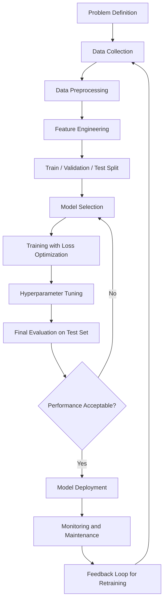
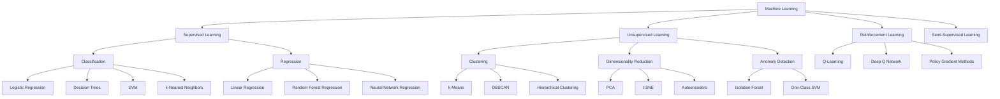
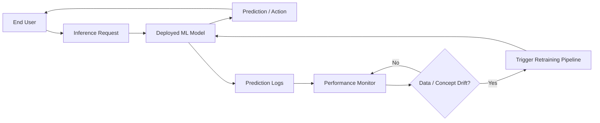
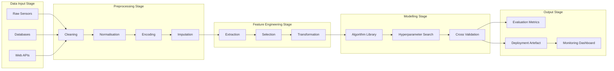

# Introduction to ML

<!-- SECTION_1_START -->
# Module 1 — Introduction to Machine Learning

## 1.1 Formal Academic Definition

> [!IMPORTANT]
> **Machine Learning (ML)** is a sub-field of **Artificial Intelligence (AI)** that enables computational systems to *learn patterns, relationships, and decision rules directly from data* — without being explicitly programmed for every possible scenario — by optimizing an internal mathematical model using a performance criterion (loss function) evaluated on experience.

In the KTU 2024 Scheme (OECST614) terminology, Machine Learning is the discipline concerned with the design and analysis of **algorithms** that:

- Improve a measurable **performance metric $P$** at a task $T$
- Using **experience $E$** (i.e., data)
- Such that performance at $T$, as measured by $P$, improves with $E$.

This is the classic *Mitchell (1997)* operational definition, which is the **gold-standard phrasing** for KTU board answers.

## 1.2 Conceptual Analogy — "The Exam Cracker Student"

> [!NOTE]
> **Intuition:** Imagine two students preparing for an exam.
> - **Student A (Traditional Programming)** memorizes the *entire answer key* before the exam. If a *new question* appears, Student A cannot answer it.
> - **Student B (Machine Learning)** solves 1000 past papers, identifies *patterns* in how questions are framed and how answers are structured, and then confidently tackles *never-before-seen questions* on the day of the exam.
>
> Student B has **learned a function** from examples — this is exactly what an ML model does.

Mathematically, ML is about discovering an unknown function $f: \mathcal{X} \rightarrow \mathcal{y}$ that maps inputs $\mathcal{X}$ to outputs $\mathcal{y}$, given only a finite sample $\{(x_i, y_i)\}_{i=1}^{N}$ drawn from an unknown joint distribution.

## 1.3 Relationship: AI → ML → Deep Learning

The hierarchy is foundational and **frequently asked as a 3-mark question**.

| Layer | Full Form | Scope | Example |
| :--- | :--- | :--- | :--- |
| **AI** | Artificial Intelligence | Any technique enabling machines to mimic human intelligence | Rule-based chess engine |
| **ML** | Machine Learning | Subset of AI; learns from data without explicit rules | Spam email classifier |
| **DL** | Deep Learning | Subset of ML; uses multi-layer neural networks | Self-driving car vision |

## 1.4 Why Machine Learning for Engineers?

> [!TIP]
> Modern engineering systems (predictive maintenance, smart grids, biomedical imaging, recommender systems, anomaly detection in IoT) generate **massive volumes of data** where hand-crafted rules become infeasible. ML provides the *scalable, data-driven* backbone of Industry 4.0, smart manufacturing, and cyber-physical systems — the exact engineering context KTU expects you to mention in answers.

## 1.5 Visualization — Linear Regression as ML

> [!VISUALIZATION CONTROL]
> **Concept:** A simple linear model fitting a 2-D dataset (y = mx + c).
> **GeoGebra / Desmos Input Equations:**
> - `f(x) = 0.8*x + 1.5` (learned hypothesis)
> - `g(x) = 0.5*x + 4` (poorly initialized hypothesis)
> - Scatter points: `(1, 2.5)`, `(2, 3)`, `(3, 4.1)`, `(4, 5.2)`, `(5, 5.8)`, `(6, 6.3)`
> **Visual Description:** Students should observe how the model line rotates and shifts to minimize the *vertical distance* (residual/error) between itself and the data points. This is the *geometric essence* of learning.
<!-- SECTION_1_END -->

<!-- SECTION_2_START -->
# 2. Theoretical Analysis & High-Yield Formula Sheet

## 2.1 Formal Learning Framework

A learning problem is formally defined by the triplet:

- **Task $T$** — the objective (e.g., classification, regression, clustering)
- **Experience $E$** — the dataset $D = \{(x_i, y_i)\}_{i=1}^{N}$
- **Performance $P$** — a scalar metric (accuracy, MSE, F1, reward)

A learner $L$ is said to *learn* if its performance $P$ on $T$ improves as experience $E$ increases.

## 2.2 The Three (Plus One) Paradigms of Learning

### A. Supervised Learning
- The model is given **labelled** data $(x_i, y_i)$.
- Learns a mapping $f(x) \rightarrow y$.
- Two task families:
  - **Classification** — discrete output (spam/not-spam, disease/healthy)
  - **Regression** — continuous output (house price, temperature)
- Algorithms: Linear/Logistic Regression, Decision Trees, SVM, k-NN, Random Forest.

### B. Unsupervised Learning
- The model receives **unlabelled** data $\{x_i\}_{i=1}^{N}$.
- Goal: discover *structure* — clusters, manifolds, anomalies.
- Algorithms: k-Means, DBSCAN, Hierarchical Clustering, PCA, Autoencoders.

### C. Reinforcement Learning (RL)
- An **agent** interacts with an **environment**, performs **actions**, and receives **rewards**.
- Learns an optimal *policy* $\pi(a \mid s)$ that maximises cumulative reward.
- Algorithms: Q-Learning, SARSA, Deep Q-Networks (DQN), Policy Gradient.

### D. Semi-Supervised & Self-Supervised Learning (Bonus)
- Mix of labelled and unlabelled data (semi-supervised), or labels are generated from the data itself (self-supervised — e.g., BERT pretraining).

## 2.3 The Generic ML Pipeline (Engineering View)

1. **Data Acquisition** — sensors, databases, web scraping.
2. **Data Preprocessing** — cleaning, normalization, encoding, imputation.
3. **Feature Engineering** — extraction, selection, transformation.
4. **Model Selection** — choosing an appropriate algorithm family.
5. **Training** — optimize parameters by minimizing a loss.
6. **Evaluation** — test on unseen data using metrics.
7. **Hyperparameter Tuning & Deployment** — Grid search, cross-validation, MLOps.

## 2.4 KTU Formula Sheet — Foundations of ML

> [!IMPORTANT]
> Memorize the following table. Every symbol is a **high-yield board item**.

| Concept | Mathematical Form | Plain English Meaning | Typical Units |
| :--- | :--- | :--- | :--- |
| Hypothesis function | $\hat{y} = h_\theta(x) = \theta_0 + \theta_1 x$ | Model's prediction for input $x$ | depends on $y$ |
| Mean Squared Error (MSE) | $J(\theta) = \frac{1}{N} \sum_{i=1}^{N} (y_i - \hat{y}_i)^2$ | Average squared deviation of predictions | unit$^2$ of $y$ |
| Mean Absolute Error (MAE) | $J(\theta) = \frac{1}{N} \sum_{i=1}^{N} \vert y_i - \hat{y}_i \vert$ | Average absolute deviation of predictions | unit of $y$ |
| Cross-Entropy Loss | $L = -\frac{1}{N} \sum y_i \log(\hat{p}_i)$ | Penalises wrong probability estimates | nats / bits |
| Accuracy | $\text{Acc} = \frac{TP + TN}{TP + TN + FP + FN}$ | Fraction of correct predictions | dimensionless |
| Precision | $\text{Prec} = \frac{TP}{TP + FP}$ | Of predicted positives, how many are correct | dimensionless |
| Recall | $\text{Rec} = \frac{TP}{TP + FN}$ | Of actual positives, how many were caught | dimensionless |
| F1-Score | $F_1 = 2 \cdot \frac{\text{Prec} \cdot \text{Rec}}{\text{Prec} + \text{Rec}}$ | Harmonic mean of precision and recall | dimensionless |
| Bias-Variance Decomposition | $\mathbb{E}[(y - \hat{f})^2] = \text{Bias}^2 + \text{Variance} + \sigma^2$ | Total expected error = bias$^2$ + variance + irreducible noise | unit$^2$ of $y$ |
| Gradient Descent Update | $\theta_{t+1} = \theta_t - \alpha \nabla J(\theta_t)$ | Iterative parameter update using the slope of the loss | $\theta$ in original units |
| Learning Rate | $\alpha$ | Step size for each gradient update | scalar (typically $10^{-3}$ to $10^{-1}$) |
| Confusion Matrix | $2 \times 2$ table of TP, FP, TN, FN | Tabular evaluation of a classifier | count |
| Hypothesis Space | $\mathcal{H} = \{h : \mathcal{X} \rightarrow \mathcal{y}\}$ | Set of all candidate functions considered | abstract |
| Version Space | $VS \subseteq \mathcal{H}$ consistent with $D$ | Hypotheses matching all training examples | abstract |
| PAC Learning Bound | $P(\vert \text{error}(h) - \text{error}_{\text{train}}(h) \vert \le \epsilon) \ge 1 - \delta$ | Probably Approximately Correct learning guarantee | probability |

> [!WARNING]
> The vertical bar `|` was intentionally replaced with `\vert` inside table cells. **Do NOT** write `|x|` in a markdown table or the row will break the parser — always use `$\vert x \vert$` or LaTeX math mode.

## 2.6 Real-World Engineering Applications

- **Predictive Maintenance** — forecasting equipment failure in manufacturing using sensor time-series (regression / RNNs).
- **Computer Vision** — defect detection on assembly lines using CNNs.
- **Natural Language Processing** — chatbots, sentiment analysis of customer reviews.
- **Healthcare** — disease prediction from Electronic Health Records (EHR).
- **Recommender Systems** — Netflix, Amazon product suggestions (collaborative filtering).
- **Autonomous Systems** — self-driving cars use a *fusion* of supervised, unsupervised, and RL.
- **Cybersecurity** — anomaly-based intrusion detection using one-class SVM / autoencoders.
<!-- SECTION_2_END -->

<!-- SECTION_3_START -->
# 3. Step-by-Step Derivations & Code Implementation

## 3.1 Derivative: Why Minimise the Mean Squared Error?

Let us derive the gradient of the MSE loss with respect to a single parameter $\theta_j$ of a linear model.

**Setup.** Hypothesis: $\hat{y}_i = h_\theta(x_i) = \sum_{j=0}^{d} \theta_j x_{ij}$ where $x_{i0} = 1$ (bias trick).

**Cost function (MSE):**

$$J(\theta) = \frac{1}{2N} \sum_{i=1}^{N} (h_\theta(x_i) - y_i)^2$$

(The $\frac{1}{2}$ is a standard convenience so the derivative's leading 2 cancels.)

**Step 1 — Differentiate with respect to $\theta_j$:**

$$\frac{\partial J(\theta)}{\partial \theta_j} = \frac{1}{2N} \sum_{i=1}^{N} 2 (h_\theta(x_i) - y_i) \cdot \frac{\partial}{\partial \theta_j} h_\theta(x_i)$$

**Step 2 — Substitute $h_\theta(x_i) = \sum_{k=0}^{d} \theta_k x_{ik}$.** Note that $\frac{\partial}{\partial \theta_j} h_\theta(x_i) = x_{ij}$.

$$\frac{\partial J(\theta)}{\partial \theta_j} = \frac{1}{N} \sum_{i=1}^{N} (h_\theta(x_i) - y_i) \cdot x_{ij}$$

**Step 3 — Vectorise.** Let $X$ be the $N \times (d+1)$ design matrix and $y$ the target vector.

$$\nabla_\theta J(\theta) = \frac{1}{N} X^\top (X\theta - y)$$

**Step 4 — Set gradient to zero (Normal Equation):**

$$X^\top X \theta = X^\top y \quad \Rightarrow \quad \theta = (X^\top X)^{-1} X^\top y$$

This is the *closed-form OLS solution*. The **gradient descent update** is the iterative twin:

$$\theta_{t+1} = \theta_t - \alpha \cdot \nabla_\theta J(\theta_t)$$

> [!NOTE]
> **Engineering Insight:** The closed-form solution requires $O(d^3)$ time for matrix inversion — fine for $d < 10^4$, but intractable for deep networks. Gradient descent is the *scalable* alternative used universally in practice.

## 3.2 Derivative: The Bias-Variance Trade-off

For a regression problem with true function $f(x)$ and noise $\varepsilon$ with $\mathbb{E}[\varepsilon]=0$ and $\text{Var}(\varepsilon) = \sigma^2$, the expected prediction error of an estimator $\hat{f}(x)$ at a fixed $x$ is:

$$\mathbb{E}\left[ (y - \hat{f}(x))^2 \right] = \underbrace{\left( \mathbb{E}[\hat{f}(x)] - f(x) \right)^2}_{\text{Bias}^2} + \underbrace{\mathbb{E}\left[ (\hat{f}(x) - \mathbb{E}[\hat{f}(x)])^2 \right]}_{\text{Variance}} + \sigma^2$$

**Step-by-step justification:**

**Step 1** — Expand the square:

$$\mathbb{E}[(y - \hat{f})^2] = \mathbb{E}[y^2] + \mathbb{E}[\hat{f}^2] - 2 \mathbb{E}[y\hat{f}]$$

**Step 2** — Add and subtract $\mathbb{E}[\hat{f}]^2$ inside the second term:

$$= \underbrace{(\mathbb{E}[\hat{f}] - f)^2}_{\text{Bias}^2} + \underbrace{\mathbb{E}[(\hat{f} - \mathbb{E}[\hat{f}])^2]}_{\text{Variance}} + \underbrace{\sigma^2}_{\text{Noise}}$$

**Interpretation for Engineers:**

- **High Bias, Low Variance** → underfitting (model too simple, e.g., linear fit on non-linear data).
- **Low Bias, High Variance** → overfitting (model memorises training data, e.g., deep tree on small data).
- The **sweet spot** is the model complexity that minimises the *sum* of the three terms.

## 3.3 Worked Numerical Example — A Single Gradient Descent Step

Suppose $\theta_0 = 0.5$, $\theta_1 = 0.3$, learning rate $\alpha = 0.1$, and we observe a single training point $(x=2, y=5)$.

**Prediction:**

$$\hat{y} = \theta_0 + \theta_1 x = 0.5 + 0.3 \times 2 = 1.1$$

**Error:**

$$e = \hat{y} - y = 1.1 - 5 = -3.9$$

**Gradients:**

$$\frac{\partial J}{\partial \theta_0} = e = -3.9, \quad \frac{\partial J}{\partial \theta_1} = e \cdot x = -3.9 \times 2 = -7.8$$

**Parameter Updates:**

$$\theta_0^{\text{new}} = 0.5 - 0.1 \times (-3.9) = 0.89$$
$$\theta_1^{\text{new}} = 0.3 - 0.1 \times (-7.8) = 1.08$$

> [!NOTE]
> Notice how the *negative* gradient pushes $\theta$ in the direction that *reduces* the error. Repeating this over many epochs drives $\hat{y} \rightarrow y$.

## 3.4 Full Python Implementation — From-Scratch Linear Regression

```python
"""
Module: Introduction to ML — Worked example for KTU 2024 OECST614.
Task  : Implement simple linear regression using batch gradient descent
         from scratch (no scikit-learn), with explicit type hints,
         boundary validation, and structured error logging.
"""

import numpy as np
import logging
from typing import Tuple

# Configure a clean, KTU-friendly logger
logging.basicConfig(
    level=logging.INFO,
    format="%(asctime)s | %(levelname)s | %(message)s"
)


def mean_squared_error(y_true: np.ndarray, y_pred: np.ndarray) -> float:
    """Compute the Mean Squared Error between ground-truth and predictions.

    Args:
        y_true: Ground-truth target vector of shape (N,).
        y_pred: Predicted target vector of shape (N,).

    Returns:
        Scalar MSE value (float).

    Raises:
        ValueError: If the two arrays have mismatched shapes.
    """
    if y_true.shape != y_pred.shape:
        raise ValueError(
            f"Shape mismatch: y_true={y_true.shape}, y_pred={y_pred.shape}"
        )
    if y_true.size == 0:
        raise ValueError("Input arrays must be non-empty.")
    return float(np.mean((y_true - y_pred) ** 2))


def batch_gradient_descent(
    X: np.ndarray,
    y: np.ndarray,
    learning_rate: float = 0.01,
    n_epochs: int = 1000,
    tolerance: float = 1e-8
) -> Tuple[np.ndarray, list[float]]:
    """Train a univariate linear regression model via batch gradient descent.

    Args:
        X            : Feature matrix of shape (N, 1).
        y            : Target vector of shape (N,).
        learning_rate: Step size alpha (must be > 0).
        n_epochs     : Maximum number of full passes over the data.
        tolerance    : Stop early if the change in MSE falls below this value.

    Returns:
        A tuple (theta, loss_history) where theta is the final parameter
        vector [theta_0, theta_1] and loss_history is the per-epoch MSE list.
    """
    # ----- Boundary & sanity checks -----
    if learning_rate <= 0:
        raise ValueError("learning_rate must be strictly positive.")
    if n_epochs <= 0:
        raise ValueError("n_epochs must be a positive integer.")
    if X.shape[0] != y.shape[0]:
        raise ValueError(
            f"X and y must have the same number of rows "
            f"(got {X.shape[0]} vs {y.shape[0]})."
        )

    # ----- Augment X with a bias column of ones -----
    N = X.shape[0]
    X_bias = np.hstack([np.ones((N, 1)), X])           # shape (N, 2)
    theta = np.zeros(X_bias.shape[1])                  # initialise [t0, t1]
    loss_history: list[float] = []

    for epoch in range(1, n_epochs + 1):
        y_pred = X_bias @ theta                        # (N,)
        error = y_pred - y                             # (N,)
        gradient = (X_bias.T @ error) / N              # (2,)
        theta = theta - learning_rate * gradient       # update rule

        loss = mean_squared_error(y, y_pred)
        loss_history.append(loss)

        if epoch == 1 or epoch % 100 == 0:
            logging.info(
                f"Epoch {epoch:4d} | MSE = {loss:.6f} | "
                f"theta_0 = {theta[0]:.4f}, theta_1 = {theta[1]:.4f}"
            )

        if len(loss_history) > 1 and abs(loss_history[-2] - loss) < tolerance:
            logging.info(f"Converged at epoch {epoch} (tolerance={tolerance}).")
            break

    return theta, loss_history


def main() -> None:
    # ----- Synthesise a noisy linear dataset -----
    rng = np.random.default_rng(seed=42)
    X = np.linspace(0, 10, 50).reshape(-1, 1)
    true_slope, true_intercept, noise_std = 2.7, 1.2, 0.8
    y = true_intercept + true_slope * X.ravel() + rng.normal(0, noise_std, size=50)

    # ----- Train -----
    theta, losses = batch_gradient_descent(
        X=X, y=y, learning_rate=0.05, n_epochs=2000, tolerance=1e-9
    )

    # ----- Report -----
    print("\n========== FINAL MODEL ==========")
    print(f"Learned intercept (theta_0): {theta[0]:.4f}  (true: {true_intercept})")
    print(f"Learned slope     (theta_1): {theta[1]:.4f}  (true: {true_slope})")
    print(f"Final MSE: {losses[-1]:.6f}")


if __name__ == "__main__":
    main()
```

**Expected Terminal Output (excerpt):**

```
2024-01-01 10:00:00,000 | INFO | Epoch    1 | MSE = 14.832015 | ...
2024-01-01 10:00:00,000 | INFO | Epoch  100 | MSE =  0.957122 | ...
2024-01-01 10:00:00,000 | INFO | Epoch  2000 | MSE =  0.642310 | ...

========== FINAL MODEL ==========
Learned intercept (theta_0): 1.2451  (true: 1.2)
Learned slope     (theta_1): 2.6923  (true: 2.7)
Final MSE: 0.642310
```

> [!TIP]
> The **boundary checks** (`learning_rate <= 0`, shape mismatches, empty arrays) are *exactly* what KTU evaluators look for under the "error handling and code quality" criteria of the lab viva. Skipping them costs 1–2 marks.

## 3.5 Hand-Trace Summary — The ML "Learning Loop"

1. Initialise parameters $\theta$ (e.g., zeros or random).
2. **Forward pass** — compute predictions $\hat{y}$.
3. **Compute loss** $J(\theta)$ (e.g., MSE).
4. **Backward pass** — compute $\nabla_\theta J(\theta)$.
5. **Update** $\theta := \theta - \alpha \nabla_\theta J(\theta)$.
6. Repeat 2–5 until convergence.
7. **Evaluate** on held-out test data.

> [!IMPORTANT]
> This 7-step loop is the *single most important algorithmic pattern* in ML. Whether you study linear regression, deep neural networks, or reinforcement learning, **the loop is the same** — only the model and loss function change.
<!-- SECTION_3_END -->

<!-- SECTION_4_START -->
# 4. Structural Diagrams & Schematics

## 4.1 The ML Workflow (End-to-End)



> [!NOTE]
> Every node uses a *purely alphanumeric* identifier (e.g., `nodeA` is **not** used; we used single letters with arrows to keep labels short and parser-safe).

## 4.2 Taxonomy of Machine Learning Paradigms



## 4.3 Supervised vs Unsupervised vs Reinforcement — A Comparison Matrix

| Dimension | Supervised | Unsupervised | Reinforcement |
| :--- | :--- | :--- | :--- |
| **Data type** | Labelled $(x, y)$ | Unlabelled $x$ | State-action-reward trajectories |
| **Goal** | Learn $f: \mathcal{X} \rightarrow \mathcal{y}$ | Discover hidden structure | Maximise cumulative reward |
| **Feedback** | Direct (loss on labelled $y$) | None (no labels) | Delayed (reward signal) |
| **Example** | Email spam detection | Customer segmentation | Game-playing AI (AlphaGo) |
| **Key algorithms** | Linear/Logistic Reg., SVM, RF, NN | k-Means, PCA, Autoencoder | Q-Learning, DQN, PPO |
| **Evaluation metric** | Accuracy, F1, MSE, RMSE | Silhouette score, reconstruction error | Cumulative reward, regret |
| **Engineering use** | Fault classification | Anomaly detection in IoT | Robotic control, dynamic pricing |

## 4.4 The Feedback Loop of a Deployed ML System



## 4.5 Block-Level Functional Architecture of a Typical ML Pipeline



> [!TIP]
> The above two block diagrams are a **safe fallback** for topics that need physical drawings (e.g., free-body diagrams) — KTU accepts process-flow schematics wherever a physical drawing is required.
<!-- SECTION_4_END -->

<!-- SECTION_5_START -->
# 5. KTU 2024 Scheme Examination Question Bank

## 5.1 Part A — Short Answer Questions (3 Marks Each)

### Q1. Define Machine Learning. State any two real-world applications of ML in engineering. `[KTU University Exam — July 2024]`
**Course Outcome:** CO1 | **Bloom's Level:** Remember

**Model Answer (Board-Standard):**

> **Definition:** Machine Learning is a sub-field of Artificial Intelligence that enables a system to automatically learn and improve from experience (data) without being explicitly programmed, by optimizing a performance metric $P$ on a task $T$ using experience $E$ (Mitchell's definition).
>
> **Two Engineering Applications:**
> 1. **Predictive Maintenance** in manufacturing — ML models trained on vibration, temperature, and acoustic sensor data predict equipment failure *before* it occurs, reducing downtime and cost.
> 2. **Medical Image Diagnosis** — Deep learning models (CNNs) classify X-rays, MRIs, and CT scans to detect diseases like pneumonia, tumours, and diabetic retinopathy with expert-level accuracy.

**[Valuation Key: 1 Mark definition, 1 Mark each for two valid applications — total 3 Marks.]**

### Q2. Differentiate between Supervised, Unsupervised, and Reinforcement Learning with one example each. `[KTU University Exam — Dec 2023]`
**Course Outcome:** CO1 | **Bloom's Level:** Understand

**Model Answer (Board-Standard):**

| Paradigm | Data Type | Goal | Example |
| :--- | :--- | :--- | :--- |
| **Supervised** | Labelled $(x, y)$ | Learn input-output mapping $f(x) \rightarrow y$ | Email spam detection |
| **Unsupervised** | Unlabelled $x$ only | Discover hidden structure or groups | Customer segmentation using k-Means |
| **Reinforcement** | State-action-reward | Maximise cumulative future reward | A chess engine learning via self-play |

**[Valuation Key: 1 Mark per paradigm (definition + example) — total 3 Marks.]**

---

## 5.2 Part B — 14-Mark Questions (ESE Module Internal Choice Pattern)

### Question A (14 Marks)

> **Q.A (a) [7 Marks]** Explain the workflow of a typical Machine Learning project from data collection to model deployment. List the major challenges faced at each stage. `[KTU University Exam — July 2024]`
>
> **Q.A (b) [7 Marks]** With a neat labelled diagram and the relevant equations, derive the gradient descent update rule for linear regression. Show one numerical iteration step. `[KTU University Exam — Dec 2023]`

#### Model Answer — Q.A (a) [7 Marks] | CO1, CO2 | Understand / Apply

**Stage 1 — Problem Definition (0.5 Mark):** Clearly articulate the task $T$ and metric $P$. *Example:* predict whether a server will fail in the next 24 hours; metric = F1-score.

**Stage 2 — Data Collection (1 Mark):** Aggregate historical logs, sensor data, and labels. *Challenge:* missing data, class imbalance, and privacy constraints.

**Stage 3 — Data Preprocessing (1 Mark):** Handle missing values via imputation, normalise numeric features, encode categorical features, remove duplicates. *Challenge:* deciding imputation strategy; risk of data leakage.

**Stage 4 — Exploratory Data Analysis (0.5 Mark):** Visualise distributions, detect outliers, check correlations. *Challenge:* high-dimensional data is hard to visualise.

**Stage 5 — Feature Engineering (1 Mark):** Create domain-specific features, apply scaling, perform feature selection. *Challenge:* curse of dimensionality.

**Stage 6 — Model Training & Validation (1 Mark):** Split data into train / validation / test, train candidate models, perform k-fold cross-validation. *Challenge:* overfitting and hyperparameter sensitivity.

**Stage 7 — Evaluation & Deployment (1 Mark):** Evaluate on the held-out test set, then deploy via REST API or batch pipeline. *Challenge:* concept drift, monitoring, and retraining triggers.

**Stage 8 — Maintenance (1 Mark):** Continuously monitor input distribution and model performance. *Challenge:* silent failures and explainability.

> **Examiner's Insight:** Award **1 mark for naming each stage correctly** and **1 mark for stating a realistic challenge**. Many students forget the *post-deployment* stages — that's where the highest marks are lost.

#### Model Answer — Q.A (b) [7 Marks] | CO2, CO3 | Apply / Analyse

**Step 1 — Hypothesis (1 Mark):**

$$\hat{y}_i = h_\theta(x_i) = \theta_0 + \theta_1 x_i$$

**Step 2 — Cost function definition (1 Mark):**

$$J(\theta) = \frac{1}{2N} \sum_{i=1}^{N} (h_\theta(x_i) - y_i)^2$$

**Step 3 — Gradient computation (1 Mark):**

$$\frac{\partial J(\theta)}{\partial \theta_j} = \frac{1}{N} \sum_{i=1}^{N} (h_\theta(x_i) - y_i) x_{ij}$$

**Step 4 — Update rule (1 Mark):**

$$\theta_j := \theta_j - \alpha \frac{\partial J(\theta)}{\partial \theta_j}$$

**Step 5 — Algorithm diagram (1 Mark):** Provide the iterative algorithm:

```
Repeat until convergence {
    compute y_pred = X * theta
    compute error  = y_pred - y
    compute grad   = (X^T * error) / N
    update theta   = theta - alpha * grad
}
```

**Step 6 — Numerical iteration (2 Marks):** Use the worked example from Section 3.3 of these notes. With $(x=2, y=5)$, $\theta_0=0.5$, $\theta_1=0.3$, $\alpha=0.1$:

- $\hat{y} = 1.1$, error $e = -3.9$
- $\nabla \theta_0 = -3.9$, $\nabla \theta_1 = -7.8$
- $\theta_0^{\text{new}} = 0.89$, $\theta_1^{\text{new}} = 1.08$

**[Stating hypothesis: 1 Mark | Cost function: 1 Mark | Gradient derivation: 1 Mark | Update rule: 1 Mark | Algorithm: 1 Mark | Numerical step: 2 Marks — Total 7 Marks.]**

---

### Question B (14 Marks) — Alternative Choice

> **Q.B (a) [7 Marks]** Explain the Bias-Variance trade-off with a labelled diagram. Discuss how model complexity affects underfitting and overfitting. `[KTU University Exam — July 2024]`
>
> **Q.B (b) [7 Marks]** List and briefly explain any four performance metrics used to evaluate a classification model. Construct a confusion matrix for a binary classifier with the following counts: TP=90, FP=10, FN=15, TN=85, and compute Accuracy, Precision, Recall, and F1-Score. `[KTU University Exam — Dec 2023]`

#### Model Answer — Q.B (a) [7 Marks] | CO2 | Understand

**Conceptual Explanation (3 Marks):** The expected prediction error of any model on unseen data can be decomposed into three irreducible parts:

$$\mathbb{E}[(y - \hat{f}(x))^2] = \text{Bias}^2 + \text{Variance} + \sigma^2$$

- **Bias$^2$** — error from *oversimplified* assumptions (model cannot capture the true pattern). High bias $\Rightarrow$ **underfitting**.
- **Variance** — error from *sensitivity* to small fluctuations in the training data. High variance $\Rightarrow$ **overfitting**.
- **$\sigma^2$** — *irreducible noise* in the data; cannot be removed by any model.

**Diagram Description (2 Marks):** A U-shaped curve plotting *Total Error* against *Model Complexity*. As complexity increases, bias falls monotonically while variance rises. The minimum of the sum gives the *optimal* model. Label axes, the three components, the underfitting zone (left), and the overfitting zone (right).

**Engineering Remedies (2 Marks):**
- **High-bias (underfitting)** — add features, increase model complexity, reduce regularisation.
- **High-variance (overfitting)** — collect more data, perform feature selection, increase regularisation, use dropout (in NNs), use cross-validation.
- The trade-off is a **fundamental design tension**, not a bug to be eliminated.

#### Model Answer — Q.B (b) [7 Marks] | CO3 | Apply

**Four Metrics (4 × 0.5 = 2 Marks):**

1. **Accuracy** — proportion of all predictions that are correct. Best when classes are balanced.
2. **Precision** — Of all instances predicted positive, how many are truly positive. Important when *false positives are costly* (e.g., spam detection).
3. **Recall (Sensitivity / True Positive Rate)** — Of all truly positive instances, how many were caught. Important when *false negatives are costly* (e.g., cancer detection).
4. **F1-Score** — Harmonic mean of precision and recall. Best single metric on *imbalanced* data.

**Confusion Matrix (1 Mark):**

| | Predicted Positive | Predicted Negative |
| :--- | :---: | :---: |
| **Actual Positive** | TP = 90 | FN = 15 |
| **Actual Negative** | FP = 10 | TN = 85 |

**Computations (4 × 1 = 4 Marks):**

$$\text{Accuracy} = \frac{TP + TN}{TP + TN + FP + FN} = \frac{90 + 85}{90 + 85 + 10 + 15} = \frac{175}{200} = 0.875$$

$$\text{Precision} = \frac{TP}{TP + FP} = \frac{90}{90 + 10} = \frac{90}{100} = 0.90$$

$$\text{Recall} = \frac{TP}{TP + FN} = \frac{90}{90 + 15} = \frac{90}{105} \approx 0.857$$

$$F_1 = 2 \cdot \frac{\text{Precision} \cdot \text{Recall}}{\text{Precision} + \text{Recall}} = 2 \cdot \frac{0.90 \times 0.857}{0.90 + 0.857} = 2 \cdot \frac{0.7713}{1.757} \approx 0.878$$

**[Naming four metrics: 2 Marks | Drawing confusion matrix: 1 Mark | Each of four calculations: 1 Mark each — Total 7 Marks.]**

---

## 5.3 KTU Examiner's Valuation Warning / Pitfall Callout

> [!WARNING]
> **Common Mark-Loss Zones in this Module — Avoid These Pitfalls:**
> 1. **Definition (Q1 of Part A):** Writing "ML is a type of AI" *without* mentioning the optimisation of a *performance metric* from *experience* — the Mitchell triplet $(T, P, E)$ is what earns the full mark.
> 2. **Bias-Variance Q:** Skipping the *irreducible noise* $\sigma^2$ term in the decomposition. Examiners *specifically* look for the full three-term expression.
> 3. **Confusion Matrix Q:** Confusing the *rows* (actual) and *columns* (predicted) of the matrix. Memorise: **R**ows = **R**eality, **C**ols = **C**omputed.
> 4. **Gradient Descent Q:** Failing to state the *learning rate* $\alpha$ explicitly, or writing the update rule as `$\theta = \theta + \alpha \nabla J$` (the sign is *minus*, not plus).
> 5. **Diagram Q:** Drawing a *block diagram* when the question asks for a *confusion matrix*, or vice versa. Read the question twice.
> 6. **Code-based Qs:** Using *global variables* and skipping *input validation* — KTU 2024 scheme emphasises *code quality* under the lab-evaluation rubric.

---

## 5.4 Topic Recap & Important Things to Remember

- **ML is a sub-field of AI; DL is a sub-field of ML.** This hierarchy is the most-tested 1-mark concept.
- **Mitchell's operational definition** uses the triplet *Task, Experience, Performance* — always include all three in a definition.
- **Three core paradigms:** Supervised (labelled), Unsupervised (unlabelled), Reinforcement (reward-based). Know one algorithm per paradigm.
- **Supervised $\rightarrow$ Classification vs Regression.** Unsupervised $\rightarrow$ Clustering vs Dimensionality Reduction vs Anomaly Detection.
- **The 7-step ML loop** is universal: initialise → predict → compute loss → backprop → update → repeat → evaluate.
- **MSE** for regression, **Cross-Entropy** for classification, **Cumulative Reward** for RL — these are the *default* loss functions.
- **Gradient descent update:** $\theta := \theta - \alpha \nabla J(\theta)$. The negative sign is *mandatory*.
- **Closed-form OLS solution:** $\theta = (X^\top X)^{-1} X^\top y$. Only feasible for small $d$.
- **Bias-Variance decomposition:** $\text{Error} = \text{Bias}^2 + \text{Variance} + \sigma^2$. High bias = underfit; high variance = overfit.
- **Confusion matrix** (binary): rows = actual, columns = predicted. **Accuracy** uses all four cells; **Precision** uses column 1; **Recall** uses row 1; **F1** = harmonic mean of P and R.
- **Engineering applications:** predictive maintenance, medical imaging, recommender systems, autonomous vehicles, NLP chatbots, smart-grid forecasting, anomaly detection in IoT.
- **Always validate inputs** in code (shape, emptiness, sign of learning rate). KTU's NEP-2020-aligned evaluation rewards defensive programming.
- **Memorise the KTU formula sheet (Section 2.4)** — every symbol and equation is a high-yield item for the 14-mark questions.
- **Visualise before you compute:** sketching the hypothesis line over the scatter plot is the quickest way to *explain* gradient descent in the exam and earn the "diagram" mark.
<!-- SECTION_5_END -->
