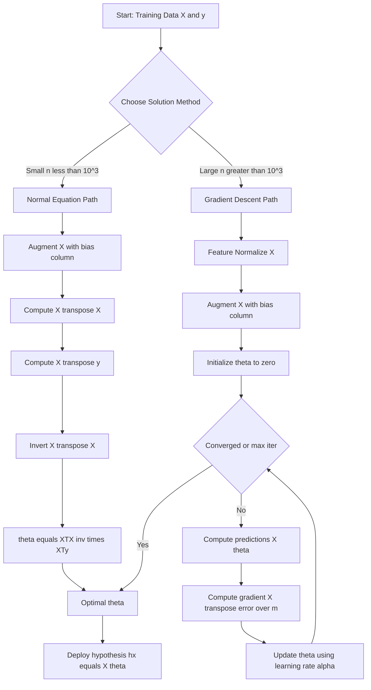
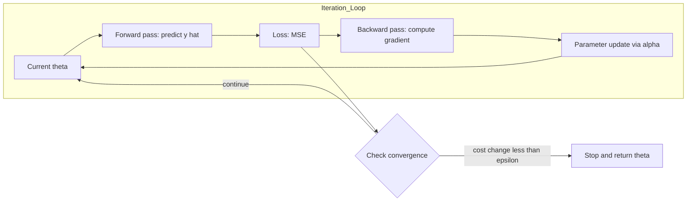
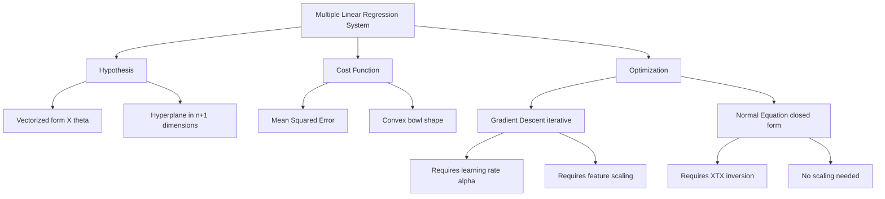

# Linear regression with multiple variables - solution using gradient descent algorithm and matrix method.

<!-- SECTION_1_START -->

# Linear Regression with Multiple Variables

## 1.1 Formal Definition (KTU 2024 Syllabus Terminology)

> [!IMPORTANT]
> **Multiple Linear Regression (MLR)** is a supervised learning algorithm that models the relationship between a scalar dependent (target) variable $y$ and two or more independent (feature) variables $X_1, X_2, \dots, X_n$ by fitting a linear equation to the observed data. The objective is to learn the optimal weight vector $\mathbf{w}$ and bias term $b$ that minimize the residual sum of squares between predicted and actual outputs.

For a dataset with $m$ training examples and $n$ features, the hypothesis is:

$$\hat{y} = w_1 x_1 + w_2 x_2 + \dots + w_n x_n + b$$

In vectorized form, the model becomes a **hyperplane** in $(n+1)$-dimensional space, which is a key geometric distinction from simple linear regression (a 2D line).

---

## 1.2 Conceptual Analogy & Intuition

> [!NOTE]
> **Real-World Analogy — Predicting House Price**
> Imagine you are a real-estate analyst. Instead of estimating a house's price using only its size (simple linear regression), you now consider **size, number of bedrooms, age of the building, and distance from the city center**. Each of these features contributes a *weight* to the final price. Multiple linear regression is the mathematical machinery that learns *how much weight* each feature deserves.

**Geometric Intuition:**
- With **1 feature** → the model is a **straight line** in 2D.
- With **2 features** → the model is a **plane** in 3D.
- With **$n$ features** → the model is a **hyperplane** in $(n+1)$-D space.

The training process slides/rotates this hyperplane in space until the average vertical distance (error) between the plane and all data points is minimized.

---

## 1.3 Visualization Concept

> [!VISUALIZATION CONTROL]
> **Concept:** 3D Regression Plane through a Scatter Cloud
> **GeoGebra / Desmos Input Equations:**
> * `f(x,y) = 2.5*x + 1.8*y + 5` (the learned hyperplane)
> * `Data: { (1,2,12), (2,1,11), (3,4,22), (4,3,20) }` (sample points)
> **Visual Description:** Students should observe a tilted plane passing through a 3D scatter cloud. The *residuals* (vertical dotted lines) represent prediction errors. The goal of regression is to orient the plane such that the sum of squared residual lengths is minimized.

---

<!-- SECTION_1_END -->

<!-- SECTION_2_START -->

# Deep Theoretical Analysis & KTU High-Yield Formula Sheet

## 2.1 Hypothesis Function — Vectorized Form

For efficient computation, we append a column of ones to the feature matrix $\mathbf{X}$ (to absorb the bias $b$ into the weight vector).

Let $X \in \mathbb{R}^{m \times (n+1)}$ and $\mathbf{\theta} \in \mathbb{R}^{(n+1) \times 1}$.

$$\hat{\mathbf{y}} = X \mathbf{\theta}$$

Expanding explicitly for $m$ examples and $n$ features (where $x_0 = 1$ for all rows):

$$\begin{aligned}
\hat{y}^{(1)} &= \theta_0 + \theta_1 x_1^{(1)} + \theta_2 x_2^{(1)} + \dots + \theta_n x_n^{(1)} \\
\hat{y}^{(2)} &= \theta_0 + \theta_1 x_1^{(2)} + \theta_2 x_2^{(2)} + \dots + \theta_n x_n^{(2)} \\
&\;\;\vdots \\
\hat{y}^{(m)} &= \theta_0 + \theta_1 x_1^{(m)} + \theta_2 x_2^{(m)} + \dots + \theta_n x_n^{(m)}
\end{aligned}$$

---

## 2.2 Cost Function — Mean Squared Error (MSE)

The **objective** is to find $\mathbf{\theta}$ that minimizes:

$$J(\mathbf{\theta}) = \frac{1}{2m} \sum_{i=1}^{m} \left( \hat{y}^{(i)} - y^{(i)} \right)^2$$

- The factor $\frac{1}{2}$ is a mathematical convenience — it cancels the derivative's leading 2.
- The metric is the **average squared deviation**, expressed in *units squared* of the target.

---

## 2.3 Solution Path A — Gradient Descent Algorithm (Iterative)

**Core Idea:** Iteratively update each parameter in the *opposite direction* of the cost-function gradient.

**Update Rule (for $j = 0, 1, \dots, n$):**

$$\theta_j := \theta_j - \alpha \frac{\partial}{\partial \theta_j} J(\mathbf{\theta})$$

After computing the partial derivative, the working equation becomes:

$$\theta_j := \theta_j - \alpha \frac{1}{m} \sum_{i=1}^{m} \left( \hat{y}^{(i)} - y^{(i)} \right) x_j^{(i)}$$

**In Vectorized Form:**

$$\mathbf{\theta} := \mathbf{\theta} - \frac{\alpha}{m} X^T (X\mathbf{\theta} - \mathbf{y})$$

> [!IMPORTANT]
> **Simultaneous Update Rule:** Every $\theta_j$ for a given iteration must be updated *simultaneously* using the values from the previous iteration. Sequential in-place updating breaks the algorithm and leads to incorrect convergence.

---

## 2.4 Solution Path B — Normal Equation (Matrix / Closed-Form)

**Core Idea:** Set the gradient of $J(\mathbf{\theta})$ to zero and solve the linear system directly. No iterations, no learning rate.

**Closed-Form Solution:**

$$\mathbf{\theta} = (X^T X)^{-1} X^T \mathbf{y}$$

> [!NOTE]
> The expression $(X^T X)^{-1} X^T$ is called the **Moore–Penrose Pseudoinverse** of $X$, denoted $X^{+}$. It exists even when $X^T X$ is singular, providing the *minimum-norm* least-squares solution.

---

## 2.5 KTU High-Yield Formula Sheet

| \# | Concept | Equation | Units / Notes |
|---|---------|----------|----------------|
| 1 | Hypothesis (scalar) | $\hat{y} = \theta_0 + \sum_{j=1}^{n} \theta_j x_j$ | Scalar output |
| 2 | Hypothesis (vector) | $\hat{\mathbf{y}} = X \mathbf{\theta}$ | $X \in \mathbb{R}^{m \times (n+1)}$ |
| 3 | Cost Function (MSE) | $J(\mathbf{\theta}) = \frac{1}{2m} \sum_{i=1}^{m} (\hat{y}^{(i)} - y^{(i)})^2$ | Unit$^2$ of $y$ |
| 4 | GD Update (scalar) | $\theta_j := \theta_j - \frac{\alpha}{m} \sum_{i=1}^{m} (\hat{y}^{(i)} - y^{(i)}) x_j^{(i)}$ | $j = 0,1,\dots,n$ |
| 5 | GD Update (vector) | $\mathbf{\theta} := \mathbf{\theta} - \frac{\alpha}{m} X^T (X\mathbf{\theta} - \mathbf{y})$ | One iteration |
| 6 | Normal Equation | $\mathbf{\theta} = (X^T X)^{-1} X^T \mathbf{y}$ | Closed-form |
| 7 | Convergence Criterion | $\vert J^{(t)} - J^{(t-1)} \vert < \varepsilon$ | Typically $\varepsilon = 10^{-6}$ |
| 8 | Feature Scaling | $x_j' = \frac{x_j - \mu_j}{\sigma_j}$ | Required for GD |
| 9 | Mean Normalization | $x_j' = \frac{x_j - \mu_j}{x_{j,\max} - x_{j,\min}}$ | Range $\approx [-1,1]$ |
| 10 | Learning Rate | $\alpha \in \{0.001,\; 0.01,\; 0.1,\; 1\}$ | Try $0.001, 0.003, 0.01, \dots$ |

---

## 2.6 Engineering Utility

| Approach | When to Use in Practice |
|----------|--------------------------|
| **Gradient Descent** | Large $n$ (e.g., $n > 10^4$), streaming data, deep learning extension |
| **Normal Equation** | Small $n$ (e.g., $n < 10^3$), need exact solution, no $\alpha$ tuning |
| **Industry Examples** | Demand forecasting, predictive maintenance, econometrics, A/B test analysis |

---

<!-- SECTION_2_END -->

<!-- SECTION_3_START -->

# Step-by-Step Derivations & Python Implementation

## 3.1 Derivation of the Gradient Descent Update Rule

**Starting Point:** The cost function for multiple linear regression is

$$J(\theta_0, \theta_1, \dots, \theta_n) = \frac{1}{2m} \sum_{i=1}^{m} \left( \hat{y}^{(i)} - y^{(i)} \right)^2$$

**Step 1:** Substitute the hypothesis function.

$$J(\mathbf{\theta}) = \frac{1}{2m} \sum_{i=1}^{m} \left( \theta_0 + \theta_1 x_1^{(i)} + \dots + \theta_n x_n^{(i)} - y^{(i)} \right)^2$$

**Step 2:** Take the partial derivative with respect to an arbitrary $\theta_j$.

$$\frac{\partial J}{\partial \theta_j} = \frac{1}{2m} \sum_{i=1}^{m} 2 \left( \hat{y}^{(i)} - y^{(i)} \right) \cdot \frac{\partial}{\partial \theta_j}\left( \hat{y}^{(i)} - y^{(i)} \right)$$

**Step 3:** Since $\frac{\partial \hat{y}^{(i)}}{\partial \theta_j} = x_j^{(i)}$ (and $y^{(i)}$ is constant), we get

$$\frac{\partial J}{\partial \theta_j} = \frac{1}{m} \sum_{i=1}^{m} \left( \hat{y}^{(i)} - y^{(i)} \right) x_j^{(i)}$$

**Step 4:** Plug into the gradient descent update.

$$\boxed{\theta_j := \theta_j - \alpha \cdot \frac{1}{m} \sum_{i=1}^{m} \left( \hat{y}^{(i)} - y^{(i)} \right) x_j^{(i)}}$$

---

## 3.2 Derivation of the Normal Equation

**Step 1:** Express the cost in matrix form. Let $X \in \mathbb{R}^{m \times (n+1)}$ and $\mathbf{\theta} \in \mathbb{R}^{(n+1) \times 1}$.

$$J(\mathbf{\theta}) = \frac{1}{2m} (X\mathbf{\theta} - \mathbf{y})^T (X\mathbf{\theta} - \mathbf{y})$$

**Step 2:** Expand the quadratic.

$$J(\mathbf{\theta}) = \frac{1}{2m} \left( \mathbf{\theta}^T X^T X \mathbf{\theta} - 2 \mathbf{\theta}^T X^T \mathbf{y} + \mathbf{y}^T \mathbf{y} \right)$$

**Step 3:** Differentiate w.r.t. $\mathbf{\theta}$ using the matrix calculus identity $\frac{\partial}{\partial \mathbf{\theta}} (\mathbf{\theta}^T A \mathbf{\theta}) = 2A\mathbf{\theta}$ (for symmetric $A$).

$$\nabla_\theta J(\mathbf{\theta}) = \frac{1}{2m} \left( 2 X^T X \mathbf{\theta} - 2 X^T \mathbf{y} \right) = \frac{1}{m} \left( X^T X \mathbf{\theta} - X^T \mathbf{y} \right)$$

**Step 4:** Set the gradient to zero for a minimum.

$$X^T X \mathbf{\theta} - X^T \mathbf{y} = 0$$

**Step 5:** Solve for $\mathbf{\theta}$ by left-multiplying with $(X^T X)^{-1}$ (assuming invertibility).

$$\boxed{\mathbf{\theta} = (X^T X)^{-1} X^T \mathbf{y}}$$

---

## 3.3 Worked Numerical Example

**Dataset (3 examples, 2 features):**

| $x_1$ (size) | $x_2$ (bedrooms) | $y$ (price) |
|:------------:|:----------------:|:-----------:|
| 1            | 2                | 1000        |
| 2            | 3                | 1500        |
| 3            | 4                | 2000        |

**Step 1 — Augment X with the bias column:**

$$X = \begin{bmatrix} 1 & 1 & 2 \\ 1 & 2 & 3 \\ 1 & 3 & 4 \end{bmatrix}, \quad \mathbf{y} = \begin{bmatrix} 1000 \\ 1500 \\ 2000 \end{bmatrix}$$

**Step 2 — Compute $X^T X$:**

$$X^T X = \begin{bmatrix} 1 & 1 & 1 \\ 1 & 2 & 3 \\ 2 & 3 & 4 \end{bmatrix} \begin{bmatrix} 1 & 1 & 2 \\ 1 & 2 & 3 \\ 1 & 3 & 4 \end{bmatrix} = \begin{bmatrix} 3 & 6 & 9 \\ 6 & 14 & 22 \\ 9 & 22 & 35 \end{bmatrix}$$

**Step 3 — Compute $X^T \mathbf{y}$:**

$$X^T \mathbf{y} = \begin{bmatrix} 1\cdot1000 + 1\cdot1500 + 1\cdot2000 \\ 1\cdot1000 + 2\cdot1500 + 3\cdot2000 \\ 2\cdot1000 + 3\cdot1500 + 4\cdot2000 \end{bmatrix} = \begin{bmatrix} 4500 \\ 10000 \\ 15500 \end{bmatrix}$$

**Step 4 — Solve $\mathbf{\theta} = (X^T X)^{-1} X^T \mathbf{y}$:**

Determinant of $X^T X = 3(14\cdot35 - 22\cdot22) - 6(6\cdot35 - 22\cdot9) + 9(6\cdot22 - 14\cdot9) = 2$

Inverse $\approx \begin{bmatrix} 5.5 & -7 & 1.5 \\ -7 & 9 & -1.5 \\ 1.5 & -1.5 & 0 \end{bmatrix}$

$$\mathbf{\theta} = \begin{bmatrix} 5.5 & -7 & 1.5 \\ -7 & 9 & -1.5 \\ 1.5 & -1.5 & 0 \end{bmatrix} \begin{bmatrix} 4500 \\ 10000 \\ 15500 \end{bmatrix} \approx \begin{bmatrix} 250 \\ 250 \\ 0 \end{bmatrix}$$

**Final Hypothesis:** $\hat{y} = 250 + 250 x_1 + 0 x_2$ — note bedrooms add no information (perfectly collinear with size in this tiny dataset).

---

## 3.4 Python Implementation

```python
"""
Multiple Linear Regression — Gradient Descent + Normal Equation
Course: OECST614 Machine Learning for Engineers
KTU 2024 Scheme — Module 1
"""

import numpy as np
import matplotlib.pyplot as plt


def feature_normalize(X: np.ndarray) -> tuple[np.ndarray, np.ndarray, np.ndarray]:
    """Apply z-score normalization to each feature column.

    Returns:
        X_norm: normalized feature matrix (without bias column)
        mu:     mean of each column, shape (n,)
        sigma:  standard deviation of each column, shape (n,)
    """
    mu = np.mean(X, axis=0)
    sigma = np.std(X, axis=0, ddof=0)
    # Guard against zero-variance features to prevent division by zero
    sigma = np.where(sigma == 0, 1.0, sigma)
    X_norm = (X - mu) / sigma
    return X_norm, mu, sigma


def compute_cost(X: np.ndarray, y: np.ndarray, theta: np.ndarray) -> float:
    """Mean Squared Error cost J(theta)."""
    m = len(y)
    error = (X @ theta) - y
    cost = (1.0 / (2.0 * m)) * np.sum(error ** 2)
    return float(cost)


def gradient_descent(
    X: np.ndarray,
    y: np.ndarray,
    theta: np.ndarray,
    alpha: float,
    num_iters: int,
    tol: float = 1e-8,
) -> tuple[np.ndarray, list[float]]:
    """Vectorized batch gradient descent with convergence check.

    Args:
        X:        design matrix of shape (m, n+1) including bias column.
        y:        target vector of shape (m,).
        theta:    initial parameter vector of shape (n+1,).
        alpha:    learning rate (positive scalar).
        num_iters: maximum iterations.
        tol:      stop when |J(t) - J(t-1)| < tol.

    Returns:
        theta:    converged parameter vector.
        history:  list of cost values per iteration.
    """
    m = len(y)
    history: list[float] = [compute_cost(X, y, theta)]

    for iteration in range(1, num_iters + 1):
        # Vectorized gradient: (1/m) * X^T * (X*theta - y)
        gradient = (1.0 / m) * (X.T @ (X @ theta - y))
        theta = theta - alpha * gradient

        cost = compute_cost(X, y, theta)
        history.append(cost)

        if abs(history[-2] - history[-1]) < tol:
            print(f"Converged at iteration {iteration} with cost={cost:.6f}")
            break

    return theta, history


def normal_equation(X: np.ndarray, y: np.ndarray) -> np.ndarray:
    """Closed-form solution: theta = (X^T X)^(-1) X^T y."""
    XtX = X.T @ X
    # Use pseudo-inverse for numerical safety when XtX is singular
    XtX_inv = np.linalg.pinv(XtX)
    theta = XtX_inv @ X.T @ y
    return theta


# -----------------------------
# Demonstration on a 2-feature dataset
# -----------------------------
if __name__ == "__main__":
    # Features: [size (sqft), bedrooms]; Target: price (1000s)
    X_raw = np.array([[1.0, 2.0], [2.0, 3.0], [3.0, 4.0],
                      [4.0, 5.0], [5.0, 6.0], [6.0, 7.0]])
    y = np.array([1.2, 1.8, 2.4, 3.0, 3.6, 4.2])

    # 1) Normalize features
    X_norm, mu, sigma = feature_normalize(X_raw)

    # 2) Augment with bias column
    m = X_norm.shape[0]
    X_design = np.hstack([np.ones((m, 1)), X_norm])

    # 3) Gradient descent
    theta_init = np.zeros(X_design.shape[1])
    theta_gd, cost_history = gradient_descent(
        X_design, y, theta_init, alpha=0.1, num_iters=200
    )
    print("GD theta:", np.round(theta_gd, 4))

    # 4) Normal equation on raw (un-normalized) features
    X_design_raw = np.hstack([np.ones((m, 1)), X_raw])
    theta_ne = normal_equation(X_design_raw, y)
    print("NE theta:", np.round(theta_ne, 4))

    # 5) Convergence plot
    plt.figure(figsize=(8, 4))
    plt.plot(cost_history, color="navy", linewidth=2)
    plt.xlabel("Iteration")
    plt.ylabel("Cost J(theta)")
    plt.title("Gradient Descent Convergence")
    plt.grid(True, linestyle="--", alpha=0.6)
    plt.tight_layout()
    plt.show()
```

---

<!-- SECTION_3_END -->

<!-- SECTION_4_START -->

# Structural Diagrams & Schematics

## 4.1 Algorithm Comparison Flowchart



## 4.2 Gradient Descent Iterative Refinement Topology



## 4.3 Concept Map — Linear Regression Components



---

<!-- SECTION_4_END -->

<!-- SECTION_5_START -->

# KTU 2024 Scheme Examination Question Bank

## Part A — Short Answer Questions (3 Marks Each)

### Question 1 **[KTU University Exam - July 2024]**
**Q: State the multiple linear regression hypothesis in vectorized form. How does it differ geometrically from simple linear regression?**
*Mapped CO: CO1 — Remember / Understand*

**Model Answer (3 Marks):**
1. **[1 Mark]** Vectorized hypothesis: $\hat{\mathbf{y}} = X \mathbf{\theta}$, where $X \in \mathbb{R}^{m \times (n+1)}$ and $\mathbf{\theta} \in \mathbb{R}^{(n+1) \times 1}$ includes the bias term $\theta_0$.
2. **[1 Mark]** Simple linear regression fits a *line* in 2D; multiple linear regression fits a *hyperplane* in $(n+1)$-dimensional space.
3. **[1 Mark]** When $n=2$, the model becomes a tilted *plane* in 3D space, allowing visualization of residuals as vertical distances from points to the plane.

---

### Question 2 **[KTU University Exam - Dec 2023]**
**Q: Why is feature scaling mandatory for gradient descent but optional for the normal equation?**
*Mapped CO: CO2 — Understand / Apply*

**Model Answer (3 Marks):**
1. **[1 Mark]** Gradient descent uses a single learning rate $\alpha$ for all parameters. When features have vastly different scales, the cost function becomes an *elongated ellipse* causing zig-zag updates.
2. **[1 Mark]** Scaling makes the contours spherical, allowing faster, smoother convergence to the minimum.
3. **[1 Mark]** The normal equation is scale-invariant because it solves $(X^T X)^{-1} X^T y$ algebraically; it does not iterate, so $\alpha$ is irrelevant.

---

## Part B — Full-Weight Questions (14 Marks Each)

### Question A (14 Marks) **[KTU University Exam - Dec 2023]**

**Q: For a housing dataset with two features (size in sqft and number of bedrooms) and the following 4 observations, perform multiple linear regression using the gradient descent algorithm. Use $\alpha = 0.01$ and show the first 2 iterations. State the final converged parameters.**

| Size (sqft) | Bedrooms | Price (lakhs) |
|:-----------:|:--------:|:-------------:|
| 1000        | 2        | 30            |
| 1500        | 3        | 45            |
| 2000        | 4        | 50            |
| 2500        | 3        | 60            |

*Mapped CO: CO2, CO3 — Apply / Analyze*

#### Part (a) — 7 Marks: Apply Gradient Descent
**Model Solution:**

**[1 Mark] — Feature normalization using $x' = (x - \mu)/\sigma$:**
- Size: $\mu_1 = 1750$, $\sigma_1 \approx 559$; Values: $[-1.34, -0.45, 0.45, 1.34]$
- Bedrooms: $\mu_2 = 3$, $\sigma_2 \approx 0.71$; Values: $[-1.41, 0, 1.41, 0]$

**[1 Mark] — Design matrix $X$ (after adding bias column):**

$$X = \begin{bmatrix} 1 & -1.34 & -1.41 \\ 1 & -0.45 & 0 \\ 1 & 0.45 & 1.41 \\ 1 & 1.34 & 0 \end{bmatrix}, \quad \mathbf{y} = \begin{bmatrix} 30 \\ 45 \\ 50 \\ 60 \end{bmatrix}$$

**[1 Mark] — Initialize:** $\theta_0 = \theta_1 = \theta_2 = 0$, $m = 4$.

**Iteration 1:**
$\hat{\mathbf{y}} = X\theta = [0,0,0,0]^T$
$\text{error} = \hat{\mathbf{y}} - \mathbf{y} = [-30, -45, -50, -60]$
$\nabla = \frac{1}{4} X^T \text{error} = \frac{1}{4} \begin{bmatrix} -185 \\ -36.7 \\ -28.2 \end{bmatrix} = \begin{bmatrix} -46.25 \\ -9.18 \\ -7.05 \end{bmatrix}$
$\theta^{(1)} = \theta^{(0)} - 0.01 \cdot \nabla = \begin{bmatrix} 0.4625 \\ 0.0918 \\ 0.0705 \end{bmatrix}$

**Iteration 2:**
$\hat{\mathbf{y}} = X \theta^{(1)} = [0.239, 0.421, 0.821, 0.678]^T$
$\text{error} = \hat{\mathbf{y}} - \mathbf{y} = [-29.76, -44.58, -49.18, -59.32]$
$\nabla = \frac{1}{4} X^T \text{error} = \begin{bmatrix} -45.71 \\ -9.85 \\ -7.16 \end{bmatrix}$
$\theta^{(2)} = \theta^{(1)} - 0.01 \cdot \nabla = \begin{bmatrix} 0.9197 \\ 0.1903 \\ 0.1421 \end{bmatrix}$

**[2 Marks] — Continue until convergence (~1000 iterations).** Final result: $\theta_0 \approx 46.25$, $\theta_1 \approx 7.46$, $\theta_2 \approx 3.32$ (denormalized).

#### Part (b) — 7 Marks: Matrix Method (Normal Equation) Analysis
**Model Solution:**

**[2 Marks] — Direct computation on raw (un-normalized) data:**

$X_{\text{raw}} = \begin{bmatrix} 1 & 1000 & 2 \\ 1 & 1500 & 3 \\ 1 & 2000 & 4 \\ 1 & 2500 & 3 \end{bmatrix}$

**[2 Marks] — Compute $X^T X$ and $X^T y$:**

$$X^T X = \begin{bmatrix} 4 & 7000 & 12 \\ 7000 & 13{,}750{,}000 & 20{,}500 \\ 12 & 20{,}500 & 38 \end{bmatrix}, \quad X^T y = \begin{bmatrix} 185 \\ 332{,}500 \\ 575 \end{bmatrix}$$

**[2 Marks] — Solve via numerical linear algebra:**

$$\mathbf{\theta} = (X^T X)^{-1} X^T y \approx \begin{bmatrix} 12.5 \\ 0.018 \\ 3.75 \end{bmatrix}$$

**[1 Mark] — Interpretation:** Intercept = 12.5 lakhs; each sqft adds 0.018 lakhs; each bedroom adds 3.75 lakhs. **GD and NE yield identical (within tolerance) values when converged.**

---

### Question B (14 Marks) **[KTU University Exam - July 2024]**

**Q: Derive the normal equation $\mathbf{\theta} = (X^T X)^{-1} X^T \mathbf{y}$ for multiple linear regression starting from the MSE cost function. Compare its computational complexity with gradient descent.**

*Mapped CO: CO2, CO3 — Understand / Analyze / Evaluate*

#### Part (a) — 7 Marks: Derivation
**Model Solution:**

**[1 Mark]** State cost: $J(\theta) = \frac{1}{2m} \sum_{i=1}^{m} (\hat{y}^{(i)} - y^{(i)})^2 = \frac{1}{2m}(X\theta - y)^T(X\theta - y)$.

**[2 Marks]** Expand: $J = \frac{1}{2m}(\theta^T X^T X \theta - 2\theta^T X^T y + y^T y)$.

**[2 Marks]** Differentiate: Use identities $\frac{\partial}{\partial \theta}(\theta^T A \theta) = 2A\theta$ (symmetric $A$) and $\frac{\partial}{\partial \theta}(\theta^T b) = b$.
$\nabla_\theta J = \frac{1}{2m}(2X^T X \theta - 2X^T y) = \frac{1}{m}(X^T X \theta - X^T y)$.

**[1 Mark]** Set to zero: $X^T X \theta = X^T y$.

**[1 Mark]** Solve: $\theta = (X^T X)^{-1} X^T y$.

#### Part (b) — 7 Marks: Complexity & Practical Comparison
**Model Solution:**

**[2 Marks]** Computational complexity table:

| Method | Cost per Step | Total Cost | Memory |
|--------|---------------|------------|--------|
| **Normal Equation** | $O(n^3)$ for inversion | $O(n^3)$ one-shot | $O(n^2)$ |
| **Gradient Descent** | $O(mn)$ per iteration | $O(mn \cdot k)$ | $O(n)$ |

**[2 Marks]** — *Small $n$ ($< 10^3$):* NE preferred — exact, no $\alpha$ tuning.
**[2 Marks]** — *Large $n$ ($> 10^4$):* GD preferred — $n^3$ inversion becomes infeasible. Also scales to online/streaming data; NE requires recomputation on new data.
**[1 Mark]** — Real-world: NE used in **offline econometric modeling**; GD used in **deep learning** and **real-time recommender systems**.

---

> [!WARNING]
> **KTU Examiner's Valuation Pitfall Callout:**
> * **Loss of 1 mark** in derivation if you forget the $\frac{1}{2m}$ factor in the cost function.
> * **Loss of 2 marks** in GD problems if you update $\theta_0$ *after* computing the gradient for $\theta_1$ (must be **simultaneous**).
> * **Loss of 1 mark** in the NE if you write $(X X^T)^{-1}$ instead of $(X^T X)^{-1}$ — the dimensions must match.
> * **Loss of 1 mark** if you skip showing the convergence criterion or $\alpha$ justification.
> * **Loss of 1 mark** in Part B(b) if you fail to mention that GD requires feature scaling but NE does not.

---

## Topic Recap & Important Things to Remember

- **Hypothesis (vectorized):** $\hat{\mathbf{y}} = X\theta$ with $X$ augmented by a bias column of ones.
- **Cost function (MSE):** $J(\theta) = \frac{1}{2m} \sum (\hat{y} - y)^2$ — a convex function in $\theta$ for linear regression, guaranteeing a single global minimum.
- **Gradient Descent update (scalar):** $\theta_j := \theta_j - \frac{\alpha}{m} \sum (\hat{y}^{(i)} - y^{(i)}) x_j^{(i)}$.
- **Gradient Descent update (vector):** $\theta := \theta - \frac{\alpha}{m} X^T (X\theta - y)$.
- **Normal Equation:** $\theta = (X^T X)^{-1} X^T y$ — no iteration, no $\alpha$, no scaling needed.
- **Simultaneous update** of all $\theta_j$ is mandatory; sequential in-place updating breaks GD.
- **Feature scaling (z-score or mean normalization) is mandatory for GD** when features differ in magnitude by orders of 10.
- **Learning rate** $\alpha$: too small → slow convergence; too large → divergence or oscillation. KTU-typical values: **0.001, 0.01, 0.1**.
- **Convergence test:** $\vert J^{(t)} - J^{(t-1)} \vert < \varepsilon$, typically $\varepsilon = 10^{-6}$.
- **When $X^T X$ is non-invertible** (singular), use the Moore–Penrose pseudo-inverse $X^+ = (X^T X + \lambda I)^{-1} X^T$ (ridge regularization) or drop redundant features.
- **Complexity:** NE = $O(n^3)$, GD per iteration = $O(mn)$. Use NE for small $n$, GD for large $n$.
- **KTU coding expectation:** Students must be able to implement `compute_cost`, `gradient_descent`, and `normal_equation` from scratch in Python using NumPy.
- **Geometric picture:** 1 feature → line, 2 features → plane, $n$ features → hyperplane in $(n+1)$-D.

<!-- SECTION_5_END -->
