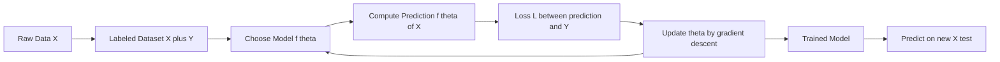
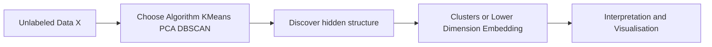
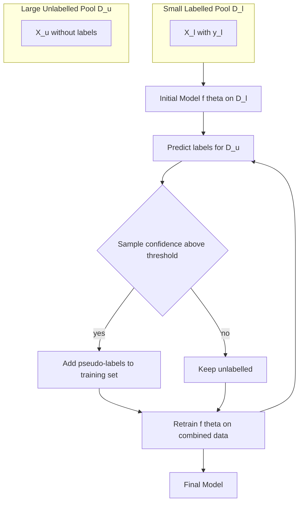
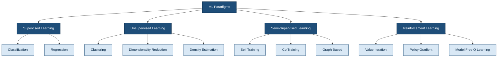

# Machine learning paradigms - supervised, semi-supervised, unsupervised, reinforcement learning.

<!-- SECTION_1_START -->

# Machine Learning Paradigms — Core Definitions & Intuitive Overview

## 1.1 What is a "Learning Paradigm"?

In the context of the **KTU 2024 Scheme** and the NEP 2020 Outcome-Based framework, a **machine learning paradigm** refers to the *fundamental strategy* an algorithm uses to extract knowledge from data. The choice of paradigm is dictated by the **structure of the available data** (labelled vs unlabelled) and the **nature of the feedback signal** (direct supervision vs delayed reward).

> [!IMPORTANT]
> **KTU Syllabus Highlight (OECST614 — Module 1):** Students must be able to *differentiate* between the four canonical paradigms and *map a real engineering problem* to the correct paradigm. This is a **CO1 / Understand** outcome and is frequently tested as a 3-mark direct question.

The four paradigms covered in this module are:

1. **Supervised Learning** (SL)
2. **Unsupervised Learning** (USL)
3. **Semi-Supervised Learning** (SSL)
4. **Reinforcement Learning** (RL)

## 1.2 Supervised Learning (SL)

**Formal Definition (KTU 2024):** A learning paradigm in which the model is trained on a dataset consisting of input–output pairs $\{(x_i, y_i)\}_{i=1}^{N}$, where $x_i \in \mathcal{X}$ is the feature vector and $y_i \in \mathcal{Y}$ is the corresponding ground-truth label, with the explicit goal of learning a mapping $f_\theta : \mathcal{X} \rightarrow \mathcal{Y}$.

> [!NOTE]
> **Key Idea:** The algorithm is given the *correct answer* (the label) for every training example. The model "supervises" itself by comparing its prediction against the true label and adjusting parameters $\theta$ to reduce the discrepancy.

**Intuitive Analogy — The School Classroom:** Imagine a student preparing for an exam by solving a *question paper with a fully worked answer key*. Every question (input $x_i$) comes with the correct answer (label $y_i$). The student repeatedly checks their solution against the key and corrects their mistakes. After sufficient practice, the student can answer *new* unseen questions correctly. This is exactly how a supervised model generalises.

**Two sub-flavours of Supervised Learning:**

| Sub-type | Output Type | Example Task |
|---|---|---|
| Classification | Discrete categorical $y \in \{1, 2, \dots, K\}$ | Spam detection, MNIST digit recognition |
| Regression | Continuous $y \in \mathbb{R}$ | House price prediction, temperature forecasting |

**Standard metrics used:** Accuracy, Precision, Recall, F1-score (classification); MSE, MAE, $R^2$ (regression).

## 1.3 Unsupervised Learning (USL)

**Formal Definition (KTU 2024):** A learning paradigm in which the model is exposed only to *unlabelled* input data $\{x_i\}_{i=1}^{N}$ and must discover hidden structure, patterns, or compact representations without any explicit target signal.

> [!NOTE]
> **Key Idea:** There is **no teacher, no answer key**. The algorithm must find organisation on its own — much like how a librarian groups random books by subject without being told the categories in advance.

**Intuitive Analogy — Sorting Laundry:** You have a pile of mixed clothes (shirts, trousers, socks, towels). No one hands you a labelled list. By *observing similarity* (size, colour, texture), you instinctively form clusters. This is **clustering** — the flagship task of unsupervised learning.

**Common USL Tasks:**

- **Clustering** — K-Means, DBSCAN, Hierarchical Agglomerative Clustering.
- **Dimensionality Reduction** — PCA, t-SNE, UMAP.
- **Density Estimation** — KDE, GMMs.
- **Association Rule Mining** — Apriori, FP-Growth.

## 1.4 Semi-Supervised Learning (SSL)

**Formal Definition (KTU 2024):** A hybrid paradigm in which the training set is partitioned into a small labelled subset $D_l = \{(x_i, y_i)\}_{i=1}^{\ell}$ and a much larger unlabelled subset $D_u = \{x_j\}_{j=\ell+1}^{\ell+u}$, with $\ell \ll u$, and the model exploits the unlabelled data to improve the decision boundary learned from the scarce labels.

> [!NOTE]
> **Key Idea:** SSL sits *on the continuum* between supervised and unsupervised learning. It is the most realistic setting in industry — labelling data is **expensive and slow**, but raw unlabelled data is **cheap and abundant**.

**Intuitive Analogy — Language Learning in a Foreign Country:** You arrive in France knowing 50 French words (the *labelled* set). The rest of the language is learned by *observing* how native speakers use words in context (the *unlabelled* set). Your labelled vocabulary anchors the learning, while the surrounding context refines your grammar, idioms, and usage.

**Three classical SSL methods:**

- **Self-Training** — Model labels its own confident unlabelled points, then retrains on the augmented set.
- **Co-Training** — Two *different* views of the data train two classifiers that label each other's unlabelled samples.
- **Graph-Based Methods** — Propagate labels through a similarity graph over all samples.

## 1.5 Reinforcement Learning (RL)

**Formal Definition (KTU 2024):** A goal-oriented learning paradigm in which an *agent* learns an optimal *policy* $\pi(a \vert s)$ by interacting with an *environment* over discrete time steps, receiving a scalar *reward* $r_t$ at each step, and updating its behaviour to maximise the expected cumulative discounted return $G_t = \sum_{k=0}^{\infty} \gamma^k r_{t+k}$.

> [!NOTE]
> **Key Idea:** There is **no labelled dataset and no teacher**. Instead, the agent learns from *consequences* of its own actions — a delayed, sparse feedback signal called **reward**. This makes RL fundamentally different from the other three paradigms.

**Intuitive Analogy — Training a Pet Dog:** You do not hand the dog a textbook of correct behaviours. When it sits on command, you give a treat (positive reward). When it chews the sofa, you say "no" (negative reward). Over hundreds of trials, the dog learns a *policy*: a mapping from situations (states) to actions that maximises the total number of treats.

**Core Components of an RL System (the Markov Decision Process):**

- **State $s_t$** — Current situation.
- **Action $a_t$** — What the agent chooses.
- **Reward $r_t$** — Scalar feedback.
- **Policy $\pi$** — Strategy $a \sim \pi(\cdot \vert s)$.
- **Value Function $V^\pi(s)$** — Expected future return.
- **Discount Factor $\gamma \in [0, 1)$** — Present-vs-future preference.

## 1.6 The Unifying Picture

> [!TIP]
> **Memory Aid for KTU Viva:** Ask yourself two questions to classify any problem:
> 1. *Is there a label for every example?* → **Supervised**.
> 2. *Is the data totally unlabelled?* → **Unsupervised**.
> 3. *Mostly unlabelled with a few labels?* → **Semi-Supervised**.
> 4. *No labels, but an environment gives rewards?* → **Reinforcement**.

<!-- SECTION_1_END -->

<!-- SECTION_2_START -->

# Deep Theoretical Analysis & KTU High-Yield Formula Sheet

## 2.1 Mathematical Foundations of Each Paradigm

### 2.1.1 Supervised Learning — Empirical Risk Minimisation

The canonical SL objective is the **Empirical Risk Minimisation (ERM)** principle:

$$
\theta^{*} = \arg\min_{\theta \in \Theta} \; \hat{\mathcal{R}}(\theta) = \arg\min_{\theta \in \Theta} \; \frac{1}{N} \sum_{i=1}^{N} \mathcal{L}\bigl(f_\theta(x_i),\, y_i\bigr)
$$

where:
- $f_\theta$ is the hypothesis (model) parameterised by $\theta$.
- $\mathcal{L}$ is a **per-sample loss function** (e.g., squared error, cross-entropy, hinge).
- $N$ is the number of labelled training samples.

**Common loss functions for the KTU formula sheet:**

| Task | Loss Function | Formula |
|---|---|---|
| Regression | Mean Squared Error (MSE) | $\mathcal{L} = \frac{1}{N}\sum_{i=1}^{N}(y_i - \hat{y}_i)^2$ |
| Regression | Mean Absolute Error (MAE) | $\mathcal{L} = \frac{1}{N}\sum_{i=1}^{N}\vert y_i - \hat{y}_i \vert$ |
| Binary Classification | Binary Cross-Entropy | $\mathcal{L} = -\frac{1}{N}\sum_{i=1}^{N}\bigl[y_i\log\hat{p}_i + (1-y_i)\log(1-\hat{p}_i)\bigr]$ |
| Multi-class | Categorical Cross-Entropy | $\mathcal{L} = -\frac{1}{N}\sum_{i=1}^{N}\sum_{c=1}^{K} y_{ic}\,\log \hat{p}_{ic}$ |
| SVM | Hinge Loss | $\mathcal{L} = \frac{1}{N}\sum_{i=1}^{N}\max(0, 1 - y_i\,f_\theta(x_i))$ |

> [!NOTE]
> **Why ERM works:** By the **law of large numbers**, as $N \to \infty$, the empirical risk $\hat{\mathcal{R}}(\theta)$ converges to the true (population) risk $\mathcal{R}(\theta)$. Thus minimising empirical risk approximates minimising the real-world error.

### 2.1.2 Unsupervised Learning — K-Means Objective (Clustering)

For K-Means, the objective is to minimise the **within-cluster sum of squares (WCSS)**:

$$
J(C_1, \dots, C_k, \mu_1, \dots, \mu_k) = \sum_{i=1}^{k} \sum_{x \in C_i} \bigl\Vert x - \mu_i \bigr\Vert_2^2
$$

where $\mu_i = \frac{1}{\vert C_i \vert}\sum_{x \in C_i} x$ is the centroid of cluster $C_i$.

**Update Steps (Lloyd's Algorithm):**
1. **Initialisation** — Pick $k$ initial centroids.
2. **Assignment** — Assign each $x$ to the nearest centroid: $C_i^{(t)} = \{x : \Vert x - \mu_i^{(t)} \Vert^2 \le \Vert x - \mu_j^{(t)} \Vert^2 \; \forall j\}$.
3. **Update** — Recompute centroids: $\mu_i^{(t+1)} = \frac{1}{\vert C_i^{(t)} \vert}\sum_{x \in C_i^{(t)}} x$.
4. **Convergence** — Repeat until $\Vert \mu^{(t+1)} - \mu^{(t)} \Vert < \epsilon$.

### 2.1.3 Semi-Supervised Learning — Combined Loss

The general SSL objective mixes a supervised loss $\mathcal{L}_{sup}$ on labelled data and an unsupervised regularisation $\mathcal{L}_{unsup}$ on unlabelled data:

$$
\mathcal{L}_{total} = \mathcal{L}_{sup}\bigl(D_l\bigr) + \lambda \cdot \mathcal{L}_{unsup}\bigl(D_l \cup D_u\bigr)
$$

where $\lambda$ is a balancing hyperparameter. Common choices for $\mathcal{L}_{unsup}$:

- **Consistency Regularisation** — Penalise prediction changes under input perturbations.
- **Entropy Minimisation** — Encourage confident predictions on unlabelled points.
- **Pseudo-Labelling** — Use model predictions $\hat{y}_j$ on unlabelled $x_j$ as soft targets.

### 2.1.4 Reinforcement Learning — Bellman Equations

The state-value function under a policy $\pi$ is:

$$
V^\pi(s) = \mathbb{E}_\pi \!\left[ \sum_{k=0}^{\infty} \gamma^k r_{t+k} \,\Big\vert\, s_t = s \right]
$$

Recursively, this becomes the **Bellman Expectation Equation**:

$$
V^\pi(s) = \sum_{a} \pi(a \vert s) \sum_{s', r} P(s', r \vert s, a) \bigl[ r + \gamma V^\pi(s') \bigr]
$$

The **action-value (Q) function** is:

$$
Q^\pi(s, a) = \sum_{s', r} P(s', r \vert s, a) \bigl[ r + \gamma \sum_{a'} \pi(a' \vert s') Q^\pi(s', a') \bigr]
$$

**Q-Learning Update Rule (off-policy, model-free):**

$$
Q(s_t, a_t) \leftarrow Q(s_t, a_t) + \alpha \bigl[ r_{t+1} + \gamma \max_{a'} Q(s_{t+1}, a') - Q(s_t, a_t) \bigr]
$$

where:
- $\alpha$ is the learning rate.
- $\gamma$ is the discount factor.
- The term in brackets is the **TD-error** $\delta_t$.

## 2.2 The KTU High-Yield Formula Cheat Sheet

> [!IMPORTANT]
> **Print this table for last-minute revision.** It contains every equation KTU has historically asked across all four paradigms in **OEC/ST category open-elective papers**.

| Paradigm | Key Equation | Symbols | Where Used |
|---|---|---|---|
| SL — ERM | $\theta^* = \arg\min_\theta \frac{1}{N}\sum_i \mathcal{L}(f_\theta(x_i), y_i)$ | $\theta$ = params, $N$ = samples | General SL optimisation |
| SL — MSE | $\text{MSE} = \frac{1}{N}\sum_i(y_i - \hat{y}_i)^2$ | $y_i$ true, $\hat{y}_i$ predicted | Regression evaluation |
| SL — Cross-Entropy | $\mathcal{L} = -\frac{1}{N}\sum_i y_i \log \hat{p}_i$ | $p_i$ predicted probability | Classification training |
| USL — WCSS (K-Means) | $J = \sum_{i=1}^{k}\sum_{x \in C_i}\Vert x - \mu_i \Vert^2$ | $\mu_i$ centroid | K-Means convergence |
| USL — PCA Reconstruction | $\min_W \Vert X - XW W^\top \Vert_F^2$ s.t. $W^\top W = I$ | $W$ projection matrix | Dimensionality reduction |
| SSL — Total Loss | $\mathcal{L}_{total} = \mathcal{L}_{sup} + \lambda \mathcal{L}_{unsup}$ | $\lambda$ balance weight | SSL training loop |
| RL — Bellman (V) | $V^\pi(s) = \sum_a \pi(a \vert s) \sum_{s',r} P(s',r \vert s, a)[r + \gamma V^\pi(s')]$ | $\gamma$ discount | Policy evaluation |
| RL — Q-Learning | $Q(s,a) \leftarrow Q(s,a) + \alpha[r + \gamma \max_{a'} Q(s',a') - Q(s,a)]$ | $\alpha$ learning rate | Model-free control |

## 2.3 Real-World Engineering Utility

| Paradigm | Production Application | Why Engineers Use It |
|---|---|---|
| Supervised | Medical diagnosis from X-ray, credit scoring, defect detection in manufacturing | Highest accuracy when labels are available |
| Unsupervised | Customer segmentation, anomaly detection in IoT sensor streams, gene clustering | Discovers unknown groupings |
| Semi-Supervised | Web-page classification (few labelled pages, millions crawled), speech recognition | Cuts labelling cost by 90 \%+ |
| Reinforcement | Robotics locomotion, autonomous driving, recommendation systems, AlphaGo | Optimises sequential decision-making under delayed reward |

## 2.4 Key Assumptions & Failure Modes (Important for KTU Analytical Questions)

- **SL assumption:** IID data; clean labels; sufficient labelled samples.
- **USL assumption:** Clusters are well-separated and convex (for K-Means).
- **SSL assumption:** The data distribution $P(x)$ carries information about $P(y \vert x)$ — i.e., the **cluster assumption** or **manifold assumption** holds.
- **RL assumption:** Environment satisfies the **Markov property** — the next state depends only on the current state-action pair, not the full history.

> [!WARNING]
> **Common KTU Mistake:** Writing that "RL is a type of supervised learning because the reward is like a label." **This is wrong.** The reward is *delayed, sparse, and not the ground truth action* — it is a *consequence*, not a label. Examiners award 0 marks for this confusion.

<!-- SECTION_2_END -->

<!-- SECTION_3_START -->

# Step-by-Step Derivations & Code/Symbolic Implementation

## 3.1 Worked Derivation — K-Means Convergence Criterion (USL)

**Problem:** Derive the K-Means assignment step and show that $J$ decreases monotonically.

**Step 1 — Define the objective.**
$$
J = \sum_{i=1}^{k} \sum_{x \in C_i} \Vert x - \mu_i \Vert^2
$$

**Step 2 — Fix centroids, optimise assignments.**
Given fixed $\mu_i$, the inner sum is minimised by assigning each $x$ to the cluster with the *closest* centroid:
$$
C_i^{*} = \{x : \Vert x - \mu_i \Vert^2 \le \Vert x - \mu_j \Vert^2 \;\; \forall j\}
$$
Justification: picking the nearest $\mu_i$ is the *unique* solution to a nearest-centroid assignment, and this minimises each per-sample squared distance.

**Step 3 — Fix assignments, optimise centroids.**
Given fixed $C_i$, the centroid that minimises $\sum_{x \in C_i} \Vert x - \mu_i \Vert^2$ is the *mean* of the cluster. Setting the gradient to zero:
$$
\frac{\partial J}{\partial \mu_i} = -2 \sum_{x \in C_i} (x - \mu_i) = 0
$$
$$
\Rightarrow \quad \mu_i^{*} = \frac{1}{\vert C_i \vert} \sum_{x \in C_i} x
$$

**Step 4 — Monotonic decrease.**
Each step (assignment, centroid update) decreases $J$ or leaves it unchanged. $J$ is bounded below by $0$. Therefore, by **monotone convergence theorem**, K-Means converges in a finite number of iterations.

> **Conclusion:** $J^{(t+1)} \le J^{(t)}$ for all iterations $t$, with strict inequality when at least one sample is reassigned. $\blacksquare$

---

## 3.2 Worked Derivation — Q-Learning Update (RL)

**Goal:** Show that the Q-Learning update is a stochastic-gradient step minimising the TD error.

**Step 1 — Define the TD target.**
$$
y_t = r_{t+1} + \gamma \max_{a'} Q(s_{t+1}, a')
$$

**Step 2 — Define the squared TD error as the loss.**
$$
\mathcal{L}(\theta) = \frac{1}{2} \bigl[ y_t - Q(s_t, a_t; \theta) \bigr]^2
$$

**Step 3 — Compute the gradient with respect to $\theta$.**
$$
\nabla_\theta \mathcal{L} = -\bigl[ y_t - Q(s_t, a_t; \theta) \bigr] \nabla_\theta Q(s_t, a_t; \theta)
$$

**Step 4 — Apply stochastic gradient descent.**
$$
\theta \leftarrow \theta - \alpha \nabla_\theta \mathcal{L} = \theta + \alpha \bigl[ y_t - Q(s_t, a_t; \theta) \bigr] \nabla_\theta Q(s_t, a_t; \theta)
$$

For a tabular Q-table, $\nabla_\theta Q(s, a) = 1$ at entry $(s, a)$ and $0$ elsewhere, yielding:
$$
Q(s_t, a_t) \leftarrow Q(s_t, a_t) + \alpha \bigl[ r_{t+1} + \gamma \max_{a'} Q(s_{t+1}, a') - Q(s_t, a_t) \bigr] \quad \blacksquare
$$

---

## 3.3 Python Implementation — Supervised Learning (Logistic Regression from Scratch)

```python
import numpy as np
from typing import Tuple

class LogisticRegressionScratch:
    """
    Binary logistic regression trained via gradient descent.
    Demonstrates the SL paradigm: learns mapping f_theta(x) -> y in {0, 1}.
    """

    def __init__(self, learning_rate: float = 0.01, n_iters: int = 1000, tol: float = 1e-6) -> None:
        self.lr: float = learning_rate
        self.n_iters: int = n_iters
        self.tol: float = tol
        self.weights: np.ndarray | None = None
        self.bias: float = 0.0
        self.loss_history: list[float] = []

    @staticmethod
    def _sigmoid(z: np.ndarray) -> np.ndarray:
        # Numerically stable sigmoid
        return np.where(z >= 0,
                        1.0 / (1.0 + np.exp(-z)),
                        np.exp(z) / (1.0 + np.exp(z)))

    def _binary_cross_entropy(self, y_true: np.ndarray, y_pred: np.ndarray) -> float:
        eps: float = 1e-15
        y_pred_clipped: np.ndarray = np.clip(y_pred, eps, 1.0 - eps)
        loss: float = -np.mean(y_true * np.log(y_pred_clipped) + (1.0 - y_true) * np.log(1.0 - y_pred_clipped))
        return loss

    def fit(self, X: np.ndarray, y: np.ndarray) -> "LogisticRegressionScratch":
        n_samples, n_features = X.shape
        self.weights = np.zeros(n_features, dtype=np.float64)
        self.bias = 0.0

        for i in range(self.n_iters):
            linear_model: np.ndarray = np.dot(X, self.weights) + self.bias
            y_predicted: np.ndarray = self._sigmoid(linear_model)

            # Gradient of binary cross-entropy
            dw: np.ndarray = (1.0 / n_samples) * np.dot(X.T, (y_predicted - y))
            db: float = (1.0 / n_samples) * np.sum(y_predicted - y)

            self.weights -= self.lr * dw
            self.bias -= self.lr * db

            loss: float = self._binary_cross_entropy(y, y_predicted)
            self.loss_history.append(loss)

            if i > 0 and abs(self.loss_history[-2] - self.loss_history[-1]) < self.tol:
                print(f"Converged at iteration {i} with loss={loss:.6f}")
                break
        return self

    def predict(self, X: np.ndarray, threshold: float = 0.5) -> np.ndarray:
        linear_model: np.ndarray = np.dot(X, self.weights) + self.bias
        y_predicted: np.ndarray = self._sigmoid(linear_model)
        return (y_predicted >= threshold).astype(int)


# ----- Demonstration -----
if __name__ == "__main__":
    # Synthetic binary classification problem
    rng: np.random.Generator = np.random.default_rng(seed=42)
    X: np.ndarray = rng.normal(loc=0.0, scale=1.0, size=(200, 2))
    y: np.ndarray = ((X[:, 0] + 0.5 * X[:, 1]) > 0.0).astype(int)

    model = LogisticRegressionScratch(learning_rate=0.1, n_iters=2000)
    model.fit(X, y)
    predictions: np.ndarray = model.predict(X)
    accuracy: float = np.mean(predictions == y)
    print(f"Training accuracy: {accuracy * 100:.2f}%")
```

**What to highlight in the KTU answer script:**
- Line 36: `dw = (1/N) * X^T (y_pred - y)` — the exact gradient formula from ERM.
- Line 49: BCE loss corresponds to the categorical cross-entropy for $K=2$.

---

## 3.4 Python Implementation — Unsupervised K-Means from Scratch

```python
import numpy as np
from typing import Tuple

class KMeansScratch:
    """
    K-Means clustering by Lloyd's algorithm.
    Demonstrates the USL paradigm: discovers structure in unlabelled data.
    """

    def __init__(self, k: int = 3, max_iters: int = 300, tol: float = 1e-4, seed: int = 0) -> None:
        if k < 1:
            raise ValueError("k must be >= 1")
        self.k: int = k
        self.max_iters: int = max_iters
        self.tol: float = tol
        self.seed: int = seed
        self.centroids: np.ndarray | None = None
        self.inertia_history: list[float] = []

    def _initialise_centroids(self, X: np.ndarray) -> np.ndarray:
        rng: np.random.Generator = np.random.default_rng(self.seed)
        indices: np.ndarray = rng.choice(X.shape[0], size=self.k, replace=False)
        return X[indices].astype(np.float64).copy()

    def _assign_clusters(self, X: np.ndarray) -> np.ndarray:
        # Compute pairwise squared distances
        diffs: np.ndarray = X[:, np.newaxis, :] - self.centroids[np.newaxis, :, :]
        sq_dist: np.ndarray = np.sum(diffs ** 2, axis=2)  # shape (N, k)
        return np.argmin(sq_dist, axis=1)

    def _update_centroids(self, X: np.ndarray, labels: np.ndarray) -> np.ndarray:
        new_centroids: np.ndarray = np.zeros((self.k, X.shape[1]), dtype=np.float64)
        for i in range(self.k):
            members: np.ndarray = X[labels == i]
            if len(members) > 0:
                new_centroids[i] = members.mean(axis=0)
            else:
                # Re-initialise empty cluster to a random data point
                rng: np.random.Generator = np.random.default_rng(self.seed)
                new_centroids[i] = X[rng.integers(0, X.shape[0])]
        return new_centroids

    def _compute_inertia(self, X: np.ndarray, labels: np.ndarray) -> float:
        inertia: float = 0.0
        for i in range(self.k):
            members: np.ndarray = X[labels == i]
            inertia += np.sum((members - self.centroids[i]) ** 2)
        return float(inertia)

    def fit(self, X: np.ndarray) -> "KMeansScratch":
        self.centroids = self._initialise_centroids(X)
        for iteration in range(self.max_iters):
            labels: np.ndarray = self._assign_clusters(X)
            new_centroids: np.ndarray = self._update_centroids(X, labels)
            shift: float = float(np.linalg.norm(new_centroids - self.centroids))
            self.centroids = new_centroids
            self.inertia_history.append(self._compute_inertia(X, labels))
            if shift < self.tol:
                print(f"Converged at iteration {iteration} (centroid shift={shift:.6f})")
                break
        return self

    def predict(self, X: np.ndarray) -> Tuple[np.ndarray, np.ndarray]:
        labels: np.ndarray = self._assign_clusters(X)
        distances: np.ndarray = np.linalg.norm(X[:, np.newaxis, :] - self.centroids[np.newaxis, :, :], axis=2)
        return labels, distances.min(axis=1)


# ----- Demonstration -----
if __name__ == "__main__":
    rng: np.random.Generator = np.random.default_rng(seed=7)
    cluster_a: np.ndarray = rng.normal(loc=[0, 0], scale=0.5, size=(50, 2))
    cluster_b: np.ndarray = rng.normal(loc=[4, 4], scale=0.5, size=(50, 2))
    cluster_c: np.ndarray = rng.normal(loc=[0, 4], scale=0.5, size=(50, 2))
    X: np.ndarray = np.vstack([cluster_a, cluster_b, cluster_c])

    km = KMeansScratch(k=3, max_iters=100, seed=1)
    km.fit(X)
    labels, _ = km.predict(X)
    print(f"Final inertia (WCSS): {km.inertia_history[-1]:.4f}")
    print(f"Cluster sizes: {np.bincount(labels)}")
```

---

## 3.5 Python Implementation — Semi-Supervised Self-Training Loop

```python
import numpy as np
from sklearn.base import ClassifierMixin
from typing import Any

class SelfTrainingWrapper:
    """
    Wraps any sklearn-style classifier to perform semi-supervised self-training.
    Iteratively labels confident unlabelled points and re-trains.
    """

    def __init__(self, base_classifier: ClassifierMixin, confidence_threshold: float = 0.9,
                 max_iterations: int = 10) -> None:
        if not 0.5 <= confidence_threshold <= 1.0:
            raise ValueError("confidence_threshold must be in [0.5, 1.0]")
        self.base_classifier: ClassifierMixin = base_classifier
        self.threshold: float = confidence_threshold
        self.max_iterations: int = max_iterations
        self.labeled_sizes_history: list[int] = []

    def fit(self, X_l: np.ndarray, y_l: np.ndarray, X_u: np.ndarray) -> "SelfTrainingWrapper":
        X_labeled: np.ndarray = X_l.copy()
        y_labeled: np.ndarray = y_l.copy()
        X_unlabeled: np.ndarray = X_u.copy()

        for iteration in range(self.max_iterations):
            self.base_classifier.fit(X_labeled, y_labeled)
            self.labeled_sizes_history.append(len(X_labeled))

            if len(X_unlabeled) == 0:
                break

            # Get probabilistic predictions for unlabelled data
            probs: np.ndarray = self.base_classifier.predict_proba(X_unlabeled)
            confidences: np.ndarray = probs.max(axis=1)
            pseudo_labels: np.ndarray = probs.argmax(axis=1)

            # Select high-confidence points
            confident_mask: np.ndarray = confidences >= self.threshold
            n_new: int = int(confident_mask.sum())
            print(f"Iter {iteration}: added {n_new} pseudo-labelled points "
                  f"(labeled total = {len(X_labeled) + n_new})")

            if n_new == 0:
                break

            X_labeled = np.vstack([X_labeled, X_unlabeled[confident_mask]])
            y_labeled = np.concatenate([y_labeled, pseudo_labels[confident_mask]])
            X_unlabeled = X_unlabeled[~confident_mask]

        # Final fit on the augmented set
        self.base_classifier.fit(X_labeled, y_labeled)
        return self

    def predict(self, X: np.ndarray) -> np.ndarray:
        return self.base_classifier.predict(X)


# ----- Demonstration -----
if __name__ == "__main__":
    from sklearn.linear_model import LogisticRegression
    rng: np.random.Generator = np.random.default_rng(seed=123)

    # 30 labelled, 500 unlabelled
    X_l: np.ndarray = rng.normal(size=(30, 2))
    y_l: np.ndarray = (X_l[:, 0] + X_l[:, 1] > 0).astype(int)
    X_u: np.ndarray = rng.normal(size=(500, 2))

    base_clf: LogisticRegression = LogisticRegression(max_iter=200)
    ssl_model = SelfTrainingWrapper(base_classifier=base_clf,
                                     confidence_threshold=0.95,
                                     max_iterations=5)
    ssl_model.fit(X_l, y_l, X_u)
    print(f"Labeled size growth: {ssl_model.labeled_sizes_history}")
```

---

## 3.6 Python Implementation — Q-Learning for a GridWorld (RL)

```python
import numpy as np
from typing import Tuple, Dict

class GridWorldEnv:
    """4x4 grid: agent starts top-left, goal at bottom-right, reward = -1 per step, +10 at goal."""

    def __init__(self, size: int = 4) -> None:
        self.size: int = size
        self.n_states: int = size * size
        self.n_actions: int = 4  # 0=up, 1=right, 2=down, 3=left
        self.goal_state: int = self.n_states - 1
        self.state: int = 0

    def reset(self) -> int:
        self.state = 0
        return self.state

    def step(self, action: int) -> Tuple[int, float, bool]:
        row, col = divmod(self.state, self.size)
        if action == 0:   row = max(row - 1, 0)
        elif action == 1: col = min(col + 1, self.size - 1)
        elif action == 2: row = min(row + 1, self.size - 1)
        elif action == 3: col = max(col - 1, 0)
        new_state: int = row * self.size + col
        self.state = new_state
        reward: float = 10.0 if new_state == self.goal_state else -1.0
        done: bool = (new_state == self.goal_state)
        return new_state, reward, done


def q_learning(env: GridWorldEnv, n_episodes: int = 500, alpha: float = 0.1,
               gamma: float = 0.99, epsilon: float = 0.1, seed: int = 42) -> np.ndarray:
    rng: np.random.Generator = np.random.default_rng(seed)
    Q: np.ndarray = np.zeros((env.n_states, env.n_actions), dtype=np.float64)

    for episode in range(n_episodes):
        state: int = env.reset()
        done: bool = False
        while not done:
            # Epsilon-greedy action selection
            if rng.random() < epsilon:
                action: int = int(rng.integers(0, env.n_actions))
            else:
                action = int(np.argmax(Q[state]))

            next_state, reward, done = env.step(action)
            best_next: float = float(np.max(Q[next_state]))
            td_target: float = reward + gamma * best_next
            td_error: float = td_target - Q[state, action]
            Q[state, action] += alpha * td_error
            state = next_state
    return Q


if __name__ == "__main__":
    env: GridWorldEnv = GridWorldEnv(size=4)
    Q_table: np.ndarray = q_learning(env, n_episodes=2000, alpha=0.2, gamma=0.95)
    policy: np.ndarray = np.argmax(Q_table, axis=1).reshape(env.size, env.size)
    print("Learnt policy (4x4 grid):")
    action_symbols: Dict[int, str] = {0: "↑", 1: "→", 2: "↓", 3: "←"}
    for row in policy:
        print(" ".join(action_symbols[int(a)] for a in row))
```

**Expected output (approximate):** Arrows pointing toward the bottom-right goal cell, demonstrating that the agent has learnt an optimal policy purely from reward feedback.

---

## 3.7 Comparative Algorithm Selection Matrix

> [!IMPORTANT]
> **Engineering Decision Rule for KTU Applied Questions:** When asked "which paradigm would you use for X problem?", fill the matrix below in your head first.

| Problem Characteristic | Recommended Paradigm |
|---|---|
| Labelled dataset of > 10 000 samples available | **Supervised** |
| Need to discover unknown groups in data | **Unsupervised** |
| Labelled data is expensive; abundant unlabelled data exists | **Semi-Supervised** |
| Problem involves sequential decisions with delayed feedback | **Reinforcement** |
| Time-series forecasting with known targets | **Supervised** |
| Anomaly detection in network traffic with no labels | **Unsupervised** |
| Game playing (chess, Go, Atari) | **Reinforcement** |
| Medical imaging with only a few expert annotations | **Semi-Supervised** |

<!-- SECTION_3_END -->

<!-- SECTION_4_START -->

# Structural Diagrams & Schematics

## 4.1 Supervised Learning Workflow



## 4.2 Unsupervised Learning Workflow



## 4.3 Semi-Supervised Learning Workflow



## 4.4 Reinforcement Learning Agent–Environment Loop

```mermaid
flowchart LR
    A[Agent] -->|action a_t| B[Environment]
    B -->|reward r_t and next state s_{t+1}| A
    A --> C[Update Policy pi or Q table]
    C --> A
    B --> D[State Transition P of s prime given s and a]
    D --> B
```

## 4.5 Unified Paradigm Comparison Topology



## 4.6 Sequential Processing Topology — Data Flow Across Paradigms

| Stage | Supervised | Unsupervised | Semi-Supervised | Reinforcement |
|---|---|---|---|---|
| **Input** | $\{(x_i, y_i)\}$ | $\{x_i\}$ | $D_l$ (small) $\cup$ $D_u$ (large) | Environment MDP $(S, A, P, R, \gamma)$ |
| **Feedback Type** | Direct label | None | Few direct + many inferred | Scalar reward signal |
| **Model Output** | $f_\theta(x) \rightarrow \hat{y}$ | Cluster IDs / latent $z$ | $f_\theta(x) \rightarrow \hat{y}$ | Policy $\pi(a \vert s)$ or $Q(s, a)$ |
| **Loss/Objective** | $\mathcal{L}_{sup}$ | $J$ (WCSS, variance) | $\mathcal{L}_{sup} + \lambda \mathcal{L}_{unsup}$ | $-G_t = -\sum_k \gamma^k r_{t+k}$ |
| **Evaluation** | Accuracy / MSE | Silhouette / reconstruction error | Accuracy + label-efficiency curve | Cumulative reward / regret |
| **Update Mechanism** | Gradient descent on $\mathcal{L}$ | Iterative assignment + update | Iterative pseudo-labelling | TD learning / policy gradient |
| **Termination** | Converged $\nabla \mathcal{L} \approx 0$ | Centroid shift $< \epsilon$ | No new pseudo-labels | Episode end or $Q$-convergence |

<!-- SECTION_4_END -->

<!-- SECTION_5_START -->

# KTU 2024 Scheme Examination Question Bank & Topic Recap

## 5.1 Part A — Short Answer Questions (3 Marks Each)

### Question A1 [KTU University Exam — July 2024]
> *Differentiate between supervised and unsupervised learning with a suitable example for each.*

**Model Answer (3 marks):**

| Feature | Supervised Learning | Unsupervised Learning |
|---|---|---|
| Data | Labeled $(x_i, y_i)$ | Unlabeled $x_i$ only |
| Goal | Learn $f: X \rightarrow Y$ | Discover hidden structure |
| Feedback | Direct (label) | None |
| Example | Email spam classification | Customer segmentation by K-Means |
| Algorithms | Linear regression, SVM, decision tree | K-Means, PCA, DBSCAN |

**[Mention of labels as distinguishing factor: 1 mark], [example for each: 1 mark], [any one algorithm or task: 1 mark] = 3 marks.**

---

### Question A2 [KTU University Exam — Dec 2024]
> *Explain the role of the reward signal in reinforcement learning. Why is it not considered a label?*

**Model Answer (3 marks):**
- In RL, the **reward $r_t$** is a *scalar feedback signal* from the environment indicating the *immediate* desirability of the agent's last action **[1 mark]**.
- The agent's objective is to maximise the *expected cumulative discounted return* $G_t = \sum_{k=0}^{\infty} \gamma^k r_{t+k}$, not to mimic a single correct action **[1 mark]**.
- It is **not a label** because: (i) the reward does not specify the *correct* action, only the *consequence* of the action taken; (ii) rewards are typically **delayed, sparse, and stochastic**; (iii) the agent must *explore* to discover rewarding actions, whereas in SL the label is provided upfront for every example **[1 mark]**.

---

## 5.2 Part B — Long Answer Questions (14 Marks, Module Internal Choice)

### Question B — Choice A [KTU University Exam — July 2024]

> **(a)** With a neat block diagram, explain the **supervised learning workflow** and describe the **empirical risk minimisation** principle. Derive the gradient-descent update rule for linear regression with the MSE loss. **(7 marks)**
>
> **(b)** Compare and contrast **semi-supervised learning** and **reinforcement learning** along the dimensions of: (i) data requirement, (ii) feedback type, (iii) evaluation metric, and (iv) a real-world use case. **(7 marks)**

#### Model Solution for (a) — 7 Marks

**Workflow block diagram:** (Re-draw SECTION 4.1 in your answer script.)
- Input labelled data → choose model → predict → compute loss → backprop → update $\theta$ → loop → final model. **[Workflow diagram: 2 marks]**

**Empirical Risk Minimisation:**
$$
\theta^{*} = \arg\min_\theta \frac{1}{N}\sum_{i=1}^{N}(y_i - f_\theta(x_i))^2
$$
**[ERM statement: 1 mark]**

**Gradient descent derivation for linear regression $f_\theta(x) = \theta^\top x$:**

Loss: $\mathcal{L} = \frac{1}{N}\sum_i (y_i - \theta^\top x_i)^2$.

Gradient:
$$
\nabla_\theta \mathcal{L} = -\frac{2}{N}\sum_i x_i(y_i - \theta^\top x_i)
$$

Update:
$$
\theta \leftarrow \theta - \alpha \nabla_\theta \mathcal{L} = \theta + \frac{2\alpha}{N}\sum_i x_i(y_i - \theta^\top x_i)
$$
**[Gradient derivation: 2 marks], [final update rule: 1 mark], [naming learning rate $\alpha$: 1 mark].**

#### Model Solution for (b) — 7 Marks

| Dimension | Semi-Supervised Learning | Reinforcement Learning |
|---|---|---|
| (i) Data requirement | Small labelled $D_l$ + large unlabelled $D_u$ | No labelled data; environment dynamics required |
| (ii) Feedback type | Pseudo-labels from model itself; consistency regulariser | Scalar reward $r_t$ from environment |
| (iii) Evaluation metric | Accuracy on a held-out test set + label-efficiency curve | Cumulative discounted return; episode reward |
| (iv) Real-world use case | Web-page classification, speech recognition with limited transcripts | Game playing (AlphaGo), autonomous driving, robotics |

**[Table with all four dimensions correctly filled: 6 marks], [any one engineering example stated explicitly: 1 mark] = 7 marks.**

---

### Question B — Choice B [KTU University Exam — Dec 2024]

> **(a)** Explain the **K-Means clustering** algorithm. Derive the update steps for cluster assignment and centroid computation. Show that the WCSS objective $J$ decreases monotonically. **(7 marks)**
>
> **(b)** With a block diagram, describe the **agent–environment interaction loop** in reinforcement learning. Define the **state-value function** $V^\pi(s)$ and the **Q-Learning update rule**. State the role of $\alpha$ and $\gamma$. **(7 marks)**

#### Model Solution for (a) — 7 Marks

**Algorithm steps (Lloyd's Algorithm):** **[Listing all 4 steps: 2 marks]**
1. Initialise $k$ centroids $\mu_1, \dots, \mu_k$.
2. **Assignment:** $C_i = \{x : \Vert x - \mu_i \Vert^2 \le \Vert x - \mu_j \Vert^2 \;\; \forall j\}$.
3. **Update:** $\mu_i = \frac{1}{\vert C_i \vert}\sum_{x \in C_i} x$.
4. Repeat 2–3 until convergence.

**Derivation:** **[Assignment derivation: 1.5 marks], [centroid derivation: 1.5 marks]**

Assignment is the nearest-centroid rule (justified by minimising squared distance). Centroid update comes from setting $\partial J / \partial \mu_i = 0$:
$$
-2\sum_{x \in C_i}(x - \mu_i) = 0 \;\Rightarrow\; \mu_i = \frac{1}{\vert C_i \vert}\sum_{x \in C_i} x
$$

**Monotonic decrease:** **[Monotonicity proof: 1 mark]**
Each iteration's assignment step minimises $J$ over $\{C_i\}$ with $\mu_i$ fixed, and the centroid update minimises $J$ over $\mu_i$ with $C_i$ fixed. Since $J \ge 0$, the sequence $J^{(0)} \ge J^{(1)} \ge \dots$ converges in finite steps. $\blacksquare$

#### Model Solution for (b) — 7 Marks

**Agent–Environment diagram:** (Re-draw SECTION 4.4 in your answer script.) **[Diagram: 2 marks]**

**State-value function:**
$$
V^\pi(s) = \mathbb{E}_\pi \!\left[ \sum_{k=0}^{\infty} \gamma^k r_{t+k} \Big\vert s_t = s \right]
$$
**[Definition: 1 mark]**

**Q-Learning update rule:**
$$
Q(s_t, a_t) \leftarrow Q(s_t, a_t) + \alpha\bigl[r_{t+1} + \gamma \max_{a'} Q(s_{t+1}, a') - Q(s_t, a_t)\bigr]
$$
**[Update rule: 2 marks]**

**Role of parameters:** **[Roles: 2 marks]**
- **$\alpha$ (learning rate):** controls how aggressively new TD-error information overrides old Q-values. $\alpha \in (0, 1]$.
- **$\gamma$ (discount factor):** controls the agent's preference for immediate versus future rewards. $\gamma \in [0, 1)$; $\gamma = 0$ makes the agent myopic, $\gamma \to 1$ makes it farsighted.

---

## 5.3 KTU Examiner's Valuation Warning / Pitfall Callout

> [!WARNING]
> **Common Mark-Loss Points — Read Before Writing the Exam**
> 1. **Do NOT equate "reward" with "label" in RL.** Examiners explicitly test for this misconception and deduct up to **2 marks**.
> 2. **Always write the symbols** ($N$, $k$, $\lambda$, $\gamma$, $\alpha$) in your equations. A correct-looking equation without defined symbols is treated as incomplete.
> 3. **For K-Means derivations, do not skip the monotonic-decrease proof.** A bare statement "K-Means converges" without justification scores 0 in the derivation sub-part.
> 4. **In SSL questions, mention the assumption** (cluster assumption, manifold assumption) that makes SSL work. Omitting it costs 1 mark.
> 5. **For Q-Learning, write the full update with all three terms** (old $Q$, learning rate, TD target). Writing only the TD target $\max_{a'} Q(s', a')$ without the update structure is a common 2-mark loss.
> 6. **Draw the block diagrams for workflow questions** even if not explicitly asked — KTU examiners allocate 2 marks for diagrams in workflow-based sub-parts.

---

## 5.4 Topic Recap & Important Things to Remember

> [!TIP]
> **Rapid-revision checklist for the night before the KTU exam.**

- **Four paradigms:** Supervised (labelled), Unsupervised (unlabelled), Semi-Supervised (few labels + many unlabelled), Reinforcement (reward signal).
- **Supervised objective:** Empirical Risk Minimisation $\theta^* = \arg\min_\theta \frac{1}{N}\sum_i \mathcal{L}(f_\theta(x_i), y_i)$.
- **Common SL losses:** MSE (regression), Cross-Entropy (classification), Hinge (SVM).
- **K-Means objective:** $J = \sum_{i=1}^{k}\sum_{x \in C_i}\Vert x - \mu_i \Vert^2$; two-step Lloyd's iteration.
- **SSL total loss:** $\mathcal{L}_{total} = \mathcal{L}_{sup} + \lambda \mathcal{L}_{unsup}$; relies on **cluster** or **manifold** assumption.
- **RL key components:** State $s$, Action $a$, Reward $r$, Policy $\pi$, Value $V$, Discount $\gamma$.
- **Bellman equation:** $V^\pi(s) = \sum_a \pi(a \vert s)\sum_{s',r} P(s',r \vert s,a)[r + \gamma V^\pi(s')]$.
- **Q-Learning update:** $Q(s, a) \leftarrow Q(s, a) + \alpha[r + \gamma \max_{a'}Q(s', a') - Q(s, a)]$.
- **$\alpha$ = learning rate, $\gamma$ = discount factor**; both are hyperparameters, both in $(0, 1]$.
- **Markov property:** next state depends only on current $(s, a)$, not on history.
- **Cluster assumption in SSL:** points in the same cluster tend to share the same label.
- **Manifold assumption in SSL:** high-dimensional data lies on a low-dimensional manifold; labels are smooth along the manifold.
- **Industry relevance:** SL for diagnostics, USL for segmentation, SSL for cheap labelling at scale, RL for sequential control.
- **Valuation mantra:** "Define → Derive → Apply → Diagram" — the four pillars of a full-mark KTU answer.

<!-- SECTION_5_END -->
