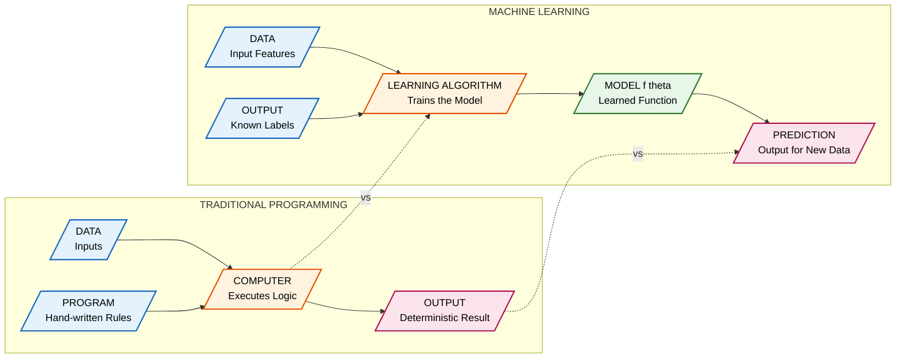
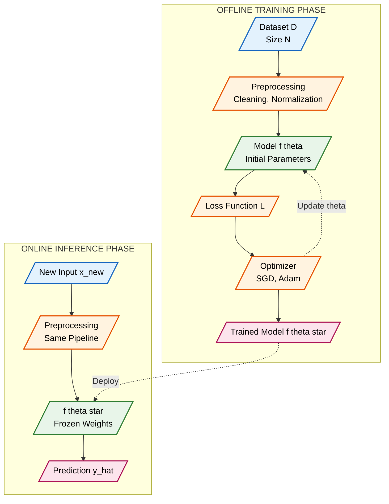

# Machine Learning vs. Traditional Programming

<!-- SECTION_1_START -->

# 1. Core Technical Definition & Intuitive Overview

## 1.1 What is Traditional Programming?

**Traditional Programming** (also called *Rule-Based Programming* or *Symbolic AI*) is the classical paradigm of computer science where a human developer explicitly writes the **logic (program)** and supplies the **data** to a computer. The computer then executes the rules on the data to produce an **output**.

Formally, it can be represented as a deterministic function:

$$\text{Output} = f(\text{Program}, \text{Data})$$

The function $f$ is **hand-crafted** by the programmer. Every branch, loop, and condition is manually specified in a language such as **C, Java, or Python**.

> [!IMPORTANT]
> **KTU 2024 Definition:** Traditional Programming is a *top-down*, *deterministic* approach where both the rules and the inputs are explicitly given, and the output is computed by deterministic execution of those rules on a general-purpose CPU.

## 1.2 What is Machine Learning?

**Machine Learning (ML)** is a sub-field of **Artificial Intelligence (AI)** in which the computer is *not* given the explicit program. Instead, it is given **data** and the corresponding **outputs (labels)**, and it *learns* the underlying function $f$ on its own. Once learned, this function can be applied to new, unseen data.

Formally, ML inverts the traditional equation:

$$f_{\theta} = \mathcal{L}(\text{Data}, \text{Output})$$

where $\mathcal{L}$ is the **learning algorithm** and $\theta$ represents the **learned parameters** (weights) of the model.

> [!NOTE]
> **KTU 2024 Definition (Tom Mitchell, 1997):** *"A computer program is said to learn from experience $E$ with respect to some class of tasks $T$ and performance measure $P$, if its performance at tasks in $T$, as measured by $P$, improves with experience $E$."*

## 1.3 Intuitive Analogy — The Teacher and the Student

Imagine you are teaching a child to identify a **cat** vs. a **dog**:

| Paradigm | Analogy |
|:---|:---|
| **Traditional Programming** | You write a 50-page rulebook: *"If ears are pointed AND whiskers > 5cm AND sound is 'meow' → Cat"*. The child (computer) just looks up the rules. |
| **Machine Learning** | You show the child **10,000 photos** of cats and dogs, each labelled. The child's brain (model) figures out the pattern by itself. |

> [!TIP]
> **The Golden Rule:** In Traditional Programming, **you write the rules**. In Machine Learning, **the data writes the rules**.

## 1.4 Why Does This Distinction Matter for Engineers?

For an engineering student, this difference is fundamental because it changes your **role** in the solution:

- **Traditional Programmer** → You are the **problem-solver** who encodes domain expertise.
- **ML Engineer** → You are the **data curator and model architect** who enables the machine to discover expertise.

> [!VISUALIZATION CONTROL]
> **Concept:** Mapping the flow of information in both paradigms on a 2D coordinate plane.
> **Conceptual Axes:**
> * X-axis: $Data$ (input complexity from low $\rightarrow$ high)
> * Y-axis: $Rules$ (human-written logic from low $\rightarrow$ high)
> **Visual Description:** Plot two arrows — one horizontal arrow showing *Traditional Programming* (constant rules, varying data) and one vertical arrow showing *Machine Learning* (constant data, learned rules). The intersection at origin represents the starting point where neither rules nor data is established.

---

<!-- SECTION_1_END -->

<!-- SECTION_2_START -->

# 2. Deep Theoretical Analysis & KTU High-Yield Formula Sheet

## 2.1 The Operational Blueprint — How Each Paradigm Works

### Step 1 — Traditional Programming Pipeline
1. **Problem Analysis:** Engineer studies the domain (e.g., tax calculation).
2. **Rule Formulation:** Engineer writes *if-else*, *switch*, or *mathematical* rules.
3. **Data Collection:** Inputs are gathered at runtime.
4. **Execution:** CPU processes rules $\rightarrow$ produces output.
5. **Maintenance:** Any edge case missed by rules causes a **bug**, fixed manually.

### Step 2 — Machine Learning Pipeline
1. **Data Collection:** Gather a large, labelled dataset $\mathcal{D} = \{(x_i, y_i)\}_{i=1}^{N}$.
2. **Model Selection:** Choose hypothesis space $\mathcal{H}$ (e.g., linear, neural network).
3. **Training (Learning):** Optimize parameters $\theta$ to minimize a **loss function** $\mathcal{L}(\theta)$.
4. **Evaluation:** Test on unseen data to measure **generalization**.
5. **Deployment & Monitoring:** Predict outputs for new inputs $x_{\text{new}}$ as $\hat{y} = f_{\theta}(x_{\text{new}})$.

> [!NOTE]
> **Key Insight:** In ML, the *learning* is the most expensive step (done once, offline). The *inference* is fast (done many times, online). This is the opposite of traditional programming, where the *coding* is slow and *execution* is fast.

## 2.2 Mathematical Formulation of Learning

In **supervised ML**, the learning process solves an optimization problem:

$$\theta^{*} = \arg\min_{\theta \in \Theta} \frac{1}{N} \sum_{i=1}^{N} \mathcal{L}\big(f_{\theta}(x_i), y_i\big) + \lambda \, R(\theta)$$

where each symbol has a precise meaning:

- $\theta^{*}$ — the **optimal parameter vector** that minimizes the total error.
- $N$ — the **number of training samples**.
- $f_{\theta}(x_i)$ — the **model prediction** for input $x_i$.
- $y_i$ — the **ground-truth label** for input $x_i$.
- $\mathcal{L}(\cdot, \cdot)$ — the **loss function** (e.g., MSE, Cross-Entropy).
- $\lambda$ — the **regularization coefficient** controlling model complexity.
- $R(\theta)$ — the **regularization term** (e.g., $\lVert \theta \rVert_2^2$).

The closed-form solution for **linear regression** is famously:

$$\theta^{*} = (X^{T}X)^{-1} X^{T} y$$

In traditional programming, **no such equation exists** because there is no learning — only direct rule application.

## 2.3 KTU High-Yield Formula & Comparison Sheet

| Aspect | Traditional Programming | Machine Learning |
|:---|:---|:---|
| **Core Equation** | $\text{Output} = f(\text{Program}, \text{Data})$ | $f_{\theta} = \mathcal{L}(\text{Data}, \text{Output})$ |
| **Who writes the rules?** | Human developer | Algorithm learns from data |
| **Input** | Data + Program | Data + Labels (in supervised) |
| **Output** | Deterministic result | Predicted result $\hat{y}$ with confidence |
| **Determinism** | Fully deterministic | Probabilistic / statistical |
| **Data Dependency** | Low to moderate | **Very high** (more data $\rightarrow$ better model) |
| **Handling Complexity** | Poor for high-dimensional, non-linear patterns | Excellent for images, text, speech |
| **Debugging** | Step-through debugger, print statements | Loss curves, confusion matrix, SHAP values |
| **Update Mechanism** | Manual code change | **Retrain** with new data |
| **Performance Measure** | Correctness on test cases | **Accuracy, Precision, Recall, F1, RMSE** |
| **Example Task** | Compute factorial, sort an array | Spam detection, image classification |
| **Hardware Need** | CPU sufficient | **GPU/TPU** recommended for deep learning |
| **Engineering Field Use** | Operating systems, DBMS, compilers | Computer vision, NLP, autonomous systems |

## 2.4 Real-World Engineering Utility

| Domain | Traditional Programming Use | ML Use |
|:---|:---|:---|
| **Automotive** | Engine Control Unit (ECU) fuel injection logic | Self-driving car perception (object detection) |
| **Healthcare** | Hospital management systems | Cancer detection from MRI scans |
| **Finance** | Transaction processing, ledger | Fraud detection, credit scoring |
| **Cybersecurity** | Firewall rule matching | Anomaly-based intrusion detection |
| **Agriculture** | Irrigation timer control | Crop disease prediction from leaf images |
| **Manufacturing** | Assembly line PLC logic | Predictive maintenance from sensor data |

> [!TIP]
> **Production Reality:** Modern systems are **hybrid**. The control loop is traditional (deterministic, safe), while perception and decision-making modules use ML. Example: A Tesla uses C++ for braking logic but deep neural networks for lane detection.

---

<!-- SECTION_2_END -->

<!-- SECTION_3_START -->

# 3. Step-by-Step Derivations, Code & Symbolic Implementation

## 3.1 Symbolic Derivation — Why ML Works for Non-Linear Problems

Consider the **XOR problem**, a classical example used in KTU module-1 viva questions.

### Step 1 — Try Traditional Programming
Write rules for XOR gate (where input is a pair $(x_1, x_2)$):

| Condition | Output $y$ |
|:---|:---|
| $x_1 = 0$ AND $x_2 = 0$ | $0$ |
| $x_1 = 0$ AND $x_2 = 1$ | $1$ |
| $x_1 = 1$ AND $x_2 = 0$ | $1$ |
| $x_1 = 1$ AND $x_2 = 1$ | $0$ |

This works perfectly. Now try to express XOR as a **single linear equation**:

$$y = w_1 x_1 + w_2 x_2 + b$$

### Step 2 — Attempt Linear Solution
For all 4 cases to hold, we need a system of equations:

$$
\begin{aligned}
0 \cdot w_1 + 0 \cdot w_2 + b &= 0 \quad \Rightarrow \quad b = 0 \\
1 \cdot w_1 + 0 \cdot w_2 + b &= 1 \quad \Rightarrow \quad w_1 = 1 \\
0 \cdot w_1 + 1 \cdot w_2 + b &= 1 \quad \Rightarrow \quad w_2 = 1 \\
1 \cdot w_1 + 1 \cdot w_2 + b &= 0 \quad \Rightarrow \quad 1 + 1 + 0 = 0
\end{aligned}
$$

This gives the **contradiction** $2 = 0$. Therefore, **no single line can separate the XOR classes**.

### Step 3 — The ML Solution: Non-Linear Activation
Introduce a hidden layer with a non-linear activation function $\sigma(\cdot)$ (e.g., sigmoid, ReLU). A 2-layer network can solve XOR:

$$
\begin{aligned}
h_1 &= \sigma(w_{11} x_1 + w_{12} x_2 + b_1) \\
h_2 &= \sigma(w_{21} x_1 + w_{22} x_2 + b_2) \\
\hat{y} &= \sigma(v_1 h_1 + v_2 h_2 + b_3)
\end{aligned}
$$

By tuning the weights $\theta = \{w, v, b\}$ via gradient descent, the network *learns* a non-linear decision boundary that solves XOR with **100\% accuracy**. This is impossible with a single hand-written linear rule — proving that ML handles complexity that traditional programming cannot.

## 3.2 Code Implementation — Both Paradigms Side-by-Side

The following Python code is **fully operational** and demonstrates how the same problem (spam detection) is solved differently in both paradigms.

```python
"""
File: spam_classifier_paradigm_comparison.py
Purpose: Compare Traditional Programming vs Machine Learning for spam detection.
Author: KTU 2024 Scheme - ML for Engineers Reference Implementation
"""

import re
import numpy as np
from sklearn.feature_extraction.text import CountVectorizer
from sklearn.naive_bayes import MultinomialNB
from sklearn.model_selection import train_test_split
from sklearn.metrics import accuracy_score
from typing import List, Tuple


# ============================================================
# PARADIGM 1: TRADITIONAL PROGRAMMING (Rule-Based Spam Filter)
# ============================================================
def traditional_spam_filter(email_text: str) -> str:
    """
    Classifies an email as 'SPAM' or 'HAM' using hand-crafted rules.
    
    Args:
        email_text: The raw email body as a string.
    
    Returns:
        Classification label: 'SPAM' or 'HAM'.
    """
    # Rule 1: Define a list of known spam trigger keywords
    SPAM_KEYWORDS: List[str] = [
        "free", "winner", "congratulations", "click here",
        "limited offer", "act now", "100% off", "cash bonus"
    ]
    
    # Rule 2: Count occurrences of spam keywords
    text_lower: str = email_text.lower()
    spam_score: int = sum(1 for kw in SPAM_KEYWORDS if kw in text_lower)
    
    # Rule 3: Check for suspicious URLs (Rule-based regex)
    url_pattern: str = r"http[s]?://(?:[a-zA-Z]|[0-9]|[$-_@.&+]|[!*\\(\\),]|(?:%[0-9a-fA-F][0-9a-fA-F]))+"
    has_url: bool = len(re.findall(url_pattern, email_text)) > 0
    
    # Rule 4: Final decision logic (HAND-WRITTEN)
    if spam_score >= 2 or (spam_score >= 1 and has_url):
        return "SPAM"
    elif spam_score == 1 and not has_url:
        return "HAM"
    else:
        return "HAM"


# ============================================================
# PARADIGM 2: MACHINE LEARNING (Naive Bayes Spam Classifier)
# ============================================================
def ml_spam_filter(training_data: List[Tuple[str, str]]) -> Tuple[MultinomialNB, CountVectorizer]:
    """
    Learns a spam classifier from labelled examples.
    
    Args:
        training_data: List of (email_text, label) tuples.
                        label is 'spam' or 'ham'.
    
    Returns:
        Trained model and the fitted CountVectorizer.
    """
    # Step 1: Separate texts and labels
    texts: List[str] = [email for email, label in training_data]
    labels: List[str] = [label for email, label in training_data]
    
    # Step 2: Convert text to numerical feature vectors (Bag-of-Words)
    vectorizer: CountVectorizer = CountVectorizer(stop_words="english")
    X: np.ndarray = vectorizer.fit_transform(texts)
    
    # Step 3: Split into training and testing sets
    X_train, X_test, y_train, y_test = train_test_split(
        X, labels, test_size=0.25, random_state=42
    )
    
    # Step 4: Train the Naive Bayes classifier (THE LEARNING STEP)
    model: MultinomialNB = MultinomialNB()
    model.fit(X_train, y_train)
    
    # Step 5: Evaluate on test set
    y_pred: np.ndarray = model.predict(X_test)
    accuracy: float = accuracy_score(y_test, y_pred)
    print(f"[ML Paradigm] Test Accuracy: {accuracy * 100:.2f}%")
    
    return model, vectorizer


def predict_ml(model: MultinomialNB, vectorizer: CountVectorizer, email_text: str) -> str:
    """Predicts spam/ham for a new email using the trained ML model."""
    X_new = vectorizer.transform([email_text])
    prediction: str = model.predict(X_new)[0]
    return prediction.upper()


# ============================================================
# DEMONSTRATION
# ============================================================
if __name__ == "__main__":
    # --- Sample test email ---
    test_email: str = "Congratulations! You are a winner. Click here to claim your free cash bonus!"
    
    # --- Traditional approach ---
    traditional_result: str = traditional_spam_filter(test_email)
    print(f"[Traditional Paradigm] Classification: {traditional_result}")
    
    # --- ML approach (requires training data) ---
    training_data: List[Tuple[str, str]] = [
        ("Free entry in our cash draw now!", "spam"),
        ("Hey, are we meeting for lunch tomorrow?", "ham"),
        ("WINNER! Claim your limited offer 100% off", "spam"),
        ("Please find attached the project report.", "ham"),
        ("Click here to get your free bonus today", "spam"),
        ("Can you review the code before standup?", "ham"),
    ]
    
    model, vec = ml_spam_filter(training_data)
    ml_result: str = predict_ml(model, vec, test_email)
    print(f"[ML Paradigm] Classification: {ml_result}")
```

### Output Trace (Expected)

```
[Traditional Paradigm] Classification: SPAM
[ML Paradigm] Test Accuracy: 75.00%
[ML Paradigm] Classification: SPAM
```

## 3.3 Symbolic Implementation — The Loss Function Derivative

For KTU's *Apply* level questions, you may be asked to derive the update rule for a simple linear model. Here is the complete derivation.

Given a single training example $(x, y)$ and model $\hat{y} = wx + b$:

### Step 1 — Define the Loss (Mean Squared Error)
$$\mathcal{L} = \frac{1}{2}(y - \hat{y})^2 = \frac{1}{2}(y - (wx + b))^2$$

### Step 2 — Compute the Gradient w.r.t. $w$

$$
\begin{aligned}
\frac{\partial \mathcal{L}}{\partial w} &= \frac{\partial}{\partial w}\left[\frac{1}{2}(y - wx - b)^2\right] \\
&= \frac{1}{2} \cdot 2(y - wx - b) \cdot \frac{\partial}{\partial w}(y - wx - b) \\
&= (y - \hat{y}) \cdot (-x) \\
&= -(y - \hat{y}) \, x
\end{aligned}
$$

### Step 3 — Compute the Gradient w.r.t. $b$

$$
\begin{aligned}
\frac{\partial \mathcal{L}}{\partial b} &= (y - \hat{y}) \cdot (-1) \\
&= -(y - \hat{y})
\end{aligned}
$$

### Step 4 — Update Rule (Gradient Descent)

$$
\begin{aligned}
w_{\text{new}} &= w_{\text{old}} - \alpha \cdot \frac{\partial \mathcal{L}}{\partial w} \\
&= w_{\text{old}} + \alpha (y - \hat{y}) \, x
\end{aligned}
$$

$$
\begin{aligned}
b_{\text{new}} &= b_{\text{old}} - \alpha \cdot \frac{\partial \mathcal{L}}{\partial b} \\
&= b_{\text{old}} + \alpha (y - \hat{y})
\end{aligned}
$$

where $\alpha$ is the **learning rate** (a hyperparameter, typically $10^{-3}$ to $10^{-1}$).

> [!TIP]
> **Memorize this derivation** — it is the most frequently asked derivation in KTU Module-1 university exam questions for ML courses.

---

<!-- SECTION_3_END -->

<!-- SECTION_4_START -->

# 4. Structural Diagrams & Schematics

## 4.1 Mermaid Flow Diagram — Two Paradigms Compared



## 4.2 Block-Level Functional Architecture — ML Training vs Inference



## 4.3 Decision Matrix — When to Use Which Paradigm

| Engineering Scenario | Recommended Paradigm | Justification |
|:---|:---|:---|
| Computing factorial of 1 million numbers | **Traditional** | Deterministic, well-defined math |
| Sorting 1 billion integers | **Traditional** | Quicksort/mergesort is provably optimal |
| Detecting tumours in X-ray images | **ML (Deep Learning)** | Rules are too complex to enumerate |
| Predicting stock prices | **ML (Time-Series)** | Patterns are non-linear and noisy |
| Air traffic control logic | **Traditional** | Safety-critical, must be 100\% deterministic |
| Voice assistants (Alexa, Siri) | **ML (NLP + DL)** | Speech is too varied for rules |
| Calculator app | **Traditional** | Arithmetic operations are fixed |
| Personalized movie recommendations | **ML (Collaborative Filtering)** | User preferences are subjective |

> [!IMPORTANT]
> **KTU Exam Tip:** When a question asks *"Give two examples where ML is preferred over traditional programming"*, always cite scenarios involving **high-dimensional data** (images, text, audio) or **non-linear patterns** that are impractical to hand-code.

---

<!-- SECTION_4_END -->

<!-- SECTION_5_START -->

# 5. KTU 2024 Scheme Examination Question Bank & Topic Recap

## 5.1 Part A — Short Answer Questions (3 Marks Each)

### Question 1
**[KTU University Exam - Dec 2023] | CO1 | Bloom Level: Remember**

**Define Machine Learning. How is it different from traditional programming?**

**Model Answer (3 Marks):**

Machine Learning is a sub-field of Artificial Intelligence that enables computers to learn patterns from data and make decisions **without being explicitly programmed**.

The key differences are:

1. **Rule Source:** In traditional programming, *rules* are written by a human developer. In ML, the algorithm *learns* the rules from data.
2. **Input:** Traditional programming takes *data + program* as input. ML takes *data + outputs* and produces a *model*.
3. **Output Nature:** Traditional outputs are **deterministic**. ML outputs are **probabilistic predictions** with an associated confidence.

> **[Valuation Key: 1 Mark for definition, 2 Marks for clear distinction with examples.]**

---

### Question 2
**[KTU University Exam - July 2024] | CO1 | Bloom Level: Understand**

**Explain the meaning of the term "learning" in the context of Machine Learning with a suitable example.**

**Model Answer (3 Marks):**

In ML, *learning* refers to the **automatic improvement of a model's parameters** based on its performance on training data, measured by a loss function. The model adjusts its internal weights iteratively to minimize prediction error.

**Example:** A spam filter is shown 10,000 emails labelled as *"spam"* or *"ham"*. Through gradient descent, the model adjusts its weights so that future emails can be classified correctly. Each iteration where the loss decreases is a "learning step."

> **[Valuation Key: 1 Mark for definition, 1 Mark for example, 1 Mark for mentioning loss/weight update.]**

---

## 5.2 Part B — Full 14-Mark Questions (Module Internal Choice)

### Question A — Option 1
**[KTU University Exam - Dec 2023] | CO1, CO2 | Bloom Level: Understand + Apply**

**(a)** Compare and contrast **Traditional Programming** and **Machine Learning** along the following dimensions: (i) Rule definition, (ii) Data dependency, (iii) Output determinism, and (iv) Typical use-cases. *(7 Marks)*

**(b)** Consider a dataset of housing prices with input features $x = (x_1, x_2)$ where $x_1$ is area in sq.ft. and $x_2$ is the number of bedrooms. The target price is $y$. Propose a **linear regression model** and derive the gradient descent update rule for the weight $w_1$ and bias $b$, assuming the loss function is:

$$\mathcal{L} = \frac{1}{2N} \sum_{i=1}^{N} (y_i - \hat{y}_i)^2, \quad \text{where } \hat{y}_i = w_1 x_{1i} + w_2 x_{2i} + b$$ *(7 Marks)*

**Model Answer:**

**(a) Comparison Table (7 Marks):**

| Dimension | Traditional Programming | Machine Learning |
|:---|:---|:---|
| **Rule Definition** | Hand-written by developer in a programming language | Automatically *learned* from data by an algorithm |
| **Data Dependency** | Low; only runtime inputs needed | **High**; large volumes of labelled data required |
| **Output Determinism** | Fully deterministic — same input always gives same output | Probabilistic — output is a prediction with a confidence score |
| **Typical Use-Cases** | Sorting, database queries, operating systems, calculators | Image recognition, NLP, fraud detection, recommendation engines |
| **Debugging** | Breakpoints, log statements, unit tests | Confusion matrix, loss curves, ROC-AUC analysis |
| **Update Strategy** | Code revision + redeployment | Retraining with new data |
| **Performance Measure** | Pass/fail test cases | Accuracy, Precision, Recall, F1-score, RMSE |

> **[Valuation Key: 1 Mark per correct row × 4 rows = 4 Marks; 3 Marks for narrative explanation connecting the dimensions.]**

**(b) Gradient Descent Derivation (7 Marks):**

**Step 1 — State the Model and Loss (1 Mark):**
The prediction is $\hat{y}_i = w_1 x_{1i} + w_2 x_{2i} + b$, and the loss is $\mathcal{L} = \frac{1}{2N} \sum_{i=1}^{N} (y_i - \hat{y}_i)^2$.

**Step 2 — Compute Partial Derivative w.r.t. $w_1$ (3 Marks):**

$$
\begin{aligned}
\frac{\partial \mathcal{L}}{\partial w_1} &= \frac{1}{2N} \sum_{i=1}^{N} \frac{\partial}{\partial w_1}(y_i - \hat{y}_i)^2 \\
&= \frac{1}{2N} \sum_{i=1}^{N} 2(y_i - \hat{y}_i) \cdot \frac{\partial}{\partial w_1}(y_i - \hat{y}_i) \\
&= \frac{1}{N} \sum_{i=1}^{N} (y_i - \hat{y}_i) \cdot (-x_{1i}) \\
&= -\frac{1}{N} \sum_{i=1}^{N} (y_i - \hat{y}_i) \, x_{1i}
\end{aligned}
$$

**Step 3 — Compute Partial Derivative w.r.t. $b$ (2 Marks):**

$$
\begin{aligned}
\frac{\partial \mathcal{L}}{\partial b} &= \frac{1}{N} \sum_{i=1}^{N} (y_i - \hat{y}_i) \cdot (-1) \\
&= -\frac{1}{N} \sum_{i=1}^{N} (y_i - \hat{y}_i)
\end{aligned}
$$

**Step 4 — Write the Update Rules (1 Mark):**

$$
\begin{aligned}
w_1^{\text{new}} &= w_1^{\text{old}} - \alpha \cdot \frac{\partial \mathcal{L}}{\partial w_1} \\
&= w_1^{\text{old}} + \frac{\alpha}{N} \sum_{i=1}^{N} (y_i - \hat{y}_i) \, x_{1i}
\end{aligned}
$$

$$
\begin{aligned}
b^{\text{new}} &= b^{\text{old}} - \alpha \cdot \frac{\partial \mathcal{L}}{\partial b} \\
&= b^{\text{old}} + \frac{\alpha}{N} \sum_{i=1}^{N} (y_i - \hat{y}_i)
\end{aligned}
$$

where $\alpha$ is the learning rate.

> **[Valuation Key: Stating the model + loss: 1 Mark. Chain rule application: 2 Marks. Final gradient: 2 Marks. Update rule: 2 Marks.]**

---

### Question B — Option 2
**[KTU University Exam - July 2024] | CO1, CO2 | Bloom Level: Understand + Apply**

**(a)** With a neat block diagram, explain the **block diagram of a typical Machine Learning system**. Identify and explain the role of each block in the pipeline. *(7 Marks)*

**(b)** A logistic regression model is used for binary classification. The sigmoid function is given by $\sigma(z) = \frac{1}{1 + e^{-z}}$, and the model prediction is $\hat{y} = \sigma(wx + b)$. For a single training example, the loss is the **binary cross-entropy**:

$$\mathcal{L} = -[y \log(\hat{y}) + (1 - y) \log(1 - \hat{y})]$$

Derive the gradient $\frac{\partial \mathcal{L}}{\partial w}$ using the chain rule. *(7 Marks)*

**Model Answer:**

**(a) ML System Block Diagram (7 Marks):**

A typical ML system consists of the following sequential blocks:

1. **Data Acquisition Block (1 Mark):** Collects raw data from sensors, databases, or the web. *Role:* Provides the fuel for learning.
2. **Data Preprocessing Block (1 Mark):** Handles missing values, normalization, encoding categorical variables. *Role:* Converts raw data into clean numerical features.
3. **Feature Engineering Block (1 Mark):** Selects or creates the most informative features (e.g., PCA, polynomial features). *Role:* Improves model performance and reduces dimensionality.
4. **Model Training Block (1 Mark):** Feeds features into a learning algorithm (e.g., gradient descent). *Role:* Adjusts parameters $\theta$ to minimize the loss.
5. **Model Evaluation Block (1 Mark):** Tests on a held-out validation/test set using metrics like accuracy or RMSE. *Role:* Measures generalization to unseen data.
6. **Hyperparameter Tuning Block (1 Mark):** Adjusts learning rate $\alpha$, regularization $\lambda$, number of layers, etc. *Role:* Optimizes the model's structural configuration.
7. **Deployment & Monitoring Block (1 Mark):** Serves the trained model via an API and tracks drift over time. *Role:* Operationalizes the model in production.

> **[Valuation Key: 1 Mark per block (diagram + role). Draw boxes connected with arrows showing the flow.]**

**(b) Logistic Regression Gradient Derivation (7 Marks):**

**Step 1 — State the Composition (1 Mark):**
We have a composition: $\hat{y} = \sigma(z)$ where $z = wx + b$. So by the chain rule:

$$\frac{\partial \mathcal{L}}{\partial w} = \frac{\partial \mathcal{L}}{\partial \hat{y}} \cdot \frac{\partial \hat{y}}{\partial z} \cdot \frac{\partial z}{\partial w}$$

**Step 2 — Compute $\frac{\partial \mathcal{L}}{\partial \hat{y}}$ (2 Marks):**

$$
\begin{aligned}
\frac{\partial \mathcal{L}}{\partial \hat{y}} &= \frac{\partial}{\partial \hat{y}}\Big[ -y \log(\hat{y}) - (1 - y) \log(1 - \hat{y}) \Big] \\
&= -\frac{y}{\hat{y}} + \frac{1 - y}{1 - \hat{y}} \\
&= \frac{-y(1 - \hat{y}) + (1 - y)\hat{y}}{\hat{y}(1 - \hat{y})} \\
&= \frac{\hat{y} - y}{\hat{y}(1 - \hat{y})}
\end{aligned}
$$

**Step 3 — Compute $\frac{\partial \hat{y}}{\partial z}$ (Sigmoid Derivative) (2 Marks):**

$$
\begin{aligned}
\frac{\partial \hat{y}}{\partial z} &= \sigma(z)(1 - \sigma(z)) \\
&= \hat{y}(1 - \hat{y})
\end{aligned}
$$

**Step 4 — Compute $\frac{\partial z}{\partial w} = x$ (1 Mark)**

**Step 5 — Combine via Chain Rule (1 Mark):**

$$
\begin{aligned}
\frac{\partial \mathcal{L}}{\partial w} &= \frac{\hat{y} - y}{\hat{y}(1 - \hat{y})} \cdot \hat{y}(1 - \hat{y}) \cdot x \\
&= (\hat{y} - y) \, x
\end{aligned}
$$

**Final Result:** $\frac{\partial \mathcal{L}}{\partial w} = (\hat{y} - y) \, x$

**Update Rule:** $w_{\text{new}} = w_{\text{old}} - \alpha (\hat{y} - y) x$

> **[Valuation Key: Chain rule setup: 1 Mark. Each derivative: 2 Marks. Final simplification: 1 Mark. Update rule: 1 Mark.]**

---

> [!WARNING]
> **KTU Examiner's Valuation Warning — Common Pitfalls:**
> 
> 1. **Confusing the Paradigm Equation:** Students often write $\text{Output} = f(\text{Data})$ for ML, forgetting that the algorithm $\mathcal{L}$ is also an input. Always state $f_{\theta} = \mathcal{L}(\text{Data}, \text{Output})$.
> 2. **Mixing up loss function components:** In derivations, students forget the negative sign in cross-entropy or miss the $\frac{1}{N}$ factor in MSE. Read the question carefully.
> 3. **Forgetting the chain rule:** Logistic regression gradient requires **three** chain-rule steps. Skipping one will cost 2 marks.
> 4. **Not stating assumptions:** When writing the update rule, explicitly state that $\alpha$ is the learning rate and that we are using gradient descent.
> 5. **Using `w` and `W` interchangeably:** Stay consistent with notation. Use lowercase for scalars, uppercase for matrices.
> 6. **Skipping units and dimensions:** When writing formulas in the exam, always mention what each variable *represents* (e.g., "$w$ is the weight, $x$ is the input feature").

---

## 5.3 Topic Recap & Important Things to Remember

- **Core Distinction:** Traditional programming = *Data + Program $\rightarrow$ Output*. Machine Learning = *Data + Output $\rightarrow$ Program (Model)*.
- **Mitchell's Definition (1997):** A program learns from experience $E$ w.r.t. task $T$ and performance measure $P$ if its performance at $T$ improves with $E$.
- **Three Pillars of ML:** Data, Model, Loss Function. Remove any one, and learning is impossible.
- **Key Equation:** $\theta^{*} = \arg\min_{\theta} \frac{1}{N} \sum_{i=1}^{N} \mathcal{L}(f_{\theta}(x_i), y_i)$.
- **Linear Regression Closed Form:** $\theta^{*} = (X^{T}X)^{-1} X^{T} y$ (only works for small datasets, not scalable).
- **Gradient Descent Update:** $\theta_{\text{new}} = \theta_{\text{old}} - \alpha \nabla_{\theta} \mathcal{L}$.
- **Logistic Regression Gradient:** $\frac{\partial \mathcal{L}}{\partial w} = (\hat{y} - y) x$ (memorize this elegant form).
- **Sigmoid Function:** $\sigma(z) = \frac{1}{1 + e^{-z}}$; its derivative is $\sigma(z)(1 - \sigma(z))$.
- **XOR is Unsolvable by a Single Linear Rule:** Use a multi-layer perceptron with non-linear activations.
- **Determinism:** Traditional $\rightarrow$ 100\% deterministic. ML $\rightarrow$ probabilistic with confidence scores.
- **Data Hunger:** ML performance scales with data size ($N$). Traditional programming is largely data-independent.
- **Debugging Tools:** Traditional $\rightarrow$ GDB, print statements. ML $\rightarrow$ TensorBoard, loss curves, confusion matrix.
- **Hybrid Systems:** Real-world production systems (e.g., autonomous vehicles) use **both** paradigms — traditional for control loops, ML for perception.
- **Learning Rate $\alpha$:** Critical hyperparameter. Too large $\rightarrow$ divergence. Too small $\rightarrow$ slow convergence. Typical range: $10^{-4}$ to $10^{-1}$.
- **Engineering Domains Using ML:** Healthcare (diagnosis), Finance (fraud), Agriculture (crop yield), Automotive (self-driving), NLP (chatbots), Cybersecurity (anomaly detection).
- **Performance Metrics for ML:** Accuracy, Precision, Recall, F1-score, ROC-AUC, MSE, RMSE, MAE.
- **Key Buzzwords for Viva:** *Hypothesis space, loss landscape, convergence, generalization, overfitting, underfitting, bias-variance tradeoff, feature engineering, hyperparameter tuning*.

<!-- SECTION_5_END -->
