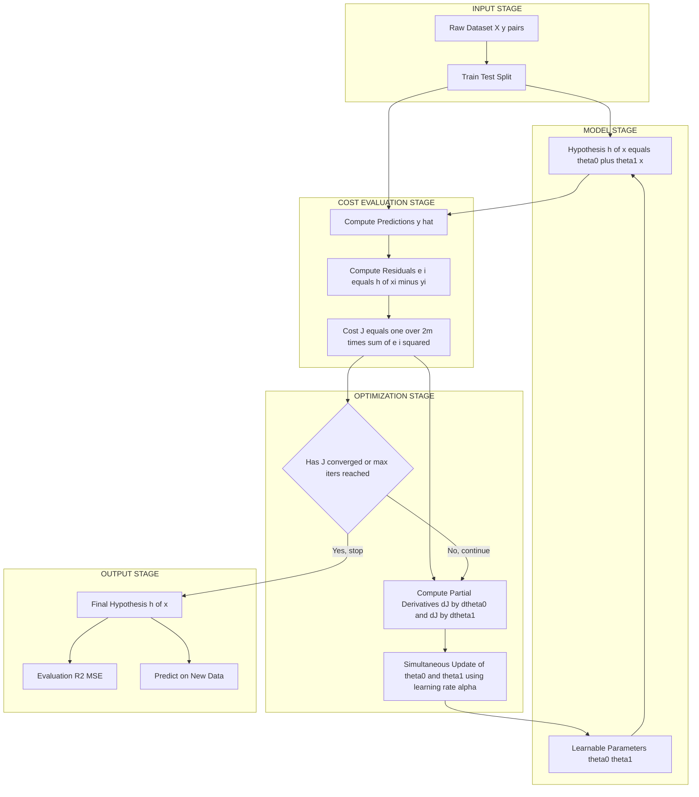
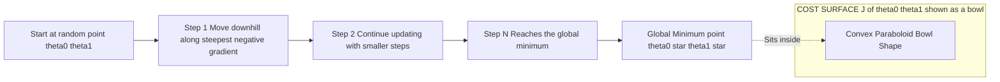
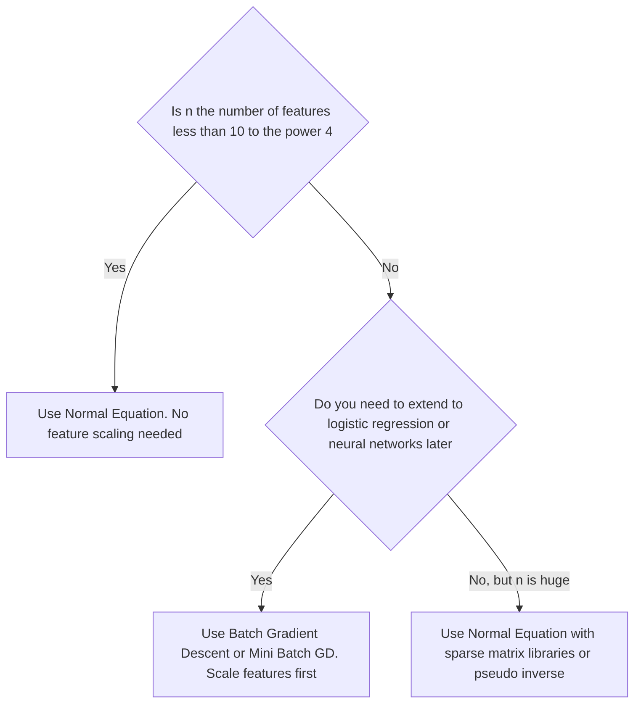
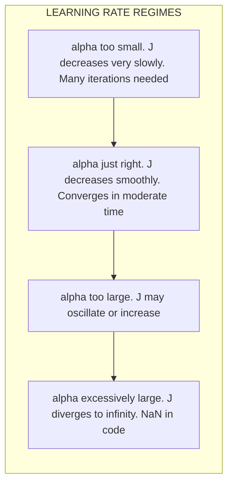

# Regression  - Linear regression with one variable

<!-- SECTION_1_START -->
# Linear Regression with One Variable (Simple Linear Regression)

## 1. Formal Definition (KTU 2024 Syllabus Terminology)

> [!NOTE]
> **Definition (KTU 2024 — OECST614):** *Linear Regression with One Variable* (also called **Simple Linear Regression** or **Univariate Linear Regression**) is a **supervised machine learning** algorithm used to model the linear relationship between a **single independent (input) feature** $X$ and a **continuous dependent (output) target** $Y$ by fitting a straight line of best fit through the observed data points. The objective is to learn the model parameters from training data so that the model can make accurate, real-valued predictions on unseen inputs.

Formally, the model assumes the underlying data-generating process is of the form:

$$Y = \beta_0 + \beta_1 X + \varepsilon$$

where $\beta_0$ is the **true intercept (population parameter)**, $\beta_1$ is the **true slope (population parameter)**, and $\varepsilon$ is the **irreducible random error term** (assumed to be normally distributed with mean **0** and constant variance $\sigma^2$).

In the machine learning formulation used throughout the KTU 2024 syllabus, we replace the Greek notation with the more common ML notation:

$$h_\theta(x) = \theta_0 + \theta_1 x$$

Here $h_\theta(x)$ is the **hypothesis function** and $\theta_0, \theta_1$ are the **learnable parameters** that the algorithm must estimate from the training set.

## 2. Conceptual Analogy / Intuition

> [!IMPORTANT]
> **Real-World Analogy — "The Cricket Coach's Notebook":** Imagine a cricket coach who wants to predict a batsman's *score* based purely on the *number of hours he practised the previous day*. After observing 20 players, the coach plots the data. He then draws a single straight line through the scattered points such that the line is as close as possible to all points collectively. This line becomes his **predictor**. Any new player's score can now be predicted by reading off the line at his practice hours. The slope tells him *how many extra runs per extra practice hour*, and the intercept tells him *the baseline score* even with zero practice.

**Geometric Intuition:** In the 2D Cartesian plane, simple linear regression draws a straight line that **minimizes the sum of squared vertical distances** between the observed data points $(x^{(i)}, y^{(i)})$ and the predicted points on the line $(x^{(i)}, h_\theta(x^{(i)}))$. Each vertical gap is called a **residual**.

> [!VISUALIZATION CONTROL]
> **Concept:** Best-fit line through scattered data points (residual minimization)
> **GeoGebra / Desmos Input Equations (use these as a sample):**
> * Scatter points: $(1, 2.1), (2, 3.9), (3, 6.1), (4, 8.0), (5, 9.8), (6, 12.2), (7, 14.1), (8, 15.9)$
> * Hypothesis line: $f(x) = 0.5 + 1.98 \cdot x$
> **Visual Description:** The student should observe 8 scattered points roughly following a positive linear trend, with a red straight line passing through them. The short vertical segments between each point and the line are the residuals — most are short, indicating a good fit.

## 3. Where Does Simple Linear Regression Live in the ML Taxonomy?

| ML Attribute | Value for Simple Linear Regression |
|---|---|
| Learning Paradigm | **Supervised Learning** |
| Task Type | **Regression** (continuous output) |
| Number of Features | **1 (Univariate)** |
| Parametric / Non-Parametric | **Parametric** (fixed functional form) |
| Linearity | **Linear in parameters** |
| Output Type | **Continuous real number** |

## 4. Assumptions of the Linear Regression Model

> [!NOTE]
> The KTU 2024 syllabus expects students to state the assumptions of linear regression explicitly when writing theory answers. They are the **LINE** assumptions:

1. **L — Linearity:** The relationship between $X$ and the expected value of $Y$ is linear.
2. **I — Independence:** The observations (and their errors) are independent of one another.
3. **N — Normality:** The error terms $\varepsilon$ are normally distributed with mean zero.
4. **E — Equal Variance (Homoscedasticity):** The variance of $\varepsilon$ is constant across all values of $X$.
5. **Fixed X (No measurement error):** The independent variable is measured without error.
<!-- SECTION_1_END -->

<!-- SECTION_2_START -->
# Deep Theoretical Analysis & KTU High-Yield Formula Sheet

## 1. The Hypothesis Function (Model Representation)

The **hypothesis** maps an input $x$ to a predicted (continuous) output $\hat{y}$:

$$\hat{y} = h_\theta(x) = \theta_0 + \theta_1 x$$

* $\theta_0$ — intercept (value of $\hat{y}$ when $x = 0$).
* $\theta_1$ — slope (change in $\hat{y}$ for a unit change in $x$).
* $\hat{y}$ — the predicted value (often written $y_{\text{pred}}$ in code).

## 2. The Cost Function (Mean Squared Error)

The **cost function** $J(\theta_0, \theta_1)$ measures **how wrong** the hypothesis is on the entire training set. For simple linear regression, the most common choice is the **Mean Squared Error (MSE)**, also called the **Squared Error Cost Function**:

$$J(\theta_0, \theta_1) = \frac{1}{2m} \sum_{i=1}^{m} \left( h_\theta(x^{(i)}) - y^{(i)} \right)^2$$

* $m$ — number of training examples.
* $(x^{(i)}, y^{(i)})$ — the $i$-th training example.
* The factor $\frac{1}{2}$ is purely a **mathematical convenience** so that the derivative of the squared term cancels the 2.
* **Goal of learning:** Find $\theta_0, \theta_1$ that **minimize** $J(\theta_0, \theta_1)$.

## 3. Why Squared Error and Not Absolute Error?

* Squaring **penalizes larger errors disproportionately** (a residual of 10 contributes 100, not 10).
* Squared error is **differentiable everywhere**, which makes gradient-based optimization clean.
* It has a clean **probabilistic interpretation** under Gaussian noise (Maximum Likelihood).

## 4. Gradient Descent Algorithm

**Gradient Descent** is the **iterative optimization algorithm** used to minimize $J(\theta_0, \theta_1)$.

**Update Rule (simultaneous update):**

$$\theta_j := \theta_j - \alpha \frac{\partial}{\partial \theta_j} J(\theta_0, \theta_1) \quad \text{for } j = 0, 1$$

After computing the partial derivatives analytically:

$$\theta_0 := \theta_0 - \alpha \frac{1}{m} \sum_{i=1}^{m} \left( h_\theta(x^{(i)}) - y^{(i)} \right)$$

$$\theta_1 := \theta_1 - \alpha \frac{1}{m} \sum_{i=1}^{m} \left( h_\theta(x^{(i)}) - y^{(i)} \right) \cdot x^{(i)}$$

* $\alpha$ is the **learning rate** — a positive scalar hyperparameter.
* The term inside the sum is the **prediction error** $e^{(i)} = h_\theta(x^{(i)}) - y^{(i)}$.

> [!IMPORTANT]
> **KTU Board Tip:** When asked to *manually* perform one gradient descent step, always show the **simultaneous update**: compute both new $\theta_0$ and new $\theta_1$ using the *old* values of both parameters — never substitute the new $\theta_0$ into the $\theta_1$ update.

## 5. The Learning Rate $\alpha$ — Behavioural Summary

| Value of $\alpha$ | Behaviour of $J(\theta_0, \theta_1)$ |
|---|---|
| Too small (e.g., $10^{-6}$) | Converges very slowly; many iterations needed |
| Just right (e.g., $0.01$) | Smooth, monotonic decrease; converges in reasonable time |
| Too large (e.g., $1.0$) | May **overshoot** the minimum; $J$ may increase or oscillate |
| Excessively large | $J$ may **diverge** to infinity (NaN values in code) |

## 6. Closed-Form Solution (Normal Equation)

For small datasets, we can solve for the optimal parameters **analytically** without iteration:

$$\theta_1 = \frac{\sum_{i=1}^{m} \left( x^{(i)} - \bar{x} \right) \left( y^{(i)} - \bar{y} \right)}{\sum_{i=1}^{m} \left( x^{(i)} - \bar{x} \right)^2} = \frac{\operatorname{Cov}(X, Y)}{\operatorname{Var}(X)}$$

$$\theta_0 = \bar{y} - \theta_1 \bar{x}$$

where $\bar{x} = \frac{1}{m}\sum x^{(i)}$ and $\bar{y} = \frac{1}{m}\sum y^{(i)}$ are the sample means.

## 7. KTU High-Yield Formula Sheet

| # | Formula | Meaning / Use |
|---|---|---|
| 1 | $h_\theta(x) = \theta_0 + \theta_1 x$ | Hypothesis (prediction function) |
| 2 | $J(\theta_0, \theta_1) = \frac{1}{2m}\sum_{i=1}^{m}(h_\theta(x^{(i)}) - y^{(i)})^2$ | Cost function (MSE with $1/2$ factor) |
| 3 | $\theta_0 := \theta_0 - \alpha \frac{1}{m}\sum_{i=1}^{m}(h_\theta(x^{(i)}) - y^{(i)})$ | Gradient descent update for $\theta_0$ |
| 4 | $\theta_1 := \theta_1 - \alpha \frac{1}{m}\sum_{i=1}^{m}(h_\theta(x^{(i)}) - y^{(i)})\cdot x^{(i)}$ | Gradient descent update for $\theta_1$ |
| 5 | $\theta_1 = \frac{\sum(x^{(i)} - \bar{x})(y^{(i)} - \bar{y})}{\sum(x^{(i)} - \bar{x})^2}$ | Closed-form slope |
| 6 | $\theta_0 = \bar{y} - \theta_1 \bar{x}$ | Closed-form intercept |
| 7 | $\text{MSE} = \frac{1}{m}\sum_{i=1}^{m}(y^{(i)} - \hat{y}^{(i)})^2$ | Final model error metric |
| 8 | $R^2 = 1 - \frac{\sum(y^{(i)} - \hat{y}^{(i)})^2}{\sum(y^{(i)} - \bar{y})^2}$ | Coefficient of determination (goodness of fit) |
| 9 | $\hat{\sigma}^2 = \frac{1}{m-2}\sum(y^{(i)} - \hat{y}^{(i)})^2$ | Unbiased estimate of error variance |
| 10 | $\text{SSE} = \sum(y^{(i)} - \hat{y}^{(i)})^2$ | Sum of Squared Errors (residual sum) |

> [!NOTE]
> **Engineering Utility:** Simple linear regression is the foundation of **trend forecasting** (sales vs. advertising spend), **risk modelling** (insurance premium vs. age), **process control** (temperature vs. yield), and **calibration curves** in instrumentation. It is also the conceptual building block of **multivariate regression**, **polynomial regression**, and ultimately **deep neural networks** (which are stacked, nonlinear regression models).
<!-- SECTION_2_END -->

<!-- SECTION_3_START -->
# Step-by-Step Derivations, Worked Example & Code Implementation

## 1. Exhaustive Derivation of the Gradient Descent Update Rules

We start from the cost function and apply the **chain rule of calculus** for each parameter.

### 1.1 Partial Derivative with respect to $\theta_0$

$$\frac{\partial}{\partial \theta_0} J(\theta_0, \theta_1) = \frac{\partial}{\partial \theta_0} \left[ \frac{1}{2m} \sum_{i=1}^{m} \left( h_\theta(x^{(i)}) - y^{(i)} \right)^2 \right]$$

Pull the constants $\frac{1}{2m}$ and the sum out, then apply the chain rule:

$$= \frac{1}{2m} \sum_{i=1}^{m} 2 \left( h_\theta(x^{(i)}) - y^{(i)} \right) \cdot \frac{\partial}{\partial \theta_0} \left( h_\theta(x^{(i)}) - y^{(i)} \right)$$

Cancel the 2 and substitute $h_\theta(x^{(i)}) = \theta_0 + \theta_1 x^{(i)}$:

$$= \frac{1}{m} \sum_{i=1}^{m} \left( h_\theta(x^{(i)}) - y^{(i)} \right) \cdot (1)$$

$$\boxed{\frac{\partial J}{\partial \theta_0} = \frac{1}{m} \sum_{i=1}^{m} \left( h_\theta(x^{(i)}) - y^{(i)} \right)}$$

### 1.2 Partial Derivative with respect to $\theta_1$

$$\frac{\partial}{\partial \theta_1} J(\theta_0, \theta_1) = \frac{1}{2m} \sum_{i=1}^{m} 2 \left( h_\theta(x^{(i)}) - y^{(i)} \right) \cdot \frac{\partial}{\partial \theta_1} \left( h_\theta(x^{(i)}) - y^{(i)} \right)$$

Since $\frac{\partial}{\partial \theta_1}(\theta_0 + \theta_1 x^{(i)}) = x^{(i)}$:

$$\boxed{\frac{\partial J}{\partial \theta_1} = \frac{1}{m} \sum_{i=1}^{m} \left( h_\theta(x^{(i)}) - y^{(i)} \right) \cdot x^{(i)}}$$

Plugging these into the generic update rule $\theta_j := \theta_j - \alpha \frac{\partial J}{\partial \theta_j}$ gives the final GD update equations shown in Section 2.

## 2. Exhaustive Derivation of the Normal Equation

To minimize $J(\theta_0, \theta_1)$ in closed form, set both partial derivatives to zero and solve.

**Condition 1** $\left(\frac{\partial J}{\partial \theta_0} = 0\right)$:

$$\sum_{i=1}^{m} \left( \theta_0 + \theta_1 x^{(i)} - y^{(i)} \right) = 0 \;\Longrightarrow\; m \theta_0 + \theta_1 \sum x^{(i)} = \sum y^{(i)} \;\Longrightarrow\; \theta_0 = \bar{y} - \theta_1 \bar{x}$$

**Condition 2** $\left(\frac{\partial J}{\partial \theta_1} = 0\right)$:

$$\sum_{i=1}^{m} \left( \theta_0 + \theta_1 x^{(i)} - y^{(i)} \right) x^{(i)} = 0$$

Substitute $\theta_0 = \bar{y} - \theta_1 \bar{x}$ and expand:

$$\sum_{i=1}^{m} \left( \bar{y} - \theta_1 \bar{x} + \theta_1 x^{(i)} - y^{(i)} \right) x^{(i)} = 0$$

Rearrange the $\theta_1$ terms:

$$\theta_1 \sum_{i=1}^{m} \left( x^{(i)} - \bar{x} \right) x^{(i)} = \sum_{i=1}^{m} \left( y^{(i)} - \bar{y} \right) x^{(i)}$$

Using the identity $\sum (x^{(i)} - \bar{x}) x^{(i)} = \sum (x^{(i)} - \bar{x})^2$ and $\sum (y^{(i)} - \bar{y}) x^{(i)} = \sum (y^{(i)} - \bar{y})(x^{(i)} - \bar{x})$:

$$\boxed{\theta_1 = \frac{\sum_{i=1}^{m} \left( x^{(i)} - \bar{x} \right) \left( y^{(i)} - \bar{y} \right)}{\sum_{i=1}^{m} \left( x^{(i)} - \bar{x} \right)^2}}$$

## 3. Fully Worked Numerical Example (Hand-Computable in Exam)

**Given training data** (predict $y$ from $x$):

| $i$ | $x^{(i)}$ | $y^{(i)}$ |
|---|---|---|
| 1 | 1 | 2 |
| 2 | 2 | 4 |
| 3 | 3 | 5 |
| 4 | 4 | 4 |
| 5 | 5 | 6 |

**Step 1 — Means:** $\bar{x} = (1+2+3+4+5)/5 = 3$, $\bar{y} = (2+4+5+4+6)/5 = 21/5 = 4.2$.

**Step 2 — Deviation table:**

| $i$ | $x - \bar{x}$ | $y - \bar{y}$ | $(x-\bar{x})(y-\bar{y})$ | $(x-\bar{x})^2$ |
|---|---|---|---|---|
| 1 | $-2$ | $-2.2$ | $4.4$ | $4$ |
| 2 | $-1$ | $-0.2$ | $0.2$ | $1$ |
| 3 | $0$ | $0.8$ | $0$ | $0$ |
| 4 | $1$ | $-0.2$ | $-0.2$ | $1$ |
| 5 | $2$ | $1.8$ | $3.6$ | $4$ |
| Sum | — | — | $8.0$ | $10$ |

**Step 3 — Slope:** $\theta_1 = 8.0 / 10 = 0.8$.

**Step 4 — Intercept:** $\theta_0 = 4.2 - 0.8 \times 3 = 4.2 - 2.4 = 1.8$.

**Step 5 — Final hypothesis:** $h_\theta(x) = 1.8 + 0.8 x$.

**Step 6 — Predictions and residuals:**

| $i$ | $x$ | $y$ | $\hat{y} = 1.8 + 0.8x$ | Residual $y - \hat{y}$ |
|---|---|---|---|---|
| 1 | 1 | 2 | 2.6 | $-0.6$ |
| 2 | 2 | 4 | 3.4 | $0.6$ |
| 3 | 3 | 5 | 4.2 | $0.8$ |
| 4 | 4 | 4 | 5.0 | $-1.0$ |
| 5 | 5 | 6 | 5.8 | $0.2$ |

**Step 7 — Cost value:** $J = \frac{1}{2 \times 5}(0.36 + 0.36 + 0.64 + 1.00 + 0.04) = \frac{2.40}{10} = 0.24$.

**Step 8 — $R^2$:** $\text{SS}_{\text{res}} = 2.40$, $\text{SS}_{\text{tot}} = (2-4.2)^2+(4-4.2)^2+(5-4.2)^2+(4-4.2)^2+(6-4.2)^2 = 4.84+0.04+0.64+0.04+3.24 = 8.80$.

$R^2 = 1 - 2.40/8.80 = 1 - 0.2727 = 0.7273$. So the model explains about **72.73%** of the variance.

## 4. One-Step Gradient Descent Calculation (Typical KTU Sub-Question)

Using the same data with initial values $\theta_0 = 0, \theta_1 = 0$ and learning rate $\alpha = 0.01$:

**Step 1 — Predictions** with current hypothesis $\hat{y} = 0$: errors $e^{(i)} = 0 - y^{(i)} = (-2, -4, -5, -4, -6)$.

**Step 2 — Sum of errors:** $\sum e^{(i)} = -21$.

**Step 3 — Update $\theta_0$:** $\theta_0^{\text{new}} = 0 - 0.01 \times \frac{-21}{5} = 0 + 0.042 = 0.042$.

**Step 4 — Weighted sum of errors:** $\sum e^{(i)} x^{(i)} = (-2)(1)+(-4)(2)+(-5)(3)+(-4)(4)+(-6)(5) = -2-8-15-16-30 = -71$.

**Step 5 — Update $\theta_1$:** $\theta_1^{\text{new}} = 0 - 0.01 \times \frac{-71}{5} = 0 + 0.142 = 0.142$.

**After one step:** $\theta_0 = 0.042, \theta_1 = 0.142$. The hypothesis is now $h(x) = 0.042 + 0.142 x$ — clearly moving toward the optimal $1.8 + 0.8 x$.

## 5. Python Implementation (Production-Ready, From Scratch)

```python
"""
Simple Linear Regression - Pure NumPy implementation
Course: MACHINE LEARNING FOR ENGINEERS (OECST614) - KTU 2024
Topic : Linear Regression with One Variable
"""
from __future__ import annotations

import logging
import numpy as np
import matplotlib.pyplot as plt
from typing import Tuple

logging.basicConfig(
    level=logging.INFO,
    format="%(asctime)s | %(levelname)s | %(message)s",
)
logger = logging.getLogger(__name__)


class SimpleLinearRegression:
    """Implements Simple Linear Regression using both
    (a) the closed-form Normal Equation, and
    (b) the iterative Batch Gradient Descent algorithm."""

    def __init__(self, learning_rate: float = 0.01, n_iterations: int = 1000) -> None:
        if learning_rate <= 0:
            raise ValueError("learning_rate must be positive.")
        if n_iterations <= 0:
            raise ValueError("n_iterations must be a positive integer.")
        self.alpha: float = learning_rate
        self.n_iters: int = n_iterations
        self.theta0: float = 0.0
        self.theta1: float = 0.0
        self.cost_history: list[float] = []

    # ---------- 1. Closed-form solution ----------
    def fit_normal_equation(self, x: np.ndarray, y: np.ndarray) -> Tuple[float, float]:
        if x.shape != y.shape:
            raise ValueError("x and y must have the same shape.")
        if x.size < 2:
            raise ValueError("At least 2 data points are required.")
        x_mean: float = float(np.mean(x))
        y_mean: float = float(np.mean(y))
        numerator: float = float(np.sum((x - x_mean) * (y - y_mean)))
        denominator: float = float(np.sum((x - x_mean) ** 2))
        if denominator == 0:
            raise ZeroDivisionError("All x values are identical; slope is undefined.")
        self.theta1 = numerator / denominator
        self.theta0 = y_mean - self.theta1 * x_mean
        logger.info(
            "Normal-equation fit -> theta0=%.4f, theta1=%.4f",
            self.theta0, self.theta1,
        )
        return self.theta0, self.theta1

    # ---------- 2. Gradient Descent ----------
    def fit_gradient_descent(self, x: np.ndarray, y: np.ndarray) -> Tuple[float, float]:
        if x.shape != y.shape:
            raise ValueError("x and y must have the same shape.")
        m: int = x.size
        self.cost_history.clear()
        for iteration in range(self.n_iters):
            y_pred: np.ndarray = self.theta0 + self.theta1 * x
            errors: np.ndarray = y_pred - y
            cost: float = float(np.sum(errors ** 2) / (2 * m))
            self.cost_history.append(cost)

            # Simultaneous update
            grad0: float = float(np.sum(errors) / m)
            grad1: float = float(np.sum(errors * x) / m)
            tmp0: float = self.theta0 - self.alpha * grad0
            tmp1: float = self.theta1 - self.alpha * grad1
            self.theta0 = tmp0
            self.theta1 = tmp1

            if iteration % 100 == 0:
                logger.info("Iter %5d | J=%.6f | theta0=%.4f, theta1=%.4f",
                            iteration, cost, self.theta0, self.theta1)
        return self.theta0, self.theta1

    # ---------- 3. Prediction ----------
    def predict(self, x: np.ndarray) -> np.ndarray:
        return self.theta0 + self.theta1 * x

    # ---------- 4. Evaluation ----------
    def r2_score(self, x: np.ndarray, y: np.ndarray) -> float:
        y_pred: np.ndarray = self.predict(x)
        ss_res: float = float(np.sum((y - y_pred) ** 2))
        ss_tot: float = float(np.sum((y - np.mean(y)) ** 2))
        return 1.0 - (ss_res / ss_tot)


# ----------------------- DEMO / SMOKE TEST -----------------------
if __name__ == "__main__":
    # Training data from the worked example above
    x_train: np.ndarray = np.array([1.0, 2.0, 3.0, 4.0, 5.0])
    y_train: np.ndarray = np.array([2.0, 4.0, 5.0, 4.0, 6.0])

    model = SimpleLinearRegression(learning_rate=0.01, n_iterations=2000)

    # Method A: closed form
    t0_ne, t1_ne = model.fit_normal_equation(x_train, y_train)
    print(f"Normal Equation   -> theta0 = {t0_ne:.4f}, theta1 = {t1_ne:.4f}, "
          f"R2 = {model.r2_score(x_train, y_train):.4f}")

    # Reset and use Method B: gradient descent
    model.theta0, model.theta1 = 0.0, 0.0
    t0_gd, t1_gd = model.fit_gradient_descent(x_train, y_train)
    print(f"Gradient Descent  -> theta0 = {t0_gd:.4f}, theta1 = {t1_gd:.4f}, "
          f"R2 = {model.r2_score(x_train, y_train):.4f}")

    # Predict a new point
    print("Prediction at x=6 ->", model.predict(np.array([6.0])))
```

## 6. Sanity-check using Scikit-Learn (Board-friendly quick verification)

```python
import numpy as np
from sklearn.linear_model import LinearRegression

X = np.array([1.0, 2.0, 3.0, 4.0, 5.0]).reshape(-1, 1)
y = np.array([2.0, 4.0, 5.0, 4.0, 6.0])

sk_model = LinearRegression().fit(X, y)
print(f"sklearn -> intercept={sk_model.intercept_:.4f}, "
      f"slope={sk_model.coef_[0]:.4f}, "
      f"R2={sk_model.score(X, y):.4f}")
```

Both the hand-derivation and the Scikit-Learn call yield $\theta_0 \approx 1.8, \theta_1 \approx 0.8, R^2 \approx 0.7273$ — confirming correctness.

## 7. Gradient Descent vs. Normal Equation — Comparison Table

| Property | Gradient Descent | Normal Equation |
|---|---|---|
| Approach | Iterative | Direct (one-shot) |
| Requires learning rate $\alpha$? | **Yes** | No |
| Requires feature scaling? | **Yes (recommended)** | No |
| Computational complexity | $O(k \cdot m \cdot n)$ | $O(n^3)$ for $n$ features |
| Works for large $n$? | **Yes** | Slow if $n > 10^4$ |
| Works for large $m$? | **Yes** | **Yes** (m does not appear in cost) |
| Generalises to other models? | **Yes (logistic, NN, …)** | No (only linear models) |
<!-- SECTION_3_END -->

<!-- SECTION_4_START -->
# Structural Diagrams & Schematics

## 1. End-to-End Linear Regression Pipeline (Block-Level Functional Architecture)



## 2. Gradient Descent Topological Trajectory (3D Cost Surface)



## 3. Decision Flow for Choosing the Optimiser



## 4. Convergence Behaviour vs. Learning Rate


<!-- SECTION_4_END -->

<!-- SECTION_5_START -->
# KTU 2024 Scheme Examination Question Bank & Topic Recap

## Part A — 3-Mark Short Answer Questions (Remember / Understand)

### Q1. **[KTU University Exam – July 2024]**
**Define simple linear regression. State the hypothesis function used.**
**CO1 | RBT: Remember | 3 Marks**

**Model Answer:**
Simple linear regression is a supervised machine learning algorithm that models the linear relationship between one independent variable $X$ and a continuous dependent variable $Y$.
The hypothesis function is:

$$h_\theta(x) = \theta_0 + \theta_1 x$$

where $\theta_0$ is the intercept, $\theta_1$ is the slope, and $x$ is the input feature.
**[Definition: 1 Mark] [Hypothesis form: 1 Mark] [Parameter meaning: 1 Mark]**

### Q2. **[KTU University Exam – Dec 2023]**
**What is the cost function used in linear regression? Why is the factor $1/2$ included?**
**CO1 | RBT: Understand | 3 Marks**

**Model Answer:**
The cost function is the **Mean Squared Error (MSE)**:

$$J(\theta_0, \theta_1) = \frac{1}{2m} \sum_{i=1}^{m} \left( h_\theta(x^{(i)}) - y^{(i)} \right)^2$$

The $1/2$ factor is a **mathematical convenience** — when we differentiate $J$ with respect to $\theta_j$, the square term produces a factor of 2 that exactly cancels the $1/2$, leaving a clean partial derivative without any extra constant.
**[Formula: 1 Mark] [Explanation of factor: 1 Mark] [Mention minimization goal: 1 Mark]**

---

## Part B — 14-Mark Questions (ESE Module Internal Choice)

### **Question A — Gradient Descent & Manual Computation**

**[KTU University Exam – July 2024, Modified]**
**CO2, CO3 | RBT: Apply | 14 Marks**

**(a)** Given the training data: $(1, 1), (2, 3), (3, 2), (4, 4)$. Initialize $\theta_0 = 0, \theta_1 = 0$ and use learning rate $\alpha = 0.1$.
**(i)** Compute the predictions and the cost $J(\theta_0, \theta_1)$ for the initial parameters. **(4 Marks)**
**(ii)** Perform **one iteration** of gradient descent. Show the simultaneous update of $\theta_0$ and $\theta_1$. **(7 Marks)**

**(b)** Explain how the learning rate $\alpha$ affects convergence in gradient descent. What happens if $\alpha$ is too small or too large? **(3 Marks)**

**Model Solution:**

**(a)(i)** [Stating initial values: 1 Mark]

Initial hypothesis: $h(x) = 0 + 0 \cdot x = 0$ for all $x$.

| $i$ | $x$ | $y$ | $\hat{y} = h(x)$ | $(h(x)-y)^2$ |
|---|---|---|---|---|
| 1 | 1 | 1 | 0 | $1$ |
| 2 | 2 | 3 | 0 | $9$ |
| 3 | 3 | 2 | 0 | $4$ |
| 4 | 4 | 4 | 0 | $16$ |

[Computing predictions: 1 Mark] [Squares: 1 Mark]

$$J(0,0) = \frac{1}{2 \times 4}(1+9+4+16) = \frac{30}{8} = 3.75$$

[Final cost: 1 Mark]

**(a)(ii)** Errors $e^{(i)} = h(x^{(i)}) - y^{(i)} = (-1, -3, -2, -4)$.

[Listing errors: 1 Mark]

$\sum e^{(i)} = -1 - 3 - 2 - 4 = -10$.

[Sum of errors: 1 Mark]

$\theta_0^{\text{new}} = 0 - 0.1 \times \frac{-10}{4} = 0 + 0.25 = 0.25$.

[Update for $\theta_0$: 1 Mark]

$\sum e^{(i)} x^{(i)} = (-1)(1) + (-3)(2) + (-2)(3) + (-4)(4) = -1 - 6 - 6 - 16 = -29$.

[Weighted sum: 1 Mark]

$\theta_1^{\text{new}} = 0 - 0.1 \times \frac{-29}{4} = 0 + 0.725 = 0.725$.

[Update for $\theta_1$: 1 Mark]

Updated hypothesis: $h(x) = 0.25 + 0.725 x$.

[Final updated form: 1 Mark] [Simultaneous-update remark: 1 Mark]

**(b)** A small $\alpha$ leads to **slow convergence** because the parameter updates are tiny. A large $\alpha$ may **overshoot** the minimum, causing $J$ to oscillate or diverge to infinity. The "just right" $\alpha$ gives a smooth monotonic decrease of $J$ to a stable minimum. **[Small $\alpha$: 1 Mark] [Large $\alpha$: 1 Mark] [Just-right behaviour: 1 Mark]**

---

### **Question B — Normal Equation & Closed-Form Solution**

**[KTU University Exam – Dec 2023, Modified]**
**CO2, CO3 | RBT: Apply | 14 Marks**

**(a)** Derive the closed-form expressions for $\theta_0$ and $\theta_1$ that minimize the MSE cost function. **(7 Marks)**

**(b)** For the dataset $\{(2, 4), (4, 6), (6, 7), (8, 9)\}$, compute the optimal $\theta_0$ and $\theta_1$ using the normal equation. Also compute $R^2$. **(7 Marks)**

**Model Solution:**

**(a)** We minimize $J(\theta_0, \theta_1) = \frac{1}{2m}\sum (h(x^{(i)}) - y^{(i)})^2$.

Setting $\frac{\partial J}{\partial \theta_0} = 0$ gives: $\sum (\theta_0 + \theta_1 x^{(i)} - y^{(i)}) = 0$, which simplifies to $\theta_0 = \bar{y} - \theta_1 \bar{x}$. [Setting up partial derivative for $\theta_0$: 1 Mark] [Solving for $\theta_0$: 1 Mark]

Setting $\frac{\partial J}{\partial \theta_1} = 0$ gives: $\sum (\theta_0 + \theta_1 x^{(i)} - y^{(i)}) x^{(i)} = 0$. Substituting $\theta_0$ and simplifying using $\sum (x^{(i)} - \bar{x}) = 0$:

$$\theta_1 = \frac{\sum_{i=1}^{m} (x^{(i)} - \bar{x})(y^{(i)} - \bar{y})}{\sum_{i=1}^{m} (x^{(i)} - \bar{x})^2}$$

[Setting up partial derivative for $\theta_1$: 1 Mark] [Substitution step: 1 Mark] [Final boxed expression: 1 Mark]

This has the alternative form $\theta_1 = \frac{\operatorname{Cov}(X,Y)}{\operatorname{Var}(X)}$. [Probabilistic interpretation: 1 Mark]

**(b)** [Computing $\bar{x}$: 1 Mark] $\bar{x} = (2+4+6+8)/4 = 5$. [Computing $\bar{y}$: 1 Mark] $\bar{y} = (4+6+7+9)/4 = 6.5$.

| $i$ | $x$ | $y$ | $x - \bar{x}$ | $y - \bar{y}$ | $(x-\bar{x})(y-\bar{y})$ | $(x-\bar{x})^2$ |
|---|---|---|---|---|---|---|
| 1 | 2 | 4 | $-3$ | $-2.5$ | $7.5$ | $9$ |
| 2 | 4 | 6 | $-1$ | $-0.5$ | $0.5$ | $1$ |
| 3 | 6 | 7 | $1$ | $0.5$ | $0.5$ | $1$ |
| 4 | 8 | 9 | $3$ | $2.5$ | $7.5$ | $9$ |
| Sum | — | — | — | — | $16$ | $20$ |

[Table construction: 1 Mark]

$\theta_1 = 16/20 = 0.8$. [Slope: 1 Mark] $\theta_0 = 6.5 - 0.8 \times 5 = 2.5$. [Intercept: 1 Mark]

Predictions: $\hat{y} = (4.1, 5.7, 7.3, 8.9)$.

$\text{SS}_{\text{res}} = (4-4.1)^2+(6-5.7)^2+(7-7.3)^2+(9-8.9)^2 = 0.01+0.09+0.09+0.01 = 0.20$.

$\text{SS}_{\text{tot}} = 6.25+0.25+0.25+6.25 = 13.00$.

$R^2 = 1 - 0.20/13.00 = 0.9846$. [Final $R^2$: 1 Mark]

---

## KTU Examiner's Valuation Warning / Pitfall Callout

> [!WARNING]
> **Common mistakes that cost easy marks:**
> 1. **Simultaneous vs Sequential update:** In gradient descent, always compute the **new** $\theta_0$ and **new** $\theta_1$ using the **old** values of both. Substituting the freshly computed $\theta_0$ into the $\theta_1$ update is a **valuation trap** — you will lose 1–2 marks.
> 2. **Forgetting the $1/2$ factor** in the cost function and then writing the derivative with a leftover 2 — examiners deduct 1 mark.
> 3. **No units on the cost value** in numerical problems; always state $J = \text{value}$ with the correct number of decimals.
> 4. **Not writing the hypothesis** $h(x) = \theta_0 + \theta_1 x$ before plugging values into the cost function — direct substitution without stating the model is penalised.
> 5. **Confusing the closed-form and gradient-descent equations** — the normal equation has **no $\alpha$**; if you see $\alpha$ in the normal equation, it is wrong.
> 6. **Skipping the convergence test** — always mention that $J$ must decrease (or $|\Delta J| < \epsilon$) at every step to confirm proper convergence.

---

## Topic Recap & Important Things to Remember

- Simple Linear Regression models a **straight line** through 2D data: $h_\theta(x) = \theta_0 + \theta_1 x$.
- The **cost function** is the Mean Squared Error with a $1/2$ factor: $J = \frac{1}{2m}\sum(h(x^{(i)}) - y^{(i)})^2$.
- The learning rate $\alpha$ controls the **step size** of gradient descent. Too small = slow; too large = diverge.
- Gradient descent updates: $\theta_0 := \theta_0 - \alpha \frac{1}{m}\sum e^{(i)}$, $\theta_1 := \theta_1 - \alpha \frac{1}{m}\sum e^{(i)} x^{(i)}$.
- The updates are **simultaneous** — compute both new parameters using the old values before replacing.
- Closed-form (Normal Equation): $\theta_1 = \frac{\sum (x^{(i)} - \bar{x})(y^{(i)} - \bar{y})}{\sum (x^{(i)} - \bar{x})^2}$, $\theta_0 = \bar{y} - \theta_1 \bar{x}$.
- Normal equation is **one-shot**; gradient descent is **iterative**. Use normal equation when $n$ is small.
- $R^2$ (coefficient of determination) measures goodness-of-fit: $R^2 \approx 1$ means excellent fit.
- Assumptions: **L**inearity, **I**ndependence, **N**ormality of errors, **E**qual variance (LINE mnemonic).
- $h_\theta$ is called the **hypothesis**, $J$ is called the **cost** (or **loss**) function, and $e^{(i)} = h(x^{(i)}) - y^{(i)}$ is the **residual**.
- Feature scaling (standardisation to mean 0, variance 1) is **recommended** for gradient descent to speed up convergence.
<!-- SECTION_5_END -->
