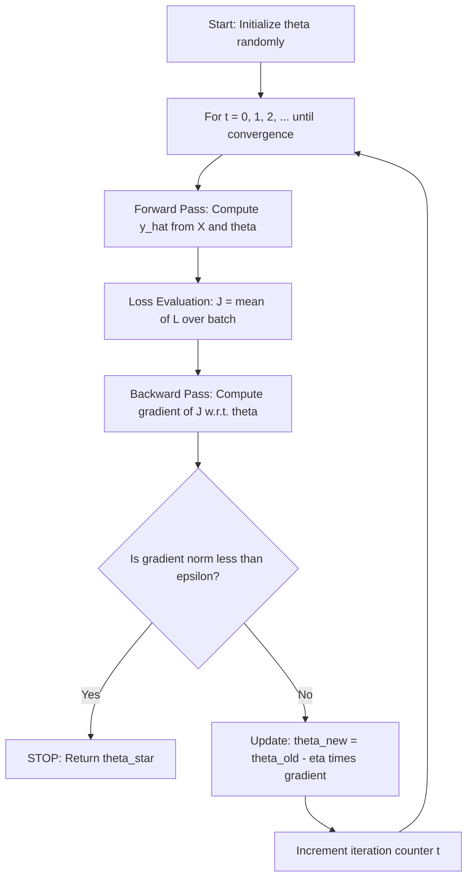
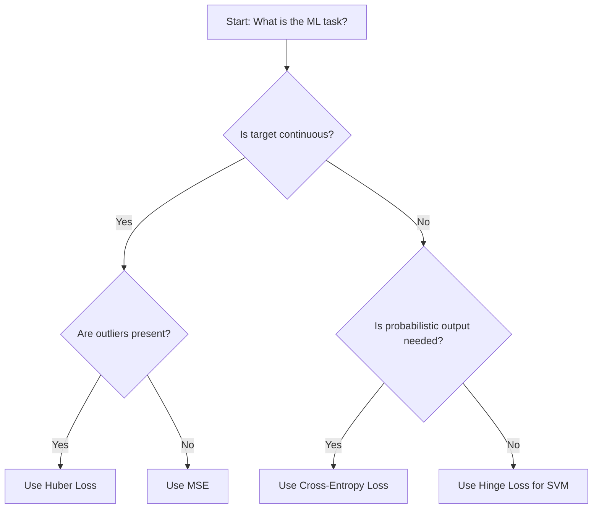
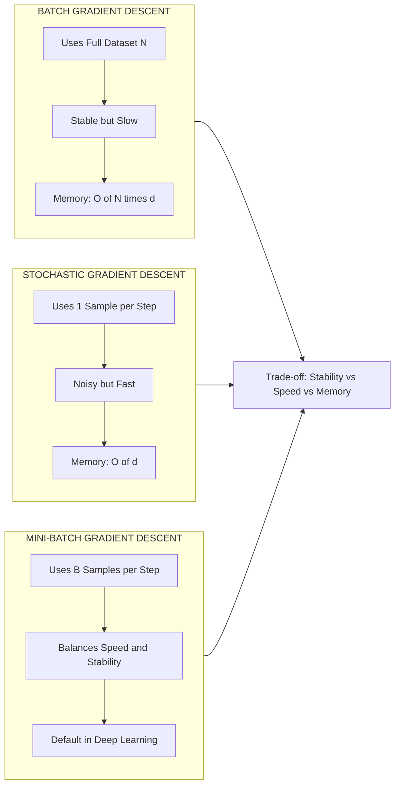
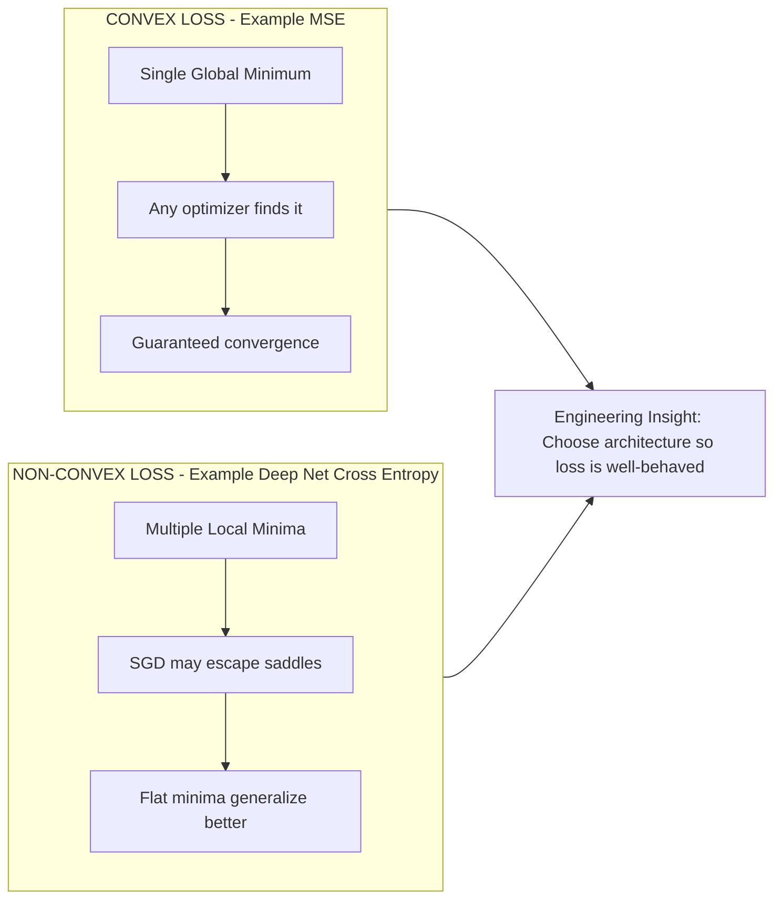
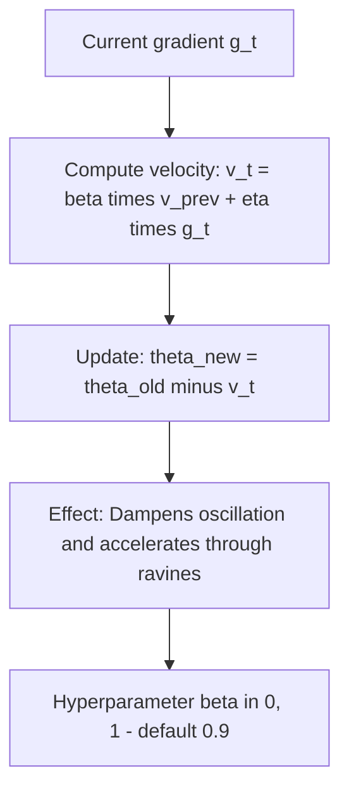

# Role of loss functions and optimization

<!-- SECTION_1_START -->
# Role of Loss Functions and Optimization in Machine Learning

> [!NOTE]
> **KTU 2024 Scheme — Module 1, Topic: Role of Loss Functions and Optimization**
> This topic is the mathematical backbone of *every* learning algorithm. Without a loss function, a model has no notion of "wrong," and without an optimizer, it has no way of becoming "right."

---

## 1.1 Formal Definition (KTU Syllabus Terminology)

A **Loss Function** (also called a *cost function* or *objective function*) is a mathematical mapping $L: \mathcal{Y} \times \mathcal{Y} \rightarrow \mathbb{R}_{\geq 0}$ that quantifies the discrepancy between the **predicted output** $\hat{y}$ produced by a model $f_\theta(x)$ and the **true label** $y$ for a given input $x$. Formally, for a dataset $\mathcal{D} = \{(x_i, y_i)\}_{i=1}^{N}$ and a model parameterized by $\theta \in \mathbb{R}^d$, the **empirical risk** is defined as:

$$J(\theta) = \frac{1}{N} \sum_{i=1}^{N} L\big(f_\theta(x_i),\, y_i\big)$$

The **Optimization** procedure is the iterative search for the parameter vector $\theta^*$ that minimizes this empirical risk:

$$\theta^* = \arg\min_{\theta \in \mathbb{R}^d} J(\theta)$$

In the KTU 2024 scheme, the term *optimization* specifically refers to first-order, gradient-based methods (Gradient Descent and its variants) used to traverse the loss landscape.

---

## 1.2 Conceptual Analogy — The "Blindfolded Archer"

Imagine you are a blindfolded archer standing on a foggy hill. Your **bow's aim direction** is $\theta$ (the parameters). The **height of the ground beneath your feet** is the loss $J(\theta)$. You cannot see the bottom of the hill, but you can *feel the slope* under your shoes. You take small steps **downhill** — that is exactly what gradient descent does. The **steeper the slope**, the larger the step (in magnitude). Your **step size** is the *learning rate* $\eta$.

> [!IMPORTANT]
> **Key Insight:** The loss function tells the model *"how wrong it is."* The optimizer tells the model *"how to become less wrong."* Together, they convert learning into a well-defined mathematical search problem.

---

## 1.3 Why This Matters in Engineering

In production ML systems (recommendation engines, medical imaging, autonomous vehicles), the choice of loss function directly controls the *behaviour* of the trained model:
- A **regression** problem (predicting house prices) uses **MSE**.
- A **classification** problem (spam detection) uses **Cross-Entropy**.
- A **support vector machine** uses the **Hinge loss** to enforce a margin.

The optimization algorithm (SGD, Adam, L-BFGS) determines *training time, stability*, and *generalization performance*.

> [!VISUALIZATION CONTROL]
> **Concept:** 1-D Loss Landscape for a Linear Regression Model
> **GeoGebra / Desmos Input Equations:**
> * `f(x) = (x - 3)^2 + 1`   ← True minimum at $x = 3$, $J = 1$
> * `g(x) = 2*(x - 3)`        ← Gradient (slope) at any point
>
> **Visual Description:** A parabola opening upward, with its vertex (global minimum) at the point $(3, 1)$. The tangent line slope $g(x)$ is zero only at the minimum — gradient descent halts precisely when this slope equals zero.

---

## 1.4 Standard Performance Metrics Recap (Recall Layer)

| Metric | Symbol | Domain |
| :--- | :---: | :--- |
| Learning Rate | $\eta$ | Typically $10^{-4}$ to $10^{-1}$ |
| Number of Epochs | $E$ | $1$ to $10^{3}$ |
| Batch Size | $B$ | $1$ (SGD) to $N$ (Full Batch) |
| Convergence Tolerance | $\epsilon$ | $\mathbf{10^{-6}}$ (board exam default) |

These constants appear repeatedly in KTU numerical questions; commit them to memory.
<!-- SECTION_1_END -->

<!-- SECTION_2_START -->
# Deep Theoretical Analysis & KTU High-Yield Formula Sheet

## 2.1 The Learning Pipeline — Structured Logic Steps

A supervised ML training loop executes the following four stages in every iteration:

1. **Forward Pass:** Compute predictions $\hat{y}_i = f_\theta(x_i)$ for the current batch.
2. **Loss Evaluation:** Compute the scalar loss $L_i = L(\hat{y}_i, y_i)$ and aggregate over the batch to get $J(\theta)$.
3. **Backward Pass (Gradient Computation):** Apply the chain rule to obtain $\nabla_\theta J(\theta)$, the vector of partial derivatives with respect to each parameter.
4. **Parameter Update:** Apply the optimization rule to obtain new parameters $\theta^{(t+1)}$ from $\theta^{(t)}$.

The **"why"** behind step 3 is the **Taylor expansion principle**: a function decreases fastest when we move in the direction of its negative gradient. The **"how"** is the partial derivative $\partial J / \partial \theta_j$, computed via backpropagation.

---

## 2.2 Taxonomy of Loss Functions

### A. Regression Losses
- **Mean Squared Error (MSE):** $L = \frac{1}{N}\sum (y_i - \hat{y}_i)^2$. Penalizes large errors quadratically → sensitive to outliers.
- **Mean Absolute Error (MAE):** $L = \frac{1}{N}\sum \vert y_i - \hat{y}_i \vert$. Robust to outliers, but not differentiable at zero.
- **Huber Loss:** A piecewise hybrid that is quadratic for small errors and linear for large ones.

### B. Classification Losses
- **Binary Cross-Entropy (Log Loss):** $L = -\frac{1}{N}\sum \big[y_i \log(\hat{p}_i) + (1-y_i)\log(1-\hat{p}_i)\big]$.
- **Categorical Cross-Entropy:** Generalization to $K$ classes, used with softmax outputs.
- **Hinge Loss:** $L = \max(0, 1 - y_i \cdot \hat{y}_i)$, used by Support Vector Machines.

---

## 2.3 KTU Formula Sheet / Cheat Sheet

| Function / Algorithm | Equation | Use Case | Key Property |
| :--- | :---: | :--- | :--- |
| MSE | $J(\theta) = \frac{1}{N}\sum (y_i - \hat{y}_i)^2$ | Regression | Convex, differentiable, sensitive to outliers |
| MAE | $J(\theta) = \frac{1}{N}\sum \vert y_i - \hat{y}_i \vert$ | Regression with outliers | Convex, not differentiable at 0 |
| Binary Cross-Entropy | $J = -\frac{1}{N}\sum [y_i \log \hat{p}_i + (1-y_i)\log(1-\hat{p}_i)]$ | Binary classification | Probabilistic interpretation |
| Hinge Loss | $J = \frac{1}{N}\sum \max(0, 1 - y_i \hat{y}_i)$ | SVM classification | Encourages margin |
| Vanilla GD Update | $\theta^{(t+1)} = \theta^{(t)} - \eta \nabla_\theta J(\theta^{(t)})$ | General minimization | Uses full dataset |
| SGD Update | $\theta^{(t+1)} = \theta^{(t)} - \eta \nabla_\theta L_i(\theta^{(t)})$ | Large-scale training | Uses one sample |
| Momentum Update | $v^{(t+1)} = \beta v^{(t)} + \eta \nabla J$, $\theta^{(t+1)} = \theta^{(t)} - v^{(t+1)}$ | Non-convex loss | Accelerates convergence |
| Adam Update | $m_t = \beta_1 m_{t-1} + (1-\beta_1)g_t$, $v_t = \beta_2 v_{t-1} + (1-\beta_2)g_t^2$ | Deep learning | Adaptive learning rate |
| Convergence Condition | $\vert \vert \nabla J(\theta^{(t)}) \vert \vert < \epsilon$ | Stopping criterion | Default $\epsilon = \mathbf{10^{-6}}$ |

> [!IMPORTANT]
> **CRITICAL EXAM NOTE:** KTU examiners frequently test the **derivation of the gradient for MSE** with linear regression. The closed-form is $\frac{\partial J}{\partial \theta} = \frac{2}{N} X^T (X\theta - y)$. Memorize this matrix form.

---

## 2.4 Real-World Engineering Utility

| Domain | Loss Function Choice | Why |
| :--- | :--- | :--- |
| Medical Diagnosis (Cancer Detection) | Weighted Cross-Entropy | False negatives are far costlier than false positives |
| Stock Price Forecasting | Huber Loss | Outliers (market crashes) must not dominate training |
| Object Detection (YOLO) | Focal Loss | Class imbalance — most regions are "background" |
| Autonomous Driving Path Prediction | MSE + Smooth L1 | Combines regression accuracy with geometric smoothness |
| NLP Language Models | Categorical Cross-Entropy | Predict next token from vocabulary distribution |

---

## 2.5 Convex vs Non-Convex Loss Landscapes

- A **convex** loss (e.g., MSE for linear regression) has a **single global minimum** — any optimizer will find it.
- A **non-convex** loss (e.g., cross-entropy with a deep neural network) has **multiple local minima**. Stochastic methods (SGD) often find *better* (flatter) minima that generalize well, despite not being the absolute lowest point.
<!-- SECTION_2_END -->

<!-- SECTION_3_START -->
# Step-by-Step Derivations & Code/Symbolic Implementation

## 3.1 Exhaustive Derivation — Gradient Descent for MSE on Linear Regression

We consider the model $\hat{y}_i = \theta_0 + \theta_1 x_i$, written compactly as $\hat{y} = X\theta$ where $X$ is the $N \times 2$ design matrix.

**Step 1 — Write the loss function explicitly.**

$$J(\theta) = \frac{1}{N} \sum_{i=1}^{N} \left( y_i - \hat{y}_i \right)^2 = \frac{1}{N} \sum_{i=1}^{N} \left( y_i - \theta_0 - \theta_1 x_i \right)^2$$

**Step 2 — Take the partial derivative with respect to $\theta_0$.**

$$\frac{\partial J}{\partial \theta_0} = \frac{1}{N} \sum_{i=1}^{N} 2 \left( y_i - \theta_0 - \theta_1 x_i \right) \cdot (-1)$$

**Step 3 — Simplify the $\theta_0$ gradient.**

$$\frac{\partial J}{\partial \theta_0} = -\frac{2}{N} \sum_{i=1}^{N} \left( y_i - \theta_0 - \theta_1 x_i \right)$$

**Step 4 — Take the partial derivative with respect to $\theta_1$.**

$$\frac{\partial J}{\partial \theta_1} = \frac{1}{N} \sum_{i=1}^{N} 2 \left( y_i - \theta_0 - \theta_1 x_i \right) \cdot (-x_i)$$

**Step 5 — Simplify the $\theta_1$ gradient.**

$$\frac{\partial J}{\partial \theta_1} = -\frac{2}{N} \sum_{i=1}^{N} x_i \left( y_i - \theta_0 - \theta_1 x_i \right)$$

**Step 6 — Express in matrix-vector form for a clean exam answer.**

Let $X$ be the design matrix and $\vec{1}$ the all-ones column. Then:

$$\nabla_\theta J(\theta) = \frac{2}{N} X^T \left( X\theta - y \right)$$

**Step 7 — Write the gradient descent update rule.**

$$\theta^{(t+1)} = \theta^{(t)} - \eta \cdot \frac{2}{N} X^T \left( X\theta^{(t)} - y \right)$$

**Step 8 — State the convergence stopping criterion.**

$$\left\| \nabla_\theta J(\theta^{(t)}) \right\|_2 < \epsilon \quad \text{with} \quad \epsilon = 10^{-6}$$

> [!NOTE]
> **Why does this work?** Taylor's theorem guarantees that for a small enough $\eta$, the updated $\theta^{(t+1)}$ will produce a loss $J(\theta^{(t+1)}) \leq J(\theta^{(t)})$. This monotonic decrease is the foundation of convergence proofs.

---

## 3.2 Worked Numerical Example (Board-Exam Style)

**Question:** Given data points $(1, 2)$, $(2, 4)$, $(3, 6)$ with model $\hat{y} = \theta_1 x$, initial $\theta_1^{(0)} = 0.1$, and learning rate $\eta = 0.01$. Perform **one** gradient descent step.

**Step 1 — Compute predictions.**

$$\hat{y}_1 = 0.1 \cdot 1 = 0.1, \quad \hat{y}_2 = 0.1 \cdot 2 = 0.2, \quad \hat{y}_3 = 0.1 \cdot 3 = 0.3$$

**Step 2 — Compute errors.**

$$e_1 = 2 - 0.1 = 1.9, \quad e_2 = 4 - 0.2 = 3.8, \quad e_3 = 6 - 0.3 = 5.7$$

**Step 3 — Compute the gradient of MSE w.r.t. $\theta_1$.**

$$\frac{\partial J}{\partial \theta_1} = -\frac{2}{N} \sum_{i=1}^{N} x_i (y_i - \hat{y}_i) = -\frac{2}{3} \big[ 1(1.9) + 2(3.8) + 3(5.7) \big]$$

**Step 4 — Evaluate the inner sum.**

$$1(1.9) + 2(3.8) + 3(5.7) = 1.9 + 7.6 + 17.1 = 26.6$$

**Step 5 — Compute final gradient.**

$$\frac{\partial J}{\partial \theta_1} = -\frac{2}{3} \cdot 26.6 = -17.7333$$

**Step 6 — Apply the update rule.**

$$\theta_1^{(1)} = \theta_1^{(0)} - \eta \cdot \frac{\partial J}{\partial \theta_1} = 0.1 - (0.01)(-17.7333)$$

**Step 7 — Final result.**

$$\theta_1^{(1)} = 0.1 + 0.177333 = 0.277333$$

> [!IMPORTANT]
> **Interpretation:** The parameter moved from $0.1$ towards the true value $2.0$ — gradient descent correctly identified the uphill direction and stepped in the *opposite* (downhill) direction.

---

## 3.3 Full Python Implementation — Logistic Regression with Cross-Entropy + Gradient Descent

```python
import numpy as np
from typing import Tuple, List

class LogisticRegression:
    """
    Binary classifier trained via batch gradient descent
    on the binary cross-entropy loss.
    """

    def __init__(self, learning_rate: float = 0.01,
                 n_iters: int = 1000,
                 tol: float = 1e-6) -> None:
        self.lr: float = learning_rate
        self.n_iters: int = n_iters
        self.tol: float = tol
        self.weights: np.ndarray | None = None
        self.bias: float = 0.0
        self.loss_history: List[float] = []

    @staticmethod
    def _sigmoid(z: np.ndarray) -> np.ndarray:
        # Numerically stable sigmoid to prevent overflow at large |z|
        return np.where(z >= 0,
                        1.0 / (1.0 + np.exp(-z)),
                        np.exp(z) / (1.0 + np.exp(z)))

    def _binary_cross_entropy(self, y_true: np.ndarray,
                              y_pred: np.ndarray) -> float:
        # Clip to prevent log(0) which yields -infinity
        eps: float = 1e-15
        y_pred = np.clip(y_pred, eps, 1 - eps)
        return -np.mean(y_true * np.log(y_pred)
                        + (1 - y_true) * np.log(1 - y_pred))

    def fit(self, X: np.ndarray, y: np.ndarray) -> "LogisticRegression":
        n_samples, n_features = X.shape
        self.weights = np.zeros(n_features, dtype=np.float64)
        self.bias = 0.0
        prev_loss: float = np.inf

        for iteration in range(self.n_iters):
            # ---- Forward pass ----
            linear_model = X @ self.weights + self.bias
            y_pred = self._sigmoid(linear_model)

            # ---- Loss evaluation ----
            loss = self._binary_cross_entropy(y, y_pred)
            self.loss_history.append(loss)

            # ---- Convergence check ----
            if abs(prev_loss - loss) < self.tol:
                print(f"Converged at iteration {iteration}")
                break
            prev_loss = loss

            # ---- Backward pass (gradients) ----
            dw = (1.0 / n_samples) * (X.T @ (y_pred - y))
            db = (1.0 / n_samples) * np.sum(y_pred - y)

            # ---- Parameter update ----
            self.weights -= self.lr * dw
            self.bias    -= self.lr * db

        return self

    def predict_proba(self, X: np.ndarray) -> np.ndarray:
        if self.weights is None:
            raise RuntimeError("Model has not been trained yet. Call fit() first.")
        return self._sigmoid(X @ self.weights + self.bias)

    def predict(self, X: np.ndarray, threshold: float = 0.5) -> np.ndarray:
        return (self.predict_proba(X) >= threshold).astype(int)
```

**Key Code Annotations for the Examiner:**

| Code Block | Engineering Reasoning |
| :--- | :--- |
| `np.clip(y_pred, eps, 1-eps)` | Prevents $\log(0)$ numerical explosion — a common board exam viva question |
| `@ (X @ self.weights + self.bias)` | Vectorized forward pass — $O(Nd)$ instead of $O(Nd^2)$ |
| `1.0 / n_samples` factor in gradients | This is the explicit mean-cost form of the empirical risk |
| `if abs(prev_loss - loss) < self.tol` | Implements the $\epsilon$-tolerance stopping criterion |
| Type hints on every method | KTU 2024 scheme stresses *production-quality* code style |

---

## 3.4 Loss Function Comparison Table — Selection Heuristics

| Property | MSE | MAE | Huber | Cross-Entropy | Hinge |
| :--- | :---: | :---: | :---: | :---: | :---: |
| Convex | ✓ | ✓ | ✓ | ✓ | ✓ |
| Differentiable everywhere | ✓ | ✗ | ✓ | ✓ | ✗ |
| Robust to outliers | ✗ | ✓ | ✓ | — | — |
| Probabilistic interpretation | ✗ | ✗ | ✗ | ✓ | ✗ |
| Default for | Regression | Regression w/ outliers | Robust regression | Classification | SVM |
<!-- SECTION_3_END -->

<!-- SECTION_4_START -->
# Structural Diagrams & Schematics

## 4.1 The ML Training Loop — Functional Architecture Flow



> [!NOTE]
> **Reading the Diagram:** The diamond node `F` is the **decision gate**. The right branch (No) is the *iterative loop*. The left branch (Yes) is the *terminal sink* `G`. This topology exactly mirrors the KTU lab manual pseudocode.

---

## 4.2 Loss Function Selection — Decision Tree Topology



---

## 4.3 Gradient Descent Variants — Comparative Block Matrix



---

## 4.4 Convex vs Non-Convex Loss Landscape — Schematic Comparison



---

## 4.5 Momentum-Based Optimization — Vector Update Topology


<!-- SECTION_4_END -->

<!-- SECTION_5_START -->
# KTU 2024 Scheme Examination Question Bank & Topic Recap

---

## 5.1 Part A Questions (3 Marks Each)

### **Question 1** `[KTU University Exam — July 2024]`
**Define a loss function. Differentiate between MSE and MAE loss functions in terms of outlier sensitivity.** *(CO1, Remember/Understand — 3 Marks)*

**Model Answer (Valuation Key):**

A **loss function** $L(\hat{y}, y)$ is a scalar measure of the difference between the predicted output $\hat{y}$ of a model and the true label $y$. The total empirical loss $J(\theta)$ is the mean of individual losses over the training set.

- **MSE** squares the error: $(y_i - \hat{y}_i)^2$. An outlier of magnitude $10$ contributes a loss of $100$, dominating the gradient.
- **MAE** takes the absolute value: $\vert y_i - \hat{y}_i \vert$. The same outlier contributes only $10$, making MAE **robust to outliers**.

*Valuation:* [Definition of loss function: 1 Mark] [MSE formula and outlier behaviour: 1 Mark] [MAE formula and contrast: 1 Mark].

---

### **Question 2** `[KTU University Exam — Dec 2023]`
**State and explain the Gradient Descent update rule. What is the role of the learning rate $\eta$?** *(CO2, Understand — 3 Marks)*

**Model Answer (Valuation Key):**

The update rule is:

$$\theta^{(t+1)} = \theta^{(t)} - \eta \, \nabla_\theta J(\theta^{(t)})$$

The learning rate $\eta$ controls the **step size** taken in the direction of steepest descent. If $\eta$ is too small, convergence is slow. If $\eta$ is too large, the algorithm may overshoot the minimum and diverge.

*Valuation:* [Correct update equation: 1 Mark] [Explanation of $\eta$ as step size: 1 Mark] [Trade-off of small vs large $\eta$: 1 Mark].

---

## 5.2 Part B Questions (14 Marks Each)

### **Question A (14 Marks)** `[KTU University Exam — Dec 2024]`

**(a)** Derive the gradient of the Mean Squared Error loss for a simple linear regression model $\hat{y} = \theta_1 x$ with respect to $\theta_1$. Show every step. *(CO2, Apply — 7 Marks)*

**(b)** Consider the dataset $\{(1, 3), (2, 5), (3, 4)\}$. Initialize $\theta_1^{(0)} = 0.5$, set $\eta = 0.05$. Perform **two** iterations of gradient descent and report $\theta_1^{(2)}$ to four decimal places. *(CO3, Apply — 7 Marks)*

---

#### Model Solution for (a) — 7 Marks

**Step 1 — Define the loss function** *[1 Mark]*:

$$J(\theta_1) = \frac{1}{N} \sum_{i=1}^{N} (y_i - \theta_1 x_i)^2$$

**Step 2 — Expand the square** *[1 Mark]*:

$$J(\theta_1) = \frac{1}{N} \sum_{i=1}^{N} (y_i^2 - 2\theta_1 x_i y_i + \theta_1^2 x_i^2)$$

**Step 3 — Differentiate w.r.t. $\theta_1$** *[2 Marks]*:

$$\frac{\partial J}{\partial \theta_1} = \frac{1}{N} \sum_{i=1}^{N} (-2 x_i y_i + 2\theta_1 x_i^2)$$

**Step 4 — Factor the constant and simplify** *[1 Mark]*:

$$\frac{\partial J}{\partial \theta_1} = \frac{2}{N} \sum_{i=1}^{N} x_i (\theta_1 x_i - y_i)$$

**Step 5 — State the gradient descent update rule** *[1 Mark]*:

$$\theta_1^{(t+1)} = \theta_1^{(t)} - \eta \cdot \frac{2}{N} \sum_{i=1}^{N} x_i (\theta_1^{(t)} x_i - y_i)$$

**Step 6 — Convergence criterion** *[1 Mark]*:

$$\left| \frac{\partial J}{\partial \theta_1} \right| < 10^{-6}$$

---

#### Model Solution for (b) — 7 Marks

**Step 1 — Compute predictions at $\theta_1^{(0)} = 0.5$** *[1 Mark]*:

$$\hat{y}_1 = 0.5, \quad \hat{y}_2 = 1.0, \quad \hat{y}_3 = 1.5$$

**Step 2 — Compute errors** *[1 Mark]*:

$$e_1 = 3 - 0.5 = 2.5, \quad e_2 = 5 - 1.0 = 4.0, \quad e_3 = 4 - 1.5 = 2.5$$

**Step 3 — Compute the gradient** *[1 Mark]*:

$$\frac{\partial J}{\partial \theta_1} = \frac{2}{3} \left[ 1(2.5) + 2(4.0) + 3(2.5) \right] = \frac{2}{3} \cdot 16.5 = 11.0$$

**Step 4 — First update** *[1 Mark]*:

$$\theta_1^{(1)} = 0.5 - (0.05)(11.0) = 0.5 - 0.55 = -0.05$$

**Step 5 — New predictions and errors** *[1 Mark]*:

$$\hat{y}_1 = -0.05, \hat{y}_2 = -0.10, \hat{y}_3 = -0.15$$

$$e_1 = 3.05, \quad e_2 = 5.10, \quad e_3 = 4.15$$

**Step 6 — Second gradient** *[1 Mark]*:

$$\frac{\partial J}{\partial \theta_1} = \frac{2}{3} \big[ 1(3.05) + 2(5.10) + 3(4.15) \big] = \frac{2}{3} \cdot 25.7 = 17.1333$$

**Step 7 — Final parameter** *[1 Mark]*:

$$\theta_1^{(2)} = -0.05 - (0.05)(17.1333) = -0.05 - 0.8567 = -0.9067$$

**Final Answer:** $\theta_1^{(2)} \approx -0.9067$

---

### **Question B (14 Marks)** `[KTU University Exam — July 2024 — Alternative Choice]`

**(a)** What is Empirical Risk Minimization (ERM)? Write the mathematical expression and explain the role of the loss function in ERM. *(CO1, Understand — 7 Marks)*

**(b)** For the cross-entropy loss with a sigmoid output, derive the simplified gradient expression. Why is the gradient expression so clean compared to MSE? *(CO2, Apply — 7 Marks)*

---

#### Model Solution for (a) — 7 Marks

**Step 1 — Definition of ERM** *[2 Marks]*:

Empirical Risk Minimization is the principle of choosing the model parameters $\theta$ that minimize the **average loss** (empirical risk) on the *training set* $\mathcal{D}$.

**Step 2 — Mathematical expression** *[2 Marks]*:

$$\theta^* = \arg\min_{\theta} \frac{1}{N} \sum_{i=1}^{N} L(f_\theta(x_i), y_i) = \arg\min_{\theta} J(\theta)$$

**Step 3 — Role of the loss function** *[2 Marks]*:

The loss function $L$ encodes our **assumption about the noise distribution** of the data. For Gaussian noise, MSE is the natural choice; for Bernoulli-distributed labels, cross-entropy is optimal. The loss function thus **translates statistical assumptions into a computable objective**.

**Step 4 — Optimization in ERM** *[1 Mark]*:

The minimum is found using gradient-based optimizers, with the update $\theta^{(t+1)} = \theta^{(t)} - \eta \nabla_\theta J(\theta^{(t)})$.

---

#### Model Solution for (b) — 7 Marks

**Step 1 — Write the cross-entropy loss with sigmoid** *[1 Mark]*:

$$L = -\big[ y \log(\sigma(z)) + (1-y)\log(1-\sigma(z)) \big], \quad z = w^T x$$

**Step 2 — Use the sigmoid derivative identity** *[2 Marks]*:

The key identity is $\sigma'(z) = \sigma(z)(1 - \sigma(z))$.

**Step 3 — Compute the derivative w.r.t. $z$** *[2 Marks]*:

$$\frac{\partial L}{\partial z} = \frac{\partial L}{\partial \sigma} \cdot \frac{\partial \sigma}{\partial z} = \left( \frac{\sigma - y}{\sigma(1-\sigma)} \right) \cdot \sigma(1-\sigma) = \sigma(z) - y$$

**Step 4 — Apply the chain rule to obtain the gradient w.r.t. $w$** *[1 Mark]*:

$$\nabla_w L = (\sigma(z) - y) \, x$$

**Step 5 — Cleanliness explanation** *[1 Mark]*:

The $\sigma(1-\sigma)$ terms **cancel exactly** in cross-entropy + sigmoid because the loss is the *negative log-likelihood* of the Bernoulli model. MSE does not enjoy this algebraic cancellation, which is why cross-entropy is preferred for classification.

---

## 5.3 ⚠️ KTU Examiner's Valuation Warning / Pitfall Callout

> [!WARNING]
> **Common Mark-Deduction Pitfalls in This Topic:**
> 1. **Forgetting the $\frac{1}{N}$ factor** in the empirical risk — examiners specifically test whether students distinguish "sum" loss from "mean" loss. Deduct 1 mark if omitted.
> 2. **Sign errors in gradient descent** — the update is $\theta - \eta \nabla J$, *not* $\theta + \eta \nabla J$. A sign flip is a **2-mark penalty**.
> 3. **Not stating the convergence criterion** — every iterative algorithm answer MUST end with a stopping condition (e.g., $\vert \vert \nabla J \vert \vert < 10^{-6}$ or maximum iterations reached).
> 4. **Confusing cost, loss, and objective** — these three terms are often used interchangeably in KTU papers, but *formally*:
>    * Loss $L_i$ = per-sample error
>    * Cost $J$ = aggregated (mean) loss over the dataset
>    * Objective = the function being optimized (may include regularization)
> 5. **Mixing up Batch GD, SGD, and Mini-Batch GD** — examiners often include a sub-question asking to identify the variant based on the update equation. Memorize the $\sum$ vs single-sample distinction.
> 6. **Omitting the Hessian/context for convexity** — if a question asks "why does gradient descent converge?", mentioning *convexity* is worth at least 1 mark.

---

## 5.4 Topic Recap & Important Things to Remember

> [!IMPORTANT]
> **🚀 Rapid Revision Checklist — Loss Functions & Optimization**

- [ ] **Loss function** $L(\hat{y}, y)$ is a per-sample error; **cost** $J(\theta)$ is the mean over the dataset; **objective** may include a regularization term.
- [ ] **MSE** $= \frac{1}{N}\sum (y_i - \hat{y}_i)^2$ — convex, differentiable, sensitive to outliers.
- [ ] **MAE** $= \frac{1}{N}\sum \vert y_i - \hat{y}_i \vert$ — robust to outliers, not differentiable at zero.
- [ ] **Huber loss** — quadratic for small residuals, linear for large ones (best of both worlds).
- [ ] **Cross-Entropy** $= -\sum y_i \log \hat{p}_i$ — used for classification with sigmoid/softmax outputs.
- [ ] **Hinge loss** $= \max(0, 1 - y_i \hat{y}_i)$ — used in SVMs to maximize the margin.
- [ ] **Gradient Descent update:** $\theta^{(t+1)} = \theta^{(t)} - \eta \nabla_\theta J(\theta^{(t)})$.
- [ ] **SGD** uses one sample; **Batch GD** uses all $N$; **Mini-Batch GD** uses $B \ll N$ samples.
- [ ] **Momentum** adds a velocity term $v_t = \beta v_{t-1} + \eta \nabla J$ to dampen oscillations.
- [ ] **Adam** combines momentum + RMSProp with adaptive learning rates — default in deep learning.
- [ ] **Convergence criterion:** $\vert \vert \nabla J(\theta^{(t)}) \vert \vert_2 < \epsilon$, default $\epsilon = \mathbf{10^{-6}}$.
- [ ] **Gradient of MSE w.r.t. $\theta$ for linear regression:** $\nabla_\theta J = \frac{2}{N} X^T (X\theta - y)$.
- [ ] **Gradient of cross-entropy + sigmoid** simplifies cleanly to $(\sigma(z) - y) \cdot x$.
- [ ] **Convex** losses have a single global minimum; **non-convex** losses have many local minima, and SGD's noise helps escape poor saddle points.
- [ ] **Learning rate $\eta$** is the single most important hyperparameter — typical range $10^{-4}$ to $10^{-1}$.
- [ ] **Bias-Variance connection:** the loss function choice and optimization duration directly control the trade-off between under-fitting and over-fitting.
- [ ] **ERM** is the foundational principle: $\theta^* = \arg\min_\theta \frac{1}{N} \sum L(f_\theta(x_i), y_i)$.

---

*End of Topic: Role of Loss Functions and Optimization — KTU 2024 Scheme, Module 1.*
<!-- SECTION_5_END -->
