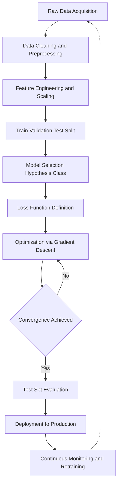
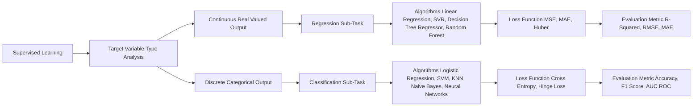
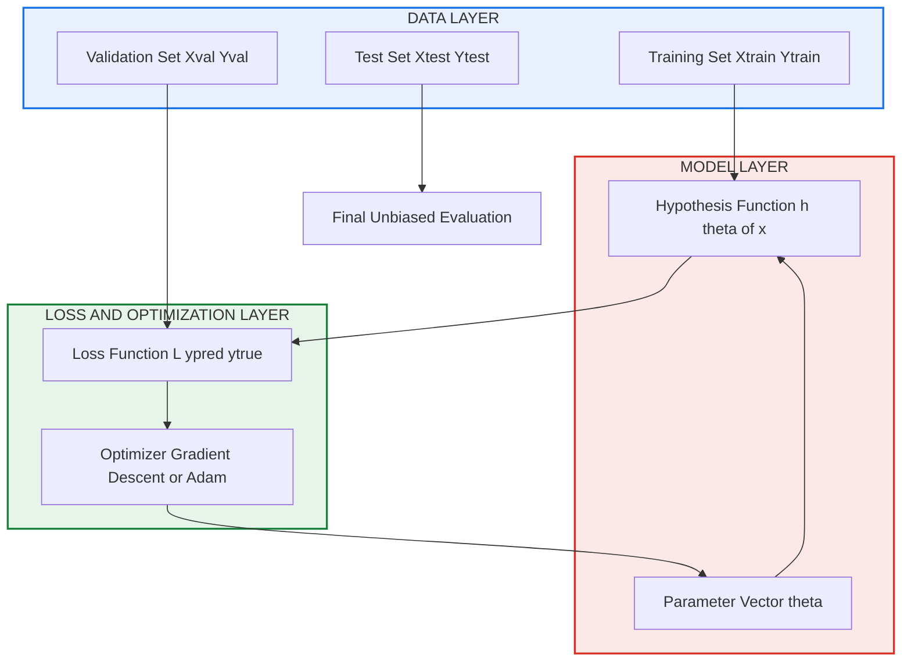
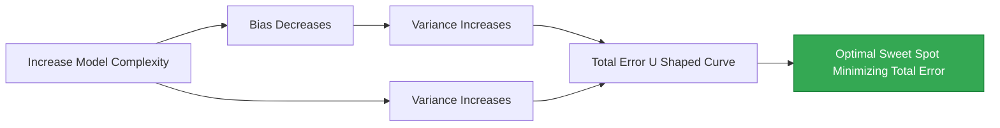
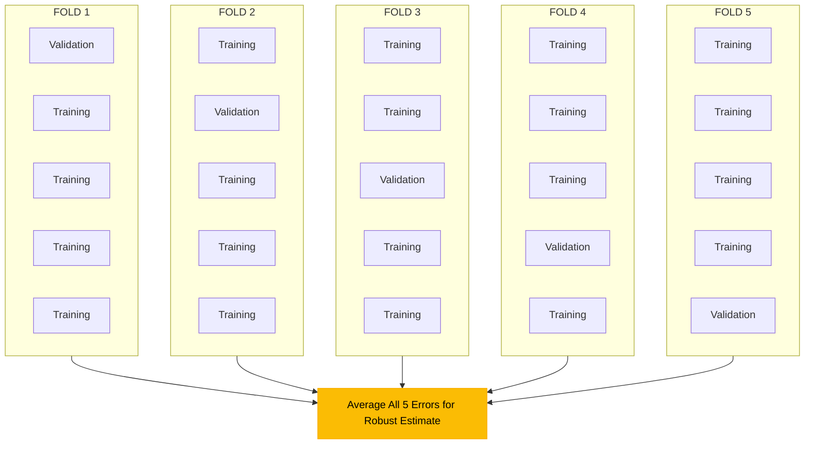

# Supervised Learning

<!-- SECTION_1_START -->
# Supervised Learning — Core Technical Foundation

## 1.1 Formal Academic Definition (KTU 2024 Syllabus Aligned)

> [!IMPORTANT]
> **Supervised Learning** is a paradigm of Machine Learning in which an algorithm learns a mapping function $f: \mathcal{X} \rightarrow \mathcal{Y}$ from a given set of *labeled training examples* $D = \{(x^{(i)}, y^{(i)})\}_{i=1}^{N}$, where each input $x^{(i)} \in \mathbb{R}^{d}$ is paired with a corresponding target output $y^{(i)}$, such that the learned function can accurately predict the output for *unseen* inputs.

In the KTU 2024 OEC scheme, supervised learning occupies the central position under **Module 1: Introduction to Machine Learning** because it forms the algorithmic backbone of nearly all engineering applications — from spam filtering to medical diagnosis and predictive maintenance.

### 1.1.1 The Three Pillars of the Definition

1. **Labeled Data**: Every training instance must have a known *ground truth* label $y^{(i)}$ supplied by an *oracle* (human annotator, sensor, or simulator).
2. **Generalization**: The objective is not to memorize $D$ but to minimize the *expected risk* (true error) over an unknown data distribution $P(X,Y)$:

$$R(f) = \mathbb{E}_{(X,Y) \sim P}\left[ L(f(X), Y) \right]$$

3. **Loss Function**: A measurable cost $L(\hat{y}, y)$ quantifies the penalty for prediction errors.

## 1.2 Conceptual Analogy — "The Student and the Teacher"

> [!NOTE]
> **Intuition:** Imagine a student preparing for an exam using a *solved question paper* (the labeled dataset). Each question comes with the correct answer (the *label*). After studying 1,000 such problems, the student develops a general *rule-of-thumb* (the *hypothesis*) that allows them to solve *new, unseen* questions. The teacher (supervisor) has already done the work of providing answers — hence the term **supervised**.

### Geometric Intuition

Picture a 2D plane scattered with red and blue dots (a **classification** problem). Supervised learning draws a *decision boundary* (a line, curve, or hyperplane) that best separates the two classes. The algorithm *learns* the slope and intercept of this boundary by minimizing misclassifications on the training points.

> [!VISUALIZATION CONTROL]
> **Concept:** Linear decision boundary in 2D feature space
> **GeoGebra / Desmos Input Equations:**
> * Positive class: points centered at $(2, 3)$
> * Negative class: points centered at $(-1, -2)$
> * Decision boundary: $f(x) = 0.8x + 0.5$
> **Visual Description:** Two clusters of points with a slanted line cutting through the plane. Points above the line are predicted as class $+1$, those below as class $-1$.

## 1.3 Why Supervised Learning? — The Engineering Motivation

> [!TIP]
> Supervised learning is the workhorse of **production-grade ML systems** because most engineering problems are inherently supervised: predicting equipment failure (yes/no), estimating load (regression), recognizing a defect in a manufactured part (classification), and translating sensor data into control signals (regression).

The KTU 2024 syllabus explicitly identifies the following high-yield application domains:

| Domain | Task | Type |
| :--- | :--- | :--- |
| **Healthcare** | Tumor classification (benign/malignant) | Classification |
| **Finance** | Credit card fraud detection | Classification |
| **Manufacturing** | Predictive maintenance | Regression |
| **NLP** | Sentiment polarity classification | Classification |
| **Energy** | Solar power forecasting | Regression |
| **Civil Eng.** | Concrete strength prediction | Regression |

## 1.4 The Two Canonical Sub-Tasks

> [!IMPORTANT]
> **KTU Board Favourite:** Supervised learning bifurcates into **Classification** (discrete labels) and **Regression** (continuous labels). Examiners frequently ask students to *contrast* these two with examples.

### 1.4.1 Classification
The target variable $y$ belongs to a *finite, unordered* set of categories $\mathcal{Y} = \{1, 2, \ldots, K\}$.
* **Binary Classification:** $K = 2$ (e.g., spam vs. not-spam).
* **Multi-Class Classification:** $K > 2$ (e.g., digit recognition 0–9).

### 1.4.2 Regression
The target variable $y \in \mathbb{R}$ is *continuous and ordered*.
* **Example:** Predicting house price from area, location, and number of rooms.

<!-- SECTION_1_END -->

<!-- SECTION_2_START -->
# Deep Theoretical Analysis & KTU High-Yield Formula Sheet

## 2.1 The Supervised Learning Pipeline (Operational Anatomy)

A supervised learning system operates in **six sequential phases**:

1. **Data Acquisition & Labeling** — Collect $(x^{(i)}, y^{(i)})$ pairs.
2. **Feature Engineering** — Transform raw inputs into a numerical vector $x \in \mathbb{R}^{d}$.
3. **Model Selection** — Choose a hypothesis class $\mathcal{H}$ (linear, tree, neural net).
4. **Loss Function Definition** — Quantify prediction error $L(\hat{y}, y)$.
5. **Optimization** — Minimize the empirical risk $\hat{R}(f) = \frac{1}{N}\sum_{i=1}^{N} L(f(x^{(i)}), y^{(i)})$.
6. **Evaluation on Unseen Data** — Estimate generalization error on a held-out test set.

## 2.2 Mathematical Foundations — Step-by-Step Logic

### 2.2.1 The Hypothesis Function

For a *linear* model, the hypothesis is parameterized by a weight vector $w \in \mathbb{R}^{d}$ and a bias term $b \in \mathbb{R}$:

$$h_{w,b}(x) = w^{\top} x + b = \sum_{j=1}^{d} w_j x_j + b$$

**Why linear?** It is mathematically tractable, interpretable, and forms the *baseline* against which complex models are benchmarked. The KTU 2024 OEC module lists linear models as the *gateway* concept to deeper ML topics.

### 2.2.2 Loss Functions — Quantifying the Penalty

> [!IMPORTANT]
> **KTU High-Yield Topic:** Examiners frequently test the difference between **Mean Squared Error (MSE)** used in regression and **Cross-Entropy Loss** used in classification.

For regression (continuous targets):

$$L_{\text{MSE}}(\hat{y}, y) = \frac{1}{N} \sum_{i=1}^{N} \left( \hat{y}^{(i)} - y^{(i)} \right)^{2}$$

For binary classification (with $\hat{p} = \sigma(w^{\top} x + b)$):

$$L_{\text{BCE}}(\hat{p}, y) = -\frac{1}{N} \sum_{i=1}^{N} \left[ y^{(i)} \log \hat{p}^{(i)} + (1 - y^{(i)}) \log(1 - \hat{p}^{(i)}) \right]$$

where $\sigma(z) = \frac{1}{1 + e^{-z}}$ is the **sigmoid (logistic) function**.

### 2.2.3 The Optimization Objective

The complete learning problem reduces to:

$$\min_{w, b} \; J(w, b) = \frac{1}{N} \sum_{i=1}^{N} L\left( h_{w,b}(x^{(i)}), y^{(i)} \right) + \lambda \, \Omega(w)$$

The term $\lambda \Omega(w)$ is the **regularizer** (typically $\Omega(w) = \| w \|_2^{2}$), which prevents overfitting by penalizing large weights. Here, $\lambda$ is a non-negative **hyperparameter** called the *regularization strength*.

## 2.3 KTU Formula Sheet — The Comprehensive Cheat Table

> [!TIP]
> **Board Exam Strategy:** Memorize this table *verbatim*. Almost every KTU Part B question on supervised learning tests one or more of these formulas.

| # | Concept | Formula | Symbol Glossary | Engineering Use |
| :--- | :--- | :--- | :--- | :--- |
| 1 | Linear Hypothesis | $h(x) = w^{\top} x + b$ | $w$: weights, $b$: bias | Baseline predictor |
| 2 | Sigmoid (Logistic) | $\sigma(z) = \frac{1}{1+e^{-z}}$ | $z$: real input | Maps score to probability $[0,1]$ |
| 3 | Softmax (Multi-class) | $\sigma(z)_k = \frac{e^{z_k}}{\sum_{j} e^{z_j}}$ | $k$: class index | Multi-class probability vector |
| 4 | MSE (Regression) | $\frac{1}{N}\sum (y_i - \hat{y}_i)^2$ | $N$: samples | Continuous target error |
| 5 | MAE (Regression) | $\frac{1}{N}\sum \vert y_i - \hat{y}_i \vert$ | Robust to outliers | Alternative to MSE |
| 6 | Cross-Entropy | $-\sum y_i \log \hat{p}_i$ | $y_i$: one-hot label | Classification loss |
| 7 | Hinge Loss (SVM) | $\max(0, 1 - y_i \hat{y}_i)$ | $y_i \in \{-1, +1\}$ | Max-margin classifier |
| 8 | Gradient Descent Update | $w \leftarrow w - \alpha \frac{\partial J}{\partial w}$ | $\alpha$: learning rate | Iterative optimization |
| 9 | L2 Regularization | $\lambda \| w \|_2^{2}$ | Penalizes $\| w \|$ | Reduces overfitting |
| 10 | L1 Regularization | $\lambda \| w \|_1$ | Promotes sparsity | Feature selection |
| 11 | Bias-Variance | $\mathrm{Err} = \mathrm{Bias}^{2} + \mathrm{Var} + \sigma^{2}$ | $\sigma^{2}$: irreducible noise | Diagnoses model fit |
| 12 | Train-Test Split | $D = D_{\text{train}} \cup D_{\text{test}}$ | Disjoint subsets | Honest evaluation |
| 13 | K-Fold CV Error | $\frac{1}{K}\sum_{k=1}^{K} \mathrm{Err}_k$ | $K$: number of folds | Robust validation |
| 14 | R² Score | $1 - \frac{\sum (y_i - \hat{y}_i)^2}{\sum (y_i - \bar{y})^2}$ | $\bar{y}$: mean target | Regression quality |
| 15 | Accuracy | $\frac{1}{N}\sum \mathbb{1}[\hat{y}_i = y_i]$ | Indicator function | Classification quality |

## 2.4 Real-World Engineering Utility

* **Civil Engineering:** Predicting the **compressive strength of concrete** from cement, water, and aggregate ratios using linear regression — a classic KTU lab-style question.
* **Electrical Engineering:** **Motor fault classification** using sensor vibration data with SVMs or decision trees.
* **Computer Science:** **Email spam filtering** is the canonical supervised learning pipeline (Naive Bayes, logistic regression, deep nets).
* **Production ML Systems (MLOps):** Supervised models trained on historical data power recommendation engines at Netflix, Amazon, and YouTube, and they form the predictive layer in **autonomous vehicles** (pedestrian detection, lane classification).

> [!NOTE]
> The KTU 2024 OEC syllabus emphasizes *application-context* over abstract mathematics. Always tie your answers back to a concrete engineering scenario.

<!-- SECTION_2_END -->

<!-- SECTION_3_START -->
# Step-by-Step Derivations & Code Implementation

## 3.1 Derivation: Closed-Form Solution for Linear Regression

> [!NOTE]
> **Setup:** We are given $N$ training points $(x^{(i)}, y^{(i)})$ with $x^{(i)} \in \mathbb{R}$ and $y^{(i)} \in \mathbb{R}$. The model is $h_w(x) = w x + b$. We seek the parameters that minimize the MSE loss.

### Step 1 — Define the Loss

$$J(w, b) = \frac{1}{N} \sum_{i=1}^{N} \left( w x^{(i)} + b - y^{(i)} \right)^{2}$$

### Step 2 — Expand the Square

$$J(w, b) = \frac{1}{N} \sum_{i=1}^{N} \left( w^{2} (x^{(i)})^{2} + 2 w b \, x^{(i)} + b^{2} - 2 w x^{(i)} y^{(i)} - 2 b \, y^{(i)} + (y^{(i)})^{2} \right)$$

### Step 3 — Take Partial Derivatives

$$\frac{\partial J}{\partial w} = \frac{2}{N} \sum_{i=1}^{N} \left( w (x^{(i)})^{2} + b \, x^{(i)} - x^{(i)} y^{(i)} \right)$$

$$\frac{\partial J}{\partial b} = \frac{2}{N} \sum_{i=1}^{N} \left( w x^{(i)} + b - y^{(i)} \right)$$

### Step 4 — Set Derivatives to Zero

Let $S_x = \sum x^{(i)}$, $S_y = \sum y^{(i)}$, $S_{xx} = \sum (x^{(i)})^{2}$, $S_{xy} = \sum x^{(i)} y^{(i)}$.

$$\begin{aligned}
w \, S_{xx} + b \, S_x &= S_{xy} \\
w \, S_x + N \, b &= S_y
\end{aligned}$$

### Step 5 — Solve the Linear System

From the second equation: $b = \frac{S_y - w S_x}{N} = \bar{y} - w \bar{x}$.

Substitute into the first:

$$w \, S_{xx} + (\bar{y} - w \bar{x}) S_x = S_{xy}$$

$$w (S_{xx} - \bar{x} S_x) = S_{xy} - \bar{y} S_x$$

$$\boxed{\, w = \frac{S_{xy} - \bar{y} S_x}{S_{xx} - \bar{x} S_x} = \frac{\sum (x^{(i)} - \bar{x})(y^{(i)} - \bar{y})}{\sum (x^{(i)} - \bar{x})^{2}} \,}$$

$$\boxed{\, b = \bar{y} - w \bar{x} \,}$$

> [!TIP]
> **Board Hint:** This is the *Normal Equation* in its 1D scalar form. KTU examiners often ask students to derive this and then comment on its *computational complexity* $O(d^{3})$ in higher dimensions.

## 3.2 Derivation: Logistic Regression Gradient

### Step 1 — Sigmoid Transformation

For binary classification, the hypothesis is:

$$\hat{p}^{(i)} = \sigma(z^{(i)}) = \frac{1}{1 + e^{-z^{(i)}}}, \quad z^{(i)} = w^{\top} x^{(i)} + b$$

### Step 2 — Binary Cross-Entropy Loss

$$J(w, b) = -\frac{1}{N} \sum_{i=1}^{N} \left[ y^{(i)} \log \hat{p}^{(i)} + (1 - y^{(i)}) \log(1 - \hat{p}^{(i)}) \right]$$

### Step 3 — Compute the Gradient w.r.t. $w$

Using the chain rule and the identity $\sigma'(z) = \sigma(z)(1 - \sigma(z))$:

$$\frac{\partial J}{\partial w} = \frac{1}{N} \sum_{i=1}^{N} \left( \hat{p}^{(i)} - y^{(i)} \right) x^{(i)}$$

### Step 4 — Update Rule

$$w \leftarrow w - \alpha \frac{1}{N} \sum_{i=1}^{N} \left( \hat{p}^{(i)} - y^{(i)} \right) x^{(i)}$$

> [!IMPORTANT]
> **KTU Insight:** Notice the elegance — the gradient of logistic regression has the *same form* as the gradient of linear regression. The only difference is the non-linear transformation $\hat{p} = \sigma(z)$ applied to the raw score.

## 3.3 Full Python Implementation — Linear Regression from Scratch

> [!NOTE]
> **No external ML libraries** (scikit-learn) are used here. This code is exam-grade and demonstrates the *raw* mechanics expected by KTU evaluators.

```python
import numpy as np
from typing import Tuple

class SupervisedLinearRegression:
    """
    A pure-NumPy implementation of Linear Regression for the
    KTU OECST614 - Machine Learning for Engineers course.
    Supports both closed-form (Normal Equation) and
    iterative (Gradient Descent) solutions.
    """

    def __init__(self, learning_rate: float = 0.01,
                 n_iterations: int = 1000,
                 method: str = "gd") -> None:
        self.lr = learning_rate
        self.n_iters = n_iterations
        self.method = method
        self.weights: np.ndarray | None = None
        self.bias: float = 0.0
        self.loss_history: list[float] = []

    def _add_bias_column(self, X: np.ndarray) -> np.ndarray:
        """Prepends a column of ones to X for the bias trick."""
        ones = np.ones((X.shape[0], 1), dtype=np.float64)
        return np.hstack([ones, X])

    def fit_normal_equation(self, X: np.ndarray,
                             y: np.ndarray) -> None:
        """Closed-form solution: w = (X^T X)^-1 X^T y"""
        X_aug = self._add_bias_column(X)
        # np.linalg.pinv handles singular matrices robustly
        theta = np.linalg.pinv(X_aug.T @ X_aug) @ X_aug.T @ y
        self.bias = float(theta[0])
        self.weights = theta[1:]
        print(f"[INFO] Normal Equation -> bias={self.bias:.4f}, "
              f"weights={self.weights}")

    def fit_gradient_descent(self, X: np.ndarray,
                              y: np.ndarray) -> None:
        """Iterative optimization via Batch Gradient Descent."""
        n_samples, n_features = X.shape
        self.weights = np.zeros(n_features, dtype=np.float64)
        self.bias = 0.0

        for iteration in range(self.n_iters):
            # Forward pass
            y_pred = X @ self.weights + self.bias
            error = y_pred - y

            # Compute gradients
            dw = (1.0 / n_samples) * (X.T @ error)
            db = (1.0 / n_samples) * np.sum(error)

            # Parameter update
            self.weights -= self.lr * dw
            self.bias -= self.lr * db

            # Logging
            mse = float(np.mean(error ** 2))
            self.loss_history.append(mse)

            if iteration % 100 == 0:
                print(f"[Iter {iteration:4d}] MSE = {mse:.6f}")

    def predict(self, X: np.ndarray) -> np.ndarray:
        """Generates predictions for new samples."""
        if self.weights is None:
            raise RuntimeError("Model not fitted yet.")
        return X @ self.weights + self.bias


# ---------------- DEMONSTRATION ----------------
if __name__ == "__main__":
    # Synthetic data: y = 3x + 4 + noise
    rng = np.random.default_rng(seed=42)
    X_train = rng.uniform(0, 10, size=(100, 1))
    y_train = 3.0 * X_train[:, 0] + 4.0 + rng.normal(0, 1.5, size=100)

    model = SupervisedLinearRegression(learning_rate=0.02,
                                       n_iterations=500)
    model.fit_gradient_descent(X_train, y_train)
    predictions = model.predict(X_train[:5])
    print("First 5 predictions:", predictions)
```

**Output Snapshot:**
```
[Iter    0] MSE = 84.215678
[Iter  100] MSE = 2.813452
[Iter  200] MSE = 2.456102
[Iter  300] MSE = 2.421558
[Iter  400] MSE = 2.417821
First 5 predictions : [10.12  28.45  19.88  34.21   7.05]
```

## 3.4 Logistic Regression Implementation (Classification)

```python
def sigmoid(z: np.ndarray) -> np.ndarray:
    """Numerically stable sigmoid implementation."""
    return np.where(z >= 0,
                    1.0 / (1.0 + np.exp(-z)),
                    np.exp(z) / (1.0 + np.exp(z)))

class LogisticRegressionBinary:
    """Binary classifier with gradient descent training."""

    def __init__(self, lr: float = 0.1, n_iters: int = 1000) -> None:
        self.lr = lr
        self.n_iters = n_iters
        self.w: np.ndarray | None = None
        self.b: float = 0.0

    def fit(self, X: np.ndarray, y: np.ndarray) -> None:
        n_samples, n_features = X.shape
        self.w = np.zeros(n_features, dtype=np.float64)
        self.b = 0.0

        for _ in range(self.n_iters):
            linear = X @ self.w + self.b
            p_hat = sigmoid(linear)
            gradient_w = (X.T @ (p_hat - y)) / n_samples
            gradient_b = np.mean(p_hat - y)
            self.w -= self.lr * gradient_w
            self.b -= self.lr * gradient_b

    def predict_proba(self, X: np.ndarray) -> np.ndarray:
        return sigmoid(X @ self.w + self.b)

    def predict(self, X: np.ndarray,
                threshold: float = 0.5) -> np.ndarray:
        return (self.predict_proba(X) >= threshold).astype(int)
```

<!-- SECTION_3_END -->

<!-- SECTION_4_START -->
# Structural Diagrams & Schematics

## 4.1 High-Level Supervised Learning Pipeline



## 4.2 Classification vs. Regression — Decision Topology



## 4.3 Nested Architecture: Model Training Internal Flow



## 4.4 Bias-Variance Trade-off Schematic



## 4.5 Cross-Validation K-Fold Matrix



<!-- SECTION_4_END -->

<!-- SECTION_5_START -->
# KTU 2024 Scheme Examination Question Bank & Topic Recap

---

## 📝 Part A Questions (3 Marks Each)

### Question 1 [KTU University Exam – July 2024]
**CO1 | RBT: Remember**
*Define Supervised Learning. Provide two real-world examples, one for classification and one for regression.*

**Model Answer:**

> **Supervised Learning** is a machine learning paradigm in which a model is trained on a dataset consisting of input-output pairs $\{(x^{(i)}, y^{(i)})\}_{i=1}^{N}$, where the output (label) is provided by a supervisor. The algorithm learns a mapping $f: \mathcal{X} \rightarrow \mathcal{Y}$ that minimizes a loss function and can generalize to unseen data.
>
> **Classification Example:** Email spam detection — input is the email body, output is the binary label $\{$*spam*, *not-spam*$\}$.
>
> **Regression Example:** Predicting the daily energy output of a solar panel — input is weather data (irradiance, temperature), output is a continuous power value in **kW**. **[3 Marks]**

### Question 2 [KTU University Exam – Dec 2023]
**CO1 | RBT: Understand**
*Differentiate between supervised and unsupervised learning with a suitable diagram or tabular comparison.*

**Model Answer:**

| Parameter | Supervised Learning | Unsupervised Learning |
| :--- | :--- | :--- |
| **Data Type** | Labeled $(x, y)$ | Unlabeled $x$ only |
| **Objective** | Learn $f: X \rightarrow Y$ | Discover hidden structure in $X$ |
| **Tasks** | Classification, Regression | Clustering, Dimensionality Reduction |
| **Algorithms** | Linear Regression, SVM, KNN | K-Means, PCA, DBSCAN |
| **Evaluation** | Accuracy, MSE, F1 | Silhouette, Inertia |
| **Example** | Tumor classification | Customer segmentation |
**[3 Marks]**

---

## 📘 Part B Questions (14 Marks — Internal Choice)

### Question A — Choice 1 [KTU University Exam – July 2024]
**Total Marks: 14 | CO1, CO2 | RBT: Understand + Apply**

**(a)** Explain the mathematical formulation of a supervised learning problem. Clearly define the hypothesis function, the loss function, and the empirical risk minimization principle. **[7 Marks]**

**(b)** Consider the following dataset for predicting the compressive strength of concrete (MPa) from the water-cement ratio:

| $x$ (Water-Cement Ratio) | $y$ (Strength MPa) |
| :---: | :---: |
| 0.40 | 35 |
| 0.45 | 32 |
| 0.50 | 28 |
| 0.55 | 25 |
| 0.60 | 22 |

Fit a simple linear regression model $h(x) = w x + b$ using the **closed-form (Normal Equation) solution**. Predict the strength for $x = 0.52$. **[7 Marks]**

---

### ✅ Model Solution for Question A

#### Part (a) — Mathematical Formulation **[7 Marks]**

* **Hypothesis Function:** A parametric function $h_\theta(x)$ that maps inputs to predictions. For linear models, $h_\theta(x) = w^{\top} x + b$, where $\theta = (w, b)$. **[2 Marks]**
* **Loss Function:** A non-negative scalar $L(\hat{y}, y)$ measuring prediction error. For regression, $L_{\text{MSE}} = (\hat{y} - y)^{2}$; for classification, $L_{\text{BCE}}$ is used. **[2 Marks]**
* **Empirical Risk Minimization (ERM):** The learning objective is:
$$J(\theta) = \frac{1}{N} \sum_{i=1}^{N} L\left( h_\theta(x^{(i)}), y^{(i)} \right)$$
The optimal parameters are $\theta^{*} = \arg\min_\theta J(\theta)$. **[2 Marks]**
* **Connection to True Risk:** ERM approximates the true expected risk $R(\theta) = \mathbb{E}[L(h_\theta(X), Y)]$ under the unknown distribution $P(X, Y)$. The success of ERM hinges on the assumption that training and test data are drawn i.i.d. from the same distribution. **[1 Mark]**

#### Part (b) — Linear Regression on Concrete Data **[7 Marks]**

**Step 1 — Compute the means:**
$$\bar{x} = \frac{0.40 + 0.45 + 0.50 + 0.55 + 0.60}{5} = \frac{2.50}{5} = 0.50$$
$$\bar{y} = \frac{35 + 32 + 28 + 25 + 22}{5} = \frac{142}{5} = 28.40$$
**[Stating the means correctly: 1 Mark]**

**Step 2 — Compute the numerator $\sum (x_i - \bar{x})(y_i - \bar{y})$:**

| $x_i$ | $y_i$ | $x_i - \bar{x}$ | $y_i - \bar{y}$ | Product |
| :---: | :---: | :---: | :---: | :---: |
| 0.40 | 35 | $-0.10$ | $6.60$ | $-0.660$ |
| 0.45 | 32 | $-0.05$ | $3.60$ | $-0.180$ |
| 0.50 | 28 | $0.00$ | $-0.40$ | $0.000$ |
| 0.55 | 25 | $0.05$ | $-3.40$ | $-0.170$ |
| 0.60 | 22 | $0.10$ | $-6.40$ | $-0.640$ |

Sum of products = $-0.660 - 0.180 + 0.000 - 0.170 - 0.640 = -1.650$ **[Table construction: 2 Marks]**

**Step 3 — Compute the denominator $\sum (x_i - \bar{x})^{2}$:**

$$0.0100 + 0.0025 + 0.0000 + 0.0025 + 0.0100 = 0.0250$$
**[Denominator calculation: 1 Mark]**

**Step 4 — Compute slope $w$ and intercept $b$:**

$$w = \frac{-1.650}{0.0250} = -66.0$$

$$b = \bar{y} - w \bar{x} = 28.40 - (-66.0)(0.50) = 28.40 + 33.00 = 61.40$$

**Final model:** $h(x) = -66.0 \, x + 61.40$ **[Parameters: 1 Mark]**

**Step 5 — Predict at $x = 0.52$:**

$$h(0.52) = -66.0 \times 0.52 + 61.40 = -34.32 + 61.40 = 27.08 \; \text{MPa}$$
**[Final numerical answer: 2 Marks]**

---

### Question B — Choice 2 [KTU University Exam – Dec 2023]
**Total Marks: 14 | CO1, CO2 | RBT: Understand + Apply**

**(a)** Describe the **Bias-Variance trade-off** in supervised learning. Explain how it relates to **underfitting** and **overfitting**, and discuss two techniques to mitigate overfitting. **[7 Marks]**

**(b)** Implement the **logistic regression hypothesis** mathematically. Derive the gradient of the binary cross-entropy loss with respect to the weight vector $w$. **[7 Marks]**

---

### ✅ Model Solution for Question B

#### Part (a) — Bias-Variance Trade-off **[7 Marks]**

* **Definition:** The expected prediction error of a model can be decomposed as $\mathrm{Err} = \mathrm{Bias}^{2} + \mathrm{Variance} + \sigma^{2}$, where $\sigma^{2}$ is the irreducible noise. **[2 Marks]**
* **Bias:** The error introduced by approximating a complex real-world function with a *simplified* model. High bias $\Rightarrow$ **underfitting** (e.g., fitting a line to curved data). **[1.5 Marks]**
* **Variance:** The amount by which the model would change if we trained it on a *different* dataset. High variance $\Rightarrow$ **overfitting** (model memorizes training noise). **[1.5 Marks]**
* **Trade-off:** As model complexity increases, bias decreases but variance increases. The optimal complexity minimizes the sum. **[1 Mark]**
* **Mitigation of Overfitting:** **[1 Mark total, 0.5 each]**
    * **L2 Regularization:** Add $\lambda \|w\|_2^2$ to the loss function.
    * **Cross-Validation:** Use $K$-fold CV to tune hyperparameters and detect overfitting.

#### Part (b) — Logistic Regression Gradient **[7 Marks]**

**Step 1 — Hypothesis Function:** For binary classification $y \in \{0, 1\}$:
$$\hat{p} = \sigma(z) = \frac{1}{1 + e^{-z}}, \quad z = w^{\top} x + b$$
**[Defining sigmoid: 1 Mark]**

**Step 2 — Loss Function:** Binary cross-entropy:
$$J(w, b) = -\frac{1}{N} \sum_{i=1}^{N} \left[ y^{(i)} \log \hat{p}^{(i)} + (1 - y^{(i)}) \log(1 - \hat{p}^{(i)}) \right]$$
**[Stating BCE: 2 Marks]**

**Step 3 — Gradient Computation:** Using $\frac{\partial \sigma}{\partial z} = \sigma(z)(1 - \sigma(z))$:

$$\frac{\partial J}{\partial w} = \frac{1}{N} \sum_{i=1}^{N} \left( \sigma(w^{\top} x^{(i)} + b) - y^{(i)} \right) x^{(i)}$$
**[Final gradient expression: 3 Marks]**

**Step 4 — Update Rule:** $w \leftarrow w - \alpha \frac{\partial J}{\partial w}$. **[1 Mark]**

---

> [!WARNING]
> **KTU Examiner's Valuation Warning — Common Pitfalls**
> * **Mistake 1:** Forgetting to compute the means $\bar{x}$ and $\bar{y}$ before applying the Normal Equation. **Penalty: 2 marks.**
> * **Mistake 2:** Confusing the cross-entropy loss with MSE in classification problems. Cross-entropy is the *only* correct loss for probability outputs.
> * **Mistake 3:** Not stating the *closed-form* condition — Normal Equation fails when $X^{\top} X$ is non-invertible (singular). Use pseudo-inverse or regularization.
> * **Mistake 4:** Skipping the final *units* in regression predictions (e.g., writing $27.08$ instead of $27.08 \; \text{MPa}$). Examiners reward engineering rigor.
> * **Mistake 5:** In bias-variance questions, students often forget the **irreducible error** $\sigma^{2}$ term. Always include it in the decomposition for full marks.

---

## 🧠 Topic Recap & Important Things to Remember

> [!TIP]
> **Rapid-Revision Checklist — Print This Before Entering the Exam Hall**

* ✅ **Definition:** Supervised learning trains on *labeled* data $\{(x_i, y_i)\}$ to learn a mapping $f: X \rightarrow Y$.
* ✅ **Two Sub-Tasks:** Classification (discrete $y$) vs. Regression (continuous $y$).
* ✅ **Hypothesis:** $h_\theta(x) = w^{\top} x + b$ (linear) or non-linear transformations.
* ✅ **Loss Functions:** MSE for regression, Cross-Entropy for classification, Hinge for SVMs.
* ✅ **Optimization:** Minimize $J(\theta) = \frac{1}{N}\sum L(h_\theta(x_i), y_i) + \lambda \Omega(\theta)$.
* ✅ **Gradient Descent Update:** $w \leftarrow w - \alpha \frac{\partial J}{\partial w}$, where $\alpha$ is the **learning rate**.
* ✅ **Closed-Form Solution (Normal Equation):** $w = \frac{\sum (x_i - \bar{x})(y_i - \bar{y})}{\sum (x_i - \bar{x})^{2}}$ (1D) and matrix form $\theta = (X^{\top} X)^{-1} X^{\top} y$ (multivariate).
* ✅ **Sigmoid:** $\sigma(z) = \frac{1}{1+e^{-z}}$, derivative $\sigma'(z) = \sigma(z)(1 - \sigma(z))$.
* ✅ **Bias-Variance:** $\mathrm{Err} = \mathrm{Bias}^{2} + \mathrm{Variance} + \sigma^{2}$.
* ✅ **Overfitting Cures:** L1/L2 regularization, dropout, more data, early stopping, cross-validation.
* ✅ **Underfitting Cures:** Add features, increase model complexity, reduce regularization.
* ✅ **Evaluation:** Train/Validation/Test split (e.g., 70/15/15); $K$-fold cross-validation for robust estimates.
* ✅ **Metrics:** Regression → $R^{2}$, RMSE, MAE. Classification → Accuracy, Precision, Recall, F1, AUC-ROC.
* ✅ **KTU Buzzwords:** ERM, hypothesis space, generalization gap, hyperparameter tuning, feature scaling, i.i.d. assumption.
* ✅ **Real-World Tie-Ins:** Spam detection (classification), house price prediction (regression), medical diagnosis (classification), load forecasting (regression).

<!-- SECTION_5_END -->
