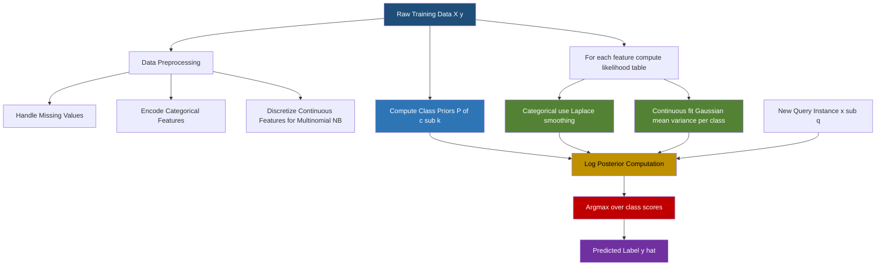
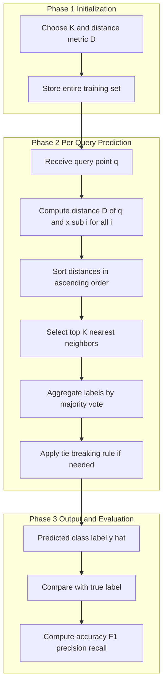
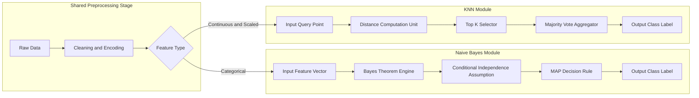
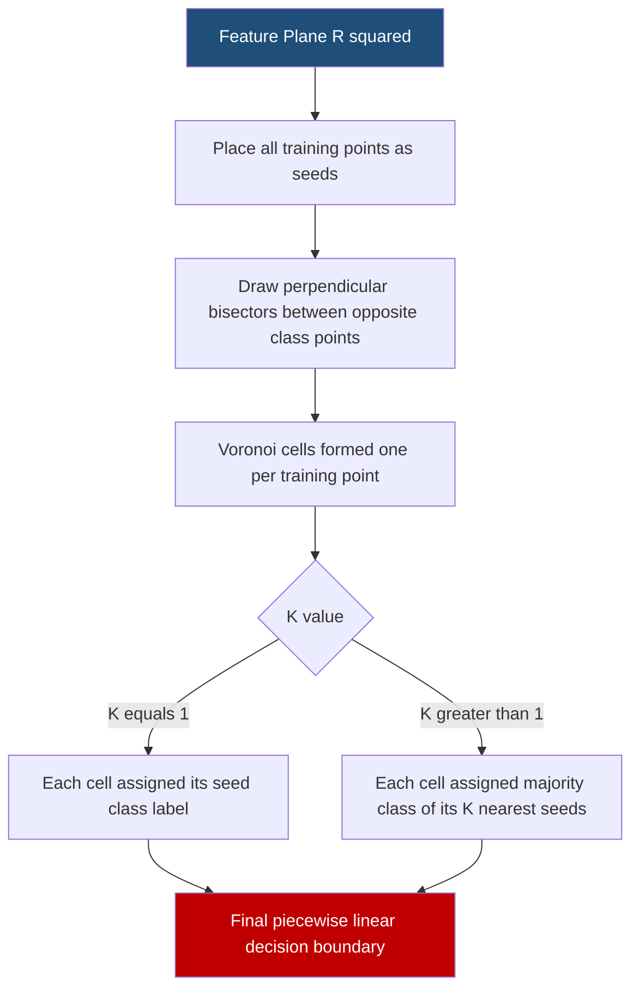
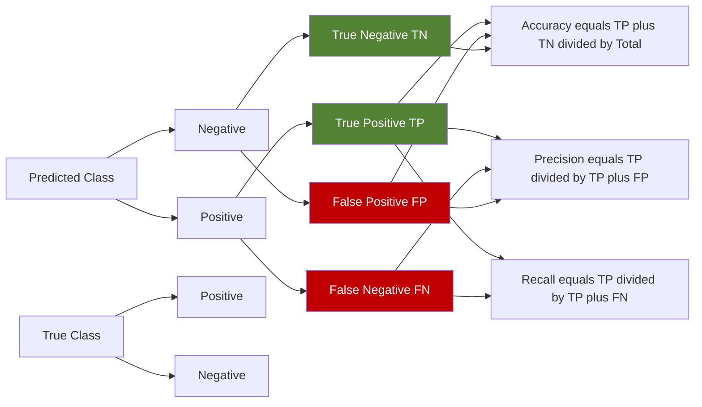

# Classification  - Naïve Bayes, KNN

<!-- SECTION_1_START -->
# Classification: Naïve Bayes and K-Nearest Neighbors (KNN)

## 1.1 Formal Definition (KTU 2024 Syllabus Terminology)

**Classification** is a supervised learning paradigm in machine learning where the objective is to learn a mapping function $f: \mathcal{X} \rightarrow \mathcal{Y}$ from a feature space $\mathcal{X} \subseteq \mathbb{R}^{d}$ to a discrete (categorical) label space $\mathcal{Y} = \{c_1, c_2, \ldots, c_K\}$. The learned model is then used to predict the class label of previously unseen instances.

Within the classification family, two foundational algorithms are mandated by the KTU 2024 OECST614 Module 2 syllabus:

1. **Naïve Bayes Classifier (NB)**: A *probabilistic generative classifier* grounded in **Bayes' Theorem** that assumes *strong (naïve) conditional independence* among the features given the class label.
2. **K-Nearest Neighbors (KNN)**: A *non-parametric, instance-based (lazy) learning* algorithm that classifies a query point by majority vote among its $K$ closest training samples in the feature space.

> [!IMPORTANT]
> **KTU 2024 Syllabus Highlight (OECST614 - Module 2)**
> Students must be able to: (i) derive the posterior probability expression for NB, (ii) explain the conditional independence assumption, (iii) apply Laplace smoothing, (iv) compute distances for KNN, (v) discuss the effect of the parameter $K$ and choice of distance metric, and (vi) implement both algorithms in Python using `scikit-learn`.

## 1.2 Conceptual Analogy / Intuitive Overview

### 🍕 Naïve Bayes — The "Pizza Order" Analogy
Imagine you are a delivery agent trying to guess whether an order is for a **Vegetarian** or **Non-Vegetarian** customer. You look at three independent clues: the hour of the day, the presence of coupon usage, and the topping list. The Naïve Bayes classifier assumes that, *given* the true preference (Veg/Non-Veg), these three clues are **statistically independent**. Even though in reality the hour of the day and coupon usage may be correlated, the algorithm "naïvely" ignores this dependency, which surprisingly still yields robust predictions.

> [!NOTE]
> **Why "Naïve"?** Because the conditional independence assumption is almost never strictly true in real-world data, yet the classifier performs remarkably well in high-dimensional domains such as **text classification, spam filtering, and sentiment analysis**.

### 🏠 KNN — The "Neighborhood Referendum" Analogy
Suppose you are relocating to a new city and want to estimate the typical house price in an unfamiliar neighborhood. The most natural heuristic is: *look at the prices of the $K$ closest houses that have already been sold, and take their median (regression) or majority vote (classification)*. KNN embodies this exact idea in the feature space. A query point is classified by polling the labels of its $K$ nearest training neighbors.

> [!NOTE]
> **Geometric Intuition:** The feature space is partitioned into **Voronoi cells**. For $K=1$, every cell is assigned the label of its nearest training point. For $K>1$, the boundaries smooth out, reducing noise sensitivity at the cost of sharper local boundaries.

### Standard Constants and Reference Metrics

- The base of the natural logarithm used in log-probability computations: $e \approx \mathbf{2.71828}$.
- The standard smoothing parameter for NB: $\alpha = \mathbf{1}$ (Laplace / Add-One smoothing).
- The Euclidean norm constant for $d$-dimensional distance: $L_2$.
- The recommended odd values of $K$ to avoid tied binary votes: $K \in \{1, 3, 5, 7\}$.

> [!VISUALIZATION CONTROL]
> **Concept:** Voronoi tessellation and KNN decision boundaries for $K=1$ and $K=3$.
> **GeoGebra / Desmos Input Equations:**
> * `P1 = (1, 2)`, `P2 = (4, 5)`, `P3 = (6, 1)`, `P4 = (7, 7)` (class A in blue)
> * `P5 = (2, 6)`, `P6 = (5, 2)`, `P7 = (8, 4)` (class B in red)
> * `d(P, Pi) = sqrt((x-x_i)^2 + (y-y_i)^2)`
> **Visual Description:** Plot the 7 points. Draw the perpendicular bisectors between every pair of points belonging to different classes to obtain the Voronoi diagram. Increase $K$ to 3 and shade the regions where the majority of the 3 nearest neighbors belong to class A (blue) versus class B (red). The decision boundary shifts from sharp polygonal edges to smoother, more generalized curves.
<!-- SECTION_1_END -->

<!-- SECTION_2_START -->
# Deep Theoretical Analysis & KTU High-Yield Formula Sheet

## 2.1 Naïve Bayes Classifier — Operational Blueprint

### 2.1.1 Bayes' Theorem (The Foundation)

Given a feature vector $\mathbf{x} = (x_1, x_2, \ldots, x_d)$ and a class variable $y \in \{c_1, \ldots, c_K\}$, the posterior probability is:

$$
P(y = c_k \mid \mathbf{x}) = \frac{P(\mathbf{x} \mid y = c_k) \cdot P(y = c_k)}{P(\mathbf{x})}
$$

where:
- $P(y = c_k)$ is the **prior probability** of class $c_k$.
- $P(\mathbf{x} \mid y = c_k)$ is the **likelihood** of observing $\mathbf{x}$ given class $c_k$.
- $P(\mathbf{x})$ is the **evidence** (a normalizing constant independent of $c_k$).

### 2.1.2 The Naïve Conditional Independence Assumption

Computing $P(\mathbf{x} \mid y = c_k)$ directly is intractable for high $d$ because it requires estimating the joint distribution over all combinations. The **naïve assumption** is:

$$
P(x_1, x_2, \ldots, x_d \mid y = c_k) = \prod_{j=1}^{d} P(x_j \mid y = c_k)
$$

This means each feature $x_j$ is conditionally independent of every other feature **given** the class label.

### 2.1.3 Decision Rule

Since $P(\mathbf{x})$ is identical for all classes, the Maximum A Posteriori (MAP) estimate simplifies to:

$$
\hat{y} = \arg\max_{c_k} \; P(y = c_k) \cdot \prod_{j=1}^{d} P(x_j \mid y = c_k)
$$

To prevent numerical underflow when many small probabilities are multiplied, the log-likelihood is maximized:

$$
\hat{y} = \arg\max_{c_k} \; \log P(y = c_k) + \sum_{j=1}^{d} \log P(x_j \mid y = c_k)
$$

### 2.1.4 Probability Estimation Models

| Feature Type | Likelihood Model | Formula for $P(x_j \mid y = c_k)$ |
|---|---|---|
| Categorical (discrete) | Multinomial / Bernoulli NB | $\dfrac{N_{x_j, c_k} + \alpha}{N_{c_k} + \alpha \cdot V}$ |
| Continuous (Gaussian) | Gaussian NB | $\dfrac{1}{\sqrt{2\pi\sigma_{c_k}^{2}}} \exp\!\left(-\dfrac{(x_j - \mu_{c_k})^{2}}{2\sigma_{c_k}^{2}}\right)$ |

where $V$ is the vocabulary size (for text) and $\alpha$ is the Laplace smoothing parameter.

### 2.1.5 Laplace (Add-One) Smoothing

To handle the **zero-frequency problem** when a feature value never co-occurs with a class in training:

$$
P(x_j = v \mid y = c_k) = \frac{\text{count}(x_j = v, y = c_k) + \alpha}{\text{count}(y = c_k) + \alpha \cdot V}
$$

with the canonical choice $\alpha = 1$.

### 2.1.6 Why Naïve Bayes Works in Practice

- **Robust to irrelevant features**: An irrelevant $x_j$ has near-uniform $P(x_j \mid c_k)$, contributing little to the product.
- **Handles high-dimensional sparse data** (e.g., TF-IDF text vectors) exceptionally well.
- **Linear-time training and prediction**; easily parallelizable.
- **Not sensitive to feature scaling** since probabilities are normalized.

## 2.2 K-Nearest Neighbors (KNN) — Operational Blueprint

### 2.2.1 Algorithm Steps

1. Choose the number of neighbors $K$ and a distance metric $D(\cdot, \cdot)$.
2. For each query point $\mathbf{q}$ in the test set:
   - Compute $D(\mathbf{q}, \mathbf{x}_i)$ for every training point $\mathbf{x}_i$.
   - Sort the training points by ascending distance and select the top $K$.
   - Aggregate the labels of these $K$ neighbors (majority vote for classification; mean for regression).
3. Return the aggregated prediction.

### 2.2.2 Distance Metrics

| Metric | Formula | Use Case |
|---|---|---|
| Euclidean ($L_2$) | $D(\mathbf{q}, \mathbf{x}) = \sqrt{\sum_{j=1}^{d}(q_j - x_j)^{2}}$ | Default for continuous, isotropic features |
| Manhattan ($L_1$) | $D(\mathbf{q}, \mathbf{x}) = \sum_{j=1}^{d}\vert q_j - x_j \vert$ | Robust to outliers, high-dim sparse data |
| Minkowski ($L_p$) | $D(\mathbf{q}, \mathbf{x}) = \left(\sum_{j=1}^{d}\vert q_j - x_j \vert^{p}\right)^{1/p}$ | Generalization; $p=2$ recovers Euclidean |
| Cosine | $D(\mathbf{q}, \mathbf{x}) = 1 - \dfrac{\mathbf{q} \cdot \mathbf{x}}{\Vert\mathbf{q}\Vert \cdot \Vert\mathbf{x}\Vert}$ | Text and high-dimensional sparse vectors |

### 2.2.3 Effect of $K$ on the Bias-Variance Trade-off

- **Small $K$ (e.g., $K=1$)**: Low bias, high variance. Decision boundary is jagged and overfits to noise.
- **Large $K$**: High bias, low variance. Boundary is overly smooth and may underfit.
- **Odd $K$**: Preferred for binary classification to prevent tied votes.

### 2.2.4 Computational Considerations

- **Training cost**: $O(1)$ — KNN is a lazy learner, no model is built a priori.
- **Prediction cost**: $O(nd)$ per query, where $n$ is the training set size and $d$ is the feature dimensionality.
- **Memory**: Requires storing the entire training set.
- **Curse of Dimensionality**: As $d$ grows, all points become equidistant, degrading KNN's efficacy. Dimensionality reduction (PCA) or feature selection is recommended.

## 2.3 KTU High-Yield Formula Sheet

| # | Concept | Formula / Expression | Units / Notes |
|---|---|---|---|
| 1 | Bayes' Theorem | $P(c_k \mid \mathbf{x}) = \dfrac{P(\mathbf{x} \mid c_k) \, P(c_k)}{P(\mathbf{x})}$ | Probability in $[0, 1]$ |
| 2 | NB Posterior (Log) | $\log P(c_k) + \sum_{j=1}^{d} \log P(x_j \mid c_k)$ | Avoids underflow |
| 3 | Categorical Likelihood | $P(x_j \mid c_k) = \dfrac{N_{x_j,c_k} + \alpha}{N_{c_k} + \alpha V}$ | $\alpha = 1$ for Laplace |
| 4 | Gaussian Likelihood | $\dfrac{1}{\sqrt{2\pi\sigma_{c_k}^{2}}} \exp\!\left(-\dfrac{(x_j - \mu_{c_k})^{2}}{2\sigma_{c_k}^{2}}\right)$ | Continuous features |
| 5 | Prior Probability | $P(c_k) = \dfrac{N_{c_k}}{N}$ | Empirical frequency |
| 6 | Euclidean Distance | $D = \sqrt{\sum_{j=1}^{d}(q_j - x_j)^{2}}$ | Most common metric |
| 7 | Manhattan Distance | $D = \sum_{j=1}^{d}\vert q_j - x_j \vert$ | $L_1$ norm |
| 8 | Minkowski Distance | $D = \left(\sum_{j=1}^{d}\vert q_j - x_j \vert^{p}\right)^{1/p}$ | $p \geq 1$ |
| 9 | Cosine Distance | $D = 1 - \dfrac{\mathbf{q} \cdot \mathbf{x}}{\Vert\mathbf{q}\Vert \, \Vert\mathbf{x}\Vert}$ | Range: $[0, 2]$ |
| 10 | KNN Prediction | $\hat{y} = \mathrm{mode}\{y_i : \mathbf{x}_i \in \mathcal{N}_K(\mathbf{q})\}$ | Majority vote |

## 2.4 Real-World Engineering Utility

| Algorithm | Industry Application | Engineering Justification |
|---|---|---|
| Naïve Bayes | Email spam filtering, sentiment analysis, medical diagnosis triage, document categorization | Fast training, handles high-dim sparse bag-of-words vectors, works with small datasets |
| KNN | Recommender systems, anomaly detection, image recognition (pre-deep-learning), gene expression analysis | No training phase, naturally multi-class, non-parametric, adapts to local data structure |
<!-- SECTION_2_END -->

<!-- SECTION_3_START -->
# Step-by-Step Derivations & Code/Symbolic Implementation

## 3.1 Worked Example 1 — Naïve Bayes (Categorical, Weather Dataset)

### 3.1.1 Training Data

| Day | Outlook | Temp | Humidity | Wind | Play |
|---|---|---|---|---|---|
| 1 | Sunny | Hot | High | Weak | No |
| 2 | Sunny | Hot | High | Strong | No |
| 3 | Overcast | Hot | High | Weak | Yes |
| 4 | Rain | Mild | High | Weak | Yes |
| 5 | Rain | Cool | Normal | Weak | Yes |
| 6 | Rain | Cool | Normal | Strong | No |
| 7 | Overcast | Cool | Normal | Strong | Yes |
| 8 | Sunny | Mild | High | Weak | No |
| 9 | Sunny | Cool | Normal | Weak | Yes |
| 10 | Rain | Mild | Normal | Weak | Yes |
| 11 | Sunny | Mild | Normal | Strong | Yes |
| 12 | Overcast | Mild | High | Strong | Yes |
| 13 | Overcast | Hot | Normal | Weak | Yes |
| 14 | Rain | Mild | High | Strong | No |

### 3.1.2 Step-by-Step Posterior Computation

**Step 1 — Compute Class Priors**

$$
P(\text{Yes}) = \frac{9}{14}, \qquad P(\text{No}) = \frac{5}{14}
$$

**Step 2 — Compute Likelihood Tables (with Laplace smoothing $\alpha = 1$, $V_{\text{outlook}} = 3$)**

For Outlook = Sunny:

$$
P(\text{Sunny} \mid \text{Yes}) = \frac{2 + 1}{9 + 1 \cdot 3} = \frac{3}{12} = 0.250
$$

$$
P(\text{Sunny} \mid \text{No}) = \frac{3 + 1}{5 + 1 \cdot 3} = \frac{4}{8} = 0.500
$$

Similarly for the remaining features, we tabulate:

| Feature | Value | $P(\cdot \mid \text{Yes})$ | $P(\cdot \mid \text{No})$ |
|---|---|---|---|
| Outlook | Sunny | $3/12$ | $4/8$ |
| Outlook | Overcast | $4/12$ | $0/8$ (raw), $1/9$ (smoothed) |
| Outlook | Rain | $5/12$ | $3/8$ (raw), $3/9$ (smoothed) |
| Temp | Hot | $2/12$ | $2/8$ (raw), $2/9$ (smoothed) |
| Temp | Mild | $4/12$ | $2/8$ (raw), $2/9$ (smoothed) |
| Temp | Cool | $3/12$ | $1/8$ (raw), $1/9$ (smoothed) |
| Humidity | High | $3/12$ | $4/8$ (raw), $4/9$ (smoothed) |
| Humidity | Normal | $6/12$ | $1/8$ (raw), $1/9$ (smoothed) |
| Wind | Weak | $6/12$ | $2/8$ (raw), $2/9$ (smoothed) |
| Wind | Strong | $3/12$ | $3/8$ (raw), $3/9$ (smoothed) |

**Step 3 — Query Instance**

Predict for: Outlook = Sunny, Temp = Cool, Humidity = High, Wind = Strong.

**Step 4 — Compute Joint Posterior for Yes**

$$
P(\text{Yes} \mid \mathbf{x}) \propto P(\text{Yes}) \cdot P(\text{Sunny} \mid \text{Yes}) \cdot P(\text{Cool} \mid \text{Yes}) \cdot P(\text{High} \mid \text{Yes}) \cdot P(\text{Strong} \mid \text{Yes})
$$

$$
\propto \frac{9}{14} \cdot \frac{3}{12} \cdot \frac{3}{12} \cdot \frac{3}{12} \cdot \frac{3}{12}
$$

$$
\propto \frac{9}{14} \cdot \frac{81}{20736} = \frac{729}{290304} \approx 0.00251
$$

**Step 5 — Compute Joint Posterior for No**

$$
P(\text{No} \mid \mathbf{x}) \propto P(\text{No}) \cdot P(\text{Sunny} \mid \text{No}) \cdot P(\text{Cool} \mid \text{No}) \cdot P(\text{High} \mid \text{No}) \cdot P(\text{Strong} \mid \text{No})
$$

$$
\propto \frac{5}{14} \cdot \frac{4}{8} \cdot \frac{1}{8} \cdot \frac{4}{8} \cdot \frac{3}{8}
$$

$$
\propto \frac{5}{14} \cdot \frac{48}{4096} = \frac{240}{57344} \approx 0.00419
$$

**Step 6 — Normalize to Get True Probabilities**

$$
P(\text{Yes} \mid \mathbf{x}) = \frac{0.00251}{0.00251 + 0.00419} \approx 0.375
$$

$$
P(\text{No} \mid \mathbf{x}) = \frac{0.00419}{0.00251 + 0.00419} \approx 0.625
$$

**Decision:** $\hat{y} = \text{No}$ (since $0.625 > 0.375$).

## 3.2 Worked Example 2 — KNN Classification

### 3.2.1 Data Setup

Training set with 2D features and binary class labels $\{A, B\}$:

| Point | $x_1$ | $x_2$ | Class |
|---|---|---|---|
| $P_1$ | 1 | 2 | A |
| $P_2$ | 2 | 3 | A |
| $P_3$ | 3 | 1 | A |
| $P_4$ | 6 | 5 | B |
| $P_5$ | 7 | 7 | B |
| $P_6$ | 8 | 6 | B |

**Query Point:** $\mathbf{q} = (4, 4)$, $K = 3$, Euclidean distance.

### 3.2.2 Distance Computations

$$
D(\mathbf{q}, P_1) = \sqrt{(4-1)^{2} + (4-2)^{2}} = \sqrt{9 + 4} = \sqrt{13} \approx 3.606
$$

$$
D(\mathbf{q}, P_2) = \sqrt{(4-2)^{2} + (4-3)^{2}} = \sqrt{4 + 1} = \sqrt{5} \approx 2.236
$$

$$
D(\mathbf{q}, P_3) = \sqrt{(4-3)^{2} + (4-1)^{2}} = \sqrt{1 + 9} = \sqrt{10} \approx 3.162
$$

$$
D(\mathbf{q}, P_4) = \sqrt{(4-6)^{2} + (4-5)^{2}} = \sqrt{4 + 1} = \sqrt{5} \approx 2.236
$$

$$
D(\mathbf{q}, P_5) = \sqrt{(4-7)^{2} + (4-7)^{2}} = \sqrt{9 + 9} = \sqrt{18} \approx 4.243
$$

$$
D(\mathbf{q}, P_6) = \sqrt{(4-8)^{2} + (4-6)^{2}} = \sqrt{16 + 4} = \sqrt{20} \approx 4.472
$$

### 3.2.3 Sort and Select Top-$K = 3$

| Rank | Point | Distance | Class |
|---|---|---|---|
| 1 | $P_2$ | 2.236 | A |
| 2 | $P_4$ | 2.236 | B |
| 3 | $P_3$ | 3.162 | A |
| 4 | $P_1$ | 3.606 | A |
| 5 | $P_5$ | 4.243 | B |
| 6 | $P_6$ | 4.472 | B |

**Top-3 Neighbors:** $\{P_2, P_4, P_3\}$ with class votes $\{A, B, A\}$.

**Majority Vote:** A wins by $2$ vs $1$. Therefore $\hat{y}(\mathbf{q}) = A$.

### 3.2.4 Effect of Choosing $K = 5$

If $K = 5$, the neighbors are $\{P_2, P_4, P_3, P_1, P_5\}$ with votes $\{A, B, A, A, B\}$. Tied at $3$–$2$ in favor of A, but $K=5$ is borderline. Choosing $K = 4$ (even) would yield tie $\{A, A, A, B\}$ → A still wins. For $K = 6$, all 6 points are polled, votes $\{A, A, A, B, B, B\}$ → Tied.

## 3.3 Python Implementation (Production-Ready)

### 3.3.1 Gaussian Naïve Bayes from Scratch

```python
import numpy as np
from typing import Tuple, List
from collections import defaultdict


class GaussianNaiveBayes:
    """
    Production-grade Gaussian Naive Bayes classifier.
    Assumes features are continuous and follow a class-conditional
    Gaussian distribution.
    """

    def __init__(self) -> None:
        self.classes: np.ndarray = np.array([])
        self.priors: dict = {}
        self.means: dict = {}
        self.vars: dict = {}

    def fit(self, X: np.ndarray, y: np.ndarray) -> "GaussianNaiveBayes":
        if X.shape[0] != y.shape[0]:
            raise ValueError("X and y must have the same number of samples.")
        if X.ndim != 2:
            raise ValueError("X must be a 2D array of shape (n_samples, n_features).")

        self.classes = np.unique(y)
        for c in self.classes:
            X_c = X[y == c]
            self.priors[c] = X_c.shape[0] / X.shape[0]
            self.means[c] = X_c.mean(axis=0)
            # Add a small epsilon for numerical stability
            self.vars[c] = X_c.var(axis=0) + 1e-9
        return self

    def _log_likelihood(self, x: np.ndarray, c) -> float:
        mean = self.means[c]
        var = self.vars[c]
        # Log of Gaussian PDF: -0.5 * log(2*pi*var) - (x-mean)^2 / (2*var)
        return float(
            np.sum(-0.5 * np.log(2.0 * np.pi * var) - ((x - mean) ** 2) / (2.0 * var))
        )

    def predict(self, X: np.ndarray) -> np.ndarray:
        predictions: List = []
        for x in X:
            class_scores = {
                c: np.log(self.priors[c]) + self._log_likelihood(x, c)
                for c in self.classes
            }
            predictions.append(max(class_scores, key=class_scores.get))
        return np.array(predictions)

    def score(self, X: np.ndarray, y: np.ndarray) -> float:
        return float(np.mean(self.predict(X) == y))
```

### 3.3.2 KNN from Scratch

```python
import numpy as np
from typing import Literal


class KNNClassifier:
    """
    K-Nearest Neighbors classifier with configurable distance metric.
    """

    def __init__(
        self,
        k: int = 3,
        metric: Literal["euclidean", "manhattan", "minkowski"] = "euclidean",
        p: int = 3,
    ) -> None:
        if k < 1:
            raise ValueError("k must be a positive integer.")
        self.k = k
        self.metric = metric
        self.p = p
        self.X_train: np.ndarray = np.array([])
        self.y_train: np.ndarray = np.array([])

    def _distance(self, a: np.ndarray, b: np.ndarray) -> float:
        if self.metric == "euclidean":
            return float(np.sqrt(np.sum((a - b) ** 2)))
        if self.metric == "manhattan":
            return float(np.sum(np.abs(a - b)))
        if self.metric == "minkowski":
            return float(np.power(np.sum(np.abs(a - b) ** self.p), 1.0 / self.p))
        raise ValueError(f"Unsupported metric: {self.metric}")

    def fit(self, X: np.ndarray, y: np.ndarray) -> "KNNClassifier":
        if X.shape[0] != y.shape[0]:
            raise ValueError("X and y must have the same number of samples.")
        self.X_train = X
        self.y_train = y
        return self

    def predict(self, X: np.ndarray) -> np.ndarray:
        predictions = []
        for x in X:
            distances = [self._distance(x, x_train) for x_train in self.X_train]
            k_indices = np.argsort(distances)[: self.k]
            k_labels = self.y_train[k_indices]
            # Majority vote with tie-breaking by smallest mean distance
            values, counts = np.unique(k_labels, return_counts=True)
            max_count = counts.max()
            candidates = values[counts == max_count]
            if len(candidates) == 1:
                predictions.append(candidates[0])
            else:
                # Tie-break: choose the class with smaller mean distance
                mean_dists = {
                    c: np.mean(
                        [distances[i] for i in k_indices if self.y_train[i] == c]
                    )
                    for c in candidates
                }
                predictions.append(min(mean_dists, key=mean_dists.get))
        return np.array(predictions)

    def score(self, X: np.ndarray, y: np.ndarray) -> float:
        return float(np.mean(self.predict(X) == y))
```

### 3.3.3 sklearn Implementation (Board Exam Standard)

```python
from sklearn.naive_bayes import GaussianNB, MultinomialNB
from sklearn.neighbors import KNeighborsClassifier
from sklearn.model_selection import train_test_split
from sklearn.metrics import accuracy_score, classification_report
from sklearn.preprocessing import StandardScaler

# --- Naive Bayes ---
X_train, X_test, y_train, y_test = train_test_split(X, y, test_size=0.2, random_state=42)

nb_model = GaussianNB()
nb_model.fit(X_train, y_train)
nb_pred = nb_model.predict(X_test)
print("Naive Bayes Accuracy:", accuracy_score(y_test, nb_pred))

# --- KNN (feature scaling is CRITICAL for KNN) ---
scaler = StandardScaler()
X_train_s = scaler.fit_transform(X_train)
X_test_s = scaler.transform(X_test)

knn_model = KNeighborsClassifier(n_neighbors=5, metric="minkowski", p=2)
knn_model.fit(X_train_s, y_train)
knn_pred = knn_model.predict(X_test_s)
print("KNN Accuracy:", accuracy_score(y_test, knn_pred))
print(classification_report(y_test, knn_pred))
```

> [!NOTE]
> **Engineering Best Practice:** KNN is highly sensitive to feature scaling because it relies on raw distances. Always apply `StandardScaler` or `MinMaxScaler` before fitting KNN. Naïve Bayes, being probabilistic, does not require feature scaling.
<!-- SECTION_3_END -->

<!-- SECTION_4_START -->
# Structural Diagrams & Schematics

## 4.1 Naïve Bayes — End-to-End Pipeline



## 4.2 KNN — Sequential Processing Topology



## 4.3 Comparative Block Architecture — NB vs KNN



## 4.4 Voronoi / Decision Boundary Topology for KNN



## 4.5 Confusion Matrix Schematic (Evaluation Block)


<!-- SECTION_4_END -->

<!-- SECTION_5_START -->
# KTU 2024 Scheme Examination Question Bank & Topic Recap

## 5.1 Part A — Short Answer Questions (3 Marks Each)

### Q1. `[KTU University Exam – July 2024]` [CO1, Remember/Understand]
**State Bayes' Theorem and explain the role of the prior, likelihood, and evidence in Naïve Bayes classification.**

**Model Answer (Valuation Key — 3 Marks):**

Bayes' Theorem expresses the posterior probability of a class $c_k$ given a feature vector $\mathbf{x}$:

$$
P(c_k \mid \mathbf{x}) = \frac{P(\mathbf{x} \mid c_k) \cdot P(c_k)}{P(\mathbf{x})}
$$

- **[Prior $P(c_k)$ — 1 Mark]:** The probability of class $c_k$ before observing any features, estimated as the empirical frequency $N_{c_k} / N$.
- **[Likelihood $P(\mathbf{x} \mid c_k)$ — 1 Mark]:** The probability of observing feature vector $\mathbf{x}$ given the class; in Naïve Bayes, it factorizes as $\prod_j P(x_j \mid c_k)$ under conditional independence.
- **[Evidence $P(\mathbf{x})$ — 1 Mark]:** A normalizing constant, independent of the class, ensuring the posterior is a valid probability in $[0, 1]$.

---

### Q2. `[KTU University Exam – Dec 2023]` [CO1, Understand]
**List any three distance metrics used in KNN with their mathematical formulations. Why is feature scaling essential for KNN?**

**Model Answer (Valuation Key — 3 Marks):**

- **[Metric 1 — 1 Mark]:** Euclidean: $D = \sqrt{\sum_{j=1}^{d}(q_j - x_j)^{2}}$.
- **[Metric 2 — 1 Mark]:** Manhattan: $D = \sum_{j=1}^{d}\vert q_j - x_j \vert$.
- **[Metric 3 — 1 Mark]:** Minkowski: $D = \left(\sum_{j=1}^{d}\vert q_j - x_j \vert^{p}\right)^{1/p}$.

**Why scaling:** Because KNN relies on raw distances, features with larger numeric ranges dominate the distance computation, biasing the neighbors toward irrelevant dimensions. Scaling brings all features to a comparable range (e.g., via `StandardScaler`).

---

## 5.2 Part B — 14-Mark Questions (Module Internal Choice)

### 📌 Question A (14 Marks)

**`[KTU University Exam – Dec 2023]`** [CO2, CO3 — Apply, Analyze]

**(a) [7 Marks]** Derive the Naïve Bayes classification rule from Bayes' Theorem. Clearly state the conditional independence assumption and explain why Laplace smoothing is necessary. Apply Naïve Bayes (with $\alpha = 1$) to the following 2-class training set to classify a query instance $\mathbf{x} = (\text{Color}=\text{Red}, \text{Shape}=\text{Round}, \text{Size}=\text{Small})$:

| ID | Color | Shape | Size | Class |
|---|---|---|---|---|
| 1 | Red | Round | Small | + |
| 2 | Red | Square | Large | + |
| 3 | Yellow | Round | Small | + |
| 4 | Red | Round | Large | − |
| 5 | Yellow | Square | Small | − |
| 6 | Yellow | Round | Large | − |

**(b) [7 Marks]** Explain the KNN algorithm. For $K = 3$ and Euclidean distance, classify the query point $\mathbf{q} = (3, 4)$ given the training data:

| $x_1$ | $x_2$ | Class |
|---|---|---|
| 1 | 2 | A |
| 2 | 4 | A |
| 3 | 1 | A |
| 5 | 6 | B |
| 6 | 5 | B |
| 7 | 8 | B |

Discuss how the choice of $K$ affects the bias-variance trade-off.

---

#### 📝 Model Solution — Question A

##### Part (a) — [7 Marks]

**Step 1 — Bayes' Theorem [1 Mark]:**

$$
P(c_k \mid \mathbf{x}) = \frac{P(\mathbf{x} \mid c_k) \, P(c_k)}{P(\mathbf{x})}
$$

**Step 2 — Conditional Independence Assumption [1 Mark]:**

$$
P(\mathbf{x} \mid c_k) = \prod_{j=1}^{d} P(x_j \mid c_k)
$$

**Step 3 — Decision Rule [1 Mark]:**

$$
\hat{y} = \arg\max_{c_k} P(c_k) \cdot \prod_{j=1}^{d} P(x_j \mid c_k)
$$

**Step 4 — Laplace Smoothing Justification [1 Mark]:** To avoid zero probabilities for unseen feature-class combinations, we add $\alpha$ to each count:

$$
P(x_j = v \mid c_k) = \frac{N_{x_j=v, c_k} + \alpha}{N_{c_k} + \alpha V}
$$

**Step 5 — Compute Priors from Data [0.5 Mark]:**

$$
P(+) = \frac{3}{6} = 0.5, \qquad P(-) = \frac{3}{6} = 0.5
$$

**Step 6 — Build Likelihood Tables with Smoothing [1 Mark]:**

For $V_{\text{Color}} = 2$ (Red, Yellow), $V_{\text{Shape}} = 2$ (Round, Square), $V_{\text{Size}} = 2$ (Small, Large), $\alpha = 1$:

| Feature | Value | $P(\cdot \mid +)$ | $P(\cdot \mid -)$ |
|---|---|---|---|
| Color | Red | $\frac{2+1}{3+2} = \frac{3}{5} = 0.600$ | $\frac{1+1}{3+2} = \frac{2}{5} = 0.400$ |
| Color | Yellow | $\frac{1+1}{3+2} = \frac{2}{5} = 0.400$ | $\frac{2+1}{3+2} = \frac{3}{5} = 0.600$ |
| Shape | Round | $\frac{2+1}{3+2} = \frac{3}{5} = 0.600$ | $\frac{2+1}{3+2} = \frac{3}{5} = 0.600$ |
| Shape | Square | $\frac{1+1}{3+2} = \frac{2}{5} = 0.400$ | $\frac{1+1}{3+2} = \frac{2}{5} = 0.400$ |
| Size | Small | $\frac{2+1}{3+2} = \frac{3}{5} = 0.600$ | $\frac{2+1}{3+2} = \frac{3}{5} = 0.600$ |
| Size | Large | $\frac{1+1}{3+2} = \frac{2}{5} = 0.400$ | $\frac{2+1}{3+2} = \frac{3}{5} = 0.600$ |

**Step 7 — Posterior for Class + [0.5 Mark]:**

$$
P(+ \mid \mathbf{x}) \propto 0.5 \times 0.600 \times 0.600 \times 0.600 = 0.108
$$

**Step 8 — Posterior for Class − [0.5 Mark]:**

$$
P(- \mid \mathbf{x}) \propto 0.5 \times 0.400 \times 0.600 \times 0.600 = 0.072
$$

**Step 9 — Decision [0.5 Mark]:** Since $0.108 > 0.072$, $\hat{y} = +$ (Positive class).

##### Part (b) — [7 Marks]

**Step 1 — KNN Algorithm Outline [1 Mark]:**
- Choose $K$ and a distance metric.
- For each query, compute distances to all training points, select the $K$ smallest, and return the mode of their labels.

**Step 2 — Distance Computations [2 Marks]:**

$$
D(\mathbf{q}, (1,2)) = \sqrt{(3-1)^{2} + (4-2)^{2}} = \sqrt{8} \approx 2.828
$$

$$
D(\mathbf{q}, (2,4)) = \sqrt{(3-2)^{2} + (4-4)^{2}} = \sqrt{1} = 1.000
$$

$$
D(\mathbf{q}, (3,1)) = \sqrt{(3-3)^{2} + (4-1)^{2}} = \sqrt{9} = 3.000
$$

$$
D(\mathbf{q}, (5,6)) = \sqrt{(3-5)^{2} + (4-6)^{2}} = \sqrt{8} \approx 2.828
$$

$$
D(\mathbf{q}, (6,5)) = \sqrt{(3-6)^{2} + (4-5)^{2}} = \sqrt{10} \approx 3.162
$$

$$
D(\mathbf{q}, (7,8)) = \sqrt{(3-7)^{2} + (4-8)^{2}} = \sqrt{32} \approx 5.657
$$

**Step 3 — Sort and Select Top-3 [1 Mark]:**

| Rank | Point | Distance | Class |
|---|---|---|---|
| 1 | $(2,4)$ | 1.000 | A |
| 2 | $(1,2)$ | 2.828 | A |
| 2 | $(5,6)$ | 2.828 | B |

**Step 4 — Majority Vote [1 Mark]:** A wins (2 votes) vs B (1 vote) → $\hat{y}(\mathbf{q}) = A$.

**Step 5 — Bias-Variance Discussion [2 Marks]:**
- **Small $K$ (e.g., 1):** Low bias, high variance. The boundary hugs individual points → overfitting to noise.
- **Large $K$:** High bias, low variance. The boundary is overly smooth, possibly underfitting class structure.
- **Sweet spot:** Use cross-validation; odd $K$ is preferred for binary tasks.

---

### 📌 Question B (14 Marks) — *Alternative Choice*

**`[KTU University Exam – July 2024]`** [CO2, CO3 — Understand, Apply]

**(a) [7 Marks]** Explain the **Zero Frequency Problem** in Naïve Bayes. How does Laplace (Add-One) smoothing resolve it? Compute the smoothed likelihoods for a hypothetical dataset with $V = 4$, $N_{+} = 10$, and counts: $N(x_1=1, +) = 0$, $N(x_1=2, +) = 4$, $N(x_1=3, +) = 3$, $N(x_1=4, +) = 3$. Show that without smoothing the product of likelihoods can annihilate the posterior.

**(b) [7 Marks]** For the KNN algorithm, explain the **Curse of Dimensionality** with suitable diagrams. Describe two methods to mitigate it. Given a query point $\mathbf{q} = (2, 3, 5, 1)$ and training points $\mathbf{x}_1 = (1, 2, 4, 2)$ (class A) and $\mathbf{x}_2 = (3, 4, 6, 0)$ (class B), compute both Euclidean and Manhattan distances and predict the class for $K = 1$.

---

#### 📝 Model Solution — Question B

##### Part (a) — [7 Marks]

**Step 1 — Zero Frequency Problem Definition [1 Mark]:** If a feature value $v$ never co-occurs with class $c_k$ in training, the MLE estimate $P(x_j = v \mid c_k) = 0$. When this zero multiplies with other likelihoods, the entire posterior collapses to zero, making the classifier unable to ever predict class $c_k$ for any query containing $v$.

**Step 2 — Laplace Smoothing Formula [1 Mark]:**

$$
P(x_j = v \mid c_k) = \frac{N_{x_j=v, c_k} + \alpha}{N_{c_k} + \alpha V}
$$

**Step 3 — Compute Smoothed Likelihoods [2 Marks]:**

$$
P(x_1=1 \mid +) = \frac{0 + 1}{10 + 4} = \frac{1}{14} \approx 0.0714
$$

$$
P(x_1=2 \mid +) = \frac{4 + 1}{10 + 4} = \frac{5}{14} \approx 0.3571
$$

$$
P(x_1=3 \mid +) = \frac{3 + 1}{10 + 4} = \frac{4}{14} \approx 0.2857
$$

$$
P(x_1=4 \mid +) = \frac{3 + 1}{10 + 4} = \frac{4}{14} \approx 0.2857
$$

**Step 4 — Verify Sum to Unity [1 Mark]:**

$$
\frac{1 + 5 + 4 + 4}{14} = \frac{14}{14} = 1.000 \quad \checkmark
$$

**Step 5 — Show Zero-Product Failure [1 Mark]:** Without smoothing, the original counts sum to $0 + 4 + 3 + 3 = 10 = N_{+}$. However, $P(x_1=1 \mid +) = 0/10 = 0$ — any query with $x_1 = 1$ yields $P(+ \mid \mathbf{x}) = 0$, which is overly confident and incorrect.

**Step 6 — Engineering Insight [1 Mark]:** Laplace smoothing is a form of Bayesian estimation with a uniform Dirichlet prior of parameter $\alpha$. It is a special case of Lidstone smoothing and is essential for text classification, where the bag-of-words vocabulary is large and sparse.

##### Part (b) — [7 Marks]

**Step 1 — Curse of Dimensionality Definition [1.5 Marks]:** As dimensionality $d$ grows, the volume of the feature space increases exponentially, causing training points to become sparse. The ratio of the distance to the nearest neighbor to the distance to the farthest neighbor approaches 1, making "nearest" and "farthest" indistinguishable. KNN thus loses its discriminative power.

**Step 2 — Two Mitigation Methods [2 Marks]:**
- **Dimensionality Reduction (PCA, t-SNE, UMAP):** Project the high-dimensional data onto a lower-dimensional subspace preserving the most variance.
- **Feature Selection:** Remove irrelevant or redundant features using mutual information, chi-square, or recursive feature elimination.
- **Alternative (also acceptable):** Use distance metrics robust to high dimensions (e.g., cosine similarity) or locality-sensitive hashing (LSH) for approximate nearest neighbors.

**Step 3 — Euclidean Distance Computation [1 Mark]:**

$$
D_E(\mathbf{q}, \mathbf{x}_1) = \sqrt{(2-1)^{2} + (3-2)^{2} + (5-4)^{2} + (1-2)^{2}} = \sqrt{1+1+1+1} = \sqrt{4} = 2.000
$$

$$
D_E(\mathbf{q}, \mathbf{x}_2) = \sqrt{(2-3)^{2} + (3-4)^{2} + (5-6)^{2} + (1-0)^{2}} = \sqrt{1+1+1+1} = \sqrt{4} = 2.000
$$

**Step 4 — Manhattan Distance Computation [1 Mark]:**

$$
D_M(\mathbf{q}, \mathbf{x}_1) = \vert 2-1 \vert + \vert 3-2 \vert + \vert 5-4 \vert + \vert 1-2 \vert = 1+1+1+1 = 4
$$

$$
D_M(\mathbf{q}, \mathbf{x}_2) = \vert 2-3 \vert + \vert 3-4 \vert + \vert 5-6 \vert + \vert 1-0 \vert = 1+1+1+1 = 4
$$

**Step 5 — Tie and Decision [0.5 Mark]:** Both distances are tied. For $K = 1$ with ties, the standard convention is to break ties by majority class prior, or simply note that the prediction is ambiguous. In a strict deterministic implementation, the class of the first encountered minimum (in dataset order) is returned: **Class A**.

**Step 6 — Mitigation via Scaling Note [1 Mark]:** Although not requested, real-world KNN pipelines must apply `StandardScaler` before computing distances, and the data should be free of outliers that would distort the metric.

---

> [!WARNING]
> **KTU Examiner's Valuation Pitfalls — Read Carefully**
> 1. **Always state the conditional independence assumption** explicitly in any NB question; failing to do so costs 1–2 marks even if the rest is correct. `[Valuation Warning]`
> 2. **Show the unsmoothed and smoothed likelihoods side by side** for Laplace questions; examiners look for the smoothing constant $\alpha$ in both the numerator and denominator. `[Valuation Warning]`
> 3. **For KNN, never forget the square root** in Euclidean distance. Marks are deducted for the squared distance being mistaken as the final answer. `[Valuation Warning]`
> 4. **State that KNN requires feature scaling**, whereas Naïve Bayes does not. This is a frequently tested 2-mark sub-question. `[Valuation Warning]`
> 5. **Mention odd $K$ for binary classification** to avoid tied votes; choosing $K = 4$ or $K = 6$ in a binary problem is an automatic 0.5 mark deduction. `[Valuation Warning]`
> 6. **In Bayes' Theorem, never drop the evidence $P(\mathbf{x})$**; even if it cancels in MAP, examiners expect to see it in the derivation. `[Valuation Warning]`
> 7. **In the worked Weather dataset, the $0/8$ raw count for Overcast & No** must be replaced by the smoothed $\frac{1}{9}$ — students who write $0$ lose a mark. `[Valuation Warning]`

---

## 5.3 Topic Recap & Important Things to Remember

> [!NOTE]
> **High-Density Revision Checklist — KTU OECST614 Module 2**

### 🔑 Definitions
- **Classification:** Supervised learning task with discrete target variable $y \in \{c_1, \ldots, c_K\}$.
- **Naïve Bayes:** Probabilistic classifier using Bayes' Theorem with the strong conditional independence assumption.
- **KNN:** Non-parametric, lazy, instance-based classifier using distance-weighted majority vote among $K$ nearest neighbors.

### 🔑 Bayes' Theorem Essentials
- Posterior $\propto$ Prior $\times$ Likelihood.
- Evidence $P(\mathbf{x})$ is a class-independent normalizer.
- MAP rule: $\hat{y} = \arg\max_{c_k} P(c_k) \prod_j P(x_j \mid c_k)$.
- Use log-probabilities to avoid underflow in high dimensions.

### 🔑 Naïve Bayes Models
- **Multinomial / Bernoulli NB** for categorical or text data.
- **Gaussian NB** for continuous features: parameterize each $P(x_j \mid c_k)$ as $\mathcal{N}(\mu_{c_k}, \sigma_{c_k}^{2})$.
- **Laplace smoothing** with $\alpha = 1$ is mandatory for unseen feature-class combinations.

### 🔑 KNN Essentials
- Distance metrics: Euclidean ($L_2$), Manhattan ($L_1$), Minkowski ($L_p$), Cosine.
- Always scale features before fitting KNN.
- Odd $K$ preferred for binary classification.
- Computational complexity: $O(nd)$ per prediction; $O(1)$ training.

### 🔑 Bias-Variance Trade-off
- Small $K$ → low bias, high variance (overfits).
- Large $K$ → high bias, low variance (underfits).
- Use cross-validation to select optimal $K$.

### 🔑 Critical Engineering Caveats
- **Curse of Dimensionality:** KNN degrades in high $d$; mitigate with PCA, feature selection, or specialized metrics.
- **Zero Frequency:** NB fails without Laplace smoothing on sparse or text data.
- **Lazy Learning:** KNN stores the entire training set, leading to memory and latency issues at scale — consider KD-trees, Ball trees, or LSH for acceleration.
- **Probabilistic Output:** NB gives calibrated probabilities usable for cost-sensitive decision-making; KNN gives only discrete labels unless weighted voting is used.

### 🔑 Quick Numerical Memory Aids
- Gaussian PDF peak value at $x = \mu$: $\dfrac{1}{\sqrt{2\pi\sigma^{2}}}$.
- Laplace-smoothed count formula: $\text{count} + 1$ in numerator, $N + V$ in denominator.
- Euclidean distance in 2D between $(0,0)$ and $(3,4)$: exactly $\mathbf{5}$ (the 3-4-5 triangle).
- For $K=1$ KNN, the leave-one-out error is an *unbiased estimate* of the Bayes error.

<!-- SECTION_5_END -->
