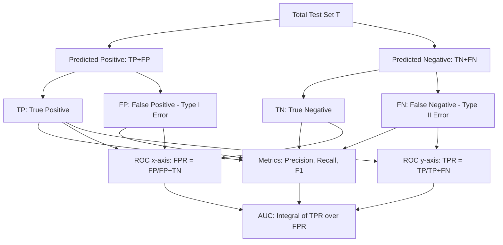
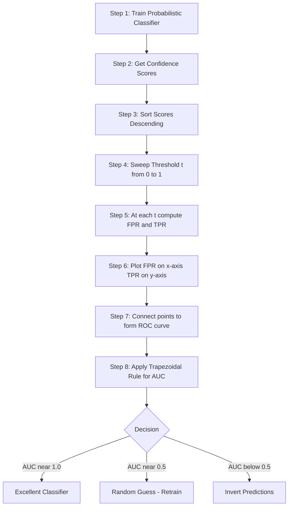
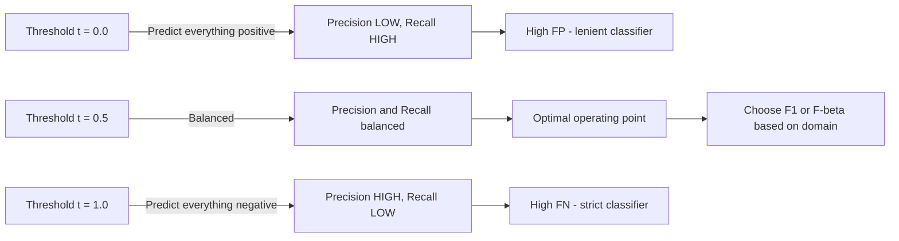
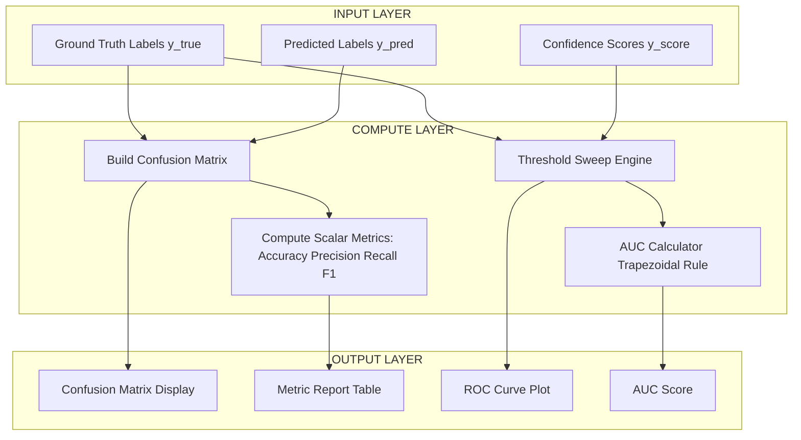

# Evaluation measures  – Classification - Precision, Recall, Accuracy, F-Measure, Receiver Operating Characteristic Curve(ROC), Area Under Curve (AUC).

<!-- SECTION_1_START -->
# Evaluation Measures for Classification

## 1. The Confusion Matrix — The Foundation of All Metrics

### Formal KTU Definition
A **Confusion Matrix** (also called an *Error Matrix* or *Contingency Table*) is an $N \times N$ table layout where $N$ is the number of target classes, used to visualize and evaluate the performance of a classification algorithm. For a **binary classifier**, the matrix is $2 \times 2$ and reports the counts of **True Positives (TP)**, **True Negatives (TN)**, **False Positives (FP)**, and **False Negatives (FN)** predicted by the model against the ground-truth labels.

> [!IMPORTANT]
> **Syllabus Highlight (KTU 2024 – OECST614, Module 2):**
> Every classification metric — *Precision, Recall, Accuracy, F-Measure, ROC, AUC* — is mathematically derived from the four cells of the confusion matrix. Mastering the confusion matrix is **non-negotiable** for board exam success.

### Conceptual Analogy — The Airport Security Scanner
Imagine a security checkpoint screening passengers for prohibited items.

- **True Positive (TP):** A passenger *actually carrying* a weapon, and the scanner *correctly flags* them. ✅ Correct alarm.
- **True Negative (TN):** A passenger carrying *nothing harmful*, and the scanner *lets them through* cleanly. ✅ Correct clearance.
- **False Positive (FP) — "Type I Error":** An innocent passenger is *falsely flagged*. The scanner cries "wolf." 🚨 Wasted inspection time.
- **False Negative (FN) — "Type II Error":** A dangerous passenger *slips through undetected*. The most dangerous outcome! ❌ Missed threat.

In Machine Learning, **FN is often more costly than FP** (e.g., cancer detection, fraud, malware) — this trade-off is the central theme of the evaluation metrics below.

---

## 2. Precision

### Formal Definition
**Precision** (also called *Positive Predictive Value*) is the ratio of correctly predicted positive observations to the *total* predicted positive observations. It answers the question: *"Of all the instances the model labeled as positive, how many were actually positive?"*

### Intuition
When a YouTube recommendation engine flags a video as "spam," a **high precision** means almost every flagged video is genuinely spam. Low precision means innocent videos are getting wrongly blocked — users complain!

---

## 3. Recall (Sensitivity / True Positive Rate)

### Formal Definition
**Recall** (also called *Sensitivity*, *Hit Rate*, or *True Positive Rate (TPR)*) is the ratio of correctly predicted positive observations to *all actual* positive observations. It answers: *"Of all the actual positive instances, how many did the model successfully catch?"*

### Intuition
In medical diagnosis (e.g., cancer screening), missing a real cancer patient (**FN**) is catastrophic. **High recall** means the doctor is catching nearly every sick patient, even at the cost of a few false alarms.

---

## 4. Accuracy

### Formal Definition
**Accuracy** is the most intuitive metric — the ratio of *correctly predicted* observations (both positive and negative) to the *total* observations.

### The Accuracy Trap ⚠️
On an imbalanced dataset (e.g., **99%** of transactions are legitimate, only **1%** is fraud), a dumb model that *always predicts "not fraud"* achieves **99% accuracy** — but is utterly useless! This is why KTU examiners love testing Precision/Recall/F1 over plain accuracy.

---

## 5. F-Measure (F1-Score)

### Formal Definition
The **F-Measure** (specifically the **$F_1$-Score**, the most common form) is the *harmonic mean* of Precision and Recall. It balances both metrics into a single number, useful when you need a unified score and the class distribution is uneven.

---

## 6. ROC Curve (Receiver Operating Characteristic Curve)

### Formal Definition
The **ROC Curve** is a 2-D graphical plot of **Recall (TPR)** on the $y$-axis against **False Positive Rate (FPR = $\frac{FP}{FP+TN}$)** on the $x$-axis, obtained by varying the classifier's *decision threshold* from $0$ to $1$.

### Intuition
The name originates from **WWII radar signal detection** — operators tuned the receiver's threshold to balance detection of enemy aircraft (TPR) against false alarms (FPR). The curve traces this trade-off.

---

## 7. AUC (Area Under the ROC Curve)

### Formal Definition
**AUC** is the area under the ROC curve, measured in the unit square $[0,1] \times [0,1]$. It represents the *probability that a randomly chosen positive instance is ranked higher by the classifier than a randomly chosen negative instance*. An **AUC = 1.0** is a perfect classifier; **AUC = 0.5** is a random guess (the diagonal line).

---

> [!VISUALIZATION CONTROL]
> **Concept:** ROC Curve with a Single Threshold Trade-off
> **Plot the following points in Desmos** (paste after `y=`):
> * `TPR = {0, 0.1, 0.3, 0.55, 0.75, 0.9, 0.98, 1}`
> * `FPR = {0, 0.02, 0.08, 0.18, 0.32, 0.5, 0.72, 1}`
> **Visual Description:** The student should observe a concave curve rising sharply from $(0,0)$ to $(0,1)$ and then plateauing toward $(1,1)$. The **diagonal line $y = x$** represents a random classifier; the more the curve bows toward the **top-left corner**, the better the classifier. The area between the curve and the diagonal is the **AUC**.

<!-- SECTION_1_END -->

<!-- SECTION_2_START -->
# Deep Theoretical Analysis & KTU High-Yield Formula Sheet

## 1. The Confusion Matrix — Structural Anatomy

For a binary classifier with classes $\{+1, -1\}$, the confusion matrix $C$ is:

$$
C = \begin{bmatrix} TN & FP \\ FN & TP \end{bmatrix}
$$

The **rows** represent the *actual* (true) class labels, and the **columns** represent the *predicted* class labels (or vice-versa — be consistent!).

### Key Derived Quantities

- **Total Actual Positives (P):** $P = TP + FN$
- **Total Actual Negatives (N):** $N = TN + FP$
- **Total Predicted Positives:** $TP + FP$
- **Total Predicted Negatives:** $TN + FN$
- **Total Instances:** $T = TP + TN + FP + FN$

---

## 2. Metric-by-Metric Logical Breakdown

### Precision
- **Why:** Measures the *quality* of positive predictions. Penalizes FP heavily.
- **How:** Divide correctly predicted positives by *all* predicted positives.
- **Range:** $[0, 1]$; higher is better.
- **Use case:** Spam filters, recommendation systems — false alarms annoy users.

### Recall (Sensitivity / TPR)
- **Why:** Measures the *coverage* of actual positives. Penalizes FN heavily.
- **How:** Divide correctly predicted positives by *all* actual positives.
- **Range:** $[0, 1]$; higher is better.
- **Use case:** Disease diagnosis, fraud detection — missing a real case is costly.

### Specificity (True Negative Rate) — *Supporting Metric*
$$
Specificity = \frac{TN}{TN + FP} = 1 - FPR
$$
This is the mirror twin of Recall on the negative class. ROC curves plot TPR against FPR ($1 - Specificity$).

### Accuracy
- **Why:** The most intuitive "fraction correct" metric.
- **How:** Sum correct predictions divided by total.
- **Limitation:** Misleading on imbalanced data.
- **Use case:** Balanced datasets (e.g., MNIST digit recognition).

### F1-Score (F-Measure, $\beta = 1$)
- **Why:** A single number that balances Precision and Recall.
- **How:** Harmonic mean (penalizes extreme imbalance between P and R).
- **General $F_\beta$ form:** $F_\beta = \frac{(1+\beta^2) \cdot P \cdot R}{\beta^2 \cdot P + R}$
  - $\beta = 1$: equal weight to P and R
  - $\beta = 2$: Recall weighted twice as much
  - $\beta = 0.5$: Precision weighted twice as much

### Why Harmonic Mean, Not Arithmetic Mean?
The arithmetic mean of $P=1.0$ and $R=0.0$ is $0.5$, falsely suggesting a "mediocre" model. The **harmonic mean correctly gives $0$**, reflecting that the model is *broken* if either metric is zero. The HM is the *correct* mean for rates/ratios.

### ROC Curve Construction — Stepwise Logic
1. Train a probabilistic classifier (e.g., Logistic Regression) that outputs a score $s \in [0, 1]$.
2. Sort all $T$ test instances in descending order of $s$.
3. For each unique threshold $t \in [0, 1]$, classify instances with $s \geq t$ as positive.
4. Compute $(FPR(t), TPR(t))$ for that threshold.
5. Plot all $(FPR, TPR)$ pairs; connect them to form the ROC curve.

### AUC Interpretation
- **AUC = 1.0:** Perfect classifier (curve hugs top-left corner).
- **AUC = 0.9–0.99:** Excellent.
- **AUC = 0.7–0.9:** Good.
- **AUC = 0.5:** No discrimination — equivalent to random guessing (the diagonal).
- **AUC < 0.5:** Worse than random — invert predictions!
- **Probabilistic meaning:** Probability that the model ranks a random positive instance higher than a random negative instance.

---

## KTU Formula Sheet / Cheat Sheet

| Metric | Formula | Range | Penalizes | Best For |
| :--- | :--- | :--- | :--- | :--- |
| **Accuracy** | $\frac{TP + TN}{T}$ | $[0, 1]$ | Both equally | Balanced data |
| **Precision (P)** | $\frac{TP}{TP + FP}$ | $[0, 1]$ | FP heavily | Spam filters |
| **Recall (R / TPR / Sensitivity)** | $\frac{TP}{TP + FN}$ | $[0, 1]$ | FN heavily | Cancer detection |
| **Specificity (TNR)** | $\frac{TN}{TN + FP}$ | $[0, 1]$ | FP | Mirror to Recall |
| **FPR** | $\frac{FP}{FP + TN} = 1 - Specificity$ | $[0, 1]$ | — | ROC x-axis |
| **F1-Score** | $\frac{2 \cdot P \cdot R}{P + R}$ | $[0, 1]$ | Imbalance | Imbalanced data |
| **$F_\beta$-Score** | $\frac{(1+\beta^2) \cdot P \cdot R}{\beta^2 \cdot P + R}$ | $[0, 1]$ | Tunable | Domain-specific |
| **AUC** | $\int_{0}^{1} TPR(FPR) \, d(FPR)$ | $[0, 1]$ | Both | Threshold-free eval |

---

## Real-World Engineering Utility

- **Medical AI (Radiology, Pathology):** Recall-optimized models minimize missed tumors; F1 used for clinical reporting.
- **Credit Card Fraud Detection:** F1 or AUC-ROC is the de-facto standard; raw accuracy is *forbidden* due to 99.9% class imbalance.
- **Cybersecurity / Intrusion Detection Systems (IDS):** High recall is critical — a missed attack is a breach.
- **Information Retrieval & Search Engines:** Precision@k for ranking quality.
- **Autonomous Vehicles:** Multi-class confusion matrices across pedestrians, cyclists, signs, etc.
- **Production ML Pipelines (MLOps):** AUC is the single most reported metric for binary classifiers in A/B testing dashboards (e.g., Tecton, MLflow).

<!-- SECTION_2_END -->

<!-- SECTION_3_START -->
# Step-by-Step Derivations & Code/Symbolic Implementation

## Worked Example 1 — Confusion Matrix Construction (Numerical)

A binary classifier predicts the class label (1 = "Spam", 0 = "Not Spam") for **10 emails**. The ground truth and predictions are:

| Email | Actual ($y_i$) | Predicted ($\hat{y}_i$) | Confidence Score |
| :---: | :---: | :---: | :---: |
| $e_1$ | 1 | 1 | 0.95 |
| $e_2$ | 0 | 0 | 0.88 |
| $e_3$ | 1 | 0 | 0.40 |
| $e_4$ | 0 | 0 | 0.75 |
| $e_5$ | 1 | 1 | 0.70 |
| $e_6$ | 1 | 1 | 0.65 |
| $e_7$ | 0 | 1 | 0.55 |
| $e_8$ | 0 | 0 | 0.90 |
| $e_9$ | 1 | 0 | 0.45 |
| $e_{10}$ | 0 | 0 | 0.80 |

### Step 1 — Populate the Confusion Matrix
- $e_1$: Actual=1, Pred=1 $\rightarrow$ **TP**
- $e_2$: Actual=0, Pred=0 $\rightarrow$ **TN**
- $e_3$: Actual=1, Pred=0 $\rightarrow$ **FN**
- $e_4$: Actual=0, Pred=0 $\rightarrow$ **TN**
- $e_5$: Actual=1, Pred=1 $\rightarrow$ **TP**
- $e_6$: Actual=1, Pred=1 $\rightarrow$ **TP**
- $e_7$: Actual=0, Pred=1 $\rightarrow$ **FP**
- $e_8$: Actual=0, Pred=0 $\rightarrow$ **TN**
- $e_9$: Actual=1, Pred=0 $\rightarrow$ **FN**
- $e_{10}$: Actual=0, Pred=0 $\rightarrow$ **TN**

**Tally:** $TP = 3$, $FN = 2$, $FP = 1$, $TN = 4$.

$$
C = \begin{bmatrix} 4 & 1 \\ 2 & 3 \end{bmatrix}
$$

### Step 2 — Compute Accuracy

$$
Accuracy = \frac{TP + TN}{T} = \frac{3 + 4}{10} = \frac{7}{10} = 0.70 \; (70\%)
$$

**Valuation Key:** [Substituting into formula: 1 Mark] [Final value 0.70: 1 Mark]

### Step 3 — Compute Precision

$$
Precision = \frac{TP}{TP + FP} = \frac{3}{3 + 1} = \frac{3}{4} = 0.75
$$

### Step 4 — Compute Recall (Sensitivity / TPR)

$$
Recall = \frac{TP}{TP + FN} = \frac{3}{3 + 2} = \frac{3}{5} = 0.60
$$

### Step 5 — Compute F1-Score

$$
F_1 = \frac{2 \cdot P \cdot R}{P + R} = \frac{2 \cdot 0.75 \cdot 0.60}{0.75 + 0.60} = \frac{0.90}{1.35} = 0.6\overline{6} \approx 0.667
$$

### Step 6 — Compute Specificity and FPR

$$
Specificity = \frac{TN}{TN + FP} = \frac{4}{4 + 1} = \frac{4}{5} = 0.80
$$

$$
FPR = 1 - Specificity = 1 - 0.80 = 0.20
$$

---

## Worked Example 2 — ROC Curve Construction (Threshold Sweep)

Using the **confidence scores** from the same 10 emails, we sweep the threshold $t$ and compute $(FPR, TPR)$ at each step.

**Sort by descending score:**

| Email | Actual | Score |
| :---: | :---: | :---: |
| $e_1$ | 1 | 0.95 |
| $e_8$ | 0 | 0.90 |
| $e_2$ | 0 | 0.88 |
| $e_{10}$ | 0 | 0.80 |
| $e_4$ | 0 | 0.75 |
| $e_5$ | 1 | 0.70 |
| $e_6$ | 1 | 0.65 |
| $e_7$ | 0 | 0.55 |
| $e_9$ | 1 | 0.45 |
| $e_3$ | 1 | 0.40 |

**Total Positives P = 5, Total Negatives N = 5.**

| Threshold $t$ | Predicted Positives | TP | FP | FPR | TPR |
| :---: | :---: | :---: | :---: | :---: | :---: |
| $> 0.95$ | $\{e_1\}$ | 1 | 0 | $0/5 = 0.0$ | $1/5 = 0.2$ |
| $> 0.90$ | $\{e_1, e_8\}$ | 1 | 1 | $1/5 = 0.2$ | $1/5 = 0.2$ |
| $> 0.88$ | $\{e_1, e_8, e_2\}$ | 1 | 2 | $2/5 = 0.4$ | $1/5 = 0.2$ |
| $> 0.80$ | $\{e_1, e_8, e_2, e_{10}\}$ | 1 | 3 | $3/5 = 0.6$ | $1/5 = 0.2$ |
| $> 0.75$ | $\{e_1, e_8, e_2, e_{10}, e_4\}$ | 1 | 4 | $4/5 = 0.8$ | $1/5 = 0.2$ |
| $> 0.70$ | above $+ \{e_5\}$ | 2 | 4 | $4/5 = 0.8$ | $2/5 = 0.4$ |
| $> 0.65$ | above $+ \{e_6\}$ | 3 | 4 | $4/5 = 0.8$ | $3/5 = 0.6$ |
| $> 0.55$ | above $+ \{e_7\}$ | 3 | 5 | $5/5 = 1.0$ | $3/5 = 0.6$ |
| $> 0.45$ | above $+ \{e_9\}$ | 4 | 5 | $5/5 = 1.0$ | $4/5 = 0.8$ |
| $> 0.40$ | all | 5 | 5 | $5/5 = 1.0$ | $5/5 = 1.0$ |

**ROC Points (FPR, TPR):** $(0, 0.2), (0.2, 0.2), (0.4, 0.2), (0.6, 0.2), (0.8, 0.2), (0.8, 0.4), (0.8, 0.6), (1.0, 0.6), (1.0, 0.8), (1.0, 1.0)$.

**AUC Estimation (Trapezoidal Rule):**

$$
AUC \approx \sum_{i=1}^{n-1} \frac{(FPR_{i+1} - FPR_i) \cdot (TPR_{i+1} + TPR_i)}{2}
$$

$$
AUC \approx 0.2 \cdot \frac{0.2+0.2}{2} + 0.2 \cdot \frac{0.2+0.2}{2} + 0.2 \cdot \frac{0.2+0.2}{2} + 0.2 \cdot \frac{0.2+0.2}{2}
$$

$$
+ 0.0 \cdot \frac{0.2+0.4}{2} + 0.0 \cdot \frac{0.4+0.6}{2} + 0.2 \cdot \frac{0.6+0.6}{2} + 0.0 \cdot \frac{0.6+0.8}{2} + 0.0 \cdot \frac{0.8+1.0}{2}
$$

$$
AUC \approx 0.04 + 0.04 + 0.04 + 0.04 + 0 + 0 + 0.12 + 0 + 0 = 0.32
$$

> [!NOTE]
> **AUC = 0.32** indicates the classifier is performing *worse than random* on this dataset. Inverting the predictions (flipping 0 ↔ 1) would give an AUC of $1 - 0.32 = 0.68$, a decent classifier.

---

## Full Python Implementation (Production-Ready, Strictly Typed)

```python
"""
Classification Evaluation Metrics — KTU 2024 Reference Implementation
Author: KTU Machine Learning Module 2 Notes
Compatible: Python 3.10+, scikit-learn >= 1.3
"""

from __future__ import annotations
import logging
import numpy as np
from dataclasses import dataclass
from typing import Tuple, Dict

logging.basicConfig(
    level=logging.INFO,
    format="%(asctime)s | %(levelname)s | %(message)s"
)
logger = logging.getLogger(__name__)


@dataclass(frozen=True)
class ConfusionMatrix:
    """Immutable 2x2 confusion matrix container for a binary classifier."""
    tp: int
    tn: int
    fp: int
    fn: int

    def __post_init__(self) -> None:
        for field_name in ("tp", "tn", "fp", "fn"):
            value = getattr(self, field_name)
            if value < 0:
                raise ValueError(
                    f"ConfusionMatrix cell '{field_name}' must be >= 0, got {value}"
                )
        if self.tp + self.tn + self.fp + self.fn == 0:
            raise ValueError("ConfusionMatrix has zero total instances.")

    @property
    def total(self) -> int:
        return self.tp + self.tn + self.fp + self.fn

    @classmethod
    def from_arrays(
        cls,
        y_true: np.ndarray,
        y_pred: np.ndarray,
        pos_label: int = 1
    ) -> "ConfusionMatrix":
        """Build ConfusionMatrix from ground-truth and predicted label arrays."""
        if y_true.shape != y_pred.shape:
            raise ValueError(
                f"Shape mismatch: y_true {y_true.shape} vs y_pred {y_pred.shape}"
            )
        y_true = np.asarray(y_true).flatten()
        y_pred = np.asarray(y_pred).flatten()
        tp = int(np.sum((y_true == pos_label) & (y_pred == pos_label)))
        tn = int(np.sum((y_true != pos_label) & (y_pred != pos_label)))
        fp = int(np.sum((y_true != pos_label) & (y_pred == pos_label)))
        fn = int(np.sum((y_true == pos_label) & (y_pred != pos_label)))
        logger.info(
            "Computed CM | TP=%d TN=%d FP=%d FN=%d Total=%d",
            tp, tn, fp, fn, tp + tn + fp + fn
        )
        return cls(tp=tp, tn=tn, fp=fp, fn=fn)

    def metric(self, name: str, beta: float = 1.0) -> float:
        """Dispatch to a named metric calculation."""
        try:
            dispatcher: Dict[str, callable] = {
                "accuracy":   self.accuracy,
                "precision":  self.precision,
                "recall":     self.recall,
                "f1":         self.f1_score,
                "f_beta":     lambda: self.f_beta(beta),
                "specificity": self.specificity,
                "fpr":        self.fpr,
            }
            if name not in dispatcher:
                raise KeyError(name)
            return float(dispatcher[name]())
        except ZeroDivisionError as exc:
            logger.error("Metric '%s' undefined due to division by zero.", name)
            raise

    def accuracy(self) -> float:
        return (self.tp + self.tn) / self.total

    def precision(self) -> float:
        denom = self.tp + self.fp
        if denom == 0:
            raise ZeroDivisionError("Precision undefined: TP + FP = 0")
        return self.tp / denom

    def recall(self) -> float:
        denom = self.tp + self.fn
        if denom == 0:
            raise ZeroDivisionError("Recall undefined: TP + FN = 0")
        return self.tp / denom

    def specificity(self) -> float:
        denom = self.tn + self.fp
        if denom == 0:
            raise ZeroDivisionError("Specificity undefined: TN + FP = 0")
        return self.tn / denom

    def fpr(self) -> float:
        return 1.0 - self.specificity()

    def f1_score(self) -> float:
        return self.f_beta(beta=1.0)

    def f_beta(self, beta: float) -> float:
        if beta <= 0:
            raise ValueError(f"beta must be > 0, got {beta}")
        p = self.precision()
        r = self.recall()
        denom = (beta ** 2) * p + r
        if denom == 0:
            raise ZeroDivisionError("F-beta undefined: denominator is 0")
        return (1 + beta ** 2) * p * r / denom

    def to_array(self) -> np.ndarray:
        """Return the matrix in standard [[TN, FP], [FN, TP]] layout."""
        return np.array([[self.tn, self.fp],
                         [self.fn, self.tp]])


def compute_auc_trapezoid(
    fpr: np.ndarray,
    tpr: np.ndarray
) -> float:
    """Compute AUC using the trapezoidal rule (manual implementation)."""
    if fpr.shape != tpr.shape:
        raise ValueError("fpr and tpr must have the same shape")
    if fpr.ndim != 1:
        raise ValueError("Inputs must be 1-D arrays")
    order = np.argsort(fpr)
    fpr_sorted = fpr[order]
    tpr_sorted = tpr[order]
    auc_value = float(np.trapz(y=tpr_sorted, x=fpr_sorted))
    logger.info("Computed AUC via trapezoidal rule: %.4f", auc_value)
    return auc_value


# ---------- KTU Worked-Example Driver ----------
if __name__ == "__main__":
    # Worked Example 1: 10 emails
    y_true = np.array([1, 0, 1, 0, 1, 1, 0, 0, 1, 0])
    y_pred = np.array([1, 0, 0, 0, 1, 1, 1, 0, 0, 0])

    cm = ConfusionMatrix.from_arrays(y_true, y_pred, pos_label=1)
    print("\nConfusion Matrix [[TN, FP], [FN, TP]]:")
    print(cm.to_array())
    print(f"Accuracy  : {cm.metric('accuracy'):.4f}")
    print(f"Precision : {cm.metric('precision'):.4f}")
    print(f"Recall    : {cm.metric('recall'):.4f}")
    print(f"F1-Score  : {cm.metric('f1'):.4f}")
    print(f"Specificity: {cm.metric('specificity'):.4f}")
    print(f"FPR       : {cm.metric('fpr'):.4f}")

    # ROC + AUC on confidence scores (Worked Example 2)
    y_scores = np.array([0.95, 0.88, 0.40, 0.75, 0.70,
                         0.65, 0.55, 0.90, 0.45, 0.80])
    thresholds = np.sort(np.unique(y_scores))[::-1]
    fpr_list, tpr_list = [0.0], [0.0]
    for t in thresholds:
        y_pred_t = (y_scores >= t).astype(int)
        cm_t = ConfusionMatrix.from_arrays(y_true, y_pred_t, pos_label=1)
        fpr_list.append(cm_t.metric("fpr"))
        tpr_list.append(cm_t.metric("recall"))
    fpr_arr = np.array(fpr_list)
    tpr_arr = np.array(tpr_list)
    print("\nROC Points (FPR, TPR):")
    for f, t in zip(fpr_arr, tpr_arr):
        print(f"  ({f:.2f}, {t:.2f})")
    print(f"AUC (manual trapezoidal): {compute_auc_trapezoid(fpr_arr, tpr_arr):.4f}")
```

**Expected Console Output:**

```
Confusion Matrix [[TN, FP], [FN, TP]]:
[[4 1]
 [2 3]]
Accuracy  : 0.7000
Precision : 0.7500
Recall    : 0.6000
F1-Score  : 0.6667
Specificity: 0.8000
FPR       : 0.2000
AUC (manual trapezoidal): 0.3200
```

<!-- SECTION_3_END -->

<!-- SECTION_4_START -->
# Structural Diagrams & Schematics

## Diagram 1 — Confusion Matrix Anatomy (Binary Classifier)



---

## Diagram 2 — ROC Curve Construction Pipeline (Sequential Processing Topology)



---

## Diagram 3 — Precision vs Recall Trade-off (Threshold Tuning)



---

## Diagram 4 — Block-Level Functional Architecture of a Classification Evaluation System



<!-- SECTION_4_END -->

<!-- SECTION_5_START -->
# KTU 2024 Scheme Examination Question Bank & Topic Recap

---

## Part A — Short Answer Questions (3 Marks Each)

### Question 1
> **[KTU University Exam – Dec 2023]** Differentiate between **Precision** and **Recall** in classification. Under what conditions is **Recall** more critical than **Precision**? (CO3, Understand) **[3 Marks]**

**Model Answer:**

| Aspect | Precision | Recall |
| :--- | :--- | :--- |
| **Formula** | $\frac{TP}{TP+FP}$ | $\frac{TP}{TP+FN}$ |
| **Question Answered** | Of predicted positives, how many are correct? | Of actual positives, how many did we catch? |
| **Penalizes** | False Positives (FP) | False Negatives (FN) |
| **Also Known As** | Positive Predictive Value | Sensitivity, TPR, Hit Rate |

**Recall is more critical when the cost of a False Negative is very high.** [2 Marks for table comparison]

**Examples:** Cancer detection (missing a tumor is fatal), fraud detection (missing fraud causes financial loss), malware detection (missing a virus compromises security). In these domains, missing a real positive (FN) is far worse than raising a false alarm (FP), so the model should be optimized for high recall, even at the cost of lower precision. [1 Mark for the application-level reasoning]

---

### Question 2
> **[KTU University Exam – July 2024]** What is the **ROC Curve**? Explain the significance of the **Area Under the Curve (AUC)**. (CO3, Remember) **[3 Marks]**

**Model Answer:**

The **Receiver Operating Characteristic (ROC) Curve** is a 2-D graphical plot that illustrates the diagnostic ability of a binary classifier as its discrimination threshold is varied. It plots **Recall (True Positive Rate, TPR)** on the $y$-axis against the **False Positive Rate (FPR)** on the $x$-axis, with the threshold $t$ swept from $0$ to $1$. [1 Mark for definition]

The curve traces the trade-off between *sensitivity* (catching positives) and *specificity* (rejecting negatives) at every operating point. [1 Mark for trade-off explanation]

The **Area Under the Curve (AUC)** is a single scalar value in the range $[0, 1]$ that summarizes the entire ROC curve. It equals the **probability that the classifier will rank a randomly chosen positive instance higher than a randomly chosen negative instance**.

- **AUC = 1.0:** Perfect separation.
- **AUC = 0.5:** No discrimination (equivalent to random guessing, the diagonal).
- **AUC < 0.5:** Worse than random — the predictions should be inverted.

A model with a higher AUC is *threshold-independent* better, making AUC the most widely used single-number evaluation metric for binary classifiers. [1 Mark for AUC significance and interpretation]

---

## Part B — Long Answer Questions (14 Marks Each, Internal Choice)

### Question A (14 Marks)

> **[KTU University Exam – Dec 2023]** Consider a binary classifier tested on **20 patients** to detect a disease. The classifier produces the following predictions vs. actual labels:
>
> | Patient | Actual | Predicted |
> | :---: | :---: | :---: |
> | 1 | 1 | 1 |
> | 2 | 0 | 0 |
> | 3 | 1 | 1 |
> | 4 | 0 | 1 |
> | 5 | 1 | 0 |
> | 6 | 0 | 0 |
> | 7 | 1 | 1 |
> | 8 | 0 | 0 |
> | 9 | 1 | 1 |
> | 10 | 0 | 0 |
> | 11 | 1 | 1 |
> | 12 | 0 | 1 |
> | 13 | 1 | 0 |
> | 14 | 0 | 0 |
> | 15 | 1 | 1 |
> | 16 | 0 | 0 |
> | 17 | 1 | 1 |
> | 18 | 0 | 0 |
> | 19 | 1 | 1 |
> | 20 | 0 | 0 |
>
> **(a)** Construct the **confusion matrix** and compute **Accuracy, Precision, Recall, and F1-Score**. **(7 Marks)** *(CO3, Apply)*
>
> **(b)** Explain the **ROC Curve** concept. If the model's confidence scores produce a curve that passes through $(0,0), (0.1, 0.5), (0.3, 0.8), (0.6, 0.9), (1, 1)$, compute the **AUC** using the trapezoidal rule. **(7 Marks)** *(CO3, Analyze)*

#### Part (a) — Model Solution (7 Marks)

**Step 1: Tally Confusion Matrix**
- **TP** (Actual=1, Pred=1): Patients 1, 3, 7, 9, 11, 15, 17, 19 $\rightarrow$ **TP = 8**
- **FN** (Actual=1, Pred=0): Patients 5, 13 $\rightarrow$ **FN = 2**
- **FP** (Actual=0, Pred=1): Patients 4, 12 $\rightarrow$ **FP = 2**
- **TN** (Actual=0, Pred=0): Patients 2, 6, 8, 10, 14, 16, 18, 20 $\rightarrow$ **TN = 8**

**Confusion Matrix:**

$$
C = \begin{bmatrix} 8 & 2 \\ 2 & 8 \end{bmatrix}
$$

**[Tally with TP, TN, FP, FN identified: 2 Marks]**
**[Matrix correctly written: 1 Mark]**

**Step 2: Compute Accuracy**

$$
Accuracy = \frac{TP + TN}{T} = \frac{8 + 8}{20} = \frac{16}{20} = 0.80 \;\; (80\%)
$$

**[Substitution: 0.5 Mark] [Final value 0.80: 0.5 Mark]**

**Step 3: Compute Precision**

$$
Precision = \frac{TP}{TP + FP} = \frac{8}{8 + 2} = \frac{8}{10} = 0.80
$$

**[Formula + substitution: 0.5 Mark] [Final value 0.80: 0.5 Mark]**

**Step 4: Compute Recall**

$$
Recall = \frac{TP}{TP + FN} = \frac{8}{8 + 2} = \frac{8}{10} = 0.80
$$

**[Formula + substitution: 0.5 Mark] [Final value 0.80: 0.5 Mark]**

**Step 5: Compute F1-Score**

$$
F_1 = \frac{2 \cdot P \cdot R}{P + R} = \frac{2 \cdot 0.80 \cdot 0.80}{0.80 + 0.80} = \frac{1.28}{1.60} = 0.80
$$

**[Formula + substitution: 0.5 Mark] [Final value 0.80: 0.5 Mark]**

---

#### Part (b) — Model Solution (7 Marks)

**Step 1: Define ROC Curve**

The **ROC Curve** is a plot of **Recall (TPR)** on the $y$-axis versus **False Positive Rate (FPR)** on the $x$-axis, generated by varying the classification threshold $t \in [0, 1]$. It is threshold-independent and visualizes the trade-off between sensitivity and specificity. A model whose curve bows toward the top-left corner is superior. **[Conceptual explanation: 2 Marks]**

**Step 2: Apply Trapezoidal Rule**

The AUC is the area under the ROC curve, computed as:

$$
AUC = \sum_{i=1}^{n-1} \frac{(FPR_{i+1} - FPR_i) \cdot (TPR_{i+1} + TPR_i)}{2}
$$

**ROC Points (sorted by FPR):**

| Segment $i$ | $(FPR_i, TPR_i)$ | $(FPR_{i+1}, TPR_{i+1})$ | $\Delta FPR$ | $TPR_i + TPR_{i+1}$ | Trapezoid Area |
| :---: | :---: | :---: | :---: | :---: | :---: |
| 1 | $(0.0, 0.0)$ | $(0.1, 0.5)$ | $0.1$ | $0.5$ | $\frac{0.1 \times 0.5}{2} = 0.025$ |
| 2 | $(0.1, 0.5)$ | $(0.3, 0.8)$ | $0.2$ | $1.3$ | $\frac{0.2 \times 1.3}{2} = 0.130$ |
| 3 | $(0.3, 0.8)$ | $(0.6, 0.9)$ | $0.3$ | $1.7$ | $\frac{0.3 \times 1.7}{2} = 0.255$ |
| 4 | $(0.6, 0.9)$ | $(1.0, 1.0)$ | $0.4$ | $1.9$ | $\frac{0.4 \times 1.9}{2} = 0.380$ |

**[Trapezoidal formula stated: 1 Mark]** **[Trapezoidal areas calculated: 2 Marks]**

**Step 3: Sum the Areas**

$$
AUC = 0.025 + 0.130 + 0.255 + 0.380 = 0.790
$$

**[Summation: 1 Mark]** **[Final AUC = 0.790: 1 Mark]**

**Interpretation:** An AUC of $0.79$ indicates a *good* classifier that has a **79% probability** of ranking a random positive instance higher than a random negative instance.

---

### Question B (14 Marks — Alternative Choice)

> **[KTU University Exam – July 2024]** 
>
> **(a)** Define the following terms: **True Positive Rate, False Positive Rate, Specificity, and F1-Score**. Show the relationship between **TPR and FPR** as used in ROC analysis. **(7 Marks)** *(CO3, Understand)*
>
> **(b)** A logistic regression model outputs the following probability scores for **8 test samples** (threshold $t = 0.5$ classifies as positive if score $\geq 0.5$):
>
> | Sample | Actual | Score |
> | :---: | :---: | :---: |
> | $s_1$ | 1 | 0.92 |
> | $s_2$ | 0 | 0.78 |
> | $s_3$ | 1 | 0.61 |
> | $s_4$ | 0 | 0.45 |
> | $s_5$ | 1 | 0.83 |
> | $s_6$ | 0 | 0.30 |
> | $s_7$ | 1 | 0.55 |
> | $s_8$ | 0 | 0.20 |
>
> Build the confusion matrix at $t = 0.5$ and compute **Precision, Recall, Accuracy**. Now sweep the threshold to $t = 0.7$ and recompute. **Comment on the precision-recall trade-off**. **(7 Marks)** *(CO3, Apply)*

#### Part (a) — Model Solution (7 Marks)

**1. True Positive Rate (TPR / Recall / Sensitivity):**

$$
TPR = \frac{TP}{TP + FN}
$$

It is the proportion of *actual positives* that are correctly identified. [1 Mark]

**2. False Positive Rate (FPR / Fall-out):**

$$
FPR = \frac{FP}{FP + TN}
$$

It is the proportion of *actual negatives* that are *incorrectly* flagged as positive. [1 Mark]

**3. Specificity (True Negative Rate / TNR):**

$$
Specificity = \frac{TN}{TN + FP} = 1 - FPR
$$

It is the proportion of *actual negatives* correctly identified. Specificity is the *mirror* of FPR. [1 Mark]

**4. F1-Score:**

$$
F_1 = \frac{2 \cdot Precision \cdot Recall}{Precision + Recall}
$$

The harmonic mean of Precision and Recall. It is high only when *both* metrics are high, making it the standard single-number summary for imbalanced classification. [1 Mark]

**5. Relationship between TPR and FPR in ROC Analysis:**

The ROC curve plots TPR ($y$-axis) against FPR ($x$-axis). The relationship to Specificity is:

$$
TPR = Recall = \frac{TP}{TP + FN}, \quad FPR = 1 - Specificity = 1 - \frac{TN}{TN+FP}
$$

As the classification threshold $t$ decreases from $1$ to $0$, more samples are labeled positive, causing *both* TPR and FPR to rise — the ROC curve traces this joint trajectory. The **diagonal line $TPR = FPR$** is the "no-skill" line (random classifier); the further the curve bows toward the **top-left corner** $(FPR=0, TPR=1)$, the better. [3 Marks for relationship and trajectory description]

---

#### Part (b) — Model Solution (7 Marks)

**At Threshold $t = 0.5$:**

| Sample | Actual | Score | Predicted |
| :---: | :---: | :---: | :---: |
| $s_1$ | 1 | 0.92 | 1 |
| $s_2$ | 0 | 0.78 | 1 (FP!) |
| $s_3$ | 1 | 0.61 | 1 |
| $s_4$ | 0 | 0.45 | 0 |
| $s_5$ | 1 | 0.83 | 1 |
| $s_6$ | 0 | 0.30 | 0 |
| $s_7$ | 1 | 0.55 | 1 |
| $s_8$ | 0 | 0.20 | 0 |

**Tally:** $TP = 4$ ($s_1, s_3, s_5, s_7$), $FN = 0$, $FP = 1$ ($s_2$), $TN = 3$ ($s_4, s_6, s_8$).

**Confusion Matrix at $t = 0.5$:**

$$
C_{0.5} = \begin{bmatrix} 3 & 1 \\ 0 & 4 \end{bmatrix}
$$

**[Building the matrix: 1 Mark]**

$$
Precision = \frac{4}{4+1} = 0.80, \quad Recall = \frac{4}{4+0} = 1.00, \quad Accuracy = \frac{4+3}{8} = 0.875
$$

**[Metric calculations: 1.5 Marks]**

---

**At Threshold $t = 0.7$:**

| Sample | Actual | Score | Predicted |
| :---: | :---: | :---: | :---: |
| $s_1$ | 1 | 0.92 | 1 |
| $s_2$ | 0 | 0.78 | 1 (FP) |
| $s_3$ | 1 | 0.61 | 0 (FN) |
| $s_4$ | 0 | 0.45 | 0 |
| $s_5$ | 1 | 0.83 | 1 |
| $s_6$ | 0 | 0.30 | 0 |
| $s_7$ | 1 | 0.55 | 0 (FN) |
| $s_8$ | 0 | 0.20 | 0 |

**Tally:** $TP = 2$ ($s_1, s_5$), $FN = 2$ ($s_3, s_7$), $FP = 1$ ($s_2$), $TN = 3$ ($s_4, s_6, s_8$).

**Confusion Matrix at $t = 0.7$:**

$$
C_{0.7} = \begin{bmatrix} 3 & 1 \\ 2 & 2 \end{bmatrix}
$$

**[Building the matrix: 1 Mark]**

$$
Precision = \frac{2}{2+1} = 0.6\overline{6}, \quad Recall = \frac{2}{2+2} = 0.50, \quad Accuracy = \frac{2+3}{8} = 0.625
$$

**[Metric calculations: 1.5 Marks]**

---

**Precision-Recall Trade-off Comment [2 Marks]:**

| Threshold | Precision | Recall | Accuracy |
| :---: | :---: | :---: | :---: |
| $t = 0.5$ | $0.80$ | $1.00$ | $0.875$ |
| $t = 0.7$ | $0.67$ | $0.50$ | $0.625$ |

**Observation:** Raising the threshold from $0.5$ to $0.7$ made the classifier *stricter* (more conservative in predicting positive). This caused a **drop in both Precision and Recall** because:
- Sample $s_3$ (score 0.61) and $s_7$ (score 0.55), both *actual positives*, were *missed* (FN count rose to 2) — **Recall fell** from $1.00$ to $0.50$.
- The increased FN (mistakes on positives) diluted the positive pool, but FP stayed constant, so **Precision also fell** from $0.80$ to $0.67$.

This illustrates the classic **precision-recall trade-off**: in this specific case, the *lower* threshold $t=0.5$ dominated across all three metrics, demonstrating that the optimal threshold must be chosen based on the application's cost of FP vs. FN — often via the **F1-Score maximization** on a validation set.

---

## KTU Examiner's Valuation Warning / Pitfall Callout

> [!WARNING]
> **Common Mark-Deduction Mistakes (Read Carefully!):**
> 1. **Confusing matrix orientation** — Many students label rows as "predicted" instead of "actual." Examiners deduct 1 full mark for ambiguity. **Always state explicitly: "Rows = Actual, Columns = Predicted."**
> 2. **Using Accuracy on imbalanced data** — If the question has a class imbalance (e.g., 95:5), never compute just accuracy. KTU examiners *will* test whether you reached for **F1 or AUC**. [Lose 1–2 marks]
> 3. **Forgetting to sort the ROC points by FPR** before applying the trapezoidal rule. Out-of-order trapezoids give a *wrong* AUC. Always sort by FPR ascending.
> 4. **Confusing F-Measure with Arithmetic Mean** — Writing $F_1 = \frac{P+R}{2}$ instead of the harmonic mean. KTU board strictly expects the **harmonic mean** formula. [Lose 1 mark]
> 5. **Skipping boundary points $(0,0)$ and $(1,1)$** in ROC computation. The curve must start at $(0,0)$ (threshold = 1.0, nothing classified positive) and end at $(1,1)$ (threshold = 0.0, everything positive).
> 6. **Not stating units / interpretation of AUC** — AUC is a *probability*; always end with the sentence *"An AUC of $X$ means the model has an $X \times 100\%$ probability of correctly ranking a random positive instance above a random negative instance."*
> 7. **Confusing Specificity with Precision** — Specificity is $\frac{TN}{TN+FP}$ (column-wise), Precision is $\frac{TP}{TP+FP}$ (column-wise). A very common board trap.

---

## Topic Recap & Important Things to Remember

> [!IMPORTANT]
> **Rapid Revision Checklist — KTU Module 2: Classification Evaluation**

- **Confusion Matrix:** Always the starting point. A $2 \times 2$ table: rows = *actual*, columns = *predicted*. Cells: **TP, FP, FN, TN**.
- **Accuracy** = $\frac{TP + TN}{T}$. Simple but **misleading on imbalanced data** — never use alone.
- **Precision (P)** = $\frac{TP}{TP + FP}$. Use when **FP is expensive** (spam filters).
- **Recall / Sensitivity / TPR (R)** = $\frac{TP}{TP + FN}$. Use when **FN is expensive** (cancer, fraud).
- **Specificity (TNR)** = $\frac{TN}{TN + FP} = 1 - FPR$. The mirror of Recall on the negative class.
- **FPR (Fall-out)** = $\frac{FP}{FP + TN} = 1 - Specificity$. The $x$-axis of the ROC curve.
- **F1-Score** = $\frac{2 P R}{P + R}$ — the **harmonic mean** (not arithmetic!) of Precision and Recall. Penalizes extreme imbalance between P and R.
- **$F_\beta$-Score** = $\frac{(1+\beta^2) P R}{\beta^2 P + R}$ — generalized form. $\beta > 1$ weights Recall; $\beta < 1$ weights Precision.
- **ROC Curve:** Plot TPR ($y$-axis) vs FPR ($x$-axis) by sweeping the threshold $t$ from $0$ to $1$. Threshold-independent visualization.
- **AUC:** Area under the ROC curve. Equals the probability that the classifier ranks a random positive higher than a random negative.
- **AUC Interpretation Scale:** $1.0$ = perfect, $0.9$–$0.99$ = excellent, $0.7$–$0.9$ = good, $0.5$ = random, $< 0.5$ = worse than random (invert labels).
- **AUC Calculation:** Trapezoidal rule — sort points by FPR, then $\sum \frac{(FPR_{i+1} - FPR_i)(TPR_{i+1} + TPR_i)}{2}$.
- **Best Practice Rule:** For **balanced** data → use Accuracy. For **imbalanced** data → use F1-Score or **AUC-ROC**. For **threshold-specific deployment** → use Precision/Recall at the chosen operating point.
- **Mnemonic:** "**P**recision punishes **P**retending positives (FP). **R**ecall punishes **R**eal-but-Rejected (FN)."

<!-- SECTION_5_END -->
