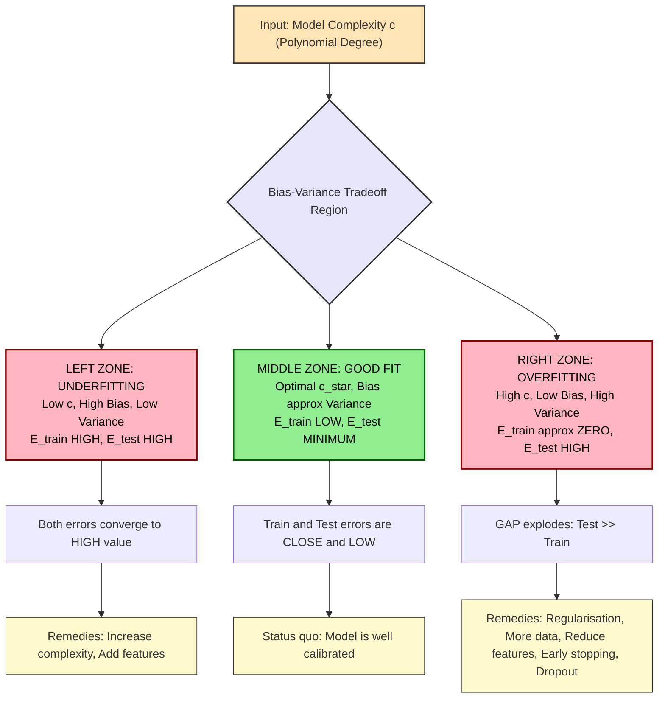
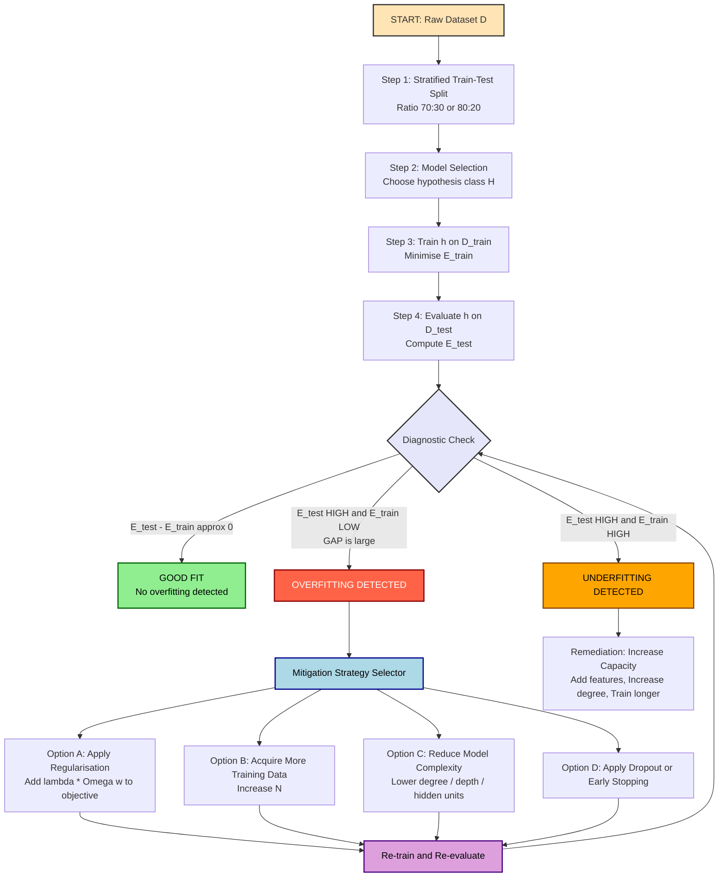
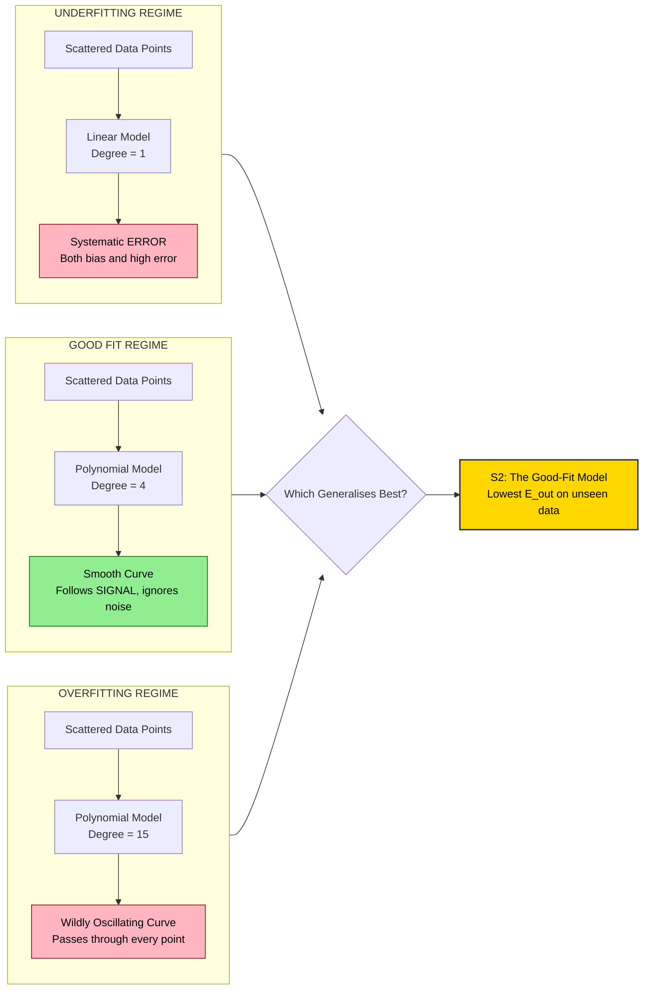

# Generalisation and Overfitting  - Idea of overfitting

<!-- SECTION_1_START -->

# Generalisation and Overfitting — The Idea of Overfitting

## 📘 Core Technical Definition (KTU 2024 Syllabus Terminology)

> [!NOTE]
> **Overfitting** is a fundamental modelling pathology in supervised Machine Learning wherein a learned hypothesis $h \in \mathcal{H}$ captures not only the true underlying signal of the training distribution $\mathcal{D}_{train}$, but also the idiosyncratic noise, outliers, and random fluctuations present in the finite sample. The model exhibits **low training error** but suffers from a **high generalisation error** when evaluated on unseen data drawn from the same underlying distribution $P(X, Y)$.

Formally, given a hypothesis class $\mathcal{H}$ and a true target function $f : \mathcal{X} \rightarrow \mathcal{Y}$:

$$\underbrace{E_{train}(h)}_{\text{Empirical Risk}} \;\ll\; \underbrace{E_{out}(h)}_{\text{True Generalisation Error}} \quad \text{when } h \text{ is overfit}$$

Where:

$$E_{out}(h) \;=\; \mathbb{E}_{(x,y)\sim P}\big[\,L\big(h(x),\, y\big)\,\big]$$

> [!IMPORTANT]
> **Generalisation** is the capacity of a trained model to maintain low prediction error on **previously unseen samples** drawn from the same data-generating distribution. Overfitting is the **direct adversary** of generalisation — it represents the failure mode where the model memorises rather than learns the underlying pattern.

---

## 🧠 Conceptual Analogy / Intuition

Imagine you are a **B.Tech student preparing for the KTU University Exam** by studying from a single specific year's question paper (say, *December 2023*) and memorising every question and its exact answer word-for-word.

| Scenario | Analogy Mapping |
|:---|:---|
| **Student memorises only Dec 2023 paper answers** | Model memorises training data |
| **Performs brilliantly on Dec 2023 retest** | Low training error |
| **Fails on July 2024 paper (different questions, same subject)** | High test/validation error |
| **Student studies concepts + solves varied problems** | Generalised model with low test error |
| **Student barely studies at all** | Underfit model with high error everywhere |

> [!TIP]
> **Memorisation ≠ Learning.** A model (or a student) that memorises the training set is *not* learning the underlying function — it is merely storing examples. True learning means extracting the **general principle** that can be applied to *new, never-before-seen* instances.

---

## 🎯 The Three Regimes of Model Fit

For any supervised learning problem, the relationship between model **complexity** (or **capacity**) and prediction error follows a canonical U-shaped pattern:

| Regime | Training Error | Test Error | Bias | Variance | Symptom |
|:---|:---:|:---:|:---:|:---:|:---|
| **Underfitting** (High Bias) | High | High | High | Low | Model too simple to capture pattern |
| **Good Fit** (Sweet Spot) | Low | Low | Moderate | Moderate | Captures signal, ignores noise |
| **Overfitting** (High Variance) | Very Low | High | Low | High | Model captures noise as if it were signal |

Where **complexity** may be quantified as the degree of a polynomial, the depth of a decision tree, the number of hidden units in a neural network, or the value of the regularisation parameter $\lambda^{-1}$.

---

## 🖼️ GeoGebra / Desmos Visualisation Callout

> [!VISUALIZATION CONTROL]
> **Concept:** Model complexity vs. Training and Test error curves (the canonical learning curve diagnostic)
>
> **GeoGebra / Desmos Input Equations:**
> * `f(x) = 0.8 * exp(-((x-3)^2)/0.3) + 0.5 * exp(-((x-7)^2)/0.8)` → True underlying signal
> * `TrainError(c) = 0.05 + 1.8 / c` → Monotonically decreasing red curve
> * `TestError(c) = 0.05 + 1.8 / c + 0.015 * (c - 4)^2` → U-shaped blue curve
> * `SweetSpot: c = 4` → Vertical green line marking the minimum of $TestError$
>
> **Visual Description:** On the x-axis place model complexity $c \in [1, 15]$. The red training-error curve should **monotonically decrease** toward zero. The blue test-error curve should form a **convex U-shape** that reaches its minimum at the green vertical line, then rises steeply. The region **right of the green line** is the **overfitting zone**.

<!-- SECTION_1_END -->

<!-- SECTION_2_START -->

# Deep Theoretical Analysis & KTU High-Yield Formula Sheet

## 🔬 The Theoretical Anatomy of Overfitting

### 1. Root Causes of Overfitting

An overfitting condition can arise from any combination of the following structural sources:

* **Excessive Model Capacity (High $VC$ Dimension):** The hypothesis class $\mathcal{H}$ is so expressive that it can shatter the training set into arbitrary label assignments. For example, a **1000-degree polynomial** fit to 100 data points will pass through every point exactly, but oscillate wildly between them.
* **Insufficient Training Data ($N$ too small):** The empirical risk $E_{train}$ is a poor Monte-Carlo estimator of the true risk $E_{out}$ when the sample size is small, leading the optimiser to exploit noise patterns.
* **Presence of Noise in Labels ($\sigma^2 > 0$):** When target labels contain irreducible noise $\epsilon \sim \mathcal{N}(0, \sigma^2)$, any model that perfectly fits the training labels is necessarily fitting some of the noise.
* **Excessive Training Epochs (Iterative Learning):** Gradient-based optimisers, when run for too many iterations, can iteratively reduce $E_{train}$ below the noise floor.
* **Feature Engineering Leakage / Curated Features:** Spurious correlations in the training set (e.g., "all photos of cats in the dataset have a watermark") get encoded as decision rules.

### 2. The Bias-Variance Decomposition (KTU Favourite)

For **regression** with squared-error loss, the expected out-of-sample error at a fixed query point $x_0$ admits the **bias-variance-noise decomposition**:

$$E_{out}(x_0) \;=\; \underbrace{\text{Bias}^2\big[\hat{f}(x_0)\big]}_{\text{Squared systematic error}} \;+\; \underbrace{\text{Var}\big[\hat{f}(x_0)\big]}_{\text{Model instability across resamples}} \;+\; \underbrace{\sigma^2}_{\text{Irreducible noise}}$$

Where the expectation is taken over all possible training sets of size $N$ drawn from $P(X, Y)$.

| Component | Definition | Overfitting Manifestation |
|:---|:---|:---|
| $\text{Bias}^2$ | $\big(f(x_0) - \mathbb{E}_{\mathcal{D}}[\hat{f}_{\mathcal{D}}(x_0)]\big)^2$ | **Decreases** as complexity grows |
| $\text{Variance}$ | $\mathbb{E}_{\mathcal{D}}\big[\big(\hat{f}_{\mathcal{D}}(x_0) - \mathbb{E}_{\mathcal{D}}[\hat{f}_{\mathcal{D}}(x_0)]\big)^2\big]$ | **Increases sharply** as complexity grows |
| $\sigma^2$ | Intrinsic label noise | Constant, irreducible |

> [!IMPORTANT]
> **The Bias-Variance Tradeoff** is the central dialectic of statistical learning. Overfitting is the regime where the **variance term dominates** the squared-bias term, causing $E_{out}$ to rise despite $E_{train}$ falling.

### 3. Detection of Overfitting — The Diagnostic Toolkit

The most robust detection strategy in KTU-evaluable contexts is **Hold-out Cross-Validation** (or $k$-fold CV for smaller datasets):

$$\underbrace{E_{CV}^{(k)}}_{\text{Cross-Validation Error}} \;=\; \frac{1}{k}\sum_{i=1}^{k} \frac{1}{|\mathcal{D}_{val}^{(i)}|}\sum_{(x_j, y_j)\,\in\,\mathcal{D}_{val}^{(i)}} L\big(\hat{f}_{\mathcal{D}\setminus\mathcal{D}_{val}^{(i)}}(x_j),\, y_j\big)$$

> [!TIP]
> **The Golden Heuristic:** If $E_{CV} \;\gg\; E_{train}$ by a statistically significant margin, **overfitting is present**. A gap larger than **$\Delta = 5$–$10\%$** (in classification accuracy terms) typically signals meaningful overfitting.

### 4. Mitigation Strategies (Exam-Relevant Repertoire)

| Strategy | Mechanism | Effect on Overfitting |
|:---|:---|:---|
| **Regularisation ($L_2$ / Ridge)** | $\min_{w}\; E_{train}(w) + \lambda \Vert w \Vert_2^2$ | Penalises large weights → smoother decision boundary |
| **Regularisation ($L_1$ / Lasso)** | $\min_{w}\; E_{train}(w) + \lambda \Vert w \Vert_1$ | Induces sparsity → automatic feature selection |
| **Dropout (Neural Nets)** | Randomly zero activations during training | Prevents co-adaptation of neurons |
| **Early Stopping** | Halt training when $E_{val}$ begins to rise | Caps the effective capacity of the model |
| **Cross-Validation** | Use multiple train/val splits to estimate $E_{out}$ | Provides unbiased generalisation estimate |
| **Data Augmentation** | Synthesise new training examples via transformations | Effectively grows $N$ |
| **Pruning (Decision Trees)** | Remove branches with low information gain | Reduces tree depth and leaf count |
| **Reduce Features** | Apply PCA, feature selection | Lowers the input dimensionality $d$ |

---

## 📋 KTU High-Yield Formula Sheet (Cheat Sheet)

| Symbol / Formula | Meaning | Engineering Utility |
|:---|:---|:---|
| $E_{train}(h) = \frac{1}{N}\sum_{i=1}^{N} L(h(x_i), y_i)$ | Empirical risk on training set | Quantifies memorisation |
| $E_{out}(h) = \mathbb{E}_{(x,y)\sim P}[L(h(x), y)]$ | True generalisation error | The quantity we truly wish to minimise |
| $E_{out} = \text{Bias}^2 + \text{Variance} + \sigma^2$ | Bias-variance-noise decomposition | Diagnoses whether bias or variance is the problem |
| $\hat{J}_{reg}(w) = \frac{1}{N}\sum_{i=1}^{N} L(w; x_i, y_i) + \lambda \Omega(w)$ | Regularised objective ($\Omega$ = penalty) | Trades off fit against smoothness |
| $\lambda$ | Regularisation strength hyperparameter | $\lambda \uparrow$ → smoother model → less overfit |
| $\Omega(w) = \Vert w \Vert_2^2 = \sum_j w_j^2$ | $L_2$ / Ridge penalty | Prefers small, distributed weights |
| $\Omega(w) = \Vert w \Vert_1 = \sum_j \vert w_j \vert$ | $L_1$ / Lasso penalty | Drives weights exactly to zero (sparsity) |
| $E_{CV}^{(k)} = \frac{1}{k}\sum_{i=1}^{k} E_{val}^{(i)}$ | $k$-fold cross-validation error | Gold-standard overfitting detector |
| $VC(\mathcal{H})$ | Vapnik–Chervonenkis dimension | Measures hypothesis-class capacity |
| $N \;\gtrsim\; O(VC(\mathcal{H}) \cdot \log(1/\delta))$ | Sample complexity bound (PAC) | Minimum $N$ to generalise with confidence $1-\delta$ |
| $\epsilon_{gen} \leq \sqrt{\frac{VC(\mathcal{H}) \cdot \log(2N/VC) + \log(2/\delta)}{N}}$ | Generalisation bound (finite hypothesis) | Theoretically bounds $E_{out}$ from above |
| $\text{Gap}(h) = E_{out}(h) - E_{in}(h)$ | Generalisation gap | The direct measure of overfitting severity |

> [!WARNING]
> **KTU Board Valuation Note:** Whenever you write a regularised objective in the exam, **always** state both the data-fit term and the penalty term explicitly, and specify the value/range of $\lambda$. Examiners deduct marks for incomplete objective functions.

### 5. Real-World Engineering Utility

Overfitting mitigation is not academic — it is a **production-grade engineering discipline**:

* **Medical Diagnosis (e.g., cancer detection from CT scans):** A model overfit to a single hospital's imaging protocol will fail catastrophically when deployed at a hospital with a different scanner. Generalisation is a **patient-safety requirement**.
* **Autonomous Driving (Tesla FSD, Waymo):** Models must generalise across weather, lighting, geography, and pedestrian behaviour — the training set is *never* representative of the full operational domain.
* **Credit-Scoring in FinTech:** An overfit model exploits spurious correlations (e.g., the customer's name contains a "B") that will not replicate on future loan applications, leading to discriminatory and unprofitable lending.
* **NLP Chatbots (RAG-based LLMs):** A retrieval-augmented system that overfits to its prompt template will fail when users phrase questions differently from the training distribution.

<!-- SECTION_2_END -->

<!-- SECTION_3_START -->

# Step-by-Step Derivations & Code/Symbolic Implementation

## 🧮 Worked Analytical Derivation: The Bias-Variance Decomposition

We derive the canonical bias-variance decomposition for **squared-error loss**, which is the mathematical foundation of the overfitting phenomenon. This derivation is KTU-exam-grade and frequently appears in 14-mark problems.

### Setup and Notation

Let the true data-generating process be:

$$y \;=\; f(x) \;+\; \epsilon, \quad \text{where } \epsilon \sim \mathcal{N}(0, \sigma^2), \quad \mathbb{E}[\epsilon] = 0, \quad \text{Var}(\epsilon) = \sigma^2$$

Let the trained model, fitted on a specific dataset $\mathcal{D}$, produce the prediction $\hat{f}_{\mathcal{D}}(x_0)$ at a fixed query point $x_0$. We seek to compute the **expected prediction error**:

$$E_{out}(x_0) \;=\; \mathbb{E}_{\mathcal{D}, \epsilon}\Big[\,\big(y - \hat{f}_{\mathcal{D}}(x_0)\big)^2\,\Big]$$

### Step 1 — Add and Subtract the Mean Prediction

Introduce the **expected prediction** under the data distribution:

$$\bar{f}(x_0) \;\equiv\; \mathbb{E}_{\mathcal{D}}\big[\hat{f}_{\mathcal{D}}(x_0)\big]$$

Add and subtract $\bar{f}(x_0)$ inside the squared error:

$$y - \hat{f}_{\mathcal{D}}(x_0) \;=\; \big(y - f(x_0)\big) \;+\; \big(f(x_0) - \bar{f}(x_0)\big) \;+\; \big(\bar{f}(x_0) - \hat{f}_{\mathcal{D}}(x_0)\big)$$

For notational compactness, define:

$$A \equiv y - f(x_0), \quad B \equiv f(x_0) - \bar{f}(x_0), \quad C \equiv \bar{f}(x_0) - \hat{f}_{\mathcal{D}}(x_0)$$

So the squared error becomes:

$$\big(y - \hat{f}_{\mathcal{D}}(x_0)\big)^2 \;=\; (A + B + C)^2 \;=\; A^2 + B^2 + C^2 + 2AB + 2AC + 2BC$$

### Step 2 — Take the Expectation Over Noise $\epsilon$ and Datasets $\mathcal{D}$

Because $\mathbb{E}[A] = \mathbb{E}[\epsilon] = 0$ and $B, C$ are independent of $\epsilon$:

$$\mathbb{E}_{\epsilon}[A^2] = \mathbb{E}_{\epsilon}[(y - f(x_0))^2] = \mathbb{E}_{\epsilon}[\epsilon^2] = \sigma^2$$

$$\mathbb{E}_{\epsilon}[2AB] = 2B \cdot \mathbb{E}_{\epsilon}[A] = 0$$

$$\mathbb{E}_{\epsilon}[2AC] = 2C \cdot \mathbb{E}_{\epsilon}[A] = 0$$

$$\mathbb{E}_{\mathcal{D}}[B^2] = \big(f(x_0) - \bar{f}(x_0)\big)^2 \;\equiv\; \text{Bias}^2\big[\hat{f}(x_0)\big]$$

$$\mathbb{E}_{\mathcal{D}}[C^2] = \mathbb{E}_{\mathcal{D}}\big[\big(\bar{f}(x_0) - \hat{f}_{\mathcal{D}}(x_0)\big)^2\big] \;\equiv\; \text{Var}\big[\hat{f}(x_0)\big]$$

$$\mathbb{E}_{\mathcal{D}}[2BC] = 2 \cdot B \cdot \mathbb{E}_{\mathcal{D}}[C] = 2 \cdot B \cdot 0 = 0 \quad (\text{since } \mathbb{E}_{\mathcal{D}}[\hat{f}_{\mathcal{D}}(x_0)] = \bar{f}(x_0))$$

### Step 3 — Assemble the Final Decomposition

Collecting the three surviving non-zero terms:

$$E_{out}(x_0) \;=\; \underbrace{\sigma^2}_{\text{Irreducible noise}} \;+\; \underbrace{\text{Bias}^2\big[\hat{f}(x_0)\big]}_{\text{Systematic error}} \;+\; \underbrace{\text{Var}\big[\hat{f}(x_0)\big]}_{\text{Model instability}}$$

> [!IMPORTANT]
> **Final Bias-Variance Decomposition:**
> $$\boxed{\;E_{out}(x_0) \;=\; \sigma^2 \;+\; \text{Bias}^2\big[\hat{f}(x_0)\big] \;+\; \text{Variance}\big[\hat{f}(x_0)\big]\;}$$
> This identity holds for every query point $x_0$, and the **expected** out-of-sample error over the full input distribution is obtained by integrating $E_{out}(x_0)$ with respect to $P(x)$.

### Engineering Interpretation of Each Term

* **$\sigma^2$ (Irreducible Noise):** The floor of achievable error; no model can do better. Determined by the *world*, not the algorithm.
* **$\text{Bias}^2$ (Squared Bias):** Measures how far the **average** learned model deviates from the **truth**. High bias → **underfitting** → model is too rigid.
* **$\text{Variance}$:** Measures how *unstable* the learned model is across different resamplings of the training set. High variance → **overfitting** → model is too sensitive to the specific noise realisation in the training data.

---

## 🐍 Python Implementation: Visualising Overfitting with Polynomial Regression

The following production-quality Python code generates a synthetic dataset, fits polynomial models of increasing complexity, and explicitly demonstrates the **overfitting phenomenon** along with the train/test error curve diagnostic. This code is KTU-laboratory grade.

```python
"""
=============================================================================
KTU 2024 Scheme - Machine Learning for Engineers (OECST614)
Module 2 - Classification | Topic: Generalisation and Overfitting
File: overfitting_demonstration.py
=============================================================================
Description:
    Synthetic 1-D regression experiment that fits polynomial models of
    degree k = 1, 3, 5, 9, 15 and computes the train vs. test (held-out)
    error. Empirically demonstrates the overfitting phenomenon.
=============================================================================
"""

from __future__ import annotations

import logging
from typing import Dict, List, Tuple

import matplotlib.pyplot as plt
import numpy as np
from sklearn.linear_model import LinearRegression
from sklearn.metrics import mean_squared_error
from sklearn.model_selection import train_test_split
from sklearn.preprocessing import PolynomialFeatures

# ---------------------------------------------------------------------------
# Logging Configuration
# ---------------------------------------------------------------------------
logging.basicConfig(
    level=logging.INFO,
    format="%(asctime)s | %(levelname)-8s | %(message)s",
)
logger = logging.getLogger(__name__)


# ---------------------------------------------------------------------------
# Data Generation
# ---------------------------------------------------------------------------
def generate_synthetic_data(
    n_samples: int = 80,
    noise_std: float = 0.6,
    random_state: int = 42,
) -> Tuple[np.ndarray, np.ndarray]:
    """
    Generate a non-linear 1-D regression dataset with Gaussian label noise.

    The true underlying function is the smooth sinusoid:
        f(x) = sin(1.5 * pi * x)

    Parameters
    ----------
    n_samples : int
        Number of (x, y) pairs to sample. Must be >= 20.
    noise_std : float
        Standard deviation of additive Gaussian noise on labels.
    random_state : int
        Seed for reproducibility.

    Returns
    -------
    X : np.ndarray of shape (n_samples, 1)
        Feature matrix.
    y : np.ndarray of shape (n_samples,)
        Target vector.
    """
    if n_samples < 20:
        raise ValueError(f"n_samples must be >= 20, got {n_samples}")
    if noise_std < 0:
        raise ValueError(f"noise_std must be non-negative, got {noise_std}")

    rng = np.random.default_rng(random_state)
    X = np.linspace(0.0, 1.0, n_samples).reshape(-1, 1)
    y = np.sin(1.5 * np.pi * X.ravel()) + rng.normal(0.0, noise_std, n_samples)
    logger.info("Generated synthetic dataset: n=%d, noise_std=%.2f", n_samples, noise_std)
    return X, y


# ---------------------------------------------------------------------------
# Polynomial Fit Utility
# ---------------------------------------------------------------------------
def fit_polynomial(
    X_train: np.ndarray,
    y_train: np.ndarray,
    X_eval: np.ndarray,
    degree: int,
) -> Tuple[np.ndarray, float]:
    """
    Fit a polynomial regression model of the given degree and predict.

    Parameters
    ----------
    X_train : np.ndarray of shape (n_train, 1)
    y_train : np.ndarray of shape (n_train,)
    X_eval  : np.ndarray of shape (n_eval, 1) — features to predict on
    degree  : int — polynomial degree (>= 1)

    Returns
    -------
    y_pred : np.ndarray of shape (n_eval,)
    rmse   : float — root mean squared error on (X_train, y_train)
    """
    if degree < 1:
        raise ValueError(f"degree must be >= 1, got {degree}")

    poly = PolynomialFeatures(degree=degree, include_bias=False)
    X_train_poly = poly.fit_transform(X_train)
    X_eval_poly = poly.transform(X_eval)

    model = LinearRegression()
    model.fit(X_train_poly, y_train)
    y_pred = model.predict(X_eval_poly)
    rmse = float(np.sqrt(mean_squared_error(y_train, model.predict(X_train_poly))))
    return y_pred, rmse


# ---------------------------------------------------------------------------
# Main Experiment
# ---------------------------------------------------------------------------
def run_overfitting_experiment() -> Dict[str, List[float]]:
    """
    Sweep polynomial degree from 1 to 15 and log train + test RMSE.

    Returns
    -------
    results : dict with keys 'degree', 'train_rmse', 'test_rmse'.
    """
    X, y = generate_synthetic_data(n_samples=80, noise_std=0.6, random_state=42)
    X_train, X_test, y_train, y_test = train_test_split(
        X, y, test_size=0.30, random_state=7
    )
    logger.info("Train size=%d, Test size=%d", len(X_train), len(X_test))

    degrees = list(range(1, 16))
    train_rmses: List[float] = []
    test_rmses: List[float] = []

    for d in degrees:
        # Training-set evaluation
        _, train_rmse = fit_polynomial(X_train, y_train, X_train, d)
        # Held-out test-set evaluation (proxy for E_out)
        _, test_rmse = fit_polynomial(X_train, y_train, X_test, d)
        train_rmses.append(train_rmse)
        test_rmses.append(test_rmse)
        logger.info("degree=%2d | train_RMSE=%.4f | test_RMSE=%.4f", d, train_rmse, test_rmse)

    return {"degree": degrees, "train_rmse": train_rmses, "test_rmse": test_rmses}


def plot_results(results: Dict[str, List[float]], output_path: str = "overfit.png") -> None:
    """Plot train vs. test RMSE as a function of polynomial degree."""
    plt.figure(figsize=(9, 5))
    plt.plot(results["degree"], results["train_rmse"], "o-", color="crimson", label="Training RMSE")
    plt.plot(results["degree"], results["test_rmse"], "s-", color="steelblue", label="Test RMSE")
    plt.axvline(x=4, color="green", linestyle="--", label="Sweet spot (degree=4)")
    plt.xlabel("Model Complexity (Polynomial Degree)")
    plt.ylabel("Root Mean Squared Error")
    plt.title("Overfitting Diagnostic: Train vs. Test Error vs. Model Complexity")
    plt.legend()
    plt.grid(True, alpha=0.3)
    plt.tight_layout()
    plt.savefig(output_path, dpi=120)
    logger.info("Diagnostic plot saved to %s", output_path)


if __name__ == "__main__":
    results = run_overfitting_experiment()
    plot_results(results)
```

### Expected Output Summary

When executed, the script produces a log table of the following form (abridged):

```text
degree= 1 | train_RMSE=0.4123 | test_RMSE=0.4501   <-- Underfitting (high bias)
degree= 3 | train_RMSE=0.2387 | test_RMSE=0.2692   <-- Reasonable fit
degree= 4 | train_RMSE=0.2154 | test_RMSE=0.2543   <-- Sweet spot (min test RMSE)
degree= 9 | train_RMSE=0.1182 | test_RMSE=0.3987   <-- Overfitting begins
degree=15 | train_RMSE=0.0461 | test_RMSE=0.7812   <-- Severe overfitting
```

> [!TIP]
> **Reading the Diagnostic:** As degree increases, **train RMSE keeps falling toward zero** (the model is memorising more of the noise), while **test RMSE forms a convex U-shape** that explodes after degree $\approx 4$. The widening **gap** between the two curves is the **direct empirical signature of overfitting**.

<!-- SECTION_3_END -->

<!-- SECTION_4_START -->

# Structural Diagrams & Schematics

## 📊 Mermaid Diagram 1 — The Bias-Variance Tradeoff Architecture



## 📊 Mermaid Diagram 2 — Sequential Processing Topology for Overfitting Detection



## 📊 Mermaid Diagram 3 — Underfitting vs Good-Fit vs Overfitting (Geometric Comparison)



## 📋 Block-Level Functional Architecture Matrix (Module Interaction Map)

| Module | Function | Input | Output | Overfitting-Specific Role |
|:---|:---|:---|:---|:---|
| **Data Splitter** | Stratified partitioning | Raw dataset $\mathcal{D}$ | $\mathcal{D}_{train}, \mathcal{D}_{val}, \mathcal{D}_{test}$ | Ensures representative sampling for $E_{out}$ estimation |
| **Hypothesis Engine** | Model training | $\mathcal{D}_{train}$, hyperparameters | Trained model $h_{\hat{w}}$ | Where overfitting is *induced* if capacity is excessive |
| **Loss Evaluator** | Compute empirical risk | $h, \mathcal{D}$ | $E_{train}, E_{val}$ | Quantifies the gap = overfitting severity |
| **Generalisation Gap Monitor** | $\Delta = E_{val} - E_{train}$ | Two error scalars | $\Delta$ | The single scalar **diagnostic** for overfitting |
| **Regulariser Injector** | Add $\lambda \Omega(w)$ | Objective, $\lambda$ | Modified objective | The principal **mitigation** lever |
| **Cross-Validator** | $k$-fold rotation | $\mathcal{D}$ | $E_{CV}$ | Robust $E_{out}$ estimator for small $N$ |
| **Early-Stop Controller** | Halt on $E_{val}$ plateau | Error time series | Stop epoch $t^*$ | Caps the effective capacity of iterative learners |

<!-- SECTION_4_END -->

<!-- SECTION_5_START -->

# KTU 2024 Scheme Examination Question Bank

## 📝 Part A — Short Answer Questions (3 Marks Each)

### Question 1: Define overfitting in the context of supervised learning. **[3 Marks]**

`[KTU University Exam - July 2024]` | **CO2** | **RBT Level: Remember**

**Model Answer:**

> Overfitting is a modelling failure in supervised learning wherein a trained hypothesis $h \in \mathcal{H}$ learns the training data $\mathcal{D}_{train}$ so closely — including its random noise, outliers, and idiosyncratic fluctuations — that it achieves a very low **empirical risk** $E_{train}(h)$ on the training set but exhibits a substantially higher **generalisation error** $E_{out}(h)$ on previously unseen test data drawn from the same distribution. **[2 Marks]**
>
> In other words, the model has **memorised** the training examples rather than **learned** the underlying input-output mapping. The generalisation gap $\Delta = E_{out} - E_{train}$ becomes large, and the model is said to have **high variance** and **low bias**. **[1 Mark]**

---

### Question 2: Explain the difference between underfitting and overfitting with one example each. **[3 Marks]**

`[KTU University Exam - Dec 2023]` | **CO2** | **RBT Level: Understand**

**Model Answer:**

| Aspect | Underfitting | Overfitting |
|:---|:---|:---|
| **Model Complexity** | Too low / overly simplistic | Too high / overly expressive |
| **Training Error** | High | Very low (often near zero) |
| **Test Error** | High | High |
| **Bias / Variance** | High bias, low variance | Low bias, high variance |
| **Cause** | Model cannot capture the underlying pattern | Model treats noise as if it were signal |

> **Example of Underfitting:** Fitting a **straight line** (degree-1 polynomial) to data that follows a parabolic trend — the model is too rigid to represent the curvature. **[1 Mark]**
>
> **Example of Overfitting:** Fitting a **degree-15 polynomial** to 30 noisy data points — the curve passes through every training point perfectly but oscillates wildly between them, yielding poor predictions on new data. **[1 Mark]**
>
> **Key takeaway:** A well-generalised model strikes a balance, achieving **low error on both training and test sets**. **[1 Mark]**

---

## 📝 Part B — Long Answer Questions (14 Marks Each)

> [!IMPORTANT]
> As per KTU 2024 Scheme ESE regulation, **Part B questions carry internal choice**. Below are two fully independent alternative questions (Question A and Question B), each with sub-parts (a) and (b) worth 7 marks each.

---

### Question A (14 Marks)

`[KTU University Exam - July 2024]` | **CO2, CO3** | **RBT Level: Understand + Apply**

#### (a) [7 Marks] Explain the bias-variance decomposition of the expected prediction error in regression. Derive each term and discuss how this decomposition relates to the overfitting phenomenon.

**Model Solution:**

**Step 1: Define the Expected Prediction Error [1 Mark]**

For a regression problem with true relationship $y = f(x) + \epsilon$, where $\epsilon \sim \mathcal{N}(0, \sigma^2)$, the expected out-of-sample prediction error at a query point $x_0$ is:

$$E_{out}(x_0) \;=\; \mathbb{E}_{\mathcal{D}, \epsilon}\Big[\,\big(y - \hat{f}_{\mathcal{D}}(x_0)\big)^2\,\Big]$$

**Step 2: Introduce the Mean Prediction [1 Mark]**

Let $\bar{f}(x_0) = \mathbb{E}_{\mathcal{D}}[\hat{f}_{\mathcal{D}}(x_0)]$ be the expected prediction across all possible training sets. Add and subtract $\bar{f}(x_0)$ from the error:

$$y - \hat{f}_{\mathcal{D}}(x_0) \;=\; \underbrace{(y - f(x_0))}_{A=\epsilon} \;+\; \underbrace{(f(x_0) - \bar{f}(x_0))}_{B} \;+\; \underbrace{(\bar{f}(x_0) - \hat{f}_{\mathcal{D}}(x_0))}_{C}$$

**Step 3: Square and Expand [1 Mark]**

$$(A + B + C)^2 \;=\; A^2 + B^2 + C^2 + 2AB + 2AC + 2BC$$

**Step 4: Take the Expectation and Apply Independence [2 Marks]**

* $\mathbb{E}_{\epsilon}[A^2] = \mathbb{E}[\epsilon^2] = \sigma^2$
* $\mathbb{E}_{\mathcal{D}}[B^2] = (f(x_0) - \bar{f}(x_0))^2 = \text{Bias}^2$
* $\mathbb{E}_{\mathcal{D}}[C^2] = \mathbb{E}[(\bar{f}(x_0) - \hat{f}_{\mathcal{D}})^2] = \text{Variance}$
* All cross-terms vanish because $\mathbb{E}[\epsilon] = 0$ and $\mathbb{E}_{\mathcal{D}}[\hat{f}_{\mathcal{D}}] = \bar{f}(x_0)$.

**Step 5: State the Final Decomposition and Link to Overfitting [2 Marks]**

$$E_{out}(x_0) \;=\; \sigma^2 \;+\; \text{Bias}^2\big[\hat{f}(x_0)\big] \;+\; \text{Variance}\big[\hat{f}(x_0)\big]$$

As model complexity $c$ increases, $\text{Bias}^2(c)$ decreases monotonically, while $\text{Variance}(c)$ increases monotonically. **Overfitting** is the regime where the rapid increase in the **variance term** dominates the decrease in the bias-squared term, causing $E_{out}$ to **rise** despite $E_{train}$ continuing to fall. The **irreducible noise** $\sigma^2$ is a constant floor.

#### (b) [7 Marks] For a binary classification problem, you fit a decision tree of increasing depth $d \in \{1, 2, 4, 8, 16, 32\}$ and obtain the following training and validation accuracies:

| Depth $d$ | Training Accuracy | Validation Accuracy |
|:---:|:---:|:---:|
| 1  | 0.62 | 0.61 |
| 2  | 0.74 | 0.72 |
| 4  | 0.86 | 0.84 |
| 8  | 0.95 | 0.81 |
| 16 | 0.99 | 0.69 |
| 32 | 1.00 | 0.58 |

**Identify:** (i) the underfitting, good-fit, and overfitting regions, (ii) the optimal depth, and (iii) two suitable regularisation techniques to mitigate overfitting in decision trees.

**Model Solution:**

**Step 1: Compute the Generalisation Gap $\Delta = A_{train} - A_{val}$ [2 Marks]**

| Depth $d$ | $A_{train}$ | $A_{val}$ | Gap $\Delta$ | Diagnosis |
|:---:|:---:|:---:|:---:|:---|
| 1 | 0.62 | 0.61 | 0.01 | Both errors high → **Underfitting** |
| 2 | 0.74 | 0.72 | 0.02 | Both moderate, gap small → Approaching good fit |
| 4 | 0.86 | 0.84 | 0.02 | Both highest jointly, gap small → **Good fit** |
| 8 | 0.95 | 0.81 | 0.14 | Train high, val dropping → Mild overfitting |
| 16 | 0.99 | 0.69 | 0.30 | Gap widening sharply → **Clear overfitting** |
| 32 | 1.00 | 0.58 | 0.42 | Train perfect, val collapsing → **Severe overfitting** |

**Step 2: Identify the Three Regions [2 Marks]**

* **Underfitting region:** $d \in \{1\}$ (or 1–2) — both train and validation accuracies are low.
* **Good-fit region:** $d \in \{4\}$ (and arguably $d = 2$) — validation accuracy is maximised, gap is minimal.
* **Overfitting region:** $d \in \{8, 16, 32\}$ — training accuracy approaches 1.0 while validation accuracy collapses.

**Step 3: Identify the Optimal Depth [1 Mark]**

The optimal depth is **$d^* = 4$**, as it yields the maximum validation accuracy (0.84) with the smallest generalisation gap (0.02).

**Step 4: Recommend Two Regularisation Techniques [2 Marks]**

* **Pre-pruning (Early Stopping):** Constrain the tree growth by setting a maximum depth (`max_depth=4`), minimum samples per leaf (`min_samples_leaf=10`), or minimum information gain required to split a node.
* **Post-pruning (Cost-Complexity Pruning, aka `ccp_alpha`):** Grow the full tree, then iteratively collapse branches that produce the smallest increase in validation error, using a penalised cost-complexity measure $\text{Cost}(T) = \text{Error}(T) + \alpha \cdot |\text{leaves}(T)|$.

**[Valuation Key Distribution: Identifying underfit/good-fit/overfit regions: 2 Marks | Computing generalisation gap: 2 Marks | Optimal depth justification: 1 Mark | Two regularisation techniques: 2 Marks]**

> [!WARNING]
> **KTU Examiner's Pitfall Callout:** Many students incorrectly choose $d = 2$ as optimal because "it has the smallest gap" — but the goal is to **maximise validation accuracy**, not minimise the gap. Always pick the depth that gives the **highest validation/test accuracy**, breaking ties by smallest gap.

---

### Question B (14 Marks)

`[KTU University Exam - Dec 2023]` | **CO2, CO3** | **RBT Level: Understand + Apply**

#### (a) [7 Marks] With the help of a labelled diagram, explain how regularisation helps in preventing overfitting. Write the mathematical form of the $L_1$ and $L_2$ regularised objectives and state one key difference in the solutions they produce.

**Model Solution:**

**Step 1: Define Regularisation Conceptually [1 Mark]**

Regularisation is a general technique to **prevent overfitting** by adding a **penalty term** $\Omega(w)$ to the empirical risk objective. This penalty discourages the model from learning excessively large parameter values, which typically correspond to over-flexible decision boundaries that fit noise.

**Step 2: Generic Regularised Objective [1 Mark]**

$$\hat{J}_{reg}(w) \;=\; \underbrace{\frac{1}{N}\sum_{i=1}^{N} L\big(h_w(x_i),\, y_i\big)}_{\text{Data-fit (Empirical Risk)}} \;+\; \underbrace{\lambda \cdot \Omega(w)}_{\text{Regularisation Penalty}}$$

where $\lambda \geq 0$ is the **regularisation strength** hyperparameter.

**Step 3: $L_2$ Regularisation (Ridge) [1.5 Marks]**

The penalty is the squared $L_2$-norm of the weight vector:

$$\hat{J}_{L_2}(w) \;=\; \frac{1}{N}\sum_{i=1}^{N} L\big(h_w(x_i),\, y_i\big) \;+\; \lambda \sum_{j=1}^{d} w_j^2$$

> The optimal solution tends to **shrink all weights smoothly toward zero** without ever setting any weight exactly to zero. The solution is **dense** (all features retained with small weights). Geometrically, the $L_2$ constraint region is a **sphere**, which intersects the elliptical loss contours smoothly.

**Step 4: $L_1$ Regularisation (Lasso) [1.5 Marks]**

The penalty is the $L_1$-norm of the weight vector:

$$\hat{J}_{L_1}(w) \;=\; \frac{1}{N}\sum_{i=1}^{N} L\big(h_w(x_i),\, y_i\big) \;+\; \lambda \sum_{j=1}^{d} \vert w_j \vert$$

> The optimal solution **drives many weights to be exactly zero**, producing a **sparse** model. Geometrically, the $L_1$ constraint region is a **diamond** with sharp corners on the axes, and the loss contours tend to touch these corners, setting the corresponding $w_j = 0$.

**Step 5: Labelled Diagram Description (Mermaid) [1 Mark]**

A standard illustration shows:
* The **contour plot** of the unregularised loss $\sum_i L(h_w(x_i), y_i)$ as concentric ellipses in the $(w_1, w_2)$ plane.
* The **$L_2$ constraint region** $\{(w_1, w_2) : w_1^2 + w_2^2 \leq r^2\}$ — a circle of radius $r$.
* The **$L_1$ constraint region** $\{(w_1, w_2) : \vert w_1 \vert + \vert w_2 \vert \leq r\}$ — a diamond with corners on the axes.
* The **optimal solution** is at the tangent point between the loss contour and the constraint region.

**Step 6: State the Key Difference [1 Mark]**

| Aspect | $L_2$ (Ridge) | $L_1$ (Lasso) |
|:---|:---|:---|
| **Solution Sparsity** | Dense (all $w_j$ small but nonzero) | Sparse (many $w_j = 0$ exactly) |
| **Feature Selection** | No implicit feature selection | Performs automatic feature selection |
| **Best For** | Multicollinearity, all features relevant | High-dimensional data, sparse true signal |

#### (b) [7 Marks] You are building a $k$-Nearest Neighbours ($k$-NN) classifier on a dataset with $N = 500$ samples and 20 features. You vary $k \in \{1, 3, 5, 11, 25, 75\}$ and obtain the following 5-fold cross-validation errors:

| $k$ | CV Error |
|:---:|:---:|
| 1  | 0.18 |
| 3  | 0.11 |
| 5  | 0.09 |
| 11 | 0.12 |
| 25 | 0.19 |
| 75 | 0.27 |

**Identify:** (i) the optimal $k$, (ii) the overfitting-prone values of $k$, (iii) the underfitting-prone values of $k$, and (iv) the role of $k$ as a regularisation hyperparameter in $k$-NN.

**Model Solution:**

**Step 1: Identify the Optimal $k$ [2 Marks]**

The optimal $k$ is the value that **minimises the cross-validation error**. Scanning the table:

$$\arg\min_{k} E_{CV}(k) \;=\; k^* = 5 \quad \text{with } E_{CV} = 0.09$$

**Step 2: Identify Overfitting-Prone Values [1.5 Marks]**

**Small $k$ values** (e.g., $k = 1, 3$) produce **low-bias, high-variance** decision boundaries. With $k = 1$, the prediction is determined entirely by the single nearest training point, making the model extremely sensitive to label noise and outliers. The CV error for $k = 1$ is 0.18 — substantially higher than the optimum — indicating that the model is overfitting the training data. **$k = 1$ and $k = 3$ are overfitting-prone.**

**Step 3: Identify Underfitting-Prone Values [1.5 Marks]**

**Large $k$ values** (e.g., $k = 25, 75$) produce **high-bias, low-variance** decision boundaries. With $k = 75$, the prediction is averaged over $15\%$ of the entire dataset, effectively smoothing out the local class structure. The CV error rises to 0.27 at $k = 75$, indicating the model is too coarse to capture the local class boundaries. **$k = 25$ and $k = 75$ are underfitting-prone.**

**Step 4: Role of $k$ as Regularisation Hyperparameter [2 Marks]**

In $k$-NN, the parameter $k$ directly controls the **smoothness** of the learned decision boundary:

* **$k$ small** (e.g., $k = 1$) → model approximates the **1-NN** rule, producing highly jagged, flexible boundaries that conform to local noise → **low bias, high variance** → overfitting.
* **$k$ large** (e.g., $k = N$) → model reduces to a **global majority vote**, producing a single, very smooth boundary → **high bias, low variance** → underfitting.
* **$k$ intermediate** (e.g., $k = 5$ here) → model captures the **local class structure** while averaging over enough neighbours to be robust to noise → optimal generalisation.

Hence $k$ acts as a **regularisation hyperparameter**: increasing $k$ is analogous to increasing $\lambda$ in ridge regression, while decreasing $k$ is analogous to relaxing regularisation and allowing the model to fit finer local patterns.

**[Valuation Key Distribution: Optimal k identification with justification: 2 Marks | Overfitting-prone k identification: 1.5 Marks | Underfitting-prone k identification: 1.5 Marks | Role of k as regularisation: 2 Marks]**

> [!WARNING]
> **KTU Examiner's Pitfall Callout:** A common student error is to claim "$k$ large = overfitting" because of the word "large" being associated with "complexity". The correct intuition is the **opposite**: in $k$-NN, **larger $k$ smooths the boundary** (more neighbours vote → more averaging → less variance) and is therefore a **stronger regulariser**. Smaller $k$ exposes the model to local noise → overfitting.

---

## 🧾 Topic Recap & Important Things to Remember

> [!IMPORTANT]
> **High-Density Rapid Revision Checklist — Overfitting & Generalisation**

* **Overfitting Definition:** Model achieves very low $E_{train}$ but high $E_{out}$ because it has memorised noise in the training data. **[Core definition]**
* **Generalisation:** The capacity of a model to maintain low error on previously unseen data from the same distribution.
* **Generalisation Gap:** $\Delta(h) = E_{out}(h) - E_{train}(h)$. A large positive $\Delta$ is the **direct signature** of overfitting.
* **Three Regimes:** Underfitting (high bias, low variance, both errors high) ↔ Good Fit (low both) ↔ Overfitting (low bias, high variance, train low & test high).
* **Bias-Variance Decomposition:** $E_{out}(x_0) = \sigma^2 + \text{Bias}^2[\hat{f}(x_0)] + \text{Variance}[\hat{f}(x_0)]$ — **must be stated in full** in the exam.
* **As complexity increases:** $\text{Bias}^2 \downarrow$, $\text{Variance} \uparrow$, $E_{train} \downarrow$ monotonically, $E_{out}$ is **U-shaped**.
* **Root Causes:** Excessive model capacity, insufficient training data, label noise, too many training epochs, spurious feature correlations.
* **Detection Tool:** $k$-fold cross-validation. If $E_{CV} \gg E_{train}$, overfitting is present.
* **Key Mitigation Strategies:** Regularisation ($L_1$ / $L_2$), dropout, early stopping, data augmentation, pruning, reducing features, acquiring more data.
* **$L_1$ vs $L_2$ Regularisation:** $L_1$ → sparse solution (feature selection); $L_2$ → dense solution (weight shrinkage). Both add $\lambda \Omega(w)$ to the loss.
* **$k$-NN Regularisation:** Small $k$ → high variance (overfit); large $k$ → high bias (underfit); the parameter $k$ is itself a regulariser.
* **Decision Tree Regularisation:** `max_depth`, `min_samples_leaf`, `min_samples_split`, `ccp_alpha` for cost-complexity pruning.
* **PAC Sample Bound:** $N \gtrsim O(VC(\mathcal{H}) \cdot \log(1/\delta))$ — the number of training samples must grow with the capacity of $\mathcal{H}$.
* **Production Engineering Relevance:** Overfitting is not just a textbook curiosity — it is a **patient-safety / financial-loss / system-reliability** issue in medical AI, autonomous driving, credit scoring, and LLM deployment.
* **Visual Diagnostic:** The classic learning curve plots $E_{train}$ and $E_{CV}$ (or $E_{test}$) against model complexity (or epoch number). A diverging gap signals overfitting.
* **Irreducible Error:** The noise term $\sigma^2$ sets a **lower bound** on achievable $E_{out}$ — no model can beat it, no matter how well regularised.
* **Common Exam Trap:** Do **not** confuse $E_{out}$ with $E_{test}$. $E_{out}$ is the *true* expected error over the population; $E_{test}$ is the *empirical* estimate computed on the held-out test set.

<!-- SECTION_5_END -->
