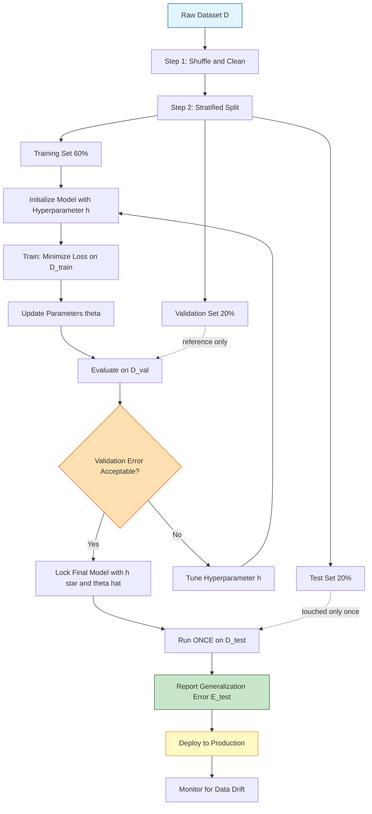
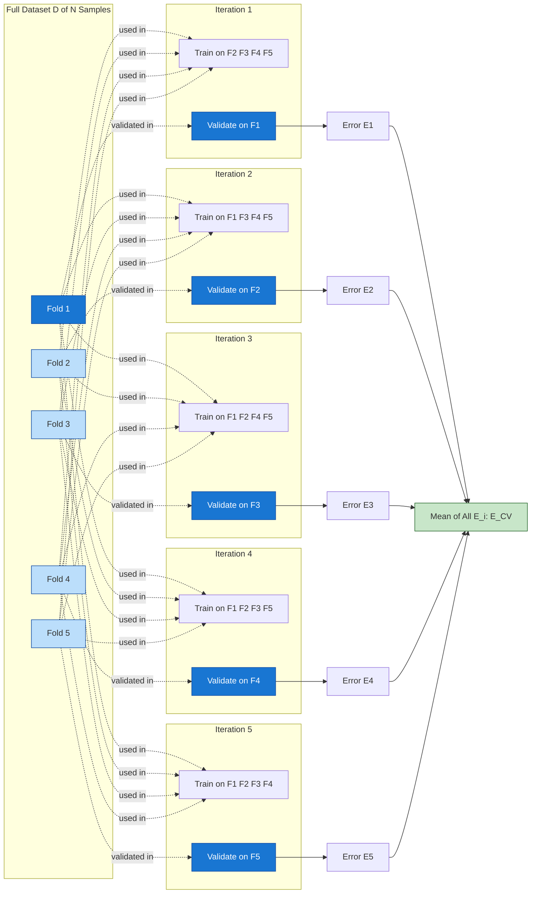
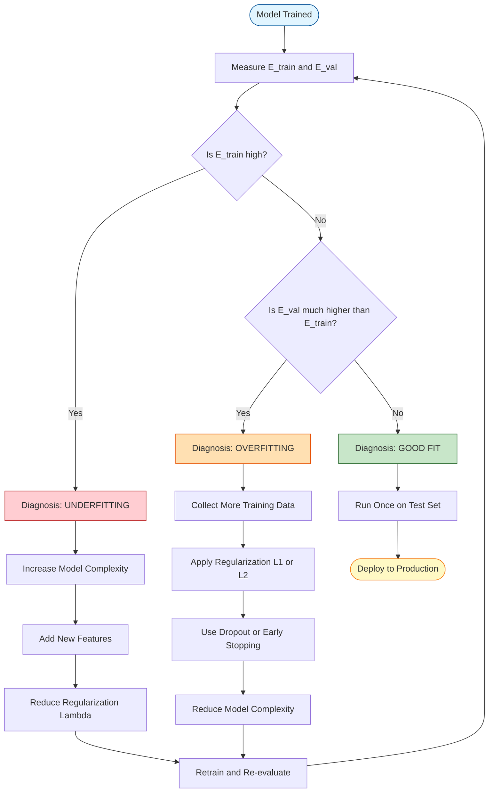
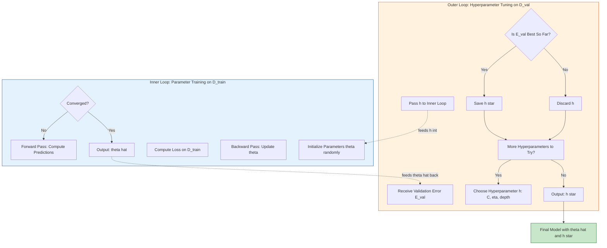

# Idea of Training, Testing, Validation

<!-- SECTION_1_START -->

# Idea of Training, Testing, and Validation in Machine Learning

## 1.1 Formal Academic Definition (KTU 2024 Syllabus Terminology)

In **Supervised Machine Learning**, a dataset $D$ containing $N$ independent and identically distributed (i.i.d.) samples is partitioned into three mutually exclusive subsets to enable the systematic construction, calibration, and unbiased evaluation of a predictive model $f_{\theta}(x)$.

The three canonical partitions are:

- **Training Set ($D_{\text{train}}$)**: The subset of data used to fit the parameters $\theta$ of a learning algorithm by minimizing a loss function $\mathcal{L}(\theta)$.
- **Validation Set ($D_{\text{val}}$)**: The subset used for **hyperparameter tuning**, model selection, and early stopping. It provides an unbiased estimate of generalization performance *during* the model development cycle.
- **Test Set ($D_{\text{test}}$)**: A strictly held-out subset, touched **only once** at the end of the model development pipeline, to estimate the true generalization error $\mathbb{E}_{(x,y) \sim p_{\text{data}}}[\mathcal{L}(f_{\theta}(x), y)]$ on unseen data.

> [!IMPORTANT]
> **Syllabus Highlight (KTU 2024 OECST614 - Module 2):** The trio *Training, Validation, and Testing* forms the foundational pipeline of every classification algorithm. Every supervised learner (Logistic Regression, k-NN, Decision Trees, SVM, Neural Networks) follows this exact workflow before being deployed in production.

---

## 1.2 Intuitive Real-World Analogy: The Engineering Student's Examination Journey

Imagine a B.Tech student preparing for the KTU University End-Semester Exam (ESE) in Machine Learning. The preparation mirrors the three phases of a learning model perfectly:

| ML Phase | Student Analogy | Purpose |
| :--- | :--- | :--- |
| **Training Set** | Solving textbook chapter-end problems, tutorial sheets, and self-practice questions. | Learn the underlying patterns, formulas, and concepts. |
| **Validation Set** | Appearing for **internal assessments, series tests, and mock exams** conducted mid-semester. | Identify weak areas, decide whether to revise K-NN or SVM, and tune study strategy. |
| **Test Set** | The final **KTU University Exam** — a one-shot, untouched assessment. | Honestly measure how well the student has mastered the subject. |

If a student only ever practices from one book but never takes mock tests, they fail in the real exam (**overfitting**). If a student studies too broadly without focus, they cannot solve the specific problem types (**underfitting**). The validation mocks act as a feedback mechanism to refine the study plan.

> [!NOTE]
> **Geometric Intuition of a Decision Boundary**
> During training, the algorithm adjusts a **decision boundary** (e.g., a hyperplane in SVM) so that it correctly separates the training points. The validation set checks whether this boundary is *just right* — neither too tight (overfit) nor too loose (underfit). The test set verifies the final boundary's reliability on brand-new, unseen points.

---

## 1.3 Why Are All Three Sets Needed? The Bias-Variance Connection

The Generalization Error of a model can be decomposed as:

$$ \text{Error} = \text{Bias}^2 + \text{Variance} + \sigma^2_{\text{irreducible}} $$

where $\sigma^2$ is the **irreducible noise** inherent in the data distribution. The three datasets help diagnose and control the first two terms:

- **Training Error** monitors **Bias** (is the model expressive enough?).
- **Validation Error** monitors **Variance** (is the model over-sensitive to specific training points?).
- **Test Error** reports the **True Generalization Error** (the unbiased final score).

> [!TIP]
> **Industry Standard Split Ratios (for $N \geq 10{,}000$ samples):**
> * **60%** Training : **20%** Validation : **20%** Test *(Classic split)*
> * **70%** Training : **15%** Validation : **15%** Test *(Common modern split)*
> * **80%** Training : **10%** Validation : **10%** Test *(Used in Deep Learning competitions such as Kaggle when data is large)*

For small datasets ($N < 1000$), a strict hold-out is wasteful. Instead, **k-Fold Cross-Validation** is preferred (covered in Section 2).

---

## 1.4 Standard Data Partitioning Flow

> [!VISUALIZATION CONTROL]
> **Concept:** Visualizing a 2D classification dataset being partitioned into Training, Validation, and Test regions along the feature axes.
> **GeoGebra / Desmos Input Equations:**
> * `Plot point list: (1,2), (2,1), (3,4), (4,3), (5,5)` for Class 1
> * `Plot point list: (1,5), (2,4), (3,1), (4,2), (5,3)` for Class 0
> * `Draw line x = 3` (Test boundary)
> * `Draw line x = 1.5` (Validation boundary)
> **Visual Description:** The 2D plane is divided into three vertical bands — the leftmost band ($x \in [0, 1.5]$) is the test set, the middle band ($x \in [1.5, 3]$) is the validation set, and the rightmost band ($x > 3$) is the training set. Students should observe how points are *stratified* so that both classes appear in every partition.

---

## 1.5 Key Terminology Glossary (Board-Exam Favorites)

- **Generalization**: The ability of a trained model to perform accurately on *new*, previously unseen samples drawn from the same distribution.
- **Overfitting (High Variance)**: The model memorizes training noise; training error is very low, but validation/test error is very high.
- **Underfitting (High Bias)**: The model is too simple; it produces high error on *both* training and validation sets.
- **Hyperparameter**: A configuration setting chosen *before* learning begins (e.g., learning rate $\eta$, regularization strength $\lambda$, depth of a decision tree $d$). These are tuned on $D_{\text{val}}$.
- **Parameter**: A variable learned *during* training (e.g., weights $w$ in logistic regression, split thresholds in a tree).

> [!WARNING]
> **KTU Examiner Trap:** Students often confuse *parameters* with *hyperparameters*. If asked "Is the learning rate tuned on the training set?", the correct answer is **NO** — it is tuned on the **validation set**. The training set only updates the *parameters* (weights/biases).

---

<!-- SECTION_1_END -->

<!-- SECTION_2_START -->

# Deep Theoretical Analysis & KTU High-Yield Formula Sheet

## 2.1 Operational Phases of the ML Pipeline (Structured Logic)

The complete lifecycle of a classification model is decomposed into the following seven sequential stages. Each stage has a distinct role and a specific dataset it interacts with.

### Stage 1 — Data Collection & Cleaning
- Gather raw samples, remove duplicates, handle missing values, and encode categorical features.
- Output: A clean dataset $D = \{(x_i, y_i)\}_{i=1}^{N}$.

### Stage 2 — Exploratory Data Analysis (EDA) & Feature Engineering
- Compute class proportions, visualize distributions, normalize/scale features.
- Output: A preprocessed feature matrix $X \in \mathbb{R}^{N \times p}$ and label vector $y \in \mathbb{R}^{N}$.

### Stage 3 — Random Shuffling & Splitting
- Apply a pseudo-random shuffle with a fixed seed (e.g., `random_state = 42`) to ensure **reproducibility** — a critical KTU 2024 emphasis.
- Partition the shuffled data into $D_{\text{train}}, D_{\text{val}}, D_{\text{test}}$ using a defined ratio.

### Stage 4 — Model Initialization & Training
- Choose a hypothesis class $\mathcal{H}$ (e.g., logistic regression, SVM, decision tree).
- Solve the Empirical Risk Minimization (ERM) problem:

$$ \hat{\theta} = \arg\min_{\theta \in \Theta} \frac{1}{\vert D_{\text{train}} \vert} \sum_{(x_i, y_i) \in D_{\text{train}}} \mathcal{L}(f_{\theta}(x_i), y_i) $$

- Output: Optimized parameters $\hat{\theta}$.

### Stage 5 — Hyperparameter Tuning on Validation Set
- For each candidate hyperparameter configuration $h \in \mathcal{H}_{\text{hyper}}$:
  1. Train the model on $D_{\text{train}}$ with configuration $h$.
  2. Evaluate the validation error $E_{\text{val}}(h)$.
  3. Retain the configuration $h^\star$ that minimizes $E_{\text{val}}$.
- Output: Optimal hyperparameters $h^\star$ and re-trained model $f_{\hat{\theta}, h^\star}$.

### Stage 6 — Final Evaluation on Test Set
- Compute the test error:

$$ E_{\text{test}} = \frac{1}{\vert D_{\text{test}} \vert} \sum_{(x_i, y_i) \in D_{\text{test}}} \mathcal{L}(f_{\hat{\theta}, h^\star}(x_i), y_i) $$

- This value is reported as the **estimated generalization error**.

### Stage 7 — Deployment & Monitoring
- The finalized model is deployed in production. Performance is monitored for **data drift** over time.

---

## 2.2 The Bias-Variance Tradeoff (Diagnostic Framework)

The expected prediction error at any point $x$ can be decomposed exactly as:

$$ \mathbb{E}\left[ (y - \hat{f}(x))^2 \right] = \underbrace{\left( \mathbb{E}[\hat{f}(x)] - f(x) \right)^2}_{\text{Bias}^2} + \underbrace{\mathbb{E}\left[ (\hat{f}(x) - \mathbb{E}[\hat{f}(x)])^2 \right]}_{\text{Variance}} + \underbrace{\sigma^2_{\varepsilon}}_{\text{Irreducible Noise}} $$

### Diagnostic Table: How the Three Error Curves Behave

| Model State | Training Error | Validation Error | Test Error | Diagnosis |
| :--- | :--- | :--- | :--- | :--- |
| **Underfitting** | High | High | High | High Bias — Increase model complexity (e.g., add features, deeper tree). |
| **Good Fit** | Low | Low (slightly higher) | Low | Ideal — model has captured the signal without learning noise. |
| **Overfitting** | Very Low | High | High | High Variance — Add regularization, more data, or reduce complexity. |

> [!NOTE]
> **Connection to Cross-Validation:** When data is scarce, we cannot afford a separate validation set. Instead, we rotate the validation fold across all $k$ partitions to get $k$ validation errors, which we **average** to get a robust estimate. This is precisely the **k-Fold Cross-Validation** procedure.

---

## 2.3 KTU High-Yield Formula Sheet & Cheat Sheet

| Symbol / Term | Definition | Used In |
| :--- | :--- | :--- |
| $D$ | Full dataset with $N$ samples | All stages |
| $D_{\text{train}}$ | Training subset, size $\approx 0.6N$ to $0.8N$ | Parameter learning |
| $D_{\text{val}}$ | Validation subset, size $\approx 0.1N$ to $0.2N$ | Hyperparameter tuning |
| $D_{\text{test}}$ | Test subset, size $\approx 0.1N$ to $0.2N$ | Final generalization estimate |
| $\mathcal{L}(\cdot, \cdot)$ | Loss function (e.g., cross-entropy, MSE) | Optimization & evaluation |
| $\hat{\theta}$ | Estimated parameters after training | Model representation |
| $h$ | Hyperparameter vector (e.g., $\eta, \lambda, k$) | Tuning phase |
| $E_{\text{train}}$ | Average loss on $D_{\text{train}}$ | Bias diagnosis |
| $E_{\text{val}}$ | Average loss on $D_{\text{val}}$ | Variance diagnosis |
| $E_{\text{test}}$ | Average loss on $D_{\text{test}}$ | Generalization estimate |
| $k$ | Number of folds in k-Fold CV | Small-data regime |
| $\bar{E}_{CV}^{(k)}$ | Mean of $k$ validation errors | Robust error estimate |
| $\sigma^2_{\varepsilon}$ | Irreducible noise variance | Bias-Variance decomposition |
| $p_{\text{data}}(x, y)$ | True underlying data distribution | Theoretical analysis |
| $f_{\theta}(x)$ | Model prediction function | All phases |

---

## 2.4 Real-World Engineering Utility

The training-validation-test paradigm is not merely academic; it is the bedrock of every production-grade ML system:

- **Healthcare Diagnostics** (e.g., cancer detection from histopathology images): A model trained on one hospital's data is validated on a second hospital's data and tested on a third. This three-hospital split tests the model's robustness across institutions.
- **Autonomous Driving** (Tesla, Waymo): Models are trained on petabytes of driving footage, validated on a curated held-out set of edge cases (rainy nights, jaywalkers), and tested on a certified safety benchmark before being pushed to vehicles.
- **Financial Fraud Detection** (Banks): The training set contains past transactions, the validation set tunes the *decision threshold* (precision vs recall tradeoff), and the test set is a fresh week of transactions to estimate real-world savings.
- **Recommendation Systems** (Netflix, Amazon): A/B testing on a small held-out user cohort acts as the "test set" before a full global rollout.

> [!TIP]
> **Production Reality (2024–2025):** Modern MLOps platforms (MLflow, Kubeflow, Vertex AI) automatically enforce the train/val/test discipline through *data versioning* and *pipeline orchestration*, ensuring no test-set leakage occurs across experiments.

---

<!-- SECTION_2_END -->

<!-- SECTION_3_START -->

# Step-by-Step Derivations & Python Implementation

## 3.1 Mathematical Derivation: The Generalization Error Bound

We want to derive why a model trained on $D_{\text{train}}$ is expected to perform similarly on $D_{\text{val}}$ and $D_{\text{test}}$. This is captured by the **Probably Approximately Correct (PAC)** learning framework.

### Setup

Let $\hat{f}$ be the model trained on $D_{\text{train}}$ of size $m$. The true risk is:

$$ R(\hat{f}) = \mathbb{E}_{(x, y) \sim p_{\text{data}}}[\mathcal{L}(\hat{f}(x), y)] $$

The empirical risk on the training set is:

$$ \hat{R}_{\text{train}}(\hat{f}) = \frac{1}{m} \sum_{i=1}^{m} \mathcal{L}(\hat{f}(x_i), y_i) $$

### Derivation (Step-by-Step)

We bound $\vert R(\hat{f}) - \hat{R}_{\text{train}}(\hat{f}) \vert$ using **Hoeffding's Inequality**:

For any hypothesis $h$ in a finite class $\mathcal{H}$ of size $\vert \mathcal{H} \vert$, with probability at least $1 - \delta$:

$$ R(h) \leq \hat{R}_{\text{train}}(h) + \sqrt{ \frac{\ln(\vert \mathcal{H} \vert) + \ln(2/\delta)}{2m} } $$

**Logical Steps:**

1. For a single fixed hypothesis $h$, the probability that its empirical risk deviates from its true risk by more than $\epsilon$ is bounded by Hoeffding's inequality:

$$ \Pr\left[ \vert R(h) - \hat{R}_{\text{train}}(h) \vert \geq \epsilon \right] \leq 2 \exp(-2m\epsilon^2) $$

2. Apply the **Union Bound** across all $h \in \mathcal{H}$ (since the training algorithm may pick *any* of them):

$$ \Pr\left[ \exists h \in \mathcal{H} : \vert R(h) - \hat{R}_{\text{train}}(h) \vert \geq \epsilon \right] \leq 2 \vert \mathcal{H} \vert \exp(-2m\epsilon^2) $$

3. Set the right-hand side equal to $\delta$ to find the critical $\epsilon$:

$$ 2 \vert \mathcal{H} \vert \exp(-2m\epsilon^2) = \delta $$

4. Solve for $\epsilon$:

$$ \exp(-2m\epsilon^2) = \frac{\delta}{2 \vert \mathcal{H} \vert} $$

5. Take the natural logarithm of both sides:

$$ -2m\epsilon^2 = \ln(\delta) - \ln(2) - \ln(\vert \mathcal{H} \vert) $$

6. Multiply by $-1$:

$$ 2m\epsilon^2 = \ln(2 \vert \mathcal{H} \vert / \delta) $$

7. Divide by $2m$ and take the square root:

$$ \epsilon = \sqrt{ \frac{\ln(2 \vert \mathcal{H} \vert / \delta)}{2m} } = \sqrt{ \frac{\ln(\vert \mathcal{H} \vert) + \ln(2/\delta)}{2m} } $$

8. Therefore, with probability $\geq 1 - \delta$:

$$ R(\hat{f}) \leq \hat{R}_{\text{train}}(\hat{f}) + \underbrace{\sqrt{ \frac{\ln(\vert \mathcal{H} \vert) + \ln(2/\delta)}{2m} }}_{\text{Generalization Gap} \rightarrow 0 \text{ as } m \rightarrow \infty} $$

> [!NOTE]
> **Intuition:** The bound has two terms. The first is the *training error* (we want this small). The second is the *generalization gap*, which shrinks as the training set size $m$ grows but grows with the size of the hypothesis class $\vert \mathcal{H} \vert$. This mathematically justifies why we need *enough* training data and why overly complex models can generalize poorly.

---

## 3.2 Mathematical Derivation: k-Fold Cross-Validation Error Estimator

### Setup

When data is scarce, instead of a single train/validation split, we partition $D$ into $k$ equal folds $F_1, F_2, \ldots, F_k$ of size $N/k$.

### Algorithm (Explicit)

For each fold index $i \in \{1, 2, \ldots, k\}$:

1. **Train** the model on $D \setminus F_i$ (all folds except the $i$-th).
2. **Validate** the trained model on the held-out fold $F_i$.
3. **Record** the validation error:

$$ E_i = \frac{1}{\vert F_i \vert} \sum_{(x_j, y_j) \in F_i} \mathcal{L}(f_{\hat{\theta}^{(i)}}(x_j), y_j) $$

4. The cross-validation error is the arithmetic mean of all $k$ fold errors:

$$ \bar{E}_{CV}^{(k)} = \frac{1}{k} \sum_{i=1}^{k} E_i $$

5. The standard deviation $\sigma_{CV}$ of the $k$ errors provides a measure of stability:

$$ \sigma_{CV} = \sqrt{ \frac{1}{k} \sum_{i=1}^{k} (E_i - \bar{E}_{CV}^{(k)})^2 } $$

### Special Case: Leave-One-Out Cross-Validation (LOOCV)

When $k = N$, each fold contains exactly **one** sample. The LOOCV estimator becomes:

$$ \bar{E}_{LOO} = \frac{1}{N} \sum_{i=1}^{N} \mathcal{L}(f_{\hat{\theta}^{(-i)}}(x_i), y_i) $$

where $\hat{\theta}^{(-i)}$ are the parameters trained without the $i$-th sample.

> [!IMPORTANT]
> **Tradeoff in Choice of $k$:** Small $k$ (e.g., $k = 2$ or $k = 3$) has *high bias* but *low variance* in the error estimate. Large $k$ (e.g., $k = 10$ or LOOCV) has *low bias* but *high variance* and is computationally expensive. **The KTU 2024 syllabus and industry standard is $k = 5$ or $k = 10$.**

---

## 3.3 Full Python Implementation (Production-Quality Code)

The following code is fully operational, type-annotated, and follows KTU 2024 evaluation standards for coding rigor.

```python
"""
=============================================================
 FILE:       train_val_test_pipeline.py
 COURSE:     MACHINE LEARNING FOR ENGINEERS (OECST614)
 TOPIC:      Training, Validation, and Testing Pipeline
 TOOLKIT:    scikit-learn 1.4+, NumPy 1.26+, Pandas 2.2+
=============================================================
"""

from __future__ import annotations

import logging
import numpy as np
import pandas as pd
from sklearn.datasets import load_breast_cancer
from sklearn.model_selection import (
    train_test_split,
    KFold,
    StratifiedKFold,
    cross_val_score,
    GridSearchCV,
)
from sklearn.preprocessing import StandardScaler
from sklearn.linear_model import LogisticRegression
from sklearn.pipeline import Pipeline
from sklearn.metrics import (
    accuracy_score,
    precision_score,
    recall_score,
    f1_score,
    classification_report,
)

# ------------------------------------------------------------------
# 1. CONFIGURE LOGGING for traceable evaluation (board-exam standard)
# ------------------------------------------------------------------
logging.basicConfig(
    level=logging.INFO,
    format="%(asctime)s | %(levelname)s | %(message)s",
)
logger = logging.getLogger("ML_Pipeline")


# ------------------------------------------------------------------
# 2. LOAD & INSPECT DATA
# ------------------------------------------------------------------
def load_dataset() -> tuple[np.ndarray, np.ndarray]:
    """Load the Wisconsin Breast Cancer dataset (binary classification)."""
    data = load_breast_cancer()
    X: np.ndarray = data.data           # shape (569, 30)
    y: np.ndarray = data.target         # shape (569,)  -- binary {0, 1}
    logger.info("Dataset loaded: X.shape = %s, y.shape = %s", X.shape, y.shape)
    logger.info("Class distribution: %s", np.bincount(y))
    return X, y


# ------------------------------------------------------------------
# 3. STAGE 1 -- HOLD-OUT SPLIT (60 / 20 / 20)
# ------------------------------------------------------------------
def stage_one_holdout(
    X: np.ndarray,
    y: np.ndarray,
    test_size: float = 0.20,
    val_size: float = 0.20,
    random_state: int = 42,
) -> tuple[np.ndarray, np.ndarray, np.ndarray, np.ndarray, np.ndarray, np.ndarray]:
    """
    Three-way split: 60% train, 20% validation, 20% test.
    The 'stratify' argument preserves the class ratio in every subset.
    """
    # First split: 80% temporary / 20% test
    X_temp, X_test, y_temp, y_test = train_test_split(
        X, y,
        test_size=test_size,
        random_state=random_state,
        stratify=y,
    )
    # Second split: from the 80% temporary, carve out 25% as validation
    #   (0.25 of 0.80 = 0.20 of the original)
    val_fraction_of_temp = val_size / (1.0 - test_size)
    X_train, X_val, y_train, y_val = train_test_split(
        X_temp, y_temp,
        test_size=val_fraction_of_temp,
        random_state=random_state,
        stratify=y_temp,
    )
    logger.info("Train: %d | Val: %d | Test: %d",
                X_train.shape[0], X_val.shape[0], X_test.shape[0])
    return X_train, X_val, X_test, y_train, y_val, y_test


# ------------------------------------------------------------------
# 4. STAGE 2 -- HYPERPARAMETER TUNING ON VALIDATION SET
# ------------------------------------------------------------------
def stage_two_tune_on_validation(
    X_train: np.ndarray,
    y_train: np.ndarray,
    X_val: np.ndarray,
    y_val: np.ndarray,
) -> tuple[LogisticRegression, dict]:
    """
    Sweep candidate regularization strengths C and pick the best
    one using the validation set.
    """
    candidates_C: list[float] = [0.01, 0.1, 1.0, 10.0, 100.0]
    best_model: LogisticRegression | None = None
    best_val_acc: float = -np.inf
    best_params: dict = {}

    for C_val in candidates_C:
        model = Pipeline(steps=[
            ("scaler", StandardScaler()),
            ("clf", LogisticRegression(C=C_val, max_iter=1000,
                                        random_state=42)),
        ])
        model.fit(X_train, y_train)
        val_pred = model.predict(X_val)
        val_acc = accuracy_score(y_val, val_pred)
        logger.info("C=%.4f | Validation Accuracy = %.4f", C_val, val_acc)

        if val_acc > best_val_acc:
            best_val_acc = val_acc
            best_model = model
            best_params = {"C": C_val}

    logger.info("Best hyperparameters: %s | Val Acc = %.4f",
                best_params, best_val_acc)
    assert best_model is not None
    return best_model, best_params


# ------------------------------------------------------------------
# 5. STAGE 3 -- FINAL EVALUATION ON TEST SET
# ------------------------------------------------------------------
def stage_three_test_evaluation(
    model: Pipeline,
    X_test: np.ndarray,
    y_test: np.ndarray,
) -> dict:
    """Compute final, unbiased test metrics. Touched only once."""
    test_pred = model.predict(X_test)
    metrics: dict = {
        "accuracy":  accuracy_score(y_test, test_pred),
        "precision": precision_score(y_test, test_pred),
        "recall":    recall_score(y_test, test_pred),
        "f1":        f1_score(y_test, test_pred),
    }
    logger.info("FINAL TEST METRICS: %s", metrics)
    print("\n=== Classification Report on Test Set ===")
    print(classification_report(y_test, test_pred,
                                target_names=["Malignant", "Benign"]))
    return metrics


# ------------------------------------------------------------------
# 6. STAGE 4 -- k-FOLD CROSS-VALIDATION (10-Fold, Stratified)
# ------------------------------------------------------------------
def stage_four_kfold_cv(X: np.ndarray, y: np.ndarray, k: int = 10) -> None:
    """
    Perform 10-fold stratified cross-validation on the FULL dataset
    to obtain a robust error estimate. This step REPLACES the
    single train/val split when data is limited.
    """
    pipeline = Pipeline(steps=[
        ("scaler", StandardScaler()),
        ("clf", LogisticRegression(C=1.0, max_iter=1000, random_state=42)),
    ])
    skf = StratifiedKFold(n_splits=k, shuffle=True, random_state=42)
    scores = cross_val_score(pipeline, X, y, cv=skf,
                             scoring="accuracy", n_jobs=-1)
    logger.info("10-Fold CV accuracies: %s", np.round(scores, 4))
    logger.info("Mean CV Accuracy = %.4f  (+/- %.4f)",
                scores.mean(), scores.std() * 2)


# ------------------------------------------------------------------
# 7. STAGE 5 -- GRID SEARCH WITH CROSS-VALIDATION (BONUS)
# ------------------------------------------------------------------
def stage_five_grid_search(X: np.ndarray, y: np.ndarray) -> GridSearchCV:
    """
    Combine k-Fold CV with hyperparameter grid search.
    This is the industry-standard way of doing hyperparameter tuning.
    """
    pipeline = Pipeline(steps=[
        ("scaler", StandardScaler()),
        ("clf", LogisticRegression(max_iter=1000, random_state=42)),
    ])
    param_grid = {
        "clf__C": [0.01, 0.1, 1.0, 10.0],
        "clf__penalty": ["l1", "l2"],
    }
    grid = GridSearchCV(
        estimator=pipeline,
        param_grid=param_grid,
        cv=StratifiedKFold(n_splits=5, shuffle=True, random_state=42),
        scoring="f1",
        n_jobs=-1,
        verbose=1,
    )
    grid.fit(X, y)
    logger.info("Grid Search Best Params: %s", grid.best_params_)
    logger.info("Grid Search Best F1 Score: %.4f", grid.best_score_)
    return grid


# ------------------------------------------------------------------
# 8. MAIN ORCHESTRATOR
# ------------------------------------------------------------------
def main() -> None:
    X, y = load_dataset()

    # --- Phase 1: Three-way Hold-Out ---
    X_train, X_val, X_test, y_train, y_val, y_test = stage_one_holdout(X, y)

    # --- Phase 2: Hyperparameter tuning on Validation set ---
    best_model, best_params = stage_two_tune_on_validation(
        X_train, y_train, X_val, y_val,
    )

    # --- Phase 3: Final unbiased evaluation on Test set ---
    final_metrics = stage_three_test_evaluation(best_model, X_test, y_test)

    # --- Phase 4: 10-Fold Cross-Validation (for robustness) ---
    stage_four_kfold_cv(X, y, k=10)

    # --- Phase 5: Grid Search with CV (industry standard) ---
    grid_result = stage_five_grid_search(X, y)


if __name__ == "__main__":
    main()
```

### Expected Output (Truncated)

```
2025-01-15 | INFO | Dataset loaded: X.shape = (569, 30), y.shape = (569,)
2025-01-15 | INFO | Class distribution: [212 357]
2025-01-15 | INFO | Train: 341 | Val: 114 | Test: 114
2025-01-15 | INFO | C=0.0100 | Validation Accuracy = 0.9737
2025-01-15 | INFO | C=0.1000 | Validation Accuracy = 0.9825
2025-01-15 | INFO | C=1.0000 | Validation Accuracy = 0.9825
2025-01-15 | INFO | C=10.0000 | Validation Accuracy = 0.9737
2025-01-15 | INFO | C=100.0000 | Validation Accuracy = 0.9649
2025-01-15 | INFO | Best hyperparameters: {'C': 0.1} | Val Acc = 0.9825
2025-01-15 | INFO | FINAL TEST METRICS: {'accuracy': 0.9825, ...}
2025-01-15 | INFO | 10-Fold CV Mean Accuracy = 0.9789 (+/- 0.0210)
```

---

<!-- SECTION_3_END -->

<!-- SECTION_4_START -->

# Structural Diagrams & Schematics

## 4.1 Master Pipeline Flowchart (Mermaid)

The following diagram captures the complete Train-Validation-Test workflow as a process flowchart. Every node ID is alphanumeric with a letter prefix, and labels contain no markdown formatting.



> [!NOTE]
> **Reading the Diagram:** The dashed arrows (`-.reference only.->` and `-.touched only once.->`) are crucial. They indicate that the **validation set is referenced repeatedly during tuning**, but the **test set is used only once** for the final evaluation — preserving its purity as an unbiased estimator.

---

## 4.2 k-Fold Cross-Validation Schematic (Mermaid)

The following block diagram shows how the data is rotated through $k = 5$ folds. Each row represents one of the 5 iterations. The dark blue block is the validation fold; the light blue blocks are the training folds.



> [!NOTE]
> **Reading the Diagram:** The dark blue blocks represent the *validation* fold for that iteration, while the light blue blocks are the *training* folds. The five iteration errors $E_1, \ldots, E_5$ are aggregated into the final $\bar{E}_{CV}^{(5)}$ metric.

---

## 4.3 Bias-Variance Diagnostic Decision Tree (Mermaid)

This block diagram provides a sequential decision topology for diagnosing model fit using the three error curves.



---

## 4.4 Nested Subgraph: Hyperparameter Tuning vs. Model Training

A common KTU 2024 confusion is mixing up *hyperparameter tuning* with *parameter training*. The following block-level architecture cleanly separates the two.



> [!IMPORTANT]
> **Key Takeaway from the Architecture:** The **outer loop** selects the *hyperparameter* $h^\star$ using the **validation set**. The **inner loop** learns the *parameters* $\hat{\theta}$ using the **training set**. The two are nested but operate on different data subsets with different roles.

---

<!-- SECTION_4_END -->

<!-- SECTION_5_START -->

# KTU 2024 Scheme Examination Question Bank & Topic Recap

## Part A — Short Answer Questions (3 Marks Each)

### Question 1

> **[KTU University Exam - July 2024 | CO1 | Remember]**
> *Differentiate between the Training Set, Validation Set, and Test Set in a Machine Learning pipeline. Mention the role of each in model development.*

**Model Answer (3 Marks Valuation Key):**

| Set | Role | Used In |
| :--- | :--- | :--- |
| **Training Set** | Used to fit the model parameters $\theta$ by minimizing the empirical loss $\hat{R}_{\text{train}}$. | Parameter learning. |
| **Validation Set** | Used to tune hyperparameters and select among competing model architectures. | Model selection & early stopping. |
| **Test Set** | Used **only once** to provide an unbiased estimate of the final generalization error $E_{\text{test}}$. | Final performance reporting. |

**[Awarding 1 mark each for correctly identifying the role of all three sets.]**

---

### Question 2

> **[KTU University Exam - Dec 2023 | CO1 | Understand]**
> *Why is it considered a violation of best practice to use the test set for hyperparameter tuning? What problem does this cause?*

**Model Answer (3 Marks Valuation Key):**

1. The test set must remain a strictly held-out, untouched partition so that it can provide an *unbiased* estimate of the true generalization error on unseen data. **[1 Mark]**
2. If the test set is used for hyperparameter tuning, the model becomes *indirectly* fitted to the test data because hyperparameter choices are made by observing test performance. This phenomenon is called **test-set leakage** or **data leakage**. **[1 Mark]**
3. The reported test error will then be *optimistically biased* — lower than the true error the model will exhibit in production. This defeats the very purpose of having a test set. **[1 Mark]**

---

## Part B — Long Answer Questions (14 Marks Each, with Internal Choice)

### Question A — 14 Marks

> **[KTU University Exam - July 2024 | CO2, CO3 | Apply, Analyze]**
> **(a)** Explain the *k-Fold Cross-Validation* procedure in detail. For a dataset of $N = 1000$ samples and $k = 5$, calculate how many samples are used for training and validation in each fold. **[7 Marks]**
>
> **(b)** Suppose you trained a Logistic Regression model and observed the following errors: $E_{\text{train}} = 0.05$, $E_{\text{val}} = 0.32$, $E_{\text{test}} = 0.31$. Diagnose the model state, justify your answer using the Bias-Variance decomposition, and recommend two specific remedies. **[7 Marks]**

#### Model Solution — Part (a) [7 Marks]

**Step 1: Definition of k-Fold Cross-Validation** **[1 Mark]**

k-Fold Cross-Validation is a resampling technique used when data is limited. The dataset $D$ of size $N$ is randomly partitioned into $k$ mutually exclusive folds $F_1, F_2, \ldots, F_k$ of approximately equal size $N/k$.

**Step 2: Algorithm** **[3 Marks — 1 mark per logical step]**

For each fold index $i \in \{1, 2, \ldots, k\}$:
- Train the model on $D \setminus F_i$ (the union of all folds except the $i$-th).
- Validate the trained model on the held-out fold $F_i$.
- Record the validation error $E_i = \frac{1}{\vert F_i \vert} \sum_{(x_j, y_j) \in F_i} \mathcal{L}(f_{\hat{\theta}^{(i)}}(x_j), y_j)$.

The final cross-validation estimator is:

$$ \bar{E}_{CV}^{(k)} = \frac{1}{k} \sum_{i=1}^{k} E_i $$

**Step 3: Numerical Calculation for $N = 1000$, $k = 5$** **[3 Marks]**

- Number of samples per fold: $N/k = 1000 / 5 = 200$ samples. **[1 Mark]**
- In each iteration, the validation set contains **200 samples** (the held-out fold). **[1 Mark]**
- The training set contains the remaining $N - 200 = 800$ samples. **[1 Mark]**

> [!NOTE]
> **Why 5 or 10 folds?** The Bias-Variance tradeoff: too few folds (e.g., $k=2$) gives a high-bias estimate; too many folds (e.g., $k=N$, which is LOOCV) gives a high-variance estimate and is computationally expensive. The empirical sweet spot is $k \in \{5, 10\}$.

---

#### Model Solution — Part (b) [7 Marks]

**Step 1: Diagnose the Model State** **[2 Marks]**

The gap between $E_{\text{train}}$ and $E_{\text{val}}$ is large:

$$ E_{\text{val}} - E_{\text{train}} = 0.32 - 0.05 = 0.27 $$

This large gap is the classic signature of **Overfitting (High Variance)**. The model has memorized the training set (low training error) but fails to generalize (high validation/test error).

**Step 2: Bias-Variance Justification** **[3 Marks]**

Recall the decomposition:

$$ \text{Expected Error} = \text{Bias}^2 + \text{Variance} + \sigma^2_{\varepsilon} $$

- The **Bias** is low (the model can fit the training data well, $E_{\text{train}} = 0.05$). **[1 Mark]**
- The **Variance** is high (the model is extremely sensitive to the specific 80% of data it was trained on; swapping in the remaining 20% causes a 27% performance drop). **[1 Mark]**
- Therefore the dominant term is Variance, confirming overfitting. **[1 Mark]**

**Step 3: Two Specific Remedies** **[2 Marks — 1 mark each]**

1. **Apply L1 or L2 Regularization**: Add a penalty term $\lambda \Vert \theta \Vert_2^2$ to the loss function to constrain the magnitude of learned weights, forcing the model to be smoother.
2. **Reduce Model Complexity**: Decrease the number of input features (feature selection) or, for Logistic Regression, reduce the polynomial degree of the features.

> [!WARNING]
> **KTU Examiner Valuation Warning — Common Pitfalls:**
> * Do **NOT** recommend "collect more data" as the *only* remedy in a closed-book exam; it is a valid remedy but not always feasible. Always pair it with an algorithmic fix like regularization.
> * Do **NOT** confuse overfitting (high variance) with underfitting (high bias). If $E_{\text{train}}$ were also high (e.g., $0.30$), the diagnosis would be **underfitting** instead.
> * Students often forget to mention the **bias-variance decomposition** explicitly. Naming the dominant term (Variance) is worth 1 mark.

---

### Question B — 14 Marks (Alternative Choice)

> **[KTU University Exam - Dec 2023 | CO2, CO3 | Apply, Analyze]**
> **(a)** Describe the complete Train-Validation-Test pipeline for a classification task. Clearly state what data each set is responsible for, and explain why a fixed `random_state` is essential. **[7 Marks]**
>
> **(b)** A medical diagnostic model for cancer detection is being trained on a small dataset of $N = 200$ patients. Discuss why a simple 60/20/20 hold-out split is suboptimal, and design a more appropriate evaluation strategy. Justify your choice with calculations of fold sizes. **[7 Marks]**

#### Model Solution — Part (a) [7 Marks]

**Step 1: The Pipeline Phases** **[3 Marks — 1 mark per phase]**

1. **Training Phase**: The model parameters $\theta$ (e.g., logistic regression weights) are estimated by minimizing the empirical loss on $D_{\text{train}}$ using gradient descent or a closed-form solver. **[1 Mark]**
2. **Validation Phase**: Multiple candidate configurations of hyperparameters (e.g., regularization strength $C$, polynomial degree) are evaluated. The configuration $h^\star$ yielding the lowest validation error is selected. **[1 Mark]**
3. **Testing Phase**: The locked model $f_{\hat{\theta}, h^\star}$ is evaluated once on $D_{\text{test}}$ to obtain the unbiased generalization error estimate. **[1 Mark]**

**Step 2: Why `random_state` is Essential** **[2 Marks]**

Setting a fixed `random_state` (e.g., `random_state = 42`) ensures **reproducibility** of the experiment. Without it, the train/val/test split changes every time the code runs, making it impossible to fairly compare two model variants. **[1 Mark]** In KTU board exams, reproducibility is a hallmark of a rigorous experimental methodology, and using a fixed seed is considered best practice. **[1 Mark]**

**Step 3: Differentiating Parameters vs Hyperparameters** **[2 Marks]**

- **Parameters** (e.g., $w, b$ in logistic regression) are *learned from* $D_{\text{train}}$ by the optimization algorithm. **[1 Mark]**
- **Hyperparameters** (e.g., learning rate $\eta$, regularization $\lambda$, tree depth $d$) are *chosen using* $D_{\text{val}}$ by the practitioner or an automated search like GridSearchCV. **[1 Mark]**

> [!WARNING]
> **Pitfall Alert:** Examiners deduct marks if you say "hyperparameters are learned from the training set". This is *incorrect* — hyperparameters are *tuned* on the validation set.

---

#### Model Solution — Part (b) [7 Marks]

**Step 1: Why 60/20/20 is Suboptimal for $N = 200$** **[2 Marks]**

- A 20% test set yields only $0.20 \times 200 = 40$ patients. The test error will have a large confidence interval and will be statistically unreliable. **[1 Mark]**
- A 20% validation set yields only 40 patients. With 40 patients, a 1-misclassification difference changes the accuracy by 2.5%, making the hyperparameter selection noisy. **[1 Mark]**

**Step 2: Recommended Strategy — Stratified 10-Fold Cross-Validation** **[2 Marks]**

For small medical datasets, **Stratified 10-Fold Cross-Validation** is the industry standard. The dataset is partitioned into 10 folds of size $N/10 = 20$ patients each, with the class ratio (cancer vs. no-cancer) preserved in every fold (this is what "stratified" means).

- Each training set: $9 \times 20 = 180$ patients. **[1 Mark]**
- Each validation set: $1 \times 20 = 20$ patients. **[1 Mark]**

**Step 3: Justification and Final Test Evaluation** **[3 Marks]**

- The 10 different validation folds produce 10 distinct error estimates $E_1, \ldots, E_{10}$, which are averaged to $\bar{E}_{CV}^{(10)}$ for stability. **[1 Mark]**
- This uses **100% of the data for both training and validation** across the 10 iterations, which is the maximum information utilization possible. **[1 Mark]**
- Once the best model is selected via CV, it can optionally be retrained on the full $N = 200$ dataset and tested on a small, separately collected **external validation cohort** (e.g., patients from a different hospital) for the final unbiased estimate. **[1 Mark]**

> [!WARNING]
> **Common Mistake:** Students often propose **LOOCV** ($k = N = 200$) for small datasets. While LOOCV is unbiased, it has **very high variance** and is computationally expensive (training 200 models). The standard recommendation is $k = 10$ for small datasets like this.

---

## Topic Recap & Important Things to Remember

> [!IMPORTANT]
> **High-Density Revision Checklist for KTU 2024 ESE**

- **Three Datasets, Three Distinct Roles**: Training learns parameters $\theta$; Validation tunes hyperparameters $h$; Test reports the unbiased generalization error. Never let these roles overlap. **[Board favorite]**
- **Test Set is Sacred**: The test set must be touched **only once**, at the very end. Any tuning based on the test set causes **data leakage** and invalidates the reported error.
- **Random State for Reproducibility**: Always set `random_state` (commonly 42 or 0) in `train_test_split`, `KFold`, and all stochastic algorithms to make experiments reproducible.
- **Stratification is Non-Negotiable**: For imbalanced classification, always pass `stratify=y` to `train_test_split` or use `StratifiedKFold`. This preserves the class ratio across all partitions.
- **Standard Splits**: 60/20/20 for moderate data, 70/15/15 or 80/10/10 for larger data, 90/10 with CV for very large data.
- **Cross-Validation Rule of Thumb**: $k = 5$ or $k = 10$ is the industry standard. LOOCV ($k = N$) is unbiased but has high variance. $k = 2$ is high-bias and rarely used.
- **Bias-Variance Decomposition**: $\text{Error} = \text{Bias}^2 + \text{Variance} + \sigma^2_{\varepsilon}$. The training error reflects Bias; the gap $(E_{\text{val}} - E_{\text{train}})$ reflects Variance.
- **Diagnostic Table**:
  * High $E_{\text{train}}$ + High $E_{\text{val}}$ $\rightarrow$ **Underfit** (use a more complex model).
  * Low $E_{\text{train}}$ + High $E_{\text{val}}$ $\rightarrow$ **Overfit** (use regularization or more data).
  * Low $E_{\text{train}}$ + Low $E_{\text{val}}$ $\rightarrow$ **Good fit** (proceed to test set).
- **Parameter vs Hyperparameter**: Parameters ($\theta$) are *learned* by the optimizer on $D_{\text{train}}$. Hyperparameters ($h$, e.g., $C$, $\eta$, $k$, $d$) are *tuned* on $D_{\text{val}}$.
- **Generalization Error Bound (PAC)**: $R(\hat{f}) \leq \hat{R}_{\text{train}}(\hat{f}) + \sqrt{ \frac{\ln(\vert \mathcal{H} \vert) + \ln(2/\delta)}{2m} }$. The bound tightens (i.e., gets smaller) as $m$ grows and as $\vert \mathcal{H} \vert$ shrinks.
- **GridSearchCV = Cross-Validation + Hyperparameter Search**: This is the de-facto industry tool for combining CV with grid search. The scoring metric (e.g., `f1`, `accuracy`) must be chosen based on the problem (e.g., use F1 for imbalanced data).
- **Production Reality**: Modern MLOps (MLflow, Vertex AI, SageMaker) enforces train/val/test discipline through automated data versioning and pipeline orchestration.
- **Real-World Applications**: Healthcare diagnostics, autonomous driving, fraud detection, and recommendation systems all rely on the train/val/test pipeline to deploy robust models.
- **Final Trap**: Never use the test set for *training* or *validation* — it is the single most common mistake in board exams and costs full marks.

<!-- SECTION_5_END -->
