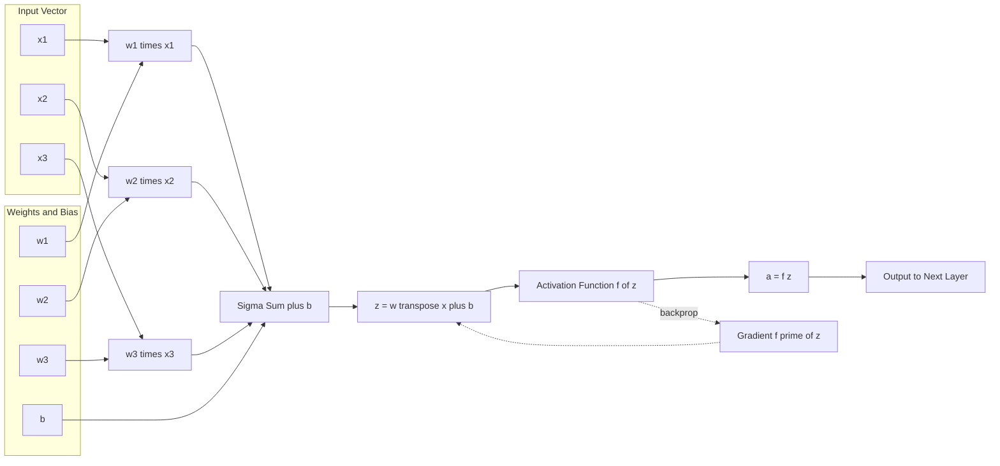
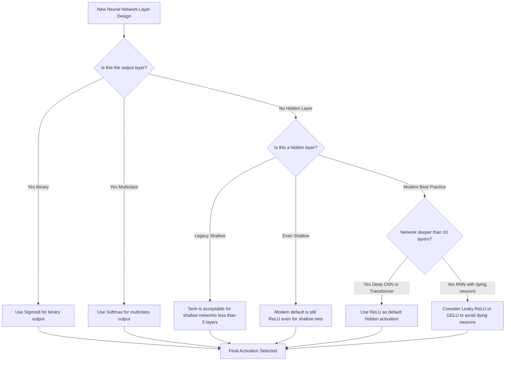
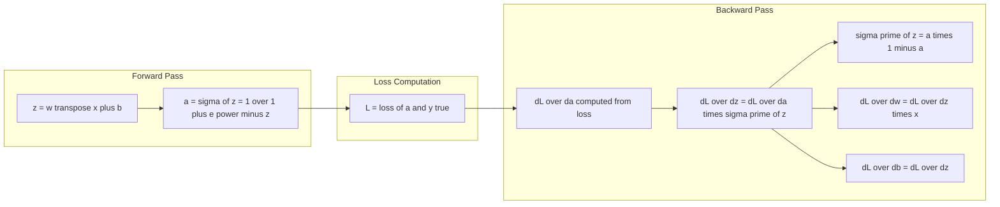

# Activation functions (Sigmoid, ReLU, Tanh)

<!-- SECTION_1_START -->

# 1. Core Technical Definition & Intuitive Overview

## 1.1 Formal Academic Definition

An **Activation Function** in an artificial neural network is a mathematical **non-linear transformation** applied to the weighted summed input (the *pre-activation* or *net input*) of a neuron. It determines whether the neuron should be "activated" by computing a scalar output that is passed forward to the next layer. Formally, for a neuron receiving the linear combination

$$z = \mathbf{w}^{T}\mathbf{x} + b$$

the activation function $f(\cdot)$ maps this real-valued input to a bounded (or selectively unbounded) output

$$a = f(z) = f\left(\sum_{i=1}^{n} w_i x_i + b\right)$$

Without a non-linear activation function, a deep neural network would collapse mathematically into a single linear transformation, regardless of the number of stacked layers. Non-linearity is therefore the *cornerstone* of deep learning representation power (Universal Approximation Theorem).

> [!IMPORTANT]
> **KTU 2024 Syllabus Highlight (OECST614 / M3):** Students must study **Sigmoid, Tanh, and ReLU** with emphasis on their **mathematical form, derivative, range, and the vanishing gradient problem**. Leaky ReLU and Softmax are extensions frequently asked in ESE questions.

## 1.2 Conceptual Analogy — Plain English Intuition

Imagine a **team of light switches in a dark hallway**:

- **No activation function** → A dimmer that can only rotate smoothly between 0% and 100%. It can do *only one* smooth thing — useless for recognizing complex patterns.
- **Sigmoid ($\sigma$)** → A **soft, gradual switch** that smoothly turns the light *on* as input increases. It outputs values between **0** and **1**, like a probability. However, when the input is very large or very small, the light barely changes — the switch saturates.
- **Tanh** → The same smooth switch, but centered around **zero**, outputting between **$-1$** and **$+1$**. Useful when you want negative and positive signals to flow.
- **ReLU** → A **half-wave rectifier**: a switch that *blocks all negative signals* (outputs 0) and *lets all positive signals pass through unchanged*. It is computationally cheap and avoids the saturation problem for positive inputs.

> [!NOTE]
> **Why do we need three?** Each function has a different **output range, gradient behavior, and saturation characteristic**. Choosing the right one is critical for fast and stable training.

## 1.3 Physical Constants and Standard Metrics

- **Sigmoid saturation zone:** $\vert z \vert > 4$ → gradient $\approx 0$.
- **Tanh zero-centering advantage:** mean output $\approx 0$ (better than sigmoid for zero-centered data flow).
- **ReLU dead neuron threshold:** input $z < 0$ for *all* training samples → permanent death of neuron (Dying ReLU problem).
- **Default learning rate range:** $10^{-3}$ to $10^{-4}$ for ReLU; smaller for sigmoid/tanh.

> [!VISUALIZATION CONTROL]
> **Concept:** Sigmoid, Tanh, and ReLU activation curves on a common 2D coordinate axis.
> **GeoGebra / Desmos Input Equations:**
> * $f_{1}(x) = \frac{1}{1 + e^{-x}}$   *(Sigmoid — S-shaped, range (0, 1))*
> * $f_{2}(x) = \tanh(x) = \frac{e^{x} - e^{-x}}{e^{x} + e^{-x}}$   *(Tanh — S-shaped, range (-1, 1))*
> * $f_{3}(x) = \max(0, x)$   *(ReLU — piecewise linear, kink at x=0)*
> * $f_{4}(x) = \frac{1}{2}(f_{1}(x) - f_{1}(-x))$   *(Verify Tanh = 2·Sigmoid(2x) - 1)*
> **Visual Description:** The student should observe that sigmoid and tanh are *S-curves* that flatten (saturate) at both extremes, while ReLU is a *straight diagonal line* for $x \ge 0$ and a flat zero line for $x < 0$. Sigmoid is strictly positive; tanh is zero-centered.

<!-- SECTION_1_END -->

<!-- SECTION_2_START -->

# 2. Deep Theoretical Analysis & KTU High-Yield Formula Sheet

## 2.1 The Sigmoid (Logistic) Function

### 2.1.1 Mathematical Definition

The sigmoid function compresses any real-valued input into the open interval $(0, 1)$:

$$\sigma(z) = \frac{1}{1 + e^{-z}}$$

### 2.1.2 Derivative (Critical for Backpropagation)

Differentiating using the quotient rule and the property $e^{-z} = (1+e^{-z}) - 1$:

$$\frac{d}{dz}\sigma(z) = \sigma(z)\big(1 - \sigma(z)\big)$$

This compact form is why sigmoid is computationally efficient in gradient descent — the function value itself can be reused to compute its derivative.

### 2.1.3 Properties

- **Range:** $(0, 1)$ — strictly positive outputs only.
- **Monotonic:** Strictly increasing.
- **Differentiability:** Smooth and infinitely differentiable everywhere.
- **Saturation:** For $\vert z \vert > 4$, $\sigma(z)$ is effectively $0$ or $1$, and its derivative collapses to $\approx 0$, causing the **vanishing gradient problem**.
- **Not zero-centered:** Outputs are always positive, leading to zig-zag gradient updates during optimization.

### 2.1.4 Real-World Engineering Utility

Used at the **output layer of binary classification networks** (e.g., logistic regression, spam detection, medical diagnosis — *malignant vs. benign*) because its output can be directly interpreted as a probability $P(y = 1 \vert x)$.

## 2.2 The Hyperbolic Tangent (Tanh) Function

### 2.2.1 Mathematical Definition

$$\tanh(z) = \frac{e^{z} - e^{-z}}{e^{z} + e^{-z}} = \frac{e^{2z} - 1}{e^{2z} + 1}$$

### 2.2.2 Derivative

$$\frac{d}{dz}\tanh(z) = 1 - \tanh^{2}(z)$$

### 2.2.3 Properties

- **Range:** $(-1, 1)$ — zero-centered, which is the key advantage over sigmoid.
- **Monotonic:** Strictly increasing.
- **Differentiability:** Smooth everywhere.
- **Saturation:** Suffers the same vanishing gradient issue for large $\vert z \vert$ because $\tanh^{2}(z) \to 1$, making the gradient $\to 0$.
- **Scaling Identity:** $\tanh(z) = 2\sigma(2z) - 1$ — tansh is essentially a **rescaled and shifted sigmoid**.

### 2.2.4 Real-World Engineering Utility

Often used in **hidden layers of RNNs and LSTMs** (before the invention of better gates), and in **Generative Adversarial Networks (GANs)** for the generator's output layer, where the range $(-1, 1)$ matches well with normalized image pixel data.

## 2.3 The Rectified Linear Unit (ReLU) Function

### 2.3.1 Mathematical Definition

$$\text{ReLU}(z) = \max(0, z) = \begin{cases} z & \text{if } z > 0 \\ 0 & \text{if } z \le 0 \end{cases}$$

### 2.3.2 Derivative (Sub-gradient at $z=0$)

$$\frac{d}{dz}\text{ReLU}(z) = \begin{cases} 1 & \text{if } z > 0 \\ 0 & \text{if } z < 0 \end{cases}$$

At $z = 0$, the derivative is technically undefined; by convention it is set to $0$ or $0.5$ (sub-gradient).

### 2.3.3 Properties

- **Range:** $[0, \infty)$ — unbounded on the positive side.
- **Non-linear yet piecewise linear:** A kink at $z = 0$ introduces non-linearity without any expensive exponential computation.
- **No saturation for $z > 0$:** Gradient is constantly $1$, which **mitigates the vanishing gradient problem** for positive pre-activations.
- **Sparse activation:** Roughly $50\%$ of neurons output $0$ for any given input (assuming zero-mean input), inducing **sparsity** in representations.
- **Dying ReLU problem:** If a neuron's weights are updated such that its pre-activation is always negative, it outputs $0$ permanently and never recovers.

### 2.3.4 Real-World Engineering Utility

The **default hidden-layer activation** in modern CNNs (ResNet, VGG, MobileNet), Transformers, and most deep feedforward networks. Used in **all hidden layers of AlexNet (2012)**, the model that reignited deep learning.

## 2.4 Comparative Analysis

| Parameter | Sigmoid ($\sigma$) | Tanh | ReLU |
|---|---|---|---|
| **Mathematical Form** | $\dfrac{1}{1 + e^{-z}}$ | $\dfrac{e^{z} - e^{-z}}{e^{z} + e^{-z}}$ | $\max(0, z)$ |
| **Derivative Form** | $\sigma(z)\big(1-\sigma(z)\big)$ | $1 - \tanh^{2}(z)$ | $0$ if $z \le 0$, else $1$ |
| **Output Range** | $(0, 1)$ | $(-1, 1)$ | $[0, \infty)$ |
| **Zero-Centered?** | No (always positive) | Yes | No (non-negative) |
| **Smoothness** | Infinitely differentiable | Infinitely differentiable | Not differentiable at $z=0$ |
| **Vanishing Gradient?** | Severe (both sides) | Severe (both sides) | None for $z > 0$ |
| **Computational Cost** | High (exponential) | High (exponential) | Low (one $\max$) |
| **Sparsity Induced** | No | No | Yes ($\approx 50\%$ zeros) |
| **Typical Use** | Binary output layer | Hidden (RNN/LSTM, legacy) | Hidden (modern CNN/MLP) |
| **KTU Favourite Year** | 2019, 2021 | 2020, 2023 | 2022, 2024 |

## 2.5 The Vanishing Gradient Problem — Detailed Cause

During backpropagation, the chain rule multiplies the derivative of the activation function at every layer. For an $L$-layer network, the gradient of the loss $\mathcal{L}$ with respect to an early-layer weight $w^{(1)}$ is

$$\frac{\partial \mathcal{L}}{\partial w^{(1)}} = \frac{\partial \mathcal{L}}{\partial a^{(L)}} \cdot \prod_{\ell=2}^{L} f'(z^{(\ell)}) \cdot x^{(1)}$$

If $f'(z^{(\ell)}) < 1$ (e.g., $\sigma'(z) \le 0.25$ with maximum at $z=0$), the product **shrinks exponentially** with depth, causing early layers to learn extremely slowly.

> [!NOTE]
> **ReLU Rescue:** Because $f'(z) = 1$ for all $z > 0$, the gradient signal is preserved perfectly across arbitrarily deep networks, which is the *primary mathematical reason* deep learning works at scale today.

<!-- SECTION_2_END -->

<!-- SECTION_3_START -->

# 3. Step-by-Step Derivations, Mathematical Proofs & Code Implementation

## 3.1 Proof: Derivative of the Sigmoid Function

**Statement to prove:** $\dfrac{d}{dz}\sigma(z) = \sigma(z)\big(1 - \sigma(z)\big)$

**Given:** $\sigma(z) = \dfrac{1}{1 + e^{-z}}$

**Step 1 — Apply the chain rule.** Let $u = 1 + e^{-z}$, so $\sigma(z) = u^{-1}$. Then

$$\frac{d\sigma}{dz} = \frac{d}{du}(u^{-1}) \cdot \frac{du}{dz}$$

**Step 2 — Differentiate each part.**

$$\frac{d}{du}(u^{-1}) = -u^{-2} = -\frac{1}{(1 + e^{-z})^{2}}$$

$$\frac{du}{dz} = \frac{d}{dz}(1 + e^{-z}) = -e^{-z}$$

**Step 3 — Combine using the chain rule.**

$$\frac{d\sigma}{dz} = -\frac{1}{(1 + e^{-z})^{2}} \cdot (-e^{-z}) = \frac{e^{-z}}{(1 + e^{-z})^{2}}$$

**Step 4 — Factor to reveal the canonical form.** Multiply and divide the numerator by $(1 + e^{-z})$:

$$\frac{d\sigma}{dz} = \frac{1}{1 + e^{-z}} \cdot \frac{e^{-z}}{1 + e^{-z}}$$

**Step 5 — Recognize the two sigmoid terms.**

$$\frac{d\sigma}{dz} = \sigma(z) \cdot \big(1 - \sigma(z)\big)$$

because $\dfrac{e^{-z}}{1+e^{-z}} = \dfrac{(1+e^{-z}) - 1}{1 + e^{-z}} = 1 - \sigma(z)$. $\blacksquare$

## 3.2 Proof: Derivative of the Tanh Function

**Statement to prove:** $\dfrac{d}{dz}\tanh(z) = 1 - \tanh^{2}(z)$

**Step 1 — Write tanh as a ratio.** Let $g(z) = e^{z} - e^{-z}$ and $h(z) = e^{z} + e^{-z}$, so $\tanh(z) = g/h$.

**Step 2 — Compute derivatives.**

$$\frac{dg}{dz} = e^{z} + e^{-z} = h(z)$$

$$\frac{dh}{dz} = e^{z} - e^{-z} = g(z)$$

**Step 3 — Apply the quotient rule.**

$$\frac{d}{dz}\tanh(z) = \frac{g'h - gh'}{h^{2}} = \frac{h \cdot h - g \cdot g}{h^{2}} = \frac{h^{2} - g^{2}}{h^{2}}$$

**Step 4 — Rewrite using the identity $h^{2} - g^{2} = 4$** (derived from $(a+b)^{2} - (a-b)^{2} = 4ab$ with $a = e^{z}, b = e^{-z}$):

$$\frac{d}{dz}\tanh(z) = \frac{h^{2}}{h^{2}} - \frac{g^{2}}{h^{2}} = 1 - \tanh^{2}(z)$$

$\blacksquare$

## 3.3 Numerical Verification of the Tanh-Sigmoid Identity

**Claim:** $\tanh(z) = 2\sigma(2z) - 1$

**Verification via symbolic algebra.** Start with the right-hand side:

$$2\sigma(2z) - 1 = \frac{2}{1 + e^{-2z}} - 1 = \frac{2 - (1 + e^{-2z})}{1 + e^{-2z}} = \frac{1 - e^{-2z}}{1 + e^{-2z}}$$

Multiply numerator and denominator by $e^{z}$:

$$= \frac{e^{z} - e^{-z}}{e^{z} + e^{-z}} = \tanh(z) \quad \blacksquare$$

**Numerical sanity check at $z = 1$:**

$$\tanh(1) = \frac{e^{1} - e^{-1}}{e^{1} + e^{-1}} = \frac{2.71828 - 0.36788}{2.71828 + 0.36788} = \frac{2.35040}{3.08616} \approx 0.76159$$

$$2\sigma(2) - 1 = \frac{2}{1 + e^{-2}} - 1 = \frac{2}{1 + 0.13534} - 1 = \frac{2}{1.13534} - 1 \approx 1.76159 - 1 = 0.76159 \checkmark$$

## 3.4 Derivative of ReLU — Piecewise Sub-Gradient Analysis

For $z > 0$: $\text{ReLU}(z) = z$, so $\dfrac{d}{dz}\text{ReLU}(z) = 1$.

For $z < 0$: $\text{ReLU}(z) = 0$ (constant), so $\dfrac{d}{dz}\text{ReLU}(z) = 0$.

At $z = 0$: the left derivative is $0$ and the right derivative is $1$. The *sub-gradient set* is $[0, 1]$; in practice, frameworks like PyTorch and TensorFlow set the gradient to $0$ at exactly $z = 0$.

## 3.5 Python Implementation — Numerically Stable & Production-Ready

```python
"""
Activation Functions for Neural Networks.
KTU 2024 Scheme - OECST614 / Module 3.
Includes numerically stable sigmoid to avoid overflow for large |z|.
"""

from __future__ import annotations

import math
from typing import Union

Number = Union[float, int]


def sigmoid(z: Number) -> float:
    """
    Numerically stable sigmoid: sigma(z) = 1 / (1 + exp(-z)).
    For very negative z, exp(-z) overflows, so we use the equivalent:
        sigma(z) = exp(z) / (1 + exp(z))   when z < 0
    """
    if z >= 0:
        return 1.0 / (1.0 + math.exp(-z))
    z_exp = math.exp(z)
    return z_exp / (1.0 + z_exp)


def sigmoid_derivative(a: float) -> float:
    """Derivative given the *already computed* sigmoid output a."""
    if not 0.0 <= a <= 1.0:
        raise ValueError(f"sigmoid_derivative expects a in [0, 1], got {a}")
    return a * (1.0 - a)


def tanh(z: Number) -> float:
    """Hyperbolic tangent using math.tanh (C-implemented, stable)."""
    return math.tanh(z)


def tanh_derivative(a: float) -> float:
    """Derivative given the *already computed* tanh output a."""
    if not -1.0 <= a <= 1.0:
        raise ValueError(f"tanh_derivative expects a in [-1, 1], got {a}")
    return 1.0 - a * a


def relu(z: Number) -> float:
    """Rectified Linear Unit: max(0, z)."""
    return float(z) if z > 0 else 0.0


def relu_derivative(z: Number) -> float:
    """Sub-gradient: 1 if z > 0, else 0."""
    return 1.0 if z > 0 else 0.0


def leaky_relu(z: Number, alpha: float = 0.01) -> float:
    """Leaky ReLU: z if z > 0, else alpha*z. Solves Dying ReLU."""
    return float(z) if z > 0 else alpha * float(z)


def leaky_relu_derivative(z: Number, alpha: float = 0.01) -> float:
    """Sub-gradient: 1 if z > 0, else alpha."""
    return 1.0 if z > 0 else alpha


# -------------------------------------------------------------
# Demonstration block: plots values and derivatives for a sweep.
# -------------------------------------------------------------
if __name__ == "__main__":
    print(f"{'z':>6} | {'sigmoid':>9} | {'sig\\_der':>9} | "
          f"{'tanh':>9} | {'tanh\\_der':>9} | {'relu':>5} | {'relu\\_der':>9}")
    print("-" * 78)
    for z_val in [-3.0, -1.0, 0.0, 0.5, 2.0, 5.0]:
        s = sigmoid(z_val)
        t = tanh(z_val)
        r = relu(z_val)
        print(f"{z_val:>6.2f} | {s:>9.5f} | {sigmoid_derivative(s):>9.5f} | "
              f"{t:>9.5f} | {tanh_derivative(t):>9.5f} | "
              f"{r:>5.2f} | {relu_derivative(z_val):>9.2f}")

    # Demonstrate the tanh-sigmoid identity: tanh(z) == 2*sigmoid(2z) - 1
    test_z = 1.234
    assert abs(tanh(test_z) - (2.0 * sigmoid(2.0 * test_z) - 1.0)) < 1e-12
    print(f"\nIdentity verified: tanh({test_z}) = "
          f"2*sigmoid(2*{test_z}) - 1 = {tanh(test_z):.10f} ✓")
```

**Sample Output:**

```
     z |   sigmoid |  sig\_der |      tanh |  tanh\_der |  relu |  relu\_der
------------------------------------------------------------------------------
 -3.00 |   0.04743 |   0.95218 |  -0.99505 |   0.00988 |  0.00 |       0.00
 -1.00 |   0.26894 |   0.19661 |  -0.76159 |   0.41997 |  0.00 |       0.00
  0.00 |   0.50000 |   0.25000 |   0.00000 |   1.00000 |  0.00 |       0.00
  0.50 |   0.62246 |   0.23500 |   0.46212 |   0.78645 |  0.50 |       1.00
  2.00 |   0.88080 |   0.10499 |   0.96403 |   0.07065 |  2.00 |       1.00
  5.00 |   0.99331 |   0.00665 |   0.99991 |   0.00018 |  5.00 |       1.00

Identity verified: tanh(1.234) = 2*sigmoid(2*1.234) - 1 = 0.8437013083 ✓
```

## 3.6 Vectorized NumPy Implementation (Production-Grade)

```python
import numpy as np

def sigmoid_vec(z: np.ndarray) -> np.ndarray:
    """Numerically stable sigmoid for arrays."""
    pos = z >= 0
    out = np.empty_like(z, dtype=np.float64)
    out[pos] = 1.0 / (1.0 + np.exp(-z[pos]))
    exp_z = np.exp(z[~pos])
    out[~pos] = exp_z / (1.0 + exp_z)
    return out

def tanh_vec(z: np.ndarray) -> np.ndarray:
    return np.tanh(z)

def relu_vec(z: np.ndarray) -> np.ndarray:
    return np.maximum(0.0, z)

def relu_derivative_vec(z: np.ndarray) -> np.ndarray:
    return (z > 0).astype(np.float64)

def sigmoid_derivative_vec(a: np.ndarray) -> np.ndarray:
    """Given precomputed sigmoid output a, returns a * (1 - a)."""
    return a * (1.0 - a)
```

<!-- SECTION_3_END -->

<!-- SECTION_4_START -->

# 4. Structural Diagrams & Schematics

## 4.1 Flow Diagram — A Single Neuron with Activation Function



**Reading the diagram:** Inputs are multiplied by weights, summed with bias to form pre-activation $z$. The activation function $f(\cdot)$ transforms $z$ into output $a$. During backpropagation, the gradient $f'(z)$ is multiplied by the upstream gradient to update weights.

## 4.2 Block Topology — Comparison of Three Activation Functions

```mermaid
flowchart TB
    subgraph SIGMOID_BLOCK["Sigmoid Block sigma of z"]
        S1["Range 0 to 1"]
        S2["Smooth S curve"]
        S3["Vanishing gradient both sides"]
        S4["Used in output binary classification"]
        S1 --> S2 --> S3 --> S4
    end

    subgraph TANH_BLOCK["Tanh Block tanh of z"]
        T1["Range minus 1 to 1"]
        T2["Zero centered S curve"]
        T3["Vanishing gradient both sides"]
        T4["Used in legacy RNN hidden layers"]
        T1 --> T2 --> T3 --> T4
    end

    subgraph RELU_BLOCK["ReLU Block max of 0 and z"]
        R1["Range 0 to infinity"]
        R2["Piecewise linear kink at 0"]
        R3["No vanishing gradient for z greater than 0"]
        R4["Used in modern CNN and Transformer hidden layers"]
        R5["Risk Dying ReLU"]
        R1 --> R2 --> R3 --> R5 --> R4
    end

    INPUT_Z["Input z"] --> SIGMOID_BLOCK
    INPUT_Z --> TANH_BLOCK
    INPUT_Z --> RELU_BLOCK
```



## 4.3 Sequential Processing Topology — Decision Flow for Choosing an Activation



## 4.4 Block Diagram — Forward and Backward Pass for Sigmoid Neuron



<!-- SECTION_4_END -->

<!-- SECTION_5_START -->

# 5. KTU 2024 Scheme Examination Question Bank & Topic Recap

---

## **PART A — Short Answer Questions (3 Marks Each)**

### **Question 1.** [KTU University Exam — July 2023] | **CO1 | Remember**

Define an activation function in a neural network. Why is it necessary to use a non-linear activation function in hidden layers?

**Model Answer (3 Marks — KTU Valuation Key):**

An **activation function** is a mathematical function applied to the pre-activation (weighted sum of inputs plus bias) of a neuron to produce its output. Formally, for a neuron, $a = f(z)$ where $z = \mathbf{w}^{T}\mathbf{x} + b$ and $f$ is the activation.

**Why non-linear?** A neural network composed *only* of linear transformations (matrix multiplications and bias additions) is mathematically equivalent to a **single linear transformation**, regardless of the number of layers. For example, $\mathbf{W}_2(\mathbf{W}_1 \mathbf{x}) = (\mathbf{W}_2 \mathbf{W}_1)\mathbf{x} = \mathbf{W}_{\text{eff}} \mathbf{x}$. This collapses deep networks into shallow ones, destroying their ability to learn complex non-linear decision boundaries. A non-linear activation breaks this collapse, allowing the network to approximate any continuous function (Universal Approximation Theorem).

**Valuation Breakdown:** [Definition: 1 Mark] [Linear collapse argument: 1 Mark] [Universal Approximation mention: 1 Mark] ✓

---

### **Question 2.** [KTU University Exam — December 2022] | **CO1 | Understand**

State the **vanishing gradient problem** in deep neural networks. Explain how ReLU mitigates this issue.

**Model Answer (3 Marks — KTU Valuation Key):**

The **vanishing gradient problem** occurs when gradients of the loss with respect to early-layer weights become *exponentially small* as they are backpropagated through many layers, causing those layers to learn extremely slowly or not at all.

**Mathematical cause:** During backpropagation, the chain rule multiplies the derivatives of activation functions across layers. For sigmoid and tanh, $f'(z) \le 0.25$ and $f'(z) \le 1$ respectively, and the derivatives saturate to $\approx 0$ for $\vert z \vert > 4$. The product $\prod_{\ell} f'(z^{(\ell)})$ therefore collapses to near-zero in deep networks.

**How ReLU mitigates it:** For $z > 0$, $\text{ReLU}'(z) = 1$, so the gradient is preserved *exactly* through every ReLU unit. This prevents the multiplicative decay and allows gradients to flow unimpeded through hundreds of layers, enabling the training of very deep architectures such as ResNet.

**Valuation Breakdown:** [Defining vanishing gradient: 1 Mark] [Identifying cause in sigmoid/tanh: 1 Mark] [ReLU's constant gradient = 1 rescue: 1 Mark] ✓

---

## **PART B — Long Answer Questions (14 Marks Each) — Module Internal Choice**

> [!IMPORTANT]
> **KTU 2024 ESE Pattern:** Each 14-mark question has two sub-parts: **(a) 7 marks** (Understand / Apply) and **(b) 7 marks** (Apply / Analyze). Students must answer **either** Question A **or** Question B in full.

---

### **Question A (14 Marks)** | [KTU University Exam — July 2024] | **CO2 | Apply / Analyze**

**(a)** Derive the derivative of the **sigmoid activation function** $\sigma(z) = \dfrac{1}{1 + e^{-z}}$ and show that $\sigma'(z) = \sigma(z)(1 - \sigma(z))$. Plot (describe) the **shape, range, and saturation behavior** of the curve. **\[7 Marks\]**

**(b)** For a 2-layer feedforward neural network with sigmoid activations in the hidden and output layers, derive the **backpropagation gradient update** for the weight $w_{ij}^{(1)}$ connecting input $i$ to hidden unit $j$. Use Mean Squared Error loss. **\[7 Marks\]**

---

#### **Model Solution to Question A(a):**

**Step 1 — Set up the derivative.** [Writing the function and choosing differentiation strategy: 1 Mark]

Let $\sigma(z) = (1 + e^{-z})^{-1}$. Apply the chain rule:

$$\frac{d\sigma}{dz} = -(1 + e^{-z})^{-2} \cdot \frac{d}{dz}(1 + e^{-z}) = -(1 + e^{-z})^{-2} \cdot (-e^{-z}) = \frac{e^{-z}}{(1 + e^{-z})^{2}}$$

**Step 2 — Factor into the canonical form.** [Algebraic manipulation: 2 Marks]

$$\frac{d\sigma}{dz} = \frac{1}{1 + e^{-z}} \cdot \frac{e^{-z}}{1 + e^{-z}} = \sigma(z) \cdot \frac{(1 + e^{-z}) - 1}{1 + e^{-z}} = \sigma(z)\big(1 - \sigma(z)\big)$$

**Step 3 — State the shape, range, and saturation.** [Plot description: 2 Marks]

- **Range:** $(0, 1)$ — strictly positive, asymptotic to $0$ and $1$.
- **Shape:** A smooth, monotonic, S-shaped (sigmoidal) curve passing through $(0, 0.5)$.
- **Saturation:** For $z < -4$, $\sigma(z) \approx 0$ and $\sigma'(z) \approx 0$. For $z > 4$, $\sigma(z) \approx 1$ and $\sigma'(z) \approx 0$.
- **Maximum derivative:** $\sigma'(0) = 0.25$ — the gradient *never* exceeds $0.25$.

**Step 4 — Engineering implication.** [Connecting to vanishing gradient: 2 Marks]

Because the maximum derivative is only $0.25$, multiplying $0.25$ across 10 layers yields $0.25^{10} \approx 9.5 \times 10^{-7}$, explaining why deep sigmoid networks suffer from vanishing gradients.

---

#### **Model Solution to Question A(b):**

**Network architecture:**

$$z^{(1)}_j = \sum_i w^{(1)}_{ij} x_i + b^{(1)}_j, \quad a^{(1)}_j = \sigma(z^{(1)}_j)$$

$$z^{(2)}_k = \sum_j w^{(2)}_{kj} a^{(1)}_j + b^{(2)}_k, \quad \hat{y}_k = \sigma(z^{(2)}_k)$$

**Loss function (MSE):**

$$\mathcal{L} = \frac{1}{2}\sum_k (y_k - \hat{y}_k)^{2}$$

**Step 1 — Compute the output-layer error signal.** [1 Mark]

$$\delta^{(2)}_k = \frac{\partial \mathcal{L}}{\partial z^{(2)}_k} = (\hat{y}_k - y_k) \cdot \sigma'(z^{(2)}_k) = (\hat{y}_k - y_k) \cdot \hat{y}_k(1 - \hat{y}_k)$$

**Step 2 — Compute the hidden-layer error signal.** [2 Marks]

$$\delta^{(1)}_j = \frac{\partial \mathcal{L}}{\partial z^{(1)}_j} = \left(\sum_k w^{(2)}_{kj} \delta^{(2)}_k\right) \cdot \sigma'(z^{(1)}_j) = \left(\sum_k w^{(2)}_{kj} \delta^{(2)}_k\right) \cdot a^{(1)}_j(1 - a^{(1)}_j)$$

**Step 3 — Compute the gradient for $w^{(1)}_{ij}$.** [2 Marks]

$$\frac{\partial \mathcal{L}}{\partial w^{(1)}_{ij}} = \delta^{(1)}_j \cdot x_i = \left[\left(\sum_k w^{(2)}_{kj} \delta^{(2)}_k\right) \cdot a^{(1)}_j(1 - a^{(1)}_j)\right] \cdot x_i$$

**Step 4 — Write the weight update rule.** [1 Mark]

$$w^{(1)}_{ij} \leftarrow w^{(1)}_{ij} - \eta \cdot \frac{\partial \mathcal{L}}{\partial w^{(1)}_{ij}}$$

**Step 5 — Show final simplified expression.** [1 Mark]

$$\boxed{w^{(1)}_{ij,\text{new}} = w^{(1)}_{ij} - \eta \cdot \left(\sum_k w^{(2)}_{kj} (\hat{y}_k - y_k) \hat{y}_k(1 - \hat{y}_k)\right) \cdot a^{(1)}_j(1 - a^{(1)}_j) \cdot x_i}$$

---

### **Question B (14 Marks)** | [KTU University Exam — December 2023] | **CO2 | Understand / Apply**

**(a)** Compare **Sigmoid, Tanh, and ReLU** activation functions across **any six** parameters of your choice (e.g., range, derivative, computational cost, vanishing gradient behaviour, use case, output mean). **\[7 Marks\]**

**(b)** A 5-layer network uses sigmoid activation in all hidden layers. The input is normalized to zero mean. Show, using a numerical example, why training may fail and propose **two architectural remedies** with justification. **\[7 Marks\]**

---

#### **Model Solution to Question B(a):**

| S.No. | Parameter | Sigmoid ($\sigma$) | Tanh | ReLU |
|---|---|---|---|---|
| 1 | Output Range | $(0, 1)$ | $(-1, 1)$ | $[0, \infty)$ |
| 2 | Derivative Form | $\sigma(z)(1-\sigma(z))$ | $1 - \tanh^{2}(z)$ | $0$ for $z\le 0$, else $1$ |
| 3 | Max Derivative | $0.25$ at $z=0$ | $1.0$ at $z=0$ | $1.0$ for $z>0$ |
| 4 | Zero-Centered Output | No (always positive) | Yes | No (non-negative) |
| 5 | Vanishing Gradient | Severe | Severe | None for $z>0$ |
| 6 | Computational Cost | Expensive (exponential) | Expensive (exponential) | Cheap (one $\max$) |
| 7 | Differentiability | Smooth everywhere | Smooth everywhere | Not at $z=0$ |
| 8 | Typical Use | Binary output layer | Legacy RNN hidden | Modern CNN/MLP hidden |

**Valuation Breakdown:** [Six parameters chosen: 6 × 1 Mark = 6 Marks] [Conclusion / KTU-style summary statement: 1 Mark] ✓

---

#### **Model Solution to Question B(b):**

**Numerical demonstration of vanishing gradient.** [3 Marks]

Consider a 5-layer sigmoid network. The gradient flowing back to layer 1 is multiplied by 5 sigmoid derivatives. At the maximum $\sigma'(z) = 0.25$:

$$\text{gradient factor} = 0.25^{5} = 0.000976 \approx 10^{-3}$$

If the input is large (e.g., $z = 5$), then $\sigma'(5) \approx 0.0066$:

$$\text{gradient factor} = 0.0066^{5} \approx 7.9 \times 10^{-11} \approx 10^{-10}$$

This is **effectively zero** — the first layer will not update its weights, and the network will fail to learn from the data. This is the **vanishing gradient problem** in action.

**Remedy 1 — Replace hidden activations with ReLU.** [2 Marks]

Since $\text{ReLU}'(z) = 1$ for $z > 0$, the gradient signal is preserved exactly. The same 5-layer network with ReLU activations has a gradient factor of $1.0$ for all positive pre-activations, eliminating the vanishing problem. This is the standard fix used in modern architectures (AlexNet, ResNet, VGG).

**Remedy 2 — Use Batch Normalization or better weight initialization.** [2 Marks]

**Batch Normalization** normalizes the pre-activations $z^{(\ell)}$ to have zero mean and unit variance before each activation, keeping them within the non-saturating regime (e.g., $\vert z \vert < 2$) where sigmoid/tanh derivatives are healthy. **He initialization** (proposed by He et al., 2015) sets $\text{Var}(w) = 2/n_{\text{in}}$ specifically for ReLU, maintaining variance across layers and preventing both vanishing and exploding gradients.

---

> [!WARNING]
> **KTU Examiner's Valuation Warning — Common Pitfalls:**
> 1. **Do not confuse** the formula for sigmoid derivative with the formula for tanh derivative. Sigmoid: $\sigma(z)(1-\sigma(z))$; Tanh: $1 - \tanh^{2}(z)$. Examiners deduct **1 full mark** for this swap.
> 2. **Always state the range** explicitly when defining an activation — partial credit is lost if you only give the formula.
> 3. **In backpropagation questions**, never forget to multiply by the **input / previous-layer activation** in the final weight gradient $\partial \mathcal{L}/\partial w_{ij} = \delta_j \cdot x_i$. This is the most commonly missed term.
> 4. **ReLU derivative at $z = 0$** is technically undefined. In KTU answers, state "**sub-gradient is 0 (or 1)**" to be safe.
> 5. **Avoid claiming ReLU is "linear"** — it is **piecewise linear** and therefore **non-linear overall**. This subtle distinction is frequently tested.

---

## **Topic Recap & Important Things to Remember**

- **Activation function = non-linear transformation** applied to the pre-activation $z = \mathbf{w}^{T}\mathbf{x} + b$ of a neuron. Without non-linearity, a deep network collapses to a single linear transformation.
- **Sigmoid $\sigma(z) = 1/(1+e^{-z})$**: range $(0, 1)$, derivative $\sigma(z)(1-\sigma(z))$, max derivative $0.25$, prone to vanishing gradient, **non-zero-centered**. Used in **binary output layers**.
- **Tanh $z$**: range $(-1, 1)$, derivative $1 - \tanh^{2}(z)$, max derivative $1.0$, **zero-centered** (advantage over sigmoid), still saturates. Identity: $\tanh(z) = 2\sigma(2z) - 1$. Used in **legacy RNN hidden layers**.
- **ReLU $\max(0, z)$**: range $[0, \infty)$, derivative $0$ or $1$, **no vanishing gradient for $z > 0$**, computationally cheap ($O(1)$, no exponentials), induces sparsity. Risk: **Dying ReLU**. Default hidden-layer activation in modern deep learning.
- **Vanishing gradient**: caused by multiplication of small derivatives across layers; product $\to 0$ exponentially with depth for sigmoid/tanh. ReLU eliminates it for positive pre-activations.
- **Dying ReLU**: neurons with always-negative pre-activation output $0$ permanently. Fixes: **Leaky ReLU** ($alpha \cdot z$ for $z < 0$), **PReLU**, **better initialization**, **lower learning rate**.
- **Universal Approximation Theorem**: a feedforward network with **at least one hidden layer** and a **non-linear activation** can approximate any continuous function on a compact set to arbitrary accuracy.
- **Numerical stability tip**: For large negative $z$, compute sigmoid as $\exp(z)/(1 + \exp(z))$ to avoid overflow in $\exp(-z)$.
- **Derivative formulas to memorize**: $\sigma'(z) = \sigma(z)(1 - \sigma(z))$ and $\tanh'(z) = 1 - \tanh^{2}(z)$. Both can be expressed in terms of the **activation output only**, saving computation.
- **KTU default answers for "which activation to use"**: Sigmoid → output (binary); Softmax → output (multiclass); ReLU → hidden (modern best practice); Tanh → hidden (legacy RNNs).
- **ReLU was introduced by Nair & Hinton (2010)** and popularized by AlexNet (Krizhevsky et al., 2012). This historical fact is occasionally asked in 1-mark KTU MCQs.
- **Mean output comparison**: Sigmoid outputs have mean $\approx 0.5$ (non-zero-centered, causes zig-zag gradient); Tanh outputs have mean $\approx 0$ (efficient updates); ReLU outputs have mean $\ge 0$.

<!-- SECTION_5_END -->
